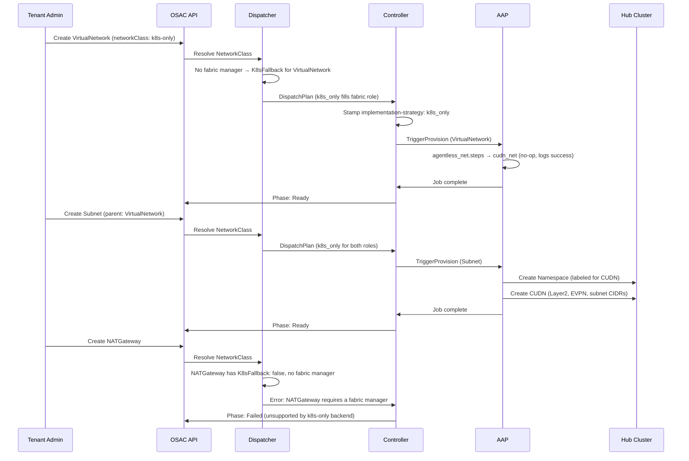

# K8s Manager — K8s-Only

## Summary

This design describes how the k8s-only K8s manager implements OSAC's networking
manager contract using only Kubernetes-native resources — CUDNs, NetworkPolicies,
and MetalLB — without requiring an external fabric controller. It also documents
the manager contract itself: the interface, lifecycle guarantees, and dispatch
rules that every OSAC networking manager must fulfill. See [PRD](prd.md) for full
requirements.

## Motivation

OSAC's networking architecture assumes a two-manager model: a fabric manager for
physical networking and a K8s manager for bridging the Kubernetes OVN overlay to
the fabric. Not every deployment has a physical fabric controller. Sites with
only KubeVirt VMs on a single hub cluster need tenant networking without the
operational cost of deploying and maintaining a Netris controller or equivalent.

The k8s-only backend fills this role by using the dispatcher's K8sFallback
mechanism: when no fabric manager is configured on a NetworkClass, the K8s manager
handles both its own responsibilities and the fabric manager's responsibilities
for resource kinds that support fallback. This gives tenants a consistent
networking API regardless of backend, while limiting the scope to what
Kubernetes-native resources can provide.

The k8s-only backend is deployed and operational, but its implementation details,
contract fulfillment, and limitations have not been formally documented. This
design codifies the as-built architecture.

### Goals

- Document the OSAC networking manager contract: registration, dispatch,
  provisioning interface, lifecycle guarantees, and per-resource requirements
- Describe how the k8s-only backend fulfills each contract obligation using
  Kubernetes-native resources (CUDNs, NetworkPolicies, MetalLB)
- Define the K8sFallback mechanism and its boundaries — which resource kinds
  the k8s-only backend can handle in the fabric role and which it cannot
- Establish the supported and unsupported operation set with concrete rejection
  behavior

### Non-Goals

- Defining a new manager interface or changing the existing contract — this
  design documents what exists
- NATGateway support — the k8s-only backend does not and will not provide SNAT
- Bare-metal networking — physical switch configuration requires a fabric manager
- Multi-hub CUDN coordination
- IPv6 or dual-stack

## Proposal

### The Manager Contract

Every OSAC networking manager — fabric or K8s — must satisfy a common contract
enforced by the operator's dispatcher and provisioning framework.

#### Registration

Each manager registers as a labeled ConfigMap in the operator namespace:

| Manager Type | Label |
|---|---|
| Fabric Manager | `osac.openshift.io/network-fabric-manager: "true"` |
| K8s Manager | `osac.openshift.io/network-k8s-manager: "true"` |

Required `data` fields:

| Field | Description | Example |
|---|---|---|
| `name` | Unique identifier within the manager type | `k8s_only` |
| `description` | Human-readable description | `K8s-only networking` |
| `capabilities` | Comma-separated: `ipv4`, `ipv6`, `dualStack`, `dpuSupport` | `ipv4` |

Validation rules:
- `capabilities` must be non-empty and contain only recognized values
- `dualStack` implies both `ipv4` and `ipv6`
- Duplicate `name` within a manager type is rejected

The `NetworkClassCapabilitiesReconciler` watches manager ConfigMaps and computes
each NetworkClass's effective capabilities as the **intersection** of its fabric
manager and K8s manager capabilities, then writes them to the fulfillment service.

#### Dispatch

The `Dispatcher` resolves a `NetworkClass` to its managers and builds a
`DispatchPlan`. The dispatch table defines which manager role(s) handle each
resource kind:

| Resource Kind | Role(s) | K8sFallback |
|---|---|---|
| VirtualNetwork | Fabric | Yes |
| Subnet | Fabric + K8s | Yes |
| SecurityGroup | Fabric | Yes |
| ExternalIP | Fabric | Yes |
| ExternalIPPool | Fabric | Yes |
| ExternalIPAttachment | Fabric | Yes |
| NATGateway | Fabric | **No** |

When a resource kind has `K8sFallback: true` and no fabric manager is configured,
the dispatcher assigns the fabric role to the K8s manager. This is how the
k8s-only deployment works — the K8s manager fills both roles.

When a resource kind has `K8sFallback: false` (NATGateway) and no fabric manager
is configured, the dispatcher returns an error. The controller surfaces this as a
status condition on the resource.

The controller stamps the selected manager name onto the resource via annotations:
- `osac.openshift.io/implementation-strategy` — fabric manager name (or K8s
  manager name when filling via fallback)
- `osac.openshift.io/k8s-implementation-strategy` — K8s manager name (Subnet
  only, when both roles are active)

#### Provisioning Interface

Every manager implementation exposes Ansible roles callable via AAP that
implement the `ProvisioningProvider` interface:

```go
type ProvisioningProvider interface {
    TriggerProvision(ctx context.Context, resource client.Object) (*ProvisionResult, error)
    GetProvisionStatus(ctx context.Context, resource client.Object, jobID string) (ProvisionStatus, error)
    TriggerDeprovision(ctx context.Context, resource client.Object, provisionJobs []JobStatus) (*DeprovisionResult, error)
    GetDeprovisionStatus(ctx context.Context, resource client.Object, jobID string) (ProvisionStatus, error)
    Name() string
}
```

The operator does not call manager implementations directly. Instead:
1. The controller stamps the implementation-strategy annotation
2. The provisioning provider (AAP) serializes the resource and routes to the
   correct Ansible role based on the annotation value
3. The Ansible role performs the actual infrastructure work
4. The operator polls for job completion and updates the resource status

#### Lifecycle Guarantees

Every manager must satisfy these lifecycle properties:

- **Idempotency**: Provisioning a resource that already exists must not create
  duplicates. Deprovisioning a resource that does not exist must succeed.
- **Phase-based status**: Resources transition through: `Progressing → Ready →
  Failed → Deleting`. The manager must report the correct phase.
- **DesiredConfigVersion**: A hash of the resource spec. The operator uses this
  to detect spec changes and trigger re-provisioning. The manager sees the
  current spec and must converge to it.
- **ProvisioningJobs**: The operator tracks job history (bounded by
  `MaxJobHistory`). Each provision/deprovision attempt is recorded.
- **Conditions**: Standard Kubernetes conditions for detailed status. The manager
  must report actionable error messages when operations fail.

#### Per-Resource Contract

Each resource kind imposes specific requirements on the manager:

**VirtualNetwork**: Create a logical L3 routing domain. Report
`status.backendNetworkId`. Immutable fields: `spec.region`,
`spec.ipv4Cidr`, `spec.networkClass`. Deletion blocked while child Subnets,
SecurityGroups, or NATGateways exist (matched by
`osac.openshift.io/virtualnetwork-uuid` label).

**Subnet**: Create an L2 segment within the parent VirtualNetwork. Configure
gateway IP (first usable), DHCP range. Immutable fields: `spec.virtualNetwork`
(parent VN UUID), `spec.ipv4Cidr`. Deletion blocked while child
ComputeInstances or BareMetalInstances are attached. Only resource dispatched
to both Fabric and K8s roles simultaneously.

**SecurityGroup**: Create firewall/ACL rules enforcing the specified
ingress/egress policy on the parent VirtualNetwork. Mutable: rules can be
updated, triggering re-provisioning via config version change. Immutable field:
`spec.virtualNetwork`.

**ExternalIPPool**: Create the IP address pool for allocation. Immutable fields:
`spec.cidrs` (exactly 1 canonical IPv4 CIDR), `spec.ipFamily` (only `IPv4`),
`spec.implementationStrategy`. Deletion blocked while child ExternalIPs exist.
Report `status.total`, `status.allocated`, `status.available`.

**ExternalIP**: Allocate an IP from the pool. Write the allocated address to
`osac.openshift.io/allocated-address` annotation. Report `status.address`,
`status.state` (Pending/Allocated/Failed), `status.attached`. Immutable field:
`spec.pool`.

**ExternalIPAttachment**: Create DNAT/LB rule routing external IP to target.
Entire spec is immutable after creation. Exactly one target: `computeInstance`,
`cluster`, or `baremetalInstance`. `targetEndpoint` (API/Ingress) required for
clusters.

**NATGateway**: Create SNAT rule routing VirtualNetwork egress through the
specified ExternalIP. Entire spec is immutable. **K8sFallback: false** — not
available without a fabric manager.

### Workflow Description

The following sequence shows the lifecycle of a tenant creating networking
resources on a k8s-only deployment:



The rejection path for NATGateway is visible in the last sequence: the dispatcher
refuses to build a DispatchPlan because NATGateway has `K8sFallback: false` and
no fabric manager is configured.

### API Extensions

The k8s-only backend introduces no new CRDs or API changes. It operates within
the existing OSAC networking API (VirtualNetwork, Subnet, SecurityGroup,
ExternalIP, ExternalIPPool, ExternalIPAttachment, NATGateway) defined by the
unified networking work (OSAC-1433).

The backend registers itself via ConfigMap:

```yaml
apiVersion: v1
kind: ConfigMap
metadata:
  name: k8s-only-manager
  namespace: osac-operator-system
  labels:
    osac.openshift.io/network-k8s-manager: "true"
data:
  name: k8s_only
  description: "K8s-only networking — no external fabric controller required"
  capabilities: "ipv4"
```

The backend creates the following Kubernetes resources on the hub cluster as
side effects of provisioning OSAC networking resources:

| OSAC Resource | K8s Resources Created |
|---|---|
| VirtualNetwork | (none — logical grouping) |
| Subnet | Namespace, ClusterUserDefinedNetwork |
| SecurityGroup | NetworkPolicy |
| ExternalIPPool | MetalLB IPAddressPool, L2Advertisement |
| ExternalIP | Service (type: LoadBalancer) in metallb-system |
| ExternalIPAttachment | Service (type: LoadBalancer) in VM namespace |

## Implementation Details/Notes/Constraints

### Ansible Role Architecture

The k8s-only backend uses the `agentless_net` / `agentless_net.steps` Ansible
roles, which delegate to composable sub-roles based on resource kind:

```
agentless_net.steps
├── cudn_net            # VirtualNetwork, Subnet, SecurityGroup
│   ├── create_virtual_network.yaml   # no-op (logs success)
│   ├── delete_virtual_network.yaml   # no-op
│   ├── create_subnet.yaml            # → Namespace + CUDN
│   ├── delete_subnet.yaml            # → delete CUDN + Namespace
│   ├── create_security_group.yaml    # → network_policy role
│   └── delete_security_group.yaml    # → delete NetworkPolicy
└── metallb_l2          # ExternalIPPool, ExternalIP, ExternalIPAttachment
    ├── create_external_ip_pool.yaml  # → IPAddressPool + L2Advertisement
    ├── delete_external_ip_pool.yaml
    ├── allocate_external_ip.yaml     # → parking LB Service
    ├── release_external_ip.yaml
    ├── attach_external_ip.yaml       # → LB Service in VM namespace
    └── detach_external_ip.yaml       # → reverse attach
```

### VirtualNetwork — No-Op

Unlike the Netris backend (which creates a VPC/VRF), the k8s-only backend treats
VirtualNetwork as a logical grouping with no infrastructure. The Ansible role
logs success and returns immediately. L3 routing isolation between
VirtualNetworks is provided by the CUDN/EVPN layer at the Subnet level.

### Subnet — CUDN with EVPN

Subnet provisioning creates two Kubernetes resources:

**1. Namespace** with the label
`k8s.ovn.org/primary-user-defined-network: ""` and a label matching the
subnet's ID for CUDN namespace selection:

```yaml
apiVersion: v1
kind: Namespace
metadata:
  name: osac-subnet-<subnet-uuid>
  labels:
    k8s.ovn.org/primary-user-defined-network: ""
    osac.openshift.io/subnet-id: "<subnet-uuid>"
```

**2. ClusterUserDefinedNetwork (CUDN)** with Layer2 topology and EVPN backend:

```yaml
apiVersion: k8s.ovn.org/v1
kind: ClusterUserDefinedNetwork
metadata:
  name: osac-subnet-<subnet-uuid>
spec:
  namespaceSelector:
    matchLabels:
      osac.openshift.io/subnet-id: "<subnet-uuid>"
  network:
    topology: Layer2
    layer2:
      role: Primary
      subnets:
        - "<subnet-ipv4-cidr>"
```

OVN-Kubernetes creates the underlying OVN logical switch with EVPN VNI
assignment, providing L2 isolation between CUDNs. VMs attached to the same CUDN
communicate at L2. L3 routing between CUDNs of the same VirtualNetwork is
handled by OVN's distributed router.

Subnet deletion reverses the process: delete the CUDN, then delete the namespace.

### SecurityGroup — NetworkPolicy

SecurityGroup rules are translated into Kubernetes NetworkPolicy resources in the
subnet's namespace. The `osac.templates.network_policy` role maps OSAC's
ingress/egress rule model (sourceCidr, destinationCidr, protocol, port range)
to NetworkPolicy `ingress` and `egress` rules.

This is a semantic difference from the Netris backend, which uses Netris ACL
rules. NetworkPolicy enforcement depends on the CNI (OVN-Kubernetes in this case)
and may differ in rule evaluation order, stateful tracking, and default behavior.

### ExternalIPPool — MetalLB IPAddressPool

ExternalIPPool creates a MetalLB IPAddressPool and L2Advertisement:

```yaml
apiVersion: metallb.io/v1beta1
kind: IPAddressPool
metadata:
  name: osac-pool-<pool-uuid>
  namespace: metallb-system
spec:
  addresses:
    - "<cidr-from-spec>"
  autoAssign: false
  avoidBuggyIPs: true
---
apiVersion: metallb.io/v1beta1
kind: L2Advertisement
metadata:
  name: osac-pool-<pool-uuid>
  namespace: metallb-system
spec:
  ipAddressPools:
    - osac-pool-<pool-uuid>
```

`autoAssign: false` prevents MetalLB from assigning IPs to arbitrary Services —
only OSAC-managed Services get IPs from this pool. `avoidBuggyIPs: true` skips
.0 and .255 addresses.

### ExternalIP — Parking Service Pattern

ExternalIP allocation uses a "parking" Service pattern:

1. Create a Service of type `LoadBalancer` in `metallb-system` with:
   - No selector (does not route traffic)
   - `metallb.universe.tf/address-pool` annotation pointing to the pool
   - `spec.loadBalancerIP` left empty (MetalLB assigns from pool)
2. Wait for MetalLB to assign an IP (poll `status.loadBalancer.ingress`)
3. Write the allocated address to the `osac.openshift.io/allocated-address`
   annotation on the ExternalIP CR

The parking Service reserves the IP in MetalLB's allocation table without routing
any traffic. This IP is later migrated to a target namespace when an
ExternalIPAttachment is created.

### ExternalIPAttachment — IP Migration to VM Namespace

When attaching an ExternalIP to a ComputeInstance:

1. Delete the parking Service in `metallb-system`
2. Create a new Service of type `LoadBalancer` in the VM's namespace with:
   - `spec.loadBalancerIP` set to the allocated address
   - Selector targeting the KubeVirt VM pod
   - `metallb.universe.tf/address-pool` annotation

This effectively migrates the IP from the parking namespace to the VM namespace.
The OVN-K EndpointSlice workaround is applied: the role ensures the
EndpointSlice for the Service correctly references the VM pod's IP, working around
a known OVN-Kubernetes issue where EndpointSlices for KubeVirt VMs may not
populate correctly.

Detaching reverses the process: delete the LB Service in the VM namespace,
recreate the parking Service in `metallb-system`.

**Limitation**: ExternalIPAttachment only supports `spec.computeInstance` targets.
`spec.cluster` and `spec.baremetalInstance` targets are not implemented in the
k8s-only backend. Attempting to attach to a cluster or bare-metal instance will
fail during the Ansible role execution.

### NATGateway — Rejected at Dispatch

NATGateway is the only resource kind with `K8sFallback: false`. When a tenant
creates a NATGateway on a k8s-only NetworkClass:

1. The controller resolves the NetworkClass via the dispatcher
2. The dispatcher finds no fabric manager and checks K8sFallback for NATGateway
3. K8sFallback is false — the dispatcher returns an error
4. The controller sets the NATGateway's status phase to `Failed` with a condition
   message indicating NATGateway requires a fabric manager

No provisioning job is created. The rejection is deterministic and immediate.

### Subnet CIDR Allocation

The k8s-only backend allocates subnet CIDRs from a provider-configurable pool
(default `10.0.0.0/8`). The CIDR allocator:
- Tracks allocated CIDRs to prevent overlaps
- Assigns the next available CIDR of the requested size
- Releases CIDRs when subnets are deleted

CIDRs are immutable after creation — the CRD's CEL validation rule
`self == oldSelf` prevents modification.

### Security Considerations

The k8s-only backend inherits the existing OSAC security model:

- **Credential management**: No external credentials are required (unlike Netris,
  which requires controller credentials). MetalLB and OVN-Kubernetes are
  cluster-local services that use Kubernetes RBAC.
- **Tenant isolation**: CUDNs with EVPN provide L2/L3 isolation. VMs in
  different VirtualNetworks cannot reach each other's private addresses, even
  with overlapping CIDRs. OVN-Kubernetes enforces this at the OVS datapath level.
- **Input validation**: CRD CEL validation rejects invalid CIDRs, non-canonical
  formats, and IPv6 addresses. The operator validates parent-child relationships
  (Subnet within VirtualNetwork CIDR range).

### Failure Handling and Recovery

| Failure Mode | Behavior | Recovery |
|---|---|---|
| CUDN creation fails (OVN-K issue) | Subnet status: Failed, condition message names the CUDN and K8s error | Operator retries on next reconciliation; CUDN creation is idempotent |
| Namespace creation fails | Subnet status: Failed | Operator retries; namespace creation is idempotent |
| MetalLB IPAddressPool fails | ExternalIPPool status: Failed | Operator retries; pool creation is idempotent |
| MetalLB IP exhaustion | ExternalIP status: Failed, condition: pool exhausted | Cloud Infrastructure Admin provisions additional IP space |
| Parking Service never gets IP | ExternalIP status: Progressing (stuck) | Timeout triggers Failed status; admin investigates MetalLB |
| OVN-K EndpointSlice workaround fails | ExternalIPAttachment status: Failed | Operator retries; workaround is idempotent |
| NATGateway on k8s-only | NATGateway status: Failed, message: requires fabric manager | No recovery — NATGateway is unsupported |
| AAP unreachable | Resource status: Progressing (stuck) | Operator retries with backoff; recovers when AAP is available |

All provisioning and deprovisioning operations are idempotent. Re-reconciling a
resource that already has its backing Kubernetes resources does not create
duplicates.

### RBAC / Tenancy

No RBAC or tenancy changes from the unified networking model. Tenant isolation
is enforced by:

- CUDN namespace selectors — each CUDN targets only its own namespace
- OVN-Kubernetes EVPN — provides datapath isolation between CUDNs
- `osac.openshift.io/tenant` and `osac.openshift.io/owner-reference` annotations
  on networking resources
- Operator RBAC: the operator's service account requires permissions to create
  Namespaces, CUDNs, NetworkPolicies, MetalLB IPAddressPools, L2Advertisements,
  and Services in `metallb-system` and VM namespaces

### Observability and Monitoring

No new observability changes beyond the standard OSAC networking monitoring. The
k8s-only backend surfaces operational state through:

- Resource status phases and conditions (standard across all backends)
- Provisioning job tracking via the `ProvisioningJobs` array
- AAP job logs for Ansible role execution details
- Kubernetes events on CUDNs, NetworkPolicies, and MetalLB resources

## Risks and Mitigations

### CUDN API stability

The CUDN API (`k8s.ovn.org/v1 ClusterUserDefinedNetwork`) is an OVN-Kubernetes
feature. If the API changes in a future OVN-K release, the Ansible roles must be
updated. Mitigated by tracking upstream OVN-K releases and testing against each
new version.

### NetworkPolicy vs ACL semantic differences

SecurityGroup translation to NetworkPolicy may produce different enforcement
behavior than Netris ACL translation. Tenants moving workloads between
k8s-only and Netris-backed deployments may observe behavioral differences in
firewall rule evaluation. Mitigated by documenting the difference and
standardizing the SecurityGroup enforcement model in a separate enhancement.

### MetalLB L2 scalability

MetalLB L2 mode uses ARP/NDP to announce IPs. Large numbers of ExternalIPs may
cause ARP table pressure on the L2 segment. Mitigated by the fact that
ExternalIPPools have bounded CIDR ranges and `avoidBuggyIPs: true` reduces the
usable IP count slightly.

### ExternalIPAttachment target limitations

The k8s-only backend only supports `spec.computeInstance` targets for
ExternalIPAttachment. Cluster and bare-metal targets are not implemented.
Tenants attempting these will see a provisioning failure rather than an
upfront API rejection. Mitigated by documenting the limitation and potentially
adding admission validation in a future enhancement.

## Drawbacks

The k8s-only backend provides a reduced feature set compared to fabric-backed
backends:

- No NATGateway — tenants lose managed outbound NAT with stable source IPs
- No bare-metal networking — physical switch configuration requires a fabric
  manager
- ExternalIPAttachment limited to VMs — no cluster-level external access
- NetworkPolicy enforcement may differ from Netris ACL enforcement

These limitations are inherent to operating without an external fabric controller.
The trade-off is reduced operational complexity (no Netris controller to deploy
and maintain) at the cost of reduced networking capability.

## Alternatives (Not Implemented)

### Direct OVN-K integration (no AAP)

The operator could create CUDNs and MetalLB resources directly via Kubernetes
API calls, bypassing AAP and Ansible roles. This would reduce latency and
eliminate the AAP dependency. Rejected because the OSAC provisioning framework
is built around AAP as the execution engine, and all other managers use the same
pattern. Bypassing AAP for one manager would create a second provisioning path
with different failure modes, monitoring, and debugging characteristics.

### Calico/Cilium-based isolation

Instead of OVN-Kubernetes CUDNs with EVPN, tenant isolation could be implemented
using Calico or Cilium network policies and VXLAN overlays. Rejected because OSAC
deploys on OpenShift, which uses OVN-Kubernetes as the default CNI. CUDNs with
EVPN are the native isolation mechanism, reducing the dependency surface.

### NATGateway via OVN logical router SNAT

OVN supports SNAT on logical routers. The k8s-only backend could configure OVN
SNAT rules directly to provide NATGateway support. Rejected because this would
require direct OVN northbound DB access, bypassing the OVN-Kubernetes abstraction
layer. This is fragile, unsupported by OVN-K, and could conflict with OVN-K's own
NAT management.

## Open Questions

### OQ-1: Should ExternalIPAttachment for cluster targets be supported in k8s-only?

- **Owner:** Connectivity & Fabric team
- **Impact:** If supported, the `metallb_l2` role needs to handle cluster-level
  L4LB configuration. If not, an admission webhook should reject the attempt
  upfront rather than failing during provisioning.

### OQ-2: Should the k8s-only backend report capabilities that exclude NATGateway?

- **Owner:** Connectivity & Fabric team
- **Impact:** Currently, capabilities are declared as `ipv4`. There is no
  per-resource-kind capability advertisement. If the fulfillment service or UI
  could surface "NATGateway not available on this NetworkClass," it would prevent
  tenants from attempting unsupported operations. This may require extending the
  capability model.

## Test Plan

### Unit Tests

- Dispatcher correctly applies K8sFallback when no fabric manager is configured
- Dispatcher rejects NATGateway dispatch when K8sFallback is false
- CIDR allocator assigns non-overlapping CIDRs and releases them on delete
- Capability intersection computes correctly with k8s-only (no fabric) manager
- ConfigMap registration rejects duplicate names and invalid capabilities

### Integration Tests

- Creating a VirtualNetwork on a k8s-only NetworkClass transitions to Ready
  (no-op backend)
- Creating a Subnet creates a Namespace and CUDN on the hub cluster; CUDN has
  correct Layer2 topology and subnet CIDRs
- Deleting a Subnet deletes the CUDN and Namespace
- Deleting a VirtualNetwork is blocked while child Subnets exist
- Creating a SecurityGroup creates a NetworkPolicy in the subnet namespace
- Creating an ExternalIPPool creates a MetalLB IPAddressPool and L2Advertisement
- Creating an ExternalIP creates a parking Service and allocates an IP
- Creating an ExternalIPAttachment migrates the IP from parking to VM namespace
- Creating a NATGateway on k8s-only transitions to Failed with correct error
- Mutating immutable fields (CIDR, NetworkClass, region) is rejected by CRD
  validation

### E2E Tests

- Tenant creates a VirtualNetwork and two Subnets; VMs on the same Subnet
  communicate at L2; VMs on different Subnets communicate at L3
- VMs on different VirtualNetworks cannot reach each other's private addresses,
  even with overlapping CIDRs
- Tenant creates an ExternalIPPool, allocates an ExternalIP, and attaches it to
  a VM; inbound traffic reaches the VM
- Tenant attempts NATGateway creation on k8s-only NetworkClass; receives API
  error naming the unsupported resource kind and backend
- Tenant creates a SecurityGroup with ingress/egress rules; traffic is filtered
  according to the rules
- Full lifecycle: create VN → create Subnet → attach VM → verify connectivity →
  detach VM → delete Subnet → delete VN — no orphaned Kubernetes resources remain
