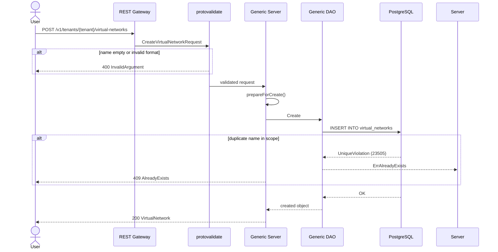

# Enforce Mandatory, Unique, and Immutable Resource Names

## Summary

This design enforces naming discipline across all OSAC resources through three layers: proto validation (mandatory names, RFC 1123 format), PostgreSQL unique indexes (uniqueness within scope boundaries), and PostgreSQL immutability triggers (name cannot change after creation). The changes are concentrated in the proto `Metadata` message and a single database migration — no server or DAO code changes are required for core enforcement. See [PRD](prd.md) for detailed requirements.

## Motivation

The fulfillment-service stores all resources through a generic DAO layer backed by PostgreSQL. Each resource table includes a `name` column, but the column allows empty strings (default `''`), the proto `Metadata.name` field permits empty strings via an optional regex pattern, and most tables lack uniqueness constraints on the name column. Of 35 resource tables, only 9 enforce any form of name uniqueness, and only 8 include `name` in their immutability triggers.

Resources can be created without names, multiple resources of the same type can share a name within the same tenant and project, and names can be changed after creation. These gaps prevent using names as stable identifiers in automation, auditing, and cross-resource references.

The existing infrastructure already supports all three enforcement mechanisms. The `buf.validate` interceptor validates Create requests against proto field constraints. A reusable `check_immutable_columns()` PostgreSQL trigger function (migration 46) is deployed and active on all resource tables for `id`, `tenant`, and `project` columns. The DAO layer already translates `UniqueViolation` → `ErrAlreadyExists` and SQLSTATE `Z0001` → `ErrImmutable`, and the server translates these to gRPC `AlreadyExists` and `InvalidArgument` status codes respectively. [Codebase: fulfillment-service/internal/database/dao/dao_errors.go]

This design adds `name` to the existing enforcement mechanisms rather than building new ones.

### Goals

- Reuse the existing `check_immutable_columns()` trigger infrastructure — add `name` to trigger arguments on all tables that lack it, following the dynamic migration pattern from migration 69. [Codebase: fulfillment-service/internal/database/migrations/69_add_project_column.up.sql]
- Apply scope-specific uniqueness indexes matching each resource's uniqueness boundary: `UNIQUE(name)` for globally unique resources, `UNIQUE(tenant, name)` for tenant-scoped resources without project scoping, and `UNIQUE(tenant, project, name)` for project-scoped resources. Platform-scoped resources achieve effective global uniqueness through the project-scoped index because they store `tenant = "shared"` and `project = ""`. [Codebase: fulfillment-service/internal/auth/tenancy_logic.go]
- Require no changes to the generic server or DAO layer for core enforcement — proto validation handles mandatory names, database constraints handle uniqueness and immutability.
- Produce Kubernetes-style error messages that name the resource type. [Locked: D4]

### Non-Goals

- Data migration for existing resources with name violations — tracked as a separate feature. [Locked: D9]
- UI enforcement of name validation — deferred beyond 0.2. [Locked: D5]
- Display name (human-readable, mutable label) — separate feature. [Locked: D10]
- Resource-type-specific naming rules beyond RFC 1123 DNS labels.
- Relaxing the projects table PK from `(tenant, name)` to `(tenant, project, name)` to allow nested sibling projects to share names — the current PK is stricter than required and acceptable for 0.2.

## Proposal

Three enforcement layers implement the naming requirements:

All resource tables are in scope — tenant-scoped, platform-scoped, and dual-scope. [Locked: D1]

1. **Proto validation** makes names mandatory and format-compliant. The `Metadata.name` field regex is updated to disallow empty strings, and `min_len: 1` is added. The existing protovalidate interceptor enforces this on Create; the server validates the merged object on Update. [Locked: D3, D8]

2. **Database uniqueness indexes** prevent duplicate names within scope boundaries. Each resource table receives a uniqueness index matching its scope: `UNIQUE(name)` for globally unique resources (`roles`, `role_bindings`), `UNIQUE(tenant, name)` for tenant-scoped resources without project scoping (`users`, `identity_providers`), and `UNIQUE(tenant, project, name)` for all other resource tables. Platform-scoped resources (`tenant = "shared"`, `project = ""`) achieve effective global uniqueness through the project-scoped index. Indexes cover all rows including soft-deleted, blocking name reuse during pending deletion. [Locked: D2, D7]

3. **Database immutability triggers** prevent name changes after creation. The existing `check_immutable_columns()` function is active on all tables — `name` is added to the trigger arguments on tables that lack it. [Locked: D6]

### Workflow Description

#### Creating a Resource



The Create flow is identical for all resource types. Platform-scoped resources follow the same path — the generic server sets `tenant = "shared"` via the default tenancy logic when the caller has universal tenant access. [Codebase: fulfillment-service/internal/auth/default_tenancy_logic.go]

#### Updating a Resource (Name Change Rejected)

When an update request includes a name different from the stored value:

1. Server fetches current object, merges the field mask, validates the merged result (format validation passes).
2. DAO executes `UPDATE ... SET name = 'new-name' ...`.
3. The `check_immutable_columns` trigger detects the name change, raises SQLSTATE `Z0001` with the changed column name in the detail field.
4. DAO translates to `ErrImmutable{Fields: ["metadata.name"]}`.
5. Server returns `400 InvalidArgument: field 'metadata.name' is immutable`. [Locked: D6]

The same mechanism already enforces immutability for `tenant` and `project`. [Codebase: fulfillment-service/internal/database/dao/generic_dao_update.go]

#### Concurrent Creation (Race Condition)

When two concurrent requests create resources with the same name in the same scope:

1. Both pass proto validation (valid format, non-empty).
2. Both reach the DAO INSERT.
3. The database unique index ensures at most one INSERT succeeds. The other receives `UniqueViolation`.
4. The losing request gets `409 AlreadyExists`. [Locked: D7]

#### Duplicate Name During Pending Deletion

A resource that has been soft-deleted (has a `deletion_timestamp`) but not yet archived (finalizers remain) holds its name. The uniqueness index covers all rows — not just active ones — so creating a new resource with the same name in the same scope returns `409 AlreadyExists`. The error message does not distinguish between active and pending-deletion resources. [Locked: D4]

### API Extensions

This feature modifies the shared `Metadata` protobuf message. No new services, CRDs, webhooks, or finalizers are introduced.

**Modified proto messages:**
- `osac.public.v1.Metadata` — `name` field: add `min_len: 1`, update regex to disallow empty
- `osac.private.v1.Metadata` — mirror the same changes

**Behavioral changes to existing resources:**
- All `Create*` RPCs reject requests with missing or invalid names (previously accepted empty)
- All `Update*` RPCs reject name changes via database trigger (some tables already enforced this; now all do)
- All `Create*` RPCs reject duplicate names within scope boundaries (most resources previously accepted duplicates)

## UX Alignment

UI enforcement is deferred beyond 0.2 [Locked: D5]. The `Metadata` message is shared infrastructure — no resource-specific `@temp-api` file exists for it. The proto changes (mandatory name, updated regex) will be surfaced to the UI via generated types when `pnpm gen-types` is run, enabling future UI validation without further backend changes.

### Implementation Details/Notes/Constraints

#### 1. Proto Changes

Update `Metadata.name` in both public and private proto files:

```protobuf
// Current definition (allows empty string):
string name = 4 [(buf.validate.field).string = {
  max_len: 63,
  pattern: "^([a-z0-9]([a-z0-9-]{0,61}[a-z0-9])?)?$"
}];

// Updated definition (mandatory, non-empty):
string name = 4 [(buf.validate.field).string = {
  min_len: 1,
  max_len: 63,
  pattern: "^[a-z0-9]([a-z0-9-]{0,61}[a-z0-9])?$"
}];
```

Changes:
- `min_len: 1` added — empty string rejected
- Outer `()?` removed from regex — disallows empty matches while still permitting single-character names (the inner group remains optional for names like `"a"`)
- Proto comment updated to: "Mandatory, immutable, and unique within scope. Must be a valid RFC 1123 DNS label."

Files: `fulfillment-service/proto/public/osac/public/v1/metadata_type.proto`, `fulfillment-service/proto/private/osac/private/v1/metadata_type.proto`. Run `buf lint && buf generate` after changes.

#### 2. Database Migration

A single dynamic migration adds name enforcement to all resource tables. It enumerates tables at runtime and applies changes based on current state, following the pattern from migration 69.

**Table inventory and actions:**

Tables already compliant (no changes):

| Table | Current enforcement | Why compliant |
|-------|-------------------|---------------|
| `tenants` | PK on `(name)`, trigger includes `name` | Globally unique, immutable |
| `projects` | PK on `(tenant, name)`, trigger includes `name` | Unique within tenant, immutable |
| `storage_backends` | `UNIQUE(name)` globally, trigger includes `name` | Globally unique, immutable |
| `storage_tiers` | `UNIQUE(name)` globally, trigger includes `name` | Globally unique, immutable |
| `identity_providers` | `UNIQUE(tenant, name)`, trigger includes `name` | Unique within tenant, immutable |

Tables requiring index replacement (existing partial index must become full):

| Table | Current index | Action |
|-------|--------------|--------|
| `cluster_catalog_items` | `UNIQUE(name, tenant) WHERE deletion_timestamp = 'epoch' AND name != ''` | Drop, create `UNIQUE(tenant, project, name)` |
| `compute_instance_catalog_items` | `UNIQUE(name, tenant) WHERE deletion_timestamp = 'epoch' AND name != ''` | Drop, create `UNIQUE(tenant, project, name)` |
| `cluster_versions` | `UNIQUE(name, tenant, project) WHERE deletion_timestamp = 'epoch'` | Drop, create `UNIQUE(tenant, project, name)` |

Partial indexes (with `WHERE` clauses) are replaced with full indexes because name reuse must be blocked during pending deletion. [Locked: D4]

Tables requiring new `UNIQUE(name)` index (globally unique):

| Table | Rationale |
|-------|-----------|
| `roles` | Role names are globally unique — roles can exist in any tenant but names must not collide across tenants |
| `role_bindings` | Role binding names are globally unique |

Tables requiring new `UNIQUE(tenant, name)` index (tenant unique):

| Table | Rationale |
|-------|-----------|
| `users` | User names are unique within a tenant, not project-scoped |

Tables requiring new `UNIQUE(tenant, project, name)` index and trigger update (~24 tables):

All remaining resource tables need both a new `UNIQUE(tenant, project, name)` index and `name` added to their `check_immutable_columns` trigger. Two tables (`instance_types`, `objects`) already have `name` in their trigger and need only the index.

The full list: `bare_metal_instances`, `bare_metal_instance_catalog_items`, `bare_metal_instance_templates`, `clusters`, `cluster_templates`, `compute_instances`, `compute_instance_templates`, `external_ip_attachments`, `external_ip_pools`, `external_ips`, `host_types`, `hubs`, `instance_types`, `nat_gateways`, `network_classes`, `objects`, `project_memberships`, `public_ip_attachments`, `public_ip_pools`, `public_ips`, `secrets`, `security_groups`, `subnets`, `virtual_networks`.

**Scope-specific index rationale:**

Not all resource types share the same uniqueness boundary. Three patterns are needed:

- **`UNIQUE(name)`** — for `roles` and `role_bindings`, which are globally unique. Roles can be created with any tenant value (admin-created roles use `tenant = "shared"`, tenant-created roles use the real tenant), so a tenant-scoped index would incorrectly allow name collisions across tenants.
- **`UNIQUE(tenant, name)`** — for `users` and `identity_providers`, which are unique within a tenant but not project-scoped. Identity providers explicitly reject `"shared"` and `"system"` tenants and are always associated with a real tenant. [Codebase: fulfillment-service/internal/servers/private_identity_providers_server.go]
- **`UNIQUE(tenant, project, name)`** — for all other resource tables. Platform-scoped resources store `tenant = "shared"` and `project = ""`, so this index degrades to effective global uniqueness. For dual-scope resources like `PublicIPPool`, tenant-scoped and platform-scoped instances occupy separate index partitions. [Codebase: fulfillment-service/internal/auth/default_tenancy_logic.go]

**Migration structure:**

The migration uses a `DO $$ ... $$` block that:

1. Queries `information_schema.columns` for all tables with a `name` column in the `public` schema, excluding non-resource tables (`schema_migrations`, `notifications`, `tenant_domains`, `project_membership_subjects`, `storage_tier_backends`) and already-compliant tables (`tenants`, `projects`, `storage_backends`, `storage_tiers`, `identity_providers`).

2. For each table, reads the current immutability trigger arguments from `pg_trigger`. If `name` is not in the arguments, drops and recreates the trigger with `name` appended.

3. Drops any existing unique index that includes `name` (handles the index replacement cases).

4. Creates a scope-specific uniqueness index based on the table:
   - `roles`, `role_bindings` → `UNIQUE INDEX idx_{table}_unique_name ON {table} (name)`
   - `users` → `UNIQUE INDEX idx_{table}_unique_name ON {table} (tenant, name)`
   - All other tables → `UNIQUE INDEX idx_{table}_unique_name ON {table} (tenant, project, name)`

The down migration reverses these changes: drops the `idx_{table}_unique_name` indexes, and recreates immutability triggers without `name` in the arguments for tables that had it added. Tables that originally had `name` in their triggers (e.g., `instance_types`) are restored to their original state.

**Prerequisite — data cleanup migration:** Existing data must not violate the new constraints. If any table has rows with empty names or duplicate name tuples, the uniqueness migration fails. A prerequisite data cleanup migration backfills empty names with generated values (e.g., `{resource-type}-{id-prefix}`) and deduplicates collisions by appending suffixes. This cleanup migration runs before the uniqueness/immutability migration in the same upgrade sequence. D9 ("data migration for existing violations is out of scope") applies to ongoing data quality remediation, not to the minimum-viable cleanup required to unblock this feature's migration.

#### 3. Error Message Improvement

The current `ErrAlreadyExists.Error()` method uses resource-specific messages for `tenants` and `projects` tables but defaults to `"object"` for all others. A table-to-kind map is added to produce Kubernetes-style error messages that name the resource type:

```go
// fulfillment-service/internal/database/dao/dao_errors.go

var tableToKind = map[string]string{
    "clusters":                          "cluster order",
    "virtual_networks":                  "virtual network",
    "subnets":                           "subnet",
    "security_groups":                   "security group",
    "compute_instances":                 "compute instance",
    "public_ips":                        "public IP",
    "public_ip_pools":                   "public IP pool",
    "public_ip_attachments":             "public IP attachment",
    "external_ips":                      "external IP",
    "external_ip_pools":                 "external IP pool",
    "external_ip_attachments":           "external IP attachment",
    "network_classes":                   "network class",
    "nat_gateways":                      "NAT gateway",
    "bare_metal_instances":              "bare metal instance",
    "bare_metal_instance_templates":     "bare metal instance template",
    "bare_metal_instance_catalog_items": "bare metal instance catalog item",
    "cluster_catalog_items":             "cluster catalog item",
    "cluster_templates":                 "cluster template",
    "cluster_versions":                  "cluster version",
    "compute_instance_catalog_items":    "compute instance catalog item",
    "compute_instance_templates":        "compute instance template",
    "host_types":                        "host type",
    "hubs":                              "hub",
    "identity_providers":                "identity provider",
    "instance_types":                    "instance type",
    "roles":                             "role",
    "role_bindings":                     "role binding",
    "secrets":                           "secret",
    "users":                             "user",
}
```

The `Error()` method is updated to look up the table name in this map before falling back to `"object"`. Error format: `"virtual network 'prod-net' already exists"`. [Locked: D4]

#### 4. API Documentation

Update `fulfillment-service/docs/API.md` to reflect the new naming requirements:
- Change the `metadata.name` description from "Human-friendly name (DNS label rules, optional)" to "Mandatory, immutable, unique identifier (DNS label rules, required)"
- Document the error codes and messages for name validation failures: `InvalidArgument` for missing/invalid names, `AlreadyExists` for duplicate names, `InvalidArgument` for immutability violations
- Add examples of valid and invalid names

### Security Considerations

This feature inherits the existing security model without changes. Name validation and uniqueness enforcement are applied uniformly through the generic server and DAO layers, which already enforce tenant isolation via OPA policies and tenant annotation filtering.

Input validation is strengthened: the proto `min_len: 1` constraint and updated regex reject malformed names at the protovalidate interceptor layer, before reaching any business logic. The database uniqueness constraint provides a second enforcement layer against bypass. No new authentication or authorization surfaces are introduced.

### Failure Handling and Recovery

**Proto validation failure (missing or invalid name):** The protovalidate interceptor returns `InvalidArgument` before the request reaches the server handler. The request is not persisted. The user retries with a valid name.

**Uniqueness constraint violation (duplicate name):** The DAO translates the PostgreSQL `UniqueViolation` to `ErrAlreadyExists`. The server returns `AlreadyExists`. No partial state is created. The user chooses a different name and retries.

**Immutability trigger violation (name change on update):** The trigger raises SQLSTATE `Z0001`. The DAO translates to `ErrImmutable`. The server returns `InvalidArgument`. The update is rolled back entirely — the resource retains its original state.

**Migration failure (existing data violations):** The data cleanup migration runs first in the upgrade sequence, backfilling empty names and deduplicating collisions. If the cleanup migration itself fails (e.g., unexpected data patterns), the entire upgrade is rolled back. No partial enforcement is applied.

**Server restart during request processing:** All enforcement is transactional (database-level). A server crash mid-request leaves no partial state. The next server instance handles subsequent requests with the same enforcement.

### RBAC / Tenancy

No RBAC or tenancy changes are required. Name enforcement operates through the generic server and database layers, which are downstream of the existing OPA authorization policies. The `UNIQUE(tenant, project, name)` index inherently respects tenant isolation — resources in different tenants have independent name spaces. Platform-scoped resources (`tenant = "shared"`) share a single global namespace as required.

### Observability and Monitoring

No new observability changes. Existing monitoring mechanisms apply.

Name validation failures and uniqueness violations produce standard gRPC error responses that are already captured by existing metrics (request error rate by status code). No new metrics, events, or alerts are introduced.

### Risks and Mitigations

**Breaking change for existing clients:** Making `metadata.name` mandatory (adding `min_len: 1`) breaks existing clients that create resources without names. Mitigation: this is an intentional breaking change for 0.2 [Locked: D8]. Clients are notified through release notes.

**Migration failure on existing data:** Databases with empty-name or duplicate-name rows will fail the uniqueness migration. Mitigation: a prerequisite data cleanup migration (part of this feature) runs first in the upgrade sequence, backfilling empty names and deduplicating collisions. The migration's failure mode is safe — it rolls back completely and leaves the database unchanged.

**Performance impact of new indexes:** Adding `UNIQUE(tenant, project, name)` to ~27 tables increases index storage and slightly impacts INSERT/UPDATE performance. Mitigation: the index columns are small (text), the cardinality is low (resources per tenant/project), and the index also speeds up name-based lookups. The performance impact is negligible for OSAC's expected scale.

**Partial index replacement:** Replacing partial unique indexes (on catalog items and cluster versions) with full indexes may surface previously-hidden name collisions on soft-deleted rows. Mitigation: data cleanup addresses this. If the migration fails due to a collision involving soft-deleted rows, the data cleanup migration handles it.

### Drawbacks

The proto `min_len: 1` change is a wire-level breaking change — any existing client code that creates resources without names must be updated. This affects all resource types simultaneously because `Metadata` is shared.

Replacing partial unique indexes with full indexes is slightly more restrictive: it prevents name reuse even during the pending-deletion window (when a resource has been deleted but is awaiting finalizer removal). This is the intended behavior per the PRD, but it means users cannot immediately reuse a name after deleting a resource — they must wait for archival to complete.

Both trade-offs are justified by the PRD requirements and are necessary for naming discipline.

## Alternatives (Not Implemented)

### Application-Only Enforcement (No Database Constraints)

Enforce uniqueness and immutability entirely in the generic server via Go code checks (e.g., query-before-insert, compare-before-update).

**Pros:** No database migration needed. Easier to customize error messages.

**Cons:** Vulnerable to race conditions under concurrent requests — two Create requests could both pass the existence check and both succeed. Violates [Locked: D7] which requires database-level constraints for reliable uniqueness.

**Rejected because:** Race condition safety is a hard requirement. Application-only enforcement cannot guarantee at-most-one success under concurrency.

### Auto-Generate Names When Not Provided

Generate a name automatically (e.g., `virtualnetwork-a7b3c`) when the client omits one, making names effectively optional.

**Pros:** Backward compatible — existing clients continue working without changes.

**Cons:** Generated names are opaque, defeating the purpose of human-readable identification. Users cannot reference resources by meaningful names in automation. Violates the PRD requirement that users choose names deliberately.

**Rejected because:** The PRD requires mandatory user-provided names to ensure resources are identifiable and referenceable.

### Partial Unique Indexes (Exclude Deleted Rows)

Use `WHERE deletion_timestamp = 'epoch'` on uniqueness indexes to allow name reuse immediately after deletion.

**Pros:** Less restrictive — users can reuse names as soon as they delete the old resource.

**Cons:** Allows creating a resource with the same name as one that is still being torn down (finalizers active), which can cause confusion. A reference to the name could resolve to either the old resource (pending deletion) or the new one.

**Rejected because:** The PRD explicitly requires blocking name reuse during pending deletion. [Locked: D4]

### Do Nothing

Leave naming discipline to users and external automation.

**Pros:** No engineering effort. No breaking changes.

**Cons:** Names remain unreliable as identifiers. Duplicate names continue to cause operational confusion. Automation that references resources by name remains fragile.

**Rejected because:** The problem statement directly motivates this feature — doing nothing perpetuates the current gaps.

## Open Questions

### 1. Exclude attachment resources from name enforcement?

D1 includes all resource tables, which covers `public_ip_attachments` and `external_ip_attachments`. These are relationship resources (connecting an IP to a compute instance) where names may be less meaningful than on standalone resources. Should they be excluded as exceptions to D1?

**Owner:** PRD author
**Impact:** If excluded, the migration skips these 2 tables. No architectural impact — they can be added later.

### 2. RBAC and identity resource scoping — resolved

RBAC and identity resources remain in scope per D1 but with scope-specific uniqueness boundaries: `roles` and `role_bindings` are globally unique (`UNIQUE(name)`), `users` are tenant-unique (`UNIQUE(tenant, name)`), and `identity_providers` are tenant-unique (already compliant). `project_memberships` and `secrets` use the default project-scoped index.

## Test Plan

### Unit Tests

**Proto validation (protovalidate):**
- Empty name rejected on Create request
- Single-character name `"a"` accepted
- 63-character name accepted
- 64-character name rejected
- Name with uppercase characters rejected
- Name starting with hyphen rejected
- Name ending with hyphen rejected
- Name with underscores rejected
- Valid DNS label names accepted (`"my-resource"`, `"web01"`, `"a1b2c3"`)

**Error messages:**
- `ErrAlreadyExists` with each table name produces the correct resource kind in the error message (e.g., `"virtual network 'x' already exists"` not `"object 'x' already exists"`)
- `ErrAlreadyExists` with an unknown table name falls back to `"object"`

### Integration Tests

Integration tests run against a real PostgreSQL instance via the DAO test infrastructure (`server.NewInstance()` + `dao.CreateTables`).

**Uniqueness enforcement (project-scoped resources):**
- Create two resources with the same name, tenant, and project → second returns `ErrAlreadyExists`
- Create two resources with the same name but different tenants → both succeed
- Create two resources with the same name but different projects within the same tenant → both succeed
- Create a resource, soft-delete it, create another with the same name → returns `ErrAlreadyExists` (pending-deletion blocking)
- Create a resource, soft-delete it, archive it, create another with the same name → succeeds (name freed after archival)
- Platform-scoped: create two resources with the same name (both `tenant = "shared"`) → second returns `ErrAlreadyExists`
- Dual-scope: create a tenant-scoped and platform-scoped resource with the same name → both succeed

**Uniqueness enforcement (globally unique resources — roles, role_bindings):**
- Create two roles with the same name in different tenants → second returns `ErrAlreadyExists`

**Uniqueness enforcement (tenant-unique resources — users):**
- Create two users with the same name in the same tenant → second returns `ErrAlreadyExists`
- Create two users with the same name in different tenants → both succeed

**Immutability enforcement:**
- Update a resource's name → returns `ErrImmutable` with `fields: ["metadata.name"]`
- Update a resource without changing the name → succeeds
- Update a resource's other fields (labels, annotations, spec) → succeeds (name not affected)

**Concurrent creation:**
- Launch N goroutines that each attempt to create a resource with the same name, tenant, and project → exactly one succeeds, all others return `ErrAlreadyExists`

### E2E Tests

E2E tests via `osac-test-infra` pytest framework against the fulfillment-service gRPC API:

- Create a VirtualNetwork without a name → `InvalidArgument`
- Create a VirtualNetwork with an invalid name → `InvalidArgument`
- Create two VirtualNetworks with the same name in the same tenant/project → second returns `AlreadyExists` with resource type in message
- Create a VirtualNetwork, delete it, create another with the same name before archival → `AlreadyExists`
- Update a VirtualNetwork's name → `InvalidArgument: field 'metadata.name' is immutable`
- Create a platform-scoped NetworkClass with a duplicate name → `AlreadyExists`

## Graduation Criteria

Graduation criteria will be defined when targeting a release. Expected stages: Dev Preview → Tech Preview → GA based on production deployment feedback.

## Upgrade / Downgrade Strategy

**Upgrade:** Two database migrations run during the upgrade process: first the data cleanup migration (backfills empty names, deduplicates collisions), then the uniqueness/immutability migration (adds indexes and triggers). Both are part of the standard migration sequence and run automatically. The proto change (`min_len: 1`) takes effect immediately once the new fulfillment-service binary is deployed — existing clients that create resources without names start receiving validation errors.

**Downgrade:** Reverting the migration drops the uniqueness indexes and removes `name` from immutability trigger arguments. The previous binary (without `min_len: 1`) accepts empty names again. No data loss occurs — resources created with names retain them. However, new resources created after downgrade may lack names or have duplicates, reintroducing the gaps this feature addresses.

The migration is not expected to require a maintenance window — adding unique indexes and updating triggers are fast operations on OSAC-scale tables. The `CREATE UNIQUE INDEX` statement acquires a `SHARE` lock on the table, which blocks concurrent writes briefly. For larger deployments, `CREATE UNIQUE INDEX CONCURRENTLY` can be used (requires a non-transactional migration wrapper).

## Version Skew Strategy

This feature is entirely within the fulfillment-service — no CRD changes in osac-operator, no changes in osac-aap. Version skew is limited to the fulfillment-service binary vs. database schema:

- **New binary, old schema (migration not yet run):** The `min_len: 1` proto validation rejects empty names on Create. Uniqueness and immutability are not yet enforced at the database level — duplicate names can still be created if two requests arrive concurrently. This is a degraded but safe state.
- **Old binary, new schema (migration already run):** The old binary accepts empty names on Create. The database `UNIQUE(tenant, project, name)` constraint prevents duplicate names but allows empty names (multiple rows with `name = ""` are distinct only if they differ by tenant or project). The immutability trigger silently prevents name changes. This is a compatible state — the old binary's behavior is constrained by the new schema.

Both skew states are safe. The full enforcement requires both the new binary and the migration.

## Support Procedures

**Detecting failures:** Name validation errors appear as gRPC `InvalidArgument` (missing/invalid name) or `AlreadyExists` (duplicate name) responses. These are normal operational errors, not system failures. If the error rate for `AlreadyExists` spikes unexpectedly, check whether a data cleanup migration has run — stale soft-deleted rows with names may be blocking new resource creation.

**Disabling:** Name enforcement cannot be selectively disabled without reverting the migration. The proto `min_len: 1` constraint is compiled into the binary. To temporarily allow empty names, deploy a binary built from a branch with the constraint removed. To temporarily allow duplicate names, drop the `idx_{table}_unique_name` indexes (this does not affect immutability). Neither action affects existing resources or cluster health.

**Recovery:** Re-applying the migration or redeploying the standard binary re-enables enforcement. No consistency issues arise from temporarily disabling enforcement — resources created during the gap may have empty or duplicate names, which the data cleanup migration (separate feature) will address.

## Infrastructure Needed

None.

---

## Provenance

Authored: revise @ design 0.4.0 - 139e6c1, workspace main @ 0987735
Phases: draft, revise, revise

<!-- ai-workflow-provenance:{"schema_version":1,"provenance_kind":"session","workflow":"design","workflow_version":"0.4.0","ai_workflows":"139e6c1","source_repo":"0987735","source_repo_branch":"main","commits_behind_main":0,"commits_ahead_main":0,"main_ref":"main","phases":["draft","revise","revise"],"authoring_modes":["skill"],"context_changed":false} -->
