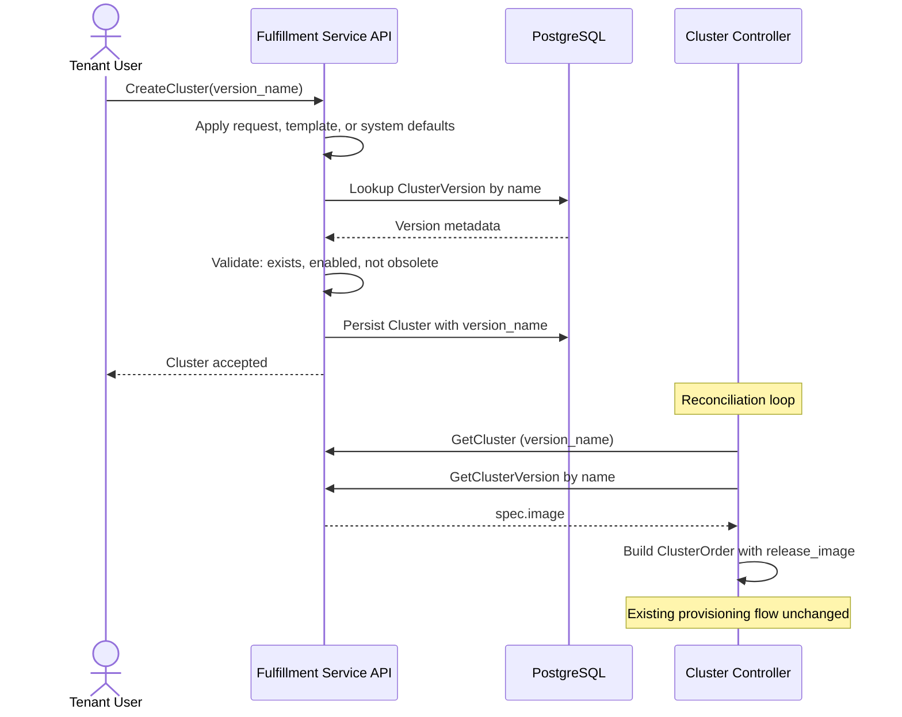
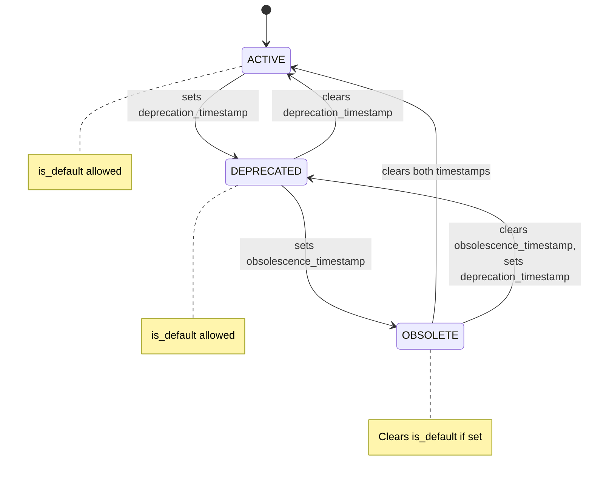

# ClusterVersion

## Summary

This enhancement introduces a `ClusterVersion` resource that replaces raw release-image input with managed version entries for cluster creation. See [PRD](prd.md) for detailed requirements.

## Motivation

Cluster creation currently requires a caller to know an exact OpenShift release image URL. That exposes implementation details, makes validation weaker than it should be, and provides no platform-level way to discover which versions are supported, deprecated, or obsolete. OSAC also lacks a shared version identity that later features, especially upgrade workflows, can reference.

Introducing managed versions fixes those gaps. It gives admins a place to manage version availability and lifecycle, gives tenants a stable version identifier to select, and gives the platform a foundation for future upgrade workflows without embedding release-image details in the user-facing API.

### Goals

- Replace raw release-image input on the cluster API with a managed version reference.
- Resolve release images at reconciliation time, keeping the downstream provisioning flow unchanged.
- Preserve an upgrade-compatible version identity model for OSAC-1415.

### Non-Goals

- Full upgrade orchestration, progress tracking, rollback, or channel-based upgrade selection (including channel metadata). [User]
- Automatically import or synchronize versions from ACM `ClusterImageSet` resources in `v0.2`.
- Extend this design to VM image management; that remains separate work under `ComputeImage`.
- Hub-projected ClusterVersion CRD, operator lifecycle watches, or AAP-side version resolution.
- Add architecture-aware scheduling, multi-architecture release-image arrays, or NodePool-specific image selection in `v0.2`.

## Proposal

OSAC adds a new platform-global `ClusterVersion` resource in the fulfillment-service. Each entry represents one OpenShift version and includes:

- the semantic version identifier exposed to users (`spec.version`)
- the release image URL (`spec.image`)
- lifecycle state such as active, deprecated, or obsolete
- whether it is enabled for new cluster creation and whether it is the system default version
- an optional list of allowed target versions [User]

The fulfillment-service is the sole owner of this data. At cluster creation time, the server validates the selected version. The cluster controller resolves the release image from the ClusterVersion when building the ClusterOrder — the Cluster object itself stores only the `version_name`, not the release image.

The cluster API stops accepting raw `release_image` input and instead uses `version_name` as the selected version identifier. Basic validated version changes — where the caller explicitly sets a new `version_name` and the change is validated against `allowed_upgrades` — are in scope. [User]

### Workflow Description

#### Actors

- **Cloud Provider Admin** manages available versions.
- **Tenant User** creates clusters using a selected version.
- **Fulfillment Service** validates version selection and resolves release images.

#### Admin workflow: manage versions

1. A Cloud Provider Admin creates a `ClusterVersion` entry with a version identifier, a release image URL, and optional lifecycle metadata. If `enabled` is not set explicitly, the server defaults it to `true`. If `state` is not set, the server defaults it to `ACTIVE`.
2. The fulfillment-service validates the entry, persists it, and enforces version invariants such as at most one default version.
3. The admin can later mark the version as deprecated or obsolete, disable it for new cluster creation, or change which version is the default.

#### Tenant workflow: create a cluster with a managed version



1. A Tenant User creates a cluster and may specify `version_name`.
2. Resolution precedence for `version_name` is: explicit user input, then the template default (`spec_defaults.version_name`), then the system default version (`is_default=true`).
3. The fulfillment-service validates that the selected version exists, is enabled, and is not obsolete. Deprecated versions are allowed. [User]
4. The cluster is persisted with `version_name`; the controller resolves the release image at reconciliation time.

On the catalog-item path, `version_name` comes from the catalog item's field definitions instead of template `spec_defaults`. Version validation (step 3) applies on both paths.

#### Error handling

| Scenario | API behavior | gRPC code |
| ---- | ---- | ---- |
| `spec.version` format is invalid | Reject the request. | `InvalidArgument` |
| Referenced version does not exist | Reject the request before cluster creation. | `InvalidArgument` |
| Referenced version is disabled or obsolete | Reject the request. | `InvalidArgument` |
| No version can be resolved through input or defaults | Reject the request. | `InvalidArgument` |
| A referenced version is still in use during deletion | Reject the deletion until references are removed. [PRD: FR-11] | `FailedPrecondition` |
| `version_name` changed to a version not in `allowed_upgrades`, or target is disabled/obsolete | Reject the update. Same admission checks as cluster creation. [User] | `InvalidArgument` |
| `allowed_upgrades.version_names` references a non-existent or deleted version on create, or a newly added entry references a non-existent, deleted, disabled, or obsolete version on update | Reject the create or update. | `InvalidArgument` |
| Two concurrent requests try to set different defaults | Allow one winner and reject the other update. | `AlreadyExists` |

### API Extensions

This enhancement adds or changes the following API surfaces:

- **Fulfillment gRPC/REST APIs**
  - New `ClusterVersions` API for managing and listing version entries.
  - `Clusters` API replaces `release_image` input with `version_name`. The server validates the version at creation time.
  - `ClusterTemplates` gain a `spec_defaults.version_name` field for template-level version defaulting.
  - Public `ClusterVersions/List` hides disabled and obsolete versions by default unless the caller explicitly filters on lifecycle or availability fields.
  - The fulfillment-service event payload gains a `ClusterVersion` entry so create, update, and delete operations participate in change notifications.
- **OSAC CRDs** — no change. The existing `ClusterOrder` continues to carry `releaseImage`.

#### Visibility split

Private `ClusterVersionSpec` includes `spec.image` (the release-image pullspec); public `ClusterVersionSpec` does not. All other fields are present on both. See Data model for proto definitions.

#### Changes to existing resource schemas

- `ClusterSpec` replaces `release_image` with `optional string version_name = 9`, referencing a ClusterVersion by `metadata.name`.
- `ClusterTemplateSpecDefaults` gains `optional string version_name = 5`, replacing `release_image` for template-level version defaulting.

- `ClusterCatalogItem` field definitions replace `path: "release_image"` with `path: "version_name"`. The field definition default changes from a release-image URL to a ClusterVersion `metadata.name` (e.g., `"4-17-0"`). The [`applyFieldDefinitions()`](https://github.com/osac-project/fulfillment-service/blob/e5c4482dbbb9e508f7df912b86f7a5a1e5900607/internal/servers/catalog_item_validation.go#L73) mechanism is unchanged. On catalog item create and update, the server validates that the `version_name` default references an existing, enabled, non-obsolete ClusterVersion — following the same pattern as `ComputeInstanceCatalogItem` validates `instance_type` defaults. See [catalog-items EP](../../../enhancement-proposals/enhancements/catalog-items/README.md).

Template republication (via AAP [`publish_templates`](https://github.com/osac-project/osac-aap/blob/8789215d26d0fd12e814665b055eeafeb1fb97f5/collections/ansible_collections/osac/service/playbooks/publish_templates.yaml#L1)) preserves admin-set `spec_defaults` — the publish payload does not include `spec_defaults`, so [FieldMask auto-inference](https://github.com/osac-project/fulfillment-service/blob/e5c4482dbbb9e508f7df912b86f7a5a1e5900607/internal/servers/field_mask.go#L30) leaves it unchanged.

### Implementation Details/Notes/Constraints

#### Data model

##### ClusterVersion

```protobuf
message ClusterVersion {
  string id = 1;
  Metadata metadata = 2;
  ClusterVersionSpec spec = 3;
  ClusterVersionStatus status = 4;
}

message ClusterVersionSpec {
  string image = 1;
  // OCI release image pullspec (private-only, not exposed in public API).

  optional bool enabled = 2;
  // Controls whether new clusters may select this version.
  // Server sets to true on Create when not explicitly provided.

  optional bool is_default = 3;
  // At most one active ClusterVersion may be default.

  ClusterVersionState state = 4;
  // Server defaults UNSPECIFIED to ACTIVE on Create.

  ClusterVersionDeprecation deprecation = 5;

  string version = 6;
  // Stable version identifier (e.g., "4.17.0", "4.17.0-rc.1").

  ClusterVersionAllowedUpgrades allowed_upgrades = 7;
  // Constrains which versions clusters on this version may upgrade to.
  // Message absent: no path constraint (target must still be enabled and not obsolete).
  // Message present with empty version_names: no valid targets — version change is rejected.
  // Message present with version_names: only listed versions are accepted.
}

message ClusterVersionAllowedUpgrades {
  repeated string version_names = 1;
  // ClusterVersion names (metadata.name). Must reference existing, non-deleted ClusterVersions.
  // When a target version is deleted, it is automatically removed.
}

enum ClusterVersionState {
  CLUSTER_VERSION_STATE_UNSPECIFIED = 0;
  CLUSTER_VERSION_STATE_ACTIVE = 1;
  CLUSTER_VERSION_STATE_DEPRECATED = 2;
  CLUSTER_VERSION_STATE_OBSOLETE = 3;
}

message ClusterVersionDeprecation {
  google.protobuf.Timestamp deprecation_timestamp = 1;
  // Set by the system when state transitions to DEPRECATED.

  google.protobuf.Timestamp obsolescence_timestamp = 2;
  // Set by the system when state transitions to OBSOLETE.
  // Both timestamps are cleared if the version returns to ACTIVE.
}

message ClusterVersionStatus {}
```

**Example public payload shape:**

```json
{
  "id": "uuid",
  "metadata": {
    "name": "4-17-0"
  },
  "spec": {
    "version": "4.17.0",
    "enabled": true,
    "isDefault": true,
    "state": "DEPRECATED",
    "deprecation": {
      "deprecationTimestamp": "2026-06-15T00:00:00Z"
    },
    "allowedUpgrades": {
      "versionNames": ["4-17-1", "4-18-0"]
    }
  },
  "status": {}
}
```

##### Changes to existing schemas

```protobuf
message ClusterSpec {
  // Field 6 was release_image — removed.

  optional string version_name = 9;
  // References a ClusterVersion by metadata.name.
}

message ClusterTemplateSpecDefaults {
  optional string version_name = 5;
  // Lets templates provide a default managed version.
}
```

#### Lifecycle state machine



All state transitions are allowed. [PRD: FR-13] Timestamps are system-managed: set on entry to DEPRECATED or OBSOLETE, cleared on return to ACTIVE. OBSOLETE → DEPRECATED clears `obsolescence_timestamp` and sets `deprecation_timestamp`. If a version is default when it transitions to OBSOLETE or is disabled, `is_default` is auto-cleared. No automatic propagation of lifecycle conditions to existing clusters.

#### Invariants and validation

**Identity and naming:**
- `metadata.name` is optional. If not provided, it is auto-generated from `spec.version` by lowercasing and replacing all characters outside `[a-z0-9-]` with dashes (e.g., `4.17.0` → `4-17-0`, `4.17.0+build.1` → `4-17-0-build-1`). If the result exceeds 63 characters (the DNS label limit), it is truncated to 58 characters with a 4-character hex suffix appended (`-XXXX`), keeping the total at 63. On name collision the server appends the same style of hex suffix.
- `spec.version` must be a valid [Semantic Version 2.0.0](https://semver.org/) string. Maximum length is 256 characters.
- `spec.version` must be unique among active (non-deleted) ClusterVersions.
- `spec.version` and `spec.image` are immutable after creation. The server rejects updates that change either field. A database trigger enforces the same constraint as a race-safety backstop. [PRD: FR-14]

**Default version:**
- At most one version can be marked as the default. Setting `is_default=true` clears the previous default within the same transaction.
- Obsolete or disabled versions cannot be set as the default.
- If a default version transitions to `OBSOLETE` or is disabled (`enabled=false`), the server clears `is_default` as part of the same change.

**Lifecycle:**
- Obsolete or disabled versions cannot be used for new clusters or as version-change targets. `enabled` is admission policy, not lifecycle state — changing it does not affect existing clusters.

**References and delete protection:**
- Versions referenced by active clusters, templates, or catalog item field definitions cannot be deleted. [PRD: FR-11]
- `ClusterTemplate` create and update validate `spec_defaults.version_name` in the server layer; database triggers are the race-safety backstop.

**Cluster version-change validation:**
- When `allowed_upgrades` is set on the source version, cluster updates that change `version_name` are validated against the list. The target version must pass the same admission checks as cluster creation (exists, enabled, not obsolete). When `allowed_upgrades` is not set, any version change is allowed but the target must still pass those checks. [User]

**Upgrade target management:**
- `allowed_upgrades.version_names` entries must reference existing, non-deleted ClusterVersions. On create, the server validates that all entries are also enabled and non-obsolete. On update, only newly added entries are validated against enabled and non-obsolete. A database trigger enforces the existence constraint as a race-safety backstop for concurrent deletions.
- When a target version is soft-deleted, it is automatically removed from all other versions' `allowed_upgrades` lists within the same transaction. Disabling or marking a version obsolete does not remove it — the entry stays and becomes available again when the target is re-enabled or returned to a non-obsolete state.
- If deletion cleanup removes all entries, the empty `allowed_upgrades` message is preserved.

#### Database considerations

**Key model.** `tenant` is `"shared"` (platform-global resource convention); `project` is the default empty value. `id` is the primary key.

**Tables.** Two tables following the standard DAO schema: `cluster_versions` (live) and `archived_cluster_versions` (archive).

**Uniqueness constraints.** Three partial unique indexes, all excluding soft-deleted rows (`WHERE deletion_timestamp = 'epoch'`):

- `(name, tenant, project)` — enforces unique active `metadata.name` within a tenant and project.
- `(data->'spec'->>'version', tenant, project)` — enforces unique active `spec.version` within a tenant and project.
- `(tenant, project)` with partial predicate `is_default = true` — enforces at most one default within a tenant and project.

**JSONB field immutability.** A trigger on `cluster_versions` fires before UPDATE and compares `old.data->'spec'->>'version'` and `old.data->'spec'->>'image'` against the new values. If either differs, it raises SQLSTATE `Z0001` (`ErrImmutable`). This complements the existing [`check_immutable_columns`](https://github.com/osac-project/fulfillment-service/blob/e5c4482dbbb9e508f7df912b86f7a5a1e5900607/internal/database/migrations/46_add_immutable_column_trigger.up.sql#L19) trigger (which protects table columns) and the server-side validation (which provides descriptive error messages).

**Reference integrity.**

*Database triggers:*

- **Outbound (delete protection):** fires before UPDATE on `cluster_versions` when `deletion_timestamp` transitions from epoch (soft deletion). Checks that no active cluster, cluster template, or cluster catalog item references this version by `version_name`. For catalog items, the trigger scans `field_definitions` for entries with `path = 'version_name'` whose `default` matches the version's `metadata.name`. Raises SQLSTATE `Z0003` (`ErrInUse`).
- **Inbound (resource → version):** fires before INSERT or UPDATE (only active rows: `WHEN new.deletion_timestamp = 'epoch'`). On INSERT, or when the reference changes on UPDATE, validates that the referenced ClusterVersion exists, is enabled, and is not obsolete using `SELECT ... FOR SHARE` on the referenced row. Raises SQLSTATE `Z0002` (`ErrReference`). Three source tables, same validation logic:
  - `clusters` and `cluster_templates` — scalar field `data->'spec'->>'version_name'`.
  - `cluster_catalog_items` — loops over `data->'field_definitions'`, filters entries with `path = 'version_name'`, and validates each entry's `default` value.
- **Inbound (version → version via allowed_upgrades):** fires before INSERT or UPDATE on `cluster_versions` (only active rows). On INSERT, or when `allowed_upgrades` changes on UPDATE, loops over `version_names` and validates each entry against an existing, non-deleted ClusterVersion using `SELECT ... FOR SHARE`. Raises SQLSTATE `Z0002` (`ErrReference`).

Inbound triggers use `FOR SHARE` on the referenced row to serialize against concurrent deletes and lifecycle changes, following the established pattern across all existing reference triggers.

*Server-side cleanup (Go layer):*

- **Upgrade target cleanup:** when a ClusterVersion is soft-deleted, the server removes its `metadata.name` from all other active versions' `allowed_upgrades.version_names` arrays within the same transaction. The cleanup UPDATE increments `version` on each affected row to preserve optimistic concurrency. The private server's Delete method runs this after the DAO operation, sharing the same transaction via [`database.TxFromContext(ctx)`](https://github.com/osac-project/fulfillment-service/blob/e5c4482dbbb9e508f7df912b86f7a5a1e5900607/internal/database/database_context.go#L46).

**Performance.** A JSONB index on `data->'spec'->>'version_name'` in the `clusters` table keeps the outbound trigger's reference scan efficient. The trigger also scans `cluster_templates` and `cluster_catalog_items` field definitions; template and catalog item volume is low enough that separate indexes are not warranted.

**Error mapping.** Trigger SQLSTATE codes translate to gRPC status codes: `Z0001` → `InvalidArgument` (immutable field changed), `Z0002` → `InvalidArgument` (invalid reference), `Z0003` → `FailedPrecondition` (delete blocked by references). `Z0001` already exists for [`check_immutable_columns`](https://github.com/osac-project/fulfillment-service/blob/e5c4482dbbb9e508f7df912b86f7a5a1e5900607/internal/database/migrations/46_add_immutable_column_trigger.up.sql#L19); no new error constant is needed.

**Implementation prerequisite.** The DAO update path ([`translateError` in `generic_dao_update.go`](https://github.com/osac-project/fulfillment-service/blob/e5c4482dbbb9e508f7df912b86f7a5a1e5900607/internal/database/dao/generic_dao_update.go#L207)) does not currently translate `Z0002` or `Z0003` — these codes are handled on the create and delete paths but were not added to the update path's `translateError` switch. This must be fixed before inbound triggers that fire on UPDATE can return proper gRPC errors. This is a pre-existing gap ([migration 56](https://github.com/osac-project/fulfillment-service/blob/e5c4482dbbb9e508f7df912b86f7a5a1e5900607/internal/database/migrations/56_add_instance_type_ref_triggers.up.sql#L20) already has `BEFORE INSERT OR UPDATE` triggers raising `Z0002`), not specific to ClusterVersion.

#### Event plumbing

`ClusterVersion` needs an entry in the `oneof payload` of both the private and public event type protos so that create, update, and delete operations emit change notifications with the resource attached. The [`GenericServer`](https://github.com/osac-project/fulfillment-service/blob/e5c4482dbbb9e508f7df912b86f7a5a1e5900607/internal/servers/generic_server.go#L58) discovers the payload field automatically via protobuf reflection — no Go code changes are needed beyond `buf generate`. Without the oneof entries, CRUD operations still succeed, but emitted events carry no payload and are silently dropped by the event server.

#### CLI and UI rendering

**ClusterVersion commands:**

- `osac create clusterversion` — create from flags or YAML.
- `osac get clusterversion <id-or-name>` — get by ID or metadata.name (e.g., `4-17-0`).
- `osac get clusterversions` — list versions. Use `--filter 'this.spec.version == "4.17.0"'` to filter by version string.
- `osac describe clusterversion <id-or-name>` — describe by ID or metadata.name.
- `osac edit clusterversion <id-or-name>` — edit by ID or metadata.name.
- `osac delete clusterversion <id-or-name>` — delete by ID or metadata.name.

**Cluster creation:**

`osac create cluster` replaces `--release-image` with `--version`. The flag accepts a version string (`4.17.0`) or a metadata.name (`4-17-0`). The CLI resolves the input to a ClusterVersion and sets the resolved `metadata.name` as `version_name` on the ClusterSpec. If the input matches multiple ClusterVersions, `metadata.name` takes precedence (this requires a `spec.version` that is itself a valid DNS label matching another version's `metadata.name` — unlikely in practice).

**Table rendering:**

- **ClusterVersion table:** columns are NAME, VERSION, STATE, ENABLED, DEFAULT (public); private adds IMAGE. NAME shows `metadata.name` so users can discover the value needed for API references and other CLI commands.
- **Cluster table:** a VERSION column shows the `version_name` value (metadata.name, e.g., `4-17-0`).

**`describe cluster`:** makes a second gRPC call to fetch the `ClusterVersion` by name and renders its version string, state, and timestamps. [PRD: FR-6]

**UI rendering:** two API calls (cluster + version), client-side join for lifecycle display.

### Security Considerations

- **Authentication and authorization:** this enhancement inherits the existing OSAC security model. The fulfillment-service continues to use the current JWT-based request authentication chain, and write operations for version management remain restricted through existing OPA-based admin authorization.
- **Data exposure:** `spec.image` remains private to admin-facing and internal flows.
- **Input validation:** version references are validated before persistence.

### Failure Handling and Recovery

| Failure mode | What happens | Recovery | User observes |
| ---- | ---- | ---- | ---- |
| Database error during create or update | The request transaction rolls back. | Retry the request after the backend recovers. | The API returns an internal error and no partial object is created. |
| Two requests race to set different default versions | One request succeeds and the other loses the uniqueness race. | Retry the losing request if needed after reviewing the current default. | The loser receives `AlreadyExists`. |
| A referenced version is deleted between validation and persistence | Database-side reference checks reject the write. | Retry with a valid version. | The create or update fails with `InvalidArgument`. |
| Controller cannot resolve ClusterVersion during reconciliation (transient API error) | ClusterOrder is not created or updated. The controller retries with exponential backoff. | Resolve the underlying issue. Delete protection guarantees the version still exists. | Cluster creation is delayed; the cluster remains in a pending state until reconciliation succeeds. |

### RBAC / Tenancy

- **Visibility:** authenticated users may read version metadata, while create, update, and delete remain Cloud Provider Admin operations through OPA enforcement. All authenticated users see ClusterVersions — [`DetermineVisibleTenants()`](https://github.com/osac-project/fulfillment-service/blob/e5c4482dbbb9e508f7df912b86f7a5a1e5900607/internal/auth/default_tenancy_logic.go#L98) always includes `"shared"` in the visible tenant set.
- **Tenant metadata:** ClusterVersion is not a tenant-scoped resource, so no tenant isolation annotations (`osac.openshift.io/tenant`, `osac.openshift.io/owner-reference`) are required. Tenant isolation still applies at the consuming-resource level, where clusters and cluster orders remain tenant-owned.

### Observability and Monitoring

`ClusterVersions` API requests use the existing fulfillment-service gRPC metrics and structured logging. No new alerts or dashboards are needed.

### Risks and Mitigations

| Risk | Mitigation |
| ---- | ---------- |
| No version entries exist when the feature is deployed. | Ship seeded versions as part of the deployment story and document the admin setup flow. |
| The public cluster API changes from raw release-image input to version selection. | Treat this as a coordinated API change for a fresh-deployment milestone. The fulfillment-service and osac-ui are affected; both ship in v0.2. |

### Drawbacks

This design adds an administrative version-management step before tenants can create clusters. That is more operational overhead than allowing users to pass arbitrary release-image URLs directly. Additionally, `spec.version` and `spec.image` are immutable — an admin who enters an incorrect image URL must delete and recreate the entry, and deletion is blocked while any cluster or template references it.

## Alternatives (Not Implemented)

### Keep a single `release_image` string on the cluster API

This keeps the current API shape and avoids a new resource.

It was rejected because it preserves the current usability and validation problems, exposes infrastructure details to tenants, and does not create a reusable version identity for lifecycle or upgrade workflows.

### Project ClusterVersion to hub clusters as a CRD

This adds a hub `ClusterVersion` CRD, operator lifecycle watches, and AAP resolution from the CRD. It enables reactive lifecycle propagation (conditions on `ClusterOrder`) and lets AAP resolve images from a local CRD instead of receiving a resolved URL.

Deferred. The fulfillment-service-only approach is simpler, touches only one component, and delivers the core value (managed versions, validation, resolution). Hub projection can be added later if reactive lifecycle propagation is needed.

### Model release images as an architecture-keyed array

This uses `repeated ClusterVersionReleaseImage release_images` with `architecture` and `url` fields instead of a single `image` string. It enables multi-architecture support without schema migration.

Not needed for `v0.2`. A single `spec.image` is sufficient for the current `multi`-only deployment. The array can be introduced when multi-architecture support is needed.

## Test Plan

The test strategy focuses on validating the version model in the fulfillment-service:

- **Unit tests:** version validation, default selection, lifecycle-state handling, image resolution, version-change validation, and template default checks.
- **Integration tests:** end-to-end flow from version creation through cluster creation and reconciliation, including delete protection, default fallback, and release-image population on the `ClusterOrder`.
- **E2E tests:** admin version management plus tenant cluster creation using managed versions.

## Graduation Criteria

This enhancement should graduate by showing:

- stable creation of clusters through managed version selection
- correct resolution of release images from available versions
- documented operational guidance for seeding versions and diagnosing failures

## Upgrade / Downgrade Strategy

OSAC `v0.2` assumes coordinated fresh deployment rather than in-place upgrades. No data migration is required.

## Version Skew Strategy

The fulfillment-service and osac-ui are affected. The UI generates types from the same protos — removing `release_image` breaks the generated types and the components that render it. Both ship in the same coordinated v0.2 deployment, so no version skew concern.

## Support Procedures

### Detection

- ClusterVersion API failures appear in fulfillment-service logs and metrics.
- Cluster creation failures identify invalid, missing, disabled, or obsolete versions at request time.

### Diagnosis

- List `ClusterVersion` entries from the API to verify state, default selection, and image URL.
- Inspect fulfillment-service logs for version validation errors during cluster creation or resolution errors during reconciliation.

### Recovery

- Recreate or fix a missing `ClusterVersion` entry.
- Change cluster or template references before attempting to remove a version that is still in use.

### Disabling

Disable specific versions by setting `enabled=false`. The recommended path for retiring a version is OBSOLETE + `enabled=false` — this blocks new cluster creation and hides the entry from default listings while preserving the record for audit. Deletion is a cleanup mechanism for entries never referenced by clusters or templates.

## Infrastructure Needed

None beyond the fulfillment-service changes already described. Seeded default versions ship through the existing deployment workflow.
