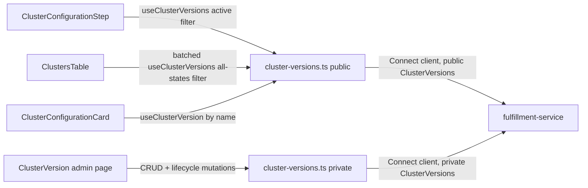

# ClusterVersion — UI Design

| Field       | Value                                 |
|-------------|---------------------------------------|
| Author(s)   | Elay Aharoni |
| Jira        | [OSAC-1269](https://issues.redhat.com/browse/OSAC-1269) |
| PRD         | [prd.md](./prd.md) |
| Date        | 2026-07-30 |

# 1. Overview

This design specifies the `osac-ui` implementation for `ClusterVersion` (OSAC-1269): a managed catalog of OpenShift versions that replaces raw `release_image` input across the cluster-creation wizard, catalog item field definitions, and cluster list/detail views. It covers three UI surfaces: (1) an admin catalog management screen for creating, editing, and transitioning the lifecycle state of `ClusterVersion` entries; (2) version selection in the cluster-creation wizard, replacing the free-text release-image field; (3) version and lifecycle-state display on cluster list and detail views via a client-side join against the `ClusterVersion` catalog. The backend API and data model — the fulfillment-service `ClusterVersions` service, `ClusterSpec.version_name`, and the public/private visibility split for `spec.image` — are an already-finalized contract [Codebase: enhancement-proposals `design.md`]; this document addresses only how `osac-ui` consumes and surfaces them. See the [PRD](./prd.md) for the full product requirements.

# 2. Goals and Non-Goals

## 2.1 Goals

- Follow the existing hooks-layer conventions (`useApiFetch` + `useApiQuery`/`useMutation` + `apiQueryKey`, public/private route split) established in `libs/ui-components/src/api/v1/networking.ts`, `instance-types.ts`, and `private/cluster-catalog-item.ts` for all `ClusterVersion` API access. [Codebase: `docs/api-query-arch.md`]
- Reuse the existing client-side cross-resource join pattern (`useVmDetailsDisplay.ts`) for resolving and displaying a cluster's version and lifecycle state. [Codebase: `libs/ui-components/src/components/vm/DetailsPage/useVmDetailsDisplay.ts`]
- Batch-fetch `ClusterVersion` data for the cluster list table instead of issuing one fetch per row. [Codebase: `libs/ui-components/src/components/Cluster/ClustersTable.tsx`]
- Route `spec.image` access exclusively through the private API surface, matching the CLI's public/private table column split. [PRD: §"Data exposure"], [Codebase: `design.md` "Table rendering"]

## 2.2 Non-Goals

- ACM `ClusterImageSet` auto-sync UI — versions remain admin-entered in v0.2. [PRD: §2.2 Non-Goals]
- A generic, backend-driven "field type" rendering system for catalog field definitions. Version selection remains a hardcoded wizard-step widget, consistent with how `instance_type` is implemented today — the `FieldDefinition` proto has no type discriminator to drive one. [Codebase: `catalogProvision/catalogFieldDefinition.ts`]
- CLI implementation — covered by the linked fulfillment-service design, not this document.

# 3. Motivation / Background

Today, `ClusterConfigurationStep.tsx` renders `spec.releaseImage` as a plain-text `InputField`, requiring the user to paste an exact OCI pullspec with no validation until the server rejects it during provisioning. `ClusterConfigurationCard.tsx` echoes the same raw string back on the cluster detail page. Neither surface resolves, validates, or contextualizes the value in any way.

`ClusterVersion` replaces this raw string with a managed reference (`version_name`) that the fulfillment-service already validates, resolves, and tracks through a lifecycle (active/deprecated/obsolete) [Codebase: `design.md`]. The UI's job is threefold: give admins a way to populate and maintain that catalog (which has no existing precedent in this codebase — the structurally closest resource, `InstanceType`, is read-only from the UI); replace the wizard's free-text field with a version picker sourced from the catalog; and, everywhere a cluster's version is displayed, resolve `version_name` to its descriptive metadata and *current* lifecycle state, since the cluster object stores only a name reference and lifecycle state can change independently of the cluster (FR-6).

# 4. Design

## 4.1 Architecture

Three UI surfaces share two new hook modules — one public, one private — mirroring the existing `ClusterCatalogItems` split (`libs/ui-components/src/api/v1/cluster-catalog-item.ts` vs. `private/cluster-catalog-item.ts`):

- **`libs/ui-components/src/api/v1/cluster-versions.ts`** (public) — read-only: `useClusterVersions(params)`, `useClusterVersion(id)`. Used by tenant-facing surfaces (wizard picker, cluster list/detail join). Backed by `@osac/types`' public `ClusterVersions` service, which never returns `spec.image` and hides disabled/obsolete entries from `List` unless explicitly filtered [Codebase: `design.md` "Public `ClusterVersions/List` hides disabled and obsolete..."].
- **`libs/ui-components/src/api/v1/private/cluster-versions.ts`** (private) — full CRUD + lifecycle actions: `usePrivateClusterVersions(params)`, `usePrivateClusterVersion(id)`, `useCreateClusterVersion()`, `useUpdateClusterVersion()`, `useDeleteClusterVersion()`, `useSetClusterVersionLifecycleState()`. Used exclusively by the admin catalog management screen. Backed by `@osac/types/private`'s `ClusterVersions` service, which includes `spec.image`.

The split is per-field, not per-persona: `networking.ts`'s `VirtualNetwork`/`SecurityGroup` CRUD mutations use the *public* API because those resources have no private-only field [Codebase: `libs/ui-components/src/api/v1/networking.ts`]. `ClusterVersion`'s admin surface uses the *private* API specifically because `spec.image` is private-only and the admin form must collect and display it (create) and the admin table displays an IMAGE column, matching the private CLI table [Codebase: `design.md` "ClusterVersion table: ... private adds IMAGE"].



This diagram shows that no component talks to a Connect client directly — every UI surface routes through one of the two hook modules, and both ultimately reach the same fulfillment-service `ClusterVersions` service through different proto visibility scopes. The reader's takeaway: adding a new consumer of version data never requires a new API integration, only a new hook call against an existing module.

**Wizard (tenant-facing).** `ClusterConfigurationStep.tsx` replaces the `spec.releaseImage` `InputField` with a `SelectField name="spec.versionName"`, fed by `useClusterVersions({ filter: CLUSTER_VERSION_ACTIVE_LIST_FILTER })` — mirroring `VmConfigurationStep.tsx`'s `instanceType` field exactly [Codebase: `wizard/adapters/computeInstance/VmConfigurationStep.tsx`]. `fields.ts` renames `CLUSTER_RELEASE_IMAGE_WIRE_PATH` (`'release_image'`) to `CLUSTER_VERSION_NAME_WIRE_PATH` (`'version_name'`) and the form field from `releaseImage` to `versionName`; `schemas.ts`, `payload.ts`, `applyCatalogDefaults.ts`, and `clusterAdapter.ts` rename their `releaseImage`/`spec.releaseImage` references accordingly. `getCatalogFieldOverlay('version_name', definitions, t('Version'))` still supplies label/editable/default overlay from the catalog item's field definitions, matching FR-10 and today's `release_image` overlay usage.

Options are built with a new `formatClusterVersionOptionLabel` helper (`libs/ui-components/src/components/vm/utils.ts`-style, co-located with the new `cluster-versions.ts` module or an analogous `components/Cluster/utils.ts`), appending a "(deprecated)" suffix for `DEPRECATED` entries — obsolete entries never appear as options because the active-list filter excludes them. Per FR-7/FR-15, selecting a deprecated version does not block submission; the step renders an inline PatternFly `Alert` (`variant="warning"`) below the select when the chosen version's state is `DEPRECATED` (e.g., "Version 4.17.0 is deprecated and will be removed in a future release."). Server-side validation errors (version not found, obsolete, or unresolvable) surface through the wizard's existing submission-error handling — no new error-display mechanism is introduced.

**Cluster list (`ClustersTable.tsx`, tenant- and admin-visible).** The table's container computes the distinct `version_name` values referenced by the currently-rendered clusters and calls `useClusterVersions({ filter: buildClusterVersionNamesFilter(names) })` once — a targeted `metadata.name` lookup (`this.metadata.name in [...]`), not a lifecycle-wide listing [User]. This is deliberately not a lifecycle/enablement filter, which avoids the tautology problem of the rejected all-states alternative (see §5) — but it does **not** fully eliminate the underlying ambiguity: the public `List` RPC's rule ("hides disabled and obsolete by default unless explicitly filtered on lifecycle or availability fields") is about which *fields* the filter touches, and a `metadata.name` filter touches neither `spec.state` nor `spec.enabled`, so it's unconfirmed whether disabled/obsolete entries are still returned. To be correct regardless of how that resolves: after the `List` response arrives, compute which requested names are **missing** from it, and resolve each missing name with an individual `useClusterVersion(name)` `Get` call — `Get` is already established elsewhere in this design (Cluster detail, below) to resolve a version regardless of its lifecycle state, since it's an identity lookup, not a lifecycle listing. This fallback is bounded by how many referenced versions are actually hidden by the `List` default (expected to be rare — most rows resolve from the single `List` call), which is a fundamentally different cost profile from the rejected "per-row `Get` for every cluster" alternative in §5. It builds a `Map<string, ClusterVersion>` keyed by `metadata.name` from the combined `List` + fallback `Get` results. Each row looks up its `cluster.spec?.versionName` in the map — no per-row fetch for the common case. If no clusters are rendered, skip the fetch entirely (an empty name list has nothing to resolve). Two new columns: **Version** (the resolved `spec.version` string, e.g. "4.17.0", falling back to the raw `version_name` while the map is loading or if the entry can't be resolved even via the `Get` fallback — mirroring `ClusterConfigurationCard.tsx`'s existing catalog-item-name fallback) and **Lifecycle** (`ClusterVersionStateLabel`, blank if unresolved).

**Cluster detail (`ClusterConfigurationCard.tsx`).** The line that currently renders `displayValue(cluster.spec?.releaseImage)` is replaced with `useClusterVersion(cluster.spec?.versionName)`, rendering the version string plus `ClusterVersionStateLabel`, with a `Skeleton` while loading — the exact pattern already used in the same file for `cluster.spec?.catalogItem` via `useClusterCatalogItem`. A single `Get`-by-name call resolves regardless of the version's lifecycle state (FR-2's "a specific version can be viewed regardless of its state"), so no all-states filter is needed here, unlike the list table's batched `List` call.

**Admin catalog management (new).** A new nav entry, "Cluster versions", is added under `sectionId: 'nav-administration'` in `shellNav.ts`, alongside but distinct from "Catalog management" — `ClusterVersion` is a primitive reference resource, not a provisioning template, so it does not belong inside `CatalogManagementListPage`'s tabs. [User]

The list page follows `ClustersTable.tsx`'s plain PatternFly `Table` convention (no generic column-definition abstraction exists in this codebase) fed by `usePrivateClusterVersions()`, with columns NAME, VERSION, STATE (`ClusterVersionStateLabel`), ENABLED, DEFAULT, IMAGE, and a row actions kebab — directly matching the private CLI table's column set [Codebase: `design.md` "ClusterVersion table"]. Row actions:

- **Edit** — opens a form for `enabled` and `is_default` only; `version` and `image` render as read-only text, enforcing FR-14's immutability at the UI layer (in addition to the server-side trigger and validation).
- **Deprecate / Obsolete / Reactivate** — calls `useSetClusterVersionLifecycleState()`, a mutation wrapping the same `update` RPC as Edit but scoped to `spec.state` only, kept as a separate hook so lifecycle transitions are a distinct, auditable action from general field edits. Available actions are computed from the current state per the backend's state machine (e.g., an `OBSOLETE` entry offers "Reactivate" and "Deprecate", not "Obsolete") [Codebase: `design.md` lifecycle `stateDiagram-v2`]. Action naming matches the convention established for the same three actions in the `OSAC-46` (instance types) UI design, per reviewer discussion. [User]
- **Set as default** — calls `useUpdateClusterVersion()` with `is_default: true`; disabled (with a tooltip) when the entry's state is `OBSOLETE` or `enabled` is `false`, matching the backend invariant that obsolete/disabled versions cannot be default. A confirmation dialog warns that this replaces the current default.
- **Delete** — calls `useDeleteClusterVersion()`, but is only enabled when the entry's `state` is `OBSOLETE` (disabled, with a tooltip explaining why, for `ACTIVE`/`DEPRECATED` entries) [User]. This keeps the UI's primary retirement path as the lifecycle sequence (Deprecate → Obsolete, optionally paired with disabling `enabled`) rather than encouraging routine hard deletes, while still surfacing delete as a cleanup action once a version has already been fully retired. No client-side pre-check for in-use references beyond the state gate; the server's FR-11 error ("cannot delete version '4.17.0': in use by cluster 'cluster-abc'") is surfaced verbatim via the existing form/toast error-display convention.

**Create** is a single-step form/modal (not the multi-step wizard component, since there is nothing to configure beyond the entry itself): version (semver-format text input), **name** (`metadata.name` — text input, live-defaulted to the server's own slugification of the version as it's typed, e.g. `4.17.0` → `4-17-0`, editable before submit), release image URL, enabled (checkbox, default checked). The name field exists because `metadata.name` is the identifier every other surface references (`spec.version_name`, template defaults, the CLI's `--version` resolution) — leaving it fully server-generated with no admin visibility risks an unpredictable name, especially on collision (the server appends a random hex suffix). The entry is always created in `ACTIVE` state; admins use the "Deprecate"/"Obsolete" row actions after creation to transition it, keeping the create form focused on the three immutable, one-time-entry fields plus `enabled`. [User]

**Lifecycle state label.** A new `ClusterVersionStateLabel` component, co-located under `libs/ui-components/src/components/Cluster/` alongside `ClusterStatusLabel.tsx`, maps `ClusterVersionState` to a PatternFly `Label`: `ACTIVE` → green, `DEPRECATED` → orange (per UX, not gold/amber), `OBSOLETE` → grey. [User]

## 4.2 Data Model / Schema Changes

No schema changes originate in `osac-ui` — `ClusterVersion` is defined and owned by the fulfillment-service. Two prerequisites outside this design's control block implementation:

1. `libs/types/src/index.ts` (public barrel) does not yet export the already-generated `cluster_version_type_pb`/`cluster_versions_service_pb` modules, though they exist on disk (landed 2026-07-15) and the private variant is already exported from `index-private.ts`. This is a hand-maintained barrel file requiring a two-line addition alongside the existing `cluster_type_pb`/`clusters_service_pb` exports. [Codebase: `libs/types/src/index.ts`]
2. `ClusterSpec.version_name` and `ClusterTemplateSpecDefaults.version_name` are specified in the fulfillment-service design but not yet present in the generated types on disk (`ClusterSpec` still has `release_image`). A `pnpm gen-types` re-run is required once the corresponding proto change merges in fulfillment-service `main`. [Codebase: `libs/types/buf.gen.yaml`]

## 4.3 API Changes

No new backend API — this section covers the new `osac-ui`-internal hook surface wrapping the already-specified `ClusterVersions` service [Codebase: enhancement-proposals `design.md`]. New `ApiRoute` entries in `libs/ui-components/src/api/types.ts`: `'v1/cluster_versions'` (public) and `'v1/private/cluster_versions'` (private), following the existing `v1/cluster_catalog_items` / `v1/private/cluster_catalog_items` pairing.

`ClusterVersionsUpdateRequest` carries a `google.protobuf.FieldMask update_mask` — `Update` is a partial-update RPC, not a full-object replace. `useUpdateClusterVersion()` and `useSetClusterVersionLifecycleState()` must derive `update_mask` from the fields actually being sent using `buildUpdateMaskPaths()` (`libs/ui-components/src/api/v1/update-mask.ts`), the same utility `compute-instance.ts` and `baremetal-instance.ts` already use for their own partial updates. Omitting `update_mask` — or worse, sending the full object without one — would risk depending on server-side default-merge behavior for `version`/`image` instead of an explicit, verifiable guarantee that those immutable fields are never touched.

| Hook | Module | RPC | Notes |
|---|---|---|---|
| `useClusterVersions(params)` | public | `List` | `select: data.items`; used with `CLUSTER_VERSION_ACTIVE_LIST_FILTER` (wizard) or `buildClusterVersionNamesFilter(names)` (cluster table join — filters by the referenced clusters' `metadata.name` values, not by lifecycle state) |
| `useClusterVersion(id)` | public | `Get` | `select: data.object`; used by cluster detail join |
| `usePrivateClusterVersions(params)` | private | `List` | admin list page; no default state filter needed (private `List` does not hide obsolete/disabled) |
| `usePrivateClusterVersion(id)` | private | `Get` | admin edit-form prefill |
| `useCreateClusterVersion()` | private | `Create` | submits `metadata.name`, `spec.version`, `spec.image`, `spec.enabled` — `metadata.name` is populated from the form's (editable, live-defaulted) name field, not left for the server to auto-generate |
| `useUpdateClusterVersion()` | private | `Update` | submits only `spec.enabled` / `spec.isDefault` plus a matching `update_mask`; `version`/`image` are never included in the payload or the mask |
| `useSetClusterVersionLifecycleState()` | private | `Update` | submits only `spec.state` plus a matching `update_mask` |
| `useDeleteClusterVersion()` | private | `Delete` | — |

Example — admin creates a version:

```json
// Request (useCreateClusterVersion)
{ "object": { "metadata": { "name": "4-18-0" }, "spec": { "version": "4.18.0", "image": "quay.io/openshift-release-dev/ocp-release:4.18.0-multi", "enabled": true } } }

// Response
{ "object": { "id": "uuid", "metadata": { "name": "4-18-0" }, "spec": { "version": "4.18.0", "image": "quay.io/openshift-release-dev/ocp-release:4.18.0-multi", "enabled": true, "state": "ACTIVE" }, "status": {} } }
```

Example — wizard lists selectable versions:

```json
// Request (useClusterVersions, CLUSTER_VERSION_ACTIVE_LIST_FILTER)
{ "filter": "this.spec.state == 1 && this.spec.enabled == true" }

// Response (spec.image absent — public schema)
{ "items": [ { "id": "uuid", "metadata": { "name": "4-17-0" }, "spec": { "version": "4.17.0", "enabled": true, "isDefault": true, "state": "ACTIVE" }, "status": {} } ] }
```

Example — cluster table join resolves exactly the versions referenced by the rendered clusters, regardless of their lifecycle state or enablement:

```json
// Request (useClusterVersions, buildClusterVersionNamesFilter(["4-17-0", "4-16-0"]))
{ "filter": "this.metadata.name in ['4-17-0', '4-16-0']" }
```

`buildClusterVersionNamesFilter()` filters by identity (`metadata.name`), not by lifecycle state or enablement — this was chosen over a broad "match every state and enabled value" filter (§5's rejected alternative, a tautology equivalent to no filter). It is **not**, on its own, guaranteed to bypass the public `List` RPC's default disabled/obsolete hiding — that rule keys off which fields the filter touches, and this filter touches neither `spec.state` nor `spec.enabled`. The design accounts for this explicitly rather than assuming it away: any requested name absent from the `List` response is resolved with an individual `Get` call (see the Cluster list paragraph above), which is documented elsewhere in this design to resolve regardless of lifecycle state. **The exact `List` behavior for a name-only filter should still be confirmed against the real fulfillment-service during Story 2.01's implementation** — if it turns out disabled/obsolete entries already come back correctly, the `Get` fallback path will simply never trigger, so this design is correct either way.

All changes are additive to the API surface from the UI's perspective; the `Clusters`/`ClusterTemplates` field rename (`release_image` → `version_name`) is a breaking change already accounted for in the fulfillment-service design and covered by §7 below.

## 4.4 Scalability and Performance

Impact is minimal and bounded by existing patterns. The cluster list table's batched `ClusterVersion` fetch adds one additional `List` call per table render (cached 5s per the shared `QueryClient` defaults), independent of cluster count — this avoids the N+1 pattern a naive per-row implementation would introduce. The version catalog itself is expected to be small (tens of entries, not thousands), so client-side map construction and lookup are O(n) with negligible cost. No new polling behavior is introduced beyond the existing 30s background refetch interval already applied to all `useApiQuery` hooks.

## 4.5 Security Considerations

This design introduces the first UI-side use of the private/public visibility split for a field-sensitive resource beyond catalog items. The critical rule is structural: `spec.image` must never be requested by any hook imported from `@osac/types` (public) — only from `@osac/types/private`. Enforcement is by code review convention (matching how `usePrivateClusterCatalogItems` is already isolated in `api/v1/private/`), since there is no automated lint rule distinguishing public from private route usage today (see Open Question 8.2).

Write access (create/update/delete/lifecycle transitions) is restricted to Cloud Provider Admins via the existing OPA-based authorization already enforced server-side [Codebase: `design.md` RBAC/Tenancy]; the UI does not duplicate this check beyond hiding the admin nav entry from non-admin users, consistent with how other admin-only pages are gated today.

## 4.6 Failure Handling and Recovery

| Scenario | UI behavior |
|---|---|
| Wizard: selected version becomes obsolete/deleted between load and submit | `CreateCluster` rejects with `InvalidArgument`; the wizard surfaces the server error via its existing submission-error handling and the user reselects a version. |
| Wizard: `ClusterVersions/List` call fails or is slow | `SelectField` shows its existing loading state (`isLoading`); on failure, the field shows no options and the wizard's existing field-level error display applies — no new error UI. |
| Cluster detail/list: referenced version was deleted (rare — delete is blocked while referenced, but can occur if reference cleanup and version deletion race, or for legacy pre-migration clusters per the PRD's Assumptions) | Falls back to displaying the raw `version_name` with no lifecycle label, mirroring the existing `ClusterConfigurationCard` fallback for an unresolved `catalogItem`. |
| Admin: delete rejected (in use) | Server's `FailedPrecondition` error, including the referencing resource name (FR-11), is shown verbatim in the existing toast/form-error convention. |
| Admin: concurrent default-set race | Server returns `AlreadyExists` to the losing request; the UI surfaces this as a submission error and the admin retries after refreshing. |

## 4.7 RBAC / Tenancy

`ClusterVersion` is a platform-global, non-tenant-scoped resource [Codebase: `design.md` RBAC/Tenancy — `"shared"` tenant]. All authenticated users can read it (public API); create/update/delete are Cloud Provider Admin-only, enforced server-side via OPA. The admin catalog management nav entry and route are gated the same way existing admin-only pages are gated in this codebase — no new RBAC mechanism is introduced.

## 4.8 Extensibility / Future-Proofing

The public/private hook split generalizes to any future field that needs admin-only visibility without a new pattern. The wizard's hardcoded-widget approach (no generic field-type registry) means a future field with similar "pick from a managed catalog" needs (e.g., a future `ComputeImage` catalog for VMaaS, noted as a PRD non-goal here) would follow the same recipe as `instanceType`/`versionName`: a dedicated hook, a dedicated `SelectField`, and an overlay call for label/editable/default — not a new abstraction. `allowed_upgrades` and any future version-change UI are deliberately left for a later design (see Open Questions) rather than partially built here, since building UI for a capability with no confirmed consumer risks premature, unused surface area.

# 5. Alternatives Considered

**Generic field-type-driven form rendering** (a `field_definitions`-declared type enum that picks a widget automatically, rather than hardcoding `SelectField` for `version_name`). Rejected: the `FieldDefinition` proto has no type discriminator today, and introducing one would require a coordinated fulfillment-service proto change out of scope for this UI design; the hardcoded-widget approach is also what `instance_type` already does, so it introduces no new inconsistency.

**Placing ClusterVersion admin management inside the existing `CatalogManagementListPage` tabs** (as a fourth tab alongside Clusters/VMs/Bare Metal). Rejected: those tabs manage catalog *items* (provisioning templates), a conceptually different resource kind from a primitive reference catalog; conflating them would make the tab's contents inconsistent (item cards with publish/scope badges vs. a plain CRUD table) and confuse the "what am I managing" mental model for admins. A dedicated nav entry keeps the resource kinds visually distinct while still living under the same Administration section, satisfying NFR-1's "familiar location" without a false structural equivalence. [User]

**Per-row version fetch in `ClustersTable.tsx`** instead of a batched list + lookup map. Rejected: with N clusters, this issues N `Get` calls per table render; TanStack Query's cache would dedupe repeated calls for the same version across rows but still issues one request per distinct version referenced on first render, and doesn't scale as cleanly as a single `List` call scoped to exactly the referenced names. (This is distinct from the small, bounded `Get` fallback described in §4.1 for names the `List` call's filter doesn't surface — that fallback fires for at most the handful of hidden-by-default entries, not once per cluster.)

**A state/enabled-based "all states" filter** (e.g. `this.spec.state in [0,1,2,3] && this.spec.enabled in [true,false]`) for the cluster table's batched lookup, instead of filtering by the referenced clusters' `metadata.name` values. Rejected: this is a tautology — it's logically equivalent to no filter at all — and it depends on an unconfirmed assumption about whether the public `List` RPC's default disabled/obsolete hiding can be overridden by a filter that doesn't discriminate on those exact fields. A `metadata.name`-scoped filter sidesteps the question entirely: it's a targeted identity lookup, not a lifecycle listing, so there's no default-hiding behavior to reason about. [User]

**Extending `ResourceStatusLabel`'s `StatusKind` union with `'deprecated' | 'obsolete'`** instead of a standalone `ClusterVersionStateLabel`. Rejected in favor of a standalone component: `StatusKind`'s existing semantics (ready/failed/progressing/unspecified) describe runtime reconciliation state, and every other consumer of `ResourceStatusLabel` relies on that meaning; adding catalog-lifecycle semantics to the same union risks a consumer accidentally treating a "deprecated" `ClusterVersion` as some kind of resource-condition failure. A standalone component (following the same `Cluster/*StatusLabel.tsx` file-per-resource convention) keeps the two lifecycle semantics from bleeding into each other.

# 6. Observability and Monitoring

No new observability changes. Existing monitoring mechanisms (fulfillment-service gRPC metrics and structured logging) already cover the underlying API calls [Codebase: `design.md` Observability and Monitoring]; this design adds no client-side telemetry beyond what any other page in the app already emits (none, per current codebase conventions).

# 7. Impact and Compatibility

The wizard's field rename (`releaseImage` → `versionName`) and the removal of the free-text release-image input are backward-incompatible with any in-progress cluster-creation flow relying on the old field name, but this is coordinated with the fulfillment-service's `release_image` → `version_name` API change, which is itself a breaking change scheduled for the same v0.2 milestone [PRD: §"Version Skew Strategy" — "The fulfillment-service and osac-ui are affected... Both ship in the same coordinated v0.2 deployment, so no version skew concern"]. No existing production catalog items reference `release_image` (per the PRD's Assumptions), so no catalog item migration is required in the UI. The `libs/types` regeneration is a prerequisite, not a concurrent change — this design cannot compile until it lands.

# 8. Open Questions

## 8.1 Does this design need to include any UI for changing an existing cluster's version?

The fulfillment-service design already validates version-change against `allowed_upgrades` as an in-scope API capability, distinct from full upgrade orchestration (owned by OSAC-1415) [Codebase: `design.md` Proposal — "Basic validated version changes... are in scope"]. The PRD's UI requirement (FR-9) only mentions version selection during cluster *creation*. This design currently includes no "change version" action on the cluster detail page and no `allowed_upgrades` management in the admin create/edit form. If a UI consumer for version-change is expected before OSAC-1415 ships, this design needs an additional section.

- **Owner:** OSAC-1269/OSAC-1415 authors (Ilya Skornyakov / CaaS team)
- **Impact:** §4.1 (Cluster detail architecture), §4.3 (would add an `allowed_upgrades` field to the admin create/edit form and a new mutation), §2.2 (Non-Goals would need to explicitly state this is deferred, if confirmed out of scope)

## 8.2 Should a lint rule or module boundary enforce that `spec.image` never reaches a component via the public hook path?

§4.5 notes this is currently enforced only by convention (file-path separation of `api/v1/` vs. `api/v1/private/`), matching existing practice for catalog items. No automated safeguard exists.

- **Owner:** osac-ui platform/infra owner
- **Impact:** §4.5 (Security Considerations) — would add a build-time or lint-time check if required

---

## Provenance

Authored: draft @ design 0.4.1 - 96de078, workspace fix/proxy-any-wrapper-type-resolution @ afbc45d (2 behind origin/main)
Final: respond @ design 0.7.1 - b8b3f86, workspace main @ 752f695 (dirty)

> Context changed between draft and respond.

<!-- ai-workflow-provenance:{"schema_version":1,"provenance_kind":"session","workflow":"design","workflow_version":"0.7.1","ai_workflows":"b8b3f86","source_repo":"752f695 (dirty)","source_repo_branch":"main","commits_behind_main":0,"commits_ahead_main":0,"main_ref":"main","phases":["draft","respond","respond","respond"],"authoring_modes":["skill"],"context_changed":true,"origin_untracked":false} -->
