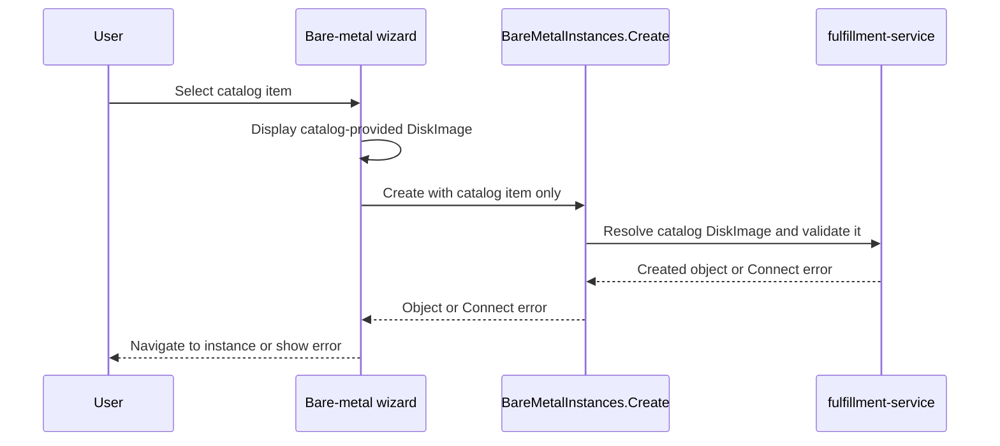

# Base OS Management for Bare-Metal Instances — UI Design

| Field       | Value |
|-------------|-------|
| Author(s)   | Rastislav Wagner |
| Jira        | [OSAC-1270](https://redhat.atlassian.net/browse/OSAC-1270) |
| Design task | [OSAC-2662](https://redhat.atlassian.net/browse/OSAC-2662) |
| PRD         | [prd.md](prd.md) |
| Date        | 2026-09-10 |

# 1. Overview

This design integrates the catalog-provided DiskImage into the existing tenant bare-metal provisioning wizard. The wizard remains catalog-first: every BM catalog item supplies a DiskImage, the wizard displays that image as read-only, and the backend adds the resolved reference to the created BaremetalInstance. The UI does not select, replace, or submit a DiskImage field. [PRD: §In Scope; User decision]

The design covers the osac-ui behavior tracked by OSAC-2662: displaying the catalog-provided image in the configuration and review surfaces, submitting the catalog item without a DiskImage request field, and presenting create errors. DiskImage CRUD, lifecycle transitions, deletion protection, backend resolution, protobuf/database implementation, and provisioning reconciliation remain owned by the corresponding backend/API work. [Codebase: `libs/ui-components/src/components/catalogProvision/`]

# 2. Goals and Non-Goals

## 2.1 Goals

- Extend the existing bare-metal catalog wizard to display the catalog-provided DiskImage without changing the VM or cluster adapters.
- Preserve the catalog item as the only image authority in the UI; do not add a picker, replacement control, or DiskImage form value.
- Submit the existing catalog-based create request and rely on fulfillment-service to add the effective DiskImage reference.
- Preserve the backend's lifecycle and visibility semantics in the created-resource response.
- Add behavioral unit/integration coverage for read-only display, request omission, backend-populated response behavior, and errors.

## 2.2 Non-Goals

- No new DiskImage CRUD, lifecycle, upload, or browsing page; those surfaces are defined by OSAC-2540 and already exist in the repository.
- No raw image URL or source-type entry field in the bare-metal wizard.

# 3. Motivation / Background

The current bare-metal wizard selects a catalog item and collects a name, project, SSH key, and user data. This design adds read-only presentation of the catalog-provided DiskImage in the configuration and review surfaces and aligns the create flow with the backend invariant that the catalog item supplies the image. The wizard must not turn the image into a user-editable form value or request field. [Codebase: `libs/ui-components/src/components/catalogProvision/wizard/adapters/bareMetalInstance/`]

The repository provides DiskImage lifecycle UI and catalog field-definition helpers. The implementation should use the catalog field-definition model and PatternFly read-only presentation rather than introducing a provisioning picker, a DiskImage query, or a second form model. [Codebase: `libs/ui-components/src/components/DiskImage/`; `libs/ui-components/src/components/catalogProvision/wizard/adapters/bareMetalInstance/`]

# 4. Design

## 4.1 Architecture

The existing `CatalogProvisionWizard` remains the composition root. The bare-metal adapter will use the catalog item as the source of the DiskImage and render its human-readable image value in the Configuration and Review steps. The image is read-only: the wizard will not create a Formik field for it, query the DiskImages collection, or expose a selector or replacement action. [User decision; Codebase: `libs/ui-components/src/components/catalogProvision/wizard/adapters/bareMetalInstance/`]



The diagram shows that the UI displays the catalog's image and submits the catalog-based request without a DiskImage field. Fulfillment-service resolves the image, applies authoritative visibility and lifecycle checks, and returns the created resource or an error.

### Form and component flow

1. The selected catalog item provides the DiskImage display value through its existing field definitions.
2. The Configuration step renders the DiskImage as read-only. No selector, edit affordance, Formik value, or `DiskImages.List` query is introduced.
3. The Review step repeats the same catalog-provided image value without exposing the raw image source.
4. `buildBareMetalInstanceCreatePayload` continues to emit the catalog item, metadata, run strategy, and other existing bare-metal fields; it does not add `spec.diskImage`.
5. Fulfillment-service resolves the catalog image and populates the created resource's `spec.diskImage` field.
6. `useCreateBareMetalInstance` returns the created object. Connect errors continue through the wizard's existing provision-error alert.

### Image presentation and backend ownership

- The UI displays the catalog-provided identity and any metadata already carried by the catalog item; it does not browse or filter DiskImages.
- Lifecycle validity, visibility, and whether the catalog reference can be used for a new instance are backend concerns.
- Global and tenant-scoped image visibility remains governed by OSAC-2540 and fulfillment-service. The UI does not infer access from tenant strings or construct cross-tenant queries.

## 4.2 Data Model / Schema Changes

No database or persistent UI schema changes are required. The UI will not add a DiskImage Formik field; it will display the catalog-provided value and consume the backend-populated response field.

| Surface | Field | Type | Constraint |
|---------|-------|------|------------|
| Catalog field definition | `spec.disk_image` | `google.protobuf.Value` | Existing catalog-item field-definition model; every BM catalog item supplies a DiskImage reference |
| Generated response/resource | `BareMetalInstanceSpec.diskImage` | `DiskImageReference` | Not sent by the UI; fulfillment-service derives it from the catalog item |

The current generated types expose both the legacy inline `image` field and `diskImage`. The UI does not edit generated files and does not send `diskImage` in the create request. Existing catalog-item field definitions remain the source of the read-only display; the backend guarantees that the selected BM catalog item contains a usable DiskImage reference. [User decision; Codebase: `libs/types/src/osac/public/v1/`]

## 4.3 API Changes

No new API endpoint is required. The UI continues to consume the existing catalog-item and bare-metal APIs. The create flow relies on the backend contract that fulfillment-service resolves the catalog item's DiskImage and populates the created resource.

The bare-metal create request remains catalog-based and omits `disk_image`:

```json
{
  "metadata": { "name": "node-01", "project": "project-a" },
  "spec": {
    "catalog_item": { "id": "catalog-item-id" },
    "run_strategy": "BARE_METAL_INSTANCE_RUN_STRATEGY_ALWAYS"
  }
}
```

The response consumed by the UI is:

```json
{
  "object": { "id": "bare-metal-instance-id" }
}
```

The UI behavior for the API contract is:

- The UI does not validate or submit a separate DiskImage field because the catalog invariant guarantees the backend can resolve it.
- If the catalog item is invalid or its image cannot be resolved, fulfillment-service returns the appropriate Connect error. The existing wizard error surface keeps the form open for correction of the catalog or retry.
- The UI does not query `DiskImages.List` or add a client-side tenant filter for this flow.

The backend remains responsible for the effective-image field and its compatibility behavior. The UI change preserves the existing catalog-based request shape and depends on the fulfillment-service implementation of the catalog invariant. [PRD: Dependencies; User decision]

## 4.4 Scalability and Performance

The UI adds no DiskImage list or get request to the provisioning flow. Rendering remains constant with respect to the number of DiskImages because the wizard renders only the catalog-provided value. Backend resolution and lifecycle validation use the existing fulfillment-service paths and are outside the UI performance budget.

## 4.5 Security Considerations

The UI never accepts an arbitrary image URL or source type for bare-metal provisioning. It submits the catalog item and lets fulfillment-service resolve the governed DiskImage reference. This prevents the provisioning user from bypassing catalog governance. [PRD: §Out of Scope; User decision]

Authentication, authorization, and tenant isolation remain unchanged. Fulfillment-service validates the catalog item's global or tenant-scoped DiskImage reference. The UI displays catalog metadata rather than the raw `sourceRef`, and the backend remains responsible for all final validation.

## 4.6 Failure Handling and Recovery

| Failure | UI behavior | Recovery |
|---------|-------------|----------|
| Catalog item does not contain a resolvable DiskImage | Fulfillment-service rejects the create request; the wizard stays open and shows the existing provision error. | Correct or replace the catalog item, then retry. |
| Catalog-provided image is inaccessible or no longer usable | Fulfillment-service returns the appropriate Connect error; the wizard stays open and preserves form state. | Correct the catalog reference or retry after backend state is repaired. |
| Create request fails transiently | The wizard remains on the review step, clears its pending state, and permits retry. | Retry after the service is available. |

The create operation remains idempotent from the UI perspective because a failed mutation does not clear the form. A successful response navigates to the created instance. Query caches for bare-metal instances are invalidated by the existing mutation hook.

## 4.7 RBAC / Tenancy

No new roles or permissions are required. The wizard displays the DiskImage associated with the selected catalog item. Global and tenant-scoped DiskImages use the visibility model defined by OSAC-2540; fulfillment-service remains authoritative for tenant isolation and create-time access checks. [PRD: User Stories]

## 4.8 Extensibility / Future-Proofing

The design deliberately keeps the DiskImage display coupled to the BM catalog item because the image is a catalog invariant, not a user-selected resource. Future provisioning flows may add their own image interactions, but this task does not introduce a generic picker abstraction or a second catalog schema.

# 5. Interface Changes

## IC-1: Read-only catalog DiskImage display

**Requirements:** PRD-R1, PRD-R2, PRD-R3, PRD-R4

The bare-metal Configuration and Review steps display the DiskImage supplied by the selected catalog item using existing PatternFly read-only presentation. The wizard provides no selector, replacement control, DiskImage list query, or raw source URL. See §4.1 and §4.5.

## IC-2: Backend-populated DiskImage and create feedback

**Requirements:** PRD-R1, PRD-R2

The wizard submits the catalog-based request without `spec.diskImage`; fulfillment-service resolves the catalog reference and populates the created resource. Connect failures remain in the wizard's inline provision-error surface without clearing form state. See §4.2, §4.3, and §4.6.

PRD-R5 is satisfied by fulfillment-service deletion protection and has no new osac-ui interface change. The existing DiskImage delete surface continues to display server-side deletion failures; backend integration tests must verify the reference checks.

# 6. Alternatives Considered

### User-selectable DiskImage in the provisioning wizard

- **Description:** Let the tenant choose or replace a DiskImage in the wizard and send the selected ID in the create request.
- **Pros:** Provides direct user control and early client-side lifecycle feedback.
- **Cons:** Contradicts the agreed BM catalog invariant, duplicates catalog authority, and allows the provisioning request to diverge from the catalog's immutable image.
- **Decision:** Rejected. The catalog item always supplies the image, and fulfillment-service adds it automatically.

### Raw URL input

- **Description:** Let the tenant enter an image URL and source type directly in the bare-metal request.
- **Pros:** Minimal UI change and no catalog lookup.
- **Cons:** Bypasses DiskImage discoverability, lifecycle, visibility, and governance requirements.
- **Decision:** Rejected because the BM catalog item is the governed source of the image reference.

# 7. Observability and Monitoring

No new metrics, events, or tracing spans are required. Existing Connect request metrics, query errors, mutation errors, toast alerts, and fulfillment-service reconciliation metrics cover the changed flow. The UI does not log DiskImage source references or credentials.

# 8. Impact and Compatibility

The backend API change from inline `image` to backend-populated `disk_image` remains coordinated with the fulfillment-service rollout. The osac-ui change preserves the existing bare-metal route and catalog wizard entry points and continues to submit the catalog-based request shape. Every catalog item used by this flow must satisfy the DiskImage invariant before provisioning.

The UI introduces no database migration, no new route, no new dependency, and no change to DiskImage management routes. It requires unit/integration tests in the existing Vitest suite; regenerated types are only needed if the upstream protobuf contract changes further. The PRD's end-to-end test requirement must run in the existing bare-metal E2E system outside this repository; the local Playwright harness is manual-only by project convention.
