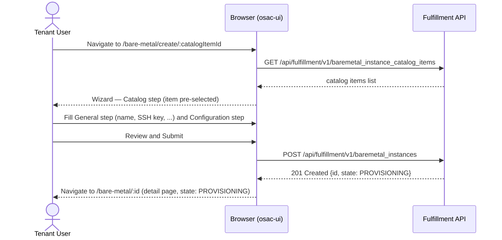

# BareMetal Instance UI

## Summary

This enhancement adds a tenant-facing Bare Metal section to the osac-ui web console, covering a catalog item browser (integrated into the existing Catalog page), a bare metal instance list, a create form (via the existing `CatalogProvisionWizard` adapter pattern), and a detail view with power and restart controls. See [PRD](prd.md) for detailed requirements.

## Motivation

The osac-ui console already supports Virtual Machine and Cluster provisioning. The BareMetalInstance API (see `/enhancements/baremetal-instance-api`) adds a third self-service resource type, but the UI has no tenant-facing screens for it. Without a console, tenants must use the gRPC/REST API directly to browse available bare metal offerings, provision instances, monitor lifecycle state, and control power — a workflow that is not viable for the typical Tenant User persona.

The existing `CatalogPage`, `CatalogItemCard`, `CatalogProvisionWizard`, and VM detail patterns are generic enough to extend with minimal duplication. The primary design constraint is reusing this infrastructure rather than introducing parallel implementations.

### Goals

- Reuse the existing `CatalogProvisionAdapter` interface and `CatalogProvisionWizard` for the bare metal create form.
- Follow the VM detail page structure (`ResourceDetailHeader` + action buttons + tabs) for the bare metal detail view.
- Extend the existing `CatalogPage` catalog item browser rather than creating a separate page.
- Add a dedicated "Bare Metal" nav item and `/bare-metal/*` route tree.
- Introduce no new shared UI infrastructure — bare metal is a consumer of existing patterns.

### Non-Goals

- Tenant Admin catalog item CRUD (create/edit/delete tenant-scoped `BareMetalInstanceCatalogItem`).
- Cloud Provider Admin flows (template and global catalog item management).
- Custom auto-polling logic — TanStack Query's built-in refetch intervals apply.
- User-facing documentation for this milestone.

## Proposal

The implementation extends three areas of the codebase:

1. **`apps/app-frontend`** — nav, routing, and page wiring for the new Bare Metal section.
2. **`libs/ui-components` (catalog)** — a "Provision" CTA on the catalog item drawer for bare metal items and bare metal items already visible in the Catalog page filter.
3. **`libs/ui-components` (bare metal pages and components)** — new list page, create page, detail page, action buttons, status label, conditions display, and a `CatalogProvisionAdapter` implementation.

The `BareMetalInstanceCatalogItem`, `BareMetalInstance`, and all associated API types are generated from the protobuf schema and already included in `@osac/types`. The two API query hooks (`useBareMetalInstances`, `useBareMetalInstanceCatalogItems`) already exist in `libs/ui-components/src/api/v1/baremetal-instance.ts`.

### Workflow Description

**Actors:** Tenant User and Tenant Admin (same UI flows).

**Starting state:** User is authenticated, the BareMetalInstance API is reachable, and at least one published `BareMetalInstanceCatalogItem` exists.

#### Browsing the catalog and starting provisioning

1. Tenant User navigates to **Catalog** in the sidebar.
2. Selects the "Bare Metal Machines" toggle on the `CatalogPage`.
3. Catalog item cards render title and description. No resource summary labels are shown — the current proto has no structured hardware profile fields; hardware is described in the free-text `title` and `description` only.
4. Clicking a card opens the `CatalogItemDetailDrawer` showing full Markdown-rendered description and a **"Provision bare metal"** button.
5. Clicking **"Provision bare metal"** navigates to `/bare-metal/create/:catalogItemId` with the catalog item pre-selected.

Alternatively, from the **Bare Metal** sidebar item:

1. Tenant User navigates to **Bare Metal** → `/bare-metal` (instance list).
2. Clicks the **"Create bare metal instance"** button.
3. Navigates to `/bare-metal/create` (no pre-selected catalog item).

#### Create form (wizard)

The `CatalogProvisionWizard` is reused with a `useBareMetalInstanceAdapter` following the `CatalogProvisionAdapter<BareMetalInstanceCatalogItem, BareMetalInstanceWizardValues, BareMetalInstanceCreateBody>` interface.

Wizard steps:
1. **Catalog** — select a `BareMetalInstanceCatalogItem` (pre-selected if launched from the catalog browser).
2. **General** — name (required), SSH public key (optional, OpenSSH format, client-side validated), user data (optional textarea, 64 KB client-side guard), image `source_ref` (optional OCI URL).
3. **Review** — summary of all field values.
4. Submit → `POST /api/fulfillment/v1/baremetal_instances`. On success → navigate to `/bare-metal/:id`.

The BM adapter follows the same catalog overlay pattern as the VM and cluster adapters (see `/enhancements/cluster-and-vm-provisioning-wizard`): static field paths are hardcoded in `BareMetalConfigurationStep`; catalog `field_definitions` overlay matching paths on the Configuration step only, controlling label (`display_name`), editability (`editable: false` → read-only control), default value, and `validation_schema`. The General step (name, SSH public key) ignores `field_definitions`.



The diagram shows the happy-path create flow. After the `POST` succeeds, the UI navigates to the new instance's detail page where the user can monitor the async provisioning progress.

#### Instance list

`/bare-metal` renders a `BareMetalListPage`:

- Columns: **Name** (link to `/bare-metal/:id`), **Catalog item**, **State** (state badge), **Age**, **Actions**.
- The **Actions** column contains power toggle, restart, and delete controls with identical disabled-state rules as the detail page (**Start** enabled only when STOPPED; **Stop** enabled only when RUNNING; restart only when RUNNING; delete disabled while DELETING). FAILED instances have Start and Stop both disabled — the delete/recreate path is the only recovery option.
- Create button navigates to `/bare-metal/create`.
- Empty state when no instances exist.
- TanStack Query refetch interval handles live updates.

#### Instance detail

`/bare-metal/:id` renders `BareMetalDetailsPage`:

- `ResourceDetailHeader` (breadcrumb: "Bare Metal" → instance name) + state badge.
- `BareMetalActionButtons` (right-aligned): **Start** (via `PATCH run_strategy`; enabled only when STOPPED), **Stop** (via `PATCH run_strategy`; enabled only when RUNNING), **Restart** (via `PATCH restart_requested_at`; enabled only when RUNNING), **Delete** (confirmation dialog; disabled while DELETING). FAILED instances have Start and Stop both disabled.
- Detail overview tab: spec summary card (catalog item, SSH key present/absent, user data present/absent, image if set) + conditions list (always rendered; relevant when FAILED).

No special FAILED-state recovery CTA — the conditions list provides the error details.

### API Extensions

No new API extensions. The feature consumes the existing `BareMetalInstance` and `BareMetalInstanceCatalogItem` public REST endpoints from the fulfillment-service. No CRDs, webhooks, or finalizers are introduced by this UI change.

New API mutation hooks added to `libs/ui-components/src/api/v1/baremetal-instance.ts`:

| Hook | Method | Endpoint |
|------|--------|----------|
| `useCreateBareMetalInstance` | `POST` | `/api/fulfillment/v1/baremetal_instances` |
| `usePatchBareMetalInstance` | `PATCH` | `/api/fulfillment/v1/baremetal_instances/{object.id}` |
| `useDeleteBareMetalInstance` | `DELETE` | `/api/fulfillment/v1/baremetal_instances/{id}` |

The PATCH hook sends only the mutated fields (`run_strategy` or `restart_requested_at`), consistent with the existing `usePatchComputeInstance` pattern.

### Implementation Details/Notes/Constraints

#### File layout

New files in `libs/ui-components/src/`:

```
api/v1/baremetal-instance.ts        (exists; add mutation hooks)
components/bm/
  BareMetalStatusLabel.tsx           state badge (PROVISIONING/RUNNING/FAILED/DELETING)
  BareMetalConditionsList.tsx        conditions table/list from status.conditions
  BareMetalActionButtons.tsx         power toggle + restart + delete (list and detail)
  DetailsPage/
    BareMetalDetails.tsx             top-level detail layout (mirrors VmDetails)
    BareMetalDetailsCard.tsx         spec summary card
    BareMetalDeleteConfirmModal.tsx  confirmation dialog (mirrors VmDeleteConfirmModal)
pages/tenant/
  BareMetalListPage.tsx              list page (mirrors VmListPage)
  BareMetalCreatePage.tsx            create page wrapping CatalogProvisionWizard
  BareMetalDetailsPage.tsx           detail page (mirrors VmDetailsPage)
  BareMetalRoutes.tsx                nested /bare-metal/* router
catalogProvision/wizard/adapters/
  bareMetalInstanceAdapter.ts        CatalogProvisionAdapter implementation
  bareMetalInstance/
    fields.ts                        BareMetalInstanceWizardValues type
    generalFields.ts                 resolveGeneralFields implementation
    payload.ts                       buildCreatePayload + createEmptyValues
    schemas.ts                       per-step Yup schemas
    BareMetalConfigurationStep.tsx   ConfigurationStep component
```

#### Nav and routing changes (`apps/app-frontend`)

`shellNav.ts` — add to `getTenantUserNav`:
```ts
{ id: 'bare-metal', label: t('Bare Metal'), path: '/bare-metal' }
```

`AppShell.tsx` — add routes:
```tsx
<Route path="/bare-metal/*" element={<RoleRoute allow={['tenantUser', 'tenantAdmin']} ...><BareMetalRoutes /></RoleRoute>} />
```

`BareMetalRoutes.tsx` handles:
- `/bare-metal` → `BareMetalListPage`
- `/bare-metal/create/:catalogItemId?` → `BareMetalCreatePage`
- `/bare-metal/:id` → `BareMetalDetailsPage`

#### Catalog page CTA for bare metal

The existing VM CTA in `CatalogPage.tsx` is conditional on `kind === 'vm'`. A parallel branch is added for `kind === 'bm'` navigating to `/bare-metal/create/${item.id}`.

#### `useBareMetalInstanceAdapter`

Implements `CatalogProvisionAdapter<BareMetalInstanceCatalogItem, BareMetalInstanceWizardValues, BareMetalInstanceCreateBody>` following the exact same structure as `useComputeInstanceAdapter`.

`BareMetalInstanceWizardValues`:
```ts
interface BareMetalInstanceWizardValues {
  catalogItemId: string;
  metadata: { name: string };
  spec: {
    sshPublicKey: string;          // optional, validated as OpenSSH format
    userData: string;              // optional, max 64 KB enforced in Yup schema
    image: { sourceRef: string };  // optional; sourceType hardcoded to "registry" in payload builder
  };
}
```

SSH key validation: Yup `.matches(/^(ssh-rsa|ssh-ed25519|ecdsa-sha2-nistp\d+)\s+\S+/, ...)` on the non-empty case.

User data size guard: Yup `.test('max-64kb', ..., (v) => !v || new Blob([v]).size <= 65536)`.

`BareMetalConfigurationStep`: static fields are user data (textarea) and image `source_ref` (text input). No run strategy field — power state is managed post-creation via the start/stop action. Catalog `field_definitions` overlay these fields following the same table as the VM adapter: `editable: false` renders the field read-only with the catalog default; `display_name` overrides the wizard label; `validation_schema` merges into Yup. SSH public key is in the General step and ignores `field_definitions`. No networking step — a no-op component is passed to the `NetworkingStep` slot.

#### `BareMetalActionButtons`

This component is rendered in two contexts: as an **Actions column** in each list row, and as the **action toolbar** on the detail page. It receives the `BareMetalInstance` object as a prop.

Start/stop toggle maps the current power state to a single button:
- Instance stopped (`run_strategy: HALTED`) → "Start" → PATCH `run_strategy: ALWAYS`
- Instance running (`run_strategy: ALWAYS` or unset) → "Stop" → PATCH `run_strategy: HALTED`
- Disabled when state is PROVISIONING or DELETING.

Restart: PATCH `restart_requested_at` to `new Date().toISOString()`. Disabled unless state is `RUNNING`.

Delete: opens `BareMetalDeleteConfirmModal` → `DELETE /api/fulfillment/v1/baremetal_instances/{id}` → navigate to `/bare-metal`. Disabled when state is `DELETING`.

#### State badge (`BareMetalStatusLabel`)

| API state | Label | PatternFly color |
|-----------|-------|------------------|
| PROVISIONING | Provisioning | blue |
| RUNNING | Running | green |
| FAILED | Failed | red |
| DELETING | Deleting | grey |
| unset / unknown | Unknown | grey |

#### Conditions list (`BareMetalConditionsList`)

Renders `status.conditions` as a `DescriptionList` or compact table showing condition type (human-readable label), status (True/False/Unknown), last transition time, and message. Rendered in the detail page overview tab — always visible.

### Security Considerations

The bare metal UI consumes the same public REST API as the VM and cluster UIs. All authentication is handled by the Go proxy (OIDC session cookie). OPA authorization is enforced server-side — the UI does not make authorization decisions. Tenant isolation is enforced by the fulfillment service.

SSH public key and user data are submitted as form fields over HTTPS and are not logged or stored client-side beyond the form lifetime. The UI applies client-side validation (OpenSSH format, 64 KB limit) to improve UX but does not rely on it for security — the server enforces the same constraints.

No new authentication, authorization, or data exposure surface is introduced by this change.

### Failure Handling and Recovery

| Failure | What the user sees | Recovery |
|---------|--------------------|----------|
| Catalog item list load fails | Error state in `CatalogItemListSection` with retry | TanStack Query automatic retry |
| Instance list load fails | Error inline on `BareMetalListPage` | TanStack Query automatic retry |
| Create form `POST` fails | Inline error on the Review step | User corrects input and resubmits |
| Detail page load fails | Full-page error state | User navigates back and retries |
| PATCH (power toggle or restart) fails | Inline error near the action buttons | User retries the action |
| DELETE fails | Error message in the confirmation modal | User retries |
| Instance in FAILED state | State badge "Failed" + conditions list with details | User deletes and recreates (API-level recovery) |

### RBAC / Tenancy

No new RBAC or tenancy changes. The UI is accessible to `tenantUser` and `tenantAdmin` roles (same `RoleRoute` guard as VMs and clusters). The API enforces tenant isolation server-side.

### Observability and Monitoring

No new observability changes. Existing monitoring mechanisms apply.

### Risks and Mitigations

**Risk:** Bare metal catalog cards show no resource summary labels. The current proto has no structured hardware profile fields — hardware is described only in `title` and `description` (Markdown text).
**Mitigation:** `CatalogItemCard` handles this gracefully — the resource label row is omitted when `resources.length === 0`. Title and description remain fully visible.

**Risk:** The `CatalogProvisionWizard` adapter interface requires a `NetworkingStep` slot, but bare metal has no networking step in this release.
**Mitigation:** A no-op `BareMetalNoNetworkingStep` component is passed to satisfy the interface. A null-rendering component has no user-visible impact.

### Drawbacks

The `CatalogProvisionWizard` was designed for flows with a networking step. Bare metal has none, requiring a no-op slot. The alternative — a bespoke create form — would avoid this mismatch but duplicate the wizard's multi-step navigation, error handling, and Formik integration. The reuse trade-off is accepted because the no-op slot has zero user-visible cost.

## Alternatives (Not Implemented)

**Separate "Bare Metal" catalog page.** A dedicated `/bare-metal/catalog` page could show only bare metal catalog items. Rejected because the existing `CatalogPage` already supports multi-type filtering and the tenant expects a single catalog entry point consistent with VM and cluster browsing.

**Bespoke create form (not using `CatalogProvisionWizard`).** A simpler single-page form without the wizard pattern. Rejected because bare metal provisioning has the same multi-step shape (catalog selection → general fields → review) and the wizard's Formik integration, validation orchestration, and catalog item selection UX are directly applicable.


## Test Plan

Unit tests (Vitest + React Testing Library):
- `BareMetalStatusLabel` — renders correct label and color for each `BareMetalInstanceState` value.
- `BareMetalActionButtons` — power toggle and restart buttons disable correctly per state; delete modal opens and closes.
- `useBareMetalInstanceAdapter` — `buildCreatePayload` produces correct wire format; SSH validation rejects non-OpenSSH keys; user data validation rejects payloads > 64 KB.
- `BareMetalConditionsList` — renders condition type, status, and message; handles empty conditions.

Tricky areas: SSH key validation edge cases (ECDSA key variants), user data size boundary (exactly 64 KB vs 64 KB + 1 byte), power toggle state when `run_strategy` is unset.

## Graduation Criteria

Graduation criteria will be defined when targeting a release. Expected progression: Dev Preview (all four screens functional end-to-end with a real BCM backend) → Tech Preview (E2E tests in CI passing) → GA (production validated, documentation published).

## Upgrade / Downgrade Strategy

This is a new UI section with no impact on existing pages. Downgrade requires reverting the nav entry and route additions; no data migration is needed.

## Version Skew Strategy

The UI consumes the BareMetalInstance public API endpoints. If the fulfillment-service does not yet expose these endpoints, the instance list and detail pages display TanStack Query error states. No data corruption occurs. Upgrading the fulfillment-service restores functionality without requiring a UI restart.

## Support Procedures

**Symptom:** Catalog item browser shows no bare metal items.
**Diagnosis:** `GET /api/fulfillment/v1/baremetal_instance_catalog_items` returns no items with `published: true`. Cloud Provider Admin has not published any catalog items.
**Resolution:** Cloud Provider Admin publishes a `BareMetalInstanceCatalogItem` via the private API.

**Symptom:** Create form submission fails with a 404 on the catalog item ID.
**Diagnosis:** The selected catalog item was deleted or unpublished between catalog load and form submission.
**Resolution:** User returns to the catalog, selects a currently published item, and retries.

## Infrastructure Needed

None.
