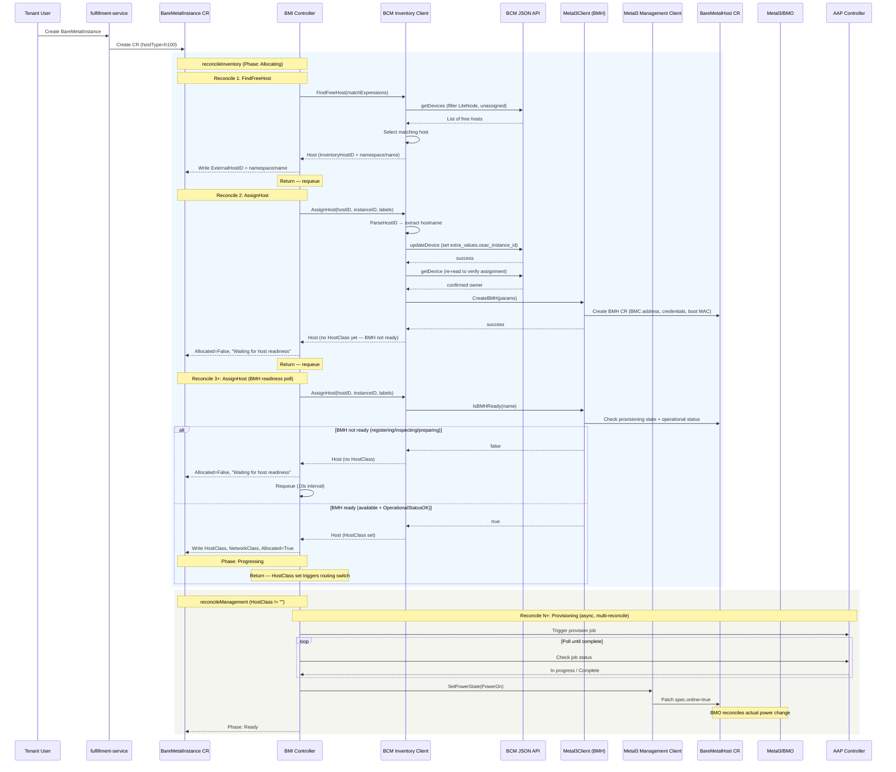

# BCM Backend Integration for BMaaS

## Summary

This design adds NVIDIA Base Command Manager (BCM) as a pluggable inventory
backend for the bare-metal-fulfillment-operator, using a hybrid architecture:
BCM serves as the inventory source of truth while Metal3 BareMetalHost CRs
handle power management. See [PRD](prd.md) for detailed requirements.

## Motivation

The bare-metal-fulfillment-operator provisions bare metal hosts through a
pluggable backend interface defined in OSAC-1032. Customers who manage their
bare metal infrastructure through BCM cannot fulfill BareMetalInstance
requests through OSAC without a BCM inventory backend.

Adding BCM also validates that the pluggable architecture accommodates
inventory sources with different characteristics: BCM has no native assignment
concept, no optimistic locking, and introduces a host readiness delay when
bridging to Metal3 for power management. Solving these constraints within the
existing interface proves the architecture is extensible to future backends
(Netbox, NICo).

### Goals

- Add BCM as a new inventory backend for bare metal provisioning.
- Manage hosts where OSAC controls the OS (BCM LiteNode equivalent).
- Use Metal3 as the management backend for power control.
- Keep the integration transparent to tenants — no API or workflow changes.
- Support E2E testing in CI without a real BCM instance via a BCM simulator.

### Non-Goals

- Sysinfo-based hardware auto-classification from BCM. Host type matching uses
  admin-assigned labels.
- BCM power control via BCM API. Power control goes exclusively through
  Metal3/BMH.
- PhysicalNode support. Only LiteNode is supported — OSAC manages the OS.
  [Locked: D4]
- Multi-backend deployments. Each deployment uses one inventory backend.
  [Locked: D9]
- Automated node registration in BCM. Admins pre-register LiteNodes as a Day-0
  prerequisite. [Locked: D5]

## Proposal

The BCM backend consists of three components:

1. **BCM Go HTTP client** — a lightweight JSON API client with mTLS
   authentication that wraps BCM's `cmdevice` service calls (`getDevices`,
   `getDevice`, `updateDevice`).

2. **Metal3Client BMH operations** — the existing Metal3 inventory client
   (`internal/inventory/metal3.go`) is extended with `CreateBMH`,
   `DeleteBMH`, and `IsBMHReady` methods for on-demand BareMetalHost CR
   management. Since BMH CRs are Metal3 resources, these operations
   belong on Metal3Client. Both `bcm.go` and `metal3.go` are in the same
   package (`internal/inventory`), so BCM references Metal3Client directly.

3. **BCM inventory client** (`internal/inventory/bcm.go`) — implements the
   `inventory.Client` interface. `FindFreeHost` queries BCM for unassigned
   LiteNodes. `AssignHost` writes the assignment identifier to BCM
   `extra_values` and delegates BMH creation to Metal3Client.
   `UnassignHost` clears `extra_values` and delegates BMH deletion to
   Metal3Client.

The BCM backend integrates through two new components: a BCM HTTP client
for inventory operations and Metal3Client's BMH operations for on-demand
BareMetalHost CR management. The on-demand BMH readiness delay (unique
to BCM because BMH CRs are created at assignment time) is handled within
the inventory path — Metal3Client's `IsBMHReady` polls the BMH
provisioning state until it reaches `available`. The BMI stays in
`Allocating` phase (`Allocated=False`) until the BMH is ready, then
`HostClass` is set and the controller routes to the management path. The
existing controller, CRDs, and API remain unchanged.

### Workflow Description

#### Day-0: Admin Configures BCM Backend

**Actor:** Cloud Infrastructure Admin
**Starting state:** bare-metal-fulfillment-operator deployed, LiteNodes
pre-registered in BCM.

1. Admin creates a Kubernetes Secret `bcm-certs` containing the mTLS client
   certificate and key for BCM access.
2. Admin creates the inventory configuration (`inventory.yaml`) as a
   Kubernetes Secret:
   ```yaml
   name: bcm-inventory
   type: bcm
   hostClass: bcm
   networkClass: cudn_net
   options:
     bcm:
       url: "https://bcm-head:8081"
       credentialsSecret: "bcm-certs"
       insecureSkipVerify: false
      ```
3. Admin sets the management configuration in Kubernetes Secret
   `osac-management-config` to Metal3:
   ```yaml
   name: metal3-management
   type: metal3
   options:
     metal3:
       namespace: "osac-baremetal"
   ```
4. Admin deploys or restarts the operator. The operator loads the BCM
   inventory client and Metal3 management client. The operator extracts
   the Metal3 namespace from the management config and provides it to
   the BCM inventory client — the BMH namespace is configured in one
   place only (the management config).

#### Day-2: Tenant Provisions a BareMetalInstance

**Actor:** Tenant User (via fulfillment-service API)
**Starting state:** BCM backend configured, LiteNodes available in BCM.



The diagram shows the full provisioning flow across multiple reconcile loops.
Key architectural points:

- **Reconcile boundaries:** FindFreeHost and AssignHost happen in separate
  reconcile loops. ExternalHostID is persisted to the CR between them, making
  the flow crash-safe at every boundary.
- **HostClass routing switch:** The controller routes to `reconcileInventory`
  when `Spec.HostClass` is empty and to `reconcileManagement` when it is set.
  AssignHost writes HostClass, which is a one-way gate — all subsequent
  reconciles go to the management path.
- **Stable ExternalHostID format:** FindFreeHost constructs the
  `namespace/name` format upfront (e.g., `osac-baremetal/node001`) using the
  Metal3 namespace (from management config) and the BCM hostname. ExternalHostID never changes
  after FindFreeHost — consistent with Metal3 and OpenStack backends.
  AssignHost extracts the BCM hostname via `ParseHostID` for BCM API calls.
- **Async provisioning:** The AAP provision template is triggered as a job
  and polled across multiple reconcile loops, not a synchronous call.
- **BMH readiness in inventory path:** Unique to the BCM backend because
  the BMH is created on-demand. After `AssignHost` creates the BMH, the
  BMI stays in `Allocating` phase (`Allocated=False`) until
  `IsBMHReady` confirms the BMH has reached `available` state with
  `OperationalStatusOK`. Only then does `AssignHost` return `HostClass`,
  triggering the routing switch to `reconcileManagement`. This keeps
  the BMI status accurate — "Allocating" means the host is not yet
  usable, "Progressing" means provisioning is underway on a ready host.
  No changes to `GetPowerState` or `reconcileManagement` are needed.

#### Deprovisioning Flow

**Starting state:** BareMetalInstance in Ready state.

1. User deletes the BareMetalInstance.
2. Controller runs `handleDeletion`:
   a. Management cleanup: triggers AAP deprovision template (wipes OS, detaches
      networks, powers off via Metal3). Removes management finalizer.
   b. Inventory cleanup: calls `UnassignHost` which clears
      `extra_values.osac_instance_id` in BCM and delegates BMH deletion to the
      BMH lifecycle manager. Removes inventory finalizer.
3. Kubernetes deletes the BareMetalInstance CR.

#### Error: BCM Unreachable

When the BCM JSON API is unreachable (connection refused, TLS handshake
failure, timeout), the controller:

1. Sets the BareMetalInstance condition `Allocated=False` with reason
   `BCMConnectionError` and a message identifying BCM as the failing component.
2. Returns the error to controller-runtime (`return ctrl.Result{}, err`),
   which applies its built-in rate-limited exponential backoff. This is the
   same behavior as any other inventory backend error — no BCM-specific
   retry logic is needed.
3. The status message is visible to the user: "BCM inventory backend
   unreachable: \<error detail\>".

### API Extensions

**New finalizer:** None — reuses the existing `osac.openshift.io/inventory`
finalizer.

**New CRDs:** None.

**Modified resources:**
- `BareMetalHost` CRs (metal3.io/v1alpha1) — created on-demand during
  `AssignHost` and deleted during `UnassignHost`. These are owned by the
  operator, not by users. If the operator is down, existing BMH CRs remain
  and Metal3 continues managing power for already-provisioned hosts. New
  provisioning requests queue until the operator recovers.

## UX Alignment

No `@temp-api` file exists for BareMetalInstance in osac-ux. BCM is transparent
to tenants — no UI changes are required. [Locked: D8]

### Implementation Details/Notes/Constraints

#### BCM Go HTTP Client

A new package `internal/inventory/bcm/` (or a file `internal/inventory/bcm.go`)
implements the HTTP client for BCM's JSON API.

**Authentication:** mTLS with client certificate and key. The JSON API does not
accept basic auth. [Locked: D10]

**Transport configuration:**
```go
type BCMClientConfig struct {
    URL                string `json:"url"`
    CredentialsSecret  string `json:"credentialsSecret"`
    InsecureSkipVerify bool   `json:"insecureSkipVerify"`
}
```

**API call pattern:** JSON API calls use `POST /json` with a body of
`{"service": "<svc>", "call": "<method>", "args": <args>}`. Args are positional
arrays, not named objects. The version check uses a REST endpoint
(`GET /rest/v1/version`) — same mTLS authentication, no additional
credentials needed.

**Key API endpoints used:**

| Operation | Endpoint | Args | Returns |
|-----------|----------|------|---------|
| Check BCM version | `GET /rest/v1/version` | — | `{cm_version, cmd_version, build_hash, build_index, database_version}` |
| List all devices | `POST /json` `cmdevice.getDevices` | `[]` | Array of device objects |
| Get single device | `POST /json` `cmdevice.getDevice` | `["<hostname>"]` | Device object or `null` |
| Update device | `POST /json` `cmdevice.updateDevice` | `[<full device object>]` | `{success: bool, validation: []}` |

**Critical constraint — full-object replacement:** BCM's `updateDevice`
requires the entire device object, not partial updates. The client must read
the device via `getDevice`, modify `extra_values`, and send the full object
back via `updateDevice`. All calls use `POST /json` — "read-modify-write"
describes the application pattern, not HTTP methods. Sending only changed
fields causes validation errors (`NOT_NULL` on required fields like
`partition`).

**`getNode` vs `getDevice`:** `getNode` returns `null` for LiteNodes without
error. The client must always use `getDevice`.

**Error handling:** The client maps BCM error responses to typed Go errors:

| BCM Response | Go Error |
|-------------|----------|
| TCP connection refused / timeout | `ErrBCMConnectionFailed` |
| TLS handshake failure | `ErrBCMTLSFailed` |
| `{"errormessage": "certificate..."}` | `ErrBCMAuthFailed` |
| `{"success": false, "validation": [...]}` | `ErrBCMValidation` (wraps validation details) |
| `null` response for `getDevice` | Not an error — device not found |
| HTTP 5xx | `ErrBCMServerError` |

#### Metal3Client BMH Operations

The existing Metal3 inventory client (`internal/inventory/metal3.go`) is
extended with three methods for on-demand BareMetalHost CR management.
Since BMH CRs are Metal3 resources, these operations belong on
Metal3Client. Both `bcm.go` and `metal3.go` are in the same package
(`internal/inventory`), so BCM references `*Metal3Client` directly
without cross-package coupling.

```go
type BMHCreateParams struct {
    Name              string
    BMCAddress        string
    CredentialsSecret string
    BootMACAddress    string
    ConsumerRef       *corev1.ObjectReference
    Labels            map[string]string
}

func (m *Metal3Client) CreateBMH(ctx context.Context, params BMHCreateParams) error
func (m *Metal3Client) DeleteBMH(ctx context.Context, name string) error
func (m *Metal3Client) IsBMHReady(ctx context.Context, name string) (bool, error)
```

**`CreateBMH`** creates a BareMetalHost CR in the configured namespace.
Sets `spec.online = false` (the controller manages power via
`reconcileManagement`). Idempotent — if a BMH with the same name already
exists and its `spec.consumerRef` matches, treats it as success. If
`consumerRef` does not match (another instance owns the BMH), returns an
error.

**`DeleteBMH`** deletes a BareMetalHost CR by name (in the configured
namespace). Idempotent — ignores NotFound. Does not delete BMC credentials
Secrets (they are admin-managed and reusable).

**`IsBMHReady`** checks whether the BMH has completed Metal3 registration
and is ready for power management. Returns `true` when
`bmh.Status.Provisioning.State` is `available` and
`bmh.Status.OperationalStatus` is `OK`. Returns `false` while the BMH is
in `registering`, `inspecting`, or `preparing` state. Returns an error if
the BMH does not exist or has an error status. Callers distinguish
not-found from error-status via `apierrors.IsNotFound(err)` — no
additional method or typed error is needed.

**Wiring:** `main.go` creates the Metal3 inventory client when
`managementConfig.Type == "metal3"` and passes it to the BCM client
via the inventory `Config`:

```go
// main.go — automatic when management backend is Metal3
if managementConfig.Type == "metal3" {
    metal3Client, err := inventory.NewMetal3ClientForBMH(mgr.GetClient(), metal3Namespace)
    if err != nil {
        return fmt.Errorf("failed to create Metal3 BMH client: %w", err)
    }
    inventoryConfig.Metal3Client = metal3Client
}
inventoryClient, err := inventory.NewClient(ctx, &inventoryConfig)
if err != nil {
    return fmt.Errorf("failed to create inventory client: %w", err)
}
```

The `Config` struct gains an optional `Metal3Client` field. The BCM
constructor validates that `Metal3Client` is set during initialization —
if missing (i.e., management backend is not Metal3), the constructor
returns an error: "BCM inventory backend requires Metal3 management
backend." This
fail-fast validation prevents runtime panics from a nil lifecycle
manager. The Metal3 namespace is encapsulated in the manager — the
BCM client uses `metal3Client.namespace` to construct `namespace/name`
format `ExternalHostID` values in `FindFreeHost`. Inventory backends that
do not need on-demand BMH CRs (Metal3, OpenStack) ignore the field.

#### BCM Inventory Client

Implements `inventory.Client` and registers as `newClientFuncs["bcm"]` via
`init()`.
[Codebase: bare-metal-fulfillment-operator/internal/inventory/client.go]

**`FindFreeHost(ctx, matchExpressions) (*Host, error)`**

1. Calls `cmdevice.getDevices` to list all devices.
2. Filters client-side:
   - `childType == "LiteNode"` (hardcoded, per [Locked: D4])
   - `extra_values` is not `null`. Hosts with `extra_values: null` are
     skipped with a warning: "Host (hostname) has no extra_values
     configured — set resource_class and osac_bmc_credentials_secret
     in BCM extra_values during Day-0 registration"
   - `extra_values.resource_class` matches `matchExpressions["hostType"]`.
     Hosts without `resource_class` are skipped with a warning:
     "Host (hostname) has no resource_class in extra_values"
   - `extra_values.osac_instance_id` is absent (host is not already
     assigned)
   - hostname does not contain `/` (required because `namespace/name`
     composite IDs use `/` as delimiter — a hostname with `/` would cause
     `ParseHostID` to silently misparse the ID)
3. Shuffles candidates randomly (same pattern as OpenStack and Metal3 backends)
   to reduce contention.
4. Returns the first match as an `inventory.Host`:
   - `InventoryHostID` (which the controller writes to the CR's
     `Spec.ExternalHostID`) = `namespace/name` format (e.g.,
     `osac-baremetal/node001`) — constructed from the Metal3 namespace
     (encapsulated in the BMH lifecycle manager) and the BCM hostname.
     This ensures `ExternalHostID` is in the format the Metal3 management
     client expects from the start, consistent with how the Metal3 and
     OpenStack backends return it.
   - `HostType` = `extra_values.resource_class` (the same field used for matching)
   - `HostClass` = config `HostClass` (e.g., `"bcm"`)
   - `NetworkClass` = config `NetworkClass` (e.g., `"cudn_net"`)
   - `ManagedBy` = `shared.OsacDefaultManagedByValue` (`"baremetal"`)
5. Returns `nil, nil` if no matching free host is found.

**`AssignHost(ctx, inventoryHostID, bareMetalInstanceID, labels) (*Host, error)`**

1. Extracts the BCM hostname from `inventoryHostID` via
   `ParseHostID(inventoryHostID)` → `(namespace, hostname)`. Calls
   `cmdevice.getDevice(hostname)` to get the full device object.
   If `getDevice` returns `null` (device was removed from BCM), checks
   whether a BMH with that hostname already exists via
   `metal3Client.IsBMHReady`. If a BMH exists (CreateBMH succeeded in a
   prior reconcile), returns an error: "BCM device (hostname) no longer
   exists in BCM inventory but BareMetalHost CR exists — delete the
   BareMetalInstance or re-register the device in BCM." This prevents
   orphaned BMH CRs. If no BMH exists (device disappeared before
   CreateBMH), returns `nil, nil` — the controller clears
   ExternalHostID and retries FindFreeHost on the next reconcile.
2. Checks `extra_values.osac_instance_id`:
   - If present and **different** from `bareMetalInstanceID`, returns
     `nil, nil` (host taken by another instance, same contention
     convention as OpenStack/Metal3).
   - If present and **equals** `bareMetalInstanceID`, the assignment is
     already done — skips steps 3-5 (no BCM write) and proceeds
     directly to step 6 (CreateBMH, idempotent) and step 7
     (IsBMHReady). This avoids unnecessary full-object writes during
     BMH readiness polling.
3. Sets `extra_values.osac_instance_id = bareMetalInstanceID` on the device
   object. If BMC address discovery (Priority 2) was performed, also sets
   `extra_values.osac_bmc_address` to the validated BMC URL — the single
   `updateDevice` call persists both fields in a single request, ensuring
   the discovered address is cached for future assignments. No tenant data is
   stored — only the opaque instance ID and infrastructure metadata.
   [Locked: D14]
4. Calls `cmdevice.updateDevice` with the full modified device object.
5. **Verify-after-write:** Re-reads the device via `getDevice` and confirms
   `extra_values.osac_instance_id` still equals `bareMetalInstanceID`. If not,
   another writer overwrote the assignment — returns `nil, nil`.
   **Concurrency note:** The operator's process-local mutex
   (`inventory.TryLock`) and controller-runtime leader election already
   prevent concurrent allocations from the same operator deployment. The
   verify-after-write serves as defense-in-depth against external writers
   (e.g., manual BCM edits or a second deployment without leader election).
   Neither the OpenStack nor Metal3 backends implement verify-after-write —
   they rely on the lock and leader election alone. The BCM backend adds the
   extra check because BCM lacks the optimistic concurrency that Kubernetes
   provides for Metal3 BMH updates.
6. Delegates BMH creation to the BMH lifecycle manager by calling
   `metal3Client.CreateBMH(ctx, BMHCreateParams{...})` with:
   - `Name` = hostname extracted from `ParseHostID` (step 1)
   - `Labels`:
     - `osac.openshift.io/managed-by` = `"baremetal"`
   - `BMCAddress` = resolved via the layered BMC discovery strategy
     (see "BMC Address Discovery" section below)
   - `CredentialsSecret` = read from
     `extra_values.osac_bmc_credentials_secret` — a pre-existing K8s Secret
     created by the admin or setup tooling during Day-0
   - `BootMACAddress` = device MAC from BCM
   - `ConsumerRef` = `{apiVersion: "osac.openshift.io/v1alpha1", kind:
     "BareMetalInstance", name: bareMetalInstanceID}`
   The namespace is encapsulated in the manager (from management config).
   `CreateBMH` sets `spec.online = false` — the controller manages power
   via `reconcileManagement`.
7. Calls `metal3Client.IsBMHReady(ctx, hostname)` to check BMH readiness:
   - If not ready (`registering`, `inspecting`, `preparing`): returns
     `Host` **without** `HostClass`. The controller stays in
     `reconcileInventory` with `Allocated=False`.
   - If ready (`available` + `OperationalStatusOK`): returns `Host`
     **with** `HostClass` set. The controller writes `HostClass` to the
     CR, sets `Allocated=True`, and transitions to
     `reconcileManagement`.
8. Returns the `Host` struct with the same `InventoryHostID`
   (`namespace/name`) it received — the format is already correct since
   `FindFreeHost` constructed it upfront.

**Partial failure recovery:** The ordering of operations (BCM write before BMH creation) is deliberate. If the operator crashes after writing `osac_instance_id` to BCM but before creating the BMH, the next reconcile calls `AssignHost` again with the same `bareMetalInstanceID`. The BCM client detects that `osac_instance_id` already matches (step 2), skips the write, and proceeds to call `CreateBMH` — idempotent recovery. If BMH creation fails after a successful BCM write, the controller retries on the next reconcile. The `osac_instance_id` in BCM acts as a reservation — no other instance can claim the host. During unassignment, the same principle applies: BCM update (clearing `osac_instance_id`) before BMH deletion. If the operator crashes after clearing BCM but before deleting the BMH, the next reconcile retries `UnassignHost` — steps 3-4 are idempotent no-ops when `osac_instance_id` is already cleared, then `DeleteBMH` (step 5) removes the orphaned BMH. If the operator crashes before the BCM update, nothing has changed — the full unassign retries from the start. Both paths are idempotent.

**`UnassignHost(ctx, inventoryHostID, labels) error`**

1. Parses `inventoryHostID` using `ParseHostID(inventoryHostID)` to extract
   `(namespace, hostname)` — does NOT read the BMH to get the hostname.
2. Calls `cmdevice.getDevice(hostname)` to get the full device. If BCM
   returns `null` (device not found), treats the device as already cleaned
   up and skips to step 5.
3. Reads `extra_values.osac_instance_id`. If the ID is absent (already
   cleared in a prior attempt), skips to step 5 (BMH cleanup only).
   If the ID is present, checks the existing BMH's `ConsumerRef.Name`
   — if it differs from the device's `osac_instance_id`, the host was
   reassigned during a crash-recovery retry, so skips steps 4-5 and
   returns `nil`. If ownership is confirmed, removes `osac_instance_id`
   AND the labels passed in the `labels` parameter from `extra_values`.
   Preserves admin-configured keys (`osac_bmc_address`,
   `osac_bmc_credentials_secret`, `resource_class`) and any non-OSAC
   metadata.
4. Calls `cmdevice.updateDevice` with the modified device.
5. Delegates BMH deletion to Metal3Client by calling
   `metal3Client.DeleteBMH(ctx, name)`. The BMC credentials Secret
   is not touched — it is admin-managed and reusable for future assignments
   of the same host.

This approach is idempotent — `DeleteBMH` ignores NotFound if the BMH is
already deleted. If the BCM device is not found (returns null), it is treated
as already cleaned up.

**InventoryHostID format:** `FindFreeHost` constructs `InventoryHostID` in
`namespace/name` format upfront (e.g., `osac-baremetal/node001`) using the
Metal3 namespace (from management config) and the BCM hostname. This format is stable
throughout the lifecycle — `AssignHost` and `UnassignHost` both receive the
same `namespace/name` value and extract the BCM hostname via `ParseHostID`.
The BMH `metadata.name` equals the BCM hostname, so the mapping is
deterministic and reversible.

#### BMC Address Discovery (Layered Strategy)

When `AssignHost` creates a BMH CR, it needs `spec.bmc.address` (the full BMC
URL) and `spec.bmc.credentialsName` (a K8s Secret). This is a consequence of
the hybrid architecture [Locked: D1, D2]: BCM handles inventory but Metal3
handles power management. Metal3 requires `spec.bmc.address` on every
BareMetalHost CR to communicate with the host's baseboard management
controller for power operations (on/off/reboot via IPMI or Redfish). BCM
itself already knows how to reach each host's BMC, but it does not expose this
in a format Metal3 can consume — the operator must bridge the gap.

The BCM backend uses a layered strategy that accommodates different deployment
scenarios:

**Priority 1 — Pre-configured BMC address in `extra_values`:**
If `extra_values.osac_bmc_address` exists on the BCM device, use it directly
as `spec.bmc.address`. This allows admins or tooling to provide a
fully-formed BMC URL (e.g.,
`redfish-virtualmedia+https://10.141.0.1/redfish/v1/Systems/1`) during Day-0
registration. No Redfish discovery or network access to BMC is required.

**Priority 2 — Extract from BCM device data + Redfish discovery:**
If no pre-configured address exists, the client reads the BCM device's
`interfaces` array for `childType == "NetworkBmcInterface"`:
- The interface `ip` field provides the BMC IP address.
- The interface `name` determines the BMC protocol:
  `rf0` → Redfish, `ipmi0` → IPMI, `ilo0` → iLO, `drac0` → iDRAC.
  [Codebase: osac-aap/collections/.../plugins/filter/bcm.py lines 4-9]
- For IPMI: the URL is `ipmi://<bmc_ip>` — no further discovery needed.
- For Redfish/iDRAC/iLO: the client must discover the system path by
  querying the BMC's Redfish API:
  1. `GET https://<bmc_ip>/redfish/v1/Systems/` → list of system URIs
  2. For each system, fetch `EthernetInterfaces` and read MAC addresses
  3. Match the host's `bootMACAddress` to find the correct system path
  4. Construct: `redfish-virtualmedia+https://<bmc_ip><system_path>`
  5. Validate the constructed URL by making a Redfish health check call
     to the BMC. If it fails, return an error rather than caching a
     broken URL.

**BMC target validation:** Before making any outbound connection to a BMC IP (for Redfish discovery or health check), the client validates the target:

   - Allowed URL schemes: `https`, `ipmi`, `redfish-virtualmedia+https`, `idrac-virtualmedia+https`, `ilo5-virtualmedia+https` (`https` is used for Redfish discovery; the composite `<protocol>+https` forms match what Priority 2 constructs and what Metal3 BMO expects). **IPMI transport security note:** the `ipmi://` scheme is included because some BMCs only support IPMI. The operator does not make IPMI connections itself — it sets `spec.bmc.address` on the BMH CR. Metal3/BMO delegates to Ironic, which uses IPMI 2.0 (RMCP+) by default. IPMI transport encryption and cipher suite selection are governed by Ironic's `[ipmi]/cipher_suite_versions` configuration. Deployments should isolate BMC traffic on a dedicated out-of-band network.
   - Rejected targets: loopback addresses (`127.0.0.0/8`, `::1`), link-local (`169.254.0.0/16`, `fe80::/10`), cloud metadata endpoints (`169.254.169.254`)
   - Rejected ports: only standard BMC ports are accepted (443 for Redfish, 623 for IPMI)
   - If validation fails, the client returns an actionable error and does NOT cache the invalid URL

- The validated URL is cached in BCM `extra_values.osac_bmc_address` so
  subsequent assignments skip discovery entirely (Priority 1 applies).

**Priority 3 — Fail with actionable error:**
If neither `extra_values.osac_bmc_address` nor a `NetworkBmcInterface` exists,
`AssignHost` returns an error: "BMC info not available for host \<hostname\> —
configure osac_bmc_address in BCM extra_values or register the node with BMC
interface data."

**BMC credentials:** The admin or setup tooling pre-creates a K8s Secret
with BMC credentials (`username`, `password` keys) in the Metal3 namespace
during Day-0 and stores the Secret name in
`extra_values.osac_bmc_credentials_secret`. The operator reads this value
and sets it as `spec.bmc.credentialsName` on the BMH CR. If
`osac_bmc_credentials_secret` is not set, `AssignHost` fails with error:
"BMC credentials Secret not configured for host (hostname) — set
osac_bmc_credentials_secret in BCM extra_values."

**Redfish discovery requirements:**
- The operator pod must have network access to BMC IP addresses. If BMCs are
  on an isolated out-of-band network unreachable from the management cluster,
  use Priority 1 (pre-configured addresses) instead.
- A Go Redfish client library (`github.com/stmcginnis/gofish`) is required as
  a new dependency.
- BCM LiteNodes must be registered with `NetworkBmcInterface` data (via
  `bcm_add_lite_nodes.py` with the `bmc:` block in the inventory YAML)
  for Priority 2 BMC address discovery. Nodes registered without BMC
  interface data fall through to Priority 3.
- Admin must pre-create a BMC credentials Secret in the Metal3 namespace
  and store its name in `extra_values.osac_bmc_credentials_secret`.

#### BMH Readiness in Inventory Path

When the BMH is created on-demand (BCM backend), Metal3/BMO takes time to
register and inspect the host before it becomes available for power
operations. This readiness delay is handled within the inventory path,
not the management path — the BMI stays in `Allocating` phase
(`Allocated=False`) until the BMH is ready.

After `AssignHost` creates the BMH via `CreateBMH`, subsequent reconciles
call `AssignHost` again. The BCM client detects that the BCM assignment
is already done (step 2: `osac_instance_id` matches) and the BMH already
exists (step 6: `CreateBMH` is idempotent), then calls `IsBMHReady`:

1. If `IsBMHReady` returns `false` (BMH in `registering`, `inspecting`,
   or `preparing`), `AssignHost` returns `Host` without `HostClass`.
   The controller stays in `reconcileInventory`, sets
   `Allocated=False` with message "Waiting for host readiness", and
   requeues after `NoFreeHostsPollIntervalDuration`.
2. If `IsBMHReady` returns `true` (BMH in `available` with
   `OperationalStatusOK`), `AssignHost` returns `Host` with `HostClass`
   set. The controller writes `HostClass` to the CR, sets
   `Allocated=True`, and transitions to `reconcileManagement`.
3. If `IsBMHReady` returns an error (BMH not found, error status),
   `AssignHost` returns the error. The controller requeues with backoff.

The controller retries indefinitely until the BMH finishes registration.
There is no timeout — if the host never becomes ready, the tenant user
can delete the BareMetalInstance themselves. Operators monitor readiness
duration via the `osac_bcm_bmh_readiness_duration_seconds` Prometheus
metric and can alert on hosts that take unusually long.

No changes to `GetPowerState` or `reconcileManagement` are needed — by
the time the management path runs, the BMH is guaranteed to be in an
operational state.

#### Inventory Configuration

The BCM backend uses the same configuration pattern as OpenStack and Metal3
— YAML file at `OSAC_INVENTORY_CONFIG_PATH` (default
`/etc/osac/inventory/inventory.yaml`):

```yaml
name: bcm-inventory
type: bcm
hostClass: bcm
networkClass: cudn_net
options:
  bcm:
    url: "https://bcm-head:8081"
    credentialsSecret: "bcm-certs"
    insecureSkipVerify: false
```

The `options.bcm` sub-map is unmarshaled into `BCMClientConfig`. The
`credentialsSecret` field references a Kubernetes Secret containing:
- `tls.crt` — mTLS client certificate (required)
- `tls.key` — mTLS client key (required)
- `ca.crt` — CA certificate for verifying the BCM server's TLS identity
  (optional — if omitted, the system trust store is used)

When `insecureSkipVerify` is `false` (the production default), the client
verifies the BCM server's certificate against the CA in `ca.crt` or the
system trust store. `insecureSkipVerify: true` disables server verification
and should only be used in test environments.

Management configuration remains `type: metal3` — no change required.
[Locked: D2]

Networking is independent of the inventory backend. The existing OSAC
networking stack handles all network operations via the configured
`networkClass`. BCM has no networking role. [Locked: D12]

#### Helm Chart Changes

The operator Helm chart (`charts/operator/values.yaml`) adds:

```yaml
secrets:
  bcmCerts: "bcm-certs"  # K8s Secret with tls.crt and tls.key
```

The `credentialsSecret` field in the inventory config names the K8s Secret
directly — the operator reads it via the Kubernetes API at startup.

#### CaaS/BMaaS Coexistence

CaaS currently manages BCM nodes through a sync playbook
(`playbook_osac_import_bcm_agents.yml`) that creates BareMetalHost CRs for
all LiteNodes. CaaS will migrate to consume BCM nodes through the BMaaS API
(BareMetalInstance requests) by end of August 2026, making BMaaS the single
owner of the BCM node pool.

**Key constraint:** The sync playbook and BMaaS operator cannot run
simultaneously against the same nodes — they would create duplicate BMH CRs
pointing at the same physical BMC, causing Metal3 conflicts. The playbook
must be disabled before BMaaS goes live.

### Security Considerations

**mTLS credential management:** BCM client certificates are stored as
Kubernetes Secrets and mounted as files. The BCM HTTP client uses
`tls.Config.GetClientCertificate` with a filesystem watcher (same
`certwatcher.CertWatcher` the operator already uses for webhook and
metrics certs) to detect rotated certificates automatically. No operator
restart is needed for certificate rotation. [Locked: D10]

**Tenant isolation:** Only the opaque `osac_instance_id` (BareMetalInstance
UID) is written to BCM `extra_values`. No tenant name, namespace, or other
identifying data is exposed to BCM. A BCM administrator who needs tenant
context can query the fulfillment-service API using the instance ID.
[Locked: D14]

**BCM API access scope:** The operator requires `cmdevice.getDevices`, `cmdevice.getDevice`, `cmdevice.updateDevice`, and `GET /rest/v1/version` (startup version check, same mTLS auth). Production deployments SHOULD use a BCM certificate profile scoped to these methods rather than the `admin` profile. The `admin` profile (full CMDevice access) works but grants more permissions than needed. Creating a scoped profile is a BCM-side configuration step documented in the operator deployment guide — no code change is required.

**Input validation:** The BCM client validates all responses before use:
- Device hostname must be non-empty
- `extra_values` must be a valid JSON object or null
- MAC address must be non-empty and match the Metal3 BMH CRD pattern
  (`[0-9a-fA-F]{2}(:[0-9a-fA-F]{2}){5}`). Hosts with missing or malformed
  MAC are skipped with a warning
- BCM hostnames are used in BMH CR names — validated against Kubernetes naming
  rules (lowercase, DNS-safe)
- BCM hostnames must not contain `/` — the operator uses `/` as the
  delimiter in `namespace/name` composite IDs. Hosts with hostnames
  containing `/` are skipped during `FindFreeHost` with a warning:
  "Host (hostname) has invalid hostname — must not contain '/'"

### Failure Handling and Recovery

| Failure Mode | What Happens | Recovery | User Observes |
|-------------|-------------|----------|---------------|
| BCM unreachable during FindFreeHost | Controller returns error, requeues | Automatic retry (30s default) with controller-runtime backoff | BareMetalInstance stays in `Allocating`, condition message: "BCM inventory backend unreachable" |
| BCM unreachable during AssignHost | Controller returns error, requeues | Automatic retry. Assignment is idempotent — re-running with the same instance ID skips the write (step 2) | Same as above |
| BCM unreachable during UnassignHost | Controller returns error, requeues | Automatic retry. BMH CR may already be deleted; unassign is idempotent | BareMetalInstance stays in `Deleting` |
| Assignment race (another writer overwrites) | Verify-after-write detects mismatch, returns nil | Controller clears ExternalHostID, retries FindFreeHost on next reconcile | Brief delay, then allocates a different host |
| BMH not ready after creation | `IsBMHReady` returns `false`, `AssignHost` returns Host without HostClass | Controller stays in `reconcileInventory`, requeues with `Allocated=False` "Waiting for host readiness" | BareMetalInstance stays in `Allocating` |
| BMH never becomes ready (stuck) | `IsBMHReady` continues returning `false` indefinitely | Tenant user deletes the BareMetalInstance. Operators monitor via `osac_bcm_bmh_readiness_duration_seconds` metric and can alert on unusually long readiness times | BareMetalInstance stays in `Allocating` with "Waiting for host readiness" until user deletes it |
| BCM device removed during BMH readiness polling | `getDevice` returns null, AssignHost detects existing BMH, returns error | Admin re-registers the device in BCM or manually deletes the orphaned BMH and the BareMetalInstance | BareMetalInstance stuck in `Allocating` with error: "BCM device no longer exists but BMH is present" |
| BCM device removed while assigned (Ready) | Not detected — OSAC does not health-check assigned nodes in BCM. The instance continues in `Ready` state. When the user eventually deletes the instance, UnassignHost calls getDevice, gets null, treats it as already cleaned up | Deprovisioning completes normally despite the missing BCM device | No immediate impact. Known limitation — periodic health checks are a future enhancement |
| Operator restart mid-reconciliation | Controller restarts reconciliation from current CR state | Recovery depends on where the crash occurred: if ExternalHostID is not set, FindFreeHost runs fresh (nothing was committed); if ExternalHostID is set but HostClass is empty, AssignHost resumes (detects existing assignment via skip-write, retries CreateBMH + IsBMHReady); if HostClass is set, reconcileManagement resumes. All operations are idempotent, BMH creation uses deterministic name (BCM hostname) | No visible impact — reconciliation continues |
| AAP provision/deprovision failure | Handled by existing provisioning lifecycle | Existing retry and failure handling applies unchanged | BareMetalInstance shows `Failed` with AAP error details |
| mTLS certificate expired | All BCM API calls fail with TLS error | Admin replaces certificate Secret — certwatcher detects the new files automatically. No operator restart required | All BCM-backed instances stuck; status shows TLS error |

**Retry timeout consideration:** All BCM API failures (unreachable,
auth expired, server error) retry indefinitely following the existing
operator pattern — no backend today implements a "give up after N" timeout
for API failures. This means a BareMetalInstance can stay stuck in
`Allocating` or `Deleting` indefinitely if BCM remains unreachable.
BMH readiness also retries indefinitely — if a host never becomes ready,
the tenant user deletes the BareMetalInstance. Adding a bounded timeout
with a clear terminal error state would improve operational visibility
but affects all backends, not just BCM. This should be considered as a
cross-backend improvement tracked separately.

**Idempotency guarantees:**
- `FindFreeHost` is read-only and inherently idempotent.
- `AssignHost` checks existing assignment before writing — re-running with the
  same `bareMetalInstanceID` succeeds without side effects.
- `UnassignHost` handles already-unassigned hosts (null `extra_values`) and
  already-deleted BMH CRs gracefully.
- BMH creation uses a deterministic name (the BCM hostname) — creating an
  already-existing BMH returns a conflict error that `CreateBMH` handles by
  verifying the existing BMH's `consumerRef`.

### RBAC / Tenancy

**Tenant-facing RBAC:** No changes required. The BCM backend operates at the
infrastructure level — Cloud Infrastructure Admins configure it via
Kubernetes Secrets. Tenant isolation is enforced by the existing
fulfillment-service OPA policies and the BareMetalInstance controller's
namespace scoping. BCM is transparent to tenants. [Locked: D7]

**Operator RBAC:** The existing operator has `get`, `list`, `watch`, `update`,
`patch` on `metal3.io/baremetalhosts` and no Secret permissions. The BCM
backend requires one additional permission because it creates and deletes
BMH CRs (unlike existing backends that only update pre-existing resources):

- `metal3.io/baremetalhosts`: add `create` and `delete` verbs to the
  existing RBAC marker.

No Secret permissions are needed — the operator references pre-existing
BMC credential Secrets by name but never reads, creates, or deletes them.
Metal3 reads the Secrets directly using its own permissions.

### Observability and Monitoring

**New Prometheus metrics:**

| Metric | Type | Labels | Description |
|--------|------|--------|-------------|
| `osac_bcm_api_requests_total` | Counter | `method` (`getDevices`, `getDevice`, `updateDevice`), `status` (`success`, `error`) | Total BCM API calls |
| `osac_bcm_api_duration_seconds` | Histogram | `method` | BCM API call latency |
| `osac_bcm_hosts_available` | Gauge | `host_type` | Number of unassigned LiteNodes by host type (updated on each FindFreeHost call) |
| `osac_bcm_bmh_readiness_duration_seconds` | Histogram | — | Time from BMH creation to BMH ready state |

**Kubernetes events:**

| Event | Type | Reason | When |
|-------|------|--------|------|
| BCM host assigned | Normal | `BCMHostAssigned` | After successful AssignHost |
| BCM host released | Normal | `BCMHostReleased` | After successful UnassignHost |
| BCM connection error | Warning | `BCMConnectionError` | When BCM API is unreachable |

### Risks and Mitigations

| Risk | Likelihood | Impact | Mitigation |
|------|-----------|--------|------------|
| BCM API changes in future versions break the client | Low | High | Startup version check via `GET /rest/v1/version` (same mTLS auth) enforces minimum BCM version (10.25.03+). BCM JSON API has been stable across major versions |
| BMH readiness takes longer than expected | Medium | Low | Controller retries indefinitely with clear status messaging. Operators monitor via `osac_bcm_bmh_readiness_duration_seconds` metric and can alert on unusually long readiness times. Tenant user can delete the instance if they do not want to wait |
| Full-object replacement causes data loss if BCM schema changes | Low | Medium | GET immediately before PUT (minimize stale window). Log method name, hostname, and status code at debug level — never log full device objects (they may contain BMC credentials in `bmcSettings`) |
| Single-writer assumption violated (multiple operator replicas) | Low | High | Controller-runtime leader election ensures single active instance. Document this as a deployment requirement |
| BCM mTLS certificates expire | Medium | High | certwatcher detects the rotated certificate files automatically — no operator restart required. See Security Considerations |

### Drawbacks

The hybrid architecture (BCM inventory + Metal3 management) adds complexity
in one specific area: the operator must bridge to Metal3 by creating and
deleting BareMetalHost CRs on demand during assignment and unassignment. In
existing backends, hosts are pre-existing — the inventory client only marks
them as taken or releases them, never creates or deletes BareMetalHost CRs.

This complexity is mitigated by the BMH lifecycle manager, which
encapsulates BMH creation and deletion behind a reusable abstraction. The
BCM inventory client delegates BMH operations to this interface rather than
implementing them directly, keeping `AssignHost` and `UnassignHost` focused
on BCM-specific logic (API calls, `extra_values` management). Future
inventory backends that also need on-demand BMH CRs can reuse the same
interface without duplicating BMH lifecycle code.

The ordering of operations (BCM write before BMH creation) and idempotency
guarantees ensure crash-safe recovery between BCM and Kubernetes — a crash
at any point recovers cleanly on the next reconcile.

This complexity is justified because:
- Pure BCM (Solution A) requires implementing unproven BCM power control and
  building the entire management path from scratch.
- Pure Metal3 sync (Solution B) introduces sync lag and makes BMH CRs the
  source of truth instead of BCM, which doesn't align with the long-term
  vision of inventory backends as the source of truth.
- The hybrid approach uses BCM where it's strong (inventory) and Metal3 where
  it's proven (power management), with the BMH lifecycle manager keeping
  the integration modular.

## Alternatives (Not Implemented)

### Solution A: Direct BCM Inventory and Management Client

Implement both `inventory.Client` and `management.Client` for BCM. BCM handles
everything: inventory discovery via `getDevices`, assignment via `extra_values`,
and power control via `cmdevice.powerOn/powerOff`.

**Pros:**
- Single integration point — no BMH CRs, no Metal3 dependency.
- BCM is the sole source of truth for both inventory and power state.
- Simpler state model — no BMH lifecycle management, no BMH readiness
  delay, no dual system coordination.

**Cons:**
- BCM power control is unproven in OSAC — no existing test coverage or
  operational experience. The BCM power API works (sends IPMI/Redfish to
  the BMC) but building a full management client (GetPowerState,
  SetPowerState, TriggerRestart, IsRestartComplete) and handling all edge
  cases that Metal3 already handles is significant effort.
- No BMH CRs means no admin visibility via `kubectl get bmh`.
- Higher risk — if BCM power API has issues, no fallback.

**Rejection reason:** The Metal3 power management path is proven and tested
across CaaS and OpenStack flows. Taking on BCM power control adds risk without
clear benefit for the initial implementation. [Locked: D2]

### Solution B: BCM-to-BMH Sync + Metal3 Inventory

A sync controller (or adapted Ansible playbook) periodically reads BCM
inventory and creates/updates BMH CRs. The existing Metal3 inventory backend
then handles FindFreeHost/AssignHost against the synced BMHs.

**Pros:**
- Reuses existing Metal3 inventory + management backends entirely.
- Consistent with the CaaS integration pattern.
- Less new code.

**Cons:**
- Sync lag — hosts added to BCM are not immediately available.
- BMH CRs become the source of truth, not BCM — divergence risk.
- Creates BMH CRs for every LiteNode in BCM regardless of whether they are
  ever assigned. Large deployments (hundreds of nodes) would have many idle
  BMHs, each triggering Metal3 hardware inspection and consuming controller
  resources.
- Sync controller is additional operational complexity.
- Does not validate the pluggable inventory interface with a new backend type.

**Rejection reason:** BCM should be the inventory source of truth, queried
on-demand rather than synced. The hybrid approach preserves this while reusing
Metal3 for management. [Locked: D1]

### Solution C: PhysicalNode Instead of LiteNode

Use BCM PhysicalNodes (where BCM manages the full lifecycle including OS)
instead of LiteNodes (where OSAC manages the OS). Customers with existing
BCM-managed data centers would not need to convert their nodes.

**Pros:**
- No Day-0 node conversion needed — customers use existing PhysicalNodes
  as-is.
- BCM handles OS provisioning, monitoring, and power control natively —
  less for OSAC to build.
- Could enable Solution A (pure BCM) architecture — no BMH CRs, no
  Metal3 dependency, simpler state model.
- Full BCM monitoring (CMDaemon agent, GPU metrics via DCGM) remains
  available.

**Cons:**
- **OS conflict (fatal gap).** BCM re-provisions PhysicalNodes on every
  reboot by design — syncing the assigned software image to local disk.
  Any OSAC-provisioned configuration (SSH keys, network config, tenant
  workloads) is wiped. There is no supported BCM mechanism to prevent
  this per-node. Image locking is global (all nodes), and category
  separation does not prevent re-provisioning on reboot. A normal
  tenant operation (restart, power cycle) or any hardware reset would
  destroy the tenant's environment. The only way to stop BCM from
  managing the OS is to convert to LiteNode.
- **Breaks the pluggable architecture.** The inventory/management
  separation (OSAC-1032) allows mixing any inventory backend with any
  management backend. PhysicalNode forces both to be BCM — BCM's OS
  provisioning is tied to its boot process, so inventory, OS management,
  and power control are inseparable. This requires a monolithic
  BCM-does-everything approach (Solution A) instead of the pluggable
  interface the operator was designed for.
- **CaaS incompatibility forces dual node-type support.** CaaS provisions
  OpenShift clusters, which require a specific immutable OS (RHCOS) that
  BCM cannot provision — BCM supports Rocky, RHEL, Ubuntu, and SLES
  only. CaaS nodes must therefore remain LiteNodes. Since CaaS is
  planned to consume BCM nodes through the BMaaS API, BMaaS would need
  to support both PhysicalNode (for BMaaS tenants) and LiteNode (for
  CaaS requests). This dual node-type support adds significant
  complexity to the first iteration.

**Rejection reason:** BCM re-provisions PhysicalNodes on every reboot,
wiping tenant workloads. There is no per-node override. This also forces
a monolithic BCM-only approach that bypasses the pluggable
inventory/management architecture. CaaS adds further complexity —
its nodes require an OS that BCM cannot provision, forcing dual
node-type support. If BCM adds a per-node provisioning hold flag in a
future version, this alternative should be reconsidered. [Locked: D4]

## Open Questions

### 1. Operator-Managed BMC Secrets as Future Alternative

The current design requires admins to pre-create BMC credential Secrets
during Day-0 and store the Secret name in
`extra_values.osac_bmc_credentials_secret`. This keeps the operator simple
(no Secret RBAC needed) but adds Day-0 setup work.

An alternative is to have the operator create BMC Secrets programmatically
by reading `bmcSettings` (userName, password) from the BCM device object.
This would reduce admin work but requires granting the operator `get`,
`create`, and `delete` permissions on Secrets. Since the operator's RBAC
is cluster-scoped, Secret permissions would need a namespace-scoped Role
+ RoleBinding (limited to the Metal3 namespace) to avoid overly broad
access. Even namespace-scoped, the operator would gain read access to all
Secrets in that namespace, including unrelated ones like `pull-secret`.

**Owner:** To be determined
**Impact:** Tradeoff between admin setup burden and operator permissions
scope. The current approach (admin pre-creates) is more secure. Can be
revisited if the Day-0 setup proves too burdensome.


## Test Plan

### Unit Tests

**BCM HTTP client (`internal/inventory/bcm_client_test.go`):**

- Version check succeeds for supported BCM version (10.25.03+)
- Version check fails for unsupported BCM version with actionable error
- Version check fails when `/rest/v1/version` is unreachable
- Successful `getDevices` call parses device list correctly
- Successful `getDevice` returns device object
- `getDevice` for nonexistent host returns nil (not error)
- `updateDevice` with full device object succeeds
- `updateDevice` with partial object returns validation error
- mTLS client initializes correctly with valid certificate and key
- On TLS error, client re-reads Secret and retries with new certificate
- Connection failure returns `ErrBCMConnectionFailed`
- TLS handshake failure returns `ErrBCMTLSFailed`
- Authentication failure returns `ErrBCMAuthFailed`
- Server error returns `ErrBCMServerError`
- Malformed JSON response returns parse error

**BCM inventory client (`internal/inventory/bcm_test.go`):**

FindFreeHost:
- Filters by `childType == "LiteNode"` (hardcoded)
- Skips hosts with `extra_values: null` with warning (missing required
  configuration)
- Skips hosts without `resource_class` in `extra_values` with warning
- Excludes hosts with `extra_values.osac_instance_id` set (already assigned)
- Matches `extra_values.resource_class` against
  `matchExpressions["hostType"]`
- Skips hosts with missing or malformed MAC with warning
- Returns nil when no matching hosts available

AssignHost:
- Writes `osac_instance_id` to `extra_values` using full-object
  replacement (getDevice-modify-updateDevice)
- Returns nil when host already assigned to different instance
- Succeeds when host already assigned to same instance (idempotent)
- Verify-after-write detects race condition (another writer overwrote)
- Calls `Metal3Client.CreateBMH` with correct params: name =
  hostname, managed-by label, BMC address, credentials secret, boot
  MAC, consumerRef
- Reads `CredentialsSecret` from
  `extra_values.osac_bmc_credentials_secret`
- Returns error when `osac_bmc_credentials_secret` is missing
- BMC address Priority 1: uses `extra_values.osac_bmc_address` directly
- BMC address Priority 2: discovers from `NetworkBmcInterface` + Redfish,
  validates URL, caches in `extra_values.osac_bmc_address`
- BMC address Priority 3: returns error when no BMC info available

UnassignHost:
- Removes only `osac_instance_id` from `extra_values` (preserves
  other keys)
- Calls `Metal3Client.DeleteBMH` with correct name
- Does NOT delete BMC credentials Secret
- Handles already-unassigned host (null `extra_values`)
- Handles already-deleted BMH (DeleteBMH ignores NotFound)

**BMH lifecycle manager (`internal/inventory/metal3_test.go`):**

CreateBMH:

- Creates BMH CR with correct fields: `metadata.name`, `metadata.namespace`,
  `metadata.labels`, `spec.bmc.address`, `spec.bmc.credentialsName`,
  `spec.bootMACAddress`, `spec.online = false`, `spec.consumerRef`
- Idempotent: existing BMH with matching consumerRef treated as success
- Error when existing BMH has different consumerRef (owned by another
  instance)

DeleteBMH:

- Deletes BMH CR by namespace/name
- Idempotent: ignores NotFound
- Does NOT delete BMC credentials Secret

**BMH readiness (`internal/inventory/metal3_test.go`):**

- `IsBMHReady` returns `false` for BMH in registering state
- `IsBMHReady` returns `false` for BMH in inspecting state
- `IsBMHReady` returns `false` for BMH in preparing state
- `IsBMHReady` returns `true` for BMH in available state with
  OperationalStatusOK
- `IsBMHReady` returns error for BMH not found
- `IsBMHReady` returns error for BMH in error status

### Integration Tests

**BCM inventory + Metal3 management integration
(`internal/controller/baremetalinstance_bcm_integration_test.go`):**

Using envtest with a mock BCM HTTP server (httptest.Server):

- Full allocation flow: FindFreeHost → AssignHost → BMH created → management
  reconciliation
- Deallocation flow: UnassignHost → BMH deleted → extra_values cleared
- BMH readiness delay: AssignHost creates BMH, `IsBMHReady` returns
  false, simulated BMH becomes ready, AssignHost returns HostClass,
  management proceeds
- Assignment contention: Two concurrent reconciles for same host type — one
  succeeds, one retries with different host
- BCM unreachable during allocation: connection refused → controller
  requeues with error status
- BCM error response during allocation: BCM returns error message →
  controller requeues with descriptive status
- BCM unreachable during deallocation: connection refused → controller
  retries → BCM comes back → unassign completes
- BCM error response during deallocation: BCM returns error → controller
  retries until successful
- Missing `osac_bmc_credentials_secret` during allocation: AssignHost
  fails with actionable error message
- Deallocation with missing BCM device: BCM returns null → unassign
  treats as already cleaned up → completes normally

### E2E Tests

**BCM simulator-based E2E (osac-test-infra):**

Following the PR #224 pattern — same test suite in `tests/bmaas/`, different
setup script that deploys the BCM simulator instead of Metal3-only
infrastructure. The simulator is constructed with pre-configured LiteNodes
at startup (matching the scenario-based mock pattern used in
fulfillment-service) — no `addLiteNode`/`removeDevice` support needed:

- Create BareMetalInstance with BCM backend → instance reaches Ready state
- Delete BareMetalInstance → host released back to BCM pool, can be
  re-assigned
- Create BareMetalInstance with no matching host type → instance stays in
  Allocating with clear error message
- Create BareMetalInstance when BCM is unavailable → instance shows BCM
  connection error
- Multiple BareMetalInstances from same pool → each gets a different host
- During normal host preparation, BareMetalInstance status shows readiness
  message before BMH becomes ready
- After assignment, BCM simulator's `extra_values` contains
  `osac_instance_id` and no tenant-identifying data (name, namespace, org)
- After deletion, BCM simulator's `extra_values` no longer contains
  `osac_instance_id` — host is free for re-assignment

## Graduation Criteria

Graduation criteria will be defined when targeting a release. Expected stages:
Dev Preview -> Tech Preview -> GA based on production deployment feedback.

**Dev Preview exit criteria:**
- BCM inventory backend passes all unit and integration tests
- E2E tests pass with BCM simulator in CI
- Operator configuration guide published documenting `inventory.yaml` setup
  with `type: bcm`, mTLS credential management, and Helm values
- Node registration documentation references existing CaaS setup scripts
  (`bcm_add_lite_nodes.py`) for the Day-0 LiteNode registration prerequisite
- Troubleshooting guide in `osac-docs/architecture/bcm-backend/` covering
  common failure scenarios and manual recovery procedures (following the
  aap-provisioning docs pattern)
- At least one successful deployment against a real BCM environment

## Upgrade / Downgrade Strategy

This is a new inventory backend with no upgrade impact on existing deployments.
Deployments using OpenStack or Metal3 inventory backends are unaffected.

**Switching to BCM backend:** Admin changes `inventory.yaml` to `type: bcm`,
completes BCM-side prerequisites (see Day-0 workflow), and restarts the
operator. Existing BareMetalInstances from the previous backend are not
affected — they continue using the management path (HostClass is already
set), and their inventory finalizer was already removed during allocation.

**Switching away from BCM backend:** All BCM-backed BareMetalInstances
must be deleted (drained) before changing `inventory.yaml` to a different
backend type. Each backend uses different host identifiers and cleanup
logic — the new backend cannot deprovision instances allocated by BCM.
After all BCM instances are deleted (which triggers `UnassignHost` to
clear BCM `extra_values` and delete on-demand BMH CRs), the admin changes
`inventory.yaml` and restarts the operator. A backend migration tool may
be considered in the future if zero-downtime switching becomes a
requirement. For temporary disabling (e.g., BCM outage), see the
Support Procedures section — but note that instance deletions during
the outage require manual BCM cleanup.

## Version Skew Strategy

The BCM inventory backend changes are concentrated in the
bare-metal-fulfillment-operator. Cross-component impact is minimal:

- **bare-metal-fulfillment-operator:** All code changes happen here — new BCM
  inventory client, BMH lifecycle manager (with `IsBMHReady` readiness
  check), RBAC marker updates, Helm chart values. An older BMFO version
  without these changes cannot use the BCM backend.
- **osac-installer:** Values and schema updates needed to expose the new
  `bcmCerts` Helm value from the BMFO subchart.
- **fulfillment-service:** No changes — the BareMetalInstance API is unchanged.
- **osac-operator:** No changes — no new CRDs or shared-package changes.
- **Metal3/BMO:** No changes — the BCM backend creates standard `v1alpha1`
  BMH CRs.
- **BCM:** Minimum version 10.25.03+ enforced at startup via
  `GET /rest/v1/version` (same mTLS auth as JSON API).

## Support Procedures

**Detecting BCM backend issues:**
- **Metrics:** `osac_bcm_api_requests_total{status="error"}` increasing
  (connectivity or API issues), `osac_bcm_hosts_available` dropping to
  zero (pool exhaustion), `osac_bcm_bmh_readiness_duration_seconds`
  increasing (Metal3 or BMC infrastructure problems).
- **Events:** `BCMConnectionError` warning events (BCM unreachable).
- **Status:** BareMetalInstances stuck in `Allocating` (BCM issues),
  stuck in `Deleting` (BCM unreachable during cleanup), or stuck in
  `Allocating` with "Waiting for host readiness" (on-demand BMH not yet
  ready — `IsBMHReady` polling in inventory path).
- **Log:** Operator logs at `error` level include the BCM API method name, target hostname, and error message. Full device objects are never logged because they may contain BMC credentials (`bmcSettings`). Warning logs identify hosts skipped due to
  missing `extra_values` configuration.

**Disabling the BCM backend (temporary — emergency use only):**
- Change `inventory.yaml` to `type: metal3` and restart the operator.
- Existing BareMetalInstances in `Ready` state continue to function
  (their BMH CRs and management path are unchanged).
- **Do not delete any BCM-backed BareMetalInstances while the BCM
  backend is disabled** — the Metal3 inventory client cannot clean up
  BCM `extra_values`, leaving the host permanently marked as assigned
  in BCM. If an instance must be deleted during the outage, manually
  clear `extra_values.osac_instance_id` in BCM after re-enabling the
  backend.
- On-demand BMH CRs created by the BCM backend remain on the cluster.
  Do not delete them — the recovery procedure depends on them being
  present.
- To permanently switch away from BCM, follow the Upgrade / Downgrade
  Strategy: drain all BCM-backed instances first, then change the
  configuration.

**Recovery:**
- Restore `inventory.yaml` to `type: bcm` and restart.
- The operator reconciles existing BareMetalInstances. BCM `extra_values`
  and BMH CRs both persist across operator restarts.
- If BMH CRs were deleted during the outage, the affected
  BareMetalInstances will need manual cleanup — delete them and let
  tenants create new ones.

See the troubleshooting guide (`osac-docs/architecture/bcm-backend/`)
for manual recovery procedures and detailed failure investigation steps.

## Infrastructure Needed

- **BCM simulator:** A small Python HTTP server that fakes BCM's JSON API for
  E2E testing in CI. Constructed with pre-configured LiteNodes at startup.
  Minimum API surface: `GET /rest/v1/version`, `cmdevice.getDevices`,
  `cmdevice.getDevice`, `cmdevice.updateDevice`, and mTLS authentication
  (or test-mode bypass).
  Deployed as a container in the kind cluster alongside the operator.
  [Locked: D13]
- **CI integration:** The E2E test pipeline needs a BCM simulator deployment
  step, following the PR #224 pattern for backend-specific test setup.
