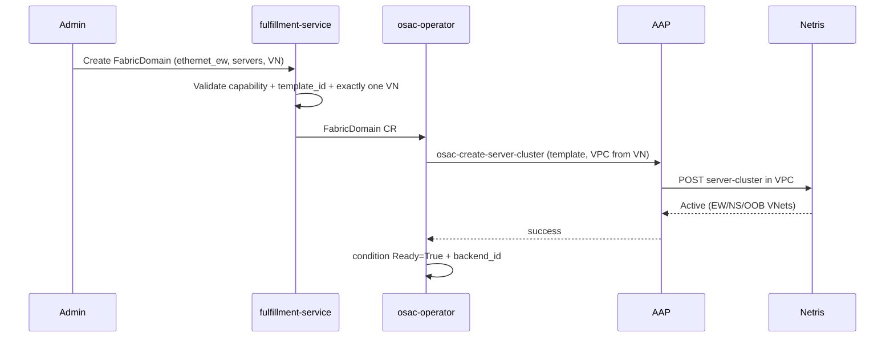

# Multi-Fabric East-West Networking

## Summary

This design introduces **FabricDomain** as a first-class OSAC resource for
**east-west fabric isolation**: a group of servers that share an isolation
boundary on a high-performance fabric type (Ethernet/Spectrum-X, later
InfiniBand, NVLink).

**VirtualNetwork remains the north-south / IP isolation boundary** (unchanged).
East-west is a different isolation plane. Hard multi-tenant AI networking
requires both:

| Plane | Role | OSAC object |
|-------|------|-------------|
| North-south / IP | Reachability, tenant IP isolation, ingress/egress | **VirtualNetwork** (+ Subnet) — existing |
| East-west / fabric | Who may talk server-to-server on the high-perf fabric (RoCE, IB, NVLink) | **FabricDomain** — new |

**Phase 1** delivers Ethernet east-west via **Netris Server Clusters**. Each
FabricDomain **requires exactly one VirtualNetwork** so the Server Cluster is
created in that VN's Netris VPC and nodes remain reachable on N-S. Backend
config (`template_id`, …) lives on **NetworkClass**. No new VPC resource is
introduced.

The AAP path for Server Cluster create/delete is already implemented
(osac-aap PR #447). VPC → Server Cluster in existing VPC → OSAC Subnet
coexistence and tenant isolation were validated on zeus12.

## Motivation

High-performance workloads need high-bandwidth, low-latency east-west
connectivity with hard multi-tenant isolation. OSAC already provides north-south
and general networking (unified networking / EP #50) via VirtualNetwork.
IP isolation alone does **not** isolate the GPU fabric: two tenants can have
separate VirtualNetworks and still share an open Spectrum-X, InfiniBand, or
NVLink domain if fabric membership is not programmed.

| Fabric | Isolation primitive | Typical manager |
|--------|---------------------|-----------------|
| Ethernet / Spectrum-X (RoCE) | VRF + L3VPN / V-Nets | Netris |
| InfiniBand | PKey + HCA GUID membership | UFM (often via Netris) |
| NVLink Multi-Node | NVLink logical partition | NMX-C or NICo |

Manual alignment of VRFs, PKeys, and NVLink partitions does not scale. The API
must stay **backend-agnostic** so Spectrum-X, IB, NVLink, and NICo plug in
without redesign.

### Why not only VirtualNetwork?

- VirtualNetwork isolates the **IP plane**.
- Fabric membership (EW L3VPN, PKey, NVLink partition) is a **separate plane**.
- NVIDIA NICo treats NVLink logical partitions as independent of exclusive VPC
  ownership: a default partition on a VPC is optional, and the same partition
  may be associated with multiple VPCs ("no exclusivity between VPCs").
  ([NICo NVLink Partitioning](https://docs.nvidia.com/infra-controller/infra-controller/documentation/operations-day-2/nv-link-partitioning))
- NVIDIA DGX SuperPOD separates Multi-Node NVLink, compute InfiniBand, storage,
  and management fabrics with **different node memberships** (e.g. storage nodes
  are not on NVLink).
  ([SuperPOD Network Fabrics](https://docs.nvidia.com/dgx-superpod/reference-architecture-scalable-infrastructure-gb200/latest/network-fabrics.html))

## Goals

- First-class **FabricDomain** for east-west isolation with its own lifecycle.
- Keep **VirtualNetwork** as the N-S / IP boundary; do not redefine it in this EP.
- Backend-specific configuration on **NetworkClass**, not on every domain object.
- Phase 1: Ethernet east-west via Netris Server Clusters; reuse existing AAP roles.
- Clear extension path to InfiniBand (UFM) and NVLink (NMX-C / NICo).
- Phase 1: required 1:1 association with VirtualNetwork (Netris VPC binding + N-S).

## Non-Goals

- Phase 1 InfiniBand or NVLink implementation (API shape reserved only).
- Introducing a new top-level **VPC** resource or demoting VirtualNetwork to a
  segment under VPC (separate hierarchy discussion if desired).
- Pool-based automatic server assignment (explicit server lists in Phase 1).
- Tenant-facing PKey or NVLink partition resources (backend/template concerns).
- Virtual-cluster / SR-IOV east-west (bare-metal Phase 1).
- Changing whether networking CRs are cluster-scoped vs namespaced (follow
  existing OSAC networking conventions; examples below are illustrative).

---

## Proposal

### Core model

```text
FabricDomain
  type: ethernet_ew | infiniband_ew | nvlink | …
  servers: [hostname, …]
  virtual_networks: [vn]         # Phase 1: exactly one (required)
  status: conditions, backend_id, vpc_id
  # NetworkClass inherited from the associated VirtualNetwork

NetworkClass
  capabilities:
    supports_east_west_ethernet: true/false
    supports_east_west_infiniband: true/false   # Phase 2
    supports_nvlink: true/false                 # Phase 3
  east_west_config:
    ethernet_ew: { template_id, … }
    infiniband_ew: { … }                        # Phase 2
    nvlink: { … }                               # Phase 3

VirtualNetwork   # existing — N-S / IP isolation boundary
  └── Subnet     # existing — IP segments
```

**Principles**

1. **N-S isolation** = VirtualNetwork (existing). Nodes are reachable because
   tenants already have (or get) a VirtualNetwork.
2. **E-W isolation** = FabricDomain (new). Who may communicate on the
   high-performance fabric.
3. FabricDomain does **not** replace VirtualNetwork. Phase 1 **requires** one
   VirtualNetwork association so:
   - the Netris Server Cluster is created in that VN's VPC;
   - N-S remains in place for reachability.
4. NetworkClass selects the implementation and holds backend-specific config.
5. Subnets remain the IP/address-plane API. They do not represent PKeys or
   NVLink partitions.
6. **No new VPC resource** in this design. Today's VirtualNetwork is the
   VPC-like object for Netris binding.

### API Extensions (fulfillment-service)

```protobuf
// Standard OSAC object shape
message FabricDomain {
  string id = 1;
  Metadata metadata = 2;
  FabricDomainSpec spec = 3;
  FabricDomainStatus status = 4;
}

enum FabricDomainType {
  FABRIC_DOMAIN_TYPE_UNSPECIFIED = 0;
  ETHERNET_EW = 1;
  INFINIBAND_EW = 2;               // Phase 2
  NVLINK = 3;                      // Phase 3
}

message FabricDomainSpec {
  FabricDomainType type = 1;             // immutable after creation
  repeated string servers = 2;           // hostnames (mutable — resize)
  repeated string virtual_networks = 3;  // Phase 1: exactly one; immutable after creation
  // NetworkClass is inherited from the associated VirtualNetwork
}

message FabricDomainStatus {
  repeated Condition conditions = 1;     // Ready, Provisioning (standard OSAC conditions)
  string backend_id = 2;                 // e.g. Netris Server Cluster ID
  string vpc_id = 3;                     // resolved Netris VPC ID from associated VN
  repeated FabricDomainMemberStatus members = 4;
}

message FabricDomainMemberStatus {
  string server = 1;                     // hostname
  FabricDomainMemberState state = 2;     // PENDING, ACTIVE, FAILED
  string message = 3;                    // failure reason if applicable
}

// gRPC service
service FabricDomains {
  rpc CreateFabricDomain(CreateFabricDomainRequest) returns (FabricDomain);
  rpc GetFabricDomain(GetFabricDomainRequest) returns (FabricDomain);
  rpc ListFabricDomains(ListFabricDomainsRequest) returns (ListFabricDomainsResponse);
  rpc UpdateFabricDomain(UpdateFabricDomainRequest) returns (FabricDomain);
  rpc DeleteFabricDomain(DeleteFabricDomainRequest) returns (FabricDomain);
  rpc SignalFabricDomain(SignalFabricDomainRequest) returns (FabricDomain);
}

// NetworkClass extensions (existing resource, new fields)
message NetworkClassCapabilities {
  // existing: supports_ipv4, supports_ipv6, …
  bool supports_east_west_ethernet = 5;
  bool supports_east_west_infiniband = 6;
  bool supports_nvlink = 7;
}

message EastWestConfig {
  EthernetEastWestConfig ethernet_ew = 1;
  InfiniBandEastWestConfig infiniband_ew = 2;  // Phase 2
  NVLinkEastWestConfig nvlink = 3;             // Phase 3
}

message EthernetEastWestConfig {
  string template_id = 1;  // Netris Server Cluster Template ID (Phase 1)
}

message InfiniBandEastWestConfig {
  string mode = 1;         // "netris" | "direct_ufm"
  string pkey_policy = 2;  // "auto" | …
}

message NVLinkEastWestConfig {
  string backend = 1;      // "netris" | "nmx-c" | "nico"
  string endpoint = 2;     // optional for direct backends
}
```

**Immutability:** `type` and `virtual_networks` are immutable after creation.
Changing them requires delete + re-create. `servers` is mutable (resize).

**Validation (Phase 1)**

| Rule | Check | gRPC error |
|------|-------|------------|
| FD-VAL-01 | `type` must be a valid `FabricDomainType` enum value and match a capability on the VN's NetworkClass | `INVALID_ARGUMENT`: "type does not match NetworkClass capability" |
| FD-VAL-02 | `servers` non-empty | `INVALID_ARGUMENT`: "servers list must not be empty" |
| FD-VAL-03 | `virtual_networks` length == 1 | `INVALID_ARGUMENT`: "exactly one VirtualNetwork required in Phase 1" |
| FD-VAL-04 | Referenced VN must exist and be same-tenant | `NOT_FOUND` / `PERMISSION_DENIED` |
| FD-VAL-05 | VN's NetworkClass must have `east_west_config.ethernet_ew.template_id` for `ETHERNET_EW` | `FAILED_PRECONDITION`: "NetworkClass missing template_id for ethernet_ew" |
| FD-VAL-06 | Type `INFINIBAND_EW` / `NVLINK` rejected until Phase 2/3 | `UNIMPLEMENTED`: "type not yet supported" |

### Why Phase 1 requires VirtualNetwork (1:1)

This is a **product constraint**, not a Netris hard limit.

Netris can create a Server Cluster in an existing VPC **or** create a VPC as
part of Server Cluster create. We require an existing OSAC VirtualNetwork so:

1. **Validated path:** zeus12 used VPC first → Server Cluster in that VPC →
   OSAC Subnet.
2. **Single source of truth:** OSAC VN owns the VPC identity; we do not let
   Netris create an unmanaged VPC that OSAC must later adopt.
3. **N-S stay explicit:** EW is additive; reachability remains on VN/Subnet.

One Netris Server Cluster still lives in **one** Netris VPC. Multi-VN
association on FabricDomain (sharing) is deferred past Phase 1.

### Which NICs / HCAs / GPUs are used?

| Fabric | What FabricDomain lists | What selects interfaces |
|--------|-------------------------|-------------------------|
| Ethernet | Server **hostnames** | **Server Cluster Template** (from NetworkClass): `serverNics` per V-Net (EW, storage, NS, OOB) |
| InfiniBand | Server hostnames | Backend policy (typically HCAs on host / GUID policy) |
| NVLink | Server hostnames | GPUs on those servers; partition membership via NMX-C/NICo |

Phase 1 does **not** put NIC names on FabricDomain. The template owns Ethernet
NIC mapping. Creating a FabricDomain drives a Server Cluster whose template
typically programs **both** EW and NS (and OOB) V-Nets — FabricDomain expresses
the EW isolation **intent**; it does not mean "EW-only interfaces."

**Template V-Net vs OSAC Subnet coexistence:** The Server Cluster Template
creates auto-managed V-Nets (EW L3VPN, NS L2VPN, OOB). OSAC Subnets create
additional OSAC-managed V-Nets in the same VPC. Both coexist — each gets a
distinct VXLAN ID, no conflicts. Servers use the template-created NS V-Net for
fabric-level N-S reachability and OSAC Subnet V-Nets for tenant-managed IP
segments. This was validated on zeus12: four V-Nets (2 template + 1 OSAC Subnet
+ 1 default) coexisted with unique VXLAN IDs.

### GPU vs storage traffic separation

| Goal | How |
|------|-----|
| Separate GPU vs storage on **Ethernet** | **One** FabricDomain (`ethernet_ew`) + template with multiple V-Nets (EW-GPU L3VPN, storage V-Net). OSAC Subnets attach to IP-addressable segments. |
| Separate GPU vs storage on **InfiniBand** | Same domain + multi-PKey layout in NetworkClass/backend, **or** two `infiniband_ew` FabricDomains if independent lifecycle is required. PKeys are not OSAC Subnets. |
| GPU collectives vs storage with **NVLink** | **Different** FabricDomains: `nvlink` for GPU–GPU; `ethernet_ew` or `infiniband_ew` for storage. Storage does not run on NVLink. |

### Spectrum-X / RoCE example (N-S and E-W both Ethernet)

When north-south and east-west are both Ethernet (Spectrum-X / RoCE), they are
different **roles**, not different object models:

```yaml
# Infra-owned: how Ethernet EW is implemented
apiVersion: networking.osac.io/v1
kind: NetworkClass
metadata:
  name: spectrum-x-ai
spec:
  capabilities:
    supports_ipv4: true
    supports_east_west_ethernet: true
  east_west_config:
    ethernet_ew:
      template_id: "spectrum-x-gpu-template"
      # Template defines V-Nets + NIC map, e.g.:
      #   - East-West (L3VPN / RoCE) → eth1..eth8
      #   - North-South + storage    → eth9, eth10
      #   - OOB                      → eth11
---
# Tenant IP / north-south plane (VirtualNetwork ≈ VPC for Netris)
apiVersion: networking.osac.io/v1
kind: VirtualNetwork
metadata:
  name: tenant-a-vn
spec:
  network_class: spectrum-x-ai
---
# Optional explicit IP segments
apiVersion: networking.osac.io/v1
kind: Subnet
metadata:
  name: tenant-a-ns
spec:
  virtual_network: tenant-a-vn
  cidr: 10.10.0.0/24
---
# East-west isolation domain (RoCE / Spectrum-X GPU fabric)
apiVersion: networking.osac.io/v1
kind: FabricDomain
metadata:
  name: tenant-a-gpu-ew
spec:
  type: ethernet_ew
  servers:
    - hgx-01
    - hgx-02
    - hgx-03
    - hgx-04
    - hgx-05
    - hgx-06
    - hgx-07
    - hgx-08
  virtual_networks:
    - tenant-a-vn   # Phase 1: bind Server Cluster into this VN's Netris VPC
```

**Mapping**

| OSAC | Netris / data plane |
|------|---------------------|
| VirtualNetwork | VPC |
| FabricDomain | Server Cluster in that VPC (template → EW L3VPN + NS/storage V-Nets) |
| Subnet | OSAC-managed IP segment alongside Server Cluster auto-VNets |

Servers get **N-S** via VirtualNetwork/Subnet + template NS V-Net, and **E-W**
via the same Server Cluster's EW V-Net. FabricDomain does not remove N-S.

### High-level walk-through: tenant isolation (N-S + E-W)

**Setup (Phase 1 / Netris Ethernet)**

1. Infra provides NetworkClass `spectrum-x-ai` with an EW-capable Server Cluster
   Template (EW L3VPN + NS/storage V-Nets + NIC map).
2. **Tenant A**
   - VirtualNetwork `tenant-a-vn` → Netris VPC-A (N-S / IP)
   - Subnet(s) under `tenant-a-vn` for node addressing
   - FabricDomain `tenant-a-gpu-ew` (servers hgx-00, hgx-01) → Server Cluster in VPC-A
3. **Tenant B**
   - VirtualNetwork `tenant-b-vn` → Netris VPC-B
   - FabricDomain `tenant-b-gpu-ew` (servers hgx-02, hgx-03) → Server Cluster in VPC-B

**Data plane (from template + VPC isolation)**

| Path | Same tenant (A↔A) | Cross tenant (A↔B) |
|------|-------------------|---------------------|
| North-south (IP / NS V-Net) | Allowed within VPC-A | Blocked (separate VPC/VRF) |
| East-west (RoCE / EW L3VPN) | Allowed within A's Server Cluster | Blocked (separate VPC + EW V-Net) |

**Validated on zeus12 (netris-lab, `ew_fabric_enable`)**

- Two Server Clusters in separate VPCs (hgx-00+01 vs hgx-02+03).
- Same-tenant: EW and NS ping succeeded.
- Cross-tenant: EW and NS 100% loss.
- OSAC Subnet coexisted with Server Cluster auto-VNets (distinct VXLAN IDs).

**What each object did**

- VirtualNetwork → tenant VPC (N-S isolation boundary).
- FabricDomain → Server Cluster in that VPC (EW isolation + template NS/EW NIC plumbing).
- Nodes remain reachable on N-S via VN/Subnet; GPU traffic is isolated on E-W per tenant.

### Multiple FabricDomains, few NetworkClasses

NetworkClass is a catalog entry ("how we implement EW on this backend").
FabricDomain is an instance ("these servers, this fabric type"). Many domains
may reference one NetworkClass. Multiple NetworkClasses only when backends or
templates differ (e.g. GPU vs storage template, Netris vs NICo).

### Who manages InfiniBand / NVLink?

| Deployment style | Ethernet | InfiniBand | NVLink |
|------------------|----------|------------|--------|
| **Netris-centric (typical Phase 1+)** | Netris | Netris → UFM | Netris → NMX or NICo |
| **Direct UFM** | (other) | OSAC → UFM | — |
| **NICo-centric** | (other / Netris) | — | OSAC → NICo → NMX-C |

Phase 1 OSAC talks to **Netris**. Direct UFM and NICo are additional NetworkClass
backends later.

### Phase 1 behavior (Ethernet / Netris)

1. **Cloud Infrastructure Admin** configures NetworkClass with
   `supports_east_west_ethernet` and `east_west_config.ethernet_ew.template_id`.
2. **Tenant Admin** (or Cloud Infrastructure Admin) has VirtualNetwork (N-S).
3. **Cloud Infrastructure Admin** creates FabricDomain (`type=ETHERNET_EW`,
   `servers`, `virtual_networks: [that VN]`).
4. Operator resolves NetworkClass from VN; resolves template from NC;
   resolves VN → Netris VPC id.
5. Create Netris Server Cluster **in that VPC**.
6. Netris applies template (EW L3VPN, NS, OOB V-Nets, port mapping).
7. Condition `Ready=True` + `backend_id` = Server Cluster ID.

**Validated (zeus12, netris-lab, `ew_fabric_enable`):** VPC first → Server Cluster
in existing VPC → OSAC Subnet. Four VNets coexisted with distinct VXLAN IDs; no
conflicts. Same-tenant EW/NS traffic worked; cross-tenant blocked.

Resize = update `servers` → idempotent Server Cluster update.  
Delete FabricDomain → delete Server Cluster (VN/VPC unchanged unless empty and
OSAC-owned).

### NIC mapping (Phase 1 detail)

Server Cluster Template example (Netris, infra-owned):

```json
[
  {
    "postfix": "East-West",
    "type": "l3vpn",
    "serverNics": ["eth1", "eth2", "eth3", "eth4", "eth5", "eth6", "eth7", "eth8"]
  },
  {
    "postfix": "North-South-in-band-and-storage",
    "type": "l2vpn",
    "serverNics": ["eth9", "eth10"]
  },
  {
    "postfix": "OOB-Management",
    "type": "l2vpn",
    "serverNics": ["eth11"]
  }
]
```

FabricDomain does not repeat this. Changing NIC layout = change template on
NetworkClass, not the domain object.

---

## Workflow (Phase 1)



---

## Implementation Details

### Database schema (fulfillment-service)

New `fabric_domains` table:

```sql
CREATE TABLE fabric_domains (
    id          UUID PRIMARY KEY DEFAULT gen_random_uuid(),
    name        TEXT NOT NULL,
    tenant_id   UUID NOT NULL REFERENCES tenants(id),
    type        TEXT NOT NULL,              -- 'ethernet_ew', 'infiniband_ew', 'nvlink'
    servers     TEXT[] NOT NULL,            -- hostnames
    backend_id  TEXT,                       -- Netris Server Cluster ID (set after provisioning)
    vpc_id      TEXT,                       -- resolved Netris VPC ID
    created_at  TIMESTAMPTZ NOT NULL DEFAULT now(),
    updated_at  TIMESTAMPTZ NOT NULL DEFAULT now(),
    deleted_at  TIMESTAMPTZ                -- soft delete
);

CREATE TABLE fabric_domain_virtual_networks (
    fabric_domain_id    UUID NOT NULL REFERENCES fabric_domains(id) ON DELETE CASCADE,
    virtual_network_id  UUID NOT NULL REFERENCES virtual_networks(id),
    PRIMARY KEY (fabric_domain_id, virtual_network_id)
);

CREATE INDEX idx_fabric_domains_tenant ON fabric_domains(tenant_id);
```

The join table `fabric_domain_virtual_networks` supports the Phase 1 exactly-one
constraint via application-level validation (FD-VAL-05) while keeping the schema
ready for Phase 2+ multi-VN association.

NetworkClass gains `east_west_config` (JSONB) alongside existing columns — no
migration of existing rows required (nullable column, additive).

### Affected components

- **fulfillment-service:** FabricDomain CRUD + validation; NetworkClass
  `east_west_config` + capabilities.
- **osac-operator:** FabricDomain reconciler; map type → AAP job; resolve
  template from NC; VN → VPC id.
- **osac-aap:** Existing create/delete server_cluster tasks (PR #447);
  capability `supports_east_west_ethernet`.
- **osac-installer:** New FabricDomain CRD registration; NetworkClass Helm
  values extended with `east_west_config`; RBAC rules for the new resource.
- **Scoping:** Follow existing OSAC networking resource conventions
  (cluster/tenant scoped as established for VirtualNetwork); examples in this
  doc are illustrative.
- **Documentation:** API reference auto-generated from proto. Admin guide for
  NetworkClass EW configuration deferred to Tech Preview.
- **UI:** FabricDomain is managed via CLI/API only in Phase 1. Admin views
  deferred to a future UI enhancement.

### CLI commands (Phase 1)

```bash
osac create fabricdomain --type ethernet_ew \
  --servers hgx-01,hgx-02,hgx-03,hgx-04 \
  --virtual-network tenant-a-vn \
  --name tenant-a-gpu-ew

osac get fabricdomains
osac describe fabricdomain tenant-a-gpu-ew
osac edit fabricdomain tenant-a-gpu-ew         # resize: update servers list
osac delete fabricdomain tenant-a-gpu-ew
```

Per CLI UX guidelines: non-interactive, scriptable, no k8s knowledge required.

### Security Considerations

FabricDomain inherits the existing OSAC multi-tenant security model:

- **Tenant isolation:** Enforced via `osac.openshift.io/tenant` annotation on
  every FabricDomain. OPA policies prevent cross-tenant access — a tenant
  cannot read, modify, or delete another tenant's FabricDomain.
- **Input validation:** All spec fields are validated at the fulfillment-service
  layer (see Validation table). Server hostnames are accepted as strings; Phase 1
  trusts the Cloud Infrastructure Admin for server eligibility. Server inventory
  validation is deferred to Phase 2.
- **Backend credentials:** Netris API credentials are configured on the AAP
  execution environment, not on the FabricDomain or NetworkClass. No secrets
  are stored on the FabricDomain resource.
- **No new authentication/authorization surface:** FabricDomain uses the same
  gRPC interceptor chain and OPA policy engine as existing networking resources.

### Failure Handling and Recovery

| Failure mode | What happens | Recovery | User observes |
|--------------|--------------|----------|---------------|
| **Netris API unreachable** | AAP job fails to POST server-cluster | AAP retries per job template retry policy; operator re-queues reconciliation | Condition `Ready=False`, Reason=`ProvisioningFailed`, message includes AAP error |
| **Netris Server Cluster activation timeout** | Server Cluster stays in "Provisioning" > 5 min | Operator polls status; after configurable timeout sets condition with timeout reason | Condition `Ready=False`, Reason=`ActivationTimeout` |
| **Invalid template_id on NetworkClass** | Netris rejects the create request (400) | AAP job fails fast; operator surfaces the error | Condition `Ready=False`, Reason=`InvalidTemplate` |
| **VN deleted while FabricDomain references it** | Validation prevents VN deletion if FabricDomains reference it (finalizer on VN) | Admin must delete FabricDomain first, then VN | VN deletion blocked with error message |
| **Operator restart mid-reconciliation** | Controller re-reads FabricDomain CR on startup | Idempotent: if Server Cluster already exists in Netris (matched by `backend_id`), operator syncs status; if not, re-creates | Temporary condition staleness until re-reconciliation completes |
| **Duplicate server across FabricDomains** | Phase 1 does not validate server overlap | Netris may reject or accept depending on template; admin is trusted | If Netris rejects: Condition `Ready=False`; if accepted: both domains provision |

**Idempotency:** Create and delete operations use `backend_id` (Netris Server
Cluster ID) persisted in status. Retries target the same backend resource.
The AAP `create_server_cluster` role is idempotent — it checks for an existing
cluster by name before creating.

### RBAC / Tenancy

| Persona | FabricDomain | NetworkClass EW config |
|---------|-------------|------------------------|
| **Cloud Infrastructure Admin** | Create, read, update, delete | Configure `east_west_config` and capabilities |
| **Cloud Provider Admin** | Read (audit/troubleshoot) | Read |
| **Tenant Admin** | Read own tenant's FabricDomains | Read (discover available capabilities) |
| **Tenant User** | No direct access | No direct access |

**Tenant isolation metadata:**

- `osac.openshift.io/tenant`: Set on every FabricDomain. OPA policies filter
  by this annotation — tenants see only their own FabricDomains.
- `osac.openshift.io/owner-reference`: Not applicable. FabricDomain is a
  top-level resource associated with (not owned by) VirtualNetwork. The
  association is a spec reference, not an ownership hierarchy. Deleting a
  FabricDomain does not cascade to the VN; deleting a VN is blocked by a
  finalizer if FabricDomains reference it.

### Observability and Monitoring

| Type | Name | Description |
|------|------|-------------|
| **Gauge** | `osac_fabric_domains_total{type, tenant}` | Total FabricDomains by type and tenant |
| **Histogram** | `osac_fabric_domain_provisioning_duration_seconds{type}` | Time from creation to `Ready=True` |
| **Counter** | `osac_fabric_domain_provisioning_failures_total{type, reason}` | Provisioning failures by type and reason |
| **Event** | `FabricDomainProvisioned` (Normal) | Emitted when condition transitions to `Ready=True` |
| **Event** | `FabricDomainProvisioningFailed` (Warning) | Emitted on provisioning failure with reason |
| **Event** | `FabricDomainDeleted` (Normal) | Emitted when Server Cluster is successfully deleted |

**Alert threshold:** `osac_fabric_domain_provisioning_duration_seconds` p99 > 5
minutes indicates Netris API or data-plane convergence issues.

### Risks and Mitigations

| Risk | Impact | Mitigation |
|------|--------|------------|
| **Fabric manager API changes** | Netris API breaking changes could block provisioning | Pin `netris.controller` collection version in AAP; abstract via NetworkClass so backend swap does not change the OSAC API |
| **Server Cluster activation latency** | Data plane convergence takes ~3 min after API reports "Active" | Document expected latency; operator treats `Ready=True` as control-plane ready; data-plane readiness is a future health-check enhancement |
| **Server overlap across domains** | Two FabricDomains with overlapping servers could cause switch port conflicts | Phase 1: admin-trusted (documented limitation). Phase 2: add server overlap validation at the fulfillment-service layer |
| **Template misconfiguration** | Wrong `template_id` on NetworkClass applies incorrect NIC mapping | Validation ensures template_id is non-empty; Netris rejects invalid IDs. Template correctness is infra admin responsibility |
| **`supports_east_west_ethernet` capability rename** | AAP metadata and operator may disagree during rolling upgrade | Additive change: new capability field; old `supports_east_west` retained as deprecated alias during transition. See Version Skew Strategy |

### Drawbacks

Adding FabricDomain introduces a new top-level resource with its own CRD,
database table, gRPC service, controller, CLI commands, and AAP playbooks.
This increases the OSAC API surface and maintenance burden.

The alternative — extending VirtualNetwork with east-west bindings — would
avoid this new resource entirely for Phase 1 Ethernet. However, as documented
in the Alternatives section, that approach couples EW lifecycle to IP-plane
objects and creates architectural debt when non-VPC fabrics (InfiniBand PKeys,
NVLink partitions) are added in Phase 2/3. The new resource cost is justified
by the multi-backend roadmap.

FabricDomain may initially feel redundant in a pure Netris deployment where
"VPC is the boundary." The Phase 1 requirement of exactly one VN per
FabricDomain mitigates user confusion — the operational experience is
equivalent to "create a Server Cluster in a VPC" with an additional resource.

## Phase 1 limitations

- VirtualNetwork association required (exactly one); zero or many deferred.
- **Membership is static.** Admin provides explicit hostnames at create time.
  Phase 2 should support inventory-driven membership (label selectors on
  BareMetalInstance CRs or similar) so domains can be created before concrete
  hosts are assigned.
- No server eligibility validation (admin trusted on hostnames).
- NIC mapping only via Netris template.
- `template_id` is Netris-specific (scoped to NetworkClass).
- Templates pre-created by infra; OSAC does not manage template lifecycle.
- **Bare-metal only; no SR-IOV/VM EW.** FabricDomain membership is
  host/device-scoped. Virtual machines do not appear as FabricDomain members;
  they attach to SR-IOV VFs or GPUs on hosts that are already in the domain.
  VM east-west is a separate follow-on design.
- IB/NVLink types reserved in API, not implemented.

## Test Plan

### Unit Tests

- FD-VAL-01: reject FabricDomain when `type` does not match VN's NetworkClass
  capability → `INVALID_ARGUMENT`.
- FD-VAL-02: reject FabricDomain with empty `servers` list → `INVALID_ARGUMENT`.
- FD-VAL-03: reject FabricDomain with zero or >1 `virtual_networks` in Phase 1
  → `INVALID_ARGUMENT`.
- FD-VAL-04: reject FabricDomain when referenced VN belongs to a different
  tenant → `PERMISSION_DENIED`.
- FD-VAL-05: reject `ETHERNET_EW` when VN's NetworkClass is missing
  `template_id` → `FAILED_PRECONDITION`.
- FD-VAL-06: reject `INFINIBAND_EW` and `NVLINK` types → `UNIMPLEMENTED`.
- Template resolution: operator resolves NetworkClass from VN, then
  `template_id` from `east_west_config.ethernet_ew`.
- Condition transitions: `Ready=False` (Reason=Provisioning) → `Ready=True`
  on success; `Ready=False` (Reason=ProvisioningFailed) on failure.
- Per-member status: all members report `ACTIVE` on success; failed members
  report `FAILED` with message.
- Resize: updating `servers` list triggers re-reconciliation; `type` and
  `virtual_networks` are immutable after creation.

### Integration Tests

- Create NetworkClass with `east_west_config` → create FabricDomain CR →
  verify condition transitions to `Ready=True` and `backend_id` is populated.
- Delete FabricDomain → verify Server Cluster cleanup and condition removal.
- Re-provision after failure: simulate AAP job failure → verify operator
  re-queues and re-attempts provisioning.
- VN deletion blocked: attempt to delete VN while FabricDomain references it →
  verify finalizer prevents deletion.

### E2E Tests

- Full lifecycle on netris-lab: create NetworkClass → create VN → create
  FabricDomain → verify Netris Server Cluster exists in VPC → verify EW
  isolation (same-tenant ping succeeds, cross-tenant blocked) → resize
  servers → delete FabricDomain → verify cleanup.
- VNet coexistence: create VPC → Server Cluster → OSAC Subnet → verify
  distinct VXLAN IDs, no conflicts (already validated on zeus12).
- Error path: create FabricDomain with invalid `template_id` on NetworkClass →
  verify `Ready=False` condition with `InvalidTemplate` reason.

---

## Alternatives (considered and rejected for this design)

### 1. ServerCluster as child of VirtualNetwork

```text
VirtualNetwork
  └── ServerCluster (type, servers, …)
```

**Rejected as the primary model.**

- Treats non-IP fabric isolation (IB PKey, NVLink partition) as owned by an IP
  object.
- Sharing one server group across two VirtualNetworks requires two child objects
  on the same hosts → dual-writer / split-brain reconciliation risk.
- Non-uniform membership (e.g. 32 nodes on Ethernet EW, 16 on NVLink, storage
  Ethernet-only) is awkward under a single parent VN server list.
- NVIDIA NICo explicitly allows the same NVLink logical partition on multiple
  VPCs (no exclusivity).

Independent create/delete of a *child* relative to the parent VN is possible
(like Subnet), but that does not fix ownership, sharing, or non-IP semantics.

### 2. ServerCluster as top-level peer of VirtualNetwork (uniform isolation)

```text
VirtualNetwork   (N-S / IP isolation — existing)
ServerCluster    (EW fabric isolation — new, top-level peer)
  type: multi | ethernet_ew | …
  servers: [hostname, …]
  network_class: <ref>
  virtual_networks: [vn]
```

**Considered but not adopted as the primary model.**

This variant treats ServerCluster as a top-level resource (not a child of VN)
that drives **all** fabrics for a given server group in one object. For the
common uniform case (same 20 servers on Ethernet EW, IB, and NVLink), a single
ServerCluster avoids server-list drift and provides atomic resize.

**Pros:**

- One object per server group — simpler for uniform deployments.
- Atomic resize: add/remove a server once, all fabrics follow.
- Matches Netris's Server Cluster model directly (one API call provisions
  Ethernet + IB + NVLink via template).

**Cons:**

- Couples fabric lifecycles. NVLink partitions for training jobs are often
  ephemeral (created per-job, released after hours), while Ethernet EW is
  persistent tenant infrastructure. One object forces both lifecycles together.
- Non-uniform membership requires multiple ServerClusters with different
  server lists — the same pattern as multiple FabricDomains, but with a name
  that implies Netris-specific semantics.
- The name "ServerCluster" carries Netris connotations; FabricDomain is
  backend-neutral.

**Why FabricDomain was chosen:** FabricDomain handles both uniform and
non-uniform cases. For uniform deployments, a Phase 2/3 `type: multi` (or
equivalent) achieves single-object atomic resize with the same schema. For
non-uniform deployments (SuperPOD-style: storage off NVLink, different NVLink
partition sizes per job), separate FabricDomains per fabric type are the
natural model. The NetworkClass already has per-fabric config
(`ethernet_ew`, `infiniband_ew`, `nvlink`), so the operator knows which
backends to call for each domain type — or for all of them under a `multi`
type.

### 3. New top-level VPC parent of VirtualNetwork + FabricDomain

```text
VPC
  ├── VirtualNetwork
  ├── FabricDomain (or ServerCluster)
  └── …
```

**Out of scope for this enhancement.**

- Introduces a new VPC resource and demotes today's VirtualNetwork (already the
  VPC-like object for Netris).
- Valid as a **separate** networking hierarchy redesign if the project wants
  AWS-style naming; it is not required to ship east-west isolation.
- Phase 1 FabricDomain already binds to VirtualNetwork for Netris VPC context.
  If a VPC parent is added later, FabricDomain can associate with it the same
  way it associates with VirtualNetwork.

### 4. fabric_bindings on VirtualNetwork or Subnet

**Rejected earlier.** Couples EW lifecycle to address-plane objects; weak
multi-fabric clarity; risks leaking `template_id` into every binding.

### 5. Do nothing

**Rejected by PRD.** Manual multi-fabric isolation does not scale.

---

## Graduation Criteria

| Stage | Criteria |
|-------|----------|
| **Dev Preview** | FabricDomain CRUD operations pass unit and integration tests. Condition-based lifecycle verified. NetworkClass `east_west_config` validated. |
| **Tech Preview** | Full lifecycle E2E on netris-lab: create → isolation verified → resize → delete. VNet coexistence with OSAC Subnets confirmed. Error paths tested (invalid template, missing VN, AAP timeout). No regressions in existing networking tests. |
| **GA** | Production deployment with ≥2 tenants using FabricDomain for ≥30 days. Support procedures validated. Admin documentation published. No manual fabric-manager intervention required for standard operations. |

## Upgrade / Downgrade Strategy

FabricDomain is a new resource type with no existing instances to migrate.

- **Upgrade:** Installing the new CRD and controller is additive. Existing
  VirtualNetwork and Subnet resources are unaffected. NetworkClass gains new
  optional fields (`east_west_config`, `supports_east_west_ethernet`); existing
  NetworkClasses without these fields continue to work for N-S networking.
- **Downgrade:** Requires deleting all FabricDomain instances before removing
  the CRD. The operator must be scaled down before CRD removal to avoid
  reconciliation errors. VirtualNetwork and Subnet resources are unaffected
  by downgrade.

## Version Skew Strategy

| Component pair | Skew scenario | Behavior |
|---------------|---------------|----------|
| **fulfillment-service ahead of osac-operator** | FS accepts FabricDomain creates; operator CRD not yet installed | FS persists the resource in the database; CR creation fails. Condition `Ready=False`, Reason=`CRDNotInstalled`. Resolves when operator is upgraded. |
| **osac-operator ahead of fulfillment-service** | Operator has CRD but FS does not have the FabricDomain service | No FabricDomains can be created via API. No impact on existing resources. |
| **osac-aap capability rename** | Old AAP has `supports_east_west`; new FS/operator expects `supports_east_west_ethernet` | Additive: new capability field is added alongside the old one. The `find_template_roles.py` pydantic model accepts both during the transition window. Old field deprecated after one release cycle. |

## Support Procedures

**Detecting failures:**

- Check FabricDomain conditions: `osac get fabricdomains` — look for
  `Ready=False` with Reason and Message fields.
- Check operator logs for `FabricDomain` reconciliation errors.
- Check AAP job logs for `osac-create-server-cluster` /
  `osac-delete-server-cluster` failures.
- Monitor `osac_fabric_domain_provisioning_failures_total` metric.

**Disabling the feature:**

- Scale down the FabricDomain controller in osac-operator. Existing
  FabricDomains remain in their last-known state; no new provisioning or
  deletion occurs. VirtualNetwork and Subnet operations are unaffected.
- Re-enabling: scale the controller back up. It re-reconciles all
  FabricDomain CRs from their current state. Idempotent operations ensure
  consistency.

**Recovery:**

- If a FabricDomain is stuck in `Ready=False`: check the condition message,
  fix the underlying issue (Netris connectivity, template_id, VN existence),
  and the operator will re-reconcile automatically.
- If the Netris Server Cluster was manually deleted: delete and re-create the
  FabricDomain to re-provision.

## Open questions

1. Phase 2: when to allow zero or multiple VirtualNetwork associations.
2. Status fields to echo for debug (resolved template_id, VPC id, VNet names).
3. Phase 2: reserve `fabric_domain` field on BareMetalInstance/ClusterOrder
   specs for scheduling awareness and membership validation.

**Resolved:**

- **Resource name:** FabricDomain. "Domain" implies isolation boundary
  (broadcast domain, routing domain); "fabric" scopes it to the physical
  interconnect layer. Decided before merge per reviewer recommendation.
- **Typed `EastWestConfig` messages** (not generic `map<string,string>`). OSAC
  conventions prefer typed structures over maps in CRDs for validation,
  documentation, and schema evolution.
- **`network_class` removed from FabricDomainSpec.** OSAC deployments have one
  NetworkClass; FabricDomain inherits it from the associated VirtualNetwork.
  Avoids redundancy and NC mismatch between VN and FD.

## Infrastructure Needed

None. E2E testing uses the existing netris-lab on zeus12 (already provisioned).

---

## References

- PRD: OSAC-1382 (merged)
- osac-aap PR #447 (Server Cluster AAP roles)
- zeus12 validation: VPC → Server Cluster in VPC → OSAC Subnet; isolation tests
- [NICo NVLink Partitioning](https://docs.nvidia.com/infra-controller/infra-controller/documentation/operations-day-2/nv-link-partitioning)
- [DGX SuperPOD Network Fabrics (GB200)](https://docs.nvidia.com/dgx-superpod/reference-architecture-scalable-infrastructure-gb200/latest/network-fabrics.html)
- Netris Server Cluster + UFM/NMX integrations
