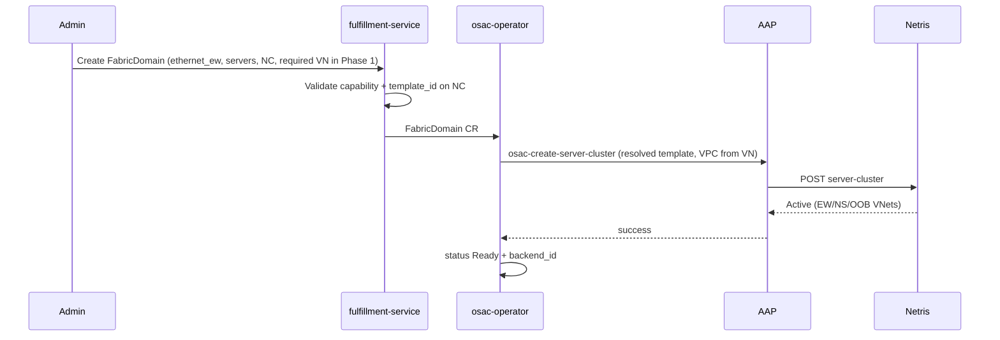

# Multi-Fabric East-West Networking

## Summary

This design introduces **FabricDomain** as a first-class OSAC resource that represents an east-west isolation domain for a group of servers on a given fabric type (Ethernet/Spectrum-X, InfiniBand, NVLink, …).

- **FabricDomain** = isolation domain (who can talk to whom on that fabric).
- **NetworkClass** = which backend implements it and with what parameters (`template_id`, UFM, NICo, …).
- **VirtualNetwork** = optional association (IP/VPC networking context), not the owner of the domain.

Phase 1 delivers Ethernet east-west via **Netris Server Clusters**. The AAP path for Server Cluster create/delete is already implemented (osac-aap PR #447). VPC → Server Cluster in existing VPC → OSAC Subnet coexistence was validated on zeus12.

An important alternative—**ServerCluster as a child of VirtualNetwork**—is documented with equal structural detail in [Model comparison](#model-comparison-fabricdomain-vs-servercluster-as-child-of-vn). The project must choose where the isolation boundary and lifecycle live.

## Motivation

High-performance workloads need high-bandwidth, low-latency east-west connectivity with hard multi-tenant isolation. OSAC today provides north-south and general networking (EP #50) but has no programmatic model for fabric-level east-west isolation domains across:

| Fabric | Isolation primitive | Typical manager |
|--------|---------------------|-----------------|
| Ethernet / Spectrum-X | VRF + L3VPN / VXLAN | Netris |
| InfiniBand | PKey + HCA GUID membership | UFM (often via Netris) |
| NVLink Multi-Node | NVLink partition | NMX-C or NICo |

Manual alignment of VRFs, PKeys, and NVLink partitions does not scale. The API must stay **backend-agnostic** so Spectrum-X, IB, NVLink, and NICo plug in without redesign.

## Goals

- First-class isolation domain resource (`FabricDomain`) with its own lifecycle.
- Backend-specific configuration on **NetworkClass**, not on every domain object.
- Phase 1: Ethernet east-west via Netris Server Clusters; reuse existing AAP roles.
- Clear extension to InfiniBand (UFM), NVLink (NMX-C / NICo), and future backends.
- Optional association with VirtualNetworks (many-to-many).
- Explicit, balanced comparison with ServerCluster-as-child-of-VN and a project decision point.

## Non-Goals

- Phase 1 InfiniBand or NVLink implementation (API shape only).
- Pool-based automatic server assignment (explicit server lists in Phase 1).
- Tenant-facing PKey or NVLink partition resources (those stay backend/template concerns).
- Virtual-cluster / SR-IOV east-west (bare-metal Phase 1; SR-IOV later).
- Redefining Subnet as a multi-fabric segment API.

---

## Proposal

### Core model (Model A — FabricDomain)

```text
FabricDomain
  type: ethernet_ew | infiniband_ew | nvlink | …
  servers: [hostname, …]
  network_class: <ref>          # resolves backend + parameters
  virtual_networks: []          # optional associations
  status: phase, backend_id, message, …

NetworkClass
  capabilities:
    supports_east_west_ethernet: true/false
    supports_east_west_infiniband: true/false   # Phase 2
    supports_nvlink: true/false                 # Phase 3
  east_west_config:
    ethernet_ew: { template_id, … }
    infiniband_ew: { … }                        # Phase 2
    nvlink: { … }                               # Phase 3
```

**Principles**

1. FabricDomain is the isolation domain; it is not a child of VirtualNetwork.
2. NetworkClass selects the implementation and holds backend-specific config.
3. VirtualNetwork is an optional networking context (e.g. VPC for Netris).
4. Subnets remain the IP/address-plane API (mainly Ethernet). They do not represent PKeys or NVLink partitions.

**Admin mental model:** "Create an isolation domain of type X for these servers (optionally link VirtualNetworks)."

### API sketch (fulfillment-service)

```protobuf
message FabricDomainSpec {
  string type = 1;                       // ethernet_ew | infiniband_ew | nvlink
  repeated string servers = 2;           // hostnames
  string network_class = 3;              // required
  repeated string virtual_networks = 4;  // Phase 1: validated min_items=1, max_items=1
}

message FabricDomainStatus {
  FabricDomainPhase phase = 1;
  string backend_id = 2;                 // e.g. Netris Server Cluster ID
  string message = 3;
  // resolved_template_id or opaque backend params may be echoed for debug
}

message NetworkClassCapabilities {
  // existing: supports_ipv4, supports_ipv6, …
  bool supports_east_west_ethernet = 5;
  bool supports_east_west_infiniband = 6;
  bool supports_nvlink = 7;
}

message EastWestConfig {
  EthernetEastWestConfig ethernet_ew = 1;
  InfiniBandEastWestConfig infiniband_ew = 2;
  NVLinkEastWestConfig nvlink = 3;
}

message EthernetEastWestConfig {
  string template_id = 1;  // Netris Server Cluster Template ID (Phase 1)
}

message InfiniBandEastWestConfig {
  // Phase 2: e.g. use_netris_ufm integration vs direct UFM
  string mode = 1;         // "netris" | "direct_ufm"
  string pkey_policy = 2;  // "auto" | …
}

message NVLinkEastWestConfig {
  string backend = 1;      // "netris" | "nmx-c" | "nico"
  string endpoint = 2;     // optional for direct backends
}
```

Validation (illustrative):

- Type must match a capability on the referenced NetworkClass.
- `servers` non-empty.
- For `ethernet_ew`, NetworkClass must have `east_west_config.ethernet_ew.template_id` set.
- `virtual_networks` (if set) must be same-tenant.

### Which NICs / HCAs / GPUs are used?

| Fabric | What FabricDomain lists | What selects interfaces |
|--------|-------------------------|-------------------------|
| Ethernet | Server **hostnames** | **Server Cluster Template** (from NetworkClass): `serverNics` per V-Net (EW, storage, NS, OOB) |
| InfiniBand | Server hostnames | Backend policy (typically all HCAs on host, or GUID policy in UFM/Netris integration) |
| NVLink | Server hostnames | GPUs on those servers in the NVLink domain; partition membership via NMX-C/NICo |

Phase 1 does **not** put NIC names on FabricDomain. The template owns Ethernet NIC mapping.

### GPU vs storage traffic separation

| Goal | How |
|------|-----|
| Separate GPU vs storage on **Ethernet** | **One** FabricDomain (`ethernet_ew`) + template with multiple V-Nets (e.g. EW-GPU L3VPN, storage V-Net). OSAC Subnets attach to IP-addressable V-Nets. |
| Separate GPU vs storage on **InfiniBand** | Same domain + multi-PKey layout in NetworkClass/backend config, **or** two `infiniband_ew` FabricDomains if independent lifecycle is required. PKeys are not OSAC Subnets. |
| GPU collectives vs storage with **NVLink** | **Different** FabricDomains: `nvlink` for GPU–GPU; `ethernet_ew` or `infiniband_ew` for storage. Storage does not run on NVLink. |

**Subnet** = portable IP segment (Ethernet-centric).
**PKey / NVLink partition** = backend primitives driven by FabricDomain + NetworkClass, not tenant Subnet objects.

### Examples: why more than one FabricDomain?

**A. Same servers, different fabrics**

```yaml
# Ethernet east-west (Netris)
FabricDomain:
  name: tenant-a-eth-ew
  type: ethernet_ew
  servers: [hgx-01, hgx-02, hgx-03, hgx-04]
  network_class: netris-ai
  virtual_networks: [tenant-a-vn]

# NVLink partition (NICo or NMX-C)
FabricDomain:
  name: tenant-a-nvlink
  type: nvlink
  servers: [hgx-01, hgx-02, hgx-03, hgx-04]
  network_class: netris-ai   # or nico-class
```

**B. Independent compute vs storage server groups**

```yaml
FabricDomain:
  name: tenant-a-compute
  type: ethernet_ew
  servers: [gpu-01 … gpu-16]

FabricDomain:
  name: tenant-a-storage
  type: ethernet_ew
  servers: [stor-01 … stor-04]
```

**C. Pre-provision then attach VN**

Infra creates FabricDomain for a GPU pool; later one or more VirtualNetworks associate to it (if policy allows).

### Who manages InfiniBand / NVLink?

| Deployment style | Ethernet | InfiniBand | NVLink |
|------------------|----------|------------|--------|
| **Netris-centric (typical Phase 1+)** | Netris | Netris → UFM | Netris → NMX or NICo |
| **Direct UFM** | (other) | OSAC → UFM | — |
| **NICo-centric** | (other / Netris) | — | OSAC → NICo → NMX-C |

Phase 1 OSAC talks to **Netris**. Netris may already orchestrate IB/NVLink via its integrations when the Server Cluster Template includes those fabric entries. Direct UFM and NICo are additional NetworkClass backends later—not required for Phase 1 Ethernet.

### Phase 1 behavior (Ethernet / Netris)

**Phase 1 bridge strategy:** Phase 1 requires a 1:1 VirtualNetwork association on every FabricDomain. This gives operators the same operational simplicity as Model B (matching the validated zeus12 path: VPC first → Server Cluster in existing VPC) while preserving the FabricDomain schema for non-VPC fabrics in Phase 2/3. The 1:1 constraint is relaxed when independent lifecycle or multi-VN association is needed.

1. Admin configures NetworkClass with `supports_east_west_ethernet` and `east_west_config.ethernet_ew.template_id`.
2. Admin creates VirtualNetwork (creates VPC — existing flow).
3. Admin creates FabricDomain (`type=ethernet_ew`, `servers`, `network_class`, `virtual_networks=[the-vn]`).
4. Operator resolves template from NetworkClass, VPC ID from the associated VN.
5. Operator creates Netris Server Cluster in the VN's VPC with the resolved template.
6. Netris applies template (EW L3VPN, NS, OOB V-Nets, port mapping).
7. Status: Ready + `backend_id` = Server Cluster ID.

**Validated:** VPC first → Server Cluster in existing VPC → OSAC Subnet; unique VXLANs; no conflicts (zeus12).

Resize = update `servers` → idempotent Server Cluster update.
Delete FabricDomain → delete Server Cluster (then VPC only if OSAC-owned and empty).

### NIC mapping (Phase 1 detail)

Server Cluster Template example (Netris, infra-owned):

```json
[
  {
    "postfix": "East-West",
    "type": "l3vpn",
    "serverNics": ["eth1", "eth2", "eth3", "eth4", "eth5", "eth6", "eth7", "eth8"]
  },
  {
    "postfix": "North-South-in-band-and-storage",
    "type": "l2vpn",
    "serverNics": ["eth9", "eth10"]
  },
  {
    "postfix": "OOB-Management",
    "type": "l2vpn",
    "serverNics": ["eth11"]
  }
]
```

FabricDomain does not repeat this. Changing NIC layout = change template (NetworkClass), not the domain object.

---

## Model comparison: FabricDomain vs ServerCluster as child of VN

This section presents both models with equal structure so reviewers can compare them without deep backend expertise.

### At a glance

| Aspect | FabricDomain (A) | ServerCluster child of VN (B) |
|--------|------------------|-------------------------------|
| **Isolation boundary** | FabricDomain object | Parent VirtualNetwork |
| **Relationship to VN** | Orthogonal, optional | Child of VN (required parent) |
| **Independent lifecycle** | Yes | No — tied to VN |
| **Multi-VN sharing** | Yes | No |
| **IB/NVLink fit** | Natural (not VPC-scoped) | Stretched (VN owns object) |
| **Complexity** | API (extra resource) | Backend / operator |
| **Industry alignment** | Fabric-manager intent (Netris, NICo, Azure ONexus) | VPC packaging (Rafay, CoreWeave, hyperscalers) |

### Model A — FabricDomain (this design)

```text
FabricDomain                    ← isolation boundary
  type: ethernet_ew | infiniband_ew | nvlink | …
  servers: [hostname, …]
  network_class: <ref>
  virtual_networks: []          ← optional associations
  status: …

NetworkClass
  capabilities: supports_east_west_*
  east_west_config: template_id, UFM/NICo params, …
```

- Isolation boundary = **FabricDomain**
- VirtualNetwork = optional context
- Admin intent: "Create an isolation domain of type X for these servers."

### Model B — ServerCluster as child of VirtualNetwork (alternative)

```text
VirtualNetwork                    ← isolation boundary (tenant network / VPC)
  subnets: [...]
  server_clusters:
    - name: gpu-group-1
      type: ethernet_ew | infiniband_ew | nvlink | multi
      servers: [hostname, …]
      # network_class usually inherited from VN (or set per cluster)
  status: …

NetworkClass (same as Model A)
  capabilities: supports_east_west_*
  east_west_config: template_id, UFM/NICo params, …
```

**Principles (Model B)**

1. VirtualNetwork **is** the isolation boundary (one tenant network identity).
2. ServerCluster is only an operational child: "attach these servers to this VN on fabric X."
3. Lifecycle of ServerCluster is tied to the parent VN (create under VN; delete with or before VN).
4. Multi-fabric = multiple ServerClusters under the same VN, **or** one ServerCluster whose template/backend config drives Ethernet + IB + NVLink together.
5. NetworkClass still holds backend config (`template_id`, etc.) — same as Model A.

**Admin mental model:** "In this tenant network, wire these servers for high-performance fabric X."

### Same scenario, both models

**Scenario:** Tenant A gets 8 GPU servers. They need Ethernet east-west (Spectrum-X) for RDMA and later an NVLink partition for collectives. Storage traffic should stay on a different Ethernet segment than GPU collectives.

#### Model A — FabricDomain

1. Infra sets NetworkClass `netris-ai` with `template_id` (defines EW + storage V-Nets + NIC map).
2. Admin creates VirtualNetwork `tenant-a-vn` (normal north-south / IP networking).
3. Admin creates FabricDomain `tenant-a-eth-ew`:
   - type: `ethernet_ew`
   - servers: `hgx-01` … `hgx-08`
   - network_class: `netris-ai`
   - virtual_networks: `[tenant-a-vn]`
4. System creates Netris Server Cluster in that VPC; template builds EW V-Net + storage V-Net.
5. Later, admin creates FabricDomain `tenant-a-nvlink` (type: `nvlink`, same servers).
   - Independent object; can be created/deleted without touching the Ethernet domain or the VN.

GPU vs storage on Ethernet = different V-Nets inside the **one** ethernet FabricDomain (from template).
GPU collectives on NVLink = **second** FabricDomain.

#### Model B — ServerCluster child of VN

1. Same NetworkClass with `template_id`.
2. Admin creates VirtualNetwork `tenant-a-vn` — this **is** the isolation boundary.
3. Admin creates ServerCluster under that VN:
   - type: `ethernet_ew` (or multi-fabric)
   - servers: `hgx-01` … `hgx-08`
4. System creates Netris Server Cluster **inside this VN's VPC**; same template → EW + storage V-Nets.
5. Later NVLink: either
   - a second ServerCluster under the **same** VN (type: `nvlink`), or
   - one multi-fabric ServerCluster if the backend template already includes NVLink.

GPU vs storage on Ethernet = same as above (V-Nets in template).
Everything remains **owned by** `tenant-a-vn`. You cannot have an east-west domain that outlives or is shared outside that VN without extra machinery.

#### Core difference in one sentence

- **A:** Isolation domain is a first-class object; VN is optional context.
- **B:** Isolation domain **is** the VN; ServerCluster is only the wiring handle.

### Backend mapping (both models)

| Backend | FabricDomain (A) | ServerCluster under VN (B) |
|---------|------------------|----------------------------|
| Netris / Spectrum-X | Domain → Server Cluster (VPC if VN linked) | ServerCluster → Server Cluster in parent VN's VPC |
| UFM / IB | Domain → PKey membership | ServerCluster → PKey aligned to parent VN |
| NMX-C / NVLink | Domain → partition | ServerCluster → partition aligned to parent VN |
| NICo | Domain → NICo desired state | ServerCluster → NICo desired state for VN's servers |

Both are extensible to all listed backends if config lives on NetworkClass.

### Side-by-side

| Aspect | FabricDomain (A) | ServerCluster child of VN (B) |
|--------|------------------|-------------------------------|
| **What the admin creates for EW** | FabricDomain | ServerCluster under an existing VN |
| **What "isolation domain" means** | The FabricDomain object | The parent VirtualNetwork |
| Relationship to VN | Orthogonal, optional many-to-many | Child of VN (required parent) |
| Independent domain lifecycle | Yes | No — tied to VN |
| Multi-VN sharing of one domain | Yes | No |
| Pre-create domain before VN | Yes | No |
| Admin intent | "Create isolation domain of type X for these servers" | "Wire these servers into this tenant network" |
| Multi-fabric | Explicit domains per type (or multi-type) | One or more ServerClusters under same VN; backend/template can be multi-fabric |
| Complexity location | API (extra resource, refs, lifecycle) | Backend / operator / templates |
| Fits OSAC hierarchy today | New top-level concept | Same pattern as Subnet, SecurityGroup |
| Fits Netris Server Cluster | Indirect (we map to it) | Direct (it *is* the Server Cluster in a VPC) |
| IB/NVLink when not VPC-scoped | Natural | Stretched (VN still owns the object) |

### Pros and cons

**FabricDomain (A)**
- **Pros:** Uniform isolation concept across fabrics; independent lifecycle; multi-VN share; pre-provisioning; no VPC assumption baked into every fabric.
- **Cons:** New top-level resource; more API/control-plane surface; can feel redundant in a pure Netris "VPC is the boundary" world.

**ServerCluster as child of VN (B)**
- **Pros:** Minimal hierarchy change; matches Netris VPC model directly; simpler Phase 1; familiar industry "VPC + attach servers" packaging.
- **Cons:** Domain lifecycle tied to VN; no multi-VN sharing; weaker conceptual fit when IB/NVLink/NICo partitions are not truly VPC-owned.

### Industry pattern

| Platform | Tenant boundary | GPU / EW fabric handling |
|----------|-----------------|---------------------------|
| Rafay | VPC | Node assignment + automated VRF/PKey/DPU; NICo/Aviz integrations |
| CoreWeave | VPC | HPC Interconnect (IB / Spectrum-X); DPU/EVPN isolation; no tenant PKey API |
| Netris-based clouds | VPC | **Server Cluster** in VPC + template → V-Nets + PKeys + NVLink |
| Typical hyperscaler | VPC | EW as instance/cluster capability (e.g. EFA) |

Industry default: **VPC is the tenant isolation boundary**; fabric attachment is automated when servers join that boundary. Standalone tenant-facing "FabricDomain" is uncommon; Netris Server Cluster is the closest explicit object and is VPC-scoped.

### Why consider FabricDomain if industry leans VPC-centric?

Industry (Rafay, CoreWeave, Netris-based clouds, hyperscalers) usually presents:

> Tenant VPC = isolation boundary; platform attaches GPU nodes and automates fabric isolation.

That matches **Model B** and is the right default when:

- Every fabric isolation boundary maps cleanly onto a VPC, and
- One east-west domain per tenant network is enough, and
- Domains never need to outlive or be shared across VNs.

**FabricDomain (Model A) is justified when OSAC must also support:**

1. **Heterogeneous fabric semantics**
   InfiniBand PKeys and NVLink partitions are not "mini-VPCs." A model that always owns isolation under VirtualNetwork stretches non-Ethernet backends and future ones (e.g. NICo logical partitions).

2. **Independent lifecycle of fabric domains**
   Example: create/teardown an NVLink partition for a training job without creating or deleting the tenant's VirtualNetwork; or separate compute vs storage server groups with different owners/timing.

3. **Optional multi-VN association**
   One GPU isolation domain used by more than one VirtualNetwork (or domain created before any VN).

4. **One OSAC API for every backend**
   Admin always says "FabricDomain type=X for these servers." Netris, UFM, NMX-C, and NICo are NetworkClass implementations—not different resource hierarchies per fabric.

5. **Avoiding a later migration**
   Starting with "ServerCluster child of VN" and later needing standalone domains forces a second API and migration. Starting with FabricDomain keeps VN association optional and can still look like "one domain per VN" in the common case (1:1 association).

**Honest cost:** extra resource and control-plane surface.
**Honest benefit:** one extensible isolation concept that does not bake in "VPC owns every fabric forever."

If the project decides independent lifecycle and non-VPC-scoped fabrics are *not* near-term requirements, Model B is simpler and better aligned with industry packaging—and should be chosen deliberately, not by accident.

### Recommendation: Model A (FabricDomain)

OSAC must support heterogeneous fabric backends across customers — Netris for Ethernet/Spectrum-X, UFM for InfiniBand, NMX-C/NICo for NVLink. These backends use fundamentally different isolation primitives (VRFs, PKeys, NVLink partitions) that do not all map to VPCs. Model A is the required architectural baseline because it provides one uniform isolation concept that works across all backends without baking in a VPC assumption.

Industry product packaging favors "VPC + attach cluster/nodes" (Nebius GPU cluster, OCI compute cluster, etc.). FabricDomain is closer to **fabric-manager intent** — Netris isolation domain, NICo's per-fabric partitions, Azure Operator Nexus Isolation Domain — lifted into the cloud API.

The arguments:

1. **Fabric semantic accuracy.** InfiniBand PKeys and NVLink partitions are lower-level fabric constructs, not IP VirtualNetworks. Forcing them to be children of a VirtualNetwork creates leaky abstractions when integrating backends like NMX-C, UFM, or NICo.

2. **Lifecycle independence.** High-performance GPU pools and storage fabrics frequently require provisioning, reconfiguration, or teardown independently of a tenant's L3 VirtualNetwork. FabricDomain allows infra to pre-provision domains before attaching VNs.

3. **Avoiding future API debt.** Selecting Model B for Phase 1 Ethernet convenience will force a breaking API redesign or dual-model migration when non-VPC fabrics land in Phase 2/3.

4. **Phase 1 bridge strategy.** Phase 1 requires a 1:1 VirtualNetwork association as a temporary guardrail, giving operators the same simplicity as Model B (matching the validated zeus12 path: VPC first → Server Cluster in existing VPC) while preserving the schema for non-VPC fabrics in Phase 2/3. This constraint is relaxed when independent lifecycle is needed.

5. **1:1 still works.** In the common Netris-only deployment, FabricDomain with one VN association looks identical to "ServerCluster in VPC" — there is no user-facing penalty for the extra flexibility.

Model B is simpler if the project scope is exclusively Ethernet/Spectrum-X managed via Netris. It reduces initial API surface area and aligns directly with tenant packaging in Netris, Rafay, and CoreWeave. However, given OSAC's multi-backend roadmap, the added surface area of Model A is a justified investment.

### Decision needed

> Does the architectural panel concur that Model A is required to satisfy our multi-backend roadmap (Netris, UFM, NMX-C, NICo)?
>
> If not, the alternative is Model B (ServerCluster as child of VirtualNetwork), which is simpler but ties all fabric isolation to VPC lifecycle.

---

## Workflow (Phase 1 — FabricDomain)



Deletion: delete Server Cluster first; VN/VPC lifecycle unchanged unless empty and OSAC-owned.

## Implementation notes

- **fulfillment-service:** FabricDomain CRUD + validation; NetworkClass `east_west_config` + capabilities.
- **osac-operator:** FabricDomain reconciler; map type → AAP job; resolve template from NC; optional VN → VPC id.
- **osac-aap:** Existing create/delete server_cluster tasks (PR #447); rename capability to `supports_east_west_ethernet`.
- **Phase 1 constraint (recommended):** require at least one VirtualNetwork association so the path matches zeus12 validation (VPC first).

## Phase 1 limitations

- No server eligibility validation (admin trusted on hostnames).
- NIC mapping only via Netris template.
- `template_id` is Netris-specific (scoped to NetworkClass).
- Templates pre-created by infra; OSAC does not manage template lifecycle.
- Bare-metal only; no SR-IOV/VM EW.
- IB/NVLink types reserved in API, not implemented.

## Test plan (Phase 1)

- Unit: validation rules; capability checks; template resolution.
- Integration: NC with east_west_config → FabricDomain CR → status.
- E2E (netris-lab): FabricDomain → Server Cluster in VN VPC → isolation → resize servers → delete.
- Coexistence: VPC → Server Cluster → OSAC Subnet (already validated on zeus12).

## Alternatives (summary)

1. **ServerCluster child of VN** — fully compared above; preferred if independent lifecycle is not required.
2. **fabric_bindings on VirtualNetwork** — rejected: lifecycle coupled; weak multi-fabric clarity; template_id leakage risk.
3. **Bindings on Subnet** — rejected: isolation is not an address-plane object; multi-subnet one domain is the common case.
4. **Do nothing** — rejected by PRD.

## Open questions for reviewers

1. Does the architectural panel concur that Model A (FabricDomain) is required to satisfy our multi-backend roadmap? (See Decision needed.)
2. Typed `EastWestConfig` messages vs generic `map<string,string>` fabric_parameters?
3. Same-tenant multi-VN association in Phase 1 or defer?
4. Naming: FabricDomain vs IsolationDomain vs EastWestDomain?

## References

- PRD: OSAC-1382
- osac-aap PR #447 (Server Cluster AAP roles)
- Netris Server Cluster + UFM/NMX integrations
- zeus12 coexistence validation (VPC + Server Cluster + OSAC Subnet)
- Industry: Rafay VPC+node assignment; CoreWeave VPC+HPC Interconnect; Netris Server Cluster in VPC
