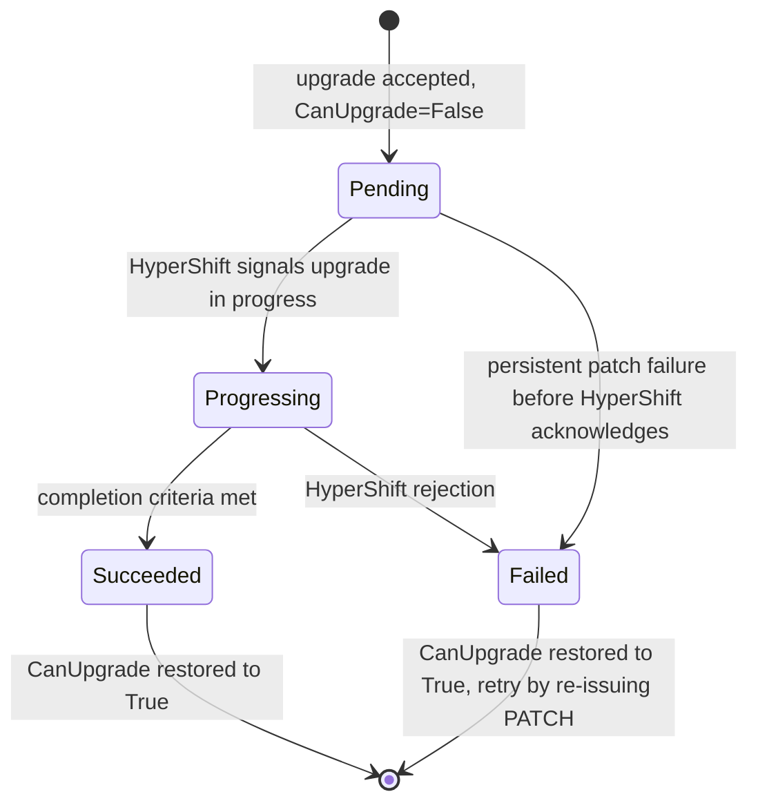

# Cluster Upgrade — CaaS (Phase 1)

## Summary

Phase 1 of CaaS cluster upgrades lets tenants independently upgrade the control plane and individual node pools of an HCP OpenShift cluster by patching `Cluster.spec.version` (CP) or `Cluster.spec.node_sets[*].version` (per-NP). The fulfillment-service validates the request and resolves the target version to a release image. The osac-operator detects image divergence on an existing `HostedCluster` or `NodePool` and directly patches `spec.release.image` without triggering AAP re-provision. Only one upgrade operation runs at a time; upgrades are blocked when the cluster is in a terminal or deleted state, or when `conditions[CanUpgrade]` is not yet `True`.

## Motivation

OSAC provisions HyperShift Hosted Control Plane clusters via two control loops: the fulfillment-service projects DB state to `ClusterOrder` CRs, and the osac-operator provisions via AAP. The operator has read-only access to `HostedCluster` and `NodePool`; all mutations — including scaling — are applied through AAP. Tenants have no API surface to upgrade a cluster, and any `releaseImage` change on `ClusterOrder` triggers a full AAP re-provision.

Phase 1 adds upgrade support by having the osac-operator patch `HostedCluster.spec.release.image` and `NodePool.spec.release.image` directly, bypassing AAP.

### Goals

- Enable independent CP upgrades via `PATCH Cluster.spec.version`.
- Enable independent per-NP upgrades via `PATCH Cluster.spec.node_sets[*].version`.
- Enforce sequential upgrades: only clusters with `conditions[CanUpgrade]=True` accept upgrade spec mutations.
- Enforce version skew: NP version ≤ CP version, within N-3 minor versions of CP; CP upgrade target must not leave any existing node pool more than N-3 minor versions behind.
- Reject downgrade attempts and OBSOLETE version targets.
- Surface upgrade state, observed version, and upgrade history in `Cluster.status`.
- Support version upgrades via `osac edit cluster` (interactive) and a new non-interactive `osac upgrade cluster` command (`scale cluster` pattern: positional cluster name, `--control-plane` for CP targeting, `--node-set` for NP targeting, `--version` accepting `ClusterVersion.metadata.name` or `ClusterVersion.spec.version` string).
- Extend the OSAC UI: version selection with pre-filtering (only eligible versions shown — not OBSOLETE; excludes downgrades against current observed version; skew rules applied client-side), upgrade status monitoring, upgrade history, and upgrade action gating (trigger disabled with tooltip when `status.state ∈ {DELETING, DELETE_FAILED, FAILED}` or `conditions[CanUpgrade] != True`, surfacing the blocking reason) [NFR-1].
- Grant osac-operator write access to `HostedCluster` and `NodePool` resources.

### Non-Goals

- Concurrent upgrades (CP + NP simultaneously, or NP + NP) — one operation at a time is enforced; concurrent upgrades are a non-goal.
- Channel switching and version discovery via the OpenShift upgrade graph / OSUS — deferred to Phase 2 (FR-3).
- Risk review or explicit risk acknowledgment — auto-acknowledged in Phase 1; deferred to Phase 2 (FR-4, FR-5).
- Cancellation window before HyperShift propagation — deferred to Phase 2 (FR-6).
- Version divergence notifications when NPs lag behind CP (FR-14).
- EOL/limited-support visibility (FR-15).
- Tenant Admin fleet view for clusters requiring upgrades (NFR-admin).
- SNO or non-HCP clusters.
- Rollback or downgrade.
- Platform-initiated upgrades.
- Cancel running upgrades (HyperShift does not support it).
- AAP playbook changes — Phase 1 upgrades bypass AAP entirely.
- OSAC-owned persistent upgrade history — Phase 1 relays HyperShift's limited history; operator records NP completion.

## Proposal

Phase 1 adds two independent upgrade paths to the OSAC cluster API:

1. **CP upgrade:** tenant PATCHes `spec.version`; fulfillment-service validates (including N-3 skew) and resolves to `ClusterOrder.spec.ReleaseImage`; operator detects HC image divergence and patches `HostedCluster.spec.release.image`.
2. **NP upgrade:** tenant PATCHes `spec.node_sets[<id>].version`; fulfillment-service validates (including N-3 skew) and resolves to `ClusterOrder.spec.nodeRequests[<id>].ReleaseImage`; operator detects NP image divergence and patches the specific `NodePool.spec.release.image`.

Both paths bypass AAP. The cluster's `CanUpgrade` condition is set to `False` on upgrade acceptance and restored to `True` when the operator confirms completion. The osac-operator monitors HyperShift status fields to detect completion and feeds results back to the fulfillment-service via the existing Signal RPC. The ClusterOrder phase is not changed during upgrade.

### Workflow Description

#### High-Level Pipeline

**Control plane upgrade:**

```
User
 │
 ▼
CLI (upgrade_cmd.go / edit_cmd.go)
 │  gRPC: ClustersUpdateRequest spec.version={name: "4-17-3"}
 │  update_mask: ["spec.version"]
 ▼
Fulfillment-Service API (clusters_server.go)
 │  1. validateUpgradeEligibility: state ∉ {DELETING,DELETE_FAILED,FAILED}, CanUpgrade=True
 │  2. validateVersionUpdate: ClusterVersion catalog lookup → resolves spec.image
 │  3. PostgreSQL: persist spec.version + resolved ReleaseImage + CanUpgrade=False (atomic)
 ▼
Cluster Reconciler (cluster_reconciler_function.go)
 │  buildSpec reads pre-resolved ReleaseImage from DB
 │  K8s PATCH: ClusterOrder.spec.ReleaseImage
 ▼
osac-operator (clusterorder_controller.go)
 │  HC image divergence → CP upgrade path
 │  Readiness check → PATCH HostedCluster.spec.release.image
 │  upgradeStatus.state = Pending
 ▼
HyperShift Controller
 │  desired.version == target → upgradeStatus.state = Progressing
 │  history[0].state == Completed → upgradeStatus.state = Succeeded
 ▼
Status Feedback (clusterorder_feedback_controller.go)
 │  upgradeStatus + CanUpgrade=True → Signal RPC → fulfillment-service DB
 ▼
CLI / UI (upgrade state and observed version updated)
```

**Node pool upgrade** (same structure; `spec.node_sets[i].version` and `NodePool[i]` instead of HC):

```
User
 │
 ▼
CLI (upgrade_cmd.go / edit_cmd.go)
 │  gRPC: ClustersUpdateRequest spec.node_sets[i].version=4.16.5
 │  update_mask: ["spec.node_sets"]
 ▼
Fulfillment-Service API (clusters_server.go)
 │  1. validateUpgradeEligibility
 │  2. validateNPVersionUpdate: ClusterVersion catalog lookup → resolves spec.image
 │  3. PostgreSQL: persist spec.node_sets[i].version + resolved ReleaseImage + CanUpgrade=False (atomic)
 ▼
Cluster Reconciler (cluster_reconciler_function.go)
 │  buildSpec reads pre-resolved ReleaseImage from DB
 │  K8s PATCH: ClusterOrder.spec.nodeRequests[i].{ReleaseImage,Version}
 ▼
osac-operator (clusterorder_controller.go)
 │  NodePool[i] image divergence → NP upgrade path
 │  Readiness check → PATCH NodePool[i].spec.release.image
 │  upgradeStatus.state = Pending
 ▼
HyperShift Controller
 │  conditions[UpdatingVersion]=True → upgradeStatus.state = Progressing
 │  UpdatingVersion=False + version==target → upgradeStatus.state = Succeeded
 ▼
Status Feedback (clusterorder_feedback_controller.go)
 │  upgradeStatus + CanUpgrade=True + node_sets[i].observed_version → Signal RPC → fulfillment-service DB
 ▼
CLI / UI (upgrade state and observed version updated)
```

#### Step 1 — CLI (`osac upgrade cluster`)

**Source file:** `fulfillment-service/cmd/osac/upgrade/upgrade_cmd.go`

```bash
osac upgrade cluster <cluster-name> --control-plane --version 4.17.3
osac upgrade cluster <cluster-name> --node-set compute --version 4.16.5
```

Interactive upgrades are also available via `osac edit cluster`.

The CLI performs the following steps:

1. Looks up the cluster by name or ID.
2. Validates that `--version` is provided and exactly one of `--control-plane` or `--node-set` is specified.
3. Resolves `--version` as `osac create cluster` does: match `ClusterVersion.metadata.name` or `ClusterVersion.spec.version`, preferring the name if both match different versions. Then clone and mutate the cluster proto (using the selected version's metadata name for CP and semantic version for NP):
   - CP: `updated.GetSpec().SetVersion(publicv1.ClusterVersionReference_builder{Name: versionName}.Build())`
   - NP: `updated.GetSpec().GetNodeSets()[nodeSetName].SetVersion(newVersion)`
4. Sends update with a field mask:
   ```go
   client.Update(ctx, publicv1.ClustersUpdateRequest_builder{
       Object:     updated,
       UpdateMask: &fieldmaskpb.FieldMask{Paths: []string{"spec.version"}},  // or "spec.node_sets"
   }.Build())
   ```
5. Prints: `"Run 'osac describe cluster <name>' to monitor progress."`

The CLI has no kubeconfig and never calls the Kubernetes API.

#### Step 2 — Fulfillment-Service API

**Source file:** `fulfillment-service/internal/servers/clusters_server.go`

Resolve and validate the target `ClusterVersion` before locking the Cluster row. Then use the generic update path to lock the row (`SELECT ... FOR UPDATE`), apply the update mask, and check upgrade eligibility, observed versions, and skew against the locked Cluster.

**`validateUpgradeEligibility`** (new, called after locking the Cluster):
1. Reject `FAILED_PRECONDITION` if `state ∈ {DELETING, DELETE_FAILED, FAILED}`.
2. Reject `FAILED_PRECONDITION` if `conditions[CAN_UPGRADE].status != True`. The error message includes the blocking reason from the condition.

`PROGRESSING + CanUpgrade=True` passes both checks — AAP post-provisioning tasks may still be running, but the HC is at the requested version and a new upgrade can be accepted.

**`validateVersionUpdate` (CP) / `validateNPVersionUpdate` (NP)**:

Before taking the Cluster row lock, look up the target `ClusterVersion` in the OSAC catalog. Validate it and capture its release image (`ClusterVersion.spec.image`). The checks against the Cluster's observed versions run after the lock is acquired:

| Check | CP | NP |
|---|---|---|
| `ClusterVersion` exists, enabled, not OBSOLETE | ✓ (DEPRECATED allowed) | ✓ |
| target > observed current version | target > `observed_cp_version` | target > `node_sets[i].observed_version` |
| no downgrade | ✓ | ✓ |
| version skew | CP target leaves no NP > 3 minor versions behind | target NP ≤ CP version; `CP_minor − NP_minor ≤ 3` |

**Database write** (one transaction):
- With the row locked, recheck `CanUpgrade=True`; otherwise return `FAILED_PRECONDITION`.
- Save the requested CP or NP version, resolved `ReleaseImage`, and `CanUpgrade=False` together.

Hold the lock through commit. A concurrent request then sees `CanUpgrade=False` and is rejected.

#### Step 3 — Cluster Reconciler → ClusterOrder Patch

**Source file:** `fulfillment-service/internal/controllers/cluster/cluster_reconciler_function.go`

The reconciler loop reads the pre-resolved `ReleaseImage` stored in the DB cluster record and patches the `ClusterOrder` CR. No separate catalog lookup is needed:

| DB field | ClusterOrder field |
|---|---|
| resolved CP `ReleaseImage` | `spec.ReleaseImage` |
| resolved NP `ReleaseImage` | `spec.nodeRequests[i].ReleaseImage` |
| `spec.node_sets[i].version` | `spec.nodeRequests[i].Version` |

`ReleaseImage`, `nodeRequests[*].ReleaseImage`, and `nodeRequests[*].Version` are excluded from `DesiredConfigVersion` hash computation to prevent triggering AAP re-provision when only version fields change.

#### Step 4 — osac-operator Image Divergence Detection

**Source file:** `osac-operator/internal/controller/clusterorder_controller.go`

On each reconcile, the operator compares desired vs. observed release images:

- **CP:** `ClusterOrder.spec.ReleaseImage ≠ HostedCluster.spec.release.image` and HC exists → CP upgrade path.
- **NP:** `ClusterOrder.spec.nodeRequests[i].ReleaseImage ≠ NodePool[i].spec.release.image` and NP exists → NP upgrade path for that pool.

On divergence, the operator evaluates readiness (see [Operator upgrade readiness check](#operator-upgrade-readiness-check)). If not ready, it sets `upgradeStatus.message` with the blocking condition and requeues (`upgradeStatus.state` remains `Pending`). Once ready:

- **CP:** `PATCH HostedCluster.spec.release.image = ClusterOrder.spec.ReleaseImage`
- **NP:** `PATCH NodePool[i].spec.release.image = ClusterOrder.spec.nodeRequests[i].ReleaseImage`

`upgradeStatus.state` remains `Pending` after the patch — the operator waits for HyperShift to confirm the upgrade has started.

If no image divergence exists and no upgrade is in flight, the existing `DesiredConfigVersion` hash comparison drives AAP provisioning (provision path unchanged).

#### Step 5 — HyperShift Signals Upgrade Started

After the HC or NP patch, the operator monitors for HyperShift's upgrade-started signal on each reconcile:

- **CP:** `HC.status.controlPlaneVersion.desired.version == target_version` → set `upgradeStatus.state = Progressing`, `startTime = now`.
- **NP:** `NodePool[i].status.conditions[UpdatingVersion].status == True` → set `upgradeStatus.state = Progressing`, `startTime = now`.

The feedback controller sends a Signal RPC on each `upgradeStatus` change, so the fulfillment-service reflects `Progressing` state promptly.

#### Step 6 — HyperShift Reconciliation

HyperShift's controllers perform the actual upgrade. The operator monitors for completion on each reconcile:

**CP:** The cluster version operator (CVO) upgrades the control plane components. Completion criteria:
- `HC.status.controlPlaneVersion.history[0].image == ClusterOrder.spec.ReleaseImage`
- `HC.status.controlPlaneVersion.history[0].state == "Completed"`

**NP:** The NodePool controller re-provisions worker nodes to the target version. Completion criteria:
- `NodePool[i].status.conditions[UpdatingVersion].status == False`
- `NodePool[i].status.version == ClusterOrder.spec.nodeRequests[i].Version`

#### Step 7 — Status Propagation (Feedback Loop)

**Source file:** `osac-operator/internal/controller/clusterorder_feedback_controller.go`

On completion, the operator updates `ClusterOrder.status`:
1. Sets `upgradeStatus.state = Succeeded`, `upgradeStatus.completionTime = now`.
2. Sets `ObservedVersion` from `HC.status.controlPlaneVersion.history[0].version` (CP) or records `node_sets[i].observed_version` in the feedback payload (NP).
3. Sets `conditions[CanUpgrade] = True`.
4. Appends an `UpgradeHistoryEntry`.

The feedback controller detects the `ClusterOrder.status` change and sends a `Signal` RPC to the fulfillment-service private API. The fulfillment-service persists `status.upgrade`, `status.observed_cp_version` (CP) or `status.node_sets[i].observed_version` (NP), and `conditions[CAN_UPGRADE] = True` to PostgreSQL.

---

#### End-to-End Flow

```
┌─────────────────────────────────────────────────────────────────────┐
│                            USER                                     │
│  $ osac upgrade cluster my-cluster --control-plane --version 4.17.3│
│  $ osac upgrade cluster my-cluster --node-set compute --version 4.16.5│
└────────────────────────┬────────────────────────────────────────────┘
                         │ gRPC: ClustersUpdateRequest
                         ▼
┌─────────────────────────────────────────────────────────────────────┐
│            FULFILLMENT-SERVICE  (clusters_server.go)                │
│  1. validateUpgradeEligibility: state, CanUpgrade=True              │
│  2. validateVersionUpdate / validateNPVersionUpdate:                │
│       ClusterVersion catalog lookup → ClusterVersion.spec.image     │
│  3. PostgreSQL: spec.version + ReleaseImage + CanUpgrade=False      │
└────────────────────────┬────────────────────────────────────────────┘
                         │ Reconciler loop tick
                         ▼
┌─────────────────────────────────────────────────────────────────────┐
│      CLUSTER RECONCILER  (cluster_reconciler_function.go)           │
│  1. Read DB: ReleaseImage (pre-resolved)                            │
│  2. PATCH ClusterOrder.spec.ReleaseImage (CP)                       │
│     or ClusterOrder.spec.nodeRequests[i].{ReleaseImage,Version} (NP)│
└────────────────────────┬────────────────────────────────────────────┘
                         │ controller-runtime watch event
                         ▼
┌─────────────────────────────────────────────────────────────────────┐
│         OSAC-OPERATOR  (clusterorder_controller.go)                 │
│  1. Image divergence detected → upgrade path                        │
│  2. upgradeStatus.state = Pending                                   │
│  3. Readiness check → PATCH HC or NodePool spec.release.image       │
│  4. Monitor: desired.version==target / UpdatingVersion=True         │
│       → upgradeStatus.state = Progressing                           │
│  5. Monitor completion criteria                                      │
│       → upgradeStatus.state = Succeeded, CanUpgrade=True            │
└────────────────────────┬────────────────────────────────────────────┘
                         │ NodePool/HostedCluster status watch
                         ▼
┌─────────────────────────────────────────────────────────────────────┐
│              HYPERSHIFT CONTROLLER                                  │
│  CP: CVO upgrades control plane; history[0].state=Completed         │
│  NP: NodePool controller re-provisions workers; status.version=target│
└────────────────────────┬────────────────────────────────────────────┘
                         │ controller-runtime watch (ClusterOrder status)
                         ▼
┌─────────────────────────────────────────────────────────────────────┐
│      STATUS FEEDBACK  (clusterorder_feedback_controller.go)         │
│  upgradeStatus.state=Succeeded, CanUpgrade=True,                    │
│    observedVersion / node_sets[i].observed_version                  │
│    → Signal RPC → fulfillment-service → PostgreSQL                  │
└─────────────────────────────────────────────────────────────────────┘
                         │
                         ▼
              User runs: osac describe cluster my-cluster
              Output shows: upgrade Succeeded, observed version updated
```

#### Upgrade status lifecycle



**Upgrade does not change ClusterOrder state.** The ClusterOrder state (`PROGRESSING`, `READY`) reflects provisioning status; it is not changed when an upgrade is accepted or completed. The upgrade is tracked exclusively via the `upgradeStatus` field.

**API-level blocking:** Upgrade requests are rejected if `state ∈ {DELETING, DELETE_FAILED, FAILED}`, or if `conditions[CanUpgrade].status != True`. The `CanUpgrade` condition captures whether all user-initiated operations (provisioning and any prior upgrade) have been confirmed complete by HyperShift. `PROGRESSING + CanUpgrade=True` allows upgrades — the HC is at the requested version even though AAP post-provisioning tasks are still running.

**Cluster-internal health states are not an API gate.** HC degraded, CP temporarily unreachable, or NP unhealthy do not affect `CanUpgrade`. If an upgrade is submitted while these conditions are true, the API accepts it and the operator patches HC/NP. Whether the upgrade succeeds depends on HyperShift.


### API Extensions

#### Proto additions (`proto/private/osac/private/v1/cluster_type.proto`)

```protobuf
// Existing ClusterSpec field (used for CP upgrades; no new field required):
ClusterVersionReference version = 6;

// ClusterNodeSet additions:
string version = 5;           // desired NP version; settable via PATCH
string observed_version = 6;  // output_only; from NodePool.status.version after upgrade

// ClusterStatus additions:
string observed_cp_version = 12;                   // output_only; from HC.status.controlPlaneVersion
ClusterUpgradeStatus upgrade = 13;                 // output_only; active or most recent upgrade
repeated ClusterVersionHistoryEntry version_history = 14;  // output_only

// New messages:
message ClusterUpgradeStatus {
    ClusterUpgradeProgressState state = 1;
    string from_version = 2;
    string to_version = 3;
    google.protobuf.Timestamp started_at = 4;
    google.protobuf.Timestamp completed_at = 5;
    string message = 6;
    string component = 7;  // "control_plane" | "node_pool:<id>"
}

message ClusterVersionHistoryEntry {
    string from_version = 1;
    string to_version = 2;
    google.protobuf.Timestamp completed_at = 3;
    bool success = 4;
    string component = 5;  // "control_plane" | "node_pool:<id>"
}

enum ClusterUpgradeProgressState {
    CLUSTER_UPGRADE_PROGRESS_STATE_UNSPECIFIED = 0;
    CLUSTER_UPGRADE_PROGRESS_STATE_PENDING = 1;      // accepted; waiting for HC/NP readiness
    CLUSTER_UPGRADE_PROGRESS_STATE_PROGRESSING = 2;
    CLUSTER_UPGRADE_PROGRESS_STATE_SUCCEEDED = 3;
    CLUSTER_UPGRADE_PROGRESS_STATE_FAILED = 4;
}
```

After proto changes, run `make -C proto generate` and commit generated code under `proto/gen/`.

#### ClusterOrder condition additions (`osac-operator/api/v1alpha1/clusterorder_types.go`)

```go
// ClusterOrderConditionCanUpgrade indicates the HostedCluster and all NodePools
// are at the OSAC-requested version and ready for a new upgrade to be initiated.
// Maintained continuously by the operator; checked by the fulfillment-service before
// accepting upgrade requests.
ClusterOrderConditionCanUpgrade ClusterOrderConditionType = "CanUpgrade"
```

#### NodeRequest additions (`osac-operator/api/v1alpha1/clusterorder_types.go`)

```go
type NodeRequest struct {
    ResourceClass string `json:"resourceClass"`
    NumberOfNodes int    `json:"numberOfNodes"`
    // ReleaseImage is the resolved OCI pullspec for this node pool.
    ReleaseImage  string `json:"releaseImage,omitempty"`
    // Version is the semver string corresponding to ReleaseImage; populated by
    // the fulfillment-service reconciler. Used by the operator to compare against
    // NodePool.status.version without requiring catalog access.
    Version       string `json:"version,omitempty"`
}
```

#### ClusterOrderStatus additions

```go
type ClusterOrderStatus struct {
    // ... existing fields ...
    ObservedVersion string                `json:"observedVersion,omitempty"`
    UpgradeStatus   *ClusterUpgradeStatus `json:"upgradeStatus,omitempty"`
}

type ClusterUpgradeStatus struct {
    State          UpgradeStateType      `json:"state,omitempty"`
    Component      string                `json:"component,omitempty"` // "control_plane" | "node_pool:<id>"
    FromVersion    string                `json:"fromVersion,omitempty"`
    ToVersion      string                `json:"toVersion,omitempty"`
    StartTime      *metav1.Time          `json:"startTime,omitempty"`
    CompletionTime *metav1.Time          `json:"completionTime,omitempty"`
    Message        string                `json:"message,omitempty"`
    History        []UpgradeHistoryEntry `json:"history,omitempty"`
}

type UpgradeHistoryEntry struct {
    Component      string           `json:"component"`
    FromVersion    string           `json:"fromVersion"`
    ToVersion      string           `json:"toVersion"`
    StartTime      *metav1.Time     `json:"startTime"`
    CompletionTime *metav1.Time     `json:"completionTime,omitempty"`
    State          UpgradeStateType `json:"state"`
}

type UpgradeStateType string

const (
    UpgradeStatePending     UpgradeStateType = "Pending"
    UpgradeStateProgressing UpgradeStateType = "Progressing"
    UpgradeStateSucceeded   UpgradeStateType = "Succeeded"
    UpgradeStateFailed      UpgradeStateType = "Failed"
)
```

#### DB migration

A numbered SQL migration backfills `status.observed_cp_version` from `spec.version.name` for existing clusters:

```sql
update clusters
set data = jsonb_set(
  coalesce(data, '{}'::jsonb),
  '{status,observed_cp_version}',
  to_jsonb(data->'spec'->'version'->>'name')
)
where data->'spec'->'version'->'name' is not null
  and (data->'status'->>'observed_cp_version' is null
       or data->'status'->>'observed_cp_version' = '');
```

No new tables; changes are to the JSONB `data` column.

### Implementation Details

#### Version validation in fulfillment-service

Resolve and validate the target `ClusterVersion` before taking the Cluster row lock. Use a non-locking read of the stored Cluster to check the version reference's scope, including shared versions; the later locked read is authoritative for upgrade state and skew. Like cluster provisioning, the catalog read uses the request transaction but does not lock the `ClusterVersion`. Check `enabled` and `state` when reading it, then use its immutable `version` and `image` for the accepted request.

`validateUpgradeEligibility` (new, called after the row lock):
1. Reject with `FAILED_PRECONDITION` if `state ∈ {DELETING, DELETE_FAILED, FAILED}`.
2. Reject with `FAILED_PRECONDITION` if `conditions[CAN_UPGRADE].status != True` — a user-initiated operation (initial provisioning or a prior upgrade) is in progress and HyperShift has not yet confirmed it complete. The error message includes the blocking reason from the condition (e.g. `"HostedCluster not yet Available"`, `"control plane version not yet converged"`).

`PROGRESSING + CanUpgrade=True` passes both checks — AAP post-provisioning tasks are running but the HC is at the requested version, so a new upgrade can be accepted. `CanUpgrade` captures operation-completion state, not cluster health.

`validateVersionUpdate` (`fulfillment-service/internal/servers/private_clusters_server.go`):

**CP upgrade (`spec.version` change):**
1. Target `ClusterVersion` must exist, be enabled, and not OBSOLETE. Rejects with `INVALID_ARGUMENT`. DEPRECATED is allowed.
2. Target semver > `status.observed_cp_version`. Rejects equal or lesser values with `INVALID_ARGUMENT`.
3. For each existing node pool: `target_CP_minor - NP_observed_minor ≤ 3`. Rejects with `INVALID_ARGUMENT` if the target CP version would leave any node pool more than 3 minor versions behind.

**NP upgrade (`spec.node_sets[<id>].version` change):**
1. Target `ClusterVersion` must exist, be enabled, and not OBSOLETE. Rejects with `INVALID_ARGUMENT`.
2. Target semver > `status.node_sets[<id>].observed_version`. No downgrades.
3. Target semver ≤ `status.observed_cp_version`. NP version must not exceed CP version (including patch).
4. `CP_minor - target_NP_minor ≤ 3`. N-3 minor version skew constraint.

After locking the Cluster row, run `validateUpgradeEligibility` and the observed-version and skew checks against the masked request. If `CanUpgrade` is no longer `True`, return `FAILED_PRECONDITION`. Otherwise, save the requested version, pre-resolved `ReleaseImage`, and `CanUpgrade=False` in one transaction. The operator Signal carries `upgradeStatus` state transitions (Pending, Progressing, Succeeded/Failed) and restores `CanUpgrade=True` on completion.

For version updates, move the `validateClusterStateForSpecUpdate` state check after the catalog lookup and into the locked update path. Other spec updates keep its current behavior.

#### Operator upgrade readiness check

The operator maintains the `CanUpgrade` condition on `ClusterOrder` on every reconcile, independently of any active upgrade and independently of the ClusterOrder phase. It answers one question: **has every user-initiated operation (provisioning or upgrade) been confirmed complete by HyperShift?** Cluster-internal health states (HC degraded, CP temporarily unreachable, NP unhealthy) are deliberately excluded — they are not the result of a user operation and must not block new upgrade requests.

**`CanUpgrade = True` when all of the following hold:**

HostedCluster — availability (provisioning confirmed):
- `conditions[Available].status == True` — the HC exists and is accessible; initial provisioning is complete.
- `conditions[ControlPlaneAvailable].status == True`

HostedCluster — version convergence (no upgrade in flight):
- `status.controlPlaneVersion.history[0].image == ClusterOrder.spec.ReleaseImage` AND `history[0].state == "Completed"` — HyperShift confirms the CP is running the version OSAC requested. Guards against the propagation lag after the operator patches `HC.spec.release.image`.

Every existing NodePool — upgrade-in-progress flags:
- `conditions[UpdatingVersion].status == False` (or condition absent) — no NP version update in progress.
- `conditions[UpdatingConfig].status == False` (or condition absent) — no NP config change in progress.

Every existing NodePool - readiness
- `conditions[Ready].status == True` - the NP is ready.

Every existing NodePool — version convergence:
- `NodePool.status.version == ClusterOrder.spec.nodeRequests[i].Version` — HyperShift confirms the NP is at the version OSAC requested. Guards against the same propagation lag for NP patches.

**Not included** - cluster-internal health states that are not the result of a user-initiated operation, and therfore cannot reliably be detected when a user request is submitted. These affect upgrade success but not upgrade eligibility.

**`CanUpgrade = False`** otherwise, with `reason` and `message` identifying the first unmet condition (e.g. `reason: HostedClusterNotAvailable`, `reason: ControlPlaneVersionNotConverged`, `message: "requested version must be higher than 4.17.21"`).

#### buildSpec change in fulfillment-service reconciler

`buildSpec` in `fulfillment-service/internal/controllers/cluster/cluster_reconciler_function.go`:
- Reads the pre-resolved `ReleaseImage` from the DB cluster record (stored by the API handler as part of the `validateVersionUpdate` transaction) and sets `ClusterOrder.spec.ReleaseImage` (CP image).
- Reads the pre-resolved per-NP `ReleaseImage` and `Version` from the DB cluster record and sets `ClusterOrder.spec.nodeRequests[<id>].ReleaseImage` (pullspec) and `ClusterOrder.spec.nodeRequests[<id>].Version` (semver). No separate catalog lookup is needed.
- `ReleaseImage`, `nodeRequests[*].ReleaseImage`, and `nodeRequests[*].Version` are excluded from `DesiredConfigVersion` hash computation to prevent triggering AAP re-provision when only version fields change.

#### osac-operator upgrade reconciliation

In `clusterorder_controller.go`, the reconcile loop gains upgrade awareness:

**CP upgrade path:**
1. Compare `ClusterOrder.spec.ReleaseImage` with `HostedCluster.spec.release.image`. If HC exists and images differ → CP upgrade path.
2. Set `upgradeStatus = {state: Pending, component: "control_plane", fromVersion: observedVersion, toVersion: spec.version.name}`.
3. Evaluate upgrade readiness (see [Operator upgrade readiness check](#operator-upgrade-readiness-check)). If not ready: update `upgradeStatus.message` with blocking reason, requeue.
4. Once ready: patch `HostedCluster.spec.release.image = ClusterOrder.spec.ReleaseImage`; state remains `Pending`.
5. Monitor: when `HC.status.controlPlaneVersion.desired.version == target_version` → set `upgradeStatus.state = Progressing`, `startTime = now`.
6. Monitor completion: `HC.status.controlPlaneVersion.history[0].image == ClusterOrder.spec.ReleaseImage` AND `history[0].state == "Completed"`.
7. On completion: set `status.observedVersion` from `HC.status.controlPlaneVersion.history[0].version`; append `UpgradeHistoryEntry`; set `upgradeStatus.state = Succeeded`; set `conditions[CanUpgrade] = True`. ClusterOrder phase is not changed.

**NP upgrade path:**
1. Compare `ClusterOrder.spec.nodeRequests[i].ReleaseImage` with `NodePool[i].spec.release.image`. If NP exists and images differ → NP upgrade path for that pool.
2. Set `upgradeStatus = {state: Pending, component: "node_pool:<id>", fromVersion: observed, toVersion: target}`.
3. Evaluate upgrade readiness. If not ready: update `upgradeStatus.message`, requeue.
4. Once ready: patch `NodePool[i].spec.release.image = nodeRequests[i].ReleaseImage`; state remains `Pending`.
5. Monitor: when `NodePool[i].status.conditions[UpdatingVersion].status == True` → set `upgradeStatus.state = Progressing`, `startTime = now`.
6. Monitor completion: `NodePool[i].status.conditions[UpdatingVersion].status == False` AND `NodePool[i].status.version == ClusterOrder.spec.nodeRequests[i].Version`.
7. On completion: set `node_sets[i].observed_version` in the feedback payload; append `UpgradeHistoryEntry`; set `upgradeStatus.state = Succeeded`; set `conditions[CanUpgrade] = True`. ClusterOrder phase is not changed.

**Provision path** (unchanged): if HC does not yet exist or no image divergence on HC or any NP, the existing `DesiredConfigVersion` hash comparison drives AAP provisioning.

RBAC marker expanded:

```go
// +kubebuilder:rbac:groups=hypershift.openshift.io,resources=hostedclusters;nodepools,verbs=get;list;watch;patch;update
```

NodePools are discovered by listing within the cluster's namespace by `osac.openshift.io/resource_class` label selector.

#### HyperShift status fields used

| Purpose | Field | Notes |
|---------|-------|-------|
| HC upgrade eligibility | `HC.status.conditions[Available].status == True` | Provisioning confirmed; must be True |
| HC version convergence | `HC.status.controlPlaneVersion.history[0].image` | Must equal `ClusterOrder.spec.ReleaseImage` |
| HC version convergence | `HC.status.controlPlaneVersion.history[0].state` | Must equal `"Completed"` |
| NP upgrade-in-progress | `NodePool.status.conditions[UpdatingVersion].status == False` | All NPs; must be False (or absent) |
| NP upgrade-in-progress | `NodePool.status.conditions[UpdatingConfig].status == False` | All NPs; must be False (or absent) |
| NP version convergence | `NodePool.status.version` | All NPs; must equal `ClusterOrder.spec.nodeRequests[i].Version` |
| CP current version | `HC.status.controlPlaneVersion.history` (first `Completed` entry) | Semver string |
| CP upgrade in progress | `controlPlaneVersion.history[0].state == Partial` | No `completionTime` |
| CP target during upgrade | `controlPlaneVersion.desired.version` | Display as "upgrading to X" |
| CP upgrade started signal | `HC.status.controlPlaneVersion.desired.version == target_version` | Pending → Progressing transition for CP |
| NP upgrade started signal | `NodePool.status.conditions[UpdatingVersion].status == True` | Pending → Progressing transition for NP |
| CP history | `controlPlaneVersion.history[]` | maxItems: 100 |
| NP current version | `NodePool.status.version` | Flat semver string |
| NP upgrade in progress | `conditions[UpdatingVersion].status == True` | Standard condition |

No `HostedControlPlane` watch needed — all CP status is on `HostedCluster`.

#### History limitation

`controlPlaneVersion.history` is capped at 100 entries by HyperShift. NP upgrade completion events are not available from HyperShift history; Phase 1 records them directly in `ClusterOrder.status.upgradeStatus.history` when the operator observes completion. Comprehensive OSAC-owned persistent history (DB-backed, audit-grade) is deferred to a future phase.

### Security Considerations

- Upgrade requests pass through existing tenant RBAC: only tenants with `Update` permission on their `Cluster` resource can initiate upgrades.
- The osac-operator service account requires expanded RBAC on `hypershift.openshift.io/hostedclusters` and `hypershift.openshift.io/nodepools` (patch/update). These are hub-cluster permissions managed through the existing RBAC marker pattern.
- Target version images are resolved exclusively from the OSAC ClusterVersion catalog; tenants cannot inject arbitrary OCI pullspecs.
- Tenant isolation is preserved: `ClusterOrder` resources are labeled with `osac.openshift.io/tenant`, enforced by existing OPA policies.

### HyperShift Condition Surfacing

HyperShift enforces additional upgrade constraints that OSAC's pre-flight validation cannot fully anticipate (e.g., node-pool machine configuration incompatibilities, custom admission webhooks). When these manifest as conditions on `HostedCluster` or `NodePool`, the feedback controller propagates them to `ClusterOrder.status.conditions` and the fulfillment-service exposes them in `Cluster.status.conditions`. Tenants see the condition type, status, and reason directly from HyperShift without needing to inspect hub-cluster CRDs.

At Phase 1, it is the **tenant's responsibility** to verify that a target version is reachable from the current version before initiating an upgrade. OSAC validates that the target exists in the ClusterVersion catalog, is not OBSOLETE, and satisfies version-skew rules — but does not check upgrade-graph reachability (FR-3 is deferred to Phase 2). Tenants can use the [Red Hat OpenShift Container Platform Update Graph](https://access.redhat.com/labs/ocpupgradegraph/update_path/) to confirm valid upgrade paths.

### Failure Handling and Recovery

| Failure mode | What happens | Recovery | User observes |
|---|---|---|---|
| HC/NP conditions not met when operator processes accepted upgrade (HC degraded, not available, version not converged, etc.) | Operator sets `upgradeStatus.state = Pending` with the blocking condition in `message`; requeues without patching HC/NP. The API already accepted the request. | Conditions clear automatically; operator advances to patching on next reconcile. | `status.upgrade.state = Pending` with message indicating why execution is delayed. |
| Patch HC or NP fails (API error) | Operator retries on next reconcile with backoff. `upgradeStatus.state` remains `Pending`. | Resolve underlying issue; operator resumes automatically. | Upgrade appears stuck in Pending. |
| Persistent patch failure | After repeated backoff, operator sets `upgradeStatus.state = Failed`. | Operator logs error; new upgrade request required. | `status.upgrade.state = Failed` with message. |
| Operator crashes mid-upgrade | On restart, operator re-reads `ClusterOrder.spec.ReleaseImage` and `nodeRequests[*].ReleaseImage` and resumes. Patch calls are idempotent. | Automatic on restart. | Brief gap in status updates. |
| HyperShift rejects the HC/NP patch (webhook, admission) | Operator logs the error and sets `upgradeStatus.state = Failed` with the admission message. | Resolve the admission issue; re-issue the upgrade PATCH. | `status.upgrade.state = Failed` with message from HyperShift. |
| Target version not found in the ClusterVersion catalog | Rejected at `validateVersionUpdate`. | User specifies a valid version name. | `INVALID_ARGUMENT` with message. |
| Version downgrade attempted | Rejected at `validateVersionUpdate`. | User selects a valid target. | `INVALID_ARGUMENT` with message. |
| CP upgrade violates N-3 skew against existing NPs | Rejected at `validateVersionUpdate`. | User must upgrade lagging NPs first, then retry the CP upgrade. | `INVALID_ARGUMENT` with message. |
| NP upgrade violates N-3 skew behind CP | Rejected at `validateNPVersionUpdate`. | User must upgrade CP first or choose a version within skew. | `INVALID_ARGUMENT` with message. |

### RBAC / Tenancy

- No changes to the fulfillment-service tenant RBAC model.
- osac-operator service account RBAC expanded: `patch` and `update` verbs on `hostedclusters` and `nodepools`.
- Feedback controller's `Signal` RPC is unchanged; new status fields are added to the existing signal payload.
- No changes to OPA policies; upgrade operations are gated by the existing `Update` verb on `Cluster`.

### Observability and Monitoring

- `ClusterOrder.status.upgradeStatus` provides operator-level upgrade visibility.
- The osac-operator emits a Kubernetes Event on the `ClusterOrder` when an upgrade starts, transitions to Progressing, completes, or fails (`Normal` for start/Progressing/complete, `Warning` for failure).

### Risks and Mitigations

| Risk | Mitigation |
|---|---|
| `ReleaseImage` hash exclusion triggers spurious AAP re-provision on controller upgrade | Validate in staging: upgrade the controller on a live cluster and verify no AAP jobs are triggered. |
| HyperShift `controlPlaneVersion.history` is capped at 100 entries | Phase 1 relays up to 100 entries; operator-owned history (DB-backed) deferred to a future phase. |
| NP history not available from HyperShift | Operator records NP completion events directly at transition time. |
| Operator has expanded RBAC on HC/NP (write access) | Scope is limited to `patch`/`update` on `hostedclusters`/`nodepools` in the managed namespaces only. |

### Drawbacks

OSAC enforces one operation at a time (no concurrent NP upgrades across different pools). A cluster with multiple node pools cannot run NP upgrades in parallel; each upgrade must complete before the next is accepted.

## Open Questions

### 9.1 NP history from HyperShift — Partially Resolved

NP-only upgrades (worker nodes catching up to an already-running CP version) likely do not produce entries in `HostedCluster.status.version.history` since the cluster CVO version doesn't change. This needs live-cluster verification. Phase 1 records NP completion events from operator observation; HyperShift-sourced NP history deferred to a future phase.

## Test Plan

The test strategy follows the touched-area map for `fulfillment-service` and `osac-operator`.

**Unit tests:**
- `validateVersionUpdate` — CP upgrade: target > current, not OBSOLETE, N-3 skew against existing NPs, READY state.
- `validateNPVersionUpdate` — NP upgrade: target ≤ CP, N-3 skew, target > NP current, READY state.
- `buildSpec` — CP and per-NP image resolution from ClusterVersion catalog.
- Operator upgrade path: image divergence detection, upgrade vs. provision routing.
- `DesiredConfigVersion` hash exclusion: version-only change does not trigger AAP.

**Integration tests:**
- CP upgrade end-to-end: PATCH spec.version → CanUpgrade=False (sync DB write) → ClusterOrder sync → operator patches HC → completion detected → CanUpgrade=True + history entry.
- NP upgrade end-to-end: PATCH spec.node_sets[i].version → CanUpgrade=False (sync DB write) → NP patched → NP completion → CanUpgrade=True + per-NP observed_version.
- Blocking guard: reject upgrade request on DELETING, DELETE_FAILED, FAILED clusters; reject when CanUpgrade=False.
- Concurrent upgrades to one cluster: one succeeds; the other returns FAILED_PRECONDITION. Verify the stored version and ReleaseImage match the winner and CanUpgrade=False.
- N-3 skew rejection: NP upgrade rejected when skew would exceed 3 minor versions; CP upgrade rejected when it would leave any NP more than 3 minor versions behind.
- NP version ≤ CP version enforcement: NP upgrade to version > CP rejected.

**E2E tests:** see `04-testplan.md` for detailed test cases. Key scenarios: CP upgrade on a live cluster, per-NP upgrade, version skew rejection, concurrent-upgrade rejection, upgrade retry after failure.

## Graduation Criteria

- Stable CP and per-NP upgrades via the OSAC API, CLI, and UI.
- Correct upgrade state and history surfaced in `Cluster.status`.
- N-3 skew and downgrade rejection validated by integration tests.
- RBAC expansion for osac-operator documented and audited.
- DB backfill migration applied and verified on pre-existing clusters.

## Upgrade / Downgrade Strategy

A DB migration backfills `observed_cp_version` for pre-existing clusters (see SQL in API Extensions). The new `ClusterStatus` fields are additive and backward-compatible. The `ReleaseImage` hash exclusion is a behavioral change to the provisioning path; it must be validated on rollout to prevent spurious AAP re-provision jobs.

## Version Skew Strategy

The fulfillment-service, osac-operator, and osac-ui are affected. All three ship in the same coordinated deployment. The osac-ui generates types from the same protos; new status fields degrade gracefully (no display) on older UI builds.

## Support Procedures

### Detection

- Upgrade state is visible in `Cluster.status.upgrade` and `ClusterOrder.status.upgradeStatus`.
- Stuck upgrades (Progressing for > expected duration) surface via Kubernetes Events on `ClusterOrder`.
- Operator logs structured entries with cluster ID, component, and version on every state transition.

### Recovery

- A failed upgrade can be retried by PATCHing the version field to a valid target.
- If the operator is stuck (persistent HC/NP API errors), resolve the underlying hub-cluster API issue; the operator resumes automatically on reconnection.

## Infrastructure Needed

- Hub cluster RBAC: `patch`/`update` on `hostedclusters` and `nodepools` for the osac-operator service account.
- No new external services or infrastructure.

---

## Provenance

Authored: draft @ design 0.11.1 - f1d6a4b, workspace main @ b14c881c5 (dirty)
Final: revise @ design 0.11.3 - 2bd6607, workspace main @ 9c26507ef

> Context changed between draft and revise.

<!-- ai-workflow-provenance:{"schema_version":1,"provenance_kind":"session","workflow":"design","workflow_version":"0.11.3","ai_workflows":"2bd6607","source_repo":"9c26507ef","source_repo_branch":"main","commits_behind_main":0,"commits_ahead_main":0,"main_ref":"main","phases":["draft","draft","revise","revise","revise","revise","revise","revise","revise","revise","revise","revise","revise","revise","revise","revise","revise","revise","revise","revise","revise"],"authoring_modes":["skill"],"context_changed":true,"origin_untracked":false} -->
