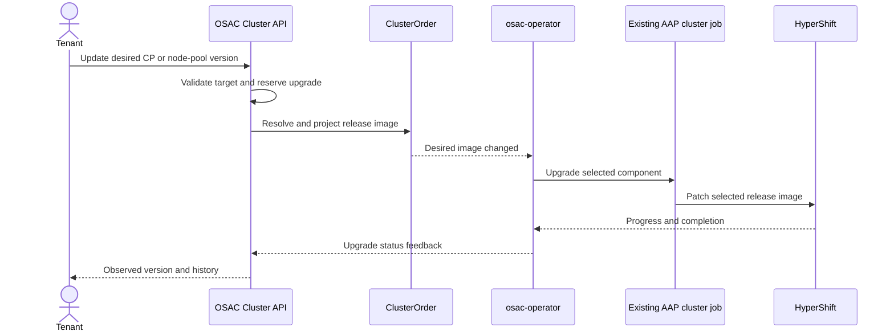

# Cluster Upgrade — CaaS (Phase 1)

## Summary

Phase 1 lets tenants upgrade an HCP cluster's control plane or an individual node pool through OSAC. Upgrades run one at a time, using the existing AAP path to change the selected HyperShift resource without re-provisioning the cluster. OSAC validates the target version, reports current progress, and records the terminal result of each control-plane or node-pool attempt in `Cluster` history.

## Motivation

Tenants have no supported OSAC API for upgrading an HCP cluster. A direct change to a HyperShift resource would be overwritten by OSAC's desired-state reconciliation.

### Goals

- Represent control-plane and node-pool upgrade intent in the existing `Cluster` API.
- Validate version relationships and serialize upgrades before changing HyperShift.
- Track upgrades separately from cluster provisioning.

### Non-Goals

- Concurrent control-plane or node-pool upgrades.
- Upgrade channels, upgrade-graph discovery, and OSAC risk assessment or acknowledgment. Without a channel in Phase 1, OSAC cannot assess or acknowledge risks; tenants check them externally. These capabilities follow in Phase 2.
- A cancellation window before HyperShift starts, version-divergence and end-of-life notifications, and a fleet view; these follow in later phases.
- SNO or non-HCP clusters.
- Rollback or downgrade.
- Platform-initiated upgrades.
- Cancel running upgrades (HyperShift does not support it).

### Assumptions

- A `ClusterVersion`'s OpenShift semver and release image are immutable after creation. This design relies on that stability for validation, migration, and image projection.

## Proposal

The `Cluster` resource holds upgrade intent. Fulfillment projects the selected release image to `ClusterOrder`; the operator uses AAP to update the existing HyperShift resource. HyperShift progress returns to `Cluster` status.

### Workflow Description

Tenants request an upgrade by updating `Cluster.spec.version` for the control plane or one `Cluster.spec.node_sets[<name>].version` for a node pool. They can use the Cluster API, `osac edit cluster`, or the new CLI command:

```bash
osac upgrade cluster <cluster-name> --control-plane --version <version>
osac upgrade cluster <cluster-name> --node-set <node-set-name> --version <version>
```

The CLI requires exactly one target. `--version` accepts a `ClusterVersion` catalog name or version string; a name takes precedence if both match.

The UI applies the [admission rules](#admission-and-version-validation) to version choices. It disables a blocked upgrade action and displays the reason.

The same flow applies to either target:



### API Extensions

#### Public Cluster contract

| Field | Type | Purpose |
|---|---|---|
| `Cluster.spec.version` | Existing `ClusterVersionReference` | Desired control-plane version. |
| `ClusterNodeSet.version` | `ClusterVersionReference` | Desired node-pool version in `Cluster.spec.node_sets[<name>]`; initialized from the control-plane version on Create and updateable by PATCH. |
| `ClusterNodeSet.observed_version` | Output-only string | Observed node-pool semver in `Cluster.status.node_sets[<name>]`. |
| `ClusterStatus.observed_cp_version` | Output-only string | Observed control-plane semver. |
| `ClusterStatus.upgrade` | Output-only `ClusterUpgradeStatus` | Current Pending/Progressing/TimedOut attempt, or the last terminal attempt. |
| `ClusterStatus.version_history` | Output-only list of `ClusterVersionHistoryEntry` | Every terminal control-plane and node-pool attempt, successful or failed. |
| `CLUSTER_CONDITION_TYPE_CAN_UPGRADE` | `ClusterConditionType` | Fulfillment-owned admission gate in `Cluster.status.conditions`. |

Upgrade status conveys the current or most recent attempt's state, affected component, source and target OpenShift versions, timing, and message. A history entry conveys the component, source and target versions, completion time, and successful or failed outcome. The exact fields for both are left to implementation.

Public components are `control_plane` or `node_pool:<node-set-name>`. All observed, target, and history versions are OpenShift semver strings such as `4.21.2`, not catalog names such as `4-21-2`.

#### ClusterOrder contract

| Field | Purpose |
|---|---|
| `ClusterOrderSpec.ReleaseImage` | Desired control-plane image, resolved from `Cluster.spec.version`. |
| `NodeRequest.ReleaseImage` | Desired node-pool image in `ClusterOrderSpec.NodeRequests`, resolved from the node set's version reference. |
| `ClusterOrderStatus.ObservedVersion` | Observed control-plane version. |
| `ClusterOrderStatus.UpgradeStatus` | Upgrade state, component, versions, timestamps, and message; fulfillment records terminal results in Cluster history. |

The internal component uses `node_pool:<node-pool-name>` for a node pool. Fulfillment maps it to the public node-set name.

#### Data migration

New Clusters start with each node set's desired version set to the selected control-plane version. Creation stores the accepted version and `CanUpgrade=False` together. Control plane and node pool versions can diverge only as a result of subsequent upgrades.

A numbered migration copies the control-plane version reference to existing node sets because, before the introduction of upgrades, OSAC provisions every NodePool from the control-plane release image. For Clusters whose HyperShift cluster is ready under the [OSAC-1604 cluster status model](../OSAC-1604-granular-cluster-status-reporting/), it backfills observed control-plane and node-pool semver from the corresponding `ClusterVersion`. It sets `CanUpgrade=True` only when HyperShift readiness is established and every baseline resolves; unresolved or not-yet-ready Clusters remain blocked.

These changes use the existing Cluster JSONB record. They add no tables.

HyperShift cluster readiness under that model can be established while post-install tasks keep `ClusterOrder` in `Progressing`. Those tasks do not block upgrades once HyperShift is ready and `CanUpgrade=True`.

### Implementation Details

#### Admission and version validation

The target `ClusterVersion` must exist, be enabled, and not be OBSOLETE. DEPRECATED versions remain allowed. OSAC compares the catalog's semver with observed semver, never with its catalog name.

| Upgrade target | Required version relationship |
|---|---|
| Control plane | Target is newer than the observed control plane and leaves every observed node pool within three minor versions. |
| Node pool | Target is newer than that pool's observed version, no newer than the observed control plane, and within three minor versions of it. |

An upgrade is blocked when the target fails these rules, Cluster state is `FAILED`, `DELETING`, or `DELETE_FAILED`, or `CanUpgrade` is not True. The API explains why the upgrade cannot be triggered.

Fulfillment checks the current observed versions and `CanUpgrade` under the Cluster row lock. It stores the desired version, a Pending upgrade with the resolved target semver, and `CanUpgrade=False` in one transaction. A competing request sees the new gate value and is rejected.

`PROGRESSING` Cluster state does not itself block an upgrade when `CanUpgrade=True`. The gate reflects completion of the previous operation, not HyperShift health.

#### ClusterVersion deletion protection

A numbered database migration extends the existing `ClusterVersion` soft-deletion guard to cover every node-set version reference in an active Cluster, alongside its control-plane reference. It matches canonical IDs and legacy name-only references as the existing guard does, and preserves protection for templates and catalog items. A version remains protected until no active resource references it.

#### Desired-state projection

The Cluster stores version references, not release images. Fulfillment resolves each reference to an image and projects it to the corresponding `ClusterOrder` field in [API Extensions](#api-extensions).

`ClusterOrderSpec.ReleaseImage` and `NodeRequest.ReleaseImage` are excluded from the creation and scaling `DesiredConfigVersion` hash, so image-only changes do not trigger re-provisioning or scaling. The operator instead detects a difference between the desired and live release images. Other spec changes continue through the existing provisioning path, which uses the currently recorded images.

#### Upgrade execution

The operator uses the configured AAP cluster job or workflow for the selected component, passing an explicit upgrade operation and target image. Reconciliation or restart must not launch a duplicate upgrade for the same component and image while it is running or after the patch succeeds.

An upgrade waits for any active create or scale job. A create or scale job also waits for an active upgrade. After the first job finishes, the operator re-evaluates the latest `ClusterOrder`. Both operations use the existing per-cluster lease.

The AAP upgrade path selects the NodePool by name. It checks that the selected `HostedCluster` or NodePool exists and belongs to this `ClusterOrder`, then patches only `spec.release.image` and confirms the live image afterward.

It does not create a missing resource or run installation, infrastructure, readiness, or post-install tasks. A successful AAP job confirms the patch, not completion of the HyperShift upgrade.

OSAC-provisioned NodePools currently use `spec.management.upgradeType: InPlace` because their workers are bare metal. This setting may change later with introduction of virtualization-backed clusters.

The create and scale path must render the HostedCluster image from `ClusterOrderSpec.ReleaseImage` and each NodePool image from its own `NodeRequest.ReleaseImage`, with the control-plane image as a fallback for older `ClusterOrder` resources. This preserves the selected images during later re-provisioning or scaling.

#### Upgrade progress and feedback

| State | Description |
|---|---|
| Pending | OSAC accepted the target; HyperShift has not signaled the start, even if AAP applied the patch. |
| Progressing | HyperShift is working toward the requested version of the selected control plane or node pool. |
| TimedOut (Cluster status only) | An implementation-defined timeout has elapsed before a terminal result; this is a warning, not a HyperShift failure signal. |
| Succeeded | HyperShift has completed applying the requested version to the selected component. |
| Failed | HyperShift reports an unrecoverable terminal error for an initiated upgrade and has stopped working toward the target. |

The operator determines whether the selected HyperShift control plane or node pool has started upgrading, completed the requested version, or reached a terminal failure. The concrete HyperShift fields and signals used to make those determinations are left to implementation.

The operator reports HyperShift completion signals and observed semver through the existing private Cluster Update path. Fulfillment accepts success only when the reported component and observed semver match the accepted component and target semver in `Cluster.status.upgrade`. On success or terminal failure, it updates `Cluster.status.upgrade`, appends one history entry indicating success or failure, and sets `CanUpgrade=True` in the same transaction. Success also advances the observed version; failure leaves it unchanged. Stale feedback cannot release the gate.

An in-flight upgrade may be marked `TimedOut` if the upgrade is taking too long according to a defined threshold. OSAC sets `Cluster.status.upgrade.state=TimedOut` with a tenant-visible warning, but leaves `CanUpgrade=False` and does not add a history entry. The operator continues monitoring HyperShift; a later Succeeded or Failed result replaces TimedOut, records the terminal history entry, and releases the gate.

Initial readiness feedback sets the observed baselines and `CanUpgrade=True` together while no upgrade is active. An upgrade never changes Cluster or `ClusterOrder` provisioning state. Upgrade status describes only application of the requested version, independently of cluster health: a cluster may remain ready and serve workloads after a failed upgrade, or become degraded after a successful one.

Phase 1 stores `Cluster.status.version_history` in the existing Cluster JSONB record. Fulfillment adds one entry when each accepted control-plane or node-pool attempt first succeeds or fails; replayed feedback adds none, while a separately accepted retry adds another entry even for the same versions. OSAC does not copy HyperShift history or count initial installation as an upgrade. A node-pool entry uses the public `node_pool:<node-set-name>` component.

### Security Considerations

OSAC resolves target images from the `ClusterVersion` catalog. Tenant input cannot supply an arbitrary release-image pullspec.

### Failure Handling and Recovery

| Failure | Behavior and recovery | Tenant-visible result |
|---|---|---|
| AAP is unavailable or a patch error is retryable | The operator retries with backoff after AAP or hub API access recovers. | Upgrade remains Pending with an upgrade-specific message. |
| The selected resource is absent or belongs to another `ClusterOrder` | AAP fails before patching. After the resource or association is restored, the tenant submits a new request. | Terminal Failed with a target-validation message; provisioning state is unchanged. |
| Operator restarts during an upgrade | It resumes reconciliation without launching a duplicate upgrade or repeating an already-applied patch. | Status updates may pause briefly. |
| AAP succeeds but HyperShift has not started or completed | The operator continues observing HyperShift. | Pending until the start signal, then Progressing until completion. |
| An upgrade takes too long | OSAC records a nonterminal timeout warning and the operator keeps monitoring; SRE can investigate the stalled operation. | TimedOut in `Cluster.status.upgrade`, with no history entry or lock release. |
| Catalog lookup fails during projection | Reconciliation retries after catalog access returns. | The accepted upgrade remains Pending. |
| HyperShift reports an upgrade error | The operator exposes the upgrade-specific message. | The message appears in `Cluster.status.upgrade`; provisioning state is unchanged. |

Phase 1 does not query the OpenShift Update Service (OSUS) for upgrade-graph reachability or assess upgrade risks. Before initiating an upgrade, tenants must use the [Red Hat OpenShift Container Platform Update Graph](https://access.redhat.com/labs/ocpupgradegraph/update_path/) outside OSAC to check the path from the current to target OpenShift version and review associated risks. OSAC applies the catalog-resolved release image without verifying that path or surfacing those risks; channels and conditional-update risk review follow in Phase 2.

### RBAC / Tenancy

The upgrade path preserves existing tenant isolation. The tenant's existing `Update` permission on its `Cluster` gates requests; `ClusterOrder` retains the `osac.openshift.io/tenant` annotation and existing OPA isolation.

The osac-operator retains read-only access to `HostedCluster` and NodePool resources. The existing AAP cluster execution identity performs the patch after checking the target's namespace and `ClusterOrder` association. No new permissions or OPA policies are required.

### Drawbacks

Serializing upgrades per cluster means different node pools must wait for one another. Reusing AAP adds scheduling time and makes an upgrade depend on AAP availability before HyperShift can begin.

## Alternatives (Not Implemented)

**On-demand HyperShift history:** OSAC could display upgrade history directly from HyperShift instead of storing it. HyperShift does not provide node-pool upgrade history, so this would not cover both components.

**Health-based upgrade gate:** `CanUpgrade` could be updated continuously from cluster health, such as degradation. However, this design uses it only to serialize user-initiated operations that affect upgrades; cluster health and upgrade status remain independent, so a later health change does not change the gate.

**Direct operator patching:** The operator could update HyperShift images itself. That would require write access and a second mutation path alongside AAP. The design keeps one controlled path.

## Test Plan

The [Phase 1 test plan](testplan-phase1.md) is the companion verification artifact and must assign tiers and owners to detailed cases. This design requires these scenarios:

### Unit

- Reject invalid catalog targets, OpenShift version downgrades, and control-plane or node-pool version-skew violations.

### Integration

- Accept only one of two concurrent upgrade requests, then record one history entry and release the gate on terminal feedback; timeout and replay do not create terminal history or release a new attempt's gate.
- Route image-only changes to the AAP upgrade path without re-provisioning, and patch only the selected HostedCluster or NodePool.
- Backfill versions and the upgrade gate during migration; preserve each node pool's image during later scaling; reject deletion of a version referenced only by a node set.

### E2E

- Upgrade a control plane and a named node pool through the tenant-facing API, CLI, and UI, observing progress and the terminal result.
- Verify retryable AAP errors, nonterminal timeout warnings, and terminal HyperShift failures follow the recovery and gate rules.

## Graduation Criteria

No release target or maturity stage is specified here. Dev Preview, Tech Preview, and GA graduation gates will be defined when a release is targeted; the following checks define Phase 1 technical readiness.

- Control-plane and per-node-pool upgrades work through the API, CLI, and UI.
- `Cluster.status` reports the current or last upgrade state, observed versions, and successful and failed attempts for both components in history.
- Integration tests verify OpenShift version downgrade and N-3 skew rejection, migration, and the AAP upgrade path.
- The operator needs no new HyperShift write permission, and upgrades do not rerun cluster creation.

## Deployment Strategy

New status fields are additive. The [data migration](#data-migration) backfills existing Clusters before upgrade requests are enabled.

## Dependencies

- [PR #1418](https://github.com/osac-project/osac/pull/1418): Makes NodePools addressable by name; it must be merged and deployed before Phase 1 node-pool upgrades.

## Version Skew Strategy

Fulfillment-service, osac-operator, osac-aap, and osac-ui ship in a coordinated deployment. Upgrade requests remain disabled until fulfillment-service, osac-operator, and the AAP upgrade path are available. Older UI builds simply omit the new status fields.

## Support Procedures

Phase 1 introduces no new support tooling or separate runtime enable/disable procedure. SREs inspect `Cluster.status.upgrade` for stalled or failed attempts and follow [Failure Handling and Recovery](#failure-handling-and-recovery); upgrade request enablement during rollout follows [Version Skew Strategy](#version-skew-strategy).

## Infrastructure Needed

No new runtime infrastructure or AAP job template is needed; Phase 1 reuses the configured AAP cluster job or workflow and existing HyperShift resources. The companion test plan records unresolved deployed provider, browser, and failure-injection test prerequisites.

---

## Provenance

Authored: draft @ design 0.11.1 - f1d6a4b, workspace main @ b14c881c5 (dirty)
Final: revise @ design 0.11.3 - 2bd6607, workspace main @ 9c26507ef

> Context changed between draft and revise.

<!-- ai-workflow-provenance:{"schema_version":1,"provenance_kind":"session","workflow":"design","workflow_version":"0.11.3","ai_workflows":"2bd6607","source_repo":"9c26507ef","source_repo_branch":"main","commits_behind_main":0,"commits_ahead_main":0,"main_ref":"main","phases":["draft","draft","revise","revise","revise","revise","revise","revise","revise","revise","revise","revise","revise","revise","revise","revise","revise","revise","revise","revise","revise"],"authoring_modes":["skill"],"context_changed":true,"origin_untracked":false} -->
