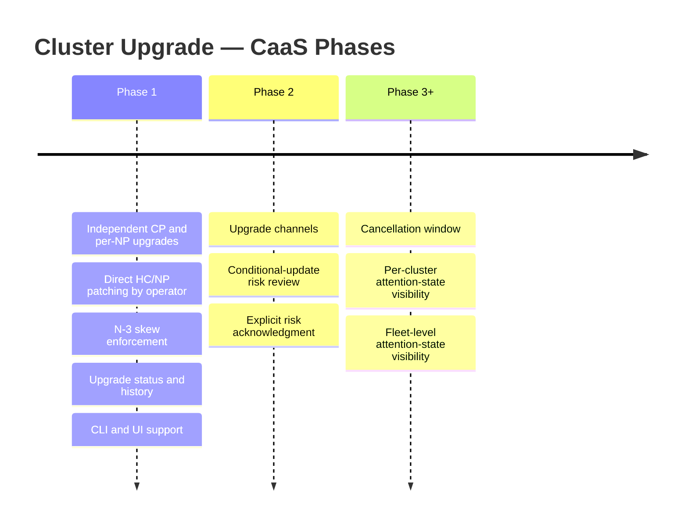

# Cluster Upgrade — CaaS

## Summary

This enhancement enables tenants to upgrade HyperShift Hosted Control Plane (HCP) OpenShift clusters through the OSAC API, CLI, and UI. It is delivered in phases. Phase 1 introduces independent, sequential CP and per-NP upgrades with version-skew enforcement, direct HyperShift patching by the osac-operator, and upgrade status/history surfaced from HyperShift. Phase 2 adds upgrade channel management and conditional-update risk review. Later phases add a cancellation window, fleet-level notifications, and attention-state notifications for divergence and EOL conditions.

## Motivation

OSAC provisions HyperShift Hosted Control Plane clusters but currently has no API surface for upgrading them. Any change to the release image on `ClusterOrder` triggers a full AAP re-provision. Tenants have no supported upgrade path: any direct edit to a HyperShift CRD is overwritten by OSAC's reconciler to restore the desired state. This enhancement delivers a first-class, governed upgrade workflow.

### Goals

- Enable tenants to upgrade cluster control planes and node pools through the OSAC API.
- Enforce version skew, downgrade prevention, and valid-version constraints.
- Surface upgrade state and history in `Cluster.status`.
- Provide CLI and UI coverage for upgrade initiation and monitoring.
- Lay groundwork for upgrade graph integration, risk acknowledgment, and fleet management.

### Non-Goals

- Rollback or downgrade.
- Cancel running upgrades (HyperShift does not support it).
- SNO or non-HCP clusters.
- Platform-initiated upgrades.

## Proposal

Cluster upgrades are triggered by **updating a version field on the OSAC `Cluster` resource** — `spec.version` for the control plane, `spec.node_sets[*].version` for a node pool. The fulfillment-service validates the target version and syncs it to the `ClusterOrder` CR. The osac-operator detects image divergence and patches the corresponding HyperShift CRD directly, bypassing AAP. Upgrade progress and history are fed back through the existing Signal RPC.

### Phase overview

### Phase 1 — Independent upgrades

Control plane and node pools are upgraded independently and sequentially. The operator patches `spec.release.image` on the target `HostedCluster` or `NodePool` directly, bypassing AAP. A `CanUpgrade` condition gates serial access and reflects operation completion as confirmed by HyperShift. Version skew (NP ≤ CP, within N-3 minor versions) is enforced at the API layer.

Upgrades are triggered through `osac edit cluster`, a new `osac upgrade cluster` command, or directly via `PATCH /clusters/{id}`.

See `design-phase1.md` for the full specification.

### Phase 2 — Channels and risk acknowledgment

Phase 2 adds upgrade channel management and conditional-update risk review. API changes and implementation details are deferred to the Phase 2 design.

### Phase 3+ — Operational polish

Later phases address the remaining PRD items: cancellation window (FR-6), per-cluster attention-state visibility (FR-14, FR-15), and fleet-level attention-state visibility (NFR-admin). Details deferred to per-phase designs.

## Upgrade / Downgrade Strategy

Each phase is additive and backward-compatible with Phase 1 consumers.

## Version Skew Strategy

The fulfillment-service, osac-operator, and osac-ui are affected across all phases. All three ship in coordinated deployments per phase. New status fields degrade gracefully on older UI builds.

## Support Procedures

Upgrade state is visible in `Cluster.status.upgrade`, `ClusterOrder.status.upgradeStatus`, and Kubernetes Events on `ClusterOrder`. See `design-phase1.md` for Phase 1 recovery procedures.

## Infrastructure Needed

- Hub cluster RBAC: `patch`/`update` on `hostedclusters` and `nodepools` (Phase 1).

---

## Provenance

Authored: draft @ design 0.11.1 - f1d6a4b, workspace main @ b14c881c5 (dirty)
Final: revise @ design 0.11.3 - 2bd6607, workspace main @ 9c26507ef

> Context changed between draft and revise.

<!-- ai-workflow-provenance:{"schema_version":1,"provenance_kind":"session","workflow":"design","workflow_version":"0.11.3","ai_workflows":"2bd6607","source_repo":"9c26507ef","source_repo_branch":"main","commits_behind_main":0,"commits_ahead_main":0,"main_ref":"main","phases":["draft","draft","revise","revise","revise","revise","revise","revise","revise","revise","revise","revise","revise","revise","revise","revise","revise","revise","revise","revise","revise"],"authoring_modes":["skill"],"context_changed":true,"origin_untracked":false} -->
