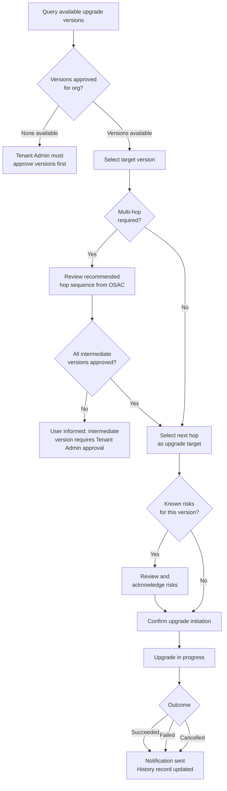

# Cluster Upgrade — CaaS

| Field      | Value                                                                    |
|------------|--------------------------------------------------------------------------|
| Author(s)  | Vitaliy Emporopulo                                                       |
| Jira       | [OSAC-1415](https://redhat.atlassian.net/browse/OSAC-1415)               |
| Date       | 2026-07-16                                                               |

## Problem Statement

OSAC CaaS manages the full lifecycle of clusters — creation, scaling, and deletion — but
provides no managed path for upgrading a cluster's OpenShift version. Tenants who need a newer version must perform a direct upgrade on the spoke cluster,
bypassing OSAC's governance model: the upgrade proceeds without organizational version
approval, leaves no record in OSAC's audit trail, and is invisible to OSAC's monitoring
and notification tooling. As clusters age on a given
version, this gap compounds: EOL versions lose Red Hat support coverage, security patches
become unavailable, and the organization has no centralized view of when version transitions
occurred or which were sanctioned. Without first-class upgrade support, OSAC cannot fulfill
its role as a managed Kubernetes platform for the full cluster lifecycle.

## In Scope

**Services:** CaaS — clusters managed by OSAC.

**Upgrade lifecycle:**
- Tenant Users and Tenant Admins can initiate cluster upgrades and cancel pending upgrades
  (not yet started) via the API, CLI, and UI
- Each upgrade is a first-class resource with a stable ID, lifecycle states (pending, running,
  succeeded, failed, cancelled), and timestamps
- Upgrade initiation is rejected for clusters that are not in a healthy, running state, with
  a descriptive error message
- Only one active upgrade per cluster is permitted at a time
- Users can monitor the status and progress of an in-progress upgrade
- Upgrade history is available per cluster, recording all version transitions with from/to
  versions, outcome, duration, and whether the upgrade was OSAC-managed or performed
  out-of-band

**Version selection:**
- Users can query the valid upgrade versions for a specific cluster — validated upgrade paths
  only, limited to versions approved for the organization and available in the version catalog
- A target version is only presented as available if all intermediate versions on the upgrade
  path are also approved; if an intermediate is not approved, the target is not surfaced and
  the user is informed which intermediate version requires Tenant Admin approval
- When reaching a target version requires intermediate hops, OSAC surfaces the full
  recommended hop sequence; users initiate each hop as an independent upgrade operation

**Risk acknowledgement — two stages:**
- Stage 1 (version approval): when a Tenant Admin approves a new version for their
  organization, known upgrade risks for that version are displayed and must be acknowledged
  before approval completes; the acknowledgement is recorded in the audit trail
- Stage 2 (upgrade initiation): when any user initiates an upgrade to a version carrying
  known risks, those risks are displayed and must be acknowledged before the upgrade
  proceeds; the acknowledgement is recorded in the audit trail

**Version governance (approve-list):**
- Tenant Admins approve which versions from the global platform catalog are available as
  upgrade targets within their organization; versions not yet approved are unavailable to
  cluster users
- Tenant Admins can view the list of approved and pending versions for their organization

**Drift detection:**
- When a cluster's OpenShift version changes outside OSAC, the event is detected and an
  unmanaged upgrade record is automatically created in the cluster's upgrade history,
  capturing the observed from and to versions
- Tenant Admins are notified when a drift event is detected on a cluster in their
  organization

**Notifications:** upgrade initiated, upgrade succeeded, upgrade failed, upgrade cancelled
(pending only), version drift detected. Notification delivery mechanism is a design decision.

**User-facing API surfaces:**

| Surface | Change |
|---------|--------|
| Fulfillment API (gRPC and REST) | New upgrade resource per cluster with full CRUD and status. Cluster resource extended with current version and active upgrade status fields. |
| CLI | Upgrade lifecycle commands (initiate, cancel, list, status). Version governance commands (list available, approve). |
| UI | Upgrade lifecycle actions and history in the cluster detail view. Version governance view for Tenant Admins. |

**E2E testing:** E2E coverage for upgrade initiation, status tracking, history, pending
upgrade cancellation, and drift detection in osac-test-infra.

**Documentation:** user guides for upgrade initiation and monitoring (Tenant User), version
governance and approval workflow (Tenant Admin), and drift detection behavior.

## Out of Scope

- **Cancelling an in-progress upgrade:** OpenShift does not support aborting an upgrade once
  it has started; the only supported action is to resolve the blocking issue so the upgrade
  can complete. Only pending (not yet started) upgrades can be cancelled.
- **Rollback:** reverting to the previous version on upgrade failure is not supported;
  each upgrade is a one-way operation. Feasibility will be assessed for a future milestone.
- **Scheduled upgrades:** all upgrades are immediate; scheduling for a future date/time is
  deferred.
- **Maintenance windows:** time-based restrictions on upgrade initiation depend on a
  dedicated maintenance window feature not yet filed. This feature will integrate with it
  once available.
- **Auto-recurring patch upgrades:** OSAC does not initiate automatic z-stream upgrades
  without user action. The design must ensure that any underlying platform automatic upgrade
  behavior does not bypass OSAC's governance model.
- **Separate control plane / node pool upgrades:** control plane and node pools are upgraded
  together; independent scheduling is deferred.
- **Custom release image upgrades:** bypassing the version catalog with an arbitrary OCI
  release image URL is not available in this milestone. Will be addressed in a future
  milestone in coordination with OSAC-1269.
- **Channel policy:** which upgrade channels are available (stable, fast-track, candidate)
  is governed by the version catalog (OSAC-1269); the upgrade feature does not independently
  restrict channels beyond what the catalog permits.
- **Platform compliance enforcement:** Cloud Provider Admin cannot enforce minimum version
  requirements or mandate upgrades across tenants.
- **Forced upgrades for critical CVEs:** operator-initiated forced upgrades in response to
  security vulnerabilities are not in scope.
- **Support policy for EOL clusters:** no action is taken against tenants running EOL
  versions beyond drift detection; service restriction or forced upgrade policies are not
  in scope.
- **Upgrade policies per cluster tier:** configuring different upgrade rules for dev,
  staging, and production clusters is deferred.
- **Blocking direct spoke upgrades:** OSAC does not prevent tenants from upgrading cluster
  spokes directly; out-of-band upgrades are detected and recorded, not blocked or reverted.
- **Disconnected environments:** OSAC assumes the management cluster has internet access;
  disconnected hub and spoke scenarios are deferred.
- **Unmanaged clusters:** this feature applies only to clusters managed by OSAC; clusters not provisioned or managed through OSAC are not in scope.
- **BMaaS, VMaaS, MaaS:** upgrade applies to CaaS only.

## User Stories

The following diagram shows the upgrade initiation flow for a Tenant User, including version
selection, multi-hop advisory, and risk acknowledgement.

### Tenant User

- As a Tenant User, I want to view the valid upgrade versions for my cluster, so that I
  can select a supported and safe upgrade target without consulting external documentation.

- As a Tenant User, I want to see the full recommended hop sequence when my desired target
  version is not directly reachable from my current version, so that I can plan and execute
  the upgrade path step by step with OSAC's guidance.

- As a Tenant User, I want to review any known upgrade risks before confirming an upgrade,
  so that I understand the potential impact on my workloads and can decide whether to
  proceed.

- As a Tenant User, I want to initiate a cluster upgrade and receive immediate confirmation
  that the operation is in progress, so that I know the request was accepted and can track
  its status.

- As a Tenant User, I want to monitor the status and progress of an in-progress upgrade,
  so that I can assess when the cluster will be fully available and detect stalls early.

- As a Tenant User, I want to cancel a pending upgrade before it starts, so that I can
  abort an upgrade I initiated by mistake.

- As a Tenant User, I want to view the complete upgrade history for my cluster — including
  upgrades performed outside OSAC — so that I have a single record of all version
  transitions and their outcomes.

- As a Tenant User, I want upgrades on high-availability clusters to complete without
  downtime to my workloads, so that my applications remain available throughout the upgrade
  process.

- As a Tenant User, I want to receive a notification when my cluster upgrade succeeds or
  fails, so that I know the outcome without having to poll the upgrade status.

### Tenant Admin

- As a Tenant Admin, I want to review and acknowledge known upgrade risks when approving a
  new version for my organization, so that my organization's risk posture is assessed and
  recorded before tenants use that version as an upgrade target.

- As a Tenant Admin, I want to see the list of approved and pending versions for my
  organization, so that I have a clear view of my organization's version governance state
  at any time.

- As a Tenant Admin, I want to initiate upgrades and cancel pending upgrades on any cluster
  in my organization via the API, CLI, and UI, so that I can coordinate upgrade activity
  across the organization's clusters when needed.

- As a Tenant Admin, I want to be notified when a cluster in my organization is upgraded
  outside OSAC, so that I am aware of version changes that bypassed the managed upgrade
  process.

- As a Tenant Admin, I want the unmanaged upgrade to appear in the cluster's history,
  clearly marked as out-of-band, so that all version transitions are visible in one place
  regardless of how they were performed.

- As a Tenant Admin, I want to receive notifications for upgrade activity across my
  organization's clusters (initiated, succeeded, failed, cancelled), so that I can monitor
  upgrade operations without checking each cluster individually.

## Assumptions

- The OSAC management cluster has internet access; upgrade path and risk data are
  reachable from the management cluster.
- Clusters must be in a healthy, running state to be eligible for upgrade initiation.

## Dependencies

- **OSAC-1269 — Managed Cluster Versions:** OSAC-1415 depends on the following capabilities
  delivered by OSAC-1269:
  - Global version catalog: the platform-wide list of available OpenShift versions managed
    by Cloud Provider Admins
  - Version availability view for Tenant Admins: visibility into which catalog versions are
    available to approve for their organization
  - Version resource schema shared by both features

  OSAC-1269 must be delivered before this feature. Cloud Provider Admin version governance —
  making versions available across tenants globally — is owned by OSAC-1269, not this feature.
- **Maintenance window feature (not yet filed):** upgrade initiation time restrictions will
  integrate with a future maintenance window capability once it is available.

## Risks

### R1: OSAC-1269 delivery delay

If OSAC-1269 does not land before this feature, upgrade target selection and Tenant Admin
version governance cannot be delivered as designed.

**Owner:** CaaS team
**Mitigation:** Establish a shared delivery milestone for OSAC-1269 and OSAC-1415. Design
OSAC-1415's version selection to depend cleanly on the OSAC-1269 catalog API.

### R2: Topology-specific assumptions leaking into the API surface

OSAC manages clusters of varying topologies. If the upgrade API encodes assumptions tied
to a specific cluster topology (e.g., execution model, status granularity, available
operations), extending support to additional topologies may require breaking API changes.

**Owner:** CaaS team
**Mitigation:** The design must abstract over the upgrade execution backend; the public API
must describe operations in terms of cluster version transitions, not topology internals.

### R3: Notification infrastructure scope

OSAC has no existing notification delivery mechanism. Building it adds scope and delivery
risk to this feature.

**Owner:** CaaS team
**Mitigation:** Notification events are defined in this PRD; delivery mechanism is a design
decision. The design phase must scope the notification infrastructure work explicitly.

## Open Questions

### Q1: Org-level version approval — ownership between OSAC-1269 and OSAC-1415

OSAC-1415 requires Tenant Admins to approve versions from the global catalog for their
organization, so that only approved versions appear as upgrade targets for that org's
clusters. OSAC-1269's version catalog is a global platform resource with no org-level
filtering or approval mechanism; Tenant Admin is currently "same as Tenant User" in that
feature.

Should org-level version approval be owned by OSAC-1415 as a new capability, or does it
belong in OSAC-1269? If it belongs in OSAC-1269, does that feature need to be updated
before OSAC-1415 design begins?

**Owner:** CaaS team (pending discussion with OSAC-1269 author)
**Impact:** Version governance scope in this PRD; dependency description; potentially
OSAC-1269 scope.

### Q2: Upgrade risk data — where does it live?

OSAC-1415 requires Cincinnati conditional upgrade risks (summaries, KB article links,
matching conditions) to be surfaced to users at version approval and upgrade initiation.
OSAC-1269's `ClusterVersion` resource has no fields for risk data, and neither feature
currently owns the Cincinnati integration for fetching it.

Should `ClusterVersion` carry upgrade risk metadata (requiring OSAC-1269 to be
extended), or should OSAC-1415 query Cincinnati directly, independently of the version
catalog?

**Owner:** CaaS team (pending discussion with OSAC-1269 author)
**Impact:** Risk acknowledgement requirements in this PRD; potentially OSAC-1269 scope
and the shared delivery milestone.

### Q3: Who manages `allowed_upgrades` on `ClusterVersion` entries, and from what source?

OSAC-1269's `ClusterVersion` resource includes an `allowed_upgrades` field that
constrains which versions are valid targets when changing a cluster's version. This
directly affects what OSAC-1415 can offer as valid upgrade targets. However,
`allowed_upgrades` does not appear in the OSAC-1269 PRD — it was added during
design — and upgrade operations are explicitly out of scope for OSAC-1269. As a
result, neither feature currently owns populating this field or defines what source
it should be derived from (e.g., Cincinnati, manual admin input, or OSAC-1415 itself).

Should OSAC-1415 be responsible for managing `allowed_upgrades` (e.g., populating it
from Cincinnati), or is this Cloud Provider Admin's responsibility within OSAC-1269?
If unmanaged, what is the expected behavior for upgrade target selection?

**Owner:** CaaS team (pending discussion with OSAC-1269 author)
**Impact:** Version selection requirements in this PRD; upgrade path validation behavior.

---

## Provenance

Authored: draft @ prd 0.5.0 - 883316f, workspace main @ 777ba84
Final: revise @ prd 0.5.0 - 883316f, workspace main @ e4283e3

> Context changed between draft and revise.

<!-- ai-workflow-provenance:{"schema_version":1,"provenance_kind":"session","workflow":"prd","workflow_version":"0.5.0","ai_workflows":"883316f","source_repo":"e4283e3","source_repo_branch":"main","commits_behind_main":0,"commits_ahead_main":0,"main_ref":"main","phases":["draft","revise","revise","revise","revise"],"authoring_modes":["skill"],"context_changed":true} -->
