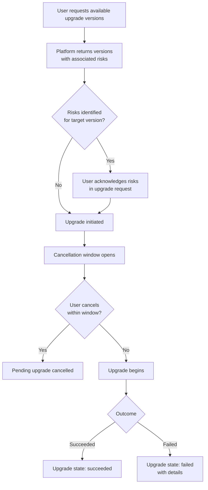

# Cluster Upgrade — CaaS

| Field      | Value                                                                      |
|------------|----------------------------------------------------------------------------|
| Author(s)  | Vitaliy Emporopulo                                                         |
| Jira       | [OSAC-1415](https://redhat.atlassian.net/browse/OSAC-1415)                 |
| Date       | 2026-07-27                                                                 |

## Problem Statement

OSAC CaaS manages the full cluster lifecycle — creation, scaling, and deletion — but provides no managed path for upgrading a cluster's OpenShift version. Clusters are provisioned via Hosted Control Planes (HCP), where the control plane and worker node pools are independent upgrade targets with distinct ownership and ordering constraints; today neither target has first-class support in the OSAC API. Tenants who need a newer version must interact directly with HCP infrastructure, bypassing OSAC entirely: upgrades leave no record in OSAC and are invisible to its monitoring. As clusters age, the gap compounds: EOL versions lose Red Hat support coverage and security patches, but OSAC has no mechanism to surface upgrade readiness, track version transitions, or apply platform-wide patches.

## In Scope

**Services:** CaaS — OpenShift clusters provisioned by OSAC via Hosted Control Planes.

**Tenant upgrade capabilities:**
- Each cluster has an update channel assigned at cluster creation time, which scopes the cluster's available update graph and the set of versions eligible for upgrade
- Tenant Users and Tenant Admins can view available upgrade versions for a cluster's control plane and node pools
  - Versions are sourced from the cluster's available update graph — only directly reachable versions are surfaced
  - Versions are filtered by the cluster's update channel
  - A version is only available for upgrade if an enabled ClusterVersion (OSAC-1269) exists for it
- Available node pool versions are additionally capped at the current control plane version; a node pool cannot be upgraded past the version of its control plane
- Tenant Users and Tenant Admins can initiate a control plane y-stream upgrade to any directly reachable version, one hop at a time
- Tenant Users and Tenant Admins can initiate a node pool upgrade (y-stream or z-stream), one hop at a time
- When the platform identifies risks for a target version, those risks are presented to the user before the upgrade can be initiated; the user must explicitly acknowledge the risks to proceed
- After initiating an upgrade, a cancellation window of a few minutes allows the user to cancel before the upgrade begins; once the window closes, the upgrade cannot be stopped
- Only one active upgrade per cluster component (control plane or node pool) is permitted at a time; control plane and node pool upgrades are independent and may proceed concurrently

**Upgrade tracking and visibility:**
- Each active upgrade has a visible lifecycle state — pending (within the cancellation window), running, succeeded, or failed — along with a human-readable description, the source and target versions, and timestamps for initiation and last state change
- Upgrade status and progress are visible per cluster component (control plane and each named node pool)
- Control plane and node pool upgrades are independent; when component versions diverge (e.g., after a partial upgrade or node pool upgrade failure), the cluster surfaces a condition indicating the mismatch and exposes the current version of each component — control plane and each node pool — so tenants can assess the state; the supported next action is to initiate a new node pool upgrade to retry independently
- Past upgrade transitions and their outcomes are visible per cluster component as upgrade history; history is tied to the cluster's lifetime and is removed when the cluster is deleted
- Tenant Users and Tenant Admins receive a warning condition on a node pool when it approaches the N-2 minor version skew limit relative to the control plane, so they can initiate a node pool upgrade before the node pool falls out of the supported range

**Platform-managed z-stream upgrades:**
- The Cloud Provider Admin selects the fleet-wide z-stream target version for the control plane's current minor version and applies it across all clusters via progressive rollout; available z-stream versions are sourced from the cluster's available update graph, the same mechanism used for tenant-visible upgrade versions
- Z-stream upgrades are triggered on-demand by the Cloud Provider Admin; the regular cadence targets critical CVE remediation within FedRAMP-aligned timelines (High CVEs: 30 days, Medium: 90 days)
- If a z-stream rollout causes a significant regression, the Cloud Provider Admin can pause the rollout to prevent further clusters from being upgraded; clusters that have already been upgraded cannot be automatically rolled back (HCP does not support control plane version downgrade) — remediation for already-affected clusters requires manual intervention, such as opening a support case with Red Hat
- Tenants cannot select or initiate z-stream control plane upgrades; these are applied by the Cloud Provider Admin
- If the fleet-wide z-stream target version is not reachable from a cluster's available update graph, the cluster is flagged as an error in the rollout status and no upgrade is initiated for that cluster
- Tenant Users and Tenant Admins are notified via resource status conditions when the platform applies a z-stream upgrade to their cluster
- The Cloud Provider Admin can force a control plane y-stream upgrade for a specific cluster at end-of-life; each forced upgrade is a single one-hop operation — the target version must be directly reachable from the cluster's available update graph; if reaching the desired target requires multiple hops, the Cloud Provider Admin is responsible for planning and executing the intermediate upgrades sequentially; node pools remain at their current version during the forced upgrade and continue to serve workloads — if the current node pool version is approaching the N-2 minor version skew limit relative to the forced target, a warning condition surfaces on the node pool; if the forced upgrade fails, the cluster enters a limited-support state (SLA no longer applies, but support remains available); a status condition on the cluster signals the limited-support state to tenants

**User-facing API surfaces:**

| Surface | Change |
|---------|--------|
| Fulfillment API | Upgrade initiation and cancellation per cluster component (control plane and node pool). Available upgrade versions query per cluster component. Upgrade status, progress, and history per cluster component. Org-wide upgrade visibility for Tenant Admins. Fleet-wide z-stream target management, rollout triggering and pausing, and per-cluster rollout status for Cloud Provider Admins. |
| CLI | Upgrade lifecycle commands: list available versions, initiate upgrade, cancel pending upgrade, view upgrade status, view upgrade history. Cloud Provider Admin: set fleet-wide z-stream target, trigger and monitor rollout, pause rollout, force EOL upgrade on a specific cluster. |
| UI | Upgrade lifecycle actions and history in the cluster detail view. Available versions and risk display before upgrade initiation. Cloud Provider Admin: fleet-wide z-stream target selection, rollout triggering, pause, and cross-cluster upgrade status monitoring. |

**E2E testing:** E2E coverage for upgrade initiation, status tracking, upgrade history, and pending upgrade cancellation in osac-test-infra.

**Documentation:** User guides for upgrade initiation and monitoring (Tenant User), z-stream upgrade visibility (Tenant Admin), and fleet-wide z-stream management (Cloud Provider Admin).

**Interfaces:** Fulfillment API, CLI, and UI console.

## Out of Scope

- SNO and traditional (non-HCP) control plane node upgrades
- Fully automatic z-stream control plane upgrades triggered by version availability; unlike ROSA's auto-upgrade mechanism, z-stream upgrades in this version are on-demand operations initiated explicitly by the Cloud Provider Admin
- Automated upgrade rollback — HCP does not support control plane version downgrade; neither tenants nor Cloud Provider Admins can roll back a completed upgrade through OSAC; remediation for a regressed upgrade requires manual intervention (e.g., a Red Hat support case)
- Maintenance windows and upgrade exclusion windows; scheduled upgrades and maintenance windows are both future work
- One-off scheduled upgrades; upgrades are initiated on-demand and begin after the cancellation window expires
- Tenant admin version allowlist; version availability is determined by the cluster's available update graph
- Push notification infrastructure (email, webhook, or external alerting)
- Installation and configuration of the OpenShift Update Service Operator for disconnected environments
- Drift detection; out-of-band version changes are not tracked as a distinct event type
- Upgrade history retention after cluster deletion; history does not outlive the cluster
- Standalone audit trail; full operational auditing is a separate capability
- Custom release image upgrades; users can only select from versions surfaced by the cluster's available update graph
- Upgrade policies per cluster tier; configuring different upgrade rules for dev, staging, and production clusters is deferred
- Cancelling an in-progress upgrade; once the cancellation window closes, the upgrade cannot be stopped
- Channel switching for installed clusters (e.g., moving from Stable to Fast or EUS); the cluster's update channel is set at creation time and inherited by the upgrade feature — switching channels on an existing cluster is a separate capability

## User Stories

The following diagram shows the tenant-initiated upgrade flow. It applies equally to control plane y-stream upgrades and node pool upgrades.

```mermaid
flowchart TD
    A[User requests available upgrade versions] --> B[Platform returns versions\nwith associated risks]
    B --> C{Risks identified\nfor target version?}
    C -- Yes --> D[User acknowledges risks\nin upgrade request]
    C -- No --> E[Upgrade initiated]
    D --> E
    E --> F[Cancellation window opens]
    F --> G{User cancels\nwithin window?}
    G -- Yes --> H[Pending upgrade cancelled]
    G -- No --> I[Upgrade begins]
    I --> J{Outcome}
    J -- Succeeded --> K[Upgrade state: succeeded]
    J -- Failed --> L[Upgrade state: failed\nwith details]
```

### Tenant User

- As a Tenant User, I want to view the available upgrade versions for my cluster's control plane and node pools, including any known risks per version, so that I can make an informed upgrade decision.
- As a Tenant User, I want to initiate a control plane y-stream upgrade for my cluster, acknowledging any identified risks, so that I can keep my cluster's OpenShift version current.
- As a Tenant User, I want to initiate a node pool upgrade for my cluster — acknowledging any identified risks — so that my worker nodes run a supported OpenShift version.
- As a Tenant User, I want to cancel an upgrade I initiated before it starts, so that I can correct a mistake within the cancellation window.
- As a Tenant User, I want to monitor the status and progress of an in-progress upgrade through resource conditions, so that I can track when the upgrade completes or fails.
- As a Tenant User, I want to see a warning condition when a node pool is approaching the N-2 minor version skew limit relative to the control plane, so that I can initiate a node pool upgrade before it falls out of the supported range.
- As a Tenant User, I want to view the upgrade history for my cluster, so that I can see which version transitions have occurred and their outcomes.
- As a Tenant User, I want to be notified via a status condition when the platform applies a z-stream upgrade to my cluster, so that I am aware of platform-managed changes to my cluster's version.

### Tenant Admin

- As a Tenant Admin, I want to view the available upgrade versions for each cluster's control plane and node pools within my organization, so that I can plan and coordinate upgrades across my teams.
- As a Tenant Admin, I want to initiate a control plane y-stream upgrade for any cluster in my organization — acknowledging any identified risks — so that I can manage the OpenShift version lifecycle on behalf of my organization.
- As a Tenant Admin, I want to initiate a node pool upgrade for any cluster in my organization — acknowledging any identified risks — so that worker nodes remain within a supported version range.
- As a Tenant Admin, I want to cancel an upgrade I initiated before it starts, so that I can correct a mistake within the cancellation window.
- As a Tenant Admin, I want to view the upgrade history for any cluster in my organization, so that I can see which version transitions have occurred and their outcomes.
- As a Tenant Admin, I want to be notified via a status condition when the platform applies a z-stream upgrade to a cluster in my organization, so that I have visibility into platform-managed changes affecting my clusters.

### Cloud Provider Admin

- As a Cloud Provider Admin, I want to select and publish the fleet-wide z-stream target version for control plane upgrades, so that all managed clusters run a consistent, supported patch version without requiring tenant action.
- As a Cloud Provider Admin, I want to monitor control plane upgrade status across all clusters, so that I can detect stalled or failed upgrades and intervene.
- As a Cloud Provider Admin, I want to force a control plane y-stream upgrade for a specific cluster approaching end-of-life, so that the platform can maintain supportability independently of tenant scheduling.

### Cloud Infrastructure Admin

No active role in this feature; all platform-level upgrade operations are covered by the Cloud Provider Admin stories above.

## Dependencies

- **HCP (HostedCluster + NodePool)**: source of upgrade state, conditions, and history; the design will confirm the specific HyperShift API surface used.

## Risks

- **Version discovery availability**: if the update service is unreachable (e.g., network partition or local OpenShift Update Service failure in a disconnected environment), the platform cannot surface available upgrade versions or per-version risk data; the design will specify error behavior and retry semantics.
- **Upgrade duration variability**: cluster upgrades can take minutes to hours depending on cluster size, workload, and the number of node pools; the platform exposes upgrade progress via conditions but makes no completion time guarantee.

---

## Provenance

Authored: respond @ prd 0.6.3 - 68284c8, workspace main @ 43c34a8
Final: revise @ prd 0.6.3 - c045d41, workspace main @ d22bfa1

> Context changed between respond and revise.

<!-- ai-workflow-provenance:{"schema_version":1,"provenance_kind":"session","workflow":"prd","workflow_version":"0.6.3","ai_workflows":"c045d41","source_repo":"d22bfa1","source_repo_branch":"main","commits_behind_main":0,"commits_ahead_main":0,"main_ref":"main","phases":["respond","revise","revise","revise"],"authoring_modes":["skill"],"context_changed":true} -->
