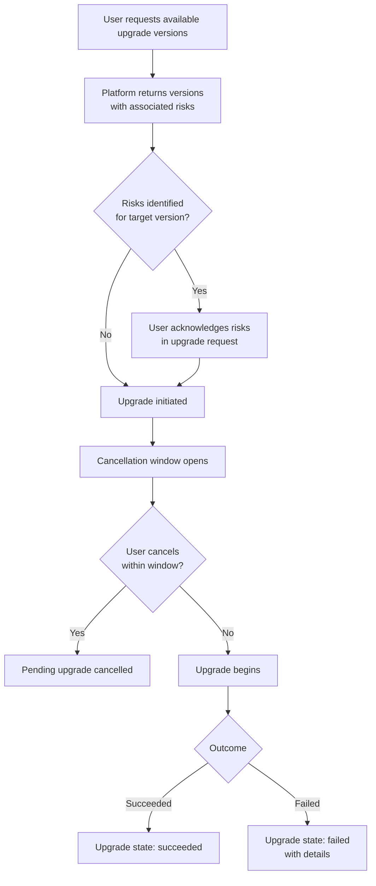

# Cluster Upgrade — CaaS

| Field      | Value                                                                      |
|------------|----------------------------------------------------------------------------|
| Author(s)  | Vitaliy Emporopulo                                                         |
| Jira       | [OSAC-1415](https://redhat.atlassian.net/browse/OSAC-1415)                 |
| Date       | 2026-07-27                                                                 |

## Problem Statement

OSAC CaaS manages the full cluster lifecycle — creation, scaling, and deletion — but provides no managed path for upgrading a cluster's OpenShift version. Clusters are provisioned via Hosted Control Planes (HCP), where the control plane and worker node pools are independent upgrade targets with distinct ownership and ordering constraints; today neither target has first-class support in the OSAC API. Tenants who need a newer version must interact directly with HCP infrastructure, bypassing OSAC entirely. As clusters age, the gap compounds: end-of-life (EOL) versions lose Red Hat support coverage and security patches, but OSAC has no mechanism to surface upgrade readiness, track version transitions, or apply platform-wide patches.

## User Stories

The following diagram shows the tenant-initiated upgrade flow. It applies equally to control plane y-stream upgrades and node pool upgrades.

```mermaid
flowchart TD
    A[User requests available upgrade versions] --> B[Platform returns versions\nwith associated risks]
    B --> C{Risks identified\nfor target version?}
    C -- Yes --> D[User acknowledges risks\nin upgrade request]
    C -- No --> E[Upgrade initiated]
    D --> E
    E --> F[Cancellation window opens]
    F --> G{User cancels\nwithin window?}
    G -- Yes --> H[Pending upgrade cancelled]
    G -- No --> I[Upgrade begins]
    I --> J{Outcome}
    J -- Succeeded --> K[Upgrade state: succeeded]
    J -- Failed --> L[Upgrade state: failed\nwith details]
```

### Tenant User

- As a Tenant User, I want to view the available upgrade versions for my cluster's control plane and node pools, including any known risks per version, so that I can make an informed upgrade decision.
- As a Tenant User, I want to initiate a control plane y-stream upgrade for my cluster, acknowledging any identified risks, so that I can keep my cluster's OpenShift version current.
- As a Tenant User, I want to initiate a node pool upgrade for my cluster — acknowledging any identified risks — so that my worker nodes run a supported OpenShift version.
- As a Tenant User, I want to monitor the status of an upgrade — its current state (pending, running, succeeded, or failed), the source and target versions, and when each state transition happened, so that I can take an appropriate action in a timely manner.
- As a Tenant User, I want to be warned when a node pool is approaching the N-2 minor version skew limit relative to the control plane, so that I can initiate a node pool upgrade before it falls out of the supported range.
- As a Tenant User, I want to be informed when my cluster's control plane and node pool versions have diverged and a node pool upgrade is needed, so that I can keep my cluster working and supported.
- As a Tenant User, I want to view the upgrade history for my cluster, so that I can see which version transitions have occurred and their outcomes.
- As a Tenant User, I want to know when the platform applies a z-stream upgrade to my cluster, so that I am aware of platform-managed changes to my cluster's version.

### Tenant Admin / Tenant User

- As a Tenant Admin or Tenant User, I want to cancel an upgrade I initiated before it starts, so that I can correct a mistake within the cancellation window.

### Tenant Admin

- As a Tenant Admin, I want to view the available upgrade versions for each cluster's control plane and node pools within my organization, so that I can plan and coordinate upgrades across my teams.
- As a Tenant Admin, I want to initiate a control plane y-stream upgrade for any cluster in my organization — acknowledging any identified risks — so that I can manage the OpenShift version lifecycle on behalf of my organization.
- As a Tenant Admin, I want to initiate a node pool upgrade for any cluster in my organization — acknowledging any identified risks — so that worker nodes remain within a supported version range.
- As a Tenant Admin, I want to monitor the status of an upgrade for any cluster in my organization — its current state (pending, running, succeeded, or failed), the source and target versions, and when each state transition happened.
- As a Tenant Admin, I want to be informed when a cluster in my organization has its control plane and node pool versions diverged and a node pool upgrade is needed.
- As a Tenant Admin, I want to view the upgrade history for any cluster in my organization, so that I can see which version transitions have occurred and their outcomes.
- As a Tenant Admin, I want to know when the platform applies a z-stream upgrade to a cluster in my organization, so that I have visibility into platform-managed changes affecting my clusters.

### Cloud Provider Admin

- As a Cloud Provider Admin, I want to select and publish the fleet-wide z-stream target version for control plane upgrades, so that all managed clusters run a consistent, supported patch version without requiring tenant action.
- As a Cloud Provider Admin, I want to pause a z-stream rollout that is causing regressions, so that I can stop further clusters from being upgraded while I assess the impact.
- As a Cloud Provider Admin, I want to monitor control plane upgrade status across all clusters, so that I can detect stalled or failed upgrades and intervene.
- As a Cloud Provider Admin, I want to force a control plane y-stream upgrade for a specific cluster approaching EOL, so that the platform can maintain supportability independently of tenant scheduling.

### Cloud Infrastructure Admin

No active role in this feature; all platform-level upgrade operations are covered by the Cloud Provider Admin stories above.

## Constraints

- Only CaaS-provisioned, HCP OpenShift clusters are covered: SNO and traditional (non-HCP) control plane node upgrades are not managed by OSAC
- Available versions are directly reachable (one hop) in the cluster's update graph, filtered by the cluster's update channel
- A reachable version is only available for upgrade if an enabled ClusterVersion (OSAC-1269) exists for it
- Node pool versions are additionally capped at the current control plane version
- Only one active upgrade per cluster component (control plane or node pool) is permitted; control plane and node pool upgrades are independent and may proceed concurrently
- A cancellation window of a few minutes exists after upgrade initiation
- In-progress upgrades cannot be cancelled
- Completed upgrades cannot be rolled back through OSAC
- Tenants cannot select or initiate z-stream control plane upgrades; these are applied by the Cloud Provider Admin via progressive rollout
- Z-stream upgrades are triggered on-demand; the regular cadence targets FedRAMP-aligned CVE remediation timelines (High CVEs: 30 days, Medium: 90 days)
- If the fleet-wide z-stream target version is not reachable from a cluster's available update graph, the cluster is flagged in the rollout status and no upgrade is initiated for that cluster
- During a forced EOL upgrade, node pools remain at their current version and continue to serve workloads
- If a forced EOL upgrade fails, the cluster enters a limited-support state (SLA no longer applies, but support remains available); the limited-support state is visible to tenants on the cluster

**User-facing API surfaces:**

| Surface | Change |
|---------|--------|
| Fulfillment API | Upgrade initiation and cancellation per cluster component (control plane and node pool). Available upgrade versions query per cluster component. Upgrade status, progress, and history per cluster component. Org-wide upgrade visibility for Tenant Admins. Fleet-wide z-stream target management, rollout triggering and pausing, and per-cluster rollout status for Cloud Provider Admins. |
| CLI | Upgrade lifecycle commands: list available versions, initiate upgrade, cancel pending upgrade, view upgrade status, view upgrade history. Cloud Provider Admin: set fleet-wide z-stream target, trigger and monitor rollout, pause rollout, force EOL upgrade on a specific cluster. |
| UI | Upgrade lifecycle actions and history in the cluster detail view. Available versions and risk display before upgrade initiation. Cloud Provider Admin: fleet-wide z-stream target selection, rollout triggering, pause, and cross-cluster upgrade status monitoring. |

**E2E testing:** E2E coverage for upgrade initiation, status tracking, upgrade history, and pending upgrade cancellation in osac-test-infra.

**Documentation:** User guides for upgrade initiation and monitoring (Tenant User), z-stream upgrade visibility (Tenant Admin), and fleet-wide z-stream management (Cloud Provider Admin).

**Interfaces:** Fulfillment API, CLI, and UI console.

---

## Provenance

Authored: respond @ prd 0.6.3 - 68284c8, workspace main @ 43c34a8
Final: revise @ prd 0.6.3 - 6ec8c11, workspace main @ d22bfa1

> Context changed between respond and revise.

<!-- ai-workflow-provenance:{"schema_version":1,"provenance_kind":"session","workflow":"prd","workflow_version":"0.6.3","ai_workflows":"6ec8c11","source_repo":"d22bfa1","source_repo_branch":"main","commits_behind_main":0,"commits_ahead_main":0,"main_ref":"main","phases":["respond","revise","revise","revise","revise","revise","revise","revise","revise","revise","revise"],"authoring_modes":["skill"],"context_changed":true} -->
