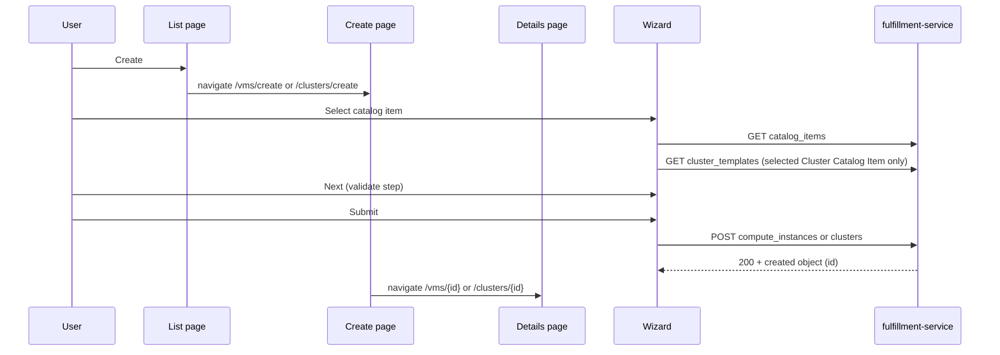

# Configuration Wizard for Cluster and VM Resources

## Summary

Rewrite the osac-ui catalog provision wizard with static fields per resource type, a fixed five-step flow (Catalog Item → General → Configuration → Networking → Review), and typed Catalog Item field policies as defined in [OSAC-3538](/enhancements/OSAC-3538-catalog-items-v2/design.md). Locked fields are read-only and omitted from the client request; untouched editable defaults are omitted for fulfillment to resolve. Use Formik/Yup validation with validate-all-on-Next, `OsacForm` layout, i18n for all user-visible strings, and dedicated create pages (`/vms/create`, `/clusters/create`) with list-page breadcrumbs. Each adapter supplies its own Configuration and Networking step components. See [PRD](prd.md) for field-level requirements and VM attachment behavior.

### Goals

- Rewrite `catalogProvision/` with Formik/Yup, PatternFly Wizard, `OsacForm`, i18n (`useTranslation`), shared Formik-connected field components, and per-adapter Configuration/Networking step components.
- Host the wizard on routed create pages; list **Create** navigates to `/vms/create` or `/clusters/create`.
- Implement the cluster adapter end-to-end (catalog, Template-derived `node_sets` table with size-only policies, create).
- Next always enabled; validate every field on the current step when Next is clicked, including fields that have not blurred.
- On successful create, navigate to the VM or cluster Details page using `id` from the POST response (`/vms/{id}`, `/clusters/{id}`).
- Component tests (Vitest + jsdom + Testing Library) cover step validation, Back navigation with preserved values, Cancel/discard guard, and submit error paths for both VM and cluster adapters (see [Test Plan](#test-plan)).

## Proposal

Rewrite under `osac-ui/apps/app-frontend/src/components/catalogProvision/`. `CatalogProvisionWizard` embeds in create pages and owns shared steps (Catalog Item, General, Review). **Configuration** and **Networking** are adapter components — VM pickers and cluster `node_sets`/CIDR fields are not shareable.

Static field paths are hardcoded per resource type (PRD §2.1.1). The wizard consumes typed Catalog Item `fields` policies from OSAC-3538; Catalog Item v2 does not use generic `field_definitions`, `display_name`, or `validation_schema`. For supported controls, locked values are shown read-only and omitted from the client request, editable `default_value` values prefill controls and are omitted if unchanged, and tenant-supplied values are sent. VM Catalog Items remain selectable regardless of `network_attachments` policy. For a locked attachment list, the wizard displays its Subnet read-only and omits `network_attachments` so fulfillment applies the locked value. The ClusterTemplate defines fixed `node_sets` map keys and `host_type` values; the Catalog Item may govern matching sizes only. Create payloads include only PRD §2.1.1 paths plus the Catalog Item reference; VM hardcodes `spec.image.source_type` = `registry`.

New hooks in `libs/ui-components/src/api/v1/`: instance types, virtual networks, subnets, cluster Catalog Items, ClusterTemplates, and create APIs. VM picker fields depend on fulfillment-service `spec.instance_type` and `spec.is_windows` (PRs #735, #734). Cluster Configuration loads the ClusterTemplate referenced by the selected Cluster Catalog Item and renders its `node_sets`; it does not load a free-standing HostType list.

### Workflow Description

Tenant user on `/vms` or `/clusters` clicks **Create** → navigates to the create route → wizard with breadcrumb (list label → **Create**). Cancel or breadcrumb back uses an unsaved-progress guard.



| Step | Owner | Content |
|------|-------|---------|
| Catalog Item | Shared | `adapter.useCatalogItems()` |
| General | Shared | Name (required), optional SSH key; cluster also collects required pull secret |
| Configuration | Adapter | VM: image, OS family, instance type, user data, boot disk, run strategy. Cluster: release image, Template-defined `node_sets` table (size only) |
| Networking | Adapter | VM: VN → Subnet picker (single `network_attachments` entry; associated ACL shown read-only). Cluster: pod/service CIDR |
| Review | Shared | `adapter.getReviewSections()` — same labels and values as wizard steps; submit via `buildCreatePayload` |

Register `/vms/create` and `/clusters/create` before `:id` routes. On failure: inline errors on the step; any non-2xx create response stays on Review; deprecated instance type warnings from create response are non-blocking and surfaced after submit.

**Typed Catalog Item policies:** The wizard reads the resource-specific `fields` policies from OSAC-3538. For a field with no policy, the normal input and Template/system defaults apply. A locked policy value is displayed read-only and omitted from the client create payload so fulfillment resolves it. An editable policy exposes the input and prefills `default_value` when present; an untouched default is omitted so fulfillment resolves it, while a tenant-supplied or changed value is sent. The wizard does not consume legacy `field_definitions`, `display_name`, or `validation_schema` properties. API-level typed validation and final resource validation remain authoritative.

**Wizard defaults** (when no applicable typed Catalog policy supplies a value):

| Field | Default |
|-------|---------|
| `spec.run_strategy` | `Always` |
| VM OS family (`spec.is_windows`) | Linux (`false`); wizard always sends an explicit value |
| Instance type picker | With no policy or an editable policy without a default, auto-select when `InstanceTypes.List` returns exactly one option |
| Networking pickers | When the picker is available, auto-select when a list returns exactly one option (VN → subnet) |

**VM Configuration specifics:** `spec.user_data` is optional and omitted from the payload when empty. Requiredness and blank-payload behavior for `spec.boot_disk.size_gib` remain unresolved in PRD §5 and must follow that decision. `spec.is_windows` (OS family) uses `RadioButtonField` (Linux / Windows); wizard always sends an explicit value. With no `fields.instance_type` policy, or an editable policy without a default, the instance type picker is active; an editable default preselects the referenced type. A locked `fields.instance_type` reference is read-only and omitted from the client create payload, so the wizard does not allow another selection or send the locked value. An untouched editable default is also omitted for fulfillment to resolve. The API receives `spec.instance_type` only (not `cores`/`memory_gib`). Instance type labels show `metadata.name`, cores, memory, and **DEPRECATED** when applicable; OBSOLETE types are excluded from the picker.

**VM General specifics:** `spec.ssh_key` is optional tenant input. It is sent as a parsed plain string when non-blank and omitted when blank; legacy generic Catalog overlays do not apply.

**VM Networking specifics:** Load the VN list first; on selection, filter subnets with `this.spec.virtual_network.name == "<vn-name>"`. The VM Catalog Item remains selectable regardless of its typed `network_attachments` policy. For a locked list, show the locked Subnet read-only on Networking and Review and omit `network_attachments` from the client create request so fulfillment applies the locked value under OSAC-3538. The Review shows that Subnet and, when present, its associated NetworkACL reference as read-only context from Subnet data. When policy is absent or editable without a default, show the normal Subnet picker and assemble one `network_attachments` element using a typed subnet reference: `{ "subnet": { "name": "<subnet-name>" } }`. V1 assumes no editable attachment default or field-specific validation is configured. No Catalog-specific validation schema is supported for this typed field; normal resource/API validation applies. If no ACL is associated, Review says unmatched traffic follows the deployment policy; it does not display a configured `PERMIT`/`DENY` value because the provider-only NetworkClass is not available through this flow's APIs. It does not fetch ACL rules or offer an ACL picker. The virtual network and optional NetworkACL association are determined through the Subnet; neither reference is repeated in the workload attachment.

**Cluster Configuration specifics:** The selected Cluster Catalog Item `template` identifies the ClusterTemplate. Load that Template using `ClusterTemplates.List` (`GET /api/fulfillment/v1/cluster_templates`) and render exactly one fixed row per `ClusterTemplate.spec.node_sets` key. Show each Template key and `host_type` read-only; do not provide host-type pickers or add/remove controls. Only `size` is configurable. A matching `fields.node_sets[templateNodeSetName]` policy governs that size: locked values are read-only and omitted from the request; editable defaults prefill the input and are omitted if unchanged; absent policies and editable policies without defaults follow normal Template defaulting. Tenant-supplied sizes are sent under the Template key with the Template `host_type` preserved. Validate supplied sizes as positive integers and reject a missing/empty Template node-set shape with a clear step-level error. Review shows the Template key, host type, and resolved size.

**Cluster General specifics:** `spec.ssh_public_key` is optional tenant input and follows the typed `fields.ssh_public_key` policy. Raw `spec.pull_secret` remains tenant-supplied and required; it is not prefilled from a Catalog policy.

**Cluster Networking specifics:** Cluster Catalog Item `fields.network.pod_cidr` and `fields.network.service_cidr` use the typed `StringFieldPolicy` fields defined by OSAC-3538 to govern resource `spec.network.pod_cidr` and `spec.network.service_cidr`. An absent policy follows normal resource behavior. A locked value is displayed read-only and omitted from the Create payload; an editable policy displays an active input and prefills `default_value` when present. An untouched Catalog default is omitted from the payload so fulfillment resolves the policy; tenant-supplied values are sent explicitly. When a policy is absent or editable without a default, the field's requiredness and blank-payload behavior remain unresolved in PRD §5 and must follow that decision. Yup validates CIDR format for supplied values, and final API/resource validation remains authoritative; these typed policies do not provide `validation_schema`.

**Step validation:** Next is always enabled. On click, run the step Yup schema, `setTouched` for all step fields, surface inline errors for untouched fields, and show an alert if invalid; do not advance until the step passes.

### API Extensions

No create payload extensions are required. The wizard consumes existing ComputeInstance and Cluster Catalog Item APIs, `InstanceTypes.List`, networking list APIs (`GET /api/fulfillment/v1/virtual_networks`, `.../subnets`), `ClusterTemplates.List` (`GET /api/fulfillment/v1/cluster_templates`), and resource create APIs. The selected Cluster Catalog Item's Template reference is used to load the authoritative node-set shape. No NetworkACL API calls are added; Review reads the associated NetworkACL reference through the selected Subnet and reports the deployment-policy fallback generically when none is associated. Typed Catalog policies are resolved server-side; the UI displays their locked/default values and omits locked or untouched-default fields as described above.

### Implementation Details/Notes/Constraints

**Routing and pages:** `VmCreatePage` / `ClusterCreatePage` host the wizard, breadcrumbs, and provision handler. List pages drop the embedded wizard and `wizardRef.open()`. The wizard drops portal (`createPortal`), imperative handle, and overlay CSS.

**Post-submit navigation:** On successful `POST`, read `id` from the response body. Navigate to `/vms/{id}` or `/clusters/{id}`. If `id` is missing, stay on Review with an error. Surface create warnings (e.g. deprecated instance type) via transient alert before navigation or on the Details page.

**Adapter interface:**

```typescript
interface CatalogProvisionAdapter<TItem, TValues, TPayload> {
  kind: CatalogProvisionKind;
  useCatalogItems: () => UseQueryResult<TItem[]>;
  getInitialValues: (catalogItem: TItem | null) => TValues;
  buildCreatePayload: (values: TValues, catalogItem: TItem) => TPayload;
  ConfigurationStep: ComponentType<{ catalogItem: TItem | null }>;
  NetworkingStep: ComponentType<{ catalogItem: TItem | null }>;
  generalFields: GeneralFieldDescriptor[];
  resolveGeneralFields?: (catalogItem: TItem | null) => GeneralFieldDescriptor[];
  getWizardSchema: (catalogItem: TItem | null) => AnyObjectSchema;
  getStepFieldPaths: (stepId: WizardStepId) => string[];
  getReviewSections: (values: TValues, catalogItem: TItem) => ReviewSection[];
  onCatalogItemSelected?: (item: TItem, helpers: FormikHelpers<TValues>) => void | Promise<void>;
}
```

**Module layout:**

```text
libs/ui-components/src/components/form/
  InputField, SelectField, RadioButtonField — shared Formik-connected controls (reusable outside wizard)
wizard/
  adapters/
    computeInstanceAdapter.ts, clusterAdapter.ts, types.ts
    computeInstance/  VmConfigurationStep, VmNetworkingStep, fields.ts, schemas.ts
    cluster/            ClusterConfigurationStep, ClusterNetworkingStep, fields.ts, schemas.ts
```

**Shared form field components:** Wizard steps render inputs through shared components under `libs/ui-components/src/components/form/` that bind to the parent `<Formik>` context — not local `useState` or manual `value`/`onChange` props. These live in `@osac/ui-components` so other forms can reuse them. At minimum:

| Component | PatternFly control | Formik binding |
|-----------|-------------------|----------------|
| `InputField` | `TextInput`, `TextArea` | `name` → `useField` (or `<Field>`); `value`, `onChange`, `onBlur` from Formik; `meta.error` / `meta.touched` for inline validation |
| `SelectField` | `FormSelect` | Same; `options` prop for `FormSelectOption` list |
| `RadioButtonField` | `Radio`, `RadioGroup` | Same; `options` prop for labeled choices (e.g. VM OS family: Linux / Windows → `spec.is_windows`) |

Each component wraps a PatternFly `FormGroup` (label, `fieldId`, `isRequired`, helper text for errors). Props include `name` (Formik path), `label` (already-translated string from the step), `isRequired`, `isDisabled` / `readOnly` (for a locked typed Catalog policy), and widget-specific options (e.g. `multiline`, `type="number"`, `isPassword` for pull secret; `options` with `value` / `label` for `SelectField` and `RadioButtonField`). Adapter and shared steps compose these components inside `OsacForm`; picker-backed fields may use `SelectField` or thin wrappers (e.g. `PickerSelectField`) that still source value and errors from Formik.

**`OsacForm` wrapper:** Every wizard step that renders editable fields wraps its field list in `OsacForm` from `@osac/ui-components` (`libs/ui-components/src/components/Form/OsacForm.tsx`) — not raw PatternFly `Form`. `OsacForm` provides responsive grid layout and blocks native submit; wizard navigation stays on PatternFly Wizard footer buttons. ESLint already requires `OsacForm` over direct `Form` imports in osac-ui.

**i18n:** All user-visible wizard copy uses i18next via `useTranslation` from `@osac/ui-components/hooks/useTranslation` (never import from `react-i18next` directly). Use hardcoded string keys in `t('...')` so `pnpm i18n` can extract keys into `libs/i18n/locales/en/translation.json` (committed with source changes; CI fails if out of sync). Apply to step titles, intros, static field labels, buttons, validation alert text, Template-defined node-set size controls, and Review section headings. Catalog Item v2 has no generic `display_name`; use localized static labels. Pure helpers (e.g. `getReviewSections`, static field descriptors) accept `t: TFunction` from the calling component rather than calling `useTranslation` internally.

Adapter steps use Formik context, own API hooks and loading UI, and export Yup fragments. Shared helpers: `buildWizardSchema` (compose adapter field schemas), `resolveTypedFieldPolicy` (apply typed locked/default/editable behavior), and `validateStepFields` (subset validation for the current step). Network and other typed policies follow OSAC-3538; normal Yup and API/resource validation remains in force. Paths use PRD `spec.*` notation; wire builders output camelCase OpenAPI shapes.

**Formik/Yup:** Single `<Formik>` in the orchestrator with one wizard-level Yup schema from adapter field schemas — not per-step schemas. A single schema lets future cross-step rules reference values from any step without re-plumbing. Validate-on-Next runs Yup against only the current step's field paths via `adapter.getStepFieldPaths(stepId)` while the full schema retains access to all `values`. Each step body: `OsacForm` → shared `InputField` / `SelectField` / `RadioButtonField` from `@osac/ui-components` bound to Formik state — no raw PatternFly `Form` and no duplicated error wiring. Typed Catalog policy state controls whether supported fields are editable, locked, or initialized with a Catalog default. Locked values and untouched defaults are omitted from the client payload for server-side resolution. Catalog Item v2 does not define `validation_schema`; typed API constraints and final API/resource validation apply. Validate-on-Next uses the same Formik `errors` / `touched` state those components display.

**Catalog item change:** Do not use `enableReinitialize` — it would reset user edits whenever `initialValues` changes. Instead, `onCatalogItemSelected` explicitly calls `resetForm({ values: getInitialValues(item) })` on intentional Catalog Item selection. For a Cluster item, load its referenced ClusterTemplate and derive the fixed node-set rows from the Template map keys and `host_type` values; apply matching `fields.node_sets` policies to each row's size. Keep the Template query keyed by the selected Catalog Item's Template reference so a response for an earlier selection cannot replace the active rows.

**Policy and node-set decisions:** `fields.instance_type` controls whether the VM picker is editable, prefilled, or read-only; locked and untouched default values are omitted for fulfillment to resolve. `network_attachments` remains Catalog-governable and does not filter Catalog Items; a locked list is read-only and omitted from the client payload. Cluster CIDR fields honor typed `StringFieldPolicy` states. Cluster `node_sets` are Template-defined; Catalog policy can control only size for an existing Template key. No wizard UI for `spec.additional_disks` — boot disk only. Requiredness and blank-payload behavior for PRD `?` fields — `spec.boot_disk.size_gib`, `spec.network.pod_cidr`, and `spec.network.service_cidr` — remain unresolved in PRD §5; this design does not mark them optional or specify omission when blank. `spec.ssh_key` / `spec.ssh_public_key` are optional tenant inputs, with no generic Catalog overlay.

**Removed:** `partitionFieldDefinitions`, generic `ConfigurationStep`/`CatalogFieldInput`, `canProceedWizardStep`, text-based networking rows, catalog-driven field discovery. Replaced by static field tables, `OsacForm`, and Formik-connected `InputField` / `SelectField` / `RadioButtonField` components.

Update `docs/specs/ui-flows/catalog-provision-wizard.yaml` for routed create pages and the five-step flow. Run `pnpm i18n` after adding or changing wizard strings.

### Security Considerations

No auth changes. Session-scoped REST via the generated OpenAPI client; tenant isolation is enforced server-side. Sensitive fields (pull secret) are masked on the General step; no localStorage persistence of draft values.

### Failure Handling and Recovery

| Failure | User sees |
|---------|-----------|
| Catalog / template / picker API error | Step or field error; refetch |
| Step validation | Inline errors on all invalid fields + alert; no advance |
| Create non-2xx | Error on Review |
| Create 2xx without `id` | Error on Review |
| Create 2xx with `id` | Navigate to Details page; show non-blocking warnings if present |
| Cancel / browser back with draft | Discard confirmation → list |

No server writes until create succeeds.

### Risks and Mitigations

| Risk | Mitigation |
|------|------------|
| Large rewrite vs incremental patch | Fixed PRD field set and step model make incremental patching brittle; adapters isolate VM/cluster divergence; component tests lock navigation, validation, and state-retention flows |
| PatternFly modal / picker behavior in jsdom | Shared `wizardFlow.helpers.ts`; test-setup mocks (`matchMedia`, `ResizeObserver`); manual smoke for visual regressions |
| fulfillment-service version skew (`instance_type`, `is_windows`) | Coordinate osac-installer image pins; document in Version Skew Strategy |
| Typed Catalog policy edge cases | PRD defines locked and editable behavior; test locked references and fields with/without `default_value` |
| Cluster Template has no node sets defined | Configuration shows a blocking error and does not allow tenant-composed replacement rows |

## Test Plan

### Unit tests (existing pattern)

Keep pure-logic coverage in colocated `*.test.ts` files under `libs/ui-components/src/components/catalogProvision/wizard/`:

- `validateStep.test.ts` — Yup subset validation, nested `errors` / `touched` mapping.
- `wizardBuild.test.ts` — step ordering, `buildCreatePayload` shape, typed Catalog policy omission and Template-derived node-set shape.
- Adapter `schemas.ts` / `payload.ts` — Yup fragments and payload omission rules for optional fields.

Run with `pnpm test` from `osac-ui/`; CI must pass.

### Component tests (new)

Vitest + jsdom + `@testing-library/react` + `@testing-library/user-event`. Config in `apps/app-frontend/vitest.config.ts`; run with `pnpm test` from `osac-ui/`.

Render the wizard (or a step) in a shared harness: `QueryClientProvider`, i18n provider, mock `ApiFetch`, and mocked list/create responses. Query by **role/label** (accessible names from field labels / i18n). Use `await userEvent.*` for interactions.

**Shared helpers** (`catalogProvision/test/`):

```text
fixtures.ts              — catalog items, templates, picker list responses
wizardFlow.helpers.ts    — fillGeneralStep, clickWizardNext/Back/Cancel, advanceTo*Step
renderWizard.tsx         — RTL render + providers
createMockApiFetch.ts    — protobuf-aware API fixtures
```

**File layout:**

```text
libs/ui-components/src/components/catalogProvision/
  test/                                    — shared fixtures + flow helpers
  CatalogProvisionWizard.test.tsx          — validation, navigation, cancel, submit
  wizard/adapters/computeInstance/
    VmConfigurationStep.test.tsx
    VmNetworkingStep.test.tsx
    schemas.test.ts
  wizard/adapters/cluster/
    ClusterConfigurationStep.test.tsx
    ClusterNetworkingStep.test.tsx
apps/app-frontend/src/pages/
  VmCreatePage.test.tsx
  ClusterCreatePage.test.tsx
```

#### Validation and step gating

| Scenario | Assert |
|----------|--------|
| Next on Catalog Item with no selection | Inline error + step alert; remain on Catalog Item |
| Next on General with empty required name (and cluster pull secret) | Errors on all required fields **without prior blur**; alert visible; no advance |
| Next on Configuration with missing required VM fields (`source_ref`, instance type, etc.) | Field-level errors; step does not change |
| Invalid CIDR format on cluster Networking (value present) | Format error on offending field; no advance |
| Typed Catalog policy with an invalid supplied value | API/resource validation remains authoritative; the wizard does not merge a generic Catalog schema |
| Valid step after errors | Fix values → Next advances; errors clear on corrected fields |
| Selected ClusterTemplate has no `node_sets` | Configuration shows a blocking error; the tenant cannot compose replacement rows |
| Template has multiple node-set keys | Each Template row and its own host type are displayed; tenants cannot edit the keys or host types |

#### Back navigation and form state

| Scenario | Assert |
|----------|--------|
| General → Configuration → Back | Name, SSH key, pull secret (cluster) unchanged in inputs |
| Configuration → Networking → Back | Release image, Template node-set keys/host types, and sizes preserved |
| Networking → Review → Back | Picker selections and CIDR values preserved |
| Review → Back through all steps | Every field still matches values entered earlier |
| Change catalog item after editing | `onCatalogItemSelected` resets to `getInitialValues`; prior edits discarded |
| Locked Catalog policy field | Locked value shown read-only, omitted from create payload, and preserved after Back |

#### Cancel, breadcrumb, and discard guard

| Scenario | Assert |
|----------|--------|
| Cancel with pristine wizard | Navigate to list (`/vms` or `/clusters`); no confirmation modal |
| Cancel after editing any field | Discard confirmation modal; **Stay** closes modal and keeps wizard + edits |
| Cancel → **Discard** | Navigate to list; no create API call |
| Breadcrumb list link with dirty form | Same confirmation as Cancel; confirm returns to list |
| Browser/history back with dirty form | Same guard (if wired on create page) |

#### Forward navigation and Review

| Scenario | Assert |
|----------|--------|
| Happy path VM | Select catalog item → fill required fields on each step → Review shows same labels/values as steps |
| Happy path cluster | Load the selected Catalog Item Template; Review lists its fixed node-set keys, Template host types, and tenant/catalog-resolved sizes |
| VM Catalog Item locks `instance_type` | Show the referenced type read-only with no active picker; omit `spec.instance_type` from the client request |
| VM Catalog Item gives editable `instance_type` default | Prefill the referenced type; omit an unchanged default, and send a tenant-changed selection |
| PRD-resolved optional fields left blank | Review shows the empty/omitted state defined for those fields; the client omits their keys as specified by the PRD |
| Unresolved boot-disk size or Cluster CIDR requiredness | Do not assert these fields are optional or omitted when blank; implement payload and validation coverage after the PRD decision |
| Optional General SSH field | Tenant value is sent as a plain string; blank field is omitted |
| VM Catalog attachment policy is locked | Catalog Item remains selectable; locked Subnet appears read-only on Networking and Review; client omits `network_attachments` so fulfillment applies the locked list; Review shows the Subnet's associated NetworkACL context when present |
| VM Catalog attachment policy is absent or editable without a default | Normal Subnet picker is available and its selected attachment is sent; API validates reference scope and the one-attachment limit |
| No-ACL Subnet Review, deployment action `PERMIT` | Review shows the generic deployment-policy fallback note; it does not claim to read or display the provider-only action value |
| No-ACL Subnet Review, deployment action `DENY` | Review shows the same generic deployment-policy fallback note; it does not claim to read or display the provider-only action value |
| Single-option picker lists | With no Catalog policy value, an instance type / VN / subnet is auto-selected when its list returns exactly one option; the Subnet's optional ACL is read-only context on Review, or generic deployment-policy fallback guidance is shown when none is associated |

#### Submit and API errors

| Scenario | Assert |
|----------|--------|
| Review Submit success (mock 2xx + `id`) | Create called once with `buildCreatePayload` shape; navigate to `/vms/{id}` or `/clusters/{id}` |
| Create non-2xx | Remain on Review; error message surfaced; form values unchanged |
| Create 2xx without `id` | Remain on Review; error surfaced |
| Catalog / Template / picker hook error | Step-level error state; refetch control or message (per adapter step test) |
| Deprecated instance type warning in create response | Non-blocking warning shown; navigation still proceeds when `id` present |

#### Adapter-specific component tests

- **VM Configuration:** OS family radio toggles `spec.is_windows`; obsolete instance types are excluded from active picker options. Cover absent, locked, and editable `fields.instance_type` policies; locked values are read-only and omitted, editable defaults prefill and are omitted if unchanged, and tenant-changed values are sent.
- **VM Networking:** Subnet lists filter after VN selection; changing VN clears dependent picks unless auto-select applies. Cover absent, locked, and editable-without-default `network_attachments` policies: Catalog Items remain selectable; a locked Subnet is read-only and the request omits `network_attachments`; absent/editable-without-default policies use the normal picker and send the selected Subnet. API/resource validation checks the reference and one-attachment limit. The selected Subnet determines the optional NetworkACL association; the wizard has no ACL picker and shows generic deployment-policy fallback guidance when no ACL is associated.
- **Cluster Configuration:** Load the selected ClusterTemplate; render one fixed row per Template `node_sets` key with read-only `host_type`. Verify no add/remove or host-type picker; matching `fields.node_sets` policies control only size. Locked sizes and untouched Catalog defaults are omitted from the payload, and tenant-entered sizes use Template map keys with the Template host type preserved.
- **Cluster Networking:** Cover absent, locked, editable-without-default, and editable-with-default `StringFieldPolicy` states for both CIDRs; locked values are read-only and omitted from the request, untouched defaults are prefilled but omitted, tenant changes are sent, and normal CIDR/API validation applies without Catalog `validation_schema`.

Component tests are required for merge; add cases when fixing wizard regressions.

### i18n and lint

- `pnpm lint` and `pnpm i18n` pass after wizard string changes.
- Component tests use the same i18n provider as the app so labels resolve consistently in queries.

### Manual smoke

End-to-end VM and cluster provisioning via `/vms/create` and `/clusters/create`; verify the cluster wizard loads node-set rows from the selected Template, keeps node-set names and host types fixed, and allows size edits only; submit with optional fields left blank; verify the Details page after successful create.

---

---

## Provenance

Authored: manual-edit [manual] @ design 0.11.3 - 2bd6607, workspace main @ 2293f9140 (3 behind origin/main)
Final: revise @ design 0.11.3 - 2bd6607, workspace main @ 1f3b63b82

> Context changed between manual-edit and revise.

> This document's phase history does not include an initial /draft — structure was not verified against the template from origin.

<!-- ai-workflow-provenance:{"schema_version":1,"provenance_kind":"session","workflow":"design","workflow_version":"0.11.3","ai_workflows":"2bd6607","source_repo":"1f3b63b82","source_repo_branch":"main","commits_behind_main":0,"commits_ahead_main":0,"main_ref":"main","phases":["manual-edit","revise","manual-edit","revise","manual-edit","revise","manual-edit","revise"],"authoring_modes":["manual","skill"],"context_changed":true,"origin_untracked":true} -->
