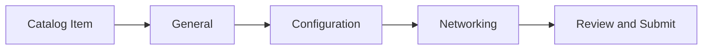

# Configuration Wizard for Cluster and VM Resources

## 1. Goals and Non-Goals

### 1.1 Goals

- Tenants provision VMs and clusters by selecting a catalog offering and completing a guided wizard with a **fixed field set per resource type** ([§2.1.1](#211-static-wizard-fields)).
- Both resource types use the same five steps: **Catalog Item → General → Configuration → Networking → Review** (submit from Review). **General** collects name and credentials; **Configuration** collects image/release, sizing, and platform parameters — not networking placement.
- Catalog Item behavior follows the typed resource-field policies in [OSAC-3538](/enhancements/OSAC-3538-catalog-items-v2/design.md), not legacy `field_definitions`. Locked values are read-only and omitted from the create request for server-side resolution; editable defaults prefill controls and an untouched default is omitted so fulfillment resolves the policy. VM Catalog Items remain selectable regardless of `network_attachments` policy.

### 1.2 Non-Goals

- **BareMetalInstance** provisioning (separate PRD)
- **Template parameters**
- **Multi-NIC** — out of scope; the wizard submits at most one `network_attachments` entry (one VN and one subnet), with no add/remove NIC rows. The plural field is retained for API compatibility.
- **Cluster template `node_sets` editing** — the wizard loads the selected Template's node sets and allows size configuration only; Template node-set keys and host types are fixed.
- **`spec.additional_disks`** — wizard scope undecided ([§5](#5-open-decisions)); default: boot disk only

## 2. Requirements

### 2.1 Field model

#### 2.1.1 Static wizard fields

Fields are hardcoded per resource type, not discovered from Catalog policies. **General** always shows the static paths below. Typed Catalog Item policies govern supported resource fields as described in [§2.1.2](#212-catalog-item-field-policies). **Required** column: **?** = resolved in [§5](#5-open-decisions) where noted.

**ComputeInstance**


| Step            | Path                      | Label                                    | Widget                                 | Required |
| --------------- | ------------------------- | ---------------------------------------- | -------------------------------------- | -------- |
| General         | `metadata.name`           | Name                                     | Text                                   | Required |
| General         | `spec.ssh_key`            | SSH public key                           | Text (multiline)                       | Optional |
| Configuration   | `spec.image.source_ref`   | VM image (OCI reference)                 | Text                                   | Required |
| Configuration   | `spec.is_windows`         | OS family                                | Radio (`Linux`, `Windows`)             | Required |
| Configuration   | `spec.instance_type`      | Instance type                            | Picker or read-only Catalog-locked value ([§2.1.5](#215-vm-instance-type-picker-api)) | Required |
| Configuration   | `spec.user_data`          | User data (cloud-init / Ignition)        | Text (multiline)                       | Optional |
| Configuration   | `spec.boot_disk.size_gib` | Boot disk size (GiB)                     | Number                                 | ?        |
| Configuration   | `spec.run_strategy`       | Run strategy                             | Select (`Always`, `Halted`)            | Required |
| Networking      | `spec.network_attachments` | Virtual network and subnet (an optional Subnet NetworkACL refines the deployment default ACL policy) | Subnet picker or read-only Catalog-locked Subnet ([§2.1.4](#214-vm-networking-picker-apis)) | Required |

**Notes:**

- **`spec.user_data`**: plain multiline string (cloud-init or Ignition); omit from payload when empty. Stored as Secret → KubeVirt `cloudInitNoCloud`.
- **`spec.image`**: wizard collects `source_ref` only; payload always sets `spec.image.source_type` to **`registry`**. Future: ComputeImage list picker ([OSAC-979](https://redhat.atlassian.net/browse/OSAC-979)).
- **`spec.is_windows`**: Configuration-step **OS family** radio — **Linux** → `is_windows: false`; **Windows** → `is_windows: true`. Maps to the optional boolean added in [fulfillment-service PR #734](https://github.com/osac-project/fulfillment-service/pull/734) ([OSAC-13](https://redhat.atlassian.net/browse/OSAC-13)); the reconciler maps this to CR `guestOSFamily` for AAP provisioning. Required on the wizard; default selection **Linux** ([§2.1.2](#212-catalog-item-field-policies)). The wizard always sends an explicit value.
- **`spec.instance_type`**: Configuration-step control follows `fields.instance_type` as defined in [OSAC-3538](/enhancements/OSAC-3538-catalog-items-v2/design.md). With no policy, or an editable policy without a default, the tenant selects a named compute bundle (cores + memory) from [§2.1.5](#215-vm-instance-type-picker-api). An editable `default_value` preselects the referenced type; an untouched default is omitted so fulfillment resolves it. A locked reference is displayed read-only and omitted from the request; the wizard must not permit another selection or send that locked value as tenant input. When a tenant supplies or changes an editable value, the request sends `spec.instance_type` only (instance type name); it does not send `spec.cores` or `spec.memory_gib` ([VM Instance Types EP](/enhancements/OSAC-46-vm-instance-types), [fulfillment-service PR #735](https://github.com/osac-project/fulfillment-service/pull/735) / OSAC-1217). The API validates the name and state; the reconciler resolves cores/memory on the CR.
- **Disks**: wizard collects `spec.boot_disk.size_gib` only unless [§5](#5-open-decisions) chooses `spec.additional_disks`.
- **`spec.ssh_key`**: optional on the General step. Include the parsed plain string when the tenant enters a value; omit it when blank.
- **Networking**: the VM Catalog Item remains selectable regardless of its typed `network_attachments` policy. For a locked policy, show the locked Subnet read-only on Networking and Review, show its associated NetworkACL as read-only context when present, and omit `spec.network_attachments` from the client create request so fulfillment applies the locked list under OSAC-3538. When the policy is absent or editable without a default, the normal Subnet picker assembles one attachment; its non-empty value is tenant input and normal resource/API validation applies. V1 assumes no editable default or field-specific validation is configured. The typed policy does not define a Catalog-specific validation schema. APIs: [§2.1.4](#214-vm-networking-picker-apis).
- The direct VM API also permits an omitted or empty attachment list and applies normal tenant-default resolution. In the wizard, an absent or editable-without-default Catalog policy uses one picker-selected entry; a locked policy is shown read-only and omitted from the request so fulfillment applies it. This UI behavior does not change the API's zero-or-one contract.

**Cluster**


| Step            | Path                        | Label                                                         | Widget                               | Required |
| --------------- | --------------------------- | ------------------------------------------------------------- | ------------------------------------ | -------- |
| General         | `metadata.name`             | Name                                                          | Text                                 | Required |
| General         | `spec.ssh_public_key`       | SSH public key                                                | Text (multiline)                     | Optional |
| General         | `spec.pull_secret`          | Pull secret                                                   | Text (multiline, masked)             | Required |
| Configuration   | `spec.release_image`        | OpenShift version (release image)                             | Text                                 | Required |
| Configuration   | `spec.node_sets`            | Worker node sets                                              | Template-defined table; size only | Required |
| Networking      | `spec.network.pod_cidr`     | Pod network CIDR                                              | Text                                 | ?        |
| Networking      | `spec.network.service_cidr` | Service network CIDR                                          | Text                                 | ?        |

**Notes:**

- **`spec.node_sets`**: the selected Cluster Catalog Item `template` identifies the ClusterTemplate. The wizard loads that Template and renders one fixed row per `ClusterTemplate.spec.node_sets` map key; rows cannot be added or removed. The map key and `host_type` come from the Template and are read-only. Only `size` is configurable, and any tenant-supplied size must be greater than zero. A matching `fields.node_sets[templateNodeSetName]` policy governs that row size: a locked size is read-only and omitted from the request; an editable default prefills the control and is omitted if unchanged; an editable policy without a default or an absent policy follows normal Template defaulting and accepts tenant input. The create request uses Template node-set names as map keys and preserves each Template-provided `host_type`; it sends tenant-supplied sizes only. At least one Template node set is required for this wizard flow.

**Create payload:** Only paths in [§2.1.1](#211-static-wizard-fields) plus catalog item reference; VM hardcodes `spec.image.source_type` = `registry`; VM sends `spec.instance_type` only when the tenant supplies or changes an editable value, and omits locked values and unchanged editable defaults. VM always sends `spec.is_windows` explicitly, not `spec.cores` or `spec.memory_gib`.

#### 2.1.2 Catalog Item field policies

The wizard consumes the typed `fields` policies defined in [OSAC-3538](/enhancements/OSAC-3538-catalog-items-v2/design.md). Catalog Item v2 does not use legacy generic `field_definitions` entries (`path`, `display_name`, `editable`, `default`, or `validation_schema`), and the wizard does not interpret those properties.

For each Catalog-governable resource field exposed by this wizard, no policy means normal tenant input and Template or system defaulting apply. A `locked` policy is displayed read-only and the field is omitted from the client create request so fulfillment applies the locked value. An `editable` policy exposes the normal input; its `default_value`, when present, prefills that input. An untouched Catalog default is omitted from the request so fulfillment resolves it using the OSAC-3538 policy precedence; a tenant-supplied or changed value is sent. Typed API validation and final resource validation remain authoritative.

For VM `spec.instance_type`, see [§2.1.1](#211-static-wizard-fields) and [§2.1.5](#215-vm-instance-type-picker-api). For Cluster `spec.node_sets`, the ClusterTemplate supplies the fixed map keys and host types while `fields.node_sets` may govern each matching size. For Cluster `spec.network.pod_cidr` and `spec.network.service_cidr`, `fields.network` policies use the same locked/editable behavior. For Compute `fields.network_attachments`, Catalog Items are not filtered by policy: a locked Subnet is read-only, `spec.network_attachments` is omitted so fulfillment applies the locked list, and Review shows the associated NetworkACL as context when present. With no policy or an editable policy without a default, the normal Subnet picker remains available. The API validates the Subnet reference and one-attachment limit.

**Wizard defaults:** Fields use normal Template or system defaults unless an applicable typed Catalog policy provides a `default_value` or a **special case** applies:


| Case                | Behavior                                                                                                                 |
| ------------------- | ------------------------------------------------------------------------------------------------------------------------ |
| `spec.run_strategy` | Pre-select `Always` when no Catalog policy governs the field                                                           |
| OS family (VM)      | Pre-select **Linux** (`is_windows: false`); not Catalog-governed by OSAC-3538                                            |
| Instance type (VM)  | When no policy or an editable policy without a default applies, **auto-select** when `InstanceTypes.List` returns exactly one option |
| Networking pickers  | When the picker is available, **auto-select** when a list returns exactly one option (VN → subnet) |

#### 2.1.3 Open required fields

Fields marked **?** in [§2.1.1](#211-static-wizard-fields) — resolve Required vs Optional before implementation ([§5](#5-open-decisions)).

### 2.1.4 VM networking picker APIs

The wizard loads picker options from the **public** fulfillment APIs (`osac.public.v1`). The UI uses the generated OpenAPI client (REST); gRPC equivalents are listed for reference.

| Picker | gRPC | REST | Purpose |
| ------ | ---- | ---- | ------- |
| Virtual network | `VirtualNetworks.List` | `GET /api/fulfillment/v1/virtual_networks` | Tenant-visible virtual networks |
| Subnet | `Subnets.List` | `GET /api/fulfillment/v1/subnets` | Subnets in the selected virtual network |


**List request parameters** (both APIs): optional query `filter` (CEL), `limit`, `offset`, `order`. Tenant scope is implicit from the authenticated session.

**Subnet filter** (after virtual network selection):

```text
this.spec.virtual_network.name == "<vn-name>"
```

**Picker display and values:**

| Picker | Option label | Selected value |
| ------ | ------------ | -------------- |
| Virtual network | `metadata.name` | VirtualNetwork `metadata.name` — drives the subnet list filter only |
| Subnet | `metadata.name` | Subnet `metadata.name` |

**Create payload assembly** — one `spec.network_attachments` element:

```json
{
  "subnet": { "name": "<subnet-name>" }
}
```

Per `ComputeNetworkAttachment` in `compute_instance_type.proto`. The wizard sends only a subnet reference in `network_attachments`; placement and the applicable NetworkACL are determined by the subnet. The NetworkACL reference is not repeated on the workload attachment.

**Load order:** virtual network list → on selection, load filtered subnets → auto-select when a list returns exactly one item ([§2.1.2](#212-catalog-item-field-policies)).

### 2.1.5 VM instance type picker API

The Configuration step loads instance type options from the **public** fulfillment API (`osac.public.v1`). The UI uses the generated OpenAPI client (REST); gRPC equivalent listed for reference.

| Picker | gRPC | REST | Purpose |
| ------ | ---- | ---- | ------- |
| Instance type | `InstanceTypes.List` | `GET /api/fulfillment/v1/instance_types` | Tenant-visible instance types (ACTIVE and DEPRECATED by default) |

**List request parameters:** optional query `filter` (CEL), `limit`, `offset`, `order`. Tenant scope is implicit from the authenticated session. The default list excludes **OBSOLETE** instance types (not selectable for new VMs).

**Picker display and values:**

| Picker | Option label | Selected value |
| ------ | ------------ | -------------- |
| Instance type | `metadata.name` plus `spec.cores` and `spec.memory_gib` (e.g. `standard-4-16 — 4 vCPU, 16 GiB`); indicate **DEPRECATED** state in the label when `spec.state` is DEPRECATED | Instance type name (`metadata.name` / `id`) → `spec.instance_type` on create |

**Create payload:** send only the instance type **name** string:

```json
{
  "instance_type": "standard-4-16"
}
```

Do **not** send `cores` or `memory_gib` — they are mutually exclusive with `instance_type` at the API ([PR #735](https://github.com/osac-project/fulfillment-service/pull/735)).

**Deprecation handling:** if the selected type is DEPRECATED, create may succeed with **warnings** in the response; the wizard surfaces those warnings after submit (non-blocking). OBSOLETE types are not offered in the picker.

**Load order:** load instance type options when entering Configuration. With no policy or an editable policy without a default, auto-select only when the list returns exactly one item; an editable Catalog default preselects its referenced type, and a locked policy shows a read-only value instead of a picker ([§2.1.2](#212-catalog-item-field-policies)).

### 2.1.6 Cluster Template and node-set configuration

The selected Cluster Catalog Item supplies a `template` reference. Before rendering Configuration, the wizard loads that ClusterTemplate using the public fulfillment API (`GET /api/fulfillment/v1/cluster_templates`) and selects the referenced Template. The UI uses the generated OpenAPI client (REST); gRPC equivalent listed for reference.

| Operation | gRPC | REST | Purpose |
| --------- | ---- | ---- | ------- |
| Cluster Templates | `ClusterTemplates.List` | `GET /api/fulfillment/v1/cluster_templates` | Resolve the selected Catalog Item's Template and render its node sets |

The Configuration table has exactly one row for each `ClusterTemplate.spec.node_sets` map key. The map key and `host_type` are read-only Template values; there are no add/remove actions and no host-type picker. The selected Catalog Item's `fields.node_sets` map may contain policies only for these Template node-set names, and each policy governs only the corresponding `size`. A locked size is read-only and omitted from the request. An editable `default_value` prefills the size input and is omitted if unchanged so fulfillment resolves it. An editable policy without a default or an absent policy follows normal Template defaulting; a tenant-entered or changed size is sent.

**Create payload** — map keys and host types are copied from the selected Template; only tenant-supplied size values are sent:

```json
{
  "node_sets": {
    "workers": {
      "host_type": "acme_1tb",
      "size": 3
    },
    "infra": {
      "host_type": "acme_1tb_h100",
      "size": 2
    }
  }
}
```

The API validates the map keys and host types against the selected Template. Template-defined rows cannot be composed or removed by the tenant.

### 2.2 Wizard behavior



- **Catalog Item:** Require catalog item selection.
- **Review:** Shows the same values the user sees on wizard step fields (General, Configuration, Networking) — blank, catalog- or wizard-defaulted, or user-entered — with the same labels as on each step. Submit from Review.
- **Step navigation:** Next is always enabled. On click, validate every field on the current step — including fields that have not yet blurred and therefore have no inline error shown. Surface any hidden errors inline; if validation fails, show an alert asking the user to fix the errors and do not advance.

## 3. Acceptance Criteria

- Wizard provisions VM or Cluster using only [§2.1.1](#211-static-wizard-fields) payload paths plus hardcoded VM `source_type` and catalog item reference.
- Five-step flow: Catalog Item → General → Configuration → Networking → Review; submit from Review.
- Review shows the same values as on wizard step fields (blank, default-driven, or user-entered).
- Catalog Item policies follow [§2.1.2](#212-catalog-item-field-policies): locked values are read-only and omitted from client payloads, untouched editable defaults are omitted for fulfillment resolution, and tenant values are sent. VM Catalog Items are not filtered by `network_attachments`; a locked Subnet is read-only and the attachment field is omitted. Normal API and resource validation apply.
- Cluster Networking: `spec.network.pod_cidr` and `spec.network.service_cidr` honor typed Catalog policy states: locked values are read-only and omitted from the request; editable defaults prefill the active input and are omitted unless changed by the tenant; absent/editable-without-default fields follow normal wizard behavior. Normal CIDR and final API/resource validation apply, with no Catalog `validation_schema`.
- VM: single `network_attachments` entry containing only the selected subnet, with policy from the optional subnet ACL association plus the deployment default action; send `spec.instance_type` only for a tenant-supplied or changed editable value, omitting locked values and unchanged editable defaults (never send `cores`/`memory_gib`); OS family radio always sends `spec.is_windows` (default **Linux**); optional `user_data` omitted when empty; create warnings for deprecated instance types are shown to the user.
- Cluster: the wizard loads the selected ClusterTemplate, renders one fixed row per Template `node_sets` key, and displays each Template `host_type` read-only. Tenants cannot add/remove rows or select host types. `fields.node_sets[templateNodeSetName]` governs only that row size; map keys and host types remain Template-defined.
- All **?** requiredness decisions resolved before release ([§5](#5-open-decisions)).
- On Next click, validate all fields on the current step (including untouched fields); surface hidden inline errors; show an alert if invalid; do not advance until the step is valid.

## 4. Dependencies

- `ComputeInstanceCatalogItem` and `ClusterCatalogItem` APIs; typed resource-field policies from OSAC-3538
- `ClusterTemplates.List` (resolve the selected Cluster Catalog Item Template and its `node_sets`)
- `VirtualNetworks.List` and `Subnets.List` (gRPC `osac.public.v1`) / REST `GET /api/fulfillment/v1/virtual_networks`, `.../subnets` ([§2.1.4](#214-vm-networking-picker-apis))
- `InstanceTypes.List` (gRPC `osac.public.v1`) / REST `GET /api/fulfillment/v1/instance_types` ([§2.1.5](#215-vm-instance-type-picker-api))
- ComputeInstance and Cluster create APIs
- `spec.instance_type` on ComputeInstance ([OSAC-1217](https://redhat.atlassian.net/browse/OSAC-1217), [fulfillment-service PR #735](https://github.com/osac-project/fulfillment-service/pull/735)) — required for VM instance type picker
- `spec.is_windows` on ComputeInstance ([OSAC-13](https://redhat.atlassian.net/browse/OSAC-13), [fulfillment-service PR #734](https://github.com/osac-project/fulfillment-service/pull/734)) — required for VM OS family in the wizard

## 5. Open decisions

Resolve before implementation.

### Required vs optional (`?`)

| Path | Resource |
| ---- | -------- |
| `spec.ssh_key` / `spec.ssh_public_key` | **Resolved:** Optional tenant input; omit when blank. Catalog field-policy behavior follows the typed resource fields in OSAC-3538. |
| `spec.boot_disk.size_gib` | ComputeInstance |
| `spec.network.pod_cidr`, `spec.network.service_cidr` | Cluster |

### Catalog policies on picker-backed fields

**Resolved for v1:** `network_attachments` remains Catalog-governable under OSAC-3538, and Catalog Items are not filtered by this policy. A locked attachment is displayed read-only and omitted from the create request so fulfillment applies the locked list; the Review shows the resolved Subnet and its associated NetworkACL context when present. When the policy is absent or editable without a default, the tenant uses the normal Subnet picker and normal resource/API validation applies. V1 assumes no editable attachment default or field-specific validation is configured. Cluster CIDR policies are handled as described in [§2.1.2](#212-catalog-item-field-policies).

**Resolved:** The `fields.instance_type` policy controls whether the VM instance-type picker is active, prefilled, or read-only. A locked reference is displayed read-only and omitted from the client payload; editable defaults are omitted if unchanged so fulfillment resolves them.

### Cluster `node_sets` composition

**Resolved:** The selected Catalog Item's ClusterTemplate defines the node-set rows. The wizard loads the Template, renders one fixed row per Template node-set map key, and displays the Template's `host_type` read-only. Tenants cannot add or remove rows or choose host types. `fields.node_sets[templateNodeSetName]` may govern only the matching row's size; locked sizes are omitted from the create payload, editable defaults are omitted when unchanged, and fields without an applicable Catalog default follow Template defaulting. Map keys and host types remain exactly as defined by the Template. See [§2.1.1](#211-static-wizard-fields) and [§2.1.6](#216-cluster-template-and-node-set-configuration).

### Additional disks

Not in [§2.1.1](#211-static-wizard-fields) today. **Unknown** whether v1 needs wizard UI for `spec.additional_disks[]` or boot disk + API/CLI is enough.

| Option | Outcome |
| ------ | ------- |
| **No (default)** | Out of scope ([§1.2](#12-non-goals)); boot disk only |
| **Yes** | Add repeatable `size_gib` rows on Configuration; add to §2.1.1 |

---

---

## Provenance

Authored: manual-edit [manual] @ prd 0.11.3 - 2bd6607, workspace main @ 2293f9140 (3 behind origin/main)
Final: revise @ prd 0.11.3 - 2bd6607, workspace main @ 1f3b63b82

> Context changed between manual-edit and revise.

> This document's phase history does not include an initial /draft — structure was not verified against the template from origin.

<!-- ai-workflow-provenance:{"schema_version":1,"provenance_kind":"session","workflow":"prd","workflow_version":"0.11.3","ai_workflows":"2bd6607","source_repo":"1f3b63b82","source_repo_branch":"main","commits_behind_main":0,"commits_ahead_main":0,"main_ref":"main","phases":["manual-edit","revise","manual-edit","revise","manual-edit","revise","manual-edit","revise"],"authoring_modes":["manual","skill"],"context_changed":true,"origin_untracked":true} -->
