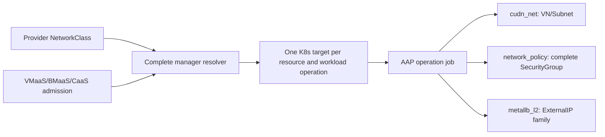

# K8s-only Networking Manager

| Field       | Value   |
|-------------|---------|
| Author(s)   | Dan Manor (dmanor@redhat.com) |
| Jira        | https://redhat.atlassian.net/browse/OSAC-1433 (manager split) |
| PRD         | [prd.md](prd.md) |
| Date        | 2026-09-16 |

## 1. Overview

This design defines the current K8s-only manager profile: one provider-selected
K8s manager, no Fabric Manager, connected deployment, one active hub, and IPv4
only. It is a direct implementation profile, not a fallback mode. The shared
resource model and all common validations remain in the [Unified Networking
design](../OSAC-1433-unified-networking/design.md), including its [deployment
support boundary](../OSAC-1433-unified-networking/design.md#deployment-support-boundary);
this document defines only the K8s-only manager's concrete registration,
dispatch, workload boundary, and implementation behavior.

The current profile uses `cudn_net` for VirtualNetwork and Subnet, an OSAC
SecurityGroup and NetworkACL adapter behind `network_policy`, `metallb_l2` for
the ExternalIP family, and the NATGateway entrypoint for the complete shared
contract. The profile is a complete implementation target for every canonical
networking resource and VMaaS, BMaaS, and CaaS. If an individual backend
operation is still being completed, its AAP role may execute as a successful
internal no-op; it is not removed from the API or represented as unsupported.

## 2. Goals and Non-Goals

### 2.1 Goals

- Define the provider registration and complete manager profile for K8s-only
  mode.
- Define the direct per-resource dispatch and AAP job translation.
- Define K8s-only readiness, failure, retry, deletion, default, and workload
  admission behavior.
- Keep service-specific attachment and workload contracts linked to their
  owning designs.

### 2.2 Non-Goals

- Duplicating shared resource schemas, field contracts, defaulting, reference
  rules, deletion guards, strict dependency-ready creation, or immutable
  operation rules.
- Designing Fabric Manager or combined-manager behavior.
- Designing `cudn_evpn`, east-west networking, multi-NIC, IPv6, or air-gapped
  networking for this profile. Shared NetworkACL and NATGateway contracts are
  inherited; their K8s backend mapping is included only to define dispatch.

## 3. Motivation / Background

The shared dispatcher already resolves a NetworkClass into one or two manager
targets. A K8s-only deployment needs a standalone profile so that the K8s
manager's actual tested surface is visible without making agents infer it from
the combined architecture. The profile must also prevent a missing Fabric
Manager from being treated as an implicit fallback target.

K8s-native primitives are not interchangeable with OSAC contracts. MetalLB can
provide the ExternalIP pool/allocation/attachment path, while the NATGateway
and policy entrypoints must implement the shared OSAC contracts. Native
Kubernetes NetworkPolicy is not, by itself, the OSAC stateful SecurityGroup or
stateless NetworkACL contract. Registration therefore identifies the complete
profile; it does not declare individual resources independently.

## 4. Design

### 4.1 Architecture

The provider configures one NetworkClass whose `k8s_manager` references the
installed K8s-only manager. The resolver validates the deployment boundary and
complete manager registration, then creates a one-target dispatch plan for
every networking resource and workload operation.



The diagram shows that K8s-only dispatch is direct: every resource and
workload operation goes to the K8s manager. Workload admission uses the same
complete manager profile and the shared service-specific placement rules.

### 4.2 Data Model / Schema Changes

No tenant resource schema changes are introduced. The shared resource schemas,
typed references, attachment messages, status values, defaulting rules, and
immutable network fields remain defined by Unified Networking.

The provider-owned manager registration uses the existing ConfigMap contract:

```yaml
apiVersion: v1
kind: ConfigMap
metadata:
  name: k8s-manager-only
  namespace: osac
  labels:
    osac.openshift.io/network-k8s-manager: "true"
data:
  name: k8s_only
  description: "K8s-only networking manager"
  capabilities: "addressFamily:ipv4"
```

The registration contains no resource, policy, workload-scope, or service
subset declaration. Selecting this manager selects the complete OSAC networking
contract and all three workload service integrations. The provider verifies
the complete profile before NetworkClass Ready. A temporary unfinished
operation may use a successful no-op AAP role.

### 4.3 API Changes

The provider uses the existing NetworkClass API and sets only
`spec.k8s_manager`; `spec.fabric_manager` is omitted. There is no tenant API
for selecting a manager or implementation strategy.

The profile resolves to this complete resource-entrypoint table:

| Resource | K8s implementation | Notes |
|---|---:|---|---|
| VirtualNetwork | `cudn_net` | Persists the logical VN; the K8s network object is materialized when a Ready Subnet is created. |
| Subnet | `cudn_net` | Creates the tenant Namespace and a Layer2 `ClusterUserDefinedNetwork` after a Ready VN. |
| SecurityGroup | `network_policy` adapter | Creates the K8s policy objects required by the OSAC SecurityGroup contract; native NetworkPolicy alone is insufficient. |
| NetworkACL | `network_policy` ACL adapter | Creates the stateless policy representation required by the OSAC NetworkACL contract. |
| ExternalIPPool | `metallb_l2` | Creates a MetalLB `IPAddressPool` and `L2Advertisement` in `metallb-system`. |
| ExternalIP | `metallb_l2` | Creates a parking `LoadBalancer` Service and reports its allocated IPv4 address. |
| ExternalIPAttachment | `metallb_l2` plus service-specific adapters | Creates the target-specific external access binding for VMaaS, BMaaS, or CaaS. |
| NATGateway | `nat_gateway` | Creates the OSAC SNAT behavior; during development its AAP role may be a successful no-op. |

For every canonical resource, create and delete use the operation-specific
shared AAP template and the K8s manager role. Read/list returns persisted OSAC
state and does not launch a job. A resource becomes Ready only after its K8s
target reports success. The manager's status must not be set by a caller.

#### K8s backend object and readiness contract

The entrypoint names above are adapters, not capability shortcuts. Their
observable backend contract is:

- `cudn_net` treats VirtualNetwork as the logical parent. For each Subnet it
  creates a Namespace with `osac.openshift.io/subnet-id`,
  `osac.openshift.io/tenant`, `osac.openshift.io/virtual-network`, and
  `k8s.ovn.org/primary-user-defined-network` labels, plus a
  `k8s.ovn.org/v1` `ClusterUserDefinedNetwork` with Layer2 topology and the
  canonical IPv4 CIDR. Subnet Ready requires both objects to be accepted and
  observable; a successful logical VN write alone is not enough.
- The SecurityGroup adapter creates one policy object per SecurityGroup in the
  applicable Subnet namespaces, selected by the tenant/VirtualNetwork labels,
  and reports Ready only after the complete OSAC stateful, allow-only,
  typed-rule contract is installed. A native NetworkPolicy with narrower
  semantics is only an implementation primitive, not the OSAC contract.
- `metallb_l2` creates an `IPAddressPool` in `metallb-system` with the exact
  pool CIDR, `autoAssign: false`, and `avoidBuggyIPs: true`, plus an
  `L2Advertisement` referencing that pool; the pool is Ready only after both
  are accepted. An ExternalIP is represented by a non-serving parking
  `LoadBalancer` Service in `metallb-system` until MetalLB reports one
  allocated IPv4 address. An
  ExternalIPAttachment is Ready only after the allocated address is exposed by
  the workload-namespace `LoadBalancer` Service and the service selects the
  target workload. VMaaS, BMaaS, and CaaS use their service-specific target
  adapters under the shared attachment contract.
- The NetworkACL adapter creates stateless policy objects at the Subnet
  boundary. The NATGateway entrypoint creates the SNAT behavior. If either
  implementation is temporarily incomplete, its AAP role may complete as a
  successful no-op while retaining the normal resource lifecycle.

### 4.4 Scalability and Performance

K8s-only resources produce one manager target and one AAP job, so dispatch has
less target fan-out than a combined deployment. Complete-profile validation
reads one manager registration during NetworkClass admission and checks the
same registration before each resource create or workload admission. Existing
indexed persistence and status mechanisms handle readiness and deletion; this
split does not introduce a new data store or recursive graph traversal.

### 4.5 Security Considerations

NetworkClass and manager ConfigMaps are provider-owned. Tenant requests cannot
set manager names, implementation annotations, deployment-wide IPv4 values, or
status.
The server rejects a missing or incomplete provider registration before
NetworkClass readiness. Once the NetworkClass is Ready, every tenant resource
uses the registered manager target; an unfinished implementation is represented
by its normal AAP job, including a temporary successful no-op where needed.

The K8s adapter must enforce the complete OSAC stateful SecurityGroup and
stateless NetworkACL contracts, including readiness, deletion, and attachment
behavior. The shared tenant default ACL remains distinct from the hard-coded
deployment `permit` baseline.

### 4.6 Failure Handling and Recovery

| Failure | Result |
|---|---|
| Missing/disabled/wrong-type manager registration | NetworkClass is rejected with provider configuration error. |
| Zero or multiple active hubs, or air-gapped deployment | NetworkClass is rejected before resource provisioning. |
| Incomplete provider profile | NetworkClass remains a provider configuration error; no tenant API operation is admitted until the profile is complete. |
| K8s job Pending after admission | Resource remains Pending and reconciliation retries the same K8s target. |
| K8s job Failed | Resource remains Failed or non-Ready with the manager error; retry is idempotent and does not create a duplicate backend object. |
| Manager registration becomes incomplete before create | The API fails the provider configuration precondition; it does not create a partial target plan. |
| Manager unavailable during read | Read/list returns persisted OSAC state and status; it does not invent a target or launch a job. |
| Delete after NetworkClass is unavailable | Persisted K8s target metadata selects the delete job; no Fabric target is invented. |
| Tenant-managed dependency blocks delete | Shared `FailedPrecondition` reverse-reference details are returned; no cascade occurs. |

Only the shared allowlisted OSAC-owned automatic ExternalIP flow may admit a
Pending child. No K8s-only tenant resource or default NATGateway bypasses the
strict Ready-dependency rule.

### 4.7 RBAC / Tenancy

The provider owns manager registration, NetworkClass, and deployment defaults.
Tenants see only the shared tenant resources and their resolved status. Tenant
resource scope, typed local references, workload attachment authorization, and
cross-tenant protections are inherited from Unified Networking and the owning
VMaaS/CaaS/BMaaS designs.

### 4.8 Extensibility / Future-Proofing

Improving a K8s implementation for NetworkACL or NATGateway requires complete
contract implementation and tests. It does not change tenant resource schemas
or introduce a manager-selection field. The manager registration remains a
complete profile; unfinished operations use the internal AAP no-op convention
until their implementation is ready.

## 5. Interface Changes

## IC-1: Provider K8s-only manager registration

**Requirements:** FR-1, FR-2, FR-3, FR-4

The provider installs the `k8s_only` manager ConfigMap and references it from a
K8s-only NetworkClass. The ConfigMap exposes IPv4 and the complete manager
profile described in §4.2; it has no resource, scope, or service capability
map.

## IC-2: K8s-only resource dispatch

**Requirements:** FR-5, NFR-1, NFR-2

Every resource create/delete operation resolves to one K8s target and one
operation-specific AAP job. The persisted routing metadata uses the generic
`osac.openshift.io/implementation-strategy` annotation with the K8s manager
name; the K8s-specific annotation is absent because there is no second target.

## IC-3: K8s-only workload admission

**Requirements:** FR-6, FR-7

VMaaS, BMaaS, and CaaS admission consume the complete K8s-only manager
profile and their service-specific shared validations. All three workload
services dispatch through the K8s target; a temporarily unfinished operation
may complete through the successful no-op AAP convention.

## IC-4: Complete-profile defaults and operation behavior

**Requirements:** FR-8, FR-9, NFR-3, NFR-4

Default networking and direct resource/CR paths use the same complete-profile,
readiness, immutability, and no-partial-persistence rules. NetworkACL and
NATGateway requests dispatch normally; an unfinished backend may use a
successful no-op AAP role.

## 6. Alternatives Considered

### Combined manager as the only deployment shape

This would avoid a separate K8s-only profile, but it would require a Fabric
Manager even when no physical fabric is present and would hide the direct K8s
implementation boundary. It is rejected because K8s-only is an explicitly
supported deployment topology.

### Per-resource subset declarations

This alternative is rejected. A manager registration is a complete profile;
partial resource, policy, scope, or service declarations would allow the API
to admit a resource that the selected service later cannot execute.

### Use native Kubernetes NetworkPolicy as both policy resources

This would not implement stateless NetworkACL semantics or the complete OSAC
stateful SecurityGroup contract. It is rejected; each policy adapter requires
a complete OSAC implementation.

## 7. Observability and Monitoring

Existing NetworkClass status, per-target job status, resource conditions,
manager errors, and reconciliation metrics apply. The manager registration and
dispatch logs must include the resource kind, selected K8s manager, operation,
and complete-profile validation result without exposing tenant data.

## 8. Impact and Compatibility

This proposal does not change tenant resource schemas. It relocates the
K8s-only profile from the shared document into a dedicated manager proposal and
adds links from shared and service documents. The existing generic routing
annotation remains unchanged. All canonical resources and workload services
remain part of the provider profile, including operations that temporarily use
an internal no-op AAP role.

## 9. Test Plan

The executable test plan is maintained in [testplan.md](testplan.md). It covers
unit validation of the provider registration and complete-profile resolver,
integration validation of persistence, dispatch, backend objects, readiness,
retry, and failure behavior, and end-to-end validation of the supported VM
dataplane and the rejected resource/workload paths. The plan explicitly runs
the shared Unified Networking cases for common fields, formats, defaults,
typed references, policy semantics, strict dependency readiness,
create/read/delete-only behavior, and deletion guards.

## 10. Gaps

None. Common fields, formats, default precedence, typed references, policy
semantics, dependency/deletion guards, and shared CLI coverage are inherited
from and linked to the Unified Networking test plan. K8s-only-specific gaps
would block complete-profile registration or profile graduation.

## 11. Summary

The companion plan contains 13 test cases: 9 critical and 4 high priority.
All are automated where the required K8s/OpenShift environment is available;
4 are fully automated unit/integration cases and 9 are automated where the
environment permits because they require real or contract-compatible K8s,
MetalLB, CUDN, or dataplane behavior.
