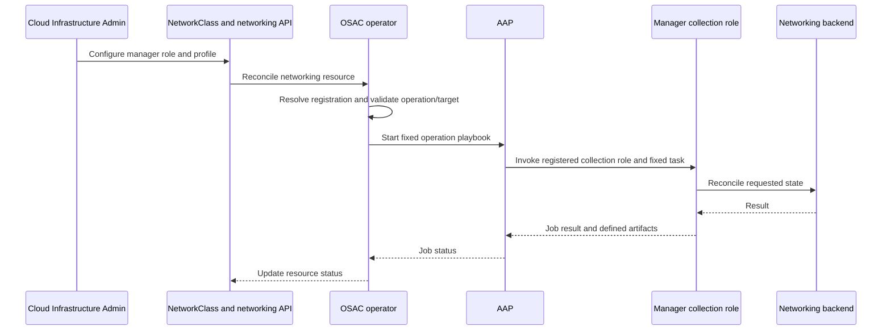

# OSAC Network Manager Integration Contract

| Field       | Value |
|-------------|-------|
| Author(s)   | Dan Manor (dmanor@redhat.com) |
| Jira        | https://redhat.atlassian.net/browse/OSAC-1433 |
| PRD         | [Network Manager Integration Contract PRD](prd.md) |
| Date        | 2026-10-04 |

# 1. Overview

This design defines the integration contract for Fabric Manager and K8s Manager implementations used by OSAC networking. The contract is independent of implementation source: OSAC-distributed implementations such as Netris and Agentless VLAN, and implementations built or maintained by other parties, use the same registration, operation, Ansible Automation Platform (AAP), and status boundaries. See the [Network Manager Integration Contract PRD](prd.md) for product requirements and the [Unified Networking Design](/enhancements/OSAC-1433-unified-networking/design.md) for how OSAC selects and orchestrates the roles.

A conforming implementation registers one manager role, advertises the operation and workload-target combinations it supports, and provides the corresponding AAP collection role entry points. Once OSAC implements and enforces this versioned contract, another implementation can be added through configuration and AAP content without supplier-specific changes to OSAC APIs or dispatch code. The contract's operation vocabulary is fixed; adding a new OSAC resource operation requires an OSAC change.

# 2. Goals and Non-Goals

## 2.1 Goals

- Define the Fabric Manager and K8s Manager boundaries and the shared registration format.
- Define the operation identifiers, AAP role entry points, inputs, outputs, and lifecycle behavior an implementation must provide.
- Let implementations advertise the exact operations and workload targets they support, with unsupported work rejected before an AAP job starts.
- Permit implementations from any source to integrate through the same stable interface.

## 2.2 Non-Goals

- Change tenant-facing networking resources or their semantics; those are defined by the unified networking PRD and design.
- Specify backend-specific mappings to Netris, Cumulus, OVN-Kubernetes, or another networking product.
- Allow an implementation to add new OSAC resource kinds, operation identifiers, dispatch rules, or tenant API fields.

# 3. Motivation / Background

OSAC discovers Fabric and K8s managers from ConfigMaps and dispatches provisioning to AAP. AAP selects a collection role using the implementation strategy associated with the resource. The current registration parser reads the manager name, description, and broad capabilities, but does not declare a contract version or the operation and target combinations an implementation supports. The move-network-attachment and DHCP-lease playbooks also default a missing implementation strategy to Netris; contract v1 removes that product-specific default and requires the selected implementation to be explicit. The detailed manager obligations currently sit inside the unified networking design alongside OSAC's own profile-selection and dispatch flow. [Codebase: osac-operator/pkg/networkmanager/types.go; osac-operator/pkg/dispatcher/dispatch.go; osac-aap/playbook_osac_create_virtual_network.yml]

That arrangement makes it hard to tell which requirements belong to OSAC and which belong to each manager implementation. It also lets a manager's advertised capabilities differ from the operations OSAC may dispatch to. This document is the normative implementation contract. The unified networking design will describe OSAC's integration flow and link here for the exact manager obligations. [User]

# 4. Design

## 4.1 Architecture

The provider configures a Fabric Manager and, optionally, a K8s Manager in a NetworkClass. The operator resolves each configured manager by its registered name and role. OSAC's fixed dispatch table selects the role for each resource operation; the manager registration is checked against that operation and, where applicable, the workload target. OSAC passes the validated manager registration to AAP, including its implementationRef; a playbook must not default to a particular implementation when that reference is missing. AAP invokes the corresponding task in the referenced collection. The manager reconciles its backend, and OSAC records job and resource status.



The diagram shows the stable integration boundary: NetworkClass chooses a registered role, OSAC validates and dispatches a fixed operation, and the implementation owns only its backend reconciliation. Managers do not implement an in-process Go interface; the shared AAP provider and the collection role entry points form the integration surface. [Codebase: osac-operator/pkg/dispatcher/dispatch.go; osac-aap/playbook_osac_create_virtual_network.yml]

The two roles have distinct responsibilities:

- A Fabric Manager realizes physical-fabric operations such as routed network isolation, L2 segments, IPAM, ACLs, inbound translation, outbound NAT, and fabric workload-port movement.
- A K8s Manager realizes Kubernetes-native VM networking and, in a fabric-backed profile, the K8s side of a Subnet or overlay-to-fabric bridge. In a K8s-only profile it may serve the operations that the fixed dispatcher permits without a Fabric Manager.

OSAC assigns an operation to a role using the profile and fixed dispatch table. An implementation's advertisement validates that assignment; it does not cause OSAC to choose a different role. If the assigned implementation does not advertise an operation or its target, OSAC fails the request before starting AAP. It does not silently fall back to another manager.

## 4.2 Data Model / Schema Changes

Each implementation installs a ConfigMap in the OSAC operator namespace. Its role label determines whether it is a Fabric Manager or K8s Manager. The ConfigMap name follows the existing chart convention: osac-network-fabric-manager-<name> or osac-network-k8s-manager-<name>, with underscores in the name normalized to hyphens. The data.name value is the logical identifier selected by NetworkClass. implementationRef independently identifies the fully qualified collection role invoked by AAP.

Version 1 requires name, implementationRef, contractVersion, capabilities, and supportedOperations. Description is optional. Name must be unique within its manager role and is the logical identifier selected by NetworkClass. implementationRef is a fully qualified Ansible collection role name with the form namespace.collection.role; it is independent of data.name and may refer to any collection installed in the AAP execution environment. contractVersion must be v1. Contract v1 recognizes the fixed OSAC capability values ipv4, ipv6, dualStack, and dpuSupport. The supported networking profile requires ipv4 and does not support IPv6 or dual-stack. capabilities does not declare resource operations.

supportedOperations is a YAML sequence serialized as a ConfigMap string. Each entry names one operation identifier. Target-scoped operations must declare the exact workload targets the implementation supports. An implementation must implement every operation and target pair it advertises. It may omit unsupported pairs; OSAC rejects a request that requires an omitted pair.

```yaml
apiVersion: v1
kind: ConfigMap
metadata:
  name: osac-network-fabric-manager-example
  namespace: osac
  labels:
    osac.openshift.io/network-fabric-manager: "true"
data:
  name: example
  implementationRef: acme.networking.fabric_manager
  description: "Example fabric integration"
  contractVersion: "v1"
  capabilities: "ipv4"
  supportedOperations: |
    - id: virtual_network.create
    - id: virtual_network.delete
    - id: subnet.create
    - id: subnet.delete
    - id: external_ip_attachment.create
      targets:
        - cluster
    - id: external_ip_attachment.delete
      targets:
        - cluster
```

The recognized labels are osac.openshift.io/network-fabric-manager and osac.openshift.io/network-k8s-manager. The target vocabulary is compute_instance, cluster, and baremetal_instance. Targets appear on the operation declaration only for target-scoped operations. Unknown labels, versions, capabilities, operation identifiers, target names, malformed implementationRef values, duplicate operation entries, empty required fields, and duplicate names within one role make a registration invalid. supportedOperations must contain at least one entry. The operator must report the ConfigMap and invalid field in its diagnostic.

The existing operator parser and Helm template do not yet read or render implementationRef, contractVersion, or supportedOperations. Implementing those fields and validation is part of the OSAC contract-enforcement work; the ConfigMap above describes the target interface, not a claim about current runtime support. [Codebase: osac-operator/pkg/networkmanager/types.go; osac-operator/charts/operator/templates/network-managers.yaml]

## 4.3 API Changes

No tenant-facing gRPC, REST, CRD, or resource-schema changes are required. The implementation-facing changes are the registration fields above, a common AAP job payload, fixed task entry points, and the operation result contract below.

List, Get, and other API reads are served by OSAC and are not dispatched to a manager. The operation identifiers below cover backend provisioning only.

Every AAP invocation receives the same osac_job_vars envelope:

```yaml
osac_job_vars:
  operation: external_ip_attachment.create
  manager:
    name: example
    role: fabric
    implementationRef: acme.networking.fabric_manager
    contractVersion: v1
  resource:
    apiVersion: osac.openshift.io/v1alpha1
    kind: ExternalIPAttachment
    metadata: {}
    spec: {}
```

operation is the canonical operation identifier from the table. manager is resolved from the selected role's validated registration. resource is the full Kubernetes resource object, including metadata and spec. The generic AAP playbook invokes manager.implementationRef and uses the fixed tasks_from name in the table. The referenced collection must be installed in the AAP execution environment. Manager credentials are supplied through provider-managed AAP credentials or Secrets; credentials must not be placed in the registration ConfigMap or resource payload. AAP playbooks must not substitute a default implementation.
Ansible supports dynamically included roles by variable and the `tasks_from` selector; implementationRef uses a fully qualified collection role name. See [Ansible Core include_role documentation](https://docs.ansible.com/projects/ansible-core/2.17/collections/ansible/builtin/include_role_module.html) and [using collection roles by FQCN](https://docs.ansible.com/projects/ansible/latest/collections_guide/collections_using_playbooks.html). [Research: §1]

| Operation identifier | Assigned role | AAP playbook and collection task | Required input | Required behavior and result |
|----------------------|---------------|----------------------------------|---------------|------------------------------|
| virtual_network.create / virtual_network.delete | Fabric; K8s fallback only in a K8s-only profile | playbook_osac_create_virtual_network / create_virtual_network; playbook_osac_delete_virtual_network / delete_virtual_network | VirtualNetwork metadata.uid; spec.region, spec.ipv4Cidr, spec.networkClass | Create or remove the isolated routing domain and associated allocation. A K8s fallback may create a logical grouping. Different VirtualNetworks remain isolated. |
| subnet.create / subnet.delete | Fabric and configured K8s role; K8s-only profile uses K8s fallback | playbook_osac_create_subnet / create_subnet; playbook_osac_delete_subnet / delete_subnet | Subnet metadata.uid; spec.virtualNetwork parent reference; spec.ipv4Cidr | Create or remove the L2 segment and the K8s network resources assigned to that role. The Subnet CIDR belongs to its VirtualNetwork and does not overlap a sibling Subnet. |
| security_group.apply / security_group.delete | Fabric; K8s fallback only in a K8s-only profile | playbook_osac_create_security_group / create_security_group; playbook_osac_delete_security_group / delete_security_group | SecurityGroup metadata.uid; spec.virtualNetwork; spec.ingressRules and spec.egressRules | Apply the complete requested rule set, including removing obsolete rules on update; remove all rules owned by the SecurityGroup on delete. |
| external_ip_pool.create / external_ip_pool.delete | Fabric; K8s fallback only in a K8s-only profile | playbook_osac_create_external_ip_pool / create_external_ip_pool; playbook_osac_delete_external_ip_pool / delete_external_ip_pool | ExternalIPPool metadata.uid; spec.cidrs contains exactly one canonical IPv4 CIDR; spec.ipFamily is IPv4 | Register or remove the backend allocation pool. OSAC owns API capacity counters. |
| external_ip.allocate / external_ip.release | Fabric; K8s fallback only in a K8s-only profile | playbook_osac_create_external_ip / create_external_ip; playbook_osac_delete_external_ip / delete_external_ip | ExternalIP metadata.uid; spec.pool | Allocate or release one address from the selected pool. On allocation, write the durable address to osac.openshift.io/allocated-address. |
| external_ip_attachment.create / external_ip_attachment.delete | Fabric; K8s fallback only in a K8s-only profile | playbook_osac_attach_external_ip / attach_external_ip; playbook_osac_detach_external_ip / detach_external_ip | ExternalIPAttachment metadata.uid; spec.externalIP; target resource reference; spec.targetEndpoint for Cluster API or Ingress endpoints | Create or remove inbound translation for an advertised target. Remove the attachment before its ExternalIP is released. |
| nat_gateway.create / nat_gateway.delete | Fabric only; no K8s fallback | playbook_osac_create_nat_gateway / create_nat_gateway; playbook_osac_delete_nat_gateway / delete_nat_gateway | NATGateway metadata.uid; spec.virtualNetwork; spec.externalIP | Create or remove outbound SNAT for the VirtualNetwork using its ExternalIP. |
| workload_attachment.move | Fabric only | playbook_osac_move_network_attachment / move_network_attachment | Workload resource kind and metadata.uid; spec.networkAttachments entries with subnetRef and interface; metadata.deletionTimestamp | Move a physical workload port from its provisioning network to the selected tenant Subnet when deletionTimestamp is absent; restore the provisioning network when it is present. Both directions are retry-safe. |
| dhcp_lease.query | The selected Fabric or K8s role when OSAC requests lease discovery | playbook_osac_query_dhcp_lease / query_dhcp_lease | Workload resource kind and metadata.uid; spec.networkAttachments entries with subnetRef and interface | Resolve the lease for each requested attachment. Return the leases AAP artifact defined below. The supported workload kinds are declared per operation. |

The table is the complete operation vocabulary for contract v1. Fulfillment-service enforces the shared creation-readiness and deletion-dependency gates before an operation is persisted or dispatched; operator controllers retain their existing dependency checks before backend deletion. Managers receive only operations whose API references satisfy those gates. The manager owns cleanup of its backend objects, not deletion of OSAC API resources. For a Fabric-backed profile, the Fabric Manager receives the physical-fabric operations and a configured K8s Manager also receives the K8s Subnet operation. In a K8s-only profile, the fixed dispatcher may route VirtualNetwork, Subnet, SecurityGroup, ExternalIPPool, ExternalIP, and ExternalIPAttachment operations to the K8s Manager. It never routes NATGateway or physical port movement to a K8s Manager. A K8s Manager's presence does not cause automatic fallback when a configured Fabric Manager lacks an operation.

For workload operations, the operation declaration includes the target set. external_ip_attachment.create, external_ip_attachment.delete, workload_attachment.move, and dhcp_lease.query are target-scoped. The target must match the target resource passed by OSAC. An implementation must not claim a target merely because it can handle another operation for the same target type.

AAP task behavior and results are part of the interface:

- The manager task treats the supplied resource spec as desired state. The create/apply task for a SecurityGroup runs for both initial creation and rule updates.
- For workload_attachment.move, an absent deletionTimestamp means attach to the tenant Subnet; a present deletionTimestamp means detach and restore the provisioning network. The role must handle the case where the Subnet is already gone during detach.
- On ExternalIP allocation, the implementation records the allocated address in the osac.openshift.io/allocated-address annotation only after the backend reservation is durable. Reconciliation of the same resource UID returns the same address; release removes the reservation.
- dhcp_lease.query returns an AAP job artifact named leases. Each entry contains subnet_ref, interface, ip_address, and mac_address. The result must identify the lease for the requested attachment; a missing or ambiguous match fails the job with a diagnostic.
- For operations without a defined artifact, successful AAP task completion means the backend has converged to the requested state. The operator owns resource phase, conditions, and provisioning job history.

An implementation conforms to v1 when its registration passes validation, every advertised operation-target pair has the required task entry point, each task meets the behavior in the table, and retries and failures follow §4.6. A deployment can combine implementations from different sources; each selected role is validated independently. The implementation author's release checklist is: install the collection in the AAP execution environment; deploy the role-labeled ConfigMap with the exact operation-target pairs; ensure data.name matches the NetworkClass selection and implementationRef resolves to the intended collection role; implement every advertised task and required result; verify retries, deletion, tenant scoping, and diagnostics; and configure a profile that routes only supported pairs.

## 4.4 Scalability and Performance

Registration data is small and read during manager discovery or configuration reconciliation. Operation validation is an in-memory lookup before AAP job creation. The contract adds no per-resource database tables or persistent operation state; backend state remains owned by each manager. Existing AAP job volume and retention limits are unchanged.

## 4.5 Security Considerations

The operator namespace and existing Kubernetes RBAC protect manager registration ConfigMaps. Registration data contains no credentials. AAP credentials or provider-managed Secrets supply backend access, and AAP must not expose secret values in job artifacts or logs. Networking API authorization remains in the fulfillment service. Where an implementation creates Kubernetes child resources, it preserves the applicable tenant and owner-reference metadata and acts only on resources it is authorized to manage. [Codebase: AGENTS.md]

## 4.6 Failure Handling and Recovery

- Missing or invalid registration: OSAC reports the affected manager/profile as not ready with a diagnostic naming the manager role, ConfigMap, and invalid field. It does not start AAP.
- Unsupported operation or target: OSAC records a failed condition naming the selected manager, operation identifier, and target, and does not start AAP or choose another manager.
- Missing AAP collection or task entry point: the AAP job fails with the role/task name; OSAC retains the resource failure and retries according to its existing reconciliation backoff after the deployment is corrected.
- Backend API error or timeout: the manager task fails with the backend diagnostic. The manager leaves retryable state safe to reconcile; OSAC records the AAP job and retries.
- Invalid operation output: a missing ExternalIP allocation annotation or malformed leases artifact is treated as a failed job. OSAC does not report allocation or lease discovery as successful.
- Repeated create/apply: the manager converges to the resource's desired spec without duplicate backend objects or stale SecurityGroup rules. Repeated delete of an absent backend object succeeds.

## 4.7 RBAC / Tenancy

No tenant-facing RBAC changes are required. Networking API authorization remains in the fulfillment service. Registration ConfigMaps and AAP credentials are provider-scoped. A manager receives the same tenant-scoped resource context OSAC already authorizes; it must not read or mutate other tenants' resources.

## 4.8 Extensibility / Future-Proofing

A new implementation is added by installing its AAP collection, deploying a valid role-specific registration, and selecting its name in NetworkClass. No supplier-specific OSAC API or dispatch code is needed after OSAC supports contract v1. A new resource kind, operation identifier, target type, or incompatible task payload requires an OSAC contract-version change and corresponding dispatcher support; implementations cannot extend those vocabularies independently.

# 5. Interface Changes

## IC-1: Versioned manager registration

**Requirements:** FR-1, FR-2, FR-3

Manager ConfigMaps gain implementationRef, contractVersion, and supportedOperations, including the operation-specific target set. The operator validates the role label, manager identity, version, capability, operation, and target vocabulary before dispatch.

## IC-2: AAP collection operation entry points

**Requirements:** FR-1, FR-2, FR-3

A Fabric or K8s implementation provides a collection role resolved by implementationRef and the operation behavior listed in §4.3. Each advertised operation-target pair has one defined tasks_from entry point and receives the shared osac_job_vars envelope.

## IC-3: Fail-closed operation and target validation

**Requirements:** FR-3, FR-4

OSAC validates each selected operation-target pair against the registered manager before starting AAP. Unsupported pairs produce a resource condition naming the manager, operation, and target; dispatch does not switch to another manager.

## IC-4: ExternalIP allocation and DHCP lease results

**Requirements:** FR-2

ExternalIP allocation uses the allocated-address annotation and lease lookup returns the leases AAP artifact with the schema defined in §4.3. OSAC treats missing or malformed results as job failures.

# 6. Alternatives Considered

### Keep the detailed contract in the Unified Networking design

This keeps all networking design material in one file. It also couples OSAC's role-selection flow with the implementation obligations and makes implementation designs depend on a long section in a document whose primary purpose is the shared API architecture. A separate normative document provides one link for implementation authors; the unified design remains the place that explains orchestration.

### Derive every role from the manager name in the OSAC collection

This is how the current playbooks address osac.templates.netris and other built-in roles. It is simple for roles shipped in the OSAC collection, but an independently maintained implementation would have to extend or replace that collection. The contract instead lets the provider register an explicit fully qualified role reference while keeping the task names and job payload fixed.

### Require manager implementations to register a Go interface

An in-process interface can express typed inputs and outputs. It would require backend-specific code to run inside or alongside the operator, while current provisioning is delegated to AAP and Ansible collection roles. The AAP contract reuses the established provisioning boundary and keeps external API credentials outside the operator.

### Allow each implementation to define new operation identifiers

Dynamic identifiers could make implementations independent of OSAC releases. The dispatcher, API resource model, operation status, and AAP playbooks must understand each operation, so an unknown operation cannot be safely executed by OSAC. Contract v1 therefore fixes the operation and target vocabulary while allowing implementations to support different subsets.

### Fall back to another manager when the selected manager omits an operation

Fallback could make profiles appear more capable, but would dispatch tenant resources to an implementation the provider did not select for that role. OSAC instead fails clearly before AAP; K8s fallback is used only by the fixed dispatcher for K8s-only profiles.

# 7. Observability and Monitoring

No new metrics are required. Existing resource conditions, events, AAP job history, and reconciliation logs report registration, dispatch, task, and backend failures. Diagnostics include the selected manager name, role, operation identifier, and target when one applies.

# 8. Impact and Compatibility

This document defines the target manager contract. Current OSAC code parses only name, description, and capabilities; AAP playbooks derive the role from the manager name and some default to Netris. OSAC implementation work must add generic implementationRef parsing and chart rendering, pass the common manager/operation envelope, resolve arbitrary installed collection roles, validate operation/target support, report clear failures, and remove hardcoded Netris defaults before other implementations can rely on this contract.

Existing manager registrations and AAP collections must be updated to advertise their implementationRef, version, and supported operation-target pairs. Version 1 adds no tenant API or CRD fields. Once enforcement is implemented, an old registration without contractVersion and supportedOperations is invalid and must be updated with the manager rollout. Incompatible changes to operation inputs, outputs, or identifiers require a new contract version.

---

## Provenance

Authored: draft @ design 0.11.3 - 2bd6607, workspace main @ 1f3b63b82 (52 behind origin/main)

<!-- ai-workflow-provenance:{"schema_version":1,"provenance_kind":"session","workflow":"design","workflow_version":"0.11.3","ai_workflows":"2bd6607","source_repo":"1f3b63b82","source_repo_branch":"main","commits_behind_main":52,"commits_ahead_main":0,"main_ref":"main","phases":["draft"],"authoring_modes":["skill"],"context_changed":false,"origin_untracked":false} -->
