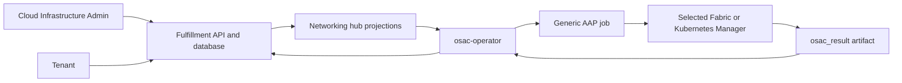

# Unified Networking API for VMaaS, CaaS, and BMaaS

| Field | Value |
|-------|-------|
| Jira | https://redhat.atlassian.net/browse/OSAC-1433 |
| Target release | OSAC 0.2 |
| PRD | [Unified Networking PRD](prd.md) |

## Contents

- [1. Summary](#1-summary)
- [2. Motivation: Goals and Non-Goals](#2-motivation-goals-and-non-goals)
  - [Goals](#21-goals)
  - [Non-Goals](#22-non-goals)
- [3. Background and Rationale](#3-background-and-rationale)
- [4. Proposal](#4-proposal)
  - [4.1 Resource Model](#41-resource-model)
    - [Provider Profile and Manager Roles](#provider-profile-and-manager-roles)
      - [Resource API Meaning](#resource-api-meaning)
  - [4.2 Data Model and Schema Changes](#42-data-model-and-schema-changes)
    - [API Extensions](#api-extensions)
      - [NetworkClass](#networkclass)
        - [East-West Capability Declaration](#east-west-capability-declaration)
      - [NetworkDataModel, NetworkData, and NetworkManager APIs](#networkdatamodel-networkdata-and-networkmanager-apis)
      - [ExternalIPPool](#externalippool)
      - [VirtualNetwork](#virtualnetwork)
      - [Subnet](#subnet)
      - [SecurityGroup](#securitygroup)
      - [ExternalIP](#externalip)
      - [Network Attachment Types](#network-attachment-types)
      - [Resource Status: Discovered IPs](#resource-status-discovered-ips)
      - [ExternalIPAttachment: Inbound Traffic (DNAT)](#externalipattachment-inbound-traffic-dnat)
      - [NATGateway: Outbound Traffic (SNAT)](#natgateway-outbound-traffic-snat)
    - [ExternalIPPool](#externalippool-1)
  - [4.3 Architecture and Manager Integration](#43-architecture-and-manager-integration)
    - [Manager Dispatch and Integration Contract](#manager-dispatch-and-integration-contract)
  - [4.4 API Changes](#44-api-changes)
    - [API operation constraint](#api-operation-constraint)
    - [Resource Hierarchy](#resource-hierarchy)
    - [Creation Readiness Gates](#creation-readiness-gates)
    - [Deletion Dependency Guards](#deletion-dependency-guards)
    - [NetworkClass Examples](#networkclass-examples)
    - [UX Alignment](#ux-alignment)
    - [Workflow Description: End-to-End Flows](#workflow-description-end-to-end-flows)
      - [Cluster ExternalIPAttachment flow](#cluster-externalipattachment-flow)
    - [Auto-provisioning lifecycle](#auto-provisioning-lifecycle)
  - [4.5 Scalability and Performance](#45-scalability-and-performance)
  - [4.6 Security Considerations](#46-security-considerations)
  - [4.7 Failure Handling and Recovery](#47-failure-handling-and-recovery)
    - [Risks and Mitigations](#risks-and-mitigations)
    - [Provider Networking Control](#provider-networking-control)
  - [4.8 RBAC and Tenancy](#48-rbac-and-tenancy)
  - [4.9 Extensibility and Future-Proofing](#49-extensibility-and-future-proofing)
- [5. Interface Changes](#5-interface-changes)
  - [IC-1: Shared networking resource API](#ic-1-shared-networking-resource-api)
  - [IC-2: Workload network attachments](#ic-2-workload-network-attachments)
  - [IC-3: External access](#ic-3-external-access)
  - [IC-4: Provider manager registration and settings](#ic-4-provider-manager-registration-and-settings)
  - [IC-5: Provider networking control](#ic-5-provider-networking-control)
  - [IC-6: Unified networking UI and documentation](#ic-6-unified-networking-ui-and-documentation)
  - [IC-7: SecurityGroup enforcement on workload attachments](#ic-7-securitygroup-enforcement-on-workload-attachments)
- [6. Alternatives Considered](#6-alternatives-considered)
  - [Drawbacks](#drawbacks)
- [7. Observability and Monitoring](#7-observability-and-monitoring)
- [8. Impact and Compatibility](#8-impact-and-compatibility)
  - [Current implementation alignment](#current-implementation-alignment)
  - [Upgrade and Downgrade Strategy](#upgrade-and-downgrade-strategy)
  - [Version Skew Strategy](#version-skew-strategy)
  - [Support Procedures](#support-procedures)
  - [Infrastructure Needed](#infrastructure-needed)
- [Test Plan](#test-plan)
  - [Unit and component tests (DEV)](#unit-and-component-tests-dev)
  - [Integration tests (DEV)](#integration-tests-dev)
  - [End-to-end release qualification (QE)](#end-to-end-release-qualification-qe)
- [Graduation Criteria](#graduation-criteria)
- [Support Boundaries](#support-boundaries)
  - [Deployment Support Boundary](#deployment-support-boundary)
  - [Networking Hub Support Boundary](#networking-hub-support-boundary)

## 1. Summary

This design defines one networking application programming interface (API) and resource model for virtual machines (VMs), managed Kubernetes clusters, and bare-metal servers, delivered through Virtual-Machine-as-a-Service (VMaaS), Cluster-as-a-Service (CaaS), and bare-metal-as-a-service (BMaaS). Provider-selected manager roles supply backend behavior without changing resource meanings across workload types; see the [PRD](prd.md) for user needs and requirements.

## 2. Motivation: Goals and Non-Goals

### 2.1 Goals

- Use the same tenant networking resource schemas across VM, cluster, and bare-metal workloads; keep workload-specific connection fields on each workload resource.
- Resolve provider implementations through the deployment's NetworkClass registrations so tenant requests contain no backend selector.
- Assign each manager role a fixed resource-action, task, and workload-target set, and require each assigned implementation to fulfill that complete contract.
- Limit this contract to Internet Protocol version 4 (IPv4) and one tenant network attachment per workload.

### 2.2 Non-Goals

- Internet Protocol version 6 (IPv6), dual-stack networking (IPv4 and IPv6 together), or multiple tenant network attachments per workload.
- Tenant-managed Domain Name System (DNS) zones, virtual private cloud (VPC) peering, load balancers, or Internet gateways.
- Advanced bare-metal interface configuration such as bonding or virtual local area network (VLAN) trunking.

## 3. Background and Rationale

OSAC previously exposed different networking workflows for virtual machines, managed Kubernetes clusters, and bare-metal servers. This design gives those workloads one resource model; the Resource Model section below defines each resource and provider role before the design describes their schemas and interactions. Per-service provisioning details remain in the VM, cluster, and bare-metal networking proposals linked in the metadata.

## 4. Proposal

### 4.1 Resource Model

This section defines the provider configuration, manager roles, and networking resources used throughout the design.

#### Provider Profile and Manager Roles

A **NetworkClass** is a provider-managed configuration container for one deployment. It holds manager-role selections, provider defaults, the east-west capability enabled for the deployment, and readiness status; it is not a tenant network and tenants do not select it. It contains no backend settings or credentials. Providers supply backend endpoints, settings, and credentials to AAP jobs through the existing networking fulfillment group's ConfigMap and Secret. The networking instance-group pod exposes those keys as environment variables to every manager job in the group, so the group is a shared trust boundary rather than per-manager isolation. The active NetworkClass and its role assignments form the deployment's **networking profile**.

Each deployment's **networking hub** is the provider-designated OSAC management cluster where networking resource objects are stored and reconciled. Resource status records that hub so reconciliation stays in the same cluster.

A **manager role** is a stable OSAC responsibility boundary. Providers may use implementations from any source as long as each implementation fulfills the complete contract for its role:

- **Fabric Manager:** connects OSAC to the provider's physical network and handles shared network resources, address allocation, inbound and outbound address translation, physical-interface attachment, and policy on physical interfaces.
- **Kubernetes (K8s) Manager:** handles Kubernetes-side networking. When configured alongside the Fabric Manager, it creates a **VM overlay**, the software network that carries VM traffic inside a hosting cluster (the OpenShift cluster that runs the VMs), connects that overlay to the provider network, and enforces policy on VM interfaces.

A **NetworkDataModel** is a cluster-scoped OSAC API object that defines one reusable network value's meaning, owner scope, and JSON Schema. Its `metadata.name` is the canonical reference; there is no separate identifier field.

The name carries the value's meaning, owner scope, and machine-readable schema. Fabric Managers declare the names they produce, and Kubernetes Managers declare the names they consume. Managers match by exact name because equal JSON shapes do not make different meanings interchangeable.

The Kubernetes hub assigns `metadata.uid` to each projected object lifetime; this UID is distinct from the fulfillment-service object's `id`. Manager declarations use the stable model name. Runtime output values use the owning NetworkClass, VirtualNetwork, or Subnet hub-object UID, so deleting and recreating an owner cannot inherit stale data. The OSAC operator resolves that UID from the live owner before creating NetworkData. [Kubernetes names and UIDs](https://kubernetes.io/docs/concepts/overview/working-with-objects/names/).

A **NetworkData** is a cluster-scoped OSAC API object that stores one immutable JSON value for one NetworkDataModel and one owner resource UID. OSAC creates it from a validated Fabric Manager result and removes it through owner cleanup after dependent manager work completes; it is not tenant configuration.

A **NetworkManager** is a cluster-scoped OSAC API object that registers one Fabric or Kubernetes implementation. Its immutable `spec.managerName` is the logical name selected by NetworkClass and the role directory name in the `osac.networking` Ansible collection; `metadata.name` is a separate DNS-safe Kubernetes object name. OSAC derives the role FQCN and task file from this registration and the resource lifecycle action. The object declares role-specific NetworkDataModel inputs or outputs. Models are created before managers, and managers before NetworkClass. The manager integration design defines the object schemas, validation, and lifecycle.


The **fixed dispatch contract** assigns each resource lifecycle action and its allowed workload targets to a manager role and task file. Every conforming implementation supplies the complete set assigned to its role. A Fabric Manager is required for every deployment and handles shared network, address, NAT, and physical-interface work. A deployment that supports VMs also assigns a Kubernetes Manager to create and remove VM overlay resources for each Subnet and enforce policy on VM attachments; deployments without VMs may omit that role. The operator rejects requests when a required role is missing before starting provider work; a registered implementation missing a required task is nonconforming and its provider job fails. The [Network Manager Integration Contract](#manager-dispatch-and-integration-contract) defines the task entry points, target sets, and results.

The **fulfillment service** stores and serves networking API resources. The `osac-operator` observes those resources and reconciles provider changes. Provider work runs through Ansible Automation Platform (AAP), which invokes the selected manager implementation.

#### Resource API Meaning

VMaaS provides the `ComputeInstance` workload resource for a VM, CaaS provides the `Cluster` workload resource for a managed Kubernetes cluster, and BMaaS provides the `BaremetalInstance` workload resource for a bare-metal server. All three services manage their workload lifecycle. In the table, “Provider” and “Tenant” identify who manages the networking resource: provider-managed resources configure the deployment, while tenant-managed resources express tenant network intent. Field names, cardinality, defaults, and status are specified in [Data Model and Schema Changes](#42-data-model-and-schema-changes).

| Resource | Owner | Meaning |
|---|---|---|
| **NetworkDataModel** | Provider | An immutable definition of one network value's meaning, owner scope, and JSON Schema. NetworkManager objects reference it by `metadata.name`. |
| **NetworkData** | OSAC-managed | One immutable JSON value validated against a NetworkDataModel and associated with one owner resource UID. |
| **NetworkManager** | Provider | An immutable registration of one Fabric or Kubernetes implementation. NetworkClass selects it by role and `spec.managerName`; that same name selects the role directory in `osac.networking`. `metadata.name` is its DNS-safe Kubernetes object name. It declares NetworkDataModel inputs or outputs. |
| **NetworkClass** | Provider | The deployment's active networking profile: manager-role selections, defaults, deployment-level east-west capability, and status. |
| **VirtualNetwork** | Tenant | An isolated tenant IP network and the parent of its Subnets, SecurityGroups, FabricDomains, and optional NATGateway. Its Subnets are separate Layer 2 (L2) broadcast domains and are connected by Layer 3 (L3) routing, subject to SecurityGroup policy. |
| **Subnet** | Tenant | An IP range and network segment within one VirtualNetwork; workloads attached to the same Subnet share an L2 broadcast domain and have L3 connectivity through their parent VirtualNetwork. |
| **Workload network attachment** | Workload API | Connects one ComputeInstance, Cluster, or BaremetalInstance interface to a Subnet and selects its SecurityGroups. A bare-metal attachment may also name one exposed network interface; it is not a separate provider network resource. Traffic policy is enforced on this attachment. |
| **SecurityGroup** | Tenant | A reusable set of stateful incoming and outgoing traffic rules. The workload API selects groups on an attachment; OSAC sends their resolved rules to the manager that owns that interface for enforcement. Matching rules allow traffic, established connections allow their reply traffic, and unmatched new traffic is denied. Groups can be attached only to workloads in their parent VirtualNetwork. |
| **ExternalIPPool** | Provider | Deployment-wide capacity of IPv4 addresses outside tenant VirtualNetworks. |
| **ExternalIP** | Tenant | One external IPv4 address allocated, or pending allocation, from an ExternalIPPool. “External” means outside the tenant VirtualNetwork, not necessarily reachable from the public Internet. |
| **ExternalIPAttachment** | Tenant | Associates one allocated ExternalIP with a VM, bare-metal server, or cluster endpoint for inbound access using destination network address translation (DNAT). |
| **NATGateway** | Tenant | Associates one ExternalIP with one VirtualNetwork for outbound source network address translation (SNAT); it does not provide inbound access. |
| **FabricDomain** | Tenant | An east-west isolation domain for participating servers on a high-performance fabric. It is associated with one VirtualNetwork and does not change that VirtualNetwork's north-south IP routing or its Subnet broadcast domains; see the [Multi-Fabric East-West Networking Design](/enhancements/OSAC-1382-multi-fabric-east-west-networking/design.md). |

The resource model is **infrastructure-agnostic**: every resource keeps the same meaning across virtual machines, managed clusters, and bare-metal workloads. Workload-specific connection details remain on the workload API. It is **backend-agnostic**: provider choice does not change tenant resources, and any implementation that fulfills the manager-role contract can supply the backend behavior. This applies to every networking resource, including `FabricDomain`; OSAC dispatches FabricDomain operations to the selected Fabric Manager through the same generic manager contract.

**Tenant defaults** are the default VirtualNetwork, Subnet, and SecurityGroup created for each tenant; when provider networking is enabled, onboarding also creates a default NATGateway associated with an ExternalIP. The [Default Networking design](/enhancements/OSAC-1433-default-networking/design.md) defines their creation, readiness, and disabled-mode behavior. Workload attachment defaulting uses the default Subnet and SecurityGroup as described in [Attachment Presence and Defaulting](#attachment-presence-and-defaulting).

An address marked **Allocated** has been confirmed by the Fabric Manager. A resource marked **Ready** has met the completion gate defined for that resource; in disabled provisioning mode, logical readiness does not by itself prove provider connectivity. The status schemas and disabled-mode behavior below define these distinctions for each resource.

### 4.2 Data Model and Schema Changes

This section gives the fields and status shapes for the resources defined above. Network address ranges use Classless Inter-Domain Routing (CIDR) notation. The Protocol Buffers (protobuf) messages below are the normative target for field names, cardinality, defaults, and status; the PRD describes their user-visible effects.

#### API Extensions

##### NetworkClass

As defined in [Provider Profile and Manager Roles](#provider-profile-and-manager-roles),
NetworkClass is the provider-managed configuration container for the active
deployment profile. It is not a tenant network; tenant VirtualNetworks refer
to the service-resolved profile. This schema carries the provider's manager
role selections, defaults, east-west capability declarations, and status.

```protobuf
message NetworkClass {
  string id = 1;
  Metadata metadata = 2;
  string title = 3;
  string description = 4;
  NetworkClassConstraints constraints = 6;
  reserved 7; // Manager-derived IP-family output is not part of the target API.
  NetworkClassStatus status = 8;             // read-only readiness and hub
  string fabric_manager = 10;          // required role for shared network operations
  optional string k8s_manager = 11;    // Kubernetes-side networking role
  NetworkClassSpec spec = 12;
}

message NetworkClassSpec {
  NetworkDefaults defaults = 1;
  reserved 2; // Legacy field number retained; this API does not use it.
  optional int32 vip_prefix_length = 3; // virtual IP (VIP) reservation prefix; valid range 1 through 32
  reserved 4; // Backend settings and credentials are supplied through the networking fulfillment group.
  NetworkClassEastWestCapabilities east_west_capabilities = 5; // enabled FabricDomain behavior
}

message NetworkClassStatus {
  NetworkClassState state = 1; // system-reported readiness
  optional string message = 2;
  string hub = 3; // provider-configured networking hub for resource placement
}

enum NetworkClassState {
  NETWORK_CLASS_STATE_UNSPECIFIED = 0;
  NETWORK_CLASS_STATE_PENDING = 1;
  NETWORK_CLASS_STATE_READY = 2;
  NETWORK_CLASS_STATE_FAILED = 3;
}

message NetworkClassConstraints {} // reserved for future provider constraints

message NetworkClassEastWestCapabilities {
  bool supports_east_west_ethernet = 1;
}
```

###### East-West Capability Declaration

A **capability** here is an OSAC-defined, deployment-level declaration that
gates an optional networking behavior. The API has a predefined, finite set
of typed fields on `NetworkClass.spec.east_west_capabilities`. It is not a
free-form list, and providers cannot register new capability names. The only
capability currently defined is Ethernet east-west (`supports_east_west_ethernet`).
Fulfillment-service validates it when creating NetworkClass and when a
FabricDomain request uses it. This lets a provider enable a behavior only
when the selected Fabric Manager declares support for it.

These declarations gate optional east-west FabricDomain behavior only. They
do not describe the shared north-south VirtualNetwork and Subnet contract,
address-family support, or whether two managers can exchange data. Manager
compatibility is validated separately when NetworkClass is created: every
NetworkDataModel name required by the selected Kubernetes Manager must also
be declared as an output by the selected Fabric Manager. That check establishes
declared data compatibility, not behavioral conformance; see the
[Network Manager Integration Contract](/enhancements/OSAC-1433-network-manager-integration-contract-networking/design.md).

An omitted capability message or a false Ethernet field means that Ethernet
FabricDomain requests are unavailable and fail with `FAILED_PRECONDITION`
before a manager job starts. To enable them, the selected Fabric Manager must
declare `NETWORK_MANAGER_CAPABILITY_EAST_WEST_ETHERNET` in its immutable
`NetworkManager.spec.capabilities` and the NetworkClass must set
`supports_east_west_ethernet` to true.
Fulfillment-service rejects NetworkClass creation if the enabled behavior is
absent from the selected manager. Backend-specific settings, such as a
provider template name, are supplied through the networking fulfillment
group's ConfigMap or Secret and arrive in the manager job as environment
variables. They are not stored on NetworkClass or NetworkManager. Every
manager job in the group can read these values, so providers must treat all
installed roles as trusted. The Fabric Manager validates its required
environment values when it executes the `create_fabric_domain` task. A
missing or invalid backend setting fails that operation and leaves the
FabricDomain non-ready. A manager capability alone does not enable the
behavior.

The [Multi-Fabric East-West Networking
Design](/enhancements/OSAC-1382-multi-fabric-east-west-networking/design.md)
defines the FabricDomain resource semantics. The [Network Manager Integration
Contract](/enhancements/OSAC-1433-network-manager-integration-contract-networking/design.md)
defines its generic Fabric Manager dispatch and result contract.

##### NetworkDataModel, NetworkData, and NetworkManager APIs

NetworkDataModel, NetworkManager, and NetworkData are cluster-scoped OSAC resources in `osac.openshift.io/v1alpha1`. The fulfillment service exposes provider-only `NetworkDataModels` and `NetworkManagers` APIs for immutable registrations and a system-managed `NetworkData` API for runtime values. The fulfillment-service database is authoritative; its existing controller path asynchronously projects each object as a Kubernetes custom resource in the networking hub for the operator to watch. The CRD is a projection of the API object, not a second source of truth. OSAC installation bootstraps built-in registrations through the API. A NetworkDataModel's `metadata.name` is its canonical model reference and follows the fulfillment-service RFC 1123 DNS-label rule (1–63 lowercase letters, digits, and hyphens). OSAC reserves the `osac-` prefix; providers use their own hyphenated prefix. A NetworkManager's immutable `spec.managerName` is its logical name stored in NetworkClass; its `metadata.name` is a separate DNS-safe Kubernetes object name. NetworkDataModel and NetworkManager replace ConfigMaps used to define model schemas and register manager implementations. NetworkData replaces the former runtime output ConfigMaps.

The fulfillment service validates NetworkDataModel names, supported owner scopes, and JSON Schemas on Create. It validates NetworkManager field shape, role-specific fields, and references to existing models on Create. It validates each NetworkData value against its model and owner before persistence. The CRD schemas enforce field types, required fields, list uniqueness, immutability, and preservation of dynamic JSON fields on backing objects. The [Network Manager Integration Contract](/enhancements/OSAC-1433-network-manager-integration-contract-networking/design.md) defines those schemas and validation rules.

Managers reference models by `metadata.name`. A NetworkData object identifies one model name, owner kind, and owner hub-object UID; that owner UID is not the owner's fulfillment-service `id`. The fulfillment service generates the NetworkData object's own Kubernetes name and resource ID. Deleting and recreating an owner cannot inherit values from its previous UID.

Providers submit schemas inline in `spec.schema`. The NetworkDataModel CRD declares this field as an object with `x-kubernetes-preserve-unknown-fields: true`, retaining nested JSON keys including `$schema`; this is data within `spec.schema`, not a top-level Kubernetes field. The fulfillment service accepts only the fixed Draft 2020-12 dialect, validates it with a locally bundled meta-schema, never fetches schemas or resolves remote/file references, and enforces finite schema-size, nesting, and validation-work limits. Kubernetes preserves the raw schema object but does not interpret its JSON Schema keywords. The [Network Manager Integration Contract](/enhancements/OSAC-1433-network-manager-integration-contract-networking/design.md) defines the schema and reference restrictions, including the CRD excerpt that preserves the inline JSON Schema object.

A Fabric Manager declares `networkOutputs`; a Kubernetes Manager declares `networkInputs`. Each field is a list of stable model names, and an empty list is valid when the role has no values to exchange. A Fabric declaration is used for manager compatibility checks and to derive the expected outputs for each create or reconcile action. The provider keeps the declaration aligned with its Fabric role, which implements the declared model outputs for the relevant tasks. OSAC combines those model names with the owner scopes in the operation context and NetworkData already stored, then validates the task result against that complete expected set. OSAC passes `network_owner_context` with the relevant live owner kinds and UIDs so the Fabric role can label its values; it does not pass the derived model/owner set as a job input. The role uses that context and existing NetworkData to produce each applicable value not already stored. OSAC stores those outputs as NetworkData after validating the model, owner, and JSON value, then confirms all applicable declared inputs exist before dispatching a Kubernetes operation. Provider-facing operations for NetworkDataModel and NetworkManager are Create, Read/List, and Delete; Update and Patch are rejected. NetworkData is read-only to provider administrators and is created or removed only by OSAC lifecycle code.

NetworkDataModel and NetworkManager specs are immutable. OSAC blocks model deletion while a NetworkManager or NetworkData object references its name, and blocks manager deletion while a NetworkClass selects its role and `spec.managerName`. A manager change requires deleting dependent VirtualNetworks and the NetworkClass, deleting the old registration, then creating the replacement registration and profile.

~~~yaml
apiVersion: osac.openshift.io/v1alpha1
kind: NetworkDataModel
metadata:
  name: acme-networking-subnet-segment
spec:
  description: Provider segment identity consumed by a Kubernetes Manager.
  ownerScope: Subnet
  schema:
    $schema: https://json-schema.org/draft/2020-12/schema
    type: object
    properties:
      fabric:
        type: string
        minLength: 1
      segment:
        type: integer
        minimum: 1
    required: [fabric, segment]
    additionalProperties: false
---
apiVersion: osac.openshift.io/v1alpha1
kind: NetworkManager
metadata:
  name: example-fabric
spec:
  managerName: example_fabric
  role: Fabric
  description: Example Fabric Manager
  networkOutputs:
    - acme-networking-subnet-segment
---
apiVersion: osac.openshift.io/v1alpha1
kind: NetworkManager
metadata:
  name: example-k8s
spec:
  managerName: example_k8s
  role: Kubernetes
  description: Example Kubernetes Manager
  networkInputs:
    - acme-networking-subnet-segment
~~~

In this model, `additionalProperties: false` means a NetworkData value may contain only the declared `fabric` and `segment` fields. The keyword constrains the JSON value checked against this model's schema; it does not constrain the Kubernetes resource fields. The Network Manager Integration Contract explains schema validation and when a model may allow additional fields.

The provider-created NetworkClass continues to reference the Fabric Manager's logical name and optional Kubernetes Manager's logical name. Its fulfillment-service Create validation resolves each reference from the authoritative NetworkManager records by role and `spec.managerName`, then checks that selected Fabric outputs contain every NetworkDataModel name required by the selected Kubernetes Manager. IPv4 is the fixed address-family contract for every manager role, so no per-manager family negotiation or derived family output is needed. Invalid references or an incompatible pair are rejected before NetworkClass is persisted. If the fulfillment-service registry records cannot be read, validation fails closed. Only a valid profile proceeds to ordinary readiness reconciliation; tenant VirtualNetwork creation continues to require NetworkClass Ready.

A NetworkDataModel cannot be deleted while any NetworkManager lists its name or any NetworkData object stores a value under that name. A NetworkManager cannot be deleted while a NetworkClass selects its role and `spec.managerName`. Fulfillment-service API validation and dependency checks identify the blocking object. Changing a model's meaning, owner scope, or JSON Schema requires a new model name. Replacing a manager implementation requires deleting its dependent NetworkClass and creating the replacement NetworkManager before recreating the NetworkClass. The Network Manager Integration Contract is normative for these schemas, API validation rules, exact matching, runtime value validation, and manager lifecycle.

##### ExternalIPPool

ExternalIPPool is provider-managed address capacity available to all workload
types. Its CIDR is provider input and is not a tenant-selected backend or
workload setting. The provider-facing create API accepts one canonical IPv4
CIDR and the IPv4 family; capacity and readiness are system-reported.

```protobuf
message ExternalIPPool {
  string id = 1;
  Metadata metadata = 2;
  ExternalIPPoolSpec spec = 3;
  ExternalIPPoolStatus status = 4;
}

message ExternalIPPoolSpec {
  repeated string cidrs = 2; // private/provider input: exactly one canonical IPv4 CIDR
  IPFamily ip_family = 3;    // required provider input: IP_FAMILY_IPV4
}

message ExternalIPPoolStatus {
  ExternalIPPoolState state = 1;
  optional string message = 2;
  string hub = 3; // provider-configured networking hub for resource placement
  int64 total = 4;
  int64 allocated = 5;
  int64 available = 6;
}
```

The public tenant projection exposes pool identity, metadata, family, and
available capacity. CIDR configuration and detailed provider status remain
provider-managed.

##### VirtualNetwork

```protobuf
message VirtualNetworkSpec {
  NetworkClassReference network_class = 1; // required; service-resolved provider profile, immutable
  string ipv4_cidr = 2;                    // required canonical IPv4 CIDR, immutable
}
```

The fulfillment service resolves the deployment's provider-managed
NetworkClass; tenants do not choose a manager or provider profile. The
NetworkClass selects registered manager implementations. Tenant-facing
networking specs do not select a workload type or concrete backend. The same
resource model applies across virtual-machine, cluster, and bare-metal workloads.
Each Subnet in the VirtualNetwork is a separate L2 broadcast domain. The
VirtualNetwork routes traffic between its Subnets at L3, subject to the
SecurityGroups selected on each workload attachment; it does not join those
Subnets into one broadcast domain.

##### Subnet

```protobuf
message SubnetSpec {
  VirtualNetworkLocalReference virtual_network = 1; // required, immutable
  string ipv4_cidr = 2; // required canonical IPv4, within parent CIDR, immutable
}
```

The Subnet's CIDR range must be contained by its VirtualNetwork range and must not
overlap another Subnet in that VirtualNetwork. Workloads attached to one Subnet
share that Subnet's L2 broadcast domain and have L3 connectivity through the
parent VirtualNetwork. A different Subnet remains a separate L2 broadcast
domain, with inter-Subnet traffic routed by the VirtualNetwork subject to
SecurityGroup policy. A Subnet is the workload attachment point; it does not
select a workload type or a manager.

##### SecurityGroup

```protobuf
message SecurityGroupSpec {
  VirtualNetworkLocalReference virtual_network = 1; // required, immutable
  repeated SecurityRule ingress = 2;
  repeated SecurityRule egress = 3;
}
```

Each `SecurityRule` matches a protocol, optional TCP/UDP port range, and an
IPv4 CIDR (source for ingress, destination for egress). A SecurityGroup is a
reusable rule set scoped to one VirtualNetwork. The workload API selects
SecurityGroups on each network attachment. OSAC resolves the selected groups
and their complete rules into the workload attachment operation; the manager
that owns the interface applies them on the Subnet-to-interface boundary. The
Kubernetes Manager owns VM overlay interfaces; the Fabric Manager owns
physical interfaces used by BaremetalInstance and CaaS workers. A matching
rule allows traffic; unmatched new traffic is denied; return traffic for an
established connection is allowed automatically, so the rules are stateful.
Rules contain match criteria, not an explicit allow/deny action, so list order
does not change their meaning. When multiple SecurityGroups are attached to
one workload interface, their allow rules combine as a union. Every selected
SecurityGroup must belong to the VirtualNetwork that owns the attachment's
Subnet. SecurityGroup rules are immutable; creating or deleting a SecurityGroup
does not itself dispatch a provider operation.

```protobuf
message SecurityRule {
  Protocol protocol = 1;         // TCP, UDP, ICMP, or ALL
  optional int32 port_from = 2;  // required for TCP/UDP, 1 through 65535
  optional int32 port_to = 3;    // required for TCP/UDP, >= port_from
  optional string ipv4_cidr = 4; // required canonical IPv4 CIDR
  optional string ipv6_cidr = 5; // legacy wire field; non-empty values rejected
}

enum Protocol {
  PROTOCOL_UNSPECIFIED = 0;
  PROTOCOL_TCP = 1;
  PROTOCOL_UDP = 2;
  PROTOCOL_ICMP = 3;
  PROTOCOL_ALL = 4;
}
```

`PROTOCOL_UNSPECIFIED` is invalid. Port bounds apply only to TCP and UDP;
ICMP and ALL ignore them. The IPv6 field remains only for wire compatibility
and must be empty.

##### ExternalIP

```protobuf
message ExternalIPSpec {
  ExternalIPPoolReference pool = 1; // required, immutable
}
```

The allocated address is system-provided in `ExternalIP.status.address`; a
tenant requests a pool, not a specific address. See
[ExternalIP Address Selection and Ownership](#externalip-address-selection-and-ownership)
for the manager allocation and release contract.

##### HostType and BareMetalInstanceType

**HostType** is a legacy system-level inventory resource. New BMaaS and CaaS
network attachment resolution uses the tenant-facing `BareMetalInstanceType`
and its `network_ports`; the workload networking contract does not use
`HostType` as a second source of truth.

```protobuf
message NetworkInterface {
  string name = 1;        // e.g., "data-0", "data-1", "mgmt-0" — unique within the type
  string role = 2;        // e.g., "fabric", "management", "storage", "lifecycle"
  string description = 3; // e.g., "100GbE fabric interface"
}
```

Existing HostType records may still expose `interfaces` for inventory and
legacy consumers, but that list does not expand the tenant attachment
cardinality or override `BareMetalInstanceType.network_ports`.

Interfaces are ordered. When multiple interfaces share the same role
(e.g., two `fabric` interfaces), the first one in the list is the default
for that role — used by CaaS for automatic interface resolution.

**BareMetalInstanceType** is a tenant-facing catalog resource defined in
the [BareMetalInstanceType EP](/enhancements/OSAC-1201-baremetal-instance-types).
It provides a richer hardware discovery catalog for BMaaS, including
structured network ports with additional type and speed information:

```protobuf
message BareMetalNetworkPortSpec {
  string name = 1;        // e.g., "data-0", "data-1", "mgmt-0" — unique within the type
  string role = 2;        // e.g., "fabric", "management", "storage", "lifecycle"
  string type = 3;        // Ethernet
  string speed = 4;       // e.g., 1Gbps, 100Gbps
  string description = 5; // e.g., "100GbE fabric interface"
}
```

`BareMetalInstanceType` is the authoritative tenant-facing hardware and
network-port catalog. Its `BareMetalNetworkPortSpec` entries provide the
names, roles, types, and speeds used for BMaaS validation and CaaS interface
resolution; no HostType reverse lookup is required for the workload contract.

| Role | Meaning |
|------|---------|
| `fabric` | Primary fabric traffic (east-west, tenant workloads) |
| `management` | In-band management/control plane traffic |
| `storage` | Storage fabric traffic |
| `lifecycle` | Out-of-band lifecycle management (network boot, remote hardware management) — not tenant-attachable |

Roles are conventions, not enforced enums. Ports/interfaces with role
`lifecycle` are used by the provisioning system (Ironic, Metal3) and
should not appear in `network_attachments`.

**CaaS** uses BareMetalInstanceType: the fulfillment service resolves the
interface automatically (first `fabric`-role port → stored as immutable
`fabric_interface` on the node set definition).

**BMaaS** uses BareMetalInstanceType: the tenant discovers interfaces
from BareMetalInstanceType and specifies port names directly on
`BareMetalNetworkAttachment.interface`, validated against the
`BareMetalInstanceType.network_ports` list. The `interface` field references
a port name from that list.

##### Network Attachment Types

Each resource type has its own network attachment message. The core fields
(`subnet`, `security_groups`) are shared, but each type adds
resource-specific fields. `network_attachments` are immutable after
resource creation — changing network attachment requires recreating the
resource. VMaaS and BMaaS keep repeated fields for wire/API compatibility but
enforce a maximum of one entry. CaaS uses its existing singular field.

**ComputeNetworkAttachment** (for ComputeInstance):

```protobuf
message ComputeNetworkAttachment {
  SubnetLocalReference subnet = 1;                         // Optional on input; immutable after resolution
  repeated SecurityGroupLocalReference security_groups = 2; // Optional on input; immutable after resolution
}
```

The repeated field is retained for compatibility, but at most one entry is
accepted. The sole entry is the VM's default route/primary attachment; the
VMaaS attachment message has no primary field.

**BareMetalNetworkAttachment** (for BaremetalInstance):

```protobuf
message BareMetalNetworkAttachment {
  SubnetLocalReference subnet = 1;                         // Optional on input; immutable after resolution
  repeated SecurityGroupLocalReference security_groups = 2; // Optional on input; immutable after resolution
  string interface = 3;                 // optional, immutable: physical port name from BareMetalInstanceType
  optional bool primary = 4;            // omitted or true: implicit primary; false is rejected
}
```

The repeated field is retained for compatibility, but at most one entry is
accepted. The `interface` field, when supplied, references a port name from
the BareMetalInstanceType's network ports list; if omitted, the system picks
the default fabric interface. Omitted or empty attachment lists receive
defaults, and a supplied entry receives defaults only for missing fields. The
sole entry is the default route/primary attachment. A `primary: true` value is
accepted for compatibility and is redundant; `primary: false` is rejected.

**ClusterNetworkAttachment** (for Cluster):

```protobuf
message ClusterNetworkAttachment {
  SubnetLocalReference subnet = 1;                         // Required after resolution; immutable after creation
  repeated SecurityGroupLocalReference security_groups = 2; // Optional on input; immutable after resolution
}
```

A single attachment applies to the whole cluster — all node sets share the same subnet.
The `fabric_interface` is resolved by the fulfillment service at creation time for each
node set from its BareMetalInstanceType (first port with role `fabric`)
and stored on the node set definition. The tenant does not set this field.

##### Attachment Presence and Defaulting

The API distinguishes an omitted attachment from a supplied attachment, but
both an omitted attachment and an empty attachment list/message mean that the
caller requested the normal tenant defaults. Defaulting is field-level for a
single supplied attachment:

| Input | Resolution |
|---|---|
| VMaaS attachment omitted or empty | Add the tenant's default Subnet and default SecurityGroup. |
| BMaaS attachment list omitted or empty | Add the tenant's default Subnet, default SecurityGroup, and the first `fabric` port from `BareMetalInstanceType.network_ports`. |
| CaaS attachment omitted or empty | Add the tenant's default Subnet and default SecurityGroup; resolve the first `fabric` port from each node set's `BareMetalInstanceType` for the bare-metal worker handoff. |
| One attachment with no Subnet | Default the Subnet; preserve supplied SecurityGroups and, for BMaaS, the supplied interface. Every supplied SecurityGroup must belong to the default Subnet's VirtualNetwork or the create is rejected. |
| One attachment with no SecurityGroups | Default only the SecurityGroup list, but only when the resolved Subnet belongs to the tenant's default VirtualNetwork. Otherwise the caller must provide SecurityGroups from the resolved Subnet's VirtualNetwork. |
| One BMaaS attachment with no interface | Default only the interface to the first `fabric` port from `BareMetalInstanceType.network_ports`. |
| One complete attachment | Preserve all supplied values and validate readiness, tenant scope, and VirtualNetwork relationships. |

An explicitly empty `security_groups` list is treated as a missing
SecurityGroup value for this defaulting rule. If a required default is absent
or not Ready, creation fails with a validation or precondition error. The
fully resolved attachment is stored with the workload and is immutable after
creation. If the caller omits the Subnet but supplies a SecurityGroup from a
different VirtualNetwork than the tenant's default Subnet, OSAC rejects the
request; the caller must supply a Subnet from that SecurityGroup's
VirtualNetwork or choose SecurityGroups from the default Subnet's
VirtualNetwork. OSAC always validates the resolved Subnet and every selected
SecurityGroup against the same parent VirtualNetwork before accepting the
workload.

##### Resource Specs

**ComputeInstance**:

```protobuf
message ComputeInstanceSpec {
  // ... existing fields ...
  repeated ComputeNetworkAttachment network_attachments = 14; // max 1 for compatibility
  optional bool auto_external_ip_attachment = 18;
}
```

The repeated `network_attachments` field is retained for API compatibility, but the
fulfillment service and operator accept at most one entry. VMaaS has no separate
primary field; the sole entry is implicitly the default route.

**BaremetalInstance** (new — defined in the
[BareMetal Instance API enhancement](/enhancements/OSAC-1118-baremetal-instance-api)):

```protobuf
message BareMetalInstanceSpec {
  string catalog_item = 1;
  optional string ssh_public_key = 2;
  optional string user_data = 3;
  optional BareMetalInstanceRunStrategy run_strategy = 4;
  int64 restart_trigger = 5;
  map<string, google.protobuf.Any> template_parameters = 6;
  optional BareMetalInstanceImage image = 7;

  // NEW: OSAC networking; repeated for compatibility, max 1
  repeated BareMetalNetworkAttachment network_attachments = 8;
}
```

**Cluster** (new):

```protobuf
message ClusterSpec {
  string template = 1;
  map<string, google.protobuf.Any> template_parameters = 2;
  map<string, ClusterNodeSet> node_sets = 3;

  // NEW: networking
  ClusterNetworkAttachment network_attachment = 9;  // singular, one per cluster
}
```

- Cluster-internal pod and service network ranges use platform defaults.
- The cluster's template determines whether nodes are VMs or bare metal. Both
  types are placed on the same subnet — VMs via the K8s overlay (already
  bridged to the fabric), bare-metal nodes directly on the fabric.

The design uses two existing Cluster status fields populated by the system
during provisioning:

```protobuf
message ClusterStatus {
  string api_endpoint = 6;      // existing; set by CaaS template, internal API server VIP
  string ingress_endpoint = 7;  // existing; set by CaaS template, internal ingress VIP
}
```

These are used by the ExternalIPAttachment controller as the DNAT backend
IP when the target is a cluster (see
[Cluster ExternalIPAttachment flow](#cluster-externalipattachment-flow)).

##### Resource Status: Discovered IPs

After provisioning, resources receive IP addresses through Dynamic Host
Configuration Protocol (DHCP). Feedback controllers discover these addresses
and write them to status for tenant visibility and ExternalIPAttachment DNAT
target resolution.

**ComputeInstanceStatus:**

```protobuf
message ComputeNetworkAttachmentStatus {
  string subnet_ref = 1;               // Subnet ID (echoed from spec)
  string ip_address = 2;               // Discovered from KubeVirt virtual machine instance (VMI) network status
}

message ComputeInstanceStatus {
  // ... existing fields ...
  repeated ComputeNetworkAttachmentStatus compute_network_attachment_statuses = 7; // proposed
}
```

The feedback controller watches KubeVirt virtual machine instance
`status.interfaces[].ipAddress`, maps each interface to the corresponding
attachment using its Kubernetes network attachment reference, and sends the
Signal remote procedure call (RPC) to the fulfillment service.

**BaremetalInstanceStatus:**

```protobuf
message BareMetalNetworkAttachmentStatus {
  string interface = 1;                 // Physical interface name (echoed from spec)
  string subnet_ref = 2;               // Subnet ID (echoed from spec)
  string ip_address = 3;               // Discovered via query_dhcp_lease after provisioning (matches the interface address to its lease)
  bool primary = 4;                     // true for the sole resolved attachment; normalized from spec
}

message BareMetalInstanceStatus {
  // ... existing fields ...
  repeated BareMetalNetworkAttachmentStatus network_attachment_statuses = 4; // existing
}
```

The IP address is discovered after DHCP assigns it on the tenant network. After
`reconcileProvisioning` completes, the operator dispatches
`query_dhcp_lease` to the Fabric Manager's DHCP lease API, matching
the server's interface address to find the assigned IP (see
[BMaaS OQ#4 — Resolved](/enhancements/OSAC-1437-bmaas-networking/design.md#4-how-is-the-hosts-runtime-ip-discovered-after-network-reconfiguration--resolved)).
The operator writes the discovered IP to resource status, and the feedback
controller syncs to fulfillment service.

**ClusterStatus** does not have per-attachment IP status — CaaS uses
service-level virtual IPs (VIPs; `api_endpoint`, `ingress_endpoint`) rather than
per-node IPs. Per-agent IPs are tracked on the ClusterOrder resource's
`NodeSetStatus.AgentStatus.IPAddress` (operator-internal, not surfaced
to tenant).

##### ExternalIPAttachment: Inbound Traffic (DNAT)

Handles **inbound traffic only**. Does not affect egress (that is
NATGateway's job).

```protobuf
enum ExternalIPAttachmentEndpoint {
  EXTERNAL_IP_ATTACHMENT_ENDPOINT_UNSPECIFIED = 0;
  EXTERNAL_IP_ATTACHMENT_ENDPOINT_API         = 1;  // Cluster API server
  EXTERNAL_IP_ATTACHMENT_ENDPOINT_INGRESS     = 2;  // Cluster ingress wildcard
}

message ExternalIPAttachmentSpec {
  ExternalIPLocalReference external_ip = 1; // required, immutable

  oneof target {
    ComputeInstanceLocalReference compute_instance = 2;
    ClusterLocalReference cluster = 3;
    BareMetalInstanceLocalReference baremetal_instance = 4;
  }
  ExternalIPAttachmentEndpoint target_endpoint = 5;
  // Required when target=cluster; must be UNSPECIFIED otherwise.
}
```

All fields are immutable after creation.

##### NATGateway: Outbound Traffic (SNAT)

Handles **outbound traffic only**.

```protobuf
message NATGatewaySpec {
  VirtualNetworkLocalReference virtual_network = 1; // required, immutable
  ExternalIPLocalReference external_ip = 2;         // required, immutable
}
```

An ExternalIP can only be used by one consumer (either an
ExternalIPAttachment or a NATGateway, not both). One NATGateway per
VirtualNetwork. A NATGateway associates its ExternalIP with its
VirtualNetwork and uses that address as the network's outbound SNAT identity;
it does not provide inbound access. NATGateway is optional. Without one,
resources may still have default egress but without a controlled source IP.

All fields are immutable after creation.

**Direction summary:**

| Resource | Direction | Mechanism |
|----------|-----------|-----------|
| ExternalIPAttachment | Inbound (DNAT) | External IP → resource |
| NATGateway | Outbound (SNAT) | Resource → external IP |

#### ExternalIPPool

"External" in ExternalIPPool/ExternalIP means **outside the tenant's
VirtualNetwork**. The provider controls where the address is reachable; the
API does not promise Internet reachability. Deployment reachability
requirements are defined in [Support Boundaries](#support-boundaries).

ExternalIPPools are provider-managed and deployment-scoped. The required
Fabric Manager handles ExternalIP pool registration, allocation, and release.
One provider-managed pool serves all workload types in the deployment.
Each pool uses exactly one canonical IPv4 CIDR. The API's repeated `cidrs`
field is retained for compatibility, but validation rejects an empty list or
more than one entry; IPv6 and dual-stack pools are not supported.
Pool creation requires `spec.ipFamily` to be `IP_FAMILY_IPV4`;
`IP_FAMILY_UNSPECIFIED`, IPv6, and dual-stack values are rejected before
persistence. The provider create API supplies `cidrs` and `ipFamily`; the
provider configures that range in the Fabric Manager before
the pool becomes Ready. The pool does not carry a tenant-selectable
implementation field.

##### Address-Family and CIDR Contract

All user-supplied network CIDRs use canonical dotted-decimal IPv4 notation
(`a.b.c.d/prefix`) with host bits zero. A Subnet CIDR must be contained by its
parent VirtualNetwork and sibling Subnet CIDRs must not overlap. Provider and
controller-produced addresses are canonical IPv4 addresses without a CIDR
suffix. Any IPv6, dual-stack, malformed, or non-canonical value is rejected
before persistence or backend dispatch.
All explicit and automatic ExternalIP allocation paths, including per-service
auto-provisioning, must request `IP_FAMILY_IPV4`; `IP_FAMILY_UNSPECIFIED` is
not a valid default for this contract.

##### ExternalIP Address Selection and Ownership

The ExternalIPPool defines the eligible range; it does not choose the concrete
address. For the `create_external_ip` task, OSAC supplies the ExternalIP UID and the
resolved pool UID and canonical IPv4 CIDR to the Fabric Manager. The manager
chooses a free address in that pool and durably reserves it under the
ExternalIP UID. Allocations from the same pool must be unique, and retrying
the same UID must return the same reservation. The selection order is
implementation-specific; the contract does not require first-fit or another
particular algorithm.

After confirming the reservation, the Fabric Manager returns the address in
`osac_result.data.external_ip.address`, along with the ExternalIP UID and
observed generation. OSAC already knows the request's task and manager from
the exact tracked AAP job, so the result does not repeat an operation or task
identifier. The manager does not write to the ExternalIP Kubernetes resource
and needs no Kubernetes write credential. The [Network Manager Integration
Contract](/enhancements/OSAC-1433-network-manager-integration-contract-networking/design.md)
defines the common result envelope.

After AAP reports success, OSAC reads the result from the exact tracked job and
validates its UID and generation against that job's original request context.
It then validates that the address is canonical IPv4 and belongs to the selected pool. Only after those
checks does OSAC write `ExternalIP.status.address` and report the ExternalIP
as **Allocated** through the existing status feedback path. A missing or
invalid address leaves the ExternalIP non-ready with no accepted address. A
retry for the same UID reuses the provider reservation and returns the same
address. If the pool has no free address, the manager returns a failure with a
diagnostic and no successful result.

The fulfillment service reserves API-side pool capacity in the transaction
that creates the ExternalIP. On deletion while provider networking is enabled,
OSAC first requires dependent ExternalIPAttachments and NATGateways to be
removed, then invokes the `delete_external_ip` task. The manager removes the UID-owned
provider reservation and reports success only after the address is absent.


### 4.3 Architecture and Manager Integration

The fulfillment-service database is authoritative for networking resources and
provider registrations. Its existing controllers project resources into the
networking hub. The `osac-operator` reconciles those projections and submits
provider work through the generic AAP job; the selected manager reports the
result through the tracked job artifact. This design owns the tenant resource
semantics. The separate [Network Manager Integration Contract Design](/enhancements/OSAC-1433-network-manager-integration-contract-networking/design.md)
owns manager registration, task inputs and outputs, NetworkData exchange, and
retry behavior.



#### Manager Dispatch and Integration Contract

Every deployment selects a Fabric Manager. A Kubernetes Manager is selected
when the deployment supports VM workloads. The Fabric Manager handles shared
network resources and physical workload interfaces; the Kubernetes Manager
handles VM overlay resources and VM interface policy. The resource meanings
and workload behavior remain the same across both paths. The manager contract
defines the exact operation/target matrix, NetworkData model declarations and
validation, generic AAP invocation, result envelope, and provider conformance
requirements. Adding a manager implementation after generic OSAC support ships
does not require manager-specific Go changes.

### 4.4 API Changes

The resource schemas and field meanings are defined in [Data Model and Schema
Changes](#42-data-model-and-schema-changes). This section defines how clients
create and remove resources and how OSAC orders the provider work. The provider
manager APIs and their registration order are defined in the [Network Manager
Integration Contract Design](/enhancements/OSAC-1433-network-manager-integration-contract-networking/design.md).

#### API operation constraint

Networking resources support Create, Read (`List` and `Get`), and Delete.
Specifications and metadata are immutable after creation; Update and Patch
are rejected. A changed configuration requires removing dependents, deleting
the old object, and creating its replacement. `NetworkData` is managed by OSAC
and is not directly writable by provider or tenant clients.

#### Resource Hierarchy

All resources in this hierarchy are defined in Section 4.2 before these
relationships are used:

- A `NetworkClass` provides the provider profile selected by each
  `VirtualNetwork`.
- A `VirtualNetwork` contains `Subnets`, `SecurityGroups`, and optional
  `FabricDomains` and `NATGateways`.
- A workload attachment references one `Subnet` and zero or more
  `SecurityGroups` from the same `VirtualNetwork`.
- An `ExternalIPPool` owns address capacity; each `ExternalIP` references one
  pool. An `ExternalIP` is used by either one `ExternalIPAttachment` for
  inbound access or one `NATGateway` for outbound SNAT, never both.
- Provider manager registrations and their data models have their own
  dependency order, defined in the separate manager contract.

#### Creation Readiness Gates

The fulfillment service checks references synchronously before persisting a
Create request. Missing, deleting, or non-ready dependencies reject the
request; they do not create a resource that waits for the reference.

| Created resource | Required referenced-resource state |
|---|---|
| `VirtualNetwork` | Selected `NetworkClass` is Ready. |
| `Subnet`, `SecurityGroup` | Parent `VirtualNetwork` is Ready. |
| Workload attachment | `Subnet` and every selected `SecurityGroup` are Ready and share one `VirtualNetwork`. |
| `ExternalIP` | `ExternalIPPool` is Ready and has capacity. |
| `ExternalIPAttachment` | `ExternalIP` is Allocated and the target workload is Ready; a Cluster's selected endpoint is present. |
| `NATGateway` | `VirtualNetwork` is Ready and `ExternalIP` is Allocated. |
| `FabricDomain` | Parent `VirtualNetwork` is Ready and the selected profile enables Ethernet east-west support. |

`NetworkClass` creation separately resolves the registered manager names,
checks their roles and capabilities, and verifies manager data declarations
before saving the profile; see the manager contract.

#### Deletion Dependency Guards

The fulfillment service rejects deletion while active dependents remain. A
resource being deleted still counts as active until its cleanup finishes.
Auto-created ExternalIP children are the exception: OSAC deletes them in
dependency order as part of their owning workload's cleanup.

| Resource being deleted | Required cleanup first |
|---|---|
| `VirtualNetwork` | Delete its Subnets, SecurityGroups, FabricDomains, NATGateway, and referencing workloads. |
| `Subnet` or `SecurityGroup` | Remove workload attachments that reference it. |
| `ExternalIP` | Delete its ExternalIPAttachment or NATGateway. |
| `ExternalIPPool` | Delete all ExternalIPs allocated from it. |
| Workload | Delete manually created ExternalIPAttachments; OSAC cleans up auto-created ExternalIP children. |
| `NetworkClass` | Delete VirtualNetworks that reference it. |

NetworkManager and NetworkDataModel deletion dependencies, and OSAC owner
cleanup of NetworkData, are defined in the manager contract. Provider-side
cleanup completes before OSAC removes the corresponding owner or reports
deletion complete.

#### NetworkClass Examples

The profile below selects registrations by their logical names. The provider
creates the selected NetworkManager objects first. Ethernet east-west is
enabled only when the selected Fabric Manager declares the matching capability.

```json
{
  "id": "connected-region-a",
  "metadata": {"name": "connected-region-a"},
  "fabricManager": "acme_fabric",
  "k8sManager": "acme_kubernetes",
  "spec": {
    "eastWestCapabilities": {"supportsEastWestEthernet": true}
  }
}
```

The tenant API does not accept a manager name or provider-specific settings;
the fulfillment service resolves the deployment's active NetworkClass.

#### UX Alignment

The UI follows the same immutable Create/Read/Delete API and readiness gates.
It offers only ready Subnets and SecurityGroups from the selected
VirtualNetwork, shows whether an ExternalIP is pending or allocated, and does
not imply that an ExternalIP is Internet-reachable. Screen-level work is
tracked by [OSAC-2226](https://redhat.atlassian.net/browse/OSAC-2226).

#### Workflow Description: End-to-End Flows

1. **Provider setup:** create any provider-defined NetworkDataModels, register
   the Fabric Manager and optional Kubernetes Manager, then create the
   NetworkClass. Create an ExternalIPPool when the deployment offers inbound
   access or outbound SNAT. The [provider guide in OSAC PR #1517](https://github.com/osac-project/osac/pull/1517/files)
   gives the manager implementation and registration steps.
2. **Tenant network:** create a `VirtualNetwork` for the tenant's IPv4 routing
   domain, then create one or more `Subnets` within it. Each Subnet is a
   distinct Layer 2 broadcast domain; the parent VirtualNetwork routes between
   those Subnets. Create any required SecurityGroups in the same
   VirtualNetwork.
3. **Workload attachment:** create a ComputeInstance, Cluster, or
   BaremetalInstance with one network attachment that selects a ready Subnet
   and applicable SecurityGroups. OSAC sends the normalized attachment to the
   manager that owns the interface and waits for policy and connectivity before
   reporting the workload Ready.
4. **External access:** create an ExternalIP from a ready pool. After OSAC
   confirms its address, create an ExternalIPAttachment for inbound DNAT or a
   NATGateway for outbound SNAT. The same ExternalIP cannot serve both uses.
5. **Cleanup:** delete attachments, NATGateways, workloads, and addresses
   before their referenced Subnets, SecurityGroups, VirtualNetwork, pool, or
   NetworkClass. OSAC waits for manager cleanup before completing deletion.

The Default Networking design describes tenant onboarding when OSAC creates a
default VirtualNetwork, Subnet, SecurityGroup, and optional NATGateway.

##### Cluster ExternalIPAttachment flow

A Cluster attachment selects `API` or `INGRESS` as its endpoint. CaaS reports
the corresponding VIP before the Cluster becomes Ready. Create validation
requires the Cluster to be Ready and the requested endpoint to exist; then
OSAC dispatches the attachment to the Fabric Manager, which configures DNAT
from the ExternalIP to that VIP.

##### Auto-provisioning lifecycle

When a workload requests automatic ExternalIP access, the fulfillment service
reserves pool capacity and creates the ExternalIP with the parent workload.
OSAC then allocates the address through the Fabric Manager. Only after both
the ExternalIP is Allocated and the workload is Ready does the fulfillment
service create the ExternalIPAttachment. On deletion, OSAC removes the
attachment before releasing the ExternalIP and returns capacity only after the
manager confirms release. The detailed discovery and cleanup sequence follows.

*Step 1 — synchronous (during the create API call):*

The fulfillment service validates pool capacity, creates ExternalIP
records in PostgreSQL, and decrements pool capacity — within the same
API transaction as the workload creation. If the pool is exhausted, the
call fails and no resources are persisted (including the parent
workload). The ExternalIP starts in **Pending** state. For clusters,
two ExternalIPs are created (one for API, one for ingress). For
ComputeInstances and BaremetalInstances, one ExternalIP is created.

ExternalIPAttachments are **not** created at this point — their
dependencies (ExternalIP Allocated + target Ready) are not yet met.

*Step 2 — asynchronous (ExternalIP reconciliation):*

The fulfillment service reconciler pushes ExternalIP resources to the hub
cluster. The osac-operator runs `create_external_ip` on the assigned
Fabric Manager. The manager durably allocates an address and returns it in
`osac_result.data.external_ip.address`. OSAC validates the result and pool
membership, then writes status under [ExternalIP Address Selection and
Ownership](#externalip-address-selection-and-ownership). The ExternalIP then
transitions to **Allocated**, and the fulfillment service receives the status
update via the Signal remote procedure call (RPC).

*Step 3 — asynchronous (deferred ExternalIPAttachment creation):*

Once both prerequisites are met — the ExternalIP is **Allocated** and
the target workload is **Ready** — a fulfillment service parent-resource
reconciler creates the ExternalIPAttachment. This new reconciler is separate
from the existing ExternalIP and ExternalIPAttachment synchronization
controllers. It follows the standard creation readiness gate: the attachment
is only persisted when
its ExternalIP is Allocated and its target is Ready. The
ExternalIPAttachment starts in **Pending** state and is pushed to the
hub cluster by the reconciler.

*Step 4 — asynchronous (ExternalIPAttachment reconciliation):*

The osac-operator ExternalIPAttachment controller verifies its
preconditions (ExternalIP Allocated + target has a known IP) and
dispatches to AAP → Fabric Manager creates the DNAT rule →
ExternalIPAttachment transitions to **Ready**.

*ExternalIPAttachment controller preconditions per target type:*

| Target type | Required precondition | Source of target IP |
|-------------|----------------------|---------------------|
| ComputeInstance | `compute_network_attachment_statuses` populated with primary attachment's `ip_address` | Feedback controller reads KubeVirt VMI network status, writes `ComputeNetworkAttachmentStatus` per attachment |
| Cluster | `status.apiEndpoint` or `status.ingressEndpoint` populated on ClusterOrder resource | MetalLB allocates VIP from IPAddressPool, template discovers and writes to ClusterOrder status |
| BaremetalInstance | `status.networkAttachmentStatuses[].ipAddress` populated for the primary interface | Operator runs the Fabric Manager's `query_dhcp_lease` task after provisioning completes; matches network-interface address (from the BareMetalHost `osac.openshift.io/interface-macs` annotation) to assigned IP; operator writes to resource status |

The controller uses the existing requeue pattern: if the precondition
is not met, it returns `ctrl.Result{RequeueAfter: interval}` and
retries until the target IP appears. This is the same pattern used
today for the `VirtualMachineReference` check on ComputeInstance
targets.

*IP discovery — DHCP-based host networking:*

All host-side IP assignment uses DHCP. The fabric's DHCP server (managed
by the Fabric Manager as part of the network segment infrastructure) assigns IPs
to hosts when they boot on the subnet. OSAC does not pre-allocate IPs
or configure host-side networking — DHCP handles IP address, gateway,
prefix, and DNS automatically.

After the host receives its IP address, the operator writes it to resource
status for ExternalIPAttachment target resolution and tenant visibility.

IP discovery mechanism per service type:

| Service | Discovery source | Who writes status | Status field |
|---------|-----------------|-------------------|-------------|
| VMaaS | KubeVirt virtual machine instance (VMI) `status.interfaces[].ipAddress` | osac-operator feedback controller → Signal RPC → fulfillment service | `ComputeInstanceStatus.compute_network_attachment_statuses[].ip_address` |
| CaaS | Cluster agent network status | osac-operator feedback controller → Signal RPC → fulfillment service | `ClusterOrderStatus.nodeSets[].agents[].ipAddress` (operator-internal) |
| BMaaS | Operator runs the Fabric Manager's `query_dhcp_lease` task after provisioning completes; matches the network-interface address — from the BareMetalHost `osac.openshift.io/interface-macs` annotation — to the DHCP-assigned IP, falling back to server name for named fabric servers (see [BMaaS OQ#4 — Resolved](/enhancements/OSAC-1437-bmaas-networking/design.md#4-how-is-the-hosts-runtime-ip-discovered-after-network-reconfiguration--resolved)) | bare-metal-fulfillment-operator dispatches the task → writes to resource status → feedback controller → Signal RPC → fulfillment service | `BareMetalInstanceStatus.network_attachment_statuses[].ip_address` |

The Fabric Manager's `apply_workload_attachment` task configures a physical
interface's tenant Subnet connection and selected SecurityGroup rules as one
operation. OSAC sends the resolved Subnet, physical interface, and complete
SecurityGroup rule sets in the normalized attachment payload. The manager
installs the policy before enabling workload traffic on the interface. For a
BaremetalInstance, the operation moves the port from the provisioning network
to the tenant network after OS provisioning; for a CaaS worker, BMaaS invokes
the same task after OS provisioning and before the node joins cluster
installation. The host then reboots and receives its tenant address through
DHCP. On deletion, `delete_workload_attachment` removes policy and restores the
provisioning network before workload teardown. Both operations are idempotent
by workload UID and interface. See [BMaaS — Provisioning Network and Port
Moves](/enhancements/OSAC-1437-bmaas-networking/design.md#provisioning-network-and-port-moves).

IP discovery for BMaaS is a separate dispatcher call. After
`reconcileProvisioning` completes and the host has received a DHCP
lease, the operator invokes the Fabric Manager's `query_dhcp_lease` task; it queries
the Fabric Manager's DHCP lease API for the subnet and matches the
server's network-interface address to find the corresponding DHCP-assigned IP.
Bare-metal hosts are not named fabric servers, so the lease is matched
by network-interface address, which the operator supplies from the host's
`osac.openshift.io/interface-macs` BareMetalHost resource annotation; named
fabric servers such as CaaS agents fall back to matching by server name.

*NATGateway controller preconditions:*

The NATGateway controller has two preconditions before dispatching the
SNAT rule creation:

| Precondition | Source |
|-------------|--------|
| Referenced VirtualNetwork must be Ready (fabric segment provisioned) | VirtualNetwork resource status |
| Referenced ExternalIP must be Allocated (have an allocated address) | ExternalIP resource status |

If either precondition is not met, the NATGateway controller requeues.
This prevents dispatching to AAP before the VirtualNetwork's fabric segment exists
(no segment to attach the SNAT rule to) or without a valid SNAT source
address.

*Auto-provisioned resource labeling:*

All auto-created resources receive the label
`osac.openshift.io/auto-created: "true"`. Auto-provisioned
ExternalIPs also receive a parent-resource label
`osac.openshift.io/auto-created-for: <resource-id>` so that the
cleanup logic can find orphaned ExternalIPs directly, even if the
intermediate ExternalIPAttachment has already been deleted.

*Auto-provisioned resource cleanup on parent deletion:*

The parent resource's finalizer uses a phased requeue approach to
ensure correct ordering:

1. Query ExternalIPAttachments labeled `auto-created` targeting
   this resource. Issue delete for each. Requeue.
2. On next reconcile: check if all ExternalIPAttachments are fully
   deleted (including their own finalizers completing the DNAT rule
   removal). If not, requeue.
3. Once all ExternalIPAttachments are gone: query ExternalIPs labeled
   `auto-created-for: <this-resource>`. Issue delete for each.
   Requeue.
4. On next reconcile: check if all ExternalIPs are fully deleted. If
   not, requeue.
5. Once all ExternalIPs are gone: proceed with parent resource
   deletion.

If cleanup continues to fail, the parent finalizer remains and deletion stays
pending. The controller reports a cleanup failure reason with the child
resource and failed operation, and retries with backoff. An administrator can
use that diagnostic to repair the provider-side or child-resource failure;
reconciliation then resumes the ordered cleanup. OSAC does not delete the
parent or remove its finalizer while auto-created children remain, so cleanup
failure cannot silently orphan those resources.

**Enable outbound NAT (SNAT):**

```bash
osac create externalip --pool external-pool-1 --name nat-ip
osac create natgateway --virtual-network my-net --externalip nat-ip \
  --name my-nat
```

The Fabric Manager creates a SNAT rule for the VirtualNetwork: all egress
traffic from its CIDR is source-NATted to the ExternalIP. This applies to all
resources in the VirtualNetwork — VMs, bare-metal servers, and cluster nodes —
because they share the provider network.

### 4.5 Scalability and Performance

Provider-side work is asynchronous and dispatched per networking resource. In VM-enabled profiles, Subnet provisioning fans out to each applicable hosting cluster for VM overlay creation; the amount of that work therefore grows with the number of hosting clusters. API-side work consists of resource validation, dependency checks, and persistence. The design sets no throughput or latency target, so release capacity must be assessed against the deployment's resource counts and hosting-cluster topology.

### 4.6 Security Considerations

VirtualNetworks define tenant isolation, and SecurityGroups define permitted traffic across workload types. The manager assigned to a workload attachment must apply the selected groups' stateful rules before making the interface available on the Subnet. VM overlay attachments go to the K8s Manager; physical interfaces go to the Fabric Manager. A policy-installation failure leaves the workload non-ready and the interface unavailable to workload traffic. Input validation rejects unsupported address families, non-canonical or out-of-range CIDRs, invalid references, and invalid attachment shapes before provider dispatch. ExternalIP allocation is associated with the owning resource UID so retries cannot silently transfer an address reservation to another object.

### 4.7 Failure Handling and Recovery

Fulfillment rejects creates whose referenced resources are missing, deleting, or not ready, and rejects deletes while active dependents remain. The detailed gates and dependency tables are in [Creation Readiness Gates](#creation-readiness-gates) and [Deletion Dependency Guards](#deletion-dependency-guards). Manager failures leave resources non-ready for reconciliation; an ExternalIP allocation is accepted only after OSAC validates the successful manager result and the address against the ExternalIP UID, generation, and selected pool.

Before persisting NetworkClass, OSAC validates each selected NetworkManager reference, the required Fabric role, and that Fabric outputs cover every Kubernetes Manager input. An invalid selection is rejected with a diagnostic naming the object, field, or unsatisfied model name; no invalid NetworkClass or provider job is created. The [Network Manager Integration Contract](#manager-dispatch-and-integration-contract) defines NetworkDataModel and NetworkManager registration, schema validation, and model matching rules.

#### Risks and Mitigations

| Risk | Impact | Mitigation |
|------|--------|------------|
| Fabric manager complexity | One Ansible role handles all networking concerns | Clear interface contract per operation; tested independently per manager |
| K8s-to-fabric bridge failure | VMs unreachable from fabric | K8s Manager validates bridge connectivity at subnet creation; subnet stays Pending until bridge is confirmed |
| CaaS endpoint readiness | Cluster endpoint VIPs may not be available when provisioning starts | CaaS records the API and ingress endpoints before the Cluster becomes Ready; create is rejected until the Cluster is Ready and the requested endpoint exists. |
| ExternalIPAttachment target validation | Target may not exist or may be deleting | Fulfillment rejects missing, deleting, or non-Ready targets at create time. No forward-reference Pending state is supported. |
| CIDR overlap | Overlapping subnets cause routing ambiguity | Operator validates at creation time; rejected with clear error |

#### Provider Networking Control

`global.networking.provisioningEnabled` is the shared Helm boolean and
defaults to `true`. Enclave Wizard presents the same setting during
installation and upgrade. Both operator areas use that value; a change takes
effect after the coordinated rollout completes. This is an installation or
upgrade setting, not a live OSAC console toggle.
[PRD: FR-10] [User]

The setting controls provider-network operations only. Networking APIs and
OSAC object lifecycle remain available in both modes, with the same
authorization, tenant isolation, validation, defaulting, available API actions,
and dependency rules. Logical resource status continues to reflect the OSAC
object lifecycle; it does not claim a provider change occurred. The setting
does not change the enabled-services list. [PRD: FR-10] [User]

When disabled, OSAC submits no provider-network operations for any supported
network resource, regardless of the selected manager profile. No network
configuration, address allocation, routing, cleanup, DHCP discovery, or port
movement is performed, and OSAC submits no substitute or no-op work. Ordinary
VM and cluster provisioning, host provisioning, inventory, hardware, and power
management remain available. [User]

##### Resource operation behavior

API create/read/delete semantics, immutable fields, readiness preconditions,
and deletion dependency guards apply in both modes. All networking specification
and metadata updates remain rejected, including SecurityGroup rule changes; the
switch does not add an Update/Patch operation. OSAC object status continues to
reflect logical lifecycle and unmet prerequisites. [PRD: FR-8, FR-9, FR-10]

| Resource | Enabled provider create / rejected update / delete | Disabled provider create / rejected update / delete |
|----------|---------------------------------------------------|----------------------------------------------------|
| VirtualNetwork | Create and remove the manager's tenant network; specification updates rejected | OSAC object create/delete remains available; no provider network is created or removed; specification updates rejected |
| Subnet | Create/remove the selected managers' subnet/network resources; specification updates rejected | No provider segment, overlay, namespace, or pool is provisioned or removed; specification updates rejected |
| Workload network attachment | Apply Subnet connectivity and selected SecurityGroup rules through the manager that owns the interface; complete before the workload is Ready; remove policy and detach before workload teardown | No provider attachment or policy work is submitted; ordinary workload provisioning follows the platform's default network behavior |
| SecurityGroup | Create/delete the OSAC rule object; apply/delete provider policy with each workload attachment; specification and metadata updates rejected | OSAC create/delete remains available; no attachment policy work is submitted; existing backend policy may remain until provider-side cleanup; updates rejected |
| ExternalIPPool | Create/remove provider pool integration; specification updates rejected | Logical create/delete remains available without creating or removing a provider pool; specification updates rejected |
| ExternalIP | The Fabric Manager durably allocates an address and returns it in `osac_result.data.external_ip.address`; OSAC validates the result and pool membership before writing `status.address`. On deletion, OSAC returns pool capacity only after confirmed provider release; specification updates rejected | No provider allocation or release occurs. Without a confirmed allocation it remains Pending with an empty address; a previously confirmed allocation retains its real validated address and Allocated state, marked last-known while disabled. Logical deletion releases OSAC capacity but may leave a provider reservation for manual cleanup. Specification updates rejected |
| ExternalIPAttachment | Create/remove inbound routing for an Allocated IP and Ready target; specification updates rejected | No inbound routing is configured; creation still requires the existing API prerequisites, so a newly unallocated ExternalIP cannot satisfy them; specification updates rejected |
| NATGateway | Create/remove outbound routing for the supported profile; specification updates rejected | No outbound routing is configured; creation retains the VirtualNetwork Ready and ExternalIP Allocated gates; specification updates rejected |

Read (List/Get) continues to expose persisted desired state and conditions.
While provider networking is disabled, VirtualNetwork, Subnet, SecurityGroup,
ExternalIPPool, ExternalIPAttachment, and NATGateway report `Ready=True`, reason
`ProvisioningDisabled`, and a message identifying the unavailable provider
operation, but only after the existing logical
preconditions are satisfied. Dependency checks remain specific to the
existing API gates: an ExternalIPAttachment or NATGateway requires ExternalIP
`state=Allocated`; references such as VirtualNetwork, ExternalIPPool, and
workload targets require `Ready`. A backend-confirmed ExternalIP that remains
`Allocated` during disablement satisfies an `Allocated` reference gate even
though its own condition is `Ready=False`/`ProvisioningDisabled`; its last-known
address does not imply provider reachability. If an existing resource's logical
prerequisite is unmet, it remains in its ordinary waiting state, and new create
requests retain their existing API precondition errors. This is logical OSAC
readiness only; it does not claim provider connectivity, policy enforcement, or
routing. `Skipped` describes the message/result and is not a Kubernetes
condition status.

If a legacy ExternalIPAttachment points to an ExternalIP whose fake
`0.0.0.0` address is cleared during migration, it remains
`phase=Progressing` with `Ready=False`, reason `ExternalIPNotAllocated`, and a
message that routing is waiting for a real allocation. It launches no routing
job while disabled. This waiting case does not weaken API validation: new
ExternalIPAttachments still require an Allocated ExternalIP and a Ready target.

ExternalIP is the allocation exception. If no real manager-confirmed
allocation has completed, it remains `state=Pending`, `phase=Progressing`, with an empty
`address` and `Ready=False`, reason `ProvisioningDisabled`; the message says
allocation is waiting for provider networking to be enabled. The backend remains
the address allocator when enabled; OSAC does not select an address from the
pool CIDR. If a real allocation completed before the setting was disabled,
retain its last manager-confirmed `state=Allocated` and validated address, set
`phase=Progressing` while provider networking is disabled, and set
`Ready=False`, reason `ProvisioningDisabled`. The message identifies the
address as last-known information that is not being reconciled or guaranteed
reachable. If an allocation already in progress finishes while networking is
being disabled, OSAC waits for terminal job state and records the allocation
only after validating the successful result envelope and the real IPv4 address
returned in `data.external_ip.address`. It does not dispatch a new allocation or
compensating operation. Never write `0.0.0.0` or another placeholder. On rollout
to this behavior, convert
existing disabled-mode `0.0.0.0` records to Pending with an empty address;
attachments that depended on the placeholder remain waiting until a real
allocation is confirmed. [User]

##### In-Flight Provider Work and Deletion

Any provider-network operation already in progress must reach a terminal
state before OSAC reports work skipped or completes deletion. If an operation
cannot be confirmed terminal, the resource remains pending and deletion stays
incomplete so the operation can be checked again. If the operation completes
before disablement takes effect, OSAC records that confirmed result and does not
start a compensating cleanup operation. This applies to work spanning multiple
manager targets, network configuration, address allocation, host port moves,
and DHCP discovery. [User]

Once in-progress provider work is terminal, live resources report provider
work skipped. Live resources with unmet logical prerequisites remain waiting as
specified above. Deletes still respect dependency guards and auto-created child
deletion order, then complete OSAC object deletion without provider cleanup.
Logical cascade deletion does not imply provider cleanup. Turning the setting
off also does not withdraw existing provider state or public exposure. Existing
ExternalIPAttachment DNAT and NATGateway SNAT routes, allocated addresses,
segments, security rules, overlays, and port placements may remain effective
until manual/provider-side cleanup. Disabled reconciliation does not remove
them. Existing hosts are not moved back to provisioning connectivity. [User]

When the setting is enabled again after rollout, Pending ExternalIPs may proceed
to provider allocation. An automatic attachment is created only after a real
allocation and workload readiness are confirmed. Deleted OSAC objects are not recreated to
clean up provider leftovers; those leftovers require provider/manual cleanup.

##### Workload flow boundary

The manager-backed flows below apply when the setting is enabled. When it is
disabled, ordinary workload provisioning remains available for API-valid
requests:

- VMaaS provisions VMs on platform default networking; disabled mode does not
  require or apply tenant subnet placement.
- BMaaS provisions new hosts on baseline provisioning connectivity, skips
  tenant port movement and networking handoff reboots, and performs no tenant
  DHCP queries or tenant-IP feedback. Each incomplete network phase skipped
  after disablement uses `Status=Unknown`, reason `ProvisioningDisabled`, and a
  message identifying the skipped operation. Confirmed phases from before
  disablement retain `True`; legacy `True`/`Skipped` conditions from the current
  disabled path are normalized to `Unknown`/`ProvisioningDisabled`. A skipped
  network phase counts as complete only when its condition is `True` or
  `Unknown` with that exact reason;
  normal power control remains active, so `--auto-up` still powers
  the host on and it remains on provisioning connectivity. Workload Ready means
  host provisioning completed, not tenant connectivity.
- CaaS continues cluster and worker provisioning on baseline platform/
  provisioning connectivity. That connectivity must already support
  assisted-service/control-plane access, required DNS and address services,
  and installation/image dependencies. Tenant-network routing, OSAC-managed
  tenant VIP pools, and public ExternalIP routing are not supplied by OSAC in
  disabled mode; an environment that relies on those resources must provide
  adequate baseline connectivity before cluster installation can succeed.

Tenant defaulting and all API validation remain in force. Disabled mode is
not an exemption for missing defaults, invalid interfaces, unsupported
workload types, or allocation prerequisites. Automatically created
ExternalIPs retain pool/capacity validation; an ExternalIP that stays
unallocated does not create an ExternalIPAttachment; one is created only after its ExternalIP
is Allocated and the workload is Ready. Ordinary workload provisioning does
not wait for skipped provider work to produce an address. [User]

For default tenant networking, onboarding creates the logical default
VirtualNetwork, Subnet, and SecurityGroup through their normal API paths. It
does not create the default ExternalIP or NATGateway while provider networking
is disabled: no ExternalIP can be allocated, and NATGateway creation retains
the existing `Allocated` prerequisite. Once those logical defaults are ready,
`DefaultNetworkingReady` is true with reason `ProvisioningDisabled`, allowing
virtual-machine, bare-metal, and cluster resources to use the same default attachment resolution
and API validation. This readiness does not assert provider connectivity or
outbound NAT. When provider networking is enabled again, default networking
creates the missing ExternalIP and NATGateway through the normal allocation
and readiness gates. [User]

### 4.8 RBAC and Tenancy

Role-based access control (RBAC) requires no new authorization role. Provider-owned NetworkClass and ExternalIPPool resources remain provider-managed. The fulfillment service exposes provider-only registration APIs for NetworkDataModel and NetworkManager; authorized provider administrators may read NetworkData values, while only OSAC's service identity may create them from validated manager results or delete them during owner cleanup. The fulfillment-service database is authoritative, and its existing controller path projects registrations and values as CRDs in the networking hub. Every tenant-scoped networking resource, its NetworkData values, and workload attachment carries the `osac.openshift.io/tenant` annotation on its Kubernetes representation. Controller-created child resources also preserve the applicable `osac.openshift.io/owner-reference` annotation when OSAC owns them; references between resources do not by themselves establish ownership. Existing fulfillment service authorization continues to enforce tenant access. A conforming manager must preserve these annotations and must not act on resources outside its authorized tenant scope. The assigned manager implementation enforces policy uniformly for each supported workload.

### 4.9 Extensibility and Future-Proofing

Provider-facing fulfillment-service APIs manage NetworkDataModel and NetworkManager registrations; the system-managed NetworkData API carries validated runtime values. Kubernetes custom resources provide the operator-visible backing objects. Manager registrations separate provider integrations from the tenant resource model. A deployment can use any implementation that fulfills the required Fabric Manager contract. When VM workloads are supported, it can also use any conforming K8s Manager implementation for VM overlay operations. Neither choice adds a tenant-facing backend selector or workload-specific networking resources. Internal IP pools remain manager-managed with manager-provided defaults; they are not tenant API resources or NetworkClass settings. The shared manager role contracts remain OSAC-defined; adding a role or changing its required operations requires an OSAC update.

## 5. Interface Changes

The following interface changes map the technical design to the stable PRD requirements. Schemas, manager integration, and API lifecycle behavior are defined in Sections 4.2 through 4.4; failure handling is in Section 4.7.

### IC-1: Shared networking resource API

**Requirements:** FR-1, FR-2, FR-3, FR-4, FR-5, FR-8, FR-9

The fulfillment service public API and operator resource surfaces cover NetworkClass, VirtualNetwork, Subnet, SecurityGroup, ExternalIPPool, ExternalIP, ExternalIPAttachment, and NATGateway. The API actions and resource lifecycle constraints are defined in [API Changes](#44-api-changes).

### IC-2: Workload network attachments

**Requirements:** FR-2, FR-3, FR-7, FR-9

ComputeInstance, Cluster, and BaremetalInstance accept their resource-specific network attachment at creation. Each accepts at most one tenant attachment; the bare-metal attachment may identify one exposed physical interface. OSAC resolves the Subnet and SecurityGroup rules and invokes the `apply_workload_attachment` task on the manager that owns the interface before the workload becomes Ready. Deletion invokes `delete_workload_attachment` before the interface is detached or removed. The payload and role mapping are defined by the [Network Manager Integration Contract](/enhancements/OSAC-1433-network-manager-integration-contract-networking/design.md).

### IC-3: External access

**Requirements:** FR-4, FR-5

ExternalIPAttachment exposes inbound access to supported workload endpoints. NATGateway exposes optional outbound source identity. The resource and endpoint shapes are defined in [API Extensions](#api-extensions).

### IC-4: Provider manager registration and settings

**Requirements:** FR-6

Provider registration uses the fulfillment-service APIs to create NetworkDataModel and NetworkManager objects, then creates a NetworkClass that selects each manager by role and spec.managerName. The fulfillment service validates model references when each registry object is created and checks manager roles and input/output compatibility before persisting NetworkClass. Providers supply backend settings and secrets through the networking fulfillment group's ConfigMap and Secret, which are exposed as environment variables to every manager job in that group; NetworkManager does not carry a separate configuration field or AAP credential references. A manager role validates and uses the environment variables it requires. Tenant APIs do not expose manager choices or provider settings. The [Network Manager Integration Contract](#manager-dispatch-and-integration-contract) defines manager onboarding, object schemas, immutable lifecycle, the shared group environment, and conformance.

### IC-5: Provider networking control

**Requirements:** FR-10

The shared `global.networking.provisioningEnabled` installation setting and Enclave Wizard control select whether OSAC submits provider networking operations. The default is enabled; the setting takes effect through rollout.

### IC-6: Unified networking UI and documentation

**Requirements:** FR-11

The unified UI supports the shared create/read/delete resource lifecycle,
authorized workload pickers, provider views for NetworkClass and ExternalIP
pool capacity, and accurate readiness and reachability information. User
documentation explains those workflows and the disabled-provider behavior.
Screen-level design and implementation are tracked by OSAC-2226.

### IC-7: SecurityGroup enforcement on workload attachments

**Requirements:** FR-1, FR-2, FR-3, FR-6

OSAC resolves each workload's Subnet and SecurityGroups and sends their
complete rule sets with the workload attachment to the manager that owns the
interface. The K8s Manager enforces rules on VM overlay interfaces; the Fabric
Manager enforces rules on BaremetalInstance and CaaS worker interfaces. Both
apply the same stateful, default-deny semantics before workload traffic is
enabled and remove the policy before detachment. The operation payload and
role mapping are defined in the [Network Manager Integration Contract](/enhancements/OSAC-1433-network-manager-integration-contract-networking/design.md).

## 6. Alternatives Considered

**Keep service-specific networking.** This avoids shared-model changes in the
short term, but preserves separate tenant workflows and provider integrations
for the VM, cluster, and bare-metal services. It does not meet the shared requirements and is
rejected.

**Tenant-selected NetworkClass.** This lets tenants choose a NetworkClass per
VirtualNetwork, but exposes provider implementation choices and makes tenant
networking depend on infrastructure details. Provider-owned selection keeps
the tenant contract consistent, so this option is rejected.

**One fabric-only policy enforcer.** Sending all SecurityGroup rules to the
Fabric Manager could reuse switch ACLs for physical interfaces. VM-to-VM
traffic inside an overlay may not traverse the physical fabric, so this would
leave some VM traffic outside the policy boundary. The design routes each
attachment to the manager that owns its interface and requires both managers
to enforce the same rule semantics.

**Provision SecurityGroups as standalone backend objects.** A Fabric Manager
could create a reusable rule set when the tenant creates a SecurityGroup, then
resolve references when a workload attaches. That leaves the K8s Manager
without a standard way to consume the rule set and would require a cross-manager
lookup or a backend-specific handoff. OSAC instead sends complete normalized
rules with each workload attachment and lets the owning manager enforce them.

**Workload-scoped VirtualNetworks.** A virtual-machine/bare-metal/cluster scope field could make
service-specific provisioning explicit, but it would prevent mixed workload
subnets and couple tenant resources to placement details. A shared,
infrastructure-agnostic networking model is preferred.

**Lazy subnet provisioning.** Waiting until workload placement to select a
manager could defer provider setup, but leaves subnet readiness and manager
selection ambiguous. The design provisions the selected fabric and optional
Kubernetes overlay when the Subnet is created.

### Drawbacks

This design requires K8s-to-fabric connectivity in every deployment that
hosts VMs. The K8s Manager must bridge the OVN overlay to the physical
fabric while preserving the per-Subnet L2 contract. A deployment without VM
workloads, including bare-metal deployments with or without CaaS, does not
need a K8s Manager; every deployment still requires a Fabric Manager. MetalLB
IPAddressPool creation for CaaS VIP allocation is handled by the Subnet
controller, not by the VM-overlay operation.

The trade-off is justified by infrastructure-agnostic networking resources:
the same tenant resources serve virtual machines, clusters, and bare-metal
instances; the role contracts provide uniform policy enforcement; and tenant
resources do not need per-workload variants. When VM workloads are supported,
the K8s Manager bridges overlays to the selected Subnet while preserving its
shared L2 broadcast domain.

## 7. Observability and Monitoring

No new standalone metrics, alerts, or tracing spans are specified. Existing resource status and conditions expose logical readiness, provider-operation progress, and disabled-mode skips; the exact status contract is defined in [API Extensions](#api-extensions) and [Provider Networking Control](#provider-networking-control).

## 8. Impact and Compatibility

### Current implementation alignment

The API and manager contracts in this proposal are the target. The current OSAC code has the following gaps that implementation must close; this section records them so the proposal is not mistaken for a description of already-delivered behavior:

- Current networking controllers can use `k8s_manager` when `fabric_manager` is absent for some shared network operations. The target requires a Fabric Manager in every NetworkClass and routes all shared networking-resource operations to it; the K8s Manager is assigned only the VM overlay work. The current fallback behavior must be removed (see [`virtualnetwork_controller.go`](https://github.com/osac-project/osac/blob/main/osac-operator/internal/controller/virtualnetwork_controller.go), [`securitygroup_controller.go`](https://github.com/osac-project/osac/blob/main/osac-operator/internal/controller/securitygroup_controller.go), [`externalip_controller.go`](https://github.com/osac-project/osac/blob/main/osac-operator/internal/controller/externalip_controller.go), and [`externalippool_controller.go`](https://github.com/osac-project/osac/blob/main/osac-operator/internal/controller/externalippool_controller.go)).
- Current manager registrations and AAP playbooks select provider implementations through the legacy `implementation-strategy` path and roles stored under `osac.templates`. The existing `template_type: network` metadata is part of that current layout; it is not the target registration or dispatch mechanism. The target uses immutable NetworkManager registrations, derives each role as `osac.networking.<managerName>`, and passes a task filename selected from the resource lifecycle action. It also loads and validates provider-installed model definitions, matches declared network inputs and outputs, validates values against registered schemas, validates requests against the fixed role and target matrix, and defines owner-scoped artifacts plus common AAP inputs and results in the [Network Manager Integration Contract Design](/enhancements/OSAC-1433-network-manager-integration-contract-networking/design.md). See [`networkmanager/types.go`](https://github.com/osac-project/osac/blob/main/osac-operator/pkg/networkmanager/types.go) and [`network-managers.yaml`](https://github.com/osac-project/osac/blob/main/osac-operator/charts/operator/templates/network-managers.yaml).
- Current Subnet creation sequences Fabric work before Kubernetes overlay work and uses a flat output handoff. The target contract replaces that handoff with schema-validated outputs stored under their registered owner UIDs, resolves only applicable Kubernetes Manager inputs, and requires consumer cleanup before an output is removed; current teardown invokes both roles independently. See the [Network Manager Integration Contract Design](/enhancements/OSAC-1433-network-manager-integration-contract-networking/design.md).
- Current networking service protos expose Update RPCs, and some resources allow metadata updates. This proposal's create/read/delete contract rejects resource specification and metadata updates. Current Cluster attachment validation also documents that an ExternalIPAttachment may be created before the Cluster is Ready; the target contract requires the target and selected endpoint to be Ready before the create request is accepted.
- Current `VirtualNetworkSpec` does not carry the proposed immutable `network_class` reference. The target schema adds it so the VirtualNetwork's selected provider profile is explicit. The current code must add and validate the reference and keep the role implementations hidden from tenant selection.
- The current NetworkClass API exposes manager-derived IP-family flags and manager metadata advertises address families. The target is IPv4-only, removes that derived output, and enforces the fixed address family directly in the networking API without manager declarations. The disabled ExternalIP path currently reports a placeholder address (`0.0.0.0`) as allocated and ready; the target requires an empty address and Pending state until a real provider allocation exists. See [`externalip_controller.go`](https://github.com/osac-project/osac/blob/main/osac-operator/internal/controller/externalip_controller.go).
- The current private ExternalIPPool schema retains an output-only `implementation_strategy` field. That legacy field is not part of the target API and must not select a backend; manager role registration is authoritative. Existing values or annotations must be ignored for dispatch and may be removed through the API compatibility work.
- Current `NetworkClass.spec.vip_prefix_length` validation permits values through 128. The IPv4-only target limits this prefix to 1 through 32 so the VIP range is valid for the supported address family.
- Cluster endpoint fields `api_endpoint=6` and `ingress_endpoint=7`, and the BaremetalInstance network status at field 4, already exist. ComputeInstance has no equivalent network-attachment status today; this proposal adds `compute_network_attachment_statuses=7`.
- The current networking UI has list/create/delete support for VirtualNetwork, Subnet, and SecurityGroup, reads ExternalIP/NATGateway data, and includes a SecurityGroup rule-editing placeholder. The target removes in-place rule changes and completes the remaining provider and ExternalIPAttachment workflows under OSAC-2226, as summarized in [UX Alignment](#ux-alignment).

The published API must converge on one readiness rule, one immutable-resource rule, and the shared resource semantics and manager integration contract before OSAC 0.2 release qualification.

### Upgrade and Downgrade Strategy

The provider gate defaults to enabled, preserving the current osac-operator
umbrella default. BMF deployments that previously inherited the standalone
chart's disabled default change behavior unless their existing profile or
upgrade values select and set the desired combined state. When the previous
operator settings differ, the shared setting necessarily changes one of them.
Changing the gate requires a
Helm/Enclave upgrade and rollout of both operators; it is read at startup.
Disabled behavior is established after both operators use the new
value and tracked network jobs are terminal. Older pods may still submit work
during a rolling upgrade, so the disabled contract must not be claimed before
rollout completes. API availability is independent of this rollout. Previously active provider
network operations must reach terminal state before disabled status or deletion
completion is reported. [User]

A downgrade to an operator/chart that does not support the gate restores its
older provider behavior. Provider resources left by disabled cleanup require
manual/provider-side reconciliation before re-enabling or downgrading; the
setting does not reverse previous provider changes. No schema migration is
introduced by this setting. [User]

### Version Skew Strategy

Both operator versions and their charts must support the same global startup
setting. Mixed operator versions/settings do not provide the disabled-mode
guarantee; complete the coordinated rollout before treating provider work as
disabled. The fulfillment API has no new field or registration dependency.
[User]

### Support Procedures

Inspect the global Helm value, both operators' startup environments, resource
conditions, and tracked AAP job states. `Ready=True` with reason
`ProvisioningDisabled` means only that a non-allocating OSAC object completed
its logical lifecycle. Bare-metal networking-phase conditions with `Status=Unknown` and
reason `ProvisioningDisabled` identify work that was skipped; neither form proves
provider connectivity, allocation, or cleanup. Cancellation errors require restoring AAP access and
waiting for terminal state. Delete provider leftovers or restore host port
placement using provider/manual procedures before assuming cleanup or baseline
connectivity. Change the setting through Helm/Enclave rollout. [User]

### Infrastructure Needed

No additional infrastructure beyond existing OSAC components and managers.

---

## Test Plan

### Unit and component tests (DEV)

- **FR-1 through FR-9, IC-1 through IC-3, IC-7:** validate canonical IPv4 ranges,
  isolation boundaries, same-Subnet traffic against attached SecurityGroup
  rules, other rule semantics, resource immutability, one attachment
  per workload, readiness gates, and dependency-guard error details.
- **FR-2, FR-3, FR-6, IC-4, IC-5:** validate provider API Create/Read/List/Delete and authorization for NetworkDataModel and NetworkManager; validate NetworkData creation, schema and owner checks, read authorization, and OSAC-only cleanup; validate registration identity, role, role-name format and uniqueness, model references, and input/output compatibility before persistence; verify IPv4-only address validation rejects IPv6 and dual-stack inputs before provider dispatch and no manager-derived IP-family output is exposed. Verify that every NetworkClass requires a
  Fabric Manager, every declared Kubernetes input is provided by the selected
  Fabric Manager, and unmatched inputs or missing roles are rejected before
  AAP dispatch with no implicit fallback.
- **FR-1, FR-2, FR-3, IC-7:** validate the resolved stateful SecurityGroup
  policy and its manager routing for VM overlay, BMaaS, and CaaS interfaces;
  ensure policy is installed before traffic is enabled and removed before
  attachment teardown.
- **East-west FabricDomain:** verify that an omitted or false
  `supports_east_west_ethernet` field disables dispatch; enabling it requires
  the selected Fabric Manager to declare `EAST_WEST_ETHERNET`; a manager
  declaration alone does not enable tenant requests; and a disabled request
  fails with `FAILED_PRECONDITION` before AAP launch. Verify enabled
  `create_fabric_domain` and `delete_fabric_domain` tasks invoke the selected
  Fabric Manager task entry points, consume its manager-specific
  configuration, preserve VirtualNetwork routing and Subnet broadcast domains,
  and retain the existing tenant ownership and readiness checks.
- **FR-4, FR-5:** validate the ExternalIP allocation result against the
  operation, UID, generation, canonical IPv4 form, and selected pool; ensure
  OSAC writes status only after validation, retry returns the same reservation,
  and release does not free API capacity before confirmed manager success.
- **FR-7, FR-9:** validate workload attachment schemas and resolved status for
  ComputeInstance, Cluster, and BaremetalInstance, including target-specific
  endpoint selection and the tenant/owner annotations.
- **FR-10, IC-5:** with the provider gate disabled, verify zero provider jobs,
  logical API lifecycle and dependency rules, in-flight job draining, correct
  `ProvisioningDisabled` state, no placeholder ExternalIP address, and no
  cleanup claim for provider resources that may remain.
- **FR-11, IC-6:** verify the UI client uses only create/read/delete for
  immutable networking resources, exposes only authorized Ready resources in
  workload pickers, and reports allocation and readiness accurately.

### Integration tests (DEV)

- Run the [Network Manager Integration Contract](/enhancements/OSAC-1433-network-manager-integration-contract-networking/design.md)
  conformance suite against at least two independent implementations for each
  role used by the deployment profiles. Verify complete role coverage, common
  AAP inputs and result validation, manager pairs with matching and unmatched declared network inputs/outputs,
  and consistent tenant-visible behavior across implementations.
- In a deployment with VM workloads, create and delete a VirtualNetwork and
  Subnet; verify Fabric Manager segment work and K8s Manager overlay work on
  each applicable hosting cluster, including schema-validated Fabric-to-Kubernetes model inputs scoped to the parent VirtualNetwork
  and Subnet, and output retention through reverse cleanup order. In a deployment without VM
  workloads, verify no K8s overlay operation is submitted. Verify that a
  NetworkClass without a Fabric Manager is rejected and no networking-resource
  operation falls back to the K8s Manager.
- Exercise the `apply_workload_attachment`/`delete_workload_attachment` tasks, pool registration, ExternalIP
  allocation/release, and ExternalIPAttachment create/delete end to end. Verify
  the manager owning each interface receives the full normalized Subnet and
  SecurityGroup rules, tenant annotations, and owner references on
  controller-created resources.
- Provision a VM, CaaS cluster, and bare-metal instance on the same supported
  Subnet; verify direct traffic only for flows allowed by attached
  SecurityGroups, denial of unmatched traffic, established reply traffic,
  discovered address status, and ExternalIP target resolution.
- Verify CaaS endpoint status is populated before Cluster Ready and that
  ExternalIPAttachment creation is rejected until the target and endpoint
  prerequisites are Ready.
- Verify enabled and disabled paths across both operator areas, including
  API/UI availability and the ordinary workload-provisioning behavior defined
  for disabled mode.
- Fail cleanup of an auto-created ExternalIPAttachment or ExternalIP while a
  workload is being deleted. Verify the workload finalizer remains, the child
  resource is not orphaned, the cleanup error is visible, and retry completes
  child cleanup before removing the parent finalizer.

### End-to-end release qualification (QE)

- In a Fabric-backed OSAC 0.2 deployment, use the unified UI and API to create
  a VirtualNetwork, Subnet, SecurityGroup, and ExternalIP; attach a VM, a CaaS
  cluster, and a bare-metal instance; confirm address visibility and permitted
  traffic; attach an ExternalIP to each supported target type; and delete
  resources in dependency order.
- Repeat the shared workload journey with manager combinations whose declared
  inputs are supplied by their outputs, including implementations from two
  independent sources, and verify tenant-visible APIs and behavior remain the
  same.
- Disable provider networking through the supported install/upgrade setting;
  verify resource APIs and ordinary VM, CaaS, and bare-metal provisioning remain
  available, provider operations are not submitted, and status and UI do not
  imply connectivity or cleanup. Re-enable through rollout and confirm normal
  reconciliation resumes for remaining resources.
- Verify lifecycle error journeys for a not-Ready reference, an unsupported
  manager target, an active dependent on delete, and an unavailable cluster
  endpoint; each must return an actionable error and leave no accepted
  forward-reference resource.
- Verify Cloud Infrastructure Admin provider views and the user documentation
  cover manager-role selection, pool capacity, resource lifecycle, ExternalIP
  reachability, and disabled-mode behavior.

## Graduation Criteria

The feature is eligible for the OSAC 0.2 release when all of the following are
true:

- The PRD requirements FR-1 through FR-11 pass for the supported
  VM, CaaS, and BMaaS journeys, including create/read/delete and lifecycle
  errors.
- Every manager implements the complete operation and target set assigned to
  its role and passes the Network Manager Integration Contract conformance
  suite. A selected manager pair with an unsatisfied declared input is rejected
  before provider work starts.
- Unit/component and integration coverage above passes in DEV qualification;
  the mixed-workload, manager-agnostic, and disabled-mode journeys pass QE
  release qualification.
- The unified UI work tracked by OSAC-2226 and user documentation deliver the
  API behaviors and support statements defined by the PRD and this design.
- All documented incompatibilities with current API/update behavior and
  manager registrations are resolved or explicitly accepted for the OSAC 0.2
  release; there are no unresolved schema placeholders or conflicting
  readiness rules.

## Support Boundaries

The provider networking control described in [Provider Networking Control](#provider-networking-control) gates provider operations while keeping the OSAC resource APIs available. These support limits define the deployment and workload conditions for this proposal.

### Deployment Support Boundary

The current OSAC networking contract supports connected deployments only.
Air-gapped and disconnected networking deployments are outside the supported
boundary and must not be advertised as supported profiles. A connected
deployment has reachability among the provider-owned hub, selected network
managers, provider-controlled networking services, and provider-controlled
address infrastructure. The provider owns this configuration; connectivity is
not tenant selectable, and these reachability prerequisites must hold before
the deployment's NetworkClass is accepted. Every supported NetworkClass
requires a Fabric Manager and may also assign a K8s Manager for VM overlay
operations.

### Networking Hub Support Boundary

OSAC networking supports exactly one provider-owned hub per deployment.
Multi-hub networking placement, cross-hub resource coordination, and
cross-hub network connectivity are unsupported. This boundary applies only to
the networking area and does not define hub behavior for other OSAC areas.
Multiple hosting/workload clusters remain supported where a networking feature
explicitly specifies them.

---

## Provenance

Authored: revise @ design 0.11.3 - cc0daa6, workspace main @ 06d340f90 (43 behind origin/main)
Final: revise @ design 0.11.3 - 2bd6607, workspace docs/OSAC-1433-network-manager-provider-guide @ 9e46b1a96 (dirty)

> Context changed between revise and revise.

> This document's phase history does not include an initial /draft — structure was not verified against the template from origin.

<!-- ai-workflow-provenance:{"schema_version":1,"provenance_kind":"session","workflow":"design","workflow_version":"0.11.3","ai_workflows":"2bd6607","source_repo":"9e46b1a96 (dirty)","source_repo_branch":"docs/OSAC-1433-network-manager-provider-guide","commits_behind_main":0,"commits_ahead_main":1,"main_ref":"main","phases":["revise","respond","revise","revise","revise","manual-edit","revise","manual-edit","revise","manual-edit","revise","respond","respond","manual-edit","revise","revise","revise","revise","revise","revise","revise","revise","manual-edit","revise","revise","revise","manual-edit","revise"],"authoring_modes":["manual","skill"],"context_changed":true,"origin_untracked":true} -->
