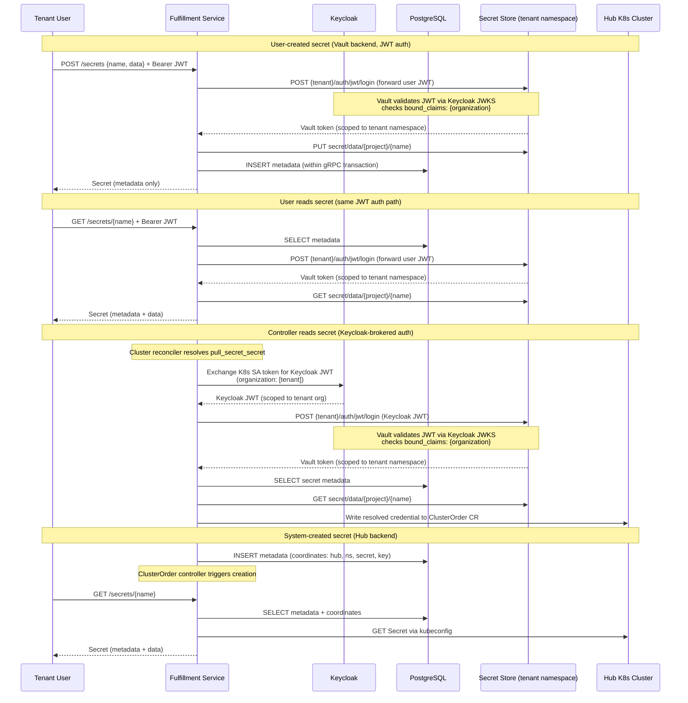

# Secret Management

## Summary

This enhancement introduces a Secret resource that provides a uniform API
over different secret sources — a Vault-compatible secret store for
encrypted-at-rest storage and Hub clusters for on-demand Kubernetes
credential retrieval — giving all OSAC personas a single interface for
creating, retrieving, and managing credentials through the
fulfillment-service gRPC/REST API and CLI. See [PRD](prd.md) for detailed
requirements.

## Motivation

Credentials in OSAC are currently scattered across resource types.
Cluster kubeconfigs are retrieved via dedicated `GetKubeconfig` and
`GetPassword` RPCs that reach into hub Kubernetes clusters at request time
[Codebase: internal/servers/clusters_server.go].
Pull secrets, OIDC client secrets, and storage backend passwords are stored
inline in their parent resource's spec, redacted on read and stripped on
update through ad-hoc server-side logic. Each resource type that touches
credentials implements its own storage, redaction, and retrieval pattern.

This fragmentation creates three problems:

1. Credential data stored in the PostgreSQL `data` JSONB column is not encrypted at rest — anyone
   with database access can read secrets in cleartext.
2. Tenants cannot manage credentials independently: rotating a pull secret requires updating the
   cluster that uses it, and there is no way to list all credentials a tenant owns.
3. Each new resource type that needs credentials must reimplement redaction and retrieval logic,
   increasing the surface area for mistakes.

### Goals

- Keep the Secret data storage path (store/retrieve bytes) separate from the metadata path (CRUD in PostgreSQL) so that secret bytes never transit PostgreSQL.
- Reuse the existing GenericServer/GenericDAO patterns for Secret CRUD metadata, adding backend dispatch only for data storage and retrieval [Codebase: internal/servers/generic_server.go].
- Maintain tenant isolation guarantees consistent with all other OSAC resources (OPA policies, tenant-scoped metadata, per-tenant backend isolation).

### Non-Goals

- Secret rotation automation — users can update secret values manually, but scheduled or event-driven rotation workflows are out of scope.
- UI support — secret management is CLI and API only for 0.2.
- Secret store deployment and operations — the cloud provider is responsible for deploying and operating the Vault-compatible secret store. OSAC manages per-tenant namespaces within the store but does not manage the store's own lifecycle (deployment, upgrades, HA, backups).

## Proposal

A single new resource type is introduced:

**Secret** is a tenant- and project-scoped resource that holds credential
metadata in PostgreSQL and delegates data storage to a backend determined
by the secret's source. Secrets appear in both the public and private APIs.
The public API provides a uniform CRUD interface — tenants
interact with secrets without knowing which backend stores them. The
private API exposes the `backend` field and source-specific fields (e.g.,
backend coordinates) for admin visibility and system-created secrets.

Secret data bytes never pass through PostgreSQL. On Create, the server
writes metadata to PostgreSQL and data bytes to the backend. On Get, the
server fetches metadata from PostgreSQL and data from the backend. List
responses return metadata only.

Two secret backends exist for 0.2:

- **Vault** — user-created and system-created secrets stored in a
  Vault-compatible secret store with namespace support (e.g., OpenBao or
  HashiCorp Vault Enterprise). Each tenant's secrets are stored in a
  dedicated child namespace under a parent OSAC namespace, providing
  structural isolation — each namespace has its own KV v2 engine with
  logically separated storage and its own Keycloak JWT auth method
  (see Vault Configuration).
- **Hub** — system-created secrets whose data lives in Kubernetes Secrets
  on hub clusters (e.g., provisioned cluster kubeconfigs and admin
  passwords created by HostedCluster controllers). The
  fulfillment-service retrieves data on demand using the existing Hub
  kubeconfig infrastructure.

### Workflow Description

#### Cloud Infrastructure Admin: Configure the Secret Store

Starting state: The cloud provider has deployed a Vault-compatible secret
store with namespace support (e.g., OpenBao 2.5+ or HashiCorp Vault
Enterprise) and made it reachable from the OSAC hub cluster.

1. The Cloud Infrastructure Admin creates the parent OSAC namespace in
   the secret store (e.g., `osac/`), configures a JWT auth method within
   it (trusting the Keycloak OIDC discovery endpoint), and creates a
   policy granting the fulfillment-service access to manage child
   namespaces (create, delete, configure auth methods and policies). This policy does **not** grant
   KV read/write access — it is scoped to namespace lifecycle operations
   only. This is a one-time setup step — per-tenant child namespaces and
   their auth methods are created automatically during tenant onboarding
   (see Tenant Namespace Lifecycle).
2. The Cloud Infrastructure Admin sets the appropriate `--vault-*` flags
   on the fulfillment-service deployment (see Vault Configuration),
   including `--vault-namespace` pointing to the parent namespace and
   `--vault-keycloak-discovery-url` pointing to the Keycloak OIDC
   discovery endpoint.
3. On startup, the fulfillment-service authenticates to the parent
   namespace using its lifecycle credentials and validates the connection
   by performing a health check against the configured endpoint. If the
   check fails, the service logs an error but continues to start — Hub
   secrets remain functional, and Vault-backed secret creation returns
   `FAILED_PRECONDITION` until the store is reachable.

#### Tenant User: Create and Retrieve a Secret

1. The tenant user creates a secret:
   `osac create secret my-ssh-key --from-file id_rsa=~/.ssh/id_rsa`
2. The fulfillment-service writes metadata to PostgreSQL and stores the
   key-value data (`{"id_rsa": <bytes>}`) in the secret store under the
   tenant's KV path.
3. The CLI confirms creation and displays the secret metadata (no data).
4. To retrieve the data:
   `osac get secret my-ssh-key -o yaml`
5. The fulfillment-service reads metadata from PostgreSQL and fetches
   data from the secret store.

#### Tenant User: Create a Cluster with a Secret Reference

1. The tenant user creates a secret for container image registry auth:
   `osac create secret my-pull-secret --from-file .dockerconfigjson=auth.json`
2. The tenant user creates a cluster referencing the secret:
   `osac create cluster my-cluster --pull-secret my-pull-secret`
3. The fulfillment-service validates that `my-pull-secret` exists. The
   cluster spec stores
   `pull_secret_secret = "my-pull-secret"` — no inline credential data.
4. The cluster reconciler resolves the reference by reading the secret
   data via the private Secrets API, validates the pull secret format,
   then writes the resolved credential into the ClusterOrder CR.

#### System: Automatic Secret Creation During Cluster Provisioning

Starting state: A cluster has been provisioned and a kubeconfig is
available on the hub.

1. When the ClusterOrder controller detects that the HostedCluster has a
   ready kubeconfig, it calls the fulfillment-service private Secrets API
   to create a Hub-backed secret.
2. The fulfillment-service stores the secret metadata in PostgreSQL with
   backend `HUB` and the coordinates (hub ID, namespace, Kubernetes Secret
   name, key) needed to retrieve the data on demand.
3. When a tenant user retrieves the secret
   (`osac get secret cluster-kubeconfig -o yaml`), the
   fulfillment-service follows the backend coordinates to retrieve the
   kubeconfig from the hub cluster — the same retrieval path currently
   implemented in `getHostedClusterSecret()` [Codebase: internal/servers/clusters_server.go].



In both paths, the tenant user interacts with the same public API — the
backend is transparent.

#### Error Handling

Errors are returned as gRPC status codes. See **Failure Handling and
Recovery** for per-operation behavior.

### API Extensions

**New gRPC services:**

| Service | API | Purpose |
|---------|-----|---------|
| `osac.private.v1.Secrets` | Private | Full Secret CRUD with backend visibility |
| `osac.public.v1.Secrets` | Public | Uniform Secret CRUD for tenants |

**Modified resources:**

- `osac.private.v1.Event`: Add `Secret secret` to the payload oneof.
- `osac.public.v1.Clusters`: `GetKubeconfig` and `GetPassword` RPCs are
  deprecated then removed.

### Implementation Details/Notes/Constraints

#### Proto Schema: Secret

```proto
// private/osac/private/v1/secret_type.proto

message Secret {
  string id = 1;
  Metadata metadata = 2;
  SecretSpec spec = 3;
}

message SecretSpec {
  map<string, bytes> data = 1;
  SecretBackend backend = 2;
  map<string, string> coordinates = 3;
}

enum SecretBackend {
  SECRET_BACKEND_UNSPECIFIED = 0;
  SECRET_BACKEND_VAULT = 1;
  SECRET_BACKEND_HUB = 2;
}

```

The public Secret (`public/osac/public/v1/secret_type.proto`) uses the
same structure but omits `backend` and `coordinates` from
`SecretSpec`. The `data` field is a `map<string, bytes>` modeled after
Kubernetes Secret `Data`. It is provided on Create/Update, returned on
Get, and omitted from List. The CLI controls display: the default table
view shows metadata only, while structured output formats (`-o yaml/json`)
include data values.

All secrets are opaque key-value data — the secret store does not
enforce key names or value formats. Consuming resources validate the
secret's contents when they read it and report errors in their own
status (e.g., a cluster controller validates that a pull secret
contains a valid `.dockerconfigjson` key before provisioning).

For Hub-backed secrets (system-created), the `data` map is populated on
demand from the Kubernetes Secret — the key matches the Kubernetes
Secret's `Data` field key (typically `kubeconfig` or `password`).

The `backend` field is set by the server, not the caller:
- Public API Create: server sets `backend = VAULT` automatically.
- Private API Create: caller can set `backend = HUB` with
  `coordinates` for system-created secrets.

#### Proto Schema: Service RPCs

Both public and private Secrets services follow the standard CRUD pattern:

```proto
service Secrets {
  rpc List(SecretsListRequest) returns (SecretsListResponse);
  rpc Get(SecretsGetRequest) returns (SecretsGetResponse);
  rpc Create(SecretsCreateRequest) returns (SecretsCreateResponse);
  rpc Update(SecretsUpdateRequest) returns (SecretsUpdateResponse);
  rpc Delete(SecretsDeleteRequest) returns (SecretsDeleteResponse);
}
```

#### Database Schema

A new migration will create the `secrets` table.

Secrets are tenant- and project-scoped, following the `objects` table
pattern.

The `data` JSONB column stores the SecretSpec proto JSON (`backend`,
`coordinates`) — not secret bytes (see Proposal).

#### Vault Configuration

The Vault-compatible store connection is configured via fulfillment-service
startup flags, following the existing pattern for infrastructure
dependencies like the database connection:

```text
--vault-endpoint              Vault API endpoint URL (Required)
--vault-namespace             Parent namespace path within Vault (Required, e.g., "osac")
--vault-ca-cert-file          Path to PEM-encoded CA certificate for Vault TLS
--vault-kv-mount-path         KV v2 secret engine mount path within tenant namespaces (default: secret)
--vault-lifecycle-role        Vault role for lifecycle JWT auth (Required)
--vault-lifecycle-mount-path  Custom mount path for lifecycle auth (default: auth/jwt)
--vault-keycloak-discovery-url    Keycloak OIDC discovery URL for tenant JWT auth setup (Required)
--vault-keycloak-audience         Expected audience claim in Keycloak JWTs (default: osac-api)
--vault-keycloak-token-endpoint   Keycloak token endpoint for controller token exchange (Required)
--vault-keycloak-client-id        Keycloak client ID for controller token exchange (Required)
--vault-keycloak-client-secret-file  Path to Keycloak client secret for controller token exchange (Required)
```

The fulfillment-service uses three distinct authentication paths to
the secret store, each with different scope:

**Lifecycle auth (parent namespace):** The `--vault-lifecycle-*` flags
configure how the fulfillment-service authenticates to the parent
namespace for tenant onboarding/offboarding operations (create/delete
child namespaces, enable auth methods, configure policies). The
lifecycle auth uses the same Keycloak JWT mechanism — the
fulfillment-service authenticates with a Keycloak-issued JWT to the
parent namespace's `auth/jwt/` endpoint. The policy for this identity
grants only namespace management — it cannot read or write KV
data. This is the only credential that operates at the parent namespace
level.

**User auth (per-tenant, JWT forwarding):** When a user calls the
Secrets API, the fulfillment-service forwards the user's Keycloak JWT
to the tenant's child namespace JWT auth endpoint
(`{parent_namespace}/{tenant}/auth/jwt/login`). Vault validates the JWT
against Keycloak's public keys (configured via
`--vault-keycloak-discovery-url` during tenant onboarding) and checks
`bound_claims: {"organization": ["<tenant>"]}` to enforce that the user
belongs to the tenant. The resulting Vault token is scoped to that
single tenant namespace — even a bug in the fulfillment-service cannot
cross tenant boundaries because Vault itself enforces the claim match.

**Controller auth (per-tenant, Keycloak-brokered):** When a
fulfillment-service controller needs Vault access (e.g., the cluster
reconciler resolving a `pull_secret_secret` reference), it first
exchanges its Kubernetes ServiceAccount token with Keycloak for a
Keycloak-issued JWT scoped to the target tenant. The exchange uses
the Keycloak token endpoint (configured via
`--vault-keycloak-token-endpoint`) with the fulfillment-service's
client credentials. Keycloak validates the SA token against the
Kubernetes cluster's OIDC issuer, then issues a standard Keycloak JWT
with `organization: ["<tenant>"]`. The controller authenticates this
Keycloak JWT to the same tenant namespace JWT auth endpoint used
by user requests (`{parent_namespace}/{tenant}/auth/jwt/login`). Vault
validates the token against Keycloak's public keys and checks
`bound_claims: {"organization": ["<tenant>"]}` — the same role, same
mount, same validation as user requests.

This design uses Keycloak as an OIDC broker, insulating Vault from
any knowledge of the Kubernetes cluster's identity infrastructure. If
the fulfillment-service migrates to a different cluster, only the
Keycloak identity provider configuration needs updating — all Vault
tenant namespace configurations remain untouched.

The lifecycle credential can manage namespaces but cannot read KV
data. User and controller credentials are both Keycloak JWTs
authenticated per-tenant by Vault, with tenant binding enforced by
`bound_claims: {"organization"}` in all cases. The controller
obtains per-tenant JWTs via Keycloak token exchange using a single
set of client credentials — Vault enforces the tenant scope via
claim validation, not credential separation. A compromised set of
Keycloak client credentials could request JWTs for any tenant, but
each resulting Vault token remains scoped to a single tenant
namespace by Vault's `bound_claims` check.

**Extensibility for future consumers:** Services (e.g., AAP/Ansible jobs)
can access tenant secrets by obtaining a tenant-scoped JWT via standard OAuth 2.0
client credentials from Keycloak and calling the fulfillment-service Secrets gRPC API.
The fulfillment-service forwards the JWT through the same user auth path —
no additional Vault or fulfillment-service configuration required.

The secret store must meet these prerequisites:

- **Reachable endpoint** — the store's API must be reachable from the
  fulfillment-service pods
- **TLS** — the endpoint must serve TLS; if the CA is not in the
  system trust store, provide the CA certificate via `--vault-ca-cert-file`
- **Namespace support** — the store must support namespaces, including
  per-namespace auth method configuration. OpenBao (2.5+ recommended)
  provides namespace support in its free open-source release. HashiCorp
  Vault requires an Enterprise license for namespace support.
- **Parent namespace** — a parent namespace (e.g., `osac/`) must exist
  with an auth method configured and a policy granting the
  fulfillment-service lifecycle access only (namespace management, no
  KV access). See Cloud Infrastructure Admin workflow.
- **Keycloak connectivity** — Keycloak is the sole OIDC provider trusted
  by Vault. The secret store must reach Keycloak's OIDC discovery endpoint
  for JWKS key refresh (cached periodically). The fulfillment-service must
  reach Keycloak's token endpoint for controller token exchange. Keycloak
  must be configured with a Kubernetes OIDC identity provider that trusts
  the fulfillment-service cluster's SA token issuer.

**Network requirements:** The following connectivity paths must be
available:

1. **Fulfillment-service pods → Vault API** (HTTPS) — for all secret
   operations and tenant namespace lifecycle management.
2. **Fulfillment-service pods → Keycloak token endpoint** (HTTPS) — for
   controller token exchange (SA token → tenant-scoped Keycloak JWT).
3. **Vault → Keycloak OIDC discovery** (HTTPS, Vault-initiated) — for
   JWKS key refresh used to validate Keycloak JWTs. Vault caches JWKS
   keys and refreshes periodically, so brief Keycloak outages are
   tolerated.

In multi-cluster deployments where Vault and the fulfillment-service
are in different clusters, paths 1 and 3 cross cluster boundaries and
may require ingress or service mesh configuration.

Per-tenant child namespaces, their KV v2 secret engines, and their auth
method configurations are created automatically during tenant
onboarding — the Cloud Infrastructure Admin does not need to configure
these manually. Documentation will cover parent namespace setup for
common implementations.

#### Server Implementation

All Vault-backend operations authenticate to the tenant's child
namespace before dispatching, using the auth path determined by request
context — user JWT forwarding or controller Keycloak token exchange
(see Vault Configuration). The resulting Vault token is scoped to a
single tenant's namespace regardless of path.

**Token caching:** Per-request auth adds latency. The server caches
Keycloak exchange tokens and Vault tokens:
- User path: cached by JWT `jti` + tenant name; evicted at the earlier
  of JWT expiry or Vault token TTL.
- Controller path: cached by tenant name; evicted prior to TTL expiry.

Private server behavioral specifics:

- **Create:**
  - Sets `backend = VAULT` if not specified
  - Validates data is non-empty (at least one key)
  - Authenticates to the tenant's Vault namespace, writes data, then
    inserts metadata into PostgreSQL upon successful creation. If the
    tenant's namespace does not yet exist (onboarding controller has not
    completed), returns `FAILED_PRECONDITION`.
- **Get:**
  - Reads metadata from PostgreSQL, authenticates to the tenant's
    Vault namespace, dispatches to backend to fetch data
- **Update:**
  - If `spec.data` is non-empty, authenticates to the tenant's Vault
    namespace, writes new data, then updates metadata if needed
- **Update (Hub-backed):**
  - Metadata-only updates (e.g. labels) are allowed.
  - If `spec.data` is non-empty, returns `FAILED_PRECONDITION` — Hub-backed secret data is system-managed.
- **Delete:**
  - Vault-backed: deletes metadata within the transaction, then
    authenticates to the tenant's Vault namespace and permanently removes
    all versions. If Vault delete fails, the transaction rolls back and
    the secret remains intact.
  - Hub-backed (public API): returns `FAILED_PRECONDITION` — tenants
    cannot delete system-managed secrets.
  - Hub-backed (private API): deletes the metadata. Used by the
    controllers to clean up when the parent resource is deleted.

Public server wraps the private server and ensures `backend` and
`coordinates` are stripped from responses.

#### CLI Commands

New commands follow existing patterns:

| Command | Description |
|---------|-------------|
| `osac create secret <name> --from-file=<key>=<path>` | Create a secret with a key-value pair from a file |
| `osac create secret <name> --from-file=<path>` | Create with filename as the key |
| `osac create secret <name> --from-file=-` | Create a secret from stdin |
| `osac get secrets` | List secrets (metadata only) |
| `osac get secret <name>` | Get secret (table: metadata only; `-o yaml/json`: includes data) |
| `osac describe secret <name>` | Detailed secret metadata view |
| `osac delete secret <name>` | Delete a secret |
| `osac edit secret <name>` | Edit secret data/metadata in `$EDITOR` |

The `--from-file` flag is new to the OSAC CLI.
They follow `kubectl create secret` conventions because secrets hold
arbitrary key-value data — unlike other OSAC resources which have
typed fields with dedicated flags. Data values are included in
structured output formats (`-o yaml/json`). The default table view
shows metadata only.

#### Secret References

Resources that currently embed credentials as inline fields gain a new reference field that holds the name of
a Secret resource. The existing inline field is deprecated / removed after data migration.

Validation rules:
- Referenced Secret must exist
- Referenced secret must be in the same project
- The consuming resource's controller validates the secret's contents
  at use time and reports format errors in its own status

**All credential reference fields:**

| Resource | Inline Field (deprecated) | Reference Field |
|----------|--------------------------|-----------------|
| Cluster | `pull_secret` | `pull_secret_secret` |
| ClusterTemplate | `pull_secret` | `pull_secret_secret` |
| Hub | `kubeconfig` | `kubeconfig_secret` |
| IdentityProvider | `client_secret` | `client_secret_secret` |
| IdentityProvider | `bind_credential` | `bind_credential_secret` |
| StorageBackend | `password` | `password_secret` |
| Tenant | `break_glass_credentials` | `break_glass_credentials_secret` |

Note: The exact naming, nature, and type of these reference fields may change as a result
of upcoming type-safe resource references - https://redhat.atlassian.net/browse/OSAC-1330

#### Secret Labels

Users are encouraged to apply the label `osac.openshift.io/secret-type`
to describe what kind of credential data a secret holds. This label is
not enforced by the server — it is a recommended convention that enables
filtering and auditing by secret type.

For example:

```bash
osac create secret my-pull-secret \
  --from-file .dockerconfigjson=auth.json \
  --label osac.openshift.io/secret-type=pull-secret
```

System-created secrets (e.g., cluster kubeconfigs) will have this label set by the creating controller.
This ensures that secrets created by OSAC itself are discoverable
by type without requiring manual labeling.

#### Tenant Namespace Lifecycle

Each tenant gets a dedicated child namespace in the secret store with
its own auth methods configured. The tenant onboarding controller
manages namespace lifecycle as part of Tenant CR reconciliation (see
the [tenant-onboarding EP](/enhancements/OSAC-24-tenant-onboarding)):

**Onboarding (namespace creation):**

1. When the tenant onboarding controller creates a Tenant CR, it also
   creates a child namespace `{parent_namespace}/{tenant_name}/` in the
   secret store
2. Mounts a KV v2 secret engine at `secret/` within the new namespace
3. Enables JWT auth at `auth/jwt/` within the namespace, configured
   with:
   - `oidc_discovery_url` set to the Keycloak OIDC discovery endpoint
     (from `--vault-keycloak-discovery-url`)
   - A role with `bound_claims: {"organization": ["<tenant_name>"]}`,
     `bound_audiences: ["<audience>"]` (from `--vault-keycloak-audience`),
     and `user_claim: "sub"`
   - A policy granting read/write/delete access to the KV engine

This is the only auth mount needed per tenant — both user requests and
controller operations authenticate with Keycloak-issued JWTs through
the same `auth/jwt/` endpoint. Keycloak acts as the sole OIDC broker,
so Vault has no direct dependency on the Kubernetes cluster's identity
infrastructure.

If namespace creation or auth configuration fails (e.g., the secret
store is temporarily unavailable), the controller retries on the next
reconciliation loop. The tenant remains functional for non-secret
operations — Vault-backed secret creation returns
`FAILED_PRECONDITION` until the namespace is available.

**Offboarding (namespace deletion):**

When a tenant is deleted, the controller deletes the tenant's namespace.
Namespace deletion is a cascading operation — all secrets, policies, and
auth methods within the namespace are permanently removed. This provides
clean tenant data removal without requiring individual secret deletion.

```text
Parent Namespace: osac/
├── auth/jwt/                     ← lifecycle auth only (namespace mgmt, no KV)
├── tenant-acme/                  ← created during onboarding for tenant-acme
│   ├── auth/jwt/                 ← validates Keycloak JWTs
│   └── secret/ (KV v2)          ← mounted during onboarding
│       └── data/{project}/{name} ← per-project secret paths
├── tenant-bigcorp/
│   ├── auth/jwt/
│   └── secret/ (KV v2)
│       └── data/{project}/{name}
└── ...
```

#### Credential Migration

A Go binary moves existing inline credentials into the Secrets
API. The binary authenticates using the same lifecycle and controller
auth paths as the fulfillment-service (see Vault Configuration). It
maps each inline credential to the appropriate key-value structure:

1. For each tenant with inline credential data, ensures the tenant's
   namespace exists in the secret store with auth configured
2. Reads all resources with inline credential data from PostgreSQL
3. For each credential, creates a Secret resource in the same project
   as the parent resource with the appropriate data map:
   - `pull_secret` → data `{".dockerconfigjson": <value>}`
   - `kubeconfig` → data `{"kubeconfig": <value>}`
   - `client_secret`, `bind_credential`, `password` → data
     `{"value": <value>}`
   - `break_glass_credentials` → data
     `{"username": <value>, "password": <value>}`
4. Writes metadata to PostgreSQL and data to the tenant's namespace in
   the Vault store
5. Sets the corresponding `*_secret` field on the resource to the new
   secret's name
6. Clears the inline credential field

The binary is idempotent across all steps — safe to re-run if
interrupted at any point. For each credential it checks whether the
tenant namespace exists (skips creation), whether the Secret already
exists (skips creation), whether the `*_secret` field is already set
(skips the update), and whether the inline field is already cleared
(skips the clear). This ensures a crash between any two steps does not
leave partial state on rerun. It runs as a one-time job after the Vault
store is configured and the fulfillment-service is upgraded with the
new schema.

The binary can be manually invoked as a one-time step for currently running clusters
via a subcommand.  A cleanup task will be created to fully remove the binary at
a later release once the Vault secret store is fully established.

### Security Considerations

**Encryption at rest:** The Vault-compatible secret store provides
encryption at rest. PostgreSQL stores only metadata (see Proposal).

**Tenant isolation:** Each tenant's secrets are stored in a dedicated
namespace with its own KV v2 engine — physically separate storage that
prevents cross-tenant data exposure from path-matching bugs or policy
misconfigurations. The fulfillment-service authenticates per-tenant
using Keycloak JWTs with `bound_claims` enforcement (see Vault
Configuration). A compromised or buggy fulfillment-service cannot
access a tenant's secrets without a valid Keycloak JWT carrying the
correct `organization` claim for that tenant. The Keycloak client
credentials used for controller token exchange can request JWTs for
any tenant, but Vault's per-namespace `bound_claims` check ensures
each resulting token is scoped to a single tenant. The lifecycle
credential can manage namespaces but has no KV read/write access.

**Input validation:** Total secret data size is capped at 1 MiB (Vault API default
max entry size). The server validates that secret data contains at
least one key but does not enforce key names or value formats. Secret names
follow the existing OSAC naming validation (alphanumeric, hyphens, max
253 characters).

**Data exposure in transit:** Secret data is transmitted over TLS-encrypted
gRPC connections. The CLI displays data only in structured output formats
(`-o yaml/json`); the default table view shows metadata only.

**No secret data in logs, events, or CLIs:** The RedactFunc strips `spec.data`
from all event payloads. Server-side logging does not include secret data.
Users should be able to create secrets without having to type secrets in CLI inputs
that might show up in history or the process table.

### Failure Handling and Recovery

PostgreSQL and Vault cannot participate in distributed transactions.
An eventually consistent approach (writing to Vault via an asynchronous
controller) would require temporarily storing secret data somewhere
between the user request and the controller write — contradicting the
goal of keeping secret bytes out of PostgreSQL. Instead, the server
writes to Vault first, then commits the metadata insert within the
gRPC interceptor's database transaction

If the Vault write fails, no database record is created — the request
fails cleanly. If the database commit fails after a successful Vault
write, an orphaned entry remains in Vault with no metadata pointing to
it. This does not affect user-visible behavior — the Create simply
returns an error.

#### Per-operation behavior

All Vault operations require per-tenant authentication before
dispatching (see Server Implementation). If the tenant's namespace does
not yet exist (onboarding controller has not completed), Vault-backed
operations return `FAILED_PRECONDITION`. If per-tenant auth fails
(e.g., invalid JWT claims, Keycloak token exchange failure, or secret store
unreachable), Vault-backed operations fail with appropriate status.

| Operation | Steps | On Failure |
|-----------|-------|------------|
| **Create (Vault)** | Authenticate to tenant namespace → Vault write → insert metadata → commit | Namespace missing: `FAILED_PRECONDITION`. Auth or Vault failure: no record created. Commit failure: orphan in Vault (no metadata). |
| **Create (Hub)** | Insert metadata with coordinates → commit | Standard DB error handling. |
| **Get** | Read metadata → authenticate to tenant namespace → fetch data from backend | Return status code based on issue. |
| **Update (Vault data)** | Authenticate to tenant namespace → Vault write (overwrite) → update metadata if needed → commit | Auth or Vault failure: return error, existing data intact. |
| **Update (Hub metadata)** | Update metadata in PostgreSQL only | Standard DB error handling. |
| **Update (Hub data)** | N/A — returns `FAILED_PRECONDITION` | Data is system-managed. |
| **Delete (Vault)** | Delete metadata → authenticate to tenant namespace → Vault metadata delete (permanent, all versions) → commit | Auth or Vault failure: rollback restores metadata, secret intact. Commit failure: retry (Vault metadata delete is idempotent on non-existent paths). |
| **Delete (Hub, public)** | Returns `FAILED_PRECONDITION` | Tenants cannot delete system-managed secrets. |
| **Delete (Hub, private)** | Delete metadata → commit | Standard DB error handling. |

### RBAC / Tenancy

**Tenant isolation metadata:** Secrets carry tenant and project scope in
standard `Metadata` fields.

**OPA policy additions:**

```rego
# Public API — tenant users and tenant admins
has_client_permissions {
    grpc_method in {
        "/osac.public.v1.Secrets/List",
        "/osac.public.v1.Secrets/Get",
        "/osac.public.v1.Secrets/Create",
        "/osac.public.v1.Secrets/Update",
        "/osac.public.v1.Secrets/Delete",
    }
}
```

The private Secrets API is admin-only, handled by the existing `is_admin`
catch-all for private API methods.

**Visibility:** Tenants see only their own secrets, scoped by project.
The public Secret API does not expose the `backend` field or Hub
coordinates.

**Secret store namespace model:** Each tenant has a dedicated child
namespace with per-tenant Keycloak JWT auth (see Vault Configuration).

**Secret store path derivation:** Within a tenant's namespace, all Vault
operations use the path `{kv_mount_path}/data/{project}/{name}`, where
`kv_mount_path` is set via `--vault-kv-mount-path` (default: `secret`).
The full qualified path from the root namespace is
`{parent_namespace}/{tenant}/secret/data/{project}/{name}`.
Access isolation is enforced both structurally (namespace isolation —
each tenant's secrets are in a separate namespace with independent KV
storage) and by authentication (per-tenant auth methods with Keycloak
JWT claim binding). A Vault token obtained in one tenant's namespace
cannot access another tenant's secrets. Project-level isolation within
a tenant namespace is enforced by the application layer (OPA policies
and fulfillment-service request routing), not by Vault policies — Vault
enforces tenant-level isolation via namespace boundaries and JWT claim
binding.

### Observability and Monitoring

Secrets API requests use the existing fulfillment-service gRPC metrics and structured logging.

### Risks and Mitigations

| Risk | Impact | Mitigation |
|------|--------|------------|
| Secret store becomes a single point of failure for all secret operations | Secret creation and data retrieval fail when the store is down | Vault-compatible stores support HA deployment. The cloud provider is responsible for HA configuration. Metadata remains accessible when the store is down. |
| Secret store data loss results in unrecoverable secret loss | Secrets with Vault backend become permanently inaccessible | The cloud provider is responsible for backup and disaster recovery of their secret store deployment. Documentation will cover backup recommendations. |
| Secret store must support namespaces — not all Vault-compatible stores do | Deployments without namespace support cannot use per-tenant isolation | Document the requirement. OpenBao (free, open-source) provides namespace support starting at v2.3.1 (v2.5+ recommended). HashiCorp Vault requires an Enterprise license. |
| Keycloak Dependency | Vault cannot validate any JWTs, blocking all Vault-backed secret operations | Keycloak is already a hard dependency — user requests fail regardless when it is down. |

### Drawbacks

Requiring cloud providers to deploy a Vault-compatible store with
namespace support adds an external prerequisite and narrows compatible
stores to OpenBao or HashiCorp Vault Enterprise. This is justified
because encryption at rest cannot be met with PostgreSQL alone, and
structural tenant isolation justifies the namespace requirement.

The two-backend model adds CRUD dispatch complexity. The namespace
model adds tenant lifecycle coordination. Per-request auth adds latency
(mitigated by token caching). Keycloak becomes the sole OIDC broker —
a stronger dependency than direct Kubernetes OIDC trust, but Keycloak
is already a hard dependency for the fulfillment-service.

## Alternatives (Not Implemented)

### Database Envelope Encryption

Store secret data in PostgreSQL, encrypted using envelope encryption
(RSA wrapping an AES data key). This avoids the external secret store
dependency and keeps all data in one store.

**Rejected because:** Key management for envelope encryption is complex —
the wrapping key must itself be securely stored and rotated. Better to trust
an industry-standard technology like Vault than build and maintain ourselves.

### Parent-Namespace Service Token (Single Credential)

The fulfillment-service authenticates once to the parent OSAC namespace
at startup and receives a token that can access all child (tenant)
namespaces via the `X-Vault-Namespace` header. Tenant isolation is
enforced by the application layer — the service sets the header to the
correct tenant namespace on each request.

**Rejected because:** A single credential that can access all tenants'
secrets creates a broad blast radius. A bug in namespace header routing
or a compromised service token could access any tenant's data. The
per-tenant auth model enforces isolation at the Vault layer — Vault
itself validates that the caller has a legitimate claim to the
requested tenant's namespace, regardless of what the application
requests.

### Path-based Tenant Isolation (No Namespaces)

Store all tenants' secrets in a single KV v2 engine, using path
conventions (`{kv_mount}/data/{tenant}/{project}/{name}`) and
application-layer enforcement to isolate tenants. The
fulfillment-service authenticates once with broad credentials and
restricts access based on the authenticated tenant's path prefix.

**Rejected because:** Isolation is logical (enforced by application
code) rather than structural. A bug in path-matching logic or a
misconfigured policy could expose cross-tenant data. Namespace-based
isolation provides a stronger boundary — each tenant's KV engine is
physically separate, and a request scoped to one namespace cannot access
another regardless of the path used.

### Full backwards compatibility with existing data fields

Rather than having an explicit migration step, data can be left in Postgres
and lazily migrated.  A shim layer is introduced that knows how/where to read
secret data.  On read if data is in Postgres it will be migrated to Vault.

**Rejected because:** Project maturity level does not necessitate this kind of
overhead / ongoing maintainance burden.

## Test Plan

**Unit tests (Ginkgo):**
- Secret proto validation (required fields, name format, data size limits)
- Backend interface: mock Vault and Hub backends to test Store/Fetch/Delete dispatch
- Server logic: Create with backend write, Get with backend data fetch, Update with data replacement, Delete with backend cleanup
- Failure handling: Vault write failure returns error with no DB record; Vault delete failure rolls back metadata deletion
- Public↔private type mapping: verify `backend` and `coordinates` are stripped in public responses
- RedactFunc: verify data is stripped from event payloads
- OPA policy: verify role-based access for Secret methods
- Migration: Test idempotency logic + expected generated payloads

**Integration tests (Kind cluster):**
- Secret CRUD through gRPC with a Vault-compatible store in the Kind cluster
- Per-tenant JWT auth: verify user JWT forwarding to tenant Vault namespace, verify `bound_claims` rejection for mismatched organization
- Keycloak token exchange: verify controller SA token exchange with Keycloak produces a tenant-scoped JWT, and that JWT authenticates to the tenant's Vault namespace
- Tenant namespace isolation: verify tenant A cannot read tenant B's secrets across namespaces
- Namespace lifecycle: verify namespace creation with JWT auth setup during tenant onboarding, deletion during offboarding
- Token caching: verify cached Vault tokens are reused within TTL and evicted on expiry
- Hub-backend secrets: create via private API with coordinates, retrieve via public API
- Credential resolution: verify cluster reconciler reads pull_secret_secret from Vault via controller auth and writes resolved value to ClusterOrder CR
- Migration: Moving data from a cluster with inline pull_secret to the Vault backend, including namespace creation

**E2E tests (pytest, osac-test-infra):**
- Automatic secret creation during cluster provisioning

## Graduation Criteria

**Dev Preview (0.2):** Full Secret CRUD, Vault and Hub backends, CLI
commands.

## Upgrade / Downgrade Strategy

**Upgrade** requires deploying a Vault-compatible secret store, then
setting the `--vault-*` flags on the fulfillment-service. After the
service is running with the new schema, the credential migration
binary runs (see Credential Migration) to move inline credentials into the
Secrets API.

**Downgrade** is not supported once secrets are in Vault.

## Version Skew Strategy

OSAC is pre-GA — all components (fulfillment-service, osac-operator,
CLI) are expected to be deployed together at matching versions. An
up-to-date CLI is required for new operations such as creating Secrets
and attaching them to other resources.

## Support Procedures

**Detecting failures:**
Fulfillment-service logs at ERROR level for backend operation failures,
including the backend type, tenant, and error message.

**Disabling the feature:**
Not supported once secrets are in use. Removing the `--vault-*` flags
prevents new secret creation but leaves existing secret metadata in
PostgreSQL and data in the secret store with no way to access it through
OSAC. There is no graceful disable path.

## Infrastructure Needed

- Vault-compatible secret store instance with namespace support and per-namespace auth method configuration in the integration test Kind cluster (OpenBao 2.5+ recommended for CI due to its permissive license and free namespace support)
- Keycloak instance in the integration test cluster (already exists) — the secret store must be able to reach Keycloak's OIDC discovery endpoint for JWT validation
