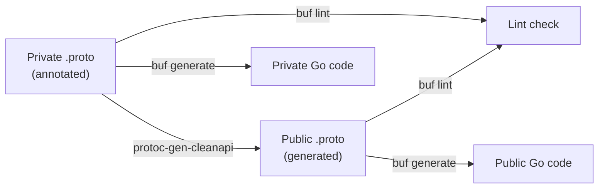

# API Quality — Declarative Validation, Auto-Generated Public API, and Consistency

## Summary

This design replaces manual dual-maintenance of public/private proto files with an automated generation pipeline using protoc-gen-cleanapi, introduces materialized active-object tables for safe deletion constraint enforcement, and addresses DAO/server-layer consistency gaps. See [PRD](prd.md) for detailed requirements.

## Motivation

The fulfillment-service maintains 39 public and 37 private proto files by hand. Fields, services, and HTTP routes must be kept in sync across both sets — a process that is error-prone and scales poorly as the API surface grows. When a developer adds a field to a private proto, they must remember to add it to the public proto (with different field numbers, different package references, and different HTTP routes), update the GenericMapper's `AddIgnoredFields` for private-only fields, and ensure `buf.validate` annotations are added to the public version. Any missed step produces silent drift between the two APIs.

Cross-object constraints that respect soft deletion are implemented with per-resource trigger functions that vary in pattern and error reporting. Some use `BEFORE UPDATE` triggers on the parent (Pattern A), others use materialized helper tables (Pattern B). Adding a new parent-child relationship requires writing bespoke SQL trigger functions each time. A generic mechanism would reduce implementation effort and eliminate per-resource variation.

The DAO layer itself is fully generic (`GenericDAO[O Object]`), but the server layer and migration layer have accumulated inconsistencies: error translation is duplicated across create/update/delete operations, and trigger function naming varies across migrations.

### Goals

- Establish the private proto files as the single source of truth for all API definitions, with public protos generated automatically.
- Reuse the existing `GenericDAO` and controller reconciliation patterns — changes stay at the server and migration layers.
- Make safe deletion constraints declarative: adding a new parent-child relationship requires only a migration, not a custom trigger function.

### Non-Goals

- AIP (Google API Improvement Proposals) alignment. [Locked: D1]
- New resource types or domain-specific API changes.
- UI changes beyond what API changes would break. [Locked: D4]
- Upgrade/downgrade support — OSAC does not currently support upgrades.
- Multi-region or quota enforcement.

## Proposal

This design covers three epics under OSAC-1577:

**OSAC-1274 (Auto-Generated Public API):** Annotate the private proto files with `cleanapi` visibility markers, integrate protoc-gen-cleanapi into the build pipeline, and remove the manually maintained public proto directory. The GenericMapper and public server boilerplate are preserved but simplified.

**OSAC-1331 (Safe Deletion Constraints):** Introduce `active_<table>` companion tables maintained by a single generic trigger function. Replace the existing per-resource soft-deletion triggers (Pattern A) with standard PostgreSQL foreign key constraints against the active tables.

**OSAC-1540 (Minor API Improvements):** Consolidate DAO error translation, normalize `metadata.name` format for projects, and address incremental API consistency fixes.

### Workflow Description

#### OSAC-1274: API Developer Workflow (After)

1. Developer edits a private proto file in `proto/private/osac/private/v1/`.
2. Developer annotates private-only fields with `[(cleanapi.field).private = true]`, private-only messages with `option (cleanapi.message).private = true;`, and private-only RPCs with `option (cleanapi.method).private = true;`.
3. Developer adds `buf.validate` annotations to public-facing fields in the private proto file.
4. Developer runs `uv run dev.py build protos` (or equivalent), which:
   a. Runs `protoc` with protoc-gen-cleanapi to generate public protos into `proto/public/osac/public/v1/`
   b. Runs `buf lint` on both modules (public-api and private-api)
   c. Runs `buf generate` to produce Go code for both public and private APIs
5. Developer commits both the annotated private protos and the generated public protos.



The generated public protos are committed to the repository (not gitignored) so that downstream consumers can import them without running the generation tool. The generation step is idempotent — running it twice produces the same output.

#### OSAC-1331: Safe Deletion Constraint Flow

When a resource is soft-deleted (its `deletion_timestamp` changes from epoch to a real timestamp), the `maintain_active_objects` trigger removes the row from `active_<table>`. Any existing foreign key from a child's `active_<table>` to the parent's `active_<table>` causes PostgreSQL to raise a standard FK violation, which the DAO translates to `ErrInUse` (Z0003). No custom trigger logic is needed per resource.

When a child resource is created referencing a parent, the `BEFORE INSERT` on the child's table inserts into the child's `active_<table>`, which holds an FK to the parent's `active_<table>`. If the parent is soft-deleted (absent from `active_<table>`), the FK constraint fails, and the DAO translates it to `ErrReference` (Z0002).

### API Extensions

**Proto annotation additions (OSAC-1274):** The cleanapi proto options file (`cleanapi.proto`) is added as a dependency. No new gRPC services or CRDs are introduced — the public API surface is unchanged.

**No CRD or webhook changes.** All three epics modify internal implementation without changing the external API contract.

**Existing resource behavior changes (OSAC-1331):** Error messages for soft-deletion constraint violations may change slightly (from custom trigger SQLSTATE messages to PostgreSQL FK violation messages). The error codes (Z0002, Z0003) remain the same after DAO error translation.

## UX Alignment

This design does not add or modify any proto fields visible to the UI. The public API surface is preserved — same fields, same routes. Public field numbers may change (no backward compatibility concern since OSAC does not support upgrades). No `@temp-api` alignment changes are required.

The only UI-relevant consideration is that error messages for constraint violations (OSAC-1331) may change in wording. The HTTP status codes and error structure remain the same.

### Implementation Details/Notes/Constraints

#### OSAC-1274: Auto-Generated Public API

##### Annotation Scheme

All 37 private proto files receive cleanapi annotations. Each file gets two file-level options:

```protobuf
import "cleanapi/cleanapi.proto";

option (cleanapi.file).package = "osac.public.v1";
option (cleanapi.file).remove_http_options = true;
```

The `remove_http_options = true` option strips all `google.api.http` annotations from the generated public protos. Public HTTP routes are then defined in a separate, manually maintained route file (see Route Handling below).

Private-only elements are annotated at the appropriate level. Complete example using `virtual_networks_service.proto`:

```protobuf
// proto/private/osac/private/v1/virtual_networks_service.proto
syntax = "proto3";

package osac.private.v1;

import "cleanapi/cleanapi.proto";
import "osac/private/v1/virtual_network_type.proto";
import "google/api/annotations.proto";

option (cleanapi.file).package = "osac.public.v1";
option (cleanapi.file).remove_http_options = true;

service VirtualNetworks {
  rpc Get(VirtualNetworkGetRequest) returns (VirtualNetworkGetResponse) {
    option (google.api.http) = {
      get: "/api/private/v1/virtual_networks/{id}"
    };
  }

  rpc Signal(VirtualNetworkSignalRequest) returns (VirtualNetworkSignalResponse) {
    option (cleanapi.method).private = true;
    option (google.api.http) = {
      post: "/api/private/v1/virtual_networks/{id}/signal"
    };
  }
}
```

```protobuf
// proto/private/osac/private/v1/virtual_network_type.proto (abbreviated)
syntax = "proto3";

package osac.private.v1;

import "cleanapi/cleanapi.proto";
import "buf/validate/validate.proto";

option (cleanapi.file).package = "osac.public.v1";

message VirtualNetworkSpec {
  string network_class = 1 [(buf.validate.field).string.min_len = 1];
  string ipv4_cidr = 2; // required canonical IPv4 CIDR, immutable
  string region = 3 [(cleanapi.field).private = true];
  string implementation_strategy = 4 [(cleanapi.field).private = true];
}

message VirtualNetworkStatus {
  string hub = 1 [(cleanapi.field).private = true];
  repeated Condition conditions = 2;
}
```

The generated public proto for this file would contain `VirtualNetworkSpec` with only `network_class` and `ipv4_cidr`, `VirtualNetworkStatus` with only `conditions`, the `Get` RPC without HTTP annotations, and no `Signal` RPC.

Entirely private files (hub, storage_backend, storage_tier types and services) use file-level exclusion:

```protobuf
option (cleanapi.file).private = true;
```

##### Route Handling

protoc-gen-cleanapi can remove `google.api.http` annotations but cannot rewrite route prefixes. OSAC uses `/api/private/v1/` for private routes and `/api/fulfillment/v1/` (plus `/api/events/v1/`) for public routes.

**Approach:** The private protos define routes with the private prefix. The `remove_http_options = true` file option strips all HTTP annotations from the generated public protos. Public routes are re-added by extending protoc-gen-cleanapi with a route prefix remapping option (e.g., `option (cleanapi.file).http_prefix = "private:fulfillment";`). A separate `public_routes.proto` approach was ruled out — `google.api.http` is a `MethodOptions` extension and cannot be applied retroactively at the service level from another file.

##### Validation Annotations

`buf.validate` annotations currently exist only in public protos. Since the private protos become the single source of truth, validation annotations move to the private protos. protoc-gen-cleanapi operates at the text level and preserves all non-private annotations, so `buf.validate` annotations on public-facing fields pass through to the generated public protos unchanged.

Validation annotations on private-only fields (e.g., `region` format validation) remain in the private protos and are excluded along with the field.

##### Public-Only Proto Files

Three proto groups exist only in the public API with no private counterpart:
- `console_proxy_service.proto` / `console_service.proto`
- `json_web_key_set_service.proto`
- `openapi_options.proto`

These files are not generated — they remain manually maintained in `proto/public/osac/public/v1/`. The build pipeline skips them during the cleanapi generation step (they have no private source) and includes them during `buf generate`.

##### Build Pipeline Integration

protoc-gen-cleanapi uses `protoc --plugin` invocation, not the buf plugin protocol. The build pipeline adds a new step before `buf generate`:

The cleanapi generation step is added to `dev.py` as a new subcommand (e.g., `uv run dev.py build protos`). The pipeline:

1. Generate public protos into a staging directory
2. Run `buf lint` on both modules against the staged output
3. On success, replace `proto/public/osac/public/v1/` with the staged output
4. Run `buf generate` for Go code generation

```bash
# Step 1: generate into staging dir
rm -rf proto/public-staging
protoc \
  --proto_path=proto/private \
  --proto_path=proto/deps \
  --plugin=protoc-gen-cleanapi=$(CLEANAPI_BIN) \
  --cleanapi_out=proto/public-staging \
  --cleanapi_opt=proto_root=proto/private \
  proto/private/osac/private/v1/*.proto

# Step 2: lint staged output (fails here preserves existing public protos)
buf lint --path proto/public-staging

# Step 3: replace committed public protos with staged output
rm -rf proto/public/osac/public/v1/
mv proto/public-staging/* proto/public/osac/public/v1/
rm -rf proto/public-staging

# Step 4: generate Go code
buf generate
```

The `protoc-gen-cleanapi` binary is pinned to a specific version or commit in `dev.py`. The `proto/deps` path includes `cleanapi.proto` and other proto dependencies (google/api, buf/validate).

#### OSAC-1331: Safe Deletion Constraints

##### Active Object Tables

For each object table that participates in parent-child relationships, a companion `active_<table>` table is created:

```sql
CREATE TABLE active_<table> (
  id TEXT NOT NULL PRIMARY KEY REFERENCES <table>(id)
);
```

The table contains exactly one column — the `id` of each active (non-soft-deleted) row in the parent table. Rows are maintained by a trigger, not by application code.

Tables requiring `active_` companions (based on existing Pattern A triggers):

| Table | Reason |
|-------|--------|
| `active_subnets` | Referenced by compute_instances |
| `active_virtual_networks` | Referenced by subnets, security_groups, nat_gateways |
| `active_instance_types` | Referenced by compute_instances |
| `active_cluster_catalog_items` | Referenced by clusters |
| `active_compute_instance_catalog_items` | Referenced by compute_instances |
| `active_storage_backends` | Referenced by storage_tiers |

##### Generic Trigger Function

A single generic trigger function maintains all `active_<table>` tables:

```sql
CREATE OR REPLACE FUNCTION maintain_active_objects()
RETURNS TRIGGER AS $$
DECLARE
  active_table TEXT := 'active_' || TG_TABLE_NAME;
BEGIN
  IF TG_OP = 'INSERT' THEN
    IF NEW.deletion_timestamp = 'epoch' THEN
      EXECUTE format('INSERT INTO %I (id) VALUES ($1)', active_table) USING NEW.id;
    END IF;
    RETURN NEW;
  ELSIF TG_OP = 'UPDATE' THEN
    IF OLD.deletion_timestamp = 'epoch' AND NEW.deletion_timestamp != 'epoch' THEN
      -- Soft delete: remove from active table
      EXECUTE format('DELETE FROM %I WHERE id = $1', active_table) USING NEW.id;
    ELSIF OLD.deletion_timestamp != 'epoch' AND NEW.deletion_timestamp = 'epoch' THEN
      -- Undelete: add back to active table
      EXECUTE format('INSERT INTO %I (id) VALUES ($1)', active_table) USING NEW.id;
    END IF;
    RETURN NEW;
  ELSIF TG_OP = 'DELETE' THEN
    EXECUTE format('DELETE FROM %I WHERE id = $1', active_table) USING OLD.id;
    RETURN OLD;
  END IF;
END;
$$ LANGUAGE plpgsql;
```

This function is applied to each parent table:

```sql
CREATE TRIGGER maintain_active_subnets
  AFTER INSERT OR UPDATE OR DELETE ON subnets
  FOR EACH ROW EXECUTE FUNCTION maintain_active_objects();
```

##### Foreign Key Constraints

Child tables reference the parent's active table via a standard FK:

```sql
-- Example: compute_instances references active subnets
-- Applied via a trigger that extracts the subnet_id from the JSONB data column
-- and inserts into a helper table with the FK
```

Since OSAC stores references in the JSONB `data` column (not in dedicated SQL columns), the FK enforcement uses a materialized helper table pattern (extending Pattern B):

```sql
CREATE TABLE compute_instance_subnet_refs (
  compute_instance_id TEXT NOT NULL REFERENCES compute_instances(id) ON DELETE CASCADE,
  subnet_id TEXT NOT NULL REFERENCES active_subnets(id),
  PRIMARY KEY (compute_instance_id)
);
```

A trigger on `compute_instances` materializes the `subnet_id` from the JSONB `data` column into this ref table:

- **INSERT** (active instance): extract `subnet_id` from JSONB `data`, insert into ref table
- **UPDATE** (reference change): update ref table row with new `subnet_id`
- **Soft-delete** (instance `deletion_timestamp` set): remove row from ref table — the instance is no longer an active child
- **Undelete** (instance `deletion_timestamp` reset to epoch): re-insert ref row from JSONB `data`
- **Hard-delete** (row deleted): `ON DELETE CASCADE` on `compute_instance_id` removes the ref row

The FK from `subnet_id` to `active_subnets(id)` enforces that the referenced subnet is active. Migration backfill inserts refs only for currently active compute instances (`deletion_timestamp = 'epoch'`).

##### Migration Strategy

A single migration (next available number after 79), executed in one transaction:

1. Create all `active_<table>` tables
2. Create the `maintain_active_objects` trigger function
3. Lock all affected source tables (`LOCK TABLE <table> IN SHARE ROW EXCLUSIVE MODE`) to prevent concurrent writes during backfill
4. Backfill `active_<table>` tables from existing data (`INSERT INTO active_<table> SELECT id FROM <table> WHERE deletion_timestamp = 'epoch'`)
5. Attach `maintain_active_objects` triggers to parent tables
6. Create materialized ref tables for each parent-child relationship
7. Backfill ref tables from existing JSONB data (active instances only: `WHERE deletion_timestamp = 'epoch'`)
8. Attach ref materialization triggers to child tables
9. Drop the old per-resource Pattern A triggers (e.g., `DROP TRIGGER check_subnets_not_in_use ON subnets`)
10. Drop the old per-resource Pattern A trigger functions (e.g., `DROP FUNCTION check_subnets_not_in_use()`) from migrations 52, 55, 56, 59, 73, 76

The existing Pattern B helper tables (`tenant_domains`, `project_membership_subjects`, `storage_tier_backends`) are unaffected — they enforce uniqueness constraints, not soft-deletion constraints.

##### DAO Error Translation

PostgreSQL FK violations produce SQLSTATE `23503` (foreign_key_violation). The generic DAO's `translateError` must map `23503` to either `ErrReference` (Z0002) or `ErrInUse` (Z0003) based on the constraint name, not the operation type alone:

- FK on `<child>_refs` table referencing `active_<parent>(id)` → `ErrReference` (child references inactive parent). Triggered by INSERT or UPDATE on the child.
- FK on `active_<parent>(id)` referenced by a `_refs` table → `ErrInUse` (parent has active children). Triggered by DELETE from `active_<parent>` during soft-delete.

Constraint names follow a naming convention that encodes direction: `<child_table>_<parent>_id_fkey` for child-to-parent references, allowing the error translator to classify without relying on the calling operation.

##### CheckSchema Updates

Add all new helper tables to the `listObjectTables` exclusion list in `database_tool.go`:

```sql
c.relname not in (
    'notifications',
    'project_membership_subjects',
    'schema_migrations',
    'storage_tier_backends',
    'tenant_domains',
    -- OSAC-1331 additions:
    'active_subnets',
    'active_virtual_networks',
    'active_instance_types',
    'active_cluster_catalog_items',
    'active_compute_instance_catalog_items',
    'active_storage_backends',
    'compute_instance_subnet_refs',
    -- ... additional ref tables
)
```

Alternatively, use a pattern-based exclusion: `c.relname not like 'active_%'` and `c.relname not like '%_refs'`.

#### OSAC-1540: Minor API Improvements

##### Error Translation Consolidation

`translateError` exists separately in `generic_dao_create.go`, `generic_dao_update.go`, and `generic_dao_delete.go`. Each handles a subset of SQLSTATE codes:

| SQLSTATE | Create | Update | Delete | Meaning |
|----------|--------|--------|--------|---------|
| Z0001 | — | Yes | — | Immutable field |
| Z0002 | Yes | — | — | Reference to inactive/missing object |
| Z0003 | — | — | Yes | In use by children |
| Z0004 | Yes | Yes | — | Not unique |

Consolidate into a single `translateError` function in `dao_errors.go` that handles all codes for all operations. The operation type is passed as a parameter to provide context-appropriate error messages.

##### Project `metadata.name` Format Normalization

Projects currently use dot-separated multi-segment names (e.g., `tenant.project`) in `metadata.name` because the name is part of the primary key in the `projects` table and must be unique within a tenant. All other resources use a single-segment name matching the pattern `^([a-z0-9]([a-z0-9-]{0,61}[a-z0-9])?)?$`.

**Approach:** Keep the dot-separated composite key in the database for uniqueness enforcement, but translate to the last segment only when sending/receiving via the API. The API consumer sees a single-segment name consistent with all other resources; the database stores the fully-qualified name internally.

##### Additional Incremental Fixes

OSAC-1540 is a catch-all for minor API improvements — additional items (request/response handling consistency, error handling improvements, API ergonomics) are identified during implementation. The design does not prescribe a fixed list beyond the items above. [Locked: D2]

### Security Considerations

No authentication or authorization changes. The public API surface, RBAC rules, and OPA policies are unchanged.

The active-object tables and ref tables contain only resource IDs — no sensitive data is exposed. The materialized ref tables are internal to the database and not accessible via any API.

protoc-gen-cleanapi's `private = true` annotations ensure private fields (region, hub, finalizers, implementation_strategy) are excluded from the generated public protos. This is verified by `buf lint` on the generated output and by the existing integration test suite that exercises the public API.

Tenant isolation metadata (`osac.openshift.io/tenant`, `osac.openshift.io/owner-reference`) is unaffected — these annotations exist in the data model, not in proto field definitions.

### Failure Handling and Recovery

**OSAC-1274 — Build failures:**
- If protoc-gen-cleanapi fails during `make proto`, the build aborts before `buf generate`. No partial output is produced — the plugin writes to a temporary directory and copies on success.
- If the generated public protos fail `buf lint`, the developer fixes the annotations and re-runs. CI catches this on PR submission.
- If the generated public protos have different field numbers than expected (regression), the integration tests fail because gRPC clients compiled against the old public protos cannot decode responses.

**OSAC-1331 — Constraint enforcement failures:**
- FK violation on soft-delete (parent has active children): PostgreSQL raises `23503`, DAO translates to `ErrInUse`, API returns HTTP 409 Conflict. The parent remains active. User must delete children first.
- FK violation on create (referencing inactive parent): PostgreSQL raises `23503`, DAO translates to `ErrReference`, API returns HTTP 400 Bad Request. The child is not created.
- Trigger failure (maintain_active_objects): If the trigger function fails, the entire transaction rolls back. The resource state remains unchanged. This is PostgreSQL's standard transactional guarantee.
- Backfill inconsistency: If the migration's backfill step misses rows (e.g., concurrent writes during migration), the active table is inconsistent. Mitigated by running the migration during a maintenance window or using a `LOCK TABLE` during backfill.

**OSAC-1540 — Error translation changes:**
- Consolidating `translateError` changes error message text but preserves error codes and HTTP status codes. Clients that parse error codes (not message text) are unaffected.

### RBAC / Tenancy

No RBAC or tenancy changes required. All three epics modify internal implementation (proto build pipeline, database constraints, error handling) without changing the authorization model. Tenant isolation continues to be enforced by OPA policies at the API layer and by the `tenant` column in the database.

### Observability and Monitoring

No new observability changes. Existing monitoring mechanisms apply.

The constraint violations from OSAC-1331 produce the same error codes (Z0002, Z0003) as the current trigger-based implementation, so existing error-rate dashboards and alerts remain valid.

### Risks and Mitigations

| Risk | Impact | Mitigation |
|------|--------|------------|
| protoc-gen-cleanapi PoC is not production-ready | OSAC-1274 blocked | Fork and harden: add buf.validate passthrough tests, route handling, CI integration. Controlled scope — the plugin is ~800 lines of Go. |
| Active-table backfill during migration misses rows | Inconsistent constraint enforcement | Run migration in a maintenance window. Add a post-migration validation query that compares `active_<table>` counts against source table counts where `deletion_timestamp = 'epoch'`. |
| FK error messages differ from custom trigger messages | API consumers that parse error message text may break | Document the change. Error codes and HTTP status codes are preserved. |

### Drawbacks

**Increased build complexity (OSAC-1274):** The proto build pipeline gains a new step (`protoc` with cleanapi plugin) before the existing `buf generate`. Developers must install `protoc` in addition to `buf`. This is mitigated by the Makefile/Containerfile providing both tools and by CI enforcing the generation step.

**Additional database tables (OSAC-1331):** Each parent table in a soft-deletion relationship gains an `active_<table>` companion and one or more `_refs` tables. This increases the database schema complexity. However, the alternative (maintaining per-resource trigger functions) has higher maintenance cost and more room for inconsistency.

**Generated files in the repository (OSAC-1274):** The generated public protos are committed to the repo rather than gitignored. This means PRs include generated file diffs. The alternative (generating at build time) would require all downstream consumers to run the generation tool, which is impractical for external API consumers.

## Alternatives (Not Implemented)

### google.api.VisibilityRule Instead of cleanapi Annotations

Use Google's standard `google.api.visibility` annotations (`[(google.api.field_visibility).restriction = "INTERNAL"]`) instead of custom cleanapi annotations. [Research: §Existing Solutions and Tools]

**Pros:** Industry-standard annotation scheme. Partial grpc-gateway OpenAPI support exists.

**Cons:** No tool generates filtered `.proto` files from these annotations — a custom plugin would still be needed. The grpc-gateway OpenAPI filtering has known bugs with transitive type visibility. The annotation model (arbitrary label strings) is more complex than the binary public/private split OSAC needs.

**Rejection reason:** Same amount of custom plugin work, additional dependency on Google's proto definitions, no practical tooling benefit.

### Do Nothing (Continue Manual Dual-Maintenance)

Keep manually maintaining separate public and private proto files.

**Pros:** No new tooling dependencies. Known, working process.

**Cons:** Error-prone at scale (39 public files to keep in sync). Each new resource requires creating two proto files. Field additions require coordinated changes in two places. Validation annotations must be added separately. Drift between public and private APIs is detected only by integration tests, not at build time.

**Rejection reason:** Maintenance burden scales linearly with API surface growth and has already produced drift.

### Database-Level Soft Delete Views Instead of Active Tables

Use PostgreSQL views (`CREATE VIEW active_<table> AS SELECT * FROM <table> WHERE deletion_timestamp = 'epoch'`) instead of materialized tables.

**Pros:** No trigger needed to maintain the view. Always consistent.

**Cons:** PostgreSQL does not support foreign keys referencing views. The entire purpose of the active tables is to serve as FK targets, which views cannot do.

**Rejection reason:** Technically infeasible for the FK constraint use case.

### Application-Level Constraint Enforcement (OSAC-1331)

Enforce soft-deletion constraints in Go server code instead of PostgreSQL triggers/FKs.

**Pros:** No database schema changes. Constraints expressed in application code alongside business logic.

**Cons:** Race conditions — two concurrent requests could both check that a parent is active, then one soft-deletes the parent while the other creates a child referencing it. Database-level enforcement via FKs is atomic and race-free within a transaction.

**Rejection reason:** Cannot guarantee consistency under concurrent access without database-level enforcement or explicit row locking, which reintroduces the complexity this design aims to eliminate.

## Open Questions

### 1. Ref Table Granularity for OSAC-1331

Should each parent-child relationship get its own `_refs` table (e.g., `compute_instance_subnet_refs`, `compute_instance_instance_type_refs`), or should a single generic refs table (`object_refs(child_table, child_id, parent_table, parent_id)`) be used?

**Owner:** OSAC-1331 implementer
**Impact:** Per-relationship tables are simpler and leverage typed FK constraints. A generic table reduces schema growth but requires more complex constraint definitions.

## Test Plan

### Unit Tests

**OSAC-1274:**
- Verify that `buf lint` passes on generated public protos
- Verify that generated public protos exclude all fields marked `[(cleanapi.field).private = true]`
- Verify that generated public protos preserve field numbers from the private source
- Verify that `buf.validate` annotations on public fields survive generation
- Verify that public-only proto files (console_proxy, JWKS) are unchanged by the generation step

**OSAC-1331:**
- Verify that inserting a child referencing an active parent succeeds
- Verify that inserting a child referencing a soft-deleted parent raises `ErrReference`
- Verify that soft-deleting a parent with active children raises `ErrInUse`
- Verify that soft-deleting a parent with no active children succeeds
- Verify that hard-deleting a row removes it from `active_<table>`

**OSAC-1540:**
- Verify that consolidated `translateError` returns correct error types for all SQLSTATE codes across create, update, and delete operations

### Integration Tests

**OSAC-1274:**
- Full round-trip test: create a resource via public API, read via private API, verify field mapping
- Verify that private-only fields (region, hub, finalizers) are absent from public API responses
- Verify that private-only RPCs (Signal) are not exposed on the public gRPC service

**OSAC-1331:**
- Create a parent resource, create a child referencing it, attempt to soft-delete the parent — verify rejection with ErrInUse
- Create a parent, soft-delete it, attempt to create a child referencing it — verify rejection with ErrReference
- Create a parent, create a child, delete the child, then soft-delete the parent — verify success
- Concurrent test: two requests simultaneously — one soft-deleting a parent, one creating a child — verify that exactly one succeeds

### E2E Tests

E2E test scenarios are covered by the existing osac-test-infra test suite. No new E2E tests are required specifically for these epics — the existing resource lifecycle tests exercise the constraint enforcement paths. If the error message text changes (OSAC-1331), affected E2E test assertions are updated.

## Graduation Criteria

- **Public API equivalence (OSAC-1274):** Initial cleanapi-generated public protos are semantically equivalent to the existing hand-maintained public protos — same fields, field numbers, types, and options — verified by diffing generated vs. committed protos before removing the hand-maintained copies.
- Release graduation (Dev Preview → Tech Preview → GA) will be defined when targeting a release based on production deployment feedback.

## Upgrade / Downgrade Strategy

OSAC does not currently support upgrades. These changes are applied to fresh installations. No upgrade or downgrade strategy is required at this stage.

If upgrade support is added in the future:
- OSAC-1274: No data migration needed — proto changes affect wire format only, and data is stored as JSON.
- OSAC-1331: Migration backfills `active_<table>` tables from existing data. Downgrade requires dropping the active tables and re-creating the old trigger functions.

## Version Skew Strategy

All three epics modify the fulfillment-service only. No cross-component version skew considerations apply.

All three epics modify the fulfillment-service only. Since OSAC does not support upgrades, all components are deployed together from the same build — no version skew considerations apply.

## Support Procedures

**Failure detection:**
- OSAC-1274: If public proto generation fails, CI blocks the PR. No runtime failure mode — generation happens at build time.
- OSAC-1331: Constraint violations produce standard API errors (409 Conflict, 400 Bad Request) with error codes Z0002/Z0003. Monitor the existing error-rate metrics for spikes after deployment.

**Disabling:**
- OSAC-1274: Cannot be disabled at runtime — the generated protos are compiled into the binary. To revert, restore the manually maintained public protos and rebuild.
- OSAC-1331: Drop the FK constraints and `active_<table>` tables, restore the old trigger functions. The system falls back to the previous per-resource trigger enforcement.

**Recovery:**
- All changes are transactional (database migrations) or build-time (proto generation). No runtime state to recover.

## Infrastructure Needed

None. All changes use existing build and test infrastructure. protoc-gen-cleanapi is built from source or installed via `go install` — no new external service dependencies.
