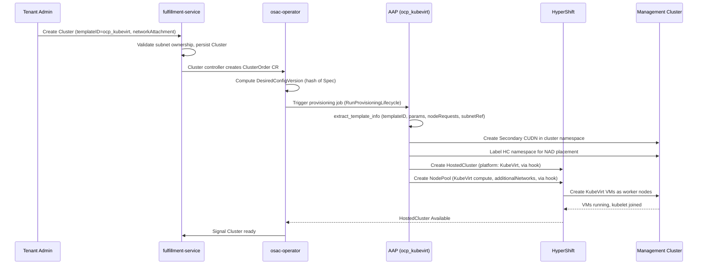

# VM Worker Node Support for CaaS Clusters

## Summary

This design introduces a VM-backed cluster offering as a distinct catalog item alongside the existing bare-metal offering. CaaS exposes two cluster catalog items: **BM** (`ocp_small`, Agent platform) for bare-metal workers and **VM** (`ocp_kubevirt`, KubeVirt platform) for VM-based workers. A tenant selects the VM catalog item at cluster creation time, which sets `platform.type: KubeVirt` immutably on the HostedCluster.

The `ocp_kubevirt` AAP template reuses the HostedCluster lifecycle from `ocp_small` via hooks (`hosted_cluster_modify_definition_hook`, `nodepool_modify_definitions_hook`) as an implementation detail -- hooks avoid duplicating the complex HostedCluster/NodePool lifecycle logic. The template injects KubeVirt platform configuration, VM sizing parameters, and tenant subnet attachment via a Secondary Layer2 CUDN. The fulfillment-service proto already has `network_attachment` on `ClusterSpec`; the ClusterOrder CRD gains a `NetworkAttachments` field to carry this through to AAP. No new CRDs or controllers are introduced. See [PRD](prd.md) for detailed requirements.

## Motivation

CaaS today requires bare-metal worker nodes, limiting adoption to environments with dedicated physical hardware. VM-based workers remove this constraint by running worker nodes as KubeVirt VMs on the management cluster's existing virtualization infrastructure. This improves density (multiple VM clusters per physical host), enables rapid provisioning (minutes vs. hours for bare-metal), and makes CaaS accessible to teams without hardware allocations.

HyperShift supports two platform types: Agent (bare-metal) and KubeVirt (VM). These are fundamentally different install planes with different lifecycle characteristics, so OSAC exposes them as two separate catalog items rather than hiding the distinction behind a single template. A tenant chooses "give me a VM-backed cluster" or "give me a bare-metal cluster" -- both are valid offerings.

The `ocp_kubevirt` template reuses the HostedCluster/NodePool lifecycle from `ocp_small` via hooks as an implementation detail. This avoids duplicating the complex lifecycle logic (namespace creation, RBAC, NodePool management, status tracking) while keeping the two offerings distinct at the catalog and API level.

### Goals

- Expose VM workers as a distinct catalog item backed by a dedicated template (`ocp_kubevirt`) so tenants explicitly choose a VM-backed cluster, not a hidden backend mode of the bare-metal offering.
- Share capacity vocabulary (`resourceClass` / size profiles), tenant network identity (Subnet attachment), and cluster-layer metering with the rest of the platform. Worker lifecycle stays on NodePool + CAPK, not ComputeInstance.
- Keep workers platform-managed: HyperShift/CAPK owns VM lifecycle via NodePools. No tenant-visible ComputeInstances are created for CaaS workers.
- Reuse the existing AAP template hook mechanism (`hosted_cluster_modify_definition_hook`, `nodepool_modify_definitions_hook`) to compose KubeVirt behavior on top of the `ocp_small` base template, avoiding duplication of HostedCluster/NodePool lifecycle logic.
- Carry tenant network attachment from the fulfillment-service API through the ClusterOrder CRD to the AAP template without requiring changes to the operator's reconciliation logic.
- Support the same scaling workflow (add/remove workers via `nodeRequests` update) that bare-metal CaaS uses, with no KubeVirt-specific scaling path.
- Keep VM worker infrastructure (VMs, CUDNs, NADs) invisible to tenants -- tenants interact with the cluster, not the underlying VMs. [Locked: D5]

### Non-Goals

- GPU/accelerator passthrough for VM workers -- handled by OSAC-1373, composable with KubeVirt templates via NodePool `hostDevices` once delivered. [Locked: D1]
- Mixed bare-metal and KubeVirt workers in a single cluster -- HyperShift enforces platform consistency per HostedCluster; all NodePools must share the same `platform.type`.
- Agent-based join for VM workers -- CAPK is the VM install plane. Discovery-boot and Agent registration add unnecessary complexity to VMs (see Alternatives).
- ComputeInstance (or ComputeInstancePool) as CaaS workers -- wrong abstraction layer (tenant-managed VMs vs. platform-managed workers) and technical incompatibilities (namespace, networking, boot mechanism; see Alternatives).
- Single tenant API object for both VMaaS VMs and CaaS workers. Goal is shared catalog and commercial dimensions across both, not a single lifecycle object.
- Single platform-agnostic template for both BM and VM -- `platform.type` is immutable per HostedCluster, and the two offerings have different infrastructure, networking, and lifecycle characteristics.
- Multi-interface networking and east-west traffic for VM workers -- deferred to OSAC-1382. [Locked: D7]
- Autoscaling based on workload utilization.
- Live migration validation and snapshotting/cloning tooling for worker VMs — KubeVirt live migration is handled by the platform automatically; this design does not add or test migration-specific workflows. [Locked: D5]

## Proposal

> **CaaS VM workers are a separate catalog item on HyperShift KubeVirt/CAPK. They are not Agent-joined ComputeInstances and not a hidden mode of the bare-metal catalog item.**

A new AAP template role (`ocp_kubevirt`) implements the VM cluster catalog item. It derives from `ocp_small` using the existing hook and step-override mechanism to reuse HostedCluster lifecycle logic without duplicating it. The template:

1. Sets `hosted_cluster_modify_definition_hook` to replace `platform.type: Agent` with `platform.type: KubeVirt` and configure `baseDomainPassthrough: true` on the HostedCluster definition.
2. Sets `nodepool_modify_definitions_hook` to replace the Agent platform block with KubeVirt-specific fields (compute cores/memory, root volume, `additionalNetworks` for tenant subnet attachment).
3. Overrides `cluster_infra` and `external_access` install/delete steps with noops -- KubeVirt clusters do not require bare-metal infrastructure provisioning or external access configuration beyond what HyperShift provides.
4. Creates a Secondary Layer2 CUDN in the cluster namespace and labels the HostedCluster namespace so the NAD is created there.

On the API side, the fulfillment-service `ClusterSpec` already has a `network_attachment` field (`ClusterNetworkAttachment` with `subnet` and `security_groups`). The ClusterOrder CRD adds a `NetworkAttachments` field (reusing the `NetworkAttachment` type from ComputeInstance), and `extract_template_info` bridges `networkAttachments[0].subnetRef` to `template_parameters.subnet_ref` for the AAP template to consume.

### Workflow Description

**Actors:** Cloud Provider Admin (publishes KubeVirt cluster templates), Tenant Admin (creates subnet, orders cluster), osac-operator (creates ClusterOrder, dispatches AAP jobs), AAP (executes template-driven provisioning), HyperShift (manages HostedCluster and NodePools).

**Starting state:** The platform's VMaaS infrastructure is operational. A storage class capable of provisioning PVs of at least 64 GiB is available. The Cloud Provider Admin has published an `ocp_kubevirt` cluster template in the catalog.

#### Cluster Provisioning



The diagram shows the end-to-end provisioning flow. The key difference from bare-metal CaaS is in steps 6-9: instead of provisioning bare-metal infrastructure, the template creates a CUDN for networking and lets HyperShift create KubeVirt VMs directly.

**Step-by-step:**

1. The Tenant Admin creates a VirtualNetwork and Subnet for their tenant (if not already existing). [Locked: D3]
2. The Tenant Admin calls `Clusters.Create` on the fulfillment-service, specifying `template = "ocp_kubevirt"`, `network_attachment.subnet = "<subnet-id>"`, and `template_parameters` with VM sizing (cores, memory, root volume size). [Locked: D2, D4]
3. The fulfillment-service validates that the tenant owns the referenced subnet and persists the Cluster resource.
4. The fulfillment-service Cluster controller creates a ClusterOrder CR on the management cluster. The controller maps `network_attachment` to `networkAttachments[0]` on the CRD.
5. The osac-operator's ClusterOrder controller computes `DesiredConfigVersion` (FNV-64a hash of the entire Spec, which now includes `networkAttachments`). Because this is a new ClusterOrder, config version mismatch triggers `RunProvisioningLifecycle`, which dispatches an AAP provisioning job. [Codebase: osac/osac-operator/internal/controller/clusterorder_controller.go]
6. The AAP job runs `extract_template_info`, which extracts `template_id`, `template_parameters`, `node_requests`, and bridges `cluster_order.spec.networkAttachments[0].subnetRef` to `template_parameters.subnet_ref`. [Codebase: osac/osac-aap/.../extract_template_info/tasks/main.yaml]
7. The `ocp_kubevirt` template's `pre_install_hook` (or a CUDN-specific step) creates a Secondary Layer2 CUDN in the cluster namespace. It labels the HostedCluster namespace with the CUDN's target label so the CUDN operator creates a NetworkAttachmentDefinition (NAD) in that namespace. This step is required because OCP 4.22 multus namespace isolation blocks cross-namespace NAD references.
8. The `hosted_cluster` service role builds the HostedCluster definition with `platform.type: Agent` (the default), then fires `hosted_cluster_modify_definition_hook`. The `ocp_kubevirt` hook replaces the platform block with `platform.type: KubeVirt, kubevirt: {baseDomainPassthrough: true}`. [Codebase: osac/osac-aap/.../hosted_cluster/tasks/create_hosted_cluster.yaml]
9. The `hosted_cluster` service role builds NodePool definitions with `platform.type: Agent`, then fires `nodepool_modify_definitions_hook`. The `ocp_kubevirt` hook replaces the platform block with KubeVirt-specific fields: `compute` (cores, memory from template parameters), `rootVolume` (size, storage class), and `additionalNetworks` referencing the NAD created in step 7 as `"<hc-namespace>/<nad-name>"`.
10. The `cluster_infra` install step is overridden with a noop -- no bare-metal provisioning needed. Similarly, `external_access` is overridden -- HyperShift manages API server exposure via Routes with `baseDomainPassthrough`. [Codebase: osac/osac-aap/.../ocp_small/tasks/install.yaml step override pattern]
11. HyperShift creates KubeVirt VMs via the `machine-api-provider-kubevirt` (CAPK). VMs boot, kubelets join the HostedCluster.
12. The `wait_for_nodes` and `wait_for_cluster_operators` steps (inherited from `ocp_small`) wait for worker nodes to become Ready and cluster operators to stabilize.
13. The osac-operator detects HostedCluster reaching Available status and signals the fulfillment-service.

#### Scaling (Add/Remove Workers)

Scaling uses the same workflow as bare-metal CaaS. The Tenant Admin calls `Clusters.Update` with a modified `node_sets` count. The fulfillment-service updates the Cluster, the Cluster controller updates `nodeRequests` on the ClusterOrder CR, the operator detects the Spec change via `DesiredConfigVersion` hash mismatch, and dispatches a new AAP job. The `hosted_cluster` service role is idempotent: it creates new NodePools for added node sets, updates existing NodePool replica counts, and deletes NodePools that are no longer needed. For KubeVirt, HyperShift scales VMs directly -- no bare-metal allocation or agent registration is involved. [Locked: D5]

#### Cluster Deletion

The Tenant Admin calls `Clusters.Delete`. The fulfillment-service marks the Cluster for deletion, the Cluster controller triggers ClusterOrder deletion, and the operator dispatches an AAP deprovision job. The `ocp_kubevirt` template's delete pipeline runs: the `hosted_cluster` delete step removes the HostedCluster and NodePools (HyperShift deletes the VMs), and the `pre_delete_hook` or CUDN cleanup step removes the Secondary CUDN. The `cluster_infra` and `external_access` delete steps are noops. The ClusterOrder finalizer prevents premature deletion until AAP confirms cleanup.

### Catalog and UX Model

The catalog item determines the install plane and `platform.type`. BM clusters use `ocp_small` (Agent platform); VM clusters use `ocp_kubevirt` (KubeVirt platform). This follows the same pattern as other capability-shaped templates (e.g., GPU / AI-MaaS offerings) -- distinct catalog entries for distinct infrastructure.

Within a catalog item, `resourceClass` selects shape (VM size, storage profile), not the BM-vs-VM distinction. `resourceClass` on `NodeRequest` maps to VM sizing parameters (vCPU, memory, root volume) in the template, serving the same role as cloud instance types. No separate instance-type resource is needed for CaaS workers. A tenant does not toggle between bare-metal and VM on a single HostedCluster -- they pick the offering that matches their need.

From the tenant perspective: "give me a VM-backed cluster" and "give me a bare-metal cluster" are both first-class choices. Neither is hidden behind the other.

### Shared Catalog, Network Identity, and Metering

This design intentionally shares the tenant-facing capacity model with the rest of OSAC without making workers ComputeInstances.

| Surface | Shared with the platform | Not shared |
|---------|--------------------------|------------|
| **Catalog / instance shape** | Same `resourceClass` definitions back VMaaS sizes and CaaS NodePool templates — one vocabulary of shapes | ComputeInstance create API |
| **Network identity** | Cluster attaches to a Subnet via `networkAttachments` — same Subnet resource used by VMaaS | ComputeInstance Primary UDN / subnet-namespace placement (workers use Secondary UDN in the HostedCluster namespace because a worker is a node, not a tenant app VM) |
| **Billing** | Worker capacity metered at the cluster layer: `node_set × resourceClass × time`, matching ROSA's cluster-level worker metering | Billing each worker as a VMaaS ComputeInstance |
| **Status UX** | Cluster desired/ready worker count | "My VMs" list |
| **Ops inventory** | BMI (metal) or CAPK VirtualMachine (KubeVirt) for platform operators | Tenant-visible ComputeInstance list |

ComputeInstance is not required for shared catalog, billing, or network identity. Those attach to `resourceClass` and cluster metering. CI-as-worker is only required if the platform wants worker **lifecycle** to be the VMaaS API — which conflicts with platform-managed workers and CAPK ownership.

### API Extensions

**Modified CRDs:**

- `ClusterOrder` (osac-operator): add `NetworkAttachments []NetworkAttachment` to `ClusterOrderSpec`. The `NetworkAttachment` type is reused from `ComputeInstance` (`SubnetRef string`, `SecurityGroupRefs []string`). No controller logic changes -- the operator is platform-agnostic; `DesiredConfigVersion` automatically includes the new field since it hashes the entire Spec.

**Modified proto messages:** None. `ClusterSpec.network_attachment` (`ClusterNetworkAttachment` with `subnet` string and `security_groups` repeated string) already exists in the fulfillment-service proto. [Codebase: osac/fulfillment-service/proto/private/osac/private/v1/cluster_type.proto]

**New CRs created at runtime (not new CRD definitions):**

- `ClusterUserDefinedNetwork` (k8s.ovn.org/v1): one Secondary Layer2 CUDN per cluster, created by the AAP template in the cluster namespace. Cleaned up on cluster deletion.

**Operational impact:** If the osac-operator is down, no new clusters are provisioned and scaling operations stall. Existing KubeVirt clusters continue running -- HyperShift manages the HostedCluster independently. If AAP is unavailable, provisioning jobs queue and execute when AAP recovers.

## UX Alignment

This section does not apply. No `@temp-api` file exists for the Cluster resource at `osac-ux/libs/ui-components/src/api/v1/cluster.ts`.

### Implementation Details/Notes/Constraints

#### ClusterOrder CRD Changes

The `ClusterOrderSpec` gains a `NetworkAttachments` field:

```go
type ClusterOrderSpec struct {
    // ... existing fields (TemplateID, TemplateParameters, NodeRequests,
    // PullSecret, SSHPublicKey, ReleaseImage, Network) ...

    // NetworkAttachments specifies the network attachments for the cluster's
    // worker nodes. For KubeVirt clusters, the first attachment's SubnetRef
    // determines the tenant subnet that worker VMs are attached to.
    // +kubebuilder:validation:Optional
    // +kubebuilder:validation:MaxItems=8
    // +listType=map
    // +listMapKey=subnetRef
    NetworkAttachments []NetworkAttachment `json:"networkAttachments,omitempty"`
}
```

The `NetworkAttachment` type already exists in the osac-operator API package for `ComputeInstance`:

```go
type NetworkAttachment struct {
    // SubnetRef is the ID of the Subnet to attach to. Immutable after creation.
    // +kubebuilder:validation:Required
    SubnetRef string `json:"subnetRef"`
    // SecurityGroupRefs are the IDs of the SecurityGroups to apply.
    // +kubebuilder:validation:Optional
    SecurityGroupRefs []string `json:"securityGroupRefs,omitempty"`
}
```

Reusing this type for ClusterOrder is consistent with the unified networking decision that the same Subnet can host VMs, bare-metal servers, and cluster nodes.

#### Fulfillment-Service Cluster Controller

The fulfillment-service's Cluster controller (which syncs `ClusterSpec` to the ClusterOrder CR on the management cluster) must map the proto `network_attachment` to the CRD `networkAttachments`. The mapping is:

| Proto field (`ClusterNetworkAttachment`) | CRD field (`NetworkAttachment`) |
|---|---|
| `network_attachment.subnet` | `networkAttachments[0].subnetRef` |
| `network_attachment.security_groups[]` | `networkAttachments[0].securityGroupRefs[]` |

The proto uses a singular `network_attachment` (one attachment per cluster), while the CRD uses a list (consistent with ComputeInstance's `NetworkAttachments` and future multi-interface support per OSAC-1382). For this design, only index 0 is populated. [Locked: D7]

The Cluster controller's `addExplicitFields` method (`cluster_reconciler_function.go`, line 309) currently maps template, node requests, credentials, and network CIDRs but does **not** propagate `network_attachment`. This mapping must be added so that `network_attachment.subnet` → `networkAttachments[0].subnetRef` and `network_attachment.security_groups` → `networkAttachments[0].securityGroupRefs` are synced to the ClusterOrder CR. [Codebase: fulfillment-service/internal/controllers/cluster/cluster_reconciler_function.go]

#### AAP Template Role: `ocp_kubevirt`

The new template role lives at `osac/osac-aap/collections/ansible_collections/osac/templates/roles/ocp_kubevirt/`.

**Template metadata** (`meta/osac.yaml`):

```yaml
template_type: cluster
default_node_request:
  - resourceClass: kubevirt-standard
    numberOfNodes: 2
spec_defaults:
  release_image: "quay.io/openshift-release-dev/ocp-release:4.18.0-multi"
```

**Install pipeline** (`tasks/install.yaml`):

The template includes `ocp_small` with the following overrides:

| Step | Override | Purpose |
|---|---|---|
| `hosted_cluster_modify_definition_hook` | `ocp_kubevirt/hooks/modify_hosted_cluster` | Replace Agent platform with KubeVirt |
| `nodepool_modify_definitions_hook` | `ocp_kubevirt/hooks/modify_nodepool` | Inject KubeVirt compute, rootVolume, additionalNetworks |
| `cluster_infra` | noop | No bare-metal infrastructure needed |
| `external_access` | noop | HyperShift manages API exposure via Routes |
| `pre_install_hook` | `ocp_kubevirt/hooks/pre_install` | Create Secondary CUDN, label HC namespace |

**Delete pipeline** (`tasks/delete.yaml`):

```yaml
- name: Include base template delete
  ansible.builtin.include_role:
    name: osac.templates.ocp_small
    tasks_from: delete
  vars:
    cluster_infra_override: "osac.service.noop"
    external_access_override: "osac.service.noop"
    pre_delete_hook: "ocp_kubevirt/hooks/pre_delete"
```

The `pre_delete_hook` removes the Secondary CUDN created during install.

#### HostedCluster Hook: `modify_hosted_cluster`

This hook fires after the `hosted_cluster` service role builds the HostedCluster definition and before it is applied to the cluster. The hook modifies the in-memory definition:

```yaml
# hooks/modify_hosted_cluster/tasks/main.yaml
- name: Set KubeVirt platform on HostedCluster
  ansible.builtin.set_fact:
    hosted_cluster_definition: >-
      {{ hosted_cluster_definition | combine({
        'spec': {
          'platform': {
            'type': 'KubeVirt',
            'kubevirt': {
              'baseDomainPassthrough': true
            }
          }
        }
      }, recursive=true) }}
```

`baseDomainPassthrough: true` configures HyperShift to use the management cluster's wildcard DNS for the guest cluster's API and ingress routes, eliminating the need for a separate external DNS configuration.

#### NodePool Hook: `modify_nodepool`

This hook fires after the `hosted_cluster` service role builds NodePool definitions and before they are applied. It replaces the Agent platform block with KubeVirt configuration:

```yaml
# hooks/modify_nodepool/tasks/main.yaml
- name: Set KubeVirt platform on NodePools
  ansible.builtin.set_fact:
    nodepool_definitions: >-
      {{ nodepool_definitions | map('combine', {
        'spec': {
          'platform': {
            'type': 'KubeVirt',
            'kubevirt': {
              'compute': {
                'cores': template_parameters.cores | default(4) | int,
                'memory': template_parameters.memory | default('16Gi')
              },
              'rootVolume': {
                'type': 'Persistent',
                'persistent': {
                  'size': template_parameters.root_volume_size | default('120Gi'),
                  'storageClassName': template_parameters.storage_class | default('ocs-storagecluster-ceph-rbd-virtualization')
                }
              },
              'additionalNetworks': [
                {
                  'name': cudn_nad_namespace + '/' + cudn_nad_name
                }
              ]
            }
          }
        }
      }, recursive=true) | list }}
```

VM sizing parameters (`cores`, `memory`, `root_volume_size`, `storage_class`) come from `template_parameters`, set by the tenant at cluster creation time. Defaults match a reasonable development cluster profile. [Locked: D4]

#### Secondary CUDN for Tenant Networking

The `pre_install` hook creates a Secondary Layer2 ClusterUserDefinedNetwork (CUDN) to provide tenant subnet connectivity to the HostedCluster namespace:

```yaml
# hooks/pre_install/tasks/main.yaml
- name: Look up Subnet CIDR
  kubernetes.core.k8s_info:
    api_version: osac.openshift.io/v1alpha1
    kind: Subnet
    name: "{{ template_parameters.subnet_ref }}"
    namespace: "{{ networking_namespace }}"
  register: subnet_info

- name: Create Secondary CUDN
  kubernetes.core.k8s:
    state: present
    definition:
      apiVersion: k8s.ovn.org/v1
      kind: ClusterUserDefinedNetwork
      metadata:
        name: "{{ cluster_name }}-tenant-net"
      spec:
        namespaceSelector:
          matchLabels:
            osac.openshift.io/cudn: "{{ cluster_name }}-tenant-net"
        network:
          layer2:
            role: Secondary
            subnets:
              - cidr: "{{ subnet_info.resources[0].spec.cidr }}"

- name: Label HostedCluster namespace for NAD placement
  kubernetes.core.k8s:
    state: present
    definition:
      apiVersion: v1
      kind: Namespace
      metadata:
        name: "{{ hc_namespace }}"
        labels:
          osac.openshift.io/cudn: "{{ cluster_name }}-tenant-net"
```

The CUDN creates a NAD in every namespace matching the label selector. By labeling the HostedCluster namespace, the NAD is created there -- which is required because OCP 4.22 multus namespace isolation blocks cross-namespace NAD references. The NodePool's `additionalNetworks` then references `"<hc-namespace>/<nad-name>"`.

The Subnet CIDR is looked up from the Subnet CR rather than requiring the caller to pass it as a separate template parameter. This avoids a mismatch between the referenced subnet and the CIDR used for the CUDN.

#### extract_template_info Bridge

The `extract_template_info` service role is extended to bridge `networkAttachments` from the ClusterOrder CR into `template_parameters`:

```yaml
# Addition to extract_template_info/tasks/main.yaml
- name: Extract subnet reference from network attachments
  ansible.builtin.set_fact:
    template_parameters: >-
      {{ template_parameters | combine({
        'subnet_ref': cluster_order.spec.networkAttachments[0].subnetRef
      }) }}
  when: cluster_order.spec.networkAttachments is defined and
        cluster_order.spec.networkAttachments | length > 0
```

This bridges the structured CRD field into the flat `template_parameters` dict that templates consume. The template accesses `template_parameters.subnet_ref` when creating the CUDN. [Locked: D3]

#### GPU Integration Point (OSAC-1373)

The KubeVirt NodePool `platform.kubevirt` block supports `hostDevices`:

```yaml
hostDevices:
  - deviceName: "nvidia.com/A100"
    count: 1
```

When OSAC-1373 delivers `AcceleratorRequest` on `NodeRequest`, the `modify_nodepool` hook can map accelerator requests to `hostDevices` entries. No changes in this design are needed -- the hook is the integration point. [Locked: D1]

#### Networking Evolution

Phase 1 provides tenant subnet attachment (north-south) via Secondary Layer2 CUDN. The networking API is unified: both ComputeInstance and CaaS workers attach to a Subnet via `networkAttachments`. The backend implementation differs because the VM serves a different purpose. A ComputeInstance is the workload itself — it belongs on the tenant network as its primary identity (Primary UDN, placed in the subnet namespace). A CaaS worker is a cluster node — it needs the pod network for control-plane communication alongside the tenant network for workload traffic (Secondary UDN, placed in the HostedCluster namespace). This is a correct architectural difference, not a gap: using Primary UDN for CaaS workers would break pod-network connectivity to the hosted control plane.

| Phase | Mechanism | Status | Jira |
|---|---|---|---|
| Phase 1 | Secondary Layer2 CUDN + namespace labeling | This design | OSAC-1589 |
| Phase 2 | Unified networking dispatcher + OVN-k8s EVPN k8s manager | In progress | OSAC-1433, OSAC-1717 |
| Phase 3 | Multi-interface east-west + SR-IOV for VMs | Design merged (EP #179), bare-metal only in Phase 1 | OSAC-1382 |

Target architecture for Phase 2: `network_attachment` on ClusterSpec flows to the unified dispatcher, which selects the appropriate k8s manager (OVN-k8s EVPN) to create a NAD in the HostedCluster namespace. The NodePool's `additionalNetworks` reference remains the same -- only the mechanism that creates the NAD changes. The path is: `network_attachment` -> dispatcher -> k8s manager -> NAD in HC namespace -> CAPK `additionalNetworks`.

In Phase 3, KubeVirt workers gain multi-interface support via SR-IOV passthrough on NodePools. The `networkAttachments` list (already supporting up to 8 entries) maps to multiple `additionalNetworks` entries. East-west traffic (GPU-to-GPU, L3VPN) requires a FabricDomain mechanism to reference VM workers -- this is deferred to OSAC-1382. [Locked: D6, D7]

#### Metering

CaaS worker metering follows the same pattern as ROSA: meter at the cluster/NodePool layer, not per individual VM. OSAC's metering pipeline (`osac-metering`) currently maps only ComputeInstance events. A new `clusterOrderMapper` is needed to read from the Cluster/ClusterOrder Watch stream and emit billing events with dimensions such as `template_id`, `node_set_count`, `resource_class`, and `duration`. The billing formula is: `node_set × resourceClass × time`, derived from ClusterOrder status — no ComputeInstance involvement is required.

This matches industry practice: ROSA bills per-vCPU at the cluster layer, not per-EC2-instance. The compute primitive (EC2 for ROSA, KubeVirt VM for OSAC) is an infrastructure detail, not a billing entity.

#### Base Template Rename

The base cluster template was renamed from `ocp_4_17_small` to `ocp_small` upstream. The `ocp_kubevirt` template must reference `ocp_small` (the current name), not the old name.

### Security Considerations

This design inherits the existing CaaS security model without changes. Tenant isolation is enforced at two levels:

1. **API level:** The fulfillment-service validates subnet ownership on `Clusters.Create` -- a tenant can only reference subnets they own. Cross-tenant subnet references are rejected. OPA policies enforce tenant scoping on all public API operations.

2. **Infrastructure level:** Worker VMs run in a HostedCluster namespace on the management cluster. Tenants have no direct access to the management cluster -- they interact only through the fulfillment-service API and the guest cluster's API server. The CUDN, NAD, and underlying VMs are not visible to tenants.

The `network_attachment.subnet` field is immutable after creation (enforced by the fulfillment-service proto `IMMUTABLE` field behavior annotation), preventing a tenant from moving an existing cluster to a different subnet.

No changes to authentication, authorization, or OPA policies are required.

### Failure Handling and Recovery

| Failure Mode | What Happens | Recovery | Tenant Observes |
|---|---|---|---|
| CUDN creation fails | AAP job fails at `pre_install` hook | AAP job reports failure. Operator marks ClusterOrder as failed. Retry via config version bump or manual re-trigger. | Cluster stuck in Provisioning |
| HostedCluster creation fails | AAP job fails at `hosted_cluster` step | Same as above -- AAP job failure triggers operator retry via `RunProvisioningLifecycle`. | Cluster stuck in Provisioning |
| NodePool VM creation fails (insufficient resources) | HyperShift reports NodePool degraded; VMs pending | HyperShift retries VM creation. If persistent (no capacity), NodePool stays degraded. Operator reflects HostedCluster status to tenant. | Cluster shows partial readiness or Degraded condition |
| NAD not created in HC namespace (label missing) | NodePool VMs cannot attach to tenant network; VMs fail to start or start without connectivity | AAP job must label the namespace before creating NodePools. If labeling fails, the job fails and retries. | Cluster stuck in Provisioning |
| Subnet does not exist or tenant does not own it | Fulfillment-service rejects `Clusters.Create` with validation error | Tenant corrects the subnet reference. | API error: invalid subnet reference |
| AAP job timeout | AAP deprovision or provision job exceeds time limit | Operator retries the job. Jobs are idempotent -- partial state is reconciled on retry. | Cluster stuck in Provisioning or Deleting |
| Management cluster storage exhausted | KubeVirt VM root volumes cannot be provisioned | VMs stay pending. HyperShift reports NodePool degraded. Admin must add storage capacity. | Cluster shows degraded workers |
| CUDN cleanup fails on deletion | CUDN remains after HostedCluster is deleted | AAP delete hook retries CUDN deletion. If the namespace is deleted (HostedCluster teardown), resources in it are garbage-collected. Orphaned CUDNs are cluster-scoped and require manual cleanup. | Cluster deletion completes but orphaned CUDN remains (platform-level, not tenant-visible) |
| Controller restart mid-reconciliation | Operator resumes from current state | `DesiredConfigVersion` comparison re-triggers AAP if the job did not complete. Completed jobs are not re-run (provisioning lifecycle checks config version match). | Temporary stall, no data loss |

### RBAC / Tenancy

No RBAC or tenancy changes are required. The ClusterOrder CRD gains a new spec field (`networkAttachments`), but it does not introduce new resources or change access patterns. The osac-operator already has permissions to create namespaces and CRs in cluster namespaces -- the CUDN and namespace labeling use the same permissions.

Tenant isolation for subnet references is enforced by the fulfillment-service at the API level (subnet ownership validation on `Clusters.Create`). The operator trusts the ClusterOrder CR's `networkAttachments` because it was validated upstream.

### Observability and Monitoring

No new observability changes. Existing monitoring mechanisms apply:

- AAP job success/failure is tracked by the operator's provisioning lifecycle and existing metrics.
- HostedCluster and NodePool conditions are standard HyperShift observability.
- KubeVirt VM metrics (CPU, memory, disk) are exposed by the existing KubeVirt monitoring stack.

KubeVirt exposes per-VM metrics (CPU, memory, disk I/O) via the existing monitoring stack, readable from both the VirtualMachineInstance and the guest cluster's node-level metrics. No additional instrumentation is needed for CaaS workers beyond what the platform already provides.

The KubeVirt template adds no new Prometheus metrics, Kubernetes events, or structured log events beyond what the base `ocp_small` template and HyperShift already produce.

### Risks and Mitigations

| Risk | Impact | Mitigation |
|---|---|---|
| MCE `routeSelector` interference | MCE adds a `routeSelector` to the IngressController that excludes HyperShift routes, breaking API server access for KubeVirt HostedClusters | Remove the `routeSelector` from the IngressController or configure the `hypershift-local-hosting` component not to manage it. Documented in the deployment runbook. |
| CUDN CIDR conflicts | If the Subnet CIDR overlaps with the management cluster's pod or service CIDR, OVN routing breaks | The Subnet CIDR is validated at Subnet creation time by the fulfillment-service. The CUDN uses the same CIDR -- no additional validation is needed at the template level. |
| Multus namespace isolation changes in future OCP versions | If OCP relaxes namespace isolation for NADs, the namespace labeling step becomes unnecessary but harmless | The labeling step is idempotent and does not break if namespace isolation is relaxed. No mitigation needed. |
| Template parameter validation | Invalid VM sizing parameters (0 cores, negative memory) reach AAP unchecked | AAP template should validate parameters before creating NodePools. Invalid parameters cause the AAP job to fail with a descriptive error, which the operator surfaces as a ClusterOrder condition. |

### Drawbacks

**Catalog split:** BM and VM are separate offerings, not one abstract cluster type. Tenants must choose upfront. This is intentional (HyperShift `platform.type` is immutable, and the two offerings have different infrastructure characteristics), but it means a tenant cannot convert an existing bare-metal cluster to VM or vice versa.

**No mixed workers:** A single HostedCluster cannot mix bare-metal and KubeVirt workers. HyperShift enforces `platform.type` consistency across all NodePools. If mixed workers are needed in the future, it would require either upstream HyperShift changes or a federation approach across two HostedClusters.

**Hook coupling to `ocp_small` internals:** The hook-based template composition requires understanding the base template's internal variable names (`hosted_cluster_definition`, `nodepool_definitions`) to write correct hooks. These variables are not a formal API -- they are implementation details of the `ocp_small` template and `hosted_cluster` service role. If the base template refactors these variables, the KubeVirt hooks break. The alternative (a standalone template that duplicates the HostedCluster/NodePool lifecycle) avoids this coupling but duplicates significant logic and drifts when the base template evolves. The hook approach is preferred because the HostedCluster/NodePool lifecycle is complex (namespace creation, RBAC, NodePool management, status tracking) and maintaining two copies increases the risk of divergence.

**Phase 1 networking is interim:** The Secondary CUDN approach works but does not integrate with the fabric manager or provide the same level of control (ACLs, IP allocation, metering) that the unified networking architecture will offer. Templates deployed with Secondary CUDN will need to be migrated when the unified networking dispatcher (OSAC-1433) is ready. The migration path is: replace the CUDN creation step with a dispatcher call, keeping the NAD reference on NodePools unchanged.

## Alternatives (Not Implemented)

### Agent Platform for VM Workers

Boot VMs, run assisted discovery, and join them as Agents so everything stays on `platform.type: Agent`. This would avoid a separate template by making VMs look like bare-metal to HyperShift.

**Rejected:**
- **Ongoing assisted cost on every add/replace:** each VM scale-up requires discovery boot, Agent registration, correlation, and bind/unbind. An InfraEnv would already exist on the Agent platform, but the per-VM overhead of discovery-boot and Agent registration remains on every scale operation. Assisted-installer was designed for environments without existing infrastructure integration (bare-metal, VMware); OSAC already has infrastructure integration via CAPK, making the assisted path unnecessary indirection.
- **Multi-resource invariant for scale/repair:** CI Running + Agent registered + Agent bound + NodePool healthy all fail independently, creating a fragile state machine for an operation that CAPK handles atomically.
- **Loses the boot speed advantage of VMs:** discovery-join adds minutes of overhead per VM. VM workers can boot directly via CAPK; forcing them through Agent discovery negates the provisioning speed benefits that motivated this feature.
- **Does not avoid the fork:** it just hides the BM/VM distinction by making VMs as complex as bare-metal, without the simplicity gains of CAPK.

### ComputeInstance + CAPK

Create ComputeInstances for worker VMs and have CAPK adopt them.

**Rejected -- four technical incompatibilities:**
- **Namespace mismatch:** ComputeInstance places VMs in the subnet namespace (Primary UDN networking). CAPK requires VMs in the HostedCluster namespace. CAPK cannot manage cross-namespace VMs.
- **Network model:** ComputeInstance uses Primary UDN; CAPK uses Secondary `additionalNetworks`. These are fundamentally different OVN network types.
- **Boot mechanism:** ComputeInstance uses cloud-init/sysprep; HyperShift workers require ignition. The boot payload is incompatible.
- **Dual ownership:** Ansible-managed ComputeInstance lifecycle vs. CAPK-managed VM lifecycle creates competing controllers for the same VMs.

### ComputeInstance + Agent (No CAPK)

Create ComputeInstances, boot them with discovery images, and join them as Agents -- bypassing CAPK entirely.

**Rejected:** Clears the CAPK namespace issue but retains:
- **Dual inventory:** CI state + Agent state + NodePool state must all be consistent. Every scale/repair operation requires coordinating across three resource types.
- **Special-case networking and boot config:** CIs use Primary UDN and cloud-init; CaaS workers need ignition and Secondary network attachment. The "stock CI" is not actually reusable without significant per-operation customization.
- **Permanent coupling:** every scale, repair, and replace operation requires the full assisted-installer pipeline, not just a NodePool replica change.

### ComputeInstancePool / VMPool for CaaS

A future VMaaS concept where one object manages N tenant VMs.

**Rejected for CaaS (valid for VMaaS):** A pool abstraction is the right direction for VMaaS workloads but does not replace NodePool + CAPK for CaaS. A pool sitting beside CAPK either competes for VM ownership (dual controller) or sits in front of Agent (inheriting all the Agent-join costs above). CaaS workers are not tenant VMs -- they are platform-managed nodes owned by HyperShift.

### ComputeInstance for VM Workers (Abstraction Mismatch)

Create KubeVirt VMs as ComputeInstances and have them join the cluster as workers. **Rejected:** ComputeInstance is tenant-managed -- tenants see, control, and directly interact with each VM (start, stop, delete, console). CaaS workers are platform-managed -- HyperShift manages VM lifecycle via NodePools, and tenants should not see or act on the underlying VMs. The unified networking EP explicitly lists ComputeInstance, Cluster, and BaremetalInstance as three separate first-class types. Using ComputeInstance for CaaS workers would require either bypassing HyperShift's NodePool management (losing scaling, health checking, rolling updates) or creating a parallel reconciliation path that fights with HyperShift for VM ownership.

This design follows the same pattern as ROSA HCP on AWS: CAPA creates EC2 instances directly from the NodePool spec — there is no separate "compute instance" resource between CAPA and the VM. In OSAC, CAPK is the equivalent of CAPA. Both create VMs directly from the NodePool spec in a single hop. EC2 instances backing ROSA workers are not the customer's general-purpose VMs — they are cluster capacity owned by the control plane. Similarly, KubeVirt VMs backing OSAC CaaS workers are not tenant ComputeInstances — they are cluster capacity managed by HyperShift. If OSAC needs metering, instance types, or observability for CaaS workers, those should be added to the NodePool/CAPK path (matching ROSA), not by routing through ComputeInstance (adding a layer ROSA does not have).

**"Unified UX" does not require CI-as-worker.** The surfaces people associate with unified UX — shared sizing vocabulary, network identity, billing shape — are delivered by `resourceClass`, `networkAttachments`, and cluster-layer metering (see "Shared Catalog, Network Identity, and Metering" above). CI-as-worker is only required if the platform wants worker lifecycle to be the VMaaS API. That either exposes cluster nodes as tenant VMs (violating platform-managed workers) or requires building invisible "system CIs" that cannot be started, stopped, consoled, or listed — which is new work that reimplements CAPK without reusing ComputeInstance's actual UX.

### Standalone KubeVirt Template (No Hook Delegation)

Write a complete template that creates HostedCluster and NodePools with KubeVirt configuration directly, without delegating to `ocp_small`. **Rejected:** The HostedCluster lifecycle is substantial -- namespace creation, RBAC setup, NodePool management, kubeconfig retrieval, wait-for-nodes, wait-for-cluster-operators. Duplicating this logic creates a maintenance burden and drift risk. The hook mechanism exists precisely to support platform variations without duplication.

### Operator-Driven VM Creation (BareMetalWorkerReconciler Pattern)

Follow the bare-metal CaaS design (EP #198) with a `VMWorkerReconciler` in osac-operator that creates VMs via the private API. **Rejected for this phase:** The bare-metal design needs a separate controller because Agent-based provisioning requires complex correlation (InfraEnv, ignition, MAC-based Agent matching) that AAP cannot handle reactively. KubeVirt provisioning has none of these requirements -- HyperShift's CAPK provider creates and manages VMs directly from the NodePool spec. An operator-driven approach adds unnecessary complexity when the AAP hook mechanism suffices.

### Primary CUDN Instead of Secondary

Use a Primary CUDN (which replaces the default pod network) instead of a Secondary CUDN. **Rejected:** Primary CUDNs replace OVN-Kubernetes as the default network for the namespace, which would affect all pods in the HostedCluster namespace -- not just the worker VMs. A Secondary CUDN adds a network alongside the default, which is the correct model for attaching VMs to a tenant subnet without disrupting the control plane pods that also run in the HostedCluster namespace.

## Open Questions

No open questions remain. All design questions have been resolved during drafting and revision.

## Test Plan

### Unit Tests

- `ocp_kubevirt` hook `modify_hosted_cluster`: verify the HostedCluster definition's platform type is changed from `Agent` to `KubeVirt` with `baseDomainPassthrough: true`.
- `ocp_kubevirt` hook `modify_nodepool`: verify NodePool definitions' platform type is changed from `Agent` to `KubeVirt` with correct compute, rootVolume, and additionalNetworks.
- `ocp_kubevirt` hook `modify_nodepool`: verify default VM sizing parameters are applied when template parameters are missing.
- `extract_template_info`: verify `subnetRef` is bridged from `networkAttachments[0]` to `template_parameters.subnet_ref`.
- `extract_template_info`: verify no `subnet_ref` is set when `networkAttachments` is empty.
- ClusterOrder CRD: verify `NetworkAttachments` field serialization/deserialization round-trips correctly.
- Fulfillment-service Cluster controller: verify `network_attachment` proto field maps to `networkAttachments[0]` on the ClusterOrder CR.
- Fulfillment-service Cluster controller: verify `subnet` immutability is enforced on `Clusters.Update`.

### Integration Tests

- AAP integration: load a ClusterOrder fixture with `networkAttachments` and `templateID: ocp_kubevirt`. Run the install pipeline with `cluster_infra` and `external_access` overridden to noop. Verify the HostedCluster definition has KubeVirt platform type and the NodePool definitions have KubeVirt compute configuration.
- AAP integration: verify CUDN creation with the correct CIDR from the Subnet CR. Verify HC namespace is labeled for NAD placement.
- AAP integration: run the delete pipeline. Verify CUDN is deleted and `cluster_infra`/`external_access` delete steps are noops.
- osac-operator integration: create a ClusterOrder with `networkAttachments` in a kind cluster. Verify `DesiredConfigVersion` hash includes the network attachment data (changing `networkAttachments` changes the hash).

### E2E Tests

- Full provisioning: create a Cluster with `template: ocp_kubevirt` and a valid `network_attachment` via the fulfillment-service public API. Verify the HostedCluster reaches Available, NodePool VMs are running, and worker nodes join the guest cluster. (Requires a management cluster with KubeVirt, HyperShift, and a storage class.)
- Scaling: increase `node_sets[0].size` on an existing KubeVirt cluster. Verify new VMs are created and new workers join.
- Scale-down: decrease `node_sets[0].size`. Verify VMs are deleted and workers are removed from the guest cluster.
- Cluster deletion: delete a KubeVirt cluster. Verify all VMs, the CUDN, and the HostedCluster are cleaned up.
- Network isolation: create two clusters in different tenants. Verify each cluster's workers are attached to their respective tenant subnets and cannot reach the other tenant's network.
- Invalid subnet: attempt to create a cluster with a subnet owned by a different tenant. Verify the API rejects the request.

Note: full E2E tests require a management cluster with KubeVirt (CNV), MCE/HyperShift, and a CUDN-capable OVN-Kubernetes. Initial E2E coverage may be limited to API-level verification with mocked AAP responses.

## Graduation Criteria

Graduation criteria will be defined when targeting a release. Expected stages: Dev Preview -> Tech Preview -> GA based on production deployment feedback.

## Upgrade / Downgrade Strategy

This is a new cluster template with a new CRD field. No existing clusters are affected.

**Upgrade:** The `ocp_kubevirt` template role is deployed alongside existing templates. The `NetworkAttachments` field on ClusterOrder is additive -- existing ClusterOrders without network attachments continue to work. No migration is required.

**Downgrade:** Remove the `ocp_kubevirt` template from the catalog. Existing KubeVirt clusters continue running (HyperShift manages them independently) but cannot be scaled or reprovisioned without the template. To fully revert, delete all KubeVirt-backed clusters, remove the template role, and revert the ClusterOrder CRD (the older controller ignores the `networkAttachments` field if present).

## Version Skew Strategy

The fulfillment-service and osac-operator must be upgraded together or the fulfillment-service first (it must map `network_attachment` to `networkAttachments` on the CRD before the operator can consume it). The AAP template is deployed independently and is backward-compatible -- AAP reads whatever fields exist on the ClusterOrder CR.

If the osac-operator is upgraded before the fulfillment-service, ClusterOrders created without `networkAttachments` work (bare-metal templates do not use this field). KubeVirt cluster creation fails gracefully because `extract_template_info` finds no `subnet_ref` and the template's CUDN creation step fails with a descriptive error.

## Support Procedures

**Detecting failures:**
- Cluster stuck in Provisioning: check ClusterOrder conditions on the management cluster. Check AAP job logs for the provisioning job.
- NodePool degraded: `oc get nodepool -n <hc-namespace>` -- check conditions for VM scheduling failures, storage provisioning errors, or network attachment issues.
- CUDN not created: `oc get clusteruserdefinednetwork <cluster-name>-tenant-net` -- check if it exists and its status.
- NAD not in HC namespace: `oc get net-attach-def -n <hc-namespace>` -- verify the NAD was created by the CUDN operator.
- Worker VMs not starting: `oc get vmi -n <hc-namespace>` -- check VirtualMachineInstance status for scheduling, storage, or network errors.

**Disabling the feature:**
- Remove the `ocp_kubevirt` template from the catalog. No new KubeVirt clusters can be created.
- Existing clusters continue running -- HyperShift manages them independently.
- Scaling operations on existing KubeVirt clusters fail because the template is unavailable (AAP cannot run the provisioning job).
- Cluster deletion still works if the AAP template role files remain on disk (AAP references the role by name, not by catalog entry).

**Recovery:**
- Re-add the template to the catalog. AAP jobs resume on the next operator reconciliation cycle.
- If a CUDN is orphaned after cluster deletion, delete it manually: `oc delete clusteruserdefinednetwork <name>`.

## Infrastructure Needed

No new infrastructure. The feature uses existing components: osac-operator deployment, fulfillment-service API, AAP, HyperShift, and KubeVirt on the management cluster.

Documentation updates required:
- Cloud Provider Admin guide: KubeVirt cluster template creation and catalog registration.
- Tenant Admin guide: ordering a VM-backed cluster with network attachment.
- Deployment prerequisites: KubeVirt (CNV), MCE/HyperShift with KubeVirt platform support, OVN-Kubernetes with CUDN support, storage class for VM root volumes.
- MCE routeSelector workaround (removal or hypershift-local-hosting configuration).
