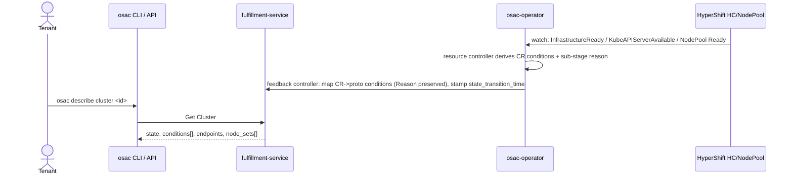

# Granular Cluster Status Reporting

## Summary

This design makes CaaS cluster status as granular as VMaaS made ComputeInstance
status in OSAC-1027. It fixes the osac-operator feedback controller that today
collapses every ClusterOrder condition into a single fulfillment `PROGRESSING`
condition, derives per-stage provisioning progress and orthogonal health
signals from the HyperShift `HostedCluster`/`NodePool` state the operator
already watches, adds per-node-set readiness to the `Cluster` proto, and renders
all of it through `osac describe cluster`. See [PRD](prd.md) for detailed
requirements.

## Motivation

A tenant provisioning a CaaS cluster sees only `PROGRESSING` from creation until
the cluster is fully `READY`, then `FAILED` if anything goes wrong. Cluster
provisioning takes far longer than a VM (infrastructure, then the hosted control
plane, then worker nodes joining), so this single-state opacity is more painful
here than it was for VMs.

The granular signals already exist. The HyperShift `HostedCluster` exposes
`InfrastructureReady`, `KubeAPIServerAvailable`, `Available`, and `Degraded`
conditions; each `NodePool` exposes `Ready`, `AllMachinesReady`, and
`AllNodesHealthy`. The osac-operator's ClusterOrder resource controller already
watches these and sets its own CR conditions (`ControlPlaneCreated`,
`ControlPlaneAvailable`, `ClusterAvailable`, ...). The information is then thrown
away at the operator's feedback boundary: `syncClusterOrderConditions` maps four
CR condition types into the one proto `CLUSTER_CONDITION_TYPE_PROGRESSING` slot
(last-writer-wins) and never copies the condition `Reason`
[Codebase: osac-operator/internal/controller/feedback_controller.go:148-161]. The
ComputeInstance feedback controller does the opposite - a 6-to-6 table-driven map
that preserves `Reason`
[Codebase: osac-operator/internal/controller/computeinstance_feedback_controller.go:122-148]
- which is the model this design adapts for clusters.

Because the private `Events.Watch` stream that metering consumes already carries
the full `Cluster` object including its conditions, enriching the model and the
operator mapping is sufficient to propagate granular status to every consumer
(API, CLI, and the metering stream) with no new stream contract.

### Goals

- Reuse the OSAC-1027 pattern: orthogonal condition types for independent health
  axes, plus condition `Reason` for provisioning sub-stage, mapped 1-to-1 from CR
  to proto with `Reason` preserved.
- Derive all granular signals from HyperShift `HostedCluster`/`NodePool` state
  the operator already watches - no upstream (HyperShift) changes, no AAP role
  changes [Locked: D4].
- Keep the existing watch-driven propagation path; add no new RPCs, no database
  migration (status is JSON-serialized protobuf), and no new stream.
- Make status observable identically through the public and private API and the
  CLI, so any UI built on the API is automatically consistent.

### Non-Goals

- UI implementation. The web console (AC-7 / IS-6) consumes the same public API
  this design defines; the console changes are owned by the osac-ux team and are
  out of scope for this document. See the UX Alignment section.
- Metering consumption and billing logic. Closing billing on teardown and
  per-state usage accounting is the separate linked Feature OSAC-4077; this
  design only guarantees the producer-side signals it depends on.
- VMaaS and BMaaS status (VMaaS is OSAC-1027; BMaaS is separate) [Locked: D2].
- Cluster upgrade status (OSAC-1415) and power-state phases - clusters have no
  start/stop/pause [Locked: D1].
- End-user documentation authoring. This EP defines the condition model and the
  `describe` output normatively; publishing that into user-facing docs (osac-docs)
  is done with the implementation task, not authored here - consistent with the UI
  being deferred to osac-ux.
- A true per-node "X of Y ready" health count. Not reachable at the pinned
  HyperShift version (see the resource-controller section); `ready_replicas` is
  binary until a follow-up bumps HyperShift or adds Cluster-API access.

## Proposal

The change spans two components in the `osac` mono-repo, in dependency order:

1. **fulfillment-service (proto + CLI + tables).** Add two orthogonal
   `ClusterConditionType` values (`CONTROL_PLANE_AVAILABLE`, `WORKERS_READY`),
   populate the `PROGRESSING` condition's `Reason` with the current provisioning
   sub-stage, and extend `ClusterNodeSet` with desired/current/ready replica counts
   and a per-set state. Render conditions, endpoints, and node-set status in
   `osac describe cluster`, and add STAGE/HEALTH columns to the list tables.
2. **osac-operator (feedback + resource controllers).** Replace the
   collapse in `syncClusterOrderConditions` with a table-driven map that
   preserves `Reason`; derive granular CR conditions and sub-stage reasons from
   HyperShift signals in `clusterorder_controller.go`; stamp
   `state_transition_time` on every state change; add an `EventRecorder` for
   transition events; and fix the single-NodePool limitation so per-node-set
   status is accurate.

No change is needed in the fulfillment generic server, the events server, or the
`Events.Watch` stream - they already serialize and forward the full object.

### Workflow Description

Actors: **Tenant User** (sees their own clusters), **Cloud Provider Admin**
(sees all clusters); status content is identical for both, per the PRD.

Starting state: a Tenant User has submitted a cluster order; the osac-operator
has created a ClusterOrder CR and a HyperShift `HostedCluster`.

Happy-path provisioning, as observed via `osac describe cluster <id>` or the API:

1. **Preparing infrastructure.** State `PROGRESSING`; condition `PROGRESSING`
   True, reason naming the initial provisioning sub-stage.
   `CONTROL_PLANE_AVAILABLE` and `WORKERS_READY` False.
2. **Control plane starting.** HyperShift `InfrastructureReady` True →
   `PROGRESSING` reason advances to the control-plane-starting sub-stage.
3. **Control plane available.** HyperShift `KubeAPIServerAvailable`/`Available`
   True → `CONTROL_PLANE_AVAILABLE` flips True; `api_endpoint`/`api_url`
   populated; `PROGRESSING` reason advances to the workers-joining sub-stage.
4. **Workers joining → ready.** As nodes join, per-node-set `current_replicas`
   climbs toward `desired_replicas`; `ready_replicas` stays `0` until the
   `NodePool` reports `Ready`/`AllNodesHealthy`, then equals `current_replicas`
   (binary at this HyperShift pin - see the resource-controller section). When all
   sets are ready, `WORKERS_READY` flips True.
5. **Ready.** State `READY`; condition `AVAILABLE` True; `PROGRESSING` False.
   `state_transition_time` stamped at the transition.



Variations:

- **Degraded (AC-3).** Control plane healthy but a NodePool reports
  `AllNodesHealthy` False (some workers failed to join): `CONTROL_PLANE_AVAILABLE`
  stays True, `WORKERS_READY` False, and `DEGRADED` True with a reason naming the
  affected node set. Overall state stays `READY` if the control plane is usable,
  so degradation is visible without masking availability.
- **Degraded → recovered.** There is no explicit clearing logic: status is
  idempotently re-derived from observed HyperShift state on every reconcile, so
  once HC `Degraded` is False again and every NodePool reports `Ready` AND
  `AllNodesHealthy`, `DEGRADED` clears to False, `WORKERS_READY` flips back True,
  and the `AVAILABLE` condition returns True. The same bidirectional re-derivation
  applies to `Scaling` (clears when the resized set reaches `desired_replicas`).
- **Stalled (AC-2).** The current `PROGRESSING` reason has not advanced within its
  stage threshold: reason becomes `Stalled` (message names the stuck stage). The
  cluster is not marked `FAILED` - it may still recover.
- **Stage unknown (AC-9).** The operator cannot read HyperShift signals (remote
  cluster temporarily unreachable, conditions absent): `PROGRESSING` reason is
  `StageUnknown` rather than a stale prior stage.
- **Scaling (AC-4).** A Tenant User changes a node set's size on a `READY`
  cluster: the affected `ClusterNodeSet.state` becomes `Scaling` with
  `ready_replicas` < `desired_replicas`, and `WORKERS_READY` goes False with
  reason `Scaling`, while overall state stays `READY`.
- **Deletion (AC-5).** On delete, state `DELETING`; `PROGRESSING` reason reflects
  the current teardown sub-stage (destroying cloud resources while HyperShift
  `CloudResourcesDestroyed` is False, then final teardown). If teardown fails or
  stalls, state `DELETE_FAILED` with a `FAILED` condition reason.

### API Extensions

This enhancement modifies the existing `Cluster` API surface in
fulfillment-service; it adds no new CRD, service, or webhook.

| Layer | Resource | Change |
|-------|----------|--------|
| Fulfillment public+private | `ClusterConditionType` enum | Append `CONTROL_PLANE_AVAILABLE`, `WORKERS_READY` |
| Fulfillment public+private | `ClusterCondition.reason` | Newly populated (field already exists); reason set to the current sub-stage |
| Fulfillment public+private | `ClusterNodeSet` message | Add `desired_replicas`, `current_replicas`, `ready_replicas`, `state` |
| Fulfillment public+private | `ClusterStatus.state_transition_time` | Newly stamped on every state transition (field already exists) |
| osac-operator | `ClusterOrder` CR conditions | Derive granular conditions + sub-stage reasons from HyperShift signals |

Behavior of resources owned by other parties: none change. HyperShift
`HostedCluster`/`NodePool` are read-only inputs here.

## UX Alignment

Out of scope for this design. Per the feature owner, this document covers the
backend only (proto, operator, CLI, events). A `@temp-api` wrapper exists at
`osac-ux/libs/ui-components/src/api/v1/cluster.ts`, but it re-exports the
generated `@osac/types` `Cluster`/`ClusterStatus` rather than hand-authoring
status fields, so there is no divergent UI type to reconcile field-by-field: the
UI status shape is the generated projection of the protos this design changes.

The web console work (AC-7 / IS-6) is owned by the osac-ux team and tracked
separately. Because the console reads the same public `Cluster` API, consistency
(NFR-Consistency) is satisfied by construction once the UI regenerates types
(`pnpm gen-types`) against the shipped protos and consumes `status.conditions[]`
and `status.node_sets[]` instead of inferring stage from the collapsed `state`.

## Implementation Details/Notes/Constraints

### Condition model

Provisioning has one linear axis (how far along) and two independent health axes
(control plane, workers) that AC-3 requires to be observable simultaneously. A
single reason-cycling condition (the pure OSAC-1027 shape) cannot express
"control plane True AND workers False" at once, so this design keeps orthogonal
condition types for the health axes and uses `Reason` for the linear sub-stage.

`ClusterConditionType` (append-only for numbers; value `2` is **renamed**
`READY` → `AVAILABLE`, number unchanged - safe because the `READY` condition is
never populated today, dropped at the feedback boundary by latent bug 1 below, so
no stored object or consumer relies on it)
[Codebase: fulfillment-service/proto/private/osac/private/v1/cluster_type.proto]:

| Value | Num | Meaning | Source signal |
|-------|-----|---------|---------------|
| `UNSPECIFIED` | 0 | zero value | - |
| `PROGRESSING` | 1 | provisioning/teardown underway; `Reason` = current sub-stage | derived |
| `AVAILABLE` | 2 | full-health rollup (fully provisioned and healthy) | CP available AND workers ready |
| `FAILED` | 3 | terminal provisioning/teardown failure | HC failure / phase Failed |
| `DEGRADED` | 4 | orthogonal health problem, independent of stage | HC `Degraded`, partial NodePool failure |
| `CONTROL_PLANE_AVAILABLE` | 5 (new) | API server reachable | HC `KubeAPIServerAvailable` (authoritative) AND `Available` |
| `WORKERS_READY` | 6 (new) | all node sets' desired workers joined and healthy | every NodePool `Ready` AND `AllNodesHealthy` |

**`state` vs the `AVAILABLE` condition (contract).** The top-level
`ClusterStatus.state` is **lifecycle-only**: it answers "has initial
provisioning completed and is the control plane usable". Once a cluster first
reaches `READY` it stays `READY` through later degradation or scaling; it leaves
`READY` only for `DELETING`/`DELETE_FAILED`, or for `FAILED` on a terminal
provisioning failure that occurs before it ever became ready. The `AVAILABLE`
**condition** is the full-health rollup, orthogonal to `state`: it is `True` only
when both `CONTROL_PLANE_AVAILABLE` and `WORKERS_READY` are `True`, and it goes
`False` (reason `Degraded` during partial worker failure, `Scaling` during a
resize) whenever a usable control plane has unready workers - even while `state`
stays `READY`. "Usable but not fully healthy" is therefore read as `state=READY`
+ `AVAILABLE` condition `False` + the orthogonal health conditions.

The rollup is named `AVAILABLE`, not `READY`, deliberately: it follows the
OpenShift `ClusterOperator` / HyperShift `HostedCluster` convention, where
`Available` (with `Progressing`/`Degraded`) is the cluster-level health rollup and
there is **no** cluster-level `Ready` condition (Kubernetes reserves `Ready` for
Nodes). Reusing `Ready` would collide with the lifecycle `state=READY` and read as
a contradiction (`state=READY` while the `READY` condition is `False`). The
`AVAILABLE` rollup is distinct from the `CONTROL_PLANE_AVAILABLE` axis it rolls up,
mirroring how OpenShift pairs a cluster-level `Available` with each operator's own
`Available`.

The CLI HEALTH column, the list-table HEALTH column, and all health assertions in
tests key off the **conditions**, never off `state`; `state` drives only the
lifecycle STATE column. This keeps a usable control plane from being masked (AC-3)
while making partial worker health explicit.

**CR-to-proto condition mapping (complete).** Every CR condition the resource
controller sets has exactly one disposition - a distinct target proto condition,
a stage-reason contribution, or an explicit ignore. Nothing falls through to a
silent `default`:

| CR source (operator) | Proto target | Status rule | Reason | Collision / notes |
|----------------------|--------------|-------------|--------|-------------------|
| `Accepted` | `PROGRESSING` | True until ready | contributes the accepted sub-stage reason | earliest stage; superseded by the furthest-advanced later stage per the precedence rule below |
| `Progressing` | `PROGRESSING` | mirror | current sub-stage reason | the reason carrier |
| `ControlPlaneCreated` | `PROGRESSING` (reason only) | - | advances the reason to its own sub-stage | stage marker, not its own proto type |
| `ControlPlaneAvailable` | `CONTROL_PLANE_AVAILABLE` | mirror (see availability precedence) | `Available` / `NotYetAvailable` | orthogonal health axis |
| `ClusterStorageReady` | `PROGRESSING` (readiness gate) | contributes to readiness | - | previously ignored (latent bug 2), now mapped |
| `ClusterAvailable` | `AVAILABLE` | mirror | `Available` | previously dropped (latent bug 1: name mismatch), now mapped |
| (derived) NodePool health | `WORKERS_READY` | True iff all pools `Ready` AND `AllNodesHealthy` | `Scaling` / `Ready` / `WorkersDegraded` | orthogonal health axis |
| (derived) HC `Degraded` / partial NodePool | `DEGRADED` | True on degradation | names the affected node set | independent of stage |
| (derived) HC failure / phase `Failed` | `FAILED` | True on terminal failure | HyperShift failure reason | terminal; not set on slowness |
| `NamespaceCreated` | *ignored* | - | - | internal bookkeeping; explicit `// ignored` case, not `default` |
| `Deleting` | drives `state=DELETING` via `syncClusterOrderPhase` | - | current teardown sub-stage reason | affects lifecycle `state`, not a condition slot |

Precedence when several inputs touch `PROGRESSING`: the reason reflects the
**furthest-advanced sub-stage observed**, selected from the CR sub-stage
conditions by their fixed rank (accepted → control-plane-created →
control-plane-available), not by the order they happen to appear in status;
teardown sub-stages apply only while `state=DELETING`. `Stalled` and `StageUnknown`
override the sub-stage reason when their own trigger fires. Exactly one reason is
written per reconcile, so there is no last-writer-wins ambiguity. The unit tests
below assert this table row-by-row and assert `FAILED` and `DEGRADED` are each
reachable.

`PROGRESSING.reason` is not a design-fixed string vocabulary (no proto change -
the `reason` field already exists at `ClusterCondition`). For an active
provisioning or teardown sub-stage the reason is derived by the implementation
from the corresponding CR sub-stage condition, so the exact token strings are
owned by the operator, not pinned here. The only design-normative `PROGRESSING`
reasons are the two behavioral ones that are not sub-stage names: `Stalled` (a
known sub-stage that has not advanced within its threshold) and `StageUnknown`
(sub-stage signal unavailable). This mirrors the ComputeInstance
`Provisioned`-reason cycle, which likewise derives its reason from the current
provisioning step [Codebase: OSAC-1027 EP §3.3].

New CR-side condition/reason constants go in
`osac-operator/api/v1alpha1/conditions.go`; new proto enum values require
`buf lint && buf generate` (public generated from private via protoc-gen-cleanapi).
Status is JSON-serialized protobuf in the `data` column, so new enum values and
message fields need **no** database migration
[Codebase: fulfillment-service/AGENTS.md].

Proto sketch (private; public is generated as a strict subset with the differing
field numbers - private `ClusterStatus` has an extra `hub = 6`, shifting
`api_endpoint`/`ingress_endpoint`/`state_transition_time` to 7/8/9 vs public
6/7/8):

```proto
enum ClusterConditionType {
  CLUSTER_CONDITION_TYPE_UNSPECIFIED = 0;
  CLUSTER_CONDITION_TYPE_PROGRESSING = 1;
  CLUSTER_CONDITION_TYPE_AVAILABLE = 2;  // renamed from _READY; number unchanged
  CLUSTER_CONDITION_TYPE_FAILED = 3;
  CLUSTER_CONDITION_TYPE_DEGRADED = 4;
  CLUSTER_CONDITION_TYPE_CONTROL_PLANE_AVAILABLE = 5;
  CLUSTER_CONDITION_TYPE_WORKERS_READY = 6;
}

// buf:lint:ignore -- extends existing message
message ClusterNodeSet {
  string host_type = 1;
  int32 size = 2;
  int32 desired_replicas = 3;
  int32 current_replicas = 4;
  int32 ready_replicas = 5;
  ClusterNodeSetState state = 6;
}

enum ClusterNodeSetState {
  CLUSTER_NODE_SET_STATE_UNSPECIFIED = 0;
  CLUSTER_NODE_SET_STATE_PROVISIONING = 1;
  CLUSTER_NODE_SET_STATE_READY = 2;
  CLUSTER_NODE_SET_STATE_SCALING = 3;
  CLUSTER_NODE_SET_STATE_DEGRADED = 4;
}
```

Field numbers on `ClusterNodeSet` are indicative; the implementation must read
the current `.proto` and append after the highest existing number. `enum.defined_only`
protovalidate applies to the new enums.

`ClusterNodeSet` keeps its existing `size` field (the tenant's requested node count
from the order) alongside the new `desired_replicas` (the operator's current target,
= NodePool `spec.Replicas`). They are usually equal but legitimately differ mid-scale
(the user requested a new `size`; the operator is still walking `desired_replicas`
toward it), so implementers must not treat them as redundant. `current_replicas` is
the observed node count (NodePool `status.Replicas`) and `ready_replicas` the ready
count - binary at this HyperShift pin, see the resource-controller section.

### osac-operator: feedback controller

Replace `syncClusterOrderConditions`
[Codebase: osac-operator/internal/controller/feedback_controller.go:148-161] with
a table-driven map mirroring `syncCIConditions`
[Codebase: osac-operator/internal/controller/computeinstance_feedback_controller.go:122-148]:

- Map each CR condition to a distinct proto condition type (Accepted/Progressing
  → `PROGRESSING`; `ControlPlaneAvailable` → `CONTROL_PLANE_AVAILABLE`;
  `ClusterAvailable` → `AVAILABLE`; a derived workers condition → `WORKERS_READY`).
- Make `syncClusterConditionFromCR` copy `Reason`
  (`clusterCondition.SetReason(condition.Reason)`), which the ComputeInstance path
  does at `syncCIConditionFromCR`
  [Codebase: computeinstance_feedback_controller.go:143-148] and the cluster path
  currently omits.
- Stamp `state_transition_time` whenever `syncClusterOrderPhase` changes the proto
  `state` (P1, see below).

**Two latent bugs fixed in the same change** (flagged, not silently worked
around, per the project bug-handling rule):

1. **Name mismatch drops the ready signal.** The switch matches
   `ClusterOrderConditionAvailable = "Available"`
   [Codebase: osac-operator/api/v1alpha1/clusterorder_types.go:148], but the
   resource controller sets the ready condition as
   `ConditionClusterAvailable = "ClusterAvailable"`
   [Codebase: osac-operator/api/v1alpha1/conditions.go:25]. The "cluster
   available" condition therefore hits `default` today, is logged "Unknown
   condition", and never reaches the API. The new map keys off the constants the
   controller actually sets (`conditions.go`).
2. **Unmapped conditions ignored.** `ControlPlaneCreated`, `NamespaceCreated`,
   `ClusterStorageReady`, and `Deleting`
   [Codebase: clusterorder_types.go, conditions.go:22-25] are set by the
   controller but absent from the switch. Map the meaningful ones (control-plane,
   storage-ready) and explicitly ignore the rest with a comment rather than a
   silent `default`.

### osac-operator: resource controller

In `clusterorder_controller.go`:

- **Derive granular conditions and sub-stage reasons** from HyperShift signals
  the controller already fetches: HC `InfrastructureReady`,
  `KubeAPIServerAvailable`, `Available`, `Degraded`; NodePool `Ready`,
  `AllMachinesReady`, `AllNodesHealthy`; and deletion signals
  `metadata.deletionTimestamp` + `CloudResourcesDestroyed` +
  `HostedClusterDestroyed` (there is no `HostedClusterDeleting` condition - C3).
  HyperShift is pinned at `v0.0.0-20250331235933-616a2fae81ae`.
- **Availability precedence (`CONTROL_PLANE_AVAILABLE`).** HyperShift's
  `KubeAPIServerAvailable` (HCP API-server reachable) and `Available` (overall
  control-plane health rollup) are **distinct** signals, so the derivation is
  explicit rather than "either one": `KubeAPIServerAvailable` is the
  **authoritative** signal for `CONTROL_PLANE_AVAILABLE` (that condition names API
  reachability), **AND-gated** with `Available` so a reachable-but-unhealthy
  control plane is not reported fully available. Truth table: both `True` →
  `CONTROL_PLANE_AVAILABLE` `True`; either `False` → `False` (reason
  `NotYetAvailable`, naming the failing signal); either `Unknown`/absent → `False`
  with reason `StageUnknown` - never coerced to `True`. `Available` additionally
  gates the `AVAILABLE` condition rollup. Unit tests cover all `{True,False,Unknown}`
  combinations of the two signals.
- **Per-node-set attribution and replica counts.** Fix the single-NodePool
  limitation - `handleNodePool` only attributes status when exactly one node request
  exists (TODO at `clusterorder_controller.go:440-453`, which today reads only
  `nodePool.Status.Replicas`). Attribution must use a **stable identity key**, not
  the host type: `ClusterSpec.node_sets` / `ClusterStatus.node_sets` are already
  keyed maps, but `ClusterOrder.NodeRequest` today stores only `ResourceClass` +
  `NumberOfNodes`, and two node sets can legitimately share a host type - matching
  by resource class would let one NodePool's status overwrite the other's. The
  design therefore carries the node-set **map key** into each `NodeRequest` (a new
  stable-identifier field, validated unique within the order), stamps it on the
  created `NodePool` (label/annotation), and attributes `NodePool → ClusterNodeSet`
  by that key so per-set status never collides. `WORKERS_READY` is `True` only when
  **every** node set's NodePool reports `Ready` AND `AllNodesHealthy` (AND across
  both signals and across all pools); any pool short of that keeps it `False`.
  Replica counts are derived from what the pinned HyperShift API
  actually exposes [Codebase: verified against
  `hypershift/api@v0.0.0-20250331235933/hypershift/v1beta1/nodepool_types.go` -
  `NodePoolStatus` has only `Replicas int32`, no `readyReplicas`/`availableReplicas`;
  and osac-operator has no Cluster-API dependency, so it cannot count `Ready`
  Machines/Nodes]:
  - `desired_replicas` = NodePool `spec.Replicas`.
  - `current_replicas` = NodePool `status.Replicas` (the latest observed node count).
    This is a real number that climbs as nodes join, so joining and scaling progress
    *is* genuinely granular ("2 of 3 nodes present") - it satisfies AC-4 scaling
    visibility and the metering "how many have joined" need.
  - `ready_replicas` is **binary at this HyperShift pin**: readiness is a pool-wide
    boolean (`Ready`/`AllMachinesReady`/`AllNodesHealthy`), so `ready_replicas` equals
    `current_replicas` when the pool reports `AllNodesHealthy`/`Ready` and `0`
    otherwise. This is stated explicitly rather than advertising a per-node "X of Y
    ready" the mechanism cannot produce. A true ready *health* count is a follow-up
    requiring either a HyperShift bump that surfaces a ready count or adding
    Cluster-API `Machine` access (new dependency + RBAC) - out of scope here. Note
    partial-join visibility is already covered by `current_replicas`; only per-node
    *health* is coarse-grained at this pin.
- **Stalled detection.** The `PROGRESSING` condition stays `True` for the whole
  provisioning run while only its `reason` cycles, and Kubernetes bumps a condition's
  `lastTransitionTime` on a *status* change, not a *reason* change
  (`meta.SetStatusCondition` semantics). Reusing `PROGRESSING.lastTransitionTime`
  would therefore measure cumulative run time, not time-in-current-stage, and would
  false-trip the instant a cluster enters a late stage. Instead, key each stage's
  timer off the **CR condition whose own transition marks that stage** - each of
  `ControlPlaneCreated`/`ControlPlaneAvailable`/`ClusterAvailable` carries its own
  `lastTransitionTime` - or, for a stage with no dedicated CR condition, persist a
  small `(observedReason, since)` pair in the ClusterOrder status. On reconcile, if
  `now - <stage-entry-time>` exceeds that stage's threshold, set `PROGRESSING` reason
  `Stalled` (message names the stuck stage). To avoid delayed detection - requeuing
  for a full threshold after a partial interval could push a check from 14m to 29m
  on a 15m threshold - the requeue is scheduled for the **remaining** interval:
  `RequeueAfter = max(0, threshold - (now - stageEntryTime))`, so the flip happens
  right at the threshold without an external event. A fake-clock unit test must
  advance through two stages and assert the stall fires against *stage* elapsed, not
  run elapsed, and that the requeue is scheduled for the remaining interval.

  A threshold is stored for **every** sub-stage that can stall, not only the three
  provisioning sub-stages. Proposed configurable defaults, keyed by the CR
  sub-stage the timer watches (cluster provisioning and teardown are slow; these
  are **provisional**):

  | Sub-stage | Default threshold |
  |-----------|-------------------|
  | Preparing infrastructure | 15m |
  | Control plane starting | 30m |
  | Workers joining | 20m (per-host-type overridable) |
  | Scaling | 20m (per-host-type overridable) |
  | Destroying cloud resources | 20m |
  | Destroying control plane | 15m |

  Worker-join and scaling time scale with pool size and instance type (image pull,
  cloud provisioning latency), so those two thresholds are per-host-type overridable
  (a base value plus optional per-host-type override) rather than one flat global.
  `Stalled` (known stage, not advancing) is distinct from `StageUnknown` (signal
  unavailable) and from `FAILED` (terminal); it is non-terminal and self-clears when
  the stage advances. Crossing a teardown threshold surfaces `Stalled` on the
  teardown reason; it never by itself escalates to `DELETE_FAILED` (see below).
- **Teardown stall vs `DELETE_FAILED`.** `DELETE_FAILED` is set only on an actual
  HyperShift teardown failure signal, never on slowness alone. On delete the controller
  watches `metadata.deletionTimestamp` + `CloudResourcesDestroyed` /
  `HostedClusterDestroyed`; if HyperShift surfaces a teardown failure the state becomes
  `DELETE_FAILED` with a `FAILED` condition reason. A teardown that is merely slow stays
  `DELETING` with a teardown `PROGRESSING` reason (the current teardown sub-stage)
  and is subject to the same
  stage-age stall timer using two configurable teardown thresholds, which flips the
  reason to `Stalled` so a hung teardown is visible to support and to metering rather
  than sitting silently in `DELETING` forever.
- **Transition events (IS-7 / AC-7).** The ClusterOrder controller has no
  `EventRecorder` today (the ComputeInstance controller does). Add one and emit a
  Normal Kubernetes event on each sub-stage `Reason` transition and on each
  orthogonal condition flipping True, guarded on the prior value so reconciles do
  not spam events (mirrors OSAC-1027 §3.3 guard rules).

After CR type/constant changes: `make manifests generate` and `make helm-crds`.

### P0 / P1 producer guarantees for metering (OSAC-4077)

- **P0 - real DELETING transition: already satisfied (verified).**
  `syncClusterOrderDelete` sets `CLUSTER_STATE_DELETING`
  [Codebase: feedback_controller.go:144] and `syncClusterOrderPhase` maps
  `ClusterOrderPhaseDeleting → CLUSTER_STATE_DELETING`
  [Codebase: feedback_controller.go:194-195]; `handleDelete` sets the CR phase to
  `Deleting`. The OSAC-985 "DELETING not synced" gap is closed. This design keeps
  it and adds teardown sub-stage reasons.
- **P1 - `state_transition_time` populated on every transition: gap, fixed here.**
  Today it is stamped only once, in `setDefaults` when state is UNSPECIFIED →
  initial PROGRESSING
  [Codebase: fulfillment-service/internal/controllers/cluster/cluster_reconciler_function.go:281-283];
  nothing bumps it on later transitions, because `syncClusterOrderPhase` calls
  `SetState` without touching the transition time. To avoid a read-modify-write race
  or competing timestamps, `state_transition_time` has exactly **one** authoritative
  writer for its entire lifecycle: the operator feedback path, which stamps it at the
  single point where the proto `state` actually flips (co-located with the `SetState`
  call in `syncClusterOrderPhase`), including the very first `UNSPECIFIED → PROGRESSING`
  transition. The prior `setDefaults` stamp in the fulfillment-service reconciler is
  **removed** so that path no longer writes the field; the reconciler treats
  `state_transition_time` as read-only. Precedence/preservation rule: the field is
  written only when `SetState` changes the value (guarded by the existing `DeepEqual`
  status gate), so a no-op reconcile preserves the existing timestamp and never
  re-stamps it. A unit test asserts the timestamp changes exactly once per state
  transition, is set on the initial transition, and is stable across no-op reconciles -
  giving OSAC-4077 a single monotonic transition timestamp for sub-minute billing
  accuracy.

### CLI and tables

`osac describe cluster <id>` currently prints only ID / Catalog Item / State
[Codebase: fulfillment-service/internal/cmd/cli/describe/cluster/describe_cluster.go].
`renderCluster` gains: conditions (type / status / reason / message /
last-transition), API URL, console URL, endpoints, and a node-set table
(host type, desired/current/ready, state). `describe computeinstance` does not
render conditions either, so this is a net-new presentation, not a copy of an
existing template; keep help text Markdown-formatted per component convention.

List tables `osac.public.v1.Cluster.yaml` (+ private) show only `state`; add
STAGE (from the `PROGRESSING` reason) and HEALTH (from
`DEGRADED`/`CONTROL_PLANE_AVAILABLE`/`WORKERS_READY`) CEL columns over
`status.conditions`. Both these CEL columns and `describe` must bucket an
unrecognized condition type or node-set state as an explicit "unknown" label
(rendering the raw name/number) rather than failing, for version-skew safety (see
Version Skew Strategy).

### Freshness (NFR)

Propagation is watch-driven and needs no new plumbing: HC/NodePool change →
resource controller patches ClusterOrder status → feedback controller → gRPC
Update → API/stream. This is sub-second to seconds; the only bounded lag is the
30s AAP `StatusPollInterval` for active jobs and requeue backoff. This meets
NFR-Freshness ("order of seconds"). The stalled-detection requeue does not affect
freshness of real transitions - it only bounds how quickly an absent transition
is labelled `Stalled`.

## Security Considerations

No change to the security model. Status is system-controlled (derived by the
operator and synced through the fulfillment reconciler, never client-settable;
`state_transition_time` specifically has the operator feedback path as its sole
writer, per P1 above), and the new fields are non-sensitive observed state. Cluster visibility remains tenant-scoped by the
existing public-API auth/OPA path; the private API and `Events.Watch` remain
control-plane-only. No new input validation surface beyond `enum.defined_only`
protovalidate on the two new enums. The feature inherits the existing model
because it adds only derived, read-only status.

## Failure Handling and Recovery

- **Operator cannot read HyperShift signals** (remote cluster unreachable,
  conditions absent): surface `PROGRESSING` reason `StageUnknown` rather than a
  stale stage (AC-9); recover automatically on the next successful reconcile.
- **Provisioning stalls** (a stage does not advance within threshold): reason
  `Stalled`, not `FAILED`; recovers to the real stage if the signal later
  advances.
- **Partial worker failure**: `DEGRADED` True, `WORKERS_READY` False,
  `CONTROL_PLANE_AVAILABLE` stays True; overall `READY` preserved so the usable
  control plane is not masked (AC-3).
- **Teardown failure vs stuck**: a real HyperShift teardown failure → state
  `DELETE_FAILED` + `FAILED` condition reason; a merely slow teardown stays `DELETING`
  and, past its teardown threshold, surfaces `PROGRESSING` reason `Stalled` (it is not
  marked `DELETE_FAILED` on slowness alone). The ClusterOrder finalizer is retried on
  the next reconcile and removed only after teardown completes (existing finalizer
  discipline).
- **Controller restart mid-reconcile**: status is idempotently re-derived from
  observed HC/NodePool state each reconcile; the `DeepEqual` status gate avoids
  update loops. `last_transition_time` is only bumped on an actual status change,
  so a restart does not reset stall timers spuriously (values are read from the
  persisted CR status).
- **fulfillment-service down**: the operator's dual-controller split means the
  resource controller keeps updating the CR; the feedback controller retries the
  gRPC sync. No status is lost, only delayed.

## RBAC / Tenancy

No RBAC or tenancy changes. This design adds no new resource and no new
annotation; `Cluster` visibility and tenant scoping are unchanged. The operator
already has the RBAC to read `HostedCluster`/`NodePool` and to patch ClusterOrder
status. Tenant isolation metadata on ClusterOrder is unchanged.

## Observability and Monitoring

- **Kubernetes events** (new): Normal events from the ClusterOrder controller on
  each provisioning sub-stage reason transition (and on `Stalled`), on
  `CONTROL_PLANE_AVAILABLE`/`WORKERS_READY` flipping True, and on entry to
  `DELETING`. Guarded on prior value to avoid per-reconcile spam. These serve
  IS-7/AC-7 (provider dashboards and alerts derived from the event stream and the
  API-visible conditions).
- **No new Prometheus metrics** are required by the PRD; provider dashboards can
  be built from the granular conditions/events. If a metric is later wanted (e.g.
  a per-stage gauge), it is additive and out of scope here.

## Risks and Mitigations

| Risk | Mitigation |
|------|------------|
| Internal consumers keyed on the collapsed `PROGRESSING` break when conditions become granular | Product is pre-GA with no external clients; enum values are append-only and metering treats unknown states as non-billable (safe default). Coordinate the osac-ux regen in the same release window. |
| `ready_replicas` health count is binary at the pinned HyperShift (no per-node ready count; operator has no Cluster-API Machine access) | Documented explicitly as binary rather than advertised as granular; `current_replicas` (`status.Replicas`) still gives granular join/scaling progress; a true ready count is a scoped follow-up (HyperShift bump or CAPI access). |
| Stall thresholds mis-tuned (false `Stalled` on slow-but-healthy provisioning) | Make thresholds controller-configurable with generous defaults; `Stalled` is non-terminal and self-clears. |
| Fixing the two latent feedback bugs changes today's (wrong) behavior | Covered by new unit tests asserting each CR condition reaches its distinct proto condition with `Reason` preserved. |
| Version skew: operator emits new conditions an older fulfillment-service enum lacks | Enum is append-only; proto3 preserves unknown enum numbers on the wire, so values round-trip unchanged. Consumers (CLI, tables, metering) must treat an unrecognized condition type or node-set state as an unknown/ignored bucket - not coerce it to a wrong value. |

## Drawbacks

More states to reason about in the controller, tests, and docs (six condition
types plus per-sub-stage reasons, versus one collapsed condition), and the operator
gains stall-timer bookkeeping and per-node-set attribution logic it did not have.
This mirrors the OSAC-1027 cost for VMaaS and is the direct price of the
visibility the PRD requires; the derivation is table-driven to keep it
maintainable.

## Alternatives (Not Implemented)

- **Pure reason-cycling on one condition (exact OSAC-1027 shape).** One
  `Provisioned` condition whose reason walks the stages. Rejected: cannot express
  AC-3's simultaneous "control plane healthy, workers failed" - orthogonal health
  axes need distinct condition types.
- **A new top-level provisioning-stage enum on `ClusterStatus`.** Rejected: OSAC
  API conventions model lifecycle sub-state as conditions, not as parallel state
  enums; a second enum would duplicate and risk drifting from the conditions.
- **A dedicated `SCALING` / deletion-progress condition type.** Rejected as
  unnecessary churn: scaling is already observable via per-node-set `state` plus
  `WORKERS_READY` reason, and deletion progress via `state` (DELETING/DELETE_FAILED)
  plus `PROGRESSING` teardown reasons, mapping existing HyperShift signals (C3).
- **AAP roles patching CRD conditions.** Rejected [Locked: D4]: status is derived
  by the controller from observed HyperShift state, Kubernetes-style; AAP job
  progress stays in the existing jobs array.
- **A separate metering status stream.** Rejected: the private `Events.Watch`
  stream already carries the full `Cluster` object incl. conditions, so enriching
  the model propagates automatically (C1); a second stream is redundant.

## Test Plan

### Unit Tests

- Feedback controller: each CR condition (`Accepted`, `Progressing`,
  `ControlPlaneAvailable`, `ClusterAvailable`, storage-ready, deletion) maps to
  its distinct proto condition type with `Reason` preserved (table-driven,
  mirroring the ComputeInstance feedback tests).
- Regression for latent bug 1: a CR `ClusterAvailable` condition now reaches the
  proto `AVAILABLE` condition (previously dropped to `default`).
- Regression for latent bug 2: `ControlPlaneCreated`/`ClusterStorageReady` are
  mapped, not ignored.
- `state_transition_time` is stamped on PROGRESSING→READY, →DELETING,
  →DELETE_FAILED, →FAILED (P1), and is stable across reconciles with no state
  change.
- Resource controller: HyperShift signal → CR condition/reason mapping for each
  stage; `StageUnknown` when signals are absent; `Stalled` when a stage exceeds
  its threshold (fake clock); `DEGRADED` on partial NodePool failure with control
  plane healthy.
- Per-node-set: multiple NodePools attribute to the correct `ClusterNodeSet`;
  `desired`/`current`/`ready` derivation; `Scaling` state when desired ≠ ready.
- Event emission guarded on prior value (no per-reconcile spam).
- Proto: `buf lint` passes; round-trip of stored objects with the new enum values
  and node-set fields.
- Mixed-version round-trip (status contract): simulate operator-new →
  service-old → JSON persistence → client-old. Assert each boundary **preserves**
  the raw `CONTROL_PLANE_AVAILABLE`(5) / `WORKERS_READY`(6) enum numbers rather
  than normalizing them to `UNSPECIFIED`, across both the private→public projection
  (with its differing field numbers) and an old-binary read-modify-write path (an
  older writer that reads, mutates an unrelated field, and writes back must not drop
  the unknown condition values). This is the executable check behind the Version
  Skew Strategy below.

### Integration Tests

- fulfillment-service (Ginkgo, kind): Get/List a `Cluster` returns the new
  condition types, reasons, endpoints, and populated `node_sets[]`; CLI
  `describe cluster` renders them; STAGE/HEALTH table columns evaluate.
- osac-operator (envtest): drive a fake HC/NodePool through
  infrastructure→control-plane→workers→ready and assert CR conditions and the
  synced proto conditions at each step, including deletion (deletionTimestamp +
  CloudResourcesDestroyed → DELETING → removal).

### E2E Tests

- osac-test-infra (pytest, gRPC): provision a CaaS cluster and assert the client
  observes distinct stages (not a single PROGRESSING), then delete and assert
  DELETING is observed before the object is archived. Scaling and degraded paths
  are candidates where the CI environment can produce them; otherwise covered at
  the integration layer. Call out that stall timing and partial-worker-failure
  are hard to reproduce in E2E and are primarily integration-tested.

## Graduation Criteria

Expected stages, with an indicative bar for each (finalized when targeting a release):

- **Dev Preview:** unit coverage of the CR→proto condition mapping (each condition
  reaches its distinct type with `Reason` preserved), the two latent-bug regressions,
  and the fake-clock stall timer (asserting stage-elapsed, not run-elapsed).
- **Tech Preview:** envtest drive-through of all provisioning stages plus deletion
  (deletionTimestamp + CloudResourcesDestroyed → DELETING → removal) and the degraded
  and scaling paths; an E2E run observing distinct stages (not a single PROGRESSING) on
  a real provision and delete; osac-ux consuming the granular conditions.
- **GA:** production soak with no material `Stalled` false-positives over an agreed
  window, and metering (OSAC-4077) validated against the DELETING transition and
  `state_transition_time`.

## Upgrade / Downgrade Strategy

Additive proto change (append-only enum values, new message fields) with no
database migration - status is JSON-serialized protobuf. On upgrade, existing
clusters gain granular conditions on the next reconcile; no client action is
required. Older stored objects deserialize unchanged. Downgrade: the new enum
values/fields are preserved as their raw numeric value and bucketed as unknown by an
older binary (proto3 does not coerce them to UNSPECIFIED); no destructive migration to
reverse. OSAC does not support in-place cluster upgrades generally; this feature does
not change that.

## Version Skew Strategy

Operator and fulfillment-service ship from the same mono-repo and are released
together, but skew is safe regardless: enum values are append-only and proto3
preserves unknown enum numbers on the wire, so an operator emitting
`CONTROL_PLANE_AVAILABLE`(5)/`WORKERS_READY`(6) to an older fulfillment-service (or an
older client reading a newer object) round-trips the raw number unchanged. This is
*not* automatic coercion to `UNSPECIFIED` - a proto3 consumer keeps the unknown integer
(generated Go prints the number, not `UNSPECIFIED`). Consumers must therefore bucket
unrecognized values: the CLI `describe` and the STAGE/HEALTH CEL columns render an
unknown condition type or node-set state as its raw name/number (or an explicit
"unknown" label) and must not crash or mis-map it. No CRD storage-version migration is
involved (the CR change is additive conditions/reasons, same `v1alpha1`).

## Support Procedures

- **Detection.** A cluster stuck at one stage shows a stable `PROGRESSING` reason
  and, past threshold, reason `Stalled`; `describe cluster` and Kubernetes events
  name the stage. `StageUnknown` indicates the operator cannot reach HyperShift
  signals (check remote-cluster connectivity and operator logs). `DEGRADED` with
  `CONTROL_PLANE_AVAILABLE` True points support at worker/NodePool issues rather
  than the control plane.
- **Disabling.** There is no feature flag; the behavior is intrinsic to the
  status the controller derives. To suppress reconciliation for a specific
  cluster, the existing `osac.openshift.io/management-state: Unmanaged` annotation
  applies (status then freezes at its last value). This does not affect cluster
  health, running workloads, or new workloads - only status freshness.
- **Recovery.** Removing the annotation resumes derivation and status re-converges
  on the next reconcile from observed HC/NodePool state (idempotent).

## Infrastructure Needed

None.

---

## Provenance

Authored: respond @ design 0.8.0 - 7efcedb (dirty), workspace main @ 4bfc214

> This document's phase history does not include an initial /draft — structure was not verified against the template from origin.

<!-- ai-workflow-provenance:{"schema_version":1,"provenance_kind":"session","workflow":"design","workflow_version":"0.8.0","ai_workflows":"7efcedb (dirty)","source_repo":"4bfc214","source_repo_branch":"main","commits_behind_main":null,"commits_ahead_main":null,"main_ref":"main","phases":["commit","commit","respond"],"authoring_modes":["skill"],"context_changed":false,"origin_untracked":true} -->
