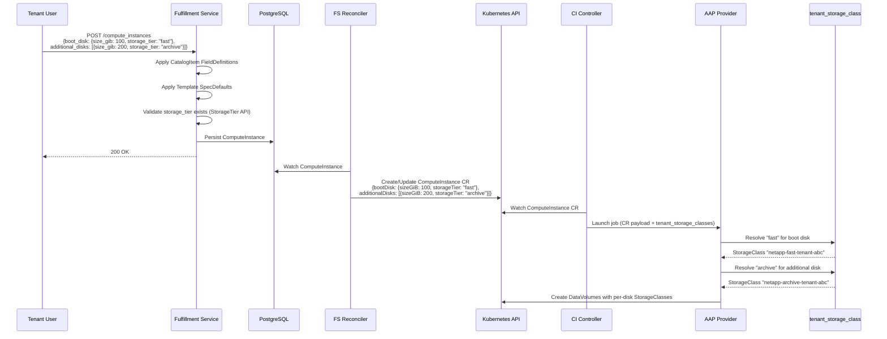
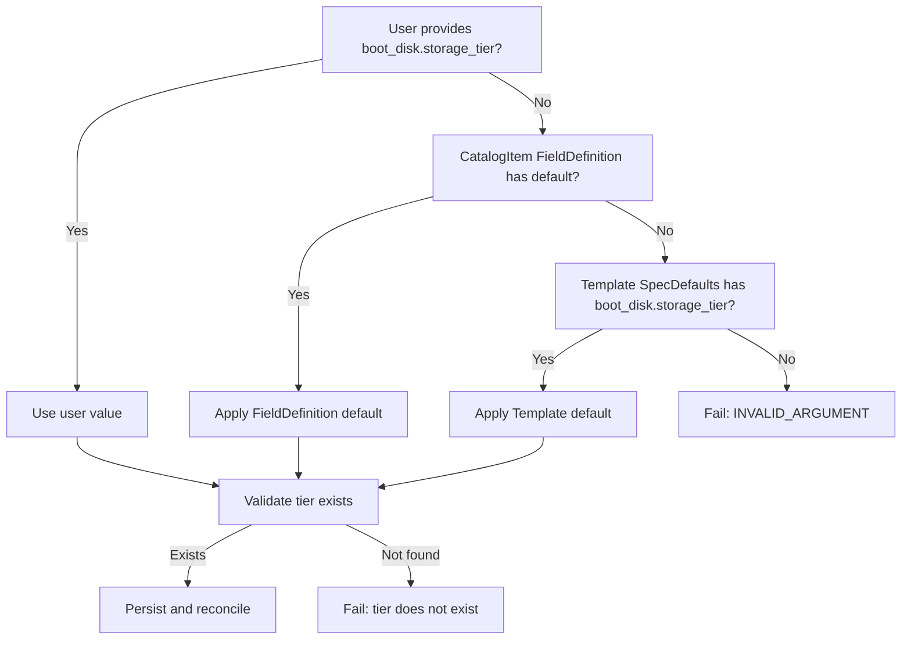

# ComputeInstance StorageTier Selection

## Summary

This enhancement enables per-disk storage tier selection for ComputeInstances. A `storage_tier` field is added to `ComputeInstanceDisk` across the full OSAC stack -- proto definitions, fulfillment-service validation/defaults, CRD types, and AAP roles. Each disk can use a different tier (e.g., "fast" for a boot disk, "archive" for a data disk), with a mandatory resolution chain (user input > CatalogItem defaults > Template defaults) ensuring every disk has a tier before provisioning. See [PRD](prd.md) for detailed requirements.

## Motivation

The ComputeInstance provisioning flow currently treats all disks identically from a storage perspective. The `DiskSpec` carries only `SizeGiB`, and the AAP playbook reads a single `STORAGE_REQUESTED_TIER` environment variable to select one StorageClass for every DataVolume -- boot disk and additional disks alike.

This means a database VM that needs high-IOPS storage and a log-archive VM that could use cold storage both receive the same tier. The storage tier model already exists in the system: OSAC-1110 defines StorageTier resources, the tenant controller resolves tiers to per-tenant StorageClasses via `Tenant.Status.StorageClasses`, and the AAP `tenant_storage_class` role can filter by tier name. The missing piece is a per-disk field in the ComputeInstance data model that carries the tier selection through the stack.

This design adds `storage_tier` to `ComputeInstanceDisk`, making it a required field with a well-defined default resolution chain. The field flows from the proto API through the fulfillment-service reconciler to the CRD and into the AAP payload. The AAP role resolves each disk's tier to a StorageClass independently, replacing the single-tier `STORAGE_REQUESTED_TIER` environment variable.

### Goals

- Enable tenants to select different storage tiers for each disk on a ComputeInstance, so workloads get the appropriate storage QoS.

### Non-Goals

- Tier discovery for tenant users (OSAC-1110 scope).
- CaaS cluster template tier selection. [Locked: D3]
- Storage quota or capacity management per tier.
- Auto-scaling or cross-tier migration of existing disks.

## Proposal

The change adds a single field -- `storage_tier` (proto) / `StorageTier` (CRD) -- to the disk specification at every layer: proto definitions (private and public), CRD types, fulfillment-service validation and defaults merging, reconciler mapping, and AAP per-disk StorageClass resolution. The `STORAGE_REQUESTED_TIER` environment variable is removed.

The tier is mandatory. After applying the resolution chain (user input, CatalogItem FieldDefinition defaults, Template SpecDefaults), every disk must have a non-empty `storage_tier`. If resolution fails, the fulfillment-service returns a clear error and does not create the ComputeInstance.

### Workflow Description

#### Actors

- **Cloud Provider Admin / Cloud Infrastructure Admin**: Configures StorageTier resources (OSAC-1110) and CatalogItems with tier defaults.
- **Tenant Admin**: Creates tenant-scoped CatalogItems with pre-configured tier values.
- **Tenant User**: Creates ComputeInstances, optionally specifying per-disk tiers.

#### Starting State

StorageTier resources exist (OSAC-1110). StorageClasses are labeled with `osac.openshift.io/storage-tier` and `osac.openshift.io/tenant`. The tenant controller has resolved `Tenant.Status.StorageClasses` for the tenant.

#### Happy Path: Tenant User Creates a ComputeInstance with Explicit Tiers

1. Tenant User sends `POST /api/public/v1/compute_instances` with `boot_disk.storage_tier: "fast"` and `additional_disks[0].storage_tier: "archive"`.
2. Fulfillment-service applies FieldDefinitions from the CatalogItem (no override needed since user provided values).
3. Fulfillment-service applies Template SpecDefaults (no override needed since user provided values).
4. Fulfillment-service validates that `"fast"` and `"archive"` exist as StorageTier resources via the private StorageTier API.
5. Fulfillment-service persists the ComputeInstance with the validated tiers.
6. Reconciler maps proto fields to CRD: `spec.bootDisk.storageTier: "fast"`, `spec.additionalDisks[0].storageTier: "archive"`.
7. AAP receives the CR payload. The `tenant_storage_class` role resolves each disk's tier to a tenant-specific StorageClass. Each DataVolume uses its own StorageClass.

#### Happy Path: Boot Disk Tier Resolved from CatalogItem Defaults

1. Tenant User sends `POST /api/public/v1/compute_instances` with `boot_disk.size_gib: 100` (no `storage_tier`) and no additional disks.
2. Fulfillment-service applies FieldDefinitions: `boot_disk.storage_tier` has a default of `"standard"`, which is applied.
3. Fulfillment-service validates `"standard"` exists.
4. Provisioning proceeds.

#### Happy Path: Additional Disks Resolved from CatalogItem Defaults

1. Tenant Admin created a CatalogItem with a FieldDefinition: `path: "additional_disks"`, `default: [{size_gib: 500, storage_tier: "fast"}]`.
2. Tenant User sends `POST /api/public/v1/compute_instances` with `boot_disk.storage_tier: "standard"` and no `additional_disks`.
3. Fulfillment-service applies FieldDefinitions: the CatalogItem default provides the entire `additional_disks` array.
4. Fulfillment-service validates that `"standard"` and `"fast"` exist as StorageTier resources.
5. Provisioning proceeds with boot disk on `"standard"` and one additional disk on `"fast"`.

#### Happy Path: Boot Disk Tier Resolved from Template Defaults

1. Tenant User sends `POST /api/public/v1/compute_instances` with no `boot_disk` at all and no additional disks.
2. Fulfillment-service merges Template SpecDefaults: the template's `boot_disk` carries `storage_tier: "standard"` and `size_gib: 50`.
3. Fulfillment-service validates the resolved tier.
4. Provisioning proceeds.

#### Additional Disk Defaulting Semantics

The boot disk and additional disks follow different defaulting rules:

- **Boot disk** supports per-field defaults through CatalogItem FieldDefinitions (`boot_disk.storage_tier` path) and Template SpecDefaults (`boot_disk` field). This works because the boot disk is a known, single, always-present disk -- an admin can meaningfully pre-select a tier for it.

- **Additional disks** can be defaulted as a whole array through a CatalogItem FieldDefinition with `path: "additional_disks"`. This follows the same semantics as `network_attachments`: the FieldDefinition path resolver does not support per-element field addressing (e.g., `additional_disks[0].storage_tier`), so the default covers the entire array -- size and tier for each element. If the user accepts the default, provisioning proceeds with those disks. If the user wants to change anything -- just the size, just the tier, or the number of disks -- they must provide the entire `additional_disks` array, since there is no per-element merging.

When no CatalogItem default exists for `additional_disks`, every additional disk must carry an explicit `storage_tier` from the user. Omitting it is a validation error.

#### Error Path: Boot Disk Tier Not Resolved

1. Tenant User sends a request with no `storage_tier` on the boot disk.
2. Neither the CatalogItem FieldDefinitions nor the Template SpecDefaults provide a tier.
3. Fulfillment-service returns `INVALID_ARGUMENT`: `"boot_disk.storage_tier is required but was not provided by user input, catalog item defaults, or template defaults"`. [Locked: D1]

#### Error Path: Additional Disk Missing Tier

1. Tenant User sends a request with `boot_disk.storage_tier: "fast"` and `additional_disks[0]: {size_gib: 200}` (no `storage_tier`). The user provided their own `additional_disks`, overriding any CatalogItem default.
2. Fulfillment-service returns `INVALID_ARGUMENT`: `"additional_disks[0].storage_tier is required"`.

#### Error Path: Tier Not Available

1. Tenant User specifies `boot_disk.storage_tier: "nonexistent"`.
2. Fulfillment-service queries the StorageTier API -- no match found.
3. Fulfillment-service returns `INVALID_ARGUMENT`: `"storage tier \"nonexistent\" does not exist"`.

The same error message is used when a tier exists globally but is not available for the tenant (detected by AAP at provisioning time). This avoids leaking whether a tier exists in the platform's catalog.



The diagram shows the full flow from API request through the four-layer stack. The key change is that `storage_tier` travels per-disk from the API through to AAP, where each disk's tier is resolved to a StorageClass independently.

### API Extensions

This enhancement modifies existing API surfaces. No new CRDs, admission webhooks, or finalizers are introduced.

**Proto API (private + public):** `ComputeInstanceDisk` message gains `optional string storage_tier = 2`. Existing CRUD operations on ComputeInstances, Templates, and CatalogItems carry the new field without RPC changes.

**CRD (osac-operator):** `DiskSpec` gains `StorageTier string`. The existing `XValidation:rule="self == oldSelf"` on `bootDisk` and `additionalDisks` enforces immutability for the new field automatically. [Locked: D6]

**AAP extra_vars:** No structural change to `ansible_eda.event`. The CR payload already contains the full ComputeInstance spec, which now includes `storageTier` per disk. The `tenant_storage_classes` sibling field is unchanged.

If the operator controller is down, ComputeInstance CRs will queue in Kubernetes and be reconciled when the controller recovers. No data loss occurs -- the CR is the source of truth. [Codebase: osac-operator/internal/controller/computeinstance_controller.go]

### Implementation Details/Notes/Constraints

#### 1. Proto Schema Changes

Add `storage_tier` as field 2 to `ComputeInstanceDisk` in both private and public proto files.

```protobuf
// In both private and public compute_instance_type.proto
message ComputeInstanceDisk {
  // Disk size in GiB.
  int32 size_gib = 1;
  // Storage tier name. Must reference an existing StorageTier resource.
  optional string storage_tier = 2;
}
```

The `optional` qualifier enables explicit presence: the generated code provides `HasStorageTier()` to distinguish "not provided" from "set to empty string". Defaults merging uses `HasStorageTier()` to decide whether to apply a default; validation checks presence after the full resolution chain.

`ComputeInstanceTemplateSpecDefaults` inherits the new field through its existing `optional ComputeInstanceDisk boot_disk = 4` reference. No change to the template proto is needed. [Codebase: fulfillment-service/proto/private/osac/private/v1/compute_instance_template_type.proto]

#### 2. Spec Defaults Merging

Extend `mergeBootDiskDefaults()` in `fulfillment-service/internal/utils/spec_defaults.go` to handle `storage_tier`:

```go
func mergeBootDiskDefaults(spec *privatev1.ComputeInstanceSpec, defaults *privatev1.ComputeInstanceTemplateSpecDefaults) {
    if !defaults.HasBootDisk() {
        return
    }
    if !spec.HasBootDisk() {
        spec.SetBootDisk(proto.Clone(defaults.GetBootDisk()).(*privatev1.ComputeInstanceDisk))
        return
    }
    disk := spec.GetBootDisk()
    defDisk := defaults.GetBootDisk()
    if disk.GetSizeGib() <= 0 && defDisk.GetSizeGib() > 0 {
        disk.SetSizeGib(defDisk.GetSizeGib())
    }
    // Merge storage_tier: apply template default only if user did not provide one
    if !disk.HasStorageTier() && defDisk.HasStorageTier() {
        disk.SetStorageTier(defDisk.GetStorageTier())
    }
}
```

The merging follows the same pattern as `size_gib`: if the user provided a value, it is preserved; otherwise the template default is applied. When the spec has no `boot_disk` at all, the entire default disk (including `storage_tier`) is cloned, which is the existing behavior.

Template SpecDefaults only cover `boot_disk`. There is no `additional_disks` field in `ComputeInstanceTemplateSpecDefaults`, so additional disk tiers cannot be defaulted through templates. Additional disk tiers must come from the user or from CatalogItem FieldDefinitions. This is consistent with the existing template model -- templates default single-value spec fields, not repeated collections.

#### 3. CatalogItem FieldDefinition Support

CatalogItem FieldDefinitions support the path `boot_disk.storage_tier` through the existing dot-notation path resolution mechanism in `applyFieldDefinitions()`. No code changes are needed -- the `getNestedValue` and `setNestedValue` helpers already walk arbitrary dot-notation paths after marshaling the spec to JSON. [Codebase: fulfillment-service/internal/servers/catalog_item_validation.go]

Example FieldDefinition for a CatalogItem that pre-selects a boot disk tier:

```json
{
  "path": "boot_disk.storage_tier",
  "display_name": "Boot Disk Storage Tier",
  "editable": true,
  "default": "standard"
}
```

Additional disks can be defaulted as a whole array through a FieldDefinition with `path: "additional_disks"`. This follows the same semantics as `network_attachments`: the path resolver treats array fields as opaque values, so the default covers the entire array. If the user provides their own `additional_disks`, the user-provided value replaces the entire default -- no per-element merging occurs.

Example FieldDefinition for a CatalogItem that pre-configures a data disk:

```json
{
  "path": "additional_disks",
  "display_name": "Additional Disks",
  "editable": true,
  "default": [
    {"size_gib": 500, "storage_tier": "fast"}
  ]
}
```

Per-element field addressing (e.g., `additional_disks[0].storage_tier`) is not supported -- the path resolver uses dot-notation only. [Locked: D2]

#### 4. Fulfillment-Service Validation

Extend `ValidateRequiredSpecFields()` with a single `validateDisk()` function that validates both boot disk and additional disks. The function performs the full validation: nil check, size, tier presence, and tier existence against the StorageTier API.

```go
func validateDisk(ctx context.Context, label string, disk *privatev1.ComputeInstanceDisk, storageTierClient StorageTierQuerier) error {
    if disk == nil {
        return grpcstatus.Errorf(grpccodes.InvalidArgument, "%s is required", label)
    }
    if disk.GetSizeGib() <= 0 {
        return grpcstatus.Errorf(grpccodes.InvalidArgument, "%s.size_gib must be greater than 0", label)
    }
    if !disk.HasStorageTier() {
        return grpcstatus.Errorf(grpccodes.InvalidArgument, "%s.storage_tier is required", label)
    }
    exists, err := storageTierClient.Exists(ctx, disk.GetStorageTier())
    if err != nil {
        return grpcstatus.Errorf(grpccodes.Internal, "failed to check storage tier %q: %v", disk.GetStorageTier(), err)
    }
    if !exists {
        return grpcstatus.Errorf(grpccodes.InvalidArgument, "storage tier %q does not exist", disk.GetStorageTier())
    }
    return nil
}
```

Called from `ValidateRequiredSpecFields()` after defaults merging:

```go
if err := validateDisk(ctx, "boot_disk", spec.GetBootDisk(), storageTierClient); err != nil {
    return err
}
for i, disk := range spec.GetAdditionalDisks() {
    if err := validateDisk(ctx, fmt.Sprintf("additional_disks[%d]", i), disk, storageTierClient); err != nil {
        return err
    }
}
```

After the full resolution chain, a nil boot disk is an error — it means neither the user, CatalogItem, nor Template provided one. Additional disks are user-provided, so nil elements should not occur, but the check is defensive.

#### 5. Reconciler Mapping (Proto to CRD)

Extend `addExplicitFields()` in `fulfillment-service/internal/controllers/computeinstance/computeinstance_reconciler_function.go` to map `storage_tier`:

```go
if ciSpec.HasBootDisk() {
    spec.BootDisk = osacv1alpha1.DiskSpec{
        SizeGiB:     ciSpec.GetBootDisk().GetSizeGib(),
        StorageTier: ciSpec.GetBootDisk().GetStorageTier(),
    }
}
if len(ciSpec.GetAdditionalDisks()) > 0 {
    disks := make([]osacv1alpha1.DiskSpec, 0, len(ciSpec.GetAdditionalDisks()))
    for _, disk := range ciSpec.GetAdditionalDisks() {
        disks = append(disks, osacv1alpha1.DiskSpec{
            SizeGiB:     disk.GetSizeGib(),
            StorageTier: disk.GetStorageTier(),
        })
    }
    spec.AdditionalDisks = disks
}
```

#### 6. CRD Type Changes

Add `StorageTier` to `DiskSpec` in `osac-operator/api/v1alpha1/computeinstance_types.go`:

```go
type DiskSpec struct {
    // SizeGiB is the size of the disk in gibibytes
    // +kubebuilder:validation:Required
    // +kubebuilder:validation:Minimum=1
    SizeGiB int32 `json:"sizeGiB"`

    // StorageTier is the name of the storage tier for this disk.
    // Resolved to a tenant-specific StorageClass by AAP at provisioning time.
    // +kubebuilder:validation:Required
    // +kubebuilder:validation:MinLength=1
    // +kubebuilder:validation:MaxLength=63
    // +kubebuilder:validation:Pattern=`^[a-z0-9]([a-z0-9._-]*[a-z0-9])?$`
    StorageTier string `json:"storageTier"`
}
```

The `Pattern` validation matches the tier label regex used by `groupByTier()` in `storage_tier_resolution.go`, ensuring consistency between tier names in the CRD and the StorageClass label values. [Codebase: osac-operator/internal/controller/storage_tier_resolution.go]

Immutability is inherited: `bootDisk` uses `XValidation:rule="self == oldSelf"` which compares the entire `DiskSpec` struct. Adding `StorageTier` to the struct means it is automatically covered by the immutability check. No additional XValidation rules are needed. [Locked: D6]

#### 7. AAP Changes

##### 7a. Remove `STORAGE_REQUESTED_TIER` Environment Variable

Remove the `_requested_storage_tier` variable from `playbook_osac_create_compute_instance.yml`:

```yaml
# BEFORE
_requested_storage_tier: "{{ lookup('env', 'STORAGE_REQUESTED_TIER') | default('default', true) }}"

# AFTER: removed entirely
```

The tier is no longer a global setting. Each disk carries its own tier in the CR payload. [Locked: D4 from design session]

##### 7b. Per-Disk StorageClass Resolution

Refactor `create_resources.yaml` in the `ocp_virt_vm` role. Instead of resolving one StorageClass for all disks, resolve per-disk:

```yaml
# Resolve StorageClass for boot disk tier
- name: Resolve StorageClass for boot disk
  ansible.builtin.include_role:
    name: osac.service.tenant_storage_class
  vars:
    tenant_storage_class_storage_tier: >-
      {{ ansible_eda.event.payload.spec.bootDisk.storageTier }}

- name: Set boot disk storage class
  ansible.builtin.set_fact:
    boot_disk_storage_class: "{{ tenant_storage_class_name }}"

# Resolve StorageClass for each additional disk
- name: Resolve StorageClass for additional disks
  ansible.builtin.include_role:
    name: osac.service.tenant_storage_class
  vars:
    tenant_storage_class_storage_tier: "{{ item.storageTier }}"
  loop: "{{ ansible_eda.event.payload.spec.additionalDisks | default([]) }}"
  loop_control:
    index_var: disk_index
  register: additional_disk_sc_results

- name: Build additional disk storage class list
  ansible.builtin.set_fact:
    additional_disk_storage_classes: >-
      {{ additional_disk_storage_classes | default([]) + [tenant_storage_class_name] }}
  loop: "{{ ansible_eda.event.payload.spec.additionalDisks | default([]) }}"
  loop_control:
    index_var: disk_index
```

The boot disk DataVolume uses `boot_disk_storage_class`. Each additional disk DataVolume uses `additional_disk_storage_classes[disk_index]`.

The `tenant_storage_class` role itself requires no changes -- it accepts `tenant_storage_class_storage_tier` as input and returns `tenant_storage_class_name`. The role is simply called once per disk instead of once per ComputeInstance.

##### 7c. DataVolume Template Updates

Update the DataVolume templates in `create_resources.yaml` to use per-disk StorageClass references:

```yaml
# Boot disk DataVolume
storageClassName: "{{ boot_disk_storage_class }}"

# Additional disk DataVolumes (looped)
storageClassName: "{{ additional_disk_storage_classes[disk_index] }}"
```

#### 8. Resolution Precedence Summary

The tier resolution chain for boot disk:



The diagram shows the three-layer precedence chain and the validation gate. User input takes priority, followed by CatalogItem defaults, then Template defaults. If none provides a tier, the request fails. After resolution, the tier is validated against the StorageTier API.

For additional disks, the chain is simpler: user input only (no Template or FieldDefinition defaults apply to repeated collections). Every additional disk must have an explicit `storage_tier` from the user or be omitted entirely.

### Security Considerations

This enhancement inherits the existing security model without changes. Storage tier selection does not introduce new authentication or authorization surfaces.

- **Input validation**: The `storage_tier` field is validated against the `^[a-z0-9]([a-z0-9._-]*[a-z0-9])?$` pattern at the CRD level and against the StorageTier API at the fulfillment-service level. This prevents injection of arbitrary strings into the AAP payload.
- **Tenant isolation**: AAP resolves tiers to StorageClasses using `tenant.Status.StorageClasses`, which is populated by the tenant controller using labeled StorageClasses. Tenants cannot access tiers mapped to other tenants' StorageClasses because the `osac.openshift.io/tenant` label on StorageClasses is controlled by the Cloud Infrastructure Admin, not the tenant.
- **OPA policies**: Existing OPA policies enforce that ComputeInstance operations are scoped to the authenticated tenant. The `storage_tier` field is part of the ComputeInstance spec and inherits this enforcement.

### Failure Handling and Recovery

**Missing tier after resolution chain**: The fulfillment-service returns `INVALID_ARGUMENT` with a message identifying which disk is missing a tier and which resolution layers were checked. The ComputeInstance is not created. No recovery action needed -- the user corrects the request.

**Tier not available**: The fulfillment-service returns `INVALID_ARGUMENT` with message `"storage tier \"X\" does not exist"`. The same wording applies whether the tier does not exist globally or exists but is not resolved for the tenant -- this avoids leaking the platform's tier catalog. If the tier exists globally but AAP cannot resolve it for the tenant, the AAP job fails and the operator sets the provisioning condition accordingly. Recovery: the user selects a valid tier, or the Cloud Infrastructure Admin creates the missing tier/StorageClass mapping.

**Controller restart mid-reconciliation**: The CRD is the source of truth. On restart, the controller re-reads the ComputeInstance CR (with `storageTier` fields intact) and resumes reconciliation. The tier validation and provisioning steps are idempotent.

### RBAC / Tenancy

No RBAC or tenancy changes are required. The `storage_tier` field is part of the ComputeInstance spec, which inherits the existing tenant isolation enforced by OPA policies, the `osac.openshift.io/tenant` annotation, and namespace scoping. StorageTier resources are managed exclusively through the private API by Cloud Infrastructure Admins.

### Observability and Monitoring

No new observability changes. Existing monitoring mechanisms apply:

- Fulfillment-service validation errors are returned as gRPC status codes and logged by the request handler.
- The operator's `Provisioned` condition reflects AAP job success/failure, visible through `kubectl describe computeinstance` and Kubernetes events.
- AAP job success/failure is tracked through existing provisioning job status on `ComputeInstance.Status.ProvisioningJobs`.

### Risks and Mitigations

**Templates and CatalogItems must be updated**: Adding `storage_tier` as required means existing Templates and CatalogItems that lack a tier default will cause ComputeInstance creation to fail until updated. Since OSAC is pre-GA (CRDs are `v1alpha1`, no production tenants depend on backwards compatibility), this is an expected part of the upgrade rather than a breaking change. The rollout must include updating deployed Templates and CatalogItems with `storage_tier` values, and installation documentation must list tier configuration as a prerequisite.

**Version skew during rolling deployment**: If the fulfillment-service is updated before the operator, the operator will receive CRs with `storageTier` fields that the old operator CRD schema does not recognize. Mitigation: deploy the CRD update (operator) first, then the fulfillment-service. The new CRD field is additive and does not break old operator code that ignores it.

**StorageClass deletion race**: A StorageClass could be deleted between fulfillment-service validation and AAP execution. The AAP role fails cleanly with an error message identifying the missing StorageClass. This is an operational concern, not a design flaw -- administrators should not delete StorageClasses while provisioning is active.

### Drawbacks

Adding `storage_tier` as a mandatory field increases the minimum information required to create a ComputeInstance. Every Template and CatalogItem must be updated, and every additional disk must carry an explicit tier. This trades simplicity-of-use for explicitness: there is no implicit "just use whatever storage is available" path.

The trade-off is justified because implicit storage selection produced unpredictable behavior -- tenants could not reason about what storage their VMs would receive. Making the tier explicit aligns with the broader OSAC principle that Templates are fully parameterized and deterministic.

## Alternatives (Not Implemented)

### Global default tier with opt-in override

Instead of making `storage_tier` mandatory, define a system-wide default tier (e.g., via a ConfigMap or operator setting) that applies when no tier is specified. Per-disk overrides would be optional.

Pros: simpler migration, fewer changes to existing Templates/CatalogItems, lower barrier to ComputeInstance creation.

Cons: reintroduces implicit behavior that the team explicitly rejected in the design session. The name "default" was also rejected for tier naming (D7). A global default means tenants cannot predict which tier they get unless they read operator configuration, defeating the purpose of per-disk selection.

Rejected because: the team reached consensus that storage tier selection should be explicit, with no fallback to a default. [Locked: D1]

### Per-disk tier as optional with fallback to boot disk tier

Make `storage_tier` required only on the boot disk. Additional disks without a tier inherit the boot disk's tier.

Pros: reduces the number of fields a user must specify when all disks use the same tier.

Cons: introduces implicit cross-field dependency (additional disk behavior depends on boot disk configuration). Users who want different tiers per disk must understand the inheritance rule. The inheritance rule is non-obvious and would need documentation.

Rejected because: explicit is better than implicit. The additional typing cost (one field per additional disk) is low relative to the confusion prevented.

### Storage tier as an enum rather than a string

Define tier names as a proto enum (`STORAGE_TIER_FAST`, `STORAGE_TIER_ARCHIVE`, etc.) instead of a free-form string.

Pros: compile-time validation of tier names, IDE autocomplete, no typos.

Cons: tier names are deployment-specific -- a CSP defines their own tiers via StorageTier resources (OSAC-1110). An enum would require a proto change every time a new tier is created, breaking the declarative model. The existing StorageTier API already validates names at runtime.

Rejected because: tier names are data, not code. Runtime validation against the StorageTier API is the correct approach.

## Test Plan

**Unit tests (fulfillment-service, Ginkgo):**
- `mergeBootDiskDefaults()` with and without `storage_tier` in template defaults.
- `validateDisk()` for missing and empty `storage_tier` on boot disk and additional disks.
- `validateStorageTierExists()` with mock StorageTier client (tier found, tier not found, client error).
- `addExplicitFields()` mapping `storage_tier` from proto to CRD for boot disk and additional disks.
- CatalogItem FieldDefinition with `boot_disk.storage_tier` path: default application, editability, JSON Schema validation.

**Unit tests (osac-operator, Ginkgo):**
- CRD validation: `StorageTier` required, pattern validation, immutability via XValidation.

**Integration tests (fulfillment-service, Kind cluster):**
- End-to-end ComputeInstance creation with explicit tiers, template defaults, and CatalogItem defaults.
- Validation error for nonexistent tier.
- Validation error when tier is missing after full resolution chain.

**E2E tests (osac-test-infra, pytest):**
- ComputeInstance provisioning with different tiers per disk.
- Verify DataVolumes use the correct per-disk StorageClasses.
- Error scenario: tier not available for tenant.

## Graduation Criteria

Graduation criteria will be defined when targeting a release. Expected stages: Dev Preview -> Tech Preview -> GA based on production deployment feedback.

GA readiness signals:
- All unit, integration, and E2E tests pass.
- At least one CSP deployment has used per-disk tier selection for production tenants.
- Documentation covers storage tier setup as a provisioning prerequisite.

## Support Procedures

**Detecting tier validation failures:**
- Fulfillment-service logs: gRPC error responses with `INVALID_ARGUMENT` mentioning `storage_tier`.
- Operator: `kubectl get computeinstance -o jsonpath='{.status.conditions}'` -- look for `Provisioned=False` reflecting AAP job failure.
- AAP: job failure logs from the `tenant_storage_class` role when no StorageClass matches the requested tier.

**Verifying tenant StorageClass resolution:**
- `kubectl get tenant <name> -o jsonpath='{.status.storageClasses}'` shows resolved tiers.
- `kubectl get storageclass -l osac.openshift.io/tenant=<name>` shows tenant-specific StorageClasses.
- `kubectl get storageclass -l osac.openshift.io/storage-tier=<tier>` shows all StorageClasses for a given tier.

**Disabling the feature:**
The `storage_tier` field cannot be disabled independently -- it is part of the `DiskSpec` schema. Since the CRDs are `v1alpha1` (pre-GA), reverting means removing the field from CRDs, fulfillment-service, and AAP, and re-adding the `STORAGE_REQUESTED_TIER` environment variable.

## Infrastructure Needed

None.
