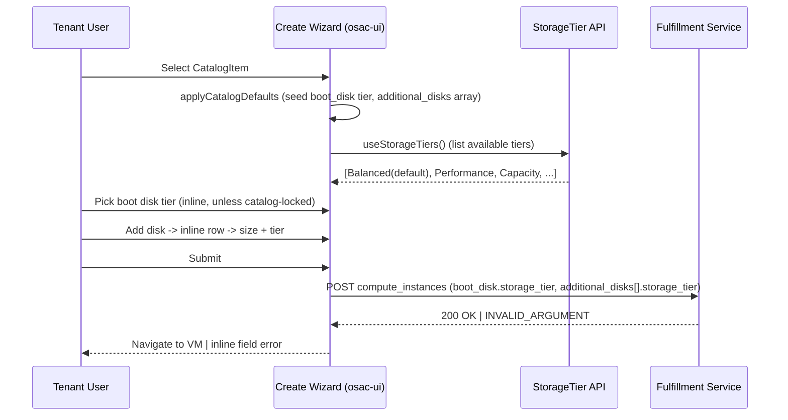

# ComputeInstance StorageTier Selection — UI

## Summary

This design covers the web console (osac-ui) work that lets a user choose a
**storage tier** for each disk when creating a virtual machine (ComputeInstance).
A storage tier is a named class of storage — for example "Balanced",
"Performance", or "Capacity" — defined by the cloud provider administrator. Today
the console only lets a user set a disk's *size*; this design adds a tier choice
next to the size for both the boot disk and any additional disks.

The user makes this choice in a new **Storage** step in the create wizard. The
same tier picker is used for every disk, shown directly on the page: inline next
to the boot disk size, and inline on each additional-disk row. Adding a disk
appends a new row to the disks list, configured in place — matching the rest of
the console's collection UX. The list of available tiers comes from the existing
StorageTier API, and the picker respects any defaults or locked values that a
catalog item pre-configures.

This is the UI counterpart to the backend design in [design.md](design.md). See
[PRD](prd.md) for the product requirements.

## Motivation

The backend design ([design.md](design.md)) makes a storage tier a **required**
part of every disk. Once that ships, a VM can only be created if each disk names
a tier — supplied either by the user or by a catalog/template default. The
console has no way to supply a tier today, so every VM created from the console
would be rejected by the server unless a default happened to cover every disk.
This design adds that missing choice to the console.

Today the console treats a disk as size-only: the create wizard shows a size
box for the boot disk and size-only rows for additional disks, and the console's
internal disk type carries an outdated, hardcoded list of storage classes that
does not match the new tier model. This design replaces that with a real,
data-driven tier choice sourced from the StorageTier API and carries the user's
choice all the way through to the create request and the VM detail views.

### Goals

- Use one tier picker for every disk — boot and additional — all shown inline on
  the page, so every disk is configured the same way. [User]
- Add additional disks as inline rows in the disks list: clicking "Add disk"
  appends a row configured in place (size + tier), no pop-up — aligning with the
  rest of the console's collection UX. [User]
- Send the tier the server expects (the tier's **name**) using the existing
  request-building code — no new plumbing. [Codebase: compute-instance-wire.ts]
- Respect any tier defaults or locked values a catalog item defines, the same
  way the console already handles other catalog-configured fields.
  [design.md §Resolution Precedence]

### Non-Goals

- No changing a tier after the VM exists — the tier is fixed at create time;
  detail views only display it. [PRD]
- No screens for creating or managing storage tiers themselves — a read-only
  tiers page already exists, and tier lifecycle is OSAC-1110's scope.
- No per-row default handling for additional disks — the backend applies
  catalog defaults to the additional-disks list as a whole. [design.md §3]
- No backend changes (API, service, operator, or automation) — those belong to
  [design.md]; this design only consumes them.

## Proposal

The console gets a new **Storage** step in the VM create wizard, one reusable
tier picker, and a tier value carried per disk through the whole flow. Four
parts:

1. **A new Storage step** — inserted between the Configuration and Networking
   steps, holding all disk configuration (boot disk plus additional disks). Disk
   controls move out of the Configuration step and into this one. This only
   affects the VM create flow; the cluster, bare-metal, and MaaS wizards have
   their own separate steps and are untouched. [User]
2. **One tier picker** — a searchable single-choice list of the tiers currently
   available to the tenant, reused inline on every disk below.
3. **Boot disk** — the picker shown directly on the page, next to the boot disk
   size. If the chosen catalog item locks or pre-fills the tier, the picker shows
   that value accordingly.
4. **Additional disks** — an inline disks list where "Add disk" appends a new
   row; each row holds its own size and tier picker, configured in place, and can
   be removed. No pop-up.

On submit, the create request includes a tier for each disk. VM detail views
display the tier after creation.

### Workflow Description

**Who is involved:** the person creating the VM (Tenant User or Tenant Admin).
Storage tiers themselves are set up separately by a Cloud Provider Admin, and
catalog/template defaults are configured in the catalog authoring flow — both are
outside this design.

**Starting point:** storage tiers exist and are available to the tenant
(OSAC-1110); the user is signed in and has reached the new **Storage** step of
the create wizard. The step order is: Catalog → General → Configuration →
Storage → Networking → Review.

**Boot disk tier (shown on the page):**

1. When the user picks a catalog item, the boot disk tier is pre-filled from the
   catalog item's default, if it defines one.
2. If the catalog item locks the tier, the picker is read-only and shows that
   value (with a lock indicator).
3. Otherwise the user picks a tier from the searchable list.

**Additional disk tier (inline rows):**

1. If the chosen catalog item defines additional-disk defaults, the list is
   pre-filled with those disks — each an inline row with its own size **and**
   tier. The user can accept them as-is, change the size and/or tier of any row,
   or delete all rows. An empty list means "no additional disks", and none are
   created (an explicit opt-out).
2. To add a disk, the user clicks "Add disk". A new row is appended to the list
   with a size box (default 30 GiB) and the required tier picker (defaulting to
   the first available tier).
3. The user sets size and tier directly on the row. Each row validates in place:
   size must be at least 1 and a tier must be selected.
4. Any row can be removed. There is no separate save step — rows are part of the
   step's form and are carried into the create request on submit.

**Submit:** the create request carries a tier for each disk. The server does the
authoritative validation; any rejection is shown to the user as described in
Failure Handling.

The diagram shows the console reading the available tiers, applying any catalog
defaults, collecting a tier for each disk (inline for the boot disk and for each
additional-disk row), and submitting them. The console does not decide
what is valid — it reflects the catalog's defaults and locks, and leaves the
final decision to the server.

### API Extensions

None from the UI. This design consumes existing/AS-DESIGNED API surfaces:

- `ComputeInstanceDisk.storage_tier` (added by [design.md §API Extensions]) —
  read on VM details, written on create.
- StorageTier list API (OSAC-1110) via `useStorageTiers()` — read-only, to
  populate the picker.

No new gRPC services, CRDs, webhooks, or finalizers. The UI is blocked on the
backend `storage_tier` field landing before it can function end-to-end.

## UX Alignment

This section maps the console's field names to the backend's field names, so
frontend and backend reviewers can confirm they line up. It is required because
the console already has a disk type file for this resource. (Non-UI reviewers can
skim this table — the key point is that the console sends the tier's **name**.)

| UI field (console) | Backend field (design.md) | Notes / deviation |
|---|---|---|
| `bootDisk.storageTier` (wizard) | `boot_disk.storage_tier` | Direct mapping (camelCase↔snake_case) |
| `additionalDisks[i].storageTier` (wizard) | `additional_disks[i].storage_tier` | Direct mapping; per-disk |
| `DiskWithMeta.storageTier` (display) | `storage_tier` | Replaces removed `storageClass` enum |
| `DiskWithMeta.storageClass: 'standard'\|'ssd'\|'nvme'` | *(removed)* | **Deviation (anti-pattern): string-union storage class.** Replaced with a free-form `storageTier` string referencing a StorageTier resource by name. Justification: tier names are deployment-specific data, not a fixed enum — matches [design.md]'s rejection of a proto enum. |
| tier option `value` | `storage_tier` = `StorageTier.metadata.name` | The UI sends the tier **name**, not id/displayName. The VMaaS mockup used a tier id; corrected here. [Ref-UX divergence] |

Anti-pattern deviations: the only deviation is the removal of the
`storageClass` string-union in favor of a resource-referencing `storageTier`
string — this *resolves* the string-union anti-pattern rather than introducing
one. No sub-resource actions, K8s-internal fields, one-time secrets, or RHOAI
operator fields are introduced.

After the backend ships and `pnpm gen-types` runs in osac-ui, the migration
diff should be limited to renaming `storageClass`→`storageTier` and dropping the
enum maps.

### Reference UX — VMaaS create-VM mockup

Source: `https://yfrimanm.github.io/openshift-origin-design/vmaas-create-vm-only.html`
(interactive HTML mockup; markup + JS read directly). It implements tier
selection **only for additional disks, via an "Add disk" modal**; the boot disk
tier is hardcoded to `Balanced`. This design adopts the mockup's **tier picker**
but not its modal interaction: the picker is used **inline** for every disk — the
boot disk and each additional-disk row — because inline collection rows match the
rest of the console's create UX. The modal is a divergence from the mockup; see
Alternatives.

The tier picker (used inline on every disk row):

- **Disk size (GiB)** — number input, `min=1`, `max=16384`, `step=1`, default
  `30`, required. Helper: *"Disk name will be `<vm-name>-diskN`."* (auto-named;
  display only — not a proto field).
- **Storage tier** — required rich searchable single-select (typeahead). Toggle
  shows the selected tier's display name with an "ST" badge; the menu has a
  search box and a list where each option shows tier **display name** +
  **description**, the first tier is tagged `(default)`, and the selected option
  shows a check. Helper: *"Storage tiers are defined by your cloud provider
  administrator."* Empty state: *"No storage tiers available. Contact your
  administrator."*

Tier data source (mockup, mirrors real API): `GET /api/private/v1/storage_tiers`
(`StorageTiers.List`), filtered to active tiers. Tier shape: `id`,
`metadata.name`, `metadata.display_name`, `metadata.description`,
`spec.backends[]`, `status`. Mock tiers: Balanced (default), Performance,
Capacity, AI/ML optimized. Disks render in a list with columns name, size,
storage tier, and a kebab (Edit / Delete).

### Implementation Details/Notes/Constraints

> Note for non-UI reviewers: this section is a file-by-file guide for the
> frontend engineers who will build the feature. It is safe to skip if you are
> reviewing the product behavior rather than the console code — the sections
> above describe everything the user sees and does.

Per-file changes in
`osac-ui/libs/ui-components/src/components/catalogProvision/wizard/adapters/computeInstance`
and `.../api/v1`:

**1. `api/v1/compute-instance-disk.ts` (`@temp-api`).** Replace
`storageClass` enum with `storageTier?: string`; remove `STORAGE_CLASS_LABELS`
/ `STORAGE_CLASS_COLORS` (display metadata now comes from
`StorageTier.spec.displayName` / description). Keep `asDiskWithMeta` for read
views.

**2. Shared tier picker.** A searchable single-select (PatternFly typeahead
`Select`) reused inline by the boot disk and every additional-disk row:

- Source: `useStorageTiers()` → filter `status.available === true`.
  [Codebase: osac-ui/.../api/v1/storage-tier.ts]
- Option value = `metadata.name` (proto `storage_tier`); label =
  `spec.displayName || metadata.name`; subtitle = tier description; first tier
  tagged `(default)`; default selection = first available tier.
- Helper: *"Storage tiers are defined by your cloud provider administrator."*
- Empty state: inline error *"No storage tiers available. Contact your
  administrator."* (mirrors PRD Risk 1); loading spinner; retry link on error
  (matching the instance-type card grid pattern already in the step).

**3. `computeInstance/fields.ts`.** `bootDisk: { sizeGib: string; storageTier:
string }`; `AdditionalDiskValue = { sizeGib: string; storageTier: string }`;
add `'spec.boot_disk.storage_tier'` to `CONFIGURATION_CATALOG_PATHS` so the
catalog lock/default overlay covers it.

**4. New Storage wizard step.** Add a `storage` step to the ComputeInstance
wizard and move all disk UI into it:
- `wizard/stepIds.ts`: add `'storage'` to `WIZARD_STEP_IDS` between
  `'configuration'` and `'networking'`; add
  `STEP_LABEL_KEYS.storage = 'catalogProvision.steps.storage.title'` and the
  i18n string ("Storage").
- New `computeInstance/VmStorageStep.tsx`: owns the boot disk (size + inline
  tier picker) and additional disks (inline row list). Boot disk: render
  the shared picker inline next to the size input; when the catalog overlay for
  `spec.boot_disk.storage_tier` is `editable: false`, render locked (read-only
  badge + lock icon, as the image field already does). Additional disks: a disks
  list where each row is an editable size input + inline tier picker + a Delete
  action, plus an "Add disk" button that appends a new empty row.
- `CatalogProvisionWizard.tsx`: render the step — `{stepId === 'storage' ?
  <StorageStep catalogItem={catalogItem} /> : null}`.
- `adapters/types.ts`: add `StorageStep` to `CatalogProvisionAdapter`;
  `computeInstanceAdapter.ts`: wire `StorageStep: VmStorageStep`.
- Remove the boot disk / additional disk fields from `VmConfigurationStep.tsx`
  (they now live in the Storage step); the Configuration step keeps image,
  instance type, user data, run strategy, Windows flag, dynamic fields.
- Scope note: `WIZARD_STEP_IDS` / `CatalogProvisionWizard` back only
  `VmCreatePage`, so this step is ComputeInstance-only; no other kind's wizard is
  affected. [Codebase: osac-ui/.../CatalogProvisionWizard.tsx]

**5. Additional-disk row component (new).** An inline row rendering the size
input and the shared tier picker, plus a Delete action. "Add disk" appends
`{ sizeGib: '30', storageTier: '' }` to `spec.additionalDisks`; each row edits
its entry in place (Formik field array), and Delete removes it. No modal, no
separate save step — rows are ordinary step fields validated inline. Disk
name/device are display-only and not persisted.

**6. `computeInstance/schemas.ts`.** Move boot/additional disk validation from
the `configuration` step case to a new `storage` step case (Formik validates
only the active step's fields). `specBootDisk`: add `storageTier` via
`mergeCatalogValidation` so a catalog-locked/defaulted tier is treated as
satisfied; do not unconditionally `.required()` (a Template SpecDefault the UI
cannot see may supply it — see Open Question 1). `specAdditionalDisks`: add
`storageTier: yup.string().required('Storage tier is required')` — with inline
rows this is the primary per-row validation, surfaced on the row itself. The
`configuration` case drops `bootDisk`/`additionalDisks`.

**7. `computeInstance/payload.ts`.** Boot disk: `spec.bootDisk = { sizeGib:
Number(...), storageTier }` (omit `storageTier` when empty). Additional disks:
map to `{ sizeGib, storageTier }`, preserving the existing size-truthiness
filter. No `compute-instance-wire.ts` change — `serializeSpecRecordToWire`
converts `storageTier`→`storage_tier` and omits empties.
[Codebase: osac-ui/.../api/v1/compute-instance-wire.ts]

**8. `computeInstance/applyCatalogDefaults.ts`.** Add an overlay for
`spec.boot_disk.storage_tier` and seed `spec.bootDisk.storageTier`. When the
CatalogItem defines an `additional_disks` array default, seed
`spec.additionalDisks` from it (each `{ sizeGib, storageTier }`); seeded rows
appear in the disks list and are editable/removable. Preserve the
omitted-vs-empty-array distinction: seeding on first catalog selection = accept
the default; the user clearing all rows = explicit opt-out (empty array). This
matches the existing `network_attachments` handling. [design.md §3]

**9. Review + read views.** `computeInstanceAdapter.ts`
`buildReviewSections`: add a "Storage" review section (title
`catalogProvision.steps.storage.title`) showing boot disk size + tier and each
additional disk's size + tier; move the boot/additional disk rows out of the
Configuration review section. `VmDetails.tsx` / `VmDetailsSummary.tsx` display
each disk's tier (display name when resolvable, else raw `storageTier`); no edit
control (immutable).

Resolution precedence in the UI: the UI reflects but does not own the chain
(user > CatalogItem > Template). CatalogItem FieldDefinitions surface as
lock/default via the overlay; Template SpecDefaults are **not visible to the
UI**, so the UI must not hard-require the boot disk tier when a template default
may exist — the server resolves and returns `INVALID_ARGUMENT` on failure.

### Security Considerations

No change to the existing console security model. The picker only offers tiers
the server returned for this tenant, and the server independently re-validates
the tier on create [design.md §Security] — so the console is not relied on to
keep tier values safe. No new sign-in or permission surfaces are added. The tier
list is already restricted to the tenant by the API, not by the UI.

### Failure Handling and Recovery

- **No tiers available:** the picker shows a clear empty state, and the boot
  disk shows an early warning. The console still lets the user submit; the server
  returns the definitive error. Fix: an administrator defines a tier (OSAC-1110 /
  PRD Risk 1).
- **Create rejected by the server:** show the error next to the field it refers
  to whenever possible:
  - a "boot disk tier is required" error → the boot disk tier field.
  - an "additional disk tier is required" error → that disk's row.
  - a "storage tier X does not exist" error → the field holding that value. Keep
    the wording as the server sends it — it deliberately does not reveal *why*
    the tier is unavailable [design.md §Error Path 3], and the console must not
    add wording that leaks that.
  - If an error can't be tied to a specific field, show it as a banner on the
    review/create step.
- **Tier list fails to load:** show a spinner, then an error with a retry link;
  retrying does not lose anything the user has already entered.

### RBAC / Tenancy

No RBAC or tenancy changes required. The tier field is part of the
ComputeInstance spec, which inherits existing tenant isolation; the StorageTier
list consumed by the picker is already tenant-scoped by the API. The UI adds no
new resources and no new isolation metadata.

### Observability and Monitoring

No new observability changes. Existing monitoring mechanisms apply. Client-side
create failures surface through the existing console error handling; there are
no new metrics or events introduced by the UI.

### Risks and Mitigations

- **Depends on the backend landing first:** the console change does nothing
  end-to-end until the tier field exists in the API and service. Mitigation:
  build against the console's local mock data first, and ship the UI after the
  backend. Deploy order is operator, then service, then console. [design.md §Risks]
- **Console's temporary disk type drifting from the real API:** the console
  currently hand-maintains its disk type. Mitigation: the field mapping is
  documented in UX Alignment, and once the API types are regenerated the console
  reconciles to exactly the documented differences.
- **Confusing a tier's name with its ID:** the reference mockup identified tiers
  by ID. Mitigation: this design always sends the tier **name**, and a test
  confirms the create request carries the name.

### Drawbacks

A growing additional-disks list with two inline controls per row (size + tier)
takes more vertical space than a collapsed modal-and-summary list, and leaves
less room for long tier descriptions on each row. Justified because inline rows
keep every disk configured the same way as the boot disk and match the rest of
the console's create UX, removing the extra click and the context switch a modal
imposes — a small space cost for a consistent, faster flow.

## Alternatives (Not Implemented)

### An "Add disk" modal for additional disks

Configure each additional disk in an "Add disk" / "Edit disk" pop-up (size +
tier) that commits to a summary list, as the VMaaS create-VM mockup does. Pros:
matches the reference mockup; a compact summary list; room for long tier
descriptions inside the modal. Cons: a different interaction from the inline boot
disk; an extra click and a context switch to add or edit each disk; inconsistent
with the rest of the console's inline collection UX. Rejected in favor of inline
rows so every disk is configured the same way on the page. [User]

### A plain dropdown instead of a searchable list

Pros: simpler. Cons: no search and no per-tier description; awkward once there
are many tiers; inconsistent with the reference design. Rejected: the tier list
can grow, and descriptions materially help the user choose. [Ref-UX]

### Keep the console's old fixed list of storage classes

Pros: no type change. Cons: it uses the wrong name and the wrong model — tiers
are data defined per deployment, and a fixed list can't represent tiers a cloud
provider defines. Rejected: it contradicts [design.md] and the StorageTier model.

## Open Questions

### 1. Should the console require a boot disk tier, or leave it to the server?

A template can supply the boot disk tier behind the scenes in a way the console
can't see. If the console insists on a tier, it could block a create that would
actually have been valid.

- **Owner:** UX / Frontend WG
- **Proposed:** require a tier only when the field is user-editable and the
  catalog provides no default; otherwise let the server decide.
- **Impact:** boot disk validation (§Implementation 6).

### 2. How much detail should each tier option show?

Should the picker also show price and/or a quality-of-service label next to each
tier's name and description, as the read-only tenant tiers page does?

- **Owner:** UX
- **Impact:** how each tier option is rendered (§Implementation 2).

### 3. Does the shared types package also need the tier field?

Besides the console's temporary disk type, the shared types package may also
need the tier field added.

- **Owner:** Frontend WG
- **Impact:** type wiring across the wizard; the UX Alignment migration.

## Test Plan

### Unit Tests

- `compute-instance-disk.ts`: `storageTier` type; `asDiskWithMeta` passthrough.
- `schemas.test.ts`: additional-disk tier required; boot disk tier conditional
  on editability/default (per Open Question 1).
- `payload` (via `compute-instance.test.ts`): boot + additional disk
  `storageTier` serialized to `storage_tier` (tier **name**); empty tiers
  omitted; size-truthiness filter preserved.
- `applyCatalogDefaults`: boot disk tier seeded from overlay; `additional_disks`
  array seeded from catalog default; omit=accept / empty=opt-out preserved.
- Tier picker: option value is `metadata.name`; available-only filter; default =
  first tier; empty-state error rendered when no available tiers.

### Integration Tests

Component-level (React Testing Library): the wizard shows a Storage step between
Configuration and Networking; `VmStorageStep` renders the inline boot tier
picker and, for a catalog-locked field, the read-only locked state; "Add disk"
appends an inline row and editing a row updates `{ sizeGib, storageTier }` while
Delete removes it; the Review step shows a Storage section with per-disk tiers;
server `INVALID_ARGUMENT` maps to the correct inline field error.

### E2E Tests

Cypress (`osac-ui/apps/e2e/cypress/e2e/flows`): create a ComputeInstance
selecting different tiers for boot and an additional disk; submit and verify the
request payload carries per-disk `storage_tier`; error path submitting a
nonexistent tier surfaces a legible message.

## Graduation Criteria

Graduation criteria will be defined when targeting a release. Expected stages:
Dev Preview -> Tech Preview -> GA based on production deployment feedback,
gated on the backend `storage_tier` field (design.md) reaching the same stage.

## Upgrade / Downgrade Strategy

Console-only change that stores nothing of its own. The tier fields are purely
additive and safe against a backend that already returns the tier. If the console
shipped before the backend field existed, the picker would run against local mock
data and creates would be rejected by the server — which is why the console ships
after the backend (see Risks). Rolling back is just redeploying an earlier console
build; there is no data to migrate.

## Version Skew Strategy

The console must tolerate a server that has not yet added the tier field: the
field is left out of the request when empty, and detail views simply show no tier.
Ship order is backend first, console second. The console does not depend directly
on the operator or automation versions.

## Support Procedures

- **Detection:** a failed create shows the server's tier error; a failure to
  load the tier list shows the picker's retry state. Backend-side detection is
  covered by [design.md §Support Procedures].
- **Disabling:** the tier controls can't be turned off on their own; reverting
  means shipping an earlier console build without them. No cluster-health impact —
  this is a console-only change.
- **Recovery:** re-deploying the console restores behavior; no consistency
  concerns since the UI holds no server state.

## Infrastructure Needed

None.

---

## Provenance

Authored: commit @ design 0.8.0 - 7efcedb, workspace design/OSAC-1710 @ e7ea5f9
Final: respond @ design 0.8.0 - 7efcedb, workspace design/OSAC-1710 @ f08ba8e (dirty)

> Context changed between commit and respond.

> This document's phase history does not include an initial /draft — structure was not verified against the template from origin.

<!-- ai-workflow-provenance:{"schema_version":1,"provenance_kind":"session","workflow":"design","workflow_version":"0.8.0","ai_workflows":"7efcedb","source_repo":"f08ba8e (dirty)","source_repo_branch":"design/OSAC-1710","commits_behind_main":0,"commits_ahead_main":2,"main_ref":"main","phases":["commit","respond","respond"],"authoring_modes":["skill"],"context_changed":true,"origin_untracked":true} -->
