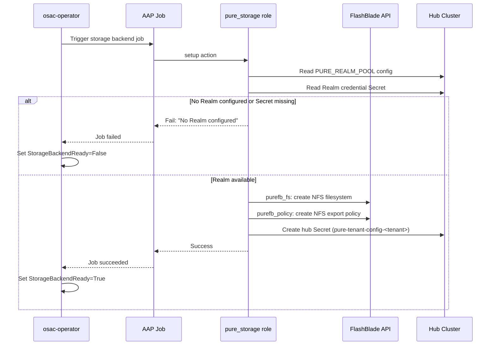

# Pure Storage FlashBlade File Storage (NFS) Provider

## Summary

This enhancement adds Pure Storage FlashBlade as an NFS file storage provider in OSAC by implementing: (1) a new `pure_storage` Ansible template role that integrates with the existing provider-agnostic storage dispatch system, and (2) integration with the osac-csi-driver for CSI provisioning on workload clusters. The AAP role reads admin-configured Realm assignments, provisions FlashBlade resources within Realms using the `purestorage.flashblade` Ansible collection, and creates tenant-isolated StorageClasses with OSAC labels. The osac-csi-driver's existing Pure controller chart handles CSI operations — no vendor-specific components are installed directly on tenant clusters. Dynamic Realm pool management (checkout/release lifecycle, exhaustion handling, pool status tracking) is deferred to a future generic storage pool management enhancement. See [PRD](prd.md) for detailed requirements.

## Motivation

OSAC currently supports only VAST as a file storage backend. Datacenters running Pure Storage FlashBlade hardware cannot provision tenant-isolated NFS storage through OSAC, forcing manual configuration outside the platform. FlashBlade is a widely deployed enterprise file and object storage platform with built-in multi-tenancy through Secure Multi-Tenancy (SMT) Realms, making it a natural fit for OSAC's per-tenant isolation model.

The existing storage provider dispatch system (`osac.service.storage_provider`) is already dynamic: adding a `provider: "pure"` entry to `STORAGE_TIERS` automatically dispatches to `osac.templates.pure_storage`. This design leverages that extensibility, requiring a new template role, a fulfillment-service API for Realm pool management, and verification of the osac-csi-driver's Pure backend compatibility. The osac-operator's StorageReconciler discovers StorageClasses by OSAC labels, not by provider type, so Pure-backed StorageClasses integrate into the existing tenant storage resolution without operator changes.

The key design challenge is Realm-to-tenant assignment. Unlike VAST, where OSAC creates tenants on-demand via the VAST VMS API, FlashBlade Realms must be pre-created by array administrators and assigned to OSAC tenants during onboarding. For the initial implementation, Realm assignment is handled through static configuration: the Cloud Infrastructure Admin pre-creates Realm credential Secrets on the hub cluster and configures a Realm pool list in the Instance Group ConfigMap. The `setup` action reads the configured Realm assignment and provisions within it. Dynamic pool management with checkout/release semantics, exhaustion handling, and multi-backend pool status tracking is deferred to a future generic storage pool management enhancement applicable to all storage providers.

### Goals

- Reuse the existing storage provider dispatch and four-action interface (`setup`, `ensure_storage_class`, `teardown_cluster_storage`, `teardown_backend`) without modifying the dispatcher, playbooks, or operator.
- Produce StorageClasses with identical OSAC label semantics to VAST (`osac.openshift.io/tenant`, `osac.openshift.io/storage-tier`, `osac.openshift.io/storage-protocol`, `app.kubernetes.io/managed-by: osac-aap`) so the operator, UI, and compute instance controllers discover them without modification.
- Integrate with osac-csi-driver for CSI provisioning — vendor CSI controller on hub, OSAC CSI driver on tenant clusters — with no vendor-specific components installed directly on tenant clusters.
- Use Realm-scoped API tokens exclusively for storage operations within a Realm, limiting blast radius to a single tenant's Realm.
- Support both CaaS and VMaaS provisioning targets.
- Surface Realm assignment errors as clear failures with descriptive messages.
- Support static Realm assignment via admin-configured K8s Secrets and a ConfigMap-based Realm pool listing.

### Non-Goals

- FlashBlade S3/object storage support (object storage requires COSI).
- FlashArray block storage support (not deployed in current datacenter configurations).
- Admin-facing UI for Realm pool management or storage backend registration — each storage backend requires provider-specific configuration (e.g., Realm pools, VIP pools), making a unified cross-provider admin UI impractical; if admin UI is needed, it would be provider-specific and a separate feature.
- Pure Fusion fleet-level orchestration (not yet GA; targeted FY2027).
- Realm creation or destruction by OSAC — Realm lifecycle is an external admin operation.

## Proposal

This enhancement introduces two components:

1. **`pure_storage` Ansible template role.** A new template role at `osac-aap/collections/ansible_collections/osac/templates/roles/pure_storage/` that implements the four storage provider actions against Pure Storage FlashBlade. The `setup` action reads the admin-configured Realm assignment from the `PURE_REALM_POOL` ConfigMap and corresponding credential Secret, uses the `purestorage.flashblade` Ansible collection to create NFS filesystems and export policies within the Realm, and persists the Realm configuration to a hub Secret. The `ensure_storage_class` action creates a credential Secret on the hub cluster for the osac-csi-driver Pure controller and creates per-tier NFS StorageClasses with OSAC labels on the tenant cluster.

2. **osac-csi-driver Pure backend verification.** The osac-csi-driver already includes a Pure controller chart (`charts/csi-backends/templates/pure-controller.yaml`) using the `px-pure-csi-driver` image. This design verifies FlashBlade NFS compatibility with the existing chart and documents any configuration changes needed for Realm support.

The dispatcher routes to the AAP role automatically when `STORAGE_TIERS` contains entries with `"provider": "pure"`. No changes to the dispatcher, existing playbooks, or osac-operator are required.

### Workflow Description

#### Cloud Infrastructure Admin: Backend Registration

Starting state: A Pure Storage FlashBlade array is deployed with Purity//FB 4.6.1+ and network connectivity from workload clusters to the management API and NFS data network. The osac-csi-driver is deployed with the Pure backend enabled.

1. The Cloud Infrastructure Admin creates FlashBlade Realms on the array using the Pure Storage management console or API. Each Realm is configured with capacity quotas and QoS rate limits appropriate for a single tenant.

2. The admin registers a `StorageBackend` with `provider: "pure"` via the fulfillment-service private API, providing the FlashBlade management endpoint. The admin creates `StorageTier` resources via the same API, associating tiers with the backend and specifying `protocol: NFS`.

3. For each Realm, the admin generates a Realm-scoped API token with `storage_admin` role and creates a K8s Secret on the hub cluster:

   ```yaml
   apiVersion: v1
   kind: Secret
   metadata:
     name: pure-realm-<realm-name>
     namespace: osac-system
     labels:
       app.kubernetes.io/managed-by: osac-admin
       osac.openshift.io/pure-realm-pool: "true"
   type: Opaque
   stringData:
     realm_name: "<realm-name>"
     api_token: "<realm-scoped-api-token>"
     mgmt_endpoint: "<fb-management-vip>"
     nfs_endpoint: "<fb-nfs-data-vip>"
   ```

4. The admin updates the `STORAGE_TIERS` ConfigMap entry to include Pure tiers and configures `PURE_REALM_POOL` with references to the Realm Secrets:

   ```yaml
   STORAGE_TIERS: |
     [
       {"name": "pure-standard", "protocol": "nfs", "provider": "pure"},
       {"name": "pure-high-perf", "protocol": "nfs", "provider": "pure"}
     ]

   PURE_REALM_POOL: |
     [
       {"realm_name": "realm-01", "secret_name": "pure-realm-realm-01"},
       {"realm_name": "realm-02", "secret_name": "pure-realm-realm-02"}
     ]
   ```

#### Cloud Provider Admin: Tenant Onboarding

Starting state: A Tenant CR is created. The osac-operator's StorageReconciler detects no hub Secret for the tenant and triggers the `osac-create-tenant-storage-backend` AAP job template (Stage 1).



The diagram shows the `setup` action flow. The role reads the admin-configured Realm assignment from the `PURE_REALM_POOL` ConfigMap and the corresponding credential Secret, provisions FlashBlade resources within the Realm, and persists the tenant configuration to a hub Secret.

1. The `setup` action reads `PURE_REALM_POOL` from the Instance Group ConfigMap (JSON array of `{"realm_name": "...", "secret_name": "..."}` objects).

2. It selects the first available Realm entry from the pool. If the pool is empty or not configured, the task fails with: `"No Realm configured in PURE_REALM_POOL. Configure Realm pool entries in the Instance Group ConfigMap."`

3. It reads the corresponding K8s Secret to obtain the Realm-scoped API token, management endpoint, and NFS endpoint.

4. It provisions FlashBlade resources within the Realm (NFS filesystems and export policies) using the Realm-scoped API token from the credential Secret.

5. It persists the tenant configuration to a hub Secret labeled `osac.openshift.io/tenant: <tenant-name>`:

   ```yaml
   apiVersion: v1
   kind: Secret
   metadata:
     name: pure-tenant-config-<tenant-name>
     namespace: osac-system
     labels:
       app.kubernetes.io/managed-by: osac-aap
       osac.openshift.io/tenant: "<tenant-name>"
   type: Opaque
   stringData:
     storage_provider_type: "pure"
     realm_name: "<realm-name>"
     api_token: "<realm-scoped-api-token>"
     mgmt_endpoint: "<fb-management-vip>"
     nfs_endpoint: "<fb-nfs-data-vip>"
   ```

6. The operator detects the hub Secret and sets `StorageBackendReady=True`.

7. The operator triggers `osac-create-tenant-cluster-storage` (Stage 2). The `ensure_storage_class` action:
   - Appends the tenant's Realm-scoped credentials to the shared Pure controller credential Secret (`pure-csi-credentials`) on the hub cluster in the `osac-csi-backends` namespace, using optimistic-locking read-modify-write for concurrent safety.
   - Creates per-tier NFS StorageClasses on the tenant cluster with `provisioner: osac.csi.openshift.io`, OSAC labels, and PX-CSI backend parameters.
   - Does not create VolumeSnapshotClasses (snapshot restore is unsupported with Realm-scoped credentials in PX-CSI 26.2.0).

8. The operator discovers the new StorageClasses by label and populates `Tenant.status.storageClasses`.

#### Cloud Provider Admin: Tenant Offboarding

Starting state: A Tenant CR is being deleted.

1. The operator triggers `osac-delete-tenant-cluster-storage`. The `teardown_cluster_storage` action removes StorageClasses from the target tenant cluster.

2. The operator triggers `osac-delete-tenant-storage-backend`. The `teardown_backend` action:
   - Reads the hub Secret to identify the Realm.
   - Removes NFS export policies and filesystems within the Realm using the Realm-scoped token.
   - Removes the tenant's Realm entry from the shared Pure controller credential Secret (`pure-csi-credentials`) using optimistic-locking read-modify-write. If the resulting `FlashBlades` array is empty, deletes the Secret entirely.
   - Deletes the hub Secret.

OSAC never destroys Realms. Physical Realm destruction is an external admin operation performed on the FlashBlade management console.

#### Tenant Admin / Tenant User: Storage Consumption

Starting state: Tenant onboarding is complete. StorageClasses are visible on the workload cluster.

1. The Tenant Admin or User discovers available StorageClasses through the OSAC console (which reads `Tenant.status.storageClasses` from the public API), or via `kubectl get storageclass -l osac.openshift.io/tenant=<tenant-name>`.

2. The user creates PVCs referencing the Pure-backed StorageClass. The OSAC CSI driver on the tenant cluster proxies the provisioning request to the Pure controller on the hub, which provisions NFS volumes within the tenant's Realm on FlashBlade.

#### Error Handling

**Realm configuration missing:** The `setup` action fails if `PURE_REALM_POOL` is not configured or the referenced credential Secret does not exist. The AAP job reports failure. The operator sets `StorageBackendReady=False`. The Cloud Infrastructure Admin must configure the Realm pool in the Instance Group ConfigMap and create the credential Secrets.

**FlashBlade API unreachable:** The `setup` action's `purefb_fs` or `purefb_policy` calls fail with a connection error. The block/rescue pattern rolls back any partially-created FlashBlade resources. The AAP job reports failure with the connection error.

**Network connectivity:** If the workload cluster cannot reach the FlashBlade NFS data VIP, PVC provisioning fails at the CSI level. This manifests as PVCs stuck in Pending state. The Tenant Admin sees the PVC event. Network connectivity is an infrastructure prerequisite documented in the PRD Assumptions section.

### API Extensions

**fulfillment-service:** No code changes. Existing `StorageBackend` and `StorageTier` APIs are used for backend registration (data-only). Realm pool management is handled through static configuration (K8s Secrets + ConfigMap) in the initial implementation. A future generic storage pool management enhancement may introduce fulfillment-service API support for dynamic pool tracking.

**osac-operator:** No code changes. The `StorageReconciler` discovers Pure-backed StorageClasses via the same label-based mechanism it uses for VAST.

**osac-aap:** The dispatcher includes the new role via the existing dynamic dispatch pattern (`include_role: name: "osac.templates.{{ _current_provider }}_storage"`). No changes to the dispatcher or playbooks.

**osac-csi-driver:** The existing Pure controller chart is verified for FlashBlade NFS compatibility. Configuration updates may be needed for Realm support in the `pure.json` credential format.

### Implementation Details/Notes/Constraints

#### Template Role Structure

The `pure_storage` role lives at `osac-aap/collections/ansible_collections/osac/templates/roles/pure_storage/` and follows the four-action pattern established by `vast_storage`:

```text
pure_storage/
  meta/
    osac.yaml           # Role metadata
  defaults/
    main.yaml           # Pure-specific defaults
  tasks/
    setup.yaml          # Stage 1: Realm checkout + FlashBlade provisioning
    ensure_storage_class.yaml  # Stage 2: CSI credential + StorageClass creation
    teardown_cluster_storage.yaml  # Cluster-side cleanup
    teardown_backend.yaml          # Backend cleanup + Realm release
    read_realm_credentials.yaml    # Read Realm credentials from hub Secret
```

**`meta/osac.yaml`:**

```yaml
---
title: Pure Storage FlashBlade Provider
description: >
  Provisions Pure Storage FlashBlade NFS storage for OSAC tenants.
  Uses pre-created Realms with Realm-scoped API tokens for tenant isolation.
  Integrates with osac-csi-driver for CSI provisioning. Creates K8s Secrets
  and StorageClasses with OSAC labels. Admin credentials never enter
  tenant-namespace Secrets.

template_type: storage_provider
implementation_strategy: pure
capabilities:
  supported_protocols:
    - nfs
  provisioning_targets:
    - vmaas
    - hcp_control_plane
    - hcp_worker_root
    - hcp_data_plane
```

#### Default Variables (`defaults/main.yaml`)

```yaml
---
# CSI provisioner name — OSAC CSI driver (vendor controllers run on hub)
pure_storage_csi_provisioner: "osac.csi.openshift.io"

# Hub Secret prefix for per-tenant Pure config
pure_storage_tenant_config_secret_prefix: "pure-tenant-config-"

# Namespace for hub-cluster config Secrets
pure_storage_config_namespace: "{{ lookup('env', 'OSAC_STORAGE_CONFIG_NAMESPACE') | default('osac-system', true) }}"

# osac-csi-driver Pure controller credential Secret (shared, multi-Realm)
pure_storage_csi_backends_namespace: "osac-csi-backends"
pure_storage_csi_credential_secret_name: "pure-csi-credentials"

# Realm NFS server and policy names are read from the hub Secret at runtime
# (configured during Realm setup, not defaulted here)

# Default NFS version for mount options
pure_storage_nfs_version: "nfsvers=4.1"

# TLS certificate validation for FlashBlade API
pure_storage_validate_certs: "{{ lookup('env', 'PURE_VALIDATE_CERTS') | default('true', true) | bool }}"
```

#### Realm Pool Configuration

Realm assignment is managed through static configuration in the initial implementation. The Cloud Infrastructure Admin configures `PURE_REALM_POOL` in the Instance Group ConfigMap and creates per-Realm credential Secrets on the hub cluster.

The `setup` action reads the pool configuration:

```yaml
- name: Read PURE_REALM_POOL from environment
  ansible.builtin.set_fact:
    _pure_realm_pool: "{{ lookup('env', 'PURE_REALM_POOL') | from_json }}"

- name: Validate Realm pool is configured
  ansible.builtin.fail:
    msg: >-
      No Realm configured in PURE_REALM_POOL.
      Configure Realm pool entries in the Instance Group ConfigMap.
  when: _pure_realm_pool | length == 0
```

The `setup` action reads the credential Secret for the selected Realm:

```yaml
- name: Read Realm credential Secret
  kubernetes.core.k8s_info:
    api_version: v1
    kind: Secret
    name: "{{ _selected_realm.secret_name }}"
    namespace: "{{ pure_storage_config_namespace }}"
  register: _pure_realm_secret
  no_log: true
```

The admin is responsible for Realm-to-tenant assignment and ensuring each Realm is used by only one tenant. Dynamic pool management with automated checkout/release, exhaustion detection, and multi-backend support is deferred to a future generic storage pool management enhancement.

#### Hub Secret Format for Pure

The hub Secret persisted during `setup` stores the Realm credentials and endpoint information needed by `ensure_storage_class` to create the CSI credential Secret on the hub cluster for the Pure controller:

```yaml
stringData:
  storage_provider_type: "pure"
  realm_name: "<realm-name>"
  api_token: "<realm-scoped-api-token>"
  mgmt_endpoint: "<fb-management-vip>"
  nfs_endpoint: "<fb-nfs-data-vip>"
  nfs_server: "<realm-nfs-server-name>"
  nfs_policy: "<realm-nfs-policy-name>"
```

The `ensure_storage_class` action reads this Secret and adds the tenant's Realm credentials to the shared Pure controller credential Secret on the hub cluster. The `pure.json` format supports multiple `FlashBlades` entries, enabling a single Pure controller to serve multiple tenants via credential multiplexing:

```json
{
  "FlashBlades": [
    {
      "MgmtEndPoint": "<mgmt_endpoint>",
      "APIToken": "<api_token_tenant_1>",
      "NFSEndPoint": "<nfs_endpoint>",
      "Realm": "<realm_name_tenant_1>"
    },
    {
      "MgmtEndPoint": "<mgmt_endpoint>",
      "APIToken": "<api_token_tenant_2>",
      "NFSEndPoint": "<nfs_endpoint>",
      "Realm": "<realm_name_tenant_2>"
    }
  ]
}
```

Each tenant's Realm entry is appended to the `FlashBlades` array. The `teardown_backend` action removes only the tenant's entry from the array without affecting other tenants' credentials.

#### osac-csi-driver Integration

The osac-csi-driver provides vendor-agnostic CSI provisioning for OSAC. Per the OSAC-2872 architecture:

- **Hub cluster:** Vendor-specific CSI controllers run in the `osac-csi-backends` namespace. A single Pure controller (`pure-csi-controller`) using the `portworx/px-pure-csi-driver` image (tag `26.2.0`) serves all tenants. It mounts the shared `pure.json` credential Secret containing one `FlashBlades` entry per tenant Realm. The PX-CSI driver selects the correct Realm credentials based on the StorageClass parameters.
- **Tenant cluster:** The OSAC CSI driver (controller + node DaemonSet) runs with provisioner `osac.csi.openshift.io`. It proxies CSI calls to the Pure controller on the hub.

The AAP `ensure_storage_class` action:

1. Updates the shared Pure controller credential Secret (`pure-csi-credentials`) in the `osac-csi-backends` namespace on the hub cluster using an optimistic-locking read-modify-write: reads the Secret (capturing `resourceVersion`), appends the tenant's Realm entry to the `FlashBlades` array, and writes it back with the captured `resourceVersion`. If the write conflicts (another onboarding or offboarding updated the Secret concurrently), the task retries from the read step (up to 3 retries). If the Secret does not exist, it creates it with the tenant's entry.
2. Creates StorageClasses on the tenant cluster with `provisioner: osac.csi.openshift.io` and backend-specific parameters including the `pure_realm` Realm selector.

The OSAC CSI driver installation on hub and tenant clusters is handled by osac-installer, not by the Pure AAP role. The AAP role manages per-tenant entries in the shared credential Secret and per-tenant StorageClasses.

**PX-CSI Secret reload behavior:** After `ensure_storage_class` or `teardown_backend` updates the shared `pure.json` Secret, the Pure controller must pick up the changes. If PX-CSI watches the mounted Secret for changes and hot-reloads, no further action is needed. If PX-CSI does not hot-reload, the AAP role must restart the Pure controller pod after updating the Secret. The restart causes a brief unavailability window for in-flight provisioning requests across all tenants. This behavior must be verified during implementation (see OQ-3).

#### StorageClass Creation

Per-tier NFS StorageClasses are created on the tenant cluster with OSAC CSI driver parameters and OSAC labels:

```yaml
apiVersion: storage.k8s.io/v1
kind: StorageClass
metadata:
  name: "pure-nfs-<tenant_name>-<tier_name>"
  labels:
    app.kubernetes.io/managed-by: osac-aap
    osac.openshift.io/tenant: "<tenant_name>"
    osac.openshift.io/storage-tier: "<tier_name>"
    osac.openshift.io/storage-protocol: "nfs"
provisioner: osac.csi.openshift.io
parameters:
  backend: "pure_file"
  pure_realm: "<realm-name>"
  pure_nfs_server: "<realm-nfs-server-name>"
  pure_nfs_policy: "<realm-nfs-policy-name>"
  pure_nfs_endpoint: "<nfs-data-vip>"
mountOptions:
  - nfsvers=4.1
  - tcp
reclaimPolicy: Delete
volumeBindingMode: Immediate
```

The `pure_realm` parameter is the Realm selector — PX-CSI uses it to match the provisioning request to the correct `FlashBlades` entry in `pure.json` by Realm name. The naming convention (`pure-nfs-<tenant>-<tier>`) and label set are consistent with the VAST role's pattern (`vast-nfs-<tenant>-<tier>`).

#### VolumeSnapshotClass Creation

VolumeSnapshotClass creation is **disabled** for Pure FlashBlade Realm-backed storage. PX-CSI 26.2.0 does not support restoring FlashBlade Realm snapshots with Realm-scoped credentials — the documented workaround requires array-scoped credentials, which would violate the tenant-isolated `pure.json` Secret design. The `ensure_storage_class` action does not create `pure-snapshot-*` VolumeSnapshotClasses, and the `teardown_cluster_storage` action does not attempt to remove them.

Snapshot support may be re-evaluated when a future PX-CSI release adds Realm-scoped snapshot restore, or if the credential model changes to allow array-scoped tokens for snapshot operations without exposing them to tenants.

#### Instance Group Configuration

**ConfigMap (`configmap-storage-operations-ig-example.yaml`, updated):**

```yaml
STORAGE_TIERS: |
  [
    {"name": "pure-standard", "protocol": "nfs", "provider": "pure"},
    {"name": "pure-high-perf", "protocol": "nfs", "provider": "pure"}
  ]

# Realm pool definition — JSON array of Realm references.
# Each entry maps a realm_name to a K8s Secret containing its API credentials.
# Secrets must be pre-created by the Cloud Infrastructure Admin.
PURE_REALM_POOL: |
  [
    {"realm_name": "realm-01", "secret_name": "pure-realm-realm-01"},
    {"realm_name": "realm-02", "secret_name": "pure-realm-realm-02"}
  ]
```

No `PURE_ARRAY_ADMIN_TOKEN` or `PURE_MGMT_ENDPOINT` Secret entries are needed — OSAC does not perform Realm lifecycle operations (create/destroy). Realm-scoped API tokens are stored in per-Realm K8s Secrets created by the admin.

#### Ansible Collection Vendoring

The `purestorage.flashblade` collection (v1.26.0+) must be added to `osac-aap/collections/requirements.yml` and vendored into the `vendor/` directory. Its Python dependency `py-pure-client` must be added to the execution environment's Python requirements.

### Security Considerations

**Credential scope.** OSAC operates with a single credential scope: the Realm-scoped API token (`storage_admin` role), which limits blast radius to a single tenant's Realm. The same token is copied to multiple storage locations during the provisioning lifecycle:

| Storage location | Purpose | Written by | Read by |
|---|---|---|---|
| Per-Realm credential Secret (`pure-realm-<name>`) | Source of truth for Realm credentials | Cloud Infrastructure Admin | `setup` action |
| Hub Secret (`pure-tenant-config-<tenant>`) | Per-tenant Realm config for AAP actions | `setup` action | `ensure_storage_class`, `teardown_backend` |
| Pure controller credential Secret (`pure.json`) | CSI driver runtime credentials | `ensure_storage_class` action | osac-csi-driver Pure controller |

OSAC does not hold array-admin credentials. Realm lifecycle operations (create/destroy) are external admin operations. Realm-scoped tokens limit blast radius: a compromised token can affect only the tenant's Realm, not other tenants or the array.

**Token rotation and revocation.** Because the same token is stored in three locations, rotation and revocation require synchronized updates:

1. The Cloud Infrastructure Admin generates a new Realm-scoped API token on the FlashBlade array and updates the per-Realm credential Secret on the hub cluster.
2. The admin triggers a re-run of the `setup` action for the affected tenant. The action reads the new token from the credential Secret and updates the hub Secret.
3. The `ensure_storage_class` action updates the tenant's entry in the shared `pure.json` credential Secret with the new token.

For emergency revocation, the admin revokes the token on the FlashBlade array. This immediately prevents new CSI provisioning operations (the Pure controller cannot authenticate). The admin then updates the credential Secret and hub Secret with a replacement token. Stale tokens in the hub Secret and `pure.json` do not grant access after array-side revocation.

**Vendor credentials stay on hub.** Per the osac-csi-driver architecture (OSAC-2872), vendor CSI controller credentials are stored on the hub cluster in the `osac-csi-backends` namespace. No vendor-specific credentials are placed on tenant clusters. The OSAC CSI driver on tenant clusters proxies CSI calls to the hub without needing vendor credentials.

**Secret management.** Realm-scoped API tokens are provided by the Cloud Infrastructure Admin via per-Realm K8s Secrets on the hub cluster. During `setup`, the AAP role reads the token from the Secret and uses it for FlashBlade operations and CSI credential Secret creation. No credentials are stored in the fulfillment-service database.

All Ansible tasks that handle API tokens, credential Secrets, or `pure.json` content must use `no_log: true` to prevent tokens from appearing in AAP job logs or controller history. Error responses from token-bearing API calls (FlashBlade API) must be redacted before surfacing in task output. The `always` block in `setup` and `ensure_storage_class` clears all credential facts from play scope after use, matching the VAST role's pattern.

**Tenant isolation on FlashBlade.** Realms provide management-plane isolation (resources within a Realm are invisible to other Realm-scoped tokens). NFS data-plane isolation relies on export policies created by the Pure role restricting client access. Network-level isolation (workload cluster pod CIDRs reaching only their assigned Realm's NFS endpoint) is an infrastructure prerequisite.

### Failure Handling and Recovery

**Realm configuration missing.** The `setup` task reads `PURE_REALM_POOL` from the IG ConfigMap. If the pool is empty or not configured, it fails with a descriptive error. No hub Secret is created. The AAP job fails. The operator sets `StorageBackendReady=False`. Recovery: admin configures Realm pool entries in the IG ConfigMap and creates credential Secrets.

**FlashBlade API failure during setup.** The `setup` task uses a `block/rescue` pattern. On failure: the rescue block removes any partially-created NFS filesystems and export policies, and deletes the hub Secret if partially written. The AAP job reports the original error. The role is idempotent: re-running `setup` after a failure retries from scratch.

**CSI credential Secret update failure.** The `ensure_storage_class` action appends the tenant's Realm entry to the shared Pure controller credential Secret on the hub cluster using optimistic-locking read-modify-write. If the write conflicts, the task retries (up to 3 times). If retries are exhausted or the Secret update fails for another reason, subsequent StorageClass creation is skipped. The operator sets `ClusterStorageReady=False`. Recovery: the Cloud Provider Admin investigates the hub cluster state and re-triggers the job.

**StorageClass creation failure.** The `ensure_storage_class` action uses `kubernetes.core.k8s` with `state: present` for idempotent creation. If a StorageClass cannot be created, the task fails. The `always` block clears credential facts. Re-running the action retries creation.

**Controller restart mid-reconciliation.** The operator's `StorageReconciler` is stateless: it re-reads the Tenant CR, checks for the hub Secret, resolves StorageClasses by label, and triggers AAP jobs through the `RunProvisioningLifecycle` pattern. A restart causes a full re-evaluation with no data loss.

**Teardown with missing hub Secret.** If the hub Secret has been deleted before `teardown_backend` runs, the role cannot authenticate to FlashBlade to clean up resources. The role logs a warning and skips FlashBlade cleanup. The admin must manually clean up FlashBlade resources within the Realm.

### RBAC / Tenancy

No RBAC or tenancy changes are required. The Pure role creates resources with the same tenant isolation metadata as VAST:

- `osac.openshift.io/tenant: <tenant-name>` label on StorageClasses, hub Secrets, and CSI credential Secrets.
- `app.kubernetes.io/managed-by: osac-aap` label on all managed resources.
- The operator filters StorageClasses and hub Secrets by these labels.
- OPA policies enforce tenant isolation at the fulfillment-service API level (unchanged).

### Observability and Monitoring

Existing monitoring mechanisms apply:

- **AAP job status:** Job success/failure is tracked in `Tenant.status.storageBackendJobs` and `Tenant.status.clusterStorageJobs` by the operator.
- **Tenant conditions:** `StorageBackendReady` and `ClusterStorageReady` conditions surface provisioning state. Realm exhaustion appears as `StorageBackendReady=False` with a descriptive message.
- **Kubernetes events:** The operator emits `Warning` events for duplicate StorageClasses and `Normal` events for successful provisioning (existing behavior).
- **Ansible task logs:** The Pure role logs FlashBlade API calls and CSI credential creation steps through standard Ansible output captured by AAP. All secret-bearing tasks use `no_log: true`; token-containing error responses are redacted before output.

### Risks and Mitigations

| Risk | Impact | Mitigation |
|---|---|---|
| Realm-scoped tokens may not work with all `purestorage.flashblade` modules | Backend provisioning within a Realm fails; must fall back to array-admin tokens, increasing blast radius | Validate during implementation with a test FlashBlade. If confirmed, use array-admin tokens for provisioning but scope CSI driver tokens per-Realm |
| osac-csi-driver Pure controller may not support FlashBlade NFS (only FlashArray block) | Cannot use osac-csi-driver for Pure NFS; would need to extend the Pure controller chart or add a FlashBlade-specific controller | Verify during implementation. The `pure.json` format supports `FlashBlades` entries, suggesting the driver supports FlashBlade. Chart may need FlashBlade-specific configuration |
| osac-csi-driver Pure controller supports only one Realm per deployment | Multi-tenant support requires one Pure controller per tenant on the hub, increasing hub resource usage | Investigate during implementation. May require chart changes to support per-tenant Pure controller deployments or credential multiplexing |

### Drawbacks

The Realm pool model introduces operational complexity compared to VAST's on-demand tenant creation. Admins must pre-create Realms on FlashBlade, generate API tokens, create per-Realm K8s Secrets, and configure the pool in the Instance Group ConfigMap. The admin is responsible for Realm-to-tenant assignment — OSAC does not dynamically manage the pool in the initial implementation.

This complexity is inherent to FlashBlade's multi-tenancy architecture: Realm creation requires array-admin privileges that OSAC should not hold at runtime. The trade-off is justified because: (a) Realm-scoped tokens provide genuine isolation, (b) the pool model matches Pure's SAW reference architecture, and (c) the alternative (OSAC holding array-admin credentials and creating Realms on-demand) would violate the least-privilege principle.

The static configuration approach defers dynamic pool management to a future enhancement. This means OSAC cannot automatically detect Realm exhaustion, track checkout state, or surface pool utilization metrics. These capabilities will be addressed by a generic storage pool management enhancement applicable to all storage providers.

## Alternatives (Not Implemented)

### Alternative 1: OSAC Creates Realms On-Demand

Instead of pre-created Realms, OSAC could create a new Realm for each tenant during `setup`, similar to how VAST creates tenants on-demand.

**Pros:** Eliminates the Realm pool registration workflow. No pool exhaustion concern.
**Cons:** Requires OSAC to hold array-admin credentials at runtime, violating least privilege. Realm creation is a privileged operation that datacenter admins may not want automated. Realm naming and sizing decisions belong to infrastructure admins.
**Rejected because:** The PRD explicitly specifies pre-created Realms via config-file registration. Additionally, reviewer feedback mandates that OSAC cannot create or destroy Realms.

### Alternative 2: Fulfillment-Service DB-Based Realm Pool Management

Track Realm pool state as `StoragePureRealm` objects in the fulfillment-service database with a private CRUD API for checkout/release lifecycle management.

**Pros:** Schema validation, proper concurrency control via database transactions, admin-friendly API access via osac-cli, supports multi-backend scenarios, integrates with `StorageBackend` status for pool utilization metrics.
**Cons:** Adds provider-specific schema to the fulfillment-service. Adds a new credential encryption requirement if tokens are stored in the database. Blocks initial Pure Storage implementation on fulfillment-service changes.
**Deferred:** This approach is the preferred long-term solution for pool management but is deferred to a future generic storage pool management enhancement to avoid blocking the initial Pure Storage implementation. The enhancement should address pool management generically across all storage providers (Pure Realms, VAST VIP pools, etc.).

### Alternative 3: Direct Vendor CSI Installation via OLM

Install the Portworx Enterprise Operator via OLM directly on workload clusters, matching the original design approach.

**Pros:** Simple, well-documented installation path. Portworx Enterprise Operator is Red Hat-certified.
**Cons:** Violates OSAC's CSI architecture (OSAC-2872) which mandates all vendor CSI integrations go through osac-csi-driver. Places vendor credentials on tenant clusters. Inconsistent with the hub-controller/tenant-node-plugin split.
**Rejected because:** Reviewer feedback mandates osac-csi-driver integration. The Pure controller chart already exists in osac-csi-driver. Vendor credentials must stay on the hub cluster.

### Alternative 4: Legacy `pure-csi` Driver

Use the original PSO (`pure-csi`) driver instead of PX-CSI.

**Pros:** Simpler installation (Helm only), fewer dependencies.
**Cons:** Deprecated since January 2022 with no active maintenance. No Realm support. End-of-support reached.
**Rejected because:** Using a deprecated driver is a liability. PX-CSI is the only supported CSI driver for Pure Storage.

## Open Questions

### OQ-1: FlashBlade Compatibility with osac-csi-driver Pure Controller

The existing Pure controller chart (`charts/csi-backends/templates/pure-controller.yaml`) uses the `portworx/px-pure-csi-driver` image. Does this image support FlashBlade NFS in addition to FlashArray block? The `pure.json` format supports `FlashBlades` entries, suggesting compatibility, but this needs verification. What configuration differences exist for FlashBlade vs. FlashArray?

**Impact:** If the existing chart does not support FlashBlade NFS, the chart needs to be extended or a separate FlashBlade controller needs to be added.

**Owner:** Storage team / osac-csi-driver maintainers

### OQ-2: FlashBlade Servers vs. Realms for NFS Data-Plane Isolation

FlashBlade supports both "servers" (data access isolation for NFS/SMB) and "Realms" (management/administrative isolation). PX-CSI requires a Realm-scoped NFS server when `pure_nfs_policy` is specified in StorageClass parameters — `pure_nfs_server` and `pure_nfs_policy` work together, and `pure_export_rules` is mutually exclusive with `pure_nfs_policy`. The design now uses `pure_nfs_policy` + `pure_nfs_server` for Realm-backed StorageClasses, which means the `setup` action must create an NFS server within the Realm during provisioning. The remaining question is how NFS server naming and policy configuration should be structured per Realm.

**Default assumption:** The `setup` action creates an NFS server within the Realm and configures an NFS export policy scoped to that server. The server name and policy name are persisted to the hub Secret and referenced in StorageClass parameters.

**Impact:** The `setup` action includes NFS server creation as a required step (not optional). The Realm credential Secret may need `server_name` and `policy_name` fields, or these may be derived during setup.

**Owner:** Storage team / Pure Storage SME

### OQ-3: Multi-Realm Support in osac-csi-driver Pure Controller

Each PX-CSI deployment supports only one Realm per FlashBlade array. With the osac-csi-driver architecture (one Pure controller on the hub), how does multi-tenant Realm isolation work? Three options:

- **(a) One Pure controller deployment per tenant.** Each tenant gets its own `pure-csi-controller-<tenant-name>` Deployment and `pure-csi-credentials-<tenant-name>` Secret. Simple credential isolation but resource-heavy (one pod per tenant on the hub).
- **(b) Credential multiplexing in the shared Pure controller.** A single Pure controller with a shared `pure.json` Secret containing one `FlashBlades` entry per tenant Realm. The PX-CSI driver selects the correct Realm credentials based on StorageClass parameters. The `ensure_storage_class` action appends entries on onboarding and removes them on teardown.
- **(c) A shared controller with per-request credential injection.** The OSAC CSI driver injects per-tenant credentials at request time, requiring changes to the CSI proxy layer.

The design adopts **(b)** as the proposed approach.

**Remaining questions:** Does PX-CSI correctly route provisioning requests to the correct `FlashBlades` entry based on the Realm specified in StorageClass parameters? What happens if the shared Secret is updated while a provisioning request is in flight — does the controller hot-reload `pure.json` or require a restart? What concurrency controls are needed for the read-modify-write of the shared Secret when multiple tenants onboard simultaneously?

**Impact:** If PX-CSI does not support multi-Realm credential selection from a single `pure.json`, the fallback is approach (a), which increases hub resource usage.

**Owner:** Storage team / osac-csi-driver maintainers

### OQ-5: Realm Allocation Limits and Multi-Tenancy Within Realms

Pure Storage has confirmed that FlashBlade supports up to 200 Realms per array. Two questions remain: (a) how many of those Realms can be allocated to OSAC (vs. reserved for other consumers of the array), and (b) whether multiple tenants (projects) can share a single Realm. The current design assumes a 1:1 mapping between Realms and OSAC tenants, but if the available Realm count is constrained, sharing Realms across tenants may be necessary — with implications for isolation, quota enforcement, and the checkout model.

**Impact:** If Realm sharing is required, the Realm pool configuration model needs to track multiple tenant assignments per Realm, the `setup` action changes from exclusive checkout to shared allocation, and the isolation model shifts from Realm-boundary isolation to export-policy-only isolation within a shared Realm. If the OSAC allocation is small relative to tenant count, Realm exhaustion becomes a routine operational concern rather than an edge case.

**Owner:** Storage team / Pure Storage admin

## Test Plan

### Unit Tests (osac-aap)

- `ansible-lint` validation of all Pure role task files, defaults, and metadata.
- Molecule or integration test for the `pure_storage` role using mocked FlashBlade API responses (via `ansible.builtin.uri` mocking) and a kind cluster:
  - `setup`: Realm credential Secret reading, FlashBlade resource creation, hub Secret creation, rollback on failure.
  - `ensure_storage_class`: Shared credential Secret read-modify-write (append tenant entry, conflict retry), StorageClass creation with correct labels and Realm selector, idempotency (short-circuit when SCs exist).
  - `teardown_cluster_storage`: StorageClass removal.
  - `teardown_backend`: hub Secret deletion, tenant entry removal from shared credential Secret (delete Secret only when `FlashBlades` array is empty).
  - Missing Realm configuration: empty PURE_REALM_POOL produces descriptive error message.

### Integration Tests (osac-aap, kind-based)

- Storage provider dispatch test: verify `provider: "pure"` in `STORAGE_TIERS` correctly dispatches to `osac.templates.pure_storage`.
- StorageClass label verification: ensure created StorageClasses have correct `osac.openshift.io/tenant`, `osac.openshift.io/storage-tier`, and `osac.openshift.io/storage-protocol` labels.
- Hub Secret format: verify the hub Secret is created with correct labels and data fields.
- CSI credential Secret format: verify the `pure.json` content in the hub-cluster Secret matches the osac-csi-driver format.

### E2E Tests (osac-test-infra, pytest)

- Tenant onboarding with a Pure file storage tier: create a Tenant with `STORAGE_TIERS` containing a Pure NFS tier, verify `StorageBackendReady=True` and `ClusterStorageReady=True` conditions, verify StorageClasses appear in `Tenant.status.storageClasses`.
- This test requires a FlashBlade test environment or mock. In CI without FlashBlade hardware, the test can be skipped via a feature flag (matching the existing `STORAGE_TESTS_ENABLED` pattern in osac-aap CI).

## Graduation Criteria

Graduation criteria will be defined when targeting a release. Expected stages: Dev Preview -> Tech Preview -> GA based on production deployment feedback with Pure Storage FlashBlade hardware.

- **Dev Preview:** Pure template role functional with mocked FlashBlade. Static Realm configuration works. StorageClasses created correctly.
- **Tech Preview:** Validated against real FlashBlade hardware. osac-csi-driver Pure controller verified with FlashBlade NFS. Realm-scoped token isolation confirmed. Admin documentation complete.
- **GA:** Production deployment, E2E test suite passing in CI, admin documentation reviewed and updated.

## Upgrade / Downgrade Strategy

This is a new storage provider with no upgrade impact. OSAC does not currently support upgrades, so data migration and backward compatibility are not concerns at this stage.

**Downgrade:** Removing Pure support requires: (1) tearing down all tenants using Pure storage tiers, (2) removing `provider: "pure"` entries from `STORAGE_TIERS`, (3) removing the `pure_storage` role from osac-aap, and (4) disabling the Pure backend in the osac-csi-driver chart.

## Version Skew Strategy

No version skew considerations apply for the AAP role. The Pure template role is an osac-aap component with no direct binary interface to the operator or fulfillment-service. The operator discovers StorageClasses by labels (not provider type), and the fulfillment-service accepts arbitrary provider strings. Upgrading osac-aap independently does not break existing Pure-backed tenants.

The PX-CSI driver version on the hub cluster is managed by the osac-csi-driver chart. PX-CSI version skew with the FlashBlade firmware version is governed by Pure Storage's compatibility matrix, not by OSAC.

## Support Procedures

**Detecting failures:**
- `kubectl get tenant <name> -o jsonpath='{.status.conditions}'` -- check `StorageBackendReady` and `ClusterStorageReady` conditions.
- Check `PURE_REALM_POOL` configuration in the IG ConfigMap and verify per-Realm credential Secrets exist.
- AAP job logs for `osac-create-tenant-storage-backend` and `osac-create-tenant-cluster-storage` jobs.
- `kubectl get storageclass -l osac.openshift.io/tenant=<name>` on the workload cluster.

**Disabling the Pure provider:** Remove `provider: "pure"` tiers from `STORAGE_TIERS` in the Instance Group ConfigMap. Existing Pure-backed tenants continue to function (StorageClasses persist), but new tenant onboarding does not provision Pure storage. No impact on cluster health or other providers.

**Recovery after re-enabling:** Re-adding Pure tiers to `STORAGE_TIERS` and ensuring the Realm pool is configured in the IG ConfigMap with credential Secrets restores the provisioning path. Existing tenants with Pure StorageClasses are unaffected. New tenants onboard through the standard flow.

## Infrastructure Needed

- **`purestorage.flashblade` Ansible collection:** Must be added to `osac-aap/collections/requirements.yml` and vendored. Requires `py-pure-client` Python SDK in the execution environment.
- **FlashBlade test environment:** For integration testing with real hardware. Can be deferred to Tech Preview; Dev Preview uses mocked API responses.
- **osac-csi-driver with Pure backend enabled:** The existing Pure controller chart must be verified for FlashBlade NFS compatibility and configured for Realm support.
- **Minimum FlashBlade version:** Purity//FB 4.6.1+ required for Realm support with PX-CSI.
