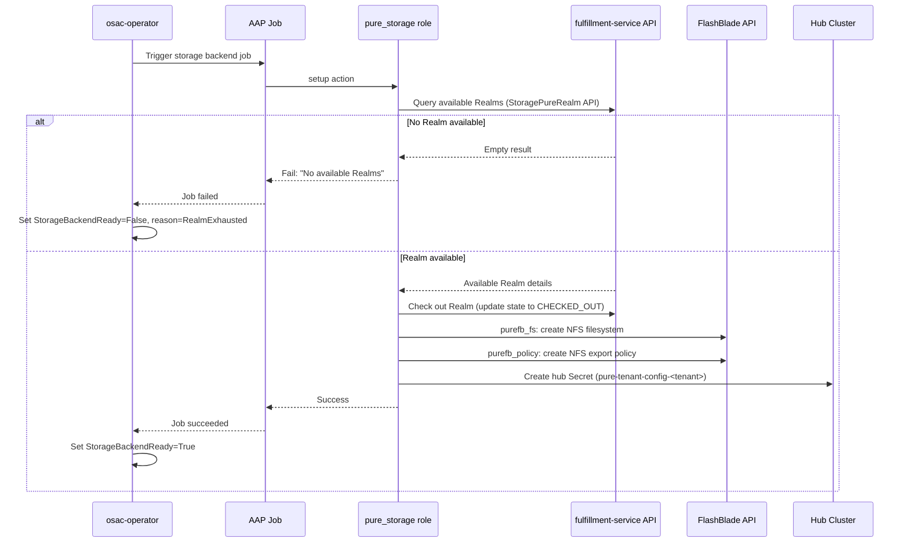

# Pure Storage FlashBlade File Storage (NFS) Provider

## Summary

This enhancement adds Pure Storage FlashBlade as an NFS file storage provider in OSAC by implementing: (1) a new `pure_storage` Ansible template role that integrates with the existing provider-agnostic storage dispatch system, (2) a Realm pool management mechanism for tracking pre-created Realm checkout state (proposed as a `StoragePureRealm` fulfillment-service DB object with private CRUD API; the storage mechanism and API shape depend on the resolution of OQ-4), and (3) integration with the osac-csi-driver for CSI provisioning on workload clusters. The AAP role manages Realm checkout/release lifecycle via the fulfillment-service API, provisions FlashBlade resources within Realms using the `purestorage.flashblade` Ansible collection, and creates tenant-isolated StorageClasses with OSAC labels. The osac-csi-driver's existing Pure controller chart handles CSI operations — no vendor-specific components are installed directly on tenant clusters. See [PRD](prd.md) for detailed requirements.

## Motivation

OSAC currently supports only VAST as a file storage backend. Datacenters running Pure Storage FlashBlade hardware cannot provision tenant-isolated NFS storage through OSAC, forcing manual configuration outside the platform. FlashBlade is a widely deployed enterprise file and object storage platform with built-in multi-tenancy through Secure Multi-Tenancy (SMT) Realms, making it a natural fit for OSAC's per-tenant isolation model.

The existing storage provider dispatch system (`osac.service.storage_provider`) is already dynamic: adding a `provider: "pure"` entry to `STORAGE_TIERS` automatically dispatches to `osac.templates.pure_storage`. This design leverages that extensibility, requiring a new template role, a fulfillment-service API for Realm pool management, and verification of the osac-csi-driver's Pure backend compatibility. The osac-operator's StorageReconciler discovers StorageClasses by OSAC labels, not by provider type, so Pure-backed StorageClasses integrate into the existing tenant storage resolution without operator changes.

The key design challenge is Realm pool management. Unlike VAST, where OSAC creates tenants on-demand via the VAST VMS API, FlashBlade Realms must be pre-created by array administrators and "checked out" to OSAC tenants during onboarding. This introduces pool state tracking, checkout/release semantics, and exhaustion handling. Realm pool state is tracked as `StoragePureRealm` objects in the fulfillment-service database, managed via the private API. This approach provides schema validation, query support, and a first-class API for Cloud Infrastructure Admins to manage Realms through osac-cli or the admin UI — without requiring K8s-native resources or reconciliation controllers.

### Goals

- Reuse the existing storage provider dispatch and four-action interface (`setup`, `ensure_storage_class`, `teardown_cluster_storage`, `teardown_backend`) without modifying the dispatcher, playbooks, or operator.
- Produce StorageClasses with identical OSAC label semantics to VAST (`osac.openshift.io/tenant`, `osac.openshift.io/storage-tier`, `osac.openshift.io/storage-protocol`, `app.kubernetes.io/managed-by: osac-aap`) so the operator, UI, and compute instance controllers discover them without modification.
- Integrate with osac-csi-driver for CSI provisioning — vendor CSI controller on hub, OSAC CSI driver on tenant clusters — with no vendor-specific components installed directly on tenant clusters.
- Use Realm-scoped API tokens exclusively for storage operations within a Realm, limiting blast radius to a single tenant's Realm.
- Support both CaaS and VMaaS provisioning targets.
- Surface Realm exhaustion as a clear error with blocked status on the Tenant CR.
- Track Realm pool state in the fulfillment-service database with a private CRUD API, enabling Cloud Infrastructure Admins to manage Realms via osac-cli.

### Non-Goals

- FlashBlade S3/object storage support (object storage requires COSI).
- FlashArray block storage support (not deployed in current datacenter configurations).
- Admin-facing UI for Realm pool management or storage backend registration — each storage backend requires provider-specific configuration (e.g., Realm pools, VIP pools), making a unified cross-provider admin UI impractical; if admin UI is needed, it would be provider-specific and a separate feature.
- Pure Fusion fleet-level orchestration (not yet GA; targeted FY2027).
- Realm creation or destruction by OSAC — Realm lifecycle is an external admin operation.

## Proposal

This enhancement introduces three components:

1. **`StoragePureRealm` fulfillment-service API.** A new DB object with private CRUD service for managing Pure Realm pool entries. Each Realm entry is tied to a `StorageBackend` via `backend_id` and tracks checkout state (available/checked-out, tenant assignment, timestamp). Cloud Infrastructure Admins register pre-created Realms via the fulfillment-service private API. During `setup`, the AAP role queries the API for an available Realm and checks it out. During `teardown_backend`, the Realm is released back to the pool. OSAC never creates or destroys Realms — only releases them.

2. **`pure_storage` Ansible template role.** A new template role at `osac-aap/collections/ansible_collections/osac/templates/roles/pure_storage/` that implements the four storage provider actions against Pure Storage FlashBlade. The `setup` action queries the fulfillment-service API for an available Realm, checks it out, uses the `purestorage.flashblade` Ansible collection to create NFS filesystems and export policies within the Realm, and persists the Realm configuration to a hub Secret. The `ensure_storage_class` action creates a credential Secret on the hub cluster for the osac-csi-driver Pure controller and creates per-tier NFS StorageClasses with OSAC labels on the tenant cluster.

3. **osac-csi-driver Pure backend verification.** The osac-csi-driver already includes a Pure controller chart (`charts/csi-backends/templates/pure-controller.yaml`) using the `px-pure-csi-driver` image. This design verifies FlashBlade NFS compatibility with the existing chart and documents any configuration changes needed for Realm support.

The dispatcher routes to the AAP role automatically when `STORAGE_TIERS` contains entries with `"provider": "pure"`. No changes to the dispatcher, existing playbooks, or osac-operator are required.

### Workflow Description

#### Cloud Infrastructure Admin: Backend Registration

Starting state: A Pure Storage FlashBlade array is deployed with Purity//FB 4.6.1+ and network connectivity from workload clusters to the management API and NFS data network. The osac-csi-driver is deployed with the Pure backend enabled.

1. The Cloud Infrastructure Admin creates FlashBlade Realms on the array using the Pure Storage management console or API. Each Realm is configured with capacity quotas and QoS rate limits appropriate for a single tenant.

2. The admin registers a `StorageBackend` with `provider: "pure"` via the fulfillment-service private API, providing the FlashBlade management endpoint. The admin creates `StorageTier` resources via the same API, associating tiers with the backend and specifying `protocol: NFS`.

3. For each Realm, the admin generates a Realm-scoped API token with `storage_admin` role and registers a `StoragePureRealm` entry via the fulfillment-service private API:

   ```text
   StoragePureRealm {
     backend_id: "<storage-backend-id>"
     realm_name: "realm-01"
     mgmt_endpoint: "<fb-management-vip>"
     nfs_endpoint: "<fb-nfs-data-vip>"
     api_token: "<realm-scoped-api-token>"  // stored encrypted
     state: AVAILABLE
   }
   ```

4. The admin updates the `STORAGE_TIERS` ConfigMap entry to include Pure tiers:

   ```json
   [
     {"name": "pure-standard", "protocol": "nfs", "provider": "pure"},
     {"name": "pure-high-perf", "protocol": "nfs", "provider": "pure"}
   ]
   ```

5. The `StorageBackend` status shows the count of available Realms in the pool (available/total), enabling the admin to monitor pool capacity.

#### Cloud Provider Admin: Tenant Onboarding

Starting state: A Tenant CR is created. The osac-operator's StorageReconciler detects no hub Secret for the tenant and triggers the `osac-create-tenant-storage-backend` AAP job template (Stage 1).



The diagram shows the `setup` action flow. The role queries the fulfillment-service API for an available Realm, checks it out, provisions FlashBlade resources within the Realm, and persists the tenant configuration to a hub Secret.

1. The `setup` action queries the fulfillment-service private API for `StoragePureRealm` entries with `state: AVAILABLE` for the relevant `StorageBackend`.

2. It selects the first available Realm. If none are available, the task fails with: `"No available Realms in the Pure FlashBlade pool. Register additional Realms or tear down unused tenants."`

3. It checks out the Realm by updating its state to `CHECKED_OUT` with the tenant name and timestamp via the fulfillment-service API.

4. It provisions FlashBlade resources within the Realm (NFS filesystems and export policies). The credential flow for this step depends on the resolution of OQ-4: (A) the `setup` action retrieves the Realm-scoped API token from the fulfillment-service API response and calls FlashBlade directly, (B) the `setup` action invokes a provider-supplied admin playbook that handles FlashBlade operations with its own credentials, or (C) the `setup` action calls a CSP-managed shim service. The remainder of this design uses Approach A as the default.

5. It persists the tenant configuration to a hub Secret labeled `osac.openshift.io/tenant: <tenant-name>`:

   ```yaml
   apiVersion: v1
   kind: Secret
   metadata:
     name: pure-tenant-config-<tenant-name>
     namespace: osac-system
     labels:
       app.kubernetes.io/managed-by: osac-aap
       osac.openshift.io/tenant: "<tenant-name>"
   type: Opaque
   stringData:
     storage_provider_type: "pure"
     realm_name: "<realm-name>"
     api_token: "<realm-scoped-api-token>"
     mgmt_endpoint: "<fb-management-vip>"
     nfs_endpoint: "<fb-nfs-data-vip>"
   ```

6. The operator detects the hub Secret and sets `StorageBackendReady=True`.

7. The operator triggers `osac-create-tenant-cluster-storage` (Stage 2). The `ensure_storage_class` action:
   - Appends the tenant's Realm-scoped credentials to the shared Pure controller credential Secret (`pure-csi-credentials`) on the hub cluster in the `osac-csi-backends` namespace, using optimistic-locking read-modify-write for concurrent safety.
   - Creates per-tier NFS StorageClasses on the tenant cluster with `provisioner: osac.csi.openshift.io`, OSAC labels, and PX-CSI backend parameters.
   - Does not create VolumeSnapshotClasses (snapshot restore is unsupported with Realm-scoped credentials in PX-CSI 26.2.0).

8. The operator discovers the new StorageClasses by label and populates `Tenant.status.storageClasses`.

#### Cloud Provider Admin: Tenant Offboarding

Starting state: A Tenant CR is being deleted.

1. The operator triggers `osac-delete-tenant-cluster-storage`. The `teardown_cluster_storage` action removes StorageClasses from the target tenant cluster.

2. The operator triggers `osac-delete-tenant-storage-backend`. The `teardown_backend` action:
   - Reads the hub Secret to identify the Realm.
   - Removes NFS export policies and filesystems within the Realm using the Realm-scoped token.
   - Removes the tenant's Realm entry from the shared Pure controller credential Secret (`pure-csi-credentials`) using optimistic-locking read-modify-write. If the resulting `FlashBlades` array is empty, deletes the Secret entirely.
   - Deletes the hub Secret.
   - Releases the Realm by updating its `StoragePureRealm` state to `AVAILABLE` via the fulfillment-service API only after all cleanup steps succeed. The release request includes the owning tenant name and expected row version to prevent a delayed teardown from releasing a Realm checked out by another tenant. If cleanup fails, the Realm is moved to `CLEANUP_REQUIRED` state instead.

OSAC never destroys Realms. Physical Realm destruction is an external admin operation performed on the FlashBlade management console.

#### Tenant Admin / Tenant User: Storage Consumption

Starting state: Tenant onboarding is complete. StorageClasses are visible on the workload cluster.

1. The Tenant Admin or User discovers available StorageClasses through the OSAC console (which reads `Tenant.status.storageClasses` from the public API), or via `kubectl get storageclass -l osac.openshift.io/tenant=<tenant-name>`.

2. The user creates PVCs referencing the Pure-backed StorageClass. The OSAC CSI driver on the tenant cluster proxies the provisioning request to the Pure controller on the hub, which provisions NFS volumes within the tenant's Realm on FlashBlade.

#### Error Handling

**Realm exhaustion:** The `setup` action fails with a descriptive error message. The AAP job reports failure. The operator sets `StorageBackendReady=False` with `reason: RealmExhausted`. The operator does not retry automatically (matching existing VAST behavior for backend failures). The Cloud Provider Admin sees the condition on the Tenant CR and the `StorageBackend` status shows zero available Realms. The Cloud Infrastructure Admin can register additional Realms via the fulfillment-service API.

**FlashBlade API unreachable:** The `setup` action's `purefb_fs` or `purefb_policy` calls fail with a connection error. The block/rescue pattern rolls back any partially-created FlashBlade resources and releases the Realm back to available via the fulfillment-service API. The AAP job reports failure with the connection error.

**Network connectivity:** If the workload cluster cannot reach the FlashBlade NFS data VIP, PVC provisioning fails at the CSI level. This manifests as PVCs stuck in Pending state. The Tenant Admin sees the PVC event. Network connectivity is an infrastructure prerequisite documented in the PRD Assumptions section.

### API Extensions

**fulfillment-service (NEW):** A new `StoragePureRealm` proto type with private CRUD service is introduced. Each Realm entry references a `StorageBackend` via `backend_id` and tracks checkout state. The `StorageBackend` status gains a Realm availability summary (available/total count). See "StoragePureRealm API" section below for details.

**osac-operator:** No code changes. The `StorageReconciler` discovers Pure-backed StorageClasses via the same label-based mechanism it uses for VAST.

**osac-aap:** The dispatcher includes the new role via the existing dynamic dispatch pattern (`include_role: name: "osac.templates.{{ _current_provider }}_storage"`). No changes to the dispatcher or playbooks.

**osac-csi-driver:** The existing Pure controller chart is verified for FlashBlade NFS compatibility. Configuration updates may be needed for Realm support in the `pure.json` credential format.

### Implementation Details/Notes/Constraints

#### StoragePureRealm API (fulfillment-service)

A new `StoragePureRealm` proto type and private CRUD service are added to the fulfillment-service, following the `GenericServer`/`GenericDAO` pattern established by `StorageBackend` and `StorageTier`.

**Proto definition (`storage_pure_realm_type.proto`):**

```protobuf
message StoragePureRealm {
  ResourceMetadata metadata = 1;
  string backend_id = 2;         // References StorageBackend with provider="pure"
  StoragePureRealmSpec spec = 3;
  StoragePureRealmStatus status = 4;
}

message StoragePureRealmSpec {
  string realm_name = 1;
  string mgmt_endpoint = 2;
  string nfs_endpoint = 3;
  optional string api_token = 4; // Write-only. Stored encrypted; redacted on
                                 // Get/List responses. Returned only from the
                                 // atomic checkout Signal RPC. Present in
                                 // Approach A (OQ-4); omitted in Approaches B
                                 // and C where credentials are external to OSAC.
}

message StoragePureRealmStatus {
  StoragePureRealmState state = 1;
  optional string tenant = 2;           // Tenant name if checked out
  optional string checked_out_at = 3;   // ISO 8601 timestamp
}

enum StoragePureRealmState {
  STATE_UNSPECIFIED = 0;
  STATE_AVAILABLE = 1;
  STATE_CHECKED_OUT = 2;
  STATE_CLEANUP_REQUIRED = 3;  // Teardown failed; Realm needs manual cleanup
}
```

**Service (`storage_pure_realms_service.proto`):**

Standard private CRUD service: `Create`, `Get`, `List`, `Update`, `Delete`, `Signal`. The `api_token` field is write-only: `Get` and `List` responses redact it (return empty string). The token is returned only from the `Signal` RPC's atomic checkout operation, ensuring credentials are exposed only at the point of use. The `List` RPC supports filtering by `backend_id` and `state` (e.g., `filter: "backend_id = 'xxx' AND state = 'AVAILABLE'"`).

**Database migration:**

New `storage_pure_realms` table with columns mapping to the proto fields. The `api_token` column is encrypted at rest using the existing fulfillment-service credential encryption mechanism. A unique constraint on `(backend_id, realm_name)` prevents duplicate Realm registrations.

**Checkout atomicity:**

The `Signal` RPC (or a custom `CheckoutRealm` RPC) handles atomic checkout: read-modify-write with optimistic locking via the row version. If two concurrent requests race, one gets a conflict and retries. The release operation similarly requires the current tenant name and expected row version — this prevents a delayed teardown from releasing a Realm that has already been checked out by another tenant. This replaces the ConfigMap `resourceVersion`-based approach with proper database-level concurrency control.

**StorageBackend status extension:**

The `StorageBackend` status is extended with a Realm availability summary:

```protobuf
message StorageBackendStatus {
  // ... existing fields ...
  optional int32 realms_available = 10;  // Count of AVAILABLE Realms
  optional int32 realms_total = 11;      // Total Realm count
}
```

This is computed on-read (count query on `storage_pure_realms` table filtered by `backend_id`).

#### Template Role Structure

The `pure_storage` role lives at `osac-aap/collections/ansible_collections/osac/templates/roles/pure_storage/` and follows the four-action pattern established by `vast_storage`:

```text
pure_storage/
  meta/
    osac.yaml           # Role metadata
  defaults/
    main.yaml           # Pure-specific defaults
  tasks/
    setup.yaml          # Stage 1: Realm checkout + FlashBlade provisioning
    ensure_storage_class.yaml  # Stage 2: CSI credential + StorageClass creation
    teardown_cluster_storage.yaml  # Cluster-side cleanup
    teardown_backend.yaml          # Backend cleanup + Realm release
    read_realm_credentials.yaml    # Read Realm credentials from hub Secret
```

**`meta/osac.yaml`:**

```yaml
---
title: Pure Storage FlashBlade Provider
description: >
  Provisions Pure Storage FlashBlade NFS storage for OSAC tenants.
  Uses pre-created Realms with Realm-scoped API tokens for tenant isolation.
  Integrates with osac-csi-driver for CSI provisioning. Creates K8s Secrets
  and StorageClasses with OSAC labels. Admin credentials never enter
  tenant-namespace Secrets.

template_type: storage_provider
implementation_strategy: pure
capabilities:
  supported_protocols:
    - nfs
  provisioning_targets:
    - vmaas
    - hcp_control_plane
    - hcp_worker_root
    - hcp_data_plane
```

#### Default Variables (`defaults/main.yaml`)

```yaml
---
# CSI provisioner name — OSAC CSI driver (vendor controllers run on hub)
pure_storage_csi_provisioner: "osac.csi.openshift.io"

# Hub Secret prefix for per-tenant Pure config
pure_storage_tenant_config_secret_prefix: "pure-tenant-config-"

# Namespace for hub-cluster config Secrets
pure_storage_config_namespace: "{{ lookup('env', 'OSAC_STORAGE_CONFIG_NAMESPACE') | default('osac-system', true) }}"

# osac-csi-driver Pure controller credential Secret (shared, multi-Realm)
pure_storage_csi_backends_namespace: "osac-csi-backends"
pure_storage_csi_credential_secret_name: "pure-csi-credentials"

# Realm NFS server and policy names are read from the hub Secret at runtime
# (configured during Realm setup, not defaulted here)

# Default NFS version for mount options
pure_storage_nfs_version: "nfsvers=4.1"

# TLS certificate validation for FlashBlade API
pure_storage_validate_certs: "{{ lookup('env', 'PURE_VALIDATE_CERTS') | default('true', true) | bool }}"

# fulfillment-service API endpoint for Realm management
pure_storage_fulfillment_api: "{{ lookup('env', 'FULFILLMENT_API_ENDPOINT') | default('fulfillment-api.osac.svc.cluster.local:443', true) }}"
```

#### Realm Pool Management via fulfillment-service API

Realm pool state is managed through the `StoragePureRealm` private API in the fulfillment-service. This replaces the ConfigMap-based approach.

The `setup` action queries the fulfillment-service API for available Realms:

```yaml
- name: Query fulfillment-service for available Pure Realms
  ansible.builtin.uri:
    url: "https://{{ pure_storage_fulfillment_api }}/api/private/v1/storage-pure-realms?filter=backend_id%3D%27{{ _backend_id }}%27%20AND%20state%3D%27AVAILABLE%27&size=1"
    method: GET
    headers:
      Authorization: "Bearer {{ _service_account_token }}"
    validate_certs: "{{ pure_storage_validate_certs }}"
  register: _pure_available_realms
```

The `teardown_backend` action releases a Realm:

```yaml
- name: Release Realm back to pool via fulfillment-service
  ansible.builtin.uri:
    url: "https://{{ pure_storage_fulfillment_api }}/api/private/v1/storage-pure-realms/{{ _pure_realm_id }}/signal"
    method: POST
    body_format: json
    body:
      action: "release"
      tenant: "{{ _tenant_name }}"
      version: "{{ _pure_realm_version }}"
    headers:
      Authorization: "Bearer {{ _service_account_token }}"
    validate_certs: "{{ pure_storage_validate_certs }}"
  no_log: true
```

A fulfillment-service API (rather than ConfigMaps) is chosen because: (a) it provides schema validation and proper concurrency control via database transactions, (b) it enables management through osac-cli and admin UI without kubectl access, (c) it supports multi-backend scenarios (same provider, multiple FlashBlade installations) via the `backend_id` foreign key, (d) it aligns with the established pattern for `StorageBackend` and `StorageTier`, and (e) it allows the `StorageBackend` status to surface Realm availability counts.

#### Hub Secret Format for Pure

The hub Secret persisted during `setup` stores the Realm credentials and endpoint information needed by `ensure_storage_class` to create the CSI credential Secret on the hub cluster for the Pure controller:

```yaml
stringData:
  storage_provider_type: "pure"
  realm_name: "<realm-name>"
  api_token: "<realm-scoped-api-token>"
  mgmt_endpoint: "<fb-management-vip>"
  nfs_endpoint: "<fb-nfs-data-vip>"
  nfs_server: "<realm-nfs-server-name>"
  nfs_policy: "<realm-nfs-policy-name>"
```

The `ensure_storage_class` action reads this Secret and adds the tenant's Realm credentials to the shared Pure controller credential Secret on the hub cluster. The `pure.json` format supports multiple `FlashBlades` entries, enabling a single Pure controller to serve multiple tenants via credential multiplexing:

```json
{
  "FlashBlades": [
    {
      "MgmtEndPoint": "<mgmt_endpoint>",
      "APIToken": "<api_token_tenant_1>",
      "NFSEndPoint": "<nfs_endpoint>",
      "Realm": "<realm_name_tenant_1>"
    },
    {
      "MgmtEndPoint": "<mgmt_endpoint>",
      "APIToken": "<api_token_tenant_2>",
      "NFSEndPoint": "<nfs_endpoint>",
      "Realm": "<realm_name_tenant_2>"
    }
  ]
}
```

Each tenant's Realm entry is appended to the `FlashBlades` array. The `teardown_backend` action removes only the tenant's entry from the array without affecting other tenants' credentials.

#### osac-csi-driver Integration

The osac-csi-driver provides vendor-agnostic CSI provisioning for OSAC. Per the OSAC-2872 architecture:

- **Hub cluster:** Vendor-specific CSI controllers run in the `osac-csi-backends` namespace. A single Pure controller (`pure-csi-controller`) using the `portworx/px-pure-csi-driver` image (tag `26.2.0`) serves all tenants. It mounts the shared `pure.json` credential Secret containing one `FlashBlades` entry per tenant Realm. The PX-CSI driver selects the correct Realm credentials based on the StorageClass parameters.
- **Tenant cluster:** The OSAC CSI driver (controller + node DaemonSet) runs with provisioner `osac.csi.openshift.io`. It proxies CSI calls to the Pure controller on the hub.

The AAP `ensure_storage_class` action:

1. Updates the shared Pure controller credential Secret (`pure-csi-credentials`) in the `osac-csi-backends` namespace on the hub cluster using an optimistic-locking read-modify-write: reads the Secret (capturing `resourceVersion`), appends the tenant's Realm entry to the `FlashBlades` array, and writes it back with the captured `resourceVersion`. If the write conflicts (another onboarding or offboarding updated the Secret concurrently), the task retries from the read step (up to 3 retries). If the Secret does not exist, it creates it with the tenant's entry.
2. Creates StorageClasses on the tenant cluster with `provisioner: osac.csi.openshift.io` and backend-specific parameters including the `pure_realm` Realm selector.

The OSAC CSI driver installation on hub and tenant clusters is handled by osac-installer, not by the Pure AAP role. The AAP role manages per-tenant entries in the shared credential Secret and per-tenant StorageClasses.

**PX-CSI Secret reload behavior:** After `ensure_storage_class` or `teardown_backend` updates the shared `pure.json` Secret, the Pure controller must pick up the changes. If PX-CSI watches the mounted Secret for changes and hot-reloads, no further action is needed. If PX-CSI does not hot-reload, the AAP role must restart the Pure controller pod after updating the Secret. The restart causes a brief unavailability window for in-flight provisioning requests across all tenants. This behavior must be verified during implementation (see OQ-3).

#### StorageClass Creation

Per-tier NFS StorageClasses are created on the tenant cluster with OSAC CSI driver parameters and OSAC labels:

```yaml
apiVersion: storage.k8s.io/v1
kind: StorageClass
metadata:
  name: "pure-nfs-<tenant_name>-<tier_name>"
  labels:
    app.kubernetes.io/managed-by: osac-aap
    osac.openshift.io/tenant: "<tenant_name>"
    osac.openshift.io/storage-tier: "<tier_name>"
    osac.openshift.io/storage-protocol: "nfs"
provisioner: osac.csi.openshift.io
parameters:
  backend: "pure_file"
  pure_realm: "<realm-name>"
  pure_nfs_server: "<realm-nfs-server-name>"
  pure_nfs_policy: "<realm-nfs-policy-name>"
  pure_nfs_endpoint: "<nfs-data-vip>"
mountOptions:
  - nfsvers=4.1
  - tcp
reclaimPolicy: Delete
volumeBindingMode: Immediate
```

The `pure_realm` parameter is the Realm selector — PX-CSI uses it to match the provisioning request to the correct `FlashBlades` entry in `pure.json` by Realm name. The naming convention (`pure-nfs-<tenant>-<tier>`) and label set are consistent with the VAST role's pattern (`vast-nfs-<tenant>-<tier>`).

#### VolumeSnapshotClass Creation

VolumeSnapshotClass creation is **disabled** for Pure FlashBlade Realm-backed storage. PX-CSI 26.2.0 does not support restoring FlashBlade Realm snapshots with Realm-scoped credentials — the documented workaround requires array-scoped credentials, which would violate the tenant-isolated `pure.json` Secret design. The `ensure_storage_class` action does not create `pure-snapshot-*` VolumeSnapshotClasses, and the `teardown_cluster_storage` action does not attempt to remove them.

Snapshot support may be re-evaluated when a future PX-CSI release adds Realm-scoped snapshot restore, or if the credential model changes to allow array-scoped tokens for snapshot operations without exposing them to tenants.

#### Instance Group Configuration

The IG configuration for Pure is simplified compared to the original design — Realm pool management has moved to the fulfillment-service API, and OSAC no longer needs array-admin credentials.

**ConfigMap (`configmap-storage-operations-ig-example.yaml`, updated):**

```yaml
STORAGE_TIERS: |
  [
    {"name": "pure-standard", "protocol": "nfs", "provider": "pure"},
    {"name": "pure-high-perf", "protocol": "nfs", "provider": "pure"}
  ]
```

No `PURE_REALM_POOL` or `PURE_REALM_REUSE` configuration is needed — Realm management is handled entirely through the fulfillment-service API.

No `PURE_ARRAY_ADMIN_TOKEN` or `PURE_MGMT_ENDPOINT` Secret entries are needed — OSAC does not perform Realm lifecycle operations (create/destroy). Realm-scoped API tokens are stored in `StoragePureRealm` objects.

#### Ansible Collection Vendoring

The `purestorage.flashblade` collection (v1.26.0+) must be added to `osac-aap/collections/requirements.yml` and vendored into the `vendor/` directory. Its Python dependency `py-pure-client` must be added to the execution environment's Python requirements.

### Security Considerations

**Credential scope.** OSAC operates with a single credential scope: the Realm-scoped API token (`storage_admin` role), which limits blast radius to a single tenant's Realm. The same token is copied to multiple storage locations during the provisioning lifecycle:

| Storage location | Purpose | Written by | Read by |
|---|---|---|---|
| `StoragePureRealm` DB object (encrypted) | Source of truth for Realm credentials (Approach A only) | Admin via fulfillment-service API | `setup` action (atomic checkout) |
| Hub Secret (`pure-tenant-config-<tenant>`) | Per-tenant Realm config for AAP actions | `setup` action | `ensure_storage_class`, `teardown_backend` |
| Pure controller credential Secret (`pure.json`) | CSI driver runtime credentials | `ensure_storage_class` action | osac-csi-driver Pure controller |

OSAC does not hold array-admin credentials. Realm lifecycle operations (create/destroy) are external admin operations. Realm-scoped tokens limit blast radius: a compromised token can affect only the tenant's Realm, not other tenants or the array.

**Token rotation and revocation.** Because the same token is stored in three locations, rotation and revocation require synchronized updates:

1. The Cloud Infrastructure Admin generates a new Realm-scoped API token on the FlashBlade array and updates the `StoragePureRealm` entry via the fulfillment-service API (new token replaces the old one).
2. The admin triggers a re-run of the `setup` action for the affected tenant. The action retrieves the new token from the fulfillment-service API and updates the hub Secret.
3. The `ensure_storage_class` action updates the tenant's entry in the shared `pure.json` credential Secret with the new token.

For emergency revocation, the admin revokes the token on the FlashBlade array. This immediately prevents new CSI provisioning operations (the Pure controller cannot authenticate). The admin then updates the fulfillment-service and hub Secret with a replacement token, or moves the Realm to `CLEANUP_REQUIRED` state if the tenant is being decommissioned. Stale tokens in the hub Secret and `pure.json` do not grant access after array-side revocation.

**Vendor credentials stay on hub.** Per the osac-csi-driver architecture (OSAC-2872), vendor CSI controller credentials are stored on the hub cluster in the `osac-csi-backends` namespace. No vendor-specific credentials are placed on tenant clusters. The OSAC CSI driver on tenant clusters proxies CSI calls to the hub without needing vendor credentials.

**Secret management (depends on OQ-4).** The credential flow varies by approach:
- **Approach A:** Realm-scoped API tokens are provided by the Cloud Infrastructure Admin during Realm registration via the fulfillment-service API. The fulfillment-service stores them encrypted in the database. During `setup`, the AAP role retrieves the token from the API response and uses it for FlashBlade operations and CSI credential Secret creation.
- **Approach B:** OSAC never stores Realm-scoped tokens. The admin-supplied playbook handles FlashBlade operations using credentials it manages independently (vault, environment variables, or runtime prompts). The non-admin playbook only handles the results (hub Secret, StorageClasses). Different datacenters supply different admin playbooks matching their credential management practices.
- **Approach C:** OSAC never stores Realm-scoped tokens. A CSP-managed shim service handles FlashBlade operations and credential management externally.

In all approaches, all Ansible tasks that handle API tokens, credential Secrets, or `pure.json` content must use `no_log: true` to prevent tokens from appearing in AAP job logs or controller history. Error responses from token-bearing API calls (fulfillment-service Realm retrieval, FlashBlade API) must be redacted before surfacing in task output. The `always` block in `setup` and `ensure_storage_class` clears all credential facts from play scope after use, matching the VAST role's pattern.

**Tenant isolation on FlashBlade.** Realms provide management-plane isolation (resources within a Realm are invisible to other Realm-scoped tokens). NFS data-plane isolation relies on export policies created by the Pure role restricting client access. Network-level isolation (workload cluster pod CIDRs reaching only their assigned Realm's NFS endpoint) is an infrastructure prerequisite.

### Failure Handling and Recovery

**Realm checkout failure (pool exhausted).** The `setup` task queries the fulfillment-service API for available Realms. If the response is empty, it fails with: `"No available Realms in the Pure FlashBlade pool."` No Realm is checked out, no hub Secret is created. The AAP job fails. The operator sets `StorageBackendReady=False`. The `StorageBackend` status shows zero available Realms. Recovery: admin registers additional Realms via the fulfillment-service API. The operator retries on the next reconciliation trigger.

**FlashBlade API failure during setup.** The `setup` task uses a `block/rescue` pattern. On failure: the rescue block removes any partially-created NFS filesystems and export policies, releases the Realm via the fulfillment-service API, and deletes the hub Secret if partially written. The AAP job reports the original error. The role is idempotent: re-running `setup` after a failure retries from scratch.

**CSI credential Secret update failure.** The `ensure_storage_class` action appends the tenant's Realm entry to the shared Pure controller credential Secret on the hub cluster using optimistic-locking read-modify-write. If the write conflicts, the task retries (up to 3 times). If retries are exhausted or the Secret update fails for another reason, subsequent StorageClass creation is skipped. The operator sets `ClusterStorageReady=False`. Recovery: the Cloud Provider Admin investigates the hub cluster state and re-triggers the job.

**StorageClass creation failure.** The `ensure_storage_class` action uses `kubernetes.core.k8s` with `state: present` for idempotent creation. If a StorageClass cannot be created, the task fails. The `always` block clears credential facts. Re-running the action retries creation.

**Controller restart mid-reconciliation.** The operator's `StorageReconciler` is stateless: it re-reads the Tenant CR, checks for the hub Secret, resolves StorageClasses by label, and triggers AAP jobs through the `RunProvisioningLifecycle` pattern. A restart causes a full re-evaluation with no data loss.

**Teardown with missing hub Secret.** If the hub Secret has been deleted before `teardown_backend` runs, the role cannot authenticate to FlashBlade to clean up resources. The role moves the Realm to `CLEANUP_REQUIRED` state via the fulfillment-service API — it does not release the Realm to `AVAILABLE`, since FlashBlade resources may still exist within it. The admin must manually clean up FlashBlade resources within the Realm and then release it to `AVAILABLE` via the fulfillment-service API or osac-cli.

### RBAC / Tenancy

No RBAC or tenancy changes are required beyond the new `StoragePureRealm` private API. The Pure role creates resources with the same tenant isolation metadata as VAST:

- `osac.openshift.io/tenant: <tenant-name>` label on StorageClasses, hub Secrets, and CSI credential Secrets.
- `app.kubernetes.io/managed-by: osac-aap` label on all managed resources.
- The operator filters StorageClasses and hub Secrets by these labels.
- OPA policies enforce tenant isolation at the fulfillment-service API level (unchanged).

The `StoragePureRealm` private API is accessible only to Cloud Infrastructure Admins and Cloud Provider Admins (same authorization as `StorageBackend` and `StorageTier`). Tenants cannot access Realm pool state.

### Observability and Monitoring

Existing monitoring mechanisms apply, plus new Realm pool visibility:

- **AAP job status:** Job success/failure is tracked in `Tenant.status.storageBackendJobs` and `Tenant.status.clusterStorageJobs` by the operator.
- **Tenant conditions:** `StorageBackendReady` and `ClusterStorageReady` conditions surface provisioning state. Realm exhaustion appears as `StorageBackendReady=False` with a descriptive message.
- **StorageBackend status:** The `realms_available` and `realms_total` fields on `StorageBackend` status surface Realm pool utilization. Cloud Provider Admins can monitor pool capacity and anticipate exhaustion before it blocks tenant onboarding.
- **Kubernetes events:** The operator emits `Warning` events for duplicate StorageClasses and `Normal` events for successful provisioning (existing behavior).
- **Ansible task logs:** The Pure role logs Realm checkout/release, FlashBlade API calls, and CSI credential creation steps through standard Ansible output captured by AAP. All secret-bearing tasks use `no_log: true`; token-containing error responses are redacted before output.

### Risks and Mitigations

| Risk | Impact | Mitigation |
|---|---|---|
| Realm-scoped tokens may not work with all `purestorage.flashblade` modules | Backend provisioning within a Realm fails; must fall back to array-admin tokens, increasing blast radius | Validate during implementation with a test FlashBlade. If confirmed, use array-admin tokens for provisioning but scope CSI driver tokens per-Realm |
| osac-csi-driver Pure controller may not support FlashBlade NFS (only FlashArray block) | Cannot use osac-csi-driver for Pure NFS; would need to extend the Pure controller chart or add a FlashBlade-specific controller | Verify during implementation. The `pure.json` format supports `FlashBlades` entries, suggesting the driver supports FlashBlade. Chart may need FlashBlade-specific configuration |
| osac-csi-driver Pure controller supports only one Realm per deployment | Multi-tenant support requires one Pure controller per tenant on the hub, increasing hub resource usage | Investigate during implementation. May require chart changes to support per-tenant Pure controller deployments or credential multiplexing |
| fulfillment-service API token storage for Realm credentials adds a new encryption requirement (Approach A only, see OQ-4) | Sensitive credentials in the database require proper encryption at rest | Use the existing fulfillment-service credential encryption mechanism (same pattern as `StorageBackendCredentials`). Approaches B and C avoid this risk entirely by keeping credentials external to OSAC |

### Drawbacks

The Realm pool model introduces operational complexity compared to VAST's on-demand tenant creation. Admins must pre-create Realms on FlashBlade, generate API tokens, and register them via the fulfillment-service private API. If the Realm pool is undersized, tenant onboarding blocks until more Realms are registered.

This complexity is inherent to FlashBlade's multi-tenancy architecture: Realm creation requires array-admin privileges that OSAC should not hold at runtime. The trade-off is justified because: (a) Realm-scoped tokens provide genuine isolation, (b) the pool model matches Pure's SAW reference architecture, and (c) the alternative (OSAC holding array-admin credentials and creating Realms on-demand) would violate the least-privilege principle.

Adding a `StoragePureRealm` type to the fulfillment-service introduces provider-specific schema into a previously provider-agnostic service. However, this is consistent with the direction established by `StorageBackend` (which already has a `provider` discriminator) and with reviewer feedback that provider-specific pool concepts (Realms for Pure, VIPPools for VAST) warrant dedicated objects. The alternative (generic pool abstraction) would be premature given that only two providers exist.

## Alternatives (Not Implemented)

### Alternative 1: OSAC Creates Realms On-Demand

Instead of pre-created Realms, OSAC could create a new Realm for each tenant during `setup`, similar to how VAST creates tenants on-demand.

**Pros:** Eliminates the Realm pool registration workflow. No pool exhaustion concern.
**Cons:** Requires OSAC to hold array-admin credentials at runtime, violating least privilege. Realm creation is a privileged operation that datacenter admins may not want automated. Realm naming and sizing decisions belong to infrastructure admins.
**Rejected because:** The PRD explicitly specifies pre-created Realms via config-file registration. Additionally, reviewer feedback mandates that OSAC cannot create or destroy Realms.

### Alternative 2: ConfigMap-Based Realm Pool State

Track Realm checkout state in a K8s ConfigMap (`pure-realm-pool-tracker` in `osac-system`) with JSON data mapping Realm names to checkout status.

**Pros:** Simple implementation, AAP jobs already interact with K8s resources, no fulfillment-service changes.
**Cons:** No schema validation, no RBAC beyond namespace-level access, requires kubectl for admin management, no proper concurrency control (relies on `resourceVersion` optimistic locking), does not support multi-backend scenarios without additional structure, cannot surface pool status via the fulfillment-service API.
**Rejected because:** Reviewer feedback mandates that Realm pool tracking uses fulfillment-service DB objects with a private API, not K8s resources. The database approach provides proper concurrency control, admin-friendly API access, and integration with `StorageBackend` status.

### Alternative 3: Direct Vendor CSI Installation via OLM

Install the Portworx Enterprise Operator via OLM directly on workload clusters, matching the original design approach.

**Pros:** Simple, well-documented installation path. Portworx Enterprise Operator is Red Hat-certified.
**Cons:** Violates OSAC's CSI architecture (OSAC-2872) which mandates all vendor CSI integrations go through osac-csi-driver. Places vendor credentials on tenant clusters. Inconsistent with the hub-controller/tenant-node-plugin split.
**Rejected because:** Reviewer feedback mandates osac-csi-driver integration. The Pure controller chart already exists in osac-csi-driver. Vendor credentials must stay on the hub cluster.

### Alternative 4: Legacy `pure-csi` Driver

Use the original PSO (`pure-csi`) driver instead of PX-CSI.

**Pros:** Simpler installation (Helm only), fewer dependencies.
**Cons:** Deprecated since January 2022 with no active maintenance. No Realm support. End-of-support reached.
**Rejected because:** Using a deprecated driver is a liability. PX-CSI is the only supported CSI driver for Pure Storage.

## Open Questions

### OQ-1: FlashBlade Compatibility with osac-csi-driver Pure Controller

The existing Pure controller chart (`charts/csi-backends/templates/pure-controller.yaml`) uses the `portworx/px-pure-csi-driver` image. Does this image support FlashBlade NFS in addition to FlashArray block? The `pure.json` format supports `FlashBlades` entries, suggesting compatibility, but this needs verification. What configuration differences exist for FlashBlade vs. FlashArray?

**Impact:** If the existing chart does not support FlashBlade NFS, the chart needs to be extended or a separate FlashBlade controller needs to be added.

**Owner:** Storage team / osac-csi-driver maintainers

### OQ-2: FlashBlade Servers vs. Realms for NFS Data-Plane Isolation

FlashBlade supports both "servers" (data access isolation for NFS/SMB) and "Realms" (management/administrative isolation). PX-CSI requires a Realm-scoped NFS server when `pure_nfs_policy` is specified in StorageClass parameters — `pure_nfs_server` and `pure_nfs_policy` work together, and `pure_export_rules` is mutually exclusive with `pure_nfs_policy`. The design now uses `pure_nfs_policy` + `pure_nfs_server` for Realm-backed StorageClasses, which means the `setup` action must create an NFS server within the Realm during provisioning. The remaining question is how NFS server naming and policy configuration should be structured per Realm.

**Default assumption:** The `setup` action creates an NFS server within the Realm and configures an NFS export policy scoped to that server. The server name and policy name are persisted to the hub Secret and referenced in StorageClass parameters.

**Impact:** The `setup` action includes NFS server creation as a required step (not optional). The `StoragePureRealm` registration may need `server_name` and `policy_name` fields, or these may be derived during setup.

**Owner:** Storage team / Pure Storage SME

### OQ-3: Multi-Realm Support in osac-csi-driver Pure Controller

Each PX-CSI deployment supports only one Realm per FlashBlade array. With the osac-csi-driver architecture (one Pure controller on the hub), how does multi-tenant Realm isolation work? Three options:

- **(a) One Pure controller deployment per tenant.** Each tenant gets its own `pure-csi-controller-<tenant-name>` Deployment and `pure-csi-credentials-<tenant-name>` Secret. Simple credential isolation but resource-heavy (one pod per tenant on the hub).
- **(b) Credential multiplexing in the shared Pure controller.** A single Pure controller with a shared `pure.json` Secret containing one `FlashBlades` entry per tenant Realm. The PX-CSI driver selects the correct Realm credentials based on StorageClass parameters. The `ensure_storage_class` action appends entries on onboarding and removes them on teardown.
- **(c) A shared controller with per-request credential injection.** The OSAC CSI driver injects per-tenant credentials at request time, requiring changes to the CSI proxy layer.

The design adopts **(b)** as the proposed approach.

**Remaining questions:** Does PX-CSI correctly route provisioning requests to the correct `FlashBlades` entry based on the Realm specified in StorageClass parameters? What happens if the shared Secret is updated while a provisioning request is in flight — does the controller hot-reload `pure.json` or require a restart? What concurrency controls are needed for the read-modify-write of the shared Secret when multiple tenants onboard simultaneously?

**Impact:** If PX-CSI does not support multi-Realm credential selection from a single `pure.json`, the fallback is approach (a), which increases hub resource usage.

**Owner:** Storage team / osac-csi-driver maintainers

### OQ-4: Administrative Credential Handling Strategy

How does OSAC handle Realm-scoped API tokens for FlashBlade operations? Three approaches are under consideration, each with different implications for the fulfillment-service data model, AAP playbook structure, and operational responsibility boundaries. **This is the most architecturally significant open question — it affects the StoragePureRealm proto shape, the `setup` action flow, and the security model.**

#### Approach A: Credentials in Fulfillment-Service Database

The admin registers Realms with credentials directly in the `StoragePureRealm` object via the fulfillment-service private API. The `api_token` field is stored encrypted in the database. During `setup`, the AAP role retrieves the token from the API response and uses it to call the FlashBlade API directly (creating filesystems, export policies within the Realm).

**Pros:** Self-contained — all Realm state (pool tracking + credentials) lives in one place. AAP playbooks are uniform: a single `setup` action handles checkout, FlashBlade provisioning, and hub Secret creation. Simple operational model for admins (register once via API, OSAC handles the rest).

**Cons:** Stores sensitive credentials (Realm-scoped API tokens) in the fulfillment-service database, requiring encryption at rest and careful access control. Increases the blast radius of a fulfillment-service DB compromise. Adds a new credential encryption requirement to the fulfillment-service.

**StoragePureRealm shape:** Includes `api_token` in spec. `setup` action retrieves credentials from the API response.

#### Approach B: Split Playbooks into Admin and Non-Admin Roles

Separate the AAP playbooks into provider-supplied admin roles and OSAC-managed non-admin roles. The admin-credential-requiring operations (FlashBlade provisioning within a Realm — creating filesystems, export policies, and any other array-side configuration) are handled by a provider-supplied admin playbook that the CSP administrator provides. The OSAC storage team manages the non-admin tasks: retrieving Realm metadata from the fulfillment-service API, storing configuration Secrets on the hub cluster, creating StorageClasses, and managing the CSI credential lifecycle.

For example, tenant onboarding splits into:
1. **Admin playbook** (provider-supplied): Creates the tenant's NFS filesystem and export policy on FlashBlade using admin-provided credentials. Each datacenter (e.g., MOC, Harvard) supplies its own admin playbook tailored to its FlashBlade configuration and credential management practices.
2. **Non-admin playbook** (OSAC-managed): Checks out a Realm from the fulfillment-service API, invokes the admin playbook, reads the results, stores the hub Secret, and creates StorageClasses.

**Pros:** No sensitive credentials stored in the fulfillment-service database — tokens are provided at runtime by the admin playbook or the admin's credential management system. Modular — different datacenters can supply different admin playbooks while the OSAC non-admin structure stays consistent. Clear responsibility boundary: the storage provider admin owns the FlashBlade operations, OSAC owns the Kubernetes/platform operations. Matches how different organizations may have different security policies for credential handling.

**Cons:** More complex playbook structure — the `setup` action becomes a two-phase operation with a handoff point. Requires a well-defined interface contract between the admin and non-admin playbooks (input variables, output facts). Testing requires mocking the admin playbook. Operational complexity: admins must maintain their admin playbooks and keep them compatible with the OSAC interface.

**StoragePureRealm shape:** Does NOT include `api_token` — only pool metadata (`realm_name`, `mgmt_endpoint`, `nfs_endpoint`, `backend_id`, `state`). Credentials are external to OSAC.

#### Approach C: CSP-Managed Shim Service

Implement a lightweight shim service managed by the Cloud Service Provider (CSP) administrator that sits between OSAC and the FlashBlade API. OSAC calls the shim to request Realm operations (create filesystem, create export policy, tear down), and the shim handles credential management and FlashBlade API calls. The shim is deployed and operated by the CSP admin, not by OSAC.

**Pros:** Complete decoupling — OSAC never touches FlashBlade credentials at any layer. The shim can enforce additional policies (approval workflows, audit logging, rate limiting) beyond what OSAC provides. The shim can abstract differences between FlashBlade firmware versions or array configurations. Aligns with enterprise patterns where storage operations go through a controlled intermediary.

**Cons:** Introduces a new service to deploy, operate, and maintain. Adds latency and a failure point to the provisioning path. Requires defining and versioning an API contract between OSAC and the shim. The shim is outside OSAC's codebase, so OSAC cannot guarantee its availability, correctness, or security. Significantly increases the scope of infrastructure needed.

**StoragePureRealm shape:** Does NOT include `api_token`. Includes a `shim_endpoint` field instead (or the shim endpoint is configured at the `StorageBackend` level).

#### Comparison

| Dimension | A: DB Credentials | B: Split Playbooks | C: Shim Service |
|---|---|---|---|
| Credential storage | Encrypted in fulfillment-service DB | External (admin-provided at runtime) | External (shim manages) |
| fulfillment-service changes | StoragePureRealm with `api_token` + encryption | StoragePureRealm without `api_token` (metadata only) | StoragePureRealm without `api_token` + `shim_endpoint` |
| AAP complexity | Single unified `setup` action | Two-phase: admin playbook + OSAC playbook | Single `setup` action calling shim API |
| Multi-datacenter flexibility | Low — same playbook everywhere | High — each DC supplies its own admin playbook | Medium — each DC deploys its own shim |
| Blast radius of compromise | fulfillment-service DB exposes tokens | No token storage in OSAC | No token storage in OSAC |
| Operational burden on admins | Register once via API | Maintain admin playbooks per DC | Deploy and maintain shim service |
| OSAC scope | Everything | Platform operations only | Platform operations only |
| Implementation effort | Medium (DB encryption) | Medium (playbook interface contract) | High (new service, API contract) |

**Impact:** This decision affects the `StoragePureRealm` proto shape, the `setup`/`teardown_backend` action flows, the security model, and the decomposition (Approach B adds admin-playbook interface stories; Approach C adds shim service stories). The rest of this design document presents Approach A as the default, but the implementation should be structured to accommodate any approach — the Realm checkout/release and StorageClass creation logic is the same regardless.

**Owner:** Storage team / architecture review

### OQ-5: Realm Allocation Limits and Multi-Tenancy Within Realms

Pure Storage has confirmed that FlashBlade supports up to 200 Realms per array. Two questions remain: (a) how many of those Realms can be allocated to OSAC (vs. reserved for other consumers of the array), and (b) whether multiple tenants (projects) can share a single Realm. The current design assumes a 1:1 mapping between Realms and OSAC tenants, but if the available Realm count is constrained, sharing Realms across tenants may be necessary — with implications for isolation, quota enforcement, and the checkout model.

**Impact:** If Realm sharing is required, the `StoragePureRealm` model needs to track multiple tenant assignments per Realm, the `setup` action changes from exclusive checkout to shared allocation, and the isolation model shifts from Realm-boundary isolation to export-policy-only isolation within a shared Realm. If the OSAC allocation is small relative to tenant count, Realm exhaustion becomes a routine operational concern rather than an edge case.

**Owner:** Storage team / Pure Storage admin

## Test Plan

### Unit Tests (osac-aap)

- `ansible-lint` validation of all Pure role task files, defaults, and metadata.
- Molecule or integration test for the `pure_storage` role using mocked FlashBlade API responses (via `ansible.builtin.uri` mocking) and a kind cluster:
  - `setup`: Realm checkout via mocked fulfillment-service API, FlashBlade resource creation, hub Secret creation, rollback on failure.
  - `ensure_storage_class`: Shared credential Secret read-modify-write (append tenant entry, conflict retry), StorageClass creation with correct labels and Realm selector, idempotency (short-circuit when SCs exist).
  - `teardown_cluster_storage`: StorageClass removal.
  - `teardown_backend`: Realm release via mocked fulfillment-service API, hub Secret deletion, tenant entry removal from shared credential Secret (delete Secret only when `FlashBlades` array is empty).
  - Realm exhaustion: mocked API returns empty result, descriptive error message.

### Unit Tests (fulfillment-service)

- Ginkgo tests for `StoragePureRealm` CRUD operations via `GenericServer`/`GenericDAO`.
- Checkout atomicity test: concurrent checkout requests, only one succeeds.
- `StorageBackend` status test: `realms_available` and `realms_total` counts are correct.
- List with filter test: `backend_id` and `state` filters work correctly.
- API token encryption test: token is stored encrypted and decrypted correctly on read.

### Integration Tests (osac-aap, kind-based)

- Storage provider dispatch test: verify `provider: "pure"` in `STORAGE_TIERS` correctly dispatches to `osac.templates.pure_storage`.
- StorageClass label verification: ensure created StorageClasses have correct `osac.openshift.io/tenant`, `osac.openshift.io/storage-tier`, and `osac.openshift.io/storage-protocol` labels.
- Hub Secret format: verify the hub Secret is created with correct labels and data fields.
- CSI credential Secret format: verify the `pure.json` content in the hub-cluster Secret matches the osac-csi-driver format.

### E2E Tests (osac-test-infra, pytest)

- Tenant onboarding with a Pure file storage tier: create a Tenant with `STORAGE_TIERS` containing a Pure NFS tier, verify `StorageBackendReady=True` and `ClusterStorageReady=True` conditions, verify StorageClasses appear in `Tenant.status.storageClasses`.
- This test requires a FlashBlade test environment or mock. In CI without FlashBlade hardware, the test can be skipped via a feature flag (matching the existing `STORAGE_TESTS_ENABLED` pattern in osac-aap CI).

## Graduation Criteria

Graduation criteria will be defined when targeting a release. Expected stages: Dev Preview -> Tech Preview -> GA based on production deployment feedback with Pure Storage FlashBlade hardware.

- **Dev Preview:** Pure template role functional with mocked FlashBlade. StoragePureRealm API functional. StorageClasses created correctly. Realm pool checkout/release works via API.
- **Tech Preview:** Validated against real FlashBlade hardware. osac-csi-driver Pure controller verified with FlashBlade NFS. Realm-scoped token isolation confirmed. Admin documentation complete.
- **GA:** Production deployment, E2E test suite passing in CI, admin documentation reviewed and updated.

## Upgrade / Downgrade Strategy

This is a new storage provider with no upgrade impact. OSAC does not currently support upgrades, so data migration and backward compatibility are not concerns at this stage.

**Downgrade:** Removing Pure support requires: (1) tearing down all tenants using Pure storage tiers, (2) removing `provider: "pure"` entries from `STORAGE_TIERS`, (3) removing the `pure_storage` role from osac-aap, (4) dropping the `storage_pure_realms` database table and removing the `StoragePureRealm` proto/service, and (5) disabling the Pure backend in the osac-csi-driver chart.

## Version Skew Strategy

No version skew considerations apply for the AAP role. The Pure template role is an osac-aap component with no direct binary interface to the operator or fulfillment-service. The operator discovers StorageClasses by labels (not provider type), and the fulfillment-service accepts arbitrary provider strings. Upgrading osac-aap independently does not break existing Pure-backed tenants.

The `StoragePureRealm` API is a fulfillment-service concern. If the fulfillment-service is upgraded with the new API before osac-aap is upgraded with the Pure role, there is no impact (the API exists but is unused). If osac-aap is upgraded first, the `setup` action will fail on the API call, which is the correct behavior (the API must exist before the role can use it).

The PX-CSI driver version on the hub cluster is managed by the osac-csi-driver chart. PX-CSI version skew with the FlashBlade firmware version is governed by Pure Storage's compatibility matrix, not by OSAC.

## Support Procedures

**Detecting failures:**
- `kubectl get tenant <name> -o jsonpath='{.status.conditions}'` -- check `StorageBackendReady` and `ClusterStorageReady` conditions.
- Query `StorageBackend` status via fulfillment-service API to check `realms_available` count.
- Query `StoragePureRealm` entries via fulfillment-service API to inspect checkout state.
- AAP job logs for `osac-create-tenant-storage-backend` and `osac-create-tenant-cluster-storage` jobs.
- `kubectl get storageclass -l osac.openshift.io/tenant=<name>` on the workload cluster.

**Disabling the Pure provider:** Remove `provider: "pure"` tiers from `STORAGE_TIERS` in the Instance Group ConfigMap. Existing Pure-backed tenants continue to function (StorageClasses persist), but new tenant onboarding does not provision Pure storage. No impact on cluster health or other providers.

**Recovery after re-enabling:** Re-adding Pure tiers to `STORAGE_TIERS` and ensuring the Realm pool is configured via the fulfillment-service API restores the provisioning path. Existing tenants with Pure StorageClasses are unaffected. New tenants onboard through the standard flow.

## Infrastructure Needed

- **`purestorage.flashblade` Ansible collection:** Must be added to `osac-aap/collections/requirements.yml` and vendored. Requires `py-pure-client` Python SDK in the execution environment.
- **FlashBlade test environment:** For integration testing with real hardware. Can be deferred to Tech Preview; Dev Preview uses mocked API responses.
- **osac-csi-driver with Pure backend enabled:** The existing Pure controller chart must be verified for FlashBlade NFS compatibility and configured for Realm support.
- **Minimum FlashBlade version:** Purity//FB 4.6.1+ required for Realm support with PX-CSI.

---

## Provenance

Authored: revise @ design 0.3.0 - 92734a2, workspace OSAC-2117 @ 1baec0f
Phases: draft, revise, revise, revise, revise, revise, revise, revise

<!-- ai-workflow-provenance:{"schema_version":1,"provenance_kind":"session","workflow":"design","workflow_version":"0.3.0","ai_workflows":"92734a2","source_repo":"1baec0f","source_repo_branch":"OSAC-2117","commits_behind_main":0,"commits_ahead_main":0,"main_ref":"main","phases":["draft","revise","revise","revise","revise","revise","revise","revise"],"authoring_modes":["skill"],"context_changed":false} -->
