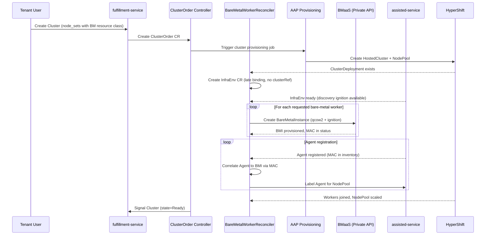
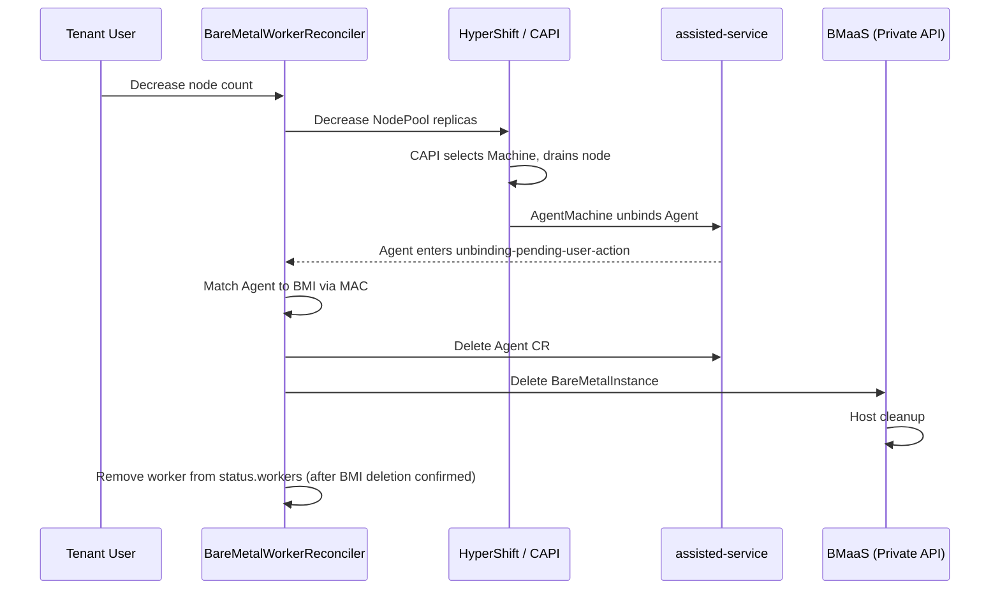

# CaaS Bare-Metal Worker Node Provisioning

## Summary

This design adds on-demand bare-metal worker node provisioning to CaaS via a dedicated `BareMetalWorkerReconciler` in osac-operator that creates BareMetalInstances via the fulfillment-service private gRPC API. Each instance references a pre-registered RHCOS DiskImage and carries discovery ignition inline from a cluster-specific InfraEnv, causing the host to register as an assisted-service Agent and join the HyperShift-managed cluster as a worker node. The existing BareMetalPool-based static pre-boot pool is removed. See [PRD](prd.md) for detailed requirements.

## Motivation

CaaS currently provisions bare-metal worker nodes through a static pre-boot pool: a cron job maintains hosts running the Assisted Installer ISO via BareMetalPool resources. This wastes capacity on idle hosts, is difficult to right-size, and couples cluster provisioning to a fragile pool management process. When the pool is exhausted, cluster scale-up fails silently until an administrator intervenes.

The new approach eliminates the pool by provisioning workers on-demand. When a ClusterOrder specifies bare-metal resource classes, the controller creates individual BareMetalInstances through the BMaaS private API, each configured with discovery ignition and a version-matched RHCOS DiskImage. This gives CaaS per-instance control over image and boot configuration while keeping all infrastructure details hidden from tenants. The PoC (OSAC-2817) validated this flow end-to-end: BMI provisioning took approximately 6 minutes, the agent registered successfully, and the worker joined the HyperShift cluster.

### Goals

- Implement bare-metal worker management as a dedicated controller (`BareMetalWorkerReconciler`) within osac-operator, keeping the ClusterOrder controller generic and extensible for future VM worker support.
- Keep all CaaS-managed bare-metal infrastructure (BMIs, InfraEnvs, Agents) invisible to tenant-facing APIs and UIs.
- Support both initial provisioning and manual scale-up/scale-down through the same controller logic.
- Ensure host cleanup on scale-down and cluster deletion flows through BMaaS's existing deprovision pipeline via `BareMetalInstances.Delete`.
- Remove the BareMetalPool-based static pre-boot pool workflow entirely — no coexistence period.
- Require no changes to the tenant-facing Cluster API or CLI experience.

### Non-Goals

- Autoscaling based on workload utilization (deferred to a future CaaS autoscaling feature).
- VM-based worker nodes (deferred to VMaaS integration).
- Static IP or NMStateConfig support for worker nodes (deferred; not validated by the PoC).
- Network boot acceleration or caching strategies `[Jira: OSAC-2134]`.

## Proposal

A new `BareMetalWorkerReconciler` in osac-operator watches `ClusterOrder` CRs for bare-metal worker management. When a ClusterOrder's `nodeRequests` reference bare-metal resource classes, the controller:

> **Terminology note:** `node_sets` (proto, on `ClusterSpec`) maps to `nodeRequests` (CRD, on `ClusterOrderSpec`) via the fulfillment-service Cluster controller. The `BareMetalWorkerReconciler` reads `nodeRequests` from the ClusterOrder CRD.

1. Creates a cluster-specific `InfraEnv` CR on the hub cluster to generate discovery ignition.
2. Fetches discovery ignition from the InfraEnv and creates `BareMetalInstance` objects with the ignition passed inline as `user_data`, referencing the RHCOS DiskImage.
3. Correlates registered Agents to BMIs via MAC address and labels them for NodePool selection.

No new CRDs are introduced. The design extends the ClusterOrder CRD status with a `workers` field to track CaaS-managed worker resources. BareMetalInstances created by CaaS are assigned to the builtin `system` tenant, making them invisible to tenant APIs via the existing tenancy logic.

**Dependencies (unresolved — block implementation):**

| Dependency | Jira | Impact if not delivered |
|-----------|------|----------------------|
| MAC address in BareMetalInstance status | [OSAC-2308](https://redhat.atlassian.net/browse/OSAC-2308), [OSAC-3254](https://redhat.atlassian.net/browse/OSAC-3254) | Agent-to-BMI correlation impossible; entire feature blocked |
| DiskImage resource + BMI DiskImage integration | [OSAC-2540](https://redhat.atlassian.net/browse/OSAC-2540), [OSAC-1270](https://redhat.atlassian.net/browse/OSAC-1270) | Controller cannot resolve RHCOS boot image; BMI creation blocked |
| Type-safe resource references | [OSAC-1330](https://redhat.atlassian.net/browse/OSAC-1330) | `DiskImageReference` on `ClusterVersionSpec` requires the typed reference pattern; without it, `disk_image` is a plain string with no reference validation or deletion protection |
| BMaaS networking for subnet attachment | [OSAC-1437](https://redhat.atlassian.net/browse/OSAC-1437) | BMI creation requires the plural `network_attachments` compatibility field with exactly one entry; without BMaaS subnet support, workers cannot be moved to the tenant subnet and will not receive DHCP-assigned IPs on the correct network |

The existing BareMetalPool-based static pre-boot pool is removed as part of this work. The `cluster_infra` AAP step that creates BareMetalPool CRs and the scheduled `osac-import-agents` AAP job that discovers and imports hosts are no longer used by CaaS. Any remaining BareMetalPool resources are drained and cleaned up during rollout. The BareMetalPool CRD itself is retained (it serves BMaaS standalone use cases) but CaaS no longer creates or references BareMetalPool resources.

### Workflow Description

#### Changes Overview

This design replaces `HostType` with `BareMetalInstanceType` and the static agent pool with on-demand BMI provisioning. The key changes per component:

| Component | Before | After |
|---|---|---|
| **ClusterNodeSet (proto)** | `host_type: HostTypeReference` | `baremetal_instance_type: BareMetalInstanceTypeReference` |
| **NodeRequest (CRD)** | `ResourceClass string` (opaque) | `BareMetalInstanceType string` (explicit) |
| **ClusterCatalogItem** | `host_type: "acme_1tb"` in template YAML | `baremetalInstanceType: "bm-standard"` in template YAML |
| **ClusterVersionSpec (proto)** | No DiskImage reference | `disk_image: DiskImageReference` (owned by this design) |
| **BMI Create call** | No `instance_type` field | `instance_type = 20` set by controller |
| **Interface resolution** | HostType.interfaces[].role=fabric | BareMetalInstanceType.network_ports[].role=fabric |
| **Network attachment source** | Cluster proto via private API callback | ClusterOrder CRD singular `networkAttachment` (ClusterNetworkAttachment) |
| **Host selection** | HostType → Template → CatalogItem reverse lookup | BareMetalInstanceType.host_label_selector (direct, OSAC-1201) |
| **Worker provisioning** | Static pre-boot pool + cron job + parking network | On-demand BMI creation via private API |
| **Boot image** | Assisted image service ISO | RHCOS DiskImage (OCI artifact) linked to ClusterVersion |
| **HostType resource** | Shared BM/VM concept, no hardware specs | Deprecated and decommissioned |

#### Setup Flow (by persona)

**Cloud Infrastructure Admin** — one-time platform setup:

1. **Register RHCOS DiskImages** for each supported OCP version. CaaS boots bare-metal hosts with a RHCOS qcow2 image containing discovery ignition — unlike the old pool model which used ISOs from the assisted image service. Each DiskImage is an OCI artifact registered in the fulfillment-service (dependency: OSAC-2540, OSAC-1270).

   ```bash
   osac-admin create diskimage rhcos-4.18 \
     --source-ref quay.io/osac/rhcos:4.18.0 \
     --guest-os-family linux --architecture x86_64
   ```

2. **Link each DiskImage to its ClusterVersion** via the `disk_image` reference (this design adds `DiskImageReference` to `ClusterVersionSpec`). This is how the controller resolves which boot image to use — it reads the Cluster's ClusterVersion, follows the reference, and passes the DiskImage ID to the BMI Create call. Without this link, the controller sets `RHCOSImageNotFound` and does not create BMIs.

   ```bash
   osac-admin update clusterversion 4.18.0 --disk-image rhcos-4.18
   ```

3. **Register BareMetalInstanceTypes** defining available hardware profiles. This replaces `HostType`, which was opaque (no CPU/memory specs, no inventory matching). `BareMetalInstanceType` (OSAC-1201) carries full hardware specs AND a `host_label_selector` for direct inventory matching — no reverse lookup needed. The `network_ports` field is critical for CaaS: the controller reads it to resolve the fabric interface for each BMI's network attachment.

   ```bash
   # BEFORE — HostType (opaque, no hardware specs, no inventory matching)
   osac-admin create hosttype acme_1tb \
     --title "Acme 1TB Server" \
     --interface name=data-0,role=fabric \
     --interface name=mgmt-0,role=management

   # AFTER — BareMetalInstanceType (rich hardware specs + inventory matching)
   osac-admin create baremetalinstancetype bm-standard \
     --hardware-cpu-cores 64 --hardware-cpu-arch x86_64 \
     --hardware-memory-gb 512 \
     --hardware-network-port name=data-0,role=fabric,type=Ethernet,speed=100Gbps \
     --hardware-network-port name=mgmt-0,role=management,type=Ethernet,speed=1Gbps \
     --host-label-selector profile=bm-standard \
     --description "Standard bare-metal node: 64-core x86_64, 512 GiB RAM, 100GbE fabric"
   ```

   Cloud Infrastructure Admins must also label inventory hosts to match — via whatever host-labeling mechanism the BMaaS backend exposes. This is a BMaaS/backend concern; CaaS does not assume a specific backend and OSAC does not validate label consistency at type-creation time.

4. **Ensure the assisted image service is disabled** (deployment prerequisite — see Assisted Image Service section).

**Cloud Provider Admin** — catalog and template configuration:

1. Creates `ClusterVersion` entries (OCP version + release image pullspec), or they are seeded during installation.

2. Creates `ClusterCatalogItem` (cluster templates) referencing `BareMetalInstanceType` instead of `HostType`:

   ```yaml
   # BEFORE — ocp-small/meta/osac.yaml (HostType reference)
   default_node_request:
     - resourceClass: acme_1tb          # opaque string → HostType name
       numberOfNodes: 2

   # AFTER — ocp-small/meta/osac.yaml (BareMetalInstanceType reference)
   default_node_request:
     - baremetalInstanceType: bm-standard  # explicit BareMetalInstanceType name
       numberOfNodes: 2
   ```

   This flows through to the proto as `ClusterNodeSet.baremetal_instance_type` (replacing `ClusterNodeSet.host_type`) and to the CRD as `NodeRequest.BareMetalInstanceType` (replacing `NodeRequest.ResourceClass`).

3. Creates the system-owned `BareMetalInstanceCatalogItem` — a pass-through with unlocked parameters so the CaaS controller can set image, user_data, and the single `network_attachments` entry (the field remains plural for API compatibility) (one-time deployment prerequisite):

   ```bash
   osac-admin create baremetalinstancecatalogitem caas-system-bmi --unlocked
   ```

4. Publishes templates to make them available to tenants.

**Tenant User** — cluster lifecycle (unchanged before and after):

```bash
# Same CLI, same UX — before and after
osac create cluster my-cluster --template ocp-small
```

The tenant never interacts with BareMetalInstanceTypes, DiskImages, InfraEnvs, or Agents — all CaaS-managed infrastructure is invisible via system tenant isolation. The template populates `node_sets` with the default `BareMetalInstanceType` and size.

#### Provisioning Flow

Starting state: a Tenant User creates a Cluster selecting a template (e.g., `ocp-small`). The template populates `node_sets` with `baremetal_instance_type` references. The fulfillment-service Cluster controller creates a ClusterOrder CR on the hub cluster.



The diagram shows the end-to-end provisioning flow. The controller waits for each phase to complete before proceeding: AAP provisions the HostedCluster, the InfraEnv generates ignition, BMIs provision hosts, and agents register and join the cluster. The controller updates ClusterOrder status conditions at each phase transition.

**Step-by-step:**

1. The `BareMetalWorkerReconciler` identifies bare-metal node sets from the Cluster's `node_sets` — any node set with a `baremetal_instance_type` reference (see ClusterNodeSet Redesign).
2. After AAP creates the HostedCluster and the ClusterDeployment CR exists, the controller creates a cluster-specific `InfraEnv` CR (see InfraEnv Creation). The InfraEnv uses late binding (no `clusterRef`) — agents register as unbound and the controller explicitly binds them in step 8.
3. The controller polls the InfraEnv status until `status.bootArtifacts.discoveryIgnitionURL` is populated, then fetches the discovery ignition content. The ignition is architecture-neutral (the `assisted-installer-agent` image is a multi-arch manifest).
4. For each bare-metal worker requested, the controller assembles a `BareMetalInstances.Create` call on the private API from multiple sources:

   | Field | Source | Purpose |
   |---|---|---|
   | `instance_type` | `nodeRequests[i].BareMetalInstanceType` | Hardware profile → host_label_selector → inventory match |
   | `catalog_item` | System-owned pass-through | Required by private API; CaaS overrides all parameters |
   | `image` | `ClusterVersion.disk_image` → DiskImage ID | RHCOS boot image for discovery agent |
   | `user_data` | InfraEnv ignition (inline, ~15KB, max 64KB) | Discovery ignition to register with assisted-service |
   | `network_attachments` | `networkAttachment` + stored node-set `fabric_interface` | The sole attachment from `ClusterNetworkAttachment`; the stored interface was selected from the first `fabric` port during cluster creation, with `primary: true` (see Network Attachment Enrichment); BMaaS rejects additional entries |
   | `tenant` | Always `"system"` | Hides CaaS BMIs from tenant APIs (see System Tenant Isolation) |

   BMaaS handles the physical networking — moving the host to the tenant subnet VLAN and assigning an IP via fabric DHCP — as part of BMI provisioning (dependency: OSAC-1437). If the host fails to join the tenant network, the agent will not register on the expected subnet, and the existing `AgentRegistrationTimeout` handles this failure mode. API and ingress VIPs are provisioned by the existing AAP template (MetalLB LoadBalancer Services) and are not managed by this controller.
5. The controller updates ClusterOrder status with the BMI references in `workers[]`.
6. BMaaS allocates a host, provisions it with the DiskImage and discovery ignition, and boots it. The host registers as an Agent with assisted-service.
7. The controller watches Agent CRs in the cluster namespace. When a new Agent appears, the controller matches its inventory MAC address against BMI status MAC addresses (`status.host.mac_address`, dependency OSAC-2308/OSAC-3254).
8. Once correlated, the controller sets the Agent's `clusterDeploymentName` to the cluster's ClusterDeployment and applies the `agentBareMetal` role label so the NodePool's `agentLabelSelector` selects it. Late binding (explicit `clusterDeploymentName` setting) gives the controller full control over the Agent lifecycle — on scale-down, CAPA clears `clusterDeploymentName`, triggering the unbind flow that CaaS reacts to. The osac-operator's RBAC must include `get`, `list`, `watch`, `patch`, and `delete` on `agents` in the `agent-install.openshift.io` API group (see RBAC / Tenancy).
9. HyperShift installs the Agent as a worker node. The controller monitors NodePool `.status.replicas` to confirm convergence.

#### Scale-Up

A Tenant User increases `node_sets[].size` for a bare-metal node set. The fulfillment-service updates the Cluster object, the Cluster controller updates the ClusterOrder's `nodeRequests`, and the controller detects the delta between desired and current worker count.

**Step-by-step:**

1. The controller computes `desired - current` where `current` is `status.currentWorkers` (workers in active phases: `Provisioning`, `WaitingForAgent`, `Binding`, `Ready`). Workers in `Failed` phase do not count toward capacity — new workers are created to fill the gap once their retry backoff expires.
2. The controller re-reads the InfraEnv's `status.bootArtifacts.discoveryIgnitionURL` to fetch fresh ignition. The InfraEnv persists from initial provisioning; if it was deleted (e.g., manual cleanup), the `ensureInfraEnv` phase recreates it. Note: if the InfraEnv is deleted while hosts are in `WaitingForAgent` phase (already booted with old ignition), those hosts have stale discovery data. The controller treats them as `AgentRegistrationTimeout` failures and deprovisions/reprovisions them with fresh ignition from the recreated InfraEnv.
3. The controller resolves the RHCOS DiskImage from the cluster's current ClusterVersion's `disk_image` reference (see RHCOS DiskImage Resolution).
4. For each new worker, the controller follows provisioning steps 4-9 from the initial flow (the ignition content is re-fetched in step 2 above).
5. Partial success is reported: if 3 of 5 new workers succeed and 2 fail, the ClusterOrder status shows 3 additional `Ready` workers and 2 `Failed`. The tenant sees the cluster with the successfully added workers; the failed slots are visible via ClusterOrder conditions and events.

#### Scale-Down



This diagram shows the scale-down flow. CAPI handles node drain and agent unbinding automatically. The controller reacts to the agent reaching an unbound state and then cleans up the BMI.

**Step-by-step:**

1. The controller computes the excess worker count (current minus desired).
2. The controller removes `Failed` workers first — deletes their dead BMIs and removes their `status.workers` entries. If more removals are needed after clearing all failed slots, the controller decreases NodePool `.spec.replicas` by the remaining excess.
3. CAPI's MachineDeployment controller manages MachineSets, which select Machines for deletion. CaaS delegates Machine selection order to CAPI's default behavior (random) — no preference for newest-first or oldest-first. This is a deliberate design choice: bare-metal workers are fungible, and controlling selection order would require CAPI-level configuration (e.g., `MachineDeployment.spec.strategy`) that is not needed for this use case.
4. CAPI drains each selected node, then the AgentMachine controller unbinds the Agent (clears `ClusterDeploymentName`). With the assisted image service disabled (see Assisted Image Service), reclaim is not attempted and the Agent transitions directly to `unbinding-pending-user-action`. CAPA removes its hook/finalizer at this point.
5. The controller watches for Agents entering `unbinding-pending-user-action` and matches them back to BMIs via MAC address.
6. The controller deletes the Agent CR. CAPA does not delete the Agent — it only clears `ClusterDeploymentName` and removes its own hook/finalizer. CaaS owns the Agent CR cleanup because the host will be deprovisioned by BMaaS.
7. The controller calls `BareMetalInstances.Delete` on the private API. BMaaS handles full host cleanup before returning the host to inventory. CaaS does not independently verify cleanup completion — this is a trust boundary between CaaS and BMaaS. If BMaaS cleanup fails, the host must not be reallocated; this guarantee is BMaaS's responsibility.
8. The controller retains the worker entry in `status.workers` in `Deleting` phase until the BMI deletion is confirmed. This prevents orphaned hosts — if `Delete` succeeds but cleanup stalls, the controller still has the reference to retry or alert.

#### Cluster Deletion

On ClusterOrder deletion, deleting the HostedCluster cascades through HyperShift (deletes all NodePools) → CAPI (drains nodes, deletes Machines) → CAPA (unbinds Agents), which cleans up the Kubernetes-side objects and the Agent CRs. The cascade does **not** delete the BMIs — the fulfillment-service BareMetalInstances are unknown to HyperShift. The ClusterOrder finalizer therefore actively deletes every BMI listed in `status.workers[]` via `BareMetalInstances.Delete`, rather than reacting to per-Agent unbind events as the scale-down flow does. The finalizer holds until all `status.workers[]` entries are confirmed deleted. The InfraEnv CR is garbage collected via its ownerReference to the ClusterOrder.

### API Extensions

**Modified CRDs:**

- `ClusterOrder` (osac-operator): new `workers` status field and aggregate counts (`desiredWorkers`, `currentWorkers`, `readyWorkers`) for tracking CaaS-managed worker resources. The `nodeRequests` element type (`NodeRequest`) is redesigned to carry the `BareMetalInstanceType` reference (see ClusterNodeSet Redesign). The singular `networkAttachment` field (defined by OSAC-1436) carries the tenant subnet reference — the `BareMetalWorkerReconciler` reads it from the ClusterOrder spec and builds one-entry per-BMI `BareMetalNetworkAttachment` lists (see Network Attachment Enrichment below).

**New CRs created at runtime (not new CRD definitions):**

- `InfraEnv` (agent-install.openshift.io/v1beta1): one per cluster, created by the controller in the cluster's namespace. Owned by the ClusterOrder via an owner reference for garbage collection.

**Modified behavior of existing resources:**

- `BareMetalInstance` (fulfillment-service): CaaS-created BMIs are assigned to the builtin `system` tenant. No changes to the public API are required — the existing tenancy logic (`DetermineVisibleTenants`) already excludes the `system` tenant from regular user queries, making CaaS BMIs invisible to tenants automatically.

**Tenant-visible status:** The PRD requires tenant-visible failure conditions. ClusterOrder conditions (`WorkersFailed`, `InfraEnvReady`, `RHCOSImageNotFound`) live on the hub cluster, which tenants cannot access. The existing feedback controller syncs ClusterOrder status to the public Cluster API via the `Signal` RPC. This design extends the feedback controller to translate worker conditions into the tenant-visible Cluster status:

- `WorkersFailed=True` on ClusterOrder → `WORKER_PROVISIONING_FAILED` condition on the public Cluster, with a tenant-safe message (e.g., "2 of 5 worker nodes failed to provision") that omits infrastructure details (no BMI names, MACs, or backend errors)
- Workers in `Failed` with high attempt count → Cluster condition message includes the attempt count and next retry time, so tenants know retries are ongoing
- All other conditions (`InfraEnvReady=False`, `RHCOSImageNotFound`) → mapped to a generic `WORKER_PROVISIONING_BLOCKED` condition on the Cluster, indicating the cluster cannot provision workers due to an infrastructure issue requiring Cloud Infrastructure Admin intervention

This ensures tenants see provisioning progress and actionable failure messages without exposure to CaaS internals. The condition names and feedback controller extension must align with [OSAC-1604](https://redhat.atlassian.net/browse/OSAC-1604) (status reporting improvements) to avoid overlap — this design defines CaaS-specific worker conditions, while OSAC-1604 defines the general status reporting framework. Coordination tracked via Jira link.

**Operational impact:** If the osac-operator is down, no new bare-metal workers are provisioned and scale-up/scale-down operations stall. Existing workers continue running — HyperShift manages the cluster independently. On restart, the controller reconciles current state and resumes any pending operations.

## UX Alignment

CaaS-managed BMIs are hidden from tenant-facing views — no tenant UI changes are required. However, the BareMetalPool removal and assisted image service disablement affect the **Cloud Infrastructure Admin** installation and configuration flow, which surfaces through Enclave.

### Installer / Enclave Impact

The following `osac-installer` Helm values and Enclave Wizard controls are affected:

| Helm value | Current purpose | Impact |
|---|---|---|
| `aap.configAsCode.importAgentsEnabled` | Enables the `osac-import-agents` scheduled AAP job that discovers and imports bare-metal hosts into the pre-boot pool | **Remove or deprecate** — CaaS no longer uses a pre-boot pool; agents are created on-demand via BMI provisioning. BMaaS standalone may still use this for its own inventory import, so removal must be coordinated. |
| `aap.configAsCode.importBcmAgentsEnabled` | Enables BCM inventory backend for agent import | Same as above — tied to the pool model |
| `aap.importAgents` | Server inventory list for BareMetalHost CR provisioning (BMC addresses, credentials) | **Retained for BMaaS** — bare-metal host inventory registration is still needed. CaaS no longer consumes it for pool creation, but BMaaS uses it for standalone BareMetalInstance provisioning. |
| `aap.configAsCode.env.IMPORT_AGENTS_NAMESPACE` | Namespace for BareMetalHost, Agent, and InfraEnv CRs (default: `hardware-inventory`) | **Still needed** — the `hardware-inventory` namespace hosts inventory resources. CaaS creates per-cluster InfraEnvs in cluster namespaces, not here. |
| `aap.configAsCode.env.IMPORT_AGENTS_INFRAENV_NAME` | Shared InfraEnv CR name for agent discovery | **Remove for CaaS** — CaaS creates per-cluster InfraEnvs. BMaaS standalone may still use a shared InfraEnv for its own inventory. |

**Enclave Wizard changes:**
- The Wizard's CaaS configuration panel (if it exposes `importAgentsEnabled` or pool-related settings) must be updated to remove or disable pool configuration for CaaS deployments.
- New prerequisite: the assisted image service must be disabled. If Enclave controls this setting, it must default to disabled for CaaS deployments.
- New prerequisite: DiskImage registration and ClusterVersion linking. The Wizard should guide the Cloud Infrastructure Admin through registering RHCOS DiskImages and linking them to ClusterVersions (see Setup Flow, Cloud Infrastructure Admin steps 1-2).

**AAP template changes:**
- `playbook_osac_create_bare_metal_pool.yml` and `playbook_osac_delete_bare_metal_pool.yml` are no longer invoked by CaaS. They may be retained for BMaaS standalone use or removed if BareMetalPool is fully deprecated.
- The `cluster_infra` step collections (`agentless_net.steps`, `ci.steps`, `nico.steps`) are no longer dispatched for CaaS provisioning — the BareMetalWorkerReconciler replaces their functionality.

### Implementation Details/Notes/Constraints

#### ClusterOrder CRD Status Extensions

```go
type ClusterOrderStatus struct {
    // ... existing fields ...

    // Aggregate worker counts (aligned with the CAPI MachineDeployment convention).
    // +kubebuilder:validation:Optional
    DesiredWorkers *int32 `json:"desiredWorkers,omitempty"`
    // +kubebuilder:validation:Optional
    CurrentWorkers *int32 `json:"currentWorkers,omitempty"`
    // +kubebuilder:validation:Optional
    ReadyWorkers *int32 `json:"readyWorkers,omitempty"`

    // Per-worker lifecycle state.
    // +kubebuilder:validation:Optional
    Workers []WorkerStatus `json:"workers,omitempty"`
}

type WorkerStatus struct {
    // NodeSet identifies which node set this worker belongs to (e.g., "compute", "gpu").
    // Used to partition workers for independent per-node-set scaling.
    NodeSet string `json:"nodeSet"`
    // Name of the worker slot (e.g., "bm-cluster-a-worker-0").
    Name string `json:"name"`
    // Kind of the backing resource (BareMetalInstance).
    Kind string `json:"kind"`
    // ResourceID is the fulfillment-service resource ID.
    ResourceID string `json:"resourceID,omitempty"`
    // Phase of the worker lifecycle.
    // +kubebuilder:validation:Enum=Provisioning;WaitingForAgent;Binding;Ready;Failed;Unbinding;Deleting
    Phase string `json:"phase"`
    // AttemptCount tracks how many times this worker slot has been provisioned.
    // Resets to 0 when a replacement stays Ready beyond MinHealthyDuration.
    AttemptCount int32 `json:"attemptCount"`
    // LastFailureReason is a machine-readable reason for the last failure (e.g., AgentRegistrationTimeout).
    // +kubebuilder:validation:Optional
    LastFailureReason string `json:"lastFailureReason,omitempty"`
    // LastFailureMessage is a human-readable description of the last failure.
    // +kubebuilder:validation:Optional
    LastFailureMessage string `json:"lastFailureMessage,omitempty"`
    // LastFailureTime is when the last failure occurred.
    // +kubebuilder:validation:Optional
    LastFailureTime *metav1.Time `json:"lastFailureTime,omitempty"`
    // NextRetryTime is when the controller will attempt the next retry.
    // +kubebuilder:validation:Optional
    NextRetryTime *metav1.Time `json:"nextRetryTime,omitempty"`
}
```

**Aggregate counts** align with the CAPI MachineDeployment convention: `desiredWorkers` (from `nodeRequests`), `currentWorkers` (non-terminal: Provisioning + WaitingForAgent + Binding + Ready), `readyWorkers` (Ready phase only). This gives tenants, operators, and metering systems a single-glance view of cluster health without inspecting individual workers.

**Per-worker state** is persisted in `workers[]`, not tracked in-memory. Each `WorkerStatus` entry carries the lifecycle phase, retry state, and failure details. The controller updates these fields on each reconciliation cycle. On restart, the controller rebuilds phases from live BMI and Agent state but preserves `attemptCount` and failure history from the persisted status — no dependency on Kubernetes events for retry tracking.

Example: a 5-worker cluster where 3 workers are ready and 2 are retrying:

```yaml
status:
  phase: Progressing
  desiredWorkers: 5
  currentWorkers: 3
  readyWorkers: 3
  conditions:
    - type: WorkersFailed
      status: "True"
      reason: ProvisioningFailed
      message: "2 of 5 bare-metal workers failed provisioning, retrying"
    - type: InfraEnvReady
      status: "True"
  workers:
    - nodeSet: compute
      name: bm-cluster-a-worker-0
      kind: BareMetalInstance
      resourceID: "uuid-0"
      phase: Ready
      attemptCount: 1
    - nodeSet: compute
      name: bm-cluster-a-worker-1
      kind: BareMetalInstance
      resourceID: "uuid-1"
      phase: Ready
      attemptCount: 1
    - nodeSet: compute
      name: bm-cluster-a-worker-2
      kind: BareMetalInstance
      resourceID: "uuid-2"
      phase: Failed
      attemptCount: 2
      lastFailureReason: AgentRegistrationTimeout
      lastFailureMessage: "Agent did not register within 30m"
      lastFailureTime: "2026-08-10T14:30:00Z"
      nextRetryTime: "2026-08-10T15:00:00Z"
    - nodeSet: gpu
      name: bm-cluster-a-worker-3
      kind: BareMetalInstance
      resourceID: "uuid-3"
      phase: Ready
      attemptCount: 1
    - nodeSet: gpu
      name: bm-cluster-a-worker-4
      kind: BareMetalInstance
      resourceID: "uuid-4"
      phase: Failed
      attemptCount: 3
      lastFailureReason: BMIProvisioningFailed
      lastFailureMessage: "Host allocation failed: no available hosts"
      lastFailureTime: "2026-08-10T14:25:00Z"
      nextRetryTime: "2026-08-10T14:55:00Z"
```

The `workers[]` list always contains all worker references regardless of their individual state. The `WorkersFailed` condition provides the aggregate summary. The ClusterOrder remains in `Progressing` phase (not `Failed`) because 3 workers are operational. Per-worker detail (which slot failed, why, when the next retry is) is visible directly in the status.

The controller tracks worker lifecycle through phases: `Provisioning` → `WaitingForAgent` → `Binding` → `Ready` (and `Unbinding` → `Deleting` for scale-down). `Failed` is reachable only from provisioning phases (`Provisioning`, `WaitingForAgent`, `Binding`) and triggers automatic retry. Teardown issues (e.g., agent unbinding timeout, BMI deletion failure) keep the worker in `Unbinding` or `Deleting` with error details in `lastFailureReason` — they do not transition to `Failed` and do not trigger replacement, since the intent is removal, not reprovisioning.

**Retry behavior:** The API is declarative — the controller retries indefinitely until the desired state is reached. There is no `PermanentlyFailed` state. When a worker enters `Failed`, the controller deletes the failed BMI and creates a replacement with escalating backoff:

| Failure type | Examples | Backoff | Rationale |
|---|---|---|---|
| Transient infrastructure | BMaaS API timeout, backend provisioning error, host allocation contention | Short exponential: 30s, 60s, 120s, capped at 5m | Likely to resolve quickly; fresh host allocation may succeed immediately |
| Resource availability | No hosts available for the requested BareMetalInstanceType | Long exponential: 5m, 15m, 30m, capped at 30m | Inventory needs time to free up; aggressive retry wastes API calls |
| Agent registration timeout | Host booted but agent did not register within 30m | Long exponential: 5m, 15m, 30m, capped at 30m | Root cause (bad image URL, broken InfraEnv, network) is unlikely to self-resolve; gives operator time to investigate before next attempt burns another host |

The `attemptCount` is persisted in `WorkerStatus` and survives controller restarts. After the initial escalation period (first 3 attempts), the backoff caps at the maximum for that failure type and the controller continues retrying at that interval. If a replacement succeeds and stays `Ready` for 1 hour (`MinHealthyDuration`), the `attemptCount` resets to 0 — distinguishing a resolved transient issue from a recurring problem.

The `WorkersFailed` condition reports which slots are retrying (with attempt number and next retry time), so operators are alerted and can investigate. For persistent misconfigurations (wrong DiskImage, broken network), the capped backoff ensures the controller does not burn hosts aggressively while still converging once the root cause is fixed.

**Scale-down priority:** When the tenant scales down, the controller removes `Failed` workers first — they have no running node, no bound agent, and only a dead BMI to clean up. Healthy workers are only removed after all failed slots are cleared.

This satisfies the PRD requirement: "CaaS automatically handles provisioning retries and release of failed bare-metal resources, so that transient BMaaS failures do not leave orphaned infrastructure."

#### InfraEnv Creation

The controller creates one InfraEnv per ClusterOrder. The InfraEnv spec:

```yaml
apiVersion: agent-install.openshift.io/v1beta1
kind: InfraEnv
metadata:
  name: <cluster-order-name>-infraenv
  namespace: <cluster-namespace>
  ownerReferences:
    - apiVersion: osac.openshift.io/v1alpha1
      kind: ClusterOrder
      name: <cluster-order-name>
spec:
  pullSecretRef:
    name: <pull-secret-name>
  sshAuthorizedKey: <from ClusterOrder spec>
```

The InfraEnv uses **late binding** — no `clusterRef`. Agents register as unbound and the controller explicitly binds them by setting `clusterDeploymentName` after MAC correlation. This gives the controller full control over the Agent binding lifecycle: on scale-down, CAPA clears `clusterDeploymentName`, the Agent enters `unbinding-pending-user-action`, and the controller reacts by deleting the Agent CR and then the BMI. CAPI handles node drain and Node object deletion independently — the pre-terminate hook clears as soon as the Agent reaches `unbinding-pending-user-action`, so node removal does not depend on the host rebooting into discovery.

One InfraEnv per cluster provides pull secret isolation (each cluster's InfraEnv carries the cluster-specific pull secret) and supports future static networking (per-host NMStateConfig is InfraEnv-scoped). Agent-to-cluster isolation is enforced by the MAC correlation algorithm (see MAC Address Correlation), which scopes matching to BMIs owned by the current ClusterOrder.

The discovery ignition is architecture-neutral (the `assisted-installer-agent` image is a multi-arch manifest) — the `cpuArchitecture` field on InfraEnv only affects ISO/kernel/rootfs URLs in `status.bootArtifacts`, not the ignition content, and this design uses the ignition-only flow.

**Future optimization — shared InfraEnv for agent pooling:** A single platform-level InfraEnv could enable pre-booting hosts ahead of cluster requests, reducing provisioning latency. This design uses per-cluster InfraEnvs to keep the flow simple and maintain pull secret isolation. Agent pooling can be revisited as a future CaaS optimization.

#### RHCOS DiskImage Resolution

The controller resolves the RHCOS boot image via a `DiskImageReference` on the `ClusterVersion` resource. **This design owns the `disk_image` field on `ClusterVersionSpec`** — it is not covered by OSAC-2540 (which adds DiskImage to ComputeInstance only) or OSAC-1270 (which adds DiskImage to BareMetalInstance). The implementation requires OSAC-2540 for the DiskImage resource itself, OSAC-1270 for `source_type: "disk_image"` on `BareMetalInstanceImage`, and OSAC-1330 for the typed reference pattern.

The private `ClusterVersionSpec` gains a new field:

```protobuf
message ClusterVersionSpec {
    // ... existing fields (image, version, enabled, is_default, state, deprecation) ...
    DiskImageReference disk_image = 7;
}
```

The controller reads the cluster's current ClusterVersion, follows the `disk_image` reference to get the DiskImage ID, and passes it as `spec.image.source_ref` on the BMI. No label-based lookup, no ambiguity — each ClusterVersion references exactly one DiskImage. The typed reference (per OSAC-1330) provides reference validation at ClusterVersion creation time and deletion protection (the DiskImage cannot be deleted while referenced by an active ClusterVersion).

**Cross-component changes introduced by this field:**
- `ClusterVersionSpec` proto: add `DiskImageReference disk_image = 7` (private API only — tenants don't set this)
- `ClusterVersionsServer`: extend `Update` to accept the `disk_image` field; extend `Create` to optionally set it
- CLI: extend `osac create/update clusterversion` with `--disk-image <id>` flag
- DiskImage deletion protection: extend OSAC-2540's DB trigger to check `cluster_versions` in addition to `compute_instances` — a DiskImage referenced by an active ClusterVersion must not be deletable

The controller reads the cluster's **current** ClusterVersion reference, not the creation-time version. Note: until cluster upgrades are implemented, this is always the creation-time version. Once upgrades land, the Cluster's ClusterVersion reference will be updated by the upgrade flow — this is the most reasonable assumption but should be treated as a dependency since cluster upgrades are still at the PRD stage.

The boot image is ephemeral — it exists only to run the discovery agent. The assisted-installer writes the correct RHCOS version (pinned to the release image) to disk during installation. Any Z stream within the same minor version is acceptable for the boot image.

If the `disk_image` reference is not set on the ClusterVersion, the controller sets the ClusterOrder condition `RHCOSImageNotFound` and does not proceed with BMI creation. If the underlying image is unreachable or the download fails during provisioning, the BMI enters `Failed` phase. The failure is reported via ClusterOrder conditions.

**Current limitation — manual DiskImage registration and linking:** In this version, the Cloud Infrastructure Admin must manually register RHCOS images and link them to ClusterVersions. For each supported OCP version:

1. Download the RHCOS qcow2 image for the target OCP version and architecture
2. Repackage the qcow2 as an OCI artifact
3. Push the OCI artifact to a container registry accessible to BMaaS
4. Register a DiskImage via the fulfillment-service API with `source_ref` pointing to the pushed OCI artifact
5. Update the ClusterVersion to set the `disk_image` reference to the registered DiskImage (e.g., `osac update clusterversion 4.22.0 --disk-image <disk-image-id>`)

The CLI must support setting the `disk_image` reference on ClusterVersion — this requires extending the `osac create/update clusterversion` commands with a `--disk-image` flag.

**Future automation path:** The OCP release image (`ClusterVersion.spec.image`) contains the RHCOS image reference as a component (`rhel-coreos`). A future utility could introspect registered ClusterVersions, extract the RHCOS image reference from each release payload, and automatically create the DiskImage and set the `disk_image` reference on the ClusterVersion. This removes the manual coupling — adding a new ClusterVersion would automatically produce and link the matching DiskImage. Note: directly using the RHCOS OCI image from the release payload as the DiskImage `source_ref` is not possible today because OCP BMO does not support this image format (planned for OCP 5.1). Until then, the qcow2 repackaging step remains necessary.

**Cluster upgrade path:** The `ClusterVersion → DiskImage` link is designed with upgrades in mind. When the cluster upgrade flow lands, the upgrade updates the Cluster's ClusterVersion reference (e.g., `4.18.0` → `4.19.0`). The controller detects the change, resolves the new ClusterVersion's `disk_image` reference (e.g., `rhcos-4.19`), and new workers provisioned during or after the upgrade boot with the updated image. Existing workers upgrade through the normal OCP upgrade path — they are not reprovisioned. This is why `disk_image` lives on `ClusterVersion` rather than on the Cluster or ClusterOrder: it naturally follows the version, so upgrading automatically selects the matching boot image.

#### BMI Creation via Private API

For each worker, the controller calls `BareMetalInstances.Create` on the private API. The private API is unchanged — `spec.catalog_item` remains required. CaaS uses a **system-owned `BareMetalInstanceCatalogItem`** with most parameters unlocked, acting as a pass-through. The `BareMetalInstanceType` from the node set determines the hardware profile. The `source_type` value `"disk_image"` on `BareMetalInstanceImage` is introduced by the DiskImage integration (OSAC-1270) — this design consumes it but does not own the proto change:

```protobuf
// Existing fields in osac.private.v1.BareMetalInstanceSpec used by CaaS
// (field numbers omitted for clarity — see baremetal_instance_type.proto for canonical numbering):
message BareMetalInstanceSpec {
  BareMetalInstanceCatalogItemReference catalog_item = ...; // system-owned catalog item (pass-through)
  optional BareMetalInstanceImage image = ...;              // RHCOS DiskImage reference (see RHCOS DiskImage Resolution)
  optional string user_data = ...;                          // inline discovery ignition content (max 64KB)
  repeated BareMetalNetworkAttachment network_attachments = ...; // max 1; plural for API compatibility
  string instance_type = 20;                                // BareMetalInstanceType name from ClusterNodeSet (OSAC-1201)
  // ... other existing fields (ssh_public_key, run_strategy, template_parameters, etc.) omitted
}

message BareMetalInstanceImage {
  string source_type = ...;  // existing value "registry"; "disk_image" added by OSAC-1270
  string source_ref = ...;   // DiskImage ID from ClusterVersion.spec.disk_image reference
}
```

The system-owned catalog item is created automatically, not by an admin. Because CaaS bare-metal provisioning is only usable once (a) CaaS is deployed, (b) a BMaaS backend is integrated, and (c) at least one `BareMetalInstanceType` is registered, the catalog item is seeded by the same automation that enables the CaaS-on-bare-metal integration — not by the base OSAC install (which may run without BMaaS). Concretely, the osac-installer creates it as a `system`-tenant `BareMetalInstanceCatalogItem` with all provisioning parameters unlocked when the bare-metal integration is enabled; the CaaS controller then reconciles against it (creating it if missing) so a fresh deployment is self-healing rather than dependent on install ordering. The item carries unlocked parameters so the controller can set image, user_data, and the one allowed network attachment. The `BareMetalInstanceType` referenced in the `ClusterNodeSet` — not this catalog item — determines which host hardware profile BMaaS allocates.

Open item: whether the seed lives in the installer chart or is reconciled entirely by the controller is an implementation choice; either way the contract is that no human creates this item, and it does not exist until a `BareMetalInstanceType` is available to reference.

**gRPC call behavior:** This controller is the first in osac-operator to call `Create` and `Delete` on the fulfillment-service private API (existing controllers only call `Signal`). All gRPC calls use a context deadline of 30 seconds. On persistent failure (3 consecutive errors), the controller sets a `FulfillmentServiceUnavailable` condition on the ClusterOrder and backs off to 5-minute requeue intervals. The controller-runtime requeue provides the retry loop; the deadline prevents a hung fulfillment-service from blocking the controller goroutine.

The controller sets the following metadata fields on the created BMI:

- `name`: `"<cluster-order-name>-worker-<index>"`
- `labels["osac.openshift.io/cluster-order"]`: `"<order-id>"` — links BMI to parent ClusterOrder
- `annotations["osac.openshift.io/owner-reference"]`: `"ClusterOrder/<order-id>"`

**Idempotency on lost responses:** If `BareMetalInstances.Create` succeeds but the response or status update is lost, the controller must not create a duplicate BMI on the next reconciliation. Two mechanisms prevent duplicates:

1. **List-before-create (primary):** Before calling `Create` for a worker slot, the controller lists BMIs in the `system` tenant filtered by `osac.openshift.io/cluster-order` label and checks for an existing BMI matching the expected deterministic name (`<cluster-order-name>-worker-<index>`). If found, it skips creation and adds the existing BMI to `status.workers`.

2. **Database uniqueness constraint (safety net):** [OSAC-3266](https://redhat.atlassian.net/browse/OSAC-3266) adds a `UNIQUE(tenant, project, name)` constraint on all resource tables including `bare_metal_instances`. If a race between list and create results in a duplicate `Create` call, the fulfillment-service returns `AlreadyExists`. The controller handles this by retrieving the existing BMI and adding it to `status.workers` — same outcome as the list-before-create path.

#### ClusterNodeSet Redesign

The current `ClusterNodeSet` proto references a `HostType`, which does not map directly to a provisioning resource for BMI creation. This design replaces `host_type` with a direct `BareMetalInstanceTypeReference` field:

```protobuf
// A named group of worker nodes within a cluster.
message ClusterNodeSet {
  // BareMetalInstanceType that defines the hardware profile for workers in this node set.
  // Immutable after creation.
  BareMetalInstanceTypeReference baremetal_instance_type = 1;

  // Desired number of worker nodes. Must be > 0 on create; can be scaled to 0 after.
  int32 size = 3;
}
```

The `BareMetalInstanceType` is an admin-managed resource defining hardware specifications (CPU architecture, cores, memory, network ports, host label selector). The Cloud Infrastructure Admin creates `BareMetalInstanceType` entries for each available hardware profile. Hardware details (specific host, MAC address, network configuration) are not known until runtime — the `BareMetalInstanceType` defines *what kind* of host is needed, and BMaaS resolves *which specific host* at provisioning time via the host label selector. The `ClusterCatalogItem` (cluster template) can restrict which instance types are allowed for node sets; without restriction, any available `BareMetalInstanceType` can be selected.

This change:
- Eliminates the ambiguous HostType → Template → CatalogItem reverse lookup — the controller reads the instance type reference directly from the node set and passes it to the private API.
- The `BareMetalInstanceType` carries hardware metadata (CPU architecture, network ports) needed for DiskImage architecture resolution and fabric interface selection.
- The private `BareMetalInstances.Create` API is unchanged — CaaS uses a system-owned `BareMetalInstanceCatalogItem` with unlocked parameters as a pass-through, while the `BareMetalInstanceType` determines the hardware profile.
- VM worker node sets (OSAC-1589) use a separate provisioning path (AAP template hooks, not a controller) and are out of scope for this `ClusterNodeSet` redesign.

The ClusterTemplate `meta/osac.yaml` entries update accordingly:

```yaml
# ocp-small/meta/osac.yaml
title: OpenShift Small Cluster
default_node_request:
  - baremetalInstanceType: bm-standard
    numberOfNodes: 2
```

This is a cross-component change affecting the fulfillment-service proto (ClusterNodeSet + BareMetalInstanceSpec), ClusterTemplate definitions, and the osac-operator's `NodeRequest` type. It replaces the existing `host_type`-based model.

#### System Tenant Isolation

CaaS-managed BMIs are created under the builtin `system` tenant (`metadata.tenant = "system"`) rather than the cluster's tenant. The `system` tenant is a fulfillment-service builtin (migration 48) that is excluded from `DetermineVisibleTenants` — objects under it are invisible to all regular users without any additional filtering logic. This provides automatic tenant isolation: CaaS-managed BMIs never appear in tenant API responses (List, Get, Update, Delete) because the tenancy layer excludes them before any server-level filtering runs.

This is semantically correct: CaaS-managed BMIs are platform infrastructure, not tenant resources. The tenant ordered a cluster with N workers — they did not order N individual BareMetalInstances. Ownership is traceable via the `osac.openshift.io/owner-reference` annotation, which links each BMI to its parent ClusterOrder (which belongs to the real tenant).

**No changes to the public API** are required — no label-based filter injection in List, no NotFound interception in Get/Update/Delete, no reserved-label validation in Create/Update. The existing tenancy logic handles everything.

**Metering:** CaaS resource attribution is at the Cluster level (which belongs to the real tenant), not at the BMI level. Worker count is derived from the ClusterOrder status, not from querying BMIs by tenant.

**Cloud Provider Admin access:** Admins debug CaaS-managed workers via the private API (which has unrestricted tenant access) or by querying the `system` tenant explicitly. Per-cluster lookups use the `osac.openshift.io/cluster-order` label.

#### MAC Address Correlation

Agent-to-BMI matching uses MAC addresses scoped to the cluster's namespace and ClusterOrder. When a BMI reaches `Running` state, its status includes the allocated host's MAC address (exact field path TBD — depends on OSAC-2308/OSAC-3254, which add inventory metadata to BareMetalInstance status; the field does not exist in the current proto). When an Agent registers, its inventory includes NIC MAC addresses at `status.inventory.interfaces[].macAddress`.

The correlation algorithm requires a unique match across three dimensions before binding:
1. **Namespace:** The Agent must be in the same namespace as the ClusterOrder's cluster
2. **Ownership:** The candidate BMI must carry the `osac.openshift.io/cluster-order` label matching the current ClusterOrder
3. **MAC match:** The Agent's inventory MAC must match the BMI's status MAC

If zero candidates match, the controller continues watching. If multiple candidates match (should not happen — MACs are unique per host), the controller logs an error and does not bind, preventing ambiguous correlation. If no match is found within a configurable timeout (default: 30 minutes), the controller sets the worker phase to `Failed` with reason `AgentRegistrationTimeout`.

After the first successful MAC match, the controller labels the Agent with `osac.openshift.io/worker-name` pointing to the worker slot name (e.g., `bm-cluster-a-worker-0`). Subsequent reconciliations and scale-down lookups use this label instead of re-doing MAC correlation — the same pattern CAPA uses with the `agentMachineRef` label.

#### Network Attachment Enrichment

The BM controller reads the singular cluster-level network attachment from
`ClusterOrder.spec.networkAttachment` (a `ClusterNetworkAttachment` carrying
typed subnet and security-group references, defined by OSAC-1436). CaaS
fulfillment resolves omitted, empty, and partial attachment input before the
ClusterOrder is created; the worker controller does not apply a second set of
defaults. It enriches the resolved attachment into a one-entry per-BMI
`network_attachments` list for the private API call. The per-BMI list is an
internal compatibility shape; CaaS does not provide multi-NIC worker
networking:

| ClusterNetworkAttachment (input) | BareMetalNetworkAttachment (output) | Source |
|---|---|---|
| `subnetRef` | `subnet` | Pass-through |
| `securityGroupRefs[]` | `security_groups[]` | Pass-through |
| — | `interface` | The node set's stored `fabric_interface`, resolved from `BareMetalInstanceType.network_ports[]` during cluster creation (first port with role `fabric`) |
| — | `primary: true` | Always set — CaaS BM workers have a single network attachment |

This enrichment is a read-only consumer of the ClusterOrder's singular
`networkAttachment` field — the BM controller does not define or modify the
field shape. The field uses the cluster-specific `ClusterNetworkAttachment`
type, not ComputeInstance's `ComputeNetworkAttachment`. This design requires
the field to be present on the ClusterOrder CRD before the BM controller can
read it.

The `interface` field is resolved once during cluster fulfillment from `BareMetalInstanceType.network_ports[]`, stored as the node set's immutable `fabric_interface` on the ClusterOrder, and consumed by the worker. Different node sets may therefore carry different stored interface values, and later profile changes do not alter an in-flight ClusterOrder.

#### Minimum MCE Version

The MGMT-24903 fix (persistent-boot day-2 installs) is merged to assisted-service master ([PR #10717](https://github.com/openshift/assisted-service/pull/10717), 2026-07-29) and assisted-installer-agent master ([PR #1568](https://github.com/openshift/assisted-installer-agent/pull/1568), 2026-07-30). The fix ships in MCE 5.0. Without it, workers fail to install because `osImageURL` is stripped from the ignition config. The controller does not implement a workaround — MCE >= 5.0 is a deployment prerequisite.

#### Assisted Image Service

The assisted image service must be **disabled** for CaaS deployments. CaaS does not use ISO-based discovery — hosts boot from a RHCOS DiskImage with inline ignition, not from an assisted-service ISO. If the image service is deployed, assisted-service will attempt to reclaim Agents during scale-down (rebooting the host back into the discovery ISO), which conflicts with CaaS's flow where BMaaS owns host lifecycle and the controller deletes the BMI directly. Disabling the image service ensures Agents transition directly to `unbinding-pending-user-action` on unbind, allowing CaaS to clean up the Agent CR and the BMI without interference.

#### Controller Reconciliation Structure

The bare-metal worker management is implemented as a **separate controller** (`BareMetalWorkerReconciler`) within osac-operator, not folded into the ClusterOrder controller. Both controllers watch the same `ClusterOrder` CR:

- **ClusterOrder controller** — orchestrates the generic cluster lifecycle: AAP provisioning, NodePool creation (via AAP), status aggregation (`desiredWorkers`, `currentWorkers`, `readyWorkers` computed from the full `status.workers[]` list), and tenant-visible condition translation.
- **BareMetalWorkerReconciler** — handles all BM-specific phases, invoked after the ClusterDeployment exists:

1. **ensureInfraEnv** — list InfraEnvs owned by this ClusterOrder (via ownerReference); create one if none exists; wait for ignition readiness.
2. **reconcileWorkers** — compare desired count (from bare-metal `nodeRequests`) with current BM workers in `status.workers[]` (filtered by `kind: BareMetalInstance`). Create or delete BMIs as needed.
3. **correlateAgents** — watch Agents, match to BMIs via MAC, bind to cluster, label for NodePool.
4. **reconcileNodePoolReplicas** — set NodePool replicas to match the number of correlated agents.

This separation keeps the ClusterOrder controller generic — it does not contain BM-specific logic (InfraEnv, ignition, MAC correlation, Agent handling). VM worker support (OSAC-1589) uses AAP template hooks rather than a controller, so no `VMWorkerReconciler` is planned.

**Shared `status.workers[]`:** The `BareMetalWorkerReconciler` writes to `status.workers[]` (filtered by `kind: BareMetalInstance`). The ClusterOrder controller reads the full list to compute aggregates. If two controllers update status in the same reconciliation cycle, Kubernetes optimistic concurrency (`resourceVersion` conflict) causes one to retry on the next requeue — standard controller-runtime behavior, no data loss. The existing `patchStatusWithRetry` must be extended to include `Workers`, `DesiredWorkers`, `CurrentWorkers`, and `ReadyWorkers` fields, or the `BareMetalWorkerReconciler` must use its own status patch path that handles worker fields without clobbering the ClusterOrder controller's fields.

Each phase is idempotent. The controller re-enters from the top on each reconciliation cycle and progresses through completed phases without repeating side effects (BMI creation is guarded by checking `status.workers` for existing entries with `kind: BareMetalInstance`).

**State rebuild on restart:** Worker lifecycle state (`phase`, `attemptCount`, failure details) is persisted in `ClusterOrder.status.workers[]` and survives controller restarts. On restart, the controller re-derives each worker's phase from live BMI and Agent state to detect changes that occurred while the controller was down — e.g., a BMI that transitioned to `Running` or an Agent that registered. For each entry in `status.workers[]` with `kind: BareMetalInstance`, the controller: (1) looks up the BMI via the private API using `resourceID`, (2) reads the BMI's MAC from status, (3) lists Agents in the cluster namespace and matches by MAC, (4) updates the phase if live state has progressed — e.g., BMI running with no matching Agent → `WaitingForAgent`; BMI running with bound Agent in NodePool → `Ready`; BMI gone → stale entry, remove. The `attemptCount` and failure history are preserved from the persisted status, not re-derived.

### Security Considerations

CaaS-managed BMIs are created under the builtin `system` tenant via the private API. The `system` tenant is excluded from `DetermineVisibleTenants`, so these BMIs are invisible to all regular users without any additional filtering. The private API bypasses tenant-scoped OPA policies because it operates with system-level credentials. Ownership is traceable via the `osac.openshift.io/owner-reference` annotation linking each BMI to its parent ClusterOrder (which belongs to the real tenant).

The discovery ignition contains the InfraEnv's pull secret and the assisted-service endpoint URL. It is passed inline as `user_data` on each BMI (max 64KB; PoC measured 15KB). The `user_data` field is immutable (enforced by the proto `IMMUTABLE` field behavior annotation). The InfraEnv uses late binding (no `clusterRef`) — agents register as unbound and are explicitly bound by the controller after MAC correlation. Agent-to-cluster isolation is enforced by the MAC correlation scoping, not by the ignition content.

No changes to authentication or authorization flows are required. The existing OPA policies enforce tenant isolation for all public API access. The osac-operator authenticates to the private API using a token file mounted from a Kubernetes Secret (`OSAC_FULFILLMENT_TOKEN_FILE`), following the same pattern used by the existing feedback controllers for Signal RPCs.

Tenants interact only through the fulfillment-service API. They do not have K8s API access to the hub cluster — ClusterOrder, InfraEnv, and Agent CRs are not tenant-readable. The `Workers` references in ClusterOrder status are visible only to platform operators with hub cluster access.

The private API token (`OSAC_FULFILLMENT_TOKEN_FILE`) authenticates as `service-account-osac-controller`, an admin service account with unrestricted access to all API methods across all tenants. This is an existing platform-wide credential used by all osac-operator controllers (feedback, compute instance, networking). This design does not widen its scope — it adds BMI Create/Delete to a token that already has full admin access.

### Failure Handling and Recovery

| Failure Mode | What Happens | Recovery | Tenant Observes |
|---|---|---|---|
| InfraEnv creation fails | Controller retries on next reconciliation cycle (controller-runtime requeue) | Automatic retry with exponential backoff | Cluster stuck in `PROGRESSING` with `WORKER_PROVISIONING_BLOCKED` condition |
| InfraEnv ignition not generated | Controller polls InfraEnv status with 30s requeue | Automatic; investigate assisted-service if persistent | Same as above |
| BMI creation fails (private API error) | Worker phase set to `Failed`, `attemptCount` incremented | Controller deletes the failed BMI and retries with escalating backoff (capped at 5m). Retries indefinitely | Cluster shows `WORKER_PROVISIONING_FAILED` with attempt count |
| BMI provisioning fails (host allocation or backend error) | BMI enters `Failed` phase, worker phase set to `Failed` | Controller deletes the failed BMI and retries with escalating backoff. Each attempt allocates a fresh host | Cluster shows degraded worker count during retries |
| Agent does not register within timeout | Worker phase set to `Failed`, reason `AgentRegistrationTimeout` | Controller deletes the timed-out BMI and retries with escalating backoff (capped at 30m) | Cluster shows `WORKER_PROVISIONING_FAILED` |
| MAC correlation finds no match | Agent remains uncorrelated | Controller logs a warning and continues watching. If all BMIs are correlated and extra agents exist, they are ignored | No direct tenant impact |
| Agent binding to NodePool fails | Agent not installed as worker | assisted-service reports failure in Agent conditions; controller reflects in worker phase | Cluster shows degraded worker count |
| Scale-down: Agent unbinding times out | Agent stuck in unbound state longer than 30 minutes | Worker remains in `Unbinding` phase with `lastFailureReason: AgentUnbindingTimeout`. Controller retries periodically. Manual intervention required. No replacement is triggered | Node count mismatch visible in Cluster status |
| BMI deletion fails | BMI stuck in `Deleting` (e.g., AAP deprovision job fails with `blockDeletionOnFailure: true`) | Controller retries delete periodically. Alerting notifies operators | Scale-down appears incomplete in Cluster status |
| Controller restart mid-reconciliation | Controller resumes from current state on restart | Idempotent reconciliation logic rebuilds in-memory state from CRD status and re-queries BMI/Agent state | Temporary stall, no data loss |

### RBAC / Tenancy

The osac-operator gains a new Go module dependency on `openshift/assisted-service` for InfraEnv and Agent API types. These types must be registered with the controller-runtime scheme.

The osac-operator's ClusterRole must be extended with:
- `create`, `get`, `list`, `watch` on `infraenvs` in the `agent-install.openshift.io` API group (InfraEnv creation and ignition readiness polling)
- `get`, `list`, `watch`, `patch`, `delete` on `agents` in the `agent-install.openshift.io` API group (MAC correlation, cluster binding via `clusterDeploymentName` patch, NodePool label application, Agent CR cleanup on scale-down)

The existing service account permissions for creating CRs in cluster namespaces and calling the private API are unchanged.

CaaS-managed BMIs carry `metadata.tenant = "system"` (the builtin system tenant). The existing tenancy logic makes them invisible to all regular users — no label-based filtering is needed. The `osac.openshift.io/cluster-order` label links BMIs to their parent ClusterOrder, enabling Cloud Provider Admin queries via the private API.

Tenant-owned BMaaS workflows are unaffected. A tenant creating their own BareMetalInstance through the public API sees only their own instances, as before.

### Observability and Monitoring

| Metric | Type | Labels | Description |
|---|---|---|---|
| `osac_clusterorder_workers_desired` | Gauge | `tenant`, `worker_type` | Total desired workers across all ClusterOrders for the tenant |
| `osac_clusterorder_workers_ready` | Gauge | `tenant`, `worker_type` | Total workers in `Ready` phase |
| `osac_clusterorder_workers_failed` | Gauge | `tenant`, `worker_type` | Total workers in `Failed` phase |
| `osac_clusterorder_worker_provisioning_duration_seconds` | Histogram | `tenant`, `worker_type` | Time from worker creation to NodePool join |
| `osac_clusterorder_worker_agent_correlation_duration_seconds` | Histogram | `tenant`, `worker_type` | Time from worker `Running` to Agent MAC match (bare_metal only) |

`worker_type` label values: `bare_metal` (BareMetalInstance workers). Per-ClusterOrder metrics would create unbounded label cardinality at scale. Metrics are aggregated by `tenant` (bounded). Per-ClusterOrder detail is available via the ClusterOrder status fields and Kubernetes events, which are the appropriate layer for per-instance diagnostics.

**Kubernetes Events:**

| Event | Type | Reason | When |
|---|---|---|---|
| InfraEnv created | Normal | `InfraEnvCreated` | Controller creates the InfraEnv CR |
| Worker created | Normal | `WorkerCreated` | Controller creates a worker resource via private API |
| Agent correlated | Normal | `AgentCorrelated` | MAC match found between Agent and worker resource |
| Worker joined | Normal | `WorkerReady` | Worker installed as cluster node |
| Agent registration timeout | Warning | `AgentRegistrationTimeout` | No Agent registered within the timeout window |
| Worker provisioning failed | Warning | `WorkerFailed` | Worker resource entered `Failed` phase |
| Worker deleted | Normal | `WorkerDeleted` | Controller deleted a worker resource during scale-down |
| Ignition size warning | Warning | `DiscoveryIgnitionSizeWarning` | Fetched ignition exceeds 48KB (75% of 64KB limit) |

### Risks and Mitigations

| Risk | Impact | Mitigation |
|---|---|---|
| MAC address dependency (OSAC-2308/OSAC-3254) not delivered before this feature | Agent-to-BMI correlation impossible; entire feature blocked | Feature gated on this dependency. No partial implementation without MAC correlation. |
| DiskImage dependency (OSAC-2540/OSAC-1270) not delivered before this feature | Controller cannot resolve RHCOS boot image via DiskImage; BMI creation blocked | Feature gated on this dependency. Cloud Infrastructure Admin must register RHCOS DiskImages before CaaS bare-metal provisioning is enabled. |
| RHCOS DiskImage not linked to ClusterVersion | Controller cannot resolve boot image; BMI creation blocked with `RHCOSImageNotFound` condition | Cloud Infrastructure Admin must register DiskImages and link them to ClusterVersions via `--disk-image` before enabling CaaS provisioning. Reference validation catches this at ClusterVersion creation time. |
| BMaaS deprovision failure leaves hosts in limbo during scale-down | Hosts are not cleaned up; potential data leakage if reassigned | Worker remains in `Unbinding` phase with error details in `lastFailureReason`. Operators alerted via `osac_clusterorder_workers_failed` metric. Manual intervention documented in support procedures. |
| Discovery ignition exceeds `bareMetalInstanceUserDataMaxBytes` (64KB) | BMI creation rejected | PoC measured 15KB. The controller emits a `DiscoveryIgnitionSizeWarning` event when the fetched ignition exceeds 48KB (75% of the 64KB limit), giving operators advance notice before BMI creation starts failing. |
| Concurrent scale operations on multiple clusters exhaust host inventory | Multiple ClusterOrders compete for limited hosts; some fail | BMI creation fails, worker enters `Failed` phase. ClusterOrder status reflects partial provisioning. Inventory sizing is the admin's responsibility. |

### Drawbacks

This design tightly couples the osac-operator to the fulfillment-service private API for BMI lifecycle management. The controller becomes a gRPC client of the fulfillment-service, adding a synchronous dependency in the reconciliation path. If the fulfillment-service is unavailable, worker provisioning and deprovisioning stall. The alternative — creating BMI CRs directly on the hub cluster — would avoid this dependency but lose the audit trail and system tenant isolation that the fulfillment-service provides. The coupling is justified because the private API is the canonical path for all BMI operations, and the fulfillment-service is a core dependency that the osac-operator already communicates with for Signal RPCs and other operations.

The per-cluster InfraEnv provides pull secret isolation. Late binding (no `clusterRef`) means agents register as unbound and the controller explicitly binds them after MAC correlation. MAC-based correlation is needed both for Agent-to-BMI mapping (scale-down cleanup, failure tracking) and for cluster binding (`clusterDeploymentName` setting).

## Alternatives (Not Implemented)

### BareMetalPool-Based Provisioning (Current Approach)

Create a BareMetalPool per ClusterOrder and let the bare-metal-fulfillment-operator manage BMI creation. **Rejected** because BareMetalPool groups BMIs with a shared profile — CaaS needs per-instance configuration (different DiskImage, network attachments, user_data per cluster). The Pool abstraction does not support per-BMI `image` and `user_data` configuration. The PoC validated direct BMI creation; adding a pooling abstraction that does not fit the use case adds complexity without benefit.

### Direct CR Creation on Hub Cluster

Have the controller (or AAP role) create BareMetalInstance CRs directly on the hub cluster, bypassing the fulfillment-service. This is what the current `cluster_infra` AAP step does with BareMetalPool CRs. **Rejected** because: (a) BMIs would not appear in the fulfillment-service database, breaking audit and observability; (b) system tenant isolation requires BMIs to be fulfillment-service records; (c) the private API is the canonical path for BMI lifecycle, and the PRD explicitly requires it.

### AAP-Orchestrated BMI Creation

Replace the controller-based flow with a new AAP role that calls the private API and manages the agent correlation loop. **Rejected** because AAP jobs are one-shot — they do not naturally handle the asynchronous agent registration and correlation flow. The controller's watch-based reconciliation model is the correct abstraction for reacting to Agent CR state changes over time. Scale-up and scale-down events also need reactive handling that controllers provide.


## Test Plan

### Unit Tests

- BareMetalWorkerReconciler: `reconcileWorkers` creates the correct number of BMIs when desired count exceeds current count.
- BareMetalWorkerReconciler: `reconcileWorkers` calls `BareMetalInstances.Delete` for excess BMIs when desired count is less than current count.
- BareMetalWorkerReconciler: `correlateAgents` matches an Agent to a BMI when their MAC addresses match.
- BareMetalWorkerReconciler: `correlateAgents` does not match Agents from a different namespace.
- BareMetalWorkerReconciler: `ensureInfraEnv` creates an InfraEnv with late binding (no `clusterRef`) and correct owner reference.
- BareMetalWorkerReconciler: worker phase transitions correctly through `Provisioning` → `WaitingForAgent` → `Binding` → `Ready`.
- BareMetalWorkerReconciler: worker phase transitions to `Failed` after agent registration timeout.
- BareMetalWorkerReconciler: reconciliation is idempotent — re-running with the same state produces no new API calls.
- System tenant isolation: CaaS-managed BMIs under `system` tenant are not returned by public `BareMetalInstances.List` for any regular tenant.
- System tenant isolation: public `BareMetalInstances.Get` returns `NotFound` for system-tenant BMIs when called by a regular tenant.
- RBAC: osac-operator's ClusterRole includes `get`, `list`, `watch`, `patch`, and `delete` on `agents` in the `agent-install.openshift.io` API group.

### Integration Tests

- Create a ClusterOrder with bare-metal node requests in a kind cluster. Verify InfraEnv CR is created with correct spec. Verify BMI creation calls reach the fulfillment-service (mocked private API). Verify ClusterOrder status reflects `workers` entries.
- Simulate Agent registration by creating Agent CRs with matching MAC addresses. Verify correlation and labeling.
- Simulate scale-down by decreasing `nodeRequests`. Verify NodePool replicas decrease, Agent CRs are deleted, and BMI delete is called for the excess workers.
- Verify ClusterOrder deletion cleans up all BMIs and the InfraEnv before removing the finalizer.

### E2E Tests

- Full provisioning flow: create a Cluster with a bare-metal node set via the fulfillment-service public API. Verify workers join and ClusterOrder reaches `Ready`. (Requires a test environment with BMaaS hosts and assisted-service.)
- Scale-up: increase node count on an existing cluster. Verify new workers are provisioned and join.
- Scale-down: decrease node count. Verify workers are drained, Agent CRs deleted, BMIs deleted.
- Cluster deletion: delete a cluster with bare-metal workers. Verify all BMIs are cleaned up.
- System tenant isolation: verify `osac list baremetalinstances` as a tenant user does not return CaaS-managed instances (system tenant).
- Pool removal: verify no BareMetalPool CRs are created during CaaS cluster provisioning. Verify the `cluster_infra` AAP step no longer references BareMetalPool.

Note: full E2E tests require a BMaaS-capable test environment with physical or simulated bare-metal hosts. Initial E2E coverage may be limited to API-level verification with mocked BMaaS responses.

## Graduation Criteria

N/A. OSAC is in active development and has not been released to customers.

## Upgrade / Downgrade Strategy

The BareMetalPool-based pre-boot pool is removed immediately — there is no coexistence period. On upgrade:

1. The `cluster_infra` AAP step that creates BareMetalPool CRs is removed from the CaaS provisioning workflow.
2. The scheduled `osac-import-agents` AAP job is no longer needed for CaaS (it may be retained for standalone BMaaS use cases).
3. Existing BareMetalPool resources created by CaaS are drained: idle hosts are released back to inventory, and the BareMetalPool CRs are deleted.
4. Existing clusters with workers provisioned via the old pool flow continue running — their workers are already installed and do not depend on the pool. However, scale-up on these clusters uses the new on-demand BMI flow going forward.
5. Clusters mid-provisioning during the upgrade (AAP job in progress using the old `cluster_infra` step) must complete or fail before the upgrade. The upgrade procedure must drain the AAP job queue — no new CaaS provisioning jobs are accepted while the old step is being removed. Any in-flight job that references the deleted `cluster_infra` step will fail; the operator must re-trigger provisioning using the new flow after the upgrade completes.

Downgrade requires:
1. Scale down all bare-metal workers on affected clusters (the controller manages cleanup).
2. Delete any InfraEnv CRs created by the controller.
3. Re-deploy the `cluster_infra` AAP step and scheduled `osac-import-agents` job for BareMetalPool management.
4. Revert the osac-operator to the previous version.

The ClusterOrder CRD gains a new status field (`workers`). On downgrade, the older controller ignores this field. No data migration is needed because the field is status-only (the controller rebuilds it from live state on startup).

## Version Skew Strategy

The osac-operator (controller) and fulfillment-service (private API) must be upgraded together or the operator first. The controller calls `BareMetalInstances.Create` with existing fields. The `source_type: "disk_image"` value is introduced by the DiskImage integration (OSAC-1270), a listed dependency — the fulfillment-service must have OSAC-1270 implemented before CaaS bare-metal provisioning is enabled, so there is no version skew scenario for this value.

CaaS-managed BMIs are assigned to the builtin `system` tenant, which already exists in the fulfillment-service database (migration 48). No fulfillment-service changes are required for tenant isolation — the existing tenancy logic excludes the `system` tenant from regular user queries. There is no version skew risk for visibility.

## Support Procedures

**Detecting failures:**
- ClusterOrder stuck in `Progressing` with condition `WorkersFailed`: check `status.workers[]` for the referenced BMI names, then inspect each via the private API (`osac get baremetalinstances <name> --private`) for provisioning job errors and state.
- Alert: `osac_clusterorder_workers_failed > 0` sustained for 15 minutes.
- Agent registration timeout: check InfraEnv status for ignition generation errors. Verify DiskImage is reachable. Check BMI status for host allocation failures.
- Scale-down stall: Agent stuck in `unbinding-pending-user-action` — verify osac-operator has `delete` permission on `agents` in `agent-install.openshift.io`. Check BMI status via the private API for deprovision errors. Investigate the BMaaS backend if the BMI remains in `Deleting`.

**Disabling the feature:**
- Set the cluster template to exclude bare-metal resource classes. Existing clusters with bare-metal workers continue running — the controller does not deprovision workers unless instructed (scale-down or delete).
- To force-remove CaaS BMIs: delete them via the private API. The controller removes `status.workers[]` entries automatically once the BMI CRs are gone. If entries are stuck, patch the ClusterOrder status to remove them manually. Hosts must be manually cleaned if BMaaS deprovision failed.

**Recovery:**
- The controller is designed for idempotent reconciliation. Restarting the osac-operator pod causes the controller to rebuild state from the ClusterOrder status, re-query BMI and Agent CRs, and resume any pending operations. No manual consistency repair is needed.

## Infrastructure Needed

No new infrastructure. The feature uses existing components: osac-operator deployment, fulfillment-service private API, assisted-service, HyperShift, and BMaaS hosts.

Documentation updates required:
- Cloud Infrastructure Admin guide: DiskImage registration procedure and ClusterVersion linking.
- Installation prerequisites: minimum MCE version requirement (assisted-service 5.0.0+ for MGMT-24903 fix), assisted image service must be disabled.
- Migration guide: BareMetalPool removal procedure, AAP job queue drain during upgrade, post-upgrade re-trigger of mid-provisioning clusters.

---

## Provenance

Committed: commit @ design 0.8.0 - a605aa5, workspace design/OSAC-2135 @ 9fd309d (dirty)

> Authoring phases not recorded this session (commit-time snapshot only).

<!-- ai-workflow-provenance:{"schema_version":1,"provenance_kind":"commit_only","workflow":"design","workflow_version":"0.8.0","ai_workflows":"a605aa5","source_repo":"9fd309d (dirty)","source_repo_branch":"design/OSAC-2135","commits_behind_main":0,"commits_ahead_main":641,"main_ref":"main","phases":["commit","commit","commit"],"authoring_modes":["skill"],"context_changed":true,"origin_untracked":false} -->
