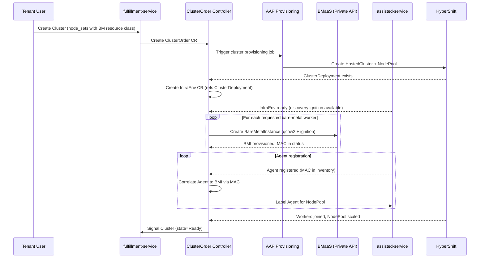
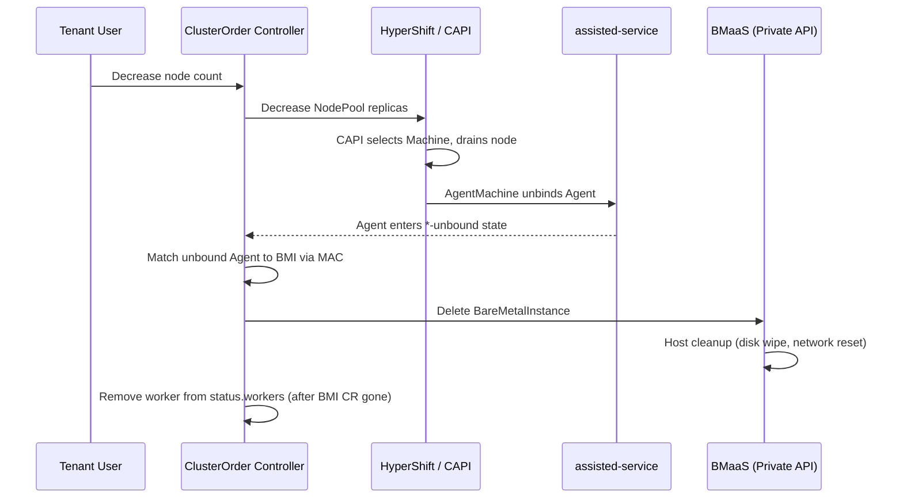

# CaaS Bare-Metal Worker Node Provisioning

## Summary

This design adds on-demand bare-metal worker node provisioning to CaaS by having the osac-operator ClusterOrder controller create BareMetalInstances via the fulfillment-service private gRPC API. Each instance references a pre-registered RHCOS DiskImage and carries cluster-specific discovery ignition as `user_data`, causing the host to register as an assisted-service Agent and join the HyperShift-managed cluster as a worker node. The existing BareMetalPool-based static pre-boot pool is removed. See [PRD](prd.md) for detailed requirements.

## Motivation

CaaS currently provisions bare-metal worker nodes through a static pre-boot pool: a cron job maintains hosts running the Assisted Installer ISO via BareMetalPool resources. This wastes capacity on idle hosts, is difficult to right-size, and couples cluster provisioning to a fragile pool management process. When the pool is exhausted, cluster scale-up fails silently until an administrator intervenes.

The new approach eliminates the pool by provisioning workers on-demand. When a ClusterOrder specifies bare-metal resource classes, the controller creates individual BareMetalInstances through the BMaaS private API, each configured with a cluster-specific discovery ignition. This gives CaaS per-instance control over image and boot configuration while keeping all infrastructure details hidden from tenants. The PoC (OSAC-2817) validated this flow end-to-end: BMI provisioning took approximately 6 minutes, the agent registered successfully, and the worker joined the HyperShift cluster.

### Goals

- Reuse the existing ClusterOrder controller reconciliation pattern and the private gRPC API for BMI lifecycle management.
- Keep all CaaS-managed bare-metal infrastructure (BMIs, InfraEnvs, Agents) invisible to tenant-facing APIs and UIs.
- Support both initial provisioning and manual scale-up/scale-down through the same controller logic.
- Ensure host cleanup on scale-down and cluster deletion flows through BMaaS's existing deprovision pipeline (disk wipe, network reset).
- Remove the BareMetalPool-based static pre-boot pool workflow entirely — no coexistence period.
- Require no changes to the tenant-facing Cluster API or CLI experience.

### Non-Goals

- Autoscaling based on workload utilization (deferred to a future CaaS autoscaling feature).
- VM-based worker nodes (deferred to VMaaS integration).
- Static IP or NMStateConfig support for worker nodes (deferred; not validated by the PoC).
- Network boot acceleration or caching strategies `[Jira: OSAC-2134]`.

## Proposal

The ClusterOrder controller in osac-operator gains a new reconciliation phase for bare-metal worker management. When a ClusterOrder's `nodeRequests` reference bare-metal resource classes, the controller:

1. Creates a cluster-specific `InfraEnv` CR on the hub cluster to generate discovery ignition.
2. Creates `BareMetalInstance` objects via the fulfillment-service private API, passing the RHCOS qcow2 image URL and the InfraEnv's discovery ignition as `user_data`.
3. Correlates registered Agents to BMIs via MAC address and labels them for NodePool selection.

No new CRDs are introduced. The design extends the ClusterOrder CRD status with a `workers` field to track CaaS-managed worker resources. BareMetalInstances created by CaaS are hidden from tenant APIs via a well-known metadata label.

**Dependencies (unresolved — block implementation):**

| Dependency | Jira | Impact if not delivered |
|-----------|------|----------------------|
| MAC address in BareMetalInstance status | [OSAC-2308](https://redhat.atlassian.net/browse/OSAC-2308), [OSAC-3254](https://redhat.atlassian.net/browse/OSAC-3254) | Agent-to-BMI correlation impossible; entire feature blocked |
| DiskImage resource + BMI DiskImage integration | [OSAC-2540](https://redhat.atlassian.net/browse/OSAC-2540), [OSAC-1270](https://redhat.atlassian.net/browse/OSAC-1270) | Controller cannot resolve RHCOS boot image; BMI creation blocked |

The existing BareMetalPool-based static pre-boot pool is removed as part of this work. The `cluster_infra` AAP step that creates BareMetalPool CRs and the scheduled `osac-import-agents` AAP job that discovers and imports hosts are no longer used by CaaS. Any remaining BareMetalPool resources are drained and cleaned up during rollout. The BareMetalPool CRD itself is retained (it serves BMaaS standalone use cases) but CaaS no longer creates or references BareMetalPool resources.

### Workflow Description

**Actors:** Cloud Infrastructure Admin (registers RHCOS DiskImages per OCP version), Tenant User (creates/scales clusters), osac-operator controller (orchestrates), fulfillment-service (BMI lifecycle), assisted-service (agent discovery), HyperShift (cluster management).

#### Provisioning Flow

Starting state: a Tenant User creates a Cluster with `node_sets` referencing a bare-metal resource class (e.g., `bare-metal-standard`). The fulfillment-service Cluster controller creates a ClusterOrder CR on the hub cluster.



The diagram shows the end-to-end provisioning flow. The controller waits for each phase to complete before proceeding: AAP provisions the HostedCluster, the InfraEnv generates ignition, BMIs provision hosts, and agents register and join the cluster. The controller updates ClusterOrder status conditions at each phase transition.

**Step-by-step:**

1. The ClusterOrder controller detects `nodeRequests` with bare-metal resource classes by checking the resource class against BareMetalInstanceType definitions.
2. After AAP creates the HostedCluster and the ClusterDeployment CR exists, the controller creates an `InfraEnv` CR in the cluster's namespace. The InfraEnv references the ClusterDeployment, the pull secret, and the SSH public key from the ClusterOrder spec.
3. The controller polls the InfraEnv status until `status.bootArtifacts.discoveryIgnitionURL` is populated, then fetches the discovery ignition content from that URL.
4. For each bare-metal worker requested, the controller calls `BareMetalInstances.Create` on the private API with: `spec.catalog_item` resolved from the resource class, `spec.image` set to the resolved RHCOS DiskImage ID (see RHCOS DiskImage Resolution), `spec.user_data` set to the discovery ignition, `spec.network_attachments` from the ClusterOrder's network attachment configuration, and `metadata.labels["osac.openshift.io/managed-by"] = "caas"`.
5. The controller updates ClusterOrder status with the BMI IDs in `workers[]`.
6. BMaaS allocates a host, writes the qcow2 to disk via Ironic, and boots with the discovery ignition. The host registers as an Agent with assisted-service.
7. The controller watches Agent CRs in the cluster namespace. When a new Agent appears, the controller matches its inventory MAC address against BMI status MAC addresses (`status.host.mac_address`, dependency OSAC-2308/OSAC-3254).
8. Once correlated, the controller sets the Agent's `clusterDeploymentName` to the cluster's ClusterDeployment and applies the `agentBareMetal` role label so the NodePool's `agentLabelSelector` selects it. This requires the osac-operator to modify `agent-install.openshift.io/v1beta1` Agent resources — a cross-API-group coupling. This is unavoidable: the assisted-service Agent API does not provide an auto-bind mechanism for late-binding agents, so an external controller must set `clusterDeploymentName` and apply labels. The osac-operator's RBAC must include `patch` on `agents` in the `agent-install.openshift.io` API group.
9. HyperShift installs the Agent as a worker node. The controller monitors NodePool `.status.replicas` to confirm convergence.

#### Scale-Up

A Tenant User increases `node_sets[].size` for a bare-metal node set. The fulfillment-service updates the Cluster object, the Cluster controller updates the ClusterOrder's `nodeRequests`, and the controller detects the delta between desired and current worker count.

**Step-by-step:**

1. The controller computes `desired - current` where `current` counts only workers in active phases (`Provisioning`, `WaitingForAgent`, `Binding`, `Ready`). Workers in `Failed` phase do not count toward capacity — the controller creates replacements to reach the desired count. Failed worker entries remain in `status.workers` for diagnostics but are cleaned up (BMI deleted) before the replacement is created.
2. The controller re-reads the InfraEnv's `status.bootArtifacts.discoveryIgnitionURL` to fetch fresh ignition. The InfraEnv persists from initial provisioning; if it was deleted (e.g., manual cleanup), the `ensureInfraEnv` phase recreates it.
3. The controller resolves the RHCOS DiskImage from the NodePool's current release image (not the ClusterOrder's original). This ensures workers added after a cluster upgrade use a compatible boot image.
4. For each new worker, the controller follows provisioning steps 4-9 from the initial flow.
5. Partial success is reported: if 3 of 5 new workers succeed and 2 fail, the ClusterOrder status shows 3 additional `Ready` workers and 2 `Failed`. The tenant sees the cluster with the successfully added workers; the failed slots are visible via ClusterOrder conditions and events.

#### Scale-Down



This diagram shows the scale-down flow. CAPI handles node drain and agent unbinding automatically. The controller reacts to the agent reaching an unbound state and then cleans up the BMI.

**Step-by-step:**

1. The controller computes the excess worker count (current minus desired).
2. The controller decreases NodePool `.spec.replicas` by the excess count.
3. CAPI's MachineDeployment controller (used by HyperShift's default Replace upgrade type) manages MachineSets, which select Machines for deletion. CaaS does not control the selection order.
4. CAPI drains each selected node, then the AgentMachine controller unbinds the Agent (clears `ClusterDeploymentName`, removes labels and ignition refs).
5. Because BMH resources exist, the Agent enters `UnbindingPendingUserAction`. The BMH agent controller triggers Ironic deprovision (clears `bmh.Spec.Image`, removes the `detached` annotation).
6. The controller watches for Agents transitioning to any `*-unbound` terminal state (`discovering-unbound`, `known-unbound`, `disconnected-unbound`, `insufficient-unbound`, `disabled-unbound`).
7. The controller matches the unbound Agent back to a BMI via MAC address.
8. The controller calls `BareMetalInstances.Delete` on the private API. BMaaS handles full host cleanup (disk wipe, network reset) before returning the host to inventory. CaaS does not independently verify cleanup completion — this is a trust boundary between CaaS and BMaaS. If BMaaS cleanup fails, the host must not be reallocated; this guarantee is BMaaS's responsibility.
9. The controller retains the worker entry in `status.workers` until the BMI CR no longer exists on the hub cluster (confirming terminal deletion). This prevents orphaned hosts — if `Delete` succeeds but cleanup stalls, the controller still has the reference to retry or alert.

#### Cluster Deletion

On ClusterOrder deletion, the controller runs the scale-down flow for all remaining workers (steps 2-9) before allowing the AAP deprovision job to destroy the HostedCluster. The InfraEnv CR is cleaned up automatically by Kubernetes garbage collection via its ownerReference to the ClusterOrder — no explicit deletion is needed. The ClusterOrder's finalizer prevents premature deletion, ensuring all BMIs are cleaned up before the ClusterOrder (and its owned InfraEnv) are removed.

### API Extensions

**Modified CRDs:**

- `ClusterOrder` (osac-operator): new `workers` status field for tracking CaaS-managed worker resources. No spec changes — `nodeRequests[].resourceClass` already carries the information needed to identify bare-metal node sets.

**New CRs created at runtime (not new CRD definitions):**

- `InfraEnv` (agent-install.openshift.io/v1beta1): one per cluster, created by the controller in the cluster's namespace. Owned by the ClusterOrder via an owner reference for garbage collection.

**Modified behavior of existing resources:**

- `BareMetalInstance` (fulfillment-service): CaaS-created BMIs carry `metadata.labels["osac.openshift.io/managed-by"] = "caas"`. The public `BareMetalInstances.List` API adds an implicit filter excluding BMIs with this label, so they do not appear in tenant listings. The private API returns all BMIs regardless. This change affects the fulfillment-service public server (`baremetal_instances_server.go`), which must inject the exclusion filter.

**Operational impact:** If the osac-operator is down, no new bare-metal workers are provisioned and scale-up/scale-down operations stall. Existing workers continue running — HyperShift manages the cluster independently. On restart, the controller reconciles current state and resumes any pending operations.

## UX Alignment

This section does not apply. No UI changes are required — CaaS-managed BMIs are hidden from tenant-facing views.

### Implementation Details/Notes/Constraints

#### ClusterOrder CRD Status Extensions

```go
type ClusterOrderStatus struct {
    // ... existing fields ...

    // Workers references CaaS-managed worker resources (BareMetalInstance or ComputeInstance).
    // +kubebuilder:validation:Optional
    Workers []corev1.ObjectReference `json:"workers,omitempty"`
}
```

Each `corev1.ObjectReference` entry contains `Kind` (e.g., `BareMetalInstance` or `ComputeInstance`), `Namespace`, `Name`, and `APIVersion`, identifying the worker CR on the hub cluster. The controller resolves the fulfillment-service ID from the CR's `osac.openshift.io/baremetalinstance-uuid` label (or the equivalent ComputeInstance label) when it needs to call the private API. Worker lifecycle state (agent correlation, phase tracking) is managed in-memory by the controller and rebuilt from live CR and Agent state on restart — it is not persisted in the ClusterOrder status.

Example: a 5-worker cluster where 3 workers are ready and 2 failed:

```yaml
status:
  phase: Progressing
  conditions:
    - type: WorkersFailed
      status: "True"
      reason: ProvisioningFailed
      message: "2 of 5 bare-metal workers failed: bm-cluster-a-worker-2 (AgentRegistrationTimeout), bm-cluster-a-worker-4 (BMI provisioning error)"
    - type: InfraEnvReady
      status: "True"
  workers:
    - kind: BareMetalInstance
      namespace: osac-orders
      name: bm-cluster-a-worker-0
      apiVersion: osac.openshift.io/v1alpha1
    - kind: BareMetalInstance
      namespace: osac-orders
      name: bm-cluster-a-worker-1
      apiVersion: osac.openshift.io/v1alpha1
    - kind: BareMetalInstance
      namespace: osac-orders
      name: bm-cluster-a-worker-2
      apiVersion: osac.openshift.io/v1alpha1
    - kind: BareMetalInstance
      namespace: osac-orders
      name: bm-cluster-a-worker-3
      apiVersion: osac.openshift.io/v1alpha1
    - kind: BareMetalInstance
      namespace: osac-orders
      name: bm-cluster-a-worker-4
      apiVersion: osac.openshift.io/v1alpha1
```

The `workers[]` list always contains all worker references regardless of their individual state. The `WorkersFailed` condition provides the summary — which workers failed and why. The ClusterOrder remains in `Progressing` phase (not `Failed`) because 3 workers are operational. The operator inspects individual BMIs via the private API to diagnose failures.

The controller tracks worker lifecycle internally through phases: `Provisioning` → `WaitingForAgent` → `Binding` → `Ready` (and `Unbinding` → `Deleting` for scale-down). `Failed` is reachable from any active phase and is terminal — the controller does not automatically retry failed workers. Failures are reported via ClusterOrder conditions and Kubernetes events.

#### InfraEnv Creation

The controller creates one InfraEnv per ClusterOrder. The InfraEnv spec:

```yaml
apiVersion: agent-install.openshift.io/v1beta1
kind: InfraEnv
metadata:
  name: <cluster-order-name>-infraenv
  namespace: <cluster-namespace>
  ownerReferences:
    - apiVersion: osac.openshift.io/v1alpha1
      kind: ClusterOrder
      name: <cluster-order-name>
spec:
  clusterRef:
    name: <cluster-deployment-name>
    namespace: <cluster-namespace>
  pullSecretRef:
    name: <pull-secret-name>
  sshAuthorizedKey: <from ClusterOrder spec>
```

One InfraEnv per cluster prevents cross-tenant agent races. If two clusters shared an InfraEnv, an agent from cluster A could be mistakenly assigned to cluster B during concurrent scale operations.

#### RHCOS DiskImage Resolution

The controller resolves the RHCOS boot image via a pre-registered DiskImage resource (dependency: OSAC-2540 DiskImage, OSAC-1270 BMI DiskImage integration). The Cloud Infrastructure Admin registers RHCOS qcow2 images as provider-global DiskImages with guest OS family (`linux`) and architecture (`amd64`), and applies a CaaS-specific label `osac.openshift.io/ocp-version: "4.22"` to enable version-based lookup. This label is a CaaS convention — the DiskImage resource itself (OSAC-2540) has no OCP version field, since version-based lookup is a CaaS-specific need. If richer metadata is needed (e.g., multiple image variants per version, automated registration), a dedicated `ClusterDiskImage` resource could wrap DiskImage with CaaS-specific fields. Labeling is sufficient for this design.

The controller reads `NodePool.spec.release.image`, extracts the OCP major.minor version (e.g., `4.22` from `ocp-release:4.22.5-x86_64`), and resolves the matching DiskImage by querying for provider-global DiskImages with the `osac.openshift.io/ocp-version` label matching the target version and the correct architecture.

Using the NodePool's current release image rather than the ClusterOrder's original ensures scale-up works correctly after cluster upgrades. A cluster created at OCP 4.18 and later upgraded to 4.22 would use a 4.22 boot image for new workers. Using the original 4.18 image could cause agent compatibility issues — the assisted-installer agent in an older RHCOS may not be compatible with a newer cluster's API or ignition format.

The boot image is ephemeral — it exists only to run the discovery agent. The assisted-installer writes the correct RHCOS version (pinned to the release image) to disk during installation. Any Z stream within the same minor version is acceptable for the boot image.

If no matching DiskImage is found for the target OCP version, the controller sets the ClusterOrder condition `RHCOSImageNotFound` and does not proceed with BMI creation. The Cloud Infrastructure Admin must register the missing DiskImage before provisioning can continue.

If the underlying OCI artifact referenced by the DiskImage is unreachable or the image download fails at Ironic, the BMI enters `Failed` phase. The failure is reported via ClusterOrder conditions.

#### BMI Creation via Private API

For each worker, the controller calls `BareMetalInstances.Create` on the private API. The existing `BareMetalInstanceSpec` proto already has the required fields. The only proto change is a new `source_type` value (`"disk_image"`) on `BareMetalInstanceImage`:

```protobuf
// Existing fields in osac.private.v1.BareMetalInstanceSpec used by CaaS
// (field numbers omitted for clarity — see baremetal_instance_type.proto for canonical numbering):
message BareMetalInstanceSpec {
  string catalog_item = ...;                                // resolved from nodeRequest.resourceClass → BareMetalInstanceCatalogItem
  optional BareMetalInstanceImage image = ...;              // RHCOS DiskImage reference (see DiskImage Resolution)
  optional string user_data = ...;                          // discovery ignition fetched from InfraEnv (max 64KB)
  repeated BareMetalNetworkAttachment network_attachments = ...;
  // ... other existing fields (ssh_public_key, run_strategy, template_parameters, etc.) omitted
}

message BareMetalInstanceImage {
  string source_type = ...;  // existing value "registry"; this design proposes adding "disk_image" for DiskImage references
  string source_ref = ...;   // DiskImage ID resolved for target OCP version + architecture
}
```

The controller sets the following metadata fields on the created BMI:

- `name`: `"<cluster-order-name>-worker-<index>"`
- `labels["osac.openshift.io/managed-by"]`: `"caas"` — visibility filter key
- `labels["osac.openshift.io/cluster-order"]`: `"<order-id>"` — links BMI to parent ClusterOrder
- `annotations["osac.openshift.io/owner-reference"]`: `"ClusterOrder/<order-id>"`

#### Visibility Filtering

The public `BareMetalInstances.List` implementation adds an implicit CEL filter clause: `!has(this.metadata.labels["osac.openshift.io/managed-by"])` (or equivalent SQL-level filtering). This ensures CaaS-managed BMIs never appear in tenant API responses. Cloud Provider Admins access CaaS BMIs via the private API or by explicitly filtering with `this.metadata.labels["osac.openshift.io/managed-by"] == "caas"`.

The `BareMetalInstances.Get`, `Update`, and `Delete` methods on the public API also reject requests for CaaS-managed BMIs with `NotFound`, preventing tenants from interacting with infrastructure they should not see. The `NotFound` response is indistinguishable from a genuinely non-existent BMI — a tenant cannot determine whether a given ID refers to a CaaS-managed instance or simply does not exist, preventing information disclosure about hidden infrastructure.

Cloud Provider Admins who need to debug CaaS-managed workers (ssh, console, restart — per PRD user story) use the private API, which returns all BMIs regardless of the `managed-by` label.

The public API rejects `Create` and `Update` requests that set the `osac.openshift.io/managed-by` label key to any value. This key is reserved for system use. This matches the `List` filter contract (which excludes any resource with this key, regardless of value) and prevents tenants from hiding their own resources by self-applying the label.

#### MAC Address Correlation

Agent-to-BMI matching uses MAC addresses scoped to the cluster's namespace and ClusterOrder. When a BMI reaches `Running` state, its status includes the allocated host's MAC address (exact field path TBD — depends on OSAC-2308/OSAC-3254, which add inventory metadata to BareMetalInstance status; the field does not exist in the current proto). When an Agent registers, its inventory includes NIC MAC addresses at `status.inventory.interfaces[].macAddress`.

The correlation algorithm requires a unique match across three dimensions before binding:
1. **Namespace:** The Agent must be in the same namespace as the ClusterOrder's cluster
2. **Ownership:** The candidate BMI must carry the `osac.openshift.io/cluster-order` label matching the current ClusterOrder
3. **MAC match:** The Agent's inventory MAC must match the BMI's status MAC

If zero candidates match, the controller continues watching. If multiple candidates match (should not happen — MACs are unique per host), the controller logs an error and does not bind, preventing ambiguous correlation. If no match is found within a configurable timeout (default: 30 minutes), the controller sets the worker phase to `Failed` with reason `AgentRegistrationTimeout`.

#### Minimum MCE Version

The MGMT-24903 fix (persistent-boot day-2 installs) is merged to assisted-service master ([PR #10717](https://github.com/openshift/assisted-service/pull/10717), 2026-07-29) and assisted-installer-agent master ([PR #1568](https://github.com/openshift/assisted-installer-agent/pull/1568), 2026-07-30). The fix is not yet in a tagged release (post-v2.55.0). The design requires a MCE version shipping these commits. Without them, workers fail to install because `osImageURL` is stripped from the ignition config. The controller does not implement a workaround — the deployment prerequisite documentation must specify the minimum MCE version.

#### Controller Reconciliation Structure

The bare-metal worker management integrates into the existing ClusterOrder controller as a new reconciliation phase, invoked after the AAP provisioning job creates the HostedCluster:

1. **ensureInfraEnv** — list InfraEnvs owned by this ClusterOrder (via ownerReference); create one if none exists; wait for ignition readiness.
2. **reconcileWorkers** — compare desired count (from `nodeRequests`) with current `workers` count. Create or delete BMIs as needed.
3. **correlateAgents** — watch Agents, match to BMIs via MAC, label for NodePool.
4. **reconcileNodePoolReplicas** — set NodePool replicas to match the number of correlated agents.

Each phase is idempotent. The controller re-enters from the top on each reconciliation cycle and progresses through completed phases without repeating side effects (BMI creation is guarded by checking `status.workers` for existing entries).

All four phases are handled within the ClusterOrder controller rather than split across separate controllers because they share sequential dependencies and ClusterOrder status state. The InfraEnv must exist before BMIs can be created, BMIs must be provisioned before agents can be correlated, and agents must be correlated before NodePool replicas can be set. Splitting these into independent controllers would require coordination mechanisms (shared status fields, cross-controller watches) that add complexity without benefit — the ClusterOrder is the single natural owner of the full bare-metal worker lifecycle.

### Security Considerations

CaaS-managed BMIs are created in the tenant's context via the private API. The private API bypasses tenant-scoped OPA policies because it operates with system-level credentials. The BMIs carry the tenant's `metadata.tenant` field for attribution but are not visible to the tenant through the public API (label-based filtering).

The discovery ignition passed as `user_data` contains the InfraEnv's pull secret and cluster endpoint information. The `user_data` field is immutable (enforced by the proto `IMMUTABLE` field behavior annotation). The ignition is scoped to a single cluster's InfraEnv — it cannot be used to register agents against a different cluster.

No changes to authentication or authorization flows are required. The existing OPA policies enforce tenant isolation for all public API access. The osac-operator authenticates to the private API using a token file mounted from a Kubernetes Secret (`OSAC_FULFILLMENT_TOKEN_FILE`), following the same pattern used by the existing feedback controllers for Signal RPCs.

Tenants interact only through the fulfillment-service API. They do not have K8s API access to the hub cluster — ClusterOrder, InfraEnv, and Agent CRs are not tenant-readable. The `Workers` references in ClusterOrder status are visible only to platform operators with hub cluster access.

The `user_data` field (which carries discovery ignition containing pull secrets) is not encrypted at application level in PostgreSQL. This is a platform-wide gap affecting all resources with `user_data`, not specific to CaaS. Infrastructure-level encryption (LUKS on PVs) is expected but not enforced by the fulfillment-service.

The private API token (`OSAC_FULFILLMENT_TOKEN_FILE`) authenticates as `service-account-osac-controller`, an admin service account with unrestricted access to all API methods across all tenants. This is an existing platform-wide credential used by all osac-operator controllers (feedback, compute instance, networking). This design does not widen its scope — it adds BMI Create/Delete to a token that already has full admin access.

### Failure Handling and Recovery

| Failure Mode | What Happens | Recovery | Tenant Observes |
|---|---|---|---|
| InfraEnv creation fails | Controller retries on next reconciliation cycle (controller-runtime requeue) | Automatic retry with exponential backoff | ClusterOrder stuck in `Progressing` with condition `InfraEnvNotReady` |
| InfraEnv ignition not generated | Controller polls InfraEnv status with 30s requeue | Automatic; investigate assisted-service if persistent | Same as above |
| BMI creation fails (private API error) | Worker phase set to `Failed` | No automatic retry. Failure reported via ClusterOrder condition `WorkersFailed` | ClusterOrder condition `WorkersFailed` with message |
| BMI provisioning fails (host allocation or Ironic error) | BMI enters `Failed` phase, worker phase set to `Failed` | No automatic retry. Failure reported via ClusterOrder condition `WorkersFailed` and event | ClusterOrder shows degraded worker count |
| Agent does not register within timeout | Worker phase set to `Failed`, reason `AgentRegistrationTimeout` | No automatic retry. Operator investigates (check InfraEnv, image URL, BMI status) | ClusterOrder condition indicates degraded workers |
| MAC correlation finds no match | Agent remains uncorrelated | Controller logs a warning and continues watching. If all BMIs are correlated and extra agents exist, they are ignored | No direct tenant impact |
| Agent binding to NodePool fails | Agent not installed as worker | assisted-service reports failure in Agent conditions; controller reflects in worker phase | ClusterOrder shows degraded worker count |
| Scale-down: Agent unbinding times out | Agent stuck in `unbinding-pending-user-action` longer than 30 minutes | Controller logs warning, sets worker phase to `Failed`. Manual intervention required to investigate Ironic deprovision failure | Node count mismatch visible in ClusterOrder status |
| BMI deletion fails | BMI stuck in `Deleting` (e.g., AAP deprovision job fails with `blockDeletionOnFailure: true`) | Controller retries delete periodically. Alerting notifies operators | Scale-down appears incomplete in ClusterOrder status |
| Controller restart mid-reconciliation | Controller resumes from current state on restart | Idempotent reconciliation logic rebuilds in-memory state from CRD status and re-queries BMI/Agent state | Temporary stall, no data loss |

### RBAC / Tenancy

No new RBAC roles are introduced. The osac-operator's service account already has permissions to create CRs in cluster namespaces and call the private API.

CaaS-managed BMIs carry `metadata.tenant` (set by the private API from the ClusterOrder's tenant context) and `metadata.labels["osac.openshift.io/managed-by"] = "caas"`. The tenant isolation metadata is present but the BMIs are not visible to the tenant — the public API filters them out. The `osac.openshift.io/cluster-order` label links BMIs to their parent ClusterOrder, enabling Cloud Provider Admin queries across clusters.

Tenant-owned BMaaS workflows are unaffected. A tenant creating their own BareMetalInstance through the public API sees only their own instances, as before.

### Observability and Monitoring

| Metric | Type | Labels | Description |
|---|---|---|---|
| `osac_clusterorder_workers_desired` | Gauge | `tenant`, `worker_type` | Total desired workers across all ClusterOrders for the tenant |
| `osac_clusterorder_workers_ready` | Gauge | `tenant`, `worker_type` | Total workers in `Ready` phase |
| `osac_clusterorder_workers_failed` | Gauge | `tenant`, `worker_type` | Total workers in `Failed` phase |
| `osac_clusterorder_worker_provisioning_duration_seconds` | Histogram | `tenant`, `worker_type` | Time from worker creation to NodePool join |
| `osac_clusterorder_worker_agent_correlation_duration_seconds` | Histogram | `tenant`, `worker_type` | Time from worker `Running` to Agent MAC match (bare_metal only) |

Per-ClusterOrder metrics would create unbounded label cardinality at scale. Metrics are aggregated by `tenant` (bounded). Per-ClusterOrder detail is available via the ClusterOrder status fields and Kubernetes events, which are the appropriate layer for per-instance diagnostics.

**Kubernetes Events:**

| Event | Type | Reason | When |
|---|---|---|---|
| InfraEnv created | Normal | `InfraEnvCreated` | Controller creates the InfraEnv CR |
| Worker created | Normal | `WorkerCreated` | Controller creates a worker resource via private API |
| Agent correlated | Normal | `AgentCorrelated` | MAC match found between Agent and worker resource |
| Worker joined | Normal | `WorkerReady` | Worker installed as cluster node |
| Agent registration timeout | Warning | `AgentRegistrationTimeout` | No Agent registered within the timeout window |
| Worker provisioning failed | Warning | `WorkerFailed` | Worker resource entered `Failed` phase |
| Worker deleted | Normal | `WorkerDeleted` | Controller deleted a worker resource during scale-down |

### Risks and Mitigations

| Risk | Impact | Mitigation |
|---|---|---|
| MAC address dependency (OSAC-2308/OSAC-3254) not delivered before this feature | Agent-to-BMI correlation impossible; entire feature blocked | Feature gated on this dependency. No partial implementation without MAC correlation. |
| DiskImage dependency (OSAC-2540/OSAC-1270) not delivered before this feature | Controller cannot resolve RHCOS boot image via DiskImage; BMI creation blocked | Feature gated on this dependency. Cloud Infrastructure Admin must register RHCOS DiskImages before CaaS bare-metal provisioning is enabled. |
| RHCOS DiskImage not registered for target OCP version | Controller cannot resolve boot image; BMI creation blocked with `RHCOSImageNotFound` condition | Cloud Infrastructure Admin must register DiskImages for each supported OCP version before enabling CaaS provisioning. Alert on `RHCOSImageNotFound` condition. |
| Ironic deprovision failure leaves hosts in limbo during scale-down | Hosts are not cleaned up; potential data leakage if reassigned | Controller sets a 30-minute timeout for unbinding. Operators alerted via `WorkerFailed` event. Manual intervention documented in support procedures. |
| Discovery ignition exceeds `bareMetalInstanceUserDataMaxBytes` (64KB) | BMI creation rejected | PoC measured 15KB. The controller emits a `DiscoveryIgnitionSizeWarning` event when the fetched ignition exceeds 48KB (75% of the 64KB limit), giving operators advance notice before BMI creation starts failing. |
| Concurrent scale operations on multiple clusters exhaust host inventory | Multiple ClusterOrders compete for limited hosts; some fail | BMI creation fails, worker enters `Failed` phase. ClusterOrder status reflects partial provisioning. Inventory sizing is the admin's responsibility. |

### Drawbacks

This design tightly couples the osac-operator to the fulfillment-service private API for BMI lifecycle management. The controller becomes a gRPC client of the fulfillment-service, adding a synchronous dependency in the reconciliation path. If the fulfillment-service is unavailable, worker provisioning and deprovisioning stall. The alternative — creating BMI CRs directly on the hub cluster — would avoid this dependency but lose the audit trail and visibility filtering that the fulfillment-service provides. The coupling is justified because the private API is the canonical path for all BMI operations, and the fulfillment-service is a core dependency that the osac-operator already communicates with for Signal RPCs and other operations.

The MAC-based Agent correlation is inherently racy: if two BMIs in different clusters boot on the same VLAN and an Agent's MAC matches a BMI from a different cluster, the correlation is wrong. The one-InfraEnv-per-cluster design prevents this for Agents (each Agent is scoped to its InfraEnv's ClusterDeployment), but the MAC lookup must still be scoped to Agents in the correct namespace.

## Alternatives (Not Implemented)

### BareMetalPool-Based Provisioning (Current Approach)

Create a BareMetalPool per ClusterOrder and let the bare-metal-fulfillment-operator manage BMI creation. **Rejected** because BareMetalPool groups BMIs with a shared profile — CaaS needs per-instance ignition (each cluster has a different InfraEnv). The Pool abstraction does not support per-BMI `image` and `user_data` configuration. The PoC validated direct BMI creation; adding a pooling abstraction that does not fit the use case adds complexity without benefit.

### Direct CR Creation on Hub Cluster

Have the controller (or AAP role) create BareMetalInstance CRs directly on the hub cluster, bypassing the fulfillment-service. This is what the current `cluster_infra` AAP step does with BareMetalPool CRs. **Rejected** because: (a) BMIs would not appear in the fulfillment-service database, breaking audit and observability; (b) the label-based visibility filtering requires fulfillment-service cooperation; (c) the private API is the canonical path for BMI lifecycle, and the PRD explicitly requires it.

### AAP-Orchestrated BMI Creation

Replace the controller-based flow with a new AAP role that calls the private API and manages the agent correlation loop. **Rejected** because AAP jobs are one-shot — they do not naturally handle the asynchronous agent registration and correlation flow. The controller's watch-based reconciliation model is the correct abstraction for reacting to Agent CR state changes over time. Scale-up and scale-down events also need reactive handling that controllers provide.

## Test Plan

### Unit Tests

- ClusterOrder controller: `reconcileWorkers` creates the correct number of BMIs when desired count exceeds current count.
- ClusterOrder controller: `reconcileWorkers` calls `BareMetalInstances.Delete` for excess BMIs when desired count is less than current count.
- ClusterOrder controller: `correlateAgents` matches an Agent to a BMI when their MAC addresses match.
- ClusterOrder controller: `correlateAgents` does not match Agents from a different namespace.
- ClusterOrder controller: `ensureInfraEnv` creates an InfraEnv with the correct ClusterDeployment reference and owner reference.
- ClusterOrder controller: worker phase transitions correctly through `Provisioning` → `WaitingForAgent` → `Binding` → `Ready`.
- ClusterOrder controller: worker phase transitions to `Failed` after agent registration timeout.
- ClusterOrder controller: reconciliation is idempotent — re-running with the same state produces no new API calls.
- Visibility filtering: public `BareMetalInstances.List` excludes BMIs with `osac.openshift.io/managed-by` label.
- Visibility filtering: public `BareMetalInstances.Get` returns `NotFound` for CaaS-managed BMIs.

### Integration Tests

- Create a ClusterOrder with bare-metal node requests in a kind cluster. Verify InfraEnv CR is created with correct spec. Verify BMI creation calls reach the fulfillment-service (mocked private API). Verify ClusterOrder status reflects `workers` entries.
- Simulate Agent registration by creating Agent CRs with matching MAC addresses. Verify correlation and labeling.
- Simulate scale-down by decreasing `nodeRequests`. Verify NodePool replicas decrease and BMI delete is called for the excess workers.
- Verify ClusterOrder deletion cleans up all BMIs and the InfraEnv before removing the finalizer.

### E2E Tests

- Full provisioning flow: create a Cluster with a bare-metal node set via the fulfillment-service public API. Verify workers join and ClusterOrder reaches `Ready`. (Requires a test environment with BMaaS hosts and assisted-service.)
- Scale-up: increase node count on an existing cluster. Verify new workers are provisioned and join.
- Scale-down: decrease node count. Verify workers are drained, agents unbound, BMIs deleted.
- Cluster deletion: delete a cluster with bare-metal workers. Verify all BMIs are cleaned up.
- Visibility: verify `osac list baremetalinstances` as a tenant user does not return CaaS-managed instances.
- Pool removal: verify no BareMetalPool CRs are created during CaaS cluster provisioning. Verify the `cluster_infra` AAP step no longer references BareMetalPool.

Note: full E2E tests require a BMaaS-capable test environment with physical or simulated bare-metal hosts. Initial E2E coverage may be limited to API-level verification with mocked BMaaS responses.

## Graduation Criteria

N/A. OSAC is in active development and has not been released to customers.

## Upgrade / Downgrade Strategy

The BareMetalPool-based pre-boot pool is removed immediately — there is no coexistence period. On upgrade:

1. The `cluster_infra` AAP step that creates BareMetalPool CRs is removed from the CaaS provisioning workflow.
2. The scheduled `osac-import-agents` AAP job is no longer needed for CaaS (it may be retained for standalone BMaaS use cases).
3. Existing BareMetalPool resources created by CaaS are drained: idle hosts are released back to inventory, and the BareMetalPool CRs are deleted.
4. Existing clusters with workers provisioned via the old pool flow continue running — their workers are already installed and do not depend on the pool. However, scale-up on these clusters uses the new on-demand BMI flow going forward.
5. Clusters mid-provisioning during the upgrade (AAP job in progress using the old `cluster_infra` step) must complete or fail before the upgrade. The upgrade procedure must drain the AAP job queue — no new CaaS provisioning jobs are accepted while the old step is being removed. Any in-flight job that references the deleted `cluster_infra` step will fail; the operator must re-trigger provisioning using the new flow after the upgrade completes.

Downgrade requires:
1. Scale down all bare-metal workers on affected clusters (the controller manages cleanup).
2. Delete any InfraEnv CRs created by the controller.
3. Re-deploy the `cluster_infra` AAP step and scheduled `osac-import-agents` job for BareMetalPool management.
4. Revert the osac-operator to the previous version.

The ClusterOrder CRD gains a new status field (`workers`). On downgrade, the older controller ignores this field. No data migration is needed because the field is status-only (the controller rebuilds it from live state on startup).

## Version Skew Strategy

The osac-operator (controller) and fulfillment-service (private API) must be upgraded together or the operator first. The controller calls `BareMetalInstances.Create` with existing fields (`image`, `user_data`). The only proto change is a new `source_type` value (`"disk_image"`) on `BareMetalInstanceImage`. If the fulfillment-service is at an older version that does not recognize this value, BMI creation may fail with a validation error — the fulfillment-service must be upgraded first or at the same time as the operator.

The visibility filtering (label-based exclusion in public `List`) requires the fulfillment-service to be upgraded. If the operator is upgraded first, CaaS-managed BMIs are created with the label but remain visible in tenant listings until the fulfillment-service is updated. This is a cosmetic issue during the upgrade window, not a functional failure.

## Support Procedures

**Detecting failures:**
- ClusterOrder stuck in `Progressing` with condition `WorkersFailed`: check `status.workers[]` for the referenced BMI names, then inspect each via the private API (`osac get baremetalinstances <name> --private`) for provisioning job errors and state.
- Alert: `osac_clusterorder_workers_failed > 0` sustained for 15 minutes.
- Agent registration timeout: check InfraEnv status for ignition generation errors. Verify RHCOS image URL is reachable from Ironic. Check BMI status for host allocation failures.
- Scale-down stall: Agent stuck in `unbinding-pending-user-action` — investigate Ironic deprovision status via `oc get bmh` in the cluster namespace. Check Ironic logs for deprovision errors.

**Disabling the feature:**
- Set the cluster template to exclude bare-metal resource classes. Existing clusters with bare-metal workers continue running — the controller does not deprovision workers unless instructed (scale-down or delete).
- To force-remove CaaS BMIs: delete them via the private API. The controller removes `status.workers[]` entries automatically once the BMI CRs are gone. If entries are stuck, patch the ClusterOrder status to remove them manually. Hosts must be manually cleaned if BMaaS deprovision failed.

**Recovery:**
- The controller is designed for idempotent reconciliation. Restarting the osac-operator pod causes the controller to rebuild state from the ClusterOrder status, re-query BMI and Agent CRs, and resume any pending operations. No manual consistency repair is needed.

## Infrastructure Needed

No new infrastructure. The feature uses existing components: osac-operator deployment, fulfillment-service private API, assisted-service, HyperShift, and BMaaS hosts.

Documentation updates required:
- Cloud Infrastructure Admin guide: DiskImage registration procedure for RHCOS qcow2 images per OCP version.
- Installation prerequisites: minimum MCE version requirement (assisted-service 5.0.0+ for MGMT-24903 fix).
- Migration guide: BareMetalPool removal procedure, AAP job queue drain during upgrade, post-upgrade re-trigger of mid-provisioning clusters.

---

## Provenance

Committed: commit @ design 0.7.1 - 782b906, workspace design/OSAC-2135 @ 385d2b4 (dirty)

> Authoring phases not recorded this session (commit-time snapshot only).

<!-- ai-workflow-provenance:{"schema_version":1,"provenance_kind":"commit_only","workflow":"design","workflow_version":"0.7.1","ai_workflows":"782b906","source_repo":"385d2b4 (dirty)","source_repo_branch":"design/OSAC-2135","commits_behind_main":0,"commits_ahead_main":639,"main_ref":"main","phases":["commit"],"authoring_modes":["skill"],"context_changed":false,"origin_untracked":false} -->
