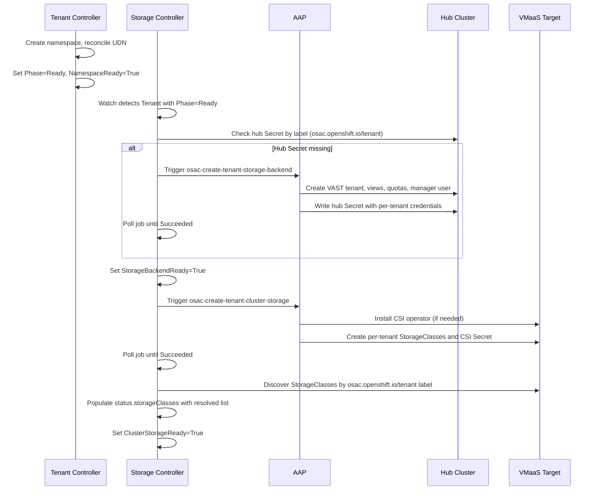
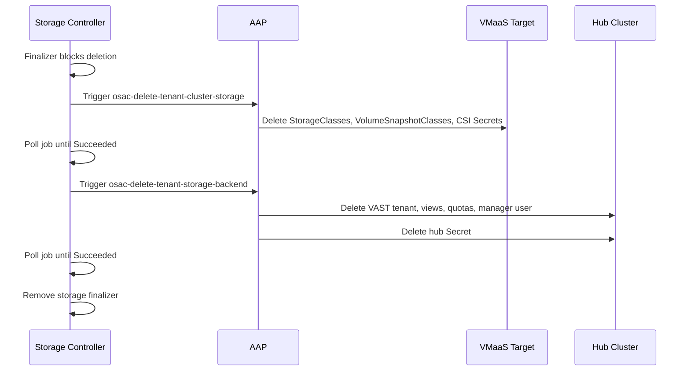
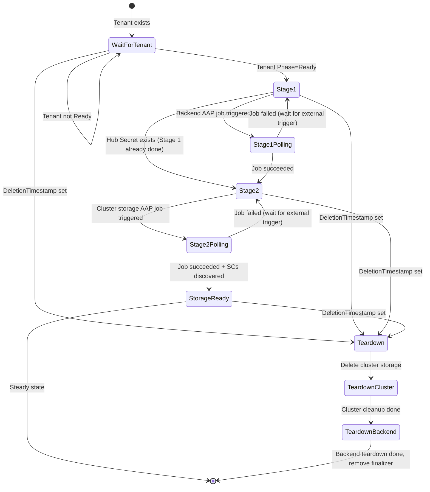

# Rework Tenant Storage Onboarding

## Summary

Extract all storage provisioning logic from the Tenant controller into a dedicated OSAC Storage Controller. The new controller owns storage conditions and status on the Tenant CR, manages a two-stage onboarding workflow (backend setup, then cluster-side StorageClass installation), and performs ordered two-step teardown. Four independent AAP playbooks replace the current combined playbooks. See [PRD](prd.md) for detailed requirements.

## Motivation

Storage provisioning is embedded in the Tenant controller alongside namespace creation, UDN reconciliation, and tenant lifecycle management. The controller handles StorageClass resolution, AAP job triggering, job polling, and the `StorageClassReady` condition. Any change to storage risks breaking tenant state transitions, and supporting different workflows per delivery model (VMaaS, CaaS, BMaaS) requires branching logic inside the Tenant controller.

The AAP integration compounds the coupling: a single playbook executes both backend setup and cluster-side StorageClass creation in sequence, making it impossible to trigger or retry each stage independently. CaaS clusters need Stage 2 to run after ClusterOrder reaches Ready, which requires independent stage control.

This design moves storage into a dedicated controller. The Tenant controller becomes namespace and UDN only, with `Phase=Ready` based solely on namespace readiness. Storage readiness is tracked via two new conditions (`StorageBackendReady` and `ClusterStorageReady`) owned by the storage controller.

### Goals

- Reuse the existing reconciliation pattern and `ProvisioningProvider` interface without modifying `pkg/provisioning/`.
- Keep Stage 1 and Stage 2 as independent operations so CaaS support can be added without modifying the storage controller's core logic.
- Maintain backward compatibility for the ComputeInstance controller, which reads `status.storageClasses` from the Tenant CR.
- Support per-backend and per-cluster status detail for observability via `kubectl get tenant -o wide`.

### Non-Goals

- StorageBackend API and registration automation (OSAC-1111).
- StorageTier API (OSAC-1110).
- Tier addition and removal workflows.
- CaaS Stage 2 trigger logic (OSAC-1123, separate PRD).
- VAST support for CaaS (OSAC-1122).
- Per-cluster storage resource on target clusters for tenant admin visibility.
- Fulfillment-service API or proto changes for storage state visibility.

## Proposal

Three changes:

1. **New OSAC Storage Controller** watches Tenant CRs and manages the full storage lifecycle. It uses two `ProvisioningProvider` instances (backend and cluster-storage) and sets two conditions on the Tenant CR: `StorageBackendReady` and `ClusterStorageReady`.

2. **Tenant controller stripped of storage logic.** It retains namespace creation, UDN reconciliation, and `NamespaceReady`. `Phase=Ready` means namespace is ready; storage conditions are not consulted.

3. **AAP playbooks split** from two combined playbooks into four lifecycle actions: `osac-create-tenant-storage-backend`, `osac-create-tenant-cluster-storage`, `osac-delete-tenant-cluster-storage`, `osac-delete-tenant-storage-backend`.

### Workflow Description

#### Actors

- **Platform Admin**: Configures storage backends, deploys osac-operator and osac-aap, creates Tenant CRs.
- **Storage Controller**: Reconciles storage state on Tenant CRs.
- **AAP**: Executes storage provisioning and teardown playbooks.

#### Onboarding Workflow

Starting state: Tenant CR exists, Tenant controller has set `Phase=Ready` (namespace exists, UDN reconciled).



On detecting a ready Tenant, the storage controller checks for a hub Secret in `OSAC_STORAGE_CONFIG_NAMESPACE` with label `osac.openshift.io/tenant=<tenantName>`. If absent, it triggers `osac-create-tenant-storage-backend` and polls until the job completes. On success, it sets `StorageBackendReady=True`.

After Stage 1, it triggers `osac-create-tenant-cluster-storage` on the VMaaS target cluster, polls until completion, discovers installed StorageClasses by label, populates `status.storageClasses`, and sets `ClusterStorageReady=True`.

#### Teardown Workflow

Starting state: Tenant CR is being deleted (DeletionTimestamp set).



The storage controller places its own finalizer (`osac.openshift.io/storage`) on the Tenant CR. Teardown runs cluster-side cleanup first, then backend teardown. The finalizer is removed only after both steps succeed. If either fails, the Tenant stays in Terminating until the issue is resolved.

#### Error Handling

- **Stage 1 or 2 AAP job failure**: The relevant condition is set to `False` with a reason reflecting the failure. The controller does not auto-retry; it waits for an external trigger (Tenant CR update, Secret or StorageClass watch event) to avoid infinite retry loops. This matches the pattern used by all other OSAC controllers.
- **Teardown failure**: The finalizer remains. The controller retries on the next reconciliation trigger. The Tenant stays in Terminating and `kubectl get tenant` shows the failure reason.

### API Extensions

The Tenant CRD gains new conditions (`StorageBackendReady`, `ClusterStorageReady`), new status fields (`storageBackends`, `clusterStorage`), and a new finalizer (`osac.openshift.io/storage`). The existing `StorageClassReady` condition is removed. No new CRDs.

The storage finalizer coexists with the existing `osac.openshift.io/tenant` finalizer. Each controller manages its own independently.

If the storage controller is down, Tenants still reach `Phase=Ready` (namespace + UDN are independent). Storage conditions remain stale until the controller recovers. Tenant deletion is blocked if the storage finalizer is present.

### Implementation Details/Notes/Constraints

#### Tenant CRD Type Changes

New status structs for per-backend and per-cluster detail:

```go
type StorageBackendStatus struct {
    Name     string `json:"name"`
    Provider string `json:"provider"`
    Ready    bool   `json:"ready"`
    Message  string `json:"message,omitempty"`
}

type ClusterStorageStatus struct {
    ClusterName string `json:"clusterName"`
    Ready       bool   `json:"ready"`
    Reason      string `json:"reason,omitempty"`
}
```

For v0.1, `storageBackends` has one entry (one VAST appliance) and `clusterStorage` has one entry (VMaaS target). The list structures anticipate multi-backend (OSAC-1111) and multi-cluster (OSAC-1123) support without schema changes.

Updated TenantStatus:

```go
type TenantStatus struct {
    Phase          TenantPhaseType          `json:"phase,omitempty"`
    Namespace      string                   `json:"namespace,omitempty"`
    StorageClasses []ResolvedStorageClass   `json:"storageClasses,omitempty"`
    Conditions     []metav1.Condition       `json:"conditions,omitempty" patchStrategy:"merge" patchMergeKey:"type"`
    Jobs           []JobStatus              `json:"jobs,omitempty"`

    // +listType=map
    // +listMapKey=name
    StorageBackends []StorageBackendStatus   `json:"storageBackends,omitempty"`

    // +listType=map
    // +listMapKey=clusterName
    ClusterStorage  []ClusterStorageStatus   `json:"clusterStorage,omitempty"`
}
```

New condition types and reasons:

```go
const (
    TenantConditionStorageBackendReady  TenantConditionType = "StorageBackendReady"
    TenantConditionClusterStorageReady  TenantConditionType = "ClusterStorageReady"
)

const (
    TenantReasonProvisioning      = "Provisioning"
    TenantReasonProvisionFailed   = "ProvisionFailed"
    TenantReasonDeprovisioning    = "Deprovisioning"
    TenantReasonDeprovisionFailed = "DeprovisionFailed"
    TenantReasonSecretNotFound    = "SecretNotFound"
    TenantReasonTenantNotReady    = "TenantNotReady"
)
```

The existing `TenantConditionStorageClassReady` is removed. `TenantConditionNamespaceReady` is unchanged.

Print columns:

```go
// +kubebuilder:printcolumn:name="Tenant Namespace",type=string,JSONPath=`.status.namespace`
// +kubebuilder:printcolumn:name="Storage Classes",type=string,JSONPath=`.status.storageClasses[*].name`
// +kubebuilder:printcolumn:name="Phase",type=string,JSONPath=`.status.phase`
// +kubebuilder:printcolumn:name="Backend Ready",type=string,JSONPath=`.status.conditions[?(@.type=="StorageBackendReady")].status`,priority=1
// +kubebuilder:printcolumn:name="Cluster Storage",type=string,JSONPath=`.status.conditions[?(@.type=="ClusterStorageReady")].status`,priority=1
```

Storage conditions use `priority=1` (visible with `-o wide`), keeping the default output compact.

#### Storage Controller Architecture

New controller in `internal/controller/storage_controller.go` with two `ProvisioningProvider` instances:

- `backendProvider`: templates `osac-create-tenant-storage-backend` / `osac-delete-tenant-storage-backend`
- `clusterStorageProvider`: templates `osac-create-tenant-cluster-storage` / `osac-delete-tenant-cluster-storage`

```go
type StorageReconciler struct {
    client.Client
    Scheme                 *runtime.Scheme
    Recorder               events.EventRecorder
    mgr                    mcmanager.Manager
    targetCluster          mc.ClusterName
    storageNamespace       string
    BackendProvider        provisioning.ProvisioningProvider
    ClusterStorageProvider provisioning.ProvisioningProvider
    StatusPollInterval     time.Duration
    MaxJobHistory          int
}
```

Env vars for AAP templates: `OSAC_STORAGE_BACKEND_AAP_PROVISION_TEMPLATE`, `OSAC_STORAGE_BACKEND_AAP_DEPROVISION_TEMPLATE`, `OSAC_STORAGE_CLUSTER_AAP_PROVISION_TEMPLATE`, `OSAC_STORAGE_CLUSTER_AAP_DEPROVISION_TEMPLATE`.

#### Reconciliation State Machine



The controller derives its current stage from conditions and hub Secret state (level-triggered):

1. **Tenant not Ready**: Both conditions set to `False` with reason `TenantNotReady`. Requeue.
2. **Stage 1 (Backend)**: Iterate over the backend list. For each backend, query Secrets by `osac.openshift.io/tenant=<tenantName>` label. If no Secret exists (Stage 1 has not run for that backend), trigger `backendProvider.TriggerProvision()` and poll. On success, update `status.storageBackends`. Set `StorageBackendReady=True` when all backends are ready.
3. **Stage 2 (Cluster Storage)**: If `StorageBackendReady=True` (Stage 1 complete), iterate over the cluster list. For each cluster, trigger `clusterStorageProvider.TriggerProvision()` and poll. Discover StorageClasses using the tier source. On success, update `status.clusterStorage` and `status.storageClasses`. Set `ClusterStorageReady=True` when all clusters are ready.
4. **Deletion**: Ordered teardown per cluster then per backend. Remove finalizer only after all complete.

#### Extension Points

The reconciliation is structured around two pluggable sources:

**Backend list:** Which backends to provision for a tenant. For v0.1, a single implicit backend from the AAP `storage-operations-ig` configuration. When the StorageBackend API (OSAC-1111) is available, this becomes a query against StorageBackend resources. The iteration loop and `status.storageBackends` array stay the same; only the list source changes.

**Tier source:** Which tiers to expect during StorageClass resolution. For v0.1, tiers come from the `STORAGE_TIERS` environment variable. When the StorageTier API (OSAC-1110) is available, this becomes a query against StorageTier CRs. The resolution algorithm and `status.storageClasses` array stay the same; only the tier source changes.

#### Tier Resolution Algorithm

Moved from the Tenant controller without modification:

1. List StorageClasses on the target cluster with label `osac.openshift.io/tenant={tenantName}`.
2. List StorageClasses with label `osac.openshift.io/tenant=Default`.
3. Group by `osac.openshift.io/storage-tier` label.
4. Per tier: use tenant-specific SC if exactly one exists; fall back to shared Default if exactly one exists; emit warning event on duplicates.
5. Populate `status.storageClasses` with the resolved list.

Tier label validation (`^[a-z0-9]([a-z0-9._-]*[a-z0-9])?$`) is preserved.

#### Tenant Controller Simplification

**Removed:** `getTenantStorageClasses()`, `groupByTier()`, `handleStorageProvisioning()`, `pollProvisionJob()`, `needsProvisionJob()`, `StorageClassReady` condition, `status.StorageClasses` population, StorageClass watch, `ProvisioningProvider` field, `storagev1` import.

**Retained:** Namespace creation/verification, UDN reconciliation, `NamespaceReady` condition, `osac.openshift.io/tenant` finalizer, phase management.

`Phase=Ready` is set when `NamespaceReady=True`. Storage conditions are not consulted.

#### Controller Registration

```go
func setupStorageController(mgr mcmanager.Manager, maxJobHistory int) error {
    backendProvider, backendPollInterval, err := createAAPProviderFromEnv(
        "OSAC_STORAGE_BACKEND_AAP_PROVISION_TEMPLATE",
        "OSAC_STORAGE_BACKEND_AAP_DEPROVISION_TEMPLATE",
    )
    if err != nil {
        return fmt.Errorf("backend provider: %w", err)
    }

    clusterStorageProvider, clusterPollInterval, err := createAAPProviderFromEnv(
        "OSAC_STORAGE_CLUSTER_AAP_PROVISION_TEMPLATE",
        "OSAC_STORAGE_CLUSTER_AAP_DEPROVISION_TEMPLATE",
    )
    if err != nil {
        return fmt.Errorf("cluster storage provider: %w", err)
    }

    return NewStorageReconciler(
        mgr,
        storageNamespace,
        targetCluster,
        backendProvider,
        clusterStorageProvider,
        max(backendPollInterval, clusterPollInterval),
        maxJobHistory,
    ).SetupWithManager(mgr)
}
```

Gated by `OSAC_ENABLE_STORAGE_CONTROLLER` / `--enable-storage-controller`.

#### AAP Playbook Split

| Current Playbook | New Playbooks | Dispatcher Action |
|---|---|---|
| `playbook_osac_configure_tenant_storage.yml` | `playbook_osac_create_tenant_storage_backend.yml` | `setup` |
| | `playbook_osac_create_tenant_cluster_storage.yml` | `ensure_storage_class` |
| `playbook_osac_delete_tenant_storage.yml` | `playbook_osac_delete_tenant_cluster_storage.yml` | `teardown_cluster_storage` |
| | `playbook_osac_delete_tenant_storage_backend.yml` | `teardown_backend` |

The dispatcher role already supports `setup` and `ensure_storage_class`. For teardown, the existing `teardown` action is replaced with `teardown_cluster_storage` and `teardown_backend`. PR #338 (OSAC-1145) covers this split.

#### ClusterOrder Watch

The storage controller watches ClusterOrder resources to prepare for CaaS support (FR-9). No reconciliation action is taken on ClusterOrder events in this scope, but the watch and tenant mapping are wired now.

ClusterOrders carry an `osac.openshift.io/tenant` annotation set by the fulfillment-service at creation time, the same annotation used by ComputeInstance and all other OSAC resources. Since ClusterOrders and Tenants live in different namespaces, `ownerReferences` cannot be used. The watch uses `EnqueueRequestsFromMapFunc` to map ClusterOrder events to the owning Tenant:

```go
func (r *StorageReconciler) SetupWithManager(mgr mcmanager.Manager) error {
    return mcbuilder.ControllerManagedBy(mgr).
        For(&v1alpha1.Tenant{}, /* ... */).
        Watches(&v1alpha1.ClusterOrder{},
            handler.EnqueueRequestsFromMapFunc(r.mapClusterOrderToTenant)).
        Watches(&storagev1.StorageClass{}, /* ... enqueue Tenant by label */).
        Complete(r)
}

func (r *StorageReconciler) mapClusterOrderToTenant(_ context.Context, obj client.Object) []reconcile.Request {
    tenantName := obj.GetAnnotations()[osacTenantAnnotation]
    if tenantName == "" {
        return nil
    }
    return []reconcile.Request{{
        NamespacedName: types.NamespacedName{
            Name:      tenantName,
            Namespace: r.tenantNamespace,
        },
    }}
}
```

When OSAC-1123 adds CaaS Stage 2 trigger logic, only the reconcile handler needs to change; the watch plumbing is already in place.

### Security Considerations

The storage controller inherits the existing OSAC security model.

**Credentials** are handled in three tiers, none of which the storage controller accesses directly:
- Admin credentials (VAST endpoint, username, password) live in the `storage-operations-ig` Secret, mounted as env vars in the AAP pod, cleared from playbook memory after use.
- Per-tenant credentials live in hub Secrets (`vast-tenant-config-{tenant_name}`) in `OSAC_STORAGE_CONFIG_NAMESPACE`. The storage controller checks their existence (Stage 1 gate) but never reads their contents.
- CSI credentials (`vast-csi-{tenant_name}`) are created by AAP in the tenant namespace with per-tenant manager credentials (not admin credentials).

The fulfillment-service has no role in storage credentials. It only sets the `osac.openshift.io/tenant` annotation when creating CRs.

**Logging**: the storage controller must not log Secret contents, credential values, or sensitive AAP parameters. Log messages reference Secret names and job IDs only. Kubernetes events must not include credential values.

**Tenant isolation**: StorageClass discovery uses label-based filtering (`osac.openshift.io/tenant={tenantName}`). OPA policies continue to enforce isolation at runtime.

### Failure Handling and Recovery

| Failure Mode | Behavior | User Sees | Recovery |
|---|---|---|---|
| Stage 1 AAP fails | `StorageBackendReady=False`, waits for external trigger | `Backend Ready: False` in `-o wide` | Fix AAP issue, touch Tenant CR or wait for Secret event |
| Stage 2 AAP fails | `ClusterStorageReady=False`, waits for external trigger | `Cluster Storage: False` | Fix AAP/cluster issue, touch Tenant CR or wait for SC event |
| Hub Secret deleted | Secret watch triggers re-reconcile, `StorageBackendReady=False` | Transient `False` | Automatic: Stage 1 re-runs |
| StorageClasses deleted | SC watch triggers re-reconcile, `ClusterStorageReady=False` | `Cluster Storage: False` | Automatic: Stage 2 re-runs |
| Teardown fails | Finalizer remains, Tenant stuck in `Terminating` | Events show failure | Fix issue, controller retries on next reconcile |
| Storage controller down | Conditions stale, Tenant lifecycle unaffected | Stale storage conditions | Restart controller, it reconciles all Tenants |
| Status conflict | controller-runtime retries automatically | No impact | Automatic (optimistic concurrency) |

All operations are idempotent. AAP playbooks check for existing resources before creating and handle already-deleted resources gracefully. On restart, the controller reads current state (conditions, Secrets, StorageClasses) and resumes from the appropriate stage.

### RBAC / Tenancy

Storage controller RBAC on hub cluster:

```go
// +kubebuilder:rbac:groups=osac.openshift.io,resources=tenants,verbs=get;list;watch;update;patch
// +kubebuilder:rbac:groups=osac.openshift.io,resources=tenants/status,verbs=get;update;patch
// +kubebuilder:rbac:groups=osac.openshift.io,resources=tenants/finalizers,verbs=update
// +kubebuilder:rbac:groups=osac.openshift.io,resources=clusterorders,verbs=get;list;watch
// +kubebuilder:rbac:groups="",resources=secrets,verbs=get;list;watch
// +kubebuilder:rbac:groups=events.k8s.io,resources=events,verbs=create;patch
```

On the target cluster: `storage.k8s.io/storageclasses: get;list;watch`.

The Tenant controller's StorageClass RBAC is removed. No tenancy model changes.

### Observability and Monitoring

**Events (Normal):** `StorageBackendProvisioned`, `ClusterStorageProvisioned`, `StorageTeardownComplete`.

**Events (Warning):** `StorageProvisionFailed` (includes AAP job ID and error), `StorageTeardownFailed`, `DuplicateStorageClass` (preserved from current controller).

**Logs:** Structured key-value pairs via `ctrllog` at each stage transition. No credentials in logs.

**Metrics:** No new metrics. Existing controller-runtime metrics (reconciliation duration, queue depth, errors) apply automatically.

### Risks and Mitigations

| Risk | Impact | Mitigation |
|---|---|---|
| Two controllers writing Tenant status concurrently | Low (transient delays) | Optimistic concurrency + DeepCopy-compare-update pattern |
| Operator and AAP deployed out of sync | High (storage provisioning breaks) | Operator-first deployment order; failures are transient and self-heal once AAP catches up |

### Drawbacks

The main cost is operational: two controllers manage the same CR's status, requiring understanding of which controller owns which conditions. This is justified because the storage lifecycle is genuinely independent (different failure modes, different AAP integrations), and embedding CaaS support in the Tenant controller would require branching logic that couples delivery model decisions to tenant lifecycle. Condition ownership is a well-established Kubernetes pattern.

## Alternatives (Not Implemented)

### TenantStorage CRD

Separate CRD for per-tenant storage state. Clean ownership boundary, but adds a resource that must be created, watched, and garbage-collected. ComputeInstance would need to read StorageClasses from TenantStorage instead of Tenant, breaking the existing API. Rejected during PRD review in favor of condition ownership.

### Single ProvisioningProvider with Template Switching

Extend the `ProvisioningProvider` interface to accept a template name on each call. Simpler configuration, but breaks the interface contract used by all other controllers. The two-provider approach keeps each provider independently configurable.

### Keep Storage Logic in Tenant Controller

Add feature flags for CaaS vs VMaaS. No new controller, but CaaS requires ClusterOrder events to trigger the Tenant controller, coupling cluster provisioning to tenant lifecycle. Storage issues cannot be diagnosed independently.

## Test Plan

### Unit Tests

Using mock `ProvisioningProvider`, following existing controller test patterns:

- **Stage 1:** Tenant not ready (skip), no hub Secret (trigger provision), Secret exists (skip to Stage 2), job failure (condition False).
- **Stage 2:** Stage 1 incomplete (wait), Stage 1 complete + no SCs (trigger provision), SCs discovered (condition True), job failure.
- **Tier resolution:** Tenant-specific SC, Default fallback, duplicate detection, missing tier.
- **Teardown:** Ordered two-step, partial failure, finalizer removal only after both complete.
- **Management state:** `Unmanaged` skips steady-state reconciliation; finalizer and deletion handling still run (FR-4).
- **Tenant controller:** Phase=Ready with NamespaceReady only, no storage logic.

### Integration Tests

envtest with both controllers running simultaneously:

- Condition updates propagate correctly.
- Finalizer coexistence (tenant + storage).
- Status conflict resolution.

### E2E Tests

Full lifecycle against a VAST appliance:

- Tenant creation triggers Stage 1 then Stage 2.
- Tenant deletion triggers ordered teardown.
- StorageClasses usable by ComputeInstance.

## Graduation Criteria

To be defined when targeting a release. Expected: Dev Preview, Tech Preview, GA.

## Upgrade / Downgrade Strategy

Pre-GA change, no migration needed. `StorageClassReady` is removed and replaced by `StorageBackendReady` and `ClusterStorageReady`.

**Deployment order:** Operator first, then AAP. If the operator is deployed before AAP, the storage controller calls templates that don't exist yet; AAP returns "template not found", the controller records a Failed job, and retries once AAP is updated. If AAP is deployed first, the old Tenant controller calls the old template names which no longer exist, breaking storage for all tenants. Operator-first is safer because failures are transient and self-heal.

## Version Skew Strategy

During upgrade, the old Tenant controller writes `StorageClassReady` while the new storage controller writes `StorageBackendReady`/`ClusterStorageReady`. No conflict. The orphaned `StorageClassReady` condition can be cleaned up manually after the upgrade.

No fulfillment-service version skew concern (the storage controller does not use the gRPC API).

## Support Procedures

**Detecting failures:**
- `kubectl get tenant -o wide` shows `Backend Ready` and `Cluster Storage` columns.
- `kubectl describe tenant <name>` shows conditions with reasons and AAP job IDs.
- Controller logs: `kubectl logs -n osac-system deployment/osac-operator-controller-manager | grep "storage"`.

**Disabling the storage controller:**
- Set `OSAC_ENABLE_STORAGE_CONTROLLER=false`. New tenants won't get storage. Tenant deletion is blocked if the storage finalizer is present (remove manually).

**Disabling storage for a single tenant:**
- Set `osac.openshift.io/management-state: Unmanaged` on the Tenant CR. Steady-state reconciliation is skipped; finalizer and deletion handling still run so the Tenant can be deleted cleanly.

**Re-enabling:**
- Remove the flag or annotation. The controller reconciles all Tenants on next run. All operations are idempotent.

## Infrastructure Needed

None.
