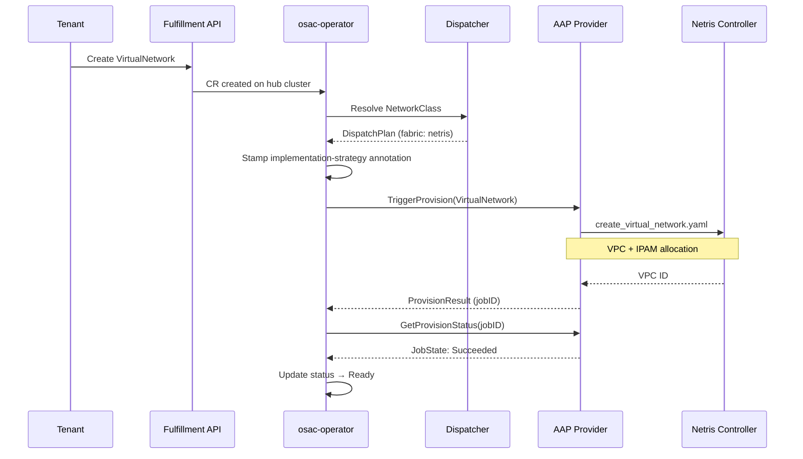

# Fabric Manager — Netris

## Summary

This document describes the technical design for the Netris fabric manager,
OSAC's production networking backend that translates tenant networking
resources into Netris controller configuration. The Netris backend fulfills
the fabric manager contract defined by the
[Unified Networking design](/enhancements/OSAC-1433-unified-networking/design.md):
it manages VPCs, VNets, IPAM allocations, NAT rules, and ACLs through the
Netris controller REST API.

See [PRD](prd.md) for the problem statement, user stories, and requirements.

## Motivation

OSAC networking relies on a pluggable fabric manager to translate
infrastructure-agnostic networking resources (VirtualNetwork, Subnet,
SecurityGroup, ExternalIP, ExternalIPAttachment, NATGateway) into physical
network configuration. The Netris fabric manager is the first production
backend and serves as the reference implementation of the fabric manager
contract. Its behavior is scattered across Ansible roles, operator
controllers, and feature-level docs, making it difficult to reason about
correctness, validate new backends against a baseline, or identify enforcement
gaps.

This design document serves three purposes:

1. **Codify the fabric manager contract** — the interface and lifecycle
   guarantees that any fabric manager must implement.
2. **Document how Netris fulfills each contract requirement** — the mapping
   from OSAC resources to Netris constructs.
3. **Establish a parity baseline** for future fabric managers (e.g., the
   agentless VLAN backend, OSAC-3664).

### Goals

- Document the fabric manager contract as a reusable specification that
  future backends implement against.
- Map each OSAC networking resource to the specific Netris resources the
  backend creates, updates, and deletes.
- Document the data flow from user action through the operator dispatcher
  to the AAP provisioning provider to the Netris controller API.
- Define failure modes, error surfaces, and recovery behavior.

### Non-Goals

- Changes to the Netris backend implementation — this document describes
  the existing design.
- The K8s manager contract or implementation — that is covered by a
  separate design document.
- SecurityGroup policy semantics (allow/deny evaluation, rule ordering,
  stateful tracking) — that is a cross-backend concern.
- Multiple Netris controllers, split-controller topologies, or Netris
  controller HA. One controller may manage multiple sites mapped to OSAC
  regions.

## Proposal

### The Fabric Manager Contract

Any fabric manager must satisfy the following contract. The Netris backend
is the reference implementation; future backends (agentless VLAN, Neutron)
must fulfill the same contract.

#### Registration

A fabric manager registers by deploying a ConfigMap in the operator
namespace with the label `osac.openshift.io/network-fabric-manager: "true"`.
The OSAC chart renders the Netris registration ConfigMap as
`osac-network-fabric-manager-netris`; its `data.name` is `netris`, matching the
`NetworkClass.spec.fabricManager` value. The registration ConfigMap contains
metadata and capabilities only; Netris credentials are supplied separately
through a Kubernetes Secret.

Required data fields:

| Field | Key | Description |
|-------|-----|-------------|
| Name | `data.name` | Unique identifier (e.g., `netris`). Duplicate names within a manager type are rejected at discovery. |
| Description | `data.description` | Human-readable summary. |
| Capabilities | `data.capabilities` | Comma-separated list from the fixed set: `ipv4`, `ipv6`, `dualStack`, `dpuSupport`. Must not be empty. `dualStack` implies both `ipv4` and `ipv6`. |

Example:

```yaml
apiVersion: v1
kind: ConfigMap
metadata:
  name: osac-network-fabric-manager-netris
  namespace: osac
  labels:
    osac.openshift.io/network-fabric-manager: "true"
data:
  name: netris
  description: "Netris SDN — tenant isolation, ACL, IPAM, DNAT, SNAT"
  capabilities: "ipv4"
```

The `networkmanager.ParseConfigMap()` function validates the ConfigMap
structure and capabilities at discovery time. Invalid ConfigMaps are
rejected with a descriptive error.

#### Provisioning Provider Interface

Fabric managers do not implement a Go interface directly. Instead, the
operator dispatches provisioning work to AAP, which routes to the
backend's Ansible roles based on the `osac.openshift.io/implementation-strategy`
annotation stamped on each resource. The AAP provider implements the
`ProvisioningProvider` interface on behalf of all backends:

```go
type ProvisioningProvider interface {
    TriggerProvision(ctx context.Context, resource client.Object) (*ProvisionResult, error)
    GetProvisionStatus(ctx context.Context, resource client.Object, jobID string) (ProvisionStatus, error)
    TriggerDeprovision(ctx context.Context, resource client.Object, provisionJobs []JobStatus) (*DeprovisionResult, error)
    GetDeprovisionStatus(ctx context.Context, resource client.Object, jobID string) (ProvisionStatus, error)
    Name() string
}
```

Each backend provides an Ansible role (e.g., `osac.templates.netris`) with
task files named by operation: `create_virtual_network.yaml`,
`delete_virtual_network.yaml`, `create_subnet.yaml`, etc. The AAP provider
selects the correct task file based on the resource kind and operation.

OSAC dispatches workload-network operations independently of resource
create/delete. Their manager scope differs:

| Operation | Manager scope | Role task contract |
|-----------|---------------|--------------------|
| Move a workload port between network segments | Fabric Manager only | `move_network_attachment` moves the port from the configured provisioning segment to the tenant segment on attach, and back on detach. Both directions must be safe to retry. |
| Discover a workload's DHCP address | The manager selected for the workload's network, whether Fabric or K8s, when OSAC requests lease discovery | `query_dhcp_lease` resolves the lease by the port MAC. Netris reads its IPAM host entries; server-name lookup is used only where the service contract permits it. Return the address for OSAC status. |

The K8s manager does not perform `move_network_attachment`: its CUDN-based
attachments do not move physical fabric ports. `query_dhcp_lease` is
manager-neutral and must be implemented by whichever manager OSAC selects when
it requests lease discovery. The current repository has this task in the Netris
role, used by the bare-metal IP-discovery flow. The current k8s-only path does
not invoke lease discovery and has no corresponding task; add one before routing
lease-discovery requests to the K8s manager.

#### Dispatch Table

The dispatcher maps resource kinds to manager roles. A fabric manager
must handle all resource kinds assigned to the `Fabric` role:

| Resource Kind | Roles | K8sFallback | Contract |
|---------------|-------|-------------|----------|
| VirtualNetwork | Fabric | Yes | Create isolated L3 routing domain |
| Subnet | Fabric + K8s | Yes | Create L2 segment with gateway and DHCP |
| SecurityGroup | Fabric | Yes | Create ACL/firewall rules |
| ExternalIP | Fabric | Yes | Allocate IP from pool |
| ExternalIPPool | Fabric | Yes | Register IP pool for allocation |
| ExternalIPAttachment | Fabric | Yes | Create inbound DNAT rule |
| NATGateway | Fabric | No | Create outbound SNAT rule |

`K8sFallback: true` means that in deployments without a fabric manager
(k8s-only mode), the K8s manager handles this resource kind instead. The
only exception is `NATGateway` — it requires a fabric manager and cannot
fall back to the K8s manager.

#### Per-Resource Contract

For each resource kind, the fabric manager must:

**VirtualNetwork — create an isolated L3 routing domain.**
- Accept: `spec.region`, `spec.ipv4Cidr`, `spec.networkClass` (all immutable after creation).
- Create: A routing domain (VRF/VPC) with the specified CIDR, isolated from other VirtualNetworks.
- Constraint: Different VirtualNetworks must have no direct internal connectivity, even with overlapping CIDRs. Cross-VN traffic is only possible via ExternalIPs.

**Subnet — create an L2 segment within a VirtualNetwork.**
- Accept: `spec.virtualNetwork` (parent VN UUID, immutable), `spec.ipv4Cidr` (immutable).
- Create: An L2 segment within the parent VN's routing domain, with a gateway address (first usable IP in CIDR) and DHCP range (second usable to last usable).
- Placement: Use the Netris site resolved for the parent VirtualNetwork's region. Use the configured default site only when the parent VirtualNetwork omits its region.
- Constraint: The subnet CIDR must be within the parent VN's CIDR, and the parent VirtualNetwork and its site must resolve before Netris resources are created.
- Note: Subnet is the only resource dispatched to both Fabric and K8s roles.

**SecurityGroup — create ACL/firewall rules.**
- Accept: `spec.virtualNetwork` (parent VN UUID, immutable), `spec.ingressRules[]`, `spec.egressRules[]`.
- Create: Permit rules for each ingress/egress entry. Rules are applied per-subnet CIDR (the product of rules × subnets in the VN). Resolve the parent VPC and all applicable subnet CIDRs first; unresolved values fail closed and never become a default VPC or wildcard CIDR.
- Mutable: Rule updates reconcile existing ACLs to the new desired set, updating changed rules and removing obsolete rules. A retry must not create duplicates.

**ExternalIPPool — register an IP pool for allocation.**
- Accept: `spec.cidrs` (immutable, canonical IPv4; the current API permits exactly one CIDR), `spec.ipFamily` (immutable, `IPv4` only).
- Owner: Cloud Infrastructure Admin. Tenants can allocate ExternalIPs from a provider-defined pool but cannot create or change it.
- Purpose: This is a NAT pool. The Netris pool allocation itself has no `purpose` field; its common parent subnet uses `purpose=common`, and each allocated ExternalIP /32 subnet uses `purpose=nat`.
- Create: A provider-owned IPAM allocation and common parent subnet for the pool CIDR, identified by a stable owner key rather than a name suffix.
- Deletion guard: Cannot be deleted while child ExternalIPs exist.

**ExternalIP — allocate an IP from a pool.**
- Accept: `spec.pool` (immutable, ExternalIPPool name).
- Allocate: A single IP address from the pool and reserve it as a Netris /32 subnet with `purpose=nat`. Resolve reservations by a stable owner key derived from the immutable ExternalIP UID, not by resource name alone.
- Idempotent: Reuse the same reservation on retry and restore the `osac.openshift.io/allocated-address` annotation if it is missing. Allocate only when no reservation exists for that ExternalIP.

**ExternalIPAttachment — create an inbound DNAT rule.**
- Accept: `spec.externalIP`, target (one of `computeInstance`, `cluster`, `baremetalInstance`), `spec.targetEndpoint` (API or Ingress, required for clusters). Entire spec is immutable after creation.
- Create: A DNAT rule routing the ExternalIP's allocated address to the target's internal IP. A workload target must resolve to its tenant VPC; use the management VPC only for an explicitly requested, supported cluster endpoint. An unresolved tenant VPC fails closed.

**NATGateway — create an outbound SNAT rule.**
- Accept: `spec.virtualNetwork` (parent VN name, immutable), `spec.externalIP` (ExternalIP name, immutable). Entire spec is immutable after creation.
- Create: An SNAT rule so that all egress from the VirtualNetwork's CIDR uses the ExternalIP's allocated address as the source. Resolve the tenant VirtualNetwork and VPC before creating the rule; unresolved lookups fail closed and never select the management VPC.
- No K8sFallback: This resource requires a fabric manager. K8s-only deployments cannot create NATGateways.

#### Lifecycle Guarantees

All operations must be:

- **Idempotent.** Re-provisioning an already-provisioned resource must not create duplicates. Deleting a backend resource that is already absent succeeds as a no-op.
- **Convergent on updates.** A mutable spec change updates existing Netris resources and removes stale configuration until the backend matches desired state. A successful `DesiredConfigVersion` may skip redundant work only while the managed state is known to match; failed or incomplete work and detected missing resources must be retried even when the spec hash is unchanged.
- **Phase-tracked.** Resources transition through phases: `Progressing → Ready → Failed → Deleting`. `DesiredConfigVersion` detects spec changes and participates in retry behavior; it does not replace backend-state recovery.
- **Job-tracked.** Each provisioning or deprovisioning operation is recorded in the resource's `status.provisioningJobs[]` array, bounded by `MaxJobHistory`.
- **Condition-reported.** Detailed status is reported via standard Kubernetes conditions.

#### Deletion Guards

- VirtualNetwork deletion waits for all child Subnets, SecurityGroups, and NATGateways (matched by `osac.openshift.io/virtualnetwork-uuid` label) to be deleted first.
- Subnet deletion waits for all child ComputeInstances and BareMetalInstances to be removed.
- ExternalIPPool deletion waits for all child ExternalIPs to be released.
- Teardown respects dependency order: ExternalIPAttachment's DNAT rule is removed before the ExternalIP is released.

### Netris Implementation

The Netris fabric manager fulfills the contract through Ansible roles in
the `osac.templates.netris` collection, invoked by AAP.

#### Workflow Description

The following diagram shows the data flow from a tenant action to the
Netris controller:



Step by step:

1. The tenant creates a networking resource (e.g., VirtualNetwork) via the
   fulfillment API or CLI. The API creates the CR on the hub cluster.
2. The osac-operator controller detects the new CR and calls
   `Dispatcher.Dispatch(kind, networkClassID)`.
3. The dispatcher resolves the NetworkClass, looks up the fabric manager
   ConfigMap by name, and returns a `DispatchPlan` with the Netris manager.
4. The controller stamps `osac.openshift.io/implementation-strategy: netris`
   on the CR.
5. The controller calls `TriggerProvision()` on the AAP provisioning
   provider, which serializes the CR and launches the appropriate Ansible
   role task (e.g., `create_virtual_network.yaml`).
6. The Ansible role authenticates with the Netris controller
   (`netris.controller.auth`) and calls the Netris REST API to create the
   required resources.
7. The controller polls `GetProvisionStatus()` until the AAP job completes.
8. On success, the controller transitions the resource to `Ready`. On
   failure, it transitions to `Failed` with a diagnostic message.

#### Resource Mapping

The following table describes the target Netris mapping. Current differences
from this contract are listed under
[Current Implementation Gaps](#current-implementation-gaps).

| OSAC Resource | Netris Resources | Ansible Role / Task | Details |
|---------------|-----------------|---------------------|---------|
| VirtualNetwork | VPC (ipVRF) + IPAM allocation | `netris.controller.vpc` → `create`, `netris.controller.ipam` → `create_allocation` | VPC provides isolated routing domain. IPAM allocation with `purpose=common` reserves the VN CIDR. Region is mapped to Netris site ID via `netris_region_site_map`. |
| Subnet | IPAM subnet + VNet (macVRF) | `netris.controller.ipam` → `create_subnet`, `netris.controller.vnet` → `create` | IPAM subnet under parent VPC. VNet with gateway (first usable IP), DHCP enabled, range = second usable to last usable. VXLAN VNI auto-assigned by Netris. Both use the site resolved for the parent VirtualNetwork. |
| SecurityGroup | ACL permit rules | `netris.controller.acl` → `create` | Resolve the parent VPC and subnet CIDRs before creating the Cartesian product of ingress/egress rules × subnet CIDRs. Missing values fail closed; updates remove obsolete ACLs. |
| ExternalIPPool | Provider-owned NAT IPAM allocation + common subnet | `netris.controller.ipam` → `create_allocation`, `create_subnet` | The current API permits one CIDR. The allocation has no Netris `purpose` field; its common subnet uses `purpose=common`. A stable pool owner key identifies the allocation. |
| ExternalIP | IPAM /32 subnet (`purpose=nat`) | `netris.controller.ipam` → `create_subnet` | Reuse a reservation found by stable ExternalIP UID owner key, repair the allocated-address annotation if needed, and allocate only when no reservation exists. The /32 subnet uses `purpose=nat`. |
| ExternalIPAttachment | DNAT rule | `netris.controller.nat` → `create` | `nat_action: dnat`, destination = ExternalIP allocated address, DNAT-to = target internal IP. Workload targets use the resolved tenant VPC. The management VPC is used only for an explicitly requested, supported cluster endpoint. |
| NATGateway | SNAT rule (NAT) | `netris.controller.nat` → `create` | `nat_action: snat`, source = VN CIDR, SNAT-to = ExternalIP allocated address. Rule lives in the resolved tenant VPC. If the VirtualNetwork or tenant VPC cannot be resolved, provisioning fails; the management VPC is never used as a fallback. |

#### Deletion Mapping

Each create operation has a corresponding delete task that reverses it:

| OSAC Resource | Delete Task | Netris Resources Removed |
|---------------|-------------|--------------------------|
| VirtualNetwork | `delete_virtual_network.yaml` | IPAM allocation + VPC |
| Subnet | `delete_subnet.yaml` | VNet + IPAM subnet |
| SecurityGroup | `delete_security_group.yaml` | All ACL rules owned by the SecurityGroup, including obsolete rules |
| ExternalIPPool | `delete_external_ip_pool.yaml` | Common subnets + IPAM allocations |
| ExternalIP | `delete_external_ip.yaml` | /32 IPAM subnet |
| ExternalIPAttachment | `detach_external_ip.yaml` | DNAT rule |
| NATGateway | `delete_nat_gateway.yaml` | SNAT rule |

### API Extensions

No new API extensions. The Netris backend implements the existing
networking API defined by the unified networking design (OSAC-1433). The
backend is selected through provider-level configuration (NetworkClass
`fabricManager` field), not through API changes visible to tenants.

The only annotation the backend writes is `osac.openshift.io/allocated-address`
on ExternalIP CRs, which is part of the ExternalIP allocation contract shared
by all fabric managers. Backend ownership is recovered from a stable key
derived from the immutable OSAC object UID and stored in Netris; it does not
require extra CRD fields or infer ownership from a human-readable name.

### Implementation Details/Notes/Constraints

#### Configuration

The Netris backend requires the following configuration, deployed as part
of the OSAC installation:

| Variable | Source | Description |
|----------|--------|-------------|
| `netris_controller_url` | Kubernetes Secret (required target; currently installer AAP ConfigMap) | Netris controller REST API base URL |
| `netris_username` | Kubernetes Secret (required target; currently installer AAP ConfigMap) | Netris controller username |
| `netris_password` | Kubernetes Secret / AAP credential | Netris controller password |
| `netris_site_id` | `global.networking.netris.siteId` → AAP environment ConfigMap | Default Netris site ID used only when a VirtualNetwork omits its region, and for provider-scoped resources without a VirtualNetwork region. |
| `netris_tenant_id` | `global.networking.netris.tenantId` → AAP environment ConfigMap | Netris tenant ID for OSAC resources |
| `netris_region_site_map` | Not currently exposed by the installer or passed to AAP | Required mapping from supported OSAC VirtualNetwork regions to Netris site IDs. An explicitly configured but unmapped region is an error; use `netris_site_id` only when region is omitted. Subnets inherit their parent VirtualNetwork's resolved site. |
| `netris_mgmt_vpc_id` | `global.networking.netris.mgmtVpcId` → AAP environment ConfigMap | Management VPC ID for explicitly supported cluster-endpoint DNAT rules; never a fallback for tenant NATGateway rules. |
| `netris_mgmt_vpc_name` | `global.networking.netris.mgmtVpcName` → AAP environment ConfigMap | Management VPC name for explicitly supported cluster-endpoint DNAT rules. |

#### Idempotency

Every Ansible task checks for existing resources before creating:

- VPC: checks `vpc_already_existed` from `netris.controller.vpc.create`
- IPAM: checks `ipam_already_existed` from `netris.controller.ipam.create_*`
- VNet: checks `vnet_already_existed` from `netris.controller.vnet.create`
- NAT: checks `nat_already_existed` from `netris.controller.nat.create`
- ACL: checks existing ACL by name before creating

Idempotent reconciliation is also required for update requests: when a mutable
spec changes, provisioning must update the existing Netris objects until they
match the new desired state. Merely finding an existing object and returning
success would leave stale configuration; retrying the update must not create
duplicates. This desired-state convergence is essential for update requests,
not just duplicate prevention. Delete tasks treat an already absent Netris
resource as successfully deleted. Resource lookups and deletes use exact
Netris IDs or stable UID-derived owner keys; they do not infer ownership from a
human-readable name pattern alone.

#### ExternalIP Allocation Algorithm

ExternalIP allocation must be serialized per pool, either by using an atomic
Netris allocation operation or by holding a pool-scoped lock across selection
and reservation. The current scan-then-reserve implementation is not atomic
and can assign the same address to concurrent requests; it must not be treated
as concurrency-safe until this contract is implemented. The current lookup
also matches pool allocations by name and optional numeric suffix and matches
an existing reservation by ExternalIP name; neither lookup proves ownership.

1. Resolve the provider pool's single Netris allocation by a stable owner key
   derived from the ExternalIPPool UID, not by a name or suffix pattern.
2. Before selecting an address, look up a reservation owned by the
   ExternalIP UID. If found, reuse it and restore the address annotation if
   necessary.
3. If no reservation exists, read current reservations while holding the
   pool allocator lock and select a free host address, skipping network and
   broadcast addresses.
4. Reserve the address as a /32 IPAM subnet with `purpose=nat` and bind it to
   the ExternalIP UID. If reservation conflicts, refresh the full pool state
   and retry a bounded number of times.
5. Publish the allocated-address annotation only after reservation and owner
   binding are confirmed. Reconciliation must recover the same reservation
   if annotation writing fails.
6. Release the exact owned reservation on deletion; an already-absent
   reservation is successful.

Pool CIDRs must be /30 or wider — /31 (RFC 3021) produces an empty
candidate range and is not supported.

#### SecurityGroup ACL Rule Expansion

ACL rules are created as the Cartesian product of user-defined rules and
resolved subnet CIDRs. For a SecurityGroup with 3 ingress rules on a
VirtualNetwork with 2 subnets, the backend creates 6 ACL rules (3 × 2). Each
ACL must carry a stable SecurityGroup owner identity so updates and deletion
can find all currently owned rules, including rules for removed subnets or
removed entries. A missing VPC or subnet CIDR is an error; it must never
default to VPC ID 1 or `0.0.0.0/0`.

This expansion is necessary because Netris ACL rules operate on specific
CIDR prefixes, not on VPC-level abstractions.

### Current Implementation Gaps

The tables above describe the required behavior. Comparison with the current
OSAC implementation identifies these gaps; they are not intended behavior:

- **Region and Subnet placement:** `create_virtual_network.yaml` falls back to
  `netris_site_id` when an explicit region has no mapping. The Subnet tasks in
  `create_subnet.yaml` use `netris_site_id` directly instead of the site
  resolved for the parent VirtualNetwork. The role references
  `netris_region_site_map`, but the installer does not currently expose or
  pass that mapping to AAP.
- **NAT VPC resolution:** `create_nat_gateway.yaml` starts with the management
  VPC and replaces it only after resolving the tenant VPC. A failed lookup can
  therefore create a tenant SNAT rule in the management VPC. The same
  fail-open pattern exists in `attach_external_ip.yaml`; management-VPC use
  must be limited to an explicit cluster-endpoint target.
- **SecurityGroup safety and convergence:** `create_security_group.yaml`
  defaults a missing VPC ID to `1` and missing subnet CIDRs to `0.0.0.0/0`.
  The ACL create task treats an existing same-name ACL as complete without
  updating it, and deletion only enumerates names generated from the current
  rules and subnets. Missing dependencies must fail closed; updates and deletes
  must reconcile every ACL owned by the SecurityGroup and remove stale rules.
- **ExternalIP ownership and concurrency:** the current ExternalIPPool API
  permits exactly one CIDR, while `create_external_ip.yaml` locates pool
  allocations by pool name and optional numeric suffix. It selects an address
  by scanning IPAM and then creates a /32 without an atomic reservation or
  pool lock. Existing reservations are matched by ExternalIP name rather than
  verified owner identity. Replace these lookups with stable UID-derived owner
  keys, reuse an existing reservation before allocating, and refresh the full
  pool state after a reservation conflict.
- **Recovery after external drift:** `DesiredConfigVersion` retries failed
  work, but a successful unchanged hash can suppress another provisioning
  job. The current reconciliation path does not reliably detect a Netris
  object manually removed after success; add a recovery trigger so missing
  managed state is repaired even when the hash is unchanged.
- **Diagnostic redaction:** `acl/tasks/create.yaml` can emit a raw Netris
  response body, and the AAP provider copies job traceback text into error
  details without field-level redaction. Sanitize before data reaches AAP job
  output, `status.provisioningJobs`, resource conditions, or events.
- **Credential placement:** the manager registration ConfigMap is metadata
  only, as required. The installer currently renders `NETRIS_CONTROLLER_URL`
  and `NETRIS_USERNAME` into the separate AAP runtime ConfigMap and stores
  `NETRIS_PASSWORD` in a Secret. If NFR-2 requires all three values to be
  Secret-backed, move the URL and username before claiming that requirement is
  implemented.

### Security Considerations

#### Credential Handling

Netris controller credentials (`netris_controller_url`, `netris_username`,
`netris_password`) are stored in Kubernetes Secrets and injected into AAP
as credential types. They are never written to the manager registration
ConfigMap, resource status, events, or tenant-visible output. AAP task output,
job status, resource
conditions, and events may expose only allowlisted diagnostic fields such as
operation, resource kind, sanitized Netris error code, request ID, and AAP job
ID. Redact credentials, authorization data, secret-bearing response fields,
raw response bodies, and tenant or network identifiers before surfacing
diagnostics.

#### Tenant Isolation

Different VirtualNetworks map to separate Netris VPCs (VRFs). Traffic
isolation between VPCs is enforced by the Netris controller at the fabric
level. A workload in one VPC cannot reach another VPC's private addresses,
even when CIDRs overlap. Cross-VN traffic is only possible via ExternalIPs,
which traverse the external path through DNAT/SNAT rules.

#### Input Validation

- CIDR fields are validated at the CRD level (CEL validation for canonical
  IPv4 format, no IPv6).
- The Netris Ansible roles validate required annotations before proceeding
  (e.g., `osac.openshift.io/externalip-name` on NATGateway).
- An explicitly configured VirtualNetwork region must resolve to one Netris
  site before provisioning; only an omitted region may use `netris_site_id`.
  Subnets inherit the resolved site from their parent VirtualNetwork.
- NATGateway and tenant-workload DNAT provisioning must resolve the referenced
  tenant VirtualNetwork and Netris VPC. The management VPC is reserved for an
  explicitly supported cluster-endpoint DNAT request.

### Failure Handling and Recovery

| Failure Mode | Behavior | User Observation | Recovery |
|-------------|----------|-----------------|----------|
| Netris controller unreachable | AAP job fails with a connection error | Resource transitions to `Failed` with a sanitized diagnostic | Retry with bounded exponential backoff; it recovers when the controller is reachable |
| Netris API returns error (e.g., VPC name conflict) | AAP job fails; sanitized error code and request ID are captured | Resource transitions to `Failed`; status condition gives an actionable sanitized diagnostic without credentials or an unfiltered response body | Operator retries with exponential backoff; user may need to resolve the conflict in Netris |
| Parent VPC not found when creating Subnet | Ansible task fails with explicit error message | Subnet transitions to `Failed`: "Parent VPC not found in Netris controller" | Re-reconcile after parent VirtualNetwork is provisioned |
| VirtualNetwork region has no Netris site mapping | Validation fails before creating a VPC or IPAM resource | VirtualNetwork transitions to `Failed` with an unmapped-region diagnostic | Cloud Infrastructure Admin adds the region-to-site mapping and retries |
| Tenant VPC cannot be resolved for NATGateway | Provisioning fails before creating a NAT rule | NATGateway transitions to `Failed`; no rule is created in the management VPC | Reconcile after the referenced VirtualNetwork and tenant VPC are Ready |
| ExternalIP pool exhausted | Ansible task fails: "No available IPs in ExternalIPPool" | ExternalIP transitions to `Failed` with pool exhaustion message | Cloud Infrastructure Admin provisions additional IPAM capacity in Netris |
| Concurrent ExternalIP allocation reserves the same candidate | Reservation conflict triggers a pool refresh and bounded retry under the pool allocator lock | Only one ExternalIP is bound to the address; other requests select a different free address or fail clearly when exhausted | Reconcile after the competing reservation is visible |
| AAP job times out | Job transitions to `Failed` after AAP timeout | Resource shows `Failed` with timeout message | Automatic retry on next reconciliation |
| Partial provisioning (e.g., VPC created but IPAM allocation fails) | AAP job fails; VPC remains in Netris | Resource shows `Failed`; re-reconciliation will find existing VPC and retry IPAM allocation (idempotent) | Automatic convergence on retry |

The provisioning lifecycle uses `DesiredConfigVersion` hashing to avoid
redundant reprovisioning. When a resource's spec changes, the version hash
changes and triggers a new provisioning cycle. A successful job for the same
version may be skipped only while its managed Netris state is known to match
desired state. A failed or incomplete job for the same version is retried after
exponential backoff (2 to 30 minutes), and detected missing Netris resources
must trigger repair even when the version is unchanged. The current code retries
failed work but does not reliably detect resources deleted externally after a
successful job; see [Current Implementation Gaps](#current-implementation-gaps).

### RBAC / Tenancy

No RBAC changes are introduced by the Netris backend. Tenant isolation is
inherited from the unified networking model:

- VirtualNetworks are namespaced resources scoped to tenants via
  `osac.openshift.io/tenant` annotations.
- Tenants can only see and manage their own networking resources.
- Provider-level resources (NetworkClass, ExternalIPPool) are cluster-scoped
  and managed by Cloud Infrastructure Admins.
- The Netris backend enforces fabric-level isolation through VPC separation —
  each VirtualNetwork maps to a dedicated VPC.

### Observability and Monitoring

- **AAP job status**: Each provisioning and deprovisioning operation is
  tracked as a job in `status.provisioningJobs[]`, with state, message,
  start time, end time, and sanitized error details only.
- **Kubernetes conditions**: Standard conditions report detailed status
  (e.g., `Ready`, `Progressing`, `Degraded`).
- **Ansible task output**: AAP job output includes operation summaries and
  sanitized diagnostics. Raw Netris response bodies, credentials, and
  authorization data are not copied into tenant-visible status or unfiltered
  logs.
- **Existing monitoring**: The Netris controller has its own monitoring
  and alerting for fabric health. OSAC does not duplicate this.

### Risks and Mitigations

#### Netris controller availability

If the Netris controller is unavailable, all provisioning and
deprovisioning operations fail. Resources transition to `Failed` with a
connection error message. Recovery is automatic through reconciliation
when the controller becomes reachable. Mitigation: the Netris controller
should be deployed with appropriate availability guarantees by the Cloud
Infrastructure Admin.

#### Drift between OSAC state and Netris state

Manual changes in the Netris controller (e.g., deleting a VPC that OSAC
manages) create drift from OSAC's desired state. The target behavior is to
detect and repair missing managed resources; the current hash-based lifecycle
does not reliably trigger that repair after a successful job. Manual changes
that create conflicting state (e.g., a VPC name collision) require operator
intervention. Mitigation: document that OSAC-managed Netris resources should
not be modified manually and implement the recovery trigger above.

#### Netris API breaking changes

The backend depends on the Netris controller REST API. Breaking changes
to the API require updating the Ansible roles. Mitigation: pin the
supported Netris controller version range and validate compatibility
before upgrades.

#### SecurityGroup rule explosion

The Cartesian product expansion (rules × subnets) can produce a large
number of ACL rules. For a SecurityGroup with 10 rules on a VirtualNetwork
with 5 subnets, the backend creates 50 ACL rules per direction (100 total).
Mitigation: document the expansion behavior and recommend keeping
SecurityGroup rules focused. Future work may introduce a VPC-level ACL
abstraction in Netris to avoid per-subnet expansion.

### Drawbacks

- **AAP dependency**: The Netris backend requires AAP for provisioning,
  adding operational complexity. A direct Netris API client in the
  operator would reduce this dependency but would require maintaining
  a Go SDK for the Netris controller API.
- **Eventual consistency**: The provisioning model is asynchronous (operator
  → AAP → Netris). Resource status reflects the last known state from AAP
  job polling, not real-time Netris state. A resource may show `Ready`
  while the underlying Netris configuration has been manually modified.

## Alternatives (Not Implemented)

### Direct Netris API integration in the operator

Instead of dispatching through AAP, the operator could call the Netris
controller REST API directly from Go code. This would eliminate AAP as a
dependency and provide synchronous provisioning. Rejected because:
- The AAP-based model is the established pattern for all OSAC provisioning.
- Ansible roles are easier to test and iterate on than compiled Go code.
- AAP provides job tracking, retry logic, and audit logging.

### Per-VPC ACL rules instead of per-subnet expansion

SecurityGroup rules could be applied at the VPC level instead of expanding
per subnet. Rejected because the Netris ACL API operates on specific CIDR
prefixes and does not support VPC-level wildcard rules.

## Test Plan

### Unit and Envtest

Run from `osac-operator/` with `make test`. Existing package and envtest suites
cover manager registration, dispatch, controller state, and Kubernetes API
behavior. Extend these suites to assert:

- **UT-1 — Manager selection:** valid and invalid ConfigMaps, the installer
  registration name and `data.name`, the complete dispatch table, K8s
  fallback behavior, and the effective capability intersection.
- **UT-2 — Desired state updates:** the same successfully applied spec does
  not launch duplicate work; a mutable spec change after success launches a
  new job; changed SecurityGroup rules are part of the new desired version.
  This verifies update dispatch, while role-level tests verify Netris objects
  actually converge.
- **UT-3 — Retry state:** failed or incomplete provisioning can be retried
  with the same spec hash after backoff.
- **UT-4 — Deletion guards:** VirtualNetwork deletion waits for Subnets,
  SecurityGroups, and NATGateways; Subnet deletion waits for ComputeInstances
  and BareMetalInstances; ExternalIPPool deletion waits for ExternalIPs. These
  are operator/controller behaviors, not Netris Ansible role tests.

### Component Integration

The existing `osac-operator/test/integration/networking_test.go` Kind suite
does not exercise Netris provisioning: it removes resource finalizers to
bypass AAP. The current `osac-aap/tests/integration/run_tests.sh` has no Netris
role target. Neither suite currently proves that a Netris controller object
was created or updated.

Add a Netris role integration target under
`osac-aap/tests/integration/` and register it in `run_tests.sh`. Run the actual
Ansible tasks against a stateful Netris HTTP API double that records requests
and models allocations, subnets, VPCs, VNets, ACLs, and NAT rules. Once that
target is added, `make test` from `osac-aap/` is the execution command. This
suite exercises the OSAC Ansible roles and request handling; it does not prove
the real Netris controller's persistence or concurrency semantics. Cover:

| Case | Scenario | Required assertions |
|------|----------|--------------------|
| IT-1 | VirtualNetwork region and Subnet site selection | An explicitly unmapped region fails before any create request; an omitted region uses the configured default; a Subnet uses the parent VirtualNetwork's resolved site. |
| IT-2 | NATGateway and ExternalIPAttachment VPC selection | SNAT and workload DNAT use the resolved tenant VPC; failed lookup creates no rule in the management VPC; only an explicit supported cluster-endpoint DNAT uses the management VPC. |
| IT-3 | SecurityGroup create and update | Missing VPC or Subnet CIDR fails with no API create; no default VPC or `0.0.0.0/0` is sent; a rule update changes the owned ACL set and removes obsolete rules; retry creates no duplicates. |
| IT-4 | ExternalIP allocation lifecycle | One pool CIDR maps to its provider-owned allocation; a reservation is looked up by owner identity before allocating; retries reuse the same /32 and repair a missing annotation; two concurrent allocations receive distinct addresses; a simulated reservation conflict refreshes the full pool and retries within a bound; delete of an absent reservation succeeds. |
| IT-5 | Workload network operations | `move_network_attachment` is exercised independently of per-resource dispatch: attach moves the port to the tenant Subnet, detach returns it to the configured provisioning segment, and retries are safe. `query_dhcp_lease` resolves by MAC from Netris IPAM host entries and returns the matching address. |
| IT-6 | Error redaction | A synthetic Netris failure containing credentials, response body, hostnames, tenant data, and network addresses does not expose those values in Ansible output, AAP job details, resource status, conditions, or events. |
| IT-7 | Deprovisioning | Delete removes all Netris objects owned by the resource and is safe to repeat, including when an object is already absent. |

The operator's AAP boundary needs a separate controllable-provider test in
`osac-operator/test/integration/networking_test.go`. Keep the resource
finalizer and point the controller at a controllable AAP HTTP test server;
assert the selected template, job variables, status transition, retry, and
sanitized failure projection. For workload operations, assert
`move_network_attachment` dispatches only to a fabric manager and
`query_dhcp_lease` dispatches to the selected manager when lease discovery is
requested. Run it with `make integration-tests` from `osac-operator/`. The
existing Kind test that strips finalizers cannot cover this boundary. A Netris
API double proves the Ansible client's behavior against that double; validating
Netris API allocation atomicity and persistence still requires the real
controller or an explicitly owned provider contract suite (tracked through
OSAC-4843 where no such suite exists).

Until these targets are implemented, these are planned cases rather than
available or passing integration tests. The documented existing commands do
not currently run a Netris-backed integration scenario.

### As-a-Service E2E

End-to-end journeys belong to the owning as-a-service flows under
`tests/e2e/`, not to a duplicate Netris-specific E2E suite. The existing BMaaS
networking flow at
`tests/e2e/bmaas/regression/networking/test_bmaas_networking.py` is the current
Netris-backed example. Service flows should provision the provider-owned NAT
pool as setup, then test the tenant journey: create networking resources,
verify DHCP and connectivity or external NAT behavior, and clean up. Add
equivalent coverage to VMaaS or CaaS flows only where those services expose the
corresponding feature. These E2E checks verify the user-visible service path;
they do not replace the focused role assertions above. The current BMaaS flow
can be run from the OSAC repository root with
`uv run pytest tests/e2e/bmaas/regression/networking/test_bmaas_networking.py`.
