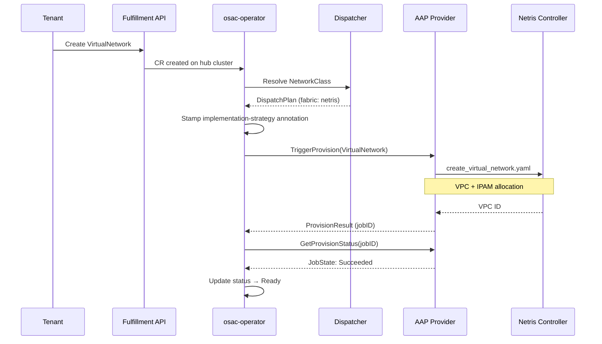

# Fabric Manager — Netris

## Summary

This document describes the technical design for the Netris fabric manager,
OSAC's production networking backend that translates tenant networking
resources into Netris controller configuration. The Netris backend fulfills
the fabric manager contract defined by the
[Unified Networking design](/enhancements/OSAC-1433-unified-networking/design.md):
it manages VPCs, VNets, IPAM allocations, L4 load balancers, NAT rules, and
ACLs through the Netris controller REST API.

See [PRD](prd.md) for the problem statement, user stories, and requirements.

## Motivation

OSAC networking relies on a pluggable fabric manager to translate
infrastructure-agnostic networking resources (VirtualNetwork, Subnet,
SecurityGroup, ExternalIP, ExternalIPAttachment, NATGateway) into physical
network configuration. The Netris fabric manager is the first production
backend and serves as the reference implementation of the fabric manager
contract. Despite being fully implemented and deployed, the Netris backend
has no standalone design document. Its behavior is scattered across Ansible
roles, operator controllers, and feature-level docs, making it difficult to
reason about correctness, validate new backends against a baseline, or
identify enforcement gaps.

This design document serves three purposes:

1. **Codify the fabric manager contract** — the interface and lifecycle
   guarantees that any fabric manager must implement.
2. **Document how Netris fulfills each contract requirement** — the mapping
   from OSAC resources to Netris constructs.
3. **Establish a parity baseline** for future fabric managers (e.g., the
   agentless VLAN backend, OSAC-3664).

### Goals

- Document the fabric manager contract as a reusable specification that
  future backends implement against.
- Map each OSAC networking resource to the specific Netris resources the
  backend creates, updates, and deletes.
- Document the data flow from user action through the operator dispatcher
  to the AAP provisioning provider to the Netris controller API.
- Define failure modes, error surfaces, and recovery behavior.

### Non-Goals

- Changes to the Netris backend implementation — this document describes
  the existing design.
- The K8s manager contract or implementation — that is covered by a
  separate design document.
- SecurityGroup policy semantics (allow/deny evaluation, rule ordering,
  stateful tracking) — that is a cross-backend concern.
- Multi-site Netris deployments or Netris controller HA.

## Proposal

### The Fabric Manager Contract

Any fabric manager must satisfy the following contract. The Netris backend
is the reference implementation; future backends (agentless VLAN, Neutron)
must fulfill the same contract.

#### Registration

A fabric manager registers by deploying a ConfigMap in the operator
namespace with the label `osac.openshift.io/network-fabric-manager: "true"`.

Required data fields:

| Field | Key | Description |
|-------|-----|-------------|
| Name | `data.name` | Unique identifier (e.g., `netris`). Duplicate names within a manager type are rejected at discovery. |
| Description | `data.description` | Human-readable summary. |
| Capabilities | `data.capabilities` | Comma-separated list from the fixed set: `ipv4`, `ipv6`, `dualStack`, `dpuSupport`. Must not be empty. `dualStack` implies both `ipv4` and `ipv6`. |

Example:

```yaml
apiVersion: v1
kind: ConfigMap
metadata:
  name: fabric-manager-netris
  namespace: osac
  labels:
    osac.openshift.io/network-fabric-manager: "true"
data:
  name: netris
  description: "Netris SDN — tenant isolation, ACL, IPAM, DNAT, SNAT"
  capabilities: "ipv4"
```

The `networkmanager.ParseConfigMap()` function validates the ConfigMap
structure and capabilities at discovery time. Invalid ConfigMaps are
rejected with a descriptive error.

#### Provisioning Provider Interface

Fabric managers do not implement a Go interface directly. Instead, the
operator dispatches provisioning work to AAP, which routes to the
backend's Ansible roles based on the `osac.openshift.io/implementation-strategy`
annotation stamped on each resource. The AAP provider implements the
`ProvisioningProvider` interface on behalf of all backends:

```go
type ProvisioningProvider interface {
    TriggerProvision(ctx context.Context, resource client.Object) (*ProvisionResult, error)
    GetProvisionStatus(ctx context.Context, resource client.Object, jobID string) (ProvisionStatus, error)
    TriggerDeprovision(ctx context.Context, resource client.Object, provisionJobs []JobStatus) (*DeprovisionResult, error)
    GetDeprovisionStatus(ctx context.Context, resource client.Object, jobID string) (ProvisionStatus, error)
    Name() string
}
```

Each backend provides an Ansible role (e.g., `osac.templates.netris`) with
task files named by operation: `create_virtual_network.yaml`,
`delete_virtual_network.yaml`, `create_subnet.yaml`, etc. The AAP provider
selects the correct task file based on the resource kind and operation.

#### Dispatch Table

The dispatcher maps resource kinds to manager roles. A fabric manager
must handle all resource kinds assigned to the `Fabric` role:

| Resource Kind | Roles | K8sFallback | Contract |
|---------------|-------|-------------|----------|
| VirtualNetwork | Fabric | Yes | Create isolated L3 routing domain |
| Subnet | Fabric + K8s | Yes | Create L2 segment with gateway and DHCP |
| SecurityGroup | Fabric | Yes | Create ACL/firewall rules |
| ExternalIP | Fabric | Yes | Allocate IP from pool |
| ExternalIPPool | Fabric | Yes | Register IP pool for allocation |
| ExternalIPAttachment | Fabric | Yes | Create inbound DNAT/L4LB rule |
| NATGateway | Fabric | No | Create outbound SNAT rule |

`K8sFallback: true` means that in deployments without a fabric manager
(k8s-only mode), the K8s manager handles this resource kind instead. The
only exception is `NATGateway` — it requires a fabric manager and cannot
fall back to the K8s manager.

#### Per-Resource Contract

For each resource kind, the fabric manager must:

**VirtualNetwork — create an isolated L3 routing domain.**
- Accept: `spec.region`, `spec.ipv4Cidr`, `spec.networkClass` (all immutable after creation).
- Create: A routing domain (VRF/VPC) with the specified CIDR, isolated from other VirtualNetworks.
- Constraint: Different VirtualNetworks must have no direct internal connectivity, even with overlapping CIDRs. Cross-VN traffic is only possible via ExternalIPs.

**Subnet — create an L2 segment within a VirtualNetwork.**
- Accept: `spec.virtualNetwork` (parent VN UUID, immutable), `spec.ipv4Cidr` (immutable).
- Create: An L2 segment within the parent VN's routing domain, with a gateway address (first usable IP in CIDR) and DHCP range (second usable to last usable).
- Constraint: The subnet CIDR must be within the parent VN's CIDR.
- Note: Subnet is the only resource dispatched to both Fabric and K8s roles.

**SecurityGroup — create ACL/firewall rules.**
- Accept: `spec.virtualNetwork` (parent VN UUID, immutable), `spec.ingressRules[]`, `spec.egressRules[]`.
- Create: Permit rules for each ingress/egress entry. Rules are applied per-subnet CIDR (the product of rules × subnets in the VN).
- Mutable: Rules can be updated; changes trigger re-provisioning via config version change.

**ExternalIPPool — register an IP pool for allocation.**
- Accept: `spec.cidrs[]` (immutable, canonical IPv4), `spec.ipFamily` (immutable, `IPv4` only).
- Create: Pool-level reservations in the backend's IPAM so that ExternalIPs can be allocated from them.
- Deletion guard: Cannot be deleted while child ExternalIPs exist.

**ExternalIP — allocate an IP from a pool.**
- Accept: `spec.pool` (immutable, ExternalIPPool name).
- Allocate: A single IP address from the pool. Write the allocated address to the `osac.openshift.io/allocated-address` annotation on the CR.
- Idempotent: Re-reconciliation returns the same previously allocated address.

**ExternalIPAttachment — create an inbound DNAT/L4LB rule.**
- Accept: `spec.externalIP`, target (one of `computeInstance`, `cluster`, `baremetalInstance`), `spec.targetEndpoint` (API or Ingress, required for clusters). Entire spec is immutable after creation.
- Create: A load balancer or DNAT rule routing the ExternalIP's allocated address to the target's internal IP.

**NATGateway — create an outbound SNAT rule.**
- Accept: `spec.virtualNetwork` (parent VN name, immutable), `spec.externalIP` (ExternalIP name, immutable). Entire spec is immutable after creation.
- Create: An SNAT rule so that all egress from the VirtualNetwork's CIDR uses the ExternalIP's allocated address as the source.
- No K8sFallback: This resource requires a fabric manager. K8s-only deployments cannot create NATGateways.

#### Lifecycle Guarantees

All operations must be:

- **Idempotent.** Re-provisioning an already-provisioned resource must not create duplicates.
- **Phase-tracked.** Resources transition through phases: `Progressing → Ready → Failed → Deleting`. The `DesiredConfigVersion` hash detects spec changes and controls retry behavior.
- **Job-tracked.** Each provisioning or deprovisioning operation is recorded in the resource's `status.provisioningJobs[]` array, bounded by `MaxJobHistory`.
- **Condition-reported.** Detailed status is reported via standard Kubernetes conditions.

#### Deletion Guards

- VirtualNetwork deletion waits for all child Subnets, SecurityGroups, and NATGateways (matched by `osac.openshift.io/virtualnetwork-uuid` label) to be deleted first.
- Subnet deletion waits for all child ComputeInstances and BareMetalInstances to be removed.
- ExternalIPPool deletion waits for all child ExternalIPs to be released.
- Teardown respects dependency order: ExternalIPAttachment's DNAT rule is removed before the ExternalIP is released.

### Netris Implementation

The Netris fabric manager fulfills the contract through Ansible roles in
the `osac.templates.netris` collection, invoked by AAP.

#### Workflow Description

The following diagram shows the data flow from a tenant action to the
Netris controller:



Step by step:

1. The tenant creates a networking resource (e.g., VirtualNetwork) via the
   fulfillment API or CLI. The API creates the CR on the hub cluster.
2. The osac-operator controller detects the new CR and calls
   `Dispatcher.Dispatch(kind, networkClassID)`.
3. The dispatcher resolves the NetworkClass, looks up the fabric manager
   ConfigMap by name, and returns a `DispatchPlan` with the Netris manager.
4. The controller stamps `osac.openshift.io/implementation-strategy: netris`
   on the CR.
5. The controller calls `TriggerProvision()` on the AAP provisioning
   provider, which serializes the CR and launches the appropriate Ansible
   role task (e.g., `create_virtual_network.yaml`).
6. The Ansible role authenticates with the Netris controller
   (`netris.controller.auth`) and calls the Netris REST API to create the
   required resources.
7. The controller polls `GetProvisionStatus()` until the AAP job completes.
8. On success, the controller transitions the resource to `Ready`. On
   failure, it transitions to `Failed` with a diagnostic message.

#### Resource Mapping

The following table shows exactly what the Netris backend creates for each
OSAC resource:

| OSAC Resource | Netris Resources | Ansible Role / Task | Details |
|---------------|-----------------|---------------------|---------|
| VirtualNetwork | VPC (ipVRF) + IPAM allocation | `netris.controller.vpc` → `create`, `netris.controller.ipam` → `create_allocation` | VPC provides isolated routing domain. IPAM allocation with `purpose=common` reserves the VN CIDR. Region is mapped to Netris site ID via `netris_region_site_map`. |
| Subnet | IPAM subnet + VNet (macVRF) | `netris.controller.ipam` → `create_subnet`, `netris.controller.vnet` → `create` | IPAM subnet under parent VPC. VNet with gateway (first usable IP), DHCP enabled, range = second usable to last usable. VXLAN VNI auto-assigned by Netris. |
| SecurityGroup | ACL permit rules | `netris.controller.acl` → `create` | Rules are created as the Cartesian product of (ingress/egress rules) × (subnet CIDRs in the VN). Each rule is a `permit` ACL on the parent VPC. Ingress rules use `sourceCidr → subnetCidr`, egress rules use `subnetCidr → destinationCidr`. |
| ExternalIPPool | IPAM allocation + common subnet per CIDR | `netris.controller.ipam` → `create_allocation`, `create_subnet` | One IPAM allocation per pool CIDR. A "common" subnet inside each allocation enables /32 NAT subnets for individual ExternalIPs. |
| ExternalIP | IPAM /32 subnet (purpose=nat) | `netris.controller.ipam` → `create_subnet` | Scans pool allocations in the IPAM tree, collects already-allocated /32 subnets, picks the first available host address, reserves it as a /32 with `purpose=nat`. Writes the allocated address to `osac.openshift.io/allocated-address` annotation. |
| ExternalIPAttachment | DNAT rule (NAT) | `netris.controller.nat` → `create` | `nat_action: dnat`, destination = ExternalIP allocated address, DNAT-to = target internal IP. Rule lives in the tenant VPC (resolved from VirtualNetwork name) or the management VPC for cluster-level attachments. |
| NATGateway | SNAT rule (NAT) | `netris.controller.nat` → `create` | `nat_action: snat`, source = VN CIDR, SNAT-to = ExternalIP allocated address. Rule lives in the tenant VPC. Falls back to management VPC (`netris_mgmt_vpc_id`) when tenant VPC is not resolved. |

#### Deletion Mapping

Each create operation has a corresponding delete task that reverses it:

| OSAC Resource | Delete Task | Netris Resources Removed |
|---------------|-------------|--------------------------|
| VirtualNetwork | `delete_virtual_network.yaml` | IPAM allocation + VPC |
| Subnet | `delete_subnet.yaml` | VNet + IPAM subnet |
| SecurityGroup | `delete_security_group.yaml` | All ACL rules matching the SecurityGroup name pattern |
| ExternalIPPool | `delete_external_ip_pool.yaml` | Common subnets + IPAM allocations |
| ExternalIP | `delete_external_ip.yaml` | /32 IPAM subnet |
| ExternalIPAttachment | `detach_external_ip.yaml` | DNAT rule |
| NATGateway | `delete_nat_gateway.yaml` | SNAT rule |

### API Extensions

No new API extensions. The Netris backend implements the existing
networking API defined by the unified networking design (OSAC-1433). The
backend is selected through provider-level configuration (NetworkClass
`fabricManager` field), not through API changes visible to tenants.

The only annotation the backend writes is `osac.openshift.io/allocated-address`
on ExternalIP CRs, which is part of the ExternalIP allocation contract shared
by all fabric managers.

### Implementation Details/Notes/Constraints

#### Configuration

The Netris backend requires the following configuration, deployed as part
of the OSAC installation:

| Variable | Source | Description |
|----------|--------|-------------|
| `netris_controller_url` | Secret | Netris controller REST API base URL |
| `netris_username` | Secret | Netris controller username |
| `netris_password` | Secret | Netris controller password |
| `netris_site_id` | ConfigMap / Helm values | Default Netris site ID |
| `netris_tenant_id` | ConfigMap / Helm values | Netris tenant ID for OSAC resources |
| `netris_region_site_map` | ConfigMap / Helm values | Mapping of OSAC region names to Netris site IDs |
| `netris_mgmt_vpc_id` | ConfigMap / Helm values | Management VPC ID for cluster-level NAT rules |
| `netris_mgmt_vpc_name` | ConfigMap / Helm values | Management VPC name |

#### Idempotency

Every Ansible task checks for existing resources before creating:

- VPC: checks `vpc_already_existed` from `netris.controller.vpc.create`
- IPAM: checks `ipam_already_existed` from `netris.controller.ipam.create_*`
- VNet: checks `vnet_already_existed` from `netris.controller.vnet.create`
- NAT: checks `nat_already_existed` from `netris.controller.nat.create`
- ACL: checks existing ACL by name before creating

Re-reconciliation of an already-provisioned resource returns the existing
resource's ID without creating a duplicate.

#### ExternalIP Allocation Algorithm

1. Query the full IPAM tree from the Netris controller.
2. Find IPAM allocations matching the pool name pattern (`{pool_name}` or
   `{pool_name}-{N}` for multi-CIDR pools).
3. Collect all existing /32 subnets (already-allocated addresses).
4. Iterate host addresses in each pool allocation CIDR, skip network and
   broadcast addresses, skip already-allocated addresses.
5. Reserve the first available address as a /32 IPAM subnet with
   `purpose=nat`.
6. Write the address to the ExternalIP CR's
   `osac.openshift.io/allocated-address` annotation.

Pool CIDRs must be /30 or wider — /31 (RFC 3021) produces an empty
candidate range and is not supported.

#### SecurityGroup ACL Rule Expansion

ACL rules are created as the Cartesian product of user-defined rules and
subnet CIDRs. For a SecurityGroup with 3 ingress rules on a VirtualNetwork
with 2 subnets, the backend creates 6 ACL rules (3 × 2). Rules are named
with a deterministic pattern: `{sg_name}-{direction}-{rule_idx}-{subnet_idx}`.

This expansion is necessary because Netris ACL rules operate on specific
CIDR prefixes, not on VPC-level abstractions.

### Security Considerations

#### Credential Handling

Netris controller credentials (`netris_controller_url`, `netris_username`,
`netris_password`) are stored in Kubernetes Secrets and injected into AAP
as credential types. They are never logged by Ansible tasks (`no_log` is
used on authentication tasks) and never written to resource status fields
or events.

#### Tenant Isolation

Different VirtualNetworks map to separate Netris VPCs (VRFs). Traffic
isolation between VPCs is enforced by the Netris controller at the fabric
level. A workload in one VPC cannot reach another VPC's private addresses,
even when CIDRs overlap. Cross-VN traffic is only possible via ExternalIPs,
which traverse the external path through DNAT/SNAT rules.

#### Input Validation

- CIDR fields are validated at the CRD level (CEL validation for canonical
  IPv4 format, no IPv6).
- The Netris Ansible roles validate required annotations before proceeding
  (e.g., `osac.openshift.io/externalip-name` on NATGateway).
- Region-to-site-ID mapping is validated — unknown regions fall back to the
  default `netris_site_id`.

### Failure Handling and Recovery

| Failure Mode | Behavior | User Observation | Recovery |
|-------------|----------|-----------------|----------|
| Netris controller unreachable | AAP job fails with connection error | Resource stays in `Progressing` or transitions to `Failed` with error message | Automatic retry on next reconciliation when controller becomes reachable |
| Netris API returns error (e.g., VPC name conflict) | AAP job fails; error details captured in job status | Resource transitions to `Failed`; status condition includes Netris error response | Operator retries with backoff; user may need to resolve the conflict in Netris |
| Parent VPC not found when creating Subnet | Ansible task fails with explicit error message | Subnet transitions to `Failed`: "Parent VPC not found in Netris controller" | Re-reconcile after parent VirtualNetwork is provisioned |
| ExternalIP pool exhausted | Ansible task fails: "No available IPs in ExternalIPPool" | ExternalIP transitions to `Failed` with pool exhaustion message | Cloud Infrastructure Admin provisions additional IPAM capacity in Netris |
| AAP job times out | Job transitions to `Failed` after AAP timeout | Resource shows `Failed` with timeout message | Automatic retry on next reconciliation |
| Partial provisioning (e.g., VPC created but IPAM allocation fails) | AAP job fails; VPC remains in Netris | Resource shows `Failed`; re-reconciliation will find existing VPC and retry IPAM allocation (idempotent) | Automatic convergence on retry |

The provisioning lifecycle uses `DesiredConfigVersion` hashing to avoid
redundant reprovisioning. When a resource's spec changes, the version hash
changes, triggering a new provisioning cycle. When the spec is unchanged,
reconciliation skips provisioning.

### RBAC / Tenancy

No RBAC changes are introduced by the Netris backend. Tenant isolation is
inherited from the unified networking model:

- VirtualNetworks are namespaced resources scoped to tenants via
  `osac.openshift.io/tenant` annotations.
- Tenants can only see and manage their own networking resources.
- Provider-level resources (NetworkClass, ExternalIPPool) are cluster-scoped
  and managed by Cloud Infrastructure Admins.
- The Netris backend enforces fabric-level isolation through VPC separation —
  each VirtualNetwork maps to a dedicated VPC.

### Observability and Monitoring

- **AAP job status**: Each provisioning and deprovisioning operation is
  tracked as a job in `status.provisioningJobs[]`, with state, message,
  start time, end time, and error details.
- **Kubernetes conditions**: Standard conditions report detailed status
  (e.g., `Ready`, `Progressing`, `Degraded`).
- **Ansible task output**: Netris API call results are logged by AAP and
  available in job output for debugging.
- **Existing monitoring**: The Netris controller has its own monitoring
  and alerting for fabric health. OSAC does not duplicate this.

### Risks and Mitigations

#### Netris controller availability

If the Netris controller is unavailable, all provisioning and
deprovisioning operations fail. Resources transition to `Failed` with a
connection error message. Recovery is automatic through reconciliation
when the controller becomes reachable. Mitigation: the Netris controller
should be deployed with appropriate availability guarantees by the Cloud
Infrastructure Admin.

#### Drift between OSAC state and Netris state

Manual changes in the Netris controller (e.g., deleting a VPC that OSAC
manages) cause reconciliation failures. The backend is idempotent and will
re-create missing resources on the next reconciliation cycle, but manual
changes that create conflicting state (e.g., a VPC name collision) require
operator intervention. Mitigation: document that OSAC-managed Netris
resources should not be modified manually.

#### Netris API breaking changes

The backend depends on the Netris controller REST API. Breaking changes
to the API require updating the Ansible roles. Mitigation: pin the
supported Netris controller version range and validate compatibility
before upgrades.

#### SecurityGroup rule explosion

The Cartesian product expansion (rules × subnets) can produce a large
number of ACL rules. For a SecurityGroup with 10 rules on a VirtualNetwork
with 5 subnets, the backend creates 50 ACL rules per direction (100 total).
Mitigation: document the expansion behavior and recommend keeping
SecurityGroup rules focused. Future work may introduce a VPC-level ACL
abstraction in Netris to avoid per-subnet expansion.

### Drawbacks

- **AAP dependency**: The Netris backend requires AAP for provisioning,
  adding operational complexity. A direct Netris API client in the
  operator would reduce this dependency but would require maintaining
  a Go SDK for the Netris controller API.
- **Eventual consistency**: The provisioning model is asynchronous (operator
  → AAP → Netris). Resource status reflects the last known state from AAP
  job polling, not real-time Netris state. A resource may show `Ready`
  while the underlying Netris configuration has been manually modified.

## Alternatives (Not Implemented)

### Direct Netris API integration in the operator

Instead of dispatching through AAP, the operator could call the Netris
controller REST API directly from Go code. This would eliminate AAP as a
dependency and provide synchronous provisioning. Rejected because:
- The AAP-based model is the established pattern for all OSAC provisioning.
- Ansible roles are easier to test and iterate on than compiled Go code.
- AAP provides job tracking, retry logic, and audit logging.

### Per-VPC ACL rules instead of per-subnet expansion

SecurityGroup rules could be applied at the VPC level instead of expanding
per subnet. Rejected because the Netris ACL API operates on specific CIDR
prefixes and does not support VPC-level wildcard rules.

## Test Plan

### Unit Tests

- ConfigMap parsing: valid capabilities, empty capabilities rejected,
  duplicate capabilities deduplicated, `dualStack` implies `ipv4` and
  `ipv6`.
- Dispatch table lookup: all 7 resource kinds return correct roles and
  K8sFallback values.
- Dispatcher: fabric manager resolved, K8sFallback triggers when no
  fabric manager, NATGateway errors without fabric manager.
- DesiredConfigVersion: hash changes when spec changes, stable when spec
  is unchanged.

### Integration Tests

- VirtualNetwork creation triggers AAP job that creates a Netris VPC and
  IPAM allocation; resource reaches `Ready`.
- Subnet creation triggers AAP job that creates IPAM subnet and VNet with
  correct gateway and DHCP range; resource reaches `Ready`.
- ExternalIP allocation picks the first available IP from the pool,
  creates /32 IPAM subnet, writes annotation.
- ExternalIPAttachment creates a DNAT rule with correct source and
  destination.
- NATGateway creates an SNAT rule with VN CIDR as source and ExternalIP
  as SNAT-to address.
- SecurityGroup creates ACL rules as the product of rules × subnets.
- Deletion of each resource removes the corresponding Netris configuration.
- Deletion guards: VirtualNetwork deletion blocked by child Subnets;
  Subnet deletion blocked by attached ComputeInstances; ExternalIPPool
  deletion blocked by allocated ExternalIPs.
- Re-reconciliation of an already-provisioned resource does not create
  duplicates (idempotency).

### E2E Tests

- Tenant creates VirtualNetwork → Subnet → VM attachment → VM receives IP
  via DHCP from Netris IPAM → VM-to-VM connectivity on same subnet.
- Tenant creates ExternalIPPool → ExternalIP → ExternalIPAttachment → VM
  is reachable from external network via L4LB.
- Tenant creates NATGateway → VM egress traffic uses NATGateway's
  ExternalIP as source address (verified by traceroute or source IP
  check on target).
- Tenant creates SecurityGroup with ingress/egress rules → ACL rules are
  created → traffic is filtered according to rules.
- Full lifecycle: create all resources → verify connectivity → delete in
  reverse order → verify all Netris resources removed.
