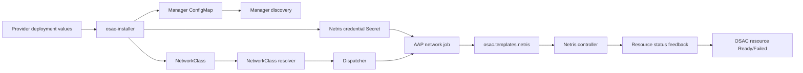

# Netris Fabric Manager Integration

| Field       | Value |
|-------------|-------|
| Author(s)   | Dan Manor |
| Jira        | [OSAC-2434](https://redhat.atlassian.net/browse/OSAC-2434) |
| PRD         | [prd.md](prd.md) |
| Date        | 2026-09-16 |

# 1. Overview

This design makes an existing Netris deployment selectable as the OSAC Fabric
Manager. Provider-owned installer values produce the Netris manager
registration, the deployment `NetworkClass`, shared networking defaults, and
the credential handoff consumed by AAP. The selected Netris manager is then
resolved by the normal dispatcher and receives the same canonical networking
resource and VMaaS, BMaaS, and CaaS workload operations as every other complete
manager. [PRD: FR-1] [PRD: FR-2] [PRD: FR-3]

The design does not add a Netris-specific tenant API. Unified Networking remains
authoritative for resource schemas, field validation, defaults, readiness,
IPv4-only connected single-hub topology, strict dependency creation and
deletion, operation immutability, and client behavior. The [Unified Networking
deployment support boundary](../OSAC-1433-unified-networking/design.md#deployment-support-boundary)
also excludes air-gapped and disconnected deployments. Netris-specific code is
limited to provider configuration, manager registration, dispatcher jobs, and
translation between OSAC resources and Netris primitives. [PRD: FR-4] [PRD: FR-5]

# 2. Goals and Non-Goals

## 2.1 Goals

- Register Netris as one complete IPv4 Fabric Manager with no per-resource,
  policy, workload-scope, or service subset declaration.
- Reuse the existing manager discovery, NetworkClass resolution, AAP dispatch,
  status feedback, and finalizer patterns.
- Define deterministic Netris mappings for every canonical networking resource,
  both policy layers, and all three workload services.
- Keep provider credentials isolated from ConfigMaps, tenant resources, and
  tenant-facing status or error surfaces.
- Make all create/delete jobs idempotent and preserve the target manager set
  across reconciliation and deletion.

## 2.2 Non-Goals

- Installing, upgrading, or operating the Netris controller, SoftGate, switches,
  or Netris control-plane infrastructure.
- Adding or changing the shared tenant-facing networking API.
- Advertising or implementing per-resource or per-service manager capabilities.
- Adding East-West FabricDomain behavior or CUDN-EVPN feature improvements.
- Replacing the shared CaaS, VMaaS, or BMaaS lifecycle with a Netris-only
  alternate public workflow.

# 3. Motivation / Background

The repository already contains Netris controller roles, an `osac.templates.netris`
role, CaaS-oriented `netris.steps` roles, installer values, manager ConfigMap
examples, and BM port-move/DHCP jobs. These assets are not yet described as one
provider-specific manager contract. Some existing inputs still use older
region-oriented behavior or broad capability fields, and the earlier CaaS flow
can appear to bypass the shared Networking API. [Codebase:
`osac-aap/docs/netris-integration.md`] [Codebase:
`osac-aap/collections/ansible_collections/osac/templates/roles/netris/`]

The unified architecture requires one manager selection to cover all canonical
resources and all three workload services. Netris therefore needs a design that
separates provider configuration from tenant networking, defines the exact
backend translation, and makes readiness, failure, idempotency, and target
retention explicit. An unfinished individual operation may execute through an
internal successful no-op AAP job, but that implementation detail must not
become a tenant-visible unsupported-resource or partial-manager path. [User]

# 4. Design

## 4.1 Architecture

The provider supplies Netris configuration during installation. The installer
renders three provider-owned outputs:

1. A Fabric Manager ConfigMap named for the deployment's Netris registration.
2. A `NetworkClass` whose `fabric_manager` is `netris`, whose optional
   `k8s_manager` is selected independently for a combined deployment, and whose
   required defaults satisfy the shared IPv4/CIDR/MetalLB contract.
3. A network-fulfillment configuration and Secret consumed by Netris AAP jobs.

The operator discovers the labeled ConfigMap, validates the `netris` name and
the fixed `addressFamily:ipv4` declaration, and resolves the NetworkClass
manager references. Provider admission verifies the complete manager profile
before the NetworkClass becomes Ready. It does not accept a capability map that
omits a resource, rule type, workload service, or scope. [PRD: FR-3]

After a tenant request is accepted by fulfillment-service, the normal resource
controller persists controller-owned manager-target metadata. The dispatcher
creates one AAP target for Netris when Netris is the only selected manager, or
one Netris target plus one K8s target in a combined deployment. Target order is
deterministic: Fabric first, K8s second. Both targets receive the resource and
operation in a combined deployment, and both must report success before the
resource is Ready. [User]



The diagram shows the provider-only setup path and the tenant-resource
reconciliation path. Configuration flows from installer to registration,
NetworkClass, and Secret; a normal OSAC controller then resolves the selected
target and dispatches an operation-specific AAP job. The Netris role talks to
Netris and returns status through the existing feedback path. No tenant request
directly names Netris or carries Netris credentials.

The previous CaaS `netris.steps.cluster_infra` and
`netris.steps.external_access` roles remain reusable implementation components
where their behavior is needed, but they are invoked only through the current
shared CaaS lifecycle and its resolved networking resources. They must not
create a second CaaS-only networking API, bypass NetworkClass readiness, or
replace the shared dependency and operation rules. [User]

### Deployment profiles

| Deployment | NetworkClass targets | Netris behavior |
|---|---|---|
| Netris Fabric-only | `fabric_manager: netris` | One Netris target for every canonical resource and every VMaaS, BMaaS, and CaaS operation. |
| Netris + K8s | `fabric_manager: netris`, `k8s_manager: <registered-manager>` | Netris and the K8s manager both receive every resource and workload operation; each resource is Ready only after both targets succeed. |
| K8s-only | No Netris Fabric Manager | This design does not configure Netris; the K8s-only manager design owns that profile. |

The deployment must be connected, have exactly one active hub, and use IPv4.
Netris does not add a region field or a multi-hub selection. A Netris site ID
is a backend tenancy input, not an OSAC networking region. [User]

### Complete manager contract

The registration declares identity/type and the deployment-wide address family
only:

```yaml
apiVersion: v1
kind: ConfigMap
metadata:
  name: osac-network-fabric-manager-netris
  namespace: osac
  labels:
    osac.openshift.io/network-fabric-manager: "true"
data:
  name: netris
  description: Netris Fabric Manager
  capabilities: addressFamily:ipv4
```

The `capabilities` value is not a per-resource support matrix. The provider
validator verifies that the selected Netris profile has every required
create/read/delete operation, policy adapter, allocation path, readiness
feedback path, and VMaaS/BMaaS/CaaS integration. No `supports_network_acl`,
`supports_bmaas`, or similar subset keys are valid. An unfinished operation may
run through a successful internal no-op AAP job while the public contract stays
complete. [User]

## 4.2 Data Model / Schema Changes

No tenant database schema or public networking resource schema changes are
required. The provider configuration adds or normalizes installer values and
the manager registration consumed by existing components.

### Provider configuration

The following values are provider-owned. They are validated before the
NetworkClass is Ready and are never copied into tenant resource specs.

| Value | Type and format | Presence and validation |
|---|---|---|
| `networkManagers[].name` | string | Required; exact value `netris`; unique among Fabric Manager registrations. |
| `networkManagers[].role` | enum string | Required; exact value `fabric`. |
| `networkManagers[].description` | string | Optional human-readable text; no credentials. |
| `networkManagers[].capabilities` | canonical string | Required; exact deployment-wide value `addressFamily:ipv4`. No resource/service/scope keys. |
| `networkFulfillment.config.NETRIS_CONTROLLER_URL` | absolute HTTPS URI | Required; URI must have scheme and host, no embedded username/password, fragment, or unsupported scheme. |
| `networkFulfillment.config.NETRIS_USERNAME` | non-empty string | Required; whitespace-only values are rejected. |
| `networkFulfillment.secret.NETRIS_PASSWORD` | Secret string | Required; never rendered into a ConfigMap or log. |
| `networkFulfillment.config.NETRIS_SITE_ID` | decimal string representing a positive integer | Required; leading/trailing whitespace and non-decimal values are rejected. |
| `networkFulfillment.config.NETRIS_TENANT_ID` | decimal string representing a positive integer | Required; it identifies the Netris tenant used for OSAC resources. |
| `networkFulfillment.config.NETRIS_TENANT_NAME` | non-empty string | Required; used only for backend tenant lookup/validation. |
| `networkFulfillment.config.NETRIS_AGENT_SERVER_NAME_LABEL` | Kubernetes label key | Required for CaaS/BM agent correlation; default is `netris.server/name`; invalid label syntax is rejected. |
| `networkFulfillment.config.NETRIS_MGMT_VPC_ID` | non-empty string | Required when the CaaS external-access path uses the management VPC; it is not an OSAC tenant resource reference. |
| `networkFulfillment.config.NETRIS_MGMT_VPC_NAME` | non-empty string | Required together with `NETRIS_MGMT_VPC_ID` when the management VPC is used. |
| `networkFulfillment.config.NETRIS_RESOURCE_CLASS_MAP` | canonical JSON object | Required for BM/CaaS inventory handoff. Each key is a provider resource class; each value contains a positive `server_cluster_template_id`, a `mgmt_interface` string, and a non-empty `vpc_interfaces` string list. Unknown keys and malformed JSON are rejected. |

The installer may keep service-specific provider values in the existing
instance-group configuration, but the Netris manager design has one canonical
credential source: the network-fulfillment Secret. Cluster-fulfillment jobs
that use Netris receive the same provider-owned credential binding rather than
maintaining a second tenant-visible or independently rotated credential copy.

### NetworkClass defaults

The installer writes the shared NetworkClass defaults, not a Netris-specific
schema:

```yaml
spec:
  fabric_manager: netris
  # optional in a combined deployment
  k8s_manager: <provider-registered-k8s-manager>
  defaults:
    virtual_network_cidr: 10.0.0.0/16
    ipv4_subnet_cidr: 10.0.1.0/24
  metallb_vip_prefix_length: 28
status:
  capabilities:
    addressFamily: ipv4
```

The values are examples of shape only. The actual provider values must be
canonical IPv4 CIDRs, the Subnet CIDR must be contained by the VirtualNetwork
CIDR, and `metallb_vip_prefix_length` is required for the CaaS/MetalLB path;
it has no universal default. The tenant default SecurityGroup and NetworkACL
policies remain those defined by Default Networking: an empty tenant default
SecurityGroup means default deny, the tenant default NetworkACL explicitly
denies ingress and allows egress, and the separate deployment ACL baseline is
hard-coded to permit all as the least-specific fallback. No Netris input may
change those shared semantics. [User]

### Backend metadata

Netris object IDs, allocated addresses, operation IDs, and target details are
controller/backend metadata. They may be stored in status or internal job
artifacts according to existing OSAC conventions, but they are not new tenant
spec fields and do not change the shared API. Any status address must be a
canonical IPv4 address and any Netris object reference must be scoped to the
configured site and tenant.

## 4.3 API Changes

No new tenant-facing API endpoints or resource fields are introduced.

### Provider configuration interface

The installer/Enclave configuration surface accepts the values in §4.2 and
maps them to the existing `networkManagers`, `networkClass`, and AAP
network-fulfillment inputs. Provider validation returns `InvalidArgument` for
malformed values and `FailedPrecondition` for a validly shaped configuration
whose Netris endpoint, site, tenant, or required backend profile cannot be
used. Passwords and Secret data are omitted from all response details.

### Tenant API behavior

Once the NetworkClass is Ready, the normal public networking APIs remain the
only tenant interface:

- `Get` and `List` expose the normal resource and status data.
- `Create` accepts only the shared resource contracts and dispatches to Netris.
- `Delete` accepts only a leaf operation with no reverse references and
  dispatches to Netris before removing the resource.
- `Update`, `Patch`, and full replacement of network-owned fields are rejected
  with the shared `Unimplemented`/`InvalidArgument` operation contract; no
  Netris update job is generated.

Every resource create checks type, scope, VirtualNetwork relationship,
readiness, IPv4 format, cardinality, uniqueness, and complete-manager
preconditions before persistence. A caller-created dependent resource is not
stored Pending while it waits for another resource. The only Pending creation
exception is an OSAC-owned automatic ExternalIP and its automatic attachment
created atomically for an allowed workload flow. [PRD: FR-4] [PRD: FR-9]

## 4.4 Scalability and Performance

- Provider validation performs bounded reads of the selected NetworkClass,
  manager ConfigMap, one Secret reference, and the configured Netris endpoint;
  it does not scan tenant resources.
- Each resource operation creates at most one Netris AAP target in a
  Fabric-only deployment and one additional target in a combined deployment.
  The dispatcher persists target metadata so reconciliation and deletion do not
  repeatedly infer the target set from mutable provider configuration.
- Netris lookups use deterministic object names and scoped site/tenant filters.
  Controllers use the existing reconciliation backoff and do not busy-loop on
  an unavailable controller.
- Database impact is limited to existing resource, status, operation, and
  finalizer writes. No new tenant table or unbounded per-manager history table
  is introduced.
- AAP job artifacts retain only the existing operation result and sanitized
  identifiers. Passwords and bearer material are not stored in artifacts.

## 4.5 Security Considerations

- Provider-only installer and private NetworkClass paths are protected by the
  existing provider authorization boundary. Tenant requests cannot select
  `netris`, alter manager annotations, modify the NetworkClass, or read the
  provider Secret.
- The controller Secret contains the Netris password and is mounted only into
  the network-fulfillment execution context. It is not placed in the manager
  ConfigMap, `osac_job_vars.resource`, public status, CLI output, UI output,
  error details, or structured logs.
- Netris endpoint, site, and tenant values are validated before use. The
  endpoint cannot contain embedded credentials. Site and tenant identifiers are
  constrained to the configured provider values; tenant-owned resource names
  are never treated as cross-tenant Netris tenant selectors.
- Every Netris resource lookup includes the configured site and tenant scope.
  A response from another scope is treated as a backend failure, not adopted.
- SecurityGroup and NetworkACL remain separate policy layers. Netris's
  stateless ACL primitive may implement NetworkACL, but it must not be used to
  silently change stateful SecurityGroup semantics. The Netris SecurityGroup
  adapter must aggregate allow rules, deny unmatched traffic, support reverse
  connection state, reject deny/action fields, and keep rules immutable.
- Tenant isolation annotations and owner references remain written and checked
  by OSAC; Netris object names or labels are not ownership proof.

## 4.6 Failure Handling and Recovery

### Provider admission failures

| Failure | Result |
|---|---|
| Missing required value | Provider configuration is rejected with the field path; NetworkClass is not Ready. |
| Malformed URL, identifier, label, JSON map, CIDR, or prefix | `InvalidArgument`; no manager registration is admitted. |
| Netris endpoint unreachable or credentials rejected | NetworkClass remains non-Ready with a non-secret reason; tenant resource admission returns `FailedPrecondition`. |
| Unknown or duplicate manager registration | Provider configuration fails before NetworkClass readiness. |
| Incomplete Netris operation profile | Provider configuration fails as incomplete; no per-resource or per-service subset is created. |
| Connected/single-hub/IPv4 boundary violated | Provider configuration fails; no tenant networking resource is admitted. |

### Resource operation failures

The dispatcher sends a stable operation key containing manager, resource kind,
resource ID, and operation. The Netris role reads the existing object before
creating it, uses deterministic names derived from the OSAC resource ID, and
returns the existing object when it already matches the requested contract.
Create retries therefore do not duplicate VPCs, V-Nets, IPAM allocations,
ACLs, NAT rules, or attachments.

If Netris returns a transient error, the controller retains the admitted OSAC
resource, records a non-Ready condition and sanitized reason, and retries with
bounded backoff. If the operation returns a terminal scope, validation, or
contract error, the resource becomes Failed and no Ready status is published.
The tenant must delete and recreate immutable network configuration after its
dependencies and failed backend objects are resolved; no update job repairs a
network-owned field.

If an AAP job has created a Netris object but fails before feedback, the next
reconciliation performs a deterministic read/adopt check. If the object is
missing, it retries creation. If it exists with incompatible scope or fields,
the resource fails closed and the job reports the conflict for provider
remediation. The role does not adopt an object solely because its name matches.

If deletion fails, the OSAC resource remains in `Deleting` with its finalizer
and reconciliation retries. Reverse references are checked before admission;
deletion never detaches or deletes a tenant-managed child. The only cascade is
the shared OSAC-owned cleanup for an automatically created ExternalIP and
ExternalIPAttachment, in attachment-before-IP order.

An unfinished operation may run a successful internal no-op AAP role. The job
still has the normal target, operation key, result, and status transition; no
resource is rejected as unsupported and no target is silently skipped.

### Netris operation mapping

| OSAC object | Netris primitive/adapter | Create/read/delete behavior | Readiness result |
|---|---|---|---|
| VirtualNetwork | VPC/routing domain plus the scoped IPv4 allocation | Create or adopt the VPC and allocation; read by deterministic name and scope; delete only after Subnets, SecurityGroups, NetworkACLs, and NATGateway are gone. | VPC and allocation are active in the configured site/tenant. |
| Subnet | IPAM subnet and V-Net/L2 segment | Create the contained IPv4 subnet, gateway, DHCP range, and segment; read by parent VPC and name; delete only after workload attachments and ACL associations are gone. | Segment and IPAM subnet are active. |
| SecurityGroup | Netris stateful policy adapter | Translate allow-only rules and attachment membership; read the effective policy; delete only after workload and Catalog/Template references are gone. | The stateful policy is installed and associated with all selected targets. |
| NetworkACL | Netris stateless ACL rules associated with Subnet | Translate explicit allow/deny rules, preserve direction and specificity, and associate one ACL with each selected Subnet; delete the ACL before referenced Subnets/VN. | ACL rules and associations are active on every selected target. |
| ExternalIPPool | Netris IPAM parent allocation containing one IPv4 CIDR | Create/read/delete the single CIDR pool; delete only after all allocated ExternalIPs are gone. | Pool exists with capacity state synchronized. |
| ExternalIP | Netris IPAM `/32` allocation under the pool | Allocate/read one address; release on delete only after attachments and NATGateway consumers are gone. | Address is `Allocated` and owned by this ExternalIP. |
| ExternalIPAttachment | Netris DNAT rule | Create/read/delete the DNAT mapping after ExternalIP and target endpoint readiness; delete before target workload and ExternalIP. | DNAT is active and target address is recorded. |
| NATGateway | Netris SNAT rule for one VirtualNetwork and one ExternalIP | Create/read/delete one gateway per VN after VN Ready and ExternalIP Allocated; delete before VN and ExternalIP. | SNAT is active and source scope matches the VN CIDR. |

The Netris adapter must not map a NetworkACL to a SecurityGroup or map a
SecurityGroup's stateful allow semantics to a stateless deny/permit list. If a
specific Netris API operation is unfinished, its normal job may use the
approved no-op path, but the resource and policy contracts remain as described.

## 4.7 RBAC / Tenancy

No new tenant roles are introduced. Provider configuration, manager ConfigMap,
NetworkClass, and Netris credentials remain provider-owned. Tenant users see
only resources in their authorized tenant/project scope and cannot discover the
Netris site/tenant credentials or another tenant's backend object.

Every translated Netris object carries a deterministic OSAC owner identity in
the adapter's internal naming/metadata and is looked up with the configured
Netris tenant and site. The adapter verifies the OSAC tenant annotation and
resource ID before adopting or deleting an object. A mismatch is a terminal
failure requiring provider remediation; it is never treated as an opportunity
to share the object.

## 4.8 Extensibility / Future-Proofing

The design adds Netris through the existing manager registration and
operation-specific role boundaries. A future manager can reuse the same
complete contract without changing tenant APIs, while each backend maintains
its own resource translation. The design intentionally leaves future address
families, multi-hub deployments, multi-interface workloads, mutable network
fields, East-West FabricDomain behavior, and CUDN-EVPN feature changes outside
the current Netris contract; adding any of them requires updating Unified
Networking and the affected manager design first.

# 5. Interface Changes

## IC-1: Provider Netris configuration

**Requirements:** FR-1, FR-2, FR-4, FR-7, NFR-1, NFR-2

The installer/provider configuration accepts the Netris endpoint, identity,
site/tenant, agent label, management-VPC and resource-class values described in
§4.2. It validates format and requiredness before rendering a usable
NetworkClass. No tenant API field is added.

## IC-2: Complete Netris manager registration

**Requirements:** FR-3, FR-4, FR-7, FR-8

The installer renders a labeled Fabric Manager ConfigMap with `name: netris`,
`role: fabric`, and the single deployment-wide `addressFamily:ipv4`
declaration. Provider admission verifies the complete profile and keeps the
NetworkClass non-Ready when the registration is missing, duplicated, or
incomplete.

## IC-3: Credential Secret handoff

**Requirements:** FR-2, FR-7, FR-8, NFR-1

The installer renders the provider-owned Netris credential Secret for the
network-fulfillment AAP execution context. Secret data is never placed in
ConfigMaps, serialized resource inputs, status, logs, or client output.

## IC-4: Complete-manager dispatcher target

**Requirements:** FR-3, FR-5, FR-6, FR-10, NFR-3

The dispatcher resolves `NetworkClass.fabric_manager: netris`, persists the
Netris target metadata, and generates the standard AAP operation for every
canonical networking resource and all VMaaS/BMaaS/CaaS flows. Combined
deployments dispatch to both selected managers.

## IC-5: Netris networking-resource translation

**Requirements:** FR-5, FR-9, FR-10, NFR-3

The `osac.templates.netris` roles translate VirtualNetwork, Subnet,
SecurityGroup, NetworkACL, ExternalIPPool, ExternalIP, ExternalIPAttachment,
and NATGateway operations using the mapping in §4.6, with deterministic names,
scope checks, status artifacts, and no network-owned update path.

## IC-6: Policy-layer translation

**Requirements:** FR-5, FR-9, FR-10, NFR-3

Netris receives separate stateful SecurityGroup and stateless NetworkACL
operations. SecurityGroup rules remain allow-only and stateful; NetworkACL
rules retain explicit allow/deny, direction, specificity, and the fixed
deployment permit baseline.

## IC-7: Workload attachment and IP discovery

**Requirements:** FR-6, FR-9, FR-10, NFR-3

Netris handles the current one-subnet/one-interface workload contracts. VM and
Cluster attachment operations use the shared resolved subnet/policy values;
BMaaS uses the selected physical interface, provisioning-network handoff, and
DHCP lease query. ExternalIPAttachment waits for the service-specific endpoint
IP before dispatching DNAT.

## IC-8: Status, retry, and deletion behavior

**Requirements:** FR-8, FR-9, FR-10, NFR-2, NFR-4

Netris jobs return sanitized status and error artifacts. Existing controllers
requeue transient failures, retain finalizers on failed deletion, preserve the
persisted target set, and apply only the explicitly allowed OSAC-owned automatic
child cleanup.

# 6. Alternatives Considered

## Direct CaaS-only Netris workflow

The earlier CaaS integration directly composed Netris server-cluster, NAT, DNS,
and MetalLB steps without the OSAC Networking API. It provides useful backend
roles but is rejected as the public architecture because it bypasses common
resource validation, VMaaS/BMaaS parity, NetworkClass readiness, and shared
dependency deletion.

## Per-resource capability advertisement

A manager could advertise separate support for NAT, ACL, BMaaS, or CaaS. This
would make provider configuration appear flexible, but it creates partial API
surfaces that services cannot safely consume. The shared architecture instead
requires a complete manager contract and permits only an internal no-op for an
unfinished operation.

## Install Netris from OSAC

Bundling Netris installation would provide a single deployment workflow, but
Netris is a prerequisite of the management cluster's own networking. It also
would couple OSAC lifecycle and credentials to the Netris control plane. The
selected approach configures a provider-owned existing deployment.

## A standalone Netris adapter service

A long-running proxy could translate OSAC operations to Netris and centralize
credential handling. It would add another availability and status boundary,
duplicate the existing AAP dispatcher path, and require new service lifecycle
work. Existing `osac.templates.netris` roles and AAP feedback are the smaller
compatible boundary.

## Reuse Netris stateless ACLs for both policy resources

Mapping both SecurityGroup and NetworkACL to the same stateless ACL primitive
would reduce implementation work, but it would violate the shared stateful
SecurityGroup contract. The chosen adapter keeps the policy layers distinct.

# 7. Observability and Monitoring

The integration uses existing resource conditions, AAP job status, events, and
controller logs. It adds the following sanitized structured fields to the
operation log context:

- `manager=netris`
- `resource_kind`, `resource_id`, `operation`, `target_scope`
- `operation_id`, `attempt`, `outcome`, and `backend_object_reference`

The integration exposes or reuses these metrics:

- `osac_network_manager_operations_total{manager,resource,operation,outcome}`
- `osac_network_manager_operation_duration_seconds{manager,resource,operation}`
- `osac_network_manager_retries_total{manager,resource,operation,reason}`
- `osac_network_manager_secret_validation_failures_total{manager,reason}`

Metric labels never contain credentials, raw controller URLs, tenant names, or
unbounded resource metadata. A NetworkClass readiness condition identifies
configuration, registration, connectivity, and complete-manager validation
failures without returning Secret content.

# 8. Impact and Compatibility

The tenant-facing Networking API is unchanged and remains backward compatible
with the shared current contract. The provider configuration is additive for
deployments selecting Netris. Existing Netris CaaS roles and BM jobs require
alignment so they consume the shared manager dispatch and no longer rely on
region or per-capability behavior; this is an implementation compatibility
change, not a new tenant API.

No database migration is required. Existing resources keep their persisted
controller-owned target annotations and status. Newly admitted resources use
the complete Netris target metadata so deletion remains deterministic even if
the provider later changes the active NetworkClass.

The Netris controller/API version must support the primitives in §4.6. Version
validation is provider-owned; the supported minimum remains an open design
question until the Netris API compatibility boundary is confirmed.

# 9. Open Questions

## 9.1 Netris credential rotation

- **Owner:** Connectivity and Fabric team
- **Impact:** §4.2 credential schema, §4.5 Secret lifecycle, and §4.6 retry behavior.
- **Question:** Which credential types and rotation trigger are required for the
  initial integration, and can the Secret rotate without changing the selected
  NetworkClass?

## 9.2 Netris controller/API minimum version

- **Owner:** Connectivity and Fabric team
- **Impact:** §4.2 provider admission and §4.6 primitive mappings.
- **Question:** What minimum Netris controller/API version must provider
  validation accept for all mappings in §4.6?

## 9.3 Deterministic Netris test environment

- **Owner:** Connectivity and Fabric team
- **Impact:** §7 observability and the real-controller integration/E2E cases in
  the test plan.
- **Question:** Which Netris controller and IPAM/SNAT/DNAT environment is the
  required automated integration target, and which cases use a contract fake?

---

## Provenance

Authored: draft @ design 0.11.1 - 3f9c3b9, workspace main @ 0ae795e37 (96 behind origin/main)

<!-- ai-workflow-provenance:{"schema_version":1,"provenance_kind":"session","workflow":"design","workflow_version":"0.11.1","ai_workflows":"3f9c3b9","source_repo":"0ae795e37","source_repo_branch":"main","commits_behind_main":96,"commits_ahead_main":0,"main_ref":"main","phases":["draft"],"authoring_modes":["skill"],"context_changed":false,"origin_untracked":false} -->
