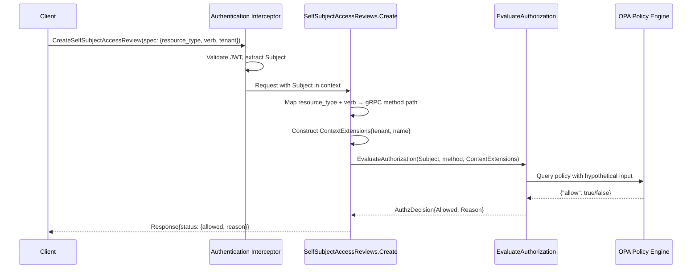

# Self-Subject Access Review API

## Summary

This enhancement adds a SelfSubjectAccessReview-style API to the fulfillment-service that allows authenticated users to check their own permissions on OSAC resources without performing the actual operation. The implementation extracts existing OPA policy evaluation logic into a reusable function and invokes it with hypothetical operation parameters, ensuring permission check results match what the actual operation's authorization would be.

See [PRD](prd.md) for detailed requirements.

## Motivation

Authenticated users currently have no way to check their permissions without attempting operations and encountering authorization failures. This creates friction in UI, CLI, and API workflows: users must attempt actions to discover they lack permission, leading to unexpected errors and poor user experience. Permission-aware interfaces cannot hide unavailable actions, validate workflows before execution, or provide clear permission-based guidance.

The fulfillment-service uses OPA for authorization, with policies evaluated in `GrpcAuthzInterceptor`. Every gRPC method requires authentication and authorization before execution. A self-subject access review API enables users to query "would I be authorized to perform operation X?" without triggering the operation itself, enabling proactive permission checking in client applications.

### Goals

- Reuse existing OPA policy evaluation logic without duplicating authorization rules
- Follow Kubernetes SelfSubjectAccessReview API pattern for consistency with established conventions
- Support checking permissions on all OSAC resource types and standard verbs (create, get, list, update, delete)
- Ensure authorization consistency — permission check results must match what the actual operation's authorization decision would be at the time of the check

### Non-Goals

- Checking another user's permissions (SubjectAccessReview equivalent for administrators)
- Bulk permission checks evaluating multiple operations in a single request
- Caching or memoization of permission check results
- UI integration work (separate feature using this API)

## Proposal

Add a new `SelfSubjectAccessReview` resource to the fulfillment-service public API with a create-only service (no List/Get/Update/Delete operations). The resource follows Kubernetes conventions: spec describes the hypothetical operation to check (resource type, verb, optional tenant/name scoping), status returns the evaluation result (allowed boolean, optional reason string).

Implementation extracts OPA policy evaluation from `GrpcAuthzInterceptor` into a reusable `EvaluateAuthorization` function. The `SelfSubjectAccessReviews.Create` handler:

1. Extracts the authenticated user's identity from request context (via existing authentication interceptor)
2. Maps the user-provided resource type and verb to a gRPC method path (e.g., `"Cluster" + "create"` → `"/osac.public.v1.Clusters/Create"`)
3. Constructs hypothetical `ContextExtensions` from the spec's tenant and resource name fields
4. Calls `EvaluateAuthorization` with the user's identity, mapped method path, and hypothetical context
5. Returns the authorization decision as the response status

This approach ensures the same OPA policies govern both permission checks and actual operations, maintaining authorization consistency. [Research: §Recommended Approach]

### Workflow Description

**Actor:** Authenticated user (tenant admin or tenant user)

**Preconditions:** User has valid authentication credentials (JWT token)

**Basic Flow:**

1. User constructs a `CreateSelfSubjectAccessReviewRequest` specifying:
   - `spec.resource_type`: The OSAC resource type to check (e.g., `"Cluster"`, `"ComputeInstance"`, `"VirtualNetwork"`)
   - `spec.verb`: The operation to check (`"create"`, `"get"`, `"list"`, `"update"`, `"delete"`)
   - `spec.tenant`: (optional) Tenant name to scope the check
   - `spec.resource_name`: (optional) Specific resource name to scope the check
2. User sends the request to `POST /api/fulfillment/v1/self_subject_access_reviews` (REST) or calls `SelfSubjectAccessReviews.Create` (gRPC)
3. fulfillment-service:
   - Authenticates the user via existing authentication interceptor (extracts Subject from JWT)
   - Maps `resource_type` + `verb` to gRPC method path using explicit mapping table
   - Constructs OPA input with user's identity, mapped method path, and `spec.tenant`/`spec.resource_name` as context extensions
   - Evaluates OPA policy via extracted `EvaluateAuthorization` function
   - Returns `SelfSubjectAccessReview` response with `status.allowed` (bool) and optional `status.reason` (string)
4. User receives permission check result

**Error Flows:**

- **Invalid resource type:** Returns `InvalidArgument` error with message `"unknown resource type: {type}"`
- **Invalid verb:** Returns `InvalidArgument` error with message `"unknown verb: {verb}; valid values are create, get, list, update, delete"`
- **Unauthenticated request:** Returns `Unauthenticated` error (existing authentication interceptor behavior)
- **OPA evaluation failure:** Returns `Internal` error with message `"authorization evaluation failed"` (logs detailed error server-side)

**Usage Example (gRPC Client):**

```go
// Check if current user can create a Cluster in tenant "org-a"
req := &v1.CreateSelfSubjectAccessReviewRequest{
    SelfSubjectAccessReview: &v1.SelfSubjectAccessReview{
        Spec: &v1.SelfSubjectAccessReviewSpec{
            ResourceType: "Cluster",
            Verb: "create",
            Tenant: "org-a",
        },
    },
}

resp, err := client.SelfSubjectAccessReviews().Create(ctx, req)
if err != nil {
    // Handle error
}

if resp.SelfSubjectAccessReview.Status.Allowed {
    // User is authorized — proceed with create workflow
} else {
    // User is not authorized — display reason or hide UI element
    fmt.Printf("Permission denied: %s\n", resp.SelfSubjectAccessReview.Status.Reason)
}
```



The sequence diagram shows the permission check request path: authentication extracts the user's identity, the review server maps user-provided resource type and verb to a gRPC method path, constructs hypothetical context extensions, and invokes the extracted authorization function. The same OPA policy that governs actual operations evaluates the hypothetical request and returns an authorization decision.

### API Extensions

This enhancement adds a new gRPC service `SelfSubjectAccessReviews` with a single `Create` method to the fulfillment-service public API (`osac.public.v1`). The service follows existing patterns for create-only resources (e.g., console sessions).

**New proto files:**
- `proto/public/osac/public/v1/self_subject_access_review_type.proto` — message definitions
- `proto/public/osac/public/v1/self_subject_access_reviews_service.proto` — service definition

**New server implementation:**
- `internal/servers/self_subject_access_reviews_server.go` — public server handler
- `internal/auth/authorization.go` — extracted `EvaluateAuthorization` function (refactored from `GrpcAuthzInterceptor`)

**Modified files:**
- `internal/auth/grpc_authz_interceptor.go` — refactored to use extracted `EvaluateAuthorization` function
- `internal/auth/policies/authz.rego` — add always-allow rule for `/osac.public.v1.SelfSubjectAccessReviews/Create` method

This API does not modify existing resources. The new service is additive and does not change behavior of any existing gRPC methods.

## Implementation Details/Notes/Constraints

### Proto Message Definitions

Following Kubernetes `SelfSubjectAccessReview` structure and OSAC conventions: [Research: §Kubernetes SelfSubjectAccessReview]

```protobuf
// self_subject_access_review_type.proto
syntax = "proto3";

package osac.public.v1;

import "buf/validate/validate.proto";
import "metadata_type.proto";

// SelfSubjectAccessReview checks whether the current user can perform an action.
message SelfSubjectAccessReview {
  // Spec describes information about the request being evaluated.
  SelfSubjectAccessReviewSpec spec = 1 [(buf.validate.field).required = true];

  // Status is filled in by the server and indicates whether the request is allowed or not.
  SelfSubjectAccessReviewStatus status = 2;
}

// SelfSubjectAccessReviewSpec describes the hypothetical operation to check.
message SelfSubjectAccessReviewSpec {
  // Resource type to check permission for (e.g., "Cluster", "ComputeInstance").
  // Must be a valid OSAC resource type.
  string resource_type = 1 [(buf.validate.field).string = {
    min_len: 1,
    max_len: 63
  }];

  // Verb is the operation to check (create, get, list, update, delete).
  string verb = 2 [(buf.validate.field).string = {
    in: ["create", "get", "list", "update", "delete"]
  }];

  // Optional tenant name to scope the permission check.
  // If empty, checks permissions across all tenants the user has access to.
  string tenant = 3 [(buf.validate.field).string = {
    max_len: 63
  }];

  // Optional resource name to scope the permission check to a specific resource.
  // Only meaningful for get, update, and delete verbs.
  string resource_name = 4 [(buf.validate.field).string = {
    max_len: 63
  }];
}

// SelfSubjectAccessReviewStatus describes the result of the permission check.
message SelfSubjectAccessReviewStatus {
  // Allowed is true if the user would be authorized to perform the requested operation.
  bool allowed = 1;

  // Reason describes why the request was denied (optional, only present when allowed is false).
  string reason = 2;
}
```

```protobuf
// self_subject_access_reviews_service.proto
syntax = "proto3";

package osac.public.v1;

import "google/api/annotations.proto";
import "self_subject_access_review_type.proto";

// SelfSubjectAccessReviews service allows users to check their own permissions.
service SelfSubjectAccessReviews {
  // Create evaluates the permission check and returns the result immediately.
  // This is a create-only service with no List, Get, Update, or Delete methods.
  rpc Create(CreateSelfSubjectAccessReviewRequest) returns (CreateSelfSubjectAccessReviewResponse) {
    option (google.api.http) = {
      post: "/api/fulfillment/v1/self_subject_access_reviews"
      body: "self_subject_access_review"
    };
  }
}

message CreateSelfSubjectAccessReviewRequest {
  SelfSubjectAccessReview self_subject_access_review = 1;
}

message CreateSelfSubjectAccessReviewResponse {
  SelfSubjectAccessReview self_subject_access_review = 1;
}
```

**Spec/Status ownership:** `spec` is user-controlled input describing the hypothetical operation to check; `status` is system-controlled output containing the evaluation result. [Codebase: API.md conventions]

**Validation:** `buf.validate` annotations enforce:
- `resource_type` and `verb` are required non-empty strings
- `verb` must be one of the five standard verbs
- `tenant` and `resource_name` are optional with max length constraints
- Invalid input returns `InvalidArgument` gRPC error before reaching server logic

### Resource Type Mapping

User-provided resource type names (CamelCase singular, e.g., `"Cluster"`) must map to gRPC method paths (`"/osac.public.v1.Clusters/Create"`). Pluralization is not algorithmic — Kubernetes requires explicit mapping. [Research: §Pattern 2: Resource Type to API Path Mapping]

**Implementation:** Code-generated mapping from proto service definitions. A build-time script parses `proto/public/osac/public/v1/*_service.proto` files to extract service names and generates `internal/servers/generated_resource_type_mapping.go`:

```go
// Code generated by tools/generate-resource-type-mapping.sh. DO NOT EDIT.

package servers

var resourceTypeToService = map[string]string{
    "Cluster": "Clusters",
    "ComputeInstance": "ComputeInstances",
    "DiskImage": "DiskImages",
    "ExternalIP": "ExternalIPs",
    "ExternalIPAttachment": "ExternalIPAttachments",
    "ExternalIPPool": "ExternalIPPools",
    "NATGateway": "NATGateways",
    "SecurityGroup": "SecurityGroups",
    "Subnet": "Subnets",
    "Tenant": "Tenants",
    "VirtualNetwork": "VirtualNetworks",
}

var verbToMethod = map[string]string{
    "create": "Create",
    "get": "Get",
    "list": "List",
    "update": "Update",
    "delete": "Delete",
}
```

The generator script runs as part of `buf generate` (via buf plugin or standalone script in `Makefile`). Consumed by `mapToGRPCMethod` in `internal/servers/self_subject_access_reviews_server.go`:

```go
func mapToGRPCMethod(resourceType, verb string) (string, error) {
    service, ok := resourceTypeToService[resourceType]
    if !ok {
        return "", fmt.Errorf("unknown resource type: %s", resourceType)
    }

    method, ok := verbToMethod[verb]
    if !ok {
        return "", fmt.Errorf("unknown verb: %s", verb)
    }

    return fmt.Sprintf("/osac.public.v1.%s/%s", service, method), nil
}
```

**Rationale:** Code generation eliminates manual maintenance when new resource types are added — the mapping automatically stays in sync with proto service definitions. Avoids drift risk where a new `*_service.proto` is added but `resourceTypeToService` is not updated. Build-time generation adds tooling complexity (buf plugin or script integration) but prevents an entire class of errors. [Research: §Integration Constraints]

**Alternative considered:** Hand-maintained static mapping table. Simpler implementation but requires discipline when adding new resources (unit tests catch drift but only after the fact). Rejected in favor of automated generation to reduce maintenance burden.

### OPA Policy Evaluation Extraction

Extract existing policy evaluation logic from `GrpcAuthzInterceptor` into a reusable function that both the interceptor and `SelfSubjectAccessReviews.Create` can call. [Research: §Recommended Approach]

**New function in `internal/auth/authorization.go`:**

```go
// AuthzDecision contains the result of an authorization evaluation.
type AuthzDecision struct {
    Allowed bool
    Reason  string
}

// EvaluateAuthorization evaluates OPA policy for a given subject, method, and context.
// This function is called by both GrpcAuthzInterceptor (for actual operations) and
// SelfSubjectAccessReviews.Create (for hypothetical permission checks).
func EvaluateAuthorization(
    ctx context.Context,
    subject *Subject,
    method string,
    contextExtensions *ContextExtensions,
) (*AuthzDecision, error) {
    input := constructOPAInput(subject, method, contextExtensions)

    result, err := opaQuery(ctx, "data.osac.authz.allow", input)
    if err != nil {
        return nil, fmt.Errorf("OPA evaluation failed: %w", err)
    }

    decision := &AuthzDecision{
        Allowed: result.Allow,
    }

    // If denied, extract reason from OPA result if available
    if !result.Allow && result.Reason != "" {
        decision.Reason = result.Reason
    }

    return decision, nil
}

// constructOPAInput builds the input structure for OPA policy evaluation.
// This is the existing logic from GrpcAuthzInterceptor, extracted for reuse.
func constructOPAInput(subject *Subject, method string, ext *ContextExtensions) map[string]interface{} {
    return map[string]interface{}{
        "auth": map[string]interface{}{
            "identity": map[string]interface{}{
                "username":   subject.Username,
                "user":       map[string]interface{}{"username": subject.Username, "groups": subject.Groups},
                "tenants":    subject.Tenants,
                "organization": subject.Organization,
                "realm_access": map[string]interface{}{"roles": subject.RealmRoles},
                "authnMethod": "jwt",
            },
        },
        "context": map[string]interface{}{
            "request": map[string]interface{}{
                "http": map[string]interface{}{
                    "path": method,
                },
            },
            "context_extensions": map[string]interface{}{
                "id":      ext.ID,
                "tenant":  ext.Tenant,
                "name":    ext.Name,
                "project": ext.Project,
            },
        },
    }
}
```

**Refactor `GrpcAuthzInterceptor`:** Replace inline OPA evaluation logic with call to `EvaluateAuthorization`. This ensures the interceptor and permission checks use identical evaluation logic.

### Server Implementation

**`internal/servers/self_subject_access_reviews_server.go`:**

```go
type SelfSubjectAccessReviewsServer struct {
    v1.UnimplementedSelfSubjectAccessReviewsServer
    logger *slog.Logger
}

func (s *SelfSubjectAccessReviewsServer) Create(
    ctx context.Context,
    req *v1.CreateSelfSubjectAccessReviewRequest,
) (*v1.CreateSelfSubjectAccessReviewResponse, error) {
    // Extract authenticated user from context (set by authentication interceptor)
    subject, err := auth.SubjectFromContext(ctx)
    if err != nil {
        return nil, status.Errorf(codes.Unauthenticated, "authentication required")
    }

    spec := req.SelfSubjectAccessReview.Spec

    // Map resource type + verb to gRPC method path
    method, err := mapToGRPCMethod(spec.ResourceType, spec.Verb)
    if err != nil {
        return nil, status.Errorf(codes.InvalidArgument, err.Error())
    }

    // Construct hypothetical context extensions from spec
    contextExt := &auth.ContextExtensions{
        Tenant:  spec.Tenant,
        Name:    spec.ResourceName,
        // ID and Project are not provided in spec; leave empty for hypothetical check
    }

    // Evaluate authorization using the same logic as actual operations
    decision, err := auth.EvaluateAuthorization(ctx, subject, method, contextExt)
    if err != nil {
        s.logger.Error("authorization evaluation failed",
            "user", subject.Username,
            "method", method,
            "tenant", spec.Tenant,
            "error", err)
        return nil, status.Errorf(codes.Internal, "authorization evaluation failed")
    }

    // Return result
    return &v1.CreateSelfSubjectAccessReviewResponse{
        SelfSubjectAccessReview: &v1.SelfSubjectAccessReview{
            Spec: spec,
            Status: &v1.SelfSubjectAccessReviewStatus{
                Allowed: decision.Allowed,
                Reason:  decision.Reason,
            },
        },
    }, nil
}
```

**Builder pattern:** Follow existing server conventions with `SelfSubjectAccessReviewsServerBuilder` configuring dependencies (logger). No DAO needed — this is a create-only, non-persisted API. [Codebase: Example service patterns]

### Authorization Bypass

The `SelfSubjectAccessReviews.Create` method must bypass normal authorization — it IS the authorization check. Any authenticated user can call this endpoint to check their own permissions. [Research: §Integration Constraints #4]

**Implementation:** Add always-allow rule in `internal/auth/policies/authz.rego`:

```rego
# SelfSubjectAccessReview is always allowed for any authenticated user
allow {
    input.context.request.http.path == "/osac.public.v1.SelfSubjectAccessReviews/Create"
}
```

This rule is evaluated before role-based authorization rules, allowing any authenticated user to call the endpoint. The permission being checked is determined by the `spec` fields, not by the caller's identity.

**Alternative considered:** Skip authorization interceptor entirely for this method via early-return logic in `GrpcAuthzInterceptor`. Rejected because policy-based allow is more declarative and auditable. [Research: §Open Questions #2]

### Testing Strategy

**Unit Tests:**
- `mapToGRPCMethod` returns correct paths for all resource types and verbs
- `mapToGRPCMethod` returns error for unknown resource types and verbs
- `EvaluateAuthorization` constructs correct OPA input structure
- Mock OPA evaluation returns expected `AuthzDecision` values

**Integration Tests (against Kind cluster with Keycloak):**
- **Authorization consistency:** For each role (Admin, Tenant Admin, Client) and each resource type:
  - `SelfSubjectAccessReview(resourceType, "create")` returns `allowed=true` ⟺ actual `Create()` succeeds
  - `SelfSubjectAccessReview(resourceType, "delete", name)` returns `allowed=false` ⟺ actual `Delete(name)` returns `PermissionDenied`
- **Tenant scoping:** Tenant Admin for `org-a` checks permission on `org-b` resource → `allowed=false`
- **Resource-scoped checks:** User checks `update` permission on specific VirtualNetwork by name → result matches whether actual update would succeed
- **Advisory nature:** Permission check returns `allowed=true`, then user's role is revoked, then actual operation fails → demonstrates checks are advisory, not authoritative
- **Unauthenticated requests:** Calling endpoint without valid JWT returns `Unauthenticated` error
- **Invalid inputs:** Unknown resource type, invalid verb, malformed tenant name → appropriate validation errors

**E2E Tests (osac-test-infra):**
- UI workflow: User navigates to Clusters page → UI calls `SelfSubjectAccessReview("Cluster", "create")` → if `allowed=false`, "Create Cluster" button is disabled
- CLI workflow: `osac auth can-i create clusters` → calls permission check API → prints "yes" or "no" based on result

## Security Considerations

**Authentication:** The API inherits existing JWT authentication via `GrpcAuthInterceptor`. User identity is extracted from the authenticated request's context — the spec fields describe the hypothetical operation, not the caller's identity. No changes to authentication flow.

**Authorization:** The `SelfSubjectAccessReviews.Create` endpoint is always allowed for authenticated users (Rego policy rule). This is safe because:
- The endpoint only checks permissions, it does not grant them or perform any privileged operation
- Users can only check their own permissions (self-subject), not other users
- The authorization decision returned is advisory — actual operations re-evaluate authorization independently

**Input validation:** `buf.validate` annotations enforce resource type, verb, tenant, and resource name constraints at the protobuf layer. Unknown resource types return `InvalidArgument` errors before reaching authorization logic.

**Information disclosure:** The response `reason` field may reveal information about why permission was denied (e.g., "user is not a member of tenant X"). This is acceptable because:
- The reason is based on the caller's own identity, not other users' permissions
- Authorization denials already expose similar information (actual operations return denial reasons)
- The PRD does not restrict reason disclosure

**Data exposure:** No new data is exposed. The API returns only whether the caller would be authorized for a hypothetical operation, using information the caller already knows (their own identity and tenants) and information they provide in the request (resource type, verb, tenant, name).

**Multi-tenant isolation:** Tenant isolation is enforced by OPA policies during the hypothetical authorization evaluation, the same way it's enforced for actual operations. If the user is not a member of the specified tenant, the permission check will return `allowed=false`.

### Failure Handling and Recovery

**OPA evaluation failure:**
- **What happens:** `EvaluateAuthorization` returns an error (OPA service unreachable, policy compilation error, timeout)
- **Recovery:** No automatic retry — OPA failures are fatal for this request
- **User observes:** `Internal` gRPC error with message `"authorization evaluation failed"`
- **Server logs:** Structured error log with user, method, tenant, and error details

**Invalid resource type or verb:**
- **What happens:** `mapToGRPCMethod` returns an error
- **Recovery:** N/A — user error, not a recoverable failure
- **User observes:** `InvalidArgument` gRPC error with message `"unknown resource type: X"` or `"unknown verb: Y"`
- **Server logs:** No error log — this is expected for malformed input

**Unauthenticated request:**
- **What happens:** `SubjectFromContext` returns an error
- **Recovery:** N/A — user must authenticate
- **User observes:** `Unauthenticated` gRPC error
- **Server logs:** Authentication interceptor logs the failure

**Idempotency:** Every request is idempotent — calling `Create` multiple times with the same spec returns the same result (assuming authorization state has not changed). No side effects, no state modification.

**Retry behavior:** Clients may retry on transient failures (OPA timeout, network errors). Since requests are idempotent and stateless, retries are safe.

### RBAC / Tenancy

**No new roles or permissions.** Any authenticated user can call `SelfSubjectAccessReviews.Create` to check their own permissions.

**Tenant isolation:** The permission check evaluates OPA policies that enforce tenant isolation. If a user is not a member of the specified `spec.tenant`, the check will return `allowed=false`, the same way an actual operation would be denied.

**No tenant isolation metadata on SelfSubjectAccessReview objects.** This resource is not tenant-scoped — it is not persisted and does not have `metadata.annotations`. The `spec.tenant` field describes the hypothetical operation's target tenant, not ownership of the review object itself.

**Visibility:** All users can call the endpoint, but each user can only check permissions for their own identity. There is no way to check another user's permissions (out of scope per PRD).

### Observability and Monitoring

**New structured log events:**
- `self_subject_access_review.create` — logged at INFO level on every request with fields: `user`, `resource_type`, `verb`, `tenant`, `resource_name`, `allowed`, `reason`
- `self_subject_access_review.evaluation_failed` — logged at ERROR level when OPA evaluation fails, with fields: `user`, `method`, `tenant`, `error`

**No new metrics.** Existing gRPC metrics (`grpc_server_handled_total`, `grpc_server_handling_seconds`) cover this endpoint automatically.

**No new alerts.** If OPA evaluation consistently fails, existing OPA health monitoring will trigger alerts.

### Risks and Mitigations

**Risk: Users treat permission check results as authoritative**
- **Manifestation:** User caches permission check result, assumes it's guaranteed, and attempts operation later when authorization state has changed (role revoked, policy updated) → operation fails
- **Mitigation:** API documentation prominently states that results are advisory and that actual operations must re-evaluate authorization. Response field naming (`allowed`, not `will_succeed`) reinforces advisory nature. [Research: §Integration Constraints #3]
- **Residual risk:** Medium — user misunderstanding is possible despite documentation. This is inherent to the advisory model (same issue exists in Kubernetes SelfSubjectAccessReview). [Research: §Assumptions A4]

**Risk: Drift between permission checks and actual authorization**
- **Manifestation:** Bug introduced in extracted `EvaluateAuthorization` function causes permission checks to return different results than actual operations
- **Mitigation:** Integration tests verify authorization consistency (permission check result matches actual operation outcome). Extracting as a function (not duplicating policy logic) minimizes drift risk. [Research: §Recommended Approach]
- **Residual risk:** Low — refactoring is mechanical, existing tests catch behavioral changes

**Risk: Generated resource type mapping becomes out of sync**
- **Manifestation:** New resource type added to proto definitions, but developer forgets to run code generation before committing → permission checks for new resource fail with `unknown resource type` error
- **Mitigation:** CI verification checks that `tools/generate-resource-type-mapping.sh` output matches committed `generated_resource_type_mapping.go` (fails build if drift detected). Code generation runs as part of `make generate` / `buf generate` workflow. Unit tests for all resource types will fail if new types are missing from generated mapping.
- **Residual risk:** Very low — CI drift check + unit tests catch missing mappings before merge

### Drawbacks

**Build complexity for resource type mapping:** Code generation from proto service definitions adds build-time tooling (generator script integrated with `buf generate` or `Makefile`). This increases build complexity compared to a hand-maintained static map. The trade-off favors automated generation to eliminate maintenance burden and drift risk when new resource types are added.

**Advisory results may confuse users:** Permission checks are snapshots — authorization state can change between the check and the actual operation. Users accustomed to authoritative permission systems may misunderstand this. The API documentation must emphasize the advisory nature, but user confusion remains a risk despite documentation.

**No bulk permission checks:** Users checking permissions for multiple operations must make separate API calls. This increases network overhead and latency for permission-aware UIs. The PRD explicitly excludes bulk checks from scope, deferring to a future enhancement if needed.

## Alternatives (Not Implemented)

### Alternative 1: New Rego Rule for Hypothetical Checks

**Description:** Add a new Rego rule `allow_hypothetical(method, tenant, name)` that accepts method and context as input parameters, rather than extracting policy evaluation into a Go function.

**Pros:**
- All authorization logic stays in Rego (no Go-side policy evaluation code)
- Policy changes don't require recompiling Go code

**Cons:**
- Duplicates authorization logic — two rules (`allow` and `allow_hypothetical`) to keep in sync
- No programmatic way to verify the two rules return the same results
- Makes testing harder — must mock Rego evaluation instead of unit testing Go function
- Risk of subtle differences between real and hypothetical authorization

**Rejection reason:** Violates "reuse existing authorization logic" goal. Extracting as a Go function ensures permission checks and actual operations use identical policy evaluation. [Research: §Why not a new Rego rule accepting method as input?]

### Alternative 2: Separate gRPC Method per Resource Type

**Description:** Define separate permission check methods per resource type (e.g., `CheckClusterPermission`, `CheckComputeInstancePermission`) rather than a generic `SelfSubjectAccessReview` with `resource_type` field.

**Pros:**
- No resource type mapping table needed
- Type-safe proto definitions (dedicated request/response per resource type)

**Cons:**
- Violates Kubernetes SelfSubjectAccessReview pattern
- Adds 10+ new gRPC methods instead of one
- Each new resource type requires new proto definition, server method, and handler
- Clients must know which method to call for each resource type

**Rejection reason:** Does not scale. Adding a new resource type should not require proto changes in the permission check API. Generic resource type field follows established Kubernetes pattern and reduces API surface. [Research: §Kubernetes SelfSubjectAccessReview]

### Alternative 3: Algorithmically Derive Pluralization

**Description:** Use algorithmic pluralization rules (append "s", handle "-y" → "-ies", etc.) instead of explicit mapping table for resource type → service name.

**Pros:**
- No mapping table to maintain
- New resource types work automatically

**Cons:**
- Pluralization is not algorithmic — `"SecurityGroup"` → `"SecurityGroups"`, not `"SecurityGroupes"`; exceptions abound
- Kubernetes explicitly requires hand-specified `plural` in CRDs for this reason
- Silent failures when algorithmic rule is wrong (incorrect method path → OPA denies everything)

**Rejection reason:** Kubernetes CRD pattern demonstrates that pluralization cannot be reliably automated. Explicit mapping prevents silent failures. [Research: §Pattern 2: Resource Type to API Path Mapping]

## Open Questions

### 1. Should invalid resource types return validation errors or `allowed=false`?

**Owner:** To be determined

**Impact:** §Workflow Description (Error Flows), §Implementation Details (Server Implementation)

When a user provides an unknown `resource_type` (e.g., typo: `"Cluste"`), the server could:
- **A: Return `InvalidArgument` gRPC error** — clear for developers, fails fast, treats as malformed input
- **B: Return `allowed=false` with `reason="unknown resource type"`** — treats unknown resources as inaccessible, may confuse users

Kubernetes SelfSubjectAccessReview allows any resource type string (extensible for CRDs) and relies on the authorization backend to reject unknown types. OSAC has a fixed set of known resource types (code-generated from proto service definitions). Which approach better serves OSAC users?

Current design uses **Option A** (validation error) for clarity and fast feedback. Should this be reconsidered?

## Test Plan

### Unit Tests

**Code generation:**
- Generated `resourceTypeToService` map includes all services from `proto/public/osac/public/v1/*_service.proto` files
- Generated file has correct package declaration and "DO NOT EDIT" header
- CI verification: `tools/generate-resource-type-mapping.sh` output matches committed `generated_resource_type_mapping.go` (no drift)

**`mapToGRPCMethod` function:**
- All resource types in generated mapping table return correct gRPC paths
- All verbs return correct method names
- Unknown resource type returns error with message `"unknown resource type: X"`
- Unknown verb returns error with message `"unknown verb: X; valid values are create, get, list, update, delete"`

**`EvaluateAuthorization` function:**
- Constructs OPA input with correct structure (auth.identity, context.request.http.path, context.context_extensions)
- Returns `Allowed=true` when mocked OPA result is `{"allow": true}`
- Returns `Allowed=false, Reason="..."` when mocked OPA result is `{"allow": false, "reason": "..."}`
- Returns error when OPA query fails

**Server validation:**
- Request with empty `resource_type` fails validation before reaching handler
- Request with invalid `verb` (e.g., `"patch"`) fails validation
- Request with `tenant` exceeding max length fails validation

### Integration Tests

**Authorization consistency (critical):**
- Admin user: `SelfSubjectAccessReview("Cluster", "create")` returns `allowed=true`; actual `Clusters.Create()` succeeds
- Tenant Admin for `org-a`: `SelfSubjectAccessReview("VirtualNetwork", "create", tenant="org-a")` returns `allowed=true`; actual create succeeds
- Tenant Admin for `org-a`: `SelfSubjectAccessReview("VirtualNetwork", "create", tenant="org-b")` returns `allowed=false`; actual create returns `PermissionDenied`
- Client user: `SelfSubjectAccessReview("Tenant", "update")` returns `allowed=false`; actual update returns `PermissionDenied`
- Repeat for all resource types and verbs across Admin, Tenant Admin, Client roles

**Resource-scoped checks:**
- User creates `VirtualNetwork` named `prod-net` in `org-a`
- User checks `SelfSubjectAccessReview("VirtualNetwork", "update", tenant="org-a", resource_name="prod-net")` → `allowed=true`
- User checks `SelfSubjectAccessReview("VirtualNetwork", "update", tenant="org-a", resource_name="other-net")` → `allowed=false` (does not own)
- User checks `SelfSubjectAccessReview("VirtualNetwork", "delete", tenant="org-a", resource_name="prod-net")` → result matches whether actual delete would succeed

**Advisory nature:**
- User checks `SelfSubjectAccessReview("Cluster", "create")` → `allowed=true`
- Admin revokes user's cluster creation permission via Keycloak
- User attempts actual `Clusters.Create()` → `PermissionDenied` (demonstrates check was advisory, not authoritative)

**Unauthenticated requests:**
- Request without JWT token → `Unauthenticated` error
- Request with expired JWT → `Unauthenticated` error

**Invalid inputs:**
- `resource_type="NonExistentType"` → `InvalidArgument` error
- `verb="patch"` → `InvalidArgument` error (validation rejects before reaching server)
- `tenant="invalid$tenant"` → `InvalidArgument` error (RFC 1123 validation)

### E2E Tests

**UI permission-aware interface:**
- Tenant Admin logs into osac-ui
- UI loads Clusters page
- UI calls `SelfSubjectAccessReview("Cluster", "create")` → `allowed=true`
- UI enables "Create Cluster" button
- UI calls `SelfSubjectAccessReview("Cluster", "delete")` for each cluster in list
- UI shows "Delete" button only for clusters where check returns `allowed=true`

**CLI permission checking:**
- Tenant user runs `osac auth can-i create compute-instances --tenant org-a`
- CLI calls `SelfSubjectAccessReview("ComputeInstance", "create", tenant="org-a")`
- CLI prints "yes" if `allowed=true`, "no (reason)" if `allowed=false`

## Upgrade / Downgrade Strategy

**Upgrade:** This is a new API with no pre-existing state. Upgrading from a version without SelfSubjectAccessReview to a version with it is purely additive. No schema migrations, no data backfill, no configuration changes required. Existing clients continue to work without modification.

**Downgrade:** Downgrading to a version without SelfSubjectAccessReview removes the API. Clients that started using the API will receive `Unimplemented` errors when calling `SelfSubjectAccessReviews.Create`. No data loss — the API is stateless and non-persistent.

**Version skew:** The fulfillment-service API is independently versioned. osac-operator and other components do not call this API, so there is no cross-component version skew concern. UI and CLI clients can gracefully handle the absence of the API (e.g., hide permission-aware features if the endpoint returns `Unimplemented`).

## Version Skew Strategy

No version skew concerns. The fulfillment-service is the only component that implements this API. UI and CLI clients consume it but do not depend on it for core functionality — permission checks are a UX enhancement, not a functional requirement.

## Support Procedures

**Symptom: Permission check returns `allowed=true` but actual operation fails with `PermissionDenied`**
- **Diagnosis:** Check timestamps of permission check and actual operation. If significant time elapsed, authorization state likely changed (role revoked, policy updated).
- **Resolution:** This is expected behavior (advisory results). Educate user that permission checks are snapshots, not guarantees.

**Symptom: Permission check consistently returns `allowed=false` when user expects `allowed=true`**
- **Diagnosis:** Check OPA policy evaluation logs for the hypothetical method path. Verify the user's tenants, roles, and groups. Compare OPA input for permission check vs. actual operation (should be identical except for timestamp).
- **Resolution:** If OPA input differs, investigate extraction logic in `EvaluateAuthorization`. If OPA input matches but decision differs, OPA policy has a bug.

**Symptom: `Internal` error "authorization evaluation failed"**
- **Diagnosis:** Check server logs for `self_subject_access_review.evaluation_failed` events. Look for OPA service errors (timeout, connection refused, policy compilation failure).
- **Resolution:** Fix OPA service health issue. Check `internal/auth/policies/authz.rego` for syntax errors if OPA reports compilation failure.

**Symptom: `InvalidArgument` error "unknown resource type: X"**
- **Diagnosis:** User provided invalid or misspelled resource type, or the resource type mapping is out of sync with proto service definitions.
- **Resolution:** User error — correct the resource type. If resource type is valid but not in generated mapping table, run `make generate` (or `tools/generate-resource-type-mapping.sh`) to regenerate the mapping from proto files, verify the generated file is committed, and redeploy.

**Disabling the API:**
- Remove `SelfSubjectAccessReviews` service registration from gRPC server initialization
- Or add explicit deny rule in `authz.rego` for `/osac.public.v1.SelfSubjectAccessReviews/Create` (overrides always-allow rule)
- Consequence: Clients receive `Unimplemented` or `PermissionDenied` errors. No impact on cluster health or existing workloads — the API is read-only and non-critical.
