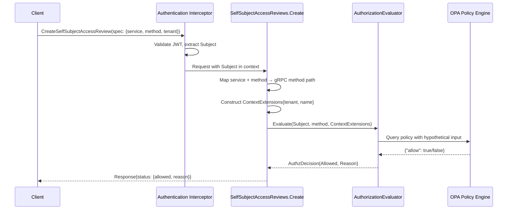

# Self-Subject Access Review API

## Summary

This enhancement adds a SelfSubjectAccessReview-style API to the fulfillment-service that allows authenticated users to check their own permissions on OSAC types without performing the actual operation. The implementation creates an extendable authorization component with a well-defined interface and invokes it with hypothetical operation parameters, ensuring permission check results match what the actual operation's authorization would be.

See [PRD](prd.md) for detailed requirements.

## Motivation

Authenticated users currently have no way to check their permissions without attempting operations and encountering authorization failures. This creates friction in UI, CLI, and API workflows: users must attempt actions to discover they lack permission, leading to unexpected errors and poor user experience. Permission-aware interfaces cannot hide unavailable actions, validate workflows before execution, or provide clear permission-based guidance.

The fulfillment-service uses OPA for authorization, with policies evaluated in `GrpcAuthzInterceptor`. Every gRPC method requires authentication and authorization before execution. A self-subject access review API enables users to query "would I be authorized to perform operation X?" without triggering the operation itself, enabling proactive permission checking in client applications.

### Goals

- Create an extendable authorization component that can be reused across permission checks and actual operations without duplicating authorization rules
- Follow Kubernetes SelfSubjectAccessReview API pattern for consistency with established conventions
- Support checking permissions on all OSAC services and standard methods (create, get, list, update, delete)
- Ensure authorization consistency — permission check results must match what the actual operation's authorization decision would be at the time of the check
- Design the authorization component with a clear interface to enable testing, alternative implementations, and future extensions

### Non-Goals

- Checking another user's permissions (SubjectAccessReview equivalent for administrators)
- Bulk permission checks evaluating multiple operations in a single request
- Caching or memoization of permission check results
- UI integration work (separate feature using this API)

## Proposal

Add a new `SelfSubjectAccessReview` type to the fulfillment-service public API with a create-only service (no List/Get/Update/Delete operations). The type follows Kubernetes conventions: spec describes the hypothetical operation to check (service name, method, optional tenant/name scoping), status returns the evaluation result (allowed boolean, optional reason string).

Implementation creates an `AuthorizationEvaluator` interface that extracts OPA policy evaluation from `GrpcAuthzInterceptor` into a reusable and extendable component. The interface enables alternative implementations (mocking for tests, future policy backends) while maintaining authorization consistency. The `SelfSubjectAccessReviews.Create` handler:

1. Extracts the authenticated user's identity from request context (via existing authentication interceptor)
2. Constructs the gRPC method path from the user-provided service and method (e.g., `"osac.public.v1.Clusters" + "Create"` → `"/osac.public.v1.Clusters/Create"`)
3. Constructs hypothetical `ContextExtensions` from the spec's tenant and resource name fields
4. Calls the `AuthorizationEvaluator.Evaluate` method with the user's identity, method path, and hypothetical context
5. Returns the authorization decision as the response status

This component-based approach ensures the same OPA policies govern both permission checks and actual operations, maintaining authorization consistency. The interface abstraction enables dependency injection for testing and makes the system extensible for future authorization backends. [Research: §Recommended Approach]

### Workflow Description

**Actor:** Authenticated user (tenant admin or tenant user)

**Preconditions:** User has valid authentication credentials (JWT token)

**Basic Flow:**

1. User constructs a `CreateSelfSubjectAccessReviewRequest` specifying:
   - `spec.service`: The full OSAC service name to check (e.g., `"osac.public.v1.Clusters"`, `"osac.public.v1.ComputeInstances"`, `"osac.public.v1.VirtualNetworks"`)
   - `spec.method`: The operation to check (`"Create"`, `"Get"`, `"List"`, `"Update"`, `"Delete"`)
   - `metadata.tenant`: Optional tenant context for the hypothetical operation (e.g., `"org-a"`)
2. User calls `SelfSubjectAccessReviews.Create` (gRPC)
3. fulfillment-service:
   - Authenticates the user via existing authentication interceptor (extracts full JWT claims)
   - Constructs gRPC method path from `service` + `method` (e.g., `"osac.public.v1.Clusters" + "Create"` → `"/osac.public.v1.Clusters/Create"`)
   - Constructs OPA input with complete authentication context, method path, and `metadata.tenant` as context extension
   - Evaluates OPA policy using the `AuthorizationEvaluator` component, including resource ownership and database visibility filtering to ensure accurate authorization results
   - Returns `SelfSubjectAccessReview` response with `status.allowed` (bool) and optional `status.reason` (string)
4. User receives permission check result

**Error Flows:**

- **Invalid service:** Returns `InvalidArgument` error with message `"unknown service: {service}"`
- **Unsupported method for service:** Returns `InvalidArgument` error with message `"method {method} not supported for service {service}"` (e.g., osac.public.v1.ExternalIPPools does not support Create in the public API; protobuf reflection validates methods exist on the specified service)
- **Unauthenticated request:** Returns `Unauthenticated` error (existing authentication interceptor behavior)
- **OPA evaluation failure:** Returns `Internal` error with message `"authorization evaluation failed"`

**Usage Example (gRPC Client):**

```go
// Check if current user can create a Cluster in tenant "org-a"
req := &v1.CreateSelfSubjectAccessReviewRequest{
    Object: &v1.SelfSubjectAccessReview{
        Metadata: &v1.Metadata{
            Tenant: "org-a",
        },
        Spec: &v1.SelfSubjectAccessReviewSpec{
            Service: "osac.public.v1.Clusters",
            Method: "Create",
        },
    },
}

resp, err := client.SelfSubjectAccessReviews().Create(ctx, req)
if err != nil {
    // Handle error
}

if resp.Object.Status.Allowed {
    // User is authorized — proceed with create workflow
} else {
    // User is not authorized — display reason or hide UI element
    fmt.Printf("Permission denied: %s\n", resp.Object.Status.Reason)
}
```



The sequence diagram shows the permission check request path: authentication extracts the user's identity, the review server maps user-provided type and method to a gRPC method path, constructs hypothetical context extensions, and invokes the `AuthorizationEvaluator` component. The same OPA policy that governs actual operations evaluates the hypothetical request and returns an authorization decision.

### API Extensions

This enhancement adds a new gRPC service `SelfSubjectAccessReviews` with a single `Create` method to the fulfillment-service public API (`osac.public.v1`). The service follows existing patterns for create-only resources (e.g., console sessions).

**New proto files:**
- `proto/private/osac/private/v1/self_subject_access_review_type.proto` — message definitions (editable source)
- `proto/private/osac/private/v1/self_subject_access_reviews_service.proto` — service definition (editable source)
- `proto/public/osac/public/v1/self_subject_access_review_type.proto` — public message definitions (auto-generated from private)
- `proto/public/osac/public/v1/self_subject_access_reviews_service.proto` — public service definition (auto-generated from private)

**New server implementation:**
- `internal/servers/self_subject_access_reviews_server.go` — public server handler
- `internal/auth/authorization_evaluator.go` — `AuthorizationEvaluator` interface and `OPAAuthorizationEvaluator` implementation (refactored from `GrpcAuthzInterceptor`)

**Modified files:**
- `internal/auth/grpc_authz_interceptor.go` — refactored to use `AuthorizationEvaluator` component
- `internal/auth/policies/authz.rego` — add always-allow rule for `/osac.public.v1.SelfSubjectAccessReviews/Create` method

This API does not modify existing resources. The new service is additive and does not change behavior of any existing gRPC methods.

## Implementation Details/Notes/Constraints

### Proto Message Definitions

Following Kubernetes `SelfSubjectAccessReview` structure and OSAC conventions: [Research: §Kubernetes SelfSubjectAccessReview]

```protobuf
// self_subject_access_review_type.proto
syntax = "proto3";

package osac.public.v1;

import "buf/validate/validate.proto";
import "metadata_type.proto";

// SelfSubjectAccessReview checks whether the current user can perform an action.
message SelfSubjectAccessReview {
  // Metadata contains the tenant context for the hypothetical operation.
  // The tenant field specifies which tenant's scope to evaluate permissions in.
  Metadata metadata = 1;

  // Spec describes information about the request being evaluated.
  SelfSubjectAccessReviewSpec spec = 2 [(buf.validate.field).required = true];

  // Status is filled in by the server and indicates whether the request is allowed or not.
  SelfSubjectAccessReviewStatus status = 3;
}

// SelfSubjectAccessReviewSpec describes the hypothetical operation to check.
message SelfSubjectAccessReviewSpec {
  // service is the full OSAC service name to check permission for
  // (e.g., "osac.public.v1.Clusters", "osac.public.v1.ComputeInstances", "osac.public.v1.VirtualNetworks").
  // Must be a valid fully-qualified OSAC service name.
  string service = 1 [(buf.validate.field).string = {
    min_len: 1,
    max_len: 128,
    pattern: "^osac\\.public\\.v1\\.[A-Z][a-zA-Z]*s$"
  }];

  // method is the operation to check (e.g., Create, Get, List, Update, Delete).
  // Method names must match gRPC method naming conventions (capitalized).
  // Valid methods are determined by the service definition and validated at runtime
  // using protobuf reflection.
  string method = 2 [(buf.validate.field).string = {
    min_len: 1,
    max_len: 64
  }];
}

// SelfSubjectAccessReviewStatus describes the result of the permission check.
message SelfSubjectAccessReviewStatus {
  // Allowed is true if the user would be authorized to perform the requested operation.
  bool allowed = 1;

  // Reason describes why the request was denied (reserved for future use).
  // v1 implementation: always empty — current OPA policy does not export denial reasons.
  // Future enhancement: extract structured denial reasons from OPA policy output.
  string reason = 2;
}
```

```protobuf
// self_subject_access_reviews_service.proto
syntax = "proto3";

package osac.public.v1;

import "google/api/annotations.proto";
import "self_subject_access_review_type.proto";

// SelfSubjectAccessReviews service allows users to check their own permissions.
service SelfSubjectAccessReviews {
  // Create evaluates the permission check and returns the result immediately.
  // This is a create-only service with no List, Get, Update, or Delete methods.
  rpc Create(CreateSelfSubjectAccessReviewRequest) returns (CreateSelfSubjectAccessReviewResponse) {
    option (google.api.http) = {
      post: "/api/fulfillment/v1/self_subject_access_reviews"
      body: "object",
      response_body: "object"
    };
  }
}

message CreateSelfSubjectAccessReviewRequest {
  SelfSubjectAccessReview object = 1;
}

message CreateSelfSubjectAccessReviewResponse {
  SelfSubjectAccessReview object = 1;
}
```

**Spec/Status ownership:** `spec` is user-controlled input describing the hypothetical operation to check; `status` is system-controlled output containing the evaluation result. [Codebase: API.md conventions]

**Validation:** `buf.validate` annotations enforce:
- `service` and `method` are required non-empty strings
- `service` must match the pattern `osac.public.v1.[A-Z][a-zA-Z]*s` (fully-qualified OSAC service name)
- `method` max length 64 characters (buf.validate constraint)
- `metadata.tenant` is optional (inherits standard metadata validation — RFC 1123 DNS subdomain, max 253 chars)
- Runtime validation (in `buildGRPCMethodPath`) ensures the method exists on the specified service using protobuf reflection
- Invalid input returns `InvalidArgument` gRPC error (protobuf validation failures before reaching server logic, unknown service/method during server processing)

### Service and Method Validation

User-provided service names are fully-qualified (e.g., `"osac.public.v1.Clusters"`). The server must validate that the service exists and that it supports the requested method before evaluating authorization. [Research: §Pattern 2: type to API Path Mapping]

**Implementation:** Runtime protobuf reflection over `osac.public.v1` service definitions. The server uses Go's `google.golang.org/protobuf/reflect/protoregistry` to iterate over all registered services at startup and builds a mapping of which methods each service supports:

```go
package servers

import (
    "fmt"
    "strings"
    "sync"

    "google.golang.org/protobuf/reflect/protoreflect"
    "google.golang.org/protobuf/reflect/protoregistry"
)

var (
    serviceSupportedMethods map[string]map[string]bool // service -> method -> exists
    once                  sync.Once
)

func initServiceMapping() {
    once.Do(func() {
        serviceSupportedMethods = make(map[string]map[string]bool)

        protoregistry.GlobalFiles.RangeFiles(func(fd protoreflect.FileDescriptor) bool {
            // Only process osac.public.v1 services
            if fd.Package() != "osac.public.v1" {
                return true
            }

            services := fd.Services()
            for i := 0; i < services.Len(); i++ {
                service := services.Get(i)
                serviceName := string(service.Name())

                // Skip SelfSubjectAccessReviews to prevent recursive checks
                if serviceName == "SelfSubjectAccessReviews" {
                    continue
                }

                // Build fully-qualified service name
                fullServiceName := fmt.Sprintf("%s.%s", fd.Package(), serviceName)

                // Build map of supported methods for this service
                supportedMethods := make(map[string]bool)
                methods := service.Methods()
                for j := 0; j < methods.Len(); j++ {
                    method := methods.Get(j)
                    methodName := string(method.Name())
                    supportedMethods[methodName] = true
                }
                serviceSupportedMethods[fullServiceName] = supportedMethods
            }
            return true
        })
    })
}
```

Consumed by `buildGRPCMethodPath` in `internal/servers/self_subject_access_reviews_server.go`:

```go
func buildGRPCMethodPath(service, method string) (string, error) {
    initServiceMapping() // Ensures mapping is initialized

    // Validate that the service exists
    supportedMethods, ok := serviceSupportedMethods[service]
    if !ok {
        return "", fmt.Errorf("unknown service: %s", service)
    }

    // Validate that this service supports the requested method
    if !supportedMethods[method] {
        return "", fmt.Errorf("method %s not supported for service %s", method, service)
    }

    // Construct the gRPC method path
    return fmt.Sprintf("/%s/%s", service, method), nil
}
```

**Rationale:** Protobuf reflection eliminates build-time code generation and automatically stays in sync with proto service definitions — when a new `*_service.proto` is added and compiled, the reflection-based validation immediately includes it without any additional build steps. No generator scripts, no CI drift checks, no manual regeneration commands. The mapping is built once at server startup using the compiled proto descriptors. [Research: §Integration Constraints]

**Per-service method validation:** The reflection-based implementation validates that each service supports the requested method by iterating over the service's method descriptors. This provides clearer error messages when users request unsupported operations (e.g., `osac.public.v1.ExternalIPPools + Create` returns `InvalidArgument` "method Create not supported for service osac.public.v1.ExternalIPPools" instead of relying on OPA to deny the non-existent method path). Resources in the public API may expose only a subset of standard methods (e.g., ExternalIPPools supports List/Get but not Create/Update/Delete).

**Alternative considered:** Code-generated mapping from build-time script parsing proto files. Would require tooling (buf plugin or Makefile integration), CI verification to catch drift, and manual regeneration steps. Rejected in favor of reflection to eliminate maintenance overhead and an entire class of "forgot to regenerate" errors.

### OPA Policy Evaluation Component

Extract existing policy evaluation logic from `GrpcAuthzInterceptor` into an extendable `AuthorizationEvaluator` component with a well-defined interface. Both the interceptor and `SelfSubjectAccessReviews.Create` use the same evaluator instance via dependency injection, ensuring authorization consistency. The interface abstraction enables mock implementations for testing and future alternative authorization backends. [Research: §Recommended Approach]

**New component in `internal/auth/authorization_evaluator.go`:**

```go
// AuthzDecision contains the result of an authorization evaluation.
type AuthzDecision struct {
    Allowed bool
    Reason  string
}

// AuthorizationEvaluator defines the interface for evaluating authorization decisions.
// Implementations must evaluate whether a given authentication context is authorized
// to perform a method with the specified context extensions.
//
// This interface enables:
// - Dependency injection for testing (mock evaluators)
// - Alternative authorization backends (future: other policy engines)
// - Consistent authorization evaluation across permission checks and actual operations
type AuthorizationEvaluator interface {
    // Evaluate determines whether the authenticated subject is authorized to perform
    // the specified method with the given context extensions.
    //
    // authContext contains the complete JWT claims (username, groups, roles, organization,
    // tenants, auth method) extracted by the authentication interceptor.
    // method is the gRPC method path (e.g., "/osac.public.v1.Clusters/Create").
    // contextExtensions contains optional tenant, name, project, and ID context.
    //
    // Returns an AuthzDecision indicating whether the operation is allowed and an
    // optional reason string. Returns an error if the evaluation itself fails
    // (e.g., policy engine unreachable, timeout, compilation error).
    Evaluate(
        ctx context.Context,
        authContext *AuthenticationContext,
        method string,
        contextExtensions *ContextExtensions,
    ) (*AuthzDecision, error)
}

// OPAAuthorizationEvaluator implements AuthorizationEvaluator using OPA (Open Policy Agent).
// This is the production implementation that evaluates authorization using the existing
// OPA policy (authz.rego).
type OPAAuthorizationEvaluator struct {
    query rego.PreparedEvalQuery
}

// NewOPAAuthorizationEvaluator creates an OPAAuthorizationEvaluator with a prepared OPA query.
// The query should be compiled from the authz.rego policy and target "data.authz".
func NewOPAAuthorizationEvaluator(query rego.PreparedEvalQuery) *OPAAuthorizationEvaluator {
    return &OPAAuthorizationEvaluator{
        query: query,
    }
}

// Evaluate evaluates OPA policy for a given authentication context, method, and context extensions.
// This method is called by both GrpcAuthzInterceptor (for actual operations) and
// SelfSubjectAccessReviews.Create (for hypothetical permission checks).
//
// authContext contains the complete JWT claims extracted by the authentication interceptor.
// This ensures OPA receives identical input for both permission checks and actual operations.
func (e *OPAAuthorizationEvaluator) Evaluate(
    ctx context.Context,
    authContext *AuthenticationContext,
    method string,
    contextExtensions *ContextExtensions,
) (*AuthzDecision, error) {
    input := constructOPAInput(authContext, method, contextExtensions)

    // Query the OPA policy. Following GrpcAuthzInterceptor pattern:
    // query is "data.authz", result is results[0].Expressions[0].Value as map[string]any
    results, err := e.query.Eval(ctx, rego.EvalInput(input))
    if err != nil {
        return nil, fmt.Errorf("OPA evaluation failed: %w", err)
    }
    if len(results) == 0 {
        return &AuthzDecision{Allowed: false, Reason: "no policy result"}, nil
    }

    // Extract the authz data map
    authzData, ok := results[0].Expressions[0].Value.(map[string]any)
    if !ok {
        return nil, fmt.Errorf("OPA returned unexpected result type")
    }

    // Extract allow boolean
    allow, _ := authzData["allow"].(bool)
    decision := &AuthzDecision{
        Allowed: allow,
    }

    // Note: Current OPA policy does not return a "reason" field.
    // If denied, the reason is implicit from the policy rules.
    // Future enhancement: add reason field to authz.rego policy output.

    return decision, nil
}

// constructOPAInput builds the input structure for OPA policy evaluation.
// This is the existing logic from GrpcAuthzInterceptor, extracted for reuse.
// authContext contains all JWT claims needed for complete authorization evaluation.
func constructOPAInput(authContext *AuthenticationContext, method string, ext *ContextExtensions) map[string]interface{} {
    return map[string]interface{}{
        "auth": map[string]interface{}{
            "identity": map[string]interface{}{
                "username":   authContext.Username,
                "user":       map[string]interface{}{"username": authContext.Username, "groups": authContext.Groups},
                "tenants":    authContext.Tenants,
                "organization": authContext.Organization,
                "realm_access": map[string]interface{}{"roles": authContext.RealmRoles},
                "resource_access": authContext.ResourceAccess,
                "authnMethod": authContext.AuthMethod,
            },
        },
        "context": map[string]interface{}{
            "request": map[string]interface{}{
                "http": map[string]interface{}{
                    "path": method,
                },
            },
            "context_extensions": map[string]interface{}{
                "id":      ext.ID,
                "tenant":  ext.Tenant,
                "name":    ext.Name,
                "project": ext.Project,
            },
        },
    }
}
```

**Refactor `GrpcAuthzInterceptor`:** Replace inline OPA evaluation logic with an `AuthorizationEvaluator` instance. The interceptor receives the evaluator via dependency injection (builder pattern). This ensures the interceptor and permission checks use identical evaluation logic and enables testing with mock evaluators.

### Server Implementation

**`internal/servers/self_subject_access_reviews_server.go`:**

```go
type SelfSubjectAccessReviewsServer struct {
    v1.UnimplementedSelfSubjectAccessReviewsServer
    logger    *slog.Logger
    evaluator auth.AuthorizationEvaluator
}

func (s *SelfSubjectAccessReviewsServer) Create(
    ctx context.Context,
    req *v1.CreateSelfSubjectAccessReviewRequest,
) (*v1.CreateSelfSubjectAccessReviewResponse, error) {
    // Extract authenticated user from context (set by authentication interceptor)
    subject, err := auth.SubjectFromContext(ctx)
    if err != nil {
        return nil, status.Errorf(codes.Unauthenticated, "authentication required")
    }

    spec := req.Object.Spec

    // Build and validate gRPC method path from service + method
    methodPath, err := buildGRPCMethodPath(spec.Service, spec.Method)
    if err != nil {
        return nil, status.Errorf(codes.InvalidArgument, err.Error())
    }

    // Construct hypothetical context extensions from metadata
    contextExt := &auth.ContextExtensions{
        Tenant: req.Object.Metadata.GetTenant(),
        // Name, ID, and Project are not provided; leave empty for hypothetical check
    }

    // Evaluate authorization using the same component as actual operations
    decision, err := s.evaluator.Evaluate(ctx, subject, methodPath, contextExt)
    if err != nil {
        // Log sanitized error - do not include usernames, tenant names, or error details
        s.logger.Error("self_subject_access_review.evaluation_failed")
        // TODO: Distinguish transient (connectivity, timeout) vs permanent (policy error) failures.
        // Transient failures should return codes.Unavailable or codes.DeadlineExceeded for client retry.
        // Permanent failures should return codes.Internal.
        // Current implementation treats all failures as Internal.
        return nil, status.Errorf(codes.Internal, "authorization evaluation failed")
    }

    // Return result
    return &v1.CreateSelfSubjectAccessReviewResponse{
        Object: &v1.SelfSubjectAccessReview{
            Spec: spec,
            Status: &v1.SelfSubjectAccessReviewStatus{
                Allowed: decision.Allowed,
                Reason:  decision.Reason,
            },
        },
    }, nil
}
```

**Builder pattern:** Follow existing server conventions with `SelfSubjectAccessReviewsServerBuilder` configuring dependencies (logger, evaluator). The evaluator is injected via the builder, enabling dependency injection for testing with mock evaluators. No DAO needed — this is a create-only, non-persisted API. [Codebase: Example service patterns]

### Authorization Bypass

The `SelfSubjectAccessReviews.Create` method must bypass normal authorization — it IS the authorization check. Any authenticated user can call this endpoint to check their own permissions. [Research: §Integration Constraints #4]

**Implementation:** Add always-allow rule in `internal/auth/policies/authz.rego`:

```rego
# SelfSubjectAccessReview is always allowed for any authenticated user
allow {
    input.context.request.http.path == "/osac.public.v1.SelfSubjectAccessReviews/Create"
}
```

This rule is evaluated before role-based authorization rules, allowing any authenticated user to call the endpoint. The permission being checked is determined by the `spec` fields, not by the caller's identity.

**Alternative considered:** Skip authorization interceptor entirely for this method via early-return logic in `GrpcAuthzInterceptor`. Rejected because policy-based allow is more declarative and auditable. [Research: §Open Questions #2]

### Testing Strategy

**Unit Tests:**
- `buildGRPCMethodPath` returns correct paths for all services and methods
- `buildGRPCMethodPath` returns error for unknown services and methods
- `OPAAuthorizationEvaluator.Evaluate` constructs correct OPA input structure when calling OPA
- Mock `AuthorizationEvaluator` implementation returns expected `AuthzDecision` values without calling OPA
- Server uses injected `AuthorizationEvaluator` and calls `Evaluate` method correctly
- Test server behavior with both success and error cases using mock evaluator

**Integration Tests (against Kind cluster with Keycloak):**
- **Authorization consistency:** For each role (Admin, Tenant Admin, Client) and each service:
  - `SelfSubjectAccessReview(service, "Create")` returns `allowed=true` ⟺ actual `Create()` succeeds
  - `SelfSubjectAccessReview(service, "Delete", name)` returns `allowed=false` ⟺ actual `Delete(name)` returns `PermissionDenied`
- **Tenant scoping:** Tenant Admin for `org-a` checks permission on `org-b` resource → `allowed=false`
- **Resource-scoped checks:** User checks `Update` permission on specific VirtualNetwork by name → result matches whether actual update would succeed
- **Advisory nature:** Permission check returns `allowed=true`, then user's role is revoked, then actual operation fails → demonstrates checks are advisory, not authoritative
- **Unauthenticated requests:** Calling endpoint without valid JWT returns `Unauthenticated` error
- **Invalid inputs:** Unknown service, invalid method, malformed tenant name → appropriate validation errors

**E2E Tests (osac-test-infra):**
- UI workflow: User navigates to Clusters page → UI calls `SelfSubjectAccessReview("osac.public.v1.Clusters", "Create")` → if `allowed=false`, "Create Cluster" button is disabled
- CLI workflow: `osac auth can-i create clusters` → calls permission check API → prints "yes" or "no" based on result

## Security Considerations

**Authentication:** The API inherits existing JWT authentication via `GrpcAuthInterceptor`. User identity is extracted from the authenticated request's context — the spec fields describe the hypothetical operation, not the caller's identity. No changes to authentication flow.

**Authorization:** The `SelfSubjectAccessReviews.Create` endpoint is always allowed for authenticated users (Rego policy rule). This is safe because:
- The endpoint only checks permissions, it does not grant them or perform any privileged operation
- Users can only check their own permissions (self-subject), not other users
- The authorization decision returned is advisory — actual operations re-evaluate authorization independently

**Input validation:** `buf.validate` annotations enforce service, method, tenant, and resource name constraints at the protobuf layer. Unknown services return `InvalidArgument` errors before reaching authorization logic.

**Information disclosure:** The response `reason` field may reveal information about why permission was denied, but must NOT disclose cross-tenant information. Reason messages must be sanitized to prevent tenant enumeration or information leakage:
- SAFE: "insufficient permissions" (generic denial, reveals nothing about other tenants)
- UNSAFE: "user is not a member of tenant X" (reveals tenant X's existence to users outside that tenant)
- The reason is based on the caller's own identity and the request parameters they provided, never revealing information about other tenants or users
- v1 implementation: OPA policy does not export denial reasons, so the `reason` field is always empty. Future enhancement may add sanitized reasons that do not leak cross-tenant data.

**Data exposure:** No new data is exposed. The API returns only whether the caller would be authorized for a hypothetical operation, using information the caller already knows (their own identity and tenants) and information they provide in the request (type, method, tenant, name).

**Multi-tenant isolation:** Tenant isolation is enforced by OPA policies during the hypothetical authorization evaluation, the same way it's enforced for actual operations. If the user is not a member of the specified tenant, the permission check will return `allowed=false`.

### Failure Handling and Recovery

**OPA evaluation failure:**
- **What happens:** `AuthorizationEvaluator.Evaluate` returns an error (OPA service unreachable, policy compilation error, timeout)
- **Recovery:** No automatic retry — OPA failures are fatal for this request
- **User observes:** `Internal` gRPC error with message `"authorization evaluation failed"`
- **Server logs:** Sanitized error log without sensitive data (no usernames, tenant names, or error details)

**Invalid service or method:**
- **What happens:** `buildGRPCMethodPath` returns an error
- **Recovery:** N/A — user error, not a recoverable failure
- **User observes:** `InvalidArgument` gRPC error with message `"unknown service: X"` or `"unknown method: Y"`
- **Server logs:** No error log — this is expected for malformed input

**Unauthenticated request:**
- **What happens:** `SubjectFromContext` returns an error
- **Recovery:** N/A — user must authenticate
- **User observes:** `Unauthenticated` gRPC error
- **Server logs:** Authentication interceptor logs the failure

**Idempotency:** Every request is idempotent — calling `Create` multiple times with the same spec returns the same result (assuming authorization state has not changed). No side effects, no state modification.

**Retry behavior:** Clients may retry on transient failures (OPA timeout, network errors). Since requests are idempotent and stateless, retries are safe.

### RBAC / Tenancy

**No new roles or permissions.** Any authenticated user can call `SelfSubjectAccessReviews.Create` to check their own permissions.

**Tenant isolation:** The permission check evaluates OPA policies that enforce tenant isolation. If a user is not a member of the specified `metadata.tenant`, the check will return `allowed=false`, the same way an actual operation would be denied.

**Visibility:** All users can call the endpoint, but each user can only check permissions for their own identity. There is no way to check another user's permissions (out of scope per PRD).

### Observability and Monitoring

**Logging:**
- **Application-level logging:** No structured logging of request details in the server implementation. OPA evaluation failures are logged as sanitized ERROR events without usernames, tenant names, types, or error details to prevent exposure of customer data or PII.
- **Logging interceptor:** Existing gRPC logging interceptor behavior remains unchanged. Request/response details are logged only when the service is started with `--log-level debug` and `--log-bodies true` (debug mode). No change to existing debug logging behavior.

**Metrics:** Existing gRPC metrics (`grpc_server_handled_total`, `grpc_server_handling_seconds`) cover this endpoint automatically.

**Alerts:** Alerts are out of scope. There are currently no alerting mechanisms.

### Risks and Mitigations

**Risk: Users treat permission check results as authoritative**
- **Manifestation:** User caches permission check result, assumes it's guaranteed, and attempts operation later when authorization state has changed (role revoked, policy updated) → operation fails
- **Mitigation:** API documentation prominently states that results are advisory and that actual operations must re-evaluate authorization. Response field naming (`allowed`, not `will_succeed`) reinforces advisory nature. [Research: §Integration Constraints #3]
- **Residual risk:** Medium — user misunderstanding is possible despite documentation. This is inherent to the advisory model (same issue exists in Kubernetes SelfSubjectAccessReview). [Research: §Assumptions A4]

**Risk: Drift between permission checks and actual authorization**
- **Manifestation:** Bug introduced in `AuthorizationEvaluator` component causes permission checks to return different results than actual operations
- **Mitigation:** Integration tests verify authorization consistency (permission check result matches actual operation outcome). Using a shared component interface (not duplicating policy logic) minimizes drift risk. Both `GrpcAuthzInterceptor` and `SelfSubjectAccessReviewsServer` use the same `AuthorizationEvaluator` instance. [Research: §Recommended Approach]
- **Residual risk:** Low — refactoring is mechanical, existing tests catch behavioral changes, and the interface abstraction makes it clear when the same evaluator is being used

**Risk: Protobuf reflection mapping does not capture a new service**
- **Manifestation:** New service added to proto definitions and compiled, but protobuf reflection does not find it at runtime → permission checks for new service fail with `unknown service` error
- **Mitigation:** Protobuf reflection automatically includes all services registered in the global proto registry at compile time — when `buf generate` produces Go code for a new `*_service.proto`, the service descriptor is automatically registered. Unit tests for all services will fail if reflection cannot find them.
- **Residual risk:** Very low — reflection uses the same compiled proto descriptors that power the actual gRPC services, so if gRPC registration works, reflection works

### Drawbacks

**Runtime reflection overhead:** Protobuf reflection iterates over all `osac.public.v1` services at server startup to build the service validation mapping. This adds a small initialization cost (negligible — typically sub-millisecond for a few dozen services) and uses the global proto registry. The trade-off favors reflection to eliminate build-time tooling, code generation scripts, and CI drift verification.

**Advisory results may confuse users:** Permission checks are snapshots — authorization state can change between the check and the actual operation. Users accustomed to authoritative permission systems may misunderstand this. The API documentation must emphasize the advisory nature, but user confusion remains a risk despite documentation.

**No bulk permission checks:** Users checking permissions for multiple operations must make separate API calls. This increases network overhead and latency for permission-aware UIs. The PRD explicitly excludes bulk checks from scope, deferring to a future enhancement if needed.

## Alternatives (Not Implemented)

### Alternative 1: New Rego Rule for Hypothetical Checks

**Description:** Add a new Rego rule `allow_hypothetical(method, tenant, name)` that accepts method and context as input parameters, rather than extracting policy evaluation into a reusable Go component.

**Pros:**
- All authorization logic stays in Rego (no Go-side policy evaluation code)
- Policy changes don't require recompiling Go code

**Cons:**
- Duplicates authorization logic — two rules (`allow` and `allow_hypothetical`) to keep in sync
- No programmatic way to verify the two rules return the same results
- Makes testing harder — must mock Rego evaluation instead of unit testing Go component with interface
- Risk of subtle differences between real and hypothetical authorization

**Rejection reason:** Violates "reuse existing authorization logic" goal. Creating a shared `AuthorizationEvaluator` component ensures permission checks and actual operations use identical policy evaluation. The interface abstraction enables testing with mock implementations. [Research: §Why not a new Rego rule accepting method as input?]

### Alternative 2: Separate gRPC Method per type

**Description:** Define separate permission check methods per type (e.g., `CheckClusterPermission`, `CheckComputeInstancePermission`) rather than a generic `SelfSubjectAccessReview` with `service` field.

**Pros:**
- No type mapping table needed
- Type-safe proto definitions (dedicated request/response per type)

**Cons:**
- Violates Kubernetes SelfSubjectAccessReview pattern
- Adds 10+ new gRPC methods instead of one
- Each new type requires new proto definition, server method, and handler
- Clients must know which method to call for each type

**Rejection reason:** Does not scale. Adding a new type should not require proto changes in the permission check API. Generic type field follows established Kubernetes pattern and reduces API surface. [Research: §Kubernetes SelfSubjectAccessReview]

### Alternative 3: Algorithmically Derive Pluralization

**Description:** Use algorithmic pluralization rules (append "s", handle "-y" → "-ies", etc.) instead of explicit mapping table for type → service name.

**Pros:**
- No mapping table to maintain
- New types work automatically

**Cons:**
- Pluralization is not algorithmic — `"SecurityGroup"` → `"SecurityGroups"`, not `"SecurityGroupes"`; exceptions abound
- Kubernetes explicitly requires hand-specified `plural` in CRDs for this reason
- Silent failures when algorithmic rule is wrong (incorrect method path → OPA denies everything)

**Rejection reason:** Kubernetes CRD pattern demonstrates that pluralization cannot be reliably automated. Explicit mapping prevents silent failures. [Research: §Pattern 2: type to API Path Mapping]

## Open Questions

### 1. Should invalid services return validation errors or `allowed=false`?

**Owner:** To be determined

**Impact:** §Workflow Description (Error Flows), §Implementation Details (Server Implementation)

When a user provides an unknown `service` (e.g., typo: `"osac.public.v1.Cluste"`), the server could:
- **A: Return `InvalidArgument` gRPC error** — clear for developers, fails fast, treats as malformed input
- **B: Return `allowed=false` with `reason="unknown service"`** — treats unknown services as inaccessible, may confuse users

Kubernetes SelfSubjectAccessReview allows any resource string (extensible for CRDs) and relies on the authorization backend to reject unknown types. OSAC has a fixed set of known services (discovered via protobuf reflection over compiled service definitions). Which approach better serves OSAC users?

Current design uses **Option A** (validation error) for clarity and fast feedback. Should this be reconsidered?

### 2. Should future versions support resource-scoped permission checks?

**Owner:** To be determined

**Impact:** §Implementation Details (Server Implementation, Authorization Integration)

v1 includes **database visibility filtering** to ensure permission check results match actual operation authorization. The full authorization stack includes:
1. **OPA policy evaluation** (what v1 implements)
2. **Tenant membership checks** (covered via OPA tenant claims)
3. **Database visibility filtering** (ownership, resource-level permissions — included in v1 to ensure list method results are accurate)

v1 checks "can I call the list method and see results?" rather than only "can I call the list method?" This ensures permission check results accurately reflect whether the operation would return accessible data.

However, v1 still cannot answer "can I modify cluster Y specifically?" without the specific resource identifier. Should a future version add resource-scoped checks with explicit resource name validation? Considerations:
- **Pro:** Enables precise UI disabling ("hide edit button on resources user cannot modify"), better UX
- **Con:** Requires resource name in the request spec, adding complexity to the API surface

Kubernetes SelfSubjectAccessReview checks RBAC (method-level) but not object ownership — resource-level checks require hitting the actual API. Is that pattern sufficient for OSAC with visibility filtering included?


## Test Plan

### Unit Tests

**Protobuf reflection mapping:**
- `initServiceMapping()` builds `serviceSupportedMethods` map from all services in `osac.public.v1` package **except** `SelfSubjectAccessReviews` (prevents recursive permission checks)
- Reflection discovers all registered proto services and their methods at runtime
- Test verifies `SelfSubjectAccessReviews` is NOT in the reflection-built mapping
- Test verifies all expected services (osac.public.v1.Clusters, osac.public.v1.ComputeInstances, etc.) are present after initialization
- Test verifies `serviceSupportedMethods` correctly identifies which methods each service supports (e.g., osac.public.v1.ExternalIPPools has List/Get but not Create/Update/Delete)

**`buildGRPCMethodPath` function:**
- All services in mapping with supported methods return correct gRPC paths
- Unknown service returns error with message `"unknown service: X"`
- Unsupported method for a specific service returns error with message `"method X not supported for service Y"` (e.g., `osac.public.v1.ExternalIPPools + Create` returns error because ExternalIPPools doesn't have a Create method)
- Method names are case-sensitive and must exactly match protobuf method definitions (e.g., "Create" works, "create" fails)

**`OPAAuthorizationEvaluator` component:**
- `Evaluate` method constructs OPA input with correct structure (auth.identity, context.request.http.path, context.context_extensions)
- Returns `Allowed=true` when OPA authz data contains `{"allow": true}`
- Returns `Allowed=false` when OPA authz data contains `{"allow": false}` (note: current OPA policy does not return a `reason` field)
- Returns error when OPA query fails or returns unexpected result type

**Mock `AuthorizationEvaluator` for testing:**
- Create mock implementation of `AuthorizationEvaluator` interface that returns predefined `AuthzDecision` values
- Test server with mock evaluator to verify it calls `Evaluate` with correct parameters
- Test server error handling when evaluator returns errors
- Enables unit testing server logic without OPA dependency

**Server validation:**
- Request with empty `service` fails validation before reaching handler
- Request with `service` that doesn't match pattern fails validation
- Request with empty `method` fails validation before reaching handler
- Request with `method` exceeding 64 characters fails validation before reaching handler
- Request with `metadata.tenant` exceeding max length fails validation

### Integration Tests

**Authorization consistency (critical):**
- Admin user: `SelfSubjectAccessReview(service="osac.public.v1.Clusters", method="Create")` returns `allowed=true`; actual `Clusters.Create()` succeeds
- Tenant Admin for `org-a`: `SelfSubjectAccessReview(service="osac.public.v1.VirtualNetworks", method="Create", metadata.tenant="org-a")` returns `allowed=true`; actual create succeeds
- Tenant Admin for `org-a`: `SelfSubjectAccessReview(service="osac.public.v1.VirtualNetworks", method="Create", metadata.tenant="org-b")` returns `allowed=false` with `reason` that does NOT contain "org-b" (e.g., empty or "insufficient permissions"); actual create returns `PermissionDenied` with error message that also does NOT reveal "org-b"
- Client user: `SelfSubjectAccessReview(service="osac.public.v1.Tenants", method="Update")` returns `allowed=false`; actual update returns `PermissionDenied`
- Repeat for all services and methods across Admin, Tenant Admin, Client roles

**Cross-tenant information disclosure prevention (security):**
- Verify `reason` field NEVER contains tenant names, resource names, or other user-provided parameters from requests when denying access to prevent tenant enumeration
- Verify actual operation error messages also NEVER reveal tenant names from other tenants
- SAFE reason/error: empty string or "insufficient permissions"
- UNSAFE reason/error: "user is not a member of tenant org-b" or "tenant org-b does not exist"

**Advisory nature:**
- User checks `SelfSubjectAccessReview(service="osac.public.v1.Clusters", method="Create")` → `allowed=true`
- Admin revokes user's cluster creation permission via Keycloak
- User attempts actual `Clusters.Create()` → `PermissionDenied` (demonstrates check was advisory, not authoritative)

**Unauthenticated requests:**
- Request without JWT token → `Unauthenticated` error
- Request with expired JWT → `Unauthenticated` error

**Invalid inputs:**
- `service="NonExistentType"` → `InvalidArgument` error (unknown service)
- `service="osac.public.v1.Clusters", method="Patch"` → `InvalidArgument` error (method Patch not supported for service osac.public.v1.Clusters)
- `service="osac.public.v1.ExternalIPPools", method="Create"` → `InvalidArgument` error (ExternalIPPools does not support Create in public API)
- `metadata.tenant="invalid$tenant"` → `InvalidArgument` error (RFC 1123 validation)

### E2E Tests

**UI permission-aware interface:**
- Tenant Admin logs into osac-ui
- UI loads Clusters page
- UI calls `SelfSubjectAccessReview(service="osac.public.v1.Clusters", method="Create")` → `allowed=true`
- UI enables "Create Cluster" button
- UI calls `SelfSubjectAccessReview(service="osac.public.v1.Clusters", method="Delete")` for each cluster in list
- UI shows "Delete" button only for clusters where check returns `allowed=true`

**CLI permission checking:**
- Tenant user runs `osac auth can-i create compute-instances`
- CLI calls `SelfSubjectAccessReview("ComputeInstance", "create")`
- CLI prints "yes" if `allowed=true`, "no (reason)" if `allowed=false`

## Upgrade / Downgrade Strategy

**Upgrade:** This is a new API with no pre-existing state. Upgrading from a version without SelfSubjectAccessReview to a version with it is purely additive. No schema migrations, no data backfill, no configuration changes required. Existing clients continue to work without modification.

**Downgrade:** Downgrading to a version without SelfSubjectAccessReview removes the API. Clients that started using the API will receive `Unimplemented` errors when calling `SelfSubjectAccessReviews.Create`. No data loss — the API is stateless and non-persistent.

**Version skew:** The fulfillment-service API is independently versioned. osac-operator and other components do not call this API, so there is no cross-component version skew concern. UI and CLI clients can gracefully handle the absence of the API (e.g., hide permission-aware features if the endpoint returns `Unimplemented`).

## Version Skew Strategy

No version skew concerns. The fulfillment-service is the only component that implements this API. UI and CLI clients consume it but do not depend on it for core functionality — permission checks are a UX enhancement, not a functional requirement.

## Support Procedures

**Symptom: Permission check returns `allowed=true` but actual operation fails with `PermissionDenied`**
- **Diagnosis:** Check timestamps of permission check and actual operation. If significant time elapsed, authorization state likely changed (role revoked, policy updated).
- **Resolution:** This is expected behavior (advisory results). Educate user that permission checks are snapshots, not guarantees.

**Symptom: Permission check consistently returns `allowed=false` when user expects `allowed=true`**
- **Diagnosis:** Check OPA policy evaluation logs for the hypothetical method path. Verify the user's tenants, roles, and groups. Compare OPA input for permission check vs. actual operation (should be identical except for timestamp).
- **Resolution:** If OPA input differs, investigate `OPAAuthorizationEvaluator` component's input construction logic. If OPA input matches but decision differs, OPA policy has a bug.

**Symptom: `Internal` error "authorization evaluation failed"**
- **Diagnosis:** Check server logs for `self_subject_access_review.evaluation_failed` events. Look for OPA service errors (timeout, connection refused, policy compilation failure).
- **Resolution:** Fix OPA service health issue. Check `internal/auth/policies/authz.rego` for syntax errors if OPA reports compilation failure.

**Symptom: `InvalidArgument` error "unknown service: X" or "method Y not supported for service X"**
- **Diagnosis:** User provided invalid or misspelled service/method name, or protobuf reflection did not find the service/method in the global proto registry.
- **Resolution:** User error — correct the service or method name. Method names are case-sensitive and must exactly match the protobuf method definitions (e.g., "Create" not "create"). If service/method is valid but not discovered by reflection, verify the proto service was compiled (`buf generate` ran successfully) and the server binary was rebuilt with the updated proto definitions. The reflection-based mapping is built from the same compiled proto descriptors that power gRPC services — if the gRPC service works, reflection should find it.

**Disabling the API:**
- Remove `SelfSubjectAccessReviews` service registration from gRPC server initialization
- Or add explicit deny rule in `authz.rego` for `/osac.public.v1.SelfSubjectAccessReviews/Create` (overrides always-allow rule)
- Consequence: Clients receive `Unimplemented` or `PermissionDenied` errors. No impact on cluster health or existing workloads — the API is read-only and non-critical.

---

## Provenance

Authored: revise @ design 0.11.3 - 9b25062, workspace main @ f0a8211 (dirty)
Phases: respond, manual-edit, revise, revise, revise, revise, revise

> This document's phase history does not include an initial /draft — structure was not verified against the template from origin.

<!-- ai-workflow-provenance:{"schema_version":1,"provenance_kind":"session","workflow":"design","workflow_version":"0.11.3","ai_workflows":"9b25062","source_repo":"f0a8211 (dirty)","source_repo_branch":"main","commits_behind_main":0,"commits_ahead_main":0,"main_ref":"main","phases":["commit","commit","commit","respond","manual-edit","revise","revise","revise","revise","revise"],"authoring_modes":["manual","skill"],"context_changed":false,"origin_untracked":true} -->
