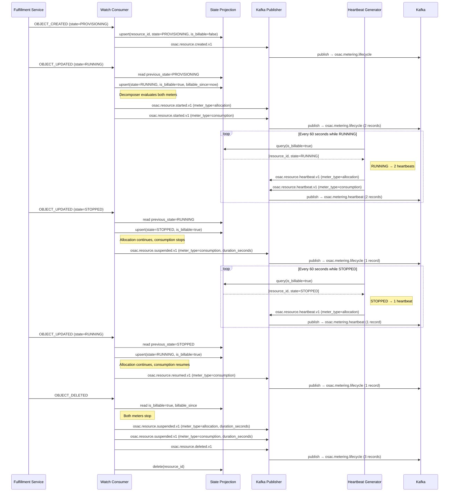
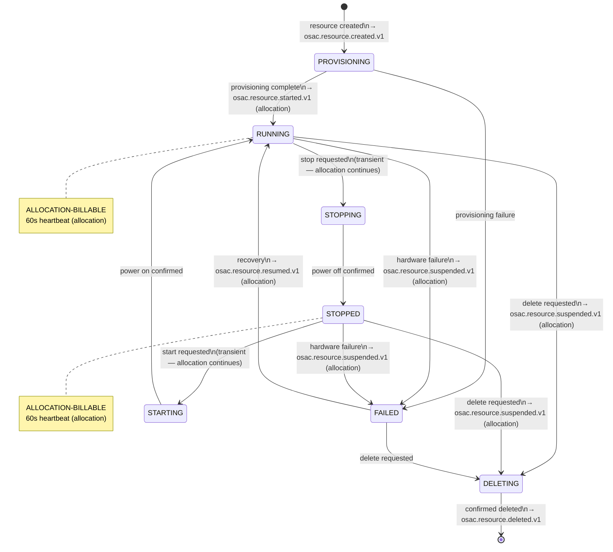
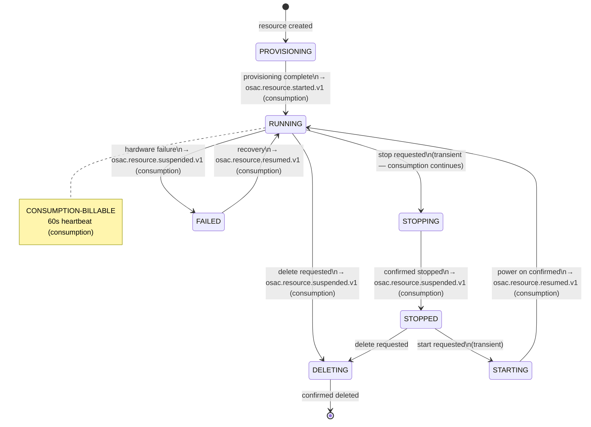

# BMaaS Metering (Part 2a)

## Summary

This design extends the OSAC Metering Service to meter bare metal hosts using a dual-meter event decomposition model: an allocation meter (`host-type-seconds`) that runs from provisioning complete to deletion regardless of power state, and a consumption meter (`bare-metal-compute-seconds`) that runs only while the host is powered on. The design reuses the Part 1 metering infrastructure (Watch Consumer, State Projection, Heartbeat Generator, Reconciliation Loop, Kafka, Provider Adapters) and introduces a per-meter event decomposer that produces independent CloudEvent streams for each meter from a single Watch event. See [PRD](prd.md) for detailed requirements.

## Motivation

Part 1 (OSAC-985) established OSAC metering for VMaaS and CaaS — both consumption-based meters where `IsBillable` maps to a single boolean: `RUNNING` for VMs, `PROGRESSING`/`READY` for clusters. Bare metal hosts have a fundamentally different capacity profile. A bare metal host occupies physical rack space, a power port, and related networking infrastructure from the moment it is provisioned until it is deleted — regardless of whether the tenant has powered it on. This physical capacity commitment has no equivalent in VMaaS (where stopped VMs release compute) or CaaS (where clusters are always running or failed).

The Part 1 design states that "_the canonical event model supports future resource types without architectural changes._" This holds for single-meter resources — adding BMaaS consumption-only metering would follow the exact `ComputeInstance` pattern. The dual-meter model is the exception: the existing single-boolean `IsBillable` projection, the single transition table per resource type, and the single-event-per-transition assumption all require targeted extensions. This design proposes those extensions while preserving backward compatibility with existing VMaaS and CaaS metering.

### Goals

1. **Reuse Part 1 infrastructure** — no new services, Kafka topics, or deployment artifacts; BMaaS metering is a code-level extension of the existing metering-service and adapter framework
2. **Extend, don't replace, the event decomposition pattern** — the CaaS `N+1` per-component decomposer is the precedent; BMaaS adds a per-meter decomposer that produces independent CloudEvent streams with independent event types
3. **Allocation and consumption meters are independently queryable** — each meter has a distinct `meter_type` billing dimension, so downstream systems can filter, aggregate, and price them separately
4. **No fulfillment-service proto changes for metering** — the `BareMetalInstance` Watch stream and Event proto (field 15) already exist; host type resolution uses existing APIs

### Non-Goals

- Storage and networking metering for resources attached to bare metal hosts ([OSAC-3141](https://redhat.atlassian.net/browse/OSAC-3141), [OSAC-3145](https://redhat.atlassian.net/browse/OSAC-3145))
- Usage Query API or tenant-facing usage views
- Costing, billing, or quota enforcement
- Changes to the `BareMetalInstance` provisioning or lifecycle workflow

## Terminology

**Allocation Meter** — A billing stream that tracks capacity commitment for a bare metal host from provisioning complete (`RUNNING`, `STOPPED`, `STARTING`, `STOPPING` states) until deletion. Runs continuously across power cycles. Represents the physical rack space, power port, and networking infrastructure reserved by the provider for the tenant.

**Consumption Meter** — A billing stream that tracks actual compute usage for a bare metal host. Runs only when the host is powered on (`RUNNING` state). Independent of allocation; enables providers to charge separately for reserved capacity vs. active consumption.

**Billable State** — A resource state that incurs metering charges. Distinct per meter: allocation-billable states are `RUNNING`, `STOPPED`, `STARTING`, `STOPPING` (the host is provisioned); consumption-billable state is `RUNNING` only (the host is powered on).

**Transition Table** — A state machine table defining which state transitions trigger meter events (started, suspended, resumed). Independent transition table per meter; evaluated for each Watch event to determine which CloudEvents to produce.

**Event Decomposer** — A function that evaluates multiple transition tables (allocation + consumption) against a single Watch event and produces up to two CloudEvents, each with its own event type and meter-specific billing dimensions. BMaaS decomposer extends the CaaS precedent (N+1 per-component decomposition).

**Meter Type** — A billing dimension (`meter_type`) that discriminates between allocation and consumption events. Enables downstream systems to filter, aggregate, and price each meter independently. Carried in CloudEvent `billing_dimensions`, not as a CloudEvent extension attribute.

**Billing Dimensions** — Structured metadata attached to CloudEvents that describe resource attributes for billing purposes. BMaaS includes: `meter_type` (allocation or consumption), `host_type` (e.g., gpu-a100-8x), `catalog_item` (e.g., bmi-gpu-workstation).

**State Projection** — A PostgreSQL-backed runtime view of resource state. Tracks `IsBillable`, `CurrentState`, `BillableSince`, and per-component billable timestamps (`ComponentBillableSince`). Used by the Heartbeat Generator to determine which resources are metering and the Watch Consumer to detect transitions.

**Watch Event** — A streaming event from the fulfillment-service when a resource's state changes. The Watch Consumer consumes `BareMetalInstance` Watch events, evaluates transition tables, and publishes CloudEvents to Kafka.

**CloudEvent** — A standardized event format (CNCF spec) published to Kafka. BMaaS CloudEvents include: event type (_e.g._, `osac.resource.started.v1`), meter-specific billing dimensions, tenant attribution, resource IDs, and timestamps. Consumed by provider adapters for billing integration.

**Host Type** — The compute profile of a bare metal host (_e.g._, `gpu-a100-8x`, `standard-cpu-64`). Resolved from `BareMetalInstanceTemplate` metadata. Primary pricing dimension for allocation and consumption meters.

## Proposal

The design introduces four changes to the metering-service codebase:

1. `bareMetalInstanceMapper` — a new `ResourceMapper` implementation that extracts metering data from `BareMetalInstance` Watch events, with `IsBillable()` returning allocation-billable (the broader meter)
2. **Dual-meter event decomposer** — a new `EventDecomposer` that evaluates two independent transition tables (allocation and consumption) per Watch event and produces up to two CloudEvents, each with its own CloudEvent type and `meter_type` billing dimension
3. **Extended reconciliation** — a `BareMetalInstancesClient` and loader for the hourly reconciliation loop, with a billability checker that uses the allocation meter's state set
4. **M360 adapter route** — a `/bmaas/event` endpoint that passes the `meter_type` billing dimension through to the M360 Usage API

No new Kafka topics, no State Projection schema changes, no new deployment artifacts. The existing `osac.metering.lifecycle`, `osac.metering.heartbeat`, and `osac.metering.corrections` topics carry BMaaS events alongside VMaaS and CaaS events, differentiated by the `osacresourcetype` extension attribute (`bare_metal_instance`). BMaaS events inherit Part 1's data-availability guarantees: Kafka's 30-day retention provides replay capability, and provider adapters persist usage data for at least 13 months via their respective storage backends.

### Workflow Description

#### BMaaS Host Lifecycle — Dual-Meter Metering

When a Tenant Admin provisions a bare metal host, the Metering Service tracks both meters independently:



Key observations:

- `PROVISIONING` → `RUNNING` produces two `started.v1` events (both meters start simultaneously)
- `RUNNING` → `STOPPED` produces one `suspended.v1` (consumption stops; allocation continues — no event needed)
- `STOPPED` → `RUNNING` produces one `resumed.v1` (consumption resumes; allocation unchanged)
- Deletion produces two `suspended.v1` events (both meters close their intervals) plus one `deleted.v1` (audit)
- Heartbeats vary by state: `RUNNING` produces two (allocation + consumption), `STOPPED`/`STARTING`/`STOPPING` produce one (allocation only)

### API Extensions

The Metering Service introduces no new CRDs, webhooks, or API surfaces. It consumes existing fulfillment-service private APIs:

- `PrivateBareMetalInstancesService.Watch` — already exists; the metering-service's generated proto client includes `BareMetalInstance` types via `Event.bare_metal_instance` (field 15)
- `PrivateBareMetalInstancesService.List` — used by the Reconciliation Loop for drift detection

**CloudEvent changes:** No new extension attributes. The existing `osacresourcetype` carries `bare_metal_instance`. The new `meter_type` value lives in `billing_dimensions`, not as a CloudEvent extension — it is a billing attribute, not an infrastructure routing key.

**Provider Adapter interface:** Unchanged. Adapters receive BMaaS events as standard `MeteringEvent` structs. The M360 adapter adds a `/bmaas/event` route.

## UX Alignment

No `@temp-api` file exists for metering resources in `osac-ux/libs/ui-components/src/api/v1/`. The Metering Service is a backend event pipeline; tenant-facing usage views are a separate design concern (Usage Query API).

### Implementation Details/Notes/Constraints

#### Dual-Meter Event Decomposition

The central architectural extension is a per-meter `EventDecomposer` for BMaaS. Unlike CaaS decomposition (which fans out one event type into `N+1` records with different billing dimensions), BMaaS decomposition fans out one Watch event into up to two records with **different CloudEvent types** and different billing dimensions per meter.

Two independent transition tables define each meter's billing boundaries:

**Allocation transition table** — billable states: `RUNNING`, `STOPPED`, `STARTING`, `STOPPING`

| From           | To                                | Allocation Effect                     |
| -------------  | --------------------------------- | ------------------------------------- |
| "" (initial)   | `PROVISIONING`                    | Skip                                  |
| ""             | `RUNNING`                         | `billableStart`                       |
| ""             | `STOPPED`                         | `billableStart`                       |
| ""             | `STARTING`/`STOPPING`             | Transient                             |
| ""             | `FAILED`/`DELETING`/`UNSPECIFIED` | Skip                                  |
| `PROVISIONING` | `RUNNING`                         | `billableStart`                       |
| `PROVISIONING` | `FAILED`                          | Skip                                  |
| `PROVISIONING` | `DELETING`                        | Skip                                  |
| `RUNNING`      | `STOPPED`                         | Skip (still allocation-billable)      |
| `RUNNING`      | `STOPPING`                        | Transient (still allocation-billable) |
| `RUNNING`      | `STARTING`                        | Transient (still allocation-billable) |
| `RUNNING`      | `FAILED`                          | Suspended                             |
| `RUNNING`      | `DELETING`                        | Suspended                             |
| `STOPPED`      | `RUNNING`                         | Skip (still allocation-billable)      |
| `STOPPED`      | `STARTING`                        | Transient (still allocation-billable) |
| `STOPPED`      | `FAILED`                          | Suspended                             |
| `STOPPED`      | `DELETING`                        | Suspended                             |
| `STARTING`     | `RUNNING`                         | Skip (still allocation-billable)      |
| `STARTING`     | `STOPPED`                         | Skip (still allocation-billable)      |
| `STARTING`     | `FAILED`                          | Suspended                             |
| `STOPPING`     | `STOPPED`                         | Skip (still allocation-billable)      |
| `STOPPING`     | `RUNNING`                         | Skip (still allocation-billable)      |
| `STOPPING`     | `FAILED`                          | Suspended                             |
| `FAILED`       | `RUNNING`                         | `billableStart`                       |
| `FAILED`       | any non-billable                  | Skip                                  |
| `DELETING`     | any                               | Skip                                  |

**Consumption transition table** — billable states: RUNNING only. Structurally identical to the existing `computeInstanceTransitions` table (`RUNNING` is the sole billable state; all transitions into `RUNNING` produce `billableStart`, all transitions out produce `Suspended`).

The decomposer evaluates both tables for each Watch event and produces one CloudEvent per meter that crosses a billing boundary. Transitions where neither meter crosses a boundary (_e.g._, `STOPPED` → `STOPPED`) produce no lifecycle events. The `OBJECT_CREATED` and `OBJECT_DELETED` fixed event types produce a single audit event (no `meter_type` dimension — these are resource-level, not meter-level).

```go
func DecomposeBMIEvents(
    billingDims map[string]any,
    baseID string,
    buildFn EventBuilder,
    allocType string,
    consumType string,
) ([]cloudevents.Event, error)
```

The decomposer receives the resolved CloudEvent types for each meter (or empty string if no boundary). It builds independent events with deterministic IDs: `{baseID}/allocation` and `{baseID}/consumption`.

#### State Projection

The existing `ResourceState` struct is sufficient without schema changes:

| Field                    | BMaaS Usage                                                                                                                                                   |
| ------------------------ | ------------------------------------------------------------------------------------------------------------------------------------------------------------- |
| `IsBillable`             | Allocation-billable (true for `RUNNING`, `STOPPED`, `STARTING`, `STOPPING`)                                                                                   |
| `EverBillable`           | True once the host has ever been allocation-billable                                                                                                          |
| `BillableSince`          | When the allocation meter last started                                                                                                                        |
| `ComponentBillableSince` | `{"consumption": <time>}` — when the consumption meter last started. Reuses the existing per-component timestamp map with a single "consumption" key.         |
| `CurrentState`           | BareMetalInstance state (`PROVISIONING`, `RUNNING`, `STOPPED`, _etc._)                                                                                        |
| `BillingDimensions`      | Host type, catalog item, and other BMaaS-specific dimensions                                                                                                  |

The consumption meter's `duration_seconds` on `suspended.v1` events is computed from `ComponentBillableSince["consumption"]`. The allocation meter uses `BillableSince` as existing resources do.

`ListBillable()` returns BMaaS resources that are allocation-billable. The heartbeat decomposer checks `CurrentState` to determine whether to produce one heartbeat (allocation only, for `STOPPED`/`STARTING`/`STOPPING`) or two (allocation + consumption, for `RUNNING`).

#### Host Type Resolution

The PRD's primary metering dimension is host type. The resolution chain from BareMetalInstance to host type:

```
BareMetalInstance
  → spec.catalog_item (BareMetalInstanceCatalogItemReference)
    → BareMetalInstanceCatalogItem
      → template (BareMetalInstanceTemplateReference)
        → BareMetalInstanceTemplate
          → host_type (string, references HostType)
```

The Watch stream delivers the full BareMetalInstance payload, which includes `spec.catalog_item` as a reference (name/id) — not the resolved `CatalogItem`, `Template`, or `HostType` objects. Two resolution approaches, in preference order:

**Approach A (recommended): Template cache in metering-service.** The metering-service maintains an in-memory cache of `template_id → host_type` mappings, populated on startup via `PrivateBareMetalInstanceTemplatesService.List` and refreshed hourly during reconciliation. Cache misses trigger a synchronous `Get` call. This adds no fulfillment-service proto changes and the template→`host_type` mapping is stable (templates are admin-managed and rarely change).

**Approach B (future optimization): Denormalized host_type.** The fulfillment-service denormalizes `host_type` onto `BareMetalInstanceStatus` or as a resolved spec field, making it directly available in the Watch payload. This eliminates the cache but requires a fulfillment-service change.

The mapper extracts billing dimensions including `host_type`:

```go
func BareMetalInstanceBillingDimensions(bmi *privatev1.BareMetalInstance, hostType string) map[string]any {
    dims := map[string]any{
        "host_type": hostType,
    }
    if spec := bmi.GetSpec(); spec != nil {
        if ci := spec.GetCatalogItem(); ci != nil {
            dims["catalog_item"] = ci.GetName()
        }
    }
    return dims
}
```

#### BMaaS Billing Dimensions

BMaaS CloudEvents carry the following billing dimensions. Each event includes a `meter_type` discriminator:

**Lifecycle and heartbeat events:**

```json
{
  "meter_type": "allocation",
  "host_type": "gpu-a100-8x",
  "catalog_item": "bmi-gpu-workstation"
}
```

```json
{
  "meter_type": "consumption",
  "host_type": "gpu-a100-8x",
  "catalog_item": "bmi-gpu-workstation"
}
```

The `meter_type` discriminator enables downstream systems to filter and price each meter independently. The `host_type` is the primary pricing dimension (analogous to `instance_type` for VMaaS). The `catalog_item` supports the PRD's queryability requirement (_CAP-3_).

Base event fields (`tenant_id`, `project_id`, `catalog_item_id`, `template_id`) are populated from the BareMetalInstance metadata and spec, following the same pattern as ComputeInstance.

#### BMaaS State Machine — Allocation Meter



Allocation-billable states: `RUNNING`, `STOPPED`, `STARTING`, `STOPPING`. The meter runs continuously across power cycles. Only `FAILED` and `DELETING` stop it.

#### BMaaS State Machine — Consumption Meter



Consumption-billable state: `RUNNING` only. Structurally identical to the VMaaS `ComputeInstance` pattern.

#### Reconciliation

The Reconciler gains a `BareMetalInstancesClient` interface and `loadBareMetalInstances()` method, following the existing `loadComputeInstances()` and `loadClusters()` patterns:

```go
type BareMetalInstancesClient interface {
    List(ctx context.Context, in *privatev1.BareMetalInstancesListRequest,
        opts ...grpc.CallOption) (*privatev1.BareMetalInstancesListResponse, error)
}
```

The `billabilityCheckers` map gains an entry for `bare_metal_instance` that returns true for allocation-billable states (`RUNNING`, `STOPPED`, `STARTING`, `STOPPING`).

Reconciliation corrections for BMaaS resources use the same decomposer as the Watch Consumer — a state drift correction that moves from `RUNNING` to `STOPPED` produces a consumption `suspended.v1` correction but no allocation correction.

**Reconciliation Interval:** Each hour, the reconciliation loop queries the fulfillment-service's `PrivateBareMetalInstancesService.List` API and compares the returned state against the State Projection. Any drift (missed creations, state mismatches, missing deletions) triggers correction events. The 60-minute interval is configurable via the `metering.reconciliation_interval_seconds` Helm value (default: 3600).

**Startup Reconciliation:** On metering-service startup, reconciliation runs immediately before the Watch Consumer resumes, seeding the projection with current BareMetalInstance state from fulfillment. This ensures no gap between startup and Watch event receipt.

#### Heartbeat Generation

The heartbeat decomposer for BMaaS checks `ResourceState.CurrentState`:


| State      | Heartbeat Events            |
| ---------- | --------------------------- |
| `RUNNING`  | 2: allocation + consumption |
| `STOPPED`  | 1: allocation only          |
| `STARTING` | 1: allocation only          |
| `STOPPING` | 1: allocation only          |

Each heartbeat carries its own `meter_type` in billing dimensions and a deterministic event ID: `{base-hb-id}/allocation` and `{base-hb-id}/consumption`.

#### M360 Adapter

The M360 adapter adds a `/bmaas/event` route alongside the existing `/vmaas/event`, `/caas/event`, and `/maas/event` routes. BMaaS events are translated to M360's flat payload format with `meter_type` passed through as a field. The M360 API treats allocation and consumption events identically — the `meter_type` is metadata for M360's own aggregation and pricing logic.

The echo adapter requires no changes — it stores all CloudEvents by ID regardless of resource type.

#### Parent-Child Attribution

The PRD requires storage volumes and public IPs attached to a bare metal host to be queryable as a unified usage view (_CAP-5_ acceptance criterion). This is handled by the `billing_dimensions` model established in Part 1: each subsidiary resource (`StorageVolume`, `ExternalIP`) carries a `parent_resource_id` in its billing dimensions pointing to the `BareMetalInstance`. The actual storage and networking metering implementation is deferred to [OSAC-3141](https://redhat.atlassian.net/browse/OSAC-3141) and [OSAC-3145](https://redhat.atlassian.net/browse/OSAC-3145). This design establishes the parent side of the relationship by including the `BareMetalInstance`'s `resource_id` in all its CloudEvents (already present as the base field), which subsidiary resources reference.

### Security Considerations

BMaaS metering inherits the existing security model without changes:

- The metering-service consumes the fulfillment-service **private** Watch stream, authenticated via mTLS (Kubernetes service mesh). No new authentication paths are introduced.
- Tenant isolation is enforced by the fulfillment-service's OPA policies — the metering-service receives all BareMetalInstance events across tenants and attributes them via `tenant_id` from the resource's metadata. The metering-service itself performs no authorization checks; it is a trusted internal consumer.
- CloudEvents published to Kafka carry `osactenant` extension attributes for downstream tenant-scoped filtering.
- No sensitive data is added to CloudEvents beyond what Part 1 already exposes (resource IDs, tenant IDs, states, billing dimensions).

### Failure Handling and Recovery


| Failure Mode                                    | Effect                                                              | Recovery                                                                                                                                                                | User Observation                                                                  |
| ----------------------------------------------- | ------------------------------------------------------------------- | ----------------------------------------------------------------------------------------------------------------------------------------------------------------------- | --------------------------------------------------------------------------------- |
| Watch stream disconnect                         | Missed BareMetalInstance transitions                                | Hourly reconciliation detects state drift and emits corrections. Startup reconciliation runs before Watch Consumer resumes.                                             | Brief gap in per-second accuracy (up to 60 min); corrected in next reconciliation |
| Template cache miss (`host_type` unresolvable)    | `BareMetalInstance` event produced with empty `host_type`             | Logged as warning; cache refresh on next reconciliation picks up the template. Adapter receives the event with missing dimension.                                       | Host type attribution may be missing for up to one reconciliation interval        |
| Kafka publish failure                           | Events buffered in metering-service; backpressure on Watch Consumer | Kafka producer retries with exponential backoff. If Kafka is unavailable for extended period, events accumulate in memory and reconciliation catches up after recovery. | Delayed event availability for downstream consumers                               |
| Reconciliation detects missed BareMetalInstance | Resource was created but Watch event was lost                       | Reconciliation emits `correction.v1 (reason=missed_creation)` and seeds the projection                                                                                  | Downstream system receives correction with adjusted interval                      |
| Metering-service restart mid-lifecycle          | In-memory state projection lost                                     | PostgreSQL-backed projection survives restarts. Startup reconciliation reconciles any gap between last projected state and current fulfillment state.                   | No user-visible impact beyond momentary heartbeat gap                             |

### RBAC / Tenancy

No RBAC or tenancy changes required. BMaaS metering is a backend pipeline that reads from the fulfillment-service private API, which already enforces tenant isolation via OPA. The metering-service is a cluster-scoped internal service, not tenant-facing. All CloudEvents carry `tenant_id` for downstream attribution.

### Observability and Monitoring

New Prometheus metrics for BMaaS metering:


| Metric                                          | Type    | Labels                     | Description                                          |
| ----------------------------------------------- | ------- | -------------------------- | ---------------------------------------------------- |
| `osac_metering_bmi_events_total`                | Counter | `meter_type`, `event_type` | BMaaS lifecycle events produced, by meter and type   |
| `osac_metering_bmi_heartbeats_total`            | Counter | `meter_type`               | BMaaS heartbeat events produced, by meter            |
| `osac_metering_bmi_template_cache_misses_total` | Counter | —                          | Template cache misses during `host_type` resolution  |
| `osac_metering_bmi_template_cache_size`         | Gauge   | —                          | Current template cache size                          |


Existing metrics (`osac_metering_reconciliation_corrections_total`, `osac_metering_reconciliation_duration_seconds`) gain `bare_metal_instance` as a new `resource_type` label value. No new alerts — existing reconciliation and Kafka health alerts cover BMaaS.

### Risks and Mitigations


| Risk                                                                                                                                           | Mitigation                                                                                                                                                                                                                                                                      |
| ---------------------------------------------------------------------------------------------------------------------------------------------- | ------------------------------------------------------------------------------------------------------------------------------------------------------------------------------------------------------------------------------------------------------------------------------- |
| **Dual-meter decomposition complexity** — the per-meter decomposer is a novel pattern not used by VMaaS or CaaS, increasing maintenance burden | The decomposer is self-contained in `bare_metal_instance.go` and isolated behind the `EventDecomposer` interface. Unit tests cover all (from, to, meter) combinations via the two transition tables.                                                                            |
| **Template cache staleness** — host_type resolution depends on cached template data that could become stale if templates are updated           | Templates are admin-managed and rarely change. The cache refreshes hourly during reconciliation. A cache miss triggers a synchronous lookup, so the worst case is one missed dimension per new template until the cache refreshes.                                              |
| **OSAC-1201 dependency** — host types must be defined before BMaaS metering is useful                                                          | [OSAC-1201](https://redhat.atlassian.net/browse/OSAC-1201) EP is complete ([PR #119](https://github.com/osac-project/enhancement-proposals/pull/119)). `BareMetalInstanceTemplate` and `HostType` protos already exist in the codebase. This is a blocking dependency — without host types, the primary metering dimension is empty. |
| **Part 1 not yet deployed** — BMaaS metering depends on the metering-service infrastructure from OSAC-985                                      | Part 1 design is complete; implementation is in progress. BMaaS metering code can be developed in parallel but cannot be deployed or tested end-to-end until Part 1 infrastructure is operational.                                                                              |


### Drawbacks

The dual-meter decomposition pattern introduces a precedent: a single OSAC resource producing multiple independent billing streams from one Watch event. This is architecturally clean but increases the surface area of the event decomposition layer. Future resource types with multi-meter requirements (_e.g._, GPU instances with allocation + compute + memory meters) would follow this pattern, which could lead to combinatorial growth in transition table coverage.

The alternative — treating each meter as a fully independent virtual resource with its own projection row — would be structurally simpler per-meter but would double the projection store size for BMaaS resources and require changes to the Store interface (composite keys instead of resource ID alone). The decomposition approach was chosen because it preserves the 1:1 resource→projection invariant and reuses the existing CaaS decomposition machinery.

## Alternatives (Not Implemented)

### A1: Two Projection Rows per Resource

Treat allocation and consumption as independent virtual resources: `bare_metal_instance:allocation:{id}` and `bare_metal_instance:consumption:{id}`, each with its own `ResourceState` row, `IsBillable`, and heartbeat cycle.

**Pros:** Each meter is fully independent; no decomposer needed; heartbeat generator works without state inspection.
**Cons:** Doubles projection store size for BMaaS; breaks the 1:1 resource ID → projection row assumption used by reconciliation, missed-deletion detection, and stale-version checks; requires Store interface changes for composite keys; `ListBillable()` would return two rows per host in RUNNING state.
**Rejected because:** The projection schema change would ripple through the reconciler, heartbeat generator, and Watch Consumer for all resource types, not just BMaaS.

### A2: Single Transition Table with Union Boundaries

Use one transition table where every row that crosses a boundary for either meter produces an event, and embed both meters' effects in the `TransitionResult`:

```go
type TransitionResult struct {
    AllocationEventType  string
    ConsumptionEventType string
    Transient            bool
    Skip                 bool
}
```

**Pros:** Single table, explicit per-transition effect for both meters.
**Cons:** Changes the `TransitionResult` struct used by all resource types (VMaaS, CaaS); requires adapting `resolveTransition()` and all callers.
**Rejected because:** Modifying shared types forces changes in VMaaS and CaaS code paths that have no dual-meter requirement.

### A3: Consumption-Only Metering (Single Meter)

Meter BMaaS like VMaaS — `RUNNING` only. Drop the allocation meter.

**Pros:** Zero architectural changes; exact ComputeInstance pattern.
**Cons:** Does not meet PRD requirements. The allocation meter (_CAP-1_) is the primary requirement — providers need to track capacity commitment for physically reserved hardware regardless of power state.
**Rejected because:** Fails to meet the PRD.

## Open Questions

### 1. FAILED State Allocation Billability

The PRD lists allocation-billable states as "`RUNNING`, `STOPPED`, `STARTING`, `STOPPING`" — `FAILED` is not listed. This design treats `FAILED` as non-allocation-billable (the hardware has a fault and may be reclaimed by the provider). If the intent is for `FAILED` hosts to remain allocation-billable until explicit deletion, the allocation transition table and billability checker must be updated.

**Owner:** PRD author ([masayag@redhat.com](mailto:masayag@redhat.com))
**Impact:** Allocation transition table, `IsAllocationBillableState()` function, reconciliation billability checker

### 2. state_transition_time Availability for BMaaS

**STATUS: REQUIRED but NOT YET IMPLEMENTED** — `BareMetalInstanceStatus` does not currently have a `state_transition_time` field, despite it being present on ComputeInstanceStatus and ClusterStatus.

The Part 1 design flags `status.state_transition_time` as a P1 prerequisite for sub-minute billing accuracy. If `state_transition_time` is not populated on `BareMetalInstanceStatus`, the metering-service falls back to event receipt time (typically sub-second but not guaranteed). For production billing accuracy matching Part 1's guarantees (_CAP-5_), `state_transition_time` must be added to the proto and populated by the BareMetalInstance controller whenever the state changes.

**Interim Mitigation:** The metering mapper can implement `TransitionTime()` to use event receipt time as a fallback, degrading accuracy by at most one second (time between state change and Kafka publication). This is acceptable for MVP but should be upgraded once `state_transition_time` is available.

**Owner:** Platform team (`BareMetalInstance` controller)
**Required Action:** Add `optional google.protobuf.Timestamp state_transition_time` to `BareMetalInstanceStatus` proto. Populate it whenever the state transitions. Follow the pattern in ComputeInstanceStatus.
**Impact:** `TransitionTime()` implementation in the BMaaS mapper; billing accuracy guarantee (_CAP-5_)

## Test Plan

### Unit Tests

- `bareMetalInstanceMapper` extracts resource type, ID, tenant, project, catalog item, template ID, and state from a `BareMetalInstance` proto
- `BareMetalInstanceBillingDimensions()` populates `host_type` and `catalog_item` from the template cache
- `IsAllocationBillableState()` returns true for `RUNNING`, `STOPPED`, `STARTING`, `STOPPING`; false for `PROVISIONING`, `FAILED`, `DELETING`, `UNSPECIFIED`
- `IsConsumptionBillableState()` returns true for `RUNNING` only
- Allocation transition table covers all (from, to) state pairs with correct billing effect
- Consumption transition table covers all (from, to) state pairs (identical to ComputeInstance pattern)
- `DecomposeBMIEvents()` produces 0, 1, or 2 events per transition based on meter boundary crossings:
  - `PROVISIONING → RUNNING: 2 events (allocation started + consumption started)
  - `RUNNING` → `STOPPED`: 1 event (consumption suspended)
  - `STOPPED` → `RUNNING`: 1 event (consumption resumed)
  - `RUNNING` → `DELETING`: 2 events (allocation suspended + consumption suspended)
  - `STOPPED` → `DELETING`: 1 event (allocation suspended)
  - `STOPPED` → `STOPPED`: 0 events
- Heartbeat decomposer produces 2 heartbeats for `RUNNING`, 1 for `STOPPED`/`STARTING`/`STOPPING`
- Template cache populates on startup via List API and resolves host_type on cache hit
- Template cache miss triggers synchronous Get call and caches result
- Reconciliation billability checker uses allocation-billable states
- Correction event decomposer produces per-meter corrections matching the state drift direction

### Integration Tests

- Reconciliation detects a `BareMetalInstance` present in fulfillment but missing from projection and emits `missed_creation` correction with correct allocation billability
- Reconciliation detects state drift (projection has `RUNNING`, fulfillment has `STOPPED`) and emits correction events for the consumption meter only (allocation is still billable in both states)
- Reconciliation detects a BareMetalInstance in projection but absent from fulfillment and emits `missed_deletion` correction
- Stale heartbeat detection generates synthetic heartbeats for allocation-billable BMaaS resources with correct meter decomposition

### E2E Tests

- Full BMaaS lifecycle: create host → wait for `RUNNING` → verify allocation and consumption events in echo adapter → stop host → verify consumption suspended, allocation heartbeats continue → start host → verify consumption resumed → delete host → verify both meters suspended
- Verify echo adapter stores events with correct `meter_type` billing dimension
- Verify event `duration_seconds` accuracy: stop a host after a known interval and assert the consumption `suspended.v1` event's `duration_seconds` is within tolerance

## Graduation Criteria

Graduation criteria will be defined when targeting a release. Expected stages: Dev Preview → Tech Preview → GA based on production deployment feedback and Part 1 metering infrastructure maturity.

## Upgrade / Downgrade Strategy

This is a new metering capability with no upgrade impact on existing VMaaS/CaaS metering. The metering-service binary gains BMaaS support — on upgrade, it begins consuming BareMetalInstance Watch events and producing CloudEvents. On downgrade, BMaaS events stop being produced; no cleanup is needed since Kafka topics are shared and BMaaS events are differentiated by `osacresourcetype`.

The State Projection schema does not change — `ComponentBillableSince` is an existing JSONB column that gains a `"consumption"` key for BMaaS resources. Downgrade leaves orphaned `"consumption"` keys in the JSONB column, which are harmless (ignored by VMaaS/CaaS code paths).

## Version Skew Strategy

The metering-service is a standalone deployment — it does not run alongside a previous version during upgrades. The fulfillment-service Watch stream is backward-compatible (new event payload types are additive). If the metering-service is upgraded before the fulfillment-service has BareMetalInstance support, the metering-service simply receives no BareMetalInstance events (Watch subscription is filtered by resource type). No coordination is required beyond ensuring the fulfillment-service includes BareMetalInstance in its Watch stream.

## Support Procedures

**Detecting BMaaS metering failures:**

- `osac_metering_bmi_events_total` flatlines while `BareMetalInstance` lifecycle changes are occurring → Watch Consumer is not receiving BMaaS events
- `osac_metering_bmi_template_cache_misses_total` increasing → template cache is stale or templates are missing; check `PrivateBareMetalInstanceTemplatesService.List` connectivity
- `osac_metering_reconciliation_corrections_total{resource_type="bare_metal_instance"}` consistently > 0 → Watch Consumer is missing events; investigate Watch stream connectivity

**Disabling BMaaS metering:** Remove `bare_metal_instance` from the metering-service's Watch subscription filter (configurable via Helm values). Existing BMaaS projection rows remain in PostgreSQL but are cleaned up by the next reconciliation cycle (missed_deletion). No impact on VMaaS/CaaS metering.

**Re-enabling:** Restore the Watch subscription filter. Startup reconciliation seeds the projection with current BareMetalInstance state. Brief gap until reconciliation completes; heartbeats resume immediately after.

## Infrastructure Needed

None. BMaaS metering uses existing infrastructure: metering-service binary, Kafka topics, PostgreSQL State Projection, and Provider Adapter framework.
