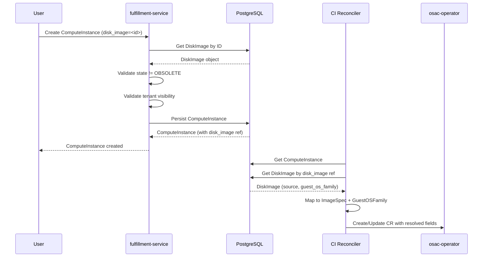

# DiskImage

## Summary

This design introduces a DiskImage resource to the fulfillment-service. DiskImage wraps OCI artifact references with curated metadata — guest OS family, architecture, and lifecycle state — providing a discoverable image catalog for VM provisioning. ComputeInstance replaces its inline image fields with a DiskImage reference (required after template/catalog item defaults are applied). ComputeInstanceTemplate and ComputeInstanceCatalogItem provide optional DiskImage defaults. Deletion protection prevents removing images that are still referenced by active resources. API reference documentation and user guide for DiskImage operations are in scope for this milestone. See [PRD](prd.md) for detailed requirements.

## Motivation

ComputeInstances currently reference images via raw OCI URLs embedded in `ComputeInstanceImage` (source type + source reference), with OS type tracked as a boolean `is_windows` flag. This creates several problems for production use:

- **No discoverability.** Users must know exact OCI references and registry tooling. There is no searchable catalog of available images, no filtering by OS family or architecture, and no human-readable metadata.

- **No governance.** Any OCI URL can be used. Provider admins cannot curate approved images, deprecate outdated ones, or block usage of images with known issues. Tenant admins cannot maintain organization-specific image catalogs.

- **Inconsistent OS representation.** The API uses `is_windows: bool` while the CRD uses `GuestOSFamily: string`. Adding a third OS family (or any future differentiation) requires changing every consumer. The boolean provides no room for extension.

- **Duplicated configuration.** Every ComputeInstance and ComputeInstanceTemplate carries its own image fields. With inline image fields, every new ComputeInstance must specify the same raw OCI reference independently. There is no single place to define an image once and reference it from multiple instances.

A DiskImage resource centralizes image metadata, provides a catalog for discovery, enables lifecycle management (deprecation, obsolescence), and gives the platform a single point of control for image governance.

### Goals

- Reuse the InstanceType lifecycle pattern (AVAILABLE/DEPRECATED/OBSOLETE with bidirectional transitions) for DiskImage state management.
- Keep the osac-operator CRD unchanged; fulfillment-service resolves DiskImage references to ImageSpec and GuestOSFamily before creating the Kubernetes CR.
- Enforce deletion protection via bidirectional database triggers (following the InstanceType pattern) that prevent soft-deleting a DiskImage still referenced by active ComputeInstances, ComputeInstanceTemplates, or ComputeInstanceCatalogItems.
- Support two-tier visibility (provider-global and tenant-scoped) using the existing tenant field in Metadata.

### Non-Goals

- Image upload API (binary upload through OSAC) -- images are registered by OCI reference, not uploaded.
- Image caching, CDI DataImportCron integration, or golden image pipeline automation.
- Private registry credential management (pull secrets).
- BareMetalInstance DiskImage integration (follow-up under OSAC-1270).

## Proposal

This design adds a new DiskImage resource to the fulfillment-service with full CRUD operations, modifies ComputeInstance and ComputeInstanceTemplate to reference DiskImage by ID instead of inline image fields, and adds deletion protection logic to the DiskImage server.

DiskImage follows the standard OSAC object shape (`id`, `Metadata`, `DiskImageSpec`, `DiskImageStatus`) and reuses the InstanceType lifecycle state machine for deprecation and obsolescence management. The `source` and `guest_os_family` fields on DiskImageSpec are immutable after creation. Display name and description come from shared Metadata (OSAC-2921).

On ComputeInstance, the `image` field (ComputeInstanceImage) and `is_windows` field are replaced by a `disk_image` string reference. The reconciler resolves the DiskImage at reconciliation time, extracts `source` and `guest_os_family`, and maps them to the existing CRD ImageSpec and GuestOSFamily fields. The osac-operator is unchanged.

### Workflow Description

#### Registering a DiskImage

**Actor:** Cloud Provider Admin (global images) or Tenant Admin (tenant-scoped images)

1. Admin calls `DiskImages/Create` with the DiskImage object containing `spec.source`, `spec.guest_os_family`, and `spec.architecture`.
2. Server validates required fields, sets `spec.state` to `DISK_IMAGE_STATE_AVAILABLE` if unspecified, persists the object, and returns it with system-generated `id` and `metadata`.
3. For global images, `metadata.tenant` is empty. For tenant-scoped images, the server sets `metadata.tenant` from the caller's identity.

#### Creating a ComputeInstance with DiskImage

**Actor:** Tenant User



The diagram shows the two-phase flow: the API validates the DiskImage reference and persists the ComputeInstance, then the reconciler resolves the DiskImage to CRD-level fields when creating the Kubernetes resource. This keeps the CRD unchanged and concentrates DiskImage logic in the fulfillment-service.

1. User calls `ComputeInstances/Create` with `spec.disk_image` set to a DiskImage ID (directly or via template/catalog item defaults).
2. Server applies template/catalog item defaults for `disk_image` if not provided by the user.
3. Server validates `disk_image` is set (required field) — return `InvalidArgument` if missing.
4. Server fetches the referenced DiskImage and validates:
   - DiskImage exists and is visible to the caller's tenant (global or same tenant).
   - DiskImage state is not OBSOLETE. If DEPRECATED, creation proceeds with a warning in the response.
5. Server persists the ComputeInstance with the `disk_image` reference.
6. Reconciler fetches the referenced DiskImage, extracts `source` and `guest_os_family`, maps them to CRD `ImageSpec` and `GuestOSFamily`, and creates the KubeVirt VirtualMachine CR.

#### Deprecating and Obsoleting a DiskImage

**Actor:** Cloud Provider Admin or Tenant Admin (for their own images)

1. Admin calls `DiskImages/Update` setting `spec.state` to `DISK_IMAGE_STATE_DEPRECATED` and optionally setting `spec.deprecation.replacement` to the ID of a recommended replacement DiskImage.
2. Server auto-sets `spec.deprecation.deprecation_timestamp` to the current time.
3. Deprecated images remain usable for new VM creation but are flagged in listings.
4. Admin later calls `DiskImages/Update` setting `spec.state` to `DISK_IMAGE_STATE_OBSOLETE`.
5. Server auto-sets `spec.deprecation.obsolescence_timestamp`.
6. Obsolete images are excluded from default list results (retrievable via explicit filter `this.spec.state == 3`) and block new ComputeInstance creation.

#### Reactivating a DiskImage

Admin calls `DiskImages/Update` setting `spec.state` back to `DISK_IMAGE_STATE_AVAILABLE`. Server clears the `spec.deprecation` field. The DiskImage becomes fully available again. [Locked: D4]

#### Deleting a DiskImage

1. Admin calls `DiskImages/Delete` with the DiskImage ID.
2. Server delegates to the generic server for soft-deletion (sets `deletion_timestamp`).
3. The `BEFORE UPDATE` trigger on `disk_images` fires and queries `compute_instances`, `compute_instance_templates`, and `compute_instance_catalog_items` for active references.
4. If any references exist, the trigger raises an exception (SQLSTATE `Z0003`), which the DAO translates to `FailedPrecondition` with a message identifying the referencing resource.
5. If no references exist, the soft-delete proceeds.

### API Extensions

**New gRPC service:** `DiskImages` in the fulfillment-service public and private APIs, with standard CRUD methods (Create, List, Get, Update, Delete) plus Signal (private only).

**Modified gRPC messages:**
- `ComputeInstanceSpec`: new `disk_image` field replaces `image` (ComputeInstanceImage) and `is_windows`.
- `ComputeInstanceTemplateSpecDefaults`: new `disk_image` field (optional) replaces `image` and `is_windows`. CatalogItems can also set `disk_image` defaults via `field_definitions`.

**No CRD changes.** The osac-operator continues to receive resolved `ImageSpec` and `GuestOSFamily` values from the fulfillment-service reconciler.

**No webhooks or finalizers.** DiskImage is an API-only resource with no Kubernetes representation. Deletion protection is enforced via bidirectional database triggers.

If the fulfillment-service is down, DiskImage CRUD is unavailable. Existing ComputeInstances already provisioned are unaffected because the KubeVirt VMs are running independently.

## UX Alignment

No `@temp-api` file exists at `osac-ux/libs/ui-components/src/api/v1/disk-image.ts`. The UI will generate types from the proto definitions after this feature lands. The ComputeInstance `@temp-api` does not currently reference disk image fields because it uses the existing `image` and `is_windows` pattern.

Once `pnpm gen-types` runs against the updated protos, the UI migration will involve:
- New DiskImage list/detail/picker components
- Replacing `image` and `is_windows` fields with `disk_image` reference in compute instance creation flows

### Implementation Details/Notes/Constraints

#### Proto Schema: DiskImage

```protobuf
// disk_image_type.proto

// Lifecycle states for DiskImage resources.
enum DiskImageState {
  DISK_IMAGE_STATE_UNSPECIFIED = 0;
  DISK_IMAGE_STATE_AVAILABLE = 1;
  DISK_IMAGE_STATE_DEPRECATED = 2;
  DISK_IMAGE_STATE_OBSOLETE = 3;
}

// Guest operating system family.
enum GuestOSFamily {
  GUEST_OS_FAMILY_UNSPECIFIED = 0;
  GUEST_OS_FAMILY_LINUX = 1;
  GUEST_OS_FAMILY_WINDOWS = 2;
}

// CPU architecture.
enum Architecture {
  ARCHITECTURE_UNSPECIFIED = 0;
  ARCHITECTURE_AMD64 = 1;
  ARCHITECTURE_ARM64 = 2;
  ARCHITECTURE_S390X = 3;
}

// Deprecation details for a DiskImage.
message DiskImageDeprecation {
  // Suggested replacement DiskImage ID.
  string replacement = 1;

  // When deprecation was announced. Auto-set on transition to DEPRECATED.
  google.protobuf.Timestamp deprecation_timestamp = 2;

  // When the image becomes or became obsolete. Auto-set on transition to OBSOLETE.
  google.protobuf.Timestamp obsolescence_timestamp = 3;
}

// A disk image wraps an OCI artifact reference with curated metadata for VM provisioning.
message DiskImage {
  string id = 1;
  Metadata metadata = 2;
  DiskImageSpec spec = 3;
  DiskImageStatus status = 4;
}

// Desired configuration for a DiskImage.
message DiskImageSpec {
  // OCI artifact reference (e.g., "quay.io/containerdisks/fedora:41"). Immutable after creation.
  string source = 1 [(buf.validate.field).string.min_len = 1];

  // Guest operating system family. Immutable after creation.
  GuestOSFamily guest_os_family = 2 [(buf.validate.field).enum.defined_only = true];

  // Supported CPU architectures. Informational metadata for filtering and discovery.
  repeated Architecture architecture = 3 [(buf.validate.field).repeated = {min_items: 1, items: {enum: {defined_only: true}}}];

  // Lifecycle state of the image.
  DiskImageState state = 4;

  // Deprecation details. Only meaningful when state is DEPRECATED or OBSOLETE.
  DiskImageDeprecation deprecation = 5;
}

// System-provided status. Currently empty; reserved for future use.
message DiskImageStatus {}
```

Key design points:

- `DiskImageState` follows the InstanceType lifecycle pattern. `DiskImageDeprecation` aligns with the ClusterVersion pattern — state lives only in `DiskImageSpec.state` (no duplication in the deprecation message), while `replacement`, `deprecation_timestamp`, and `obsolescence_timestamp` provide deprecation metadata. [Codebase: cluster_version_type.proto, instance_type_type.proto]
- `GuestOSFamily` is a shared enum (defined in its own file) replacing the `is_windows` boolean. It uses the standard OSAC enum naming convention with `_UNSPECIFIED = 0`.
- `source` and `guest_os_family` are required on create and immutable after creation. Immutability is enforced in the server's Update handler by rejecting changes to these fields. `architecture` remains mutable to accommodate changes in the underlying image (e.g., mutable OCI tags where the image transitions from single-arch to multi-arch). [Locked: D2]
- `architecture` is a `repeated Architecture` enum. Values: `ARCHITECTURE_AMD64`, `ARCHITECTURE_ARM64`, `ARCHITECTURE_S390X`. At least one value is required. Proto-level `defined_only` validation replaces the need for a server-side allowlist.
- `state` defaults to `DISK_IMAGE_STATE_AVAILABLE` when unspecified on create.

#### Proto Schema: DiskImages Service

```protobuf
// disk_images_service.proto

service DiskImages {
  rpc List(DiskImagesListRequest) returns (DiskImagesListResponse) {
    option (google.api.http) = {get: "/api/fulfillment/v1/disk_images"};
  }

  rpc Get(DiskImagesGetRequest) returns (DiskImagesGetResponse) {
    option (google.api.http) = {
      get: "/api/fulfillment/v1/disk_images/{id}"
      response_body: "object"
    };
  }

  rpc Create(DiskImagesCreateRequest) returns (DiskImagesCreateResponse) {
    option (google.api.http) = {
      post: "/api/fulfillment/v1/disk_images"
      body: "object"
      response_body: "object"
    };
  }

  rpc Update(DiskImagesUpdateRequest) returns (DiskImagesUpdateResponse) {
    option (google.api.http) = {
      patch: "/api/fulfillment/v1/disk_images/{object.id}"
      body: "object"
      response_body: "object"
    };
  }

  rpc Delete(DiskImagesDeleteRequest) returns (DiskImagesDeleteResponse) {
    option (google.api.http) = {delete: "/api/fulfillment/v1/disk_images/{id}"};
  }
}
```

Request and response messages follow the standard pattern (see API.md). The private API additionally declares a `Signal` method with no REST transcoding.

> **Note:** All type and service definitions must be duplicated for both public (`proto/public/osac/public/v1/`) and private (`proto/private/osac/private/v1/`) APIs.

#### Proto Schema: ComputeInstance Changes

```protobuf
// compute_instance_type.proto — modified fields only

message ComputeInstanceSpec {
  // ... existing fields 1-3 unchanged ...

  // Field 4 (image) removed — replaced by disk_image.
  reserved 4;
  reserved "image";

  // ... existing fields 5-15 unchanged ...

  // Field 16 (is_windows) removed — guest OS family now on DiskImage.
  reserved 16;
  reserved "is_windows";

  // ... existing field 17 (instance_type) unchanged ...

  // Reference to a DiskImage. Required for VM creation. The server resolves
  // the DiskImage's source and guest_os_family at reconciliation time.
  optional string disk_image = 18;
}
```

The `ComputeInstanceImage` message is no longer used by ComputeInstance and can be removed once no other resource references it.

`ComputeInstancesCreateResponse` already has a `repeated string warnings` field (used for InstanceType deprecation notices). DiskImage reuses this field to convey non-fatal conditions (e.g., referencing a DEPRECATED DiskImage with replacement hint).

#### Proto Schema: ComputeInstanceTemplate Changes

```protobuf
// compute_instance_template_type.proto — modified fields only

message ComputeInstanceTemplateSpecDefaults {
  // Fields 1-2 already reserved (cores, memory_gib).

  // Field 3 (image) removed — replaced by disk_image.
  reserved 3;
  reserved "image";

  // Field 4 (boot_disk) unchanged.
  // Field 5 (run_strategy) unchanged.
  // Field 6 (instance_type) unchanged.

  // Field 7 (is_windows) removed — guest OS family now on DiskImage.
  reserved 7;
  reserved "is_windows";

  // Default DiskImage reference for instances created from this template.
  optional string disk_image = 8;
}
```

#### Database Migration (82)

Migration `82_create_disk_images_table.up.sql` creates the `disk_images` table following the standard schema:

```sql
CREATE TABLE IF NOT EXISTS disk_images (
    id                   TEXT        NOT NULL PRIMARY KEY,
    name                 TEXT        NOT NULL DEFAULT '',
    creation_timestamp   TIMESTAMPTZ NOT NULL DEFAULT NOW(),
    deletion_timestamp   TIMESTAMPTZ NOT NULL DEFAULT 'epoch',
    finalizers           TEXT[]      NOT NULL DEFAULT '{}',
    creator              TEXT        NOT NULL DEFAULT '',
    tenant               TEXT        NOT NULL DEFAULT '',
    labels               JSONB       NOT NULL DEFAULT '{}',
    annotations          JSONB       NOT NULL DEFAULT '{}',
    data                 JSONB       NOT NULL DEFAULT '{}',
    version              INTEGER     NOT NULL DEFAULT 0
);

CREATE UNIQUE INDEX IF NOT EXISTS disk_images_name ON disk_images (name)
    WHERE name != '' AND deletion_timestamp = 'epoch';
```

A new migration adds bidirectional database triggers following the InstanceType pattern (`56_add_instance_type_ref_triggers.up.sql`):

**JSONB indexes** for disk_image lookups:

```sql
CREATE INDEX compute_instances_disk_image ON compute_instances ((data->'spec'->>'diskImage'))
  WHERE data->'spec'->>'diskImage' IS NOT NULL;

CREATE INDEX compute_instance_templates_disk_image ON compute_instance_templates ((data->'specDefaults'->>'diskImage'))
  WHERE data->'specDefaults'->>'diskImage' IS NOT NULL;
```

**BEFORE UPDATE trigger on `disk_images`:** Prevents soft-deleting a DiskImage when active `compute_instances`, `compute_instance_templates`, or `compute_instance_catalog_items` reference it. Fires `WHEN (old.deletion_timestamp = 'epoch' AND new.deletion_timestamp != 'epoch')`. Queries referencing tables for rows where `deletion_timestamp = 'epoch'` (active resources). Raises SQLSTATE `Z0003` with a message identifying the referencing resource.

For CatalogItems, the trigger uses a text search of the serialized JSONB column (`data::text LIKE '%' || OLD.id || '%'`) because CatalogItem stores DiskImage IDs in opaque `google.protobuf.Value` field_definition defaults. False positives only prevent deletion (safe direction) and the probability is negligible given UUID-format IDs.

**BEFORE INSERT OR UPDATE trigger on `compute_instances`:** Validates that the referenced DiskImage exists and has `deletion_timestamp = 'epoch'` (active). Uses `FOR SHARE` to acquire a shared lock on the DiskImage row, which conflicts with the exclusive lock held by a concurrent soft-delete. This eliminates the TOCTOU race condition between DiskImage deletion and ComputeInstance creation.

**BEFORE INSERT OR UPDATE trigger on `compute_instance_templates`:** Same pattern as compute_instances, validating the `specDefaults.diskImage` reference.

No bidirectional trigger is added for `compute_instance_catalog_items` because field_definitions are opaque `google.protobuf.Value` — the DiskImage reference cannot be reliably extracted at insert time. The reverse direction (BEFORE UPDATE on disk_images) covers CatalogItem references via text search.

#### Event Payload

Add `DiskImage disk_image = 40;` to the `oneof payload` in `event_type.proto` (private API).

#### Server Implementation

Two new files in `internal/servers/`:

- `disk_images_server.go` — public DiskImages server
- `private_disk_images_server.go` — private DiskImages server wrapping `GenericServer[*privatev1.DiskImage]`

**Create handler:**
1. Validate `source` and `architecture` are set.
2. If `state` is unspecified, set to `DISK_IMAGE_STATE_AVAILABLE`.
3. If `guest_os_family` is unspecified, default to `GUEST_OS_FAMILY_LINUX`.
4. Delegate to generic server for persistence.

**Update handler:**
1. Fetch existing DiskImage from database.
2. Reject changes to `source` and `guest_os_family` (immutable fields) — return `InvalidArgument`. `architecture` is mutable.
3. If `state` transitions to DEPRECATED: auto-set `deprecation.deprecation_timestamp`.
4. If `state` transitions to OBSOLETE: auto-set `deprecation.obsolescence_timestamp`.
5. If `state` transitions back to AVAILABLE: clear `deprecation` field entirely.
6. Delegate to generic server for persistence.

**Delete handler:**
Delegates to the generic server for soft-deletion. The database trigger (`check_disk_image_not_in_use`) enforces deletion protection — if active resources reference the DiskImage, the trigger raises SQLSTATE `Z0003`, which the DAO translates to `FailedPrecondition`.

**List handler:**
Default list excludes OBSOLETE images. The server prepends `this.spec.state != 3` to the user's filter unless the user's filter explicitly references `this.spec.state`. Users who want obsolete images use `this.spec.state == 3` or omit the state filter by including any `this.spec.state` expression. [Locked: D4]

#### ComputeInstance Server Changes

**Create handler modifications:**
1. After template/catalog item defaults are applied, validate that `spec.disk_image` is set — return `InvalidArgument` if missing.
2. Fetch the referenced DiskImage. Return `NotFound` if it does not exist.
3. Validate the DiskImage is visible to the caller's tenant (global or matching tenant).
4. Validate the DiskImage state is not OBSOLETE — return `FailedPrecondition` with message: `"cannot create compute instance: disk image is obsolete"`.
5. If the DiskImage state is DEPRECATED, add a warning to `ComputeInstancesCreateResponse.warnings`: `"disk image '<id>' is deprecated"`. If `deprecation.replacement` is set, append `"; replacement: '<replacement_id>'"` to the warning.
6. Persist the ComputeInstance with the `disk_image` reference.

**Spec defaults modifications (`internal/utils/spec_defaults.go`):**
- Remove `mergeImageDefaults()` function and `is_windows` defaulting.
- Add `disk_image` defaulting: if `spec.disk_image` is empty and `defaults.disk_image` is set, copy the default.

#### CatalogItem DiskImage Validation

CatalogItem Create and Update handlers validate DiskImage references in `field_definitions`. A new `validateFieldDefinitionsDiskImage()` function scans `field_definitions` for entries targeting `spec.disk_image`, extracts the default value, and validates:

1. The referenced DiskImage exists.
2. The DiskImage is visible to the CatalogItem's tenant — accept global DiskImages (empty tenant) or those belonging to the same tenant. Cross-tenant references are rejected with `InvalidArgument`. This prevents CatalogItems from persisting inaccessible references that would fail at ComputeInstance creation time. Note: `validateFieldDefinitionsInstanceType()` does not need this check because InstanceTypes are always global/shared.
3. The DiskImage state is not OBSOLETE — return `InvalidArgument`.
4. If the DiskImage state is DEPRECATED, return a warning.

This follows the existing pattern: `validateFieldDefinitionsInstanceType()` in `private_compute_instance_catalog_items_server.go`, extended with tenant visibility validation. The function is called from both Create and Update handlers in the CatalogItem server.

#### Template Publication Integration

The `publish_templates` Ansible role (`osac-aap`) currently builds ComputeInstanceTemplate objects from static `meta/osac.yaml` values in each template role, including inline `image` fields (`source_type`, `source_ref`). With DiskImage replacing inline image fields, template publication adapts as follows:

- `meta/osac.yaml` drops the `image` block from `spec_defaults`. Templates are generic Ansible roles — they do not carry default images. Image defaults belong on ComputeInstanceCatalogItems via `field_definitions`.
- `publish_templates` stops publishing image-related defaults on templates. The `disk_image` field on `ComputeInstanceTemplateSpecDefaults` exists in the proto (keeping the structure aligned with the resource's spec) but is not set by any template today.
- DiskImage registration is a separate admin action via API, UI, or CLI, as described in the PRD user stories (Cloud Provider Admin and Tenant Admin register DiskImages independently of template publication).

#### Reconciler Changes

In `computeinstance_reconciler_function.go`, replace the current image mapping (lines 678-704):

**Current:**
```go
if ciSpec.HasImage() {
    spec.Image = osacv1alpha1.ImageSpec{
        SourceType: osacv1alpha1.ImageSourceType(ciSpec.GetImage().GetSourceType()),
        SourceRef:  ciSpec.GetImage().GetSourceRef(),
    }
}
if ciSpec.HasIsWindows() && ciSpec.GetIsWindows() {
    spec.GuestOSFamily = "windows"
} else {
    spec.GuestOSFamily = "linux"
}
```

**New:**
```go
if ciSpec.GetDiskImage() != "" {
    diskImage, err := t.diskImageDAO.Get(ctx, ciSpec.GetDiskImage())
    if err != nil {
        return fmt.Errorf("failed to fetch disk image %q: %w", ciSpec.GetDiskImage(), err)
    }
    spec.Image = osacv1alpha1.ImageSpec{
        SourceType: osacv1alpha1.ImageSourceTypeRegistry,
        SourceRef:  diskImage.GetSpec().GetSource(),
    }
    switch diskImage.GetSpec().GetGuestOsFamily() {
    case privatev1.GUEST_OS_FAMILY_WINDOWS:
        spec.GuestOSFamily = "windows"
    default:
        spec.GuestOSFamily = "linux"
    }
}
```

The reconciler needs a DiskImage DAO injected via the existing dependency injection pattern. The CRD `ImageSpec` and `GuestOSFamily` types remain unchanged.

### Security Considerations

DiskImage inherits the existing OSAC security model without modification:

- **Authentication:** JWT validation via the gRPC interceptor chain (same as all other resources).
- **Authorization:** OPA policies control access. See RBAC / Tenancy section below.
- **Input validation:** `buf.validate` annotations enforce required fields, enum validity, and minimum lengths on proto fields. The `source` field accepts any string (URLs, digests). OSAC does not validate OCI reference reachability — invalid references surface as errors at VM provisioning time, consistent with the current behavior.
- **Tenant isolation:** The generic server enforces tenant field validation, ensuring tenant-scoped DiskImages are only accessible within their tenant. Global DiskImages (empty tenant) are readable by all tenants.

No new attack surface is introduced. DiskImage does not handle binary uploads, registry authentication, or credential storage.

### Failure Handling and Recovery

**DiskImage not found during ComputeInstance creation:** Server returns `NotFound`. User corrects the reference and retries.

**DiskImage becomes OBSOLETE after ComputeInstance creation:** No impact on existing ComputeInstances. The OBSOLETE check only applies at ComputeInstance creation time. Running VMs are never affected by DiskImage lifecycle transitions — consistent with all major cloud providers.

**Deletion protection query failure (database error):** Server returns `Internal` error. The DiskImage is not deleted. Admin retries the operation.

**Reconciler restart mid-reconciliation:** Controller-runtime requeues all pending ComputeInstances. The DiskImage resolution is idempotent — re-fetching and re-mapping produces the same result.

### RBAC / Tenancy

DiskImage uses the standard OSAC tenant isolation model:

**OPA policy additions:**

| Role | DiskImages methods |
|------|-------------------|
| Client (all authenticated users) | Get, List |
| Tenant Admin | Create, Update, Delete (tenant-scoped images only) |
| Cloud Provider Admin (is_admin) | Create, Update, Delete (all images including global) |

The `has_client_permissions` block in `authz.rego` gains:

```rego
"/osac.public.v1.DiskImages/Get",
"/osac.public.v1.DiskImages/List",
```

The `is_tenant_admin` block gains:

```rego
"/osac.public.v1.DiskImages/Create",
"/osac.public.v1.DiskImages/Update",
"/osac.public.v1.DiskImages/Delete",
```

Cloud Provider Admins are covered by the existing `is_admin` catch-all rule.

**Tenant isolation metadata:**

- `metadata.tenant`: Set by the server from the caller's identity for tenant-scoped images. Empty for global (provider-managed) images.
- `osac.openshift.io/owner-reference`: Not applicable — DiskImage has no parent resource.
- `osac.openshift.io/tenant`: Set as annotation by the generic server (standard behavior).

**Visibility rules:**

| DiskImage tenant | Who can see it |
|-----------------|---------------|
| Empty (global) | All authenticated users |
| Tenant X | Users in Tenant X only |

The generic server's existing tenant filtering handles this automatically. Tenant Users see global images and their own tenant's images in List results.

**Tenant Admin manages CatalogItems, not Templates.** [Locked: D10] Tenant Admin can create DiskImages and reference them in ComputeInstanceCatalogItems via field_definitions. ComputeInstanceTemplates are managed by Cloud Provider Admins.

### Observability and Monitoring

No new observability changes. Existing monitoring mechanisms apply:

- DiskImage CRUD operations are captured by the existing gRPC Prometheus metrics (request count, latency, error rate per method).
- DiskImage lifecycle transitions (state changes) are logged via the existing structured logging interceptor.
- The event system propagates DiskImage changes via the new `disk_image` payload field (field 40), enabling downstream consumers to react to image lifecycle events.

### Risks and Mitigations

**Risk: CatalogItem deletion protection relies on text search of JSONB.** The CatalogItem stores DiskImage IDs in opaque `google.protobuf.Value` field_definition defaults, not as typed references. A text search of the serialized JSONB column is needed.

*Mitigation:* UUID-format IDs make false-positive substring matches negligible. False positives are safe (they prevent deletion, never allow it). If this becomes a performance concern at scale, a materialized helper table maintaining reference counts can be added in a later migration.

**Risk: CatalogItem deletion race window.** A CatalogItem's `validateFieldDefinitionsDiskImage()` check and its subsequent commit are not atomic with DiskImage deletion. A DiskImage could be deleted between validation and CatalogItem commit, leaving the CatalogItem referencing a deleted DiskImage. This matches the existing InstanceType pattern — opaque `google.protobuf.Value` prevents SQL-level `FOR SHARE` locking.

*Mitigation:* The reverse trigger on `disk_images` DELETE scans CatalogItem JSONB via text search, blocking deletion if any CatalogItem references the DiskImage. The race window is narrow (between application validation and DB commit) and self-correcting — the CatalogItem would reference a DiskImage that was valid at validation time and deleted moments later. If stronger guarantees are needed, a typed `disk_image_id` column on a future CatalogItem schema could enable `FOR SHARE` locking.

**Risk: OSAC-2921 (shared Metadata display_name/description) may not land before DiskImage.** DiskImage depends on OSAC-2921 for display_name and description in Metadata.

*Mitigation:* DiskImage can land in parallel with OSAC-2921. Until OSAC-2921 lands, DiskImage uses `metadata.name` as the human-readable identifier (same as all other resources today). display_name and description become available once the Metadata proto is updated.

### Drawbacks

**Adds an indirection layer.** Every ComputeInstance creation now requires a DiskImage lookup, adding one database query to the create path and one to the reconciliation path. This is a minor cost for the governance and discoverability benefits.

**Mandatory DiskImage reference removes flexibility.** Users can no longer specify ad-hoc OCI URLs. Every image must be pre-registered as a DiskImage. This is intentional — governance requires a closed catalog — but increases the setup burden for new deployments. Cloud Provider Admins must register DiskImages before tenants can create VMs.

**CatalogItem deletion protection is imprecise.** The text-search approach for CatalogItem references is a pragmatic trade-off. A typed reference would be cleaner but would require changing the CatalogItem field_definitions design, which is out of scope.

## Alternatives (Not Implemented)

### Keep inline image fields alongside DiskImage reference

Allow users to provide either a DiskImage reference or raw image source fields on ComputeInstance, with DiskImage taking precedence.

*Pros:* Backward compatible. No migration needed for existing workflows.
*Cons:* Defeats the governance goal. Users bypass the curated catalog by providing raw URLs. Two code paths for image resolution. Rejected because governance is the primary motivation. [Locked: D5]

### Materialized helper table for deletion protection

Create a `disk_image_references` table with triggers on ComputeInstance/Template/CatalogItem inserts and deletes to maintain a running count of references per DiskImage ID.

*Pros:* O(1) deletion check. No JSONB scanning.
*Cons:* Requires maintaining a reference-counting table across three source tables. The bidirectional trigger approach (chosen) provides the same atomicity guarantees for ComputeInstances and Templates with simpler implementation — the deletion trigger scans references directly and the insertion triggers validate with `FOR SHARE` locking. CatalogItem references use application-level validation without row locking (see Risks).

### Irreversible deprecation (GCP-style)

Once deprecated, a DiskImage cannot return to AVAILABLE.

*Pros:* Simpler state machine. No ambiguity about an image's history.
*Cons:* Too rigid. If a deprecation is announced prematurely or a replacement image has issues, the admin must create a new DiskImage rather than reactivating the existing one. AWS allows undeprecation; OSAC follows the same flexibility. [Locked: D4]

## Test Plan

### Unit Tests

- **DiskImage server Create:** validates required fields (source, architecture), defaults state to AVAILABLE and guest_os_family to LINUX when unspecified, persists and returns the object.
- **DiskImage server Update:** rejects changes to source and guest_os_family (immutability), auto-sets deprecation timestamps on state transitions, clears deprecation on reactivation.
- **DiskImage server Delete:** returns FailedPrecondition when referenced by ComputeInstance, Template, or CatalogItem. Succeeds when unreferenced.
- **DiskImage server List:** excludes OBSOLETE images by default. Returns OBSOLETE images when filter explicitly includes them.
- **ComputeInstance server Create:** validates disk_image is set, rejects OBSOLETE DiskImage, accepts DEPRECATED DiskImage with warning in response, validates tenant visibility.
- **Spec defaults:** disk_image default from template applied when user omits it. Existing mergeImageDefaults removed.
- **Reconciler:** resolves DiskImage source to ImageSpec and GuestOSFamily correctly for linux and windows. Returns error when DiskImage not found.
- **Validation:** buf.validate annotations reject empty source, unknown guest_os_family enum values, empty architecture list.
- **Migration 82:** table creation, round-trip insert/select, unique name index behavior.
- **Trigger migration:** BEFORE UPDATE on disk_images prevents soft-delete when referenced. BEFORE INSERT OR UPDATE on compute_instances rejects invalid or deleted disk_image reference. FOR SHARE lock prevents concurrent soft-delete race.

### Integration Tests

- **DiskImage CRUD lifecycle:** Create a DiskImage, List (verify visible), Get (verify all fields), Update (deprecate, obsolete, reactivate), Delete (verify removed).
- **ComputeInstance with DiskImage:** Create a DiskImage, create a ComputeInstance referencing it, verify the reconciler produces a KubeVirt VM with the correct ImageSpec and GuestOSFamily.
- **Deletion protection:** Create a DiskImage referenced by a ComputeInstance, attempt deletion, verify FailedPrecondition. Delete the ComputeInstance, retry deletion, verify success.
- **Tenant isolation:** Create a tenant-scoped DiskImage in Tenant A, verify Tenant B cannot see it in List results, verify Tenant B gets NotFound on Get.
- **Obsolete blocking:** Create an OBSOLETE DiskImage, attempt ComputeInstance creation, verify FailedPrecondition.
- **Template defaults:** Create a Template with disk_image default, create a ComputeInstance from the template without specifying disk_image, verify the default is applied.

### E2E Tests

- **Image catalog workflow:** Provider Admin registers a global DiskImage, Tenant User lists images (sees it), creates a ComputeInstance using the DiskImage, verifies the VM runs.
- **Deprecation workflow:** Provider Admin deprecates a DiskImage with a replacement hint, Tenant User lists images (sees deprecation warning), creates a VM (succeeds with deprecated image), Provider Admin obsoletes the DiskImage, Tenant User attempts VM creation (fails).
- **Tenant-scoped image:** Tenant Admin registers a tenant-scoped DiskImage, Tenant User in same tenant creates a VM with it, Tenant User in different tenant cannot see or use it.

## Graduation Criteria

- **Dev Preview:** DiskImage CRUD operations pass all unit and integration tests. ComputeInstance creation with DiskImage reference works end-to-end. Deletion protection verified for ComputeInstances, ComputeInstanceTemplates, and ComputeInstanceCatalogItems. No regressions in existing ComputeInstance tests.
- **Tech Preview:** Multi-tenant visibility enforced. Lifecycle management (deprecation/obsolescence/reactivation) validated in production-like environment.
- **GA:** Production-hardened. Performance validated at scale. Documentation complete.

## Upgrade / Downgrade Strategy

OSAC does not currently support upgrades. This is a new API with no upgrade impact. Downgrade requires deleting all DiskImage resources and reverting the ComputeInstance/Template proto changes before reverting the service binary.

## Version Skew Strategy

DiskImage is an API-only resource with no CRD. Version skew between fulfillment-service versions is handled by the standard proto backward compatibility rules (reserved fields, no field number reuse). The osac-operator is unaffected because the CRD is unchanged.

If the fulfillment-service is upgraded before ComputeInstances are migrated to use `disk_image` references, the old `image` and `is_windows` fields are reserved and ignored. New ComputeInstances must use `disk_image`. There is no mixed-version state because OSAC does not support upgrades.

## Support Procedures

**Symptom: ComputeInstance stuck in non-ready state with "failed to fetch disk image" in reconciler logs.**

*Cause:* The referenced DiskImage was deleted or is inaccessible.
*Resolution:* Check if the DiskImage exists (`osac disk-images get <id>`). If deleted, recreate it with the same source, or update the ComputeInstance to reference a different DiskImage.

**Symptom: DiskImage deletion returns FailedPrecondition.**

*Cause:* Active resources reference the DiskImage.
*Resolution:* List referencing resources using CEL filters:
- `osac compute-instances list --filter 'this.spec.disk_image == "<id>"'`
- Check ComputeInstanceTemplates and CatalogItems similarly.
Delete or update the referencing resources, then retry deletion.

**Symptom: Tenant User cannot see a DiskImage that should be available.**

*Cause:* The DiskImage is scoped to a different tenant, or the DiskImage state is OBSOLETE (hidden from default list).
*Resolution:* Verify the DiskImage's tenant field (`osac disk-images get <id>` as admin). If OBSOLETE, user must filter explicitly.

**Disabling:** DiskImage cannot be disabled independently. Removing the DiskImages service from the fulfillment-service would break ComputeInstance creation (disk_image is a required reference). Existing running VMs are unaffected.

## Infrastructure Needed

No Helm chart, kustomize overlay, or osac-installer changes needed. Database migration runs automatically on fulfillment-service startup.

---

## Provenance

Committed: commit @ design 0.4.0 - 7b6dfe0, workspace design/OSAC-2540 @ 24522ee (83 behind origin/main, dirty)

> Authoring phases not recorded this session (commit-time snapshot only).

<!-- ai-workflow-provenance:{"schema_version":1,"provenance_kind":"commit_only","workflow":"design","workflow_version":"0.4.0","ai_workflows":"7b6dfe0","source_repo":"24522ee (dirty)","source_repo_branch":"design/OSAC-2540","commits_behind_main":83,"commits_ahead_main":9,"main_ref":"main","phases":["commit","commit","commit"],"authoring_modes":["skill"],"context_changed":true} -->
