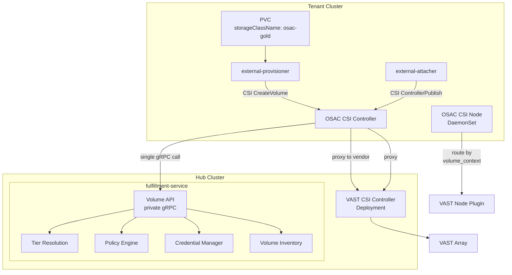
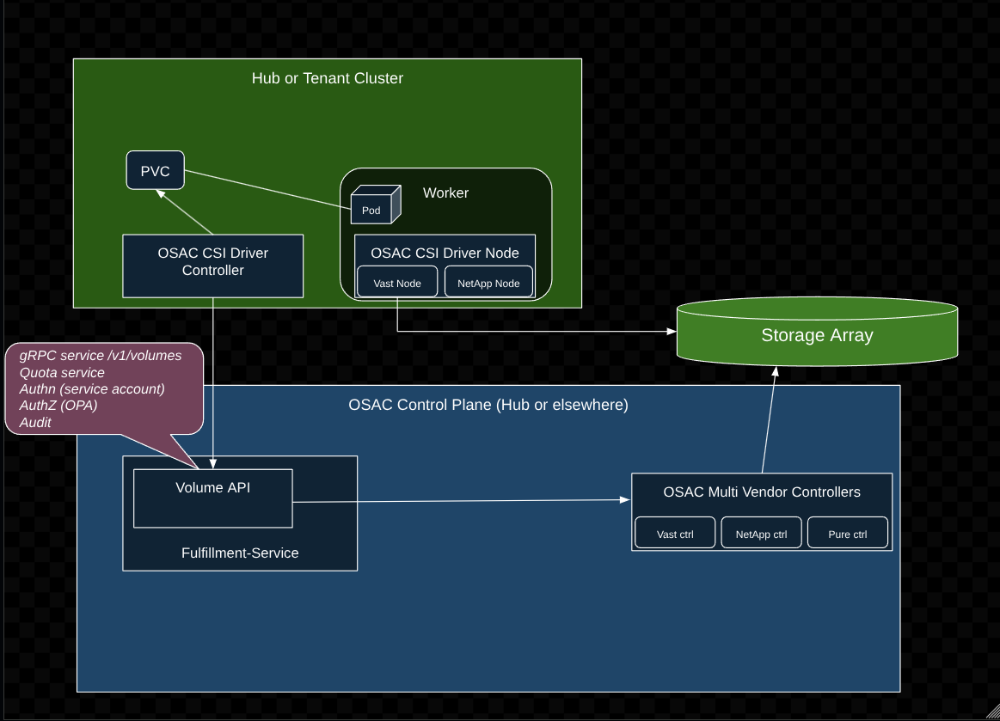
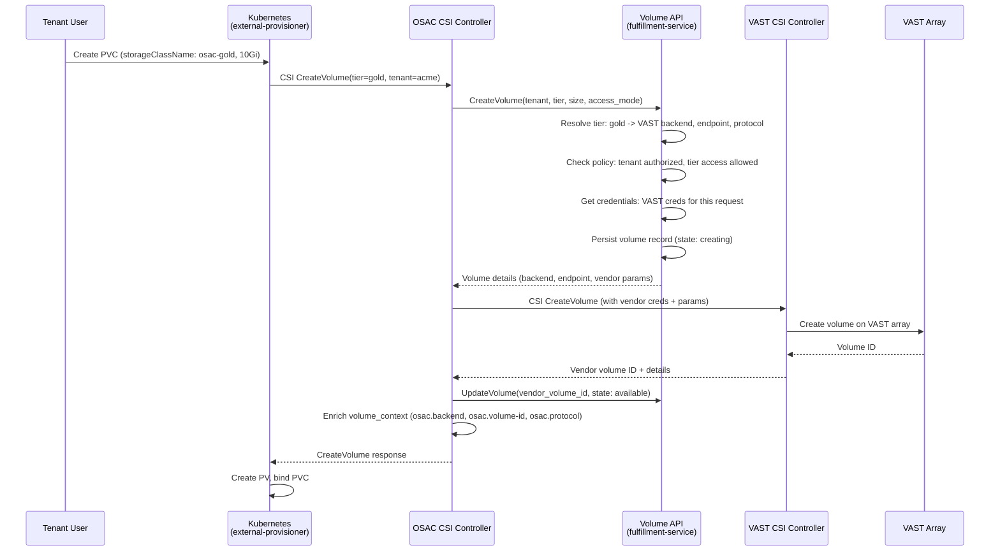
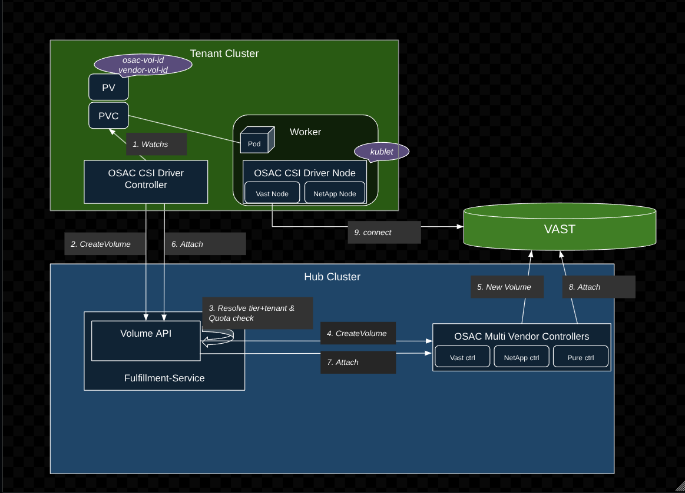

# Storage Control Plane

## Summary

This design introduces a vendor-agnostic storage layer for OSAC CaaS tenant clusters. A single CSI driver (`csi.osac.openshift.io`) presents opaque storage tiers to tenants, while a storage logic layer inside the fulfillment-service handles tier resolution, policy enforcement, credential management, and volume inventory. The CSI driver is a thin gRPC client that delegates every storage decision to the fulfillment-service via a private Volume API, then proxies volume operations to vendor CSI controllers running on the hub cluster. See [PRD](prd.md) for detailed requirements.

## Motivation

OSAC CaaS tenants need block storage on their clusters, but no vendor-agnostic storage layer exists today. The existing Cluster Storage Setup ([OSAC-1001](https://redhat.atlassian.net/browse/OSAC-1001), [OSAC-1332](https://redhat.atlassian.net/browse/OSAC-1332)) deploys vendor CSI operators (VAST) directly on clusters, exposing vendor-specific StorageClasses, distributing vendor credentials to every cluster, and providing no central inventory or policy enforcement point.

### Goals

- Reuse the existing fulfillment-service GenericServer, GenericDAO, and gRPC service registration patterns for the Volume API and storage logic.
- Maintain compatibility with the existing StorageReconciler, `status.storageClasses`, and storage conditions (`StorageBackendReady` and `ClusterStorageReady` on Tenant, `ClusterStorageReady` on ClusterOrder) in the osac-operator.
- Keep the CSI driver thin: a single gRPC call from the driver to the fulfillment-service for each volume operation, with all orchestration server-side.
- Package the CSI driver as a Helm chart following the existing osac-installer pattern (each component ships its own chart, umbrella assembles them).
- Extend the existing AAP two-stage onboarding to deploy the OSAC CSI driver instead of (or alongside) vendor CSI operators.

### Non-Goals

- Public Volume API for tenant-facing volume management ([OSAC-984](https://redhat.atlassian.net/browse/OSAC-984)).
- Quota lifecycle with reserve/commit/release.
- VMaaS storage integration (ComputeInstance lifecycle).
- CSI certification (conformance tests, OLM bundle).
- Multi-vendor support beyond VAST.

## Proposal

The storage control plane spans three repositories plus the installer:

| Repository | What it owns | Why here |
|---|---|---|
| `osac-csi-driver` | CSI meta-driver binary, gRPC proxy to vendor CSI sockets, Helm chart for CSI deployment (controller Deployment, node DaemonSet, CSIDriver, StorageClasses, RBAC) | CSI drivers have a unique deployment model (DaemonSet + Deployment with kubelet integration, vendor sidecars, unix sockets) that does not fit any existing repo |
| `fulfillment-service` | Storage logic layer: private Volume API (gRPC + REST), tier resolution, policy engine, credential manager, volume inventory | Already owns StorageBackend and StorageTier (OSAC-917). The storage logic shares DB, auth, and OPA infrastructure with the existing fulfillment-service |
| `osac-aap` | Ansible roles modified to deploy the OSAC CSI driver and vendor plugins to tenant clusters | Existing pattern: AAP handles cluster-side provisioning |
| `osac-installer` | Umbrella Helm chart wiring: adds osac-csi-driver as an optional dependency | Existing pattern: each component ships its own chart, osac-installer assembles them |

For each volume operation, the CSI controller calls the fulfillment-service Volume API for orchestration (tier resolution, policy, inventory), then proxies the vendor-specific call to the VAST controller on the hub via TCP gRPC, and finally updates the Volume API with the vendor result. The node plugin routes mount/unmount to vendor node plugins based on `volume_context` metadata embedded at provisioning time, with no control plane calls.



Key takeaway: the tenant cluster has no vendor controllers and no vendor credentials. All storage decisions happen on the hub. The node plugin never contacts the control plane.



### Workflow Description

#### CaaS PVC Provisioning (primary flow)

Starting state: a tenant cluster has been provisioned via ClusterOrder, the OSAC CSI driver and VAST node plugins are deployed, and StorageClasses matching the tenant's configured tiers exist on the cluster.

**Actors:** Tenant User (creates PVC), Kubernetes (external-provisioner, external-attacher, kubelet), OSAC CSI Driver, fulfillment-service (Volume API), VAST CSI Controller, VAST Array.



The CSI controller makes two Volume API calls per provision: CreateVolume (persists record, resolves tier, checks policy, returns credentials) and UpdateVolume (records vendor volume ID, transitions to AVAILABLE).



**Mount flow (after PVC is bound):**

1. Pod is scheduled to a worker node.
2. Kubernetes creates a VolumeAttachment resource.
3. external-attacher calls ControllerPublishVolume on the OSAC CSI Controller.
4. OSAC CSI Controller proxies to VAST CSI Controller (attach).
5. kubelet calls NodeStageVolume on the OSAC CSI Node plugin.
6. OSAC CSI Node reads `volume_context["osac.backend"]` = "vast", routes to VAST node plugin socket.
7. VAST node plugin stages the volume (iSCSI login, filesystem format, mount to staging path).
8. kubelet calls NodePublishVolume; OSAC CSI Node routes to VAST node plugin.
9. VAST node plugin bind-mounts the staged volume to the pod's mount point.

No control plane calls are made from the node. All routing information is baked into `volume_context` at CreateVolume time.

**Deletion flow:**

1. Tenant User deletes PVC.
2. Unmount (reverse of mount): kubelet -> OSAC Node -> VAST Node (NodeUnpublishVolume, NodeUnstageVolume).
3. Detach: external-attacher -> OSAC Controller -> VAST Controller (ControllerUnpublishVolume).
4. Deprovision: external-provisioner calls DeleteVolume on OSAC CSI Controller.
5. OSAC CSI Controller calls Volume API `DeleteVolume` (updates state to deleting, verifies ownership).
6. OSAC CSI Controller proxies DeleteVolume to VAST CSI Controller.
7. VAST deletes volume on array.
8. OSAC CSI Controller calls Volume API `UpdateVolume` (state: deleted).
9. Kubernetes deletes PV.

#### Error Handling

**PVC with unconfigured StorageClass:** The PVC stays Pending with a standard Kubernetes event. No custom error handling.

**Policy denial (unauthorized tenant or tier):** The Volume API returns `PERMISSION_DENIED`. The CSI controller returns a CSI error. The PVC stays Pending with an event describing the denial.

**Vendor volume creation failure:** The Volume API has already persisted the volume record in `creating` state. The CSI controller returns the vendor error to Kubernetes. On retry, the Volume API's CreateVolume is idempotent by volume name (derived deterministically from the PVC name): if a volume with the same name exists in `creating` state, it returns the existing record and the CSI controller retries the vendor call. The vendor CSI CreateVolume is also idempotent by name per the CSI spec, so duplicate vendor volumes are not created even if the controller crashes between the vendor call and the UpdateVolume call.

**Fulfillment-service unreachable:** The CSI controller returns `UNAVAILABLE`. Kubernetes retries with exponential backoff.

### API Extensions

**New gRPC service: `osac.private.v1.Volumes`** (fulfillment-service)
- Private CRUD service for volume inventory records.
- No public API counterpart. Follows the existing GenericServer pattern (List, Get, Create, Update, Delete, Signal).

**New internal storage packages** (fulfillment-service)
- `internal/storage/tier.go`: tier resolution logic.
- `internal/storage/policy.go`: policy engine.
- `internal/storage/credentials.go`: credential manager.
- These are Go packages called by the Volume API handler, not separate gRPC services. The tier resolution, policy, and credential logic is implemented as internal packages rather than a separate `StorageInternal` gRPC service, keeping the CSI driver thin and allowing the orchestration sequence to evolve server-side without driver changes.

**CSIDriver resource** (osac-csi-driver Helm chart)
- Name: `csi.osac.openshift.io`
- Registered on each tenant cluster where the OSAC CSI driver is deployed.

**StorageClass resources** (osac-csi-driver Helm chart / AAP)
- Provisioner: `csi.osac.openshift.io`
- Names derived from tenant StorageTier names (e.g., `osac-gold`, `osac-fast`).
- Labels: `osac.openshift.io/tenant`, `osac.openshift.io/storage-tier`, `osac.openshift.io/storage-protocol`
- Parameters: `tier` (StorageTier name), `tenant` (tenant name)
- `reclaimPolicy: Delete` (standard for dynamic provisioning; ensures vendor volumes are cleaned up when PVCs are deleted)

**Cluster teardown cleanup:** When a tenant cluster is deleted (ClusterOrder deletion), CSI DeleteVolume does not run for volumes on that cluster. The existing `osac-delete-tenant-cluster-storage` AAP playbook must be extended to query the Volume API for volumes associated with the cluster and delete them, ensuring vendor volumes are cleaned up and inventory records transition to DELETED.

**Finalizer on Volume records:** None. Volume lifecycle is driven by CSI operations (and cluster teardown cleanup via AAP), not by a Kubernetes controller.

**Existing resources modified:**
- `osac-aap` storage roles: modified to deploy OSAC CSI driver instead of vendor CSI operator on tenant clusters.
- `osac-installer` Chart.yaml: new optional dependency on osac-csi-driver.
- No changes to Tenant or ClusterOrder CRDs. The existing `StorageBackendReady` and `ClusterStorageReady` conditions continue to function as-is.

### Implementation Details/Notes/Constraints

#### Volume Proto Definition

New proto files in `fulfillment-service/proto/private/osac/private/v1/`:

**`volume_type.proto`:**

```protobuf
syntax = "proto3";
package osac.private.v1;

import "private/osac/private/v1/metadata_type.proto";

message Volume {
  string id = 1;
  Metadata metadata = 2;
  VolumeSpec spec = 3;
  VolumeStatus status = 4;
}

message VolumeSpec {
  string storage_tier_id = 1;
  int64 size_gib = 2;
  string access_mode = 3;
  string cluster_id = 4;
}

message VolumeStatus {
  VolumeState state = 1;
  string message = 2;
  string vendor_volume_id = 3;
  string backend_id = 4;
  string protocol = 5;
}

enum VolumeState {
  VOLUME_STATE_UNSPECIFIED = 0;
  VOLUME_STATE_CREATING = 1;
  VOLUME_STATE_AVAILABLE = 2;
  VOLUME_STATE_DELETING = 3;
  VOLUME_STATE_DELETED = 4;
}
```

Four states: `CREATING`, `AVAILABLE`, `DELETING`, `DELETED`. No `ATTACHED`/`DETACHED` states.

**`volumes_service.proto`:**

```protobuf
syntax = "proto3";
package osac.private.v1;

import "private/osac/private/v1/volume_type.proto";
import "google/api/annotations.proto";
import "google/protobuf/empty.proto";

service Volumes {
  rpc ListVolumes(ListVolumesRequest) returns (ListVolumesResponse) {
    option (google.api.http) = { get: "/api/private/v1/volumes" };
  }
  rpc GetVolume(GetVolumeRequest) returns (GetVolumeResponse) {
    option (google.api.http) = { get: "/api/private/v1/volumes/{id}" };
  }
  rpc CreateVolume(CreateVolumeRequest) returns (CreateVolumeResponse) {
    option (google.api.http) = { post: "/api/private/v1/volumes" body: "object" };
  }
  rpc UpdateVolume(UpdateVolumeRequest) returns (UpdateVolumeResponse) {
    option (google.api.http) = { patch: "/api/private/v1/volumes/{object.id}" body: "object" };
  }
  rpc DeleteVolume(DeleteVolumeRequest) returns (google.protobuf.Empty) {
    option (google.api.http) = { delete: "/api/private/v1/volumes/{id}" };
  }
  rpc Signal(SignalVolumeRequest) returns (SignalVolumeResponse) {
    option (google.api.http) = { post: "/api/private/v1/volumes/{id}/signal" };
  }
}
```

Request and response messages follow the existing pattern. The `CreateVolumeResponse` includes transient routing fields beyond the persisted Volume object, so the CSI driver knows where to proxy the vendor call:

```protobuf
message CreateVolumeResponse {
  Volume object = 1;
  string backend_endpoint = 2;
  map<string, string> vendor_params = 3;
}
```

`backend_endpoint` and `vendor_params` are derived from tier resolution and returned once; they are not persisted in the Volume record. Credential delivery to the shared VAST controller depends on the resolution of Open Question 2. The Signal RPC supports future controller-driven state transitions.

#### Volume API Server

`fulfillment-service/internal/servers/private_volumes_server.go` follows the existing GenericServer pattern:

```go
func NewPrivateVolumesServer() *PrivateVolumesServerBuilder { ... }

type PrivateVolumesServer struct {
    privatev1.UnimplementedVolumesServer
    generic          *GenericServer[*privatev1.Volume]
    tierResolver     *storage.TierResolver
    policyEngine     *storage.PolicyEngine
    credentialManager *storage.CredentialManager
}
```

The builder requires injected dependencies for tier resolution, policy, and credentials (analogous to how `PrivateStorageTiersServer` requires a `storageBackendsDAO` for cross-resource validation).

**CreateVolume handler logic:**

1. Validate required fields (`storage_tier_id`, `size_gib`, `cluster_id`).
2. Resolve tier: call `tierResolver.Resolve(ctx, tenant, storageTierID)` which reads StorageTier and its associated StorageBackend from the DB, returns backend endpoint, protocol, and volume parameters.
3. Check policy: call `policyEngine.Check(ctx, tenant, storageTierID, "create")` which evaluates OPA rules for tier-access authorization.
4. Set `status.state = CREATING`, clear caller-provided ID, force tenant from JWT claims.
5. Delegate to `generic.Create()` to persist the volume record.
6. Return the created volume (with backend details in status) to the CSI driver.

The CSI driver then uses the returned backend details to proxy the vendor CreateVolume call, and follows up with an UpdateVolume to set `vendor_volume_id` and transition to `AVAILABLE`.

**Database migration** (`82_create_volumes_tables.up.sql`):

Standard table structure: `id`, `name`, `creation_timestamp`, `deletion_timestamp`, `finalizers`, `creator`, `tenant`, `project`, `labels`, `annotations`, `data` (JSONB), `version`. Plus `archived_volumes` table. Unique name index on active records. Immutability trigger on `id`, `name`, `tenant`.

**Event payload:** Add `Volume volume = 40;` to the `Event.payload` oneof in `event_type.proto` (next available field number after storage_tier at 39).

**Service registration:** Register `privatev1.RegisterVolumesServer(grpcServer, privateVolumesServer)` in `start_grpc_server_cmd.go` and `privatev1.RegisterVolumesHandler` in `start_rest_gateway_cmd.go`.

#### Storage Logic Layer

New packages in `fulfillment-service/internal/storage/`:

**`tier.go` (TierResolver):**

Resolves `(tenant, storage_tier_id)` to a `TierResolution` containing the backend endpoint, protocol, and volume parameters. Reads StorageTier from the DB (via GenericDAO), follows its `backends[0].backend_id` to the StorageBackend record, and returns the backend's endpoint and the tier's QoS parameters. Initially supports one backend per tier (matching the StorageTier constraint).

**`policy.go` (PolicyEngine):**

Evaluates whether a tenant is authorized to perform a storage operation on a given tier. Uses OPA (the same Rego engine as the existing auth interceptor) with storage-specific policy rules: is the tenant allowed to use this tier? The policy engine is called by the Volume API handler before persisting the volume record.

**`credentials.go` (CredentialManager):**

Retrieves vendor credentials from the StorageBackend record's inline `credentials` field (username, password). Credentials are provided to the CSI driver in the CreateVolume response so it can authenticate to the vendor CSI controller. Credentials are never stored on the tenant cluster.

#### CSI Driver Changes

**`pkg/fulfillment/client.go`:**

Replace the `LoggingStub` with a real gRPC client. The `Client` interface expands to cover the Volume API:

```go
type Client interface {
    CreateVolume(ctx context.Context, req *CreateVolumeRequest) (*Volume, error)
    UpdateVolume(ctx context.Context, req *UpdateVolumeRequest) (*Volume, error)
    DeleteVolume(ctx context.Context, req *DeleteVolumeRequest) error
    Close() error
}
```

The gRPC client connects to the fulfillment-service endpoint (configurable via `--fulfillment-endpoint`). For CaaS (hub + spoke), the endpoint is the fulfillment-service's Kubernetes Service or Route on the hub cluster.

**`pkg/driver/controller.go`:**

The CreateVolume handler changes from the current flow (call `fulfillment.Resolve`, get connection, proxy) to:

1. Extract `tier` and `tenant` from StorageClass parameters.
2. Call `fulfillment.CreateVolume(ctx, {tenant, tier, size, accessMode, clusterID})`.
3. Volume API returns backend details (endpoint, protocol, vendor params, credentials).
4. Get gRPC connection to vendor CSI endpoint via `proxyMgr.GetConnection(endpoint)`.
5. Proxy CSI CreateVolume to vendor controller with credentials and params.
6. On success: call `fulfillment.UpdateVolume(ctx, {volumeID, vendorVolumeID, state: AVAILABLE})`.
7. Enrich `volume_context` with `osac.backend`, `osac.volume-id`, `osac.protocol`.
8. Return response to Kubernetes.

**`pkg/driver/node.go`:**

No changes to the node plugin logic. It remains a pure passthrough router. The in-memory `volumeBackends` map for tracking vendor assignments across Stage/Unstage operations is a known limitation (volatile on restart). This is acceptable because kubelet re-issues NodeStageVolume with full `volume_context` after a node plugin restart.

#### Helm Chart

New directory `osac-csi-driver/charts/csi-driver/` with:

| Template | Resource | Purpose |
|---|---|---|
| `controller.yaml` | Deployment | CSI controller plugin with external-provisioner + external-attacher sidecars |
| `node.yaml` | DaemonSet | CSI node plugin with node-driver-registrar sidecar + vendor node plugin containers |
| `csidriver.yaml` | CSIDriver | Registers `csi.osac.openshift.io` with Kubernetes |
| `rbac.yaml` | ServiceAccount, ClusterRole, ClusterRoleBinding | RBAC for CSI operations |
| `storageclasses.yaml` | StorageClass (templated) | One per tenant storage tier, parameterized from values |

`values.yaml` key parameters (image tags and chart versions are pinned to tested versions at deploy time; values below are defaults):

```yaml
driver:
  name: csi.osac.openshift.io
  image:
    repository: ghcr.io/osac-project/osac-csi-driver
    tag: latest
fulfillment:
  endpoint: ""  # gRPC endpoint for fulfillment-service
vendors:
  vast:
    enabled: true
    controller:
      image: vastdata/csi:latest
      endpoint: ""  # TCP gRPC endpoint for VAST controller
    node:
      image: vastdata/csi:latest
tenant:
  name: ""
  storageTiers: []
```

#### osac-installer Umbrella Chart

Add to `osac-installer/charts/osac/Chart.yaml`:

```yaml
- name: osac-csi-driver
  version: ">=0.0.0"
  repository: "file://../../base/osac-csi-driver/charts/csi-driver"
  alias: csiDriver
  condition: csiDriver.enabled
```

The CSI driver chart is optional (`condition: csiDriver.enabled`). Not every OSAC deployment needs storage.

#### AAP Integration

The `osac-create-tenant-cluster-storage` AAP playbook (Stage 2) is modified to:

1. Deploy the OSAC CSI driver Helm chart to the target cluster (instead of installing the VAST CSI operator via OLM).
2. Deploy the VAST CSI controller as a separate Deployment on the hub cluster (in `osac-vendor-controllers` namespace) if not already running.
3. Deploy the VAST node plugin as a co-located container in the OSAC CSI node DaemonSet on the target cluster.
4. Create StorageClasses with provisioner `csi.osac.openshift.io` and parameters `tier=<tierName>`, `tenant=<tenantName>`.
5. Create a CSI Secret on the target cluster with credentials for the fulfillment-service (not VAST credentials, which stay on the hub).

The `osac-delete-tenant-cluster-storage` playbook is modified to uninstall the Helm chart and clean up StorageClasses.

StorageClass naming changes from `vast-{protocol}-{tenant}-{tier}` to `osac-{tier}` (or `osac-{tenant}-{tier}` if per-tenant naming is needed for isolation). The existing labels (`osac.openshift.io/tenant`, `osac.openshift.io/storage-tier`) are preserved so the StorageReconciler's tier resolution continues to work.

### Security Considerations

**Credential isolation:** Vendor credentials (VAST username/password) are stored on the hub cluster only (in the fulfillment-service's StorageBackend record and per-tenant hub Secrets created by AAP). Whether credentials transit through the tenant cluster depends on the vendor credential delivery mechanism (see Open Question 2). The tenant cluster stores only the credentials needed to authenticate to the fulfillment-service, not vendor credentials.

**Cross-cluster authentication:** The CSI driver on tenant clusters must authenticate to the fulfillment-service on the hub cluster. The recommended approach is service account tokens over TLS: during cluster provisioning, AAP creates a Kubernetes ServiceAccount on the hub cluster with a token scoped to the Volume API's private endpoints, and injects it into the CSI driver's Deployment on the tenant cluster as a Secret. This reuses the existing JWT authentication interceptor in the fulfillment-service. The same TLS transport covers the vendor proxy connection from the CSI controller to the VAST controller on the hub. A spike to evaluate authentication options (token over TLS, mTLS, SPIFFE) is recommended before implementation (see Open Question 1).

**Tenant isolation:** The Volume API enforces tenant isolation via the same mechanism as all other fulfillment-service resources: the JWT token carries tenant claims, and the GenericDAO filters queries by tenant. A tenant can only see and operate on its own volumes. OPA policies additionally enforce tier-access rules (a tenant can only use tiers that have been assigned to it).

**Input validation:** The Volume API validates all inputs before persisting: `storage_tier_id` must reference an existing StorageTier, `size_gib` must be positive, `access_mode` must be a recognized value. Validation follows the protovalidate interceptor pattern. The CSI driver validates that required StorageClass parameters (`tier`) are present before calling the Volume API.

### Failure Handling and Recovery

| Failure Mode | What Happens | Recovery | User Observes |
|---|---|---|---|
| Fulfillment-service unreachable | CSI controller returns `UNAVAILABLE` | Kubernetes retries CreateVolume with exponential backoff | PVC stays Pending |
| Tier resolution fails (invalid tier) | Volume API returns `NOT_FOUND` | No retry (tier does not exist) | PVC stays Pending with event |
| Policy check fails (unauthorized) | Volume API returns `PERMISSION_DENIED` | No retry until policy changes | PVC stays Pending with event |
| Vendor CreateVolume fails | Volume record stays in `CREATING` state | Kubernetes retries; Volume API is idempotent (returns existing record) | PVC stays Pending |
| CSI controller pod restarts mid-operation | In-flight CreateVolume is lost | Kubernetes retries; Volume API idempotency handles duplicate requests | PVC stays Pending, then succeeds on retry |
| CSI node pod restarts | In-memory `volumeBackends` map is lost | kubelet re-issues NodeStageVolume with full `volume_context` | Temporary I/O error, then automatic recovery |
| VAST array unreachable | Vendor CreateVolume returns error | Kubernetes retries with backoff | PVC stays Pending |
| Volume stuck in CREATING state | Vendor creation timed out or controller crashed | Admin can manually delete the volume record via the private API. A reconciler to clean up stale records is a future improvement. | Volume visible in inventory as CREATING |

### RBAC / Tenancy

**Volume API tenancy:** Volumes are tenant-scoped. The `metadata.tenant` field is set from JWT claims on create (same as all fulfillment-service resources). The GenericDAO filters List/Get queries by tenant.

**OPA policy updates:** Add the Volume API's private endpoints to the admin allowlist in `authz.rego`. No client (public) rules needed since there is no public Volume API. The CSI driver authenticates as a service account with admin-level access to the private API.

**StorageClass visibility:** Tenants see StorageClasses on their clusters but cannot access vendor credentials. StorageClasses are labeled with `osac.openshift.io/tenant` for tenant-scoping.

**No new RBAC roles for the osac-operator.** The existing StorageReconciler RBAC (StorageClass read/write, Secret read, ClusterOrder status update) is sufficient.

### Observability and Monitoring

**New Prometheus metrics (fulfillment-service):**
- `osac_volume_operations_total` (counter, labels: `operation`, `state`, `tenant`): total volume API operations.
- `osac_volume_operation_duration_seconds` (histogram, labels: `operation`): latency of volume API operations including tier resolution and policy check.
- `osac_volumes_by_state` (gauge, labels: `state`, `tenant`): current count of volumes in each state.

**New Kubernetes events (CSI driver):**
- `VolumeProvisionSucceeded` (Normal): volume successfully created.
- `VolumeProvisionFailed` (Warning): volume creation failed with reason.
- `PolicyDenied` (Warning): tenant not authorized for the requested tier.

**Structured log events:** Both the CSI driver and the Volume API server log structured events for each operation (using the existing logging interceptor in the CSI driver and slog in the fulfillment-service).

### Risks and Mitigations

| Risk | Impact | Mitigation |
|---|---|---|
| Hub cluster is a single point of failure for provisioning | New PVC requests fail when fulfillment-service is unreachable | Node mounts continue to work without the hub (volume_context is self-contained). Only new provisioning/deprovisioning is affected. Kubernetes retries automatically. |
| Cross-cluster latency for CaaS | CreateVolume latency increases due to hub roundtrip | The latency is only at provisioning time (not at mount time). CSI sidecars handle retries. |
| StorageClass naming migration | Existing volumes use vendor-specific StorageClasses; new volumes use OSAC StorageClasses | New clusters get OSAC StorageClasses from the start. Existing clusters continue using vendor StorageClasses until re-provisioned. |
| Volume inventory divergence | Vendor-side volume exists but inventory record is stale or missing | Accepted risk. A reconciler to sync inventory with vendor state is a future improvement. |

### Drawbacks

The primary drawback is added complexity: introducing a new CSI driver and Volume API adds moving parts compared to the current approach of deploying vendor CSI operators directly. The hub cluster becomes a control plane dependency for all storage provisioning. However, the alternative (vendor CSI drivers on every tenant cluster with vendor credentials) is untenable as the platform scales: it exposes vendor details, distributes credentials, and provides no central inventory or policy enforcement.

The in-memory `volumeBackends` map on the node plugin is a known limitation. On node plugin pod restart, the mapping is lost. kubelet re-issues NodeStageVolume with full `volume_context` which rebuilds the mapping, but there is a brief window where unstage/unpublish for previously staged volumes may fail. This is a pragmatic trade-off: persisting the map to disk adds complexity for a scenario that resolves itself automatically.

## UX Alignment

No UX changes in this EP. This design delivers a private Volume API only. The public Volume API and UI integration are [OSAC-984](https://redhat.atlassian.net/browse/OSAC-984) scope.

## Alternatives (Not Implemented)

### Alternative 1: Storage logic as a standalone service

Instead of embedding the storage logic in the fulfillment-service, deploy a separate `osac-storage-api` service.

**Pros:** Independent scaling, independent release cycle, smaller blast radius.
**Cons:** Duplicates DB, auth, and OPA infrastructure already in fulfillment-service. Adds a new Helm chart, deployment, and operational burden. StorageBackend and StorageTier already live in fulfillment-service, so the storage logic would need cross-service calls to access them.
**Rejected because:** The storage logic shares DB, auth, and OPA with existing fulfillment-service resources. A separate service adds operational cost without architectural benefit.

### Alternative 2: CSI driver calls multiple StorageInternal RPCs directly

Instead of a single Volume API call, the CSI driver calls ResolveTier, CheckPolicy, GetCredentials, and RegisterVolume as separate RPCs.

**Pros:** More granular control from the CSI driver side. Each RPC can be retried independently.
**Cons:** The CSI driver becomes a thick client that orchestrates storage decisions. Multiple roundtrips per volume operation. The driver must understand the correct ordering of operations.
**Rejected because:** The design principle is a thin CSI driver. Server-side orchestration via a single Volume API call keeps the driver simple and allows the storage logic to evolve without driver changes.

### Alternative 3: Do nothing (continue with vendor CSI operators)

Continue deploying vendor CSI operators (VAST) directly on tenant clusters.

**Pros:** No new components. Minimal engineering effort.
**Cons:** Tenants see vendor-specific StorageClasses. Vendor credentials stored on tenant clusters. No central inventory. No policy enforcement point. Cannot add a second vendor without exposing it to tenants.
**Rejected because:** Does not meet the PRD requirements for vendor abstraction, credential isolation, or volume inventory.

## Open Questions

### 1. Cross-cluster authentication and transport security

The design recommends service account tokens over TLS for the CSI driver to authenticate to the fulfillment-service on the hub cluster. The team has not formally decided on the mechanism. Options: (a) service account tokens over TLS (simplest, reuses existing JWT auth), (b) mTLS with certificates on both sides (strongest, requires certificate management), (c) SPIFFE/SPIRE for automated mTLS certificate rotation. This decision also covers the vendor proxy transport: the CSI controller's gRPC connection to the VAST controller on the hub needs the same TLS treatment. A spike to evaluate these options is recommended before implementation.

**Owner:** Storage team
**Impact:** Blocks the CSI driver's fulfillment client implementation, the vendor proxy TLS configuration, and the AAP provisioning role for credential distribution.

### 2. Vendor credential delivery to shared VAST controller

The VAST CSI controller runs as a shared Deployment on the hub cluster (one per hub, serving all tenants). Per-tenant VAST credentials exist (AAP creates per-tenant VMS Manager credentials stored in hub Secrets). The open question is how per-tenant credentials reach the shared VAST controller per-request: (a) the Volume API returns credentials to the CSI driver, which passes them to the VAST controller via the CSI `secrets` parameter (credentials transit through the tenant cluster briefly), or (b) the Volume API proxies the vendor call directly so credentials never leave the hub. Option (a) is simpler but weakens the credential isolation claim. Option (b) is architecturally cleaner but moves vendor proxy logic into the fulfillment-service.

**Owner:** Storage team
**Impact:** Determines whether credentials transit through tenant clusters, affects the Volume API response contract, and may change the repo split for vendor proxy logic.

### 3. StorageClass naming convention

The design proposes `osac-{tier}` or `osac-{tenant}-{tier}`. The current convention is `vast-{protocol}-{tenant}-{tier}`. The new naming must work with the existing StorageReconciler's label-based tier resolution. The label-based approach (`osac.openshift.io/storage-tier`) is more important than the name itself.

**Owner:** Storage team
**Impact:** Affects Helm chart templates and AAP roles.

## Test Plan

### Unit Tests

**fulfillment-service:**
- Volume API server: Create validates required fields, forces tenant from JWT, sets initial state to CREATING. Update validates state transitions (CREATING->AVAILABLE, AVAILABLE->DELETING, DELETING->DELETED). Delete transitions to DELETING. Get/List filters by tenant.
- Tier resolution: resolves StorageTier to backend endpoint and protocol. Returns NOT_FOUND for nonexistent tier. Returns error when StorageBackend referenced by tier is missing.
- Policy engine: allows authorized tenant for permitted tier. Denies unauthorized tenant. Denies access to tier not assigned to tenant.
- Credential manager: retrieves credentials from StorageBackend inline field. Handles missing credentials.
- Migration: volumes table created with correct columns, archived table, immutability triggers.

**osac-csi-driver:**
- Controller CreateVolume: calls fulfillment CreateVolume, proxies to vendor, calls UpdateVolume on success, enriches volume_context.
- Controller DeleteVolume: calls fulfillment DeleteVolume, proxies vendor delete, updates state.
- Node routing: routes to correct vendor socket based on volume_context. Records backend in volumeBackends map. Looks up backend for unstage/unpublish.
- Fulfillment client: connects to endpoint, handles unavailable errors, closes cleanly.

### Integration Tests

**fulfillment-service:**
- Volume lifecycle: create -> get -> list (filtered by tenant) -> update (state transitions) -> delete. Verify tenant isolation (tenant A cannot see tenant B's volumes). Verify tier resolution against real StorageTier and StorageBackend DB records.

**osac-csi-driver:**
- CSI sanity tests: run the standard `csi-test` suite against the driver with a mock fulfillment-service endpoint. Verifies CSI spec compliance.

### E2E Tests

- Provision a tenant cluster via ClusterOrder. Verify OSAC CSI driver, VAST node plugins, and StorageClasses are deployed.
- Create a PVC with an OSAC StorageClass on the tenant cluster. Verify volume is provisioned on the VAST backend and recorded in the fulfillment-service inventory.
- Create a pod that mounts the PVC. Verify the pod can read and write data.
- Delete the PVC. Verify the volume is cleaned up on the VAST backend and the inventory record transitions to DELETED.
- Create a PVC referencing a nonexistent StorageClass. Verify PVC stays Pending.

## Graduation Criteria

Graduation criteria will be defined when targeting a release. Expected stages: Dev Preview -> Tech Preview -> GA based on production deployment feedback.

## Upgrade / Downgrade Strategy

This is a new capability with no existing deployments to upgrade from. OSAC does not currently support upgrades, so data migration and backward compatibility are not concerns at this stage.

For clusters already using vendor CSI operators (VAST): migrating existing volumes to the OSAC CSI driver is not in scope. New clusters provisioned after this feature lands will use the OSAC CSI driver. Existing clusters continue using their current vendor CSI setup.

Downgrade requires uninstalling the OSAC CSI driver Helm chart and re-deploying the vendor CSI operator via the original AAP roles. Any volumes created through the OSAC driver become inaccessible until the vendor CSI operator is restored with the correct StorageClasses.

## Version Skew Strategy

The OSAC CSI driver and the fulfillment-service Volume API are deployed independently. Version skew handling:

- **CSI driver newer than fulfillment-service:** The driver calls Volume API RPCs that may not exist yet. The fulfillment-service returns `UNIMPLEMENTED`, and the driver treats this as a fatal error (PVC stays Pending). Resolution: deploy fulfillment-service first, then upgrade the CSI driver.
- **Fulfillment-service newer than CSI driver:** New fields in the Volume API response are ignored by the older driver (protobuf forward compatibility). No impact.
- **Recommended deploy order:** fulfillment-service -> osac-csi-driver -> osac-aap roles.

## Support Procedures

**Detecting failures:**
- PVCs stuck in Pending: check events on the PVC (`kubectl describe pvc`). Events from the OSAC CSI driver include `VolumeProvisionFailed` or `PolicyDenied` with detailed reasons.
- CSI driver pods: `kubectl logs -n osac-csi-driver deployment/osac-csi-controller`. The logging interceptor logs every gRPC call with method, duration, and result.
- Fulfillment-service: volume operations appear in the fulfillment-service logs. Query `osac_volume_operations_total` metric for error rates.
- Inventory: query volumes via the private REST API (`GET /api/private/v1/volumes`) to check for volumes stuck in CREATING state.

**Disabling the feature:**
- Set `csiDriver.enabled=false` in the osac-installer Helm values to stop deploying the CSI driver on new clusters.
- Existing clusters: uninstall the OSAC CSI driver Helm chart. Pods using OSAC-provisioned volumes will lose access to their storage until a vendor CSI operator is deployed with matching StorageClasses.
- The fulfillment-service Volume API continues to serve inventory queries even with the CSI driver disabled.

**Recovery:**
- Re-enabling the CSI driver (re-deploying the Helm chart) restores PVC provisioning. Existing PVCs that were bound before disabling continue to work (the volume data is on the VAST array, not in the CSI driver).
- Volumes stuck in CREATING state can be manually cleaned up via the private Volume API (`DELETE /api/private/v1/volumes/{id}`).

## Infrastructure Needed

- New GitHub repository: `osac-project/osac-csi-driver` (already exists, created under OSAC-2882).
- CI for osac-csi-driver: GitHub Actions for lint, build, and test (pre-commit workflow already exists; test and container build workflows needed).
- No new test infrastructure beyond existing kind clusters and the osac-test-infra framework.

---

## Provenance

Authored: draft @ design 0.4.0 - 7b6dfe0, workspace main @ 17cb3b3

<!-- ai-workflow-provenance:{"schema_version":1,"provenance_kind":"session","workflow":"design","workflow_version":"0.4.0","ai_workflows":"7b6dfe0","source_repo":"17cb3b3","source_repo_branch":"main","commits_behind_main":0,"commits_ahead_main":0,"main_ref":"main","phases":["draft"],"authoring_modes":["skill"],"context_changed":false} -->
