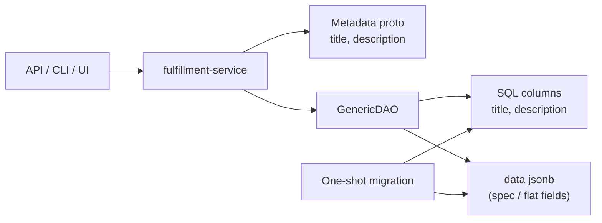

# Add Standardized title and description Fields to Resource Metadata

## Summary

This design adds optional `title` and `description` fields to the
shared `Metadata` message in fulfillment-service, persists them as first-class
database columns on every object table, implements List `order` support (today
hardcoded to `id`), and removes per-resource `title`/`description` fields from
the twelve object types that currently define them — with a one-shot data
migration. See [PRD](prd.md) for detailed requirements.

### Revision (2026-08-12)

Per design review on the implementation PR
([osac#263](https://github.com/osac-project/osac/pull/263)):

1. Rename Metadata friendly label from `display_name` to **`title`** to match
   existing per-type fields (e.g. ClusterTemplate) and simplify migration.
2. `description` is **Markdown** — clients that display it **must** render
   Markdown (with sanitization), not optionally.
3. **Internationalization:** this enhancement keeps a single canonical
   `title` / `description` (same model as today's per-type fields). Proto
   field numbers **13** and **14** are reserved for future
   `localized_titles` / `localized_descriptions` maps so i18n can be added
   without another Metadata reshape. Full locale UX is a follow-up EP.

Implementation note: OSAC-3643 landed `display_name` on public/private
Metadata before this revision; follow-up implementation work must rename
that field to `title` (proto + SQL column + DAO) before further client
binding.


## Motivation

OSAC objects already expose `metadata.name`, but that field is constrained to
DNS-label format. Twelve object types worked around this with per-type
`title` and/or `description` fields — some on `spec`, some as flat fields —
while most types (ComputeInstance, VirtualNetwork, Subnet, PublicIP, and
others) have no friendly label at all. Naming discussions recur for each new
type, and clients must special-case which path holds the human-readable label.

Two complementary naming features apply:

- **OSAC-1061** makes `metadata.name` mandatory, unique, and immutable (DNS
  identity).
- **This enhancement** adds mutable, non-unique `metadata.title` and
  `metadata.description` for natural-language labeling, and consolidates the
  existing per-type fields onto Metadata. [Locked: D1, D2, D4]

`metadata` fields are stored in dedicated SQL columns, not in the `data`
JSONB document [Codebase: fulfillment-service/internal/database/dao/generic_dao.go].
Adding Metadata fields therefore requires schema migration and GenericDAO
changes, not proto-only edits.

### Goals

- Extend shared public and private `Metadata` with optional `title`
  (max 63) and Markdown `description` (max 256), validated via buf.validate. [Locked: D5, D7, D8]
- Persist both fields as columns on all object and archive tables and wire
  them through GenericDAO create/update/list/makeMetadata and FilterTranslator.
- Implement List `order` plumbing end-to-end so clients can sort by
  `metadata.title` (and `metadata.name`, `id`). [Locked: D6]
- Remove resource-level `title`/`description` from all twelve affected types
  in one release, migrating existing values into Metadata. [Locked: D1, D4]
- Update CLI table definitions, List docs, E2E helpers, and generated
  osac-operator API bindings to the new fields. [Locked: D10]

### Non-Goals

- Mandating how UI/CLI present `title` versus `metadata.name` when
  unset — display behavior remains a client decision. [Locked: D9]
- Changing TemplateParameter `title`/`description`, HostType interface
  `description`, or FieldDefinition `display_name`. [Locked: D3]
- Aligning public/private Metadata field number divergence for existing
  fields (`name` is 4 public / 6 private). Tracked as a follow-up outside
  this enhancement.
- Full multi-locale Metadata in this enhancement — single canonical
  `title` / `description` only; field numbers 13–14 reserved for future
  localized maps (see Alternatives and Revision note).
- Server-side encryption or Markdown sanitization of `description` beyond
  length validation. Descriptions are stored as Markdown strings; safe
  rendering is a **client** responsibility (see Security Considerations).
  UI/CLI hardening beyond the policy stated here is tracked as a follow-up.

## Proposal

Add two fields to `osac.public.v1.Metadata` and `osac.private.v1.Metadata`.
Every object that embeds Metadata inherits them automatically. Persist the
values in new `title` and `description` columns. Extend FilterTranslator
so CEL filters can use `this.metadata.title`. Implement the documented
but currently ignored List `order` parameter so sorting by
`metadata.title` works.

Remove `title`/`description` (or `description` alone for InstanceType) from
the twelve types listed below, reserve the old proto field numbers and names,
and migrate stored values from `data` JSON into the new columns in the same
release.



The diagram shows that Metadata fields live in columns, while remaining
object payload stays in `data`. Migration copies old `title`/`description`
out of `data` into the new columns, then the proto removal drops those
JSON paths.

**Identity model** (alongside OSAC-1061):

| Field | Role |
|-------|------|
| `id` | System-assigned unique identifier |
| `metadata.name` | DNS-label name (OSAC-1061: mandatory, unique, immutable) |
| `metadata.title` | Optional mutable non-unique friendly label (max 63); replaces per-type `title` |
| `metadata.description` | Optional mutable Markdown string (max 256); replaces per-type `description` |

### Workflow Description

**Actors:** Tenant User, Tenant Admin, Cloud Provider Admin, Cloud
Infrastructure Admin — any persona that creates or updates objects via
gRPC, REST, or CLI (`osac`).

#### Create with title

Starting state: authenticated caller with create permission on a type
(e.g. ComputeInstance).

1. Caller submits Create with `metadata.name` (DNS-label) and optional
   `metadata.title` / `metadata.description`.
2. Protovalidate rejects values exceeding max length (`InvalidArgument`
   with field violations).
3. GenericDAO writes `title` and `description` columns (empty
   string when omitted) and returns the created object.

#### Update and clear

1. Caller submits Update with `update_mask` including
   `metadata.title` and/or `metadata.description`.
2. Setting a field to `""` clears it (same convention as clearing other
   plain Metadata strings).
3. Omitting a field from `update_mask` leaves the stored value unchanged.

#### List filter and sort

1. Filter: `this.metadata.title == 'Dell PowerEdge XE9680'`
   (case-sensitive CEL → SQL, same as other string filters).
2. Order: `metadata.title asc` or `metadata.title desc`.
   Empty values sort as empty strings (first under ASC).
3. Unsupported order fields return `InvalidArgument`.

#### Error paths

- Length violation → `InvalidArgument` (protovalidate).
- Unknown filter metadata field → filter translation error surfaced as
  `InvalidArgument`.
- Clients still sending removed `title`/`description` after upgrade →
  unknown fields discarded on unmarshal where `DiscardUnknown` applies, or
  rejected by clients generated against the new schema; servers no longer
  persist those paths.

### API Extensions

No new gRPC services or CRDs. Changes are to shared Metadata and twelve
existing object messages (public and private).

**Modified shared type:**

| Message | Change |
|---------|--------|
| `osac.public.v1.Metadata` | Add `title = 11`, `description = 12` |
| `osac.private.v1.Metadata` | Add `title = 11`, `description = 12` |

**Removed fields (reserve numbers and names):**

| Object | Removed fields |
|--------|----------------|
| Project | `spec.title`, `spec.description` |
| Role | `spec.title`, `spec.description` |
| IdentityProvider | `spec.title`, `spec.description` |
| InstanceType | `spec.description` |
| NetworkClass | `title`, `description` |
| HostType | `title`, `description` (not nested interface `description`) |
| ClusterTemplate | `title`, `description` |
| ComputeInstanceTemplate | `title`, `description` |
| BareMetalInstanceTemplate | `title`, `description` |
| ClusterCatalogItem | `title`, `description` |
| ComputeInstanceCatalogItem | `title`, `description` |
| BareMetalInstanceCatalogItem | `title`, `description` |

**List behavior change:** `GenericServer.List` and `GenericDAO.List`
honor the existing `order` request field (currently ignored).

**Operational impact:** No new controllers or webhooks. API servers must
roll out with the DB migration. Until migration completes, service startup
fails on missing columns (standard migration gating).

## UX Alignment

Display behavior (whether to show `title`, `name`, or both) is not
mandated by the PRD [Locked: D9]. This section maps @temp-api field
locations to the new Metadata fields so UI work can proceed once the API
ships.

| UI / @temp-api location | Current field | Target field | Notes |
|-------------------------|---------------|--------------|-------|
| `project.ts` `CreateProjectBody.spec.title` | `spec.title` | `metadata.title` | Required in UI create body today → becomes optional `metadata.title` |
| `project.ts` `CreateProjectBody.spec.description` | `spec.description` | `metadata.description` | |
| `networking.ts` NetworkClass `title` / `description` | top-level | `metadata.title` / `metadata.description` | |
| `identity-provider.ts` `spec.title` | `spec.title` | `metadata.title` | |
| `storage-tier.ts` `metadata.description` | already on metadata | `metadata.description` | Aligns with this design |
| `storage-tier.ts` `spec.displayName` | `spec.displayName` | `metadata.title` | **Deviation:** UI placed friendly name on spec; backend standard is Metadata — UI should move to `metadata.title` |
| Catalog / template pages (when bound to live API) | flat `title` | `metadata.title` | Same consolidation as NetworkClass |
| FieldDefinition `display_name` | N/A | unchanged | Different concept (catalog field labels) |

**Justification for StorageTier deviation:** Backend Metadata is the
canonical home for friendly naming across all types. Moving StorageTier
UI to `metadata.title` avoids a second naming convention.

## Implementation Details/Notes/Constraints

### Proto schema

Public and private Metadata gain identical fields and docs
[Codebase: fulfillment-service/docs/API.md]:

```protobuf
// Human-friendly short title. Optional, not unique, mutable.
// Not constrained to DNS-label format. Same role as today's per-type
// `title` fields (e.g. ClusterTemplate.title).
string title = 11 [(buf.validate.field).string = {
  max_len: 63
}];

// Human-friendly long description in Markdown. Optional, not unique,
// mutable. Clients that display this field MUST render it as Markdown
// (with safe sanitization — see Security Considerations).
string description = 12 [(buf.validate.field).string = {
  max_len: 256
}];

// Reserved for future internationalization (locale → string maps).
// Canonical/default locale content remains in `title` / `description`.
reserved 13, 14;
reserved "localized_titles", "localized_descriptions";
```

Empty string means unset. No pattern constraint. Length uses protovalidate
Unicode code-point counting.

For each removed field, follow existing reserved patterns:

```protobuf
reserved N;
reserved "title";  // or "description"
```

Update `docs/API.md` Metadata table and List `order` examples that currently
cite `title`.

### Database migration

For every object table and its archive table that uses the GenericDAO column
layout:

```sql
alter table <table> add column title text not null default '';
alter table <table> add column description text not null default '';
```

Optional index for filter/sort hot paths (same rationale as `*_by_name`):

```sql
create index <table>_by_title on <table> (title);
```

**Data backfill** (same migration, before clients rely on removal):

| Source path in `data` | Destination column |
|----------------------|--------------------|
| `title` (flat) | `title` (Metadata column) |
| `spec.title` | `title` (Metadata column) |
| `description` (flat) | `description` |
| `spec.description` | `description` |

Rules:

- Copy `title` / `spec.title` into the Metadata `title` column when present.
- Copy description from the corresponding path; if longer than 256 Unicode
  code points, truncate to 256.
- After copy, delete **only the explicit migrated path for that resource
  type** (for example top-level `title`/`description` on flat-shape types,
  or `spec.title`/`spec.description` on metadata-bearing types). Do **not**
  perform a generic delete of every matching key name in the JSON document.
  Nested fields that this enhancement excludes must remain intact, including
  `TemplateParameter.title` / `description`, `FieldDefinition.display_name`,
  and HostType interface `description`. [Locked: D3]
- When any row's description is truncated, emit a migration-time **warning**
  that includes the resource/table type and the count of truncated rows for
  that type. Do **not** log description contents. Also call out truncation
  in release notes.
- Types without old fields leave columns as `''`.

Pattern reference: `13_add_name.up.sql`, `16_add_labels.up.sql`,
`17_add_annotations.up.sql`.

### GenericDAO

Extend `metadataIface` with `GetTitle`/`SetTitle` and
`GetDescription`/`SetDescription`. Update create, update, list scan,
and `makeMetadata` to read/write the new columns. Extend the list SELECT
column list accordingly
[Codebase: fulfillment-service/internal/database/dao/generic_dao*.go].

### FilterTranslator

Add `title` (and `description` if ordered/filtered) to
`translateSelectThisMdField` alongside `name`, mapping to the SQL column
[Codebase: fulfillment-service/internal/database/dao/filter_translator.go].

### List order implementation

Today `GenericServer.List` only forwards filter/offset/limit, and
`GenericDAO.List` hardcodes `order by id`
[Codebase: fulfillment-service/internal/servers/generic_server.go,
fulfillment-service/internal/database/dao/generic_dao_list.go].

This enhancement:

1. Adds `GetOrder()` to the List request interface in GenericServer and
   `SetOrder` on `ListRequest`.
2. Parses `order` as SQL-like tokens (`field [asc|desc]`, comma-separated),
   matching API.md examples.
3. Allows an explicit allowlist: `id`, `metadata.name` → `name`,
   `metadata.title` → `title` (and the bare column forms
   `name`, `title` if that matches existing filter identifier
   style). Reject anything else with `InvalidArgument`.
4. Defaults to `id asc` when `order` is empty (preserves current behavior).
5. When the request specifies a non-`id` primary order (for example
   `metadata.title asc`), append `id asc` as an implicit secondary
   sort key unless `id` is already present in the order expression. This
   keeps offset/limit pagination stable when `title` values are
   duplicated.

### Server and test updates

- Update unit tests that set/assert `.Title` / `.Description` /
  `spec.title` on the twelve types to use Metadata fields
  [Codebase: fulfillment-service/internal/servers/*_test.go].
- No per-type business logic is required beyond proto regeneration and
  test/fixture updates; GenericDAO handles persistence.

### CLI table rendering

Update CEL column expressions in
`fulfillment-service/internal/rendering/tables/` that reference
`this.title`, `this.spec.title`, or `this.spec.description` to
`this.metadata.title` / `this.metadata.description` (including
public and private Role, Project, IdentityProvider, InstanceType,
NetworkClass, templates, and catalog items).

### Downstream components

| Component | Change |
|-----------|--------|
| osac-operator | Regenerate / bump private API dependency; no controller logic changes expected for Title/Description |
| osac-test-infra | Update `grpc_client.py` and catalog/BMaaS fixtures from `title=` to Metadata fields |
| osac-ux / osac-ui | After API availability, move create/update bodies per UX Alignment |
| osac-installer | No Helm changes beyond picking up new fulfillment-service image |

### Dependency order

1. fulfillment-service (proto, migration, DAO, servers, CLI tables, docs)
2. osac-operator (generated API)
3. osac-test-infra E2E
4. UI clients

### Security Considerations

No new authn/authz surfaces. Fields are ordinary Metadata readable/writable
under existing object permissions and OPA tenancy. Descriptions are opaque
user-controlled strings — same trust model as annotations and existing
per-type descriptions. The API validates length only and does not sanitize,
transform, or execute description content.

**Client Markdown rendering (required):** `metadata.description` **is**
Markdown. UI and CLI clients that display the field **must** render it as
Markdown and **must** treat the content as untrusted user input: sanitize
before display (strict allowlist Markdown renderer that strips scripts and
unsafe URLs; never pass raw strings into `innerHTML`, shell expansion, or
other execution contexts). Broader UI hardening beyond this policy is
tracked as a follow-up outside the server cutover.

### Failure Handling and Recovery

| Failure | Behavior | Recovery |
|---------|----------|----------|
| Migration fails mid-flight | Transaction rollback (standard goose/migration runner) | Fix SQL and re-run; columns not partially applied |
| Create/Update with overlong title/description | `InvalidArgument` field violation | Client shortens value |
| List with unsupported `order` field | `InvalidArgument` | Client uses allowlisted fields |
| Filter on `metadata.title` before FilterTranslator update | Translation error | Deploy DAO change with proto |
| Old client sends removed `title` | Field ignored or rejected by new stubs | Client upgrade |

Create/Update/List remain idempotent under retry for the same payload.
No controller reconciliation is involved.

### RBAC / Tenancy

No RBAC or tenancy changes required. `title` and `description`
inherit the parent object's tenant/project visibility and existing OPA
policies. Platform-defined objects (NetworkClass, HostType, catalog items,
templates) remain visible under current platform rules.

### Observability and Monitoring

No new Prometheus metrics or Kubernetes events. Existing gRPC and DAO
operation duration metrics cover Create/Update/List. Migration progress is
observed via normal migration runner logs.

### Risks and Mitigations

| Risk | Mitigation |
|------|------------|
| Breaking API for twelve types | One release with reserved fields; coordinate E2E and UI; changelog callout |
| Truncation of Project descriptions > 256 | Truncate at migration; emit per-type count warning (no content); document in release notes |
| Accidental deletion of nested title/description | Path-specific JSON cleanup only; tests assert excluded nested fields remain |
| Unstable List pages when title duplicates | Implicit secondary `id asc` on ordered lists |
| XSS if clients render description as HTML/Markdown | Client encode/sanitize requirement in Security Considerations; UI follow-up |
| Wide migration (many tables) | Follow established add-column migration pattern; test on representative tables in integration suite |
| List `order` allowlist too narrow | Start with `id`, `name`, `title`; expand later without schema change |
| Confusion with FieldDefinition.display_name | Document distinction in API.md and this design |

### Drawbacks

- Breaking change across many protos, tests, CLI tables, and clients in one
  cut — higher coordination cost than additive-only Metadata fields.
- Truncating long Project descriptions loses data that previously fit in
  1024-character comments.
- Implementing general List `order` expands scope beyond Metadata fields,
  but is required because sort is documented yet not implemented today.

These are justified by locked PRD decisions (full removal, filter/sort by
title) and by avoiding a prolonged dual-field period that the PR
review explicitly rejected. [Locked: D1, D4, D6]

## Alternatives (Not Implemented)

### Name Metadata field `display_name` instead of `title`

**Pros:** Avoids collision in prose with removed per-type `title` fields;
matches some UI @temp-api `displayName` naming.
**Cons:** Diverges from long-standing ClusterTemplate / NetworkClass /
catalog `title` fields; forces rename during migration instead of a
straight copy into Metadata.
**Rejection:** Implementation review (osac#263) preferred preserving
`title` + Markdown `description`. Design revised 2026-08-12.

### Full i18n maps on Metadata in this enhancement

**Pros:** Avoids retrofitting locale support later.
**Cons:** Needs UX for locale selection/editing; existing twelve types are
single-locale strings; blocks consolidation on a larger design.
**Rejection:** Reserve field numbers 13–14 for `localized_titles` /
`localized_descriptions`; ship canonical `title` / `description` now;
follow-up EP for locale UX and map semantics.


### Keep flat-shape title/description; only migrate spec-based types

**Pros:** Smaller blast radius.
**Cons:** Leaves inconsistent naming on platform types; rejected in PRD
review. [Locked: D1, D4]
**Rejection:** Locked decision.

### Store title/description only inside data JSON

**Pros:** Avoids altering every table.
**Cons:** Breaks Metadata column model; FilterTranslator Metadata path
expects columns; inconsistent with `name`/`labels`.
**Rejection:** Violates GenericDAO Metadata persistence pattern
[Codebase: fulfillment-service/internal/database/dao/generic_dao.go].

### Backend auto-populate title from metadata.name

**Pros:** Clients always see a non-empty title.
**Cons:** Confuses users on edit (field appears set without user action);
PRD deferred display behavior to clients. [Locked: D9]
**Rejection:** Clarification and PR review consensus against backend fill.

### Dual-write / deprecation window for title fields

**Pros:** Softer client migration.
**Cons:** Prolongs dual paths; PRD requires removal, not aliasing.
[Locked: D1]
**Rejection:** Locked decision for one-shot removal.

### Fail migration if any description exceeds 256

**Pros:** No silent data loss.
**Cons:** Blocks upgrade until operators manually shorten rows.
**Rejection:** Truncation chosen for operable upgrades; call out in release
notes and emit migration-time warnings with per-type truncated counts.

## Test Plan

### Unit (Ginkgo — `internal/`)

- Protovalidate accepts title length 0–63 and description 0–256;
  rejects longer values.
- GenericDAO Create/Update/Get round-trips title and description,
  including clear-to-empty via update_mask.
- FilterTranslator translates `this.metadata.title == 'x'`.
- List order parses `metadata.title desc` and rejects unknown fields.
- List order with `metadata.title` appends secondary `id asc` when
  `id` is not already present.
- Server tests for the twelve types create/update without title fields and
  assert Metadata values.
- Migration unit/integration test: seed rows with flat and spec title/
  description (including >256 description), run migration, assert column
  values and **only** the migrated JSON paths removed.
- Migration preserves excluded nested fields (`TemplateParameter.title`,
  `FieldDefinition.display_name`, HostType interface `description`).
- Migration emits a warning with resource type and truncated-row count when
  descriptions exceed 256 (no description contents in logs).
- Create/Update retry with the same payload remains idempotent.

### Integration (`ginkgo run it`)

- Create Project / NetworkClass / ComputeInstanceCatalogItem with
  title; List with filter and order; Update clear; Get confirms
  empty string.
- List with duplicate `title` values and `order=metadata.title`
  returns stable pages across offset/limit (no duplicates/skips).

### E2E (osac-test-infra pytest)

- Catalog item lifecycle tests use `metadata.title` instead of
  `title`.
- BMaaS template fixtures stop passing top-level `title` for resource-level
  fields (TemplateParameter / FieldDefinition display_name unchanged).
- Representative create/list/filter for a tenant resource (e.g.
  ComputeInstance) with title set.

### Client / UI (follow-up)

- UI and CLI unit tests covering encode/sanitize before Markdown/HTML
  render of `metadata.description` land with the client hardening follow-up
  (not required to unblock the server API cutover).

## Graduation Criteria

Stages: Dev Preview → Tech Preview → GA.

**Dev Preview (minimum for first user-facing release with this API break):**

- Unit and integration suites above pass in CI, including migration backfill,
  excluded nested JSON paths, truncation warnings, and stable ordered List
  pagination with duplicate `title`.
- E2E catalog-item and representative tenant create/list/filter paths pass
  against a cluster running the migrated schema.
- API.md / CLI help document `metadata.title` and `metadata.description`,
  and release notes call out the breaking field removals and truncation
  behavior.
- Client safe-rendering policy is documented for UI/CLI consumers.

**Tech Preview / GA:** Defined when targeting a release, based on production
deployment feedback and completion of UI/CLI hardening follow-ups.

## Upgrade / Downgrade Strategy

**Upgrade:**

1. Apply DB migration (add columns, backfill, scrub old JSON keys).
2. Deploy fulfillment-service build with new protos and DAO/order support.
3. Deploy osac-operator with regenerated API.
4. Update E2E and UI clients.

**Downgrade:**

- Not supported without restoring removed proto fields and reverse
  migrating columns back into `data` JSON. Operators who must roll back
  should restore the previous schema and binary together from backup.
- Archive tables receive the same columns so archived rows remain readable
  by the new binary.

## Version Skew Strategy

- **Old client → new server:** Create/Update without Metadata title
  fields succeed (empty columns). Clients sending removed `title` fields
  no longer persist them.
- **New client → old server:** New Metadata field numbers are ignored if
  the server predates the change; clients should not rely on title
  until the server version includes this enhancement.
- **osac-operator:** Must not deploy a regenerated API that assumes
  removed Title fields against an old fulfillment-service; follow
  dependency order above.

## Support Procedures

**Detection:**

- Migration failures appear in fulfillment-service migration logs at
  startup.
- Clients using removed fields see missing data or schema errors after
  upgrade.
- Unsupported `order` expressions return `InvalidArgument`.

**Disabling:**

- Feature is core API shape; cannot be feature-flagged independently.
  Rollback requires previous schema + binary.

**Recovery:**

- Re-run fixed migration; redeploy matching binary.
- For truncated descriptions, restore longer text from pre-upgrade backup
  if needed and store externally or shorten to 256.

## Infrastructure Needed

None.

---

## Provenance

Authored: respond @ design 0.4.2 - 75ae801, workspace main @ 3cb3621
Phases: draft, respond
Revised: 2026-08-12 — `display_name` → `title`, Markdown required, i18n reserved fields (osac#263)

<!-- ai-workflow-provenance:{"schema_version":1,"provenance_kind":"session","workflow":"design","workflow_version":"0.4.2","ai_workflows":"75ae801","source_repo":"3cb3621","source_repo_branch":"main","commits_behind_main":0,"commits_ahead_main":0,"main_ref":"main","phases":["draft","respond","revise"],"authoring_modes":["skill"],"context_changed":true} -->
