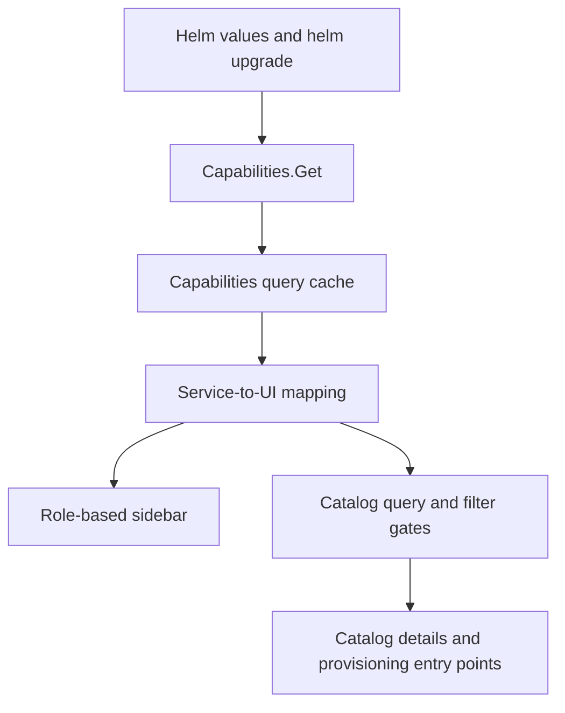

# Per-Service Enablement UI

| Field       | Value |
|-------------|-------|
| Author(s)   | Rastislav Wagner |
| Jira        | [OSAC-5450](https://redhat.atlassian.net/browse/OSAC-5450) |
| PRD         | [prd.md](prd.md) |
| Date        | 2026-09-21 |

The source PRD does not assign FR/NFR identifiers. This design uses six local
traceability labels—`PRD-UI-1` through `PRD-UI-6`—for the UI-relevant PRD
requirements; these labels organize coverage and do not introduce new scope.

# 1. Overview

The UI consumes the fulfillment-service Capabilities response to determine
which service surfaces are available. CaaS, VMaaS, and BMaaS map to the
existing cluster, virtual-machine, and bare-metal navigation, catalog
categories, and provisioning entry points. MaaS has no UI surface in the
current application. Disabled services are hidden from navigation and visible
catalog/provisioning UI, while existing route behavior remains unchanged and
shared infrastructure remains available. [Locked: D2] [Locked: D5]

The implementation uses the existing generic `useGetResource` hook with the
`Capabilities` service descriptor and exposes the returned `ServiceTier` enum
values through the existing `SessionProvider`. The entire UI remains in the SessionProvider
loading state until Capabilities has loaded; the shell, shared navigation,
routes, and catalog do not mount beforehand. Navigation and catalog consumers
consume the same session capability result; existing route registration remains
unchanged. The UI never changes
enablement; Helm values remain the source of truth and Capabilities remains a
read-only discovery API. [Locked: D4]

# 2. Goals and Non-Goals

## 2.1 Goals

- Fetch the enabled service tiers through the existing typed API/query architecture.
- Prevent disabled service links, catalog categories, catalog requests, and
  provisioning entry points from appearing in the UI.
- Keep role-based navigation and shared infrastructure behavior unchanged.
- Keep the service-to-UI mappings centralized so the returned service tiers are
  consistently applied to navigation and catalog/provisioning surfaces.
- Make loading, API failure, and unauthorized access observable and deterministic.

## 2.2 Non-Goals

- Adding UI for MaaS; no MaaS page or route exists in the current application.
- Allowing the UI to enable or disable services; that remains a Helm operation.
- Implementing compliance scan scoping; downstream compliance work consumes the enablement signal. [Locked: D3]
- Replacing backend dependency enforcement or inventing client-side host-type policy. [Locked: D1]

# 3. Motivation / Background

The current shell statically exposes all tenant service links, and `AppShell`
mounts all tenant service route trees for non-admin roles. `CatalogPage` also
requests all VM, cluster, and bare-metal catalog collections and renders all
three type filters. A disabled backend service can therefore remain visible or
be visible in navigation or the catalog even when its API is unavailable.

The baseline already provides the generic `useGetResource` hook for unary
resource reads. Using it with `Capabilities` avoids a one-off API hook and
keeps capability discovery in the same session boundary used by the shell.
[Codebase: `libs/ui-components/src/api/use-resource.ts`]

# 4. Design

## 4.1 Architecture

`SessionProvider` calls `useGetResource(Capabilities, {}, options)` from
`libs/ui-components/src/api/use-resource.ts`. The generic hook calls the public
`Capabilities.Get` descriptor with an empty request and uses its existing
descriptor/request query key. `SessionProvider` exposes the response's
`enabledServices` list of generated `ServiceTier` values through `useSession()`.
Every shell and catalog consumer therefore reads the same API-provided value and
the same cached query; no `apiQueryKey('v1/capabilities')` hook is introduced.
The Capabilities API contract owns the service-tier vocabulary, while the UI's
central mapping translates known enum values into the corresponding UI gates.

`SessionProvider` is the application-wide readiness gate. While the
Capabilities request is pending, it renders the loading state for the whole UI;
it does not render the PatternFly shell, shared navigation, route content, or
catalog queries. Once the request succeeds, it provides the session context and
the rest of the application mounts in one consistent capability state.

The mapping from services to UI surfaces is centralized in a named constant or
utility:

| ServiceTier value | Existing UI surface | Capability gate |
|-------------------|---------------------|-----------------|
| `ServiceTier.CAAS` (`SERVICE_TIER_CAAS` in REST/JSON) | Clusters and cluster catalog items | Cluster navigation and catalog query/filter/create action |
| `ServiceTier.VMAAS` (`SERVICE_TIER_VMAAS` in REST/JSON) | Virtual Machines and VM catalog items | VM navigation and catalog query/filter/create action |
| `ServiceTier.BMAAS` (`SERVICE_TIER_BMAAS` in REST/JSON) | Bare Metal and bare-metal catalog items | Bare-metal navigation and BM catalog query/filter/create action |
| `ServiceTier.MAAS` (`SERVICE_TIER_MAAS` in REST/JSON) | None in this application | No navigation or catalog/provisioning UI is created |

`ShellSidebar` reads `enabledServices` from `useSession()` and passes the set to
the role-based navigation builder. `SessionProvider` does not render the shell
until Capabilities is loaded, so a disabled service cannot appear briefly during
the first render. [Locked: D5]

`AppShell` keeps the existing tenant route families and direct-URL behavior.
Capability gating is limited to the service navigation and visible
catalog/provisioning UI elements; route registration and route-level redirects
are not changed by this design. Backend authorization and service availability
remain responsible for direct route/API access.

`CatalogPage` reads the enabled service set from `useSession()`, gates each
catalog query with the relevant capability, and builds
type filters only for enabled services. The existing URL-backed filters remain
supported; a URL containing a disabled type is ignored and does not trigger a
disabled query. Catalog cards retain their current detail and create mappings,
but those detail/create actions are rendered only for enabled services. The backend remains
the authority for dependent CaaS host types: the UI consumes the filtered
HostTypes/catalog data and does not reconstruct BMaaS/VMaaS dependency rules.
[Locked: D1]



The diagram shows that Helm remains outside the UI and changes the state only
through the backend response. All UI consumers read the same cached discovery
result, so a service cannot be hidden from navigation while still being fetched
by the catalog while navigation is hidden.

Capabilities failure is fail-closed for the application shell:
`SessionProvider` withholds the session context and renders a PatternFly
error/retry state until discovery succeeds. An `UnauthorizedError` continues
through the existing authentication flow. This preserves the invariant that
the UI does not expose a service whose enabled state it cannot establish.

## 4.2 Data Model / Schema Changes

No application database schema changes are required.

The UI consumes the `enabled_services` field on `CapabilitiesGetResponse`:

```protobuf
repeated ServiceTier enabled_services = 2;
```

OSAC-5463 changes the element type of this existing field from `string` to the
`ServiceTier` enum while keeping the field name and number stable. The public
and private generated TypeScript descriptors must be regenerated with
`pnpm gen-types` after the OSAC-5463 proto change; generated files are not
edited manually. The generated `ServiceTier` enum is consumed directly by the
UI mapping; the UI does not parse or compare wire-format strings.

## 4.3 API Changes

The UI adds no endpoint. It consumes the existing public endpoint:

```text
GET /api/fulfillment/v1/capabilities
```

The response includes the existing authentication data plus enum-valued service
tiers. Connect clients receive typed `ServiceTier` values. The REST/JSON
representation uses the generated enum names:

```json
{
  "authn": {},
  "enabled_services": ["SERVICE_TIER_CAAS", "SERVICE_TIER_VMAAS"]
}
```

The UI does not rewrite the returned enum values or send an enablement
mutation; installation and day-2 changes remain Helm operations. [Locked: D4]

## 4.4 Scalability and Performance

The change adds one small unary read when the application session is
initialized. Capabilities are not polled or automatically refetched during a
running session; a deployment change is observed by starting a new application
session. A user-initiated retry is available only when the initial request
fails. The returned `ServiceTier` list is small and has negligible CPU and
memory cost.

Disabling catalog queries for disabled services reduces backend requests. No
database reads, writes, storage, retention, or cleanup behavior changes.

## 4.5 Security Considerations

The Capabilities request uses the existing authenticated Connect transport and
interceptors. No new credentials, permissions, or browser storage are added.

Capability data controls presentation; it is not an authorization boundary or
a route gate. Backend APIs and dependency validation must continue to enforce
service availability and tenant authorization. Existing route registration and
direct-route behavior are unchanged.
[Locked: D1]

## 4.6 Failure Handling and Recovery

- **Capabilities loading:** `SessionProvider` renders the loading state for
  the whole UI and does not mount the application shell, shared navigation,
  routes, or catalog queries.
- **Capabilities unavailable:** `SessionProvider` renders a PatternFly
  error/retry state and does not mount the application shell. Retrying calls
  the same `useGetResource(Capabilities, {}, ...)` query; there is no periodic
  polling or automatic refetch after a successful session load.
- **Unauthenticated response:** The existing `connectErrorInterceptor` maps
  the response to `UnauthorizedError`, preserving the current login redirect.
- **Service tiers:** Known `ServiceTier` values are matched against the
  centralized UI mapping. `ServiceTier.UNSPECIFIED` and values without a UI
  mapping do not enable any service surface.
- **Deployment capability changes:** A new application session is required to
  discover a changed Capabilities response. The running session does not poll
  or automatically refetch the `ServiceTier` list.
- **Capabilities succeeds but a catalog query fails:** The existing per-query
  catalog error state remains visible for that enabled service. The UI does not
  infer that the service is disabled from an individual catalog error.

## 4.7 RBAC / Tenancy

No new roles or permissions are required. Existing role-based navigation is
applied after capability filtering: administrators retain their current admin
navigation, tenant administrators and tenant users see only enabled tenant
services, and the identity-provider manager remains restricted by the existing
role rules. The Capabilities-provided `enabledServices` value is part of the
existing session context.

Capability state is deployment-wide, not tenant-specific. Existing tenant and
project filtering remains in the resource hooks and is not replaced by the
service gate.

Administrators do not have service-specific pages in the current UI, so no
admin service-page gating is required. Their existing infrastructure and
administrative navigation remains governed by administrator routes and role
rules. Capability filtering applies only to tenant service navigation and
tenant catalog/provisioning UI.

## 4.8 Extensibility / Future-Proofing

The service mapping is centralized and typed against the generated `ServiceTier`
enum, so adding a supported UI service requires one mapping entry plus its
navigation/catalog behavior rather than changes to every consumer. `MAAS`
remains a Capabilities enum value with no UI mapping in this application; this
story does not create MaaS navigation, catalog items, or provisioning flows.

# 5. Interface Changes

## IC-1: Runtime Capabilities discovery through SessionProvider

**Requirements:** `PRD-UI-1`, `PRD-UI-2`, `PRD-UI-3`, `PRD-UI-6`

`SessionProvider` calls `useGetResource(Capabilities, {}, options)` over
`GET /api/fulfillment/v1/capabilities` and exposes its `enabledServices` list
of `ServiceTier` enum values through `useSession()`. The generic resource
hook owns the query key and cache behavior; no capabilities-specific
`apiQueryKey` hook is added. See §4.1–§4.3.

## IC-2: Capability-filtered service navigation

**Requirements:** `PRD-UI-1`, `PRD-UI-3`, `PRD-UI-5`

The tenant Services navigation renders only links whose service is enabled.
Shared navigation remains governed by the existing role rules. See §4.1 and
§4.7.

## IC-3: Capability-filtered catalog

**Requirements:** `PRD-UI-1`, `PRD-UI-3`, `PRD-UI-4`

The catalog renders only enabled service categories, skips disabled catalog
requests, ignores disabled URL filters, and exposes details/create actions only
for enabled catalog item kinds. Backend-filtered dependency data remains
authoritative. See §4.1 and §4.6.

## IC-4: Application-wide service-discovery loading and error states

**Requirements:** `PRD-UI-2`, `PRD-UI-3`, `PRD-UI-5`

The whole UI exposes deterministic loading, retryable discovery-error, and
unauthorized states before the shell and catalog mount; unresolved service
surfaces are never rendered. See §4.1 and §4.6.

## 5.1 UI Test Cases

These cases use the generated `ServiceTier` constants in the Capabilities
fixture (`ServiceTier.CAAS`, `ServiceTier.VMAAS`, and so on) and the existing
`createMockConnectTransport` test transport. The `SERVICE_TIER_*` names below
are the corresponding wire/JSON enum values. Assertions use user-visible
navigation, catalog, and provisioning surfaces, plus request calls to verify
that disabled services are not queried.

### UI-TC-1: CaaS enum enables cluster surfaces

**Capabilities response:** `enabled_services: [SERVICE_TIER_CAAS]`

**Expected results:** The Services navigation shows Clusters; the catalog
requests and renders cluster items; cluster catalog filters and the cluster
provisioning action are available. VM and bare-metal catalog requests are not
made.

### UI-TC-2: VMaaS enum enables virtual-machine surfaces

**Capabilities response:** `enabled_services: [SERVICE_TIER_VMAAS]`

**Expected results:** The Services navigation shows Virtual Machines; the
catalog requests and renders virtual-machine items; VM catalog filters and the
VM provisioning action are available. Cluster and bare-metal catalog requests
are not made.

### UI-TC-3: BMaaS enum enables bare-metal surfaces

**Capabilities response:** `enabled_services: [SERVICE_TIER_BMAAS]`

**Expected results:** The Services navigation shows Bare Metal; the catalog
requests and renders bare-metal items; bare-metal catalog filters and the
bare-metal provisioning action are available. Cluster and VM catalog requests
are not made.

### UI-TC-4: MaaS enum has no UI mapping

**Capabilities response:** `enabled_services: [SERVICE_TIER_MAAS]`

**Expected results:** The Capabilities request succeeds and the shared UI loads,
but no MaaS navigation link, catalog category, catalog request, or provisioning
action is rendered or created.

### UI-TC-5: Disabled service enums suppress all service surfaces

Run the same test for each supported service with that service omitted from the
Capabilities response and at least one other supported service enabled.

| Omitted enum | Suppressed surfaces |
|--------------|---------------------|
| `SERVICE_TIER_CAAS` | Cluster navigation, cluster catalog request/filter, and cluster provisioning action |
| `SERVICE_TIER_VMAAS` | VM navigation, VM catalog request/filter, and VM provisioning action |
| `SERVICE_TIER_BMAAS` | Bare-metal navigation, bare-metal catalog request/filter, and bare-metal provisioning action |

**Expected results:** The omitted service has no visible navigation or catalog
surface, its catalog request is not made, and its provisioning entry point is
not rendered. A URL filter naming the omitted service is ignored without
triggering its request. Enabled services retain their existing surfaces.

### UI-TC-6: Capabilities discovery failure fails closed

**Capabilities response:** `Capabilities.Get` rejects with a non-authorization
error.

**Expected results:** The shell, service navigation, catalog, catalog requests,
and provisioning entry points do not mount. The UI renders the existing
PatternFly discovery error/retry state. Retrying the discovery request is the
only action that can transition the application into the loaded state.

# 6. Alternatives Considered

## Fetch capabilities before mounting the router

The app could fetch Capabilities before rendering `RouterProvider`. This would
prevent any service route from mounting, but would couple application bootstrap
to a feature-specific query and complicate authentication/error handling. The
design keeps the existing providers and router bootstrap and gates the shell
consumers through the shared query cache.

## Add a separate capabilities API wrapper

Adding another capabilities-specific API wrapper would duplicate the generic
unary resource-query behavior already provided by `useGetResource`. The design
uses `useGetResource(Capabilities, {}, options)` only inside `SessionProvider`,
where the returned `ServiceTier` list is made available through `useSession()` to
all shell consumers.

## Hide links but leave routes mounted

This design intentionally gates navigation and visible catalog/provisioning
elements while leaving existing route registration and direct-URL behavior
unchanged. Backend availability and authorization remain responsible for
direct route/API access. [Locked: D5]

## Let the UI infer dependency availability

The UI could inspect host-type fields and reproduce BMaaS/VMaaS dependency
rules. That would duplicate backend policy and could drift from enforcement.
The design relies on backend-filtered resources and only gates top-level service
surfaces. [Locked: D1]

## Fail open when Capabilities fails

Preserving all existing service surfaces would make older or temporarily
unreachable deployments appear usable, but it could expose disabled services.
The design fails closed for service surfaces to preserve the no-disabled-surface
invariant. [Locked: D5]

# 7. Observability and Monitoring

No new observability changes are required. Existing Connect query errors,
PatternFly error states, authentication handling, and application monitoring
mechanisms apply. The UI does not add a metric or log containing capability
contents because the values are deployment configuration, not user activity.

# 8. Impact and Compatibility

OSAC-5463 is not an additive API change: although the `enabled_services` field
name and number remain stable, its element type changes from `string` to the
`ServiceTier` enum. The UI therefore depends on the OSAC-5463 backend contract
and on regenerated public and private TypeScript descriptors from
`pnpm gen-types`. No data, browser-storage, or compatibility migration is
included. The backend and UI descriptor/client update must be deployed as a
coordinated contract change.

Mixed UI/backend versions are unsupported. If the old backend returns the
string-valued `enabled_services` field, the enum-based UI fails Capabilities
decoding and renders its error/retry state. Existing route behavior is
unchanged.

No database migration, browser storage migration, or Helm configuration change
is made in this repository. Existing service pages continue to work when their
services are enabled. Shared networking, storage, tenant, identity, and event
surfaces remain available. [Locked: D2]

---

## Provenance

Authored: revise @ design 0.11.2 - 5c341b2, workspace main @ 75af9caa (dirty)
Phases: draft, revise, revise, revise, revise, revise, revise, revise

<!-- ai-workflow-provenance:{"schema_version":1,"provenance_kind":"session","workflow":"design","workflow_version":"0.11.2","ai_workflows":"5c341b2","source_repo":"75af9caa (dirty)","source_repo_branch":"main","commits_behind_main":0,"commits_ahead_main":220,"main_ref":"main","phases":["draft","revise","revise","revise","revise","revise","revise","revise"],"authoring_modes":["skill"],"context_changed":false,"origin_untracked":false} -->
