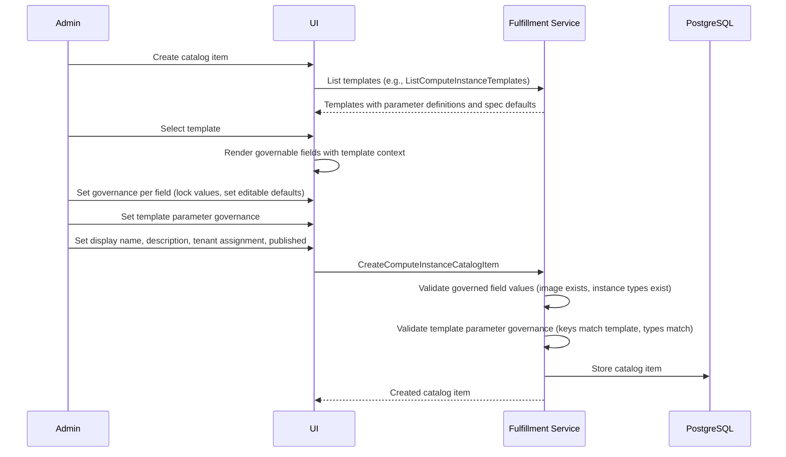
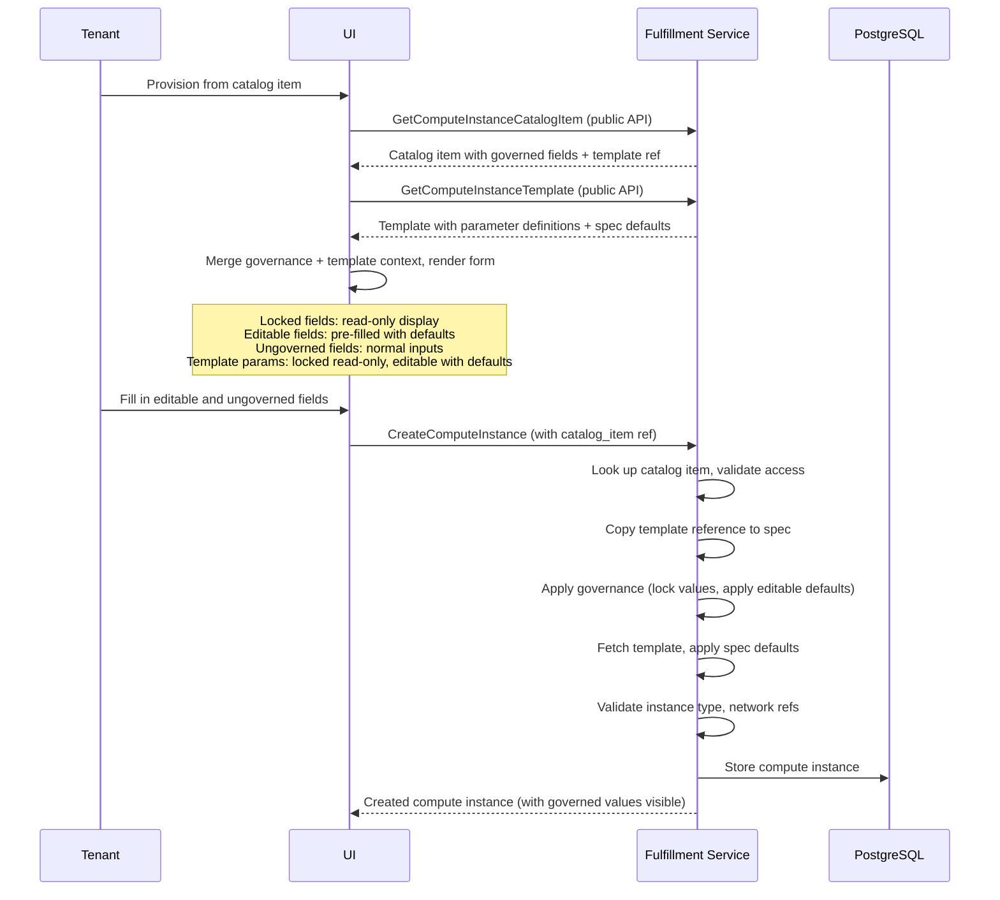

# Catalog Items v2 - Field Governance Redesign

## Summary

This design replaces the generic `FieldDefinition` model (freeform dot-notation paths, `editable` bool, JSON Schema validation) with strongly-typed proto fields per catalog item type, each with a `oneof`-based behavior discriminator (`locked`/`editable`). Template parameter governance is separated from spec field governance and uses a generic typed wrapper validated at runtime against the referenced template's parameter definitions. 

Constraints on editable fields (allowed values, min/max ranges) are deferred to OSAC-3937. The v1 behavior model supports only locked (admin-set immutable value) and editable (tenant-set with optional default). The exact field list per catalog item type is TBD pending alignment meeting (Ygal, Avishay, Michael) - fields requiring day-2 mutability are excluded from the proto to prevent accidental misconfiguration.

See [PRD](prd.md) for detailed requirements.

## Motivation

The current catalog item field governance model uses a `repeated FieldDefinition` with five loosely-typed fields: a dot-notation `path` string to identify the target field, a `bool editable` flag, a `google.protobuf.Value default`, a `string display_name`, and a `string validation_schema` (JSON Schema). This design has three concrete problems:

1. **No compile-time field validation.** The `path` field accepts arbitrary strings like `spec.instane_type` (typo) or `spec.nonexistent_field`. Invalid paths are caught only at runtime - during resource creation when `applyFieldDefinitions` serializes the spec to JSON and walks the path. With typed proto fields, invalid references are impossible because the proto compiler won't generate them. [Codebase: internal/servers/catalog_item_validation.go]

2. **No per-field type customization.** Every field's default is a `google.protobuf.Value` and its validation is a JSON Schema string. There is no way to express "instance_type accepts one of these three values" using a typed proto field - it requires hand-authoring a JSON Schema with an `enum` constraint.

3. **No referential integrity for governed values.** A catalog item can lock `image` to a specific image reference, but nothing prevents that image from being deleted. The existing referential integrity triggers (migration 59) protect the resource-to-catalog-item direction (can't delete a catalog item while resources reference it, can't create a resource referencing a non-existent catalog item), but not the catalog-item-to-image or catalog-item-to-instance-type direction. [Codebase: internal/database/migrations/59_add_catalog_item_ref_triggers.up.sql]

This design replaces the generic model with strongly-typed proto fields that make invalid field references impossible at compile time, enable per-field type customization, and support referential integrity for governed values.

### Goals

- Replace `repeated FieldDefinition` with per-catalog-item-type proto fields that make invalid field references impossible at compile time. [Locked: D1]
- Use a `oneof` discriminated union for field behavior (locked/editable) that is extensible to future behaviors (e.g., hidden) without breaking existing clients. [Locked: D6]
- Separate template parameter governance from spec field governance, with template parameters validated at runtime against the template's parameter definitions. [Locked: D3]
- Enforce governance on both resource creation and update. Locked fields are immutable throughout the resource lifecycle. [Locked: D7]
- Prevent admins from including fields that require day-2 mutation (e.g., cluster version, node set size) in the governed field proto at all - compile-time prevention via field exclusion rather than runtime validation.
- Support per-field type customization (e.g., typed reference selectors for instance_type).

### Non-Goals

- Constraints on editable fields (allowed values, min/max ranges) - deferred to OSAC-3937. The `oneof` model is extensible to support composable constraints.
- Hidden field behavior (admin sets value, tenant cannot see the field). The `oneof` model is extensible to support this.
- Lifecycle management and versioning (draft/active/deprecated/retired states) - tracked in OSAC-3943.
- Multi-resource composition (catalog items bundling multiple resources).
- Catalog item override mechanism for tenant admins (OSAC-2539).
- Governance of cluster `version` field: excluded from v1 ClusterCatalogItemFields due to day-2 mutability requirement (tenants must upgrade clusters). The version field references ClusterVersion `spec.version` (semver string like "4.17.0"). Future constraint support (OSAC-3937) may enable version governance with allowed upgrade paths.

## Proposal

Each catalog item type gets its own typed spec message listing the governable fields for that resource type. Each governable field is wrapped in a typed governance message containing a `oneof behavior` with `locked` and `editable` variants. Locked carries the admin's fixed value; editable carries an optional default. Constraints on editable fields (allowed values, min/max ranges) are deferred to OSAC-3937 and removed from v1. Fields not present on the catalog item are ungoverned - tenants set them freely, as if no catalog item exists. [Locked: D2]

Image is a required field on ComputeInstanceCatalogItem and BareMetalInstanceCatalogItem, always implicitly locked. ClusterCatalogItem governs `version` (a reference to ClusterVersion `spec.version`) instead of image; version is excluded from the proto's governed fields because it requires day-2 mutability for cluster upgrades. Fields requiring day-2 mutation are excluded from the proto to prevent accidental misconfiguration - compile-time prevention rather than runtime validation.

Template parameters are governed via `map<string, GovernedTemplateParameter>`, where each entry wraps a `google.protobuf.Any` value with the same locked/editable oneof. Type correctness is validated at runtime against the referenced template's parameter definitions, since template parameter types are not known at compile time.

The three catalog item types (ComputeInstanceCatalogItem, ClusterCatalogItem, BareMetalInstanceCatalogItem) remain separate types. [Locked: D5]

### Workflow Description

#### Admin: Creating a Catalog Item

This workflow applies to all three catalog item types. The admin interacts with the private API (or CLI).



The UI fetches the template first to know which template parameters exist and what their types are. This information drives the template parameter governance form. For spec fields, the governable fields are fixed per catalog item type (defined in the proto) - the UI can render them without fetching the template.

#### Tenant: Provisioning a Resource from a Catalog Item

This workflow shows the two-call pattern: the UI fetches both the catalog item (governance) and the template (parameter definitions) to render the provisioning form.



The server enforces governance on both resource creation and update. During creation, locked values are applied and tenant-provided values for locked fields are rejected. Editable fields accept tenant values or apply defaults. During update, the server looks up the resource's catalog item and rejects changes to locked fields.

#### Example: ComputeInstance Provisioning Flow

**Step 1: Admin creates a catalog item.**

The admin creates a "RHEL 10 Small VM" catalog item with:
- Template: "rhel-base-template"
- Image: locked to `{source_type: "pvc", source_ref: "rhel-10-2026q3"}`
- Instance type: editable, default `"m1.small"`
- SSH public key: editable, no default
- Boot disk: locked to `{size_gib: 50}`
- Run strategy: editable, default `"Always"`
- Template parameters: `disk_format` locked to `"qcow2"`, `enable_monitoring` editable with default `true`

```json
{
  "object": {
    "metadata": {
      "name": "rhel-10-small-vm",
      "display_name": "RHEL 10 Small VM",
      "description": "Standard RHEL 10 VM with small instance types"
    },
    "template": "rhel-base-template",
    "published": true,
    "tenant": "tenant-acme",
    "fields": {
      "image": {"source_type": "pvc", "source_ref": "rhel-10-2026q3"},
      "instance_type": {
        "editable": {"default": "m1.small"}
      },
      "ssh_public_key": {"editable": {}},
      "boot_disk": {"locked": {"value": {"size_gib": 50}}},
      "run_strategy": {"editable": {"default": "Always"}}
    },
    "template_parameters": {
      "disk_format": {"locked": {"value": "qcow2"}},
      "enable_monitoring": {"editable": {"default": true}}
    }
  }
}
```

**Server validation during catalog item creation:**
1. `image.source_ref` "rhel-10-2026q3" references a valid, non-deleted image (referential integrity).
2. `template_parameters` keys ("disk_format", "enable_monitoring") match parameters defined on "rhel-base-template". Value types match the template's parameter type definitions.

**Step 2: Tenant provisions a VM.**

The tenant's UI fetches the catalog item and template, then renders:

| Field | UI Rendering | Value |
|-------|-------------|-------|
| Image | Read-only | RHEL 10 2026-Q3 (source: rhel-10-2026q3) |
| Instance type | Text input (editable) | Pre-filled: m1.small |
| SSH public key | Text input | (empty) |
| Boot disk | Read-only | 50 GiB |
| Run strategy | Text input | Pre-filled: Always |
| User data | Text input (ungoverned) | (empty) |
| Is Windows | Checkbox (ungoverned) | false |
| disk_format | Read-only (locked param) | qcow2 |
| enable_monitoring | Checkbox (editable param) | Pre-checked: true |

The tenant selects `m1.medium`, enters an SSH key, and submits.

```json
{
  "object": {
    "metadata": {"name": "my-dev-vm"},
    "spec": {
      "catalog_item": "rhel-10-small-vm",
      "instance_type": "m1.medium",
      "ssh_public_key": "ssh-ed25519 AAAA...",
      "user_data": "#cloud-config\npackages:\n  - vim"
    }
  }
}
```

**Server processing during resource creation:**
1. Look up catalog item "rhel-10-small-vm", validate it is published and accessible to this tenant.
2. Copy template reference "rhel-base-template" to `spec.template`.
3. Apply governance:
   - `image`: set to `{source_type: "pvc", source_ref: "rhel-10-2026q3"}`. If the tenant included image in the request, reject with InvalidArgument.
   - `instance_type`: editable, tenant sent "m1.medium" - accepted.
   - `ssh_public_key`: editable with no default, tenant provided a value - accepted.
   - `boot_disk`: set to `{size_gib: 50}`. If the tenant included boot_disk, reject.
   - `run_strategy`: editable with default "Always", tenant did not provide - apply default.
   - `user_data`: ungoverned, pass through as-is.
   - `is_windows`: ungoverned, pass through as-is.
4. Apply template parameter governance:
   - `disk_format`: locked, set to "qcow2".
   - `enable_monitoring`: editable, tenant did not provide, apply default `true`.
5. Fetch template "rhel-base-template", apply remaining spec defaults (fields not covered by governance or tenant input).
6. Validate instance type "m1.medium" exists and is not OBSOLETE.
7. Create the compute instance.

**Response includes the full spec with all governed values visible**, so the tenant can see exactly what was provisioned.

#### Example: Cluster Provisioning Flow

**NOTE:** This example is a PLACEHOLDER pending alignment on which fields to include in ClusterCatalogItemFields. The v1 proto will exclude `version` (day-2 mutability for upgrades) and `node_sets.*.size` (day-2 mutability for scaling). Constraints (allowed_values, min/max) are out of v1 scope (OSAC-3937).

**Step 1: Admin creates a ClusterCatalogItem.**

The admin creates a "Production OpenShift Standard" catalog item with:
- Template: "ocp-standard-template"
- Network: locked to `{pod_cidr: "10.128.0.0/14", service_cidr: "172.30.0.0/16"}`
- Template parameters: `cluster_logging` editable with default `true`

```json
{
  "object": {
    "metadata": {
      "name": "prod-ocp-standard",
      "display_name": "Production OpenShift Standard"
    },
    "template": "ocp-standard-template",
    "published": true,
    "tenant": "tenant-acme",
    "fields": {
      "network": {
        "locked": {"value": {"pod_cidr": "10.128.0.0/14", "service_cidr": "172.30.0.0/16"}}
      }
    },
    "template_parameters": {
      "cluster_logging": {"editable": {"default": true}}
    }
  }
}
```

**Step 2: Tenant provisions a Cluster.**

UI rendering:

| Field | UI Rendering | Value |
|-------|-------------|-------|
| Version | Dropdown (ungoverned, from ClusterVersion catalog) | (tenant selects) |
| Node sets | Editable (ungoverned) | (tenant configures) |
| SSH public key | Text input (ungoverned) | (empty) |
| Pull secret | Text input (ungoverned) | (empty) |
| Network | Read-only | Pod CIDR: 10.128.0.0/14, Service CIDR: 172.30.0.0/16 |
| cluster_logging | Checkbox (editable param) | Pre-checked: true |

The tenant selects version, configures node sets, enters SSH key and pull secret, and submits.

**Server processing:**
1. Look up catalog item, validate access.
2. Copy template reference to spec.
3. Apply governance:
   - `network`: set to locked value. Reject if tenant tried to change.
   - `cluster_logging`: editable param with default `true`. Tenant can override.
   - `version`, `node_sets`, `ssh_public_key`, `pull_secret`: ungoverned, pass through tenant values.
4. Apply template parameter governance.
5. Fetch template, apply remaining defaults.
6. Create the cluster.

#### Example: BareMetalInstance Provisioning Flow

**Step 1: Admin creates a BareMetalInstanceCatalogItem.**

The admin creates a "RHEL 10 Bare Metal" catalog item with:
- Template: "bm-rhel-template"
- Image: locked to `{source_type: "http", source_ref: "https://images.example.com/rhel-10.qcow2"}`
- SSH public key: editable, no default
- Run strategy: editable, default `ALWAYS`
- Auto external IP attachment: locked to `true`

```json
{
  "object": {
    "metadata": {
      "name": "rhel-10-bare-metal",
      "display_name": "RHEL 10 Bare Metal"
    },
    "template": "bm-rhel-template",
    "published": true,
    "fields": {
      "image": {"source_type": "http", "source_ref": "https://images.example.com/rhel-10.qcow2"},
      "ssh_public_key": {"editable": {}},
      "run_strategy": {
        "editable": {
          "default": "BARE_METAL_INSTANCE_RUN_STRATEGY_ALWAYS"
        }
      },
      "auto_external_ip_attachment": {"locked": {"value": true}}
    }
  }
}
```

**Step 2: Tenant provisions a BareMetalInstance.**

UI rendering:

| Field | UI Rendering | Value |
|-------|-------------|-------|
| Image | Read-only | RHEL 10 (http source) |
| SSH public key | Text input | (empty) |
| Run strategy | Dropdown: Always, Halted | Pre-selected: Always |
| Auto external IP | Read-only | Enabled |
| User data | Text input (ungoverned) | (empty) |

The tenant enters an SSH key and submits. Server processing follows the same pattern as ComputeInstance: look up catalog item, copy template, apply governance, apply template defaults, create.

### API Extensions

This design modifies the following gRPC services (no new services are added):

**Catalog item services (public + private, all three types):**
- `ComputeInstanceCatalogItemsService` - Create/Update request/response types updated for new message shape
- `ClusterCatalogItemsService` - same
- `BareMetalInstanceCatalogItemsService` - same

**Resource creation and update services (unchanged API surface, changed server behavior):**
- `ComputeInstancesService.Create` / `PrivateComputeInstancesService.Create` - governance application logic rewritten
- `ComputeInstancesService.Update` / `PrivateComputeInstancesService.Update` - governance enforcement on updates (locked fields rejected, editable constraints validated)
- `ClustersService.Create` / `PrivateClustersService.Create` - same
- `ClustersService.Update` / `PrivateClustersService.Update` - same
- `BareMetalInstancesService.Create` / `PrivateBareMetalInstancesService.Create` - same
- `BareMetalInstancesService.Update` / `PrivateBareMetalInstancesService.Update` - same

No new CRDs, webhooks, finalizers, or aggregated API servers are introduced. This is a fulfillment-service-only change.

## UX Alignment

The `@temp-api` types in `osac-ux/libs/types/src/osac/public/v1/` are auto-generated from protobuf. The current generated types match the existing flat catalog item structure. After the proto changes in this design, running `pnpm gen-types` in osac-ux will produce new TypeScript types matching the new proto schema. No manual @temp-api divergence exists for catalog items.

The UI changes required:
- Catalog item admin form: replace the generic field_definitions editor with typed per-field governance controls (dropdowns, text inputs, lock/edit toggles per field)
- Provisioning wizard: render locked fields as read-only, editable fields with constraints, ungoverned fields as normal inputs
- Template parameter section: two-call pattern (fetch catalog item + template) to resolve parameter types and render governance

| UI field (current @temp-api) | Proto field (this EP) | Notes |
|---|---|---|
| `field_definitions` | Removed | Replaced by typed `fields` message |
| N/A | `fields.image` | New: always-locked image on VM/BM |
| N/A | `fields.instance_type` | New: governed string (locked or editable with default) |
| N/A | `template_parameters` | New: map of governed template params |
| `title` / `description` | `metadata.display_name` / `metadata.description` | OSAC-2921 metadata migration |

### Implementation Details/Notes/Constraints

#### Proto Schema

The governance model uses typed wrapper messages per primitive type. Each wrapper contains a `oneof behavior` with `locked` and `editable` variants.

**Governance wrapper messages** (in `field_governance_type.proto`):

```protobuf
// String fields (ssh_public_key, run_strategy, pull_secret, release_image, user_data)
message GovernedStringField {
  oneof behavior {
    LockedStringField locked = 1;
    EditableStringField editable = 2;
  }
}

message LockedStringField {
  string value = 1;
}

message EditableStringField {
  optional string default = 1;
}

// Bool fields (is_windows, auto_external_ip_attachment)
message GovernedBoolField {
  oneof behavior {
    LockedBoolField locked = 1;
    EditableBoolField editable = 2;
  }
}

message LockedBoolField {
  optional bool value = 1;  // optional: distinguish "locked to false" from "not set"
}

message EditableBoolField {
  optional bool default = 1;
}

// Int32 fields (used in nested types: disk size, node set size)
message GovernedInt32Field {
  oneof behavior {
    LockedInt32Field locked = 1;
    EditableInt32Field editable = 2;
  }
}

message LockedInt32Field {
  optional int32 value = 1;  // optional: distinguish "locked to 0" from "not set"
}

message EditableInt32Field {
  optional int32 default = 1;
}

// Disk fields (ComputeInstanceDisk)
message GovernedDiskField {
  oneof behavior {
    LockedDiskField locked = 1;
    EditableDiskField editable = 2;
  }
}

message LockedDiskField {
  ComputeInstanceDisk value = 1;
}

message EditableDiskField {
  optional ComputeInstanceDisk default = 1;
}

// Disk list fields (repeated ComputeInstanceDisk for additional_disks)
message GovernedDiskListField {
  oneof behavior {
    LockedDiskListField locked = 1;
    EditableDiskListField editable = 2;
  }
}

message LockedDiskListField {
  repeated ComputeInstanceDisk values = 1;
}

message EditableDiskListField {
  repeated ComputeInstanceDisk defaults = 1;
}

// Network fields (ClusterNetwork)
message GovernedNetworkField {
  oneof behavior {
    LockedNetworkField locked = 1;
    EditableNetworkField editable = 2;
  }
}

message LockedNetworkField {
  ClusterNetwork value = 1;
}

message EditableNetworkField {
  optional ClusterNetwork default = 1;
}

// BareMetalInstanceRunStrategy enum field
message GovernedBareMetalRunStrategyField {
  oneof behavior {
    LockedBareMetalRunStrategyField locked = 1;
    EditableBareMetalRunStrategyField editable = 2;
  }
}

message LockedBareMetalRunStrategyField {
  BareMetalInstanceRunStrategy value = 1;
}

message EditableBareMetalRunStrategyField {
  optional BareMetalInstanceRunStrategy default = 1;
}

// Template parameters (generic, validated at runtime)
message GovernedTemplateParameter {
  oneof behavior {
    LockedTemplateParameter locked = 1;
    EditableTemplateParameter editable = 2;
  }
}

message LockedTemplateParameter {
  google.protobuf.Any value = 1;
}

message EditableTemplateParameter {
  optional google.protobuf.Any default = 1;
}
```

The `oneof` pattern ensures that when a new behavior variant (e.g., `HiddenStringField hidden = 3`) is added, existing clients that do not know about the new variant see the field as unset (the oneof has no selected branch), rather than silently interpreting it as UNSPECIFIED (which an enum would do). [Locked: D6] [Research: Architecture Pattern 2]

**Per-catalog-item-type spec messages:**

```protobuf
// ComputeInstanceCatalogItem - new fields message
message ComputeInstanceCatalogItemFields {
  // Mandatory, always locked. Server rejects if not set.
  ComputeInstanceImage image = 1;

  // Optional governed fields. Absence means ungoverned.
  optional GovernedStringField instance_type = 2;
  optional GovernedStringField ssh_public_key = 3;
  optional GovernedDiskField boot_disk = 4;
  optional GovernedDiskListField additional_disks = 5;
  optional GovernedStringField run_strategy = 6;
  optional GovernedStringField user_data = 7;
  optional GovernedBoolField is_windows = 8;
}

// ClusterCatalogItem - new fields message
message ClusterCatalogItemFields {
  // NOTE: version (ClusterVersion spec.version reference) and node_sets are EXCLUDED from governed fields.
  // version: requires day-2 mutability for cluster upgrades - tenants must be able to update it.
  // node_sets.*.size: requires day-2 mutability for scaling - tenants must be able to scale node sets.
  // Field selection is compile-time prevention: if a field shouldn't be lockable, don't include it in the proto.
  // The exact field list is TBD pending alignment meeting (Ygal, Avishay, Michael).
  
  optional GovernedNetworkField network = 1;
  
  // Candidates for inclusion (TBD): ssh_public_key, pull_secret, node_sets.*.host_type
  // Bat-Zion feedback: ssh_public_key and pull_secret should NOT be governed (remove from final proto)
}

// BareMetalInstanceCatalogItem - new fields message
message BareMetalInstanceCatalogItemFields {
  // Mandatory, always locked. Server rejects if not set.
  BareMetalInstanceImage image = 1;

  optional GovernedStringField ssh_public_key = 2;
  optional GovernedStringField user_data = 3;
  optional GovernedBareMetalRunStrategyField run_strategy = 4;
  optional GovernedBoolField auto_external_ip_attachment = 5;
}
```

**Updated catalog item top-level messages** (shown for ComputeInstance; Cluster and BareMetalInstance follow the same pattern):

```protobuf
// buf:lint:ignore OSAC_OBJECT_SHAPE
message ComputeInstanceCatalogItem {
  string id = 1;
  Metadata metadata = 2;                                          // display_name, description via OSAC-2921
  string template = 3;
  bool published = 4;
  string tenant = 5;                                              // private only
  ComputeInstanceCatalogItemFields fields = 6;                    // replaces repeated FieldDefinition
  map<string, GovernedTemplateParameter> template_parameters = 7; // new
}
```

The flat object shape (no spec/status) is retained. The API design guidelines explicitly permit this for objects representing static configuration or catalog data. [Codebase: docs/API.md]

#### Node Set Governance (TBD)

Node set governance is TBD pending the field selection alignment meeting (Ygal, Avishay, Michael). The key design question is which node set properties, if any, should be governable.

`node_sets.*.size` is excluded from governance because tenants must be able to scale node sets (day-2 mutability). `node_sets.*.host_type` is a candidate for governance (locking a host type is operationally safe - tenants don't need to change it after provisioning), but this is subject to the field selection decision.

If node set governance is included, the pattern would use per-property governance within each named node set via a `GovernedClusterNodeSet` message. Node sets not present in the catalog item's map would be ungoverned - the tenant defines them freely.

#### Template Parameter Governance

Template parameters are governed via `map<string, GovernedTemplateParameter>` on the catalog item. The key is the parameter name as defined in the template's parameter definitions.

Since template parameter types are defined by the template at runtime (not in the proto schema), type correctness cannot be enforced at compile time. The server validates:

1. **Key existence**: every key in `template_parameters` must match a parameter defined on the referenced template.
2. **Type correctness**: the `google.protobuf.Any` value in `locked.value` or `editable.default` must match the parameter's declared type from the template's `ComputeInstanceTemplateParameterDefinition.type` field.
3. **Required parameters**: if the template has a required parameter and the catalog item does not include it in `template_parameters`, the catalog item is invalid.

The UI resolves template parameter types by fetching the template (`GetComputeInstanceTemplate`) and reading its `parameters` field, which lists each parameter's name, title, description, required flag, type, and default. This two-call pattern (catalog item + template) gives the UI everything it needs to render the governance form for admins and the provisioning form for tenants.

#### Image: Mandatory and Always Locked

On ComputeInstanceCatalogItem and BareMetalInstanceCatalogItem, `image` is a required field that is implicitly locked. It is not wrapped in a governance `oneof` because there is no behavior choice - the admin always provides the image value, and the tenant always gets that value during provisioning.

This design choice keeps the admin UX simple (no "locked/editable" toggle for a field that can only be locked) while preserving extensibility (if image ever becomes optionally editable, wrap it in a GovernedImageField).

The admin can update the image on an existing catalog item via the Update API (e.g., to bump versions for CVE fixes). This does not affect already-provisioned resources - only new resources created from the catalog item get the updated image.

#### Catalog Item Update Governance Constraints

When an admin updates a catalog item, the server validates that governance is not tightened on existing fields:

- **Editable or absent to locked**: rejected. Existing resources may have tenant-set values for that field; locking it would retroactively invalidate those resources on their next update.
- **Locked to editable or absent**: allowed (relaxing governance).
- **Changing locked value**: allowed. The admin can update locked field values (e.g., bump image for CVE fixes). Changes only affect new provisioning; existing resources retain the values they were created with and continue to enforce those original locked values on updates.
- **Changing editable default**: allowed. Existing resources are unaffected; new resources get the new default if the tenant omits the field.

The server compares the existing catalog item's governance with the update request and rejects any transition that would tighten field governance.

**Note**: Constraints on editable fields (allowed_values, min/max) are out of v1 scope (OSAC-3937).

#### Field Selection and Day-2 Mutability

Fields requiring day-2 mutation (cluster version for upgrades, node set size for scaling) are **excluded from the governed field proto entirely** - compile-time prevention rather than runtime validation. The ClusterCatalogItemFields proto does not include `version` or `node_sets.*.size` fields, making it impossible to accidentally lock them.

The exact field list per catalog item type is TBD pending alignment meeting between Ygal, Avishay, and Michael (to be scheduled by Ygal). The principle: if a field operationally requires day-2 mutability, don't expose it as governable. This is a one-time design decision per field, encoded in the proto schema.

**Example field exclusions:**
- **ClusterCatalogItem**: `version` (excluded - locking would prevent cluster upgrades), `node_sets.*.size` (excluded - locking would prevent scaling)
- Per Bat-Zion's review feedback: `ssh_public_key` and `pull_secret` should also be excluded (not governable)

#### Constraints on Editable Fields (Out of v1 Scope)

Allowed values, min/max ranges, and other constraints on editable fields are **deferred to OSAC-3937**. The v1 `EditableStringField` and `EditableInt32Field` messages contain only an optional `default` field - no `allowed_values`, `min`, or `max`.

The behavior model uses `oneof` for extensibility: future constraint support can add new editable variants (e.g., `EditableStringFieldWithConstraints`) without breaking existing clients that only know about the unconstrained variant.

#### Referential Integrity

New database referential integrity triggers prevent deletion of resources referenced by catalog items. Since constraints (allowed_values) are out of v1 scope, only locked field values require integrity protection.

**ComputeInstanceCatalogItem:**
1. **Image references**: prevent deletion of images referenced by `fields.image` (always locked, mandatory).
2. **InstanceType references**: prevent deletion of instance types referenced by `fields.instance_type.locked.value` (if the field is locked).

**ClusterCatalogItem:**
3. **No referential integrity in v1**: version field is excluded from governed fields (day-2 mutability requirement). Constraints feature (OSAC-3937) will add integrity for allowed_values when editable fields gain constraint support.

**BareMetalInstanceCatalogItem:**
4. **Image references**: prevent deletion of images referenced by `fields.image`.

These triggers follow the existing pattern in migration 59 (SQLSTATE Z0002/Z0003 for referential integrity violations). [Codebase: internal/database/migrations/000059]

#### Governance Application Logic

The current `applyFieldDefinitions` function (JSON-path-based, ~100 lines) is replaced with typed governance application. The new logic:

**During Create:**
1. For each governed field on the catalog item:
   - If `locked`: set the locked value on the resource spec. If the tenant provided a value for this field, reject with `InvalidArgument` ("field X is locked by catalog item").
   - If `editable`: if the tenant provided a value, accept it. If the tenant did not provide a value and a `default` is set, apply the default. If no default and the field is not required on the resource, leave unset.
2. For ungoverned fields: pass through the tenant's value (or leave unset) without modification.
3. For template parameters: same locked/editable logic, with type validation against the template's parameter definitions.

**During Update:**
1. Look up the resource's catalog item from the `catalog_item` field (immutable on the resource).
2. For each governed field on the catalog item:
   - If `locked`: reject the update if the tenant is changing this field's value (`InvalidArgument`: "field X is locked by catalog item").
   - If `editable`: accept the new value. (Constraint validation will be added when OSAC-3937 introduces allowed_values/min/max.)
3. For ungoverned fields: allow changes without governance checks.

The `catalogItem` interface changes from:

```go
type catalogItem interface {
    proto.Message
    GetPublished() bool
    GetTemplate() string
    GetFieldDefinitions() []*privatev1.FieldDefinition
    GetMetadata() *privatev1.Metadata
}
```

to per-type interfaces or a generic approach using the typed fields messages. The specific Go implementation pattern will be determined during implementation.

#### Database Schema

Proto shape changes are transparent to the database schema. Catalog items are stored as JSONB in the `data` column, so the new proto structure is automatically persisted and queried. No schema migration is needed for the proto change itself.

New migrations are needed for:
1. Referential integrity triggers for image and instance_type references (following the migration 59 pattern).
2. Dropping the existing data if needed (pre-GA, existing catalog items will be recreated). [Locked: D4]

#### CLI Updates

CLI commands for catalog item management (`osac create compute-instance-catalog-item`, `osac get`, `osac describe`, `osac edit`, `osac delete`) are updated to reflect the new proto shape. The `create` and `edit` commands accept the new governance fields. The `describe` command displays governance per field.

### Security Considerations

This feature inherits the existing security model without changes. Catalog items use the same OPA-based authorization, tenant isolation (via `osac.openshift.io/tenant` annotation), and public/private API split as today.

The key security property is the governance enforcement: locked fields cannot be overridden by tenants during provisioning. The server enforces this server-side - the UI may render fields as read-only, but the server is the enforcement point. A tenant submitting a direct API request with a value for a locked field receives an `InvalidArgument` error.

The `oneof` pattern for field behavior improves security over the current `bool editable` approach: if a new behavior variant is added (e.g., `hidden`), old servers that don't know about it will see the oneof as unset (no governance applied) rather than misinterpreting an unknown enum value as UNSPECIFIED. This fail-open behavior for unknown governance types is safer than silently applying a wrong governance rule. [Locked: D6]

### Failure Handling and Recovery

**Catalog item creation with invalid references:**
- Image reference points to non-existent or deleted image: `InvalidArgument` with message identifying the image.
- Template parameter key not defined on template: `InvalidArgument` with message identifying the unknown parameter.
- Template parameter value type mismatch: `InvalidArgument` with expected vs. actual type.

**Resource creation with catalog item governance:**
- Catalog item not found or not published: `NotFound` or `PermissionDenied` (existing behavior, unchanged).
- Tenant provides value for locked field: `InvalidArgument` ("field X is locked by catalog item Y").
- Editable field with no default and no tenant value, but field is required on resource: `InvalidArgument` ("field X is required").
- Referenced image deleted after catalog item creation (integrity trigger bypassed somehow): resource creation fails at template application or provisioning stage with a descriptive error.

**Resource update with catalog item governance:**
- Tenant changes a locked field: `InvalidArgument` ("field X is locked by catalog item Y").
- Resource has no catalog item (created without one): no governance checks on update.

**Recovery:**
- All failures are synchronous API errors. No reconciliation or async recovery is needed.
- The admin can update the catalog item to fix invalid references (e.g., update image after CVE fix).

### RBAC / Tenancy

No RBAC or tenancy changes are required. Catalog items already use:
- `osac.openshift.io/tenant` annotation for tenant scoping
- Public API filters by published + tenant visibility
- Private API provides full CRUD for admins

The tenant admin catalog item feature (organization-scoped catalog items) uses the same tenant isolation model. A tenant admin's catalog items are scoped to their tenant and visible only within it.

### Observability and Monitoring

No new observability changes. Existing monitoring mechanisms apply. The governance application logic is synchronous within the Create request path - existing request latency and error rate metrics capture its behavior.

### Risks and Mitigations

| Risk | Impact | Mitigation |
|------|--------|------------|
| Message type proliferation: each primitive type needs Governed/Locked/Editable wrapper messages | Proto file complexity, maintenance burden | The wrapper pattern is mechanical and consistent. Code generation or shared test helpers reduce the per-type cost. The alternative (generic Value wrapper) loses compile-time type safety, which is the primary motivation. |
| Node set governance complexity: per-property governance within a map field is a novel pattern in OSAC | Implementation complexity, edge cases around ungoverned node sets vs. governed node sets | The GovernedClusterNodeSet message is small (two fields). Testing covers: fully governed node set, partially governed, ungoverned node sets alongside governed ones. |
| Admin accidentally locks a day-2 field | Cluster upgrades or scaling blocked for all resources provisioned from that catalog item | Day-2 fields (version, node_set size) are excluded from the governed fields proto entirely - compile-time prevention makes it impossible to lock them. |

### Drawbacks

**Proto complexity increases significantly.** The current model uses one `FieldDefinition` message for all governance. The new model requires ~15 wrapper messages (Governed/Locked/Editable for each primitive type) plus three per-catalog-item-type spec messages. This is the direct cost of compile-time type safety - the alternative (keeping generic wrappers) is exactly the problem this redesign solves.

**Three parallel sets of governance types.** Each catalog item type gets its own fields message, leading to parallel implementation in servers and tests. This mirrors the existing pattern (three parallel catalog item types with nearly identical code) and is the cost of keeping separate types rather than unifying them. [Locked: D5]

## Alternatives (Not Implemented)

### Alternative 1: Enum for Field Behavior

Use a `FieldBehavior` enum (LOCKED/EDITABLE) instead of `oneof`:

```protobuf
enum FieldBehavior {
  FIELD_BEHAVIOR_UNSPECIFIED = 0;
  FIELD_BEHAVIOR_LOCKED = 1;
  FIELD_BEHAVIOR_EDITABLE = 2;
}
```

**Pros:** Simpler proto schema, fewer message types.
**Cons:** Unknown enum values silently become `FIELD_BEHAVIOR_UNSPECIFIED` (0) in proto3. If `FIELD_BEHAVIOR_HIDDEN` (3) is added later, old clients interpret it as `UNSPECIFIED` - potentially applying no governance to a field that should be hidden. This is a security-relevant misinterpretation. Additionally, the enum approach requires separate fields for the locked value, editable default, and constraints, loosely coupled to the behavior value. [Locked: D6] [Research: Architecture Pattern 2]

**Rejection reason:** The `oneof` approach carries typed data per variant and handles unknown variants safely.

### Alternative 2: Generic GovernedField with google.protobuf.Value

Use a single `GovernedField` message with `google.protobuf.Value` for all field types:

```protobuf
message GovernedField {
  oneof behavior {
    LockedField locked = 1;
    EditableField editable = 2;
  }
}
message LockedField {
  google.protobuf.Value value = 1;
}
message EditableField {
  optional google.protobuf.Value default = 1;
}
```

**Pros:** One wrapper type for all fields, fewer message definitions.
**Cons:** Loses compile-time type safety. A `GovernedField` on `instance_type` could carry a boolean value without proto-level error. The same `GovernedField` on `boot_disk` would need to carry a JSON object and parse it back. This is exactly the v1 problem (`google.protobuf.Value default`) that the redesign aims to solve.

**Rejection reason:** The primary motivation for this design is compile-time type safety. A generic Value wrapper defeats it.

### Alternative 3: Keep FieldDefinition, Add Type Annotations

Keep the generic `FieldDefinition` model but add proto-level type annotations for each supported field:

```protobuf
message FieldDefinition {
  string path = 1;
  FieldBehavior behavior = 2;
  oneof typed_value {
    string string_value = 3;
    bool bool_value = 4;
    int32 int32_value = 5;
    ComputeInstanceImage image_value = 6;
    // ...
  }
}
```

**Pros:** Backward-compatible with the generic model, adds some type safety.
**Cons:** Still uses freeform `path` strings. The `oneof typed_value` grows unboundedly as new field types are added. No compile-time guarantee that a specific catalog item type only uses fields valid for its resource type.

**Rejection reason:** Does not solve the core problem of freeform field references.

## Open Questions

### 1. Which fields should be included in each catalog item type's governed fields proto?

The exact field list per catalog item type is TBD pending alignment meeting between Ygal, Avishay, and Michael (to be scheduled by Ygal). The principle is compile-time prevention: fields requiring day-2 mutability are excluded from the proto entirely, making it impossible to accidentally lock them.

Key decisions needed:
- **ClusterCatalogItem**: Which fields beyond `network` should be governable? Should `ssh_public_key`, `pull_secret`, or `node_sets.*.host_type` be included? Bat-Zion's feedback: exclude `ssh_public_key` and `pull_secret`.
- **ComputeInstanceCatalogItem / BareMetalInstanceCatalogItem**: Is the current field list correct, or should some fields be excluded?
- **Node set governance**: If any node set properties are governable (e.g., `host_type`), should the catalog item define which node sets must exist, or only govern properties of node sets the tenant creates?

**Owner:** Product team (Ygal, Avishay, Michael)
**Impact:** Determines the final proto schema for all three catalog item types.

## Test Plan

### Unit Tests

- Governance application: locked field rejects tenant value, editable field applies default when tenant omits value, editable field accepts tenant value when provided.
- Governance application for each primitive type: string, bool, int32, disk, disk list, network, run strategy enum.
- Template parameter governance: locked parameter applies value, editable parameter validates type against template definition, unknown parameter key rejected.
- Image mandatory: ComputeInstanceCatalogItem and BareMetalInstanceCatalogItem reject creation without image.
- Overlay semantics: ungoverned fields pass through without modification.
- Referential integrity validation: catalog item creation with non-existent image rejected, deletion of image referenced by catalog item rejected.
- Error messages: each validation failure produces a specific, actionable error message.
- Update-time governance: locked field rejected on update, resource without catalog item skips governance on update.
- Catalog item update governance constraints: editable-to-locked transition rejected, locked-to-editable transition accepted, locked value change accepted (new resources get new value, existing resources retain original).

### Integration Tests

- End-to-end catalog item CRUD with new proto shape in kind cluster.
- Resource creation from catalog item with governance enforcement.
- Referential integrity: attempt to delete image referenced by catalog item, verify rejection.
- Cross-tenant isolation: tenant A cannot see tenant B's catalog items, published items visible to assigned tenant.
- Template parameter governance: create resource with locked and editable template parameters, verify values applied correctly.

### E2E Tests

- Full provisioning flow: admin creates catalog item, tenant provisions resource, verify governed values in the created resource.
- Catalog item update: admin updates image on catalog item, new provisioning uses updated image, existing resources unchanged.
- Update-time governance: tenant attempts to modify locked field on existing resource, verify rejection.

## Graduation Criteria

Graduation criteria will be defined when targeting a release. Expected stages: Dev Preview -> Tech Preview -> GA based on production deployment feedback.

## Upgrade / Downgrade Strategy

This is a breaking API change to an existing pre-GA API. No upgrade migration is needed. Existing catalog items using the `field_definitions` model will be recreated using the new proto shape. [Locked: D4]

Downgrade requires reverting to the previous fulfillment-service version and recreating catalog items in the old format.

## Version Skew Strategy

This change is entirely within the fulfillment-service. No version skew considerations with osac-operator or other components. The catalog item proto change is self-contained - the operator does not interact with catalog items.

## Support Procedures

**Detecting failures:**
- Catalog item creation failures surface as gRPC `InvalidArgument` errors with descriptive messages in the API response.
- Governance application failures during resource creation surface as gRPC `InvalidArgument` errors.
- Referential integrity violations surface as gRPC `FailedPrecondition` errors with SQLSTATE codes Z0002/Z0003.
- All failures are logged at the server with structured fields (catalog_item_id, field_name, violation_type).

**Disabling:**
- The feature cannot be disabled independently. To revert, deploy the previous fulfillment-service version.
- Existing resources created from catalog items are not affected by reverting - they are independent resources after creation.

**Recovery:**
- Re-enabling (redeploying the new version) is safe. Catalog items must be recreated since this is a breaking proto change.

## Infrastructure Needed

None.
