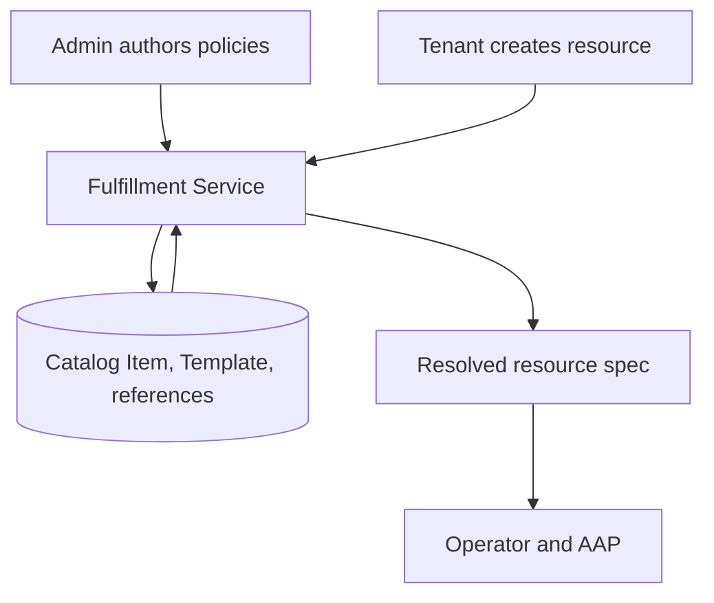

# Catalog Items v2: Typed Provisioning Governance

## Summary

This design replaces `FieldDefinition` with typed policies for selected resource fields and Template parameters. Each policy has one of three states: ungoverned, locked, or editable with an optional Catalog default.

Provisioning continues through the standard `Create` RPC for ComputeInstance, Cluster, and BareMetalInstance. Each request selects exactly one source: a Catalog Item or a Template. Catalog-based creation applies policy, materializes `spec.template`, resolves all defaults, validates the final spec, and persists the resource.

`spec.catalog_item` remains as immutable weak provenance. Existing resources use their persisted Template reference and resolved fields throughout their lifecycle. Catalog Item changes apply only to future provisioning.

Key decisions:

- Typed `oneof` policies represent field identity and behavior.
- Resolution follows tenant input, Catalog default, Template default, then system default.
- Existing resource `Create` RPCs remain the provisioning surface.
- Resource lists retain their ordinary `repeated` shape.
- Five scalar fields gain optional presence.
- Existing Catalog Item services and JSONB persistence are reused; no new provisioning service or database table is introduced.

See the [PRD](prd.md) for product requirements.

## Table of Contents

- [Summary](#summary)
- [End-to-end example](#end-to-end-example)
- [Motivation and scope](#motivation-and-scope)
  - [Motivation](#motivation)
  - [In scope](#in-scope)
  - [Deferred from the first field set](#deferred-from-the-first-field-set)
  - [Out of scope](#out-of-scope)
  - [Dependencies](#dependencies)
- [Architecture](#architecture)
  - [Provisioning model](#provisioning-model)
  - [Resolution precedence](#resolution-precedence)
  - [Resource lifecycle and provenance](#resource-lifecycle-and-provenance)
  - [Transaction boundary](#transaction-boundary)
- [Policy model](#policy-model)
  - [Scalar policy](#scalar-policy)
  - [Reference policy](#reference-policy)
  - [List policy](#list-policy)
  - [Template parameter policy](#template-parameter-policy)
- [API design](#api-design)
  - [Catalog Item services](#catalog-item-services)
  - [Common resource shape](#common-resource-shape)
  - [Presence changes](#presence-changes)
  - [ComputeInstance](#computeinstance)
  - [Cluster](#cluster)
  - [BareMetalInstance](#baremetalinstance)
- [Processing flows](#processing-flows)
  - [Catalog Item authoring](#catalog-item-authoring)
  - [Resource Create](#resource-create)
  - [Reference semantics](#reference-semantics)
  - [Materialization and validation](#materialization-and-validation)
- [RBAC and UX](#rbac-and-ux)
  - [Visibility](#visibility)
  - [Authoring UI](#authoring-ui)
  - [Tenant UI](#tenant-ui)
- [Operational behavior and rollout](#operational-behavior-and-rollout)
  - [Failures](#failures)
  - [Security](#security)
  - [Observability](#observability)
  - [Rollout and compatibility](#rollout-and-compatibility)
- [Implementation plan](#implementation-plan)
  - [Fulfillment API](#fulfillment-api)
  - [Fulfillment service](#fulfillment-service)
  - [Bare Metal provisioning source](#bare-metal-provisioning-source)
  - [Database](#database)
  - [Operator and AAP boundaries](#operator-and-aap-boundaries)
  - [UI and CLI](#ui-and-cli)
- [Risks and alternatives](#risks-and-alternatives)
  - [Alternatives considered](#alternatives-considered)
- [Test plan](#test-plan)
  - [Unit tests](#unit-tests)
  - [Integration tests](#integration-tests)
  - [E2E tests](#e2e-tests)
- [Graduation criteria](#graduation-criteria)

## End-to-end example

The Template `ocp_virt_vm` provides a resource default `boot_disk.size_gib = 10` and two Template parameters: `exposed_ports` (default `22/tcp`) and `guest_os_family` (default `linux`).

A tenant-owned Catalog Item `small-rhel-vm` locks the instance type, offers an editable boot-disk default, exposes both Template parameters with a Catalog default only for `exposed_ports`, and leaves `ssh_public_key` ungoverned:

```json
{
  "metadata": { "name": "small-rhel-vm" },
  "template": { "name": "ocp_virt_vm", "shared": true },
  "fields": {
    "instance_type": {
      "locked": { "name": "small", "shared": true }
    },
    "boot_disk": {
      "size_gib": {
        "editable": { "default_value": 80 }
      }
    }
  },
  "template_parameters": {
    "exposed_ports": {
      "editable": {
        "default_value": {
          "@type": "type.googleapis.com/google.protobuf.StringValue",
          "value": "22/tcp,443/tcp"
        }
      }
    },
    "guest_os_family": { "editable": {} }
  }
}
```

The tenant raises the disk to `100`, supplies a key, and overrides `exposed_ports`. It omits `guest_os_family`, which falls through to the Template default, and omits the locked `instance_type`:

```json
{
  "spec": {
    "catalog_item": { "name": "small-rhel-vm" },
    "boot_disk": { "size_gib": 100 },
    "ssh_public_key": "ssh-ed25519 ...",
    "template_parameters": {
      "exposed_ports": {
        "@type": "type.googleapis.com/google.protobuf.StringValue",
        "value": "22/tcp,80/tcp,443/tcp"
      }
    }
  }
}
```

Resolution:

| Field | Tenant | Catalog | Template | Result |
|---|---|---|---|---|
| `instance_type` | Omitted | Locked `small` | - | `small` |
| `boot_disk.size_gib` | `100` | Default `80` | Default `10` | `100` |
| `ssh_public_key` | Supplied | Ungoverned | - | tenant value |
| `exposed_ports` (parameter) | `22/tcp,80/tcp,443/tcp` | Default `22/tcp,443/tcp` | Default `22/tcp` | `22/tcp,80/tcp,443/tcp` |
| `guest_os_family` (parameter) | Omitted | Editable, no default | Default `linux` | `linux` |

The persisted ComputeInstance:

```text
spec.template                                = ocp_virt_vm
spec.catalog_item                            = small-rhel-vm
spec.instance_type                           = small
spec.boot_disk.size_gib                      = 100
spec.ssh_public_key                          = ssh-ed25519 ...
spec.template_parameters["exposed_ports"]    = 22/tcp,80/tcp,443/tcp
spec.template_parameters["guest_os_family"]  = linux
```

A few properties of the resulting resource are worth stating explicitly:

- `spec.catalog_item` is weak provenance. Fulfillment records it and never consults it again.
- `spec.template` drives the resource lifecycle.
- Catalog Item changes affect future provisioning, never this resource.
- Lists preserve their ordinary `repeated` resource shape.
- Five scalar fields gain optional presence so a Catalog default can distinguish omission from an explicit `0` or `false`.

## Motivation and scope

### Motivation

The current model uses:

```protobuf
message FieldDefinition {
  string path = 1;
  string display_name = 2;
  bool editable = 3;
  google.protobuf.Value default = 4;
  string validation_schema = 5;
}
```

The server applies these definitions by converting a resource spec to JSON, walking a dot-separated path, mutating generic values, and converting the result back to protobuf [Codebase: internal/servers/catalog_item_validation.go]. Three problems motivate the redesign:

- **Field identity and values are untyped.** A path such as `node_sets.workers.size` is checked only at runtime, so a typo is still valid protobuf. Generic values cannot express that `instance_type` is an `InstanceTypeReference` or that `size` is an integer.
- **Locked and editable behavior is encoded by convention.** Locked is encoded as `editable = false` with the value stored in `default`. The schema allows invalid combinations and cannot distinguish editable-without-default from ungoverned.
- **Reference semantics are inconsistent.** Stored references lack consistent validation and delete protection, and resources retain an unnecessary lifecycle dependency on their source Catalog Item.

### In scope

- Replace `FieldDefinition` with typed policies for a supported field set.
- Apply locked and editable behavior to resource fields and Template parameters.
- Support Catalog defaults for editable fields.
- Preserve normal Template and system defaulting.
- Support ComputeInstance, Cluster, and BareMetalInstance.
- Let Cloud Provider Admins and Tenant Admins manage Catalog Items in their scope.
- Let Tenant Admins view and manage their unpublished items.
- Validate and canonicalize stored OSAC references.
- Prevent deletion of objects referenced through the Catalog Item's typed Template and governed-reference fields.
- Let API clients create resources directly from a Template.
- Keep the initial UI provisioning flow Catalog Item-based.

### Deferred from the first field set

Catalog governs supported resource fields according to their existing API semantics. Resource reconciliation remains the responsibility of the resource implementation. A field is deferred only when Catalog itself cannot govern it correctly.

| Field | Reason |
|---|---|
| Compute `storage_tier` | `ComputeInstanceDisk` stores the storage tier by name, and OSAC exposes `StorageTier` as a managed resource without a typed `StorageTierReference`. Governance waits until StorageTier reference, canonicalization, and delete-protection semantics are defined. |
| Compute `additional_disks` | Each disk element carries `storage_tier`, so governance follows once `storage_tier` becomes a typed reference. The list model is supported through the existing `*List` wrapper. |

### Out of scope

- Allowed values, numeric ranges, and other editable-field constraints.
- Generic expressions or JSON Schema validation.
- Hidden admin-only fields.
- Governance of nested or structured Template parameters.
- Catalog Item versioning or extra lifecycle states.
- Day-2 Catalog Item governance.
- Multi-resource offerings.
- Pricing, approvals, budgets, and metering.
- Assignment of shared Catalog Items to specific tenants.
- One generic Catalog Item type for all resource kinds.
- Migration of existing pre-GA Catalog Items.

### Dependencies

The DiskImage resource (OSAC-2540) required for `disk_image` governance is already available on main. All in-scope fields can be represented and resolved by Catalog today. Two are not yet realized end-to-end by their resource implementations: Cluster `pull_secret_secret` (OSAC-1567) and Bare Metal automatic ExternalIP attachment (osac#355, OSAC-1441). Catalog stores and resolves these fields independently of that work. Field-level deferrals are listed in the Deferred table above.

## Architecture

Catalog Item authoring and resolution stay in `fulfillment-service`. The design reuses existing services, tables, and provisioning paths. No new service, CRD, webhook, controller, or database table is introduced.



### Provisioning model

A **Template** defines how a resource is provisioned. It may supply defaults for first-class resource fields and defines its own Template parameters.

A **resource field** is a field in the resource API whose type and valid domain are owned by OSAC, for example `ComputeInstance.spec.instance_type`, `boot_disk.size_gib`, or `network_attachments`. A **governable resource field** is one of the supported resource fields a Catalog Item may govern.

A **Template parameter** is an input defined by the selected Template, not by the resource API. Its name, type, requiredness, and default come from that Template.

A **Catalog Item** builds a curated offering on top of one Template. For a supported subset of resource fields and Template parameters it stores a **field policy** (for a resource field) or a **Template parameter policy** in one of three states:

- absent: the input follows normal resource behavior.
- locked: the Catalog Item supplies the value and the tenant cannot override it.
- editable: the tenant may supply the value, and the Catalog Item may provide a default.

At Create, fulfillment combines the policies, tenant input, Template defaults, and normal resource and system defaults into an ordinary resource spec. Afterward the Catalog Item leaves the resource lifecycle.

```text
Template
  ├── resource-field defaults
  └── Template parameter definitions and defaults
                │
                ▼
Catalog Item
  └── locked/editable policies on selected inputs
                │
        + tenant input
                │
                ▼
       Fulfillment Create
                │
                ▼
       normal resource spec
```

The design distinguishes resource fields from Template parameters:

| Concept | Resource API | Catalog Item |
|---|---|---|
| Governable resource field | `instance_type` | `fields.instance_type` (field policy) |
| Template parameter | not a resource field | `template_parameters["region"]` (parameter policy) |

### Resolution precedence

| Policy | Resolution order |
|---|---|
| Locked | Reject tenant input, then use the locked value |
| Editable with default | Tenant value, Catalog default, Template default, system default |
| Editable without default | Tenant value, Template default, system default |
| Ungoverned | Tenant value, Template default, system default |

Requiredness is checked after all layers have been resolved. Catalog policy resolution runs before Template, resource, and system defaulting so tenant input remains distinguishable from generated defaults.

For repeated-field input semantics, including locked policies, see [List policy](#list-policy).

### Resource lifecycle and provenance

The lifecycle boundary is resource creation:

```text
Catalog Item + Template + tenant input
    -> resolved resource spec
    -> normal update, reconcile, upgrade, and scale

Catalog governance ends at creation
```

After creation, the resource uses its materialized `spec.template` and resolved fields for its normal lifecycle. `spec.catalog_item` remains only as immutable weak provenance. Catalog Item updates affect future provisioning, and deleting the Catalog Item does not affect existing resources.

Template immutability is server-enforced. The `IMMUTABLE` annotation documents the contract, and the private Update handlers reject a changed Template against the persisted object for all three Catalog Item types. `BareMetalInstance.spec.template` joins the existing resource Template immutability check.

Reference edges, their strength, and delete protection are defined in [Reference semantics](#reference-semantics).

### Transaction boundary

Reference locking, final validation, and the Catalog Item or resource write share the request transaction. Generic DAO writes report their failures to the transaction [Codebase: internal/database/database_tx.go].

A handler that continues after a database write reports any later error with `defer tx.ReportError(&err)`, because the transaction interceptor commits unless an error is reported and does not itself report the handler's returned error [Codebase: internal/database/database_tx_interceptor.go]. Downstream provisioning side effects remain outside this transaction.

## Policy model

Each governable field has a type-specific policy with a required `oneof`. The `oneof` makes invalid combinations unrepresentable and gives future constraints a natural place inside the editable message.

| Representation | State | Behavior |
|---|---|---|
| Policy absent | Ungoverned | Use normal resource creation behavior |
| `locked` | Locked | Reject tenant input and use the Catalog value |
| `editable` | Editable | Accept tenant input, use the Catalog default when input is absent |

Editable-without-default and ungoverned follow the same resolution precedence, but they differ in governance intent. An editable field is part of the curated offering: the admin explicitly included it, the UI presents it in the governed section, and the policy message is the future home for constraints. An ungoverned field carries no policy and follows normal resource behavior. The server distinguishes the two by presence of the `editable` oneof arm.

### Scalar policy

A scalar field policy carries the locked value directly or an editable message with an optional default. `StringFieldPolicy` is the pattern the other scalar types follow:

```protobuf
message StringFieldPolicy {
  oneof behavior {
    option (buf.validate.oneof).required = true;

    string locked = 1;
    EditableStringField editable = 2;
  }
}

message EditableStringField {
  optional string default_value = 1;
}
```

### Reference policy

A reference field policy holds a whole typed reference in either arm, so a locked or default value is a full OSAC reference rather than a bare string. `InstanceTypeReferenceFieldPolicy` is representative:

```protobuf
message InstanceTypeReferenceFieldPolicy {
  oneof behavior {
    option (buf.validate.oneof).required = true;

    InstanceTypeReference locked = 1;
    EditableInstanceTypeReferenceField editable = 2;
  }
}

message EditableInstanceTypeReferenceField {
  InstanceTypeReference default_value = 1;
}
```

### List policy

Protobuf requires a message wrapper when a list appears inside a policy `oneof`. The wrapper belongs only to the policy schema:

```protobuf
message ComputeNetworkAttachmentList {
  repeated ComputeNetworkAttachment items = 1;
}

message ComputeNetworkAttachmentListFieldPolicy {
  oneof behavior {
    option (buf.validate.oneof).required = true;

    ComputeNetworkAttachmentList locked = 1;
    EditableComputeNetworkAttachmentList editable = 2;
  }
}

message EditableComputeNetworkAttachmentList {
  ComputeNetworkAttachmentList default_value = 1;
}
```

List policies behave as follows:

| Policy | Empty or omitted tenant list | Non-empty tenant list |
|---|---|---|
| Absent | Follow normal Template and system defaulting | Use tenant value |
| Locked | Apply the locked value | Reject as an attempted override |
| Editable with default | Apply the Catalog default | Use tenant value |
| Editable without default | Follow normal Template and system defaulting | Use tenant value |

Protobuf does not track presence for repeated fields. An omitted list and an explicitly empty list therefore both count as no tenant input. The policy wrapper exists only because a repeated field cannot appear directly in a `oneof`; it never reaches the resource API.

Compute and Bare Metal treat an empty attachment list as unset. Catalog Item Create and Update therefore reject an empty policy-authored locked value or editable default for these fields.

`additional_disks` governance follows once `storage_tier` becomes a typed reference.

### Template parameter policy

OSAC owns the type and valid domain of first-class resource fields, so those fields use typed policies. The selected Template owns the names and types of Template parameters. For example, `ComputeInstance.spec.instance_type` is a resource field even when the Template provides its default, and `region` is a Template parameter only if the selected Template defines a parameter named `region`. A Template default for a resource field does not make that field a Template parameter.

Parameter policies therefore use `google.protobuf.Any`:

```protobuf
message TemplateParameterPolicy {
  oneof behavior {
    option (buf.validate.oneof).required = true;

    google.protobuf.Any locked = 1;
    EditableTemplateParameter editable = 2;
  }
}

message EditableTemplateParameter {
  google.protobuf.Any default_value = 1;
}
```

The selected Template is authoritative for parameter existence, declared type, requiredness, and Template default. The Catalog Item stores the policy behavior and any locked value or editable Catalog default as `google.protobuf.Any`. Catalog Item Create, Update, and Catalog-based resource Create validate the policy against the selected Template.

The governable Template parameter type URLs are:

| Type URL |
|---|
| `type.googleapis.com/google.protobuf.BoolValue` |
| `type.googleapis.com/google.protobuf.Int32Value` |
| `type.googleapis.com/google.protobuf.Int64Value` |
| `type.googleapis.com/google.protobuf.FloatValue` |
| `type.googleapis.com/google.protobuf.DoubleValue` |
| `type.googleapis.com/google.protobuf.StringValue` |
| `type.googleapis.com/google.protobuf.BytesValue` |
| `type.googleapis.com/google.protobuf.Timestamp` |
| `type.googleapis.com/google.protobuf.Duration` |

A Catalog policy for `google.protobuf.Value` returns `InvalidArgument` because its definition permits scalar, list, object, and null values and therefore does not provide a scalar contract. Without a Catalog policy, the parameter retains its normal Template behavior.

For a locked value or editable Catalog default, `Any.type_url` must exactly equal the Template parameter's declared type URL, and the payload must unpack as that type. A mismatch or malformed payload returns `InvalidArgument`. Fulfillment reuses the existing exact type-URL comparison and adds payload unpacking [Codebase: internal/utils/template_parameters.go].

JSON uses the canonical ProtoJSON `Any` representation shown in the examples. CLI YAML uses the corresponding `@type` and `value` mapping. During provisioning, fulfillment unwraps the value and converts it to native JSON for Ansible extra-vars [Codebase: internal/utils/template_parameters.go].

## API design

### Catalog Item services

The existing services remain unchanged:

- `ComputeInstanceCatalogItems`
- `ClusterCatalogItems`
- `BareMetalInstanceCatalogItems`

Each keeps its existing List, Get, Create, Update, and Delete RPCs. Publication remains the `published` field.

The object schema changes as follows:

- Field 8 (`field_definitions`) is reserved. Field 10 adds the resource-specific `fields` message.
- Field 9 adds `template_parameters`.
- Existing `id`, `metadata`, `title`, `description`, `template`, and `published` fields keep their numbers and types.
- `template` keeps its type but becomes required and immutable.
- The legacy top-level `tenant` field (7) is removed and reserved.

Catalog Item ownership uses `metadata.tenant` and `metadata.project`. The removed top-level `tenant` field was persisted as ordinary data and ignored by tenancy, visibility, and reference resolution.

Using Cluster as the example (the same shape applies to all three types):

```protobuf
message ClusterCatalogItem {
  string id = 1;
  Metadata metadata = 2;
  string title = 3;
  string description = 4;

  ClusterTemplateReference template = 5 [
    (google.api.field_behavior) = REQUIRED,
    (google.api.field_behavior) = IMMUTABLE,
    (buf.validate.field).required = true
  ];

  bool published = 6;

  reserved 7, 8;
  reserved "tenant", "field_definitions";

  map<string, TemplateParameterPolicy> template_parameters = 9;
  ClusterCatalogItemFields fields = 10;
}
```

The fulfillment API supports multiple Templates per resource type, and API or CLI clients may reference any visible Template of the matching type. The initial UI provides one Template adapter per resource type and provisions Catalog Items whose Template has a registered adapter. Template discovery, selection, and generic rendering of arbitrary Template-defined flows are deferred to a later iteration.

### Common resource shape

After this change, all three resource specs share the same provisioning source and provenance fields:

```protobuf
message ComputeInstanceSpec {
  ComputeInstanceTemplateReference template = 1;
  ComputeInstanceCatalogItemReference catalog_item = 15
    [(google.api.field_behavior) = IMMUTABLE];

  // Resource-specific fields follow.
}
```

Create requires exactly one provisioning source in the request: `catalog_item` or `template`. Supplying both or neither is `InvalidArgument`. The Catalog Item path resolves the item and materializes its Template into the persisted `spec.template`. The direct path uses the caller-selected `template` without Catalog substitution. Every persisted resource contains `spec.template`, and a Catalog-created resource also retains `spec.catalog_item` as weak provenance.

BareMetalInstance currently lacks `spec.template`. This design adds it as field 10, the next free number:

```protobuf
message BareMetalInstanceSpec {
  BareMetalInstanceCatalogItemReference catalog_item = 1
    [(google.api.field_behavior) = IMMUTABLE];

  // Existing fields 2-9 remain unchanged.

  BareMetalInstanceTemplateReference template = 10
    [(google.api.field_behavior) = IMMUTABLE];
}
```

`template` is not marked `REQUIRED` at the protobuf level, because Catalog-based Create legitimately omits it and the server materializes it. The exactly-one provisioning-source rule enforces input requiredness. The server and reconciler use the materialized Template reference directly instead of following `catalog_item -> template` [Codebase: internal/controllers/baremetalinstance/baremetalinstance_reconciler_function.go].

### Presence changes

Resource `Create` carries both source selection and tenant input. Catalog defaults require presence for five governed scalars so fulfillment can distinguish omission from an explicit `0` or `false`.

| Field | Change |
|---|---|
| `ClusterNodeSet.size` | `int32` to `optional int32` |
| `ComputeInstanceDisk.size_gib` | `int32` to `optional int32` |
| Compute `auto_external_ip_attachment` | `bool` to `optional bool` |
| Cluster `auto_external_ip_attachment` | `bool` to `optional bool` |
| Bare Metal `auto_external_ip_attachment` | `bool` to `optional bool` |

> [!NOTE]
> Marking these scalars `optional` restores explicit proto3 field presence, so fulfillment can distinguish an omitted field from one explicitly set to its zero value [^presence-note]. Message fields and `oneof` members already track presence; `repeated` fields and maps do not.

[^presence-note]: [Application Note: Field Presence](https://protobuf.dev/programming-guides/field_presence/), Protocol Buffers Documentation.

This is a bounded compatibility change across generated clients, JSON handling, patch logic, tests, and UI payload construction. Resource list shapes remain unchanged.

`size` and `size_gib` also benefit independently because omission can select a Template default while explicit `0` remains invalid. `auto_external_ip_attachment` needs presence specifically for Catalog resolution.

Governed string fields already carry presence: `ssh_public_key`, `user_data`, `pod_cidr`, and `service_cidr` are `optional string` today. Resolution treats them by presence, exactly like the scalars, so an omitted string falls through to the Catalog default while an explicit empty string is a tenant value. Empty-as-omission applies only to `repeated` fields, which carry no presence.

Governable lists keep their ordinary `repeated` shape. A `repeated` field has no presence, but the current governed lists treat an empty list as unset, so an omitted or empty tenant list falls through to the Catalog default without a wrapper. `additional_disks` stays deferred and keeps its ordinary repeated shape.

### ComputeInstance

| Field | Policy granularity | Stored OSAC reference |
|---|---|---|
| `disk_image` | Whole reference | DiskImage |
| `instance_type` | Whole reference | InstanceType |
| `ssh_public_key` | String | Value only |
| `boot_disk.size_gib` | Int32 | Value only |
| `run_strategy` | Enum | Value only |
| `user_data` | String | Value only |
| `network_attachments` | Whole list | Subnet, SecurityGroup |
| `auto_external_ip_attachment` | Bool | Value only |

The governable Compute fields collect into one `Fields` message, one policy per field:

```protobuf
message ComputeInstanceCatalogItemFields {
  DiskImageReferenceFieldPolicy disk_image = 1;
  InstanceTypeReferenceFieldPolicy instance_type = 2;
  StringFieldPolicy ssh_public_key = 3;
  ComputeInstanceBootDiskFieldPolicies boot_disk = 4;
  ComputeInstanceRunStrategyFieldPolicy run_strategy = 5;
  StringFieldPolicy user_data = 6;
  ComputeNetworkAttachmentListFieldPolicy network_attachments = 7;
  BoolFieldPolicy auto_external_ip_attachment = 8;
}

message ComputeInstanceBootDiskFieldPolicies {
  Int32FieldPolicy size_gib = 1;
}
```

A tenant-owned item that exercises every Compute policy shape, from a locked image to an editable network-attachment default:

```json
{
  "metadata": { "name": "linux-workstation" },
  "title": "Linux Workstation",
  "description": "General-purpose Linux VM with a fixed image and a resizable boot disk.",
  "template": { "name": "ocp_virt_vm", "shared": true },
  "published": true,
  "fields": {
    "disk_image": { "locked": { "name": "fedora-41", "shared": true } },
    "instance_type": { "editable": { "default_value": { "name": "simple-2-4", "shared": true } } },
    "ssh_public_key": { "editable": {} }, // Editable with no Catalog default.
    "boot_disk": { "size_gib": { "editable": { "default_value": 50 } } },
    "run_strategy": { "locked": "COMPUTE_INSTANCE_RUN_STRATEGY_ALWAYS" },
    "user_data": { "editable": {} },
    "network_attachments": {
      "editable": {
        "default_value": {
          "items": [
            {
              // Local references are valid because this Catalog Item is tenant-owned.
              "subnet": { "name": "tenant-subnet-a" },
              "security_groups": [{ "name": "default" }, { "name": "web" }]
            }
          ]
        }
      }
    },
    "auto_external_ip_attachment": { "editable": { "default_value": false } }
  },
  "template_parameters": {
    "guest_os_family": {
      "locked": {
        "@type": "type.googleapis.com/google.protobuf.StringValue",
        "value": "linux"
      }
    },
    "exposed_ports": {
      "editable": {
        "default_value": {
          "@type": "type.googleapis.com/google.protobuf.StringValue",
          "value": "22/tcp,443/tcp"
        }
      }
    }
  }
}
```

Notes on the fields above:

- `run_strategy` maps to the operator's `Always` or `Halted` value at the backend boundary. It becomes a shared enum across the resource, Template default, and Catalog policy:

  ```protobuf
  enum ComputeInstanceRunStrategy {
    COMPUTE_INSTANCE_RUN_STRATEGY_UNSPECIFIED = 0;
    COMPUTE_INSTANCE_RUN_STRATEGY_ALWAYS = 1;
    COMPUTE_INSTANCE_RUN_STRATEGY_HALTED = 2;
  }
  ```

  `ComputeInstanceSpec.run_strategy` and `ComputeInstanceTemplateSpecDefaults.run_strategy` remain optional, and a supplied value must be defined and non-zero. The config-as-code client maps the friendly value in `meta/osac.yaml` to the enum, and the Ansible metadata stays unchanged.
- `storage_tier` and `additional_disks` stay ordinary resource fields until `storage_tier` becomes a typed reference.
- Network attachment policy references use the Catalog Item's scope, so a tenant-owned item may reference its own Subnets and SecurityGroups.

### Cluster

| Field | Policy granularity | Stored OSAC reference |
|---|---|---|
| `version` | Whole reference | ClusterVersion |
| `ssh_public_key` | String | Value only |
| `pull_secret_secret` | Whole reference | Secret |
| `network.pod_cidr` | CIDR string | Value only |
| `network.service_cidr` | CIDR string | Value only |
| `node_sets[name].size` | Int32 | Value only |
| `auto_external_ip_attachment` | Bool | Value only |

The Cluster `Fields` message governs the cluster version, networking, and per-node-set size:

```protobuf
message ClusterCatalogItemFields {
  ClusterVersionReferenceFieldPolicy version = 1;
  StringFieldPolicy ssh_public_key = 2;
  SecretReferenceFieldPolicy pull_secret_secret = 3;
  ClusterNetworkFieldPolicies network = 4;
  map<string, Int32FieldPolicy> node_sets = 5;
  BoolFieldPolicy auto_external_ip_attachment = 6;
}

message ClusterNetworkFieldPolicies {
  StringFieldPolicy pod_cidr = 1;
  StringFieldPolicy service_cidr = 2;
}
```

A shared, provider-curated item that pins the version, mixes locked and editable networking, and lets each tenant supply its own pull secret:

```json
{
  "metadata": { "name": "managed-openshift-small" },
  "title": "Managed OpenShift (Small)",
  "description": "Provider-curated OpenShift cluster with a fixed version.",
  "template": { "name": "ocp_4_17_small", "shared": true },
  "published": true,
  "fields": {
    "version": { "locked": { "name": "4-17-9", "shared": true } },
    "ssh_public_key": { "editable": {} },
    "pull_secret_secret": { "editable": {} },
    "network": {
      "pod_cidr": { "editable": { "default_value": "10.128.0.0/14" } },
      "service_cidr": { "locked": "172.30.0.0/16" }
    },
    "node_sets": {
      // Keys are Template node-set names. Only size is governable.
      "workers": { "editable": { "default_value": 3 } },
      "infra": { "locked": 2 }
    },
    "auto_external_ip_attachment": { "editable": { "default_value": false } }
  },
  "template_parameters": {
    "region": {
      "locked": {
        "@type": "type.googleapis.com/google.protobuf.StringValue",
        "value": "us-east"
      }
    }
  }
}
```

Notes on the fields above:

- The `node_sets` map key is the real Template node-set name, and only its size is governable. The Template remains authoritative for `host_type`.
- Raw `pull_secret` stays ungovernable, because storing it would expose secret material through Catalog Item Get and List. The typed `pull_secret_secret` field is governable: it stores a `SecretLocalReference` that names a Secret in the tenant, so the Catalog Item holds a reference and keeps secret material out. A shared item accepts `editable {}` for it, so each tenant supplies its own Secret at provisioning.

### BareMetalInstance

| Field | Policy granularity | Stored OSAC reference |
|---|---|---|
| `ssh_public_key` | String | Value only |
| `user_data` | String | Value only |
| `run_strategy` | Enum | Value only |
| `image` | Whole structured value | Value only |
| `network_attachments` | Whole list | Subnet, SecurityGroup |
| `auto_external_ip_attachment` | Bool | Value only |

The Bare Metal `Fields` message covers the OS image, run strategy, credentials, network attachments, and automatic ExternalIP attachment:

```protobuf
message BareMetalInstanceCatalogItemFields {
  StringFieldPolicy ssh_public_key = 1;
  StringFieldPolicy user_data = 2;
  BareMetalInstanceRunStrategyFieldPolicy run_strategy = 3;
  BareMetalInstanceImageFieldPolicy image = 4;
  BareMetalNetworkAttachmentListFieldPolicy network_attachments = 5;
  BoolFieldPolicy auto_external_ip_attachment = 6;
}
```

A tenant-owned item with a locked OS image and a single locked network attachment:

```json
{
  "metadata": { "name": "gpu-baremetal-node" },
  "title": "GPU Bare Metal Node",
  "description": "Single-tenant GPU host with a fixed OS image.",
  "template": { "name": "baremetal_gpu_large", "shared": true },
  "published": true,
  "fields": {
    "ssh_public_key": { "editable": {} },
    "user_data": { "editable": { "default_value": "#cloud-config\npackages:\n  - vim\n" } },
    "run_strategy": { "locked": "BARE_METAL_INSTANCE_RUN_STRATEGY_ALWAYS" },
    "image": {
      "locked": { "source_type": "registry", "source_ref": "registry.example.com/rhel/9:latest" }
    },
    "network_attachments": {
      "locked": {
        "items": [
          {
            // Local references are valid because this Catalog Item is tenant-owned.
            "subnet": { "name": "tenant-fabric" },
            "security_groups": [{ "name": "baremetal-default" }],
            "interface": "eno1",
            "primary": true
          }
        ]
      }
    },
    "auto_external_ip_attachment": { "editable": { "default_value": false } }
  },
  "template_parameters": {
    "firmware_profile": {
      "locked": {
        "@type": "type.googleapis.com/google.protobuf.StringValue",
        "value": "performance"
      }
    }
  }
}
```

Notes on the fields above:

- `image` is a `BareMetalInstanceImage`, a structured value, not a DiskImage reference, so it carries no reference delete protection.
- The Bare Metal run-strategy enum moves to a common proto imported by the resource and Catalog Item types. A supplied value must be defined and non-zero.

## Processing flows

### Catalog Item authoring

1. The admin opens the authoring view or supplies a YAML file through the CLI.
2. The Template and its parameter definitions are established:
   - UI: the resource adapter supplies its supported Template and loads its definitions.
   - API or CLI: the caller supplies the Template reference explicitly.
3. The client shows the supported resource fields and Template parameters.
4. The admin leaves each input ungoverned, locks it, or makes it editable with an optional default.
5. The server validates the item, canonicalizes its stored references, and persists it with the strong-reference protections defined in [Reference semantics](#reference-semantics).

An unpublished item must still be complete and valid. Publication controls tenant availability, not validation.

Create and Update validate:

- The Template reference is present.
- Exactly one policy arm is selected.
- Locked and default resource-field values satisfy the field's normal value rules, including structured resource values and list elements.
- Stored references exist and are visible to the author.
- Cluster node-set names exist in the Template.
- Template-parameter policies satisfy the existence, scalar-type, and `Any`-value contract defined in [Template parameter policy](#template-parameter-policy).
- Shared Catalog Items do not store tenant-local reference values.

Validation reuses existing resource helpers. Simple protobuf constraints may be mirrored on policy types, and rules already implemented in Go use shared Go helpers. The design adds no validation code generator.

### Resource Create

1. The tenant selects a visible, published Catalog Item.
2. The client loads its Template definitions.
3. Locked fields are read-only, editable fields accept input and show Catalog defaults, and ungoverned fields behave normally.
4. The client sends `catalog_item` and tenant-supplied values.
5. Fulfillment resolves the policies and materializes `spec.template`.
6. Fulfillment applies remaining defaults, validates the final spec, and persists it.

Direct Template creation skips Catalog Item resolution and otherwise follows the same lifecycle.

The Create pipeline:

```text
authenticate and resolve visibility
-> attribute the effective tenant and project
-> load Catalog Item and Template
-> apply field and parameter policies
-> apply Template defaults
-> apply resource and system defaults
-> run normal final resource validation
-> persist and start normal provisioning
```

Catalog resolution requires the effective tenant and project, so Create attribution happens before Catalog or Template resolution. The resulting object then follows the normal persistence path.

Compute default-network injection moves after Catalog and Template resolution [Codebase: internal/servers/private_compute_instances_server.go]. It runs only when the resolved attachment list remains empty, preserving the resource's existing empty-list behavior.

Resource Create validates dependencies and Template parameters again. A later Template or lifecycle change may make a Catalog Item temporarily unprovisionable even though the item remains structurally valid. Reference-valued policies are materialized like other field values; reference lifecycle semantics are defined in [Reference semantics](#reference-semantics).

### Reference semantics

A Catalog Item holds strong references to its Template and governed references. These references are validated and canonicalized when the Catalog Item is created or updated, and are delete-protected while stored.

A materialized resource holds a strong Template reference and a weak provenance link to its source Catalog Item.

During provisioning, the selected policy value is copied into the resource. Reference-valued fields follow the same resource validation semantics as direct Template-based Create.

A tenant-owned Catalog Item uses its own tenant and project for stored local references. A shared Catalog Item may use `editable {}` for tenant-local references, but cannot lock or default them.

`spec.catalog_item` is immutable weak provenance. It is resolved to a canonical identifier on Create, is not delete-protected, and may outlive the Catalog Item.

References embedded inside Template-parameter `Any` values are not database references.

### Materialization and validation

Catalog resolution runs in each resource-specific private Create handler, alongside the existing direct-Template preparation logic [Codebase: internal/servers/private_compute_instances_server.go].

Policy resolution treats scalars, structured values, lists, and typed references uniformly: it selects the winning value and copies it into the materialized resource. Normal resource validation remains authoritative for field validity, cross-field invariants, and resource-specific rules.

Resource Update performs no Catalog resolution. `spec.catalog_item` and `spec.template` are immutable, and normal Update behavior applies to the remaining fields.

## RBAC and UX

### Visibility

Existing roles are sufficient.

| Caller | Visible Catalog Items |
|---|---|
| Tenant User | Published tenant-owned and published shared items |
| Tenant Admin | All own-tenant items and published shared items |
| Cloud Provider Admin | Provider scope, including unpublished shared items |

Visibility of unpublished items supports authoring and management. Provisioning requires a published item.

The current public `published` filter becomes role-aware, and Tenant Admin ownership comes from authenticated scope. Existing Rego rules grant the required Catalog Item authoring verbs to the appropriate admin roles [Codebase: internal/auth/policies/authz.rego].

The current Get exception for an unpublished item referenced by a resource is removed, because weak provenance no longer requires the source item to exist.

### Authoring UI

| UI choice | API representation |
|---|---|
| Not governed | Policy absent |
| Locked | `locked` with a required value |
| Editable | `editable` with an optional default |

The UI owns field labels, sections, order, help text, and widgets. Catalog Items store no presentation schema. The authoring UI extends the existing per-resource adapter pattern rather than generating a generic form from protobuf.

### Tenant UI

| Policy | Presentation |
|---|---|
| Absent | Normal resource input |
| Locked | Read-only value with a lock indicator |
| Editable | Active input |
| Editable with default | Active input pre-filled with the Catalog default |

The client controls what reaches the Create payload:

| UI state | Create payload |
|---|---|
| Locked | Omit the field |
| Untouched displayed default | Omit the field |
| Changed presence-bearing scalar or string | Send the explicit value, including `0`, `false`, or an empty string |
| Empty repeated list | Omit the field; if serialized as empty, the server still treats it as omission |

Omitting untouched defaults preserves the precedence model, because serializing an untouched default would turn a Catalog default into an explicit tenant override. Existing payload builders and validation schemas are updated to distinguish absence from an explicit `0`, `false`, or empty string on the presence-bearing scalars and strings. Empty-as-omission applies only to `repeated` fields.

Provisioning resolves the current Catalog Item state at Create.

## Operational behavior and rollout

### Failures

Catalog Item validation, reference protection, and persistence run in one request transaction (see [Transaction boundary](#transaction-boundary)). Resource Create resolves and validates the final spec before persistence. A failure therefore leaves no partial Catalog Item or resource row. Downstream provisioning remains asynchronous and is outside this transaction.

| Condition | Outcome |
|---|---|
| Catalog Item Create without a Template | `InvalidArgument` |
| Tenant supplies a locked field | `InvalidArgument` |
| Required value remains unresolved | `InvalidArgument` |
| Policy has no selected arm | `InvalidArgument` |
| Governed value is malformed | `InvalidArgument` |
| Stored reference is missing or inaccessible | `InvalidArgument` |
| Template parameter is invalid | `InvalidArgument` |
| Referenced object is deleted while in use | `FailedPrecondition` (`Z0003`) |
| Catalog Item is unpublished | `NotFound` |

Deleting a source Catalog Item has no effect on existing resources.

### Security

- The server enforces locked fields. The UI is not a security boundary.
- Raw pull secrets are never stored in Catalog Items.
- Tenant-local references stay within the effective tenant and project of the object that contains them.
- Typed policies replace arbitrary JSON paths, generic values, and admin-supplied JSON Schema.
- Validation errors must not expose cross-tenant object identities.

### Observability

Existing gRPC metrics, structured logs, and status codes are sufficient. Errors should identify the Catalog Item, governed field, reference type, and validation category where safe.

### Rollout and compatibility

This is a coordinated pre-GA breaking change. Mixed fulfillment replicas must not serve the old and new field-8 representations, so the rollout uses a maintenance window:

1. Disable Catalog Item writes and provisioning.
2. Export or remove legacy Catalog Items.
3. Apply stored-resource backfills or reset pre-GA data.
4. Deploy fulfillment and regenerated consumers together.
5. Recreate Catalog Items in the v2 format.
6. Re-enable writes and provisioning.

The coordinated consumer changes are:

- Compute `run_strategy` string to enum in the resource and Template defaults.
- The five governable scalar presence changes.
- Bare Metal `spec.template` materialization and the exactly-one provisioning-source contract.

Old clients must not edit v2 Catalog Items, because full-object updates could drop unknown fields, and an unrecognized policy arm must fail closed. Downgrade requires restoring the previous database state or removing new-format objects before deploying old code.

## Implementation plan

### Fulfillment API

- Add the common scalar, enum, reference, and list policy messages to the private proto sources, using cleanapi annotations for private-only fields. The public API is generated from private, not edited directly.
- Add resource-specific `Fields` messages.
- Reserve Catalog Item field 8, add `fields` at field 10 and `template_parameters` at field 9.
- Convert Compute resource and Template-default run strategy to the shared enum.
- Add the five scalar presence changes and the `*List` policy wrapper messages. `size_gib` is on the shared `ComputeInstanceDisk`, so the change also applies to `ComputeInstanceTemplateSpecDefaults.boot_disk` and `additional_disks`. The wrappers are used only inside list policy `oneof` arms, and resource lists stay `repeated`.
- Add `BareMetalInstanceSpec.template`.
- Regenerate public and private clients and mapping tests.

### Fulfillment service

- Add small shared helpers for locked and editable precedence.
- Add resource-specific validation and resolution functions to the existing private servers.
- Replace `applyFieldDefinitions` on Catalog creation paths.
- Update Template-default helpers to use presence instead of zero-value checks for the newly optional scalars, so an explicit `0` reaches normal validation, which already rejects a non-positive `size_gib`.
- Update the Compute boot-disk and Cluster node-set defaulting paths accordingly. Because `size_gib` belongs to the shared `ComputeInstanceDisk`, audit its Template-default usage in `ComputeInstanceTemplateSpecDefaults.boot_disk` as well [Codebase: internal/utils/spec_defaults.go, internal/servers/private_clusters_server.go].
- Reorder Compute default-network injection.
- Fix scoped reference lookup so Catalog Item authoring and source resolution honor the resolved tenant, project, and shared-reference scope [Codebase: internal/references/lookups.go, internal/references/reference_validator.go].
- Resolve and materialize in each resource-specific private handler: attribute the effective tenant and project up front, because Catalog resolution needs the scope, resolve the source Catalog Item and Template, apply policies and defaults, materialize `spec.template`, run normal final resource validation, then delegate persistence to `GenericServer.Create`. This extends the existing `validateAndTransformCatalogItem` path [Codebase: internal/servers/private_compute_instances_server.go].
- Treat reference-valued policy results like other values during materialization. References stored by Catalog Items are validated and canonicalized on Catalog Item Create and Update, and their referents are locked in the same transaction before persistence.
- Keep `spec.catalog_item` immutable and exempt from later live-reference semantics: resolve it on Create, store its canonical identifier, and retain it only as weak provenance.
- Keep source-selection and request-shape checks, such as requiring exactly one of `catalog_item` or `template`, in the private handler.
- Implement the shared validator defined in [Template parameter policy](#template-parameter-policy), and invoke it from each Catalog Item Create and Update handler and each Catalog-based resource Create path.
- Enforce Catalog Item Template immutability in all three private Update handlers by comparing against the persisted object.
- Enforce `BareMetalInstance.spec.template` immutability in the existing resource immutability check.
- Keep JSONB persistence and the existing request-scoped transaction. Resource-specific typed helpers implement policy resolution.

### Bare Metal provisioning source

Bare Metal Create is currently Catalog-only. It adopts the common exactly-one provisioning-source contract:

- Require exactly one of `catalog_item` or `template`, rejecting both or neither with `InvalidArgument`. The Catalog Item path materializes its Template into `spec.template`, and the direct path uses the supplied `template`.
- Resolve Template parameters and defaults from `spec.template` for both paths.
- Resolve the default network interface through `spec.template -> host_type`, not through the Catalog Item.
- The reconciler consumes only `spec.template`, so its Catalog Item client is removed.
- Remove Bare Metal Catalog Item deletion checks against existing resources. `spec.catalog_item` is weak provenance only.

### Database

Delete protection for strong references uses existing `Z0003` reverse-reference triggers. The reverse-reference migration changes are:

1. Add Template protection for Catalog Items and materialized resources.
2. Extend InstanceType protection to Catalog Items.
3. Update DiskImage and ClusterVersion paths for the new policy structure.
4. Extend Subnet and SecurityGroup protection for stored network-attachment policies.
5. Add Secret reverse-reference protection for governed `pull_secret_secret` values.
6. Remove resource-to-Catalog-Item protection.

The remaining database work:

- Backfill or reset stored rows affected by enum and Catalog policy-shape changes.
- Continue using JSONB fields and reverse-reference triggers.

### Operator and AAP boundaries

- Map Compute run-strategy enum values to the operator's native strings.
- Update generated clients for the Compute run-strategy enum change.
- Keep resource and CRD list shapes unchanged. The `*List` wrappers exist only inside Catalog Item policies and are resolved server-side.
- Keep AAP roles and `meta/osac.yaml` values unchanged.

### UI and CLI

- Extend existing resource adapters for policy state and presence.
- Add Catalog Item authoring views for the three resource types.
- Update tenant payload builders so locked values are omitted.
- Use typed selectors for stored OSAC references.
- Support YAML-first CLI authoring with the existing Catalog Item commands.

## Risks and alternatives

| Risk or cost | Mitigation |
|---|---|
| More protobuf policy types | Add types only for fields that become governable |
| Policy validation drifts from resource validation | Reuse Go helpers and mirror simple protobuf constraints |
| Reference protection misses a new policy field | Require reference lifecycle tests with every reference-valued policy |
| Shared item stores a tenant-local value | Reject locked and defaulted local references on shared items |
| Governable scalars become `optional` on the resource API | Limit explicit presence to the five fields that require it and cover generated types, JSON handling, patches, tests, and UI in the coordinated rollout |
| Breaking enum and presence changes affect first-party consumers | Coordinate the pre-GA rollout and cover untyped consumers with integration tests |
| Template or dependency lifecycle changes later | Revalidate current eligibility at resource Create |

The typed model is more verbose than `FieldDefinition`. This is intentional. Governance is part of the public API, so field identity and policy state should be explicit.

### Alternatives considered

| Alternative | Reason rejected |
|---|---|
| Keep `FieldDefinition` | Paths and values remain untyped, and failures stay runtime-only |
| Access enum plus value and default fields | Invalid combinations remain representable |
| Two partial specs for locked values and defaults | Cannot express editable-without-default cleanly, and conflates absent with empty |
| One spec plus an editable `FieldMask` | FieldMask paths are strings and cannot address map entries safely |

Future constraints belong inside editable policy messages, for example integer ranges, string patterns, allowed enum values, and allowed references. A new behavior such as `hidden` would be a new `oneof` arm.

## Test plan

### Unit tests

Infrastructure: fulfillment-service Ginkgo suite (`ginkgo run -r internal`), which runs against a real ephemeral PostgreSQL container, the embedded OPA/Rego policy, and protovalidate, with a fake Kubernetes client for controllers. No kind cluster, Keycloak, or Envoy. Database delete-protection triggers are covered here as migration tests (`*_test.go` beside each `.up.sql`, via the `DescribeMigration` harness against the same real Postgres).

**Policy semantics.**

- Absent, locked, editable, and editable-with-default states.
- Missing `oneof` arm rejection.
- Explicit `0` and `false` presence on the optional scalars, distinct from omission, and preserved through Template defaulting into final validation.
- Explicit empty string on a presence-bearing string is a tenant value, distinct from omission, and an omitted string falls through to the Catalog default.
- Empty repeated list is treated as omission and falls through to the Catalog default.
- Locked tenant-input rejection.

**Resolution.**

- Tenant value over Catalog default.
- Catalog default over Template and system defaults.
- Normal fallthrough for editable-without-default and ungoverned fields.
- Requiredness after complete resolution.
- Compute default-network injection after Catalog resolution.

**Lists.**

- Omitted tenant list applies the editable Catalog default.
- Explicitly empty tenant list is treated the same as omitted and applies the default.
- Non-empty tenant list overrides an editable default.
- Locked policy with an omitted tenant list applies the locked value.
- Locked policy with an explicitly empty tenant list applies the locked value.
- Locked policy with a non-empty tenant list returns `InvalidArgument`.
- Empty `locked` value or empty editable default is rejected at Catalog Item Create and Update for `network_attachments`, whose resource semantics treat empty as unset.
- Default network injection runs after Catalog resolution and triggers whenever the resolved list is still empty after tenant input, Catalog policy, and Template defaults, including an editable policy with no Catalog default that the tenant did not supply.

**Authoring validation and references.**

- Scalar and CIDR validation at Catalog Item authoring.
- Catalog Item Create without a Template rejected with `InvalidArgument`.
- Every governable Template parameter type succeeds with a matching, unpackable policy `Any` on Catalog Item Create, Update, and Catalog-based resource Create.
- Unknown parameter names, `google.protobuf.Value` policies, mismatched type URLs, and malformed payloads return `InvalidArgument`; an ungoverned `Value` parameter retains normal Template provisioning behavior.
- A reference selected by Catalog policy is copied into the materialized resource.
- Shared and tenant-local reference scope.
- Shared `editable {}` accepted for local references.
- Shared locked and default local references rejected.
- Catalog Item provenance resolves on Create but not Update.

**Referential integrity (database migration triggers).**

- Referent deletion blocked for both locked and editable-default values.
- Deleting a governed referent succeeds after its Catalog Item reference is removed.
- Template deletion blocked by every Catalog Item type, including unpublished items.
- Template deletion blocked by a materialized resource, then allowed after the resource is gone.
- Catalog Item deletion succeeds after resource creation.
- Secret deletion blocked while a Catalog Item references a governed `pull_secret_secret`.

**Visibility filtering.**

- Tenant Admin sees own unpublished items.
- Tenant User does not see unpublished items.

**Lifecycle and immutability.**

- Catalog Item updates affect only later resources.
- Catalog Item Template change rejected on Update for all three types, over both public and private APIs, while other mutable fields still update.
- `BareMetalInstance.spec.template` change rejected on Update.

**Provisioning source and reconcile.**

- Bare Metal reconciler uses materialized `spec.template` only (fulfillment-service reconciler in `internal/controllers/baremetalinstance/`, fake Kubernetes client).
- Provisioning source for each resource type, at the server-logic level:
  - `catalog_item` only: succeeds and materializes `spec.template`.
  - `template` only: succeeds.
  - Both: `InvalidArgument`.
  - Neither: `InvalidArgument`.

### Integration tests

Infrastructure: fulfillment-service `it/` suite against a real kind cluster (created via osac-installer) with Envoy Gateway (TLS and SNI routing), Keycloak (real JWT and organization-to-tenant mapping), and real Postgres. Exercises the full request path over the wire with real authentication; the operator is not reconciling to real infrastructure.

- End-to-end Create over the real gRPC and REST wire materializes `spec.template` and persists, for each resource type.
- Provisioning source matrix (`catalog_item` only, `template` only, both, neither) exercised through the real interceptor chain.
- All three resource types accept direct Template-only Create.
- Tenant Admin sees own unpublished items and Tenant User does not, using real Keycloak identities and organization-to-tenant mapping.
- Tenant-supplied resource references behave the same under Catalog-based and direct Template-based Create (generic reference-validation interceptor plus private handler).
- REST gateway and the `osac` CLI handle the new shapes (list wrapping, scalar presence, `run_strategy`).
- Existing resource update, reconcile, upgrade, and scale work after Catalog Item deletion.

### E2E tests

Infrastructure: osac-test-infra pytest against the full stack, fulfillment service through the operator and AAP to real infrastructure. Uses the existing `catalog`, `vmaas`, `caas`, and `bmaas` suites.

- Catalog-based provisioning succeeds end-to-end and materializes `spec.template`:
  - ComputeInstance (vmaas) resolves a Catalog list policy into the ordinary resource list.
  - Cluster (caas) provisions with version and node-set policies.
  - BareMetalInstance (bmaas) provisions through both direct Template and Catalog Item creation.
- Cluster provisioning resolves a governed `pull_secret_secret` reference end-to-end.
- Bare Metal `auto_external_ip_attachment` policy resolves through Catalog into the provisioned resource spec.
- Regenerated UI, CLI, operator, AAP, and test-infra clients handle the new shapes. This is a cross-component compatibility concern spanning repos, not a single enforcement point.

## Graduation criteria

Graduation criteria will be defined when targeting a release. Expected stages: Dev Preview -> Tech Preview -> GA based on production deployment feedback.
