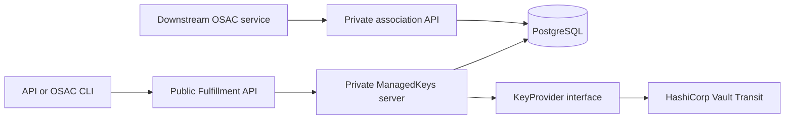

# Key Management Service — Key Lifecycle Management

| Field       | Value |
|-------------|-------|
| Author(s)   | Dakota Crowder |
| Jira        | [OSAC-3612](https://redhat.atlassian.net/browse/OSAC-3612) |
| PRD         | [prd.md](prd.md) |
| Date        | 2026-09-22 |

# 1. Overview

This design adds tenant-owned and provider-owned `ManagedKey` resources to the Fulfillment API and performs their lifecycle operations synchronously against HashiCorp Vault Transit. The OSAC CLI exposes the same workflows. PostgreSQL holds tenant attribution, confirmed lifecycle timestamps and material-version metadata, consumer associations, and a private request record for ambiguous outcomes; key material exists only in Vault. See the [PRD](prd.md) for product requirements.

The first supported provider is HashiCorp Vault Transit, selected through deployment-managed backend and policy configuration. Vault ACLs enforce reversible revocation without deleting key material. A narrow internal provider contract, opaque backend coordinates, and backend-neutral version records keep Transit semantics out of the public API so KMIP and other providers can be added without replacing logical-key identities. `[User]` `[Research: Vault and OpenBao Transit]`

The PRD has no FR/NFR identifiers. This design assigns the following traceability-only anchors without changing the requirement text:

| ID | PRD requirement anchor |
|----|------------------------|
| FR-1 | Create and view tenant-owned and provider-owned logical keys through API and CLI. |
| FR-2 | Expose lifecycle state, active version, retained versions, and meaningful interim states. |
| FR-3 | Rotate a logical key while preserving its identity and retained material versions. |
| FR-4 | Revoke all versions, block normal use and new associations, and permit explicit authorized recovery. |
| FR-5 | Maintain consumer-neutral associations and reject destruction while a consumer remains attached. |
| FR-6 | Enforce Tenant Admin, Cloud Provider Admin, Tenant User, and Cloud Infrastructure Admin boundaries. |
| FR-7 | Let Cloud Provider Admins configure transparent platform backends and policies without tenant selection. |
| FR-8 | Give Cloud Infrastructure Admins read-only KMS health and availability visibility. |
| FR-9 | Return actionable outcomes and an unambiguous reported state for every lifecycle operation, with API/CLI end-to-end coverage. |

# 2. Goals and Non-Goals

## 2.1 Goals

- Keep the `ManagedKey` object flat, like `Secret`, and complete normal Vault lifecycle calls before returning from the API. `[User]` `[Codebase: proto/private/osac/private/v1/secret_type.proto]`
- Preserve a stable OSAC logical-key ID and backend-neutral material generations across provider-specific rotations. `[Locked: D4, D13]`
- Serialize association changes and destruction admission in PostgreSQL; record uncertain Vault outcomes for explicit retry and verification. `[User]`
- Support HashiCorp Vault Transit first without exposing Transit paths or numeric versions publicly. `[User]`
- Validate the backend behavior required for this key purpose internally; leave storage-consumer compatibility to OSAC-2389. `[User: lean public contract]` `[Research: Problem Space]`

## 2.2 Non-Goals

- This design does not add a key-management UI, automated rotation schedules, client-side cryptography, or key-material export.
- This design does not implement KMIP listeners, storage-resource bindings, re-encryption, crypto-erase orchestration, HSM integration, replication, or multi-region management. `[Locked: D5]`
- This design does not let tenants select a backend or policy and does not add provider-managed shared/default keys for tenant consumption. `[Locked: D10, D16]`
- This design does not add an audit-history product surface; the optional pending marker and generic resource events show current progress, not an audit log. `[Locked: D15]`

# 3. Motivation / Background

The current Vault-compatible integration provisions tenant namespaces and KV v2 mounts for secrets. Its `Secret` create, update, and delete handlers call Vault synchronously within the API request and accept possible drift if a later PostgreSQL commit fails. It has no Transit client, logical-key resource, material-version model, association guard, or user-facing KMS health surface. This design accepts the same cross-store tradeoff while recording operations whose retries can create another version or destroy material. `[User]` `[Codebase: fulfillment-service/internal/servers/private_secrets_server.go]`

Directly exposing Transit would couple the API to a named keyring with numeric versions. KMIP re-key can instead create a replacement object, while other providers use stable resources with separate material versions. OSAC therefore needs its own stable identity, key purpose, lifecycle policy, and operation boundary. `[Research: Existing Solutions and Tools]`

HashiCorp Vault Transit is the initial provider. Its documented API has no reversible whole-key disable operation, so OSAC enforces the PRD's revocation rule through key-specific Vault ACL policies attached to every normal consumer credential. Revocation removes cryptographic permissions from existing and new consumer tokens while retaining all key versions; recovery restores permissions after authorization. This differs from the earlier research recommendation and makes credential issuance and ACL conformance release gates. `[User]` `[Research: Vault and OpenBao Transit]` [Vault Transit API](https://developer.hashicorp.com/vault/api-docs/secret/transit) [Vault policies](https://developer.hashicorp.com/vault/docs/concepts/policies)

# 4. Design

## 4.1 Architecture

The Fulfillment Service owns the public contract and persistence. Each `ManagedKeys` lifecycle RPC invokes a backend-neutral `KeyProvider` during the request, after committing an operation record and any association fence needed for safe execution. It records the confirmed Vault result before returning success. The initial `HashiCorpVaultTransitProvider` uses the existing Vault connection and tenant namespace/authentication infrastructure with a dedicated Transit mount and per-key consumer ACL policies. Tenant namespaces require Vault Enterprise or HCP Vault Dedicated. `[User]` [Vault namespaces](https://developer.hashicorp.com/vault/docs/enterprise/namespaces)



The handler commits a short PostgreSQL transaction before the Vault call, then uses a second transaction to record the result. These method names bypass the generic unary transaction interceptor and use handler-owned transactions, so the intent commit occurs before the external call. A successful RPC means the Vault effect and final database write were confirmed. On timeout or crash, the saved operation ID lets a later explicit retry inspect Vault before doing anything again; there is no periodic reconciliation loop. Downstream services use a private association API, while public key responses omit association details and backend coordinates. OSAC-issued consumer credentials carry only the corresponding key-specific Vault policy; no normal consumer receives a broad Transit credential or a path to bypass the revocation gate. `[User]` `[Locked: D3, D8, D14]` `[Codebase: fulfillment-service/internal/database/database_tx_interceptor.go]`

The internal provider contract expresses product intent rather than vendor verbs:

```go
type KeyProvider interface {
    Capabilities(ctx context.Context, backend BackendRef) (Capabilities, error)
    Observe(ctx context.Context, key ProviderKeyRef) (ObservedKey, error)
    Create(ctx context.Context, key ProviderKeyRef, policy KeyPolicy) (ObservedKey, error)
    Rotate(ctx context.Context, key ProviderKeyRef, operation OperationRef) (ObservedKey, error)
    Revoke(ctx context.Context, key ProviderKeyRef, operation OperationRef) (ObservedKey, error)
    Recover(ctx context.Context, key ProviderKeyRef, operation OperationRef) (ObservedKey, error)
    Destroy(ctx context.Context, key ProviderKeyRef, operation OperationRef) error
    Health(ctx context.Context, backend BackendRef) (BackendHealth, error)
}
```

`ProviderKeyRef`, backend object IDs, and backend versions are private opaque values. `OperationRef` includes the ManagedKey ID, client request ID, operation type, and expected OSAC material generation. Adapters return normalized error categories: `UNAVAILABLE`, `UNAUTHORIZED`, `UNSUPPORTED`, `CONFLICT`, `INVALID_CONFIGURATION`, `RETRYABLE`, and `TERMINAL`.

The public lifecycle is derived from confirmed facts, not a separate state machine:

| Confirmed result | Public fields after the final database commit |
|------------------|-----------------------------------------------|
| Create | Publish the key with generation `1`; an unconfirmed create remains an internal reservation and is not listed as active. |
| Rotate | Append the new generation and advance `active_version`; earlier generations remain listed. |
| Revoke | Set `revoked_at` after the ACL change and access denial are verified. |
| Recover | Clear `revoked_at` after normal access is verified. |
| Destroy | Set `destroyed_at` only after the authorized Vault key deletion is confirmed. |

Absent `destroyed_at`, a present `revoked_at` means revoked; when both are absent, a confirmed key is active. The timestamps record when OSAC confirmed the effect, not the exact Vault change time. A public `pending_operation` appears only while an existing key has an unresolved mutation; its type supplies the interim rotation/revocation/recovery/destruction visibility requested by the PRD. A definite no-effect failure returns a gRPC error and leaves the last confirmed fields unchanged. A timeout or partial effect keeps the pending marker and association fence until an explicit same-ID retry observes Vault. The internal operation record survives a process crash and prevents duplicate rotation. There is no public history of successful or failed operations and no unattended reconciliation. `[User: simplify synchronous status]` `[Locked: D4, D8, D11, D15]`

### Transit mapping

| OSAC intent | HashiCorp Vault Transit effect | Confirmation |
|-------------|------------------------|--------------|
| Create | `POST /{mount}/keys/{opaque-name}` with `aes256-gcm96`, `exportable=false`, `allow_plaintext_backup=false`; create a key-specific consumer ACL policy | Read key and policy; latest version is 1 and configuration matches policy |
| Rotate | `POST /{mount}/keys/{opaque-name}/rotate` | Read key; latest version equals the operation's expected next generation |
| Revoke | Replace the key-specific consumer policy's cryptographic path grants with explicit `deny` rules; retain the Transit key and every version | Read policy and verify a previously issued consumer token cannot encrypt or decrypt any retained version; only then set `revoked_at` |
| Recover | Restore the key-specific consumer policy's cryptographic grants after authorized recovery | Read policy and verify a consumer token can encrypt and decrypt retained versions; only then clear `revoked_at` |
| Destroy | Set `deletion_allowed=true`, then `DELETE /{mount}/keys/{opaque-name}` | Read returns not found under the committed destroy intent; only then set `destroyed_at` |

Backend names are deterministic (`osac-<managed-key-uuid>`) and never derived from tenant-provided names. The adapter treats an existing name with mismatched immutable configuration as `CONFLICT`; it never adopts or overwrites an out-of-band key.

The per-key policy covers every enabled cryptographic path for that key, including encrypt, decrypt, rewrap, data-key generation, HMAC, sign, and verify where applicable. Its `deny` rules take precedence over other ordinary ACL grants. All normal Transit credentials for a key must carry this policy, including credentials issued before revocation; credentials with root or unrestricted administrative access are excluded from normal consumer use. The API uses a separate restricted management credential to change the policy. If policy write or verification fails, `revoked_at` is not changed and the RPC returns an error; an uncertain effect retains `pending_operation`. Provider administrators inspect out-of-band policy drift through backend health and operation errors; there is no automatic repair loop. `[Locked: D8]` [Vault policies](https://developer.hashicorp.com/vault/docs/concepts/policies)

## 4.2 Data Model / Schema Changes

The editable private proto defines the public shape; `cleanapi` removes private provider fields from generated public protos. These proposed definitions use the existing `Metadata`, `google.protobuf.Timestamp`, and `cleanapi` types; omitted imports and service annotations follow the existing resource protos. The public purpose follows [Google Cloud KMS's `CryptoKeyPurpose`](https://github.com/googleapis/googleapis/blob/master/google/cloud/kms/v1/resources.proto#L59). A pending operation is an exception marker, not an operation result or audit record. `[User: simplify synchronous status]` `[Codebase: proto/private/osac/private/v1]`

```protobuf
enum ManagedKeyPurpose {
  MANAGED_KEY_PURPOSE_UNSPECIFIED = 0;
  MANAGED_KEY_PURPOSE_ENCRYPT_DECRYPT = 1;
}

message ManagedKey {
  string id = 1;
  Metadata metadata = 2;
  ManagedKeyPurpose purpose = 3; // Immutable; ENCRYPT_DECRYPT only in this release.
  uint64 active_version = 4;    // Last confirmed OSAC material generation.
  repeated ManagedKeyVersion versions = 5;
  google.protobuf.Timestamp revoked_at = 6;   // Present only while confirmed revoked.
  google.protobuf.Timestamp destroyed_at = 7; // Present after confirmed destruction.
  ManagedKeyPendingOperation pending_operation = 8;
  optional string backend_name = 1001 [(cleanapi.field).private = true];
  optional string backend_object_id = 1002 [(cleanapi.field).private = true];
  optional string policy_name = 1003 [(cleanapi.field).private = true];
}

message ManagedKeyVersion {
  uint64 generation = 1; // Monotonic OSAC generation, independent of Vault's version.
  google.protobuf.Timestamp creation_timestamp = 2;
  repeated BackendVersionReference backend_versions = 1001
      [(cleanapi.field).private = true];
}

message BackendVersionReference {
  option (cleanapi.message).private = true;
  string object_id = 1;
  string version_id = 2;
}

enum ManagedKeyPendingOperationType {
  MANAGED_KEY_PENDING_OPERATION_TYPE_UNSPECIFIED = 0;
  MANAGED_KEY_PENDING_OPERATION_TYPE_ROTATE = 1;
  MANAGED_KEY_PENDING_OPERATION_TYPE_REVOKE = 2;
  MANAGED_KEY_PENDING_OPERATION_TYPE_RECOVER = 3;
  MANAGED_KEY_PENDING_OPERATION_TYPE_DESTROY = 4;
}

message ManagedKeyPendingOperation {
  string request_id = 1;
  ManagedKeyPendingOperationType type = 2;
  google.protobuf.Timestamp started_at = 3;
}
```

`metadata.tenant` is the sole ownership signal: `system` means a provider-owned key, and any other permitted tenant means a tenant-owned key. The server uses this value to choose the provider or tenant default policy and Vault namespace. `shared` is invalid for ManagedKeys because it is visible to ordinary users and provider-managed keys for tenant consumption are out of scope. The tenant is immutable after creation. `purpose=ENCRYPT_DECRYPT` means the key is for symmetric encryption and decryption; the configured policy fixes `aes256-gcm96`. It does not promise that OSAC exposes cryptographic data-plane RPCs. The latest generation is `active_version`, earlier generations in `versions` are retained, and `destroyed_at` makes every generation unusable; no separate version-state enum is needed. Rotation mode, ACL mechanics, and destruction mode remain private provider details. `backend_versions` permits a later provider to map one OSAC generation to replacement objects without changing the public generation or association. PostgreSQL retains request IDs for duplicate suppression until key metadata is deleted, not as a public audit history. No field contains key material. `[User: simplify synchronous status]` `[Locked: D4, D8, D13, D15, D16]`

The private-only association contract fixes both sides of a binding while keeping consumer identity out of public key responses:

```protobuf
message ManagedKeyLocalReference {
  string id = 1;
  string name = 2; // Resolve within the caller's authorized tenant scope.
}

message ConsumerReference {
  option (cleanapi.message).private = true;
  string api_group = 1;
  string kind = 2;
  string id = 3;
  optional string name = 4;
}

message ManagedKeyAssociation {
  option (cleanapi.message).private = true;
  string id = 1;
  string tenant = 2;
  ManagedKeyLocalReference managed_key = 3;
  ConsumerReference consumer = 4;
  google.protobuf.Timestamp creation_timestamp = 5;
}
```

`ManagedKeyAssociation.tenant` is server-set from the resolved key and checked against the authorized consumer tenant. The tuple `(managed_key.id, consumer.api_group, consumer.kind, consumer.id)` is unique. Associations point to the logical key, never a material generation; creation is permitted only when neither `revoked_at`, `destroyed_at`, nor `pending_operation` is set. `[Locked: D3, D5, D13, D14]`

Like `Secret`, `ManagedKey` exposes flat fields and normally reports the Vault effect synchronously. `pending_operation` is set before an existing-key Vault mutation and cleared only after confirmation or proof that no effect occurred. It exposes no success/failure history. An unconfirmed Create has no public `ManagedKey` object; its internal reservation is found by retrying with the same request ID. `[User: simplify synchronous status]` `[Codebase: proto/private/osac/private/v1/secret_type.proto]`

PostgreSQL receives three additive migrations:

- `managed_keys`: the standard generic-resource columns plus JSONB `data`. Provider-owned keys use the reserved `system` tenant; tenant-owned keys use their owning tenant. No separate ownership column is needed. The tenant, private backend, and policy assignment are immutable after creation.
- `managed_key_operations`: durable `(tenant, request_id)` uniqueness, key ID (or reserved Create identity/name), operation type, pre-operation version, internal outcome, and normalized failure. A unique unresolved `(tenant, name)` Create reservation prevents a different request ID from creating the same logical name while Vault completion is uncertain. The record fences one active mutation per key and lets a repeat request verify an uncertain effect before retrying. It also remembers completed request IDs so repeating Rotate cannot create another generation. Rows remain until key metadata is deleted; they are not exposed as an audit log.
- `managed_key_associations`: `id UUID PRIMARY KEY`, `managed_key_id UUID NOT NULL REFERENCES managed_keys(id)`, `tenant VARCHAR NOT NULL`, `consumer_api_group VARCHAR NOT NULL`, `consumer_kind VARCHAR NOT NULL`, `consumer_id VARCHAR NOT NULL`, `consumer_name VARCHAR`, and timestamps. A unique constraint covers `(managed_key_id, consumer_api_group, consumer_kind, consumer_id)` and an index covers `managed_key_id`.

Association creation and destruction admission both lock the `managed_keys` row. Creation requires no confirmed revocation or destruction, no pending operation, and matching consumer tenant. Destroy commits a pending marker and an operation record only after confirming zero associations; new associations are then rejected before Vault deletion begins. This prevents a new consumer from racing with the destruction check. `[Locked: D3, D8]`

Configured backends are represented as deployment-derived status resources. The public contract is:

```protobuf
enum KMSBackendProviderType {
  KMS_BACKEND_PROVIDER_TYPE_UNSPECIFIED = 0;
  KMS_BACKEND_PROVIDER_TYPE_VAULT_TRANSIT = 1;
}

enum KMSBackendState {
  KMS_BACKEND_STATE_UNSPECIFIED = 0;
  KMS_BACKEND_STATE_READY = 1;
  KMS_BACKEND_STATE_UNAVAILABLE = 2;
  KMS_BACKEND_STATE_MISCONFIGURED = 3;
}

message KMSBackend {
  string name = 1; // Deployment-configured name; no tenant-selectable backend.
  KMSBackendProviderType provider_type = 2;
  KMSBackendState state = 3;
  google.protobuf.Timestamp last_checked_at = 4;
  optional string message = 5; // Normalized and redacted health detail.
}
```

Connection, namespace, mount, authentication, policy, and individual capability-check details remain private deployment configuration. `READY` means the backend passed every check required for the supported `ENCRYPT_DECRYPT` lifecycle; `MISCONFIGURED` or `UNAVAILABLE` carries a redacted reason. A `KMSBackend` is not a mutable tenant resource; `Get` and `List` report the last probe result. `[User: lean public contract]` `[Locked: D10, D17]`

## 4.3 API Changes

### ManagedKeys service

`osac.public.v1.ManagedKeys` and its private counterpart implement `Create`, `List`, `Get`, `Update`, `Delete`, `Rotate`, `Revoke`, `Recover`, and `Destroy` at `/api/fulfillment/v1/managed_keys`. The four lifecycle RPCs are an explicit exception to the usual declarative Fulfillment API guidance because each operation is an administrator-requested, synchronous Vault action with a separately identifiable retry outcome. These are additive APIs. `[User]` `[Codebase: fulfillment-service/docs/API.md]`

- `Create` requires `metadata.name` and a client-generated `request_id`, and defaults `purpose=ENCRYPT_DECRYPT`, the only supported purpose in this release. A Tenant Admin may omit `metadata.tenant` to use their authorized tenant or set it to an authorized tenant. A Cloud Provider Admin must specify a tenant: `system` creates a provider-owned key, while an ordinary tenant creates a tenant-owned key under existing broad administrative access. Only Cloud Provider Admins may create in `system`; `shared` is always rejected. This explicit rule prevents the generic administrator default of `shared` from creating a broadly visible key. The server rejects caller-supplied lifecycle timestamps, versions, pending operation, or provider fields. It publishes the key only after Vault creation and the database result are confirmed.
- `Update` changes only `metadata.display_name` and `metadata.description`; tenant, purpose, lifecycle timestamps, versions, and pending operation are system-owned or immutable.
- `Rotate`, `Revoke`, `Recover`, and `Destroy` require key ID, client-generated `request_id`, and expected metadata version. The server checks the request ID before the metadata version, so a duplicate returns or resumes its original operation even if the successful call incremented the object version. A different request ID is rejected while one is unresolved.
- `Rotate` and `Revoke` require no `revoked_at` or `destroyed_at`; `Recover` requires `revoked_at` and no `destroyed_at`; `Destroy` accepts a live or revoked key. A duplicate request can still resolve a matching pending operation. Once `destroyed_at` is set, no lifecycle mutation is allowed.
- `Destroy` returns `FailedPrecondition/KeyInUse` while associations exist, without revealing consumer identities. `[Locked: D3, D14]`
- `Delete` removes only OSAC metadata and its operation records after `destroyed_at` is set; attempting to delete a live, revoked, or pending key returns `FailedPrecondition`.
- `Get` reads Vault key metadata and the key-specific policy for live keys, or confirms key absence when `destroyed_at` is set. Outside a pending operation, it verifies the observation against OSAC's last confirmed fields; an unexpected missing key, version, or policy returns a normalized `BackendDrift` error rather than a guessed state. While a mutation is pending, an expected discrepancy is reported as the last confirmed fields together with `pending_operation`; `Get` does not finalize the write. If Vault cannot be read, `Get` returns `Unavailable` instead of presenting the database snapshot as current.
- `List` returns tenant-filtered last-confirmed database snapshots without making one Vault call per key; clients use `Get` for a live check. Neither method exposes backend coordinates, credentials, or key bytes.

The lifecycle RPC calls Vault before returning success. A definitive failure with proof of no provider effect returns an actionable gRPC error, clears the pending marker, and leaves the confirmed fields unchanged; no `FAILED` resource state is stored. If the provider effect or final PostgreSQL commit is uncertain, the server returns `Unavailable` or `DeadlineExceeded` with the request ID in error details when the connection permits; the client also knows the ID it supplied. The pending marker remains visible, and a new mutation is blocked. Retrying the same RPC and request ID observes Vault before deciding whether to finalize or safely retry. Vault is authoritative for key material, current version, and policy effects; PostgreSQL is authoritative for logical identity, tenant, associations, and operation admission. `[User: simplify synchronous status]`

Example `Rotate` request:

```json
{
  "id": "7e24b74d-7dd4-4ff1-86bb-503d37f112d3",
  "request_id": "c62bd266-c38e-4be5-a130-d586327bd430",
  "expected_metadata_version": 4
}
```

Success returns the key with active version `2`, versions `1` and `2`, and no pending operation. A timeout leaves `pending_operation.type=ROTATE` and active version `1` as the last OSAC-confirmed generation; a retry with the same request ID first reads Vault's latest version. A definite no-effect failure returns a stable gRPC reason and message while the confirmed version remains `1`.

### Private association service

`osac.private.v1.ManagedKeyAssociations` provides private-only CRUD for downstream OSAC service identities. A create request contains a `ManagedKeyLocalReference` and structured `ConsumerReference { api_group, kind, id, name }`. Storage/KMIP-specific fields are prohibited. Create returns:

- `FailedPrecondition/KeyNotActive` for revoked, destroyed, or pending keys;
- `InvalidArgument/TenantMismatch` for a tenant-scoped consumer outside the key's tenant;
- `AlreadyExists` for the same key/consumer tuple.

The public API has no association list or detail surface. `[Locked: D5, D14]`

### KMSBackends service

`osac.public.v1.KMSBackends` exposes deployment-configured backend health through `List` and `Get` at `/api/fulfillment/v1/kms_backends`. It declares no mutation RPCs because configuration is deployment-managed. Cloud Provider Admins and Cloud Infrastructure Admins can read these objects; Tenant Admins and Tenant Users cannot.

## 4.4 Scalability and Performance

Key lifecycle requests are administrative control-plane operations; encryption and decryption data-plane traffic does not pass through the Fulfillment API. Each successful lifecycle RPC makes the required Vault Transit or policy calls before returning. `Get` also reads Vault key metadata and the key-specific policy; `List` remains a paginated database snapshot to avoid one Vault call per listed key. Provider concurrency is bounded per backend, and only one mutating operation may be active per key. The key-specific ACL policy adds one policy object per key and a policy update plus verification for revocation and recovery. A slow Vault call increases that RPC's latency, but it does not hold a PostgreSQL transaction open.

Association admission and destruction use a row lock scoped to one key. The `managed_key_associations(managed_key_id)` index makes the destruction check proportional to that key's associations rather than the global table. List pagination and CEL filtering follow existing generic-resource behavior.

Version and latest-operation metadata remain with the key. Historical material metadata grows linearly with rotations; automated rotation is out of scope, so growth follows explicit administrative operations. Destroyed key metadata remains until explicit `Delete`.

## 4.5 Security Considerations

- HashiCorp Vault generates and stores all key material. Material, backups, plaintext, ciphertext payloads, and export endpoints are never represented by the OSAC API, database, CLI, logs, metrics, or events.
- Policies force `exportable=false`, `allow_plaintext_backup=false`, and disable automatic Transit rotation. Destruction temporarily enables only the provider-side deletion flag required for the selected key.
- Backend names use UUIDs rather than user input, preventing path injection and tenant-name disclosure. Endpoint, mount, namespace, and consumer-reference fields receive length and character validation before use.
- Provider calls use tenant-scoped Vault namespaces and least-privilege policies limited to the configured Transit mount. Provider-owned keys use a provider namespace inaccessible to tenant tokens. Normal consumer tokens are key-scoped and cannot modify their ACL policy; only the management identity can change revocation policy.
- Status and error messages are redacted: they may name the normalized backend and reason but not tokens, certificate data, raw provider responses, consumer identities, or key bytes.
- Association creation is private-service authorization, not possession of an arbitrary key ID. The server re-resolves the key within the caller's service scope and tenant.

## 4.6 Failure Handling and Recovery

| Failure | System behavior | User-visible result |
|---------|-----------------|---------------------|
| Backend unavailable or sealed before Vault effect | Clear the pending marker only when the provider confirms no effect; otherwise keep it for verification. | The RPC returns `Unavailable` with an actionable reason. A live `Get` also returns `Unavailable` while Vault cannot be read. |
| Create times out | Keep the internal name/tenant/request reservation. On the same request ID, read the deterministic Vault name and adopt only an exact policy match before considering another create call. | No unconfirmed ManagedKey is published. The caller retries Create with the original request ID; no second key is created. |
| Rotation times out | On the same request ID, read latest Transit version. The expected next version proves the effect occurred. The prior version does **not** prove the original POST has stopped; do not issue another rotation until no effect is established. A higher version is `BackendDrift`. | The RPC does not claim success. `pending_operation.type=ROTATE` qualifies the last confirmed `active_version` until resolution. |
| Revocation/recovery times out | On the same request ID, read the key-specific Vault policy and test an existing consumer credential before retrying an idempotent policy update. Never infer access from an OSAC timestamp alone. | `pending_operation` remains until access is verified; `revoked_at` changes only after confirmation. |
| Destruction times out | On the same request ID, read the provider key. A missing key with a committed destroy intent proves the authorized effect; a present key may be deleted again after confirming the earlier call has stopped. | `pending_operation.type=DESTROY` remains until absence is confirmed; `destroyed_at` is never set solely from a timeout. |
| PostgreSQL final commit fails after Vault success | The earlier committed operation record and association fence remain. An explicit same-ID retry observes Vault, then repairs the database result without blindly repeating the provider call. | The RPC returns an error. `Get` shows `pending_operation` with last confirmed fields; the caller retains its request ID for safe retry. |
| Association appears during destruction request | Row locking orders the transactions; either association creation commits first and destruction is rejected, or destruction intent commits first and association creation is rejected. | `FailedPrecondition/KeyInUse` or `FailedPrecondition/KeyNotActive`. |
| Out-of-band backend or ACL mutation | Adapter reports `CONFLICT` or `BackendDrift`, fails closed for new associations, and stops destructive/rotating calls. An unexpected missing key is not treated as an authorized destruction. | `Get` or the mutating RPC returns a redacted `BackendDrift` error with corrective guidance; confirmed timestamps are not rewritten from drift. |

Every mutation uses metadata optimistic locking. Repeating a request ID first checks its durable operation record and Vault observation; a completed Rotate returns its stored result without issuing another Vault POST. Vault's Rotate endpoint does not accept an idempotency key, so observing the prior version after a timeout cannot prove that an earlier POST will not finish later. The server keeps that operation pending and returns an actionable verification error instead of risking a second rotation. If the original outcome cannot be established, provider administrator intervention is required; a timestamp cannot resolve this ambiguity. A new request ID after completed rotation requests one additional generation. If the caller never retries an uncertain operation, it remains visible and blocks new mutations; recovery is an explicit administrative action, not an unattended guarantee. `[User: simplify synchronous status]` [Vault Transit rotate API](https://developer.hashicorp.com/vault/api-docs/secret/transit#rotate-key)

## 4.7 RBAC / Tenancy

| Persona | ManagedKeys | Associations | KMSBackends |
|---------|-------------|--------------|-------------|
| Tenant Admin | Create/read/update tenant-owned keys in assigned tenants; delete metadata after destruction | No direct access | No access |
| Tenant User | No direct key-management access | No direct access | No access |
| Cloud Provider Admin (`is_admin`) | Existing broad access plus provider-owned key lifecycle | Administrative/service access | Read; configuration remains deployment-managed |
| Cloud Infrastructure Admin | No key access | No access | Read-only health and availability |
| Authorized downstream service | No public lifecycle access | Create/read/delete within granted tenant/service scope | No access |

OPA adds exact method rules for these services, while existing tenancy logic filters tenant resources. The ManagedKeys create path admits `system` only for Cloud Provider Admins and rejects `shared`; it never accepts an unassigned administrator tenant default. Provider-owned keys are thus identified by `metadata.tenant=system` and do not inherit the visibility of `shared` resources. `[User: tenant-derived ownership]` `[Locked: D2, D12, D16, D17, D18]`

A `cloud-infrastructure-admin` realm role and matching OPA predicate grant only `KMSBackends.Get` and `KMSBackends.List`. Recovery currently uses the same lifecycle authority as revocation: Tenant Admin for a tenant-owned key and Cloud Provider Admin under existing administrative access. Whether recovery needs a distinct privilege is an open question in §9.1.

## 4.8 Extensibility / Future-Proofing

The internal provider registry is keyed by immutable `backend_name`, and every key records its assigned backend/policy privately. Deployment configuration accepts multiple named backends and policies even though only `vault-transit` is initially valid; exactly one tenant default and one provider default are required. Tenants never choose either value. Adding a provider extends the closed backend-type enum and conformance suite rather than the public `ManagedKey` lifecycle.

The provider conformance suite checks rotation, retained-version access, revocation, recovery, and destruction for `ENCRYPT_DECRYPT` without publishing those mechanics as key fields. OSAC-2389 owns storage-consumer compatibility such as per-tenant key binding, re-encryption, and crypto-erase. If a later provider or key purpose needs a client-visible distinction, add a purpose value or a targeted field then; the logical key ID and version generations remain stable. `[User: lean public contract]` `[Research: Downstream KMIP readiness]`

OSAC material generations are independent of backend object IDs. A KMIP provider may therefore map one generation to a new managed object and replacement link without changing consumer associations or the public logical-key ID.

# 5. Interface Changes

## IC-1: ManagedKeys gRPC and REST resource

**Requirements:** FR-1, FR-2, FR-3, FR-4, FR-5, FR-6, FR-9

Adds public/private `ManagedKeys` CRUD and lifecycle RPCs with a flat `ManagedKey` object. `Create`, `Rotate`, `Revoke`, `Recover`, and `Destroy` report success only after their Vault effects are confirmed; a timeout exposes a request ID and an uncertain operation for explicit retry. See §§4.2–4.3.

## IC-2: ManagedKey lifecycle status and Events payloads

**Requirements:** FR-2, FR-3, FR-4, FR-9

Adds backend-neutral purpose, version, confirmed revocation/destruction timestamps, and an optional pending-operation marker to `ManagedKey`. Ordinary Fulfillment object events carry pending and confirmed changes. `Get` verifies Vault live; `List` carries last-confirmed snapshots. No success/failure operation history, key material, or backend coordinates enter the public payload. See §§4.2 and 4.6.

## IC-3: OSAC CLI key inspection commands

**Requirements:** FR-1, FR-2, FR-6

Adds `osac create key`, `osac list keys`, and `osac describe key`. The existing global `--tenant` flag selects the key's tenant; `osac --tenant system create key` is available only to Cloud Provider Admins. Create prints its generated request ID before contacting the API. Describe derives active/revoked/destroyed from the confirmed timestamps and shows `metadata.tenant`, purpose, active and retained generations, and any pending operation.

## IC-4: OSAC CLI key lifecycle commands

**Requirements:** FR-3, FR-4, FR-5, FR-9

Adds `osac rotate key`, `osac revoke key`, `osac recover key`, and `osac destroy key`. Each command accepts `--request-id`; otherwise it generates and prints one before calling the API so an ambiguous client retry can reuse it. Commands return when the synchronous RPC completes and print the confirmed result derived from timestamps and active generation. On timeout they print the request ID and instruct the caller to retry with it; `--wait` is unnecessary.

## IC-5: Private managed-key association API

**Requirements:** FR-4, FR-5

Adds private-only `ManagedKeyAssociations` CRUD with typed key and consumer references. Creation is restricted to active same-tenant keys, and association presence blocks destruction without exposing consumer details publicly. See §§4.2–4.3.

## IC-6: Deployment-managed KMS backend and policy configuration

**Requirements:** FR-7

Adds Helm values and service flags for `kms.enabled`, `kms.defaultTenantPolicy`, `kms.defaultProviderPolicy`, named `kms.backends`, and named `kms.policies`. The initial closed backend type is `vault-transit`; policies fix `aes256-gcm96`, disable export/plaintext backup/automatic rotation, and reference a named backend. Configuration must provide tenant namespace support and an OSAC-managed, key-scoped consumer credential path so revocation cannot be bypassed by a broad Transit grant. Tenants cannot submit backend or policy fields.

## IC-7: KMSBackends health API

**Requirements:** FR-7, FR-8

Adds deployment-derived `KMSBackend` status resources and public `Get`/`List` behavior at `/api/fulfillment/v1/kms_backends`. Responses contain provider type, normalized readiness, last check time, and a redacted message. No mutation methods are declared.

## IC-8: OSAC CLI KMS health commands

**Requirements:** FR-8

Adds `osac list kms-backends` and `osac describe kms-backend`, available to Cloud Provider Admins and Cloud Infrastructure Admins. Output shows readiness, provider type, last check time, and redacted failure reason.

## IC-9: Key-management authorization surface

**Requirements:** FR-6, FR-8

Adds exact OPA method permissions and a `cloud-infrastructure-admin` realm role. Tenant Admins receive tenant-owned key lifecycle methods, existing administrators retain broad access, infrastructure admins receive only backend-health reads, and ordinary Tenant Users receive no direct key-management methods.

# 6. Alternatives Considered

### Expose Transit directly through the public API

This minimizes translation and implementation code, but leaks numeric keyrings, ACL-based revocation details, mount paths, and vendor errors into a contract that cannot represent KMIP replacement objects cleanly. It is rejected because OSAC-2389 requires backend capability variance. `[Research: Lifecycle capability comparison]`

### Require a native whole-key disable primitive for the first provider

This would simplify revocation, but would exclude HashiCorp Vault Transit despite the PRD's Vault dependency. OSAC instead uses key-specific Vault ACL policies: every normal consumer token is subject to the policy, and terminal revocation requires verified denial of both encryption and decryption. A database-only flag is insufficient because it cannot stop direct Vault use. The extra credential and policy lifecycle is accepted to make Vault the first supported provider. `[User]` `[Locked: D8]`

### Rely solely on a single request transaction, as Secrets does

`Secret` CRUD calls Vault during the request and accepts possible drift if the database commit fails. KMS keeps synchronous calls but uses a short committed operation record before Vault effects: a repeated rotation could create another material version, and destruction must fence new associations before key material is deleted. This record is resolved on explicit retry, without a controller or background reconciliation loop. `[User]` `[Codebase: fulfillment-service/internal/servers/private_secrets_server.go]`

### Use desired-state updates instead of lifecycle RPCs

Declarative updates match the usual Fulfillment API convention but imply eventual convergence and a desired-versus-observed model for operations that Vault itself executes synchronously. Explicit lifecycle RPCs are chosen for this object; request IDs and the operation record retain safe retry behavior. This is a deliberate exception to the API guideline. `[User]` `[Codebase: fulfillment-service/docs/API.md]`

### Store associations in annotations or ask providers whether a key is in use

Annotations are untyped and not safe for transactional admission. Key providers do not know every OSAC consumer. A normalized association table is selected so destruction and association creation can serialize on the key row.

### Make backend and policy selection tenant-configurable

This offers flexibility but contradicts the requirement that tenants never configure KMS infrastructure and creates migration/fallback semantics not required by this feature. Provider-managed deployment configuration assigns immutable defaults transparently. `[Locked: D10]`

# 7. Observability and Monitoring

The implementation adds these low-cardinality Prometheus metrics:

- `osac_kms_backend_ready{backend}` gauge: `1` only when health, authentication, Transit mount, and required capabilities pass.
- `osac_kms_operation_total{backend,operation,result}` counter: synchronous attempts grouped by normalized result.
- `osac_kms_operation_duration_seconds{backend,operation}` histogram: provider operation latency.
- `osac_kms_keys{lifecycle}` gauge: current resource count by lifecycle derived from confirmed timestamps, without tenant or key labels.
- `osac_kms_operation_retries_total{backend,operation,reason}` counter: explicit same-ID retries by normalized reason.

An alert fires when a configured backend remains not ready for five minutes. Structured logs include request ID, key ID, backend name, operation, attempt, normalized reason, and duration; they exclude tenant-provided descriptions, consumer identities, tokens, provider response bodies, ciphertext, and key material. Pending markers and confirmed timestamp/version changes continue through the generic Events service.

# 8. Impact and Compatibility

The API, database migrations, CLI commands, role, metrics, and Helm values are additive. Existing resources and clients remain compatible. `proto/private` is the source; `proto/public` and `proto/gen` are regenerated once and all consumers rebuild against the shared module.

The initial support target is HashiCorp Vault Enterprise or HCP Vault Dedicated with tenant namespaces and Transit. The existing bundled development backend is not proof of HashiCorp Vault compatibility; a real Vault integration environment must pass provider conformance before release, including existing-token ACL revocation, retained-version decryption after recovery, tenant isolation, rotation, and destruction. Startup marks a backend `MISCONFIGURED` and prevents new key creation if required namespace, mount, credential, or policy checks fail. Existing Vault KV secret behavior is unchanged. [Vault namespaces](https://developer.hashicorp.com/vault/docs/enterprise/namespaces)

Downgrade requires all ManagedKeys to be destroyed and their metadata deleted, followed by removal of association rows and KMS configuration. Downgrading the service while live keys remain is unsupported because an older service cannot enforce association and lifecycle safeguards. Version skew is tolerated only while older components treat the new proto types as unknown; all API servers must run the same release before key creation is enabled.

# 9. Open Questions

## 9.1 Should recovery require a privilege distinct from ordinary key lifecycle administration?

- **Owner:** OSAC security and product maintainers
- **Impact:** Changes §4.3 recovery validation, §4.7 role mappings, IC-4/IC-9, and recovery test identities. The current proposal permits the same lifecycle administrator who can revoke a key to recover it.

## 9.2 Which HashiCorp Vault edition and minimum version will the release certify?

- **Owner:** Fulfillment Service and OSAC Installer maintainers
- **Impact:** The first supported provider is HashiCorp Vault Transit with namespaces. Maintainers must pin a tested Vault Enterprise or HCP Vault Dedicated version and provision a matching conformance environment before release; this affects §8 and deployment validation, not the provider priority.

## 9.3 How will operators resolve a rotation whose timed-out Vault POST cannot be proven finished?

- **Owner:** Fulfillment Service and Vault integration maintainers
- **Impact:** Vault Rotate has no request idempotency key. A prior-version read after timeout is insufficient proof that the original POST will not complete later. The operation stays pending and blocks mutations until the outcome is established; implementation needs an explicit operator verification and recovery runbook before release. This does not require a public completed-operation API.

---

## Provenance

Authored: draft @ design 0.11.3 - 9b25062, workspace bugfix/osac-5191/mutable-userdata @ 829cb62b7
Final: revise @ design 0.11.3 - cc0daa6, workspace osac-4749/require-vault @ f6c747d2c

> Context changed between draft and revise.

<!-- ai-workflow-provenance:{"schema_version":1,"provenance_kind":"session","workflow":"design","workflow_version":"0.11.3","ai_workflows":"cc0daa6","source_repo":"f6c747d2c","source_repo_branch":"osac-4749/require-vault","commits_behind_main":0,"commits_ahead_main":5,"main_ref":"main","phases":["draft","revise","revise","revise","revise","revise"],"authoring_modes":["skill"],"context_changed":true,"origin_untracked":false} -->
