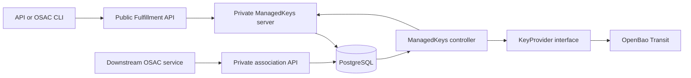
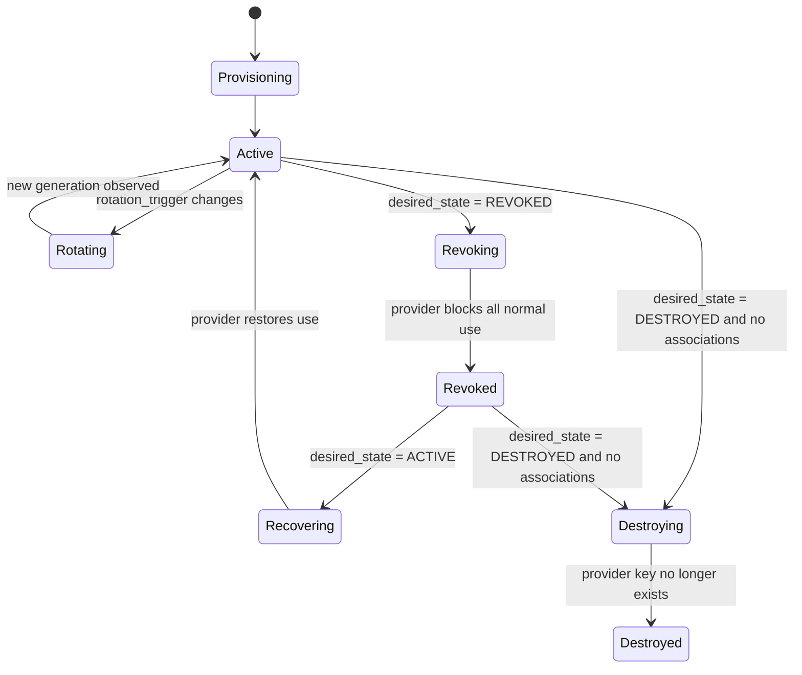

# Key Management Service — Key Lifecycle Management

| Field       | Value |
|-------------|-------|
| Author(s)   | Dakota Crowder |
| Jira        | [OSAC-3612](https://redhat.atlassian.net/browse/OSAC-3612) |
| PRD         | [prd.md](prd.md) |
| Date        | 2026-09-22 |

# 1. Overview

This design adds tenant-owned and provider-owned `ManagedKey` resources to the Fulfillment API, reconciles their desired lifecycle against an OpenBao Transit engine, and exposes the same workflows through the OSAC CLI. PostgreSQL holds ownership, desired and observed state, backend-neutral material-version metadata, and consumer associations; key material exists only in Transit. See the [PRD](prd.md) for product requirements.

The first provider is OpenBao Transit 2.6 or later, selected through deployment-managed backend and policy configuration. A narrow internal provider contract, opaque backend coordinates, and backend-neutral version records keep Transit semantics out of the public API so KMIP and other providers can be added without replacing logical-key identities. `[User]` `[Research: Recommended Approach]`

The PRD has no FR/NFR identifiers. This design assigns the following traceability-only anchors without changing the requirement text:

| ID | PRD requirement anchor |
|----|------------------------|
| FR-1 | Create and view tenant-owned and provider-owned logical keys through API and CLI. |
| FR-2 | Expose lifecycle state, active version, retained versions, and meaningful interim states. |
| FR-3 | Rotate a logical key while preserving its identity and retained material versions. |
| FR-4 | Revoke all versions, block normal use and new associations, and permit explicit authorized recovery. |
| FR-5 | Maintain consumer-neutral associations and reject destruction while a consumer remains attached. |
| FR-6 | Enforce Tenant Admin, Cloud Provider Admin, Tenant User, and Cloud Infrastructure Admin boundaries. |
| FR-7 | Let Cloud Provider Admins configure transparent platform backends and policies without tenant selection. |
| FR-8 | Give Cloud Infrastructure Admins read-only KMS health and availability visibility. |
| FR-9 | Return actionable outcomes and an unambiguous reported state for every lifecycle operation, with API/CLI end-to-end coverage. |

# 2. Goals and Non-Goals

## 2.1 Goals

- Follow the Fulfillment API's declarative `spec`/`status`, public/private proto, controller, and condition conventions. `[Codebase: fulfillment-service/docs/API.md]`
- Preserve a stable OSAC logical-key ID and backend-neutral material generations across provider-specific rotations. `[Locked: D4, D13]`
- Serialize association changes and destruction admission in PostgreSQL while reconciling non-transactional provider effects safely.
- Support the bundled OpenBao Transit provider without exposing Transit paths, numeric versions, or soft-delete terminology publicly. `[User]`
- Keep provider and consumer capability models independent so OSAC-2389 can later combine KMS and storage capabilities. `[Research: Problem Space]`

## 2.2 Non-Goals

- This design does not add a key-management UI, automated rotation schedules, client-side cryptography, or key-material export.
- This design does not implement KMIP listeners, storage-resource bindings, re-encryption, crypto-erase orchestration, HSM integration, replication, or multi-region management. `[Locked: D5]`
- This design does not let tenants select a backend or policy and does not add provider-managed shared/default keys for tenant consumption. `[Locked: D10, D16]`
- This design does not add an audit-history product surface; current operation status and generic resource events are operational state, not an audit log. `[Locked: D15]`

# 3. Motivation / Background

The current Vault-compatible integration provisions tenant namespaces and KV v2 mounts for secrets. It has no Transit client, logical-key resource, material-version model, association guard, or user-facing KMS health surface. Raw key lifecycle calls also cannot be placed inside the Fulfillment Service's PostgreSQL transaction. `[Codebase: fulfillment-service/internal/vault]`

Directly exposing Transit would couple the API to a named keyring with numeric versions and OpenBao-specific soft deletion. KMIP re-key can instead create a replacement object, while other providers use stable resources with separate material versions. OSAC therefore needs its own stable identity, lifecycle policy, capability vocabulary, and reconciliation boundary. `[Research: Existing Solutions and Tools]`

OpenBao Transit is selected because the bundled deployment pins OpenBao 2.6.2 and Transit soft-delete/restore can enforce the PRD's reversible whole-key revocation across encrypt, decrypt, rotate, sign, verify, HMAC, and export operations. HashiCorp Vault Transit is not an initial supported provider because its documented API has no equivalent reversible whole-key disable primitive. `[Codebase: osac-installer/charts/osac-infra/values.yaml]` `[Research: Vault and OpenBao Transit]`

# 4. Design

## 4.1 Architecture

The Fulfillment Service owns the public contract and persistence. A `ManagedKeys` controller watches database-backed resource events and also performs periodic full reconciliation. It resolves the immutable backend and policy assigned at creation, then invokes a backend-neutral `KeyProvider`. The initial `OpenBaoTransitProvider` uses the existing Vault connection and tenant namespace/authentication infrastructure with a dedicated Transit mount and policy. `[Codebase: fulfillment-service/internal/controllers/reconciler.go]`



The API transaction persists desired state before any provider call. Events provide the fast reconciliation path; periodic listing is the correctness fallback. Provider results update `status` through the private API. Downstream services use a private association API, while public key responses deliberately omit association details and backend coordinates. `[Locked: D3, D14]`

The internal provider contract expresses product intent rather than vendor verbs:

```go
type KeyProvider interface {
    Capabilities(ctx context.Context, backend BackendRef) (Capabilities, error)
    Observe(ctx context.Context, key ProviderKeyRef) (ObservedKey, error)
    EnsureCreated(ctx context.Context, key ProviderKeyRef, policy KeyPolicy) (ObservedKey, error)
    EnsureRotated(ctx context.Context, key ProviderKeyRef, operation OperationRef) (ObservedKey, error)
    EnsureRevoked(ctx context.Context, key ProviderKeyRef, operation OperationRef) (ObservedKey, error)
    EnsureActive(ctx context.Context, key ProviderKeyRef, operation OperationRef) (ObservedKey, error)
    EnsureDestroyed(ctx context.Context, key ProviderKeyRef, operation OperationRef) error
    Health(ctx context.Context, backend BackendRef) (BackendHealth, error)
}
```

`ProviderKeyRef`, backend object IDs, and backend versions are private opaque values. `OperationRef` includes the ManagedKey ID, spec version, operation type, rotation trigger, and expected OSAC material generation. Adapters return normalized error categories: `UNAVAILABLE`, `UNAUTHORIZED`, `UNSUPPORTED`, `CONFLICT`, `INVALID_CONFIGURATION`, `RETRYABLE`, and `TERMINAL`.

Lifecycle intent is declarative:



The top-level state records observable progress. A failure leaves `spec` unchanged, sets `state=FAILED`, preserves the last confirmed active version and provider observation, and writes a `Failed` condition with a machine-readable reason and actionable message. Reconciliation resumes when configuration, connectivity, or desired state changes.

### Transit mapping

| OSAC intent | OpenBao Transit effect | Confirmation |
|-------------|------------------------|--------------|
| Create | `POST /{mount}/keys/{opaque-name}` with `aes256-gcm96`, `exportable=false`, `allow_plaintext_backup=false` | Read key; latest version is 1 and configuration matches policy |
| Rotate | `POST /{mount}/keys/{opaque-name}/rotate` | Read key; latest version equals the operation's expected next generation |
| Revoke | `DELETE /{mount}/keys/{opaque-name}/soft-delete` | Successful response or normalized already-soft-deleted result |
| Recover | `POST /{mount}/keys/{opaque-name}/soft-delete-restore` | Successful response followed by readable key metadata |
| Destroy | Set `deletion_allowed=true`, then `DELETE /{mount}/keys/{opaque-name}` | Read returns not found |

Backend names are deterministic (`osac-<managed-key-uuid>`) and never derived from tenant-provided names. The adapter treats an existing name with mismatched immutable configuration as `CONFLICT`; it never adopts or overwrites an out-of-band key.

## 4.2 Data Model / Schema Changes

The editable private proto defines the public shape; `cleanapi` removes private provider fields from generated public protos. `[Codebase: proto/private/osac/private/v1]`

```protobuf
message ManagedKey {
  string id = 1;
  Metadata metadata = 2;
  ManagedKeySpec spec = 3;
  ManagedKeyStatus status = 4;
}

message ManagedKeySpec {
  ManagedKeyOwnership ownership = 1;       // immutable
  ManagedKeyDesiredState desired_state = 2; // ACTIVE, REVOKED, DESTROYED
  optional string rotation_trigger = 3;    // opaque, max 64 characters
}

message ManagedKeyStatus {
  ManagedKeyState state = 1;
  uint64 active_version = 2;               // OSAC material generation
  repeated ManagedKeyVersion versions = 3;
  optional string observed_rotation_trigger = 4;
  optional ManagedKeyOperation current_operation = 5;
  ManagedKeyCapabilities capabilities = 6;
  repeated ManagedKeyCondition conditions = 7;
  optional string backend_name = 1001 [(cleanapi.field).private = true];
  optional string backend_object_id = 1002 [(cleanapi.field).private = true];
}
```

`ManagedKeyVersion` contains `generation`, `state` (`ACTIVE`, `RETAINED`, or `DESTROYED`), and `creation_timestamp`. Private-only fields map the generation to one or more opaque backend object/version IDs, allowing a later KMIP provider to replace backend objects during rotation. No field contains key material.

`ManagedKeyOperation` contains `id`, `type`, `state` (`PENDING`, `APPLYING`, `SUCCEEDED`, `FAILED_RETRYABLE`, or `FAILED_TERMINAL`), `requested_at`, `last_attempt_at`, `completed_at`, `attempt_count`, `reason`, and `message`. Only the current/latest operation is retained; this is status, not audit history. The controller acknowledges a rotation by copying `spec.rotation_trigger` to `status.observed_rotation_trigger` when processing begins.

PostgreSQL receives two additive migrations:

- `managed_keys`: the standard generic-resource columns plus JSONB `data`. Provider-owned keys use the reserved `system` tenant; tenant-owned keys use their owning tenant. The private backend and policy assignment is immutable after creation.
- `managed_key_associations`: `id UUID PRIMARY KEY`, `managed_key_id UUID NOT NULL REFERENCES managed_keys(id)`, `tenant VARCHAR NOT NULL`, `consumer_api_group VARCHAR NOT NULL`, `consumer_kind VARCHAR NOT NULL`, `consumer_id VARCHAR NOT NULL`, `consumer_name VARCHAR`, and timestamps. A unique constraint covers `(managed_key_id, consumer_api_group, consumer_kind, consumer_id)` and an index covers `managed_key_id`.

Association creation and the transition to `desired_state=DESTROYED` both lock the `managed_keys` row. Creation requires the key's desired and observed states to be active and the consumer tenant to match the key scope. Destruction requires zero association rows before the spec update commits. This prevents a new consumer from racing with the destruction check. `[Locked: D3, D8]`

Configured backends are represented as `KMSBackend` status resources with public `name`, `provider_type`, normalized `state`, `capabilities`, `last_checked_at`, and redacted `message`. Connection, namespace, mount, authentication, and policy details are private and populated from deployment configuration.

## 4.3 API Changes

### ManagedKeys service

`osac.public.v1.ManagedKeys` and its private counterpart implement the standard `Create`, `List`, `Get`, `Update`, and `Delete` methods at `/api/fulfillment/v1/managed_keys`. The private service also defines `Signal`. These are additive APIs.

- `Create` requires `metadata.name`; defaults `ownership=TENANT` and `desired_state=ACTIVE`. Only Cloud Provider Admins may request `ownership=PROVIDER`; the server forces provider keys into the `system` tenant.
- `Update` permits `metadata.display_name`, `metadata.description`, `spec.desired_state`, and `spec.rotation_trigger`. Ownership is immutable. Status is system-owned.
- `rotation_trigger` must change to a non-empty value no longer than 64 characters. Reusing an observed trigger is idempotent and does not create another generation. Rotation is accepted only while desired and observed state are active.
- Valid desired-state transitions are `ACTIVE -> REVOKED`, `REVOKED -> ACTIVE`, and `ACTIVE|REVOKED -> DESTROYED`. `DESTROYED` is terminal.
- An update to `DESTROYED` returns `FailedPrecondition` with reason `KeyInUse` while associations exist. It does not reveal consumer identities. `[Locked: D3, D14]`
- `Delete` removes only OSAC metadata and succeeds only after `status.state=DESTROYED`; attempting to delete an active, failed, or revoked key returns `FailedPrecondition`.
- `Get` and `List` expose lifecycle state, active generation, version metadata, current operation, conditions, and normalized capabilities. They never expose backend coordinates, credentials, or key bytes.

Example rotation request:

```json
{
  "object": {
    "id": "7e24b74d-7dd4-4ff1-86bb-503d37f112d3",
    "metadata": {"version": 4},
    "spec": {
      "ownership": "MANAGED_KEY_OWNERSHIP_TENANT",
      "desired_state": "MANAGED_KEY_DESIRED_STATE_ACTIVE",
      "rotation_trigger": "c62bd266-c38e-4be5-a130-d586327bd430"
    }
  },
  "update_mask": "spec.rotation_trigger"
}
```

The response may report `state=ROTATING`; clients observe completion through `Get`, `List`, or the existing Events watch. A terminal failure contains a stable reason and message while the last confirmed active version remains visible.

### Private association service

`osac.private.v1.ManagedKeyAssociations` provides private-only CRUD for downstream OSAC service identities. A create request contains a `ManagedKeyLocalReference` and structured `ConsumerReference { api_group, kind, id, name }`. Storage/KMIP-specific fields are prohibited. Create returns:

- `FailedPrecondition/KeyNotActive` for revoked, destroying, destroyed, or not-yet-active keys;
- `InvalidArgument/TenantMismatch` for a tenant-scoped consumer outside the key's tenant;
- `AlreadyExists` for the same key/consumer tuple.

The public API has no association list or detail surface. `[Locked: D5, D14]`

### KMSBackends service

`osac.public.v1.KMSBackends` exposes deployment-configured backend health through `List` and `Get` at `/api/fulfillment/v1/kms_backends`. Standard mutation methods remain declared for CLI compatibility but return `FailedPrecondition/DeploymentManaged`. Cloud Provider Admins and Cloud Infrastructure Admins can read these objects; Tenant Admins and Tenant Users cannot.

## 4.4 Scalability and Performance

Key lifecycle requests are administrative control-plane operations; encryption and decryption data-plane traffic does not pass through the Fulfillment API. Each reconcile performs one PostgreSQL read and normally one or two Transit requests. Provider concurrency is bounded per backend, and only one mutating operation may be active per key.

Association admission and destruction use a row lock scoped to one key. The `managed_key_associations(managed_key_id)` index makes the destruction check proportional to that key's associations rather than the global table. List pagination and CEL filtering follow existing generic-resource behavior.

Version and latest-operation metadata remain with the key. Historical material metadata grows linearly with rotations; automated rotation is out of scope, so growth follows explicit administrative operations. Destroyed key metadata remains until explicit `Delete`.

## 4.5 Security Considerations

- OpenBao generates and stores all key material. Material, backups, plaintext, ciphertext payloads, and export endpoints are never represented by the OSAC API, database, CLI, logs, metrics, or events.
- Policies force `exportable=false`, `allow_plaintext_backup=false`, and disable automatic Transit rotation. Destruction temporarily enables only the provider-side deletion flag required for the selected key.
- Backend names use UUIDs rather than user input, preventing path injection and tenant-name disclosure. Endpoint, mount, namespace, and consumer-reference fields receive length and character validation before use.
- Provider calls use tenant-scoped OpenBao namespaces and least-privilege policies limited to the configured Transit mount. Provider-owned keys use a provider namespace inaccessible to tenant tokens.
- Status and error messages are redacted: they may name the normalized backend and reason but not tokens, certificate data, raw provider responses, consumer identities, or key bytes.
- Association creation is private-service authorization, not possession of an arbitrary key ID. The server re-resolves the key within the caller's service scope and tenant.

## 4.6 Failure Handling and Recovery

| Failure | System behavior | User-visible result |
|---------|-----------------|---------------------|
| Backend unavailable or sealed | Keep desired state, set `FAILED_RETRYABLE`, retry with exponential backoff capped at five minutes, and reconcile on the next event/full sync. | `Unavailable` on synchronous validation when known; otherwise `FAILED` state with reason `BackendUnavailable`. |
| Create times out | Read the deterministic backend name before retrying; adopt only an exact policy match. | `PROVISIONING` or `FAILED` with current condition; never a second key. |
| Rotation times out | Read latest Transit version. Equal to expected means success; equal to prior permits retry; greater than expected is `BackendDrift` and no further rotation occurs. | Active version remains the last confirmed generation until reconciliation resolves the effect. |
| Revocation/recovery times out | Retry the same convergence operation; normalize already-deleted/already-restored responses as achieved after metadata observation. | `REVOKING`/`RECOVERING` or actionable `FAILED` condition. |
| Destruction times out | Read the provider key. Not found means success; present means retry deletion. | `DESTROYING` until absence is confirmed; never `DESTROYED` solely from a timeout. |
| PostgreSQL status update fails after provider success | Periodic reconciliation observes provider state using the persisted desired state and operation token, then repairs status. | Interim state persists; no duplicate effect is requested without observation. |
| Association appears during destruction request | Row locking orders the transactions; either association creation commits first and destruction is rejected, or destruction intent commits first and association creation is rejected. | `FailedPrecondition/KeyInUse` or `FailedPrecondition/KeyNotActive`. |
| Out-of-band backend mutation | Adapter reports `CONFLICT` or `BackendDrift` and stops destructive/rotating calls. | Terminal `FAILED` condition instructs the provider administrator to restore the expected backend object or reconcile configuration. |

Every API mutation uses metadata optimistic locking. Repeating the same desired state or rotation trigger is idempotent. A different rotation trigger after completion requests exactly one additional generation. The controller's watch plus periodic list tolerates missed or replayed events. `[Codebase: fulfillment-service/docs/CODEWALK.md]`

## 4.7 RBAC / Tenancy

| Persona | ManagedKeys | Associations | KMSBackends |
|---------|-------------|--------------|-------------|
| Tenant Admin | Create/read/update tenant-owned keys in assigned tenants; delete metadata after destruction | No direct access | No access |
| Tenant User | No direct key-management access | No direct access | No access |
| Cloud Provider Admin (`is_admin`) | Existing broad access plus provider-owned key lifecycle | Administrative/service access | Read; configuration remains deployment-managed |
| Cloud Infrastructure Admin | No key access | No access | Read-only health and availability |
| Authorized downstream service | No public lifecycle access | Create/read/delete within granted tenant/service scope | No access |

OPA adds exact method rules for these services, while existing tenancy logic filters tenant resources. Provider-owned keys are stored in the reserved `system` tenant and never in `shared`, so authenticated tenants do not inherit visibility. `[Locked: D2, D12, D16, D17, D18]`

A `cloud-infrastructure-admin` realm role and matching OPA predicate grant only `KMSBackends.Get` and `KMSBackends.List`. Recovery currently uses the same lifecycle authority as revocation: Tenant Admin for a tenant-owned key and Cloud Provider Admin under existing administrative access. Whether recovery needs a distinct privilege is an open question in §9.1.

## 4.8 Extensibility / Future-Proofing

The internal provider registry is keyed by immutable `backend_name`, and every key records its assigned backend/policy privately. Deployment configuration accepts multiple named backends and policies even though only `openbao-transit` is initially valid; exactly one tenant default and one provider default are required. Tenants never choose either value. Adding a provider extends the closed backend-type enum and conformance suite rather than the public `ManagedKey` lifecycle.

Capabilities remain two-dimensional. This feature records KMS-provider effects such as rotation identity mode, prior-version availability, reversible revocation, recovery, destruction mode, and KMIP profiles/operations when applicable. OSAC-2389 owns storage-consumer capabilities such as per-tenant key binding, re-encryption, and crypto-erase and combines them with the KMS capabilities. `[Research: Downstream KMIP readiness]`

OSAC material generations are independent of backend object IDs. A KMIP provider may therefore map one generation to a new managed object and replacement link without changing consumer associations or the public logical-key ID.

# 5. Interface Changes

## IC-1: ManagedKeys gRPC and REST resource

**Requirements:** FR-1, FR-2, FR-3, FR-4, FR-5, FR-6, FR-9

Adds public/private `ManagedKeys` CRUD services and `/api/fulfillment/v1/managed_keys`. Lifecycle intent is expressed through `spec.desired_state` and `spec.rotation_trigger`; status exposes lifecycle progress, versions, capabilities, and actionable conditions. See §§4.2–4.3.

## IC-2: ManagedKey lifecycle status and Events payloads

**Requirements:** FR-2, FR-3, FR-4, FR-9

Adds backend-neutral state, version, operation, capability, and condition data to `ManagedKey` and emits ordinary Fulfillment object events on changes. No key material or backend coordinates enter the public payload. See §§4.2 and 4.6.

## IC-3: OSAC CLI key inspection commands

**Requirements:** FR-1, FR-2, FR-6

Adds `osac create key`, `osac list keys`, and `osac describe key`. Create supports `--provider-owned` only for Cloud Provider Admins. Describe renders ownership, desired/observed state, active and retained generations, current operation, capabilities, and conditions.

## IC-4: OSAC CLI key lifecycle commands

**Requirements:** FR-3, FR-4, FR-5, FR-9

Adds `osac rotate key`, `osac revoke key`, `osac recover key`, and `osac destroy key`. Rotate accepts an optional `--request-id`; otherwise it generates and prints one so an ambiguous client retry can reuse the same trigger. Commands render accepted interim state and may wait for a terminal operation with `--wait` and `--timeout`.

## IC-5: Private managed-key association API

**Requirements:** FR-4, FR-5

Adds private-only `ManagedKeyAssociations` CRUD with typed key and consumer references. Creation is restricted to active same-tenant keys, and association presence blocks destruction without exposing consumer details publicly. See §§4.2–4.3.

## IC-6: Deployment-managed KMS backend and policy configuration

**Requirements:** FR-7

Adds Helm values and service flags for `kms.enabled`, `kms.defaultTenantPolicy`, `kms.defaultProviderPolicy`, named `kms.backends`, and named `kms.policies`. The initial closed backend type is `openbao-transit`; policies fix `aes256-gcm96`, disable export/plaintext backup/automatic rotation, and reference a named backend. Tenants cannot submit backend or policy fields.

## IC-7: KMSBackends health API

**Requirements:** FR-7, FR-8

Adds deployment-derived `KMSBackend` status resources and public `Get`/`List` behavior at `/api/fulfillment/v1/kms_backends`. Responses contain normalized readiness, capabilities, last check time, and redacted message. Mutations return `FailedPrecondition/DeploymentManaged`.

## IC-8: OSAC CLI KMS health commands

**Requirements:** FR-8

Adds `osac list kms-backends` and `osac describe kms-backend`, available to Cloud Provider Admins and Cloud Infrastructure Admins. Output shows readiness, provider type, normalized capabilities, last check time, and redacted failure reason.

## IC-9: Key-management authorization surface

**Requirements:** FR-6, FR-8

Adds exact OPA method permissions and a `cloud-infrastructure-admin` realm role. Tenant Admins receive tenant-owned key lifecycle methods, existing administrators retain broad access, infrastructure admins receive only backend-health reads, and ordinary Tenant Users receive no direct key-management methods.

# 6. Alternatives Considered

### Expose Transit directly through the public API

This minimizes translation and implementation code, but leaks numeric keyrings, soft-delete behavior, mount paths, and vendor errors into a contract that cannot represent KMIP replacement objects cleanly. It is rejected because OSAC-2389 requires backend capability variance. `[Research: Lifecycle capability comparison]`

### Support HashiCorp Vault Transit and OpenBao Transit as equivalent initial providers

Both share most Transit operations, but HashiCorp Vault Transit lacks the documented reversible whole-key disable/restore primitive required by D8. Emulating revocation only in the Fulfillment API would not block consumers with direct backend access. The initial support statement is therefore OpenBao Transit 2.6+; other Transit implementations must pass the complete provider conformance suite before being enabled.

### Invoke Transit synchronously inside API transactions

This gives simple request/response behavior but holds PostgreSQL transactions across network calls and cannot roll back provider effects after commit failure. It is rejected in favor of persisted desired state and reconciliation.

### Add imperative Rotate, Revoke, Recover, and Destroy RPCs

Action RPCs look natural to callers but conflict with Fulfillment API conventions and make replay/idempotency state separate from the resource. Declarative desired state plus a one-shot rotation trigger uses standard CRUD, optimistic locking, conditions, and Events. `[Codebase: fulfillment-service/docs/API.md]`

### Store associations in annotations or ask providers whether a key is in use

Annotations are untyped and not safe for transactional admission. Key providers do not know every OSAC consumer. A normalized association table is selected so destruction and association creation can serialize on the key row.

### Make backend and policy selection tenant-configurable

This offers flexibility but contradicts the requirement that tenants never configure KMS infrastructure and creates migration/fallback semantics not required by this feature. Provider-managed deployment configuration assigns immutable defaults transparently. `[Locked: D10]`

# 7. Observability and Monitoring

The implementation adds these low-cardinality Prometheus metrics:

- `osac_kms_backend_ready{backend}` gauge: `1` only when health, authentication, Transit mount, and required capabilities pass.
- `osac_kms_reconcile_total{backend,operation,result}` counter: attempts grouped by normalized result.
- `osac_kms_reconcile_duration_seconds{backend,operation}` histogram: provider operation latency.
- `osac_kms_keys{ownership,state}` gauge: current resource count without tenant or key labels.
- `osac_kms_operation_retries_total{backend,operation,reason}` counter: retries by normalized reason.

An alert fires when a configured backend remains not ready for five minutes. Structured logs include operation ID, key ID, backend name, operation, attempt, normalized reason, and duration; they exclude tenant-provided descriptions, consumer identities, tokens, provider response bodies, ciphertext, and key material. Status transitions continue through the generic Events service.

# 8. Impact and Compatibility

The API, database migrations, CLI commands, role, metrics, and Helm values are additive. Existing resources and clients remain compatible. `proto/private` is the source; `proto/public` and `proto/gen` are regenerated once and all consumers rebuild against the shared module.

The bundled development/CI backend already uses OpenBao 2.6.2, satisfying the initial minimum. External deployments must provide OpenBao 2.6+ with namespaces and Transit soft-delete/restore; startup marks the backend `MISCONFIGURED` and prevents new key creation if conformance checks fail. Existing Vault KV secret behavior is unchanged.

Downgrade requires all ManagedKeys to be destroyed and their metadata deleted, followed by removal of association rows and KMS configuration. Downgrading the service while live keys remain is unsupported because an older service cannot reconcile or guard them. Version skew is tolerated only while older components treat the new proto types as unknown; lifecycle controllers and API servers must run the same release before key creation is enabled.

# 9. Open Questions

## 9.1 Should recovery require a privilege distinct from ordinary key lifecycle administration?

- **Owner:** OSAC security and product maintainers
- **Impact:** Changes §4.3 recovery validation, §4.7 role mappings, IC-4/IC-9, and recovery test identities. The current proposal permits the same lifecycle administrator who can revoke a key to recover it.

## 9.2 Must the first support statement include an external HashiCorp Vault Transit deployment?

- **Owner:** Fulfillment Service and OSAC Installer maintainers
- **Impact:** HashiCorp Vault Transit cannot satisfy the current D8 mapping through documented native operations. Requiring it initially would need an approved alternative enforcement mechanism and would change §§3, 4.1, 4.6, and 8.

---

## Provenance

Authored: draft @ design 0.11.3 - 9b25062, workspace bugfix/osac-5191/mutable-userdata @ 829cb62b7

<!-- ai-workflow-provenance:{"schema_version":1,"provenance_kind":"session","workflow":"design","workflow_version":"0.11.3","ai_workflows":"9b25062","source_repo":"829cb62b7","source_repo_branch":"bugfix/osac-5191/mutable-userdata","commits_behind_main":0,"commits_ahead_main":3,"main_ref":"main","phases":["draft"],"authoring_modes":["skill"],"context_changed":false,"origin_untracked":false} -->
