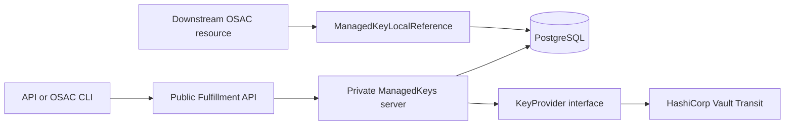

# Key Management Service — Key Lifecycle Management

| Field       | Value |
|-------------|-------|
| Author(s)   | Dakota Crowder |
| Jira        | [OSAC-3612](https://redhat.atlassian.net/browse/OSAC-3612) |
| PRD         | [prd.md](prd.md) |
| Date        | 2026-09-22 |

# 1. Overview

This design adds tenant-owned and provider-owned `ManagedKey` resources to the Fulfillment API and performs their lifecycle operations synchronously against HashiCorp Vault Transit. The OSAC CLI exposes the same workflows. PostgreSQL holds tenant attribution, confirmed lifecycle timestamps and material-version metadata; key material exists only in Vault. Downstream resources associate through typed references to the stable logical key. See the [PRD](prd.md) for product requirements.

The first supported provider is HashiCorp Vault Transit, selected through deployment-managed backend and policy configuration. Vault ACLs enforce reversible revocation without deleting key material. A narrow internal provider contract, opaque backend coordinates, and backend-neutral version records keep Transit semantics out of the public API so KMIP and other providers can be added without replacing logical-key identities. `[User]` `[Research: Vault and OpenBao Transit]`

The PRD has no FR/NFR identifiers. This design assigns the following traceability-only anchors without changing the requirement text:

| ID | PRD requirement anchor |
|----|------------------------|
| FR-1 | Create and view tenant-owned and provider-owned logical keys through API and CLI. |
| FR-2 | Expose confirmed lifecycle state, active version, retained versions, and actionable uncertainty after failed requests. |
| FR-3 | Rotate a logical key while preserving its identity and retained material versions. |
| FR-4 | Revoke all versions, block normal use and new associations, and permit explicit authorized recovery. |
| FR-5 | Define consumer-neutral key references and reject destruction while a consumer remains attached. |
| FR-6 | Enforce Tenant Admin, Cloud Provider Admin, Tenant User, and Cloud Infrastructure Admin boundaries. |
| FR-7 | Let Cloud Provider Admins configure transparent platform backends and policies without tenant selection. |
| FR-8 | Give Cloud Infrastructure Admins read-only KMS health and availability visibility. |
| FR-9 | Return confirmed success or actionable failure, distinguish uncertain provider outcomes from committed key state, and cover API/CLI journeys. |

# 2. Goals and Non-Goals

## 2.1 Goals

- Keep the `ManagedKey` object flat, like `Secret`, and complete normal Vault lifecycle calls before returning from the API. `[User]` `[Codebase: proto/private/osac/private/v1/secret_type.proto]`
- Preserve a stable OSAC logical-key ID and backend-neutral material generations across provider-specific rotations. `[Locked: D4, D13]`
- Use the existing typed-reference and reverse-delete-guard pattern for future key consumers. Complete lifecycle calls in the request and accept the same cross-store drift risk as Secrets when a Vault effect succeeds but the database transaction fails. `[User]` `[Codebase: fulfillment-service/internal/servers/private_secrets_server.go]`
- Support HashiCorp Vault Transit first without exposing Transit paths or numeric versions publicly. `[User]`
- Validate the backend behavior required for this key purpose internally; leave storage-consumer compatibility to OSAC-2389. `[User: lean public contract]` `[Research: Problem Space]`

## 2.2 Non-Goals

- This design does not add a key-management UI, automated rotation schedules, client-side cryptography, or key-material export.
- This design does not implement KMIP listeners, storage-resource bindings, re-encryption, crypto-erase orchestration, HSM integration, replication, or multi-region management. `[Locked: D5]`
- This design does not let tenants select a backend or policy and does not add provider-managed shared/default keys for tenant consumption. `[Locked: D10, D16]`
- This design does not add an audit-history product surface; ordinary resource events report committed key changes, not an audit log. `[Locked: D15]`

# 3. Motivation / Background

The current Vault-compatible integration provisions tenant namespaces and KV v2 mounts for secrets. Its `Secret` create, update, and delete handlers call Vault synchronously within the API request and accept possible drift if a later PostgreSQL commit fails. A repeated Secret update can create another internal KV version. It has no Transit client, logical-key resource, or material-version model. This design accepts the same cross-store tradeoff for key lifecycle calls. A retried Rotate can create another retained version; OSAC does not promise one version per request. Existing typed references and database delete guards supply the pattern for protecting keys used by downstream resources. `[User]` `[Codebase: fulfillment-service/internal/servers/private_secrets_server.go]`

Directly exposing Transit would couple the API to a named Vault key and its numeric versions. KMIP re-key can instead create a replacement object, while other providers use stable resources with separate material versions. OSAC therefore needs its own stable identity, key purpose, lifecycle policy, and provider translation boundary. `[Research: Existing Solutions and Tools]`

HashiCorp Vault Transit is the initial provider. Its documented API has no reversible whole-key disable operation, so OSAC enforces the PRD's revocation rule through key-specific Vault ACL policies attached to every normal consumer credential. Revocation removes cryptographic permissions from existing and new consumer tokens while retaining all key versions; recovery restores permissions after authorization. This differs from the earlier research recommendation and makes credential issuance and ACL conformance release gates. `[User]` `[Research: Vault and OpenBao Transit]` [Vault Transit API](https://developer.hashicorp.com/vault/api-docs/secret/transit) [Vault policies](https://developer.hashicorp.com/vault/docs/concepts/policies)

# 4. Design

## 4.1 Architecture

The Fulfillment Service owns the public contract and persistence. Each `ManagedKeys` lifecycle RPC invokes a backend-neutral `KeyProvider` during the request. It locks the key row to serialize same-key lifecycle changes, calls Vault, and records the confirmed result before returning success. No key consumer is added in OSAC-3612, so there is no reverse-reference guard or durable destruction fence yet; OSAC-2389 adds those with the first concrete consumer. The initial `HashiCorpVaultTransitProvider` uses the existing Vault connection and tenant namespace/authentication infrastructure with a dedicated Transit mount and per-key consumer ACL policies. Tenant namespaces require Vault Enterprise or HCP Vault Dedicated. `[User]` [Vault namespaces](https://developer.hashicorp.com/vault/docs/enterprise/namespaces)



The handler follows the Secret request-transaction pattern: it calls Vault during the request, then commits the database change. The row lock is held while an existing key is changed. A successful RPC means the Vault effect and database write were confirmed. If Vault succeeds but the database transaction rolls back, PostgreSQL retains the old state and an operator must repair the drift; Create can leave an orphaned Vault key. A timeout or crash can likewise leave an uncertain provider effect, with no operation record, background reconciliation, or exactly-once replay guarantee. Downstream resources store the key reference in their own specifications; public key responses omit consumer details and backend coordinates. OSAC-issued consumer credentials carry only the corresponding key-specific Vault policy; no normal consumer receives a broad Transit credential or a path to bypass the revocation gate. `[User]` `[Locked: D3, D8, D14]` `[Codebase: fulfillment-service/internal/database/database_tx_interceptor.go]`

The internal provider contract expresses product intent rather than vendor verbs:

```go
type KeyProvider interface {
    Observe(ctx context.Context, key ProviderKeyRef) (ObservedKey, error)
    Create(ctx context.Context, key ProviderKeyRef, policy KeyPolicy) (ObservedKey, error)
    Rotate(ctx context.Context, key ProviderKeyRef) (ObservedKey, error)
    Revoke(ctx context.Context, key ProviderKeyRef) (ObservedKey, error)
    Recover(ctx context.Context, key ProviderKeyRef) (ObservedKey, error)
    Destroy(ctx context.Context, key ProviderKeyRef) error
    Health(ctx context.Context, backend BackendRef) (BackendHealth, error)
}
```

`ProviderKeyRef`, backend object IDs, and backend versions are private opaque values. The configured provider and `ENCRYPT_DECRYPT` policy define the required behavior, so this interface has no general capability-discovery method. Deployment validation and `Health` check the required Vault access, mount, namespace, and policy behavior; the provider conformance suite tests the full lifecycle. A future purpose or provider with optional behavior can add a specific check when a consumer needs it.

Adapter errors carry a normalized cause (`UNAVAILABLE`, `UNAUTHORIZED`, `UNSUPPORTED`, `CONFLICT`, or `INVALID_CONFIGURATION`). A mutation error separately records whether the adapter can prove no provider effect or the outcome is uncertain, including a partial effect. `RETRYABLE` and `TERMINAL` are not mutually exclusive causes: a timeout can be retried but may already have rotated a key, while a configuration error may be fixable but cannot succeed unchanged. The lifecycle handler uses the cause and effect certainty to choose an actionable public error; it does not automatically repeat an uncertain mutation.

The public lifecycle is derived from confirmed facts, not a separate state machine:

| Confirmed result | Public fields after the final database commit |
|------------------|-----------------------------------------------|
| Create | Publish the key with generation `1` after Vault and PostgreSQL succeed; a rolled-back create is not listed and may leave an orphaned Vault object. |
| Rotate | Append every newly observed material generation and advance `active_version` to the latest confirmed generation; earlier generations remain listed. |
| Revoke | Set `revoked_at` after the ACL change and access denial are verified. |
| Recover | Clear `revoked_at` after normal access is verified. |
| Destroy | Set `destroyed_at` only after the authorized Vault key deletion is confirmed. |

Absent `destroyed_at`, a present `revoked_at` means revoked; when both are absent, the key's last committed OSAC state is active. The timestamps record when OSAC confirmed the effect, not the exact Vault change time. Normal lifecycle calls return the confirmed result synchronously. A failed or timed-out call reports that its Vault effect may be uncertain and leaves the last committed key state intact; it does not create a public interim state. `Get` and `List` return that committed metadata without claiming a live Vault check. Operators verify and repair provider differences before further lifecycle changes. There is no public operation history or unattended reconciliation. `[User: simplify synchronous lifecycle]` `[Locked: D8, D15, D19]`

### Transit mapping

| OSAC intent | HashiCorp Vault Transit effect | Confirmation |
|-------------|------------------------|--------------|
| Create | `POST /{mount}/keys/{opaque-name}` with `aes256-gcm96`, `exportable=false`, `allow_plaintext_backup=false`; create a key-specific consumer ACL policy | Read key and policy; latest version is 1 and configuration matches policy |
| Rotate | `POST /{mount}/keys/{opaque-name}/rotate` | Read key; latest version advanced and earlier versions remain available |
| Revoke | Replace the key-specific consumer policy's cryptographic path grants with explicit `deny` rules; retain the Transit key and every version | Read policy and verify a previously issued consumer token cannot encrypt or decrypt any retained version; only then set `revoked_at` |
| Recover | Restore the key-specific consumer policy's cryptographic grants after authorized recovery | Read policy and verify a consumer token can encrypt and decrypt retained versions; only then clear `revoked_at` |
| Destroy | Set `deletion_allowed=true`, then `DELETE /{mount}/keys/{opaque-name}` | Read returns not found under the committed destroy intent; only then set `destroyed_at` |

Backend names are deterministic (`osac-<managed-key-uuid>`) and never derived from tenant-provided names. The adapter treats an existing name with mismatched immutable configuration as `CONFLICT`; it never adopts or overwrites an out-of-band key.

The per-key policy covers every enabled cryptographic path for that key, including encrypt, decrypt, rewrap, data-key generation, HMAC, sign, and verify where applicable. Its `deny` rules take precedence over other ordinary ACL grants. All normal Transit credentials for a key must carry this policy, including credentials issued before revocation; credentials with root or unrestricted administrative access are excluded from normal consumer use. The API uses a separate restricted management credential to change the policy. If policy write or verification fails, `revoked_at` is not changed and the RPC returns an error; an uncertain or partial effect requires verification and repair. Provider administrators inspect out-of-band policy drift through backend health and operation errors; there is no automatic repair loop. `[Locked: D8]` [Vault policies](https://developer.hashicorp.com/vault/docs/concepts/policies)

## 4.2 Data Model / Schema Changes

The editable private proto defines the public shape; `cleanapi` removes private provider fields from generated public protos. These proposed definitions use the existing `Metadata`, `google.protobuf.Timestamp`, and `cleanapi` types; omitted imports and service annotations follow the existing resource protos. The public purpose follows [Google Cloud KMS's `CryptoKeyPurpose`](https://github.com/googleapis/googleapis/blob/master/google/cloud/kms/v1/resources.proto#L59). No asynchronous operation resource or interim transition field is defined. `[User]` `[Codebase: proto/private/osac/private/v1]`

```protobuf
enum ManagedKeyPurpose {
  MANAGED_KEY_PURPOSE_UNSPECIFIED = 0;
  MANAGED_KEY_PURPOSE_ENCRYPT_DECRYPT = 1;
}

message ManagedKey {
  string id = 1;
  Metadata metadata = 2;
  ManagedKeyPurpose purpose = 3; // Immutable; ENCRYPT_DECRYPT only in this release.
  uint64 active_version = 4;    // Last OSAC-confirmed material generation.
  repeated ManagedKeyVersion versions = 5;
  google.protobuf.Timestamp revoked_at = 6;   // Present only while confirmed revoked.
  google.protobuf.Timestamp destroyed_at = 7; // Present after confirmed destruction.
  optional string backend_name = 1001 [(cleanapi.field).private = true];
  optional string backend_object_id = 1002 [(cleanapi.field).private = true];
  optional string policy_name = 1003 [(cleanapi.field).private = true];
}

message ManagedKeyVersion {
  uint64 generation = 1; // Monotonic OSAC generation, independent of Vault's version.
  google.protobuf.Timestamp creation_timestamp = 2;
  repeated BackendVersionReference backend_versions = 1001
      [(cleanapi.field).private = true];
}

message BackendVersionReference {
  option (cleanapi.message).private = true;
  string object_id = 1;
  string version_id = 2;
}

```

`metadata.tenant` is the sole ownership signal: `system` means a provider-owned key, and any other permitted tenant means a tenant-owned key. The server uses this value to choose the provider or tenant default policy and Vault namespace. `shared` is invalid for ManagedKeys because it is visible to ordinary users and provider-managed keys for tenant consumption are out of scope. The tenant is immutable after creation. `purpose=ENCRYPT_DECRYPT` means the key is for symmetric encryption and decryption; the configured policy fixes `aes256-gcm96`. It does not promise that OSAC exposes cryptographic data-plane RPCs. The latest OSAC-confirmed generation is `active_version`, earlier generations in `versions` are retained, and `destroyed_at` makes every generation unusable; no separate version-state enum is needed. A successful Rotate records every newly observed Vault version as an OSAC generation before the database transaction commits. If the commit fails, no generation is added by `Get`; the operator repair procedure must reconcile the observed versions. Rotation mode, ACL mechanics, and destruction mode remain private provider details. `backend_versions` permits a later provider to map one OSAC generation to replacement objects without changing the public generation or consumer reference. No field contains key material or a client request ID. `[User]` `[Locked: D4, D8, D13, D15, D16]`

Consumers use the same typed-reference convention as other Fulfillment resources:

```protobuf
message ManagedKeyLocalReference {
  string id = 1;
  string name = 2; // Resolve within the caller's authorized tenant scope.
}

```

`ManagedKeyLocalReference` identifies the stable logical key, never a material generation. A consumer stores it in its own resource, such as `spec.managed_key`, and the server resolves its `id` and `name` within the authorized tenant scope. The consumer's Create/Update validation rejects cross-tenant, revoked, destroyed, or backend-drifted keys and takes a shared lock on the key row. The same consumer change must add a reverse-reference check to `ManagedKeys.Destroy`, including soft-deleted versus active-resource semantics, under an incompatible key-row lock. This matches the existing Secret reference and delete-guard pattern. No consumer-specific fields or list of consumers appear on `ManagedKey`. `[User]` `[Locked: D3, D5, D13, D14]` `[Codebase: fulfillment-service/docs/API.md]` `[Codebase: fulfillment-service/internal/database/migrations/111_add_secret_delete_protection_trigger.up.sql]`

Like `Secret`, `ManagedKey` exposes flat fields and reports confirmed Vault effects synchronously. It has no separate operation record, transition field, or exactly-once retry semantics. Create has no precommitted reservation: if Vault creates a key but PostgreSQL does not commit, the provider object is orphaned and must be found and removed through operator tooling. `[User]` `[Codebase: proto/private/osac/private/v1/secret_type.proto]`

PostgreSQL receives one additive key-resource migration:

- `managed_keys`: the standard generic-resource columns plus JSONB `data`. Provider-owned keys use the reserved `system` tenant; tenant-owned keys use their owning tenant. No separate ownership column is needed. The tenant, private backend, and policy assignment are immutable after creation.

Each concrete consumer adds a reference field and its own forward-validation and reverse-delete guard in the same change. OSAC-3612 defines the reference type but adds no consumer binding, reverse-reference check, or durable destruction fence because the first storage consumer belongs to [OSAC-2389](https://redhat.atlassian.net/browse/OSAC-2389). That consumer change must make reference admission and Destroy exclusion race-safe, including the case where Vault deletion succeeds but the database commit fails. A private persisted fence may be needed then; its exact form belongs with the concrete consumer design. No generic association table or service is created. `[User]` `[Locked: D3, D5, D8]`

Connection, namespace, mount, authentication, policy, and readiness-check details remain private deployment configuration. The service validates required backend access before admitting key creation and reports ongoing availability through operational metrics, alerts, and redacted logs. Full lifecycle behavior is proven separately by provider conformance tests. No backend status resource is added to the public API. `[User]` `[Locked: D10, D17]`

## 4.3 API Changes

### ManagedKeys service

`osac.public.v1.ManagedKeys` and its private counterpart implement `Create`, `List`, `Get`, `Update`, `Delete`, `Rotate`, `Revoke`, `Recover`, and `Destroy` at `/api/fulfillment/v1/managed_keys`. The four lifecycle RPCs are an explicit exception to the usual declarative Fulfillment API guidance because each operation is an administrator-requested, synchronous Vault action. These are additive APIs. `[User]` `[Codebase: fulfillment-service/docs/API.md]`

- `Create` requires `metadata.name` and defaults `purpose=ENCRYPT_DECRYPT`, the only supported purpose in this release. A Tenant Admin may omit `metadata.tenant` to use their authorized tenant or set it to an authorized tenant. A Cloud Provider Admin must specify a tenant: `system` creates a provider-owned key, while an ordinary tenant creates a tenant-owned key under existing broad administrative access. Only Cloud Provider Admins may create in `system`; `shared` is always rejected. This explicit rule prevents the generic administrator default of `shared` from creating a broadly visible key. The server rejects caller-supplied lifecycle timestamps, versions, or provider fields. It publishes the key only after Vault creation and the database result are confirmed.
- `Update` changes only `metadata.display_name` and `metadata.description`; tenant, purpose, lifecycle timestamps, and versions are system-owned or immutable.
- `Rotate`, `Revoke`, `Recover`, and `Destroy` require key ID and expected metadata version. Same-key lifecycle calls serialize through the database row lock during the request. Before changing Vault, each call observes the relevant provider state and rejects a mismatch with the stored metadata using `FailedPrecondition` and an actionable repair message. After an uncertain outcome, an administrator checks the last committed key state and verifies Vault through operator tooling before another mutation; a retry may create another retained version when the earlier Rotate outcome is unknown.
- `Rotate` and `Revoke` require no `revoked_at` or `destroyed_at`; `Recover` requires `revoked_at` and no `destroyed_at`; `Destroy` accepts a live or revoked key. Once `destroyed_at` is set, no lifecycle mutation is allowed.
- `Destroy` has no consumer reference to check in OSAC-3612. Beginning with OSAC-2389, it must return `FailedPrecondition/KeyInUse` while an active supported consumer resource references the key, without revealing consumer identities. `[User]` `[Locked: D3, D14]`
- `Delete` removes only OSAC metadata after `destroyed_at` is set; attempting to delete a live or revoked key returns `FailedPrecondition`.
- `Get` and `List` return tenant-filtered last-committed database metadata without a Vault call. They do not add `ManagedKeyVersion` records, repair a failed lifecycle write, or guarantee that Vault still matches the stored state. After a lost response or process crash, a caller may see stale metadata without an error and must verify the provider outcome before retrying a destructive or rotating action. Neither method exposes backend coordinates, credentials, or key bytes.

The lifecycle RPC calls Vault before returning success. A definitive failure with proof of no provider effect returns an actionable gRPC error and leaves the confirmed fields unchanged; no `FAILED` resource state is stored. If the provider effect or final PostgreSQL commit is uncertain, the server returns `Unavailable` or `DeadlineExceeded` and warns that committed metadata may differ from Vault. `Get` still returns the last committed OSAC state; provider verification uses operator tooling, and subsequent lifecycle calls reject a detected mismatch before making another Vault change. An immediate repeat after a timeout may overlap with the original Vault call and create an extra rotation version even if its preflight observation matched the stored state. Vault is authoritative for key material, current version, and policy effects; PostgreSQL is authoritative for logical identity, tenant, and committed lifecycle metadata. `[User]`

Example `Rotate` request:

```json
{
  "id": "7e24b74d-7dd4-4ff1-86bb-503d37f112d3",
  "expected_metadata_version": 4
}
```

Success returns the key with active version `2` and versions `1` and `2`. If Vault creates version `2` but the database commit fails, `Get` still returns the committed active version `1`; it does not add version `2` to the public key. The failed RPC warns that Vault may differ, and another lifecycle call rejects the observed mismatch until an administrator verifies Vault and repairs the mapping. A timeout before Vault's outcome is known requires the same verification; repeating Rotate without it can create another retained version if the original POST is still in flight. A definite no-effect failure returns a stable gRPC reason and message while the confirmed version remains `1`.

### Consumer reference contract

`ManagedKeyLocalReference` is defined in the key type proto for use by downstream Fulfillment resources. A consumer owns its reference field, validation, and reverse-delete guard. When such a field is added, its Create/Update path returns:

- `FailedPrecondition/KeyNotActive` for revoked or destroyed keys;
- `InvalidArgument/TenantMismatch` for a consumer outside the key's tenant;
- `InvalidArgument` for an unknown key reference.

The key API has no association list or detail surface. There is no independent association CRUD service. OSAC-2389 adds the first concrete storage reference and the corresponding guards; a separate registry is considered only if a later consumer cannot store a typed reference in a Fulfillment resource. `[User]` `[Locked: D5, D14]`

## 4.4 Scalability and Performance

Key lifecycle requests are administrative control-plane operations; encryption and decryption data-plane traffic does not pass through the Fulfillment API. Each lifecycle RPC observes provider state and makes the required Vault Transit or policy calls before returning success. `Get` and paginated `List` read database metadata without a Vault call. Provider concurrency is bounded per backend, and concurrent changes to the same key serialize on its database row. A timed-out Vault call may still finish after the request transaction rolls back, so a later retry can create an extra rotation version. The key-specific ACL policy adds one policy object per key and a policy update plus verification for revocation and recovery. A slow Vault call increases that RPC's latency and holds a PostgreSQL transaction open, as in the Secret flow.

OSAC-3612 has no key-consuming resource and therefore no reference-versus-Destroy lock protocol. The first consumer adds that protocol and any durable deletion fence needed to protect references after a failed database commit. Each consuming resource adds an index on its canonical key ID if needed for its reverse-reference check, following the existing Secret guard pattern. List pagination and CEL filtering follow existing generic-resource behavior.

Version metadata remains with the key. Historical material metadata grows linearly with rotations; automated rotation is out of scope, so growth follows explicit administrative operations and retries. Destroyed key metadata remains until explicit `Delete`.

## 4.5 Security Considerations

- HashiCorp Vault generates and stores all key material. Material, backups, plaintext, ciphertext payloads, and export endpoints are never represented by the OSAC API, database, CLI, logs, metrics, or events.
- Policies force `exportable=false`, `allow_plaintext_backup=false`, and disable automatic Transit rotation. Destruction temporarily enables only the provider-side deletion flag required for the selected key.
- Backend names use UUIDs rather than user input, preventing path injection and tenant-name disclosure. Endpoint, mount, namespace, and consumer-reference fields receive length and character validation before use.
- Provider calls use tenant-scoped Vault namespaces and least-privilege policies limited to the configured Transit mount. Provider-owned keys use a provider namespace inaccessible to tenant tokens. Normal consumer tokens are key-scoped and cannot modify their ACL policy; only the management identity can change revocation policy.
- Status and error messages are redacted: they may name the normalized backend and reason but not tokens, certificate data, raw provider responses, consumer identities, or key bytes.
- A consumer's reference field is validated under that resource's existing authorization and tenancy rules; possession of a key ID alone does not authorize a binding.

## 4.6 Failure Handling and Recovery

| Failure | System behavior | User-visible result |
|---------|-----------------|---------------------|
| Backend unavailable or sealed before Vault effect | The request transaction rolls back without changing the key. | The lifecycle RPC returns `Unavailable` with an actionable reason. `Get` and `List` still show last-committed metadata, not live provider availability. |
| Create times out or its database commit fails | As with Secrets, the database insert can roll back after Vault creates an object. The server does not adopt an unrecorded key on retry. An operator finds orphaned `osac-<uuid>` keys by comparing Vault names with persisted key IDs and removes them after checking that no OSAC key refers to them. | The RPC returns an error and does not claim a key was created. The caller checks List by name before retrying Create; a retry may create a new backend object. |
| Rotation times out | The request transaction rolls back. Vault may have created a version already or may create one later; the server does not record a generation without a confirmed database commit. | The RPC does not claim success. `Get` shows the last committed version; the caller verifies Vault before retrying. A later mutation rejects an observed mismatch with `FailedPrecondition`. |
| Revocation/recovery times out | The request transaction rolls back, but the Vault ACL may have changed. The operator checks the policy and an existing consumer credential before repair or retry. | The RPC reports uncertainty; `revoked_at` stays at its last committed value in Get and List. A later mutation rejects an observed mismatch. |
| Destruction times out | The request transaction rolls back, but Vault may have deleted the key. No key consumer exists in this feature, so there is no reference fence. | `destroyed_at` stays unset unless the transaction committed. Get and List show the last committed metadata; operator verification and repair are needed before metadata deletion. |
| PostgreSQL final commit fails after Vault success | The request transaction rolls back and the provider effect may remain. Create can leave an orphaned backend object; existing-key state can diverge from Vault. | The RPC returns an error. Get and List still show last-committed metadata; a later lifecycle call detects an observed mismatch and stops before changing Vault. |
| Out-of-band backend or ACL mutation | Lifecycle preflight rejects an unexpected provider state and stops destructive or rotating calls. A missing key is not treated as an authorized destruction. | The mutating RPC returns `FailedPrecondition` with redacted corrective guidance; Get and List continue to show last-committed metadata. |

Every mutation uses metadata optimistic locking. Vault's Rotate endpoint does not accept an idempotency key. Observing the prior version after a timeout cannot prove that an earlier POST will not finish later, so a repeated Rotate is explicitly at-least-once: it may create two new material versions. If Vault advances after OSAC's final write, Get and List still show the last committed OSAC version; the next lifecycle preflight detects the mismatch. An administrator must verify Vault and repair the version mapping before further lifecycle changes. No persistent operation marker survives a process crash; operator diagnostics and provider observation are the recovery path. `[User]` [Vault Transit rotate API](https://developer.hashicorp.com/vault/api-docs/secret/transit#rotate-key)

## 4.7 RBAC / Tenancy

| Persona | ManagedKeys | Consumer references |
|---------|-------------|---------------------|
| Tenant Admin | Create/read/update tenant-owned keys in assigned tenants; delete metadata after destruction | Governed by each consumer resource's permissions |
| Tenant User | No direct key-management access | Governed by each consumer resource's permissions |
| Cloud Provider Admin (`is_admin`) | Existing broad access plus provider-owned key lifecycle | Governed by each consumer resource's permissions |
| Cloud Infrastructure Admin | No key access | No key binding authority |
| Authorized downstream service | No public lifecycle access | Writes only the consumer resource fields it is authorized to manage |

OPA adds exact method rules for `ManagedKeys`, while existing tenancy logic filters tenant resources. The ManagedKeys create path admits `system` only for Cloud Provider Admins and rejects `shared`; it never accepts an unassigned administrator tenant default. Provider-owned keys are thus identified by `metadata.tenant=system` and do not inherit the visibility of `shared` resources. This feature adds no KMS-specific API permission or realm role for Cloud Infrastructure Admins; their read-only health visibility uses platform monitoring access. `[User]` `[Locked: D2, D12, D16, D17, D18]`

Recovery currently uses the same lifecycle authority as revocation: Tenant Admin for a tenant-owned key and Cloud Provider Admin under existing administrative access. Whether recovery needs a distinct privilege is an open question in §9.1.

## 4.8 Extensibility / Future-Proofing

The internal provider registry is keyed by immutable `backend_name`, and every key records its assigned backend/policy privately. Deployment configuration accepts multiple named backends and policies even though only `vault-transit` is initially valid; exactly one tenant default and one provider default are required. Tenants never choose either value. Adding a provider extends the closed backend-type enum and conformance suite rather than the public `ManagedKey` lifecycle.

The provider conformance suite checks rotation, retained-version access, revocation, recovery, and destruction for `ENCRYPT_DECRYPT` without publishing those mechanics as key fields. OSAC-2389 owns storage-consumer compatibility such as per-tenant key binding, re-encryption, and crypto-erase. If a later provider or key purpose needs a client-visible distinction, add a purpose value or a targeted field then; the logical key ID and version generations remain stable. `[User: lean public contract]` `[Research: Downstream KMIP readiness]`

OSAC material generations are independent of backend object IDs. A KMIP provider may therefore map one generation to a new managed object and replacement link without changing consumers' `ManagedKeyLocalReference` values or the public logical-key ID.

# 5. Interface Changes

## IC-1: ManagedKeys gRPC and REST resource

**Requirements:** FR-1, FR-2, FR-3, FR-4, FR-5, FR-6, FR-9

Adds public/private `ManagedKeys` CRUD and lifecycle RPCs with a flat `ManagedKey` object. `Create`, `Rotate`, `Revoke`, `Recover`, and `Destroy` report success only after their Vault effects and database writes are confirmed. On timeout, callers inspect the key before retrying; retries are not deduplicated. See §§4.2–4.3.

## IC-2: ManagedKey lifecycle status and Events payloads

**Requirements:** FR-2, FR-3, FR-4, FR-9

Adds backend-neutral purpose, versions, and confirmed revocation/destruction timestamps to `ManagedKey`. Ordinary Fulfillment object events carry committed changes. `Get` and `List` return last-committed metadata; provider-state mismatches are checked by lifecycle methods before mutation. No interim transition, operation history, request IDs, key material, or backend coordinates enter the public payload. See §§4.2 and 4.6.

## IC-3: OSAC CLI key inspection commands

**Requirements:** FR-1, FR-2, FR-6

Adds `osac create key`, `osac list keys`, and `osac describe key`. The existing global `--tenant` flag selects the key's tenant; `osac --tenant system create key` is available only to Cloud Provider Admins. Describe derives active/revoked/destroyed from the last committed timestamps and shows `metadata.tenant`, purpose, and active and retained generations. The output does not claim to verify current Vault state.

## IC-4: OSAC CLI key lifecycle commands

**Requirements:** FR-3, FR-4, FR-5, FR-9

Adds `osac rotate key`, `osac revoke key`, `osac recover key`, and `osac destroy key`. Commands return when the synchronous RPC completes and print the confirmed result derived from timestamps and active generation. On timeout they say the provider outcome may be uncertain, direct the caller to verify it before retrying, and warn that a second Rotate may create another retained version; `--wait` is unnecessary.

## IC-5: ManagedKey local reference contract

**Requirements:** FR-4, FR-5

Adds the `ManagedKeyLocalReference { id, name }` type for downstream Fulfillment resources. Each consumer that adds this field must resolve it to an active same-tenant key, store the canonical key ID, and add a reverse-reference guard that blocks `Destroy` while an active resource points to that ID. OSAC-3612 introduces no concrete consuming resource or durable deletion fence; [OSAC-2389](https://redhat.atlassian.net/browse/OSAC-2389) owns the first storage binding, its guard, and any fence required for cross-store failure safety. See §§4.2–4.3. `[User]`

## IC-6: Deployment-managed KMS backend and policy configuration

**Requirements:** FR-7

Adds Helm values and service flags for `kms.enabled`, `kms.defaultTenantPolicy`, `kms.defaultProviderPolicy`, named `kms.backends`, and named `kms.policies`. The initial closed backend type is `vault-transit`; policies fix `aes256-gcm96`, disable export/plaintext backup/automatic rotation, and reference a named backend. Configuration must provide tenant namespace support and an OSAC-managed, key-scoped consumer credential path so revocation cannot be bypassed by a broad Transit grant. Tenants cannot submit backend or policy fields.

## IC-7: Key-management authorization surface

**Requirements:** FR-6

Adds exact OPA method permissions for ManagedKeys. Tenant Admins receive tenant-owned key lifecycle methods, existing administrators retain broad access, and Cloud Infrastructure Admins and ordinary Tenant Users receive no direct key-management methods.

## IC-8: Operational KMS health signals

**Requirements:** FR-7, FR-8

Adds per-backend readiness metrics, alerts, and redacted diagnostic logs for platform operators. Health remains a private service concern; no public backend resource, CLI health command, or KMS-specific Cloud Infrastructure Admin API permission is introduced.

# 6. Alternatives Considered

### Expose Transit directly through the public API

This minimizes translation and implementation code, but leaks numeric material versions, ACL-based revocation details, mount paths, and vendor errors into a contract that cannot represent KMIP replacement objects cleanly. It is rejected because OSAC-2389 requires backend capability variance. `[Research: Lifecycle capability comparison]`

### Require a native whole-key disable primitive for the first provider

This would simplify revocation, but would exclude HashiCorp Vault Transit despite the PRD's Vault dependency. OSAC instead uses key-specific Vault ACL policies: every normal consumer token is subject to the policy, and terminal revocation requires verified denial of both encryption and decryption. A database-only flag is insufficient because it cannot stop direct Vault use. The extra credential and policy lifecycle is accepted to make Vault the first supported provider. `[User]` `[Locked: D8]`

### Persist a general lifecycle transition marker

A committed marker would make an unresolved Vault call visible on the key and block conflicting mutations after a crash. With synchronous RPCs, users would mainly see it after an error, and it would not make Rotate idempotent or repair database drift. This design instead follows the Secret request transaction and reports uncertainty through the RPC error and live `Get`. A deletion fence is deferred until a concrete consumer needs protection from an uncertain Destroy. `[User: simplify synchronous lifecycle]` `[Codebase: fulfillment-service/internal/servers/private_secrets_server.go]`

### Use desired-state updates instead of lifecycle RPCs

Declarative updates match the usual Fulfillment API convention but imply eventual convergence and a desired-versus-observed model for operations that Vault itself executes synchronously. Explicit lifecycle RPCs are chosen for this object and report confirmed outcomes before returning success. This is a deliberate exception to the API guideline. `[User]` `[Codebase: fulfillment-service/docs/API.md]`

### Add a separate managed-key association registry

A generic table and private CRUD service could register consumers that do not store a key reference in a Fulfillment resource. For known Fulfillment resources this duplicates their typed reference fields and requires two records to stay in sync. This design uses the established typed-reference and reverse-delete-guard pattern; a registry can be added when a concrete external consumer needs one. `[User]` `[Codebase: fulfillment-service/docs/API.md]`

### Make backend and policy selection tenant-configurable

This offers flexibility but contradicts the requirement that tenants never configure KMS infrastructure and creates migration/fallback semantics not required by this feature. Provider-managed deployment configuration assigns immutable defaults transparently. `[Locked: D10]`

# 7. Observability and Monitoring

The implementation adds these low-cardinality Prometheus metrics:

- `osac_kms_backend_ready{backend}` gauge: `1` only when health, authentication, Transit mount, and required policy checks pass.
- `osac_kms_operation_total{backend,operation,result}` counter: synchronous attempts grouped by normalized result.
- `osac_kms_operation_duration_seconds{backend,operation}` histogram: provider operation latency.
- `osac_kms_keys{lifecycle}` gauge: current resource count by lifecycle derived from confirmed timestamps, without tenant or key labels.

An alert fires when a configured backend remains not ready for five minutes. Cloud Infrastructure Admins use the platform monitoring view of this metric and alert for read-only availability visibility. Structured logs include key ID, backend name, operation, normalized reason, and duration; they exclude tenant-provided descriptions, consumer identities, tokens, provider response bodies, ciphertext, and key material. Confirmed resource changes continue through the generic Events service; failed Vault calls use error responses and operational logs rather than an Events-backed interim state.

# 8. Impact and Compatibility

The API, key-resource migration, CLI key commands, metrics, and Helm values are additive. Existing resources and clients remain compatible. `proto/private` is the source; `proto/public` and `proto/gen` are regenerated once and all consumers rebuild against the shared module. This feature defines the reference contract but adds no key-consuming resource or durable destruction fence; [OSAC-2389](https://redhat.atlassian.net/browse/OSAC-2389) adds the first reverse-reference guard and resolves the fence needed when Vault deletion succeeds but PostgreSQL does not commit. `[User]`

The initial support target is HashiCorp Vault Enterprise or HCP Vault Dedicated with tenant namespaces and Transit. The existing bundled development backend is not proof of HashiCorp Vault compatibility; a real Vault integration environment must pass provider conformance before release, including existing-token ACL revocation, retained-version decryption after recovery, tenant isolation, rotation, and destruction. Startup validation prevents new key creation if required namespace, mount, credential, or policy checks fail and emits a redacted diagnostic. Existing Vault KV secret behavior is unchanged. [Vault namespaces](https://developer.hashicorp.com/vault/docs/enterprise/namespaces)

Downgrade requires all ManagedKeys to be destroyed and their metadata deleted, followed by removal of KMS configuration. Downgrading the service while live keys remain is unsupported because an older service cannot enforce key lifecycle safeguards. Once consuming resources add key references, their downgrade plan must also remove those references before key management is rolled back. Version skew is tolerated only while older components treat the new proto types as unknown; all API servers must run the same release before key creation is enabled.

# 9. Open Questions

## 9.1 Should recovery require a privilege distinct from ordinary key lifecycle administration?

- **Owner:** OSAC security and product maintainers
- **Impact:** Changes §4.3 recovery validation, §4.7 role mappings, IC-4/IC-7, and recovery test identities. The current proposal permits the same lifecycle administrator who can revoke a key to recover it.

## 9.2 Which HashiCorp Vault edition and minimum version will the release certify?

- **Owner:** Fulfillment Service and OSAC Installer maintainers
- **Impact:** The first supported provider is HashiCorp Vault Transit with namespaces. Maintainers must pin a tested Vault Enterprise or HCP Vault Dedicated version and provision a matching conformance environment before release; this affects §8 and deployment validation, not the provider priority.

## 9.3 What operator procedure will repair key state after a cross-store failure?

- **Owner:** Fulfillment Service and Vault integration maintainers
- **Impact:** Vault Rotate has no request idempotency key. A retry can create an extra version, and a delayed POST can advance Vault after OSAC records a result. The release needs an operator procedure to verify material retention, repair generation and revocation metadata after drift, confirm destruction after an uncertain Destroy, and remove orphaned Create objects; this affects §§4.2, 4.6, and the failure tests. No public operation collection is required.

---

## Provenance

Authored: draft @ design 0.11.3 - 9b25062, workspace bugfix/osac-5191/mutable-userdata @ 829cb62b7
Final: revise @ design 0.11.3 - cc0daa6, workspace osac-5618/allow-system-secrets @ 744fd60b5

> Context changed between draft and revise.

<!-- ai-workflow-provenance:{"schema_version":1,"provenance_kind":"session","workflow":"design","workflow_version":"0.11.3","ai_workflows":"cc0daa6","source_repo":"744fd60b5","source_repo_branch":"osac-5618/allow-system-secrets","commits_behind_main":0,"commits_ahead_main":1,"main_ref":"main","phases":["draft","revise","revise","revise","revise","revise","revise","revise","revise","revise","revise","revise"],"authoring_modes":["skill"],"context_changed":true,"origin_untracked":false} -->
