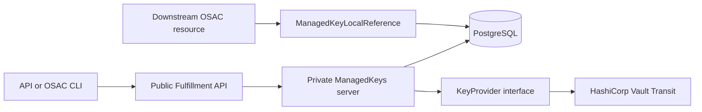

# Key Management Service — Key Lifecycle Management

| Field       | Value |
|-------------|-------|
| Author(s)   | Dakota Crowder |
| Jira        | [OSAC-3612](https://redhat.atlassian.net/browse/OSAC-3612) |
| PRD         | [prd.md](prd.md) |
| Date        | 2026-09-22 |

# 1. Overview

This design adds tenant-owned and provider-owned `ManagedKey` resources to the Fulfillment API and performs their lifecycle operations synchronously against HashiCorp Vault Transit. The OSAC CLI exposes the same workflows. PostgreSQL holds tenant attribution, confirmed lifecycle timestamps and material-version metadata; key material exists only in Vault. Downstream resources associate through typed references to the stable logical key. See the [PRD](prd.md) for product requirements.

The first supported provider is HashiCorp Vault Transit, selected through deployment-managed backend and policy configuration. Vault ACLs enforce reversible revocation without deleting key material. A narrow internal provider contract, opaque backend coordinates, and backend-neutral version records keep Transit semantics out of the public API so KMIP and other providers can be added without replacing logical-key identities. `[User]` `[Research: Vault and OpenBao Transit]`

The PRD has no FR/NFR identifiers. This design assigns the following traceability-only anchors without changing the requirement text:

| ID | PRD requirement anchor |
|----|------------------------|
| FR-1 | Create and view tenant-owned and provider-owned logical keys through API and CLI. |
| FR-2 | Expose confirmed lifecycle state, active version, retained versions, and actionable uncertainty after failed requests. |
| FR-3 | Rotate a logical key while preserving its identity and retained material versions. |
| FR-4 | Revoke all versions, block normal use and new associations, and permit explicit authorized recovery. |
| FR-5 | Define consumer-neutral key references and reject destruction while a consumer remains attached. |
| FR-6 | Enforce Tenant Admin, Cloud Provider Admin, Tenant User, and Cloud Infrastructure Admin boundaries. |
| FR-7 | Let Cloud Provider Admins configure transparent platform backends and policies without tenant selection. |
| FR-8 | Give Cloud Infrastructure Admins read-only KMS health and availability visibility. |
| FR-9 | Return confirmed success or actionable failure, distinguish uncertain provider outcomes from committed key state, and cover API/CLI journeys. |
| FR-10 | Let authorized tenant callers discover visible keys and encrypt or decrypt small payloads through the API and CLI, with separate operation permissions and predictable rotation, revocation, recovery, and destruction behavior. |

# 2. Goals and Non-Goals

## 2.1 Goals

- Keep the `ManagedKey` object flat, like `Secret`, and complete normal Vault lifecycle calls before returning from the API. `[User]` `[Codebase: proto/private/osac/private/v1/secret_type.proto]`
- Preserve a stable OSAC logical-key ID and backend-neutral material generations across provider-specific rotations. `[Locked: D4, D13]`
- Use the existing typed-reference and reverse-delete-guard pattern for future key consumers. Complete lifecycle calls in the request and accept the same cross-store drift risk as Secrets when a Vault effect succeeds but the database transaction fails. `[User]` `[Codebase: fulfillment-service/internal/servers/private_secrets_server.go]`
- Support HashiCorp Vault Transit first without exposing Transit paths or numeric versions publicly. `[User]`
- Keep direct cryptographic calls synchronous and limited to small single payloads. Apply the same tenant and project visibility rules to discovery and use. `[User: initial-release encrypt/decrypt and project visibility]`
- Validate the backend behavior required for this key usage internally; leave storage-consumer compatibility to OSAC-2389. `[User: lean public contract]` `[Research: Problem Space]`

## 2.2 Non-Goals

- This design does not add a key-management UI, automated rotation schedules, client-side cryptography, or key-material export.
- This design does not add batch or bulk cryptography, per-key caller grants, or a managed ciphertext inventory. `[User: bounded first release and existing authorization model]`
- This design does not implement KMIP listeners, storage-resource bindings, re-encryption, crypto-erase orchestration, HSM integration, replication, or multi-region management. `[Locked: D5]`
- This design does not let tenants select a backend or policy and does not add provider-managed shared/default keys for tenant consumption. `[Locked: D10, D16]`
- This design does not add an audit-history product surface; ordinary resource events report committed key changes, not an audit log. `[Locked: D15]`

# 3. Motivation / Background

The current Vault-compatible integration provisions tenant namespaces and KV v2 mounts for secrets. Its `Secret` create, update, and delete handlers call Vault synchronously within the API request and accept possible drift if a later PostgreSQL commit fails. A repeated Secret update can create another internal KV version. It has no Transit client, logical-key resource, or material-version model. This design accepts the same cross-store tradeoff for key lifecycle calls. A retried Rotate can create another retained version; OSAC does not promise one version per request. Existing typed references and database delete guards supply the pattern for protecting keys used by downstream resources. `[User]` `[Codebase: fulfillment-service/internal/servers/private_secrets_server.go]`

Directly exposing Transit would couple the API to a named Vault key and its numeric versions. KMIP re-key can instead create a replacement object, while other providers use stable resources with separate material versions. OSAC therefore needs its own stable identity, key usage, lifecycle policy, and provider translation boundary. `[Research: Existing Solutions and Tools]`

HashiCorp Vault Transit is the initial provider. Its documented API has no reversible whole-key disable operation, so OSAC enforces the PRD's revocation rule through key-specific Vault ACL policies attached to every normal consumer credential. Revocation removes cryptographic permissions from existing and new consumer tokens while retaining all key versions; recovery restores permissions after authorization. This differs from the earlier research recommendation and makes credential issuance and ACL conformance release gates. `[User]` `[Research: Vault and OpenBao Transit]` [Vault Transit API](https://developer.hashicorp.com/vault/api-docs/secret/transit) [Vault policies](https://developer.hashicorp.com/vault/docs/concepts/policies)

# 4. Design

## 4.1 Architecture

The Fulfillment Service owns the public contract and persistence. Each `ManagedKeys` lifecycle request invokes a backend-neutral `KeyProvider` during the request. It locks the key row to serialize same-key lifecycle changes, calls Vault, and records the confirmed result before returning success. No key consumer is added in OSAC-3612, so there is no reverse-reference guard or durable destruction fence yet; OSAC-2389 adds those with the first concrete consumer. The initial `HashiCorpVaultTransitProvider` uses the existing Vault connection and tenant namespace/authentication infrastructure with a dedicated Transit mount and per-key consumer ACL policies. Tenant namespaces require Vault Enterprise or HCP Vault Dedicated. `[User]` [Vault namespaces](https://developer.hashicorp.com/vault/docs/enterprise/namespaces)


```mermaid
flowchart LR
    User[API or OSAC CLI] --> Public[Public Fulfillment API]
    Public --> Private[Private ManagedKeys server]
    Private --> DB[(PostgreSQL)]
    Private --> Provider[KeyProvider interface]
    Provider --> Transit[HashiCorp Vault Transit]
    Consumer[Downstream OSAC resource] --> Reference[ManagedKeyLocalReference]
    Reference --> DB
```

The handler calls Vault, then commits PostgreSQL while holding the key row lock, as Secrets do. Success confirms both. A failed commit leaves OSAC unchanged; a later Update can record a verified Vault effect. Create may leave an orphan. A timeout may leave the Vault effect unknown; there is no operation record or background reconciliation. Downstream resources hold stable key references, while public responses omit consumers and backend coordinates. Consumer credentials have only their key-specific Vault policy and cannot bypass revocation. `[User: reconcile verified provider effects on retry]` `[Locked: D3, D8, D14]` `[Codebase: fulfillment-service/internal/database/database_tx_interceptor.go]`

The internal provider contract expresses product intent rather than vendor verbs:

```go
type KeyProvider interface {
    Observe(ctx context.Context, key ProviderKeyRef) (ObservedKey, error)
    Create(ctx context.Context, key ProviderKeyRef, policy KeyPolicy) (ObservedKey, error)
    Rotate(ctx context.Context, key ProviderKeyRef) (ObservedKey, error)
    Revoke(ctx context.Context, key ProviderKeyRef) (ObservedKey, error)
    Recover(ctx context.Context, key ProviderKeyRef) (ObservedKey, error)
    Destroy(ctx context.Context, key ProviderKeyRef) error
    Encrypt(ctx context.Context, key ProviderKeyRef, version ProviderVersionRef, plaintext []byte) (string, error)
    Decrypt(ctx context.Context, key ProviderKeyRef, ciphertext string) ([]byte, error)
    Health(ctx context.Context, backend BackendRef) (BackendHealth, error)
}
```

`ProviderKeyRef`, backend object IDs, and backend versions are private opaque values. Encrypt passes the last OSAC-confirmed backend version explicitly; Decrypt lets the provider select the retained version encoded in the ciphertext. The configured provider and `ENCRYPT_DECRYPT` policy define the required behavior, so this interface has no general capability-discovery method. Deployment validation and `Health` check the required Vault access, mount, namespace, and policy behavior; the provider conformance suite tests the full lifecycle and direct crypto operations. A future purpose or provider with optional behavior can add a specific check when a consumer needs it. `[User: rotation expectations]`

The public ManagedKeys `Delete` method calls the provider's `Destroy` operation. The internal name distinguishes permanent key-material removal from deleting only OSAC metadata.

Adapter errors carry a normalized cause (`UNAVAILABLE`, `UNAUTHORIZED`, `UNSUPPORTED`, `CONFLICT`, or `INVALID_CONFIGURATION`). A mutation error separately records whether the adapter can prove no provider effect or the outcome is uncertain, including a partial effect. `RETRYABLE` and `TERMINAL` are not mutually exclusive causes: a timeout can be retried but may already have rotated a key, while a configuration error may be fixable but cannot succeed unchanged. The lifecycle handler uses the cause and effect certainty to choose an actionable public error; it does not automatically repeat an uncertain mutation.

The public lifecycle is derived from confirmed facts, not a separate state machine:

| Confirmed result | Public fields after the final database commit |
|------------------|-----------------------------------------------|
| Create | Publish the key with generation `1` after Vault and PostgreSQL succeed; a rolled-back create is not listed and may leave an orphaned Vault object. |
| Rotate | Append every newly observed material generation; the final element of `versions` becomes the current confirmed generation, and earlier generations remain listed. |
| Revoke | Set `state=REVOKED` and `revocation_timestamp` after the ACL change and access denial are verified. |
| Recover | Set `state=ACTIVE` and clear `revocation_timestamp` after normal access is verified. |
| Delete | Stage removal of the OSAC record, delete the Vault key and its key-specific policy, then commit the database deletion. |

The server initializes `state=ACTIVE` on Create. `state` is the last committed OSAC access state, while `revocation_timestamp` is present only when OSAC last confirmed `REVOKED`; it records OSAC verification time, not when Vault first applied the policy. `last_rotation_timestamp` records the most recent OSAC-confirmed rotation, including a version observed on retry. The committed `action_request` identifies the last successfully handled action; there is no separate result or condition. `Get` and `List` show committed OSAC state without checking Vault. Vault may still change after a failed call; a later authorized Update can record verified effects. Unverifiable differences need operator review. Delete removes the record and emits the usual deletion event; no destroyed state or operation history is retained. `[User: explicit active/revoked state, action request, synchronous lifecycle; reconcile verified provider effects on retry]` `[Locked: D8, D15, D19]`

### Transit mapping

| OSAC intent | HashiCorp Vault Transit effect | Confirmation |
|-------------|------------------------|--------------|
| Create | `POST /{mount}/keys/{opaque-name}` with `aes256-gcm96`, `exportable=false`, `allow_plaintext_backup=false`; create a key-specific consumer ACL policy | Read key and policy; latest version is 1 and configuration matches policy |
| Rotate | Rotate only if Vault has not already advanced | Read and record all versions; check that older versions remain usable |
| Revoke | Replace the key-specific consumer policy's cryptographic path grants with explicit `deny` rules; retain the Transit key and every version | Read policy and verify a previously issued consumer token cannot encrypt or decrypt any retained version; only then set `state=REVOKED` and `revocation_timestamp` |
| Recover | Restore grants if needed | Verify the policy and consumer access before setting `state=ACTIVE` and clearing `revocation_timestamp` |
| Delete | If the key exists, set `deletion_allowed=true` and call `DELETE /{mount}/keys/{opaque-name}`; remove the key-specific ACL policy | Verify that the key and policy are absent; then commit removal of the OSAC record. An already absent key or policy is accepted on retry. |
| Encrypt | Call `POST /{mount}/encrypt/{opaque-name}` with base64 plaintext and the backend version mapped from the current confirmed OSAC generation | Return Vault's ciphertext string and the confirmed OSAC generation only after Vault succeeds. |
| Decrypt | Call `POST /{mount}/decrypt/{opaque-name}` with the opaque Vault ciphertext | Return plaintext only while the logical key is active and Vault permits the requested retained version. |

Backend names are deterministic (`osac-<managed-key-uuid>`) and never derived from tenant-provided names. The adapter treats an existing name with mismatched immutable configuration as `CONFLICT`; it never adopts or overwrites an out-of-band key.

The per-key policy covers every enabled cryptographic path for that key, including encrypt, decrypt, rewrap, data-key generation, HMAC, sign, and verify where applicable. Its `deny` rules override ordinary grants. Every normal consumer credential carries this policy; only a restricted management credential may change it. Fulfillment's Encrypt and Decrypt calls use a key-scoped consumer credential carrying this policy, never a management credential that can bypass revocation; the encrypt grant has only Vault `update`, so it cannot upsert a missing key. The service acquires or renews a scoped credential for each key as needed and keeps it out of persistence and logs. On policy failure, OSAC leaves the committed `state` and `revocation_timestamp` unchanged and returns an error. An authorized retry verifies or reapplies the intended policy. Unverifiable access needs operator review. `[Locked: D8]` `[User: direct crypto must honor revocation]` [Vault policies](https://developer.hashicorp.com/vault/docs/concepts/policies)

## 4.2 Data Model / Schema Changes

The editable private proto defines the public shape; `cleanapi` removes private provider fields from generated public protos. These proposed definitions use the existing `Metadata`, `google.protobuf.Timestamp`, and `cleanapi` types; omitted imports and service annotations follow the existing resource protos. The public usage follows [Google Cloud KMS's `CryptoKeyPurpose`](https://github.com/googleapis/googleapis/blob/master/google/cloud/kms/v1/resources.proto#L59). The source package remains `osac.private.v1`, with `cleanapi` generating `osac.public.v1`. The flat key shape follows the existing Secret exception to the usual spec/status resource pattern. No asynchronous operation resource or interim transition field is defined. `[User: keep the flat key resource and synchronous flow]` `[Codebase: proto/private/osac/private/v1]`

```protobuf
enum ManagedKeyUsage {
  MANAGED_KEY_USAGE_UNSPECIFIED = 0;
  MANAGED_KEY_USAGE_ENCRYPT_DECRYPT = 1;
}

enum ManagedKeyState {
  MANAGED_KEY_STATE_UNSPECIFIED = 0;
  MANAGED_KEY_STATE_ACTIVE = 1;
  MANAGED_KEY_STATE_REVOKED = 2;
}

message ManagedKey {
  string id = 1;
  Metadata metadata = 2;
  ManagedKeyUsage usage = 3; // Immutable; ENCRYPT_DECRYPT only in this release.
  ManagedKeyState state = 4; // Server-set last confirmed access state.
  repeated ManagedKeyVersion versions = 5; // Nonempty; ascending by generation. Last is current.
  google.protobuf.Timestamp revocation_timestamp = 6; // Last OSAC-confirmed revocation time, if any.
  google.protobuf.Timestamp last_rotation_timestamp = 7; // Last OSAC-confirmed rotation, if any.
  ManagedKeyActionRequest action_request = 8; // Caller-set one-shot request; committed only on success.
  KeyBackend backend = 9 [(cleanapi.field).private = true];
}

message ManagedKeyActionRequest {
  // Caller-generated change trigger; only the last committed number is remembered.
  // Value isn't important, only the change.
  // Difference in stored state initiates an action on update request
  int32 action_trigger = 1;
  oneof action {
    ManagedKeyRotateAction rotate = 2;
    ManagedKeyRevokeAction revoke = 3;
    ManagedKeyRecoverAction recover = 4;
  }
}

// Message fields used to preserve ability to add action specific behavior or timestamps for scheduling
// in the future
message ManagedKeyRotateAction {}
message ManagedKeyRevokeAction {}
message ManagedKeyRecoverAction {}

message ManagedKeyVersion {
  uint64 generation = 1;
  google.protobuf.Timestamp creation_timestamp = 2;
  string backend_object_id = 3 [(cleanapi.field).private = true];
  optional string backend_version_id = 4 [(cleanapi.field).private = true];
}

enum KeyBackend {
  option (cleanapi.enum).private = true;
  KEY_BACKEND_UNSPECIFIED = 0;
  KEY_BACKEND_VAULT_TRANSIT = 1;
}

```

`metadata.tenant` determines ownership and Vault namespace: `system` is provider-owned; another permitted tenant is tenant-owned. One deployment-managed policy applies to both. `shared` is invalid, and the tenant cannot change. `metadata.project` uses the existing resource scope: the empty default project is visible to members of the tenant, while a named project is visible to its members and members of an ancestor project. Create checks that a Tenant Admin can see a requested named project; tenant and project cannot change after Create. `usage=ENCRYPT_DECRYPT` fixes `aes256-gcm96` and permits the direct crypto methods below. `[User: project-scoped key discovery and use]`

Each committed key has ordered `versions`; the last is current. Rotate adds one OSAC generation for each new Vault version, including versions verified on retry. A failed commit leaves `Get` unchanged. Earlier versions remain listed while revoked. Delete removes the key and all versions; no separate `active_version` or per-version state enum is needed.

Each generation privately maps to one backend material reference: the Vault key name and Transit version, or a replacement object ID for another provider. OSAC generations increase monotonically but need not equal backend version numbers. A provider needing multiple objects per generation would require a wider private mapping. Backend coordinates and lifecycle mechanics remain private; no key material or separate operation ID appears in the resource. `[User: simplify version mapping; reconcile verified provider effects on retry]` `[Locked: D4, D8, D13, D15, D16]` `[Review: PR 319, jhernand]`

`action_request` combines a caller-generated `action_trigger` and exactly one action. The server commits the request only after the corresponding Vault effect and database write are confirmed. `state=ACTIVE` on Create, `state=REVOKED` with `revocation_timestamp` on confirmed Revoke, and `state=ACTIVE` with no `revocation_timestamp` on confirmed Recover. Rotate leaves `state` unchanged and sets `last_rotation_timestamp` when OSAC verifies the new versions; that timestamp remains after Revoke and Recover. These timestamps record OSAC verification rather than necessarily the original provider effect time. The last committed request and these server fields distinguish confirmed success from an uncommitted attempt; no result or condition is needed. `Get` and `List` show these last-committed values without claiming Vault was rechecked. A future action message can gain an execution-time field, but accepting one would require durable pending work and a scheduler; this release accepts immediate requests only. `[User: explicit active/revoked state and action-specific request; no scheduling or interim states]`

Lifecycle preflight compares the stored private material reference with provider observation; it never assumes that an OSAC generation equals a Vault version number. `[User: simplify version mapping]`

Consumers use the same typed-reference convention as other Fulfillment resources:

```protobuf
message ManagedKeyLocalReference {
  string id = 1;
  string name = 2; // Resolve within the caller's authorized tenant scope.
}

```

`ManagedKeyLocalReference` identifies the stable logical key, never a material generation. A consumer stores it in its own resource, such as `spec.managed_key`, and the server resolves its `id` and `name` within the same tenant and project as the consumer, following the existing local-reference convention. The consumer's Create/Update validation rejects cross-tenant, cross-project, revoked, missing, or backend-drifted keys and takes a shared lock on the key row. The same consumer change must add a reverse-reference check to `ManagedKeys.Delete`, including soft-deleted versus active-resource semantics, under an incompatible key-row lock. This matches the existing Secret reference and delete-guard pattern. No consumer-specific fields or list of consumers appear on `ManagedKey`. A later cross-project consumer binding needs a separately designed reference; direct Encrypt and Decrypt use key IDs and caller visibility rather than this reference. `[User: use existing project visibility]` `[Locked: D3, D5, D13, D14]` `[Codebase: fulfillment-service/docs/API.md]` `[Codebase: fulfillment-service/internal/database/migrations/111_add_secret_delete_protection_trigger.up.sql]`

Like `Secret`, `ManagedKey` exposes flat fields and reports confirmed Vault effects synchronously. It has no pending operation state, separate operation record, or exactly-once retry semantics. Create has no precommitted reservation: if Vault creates a key but PostgreSQL does not commit, the provider object is orphaned and must be found and removed through operator tooling. `[User: keep flat shape and synchronous flow]` `[Codebase: proto/private/osac/private/v1/secret_type.proto]`

PostgreSQL receives one additive key-resource migration:

- `managed_keys`: the standard generic-resource columns plus JSONB `data`. Provider-owned keys use the reserved `system` tenant; tenant-owned keys use their owning tenant. No separate ownership column is needed. The tenant and assigned private backend are immutable after creation.

Each concrete consumer adds a reference field and its own forward-validation and reverse-delete guard in the same change. OSAC-3612 defines the reference type but adds no consumer binding, reverse-reference check, or durable destruction fence because the first storage consumer belongs to [OSAC-2389](https://redhat.atlassian.net/browse/OSAC-2389). That consumer change must make reference admission and Delete exclusion race-safe, including the case where Vault deletion succeeds but the database commit fails. A private persisted fence may be needed then; its exact form belongs with the concrete consumer design. No generic association table or service is created. `[User]` `[Locked: D3, D5, D8]`

Connection, namespace, mount, authentication, policy, and startup-validation details remain private deployment configuration. The service validates required backend access before admitting key creation; existing request metrics and redacted logs show failures during key operations. Full lifecycle behavior is proven separately by provider conformance tests. No backend status resource is added to the public API. `[User: use existing observability]` `[Locked: D10, D17]`

## 4.3 API Changes

### ManagedKeys service

`osac.public.v1.ManagedKeys` and its private counterpart implement the standard `Create`, `List`, `Get`, `Update`, and `Delete` methods at `/api/fulfillment/v1/managed_keys`, plus synchronous `Encrypt` and `Decrypt` methods. `Update` handles rotation, revocation, and recovery through a changed `action_request` on the key. `Delete` maps to HTTP `DELETE /api/fulfillment/v1/managed_keys/{id}` and removes both the provider key and the OSAC record, like Secret Delete. The existing CLI delete command exposes this as `osac delete managedkeys <id>`. These are additive APIs. `[User: initial-release encrypt/decrypt]` `[Review: PR 319, jhernand]` `[Codebase: fulfillment-service/docs/API.md]`

- `Create` requires `metadata.name` and defaults `usage=ENCRYPT_DECRYPT`, the only supported usage in this release. A Tenant Admin may omit `metadata.tenant` to use their authorized tenant or set it to an authorized tenant. A Cloud Provider Admin must specify a tenant: `system` creates a provider-owned key, while an ordinary tenant creates a tenant-owned key under existing broad administrative access. Only Cloud Provider Admins may create in `system`; `shared` is always rejected. A Tenant Admin may select the default project or a named project visible to them; the server rejects a named project outside their visibility before creating a Vault key. This explicit tenant rule prevents the generic administrator default of `shared` from creating a broadly visible key. The server rejects caller-supplied `action_request`, `state`, lifecycle timestamps, versions, or provider fields. It publishes the key with `state=ACTIVE`, no lifecycle timestamps, and no `action_request` only after Vault creation and the database result are confirmed.
- `Update` uses the standard `{ object, update_mask, lock }` request and returns the updated key. For lifecycle changes, the server requires `lock=true` and the last observed `metadata.version`. A changed `action_request` named alone in `update_mask` requests its selected `oneof` action. The request must contain a nonzero `action_trigger` and exactly one of `rotate`, `revoke`, or `recover`; a missing action or zero trigger returns `InvalidArgument`. A lifecycle Update cannot include metadata edits in the same mask. The same trigger and action payload as the last committed request cause no provider effect; the same trigger with a different payload is invalid. A new trigger requests another effect. Only the last committed trigger is retained, so this is not an all-time deduplication guarantee. Create requests with an action request and malformed lifecycle Updates return `InvalidArgument`. Ordinary Updates may change only `metadata.display_name` and `metadata.description`. Tenant, project, usage, `state`, lifecycle timestamps, versions, and provider fields remain immutable or system-owned. `[User: action-specific request and explicit state]` `[Codebase: fulfillment-service/docs/API.md]`
- Lifecycle Updates serialize on the key row. Before acting, the server compares Vault with OSAC. It records complete new versions only when configuration matches and older versions remain usable. If a Rotate request finds new versions, it succeeds without another POST. Missing or incompatible state returns `FailedPrecondition`. Rotate and Revoke require an active key; Recover requires a revoked key. A timed-out Rotate may still finish after a retry.
- Delete accepts active or revoked keys. OSAC-3612 has no consumer reference to check. Beginning with OSAC-2389, Delete must return `FailedPrecondition/KeyInUse` while an active supported consumer references the key, without revealing consumer identities. `[User]` `[Locked: D3, D14]`
- Like `PrivateSecretsServer.Delete`, ManagedKeys `Delete` stages the database deletion, deletes the provider resource in the same request, and commits the database transaction only after provider success. The stored key still supplies tenant authorization, backend coordinates, and the reference guard on retry. If the Vault key or policy is already absent, Delete treats that part as complete, verifies absence, and commits the OSAC deletion. A repeat after the OSAC deletion has committed returns `NotFound`, as Secret Delete does; the provider-side retry is idempotent while the OSAC row remains. `[Codebase: fulfillment-service/internal/servers/private_secrets_server.go]`
- `Get` and `List` return tenant- and project-filtered last-committed database metadata without a Vault call. Tenant Admins and callers with either crypto role can use both read methods; lifecycle authority remains with Tenant Admins and unrestricted administrators. These methods use the existing visibility-filtered DAO. They do not add `ManagedKeyVersion` records, repair a failed lifecycle write, or guarantee that Vault still matches the stored state. After a lost response or process crash, a caller may see stale metadata if the transaction rolled back, or `NotFound` if Delete committed. An existing row permits a Delete retry; an uncertain Rotate requires provider verification before retry. Neither method exposes backend coordinates, credentials, or key bytes. Read access reveals public names, descriptions, versions, and the last committed action request for every visible key, including revoked keys. `[User: discover keys through existing Get/List visibility]`

A lifecycle Update succeeds only after Vault verification and database commit. A proven no-effect failure leaves the key unchanged. An uncertain provider or commit result returns an actionable error; `Get` still shows committed OSAC state. A later authorized Update can record verified Vault changes. Repeating the last committed trigger and payload does nothing, but an overlapping Rotate retry may create an extra version. Vault owns material and policy; PostgreSQL owns identity, tenant, project, and committed metadata. `[User]`

### Direct encryption and decryption

`ManagedKeys.Encrypt` and `ManagedKeys.Decrypt` are separate gRPC methods with `POST /api/fulfillment/v1/managed_keys/{id}:encrypt` and `POST /api/fulfillment/v1/managed_keys/{id}:decrypt` REST bindings. Their private bindings use `/api/private/v1/...`; `cleanapi` generates the public contract. The method messages are:

```protobuf
message ManagedKeysEncryptRequest {
  string id = 1;
  bytes plaintext = 2; // Required, 1..65536 bytes.
}
message ManagedKeysEncryptResponse {
  string ciphertext = 1; // Opaque Vault Transit string; store with the key ID.
  uint64 generation = 2; // OSAC-confirmed generation used.
}
message ManagedKeysDecryptRequest {
  string id = 1;
  string ciphertext = 2; // Required, at most 131072 bytes.
}
message ManagedKeysDecryptResponse {
  bytes plaintext = 1;
}
```

REST JSON carries protobuf `bytes` fields as base64. Calls are single-item, synchronous, and do not accept caller-selected versions, nonces, or associated data. Ciphertext is returned unchanged from Vault Transit and is opaque to clients; no public promise is made that later providers use Vault's format. The caller retains the key ID alongside the ciphertext. Oversized or malformed input returns `InvalidArgument`; provider unavailability returns `Unavailable`; an invisible or destroyed key returns `NotFound`; missing operation permission returns `PermissionDenied`; a revoked key returns `FailedPrecondition/KeyNotActive`. Decrypt failure uses one redacted `InvalidArgument` response for wrong-key, invalid, or unauthentic ciphertext. The service never persists payloads or emits resource events for these methods. `[User: bounded crypto calls, Vault string, separate rights]`

Both methods load the key by ID through caller-visible DAO access, including named-project membership, then hold a shared key-row lock through the Vault call. Lifecycle Update and Delete take incompatible locks, so a confirmed Revoke waits for in-flight API crypto calls and no new API call can pass it. Encrypt requires committed `ACTIVE` and passes the backend version mapped from the final committed `versions` entry to Vault; it never selects an unconfirmed provider-latest version after an uncertain Rotate. Decrypt requires committed `ACTIVE` and lets Vault use the retained version encoded in its ciphertext. Vault policy denial also blocks either call if OSAC still says `ACTIVE` after an uncertain Revoke; the OSAC state check blocks either call if Vault access was restored but Recover did not commit. A timed-out Encrypt may have produced ciphertext that the caller did not receive; retrying can return a different ciphertext without changing key state. `[User: lifecycle expectations]` [Vault Transit encrypt/decrypt API](https://developer.hashicorp.com/vault/api-docs/secret/transit)

| Key condition | Encrypt expectation | Decrypt expectation |
|---------------|---------------------|---------------------|
| Active | Uses the current confirmed generation. | Works for ciphertext from every retained generation. |
| Rotate in progress | Serializes with Rotate; uses the old generation before commit and the new one afterward. | Continues to use the ciphertext's retained generation. |
| Revoked | Denied for the logical key. | Denied for every retained generation. |
| Recovered | Uses the same current generation unless a later Rotate occurs. | Previously retained ciphertext is accessible again. |
| Deleted | `NotFound`; no new ciphertext. | `NotFound`; stored ciphertext is permanently inaccessible. |
| Uncertain provider outcome | Uses only the last committed generation if both OSAC and Vault still allow it. | Fails if either OSAC state or Vault policy denies use. |

The CLI adds `osac encrypt key <id>` and `osac decrypt key <id>`. Both read input from stdin and write output to stdout. Encrypt writes the ciphertext string; Decrypt writes raw plaintext bytes and refuses to write to an interactive terminal. Neither accepts plaintext in flags or positional arguments, and normal command output excludes payloads from logs. A crypto role permits CLI List and Describe for discovery under the same visibility rules. `[User: API and CLI, project-scoped discovery]`

Example rotation `Update` request, shown as JSON:

```json
{
  "object": {
    "id": "7e24b74d-7dd4-4ff1-86bb-503d37f112d3",
    "metadata": { "version": 4 },
    "action_request": {
      "action_trigger": 7,
      "rotate": {}
    }
  },
  "update_mask": "action_request",
  "lock": true
}
```

Success returns generations `1` and `2`, the committed `action_request`, `state=ACTIVE`, and `last_rotation_timestamp`. If Vault rotates but the database commit fails, `Get` still shows `1` and the previous `action_request`; a retry with `lock=true` can verify and record `2` without another Rotate POST. If the first POST is still running, a retry may rotate twice. A proven no-effect failure leaves generation `1` current.

### Consumer reference contract

`ManagedKeyLocalReference` is defined in the key type proto for use by downstream Fulfillment resources. A consumer owns its reference field, validation, and reverse-delete guard. When such a field is added, its Create/Update path returns:

- `FailedPrecondition/KeyNotActive` for revoked keys;
- `InvalidArgument/TenantMismatch` for a consumer outside the key's tenant;
- `InvalidArgument/ProjectMismatch` for a consumer outside the key's project;
- `InvalidArgument` for an unknown or deleted key reference.

The key API has no association list or detail surface. There is no independent association CRUD service. OSAC-2389 adds the first concrete storage reference and the corresponding guards; a separate registry is considered only if a later consumer cannot store a typed reference in a Fulfillment resource. `[User]` `[Locked: D5, D14]`

## 4.4 Scalability and Performance

Key lifecycle requests are administrative control-plane operations. Direct Encrypt and Decrypt traffic passes through Fulfillment for one bounded payload per call; it loads and locks the key row, then calls Vault. Each lifecycle Update observes provider state and makes the required Vault Transit or policy calls before returning success. `Get` and paginated `List` read database metadata without a Vault call. Provider concurrency is bounded per backend, and concurrent changes to the same key serialize against its database row. A timed-out Vault call may still finish after the request transaction rolls back, so a later retry can create an extra rotation version. The key-specific ACL policy adds one policy object per key and a policy update plus verification for revocation and recovery. A slow Vault call increases that RPC's latency and holds a PostgreSQL transaction open, as in the Secret flow.

Each consuming resource adds an index on its canonical key ID if needed for its reverse-reference check, following the existing Secret guard pattern. List pagination and CEL filtering follow existing generic-resource behavior. Direct crypto calls take a shared key-row lock for each Vault request and are bounded to one small payload; lifecycle writes wait for those calls. Backend concurrency limits and operational capacity checks must include this new API traffic. `[User: small-payload initial release]`

Version metadata remains with the key. Historical material metadata grows linearly with rotations; automated rotation is out of scope, so growth follows explicit administrative operations and retries. Successful Delete removes the key and its version metadata.

## 4.5 Security Considerations

- HashiCorp Vault generates and stores all key material. The OSAC API and CLI carry plaintext and ciphertext only in the direct Encrypt/Decrypt requests and responses; neither payload is persisted or written to logs, metrics, or events. Key material, backups, and export endpoints are never exposed.
- Policies force `exportable=false`, `allow_plaintext_backup=false`, and disable automatic Transit rotation. Destruction temporarily enables only the provider-side deletion flag required for the selected key.
- Backend names use UUIDs rather than user input, preventing path injection and tenant-name disclosure. Endpoint, mount, namespace, and consumer-reference fields receive length and character validation before use.
- Provider calls use tenant-scoped Vault namespaces and least-privilege policies limited to the configured Transit mount. Provider-owned keys use a provider namespace inaccessible to tenant tokens. Normal consumer tokens are key-scoped and cannot modify their ACL policy; only the management identity can change revocation policy.
- Status and error messages are redacted: they may name the normalized backend and machine-readable failure reason but not tokens, certificate data, raw provider responses, consumer identities, plaintext, ciphertext, or key bytes.
- A consumer's reference field is validated under that resource's existing authorization and tenancy rules; possession of a key ID alone does not authorize a binding.
- Direct crypto checks the caller's operation role and existing tenant/project visibility of the key before contacting Vault. The API uses a key-scoped consumer token whose effective ACL changes when the key is revoked; the management credential never handles direct crypto. The logging interceptor must omit both crypto request and response bodies even when body logging or log-redaction opt-outs are configured; its current Secret-only redactor does not protect these new fields. The CLI never accepts plaintext in command arguments and refuses decrypted output to an interactive terminal. `[User: separate rights, project visibility, CLI]`

## 4.6 Failure Handling and Recovery

| Failure | System behavior | User-visible result |
|---------|-----------------|---------------------|
| Backend unavailable or sealed before Vault effect | The request transaction rolls back without changing the key. | The lifecycle RPC returns `Unavailable` with an actionable reason. `Get` and `List` still show last-committed metadata, not live provider availability. |
| Create times out or its database commit fails | As with Secrets, the database insert can roll back after Vault creates an object. The server does not adopt an unrecorded key on retry. An operator finds orphaned `osac-<uuid>` keys by comparing Vault names with persisted key IDs and removes them after checking that no OSAC key refers to them. | The RPC returns an error and does not claim a key was created. The caller checks List by name before retrying Create; a retry may create a new backend object. |
| Rotation times out | Vault may rotate later. | `Get` stays at the committed version. A retry records verified new versions without another POST; retrying before Vault advances may create an extra version. |
| Revocation or recovery times out | Vault policy may change while OSAC stays unchanged. | A retry verifies or reapplies the requested policy. If recovery made the key usable while OSAC still says revoked, the error warns of the mismatch; retry or operator action must resolve it. |
| Deletion times out | The request transaction rolls back, but Vault may have deleted the key or policy. No key consumer exists in this feature, so there is no reference fence. | Get and List show the last committed metadata while its row remains. A retry of Delete uses that row, accepts already absent provider resources, and commits the OSAC deletion after verifying absence. |
| Database commit fails after Vault succeeds | OSAC may be stale; Create may leave an orphan. | Updates can record verified Vault state; Delete can retry absent resources. An orphan or unverifiable state needs operator review. |
| Out-of-band Vault change | New versions are accepted only if complete and compatible; the intended policy is verified. | Other differences return `FailedPrecondition`; `Get` and `List` still show committed state. |
| Direct crypto on a revoked or deleted key | No Vault crypto effect is requested after the committed OSAC state or visibility check fails. | Revoked returns `FailedPrecondition/KeyNotActive`; deleted or invisible returns `NotFound`, regardless of ciphertext version. |
| Direct crypto after uncertain Rotate, Revoke, or Recover | Encrypt names the last OSAC-confirmed backend version. Both methods require committed `ACTIVE` and a Vault credential still allowed by the key policy. | The call either uses confirmed material or fails; stale `ACTIVE` metadata cannot bypass a Vault denial, and stale `REVOKED` metadata cannot bypass OSAC denial. |

Lifecycle Updates require `lock=true` and the last seen `metadata.version`; Delete locks the row by ID. An Update can record all missing Vault versions, including `7` through `14`, if the history is complete, configuration matches, and old versions remain usable. It can also accept an already-applied Revoke or Recover policy after verifying access. Vault Rotate has no idempotency key, so a timed-out POST may finish after the retry and add another version. Unsafe differences return `FailedPrecondition`. If Vault changes after the commit, `Get` and `List` stay stale until a later Update. `[User: reconcile verified provider effects on retry]` [Vault Transit rotate API](https://developer.hashicorp.com/vault/api-docs/secret/transit#rotate-key)

Operator work remains for orphaned Creates, unverifiable Vault state, or Recovery access left enabled when OSAC cannot commit. There is no background repair, so drift can persist. `[User: reconcile verified provider effects on retry]`

## 4.7 RBAC / Tenancy

| Persona | ManagedKeys | Consumer references |
|---------|-------------|---------------------|
| Tenant Admin | Create/read/update/destroy tenant-owned keys in assigned tenants | Governed by each consumer resource's permissions |
| Tenant User or app with the encrypt JWT role | Get/List visible keys and Encrypt in visible tenants and projects | Governed by each consumer resource's permissions |
| Tenant User or app with the decrypt JWT role | Get/List visible keys and Decrypt in visible tenants and projects | Governed by each consumer resource's permissions |
| Tenant User without a crypto role | No ManagedKeys access | Governed by each consumer resource's permissions |
| Cloud Provider Admin (`is_admin`) | Existing broad access plus provider-owned key lifecycle | Governed by each consumer resource's permissions |
| Cloud Infrastructure Admin (ordinary client token) | No direct key-management access | Governed by each consumer resource's permissions |
| Authorized downstream service | No public lifecycle access | Writes only the consumer resource fields it is authorized to manage |

OPA adds exact method rules for `ManagedKeys`, while existing tenancy logic filters resources by tenant and project. The policy currently distinguishes administrators (`is_admin`), `tenant-admin`, `tenant-idp-manager`, and ordinary clients; it has no Cloud Infrastructure Admin predicate. Lifecycle methods are granted to `tenant-admin` and the existing unrestricted administrators. Deployment setup provisions `kms-encrypt` and `kms-decrypt` OSAC Roles and matching Keycloak realm roles. Each role grants its crypto method plus public Get/List. An authorized tenant role manager can assign a role to an individual User through an existing tenant-owned RoleBinding; its reconciler puts the corresponding Keycloak realm role in the user's JWT. Fulfillment checks that JWT role for the method, then uses the existing visibility-filtered DAO for the key.

The crypto role applies in every tenant in the caller's JWT organization claim, subject to existing project membership. A default-project key is visible to members of its tenant, while a named-project key requires membership in that project or an ancestor. A multi-tenant user can therefore use the role on visible keys in each of those tenants. Deployment documentation describes this scope and the use of a dedicated identity with one organization when access must be confined to one tenant. Tenant app and service callers use OIDC client-credentials JWTs provisioned with the same realm role and tenant organization claim. Kubernetes service-account tokens do not carry the proposed JWT realm roles and are not a direct-crypto credential in this release. Cloud Infrastructure Admins with ordinary client tokens and no crypto role receive no ManagedKeys grant. A Cloud Infrastructure Admin identity in an existing admin group or admin service account would inherit unrestricted access, so deployments must keep that persona out of `is_admin`. The ManagedKeys create path admits `system` only for existing administrators and rejects `shared`; it never accepts an unassigned administrator tenant default. Provider-owned keys are thus identified by `metadata.tenant=system` and do not inherit the visibility of `shared` resources. `[User: existing auth model and crypto role scope]` `[Codebase: fulfillment-service/internal/auth/policies/authz.rego]` `[Codebase: fulfillment-service/internal/auth/default_tenancy_logic.go]` `[Codebase: fulfillment-service/internal/controllers/rolebinding/role_binding_reconciler_function.go]` `[Locked: D2, D12, D16, D17, D18]`

Cloud Infrastructure Admin identities must also lack the `tenant-admin` realm role; that role would receive the planned ManagedKeys grant. `[Locked: D17]`

Recovery uses the same lifecycle authority as revocation: Tenant Admin for a tenant-owned key and Cloud Provider Admin under existing administrative access. This release introduces no separate recovery privilege. `[User]`

## 4.8 Extensibility / Future-Proofing

The internal provider registry is keyed by immutable `backend_name`, which each key records privately. Deployment configuration accepts named backends and one shared `kms.policy` that selects a backend; only `vault-transit` is initially valid. The same policy applies to tenant-owned and provider-owned keys, while `metadata.tenant` selects their distinct Vault namespaces. The policy may change its selected backend for new keys, but existing keys keep their assigned backend. Tenants never choose either value. Adding a provider extends the closed backend-type enum and conformance suite rather than the public `ManagedKey` lifecycle. `[User: one shared configurable policy]`

The provider conformance suite checks rotation, retained-version access, revocation, recovery, and destruction for `ENCRYPT_DECRYPT` without publishing those mechanics as key fields. OSAC-2389 owns storage-consumer compatibility such as per-tenant key binding, re-encryption, and crypto-erase. If a later provider or key usage needs a client-visible distinction, add a usage value or a targeted field then; the logical key ID and version generations remain stable. `[User: lean public contract]` `[Research: Downstream KMIP readiness]`

OSAC material generations are independent of backend object IDs. A KMIP provider may therefore map each generation to a new managed object and replacement link without changing consumers' `ManagedKeyLocalReference` values or the public logical-key ID. The one-reference-per-generation mapping also covers Vault Transit, where every generation has the same backend object ID and a distinct backend version ID. `[User: simplify version mapping]` [KMIP Re-key](https://docs.oasis-open.org/kmip/kmip-spec/v2.1/kmip-spec-v2.1.html) [Vault Transit rotate](https://developer.hashicorp.com/vault/api-docs/secret/transit#rotate-key)

# 5. Interface Changes

## IC-1: ManagedKeys gRPC and REST resource

**Requirements:** FR-1, FR-2, FR-3, FR-4, FR-5, FR-6, FR-9

Adds public and private `ManagedKeys` CRUD. A changed `action_request` in an Update performs or verifies Rotate, Revoke, or Recover; Delete removes the Vault key and OSAC record. Success confirms both Vault and database effects. A retry with `lock=true` checks Vault and records verified effects, though an in-flight Rotate may later add a version. See §§4.2–4.3. `[Review: PR 319, jhernand]`

## IC-2: ManagedKey lifecycle status and Events payloads

**Requirements:** FR-2, FR-3, FR-4, FR-9

Adds usage, versions, server-set `ACTIVE`/`REVOKED` state, revocation and last-rotation timestamps, and one action-specific request stored only on confirmed success. Object events report committed changes. `Get` and `List` show committed metadata; an authorized Update can record verified missing versions or the requested policy state. Other differences fail. No operation history, key material, or backend coordinates appear publicly. See §§4.2 and 4.6.

## IC-3: OSAC CLI key inspection commands

**Requirements:** FR-1, FR-2, FR-6

Adds `osac create key`, `osac list keys`, and `osac describe key`. The existing global `--tenant` flag selects the key's tenant; `osac --tenant system create key` is available only to Cloud Provider Admins. Describe reads the last committed `state` and derives the current generation from the final `versions` element. It shows `metadata.tenant`, usage, and current and retained generations. After successful Delete, Describe returns `NotFound`. The output does not claim to verify current Vault state.

## IC-4: OSAC CLI key lifecycle commands

**Requirements:** FR-3, FR-4, FR-5, FR-9

Adds `osac rotate key`, `osac revoke key`, and `osac recover key`; each CLI command reads the key, submits an `action_request` with a newly generated action trigger and the corresponding action, and calls the standard locked `Update`. The existing generic `osac delete managedkeys <id>` command calls ManagedKeys `Delete`. Commands return when the synchronous Update or Delete completes and print the confirmed result: current key state and the final confirmed generation for retained keys, or successful removal for Delete. On timeout they say the provider outcome may be uncertain; a Delete retry can finish deleting an existing OSAC row after provider deletion, while a repeated rotation Update may create another retained version. `--wait` is unnecessary.

## IC-5: ManagedKey local reference contract

**Requirements:** FR-4, FR-5

Adds the `ManagedKeyLocalReference { id, name }` type for downstream Fulfillment resources. Each consumer that adds this field must resolve it to an active key in the consumer's tenant and project, store the canonical key ID, and add a reverse-reference guard that blocks `Delete` while an active resource points to that ID. OSAC-3612 introduces no concrete consuming resource or durable deletion fence; [OSAC-2389](https://redhat.atlassian.net/browse/OSAC-2389) owns the first storage binding, its guard, and any fence required for cross-store failure safety. See §§4.2–4.3. `[User: project-scoped keys]`

## IC-6: Deployment-managed KMS backend and policy configuration

**Requirements:** FR-7

Adds Helm values and service flags for `kms.enabled`, named `kms.backends`, and one required `kms.policy` with a `backend` reference and `algorithm`. The initial closed backend type is `vault-transit`, and the only accepted algorithm is `aes256-gcm96`. The service enforces `exportable=false`, `allow_plaintext_backup=false`, and disabled automatic rotation; these safeguards cannot be relaxed by configuration. The shared policy applies to tenant-owned and provider-owned keys, with separate Vault namespaces selected by ownership rather than separate default policies. Configuration must provide tenant namespace support and an OSAC-managed, key-scoped consumer credential path so revocation cannot be bypassed by a broad Transit grant. Tenants cannot submit backend or policy fields. `[User: one shared configurable policy]`

## IC-7: Key-management authorization surface

**Requirements:** FR-6

Adds exact OPA method permissions for ManagedKeys. Tenant Admins receive tenant-owned key lifecycle methods and existing administrators retain broad access. `kms-encrypt` and `kms-decrypt` JWT realm roles independently grant their operation plus Get/List; the existing DAO filters keys by the caller's tenant and project visibility. A multi-tenant identity's crypto role applies to all of its visible tenants; deployment guidance uses a one-tenant identity when the grant must be confined to one tenant. Cloud Infrastructure Admin identities receive crypto access through existing administrator identity checks. `[User: retain existing authorization model]` `[Codebase: fulfillment-service/internal/auth/policies/authz.rego]` `[Codebase: fulfillment-service/internal/auth/default_tenancy_logic.go]` `[Locked: D17, D18]`

## IC-8: Direct ManagedKeys cryptographic methods

**Requirements:** FR-3, FR-4, FR-6, FR-9, FR-10

Adds public and private Encrypt/Decrypt gRPC methods and REST bindings with bounded bytes/plaintext and opaque Vault ciphertext fields. Both methods require an active, caller-visible key, use the key-scoped Vault policy, and return no resource mutation or event. Encrypt uses the current confirmed material generation; Decrypt accepts retained material versions. Revoke blocks both, Recover restores both, and Delete makes ciphertext unrecoverable. See §§4.1–4.7. `[User: initial-release direct crypto]`

## IC-9: CLI key cryptographic commands

**Requirements:** FR-6, FR-10

Adds `osac encrypt key <id>` and `osac decrypt key <id>` using stdin and stdout. Decrypt refuses interactive terminal output, and neither command accepts plaintext as an argument. Callers use the existing List/Describe commands to discover keys visible in their tenant and projects. See §4.3. `[User: API and CLI crypto workflows]`

# 6. Alternatives Considered

### Expose Transit directly through the public API

This minimizes translation and implementation code, but leaks numeric material versions, ACL-based revocation details, mount paths, and vendor errors into a contract that cannot represent KMIP replacement objects cleanly. It is rejected because OSAC-2389 requires backend capability variance. `[Research: Lifecycle capability comparison]`

### Require a native whole-key disable primitive for the first provider

This would simplify revocation, but would exclude HashiCorp Vault Transit despite the PRD's Vault dependency. OSAC instead uses key-specific Vault ACL policies: every normal consumer token is subject to the policy, and terminal revocation requires verified denial of both encryption and decryption. A database-only flag is insufficient because it cannot stop direct Vault use. The extra credential and policy lifecycle is accepted to make Vault the first supported provider. `[User]` `[Locked: D8]`

### Use separate lifecycle RPCs

Separate Rotate, Revoke, and Recover RPCs would expand the public service beyond standard CRUD. The single `action_request` instead selects an action through Update. The server applies or verifies the effect before committing the request, state, and lifecycle timestamps. This needs no operation resource or controller, but Rotate retries may still add extra versions. Delete remains the standard method. `[Review: PR 319, jhernand]` `[Codebase: fulfillment-service/docs/API.md]`

# 7. Observability and Monitoring

Fulfillment already exports `inbound_unary_request_count{service,method,code}` and the `inbound_unary_request_duration` histogram (`_bucket`, `_sum`, and `_count` series with the same labels) on the gRPC server's Prometheus endpoint. Once ManagedKeys is registered, those metrics cover its lifecycle and crypto RPC volume, response codes, and request latency without KMS-specific duplicates. Startup KMS configuration validation and failed key operations emit redacted diagnostics. Request metrics reveal backend failures only when a key operation occurs; this release does not add periodic detection of an idle backend outage. `[Codebase: fulfillment-service/internal/metrics/grpc_metrics_interceptor.go]` `[Codebase: fulfillment-service/internal/vault/vault_health.go]` `[User: skip KMS readiness gauge]`

Deployments grant Cloud Infrastructure Admins read-only platform monitoring access to existing request metrics and redacted operational logs. This feature adds no KMS-specific alert, dashboard, or Fulfillment API monitoring role. `[User: keep observability focused on existing signals]`

Structured logs include key ID, backend name, operation, normalized failure reason, and duration; they exclude tenant-provided descriptions, consumer identities, tokens, provider response bodies, plaintext, ciphertext, and key material. The gRPC logging interceptor suppresses whole Encrypt/Decrypt bodies even when body logging is enabled; tests cover this configuration. Existing method-labelled request metrics cover direct crypto volume and failures without payload labels. `[User: direct crypto payload safety]`

# 8. Impact and Compatibility

The API, key-resource migration, CLI key commands, and Helm values are additive. Existing resources and clients remain compatible. `proto/private` is the source; `proto/public` and `proto/gen` are regenerated once and all consumers rebuild against the shared module. API callers must retain a key ID alongside Vault ciphertext; the ciphertext format is opaque to callers and remains tied to the key's assigned backend. Direct Encrypt/Decrypt produces no discoverable resource association, so the existing Delete guard cannot know whether callers retain ciphertext. Administrators must account for that data before Delete, which permanently prevents decryption. This feature defines the reference contract but adds no key-consuming resource or durable destruction fence; [OSAC-2389](https://redhat.atlassian.net/browse/OSAC-2389) adds the first reverse-reference guard and resolves the fence needed when Vault deletion succeeds but PostgreSQL does not commit. `[User: keep Delete behavior and document untracked ciphertext]`

The provisional support target is HashiCorp Vault Enterprise 2.1.x with tenant namespaces and Transit, starting certification with 2.1.1. The exact certified patch version and any additional customer-required versions will be set by a downstream certification process using a real Vault deployment. The target can be adjusted as customer needs and expectations become clear. The bundled OpenBao backend remains an alternative for dev and CI purposes. Startup validation prevents new key creation if required namespace, mount, credential, or policy checks fail. Existing Vault KV secret behavior is unchanged. `[User]` [Vault 2.x release notes](https://developer.hashicorp.com/vault/docs/updates/release-notes) [Vault namespaces](https://developer.hashicorp.com/vault/docs/enterprise/namespaces)

There will be no Downgrade support

---

## Provenance

Authored: draft @ design 0.11.3 - 9b25062, workspace bugfix/osac-5191/mutable-userdata @ 829cb62b7
Final: revise @ design 0.11.3 - 2bd6607, workspace osac-2990/secret-docs @ 4109eb41e

> Context changed between draft and revise.

<!-- ai-workflow-provenance:{"schema_version":1,"provenance_kind":"session","workflow":"design","workflow_version":"0.11.3","ai_workflows":"2bd6607","source_repo":"4109eb41e","source_repo_branch":"osac-2990/secret-docs","commits_behind_main":0,"commits_ahead_main":3,"main_ref":"main","phases":["draft","revise","revise","revise","revise","revise","revise","revise","revise","revise","revise","revise","revise","revise","revise","revise","revise","manual-edit","revise","revise","revise","revise","revise","revise","revise","revise","revise","revise","revise","manual-edit","revise"],"authoring_modes":["manual","skill"],"context_changed":true,"origin_untracked":false} -->
