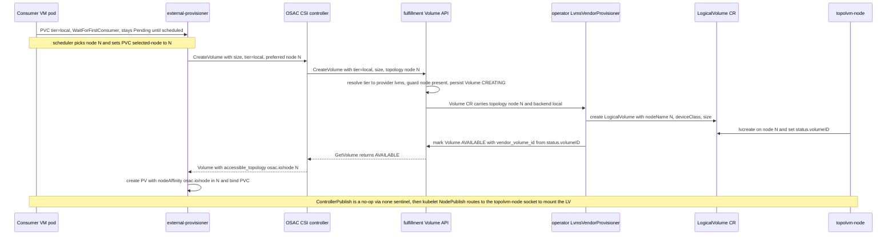

# LVMS Node-Local Storage Backend for VMaaS

## Summary

This enhancement adds LVMS (node-local LVM, via topolvm) as a **Block** storage backend behind an opaque, admin-defined **LVMS-backed** storage tier, for single-node VMaaS **development, testing, and CI/CD** environments — explicitly **not production** [PRD: Problem Statement, Out of Scope]. The tier name is admin-chosen and is not a protocol or backend-type designation; this document uses `local` only as an example tier/backend name. It extends the existing storage control plane (OSAC-2872) additively: the OSAC CSI driver delegates `CreateVolume` to the fulfillment Volume API as it does for network backends, and a new `LvmsVendorProvisioner` in osac-operator provisions the volume by writing a topolvm `LogicalVolume` CR — which the already-installed `topolvm-node` reconciler carves into an LV on the scheduled node. The only cross-cutting API change is one optional topology message on the private Volume API. Registration of the LVMS backend is gated to development/test deployment profiles (see Non-Goals and §Workflow Description). See [PRD](prd.md) for detailed requirements.

## Motivation

The storage control plane (OSAC-2872) was designed for network-attached arrays (VAST, Pure). For those, a volume is created independently of any pod, the vendor CSI controller runs on the hub, and the node matters only at attach/publish time. A node-local backend inverts every one of those assumptions: an LVM logical volume is carved from a volume group on **one** node, is reachable only there, and the node is unknown until a consuming pod is scheduled. This is why native topolvm mandates `WaitForFirstConsumer` binding and pins each PV to its node.

Single-node VMaaS makes a full-chain integration ("Option A") cheap enough to justify: the tenant's KubeVirt VMs run on the hub, and topolvm is already installed on the hub (OSAC-3011), so the operator and `topolvm-node` are co-located and the `LogicalVolume` CR is an **in-cluster write with zero cross-cluster reach** [Locked: D1]. The result keeps the uniform `osac-csi` provisioner, a real Volume inventory record, and the same Volume-API → operator → provisioner path every network backend uses, while the actual LV carving is delegated to topolvm-node. The target is single-node development, testing, and CI/CD VMaaS deployments that have no remote array — not production; the backend is consequently gated to dev/test deployment profiles (see Non-Goals) and does not aim for parity with network backends (node-local volumes are sticky and do not move between nodes) [PRD: Problem Statement]. CaaS (always two clusters) is deferred; the provisioner is written against a target-cluster client seam so CaaS later swaps the in-cluster client for a remote one without changing the provisioning logic.

The technical approach was worked out and reviewed with the WG; the eleven decisions it settled are marked `[Locked: D{N}]` inline and listed where they apply.

### Terminology

- **LVMS** — Logical Volume Manager Storage; OpenShift's node-local storage operator, built on **topolvm**.
- **topolvm-node** — the per-node topolvm DaemonSet that watches `LogicalVolume` CRs for its node and runs `lvcreate`/`lvremove`. Already installed by OSAC-3011.
- **`LogicalVolume`** — the `topolvm.io` CR that represents a request to carve an LV on a specific node; `spec.nodeName`, `spec.deviceClass`, `spec.size`; `status.volumeID` once carved.
- **device-class** — a named topolvm volume group (VG) an LV is carved from.
- **VendorProvisioner** — the osac-operator interface (introduced with the VAST provisioner) that the Volume controller calls to provision/delete a volume on a backend.
- **LVMS-backed tier** — the tenant-facing storage tier whose backend is a `provider: lvms`, Block-type `StorageBackend`. The tier name is admin-defined (this document uses `local` as the example name); tenants see only the opaque tier, never LVMS internals [PRD: In Scope].
- **dev/test gate** — the deployment-level control that permits LVMS backend registration only in development/test installations: a `deployment.profile` (or equivalent) Helm value once available, with `lvms.enabled` (default `false`) as the interim gate [PRD: Dependencies].
- **hub == tenant** — in single-node VMaaS the control plane and the tenant's VM workloads share one cluster.

### Goals

- Reuse the existing Volume API → Volume CR → operator Volume controller → `VendorProvisioner` path; add LVMS as one provisioner implementation with no change to the controller's reconciliation flow, finalizers, or feedback controller [Codebase: osac-operator/internal/controller/volume_controller.go].
- Keep the change additive: one optional topology message on the private Volume API and Volume CRD; network backends are byte-for-byte unaffected [Locked: D6].
- Route provisioning by the `StorageBackend` provider so a `provider: lvms` backend selects the LVMS provisioner instead of mis-routing into VAST logic [Locked: D4].
- Delegate LV carving to topolvm-node by writing a `LogicalVolume` CR (RBAC only); do not reimplement LVM management or dial a topolvm gRPC endpoint [Locked: D2].
- Present the LVMS-backed tier through the uniform `osac.csi.openshift.io` provisioner with a real Volume inventory record, not a native `topolvm.io` StorageClass [Locked: D11].

### Non-Goals

- CaaS / multi-cluster LVMS — deferred to a future feature; the provisioner keeps a target-cluster client seam so it drops in later without a redesign [Locked: D1].
- Multi-node capacity-aware scheduling (`CSIStorageCapacity` / `GetCapacity`), volume expansion, and quota — deferred; addressed in follow-on tickets.
- API-first (pod-independent) provisioning for local tiers — structurally impossible and explicitly rejected server-side [Locked: D6].
- Generic `lvms.enabled` storage — the pre-existing mode where the LVMS operator installs topolvm and its own default `topolvm.io` StorageClass for non-tenant use — is out of scope and unchanged. It predates this feature, works **without** the storage control plane, and OSAC-3702 must not interfere with the LVMS-operator default StorageClass. This feature adds the tenant-integrated, control-plane path on top.
- **Production use.** LVMS as a node-local backend is not intended or supported for production workloads [PRD: Out of Scope]. Backend registration is gated to development/test deployment profiles via the **dev/test gate**: once a deployment-level `deployment.profile` (or equivalent) Helm value exists, LVMS is registerable only in dev/test profiles; until it lands, the interim gate is `lvms.enabled` (default `false`). This gate is a safety control, not a functional feature toggle, and the profile flag itself is a cross-cutting concern owned outside this feature [PRD: Dependencies].

## Proposal

The enhancement adds five coordinated pieces, all additive:

1. **Proto + CRD (additive):** an optional `VolumeTopology { string node = 1; }` message on the private `VolumeSpec` and `CreateVolumeRequest`, mirrored on the operator Volume CRD [Locked: D6].
2. **Fulfillment guard:** tier resolution already maps `tier=local → provider=lvms`; add a guard that rejects a local-tier volume with no topology node, and carry the node into the Volume CR [Locked: D6].
3. **Operator provider-keyed routing + `LvmsVendorProvisioner`:** select the provisioner by `StorageBackend.spec.provider`; the LVMS provisioner writes a `LogicalVolume` CR and reports the result [Locked: D4, D10].
4. **CSI plumbing (osac-csi-driver):** advertise `VOLUME_ACCESSIBILITY_CONSTRAINTS`, extract the scheduler-selected node from `CreateVolume`, return `accessible_topology`, report the `osac.io/node` segment from `NodeGetInfo`, and route local-tier mounts to the topolvm-node socket [Locked: D8, D9].
5. **AAP StorageClass:** emit an `osac-csi` local-tier StorageClass with `WaitForFirstConsumer`, retiring the temporary native-`topolvm.io` StorageClass from OSAC-3011; the device class is configured server-side on the `StorageBackend`/tier, not as a StorageClass parameter [Locked: D11].

Attach requires no new code: the local backend is configured with the existing `noAttachEndpoint = "none"` sentinel (OSAC-4187), which makes `ControllerPublish/UnpublishVolume` a logged no-op [Locked: D3, Codebase: osac-csi-driver/pkg/driver/controller.go].

### Workflow Description

**Actors:** Tenant User (creates a ComputeInstance with a `local`-tier disk, which the VMaaS stack backs with a PVC), the OSAC storage stack (CSI driver, fulfillment, operator), and topolvm-node.

**Starting state:** the deployment is a development/test profile — the **dev/test gate** (`deployment.profile` when available, `lvms.enabled` in the interim, default `false`) is what permits LVMS backend registration at all; production profiles cannot register it. The storage control plane is enabled (`OSAC_ENABLE_STORAGE_CONTROLLER=true`) **and** `lvms.enabled` is set — both are required. `lvms.enabled` alone (controller off) is the pre-existing generic-topolvm mode; the registered backend/tier are inert without the controller, which is the only trigger for the storage AAP jobs that surface tenant StorageClasses. LVMS is installed on the single-node cluster (OSAC-3011); a Block-type `StorageBackend { provider: lvms }` and an LVMS-backed tier (admin-named — `local` in this example) are registered, and the AAP-generated `osac-csi` StorageClass exists with `volumeBindingMode: WaitForFirstConsumer`.



The diagram shows the happy path. The takeaway is that the OSAC CSI controller stays a thin delegate to fulfillment (it never talks to topolvm); the node selected by the scheduler under `WaitForFirstConsumer` threads through fulfillment into the `LogicalVolume` CR, and topolvm-node — not the operator — carves the LV. Attach is a no-op because the volume already lives on the node; only the node-plugin mount step touches topolvm.

#### Error handling: local tier with no scheduled consumer

A `Volume` created against a local tier with an empty `topology.node` (the API-first / provision-in-advance path natural for network backends) is rejected by fulfillment with `codes.FailedPrecondition` [Locked: D6]. Under `WaitForFirstConsumer` this never fires on the PVC path (the node is always known at create); it guards direct-API misuse.

#### Error handling: insufficient node capacity

If the selected node's VG cannot satisfy the request, `LvmsVendorProvisioner` returns `codes.ResourceExhausted` (not a generic error), propagated by the CSI controller [Locked: D10]. external-provisioner then clears the PVC `selected-node` annotation and the scheduler re-picks a node. On single-node VMaaS this is a terminal "out of space" signal surfaced as a PVC event; the multi-node re-pick is blind (no capacity signal) and is out of scope (see Non-Goals, Risks).

#### Cleanup: ComputeInstance / PVC deletion

Deleting the ComputeInstance deletes its PVC → `DeleteVolume` → the operator deletes the `LogicalVolume` CR by name; topolvm-node reclaims the LV, and the fulfillment Volume record is removed. No node-local capacity is leaked. Deletion is idempotent: a missing `LogicalVolume` is treated as already-deleted.

### API Extensions

- **Private Volume proto (fulfillment-service):** new optional message on `osac.private.v1.VolumeSpec` and `CreateVolumeRequest` — additive, a fresh field number (not the removed `pvc_ref` slot). Consumed only after tier resolves to `lvms` [Locked: D6, Codebase: fulfillment-service/proto/private/osac/private/v1/volume_type.proto].
- **Volume CRD (osac-operator):** `VolumeSpec` gains the same optional `topology` field; carries data to the provisioner, no controller-flow change.
- **VendorProvisioner interface (osac-operator):** `VendorCreateVolumeRequest` gains an optional `Topology{Node}` field; network provisioners leave it empty [Locked: D7, Codebase: osac-operator/internal/controller/volume_controller.go].
- **CSI capability:** `GetPluginCapabilities` advertises `VOLUME_ACCESSIBILITY_CONSTRAINTS`; `ControllerGetCapabilities` unchanged otherwise [Locked: D9, Codebase: osac-csi-driver/pkg/driver/identity.go].
- **RBAC:** the operator ServiceAccount gains `create/get/list/watch/delete` on `topolvm.io/LogicalVolume` [Locked: D2].

No public (tenant-facing) API changes; the topology field is internal scheduling data.

## UX Alignment

Storage `@temp-api` files exist in osac-ux (`block-volumes.ts`, `compute-instance-disk.ts`, `storage-backend.ts`, `storage-tier.ts`, `volume-snapshot.ts`), so this section is completed. This enhancement adds no tenant-facing field: its only API addition is `VolumeTopology.node` on the **private** `VolumeSpec`, an internal scheduler-selected node identifier the UI does not consume.

| UI field (`@temp-api` TypeScript) | Proto field (this EP) | Notes / deviation |
|---|---|---|
| _none_ | `private.v1.VolumeSpec.topology.node` | Internal-only; not surfaced to any tenant-facing resource (`block-volumes`, `compute-instance-disk`). No UI migration required. |

No deviations from known anti-patterns: the field is not a sub-resource action, string-union storage class, one-time secret, or RHOAI operator field. After the backend ships, `pnpm gen-types` should produce no UI diff for tenant-facing storage resources.

### Implementation Details/Notes/Constraints

**Topology proto (T1 / OSAC-4357).** A typed message, not a bare string, so `zone`/`region` can be added later without another `VolumeSpec` change [Locked: D6]:

```proto
// osac.private.v1
message VolumeTopology {
  // CSI topology segment value for osac.io/node — the scheduler-selected node.
  string node = 1;
}
// on VolumeSpec and CreateVolumeRequest:
optional VolumeTopology topology = <fresh field number>;
```

`buf lint` + `buf generate` before commit; mirror the field on the operator Volume CRD (T3 / OSAC-4359).

**Fulfillment guard + carry (T2 / OSAC-4358).** Tier resolution already sets `status.backend` from the tier's backend association (routing key = StorageBackend ID) [Locked: D5, Codebase: fulfillment-service/internal/servers/private_volumes_server.go]. Add: if the resolved provider is node-local (`lvms`) and `topology.node` is empty → `codes.FailedPrecondition`; otherwise persist and thread `topology` into the Volume CR.

**Provider-keyed routing + `LvmsVendorProvisioner` (T4 / OSAC-4360, depends on OSAC-4221).** Today the operator wires a single `VastVendorProvisioner` for every backend, hardcoding VAST specifics — a non-VAST backend either fails at `endpointFor` or mis-routes into VAST logic [Codebase: osac-operator]. OSAC-4221 makes provisioning provider-driven (registry + VAST impl + Pure/NetApp/LVMS **stubs**); this feature **fills the LVMS stub**. If OSAC-4221 has not landed, this feature builds the provider-keyed selection itself — either way it owns the LVMS provisioner [Locked: D4].

`LvmsVendorProvisioner` implements the existing interface via a `targetClusterClient` seam (in-cluster for VMaaS; a remote guest client for CaaS later — same logic) [Locked: D1]:
- **CreateVolume:** require `Topology.Node`; create a `LogicalVolume` CR (`spec.nodeName` = node, `spec.deviceClass` = the device class configured on the `StorageBackend`/tier and resolved server-side — not a StorageClass parameter, `spec.size` = requested); poll `status.volumeID`; on VG-capacity failure return `codes.ResourceExhausted`; return `vendor_volume_id = status.volumeID` [Locked: D10].
- **DeleteVolume:** delete the `LogicalVolume` CR by name (idempotent).
- **Publish/Unpublish:** not implemented — the local backend uses the `none` endpoint sentinel, so the CSI controller no-ops attach [Locked: D3].

**CSI controller + node (T5 / OSAC-4361, T6 / OSAC-4362).** Controller `CreateVolume` reads `req.AccessibilityRequirements.Preferred[0].Segments["osac.io/node"]`, passes it to fulfillment, and on AVAILABLE returns `AccessibleTopology=[{osac.io/node: N}]` plus `volume_context{osac.backend, osac.volume-id, osac.topolvm-volume-id, osac.protocol}` [Locked: D9]. Because `VOLUME_ACCESSIBILITY_CONSTRAINTS` is a plugin-wide capability, the controller returns `AccessibleTopology` **only when the resolved backend is node-local**; for network backends it returns empty topology, so their PVs get no `nodeAffinity` and their StorageClasses stay `volumeBindingMode: Immediate` — advertising the capability does not change network provisioning. The controller remains a thin delegate — it never dials topolvm.

`NodeGetInfo` returns the segment `osac.io/node=<node>`. **The value must be the exact Kubernetes Node name** — derived from the downward API / the Node's `.metadata.name`, never `os.Hostname()` — so the PV `nodeAffinity`, the `LogicalVolume.spec.nodeName`, and topolvm-node's node view all agree [Locked: D8]. The node plugin routes local-tier `NodeStage/NodePublish` to the **topolvm-node** unix socket, reusing the existing `osac.backend`-keyed `resolveVendorSocket` routing. **This mount proxy is required, not optional:** because the PV's provisioner is `osac.csi.openshift.io` (Option A), kubelet calls *our* node plugin to mount — but only topolvm-node can mount an LVM LV — so our plugin forwards `NodePublish` (with topolvm's volume ID and the pod target path) to topolvm-node, which performs the mount. This is the same node-side mechanism network vendors use; only the controller side differs (lvms has no controller socket). For it to work, the meta-driver's `node.vendorSockets` must carry `lvms → <topolvm-node socket>`; **which installer wires that entry depends on the csi-backends/driver ownership decision (OSAC-4252) and on node-local-vendor support in the driver-install role (OSAC-3290 / #361) — see Open Question 8.3** [Codebase: osac-csi-driver/pkg/driver/node.go].

**Volume handle threading.** The node plugin mounts by calling topolvm-node with topolvm's volume ID, so the operator must return `status.volumeID` as `vendor_volume_id` and the CSI controller must surface it in `volume_context` as `osac.topolvm-volume-id`. Getting this wrong provisions a volume that cannot mount.

**AAP StorageClass (T8 / OSAC-4364).** The `lvms_storage` role (OSAC-3011) already sets `WaitForFirstConsumer`, but emits a native `provisioner: topolvm.io` StorageClass. Adapt it to emit the OSAC-csi flavor and wire it into VMaaS onboarding [Locked: D11]:

```yaml
provisioner: osac.csi.openshift.io
volumeBindingMode: WaitForFirstConsumer
reclaimPolicy: Delete
# No device-class parameter: the device class is configured on the
# StorageBackend/tier and resolved server-side by the LVMS provisioner.
```

The **OSAC-managed per-tenant** `topolvm.io` StorageClass this AAP role emitted (OSAC-3011) is retired — on the control-plane path the role emits only the `osac-csi` flavor. This does **not** touch the LVMS-operator's own default StorageClass (from the `LVMCluster`), which is the separate generic / controller-off mode and is left untouched [Locked: D11].

**Work breakdown (tickets under OSAC-3702):**

| # | Component | Work | Ticket | Depends on |
|---|-----------|------|--------|-----------|
| T1 | proto | optional `VolumeTopology` on `CreateVolumeRequest` + `VolumeSpec` | OSAC-4357 | — |
| T2 | fulfillment | read topology; API-first guard; carry to Volume CR | OSAC-4358 | T1 |
| T3 | operator CRD | optional `topology` on `VolumeSpec` | OSAC-4359 | T1 |
| T4 | operator | `LvmsVendorProvisioner` + provider-keyed routing (fill OSAC-4221 LVMS stub) | OSAC-4360 | T3, OSAC-4221 |
| T5 | osac-csi-driver | accessibility capability, topology extract, `AccessibleTopology` | OSAC-4361 | T1 |
| T6 | osac-csi-driver | `NodeGetInfo` `osac.io/node` segment + topolvm-node socket routing | OSAC-4362 | — |
| T7 | operator Helm | RBAC for `LogicalVolume` | OSAC-4363 | T4 |
| T8 | osac-aap | osac-csi local StorageClass (WFC + `osac.io/device-class`), VMaaS onboarding | OSAC-4364 | — |
| T9 | osac-test-infra | single-node VMaaS e2e (provision → mount → cleanup, node-pinning) | OSAC-3711 | T1–T8 |

Deferred to a future feature (not in this design): CaaS/multi-cluster, multi-node capacity-aware scheduling, expansion, quota.

### Security Considerations

The feature inherits the OSAC-2872 security model. Node-local storage introduces **no vendor credentials** — there is no network array or endpoint to authenticate to (the backend endpoint is the `none` sentinel), so nothing is placed on any cluster. The one new privilege is the operator ServiceAccount's RBAC to manage `topolvm.io/LogicalVolume` in its own cluster; this is scoped to the operator's namespace/cluster and does not widen tenant-facing permissions. Tenant isolation is unchanged: Volume records and StorageClasses carry the existing `osac.openshift.io/tenant` metadata, and the LVMS-backed tier gets the same OPA CSI-role allowlist entry as other tiers. The `FailedPrecondition` guard prevents a caller from creating unschedulable node-local volumes via the direct API. Finally, the **dev/test gate** is itself a safety control: because LVMS is unsupported for production, backend registration is refused outside development/test deployment profiles (`deployment.profile` when available, `lvms.enabled` in the interim), preventing a node-local backend from being stood up in a production installation [PRD: Out of Scope, Dependencies].

### Failure Handling and Recovery

- **Local tier, no scheduled consumer:** fulfillment returns `FailedPrecondition`; the Volume is not persisted. Recovery: use a `WaitForFirstConsumer` StorageClass (the PVC path); the user sees a standard PVC Pending state until a pod schedules.
- **Insufficient VG capacity:** `LvmsVendorProvisioner` returns `ResourceExhausted`; external-provisioner clears `selected-node` and reschedules. On SNO this is terminal and surfaced as a PVC event.
- **LV never becomes ready:** the provisioner polls `LogicalVolume.status` with a bounded timeout; on timeout the Volume goes to an error state with a message, and the reconciler retries. topolvm-node carving is idempotent per `LogicalVolume` name.
- **Device-class misconfiguration:** the device class is resolved server-side from the `StorageBackend`/tier. If the configured device class does not correspond to a topolvm device-class/VG present on the target node, topolvm-node cannot carve the LV, so the `LogicalVolume` never becomes ready and the flow falls into the bounded-timeout path above — the Volume goes to error with a message identifying the missing device class. Validating the configured device class against the node's advertised topolvm device-classes at backend/tier registration time is a hardening follow-up (fail-fast at config time rather than at first provision); it is not required for single-node dev/test where the VG is known, so it is deferred.
- **Operator restart mid-provision:** the Volume controller is stateless — on restart it re-reads the Volume CR and re-enters provisioning; creating the `LogicalVolume` is idempotent by name, so no duplicate LV is carved.
- **Node-name disagreement:** mitigated structurally — the `osac.io/node` value is the k8s Node name, matching `LogicalVolume.spec.nodeName` and topolvm-node's view; a unit test asserts the value equals the Node name.
- **Deletion with missing LogicalVolume:** treated as already-deleted; the Volume record is still cleaned up (no orphaned inventory).

### RBAC / Tenancy

The operator ServiceAccount gains `create/get/list/watch/delete` on `topolvm.io/LogicalVolume`. No new tenant-facing roles. Volumes and StorageClasses carry the existing `osac.openshift.io/tenant` and `osac.openshift.io/owner-reference` metadata; OPA enforces tenant isolation at the fulfillment API as today. The LVMS-backed tier is a platform-registered `StorageBackend`/`StorageTier` like any other; tenants see only the opaque tier.

### Observability and Monitoring

Existing mechanisms apply: provisioning state is visible through the Volume record lifecycle (`CREATING → AVAILABLE`/error) and operator logs; `ResourceExhausted` surfaces as a PVC provisioning event via external-provisioner; topolvm-node exposes its own LV metrics independently. In addition, the `LvmsVendorProvisioner` should emit a provisioner-scoped metric (e.g. `lvms_provision_duration_seconds`, labeled by outcome), and the operator should surface a signal when a `LogicalVolume` stays un-ready past the provisioner's bounded poll timeout — a log event at minimum, and an alert rule where the deployment ships Prometheus rules. Without an LVMS-specific signal, an operator watching dashboards sees only generic PVC events and cannot distinguish a stuck node-local provision from normal `WaitForFirstConsumer` pending.

### Risks and Mitigations

| Risk | Impact | Mitigation |
|---|---|---|
| CR-creation couples the operator to topolvm's `LogicalVolume` CRD schema | A topolvm CRD change could break provisioning | The CRD is stable; a hardening ticket (pin/vendor the types + a drift test) is held and filed only if drift bites [Locked: D2] |
| Multi-node capacity-aware scheduling gap | On a multi-node cluster the scheduler can bind a pod to a node without VG room; `ResourceExhausted` re-pick is blind and can thrash | Scope is single-node VMaaS where this is moot; `CSIStorageCapacity`/`GetCapacity` is the multi-node fix, deferred [Locked: D1] |
| Node identifier mismatch between CSI topology and `LogicalVolume.spec.nodeName` | Volume provisions but the pod never schedules where the data is | Derive the `osac.io/node` value from the k8s Node name; unit + e2e test assert equality [Locked: D8] |
| Dependency on OSAC-4221 for provider routing | T4 blocked if 4221 slips | This feature owns the LVMS provisioner and builds the routing itself if 4221 has not landed [Locked: D4] |
| LVMS node-socket wiring for a controller-less vendor (OSAC-3290 / #361) | The meta-driver's `lvms` node socket may not get wired, so the mount proxy has no target | OSAC-4252 is resolved (umbrella owns `csi-backends`, Option A) and LVMS needs no controller entry; the node-socket-only wiring lands with node-local-vendor support in OSAC-3290 / #361. This design states the requirement (OQ 8.3) |

### Drawbacks

The operator now carries a per-backend provisioner split (network vs node-local), the inherent cost of supporting both. LVMS PVs are sticky (pinned to one node for life) — a standard LVM caveat, not fixable here. Local tiers cannot use API-first provisioning. CR-creation couples to topolvm's CRD (see Risks). These trade-offs are justified because single-node VMaaS collapses the cross-cluster cost and the change is otherwise additive, letting development, testing, and CI/CD VMaaS flows exercise the same storage control-plane path production uses (the real Volume-API → operator → provisioner chain) rather than an out-of-band bypass — while the backend itself stays gated to dev/test profiles and unsupported for production.

## Alternatives (Not Implemented)

- **Option B — passthrough (proxy topolvm-controller gRPC).** The OSAC CSI controller forwards provisioning to topolvm-controller in-cluster. Pros: no LogicalVolume CR construction, no CRD coupling. Cons: requires exposing topolvm-controller's gRPC over a TCP Service (an unauthenticated socket) and bypasses the operator/inventory path. Rejected: the CR-creation realization achieves the same delegation with RBAC only, no exposed socket.
- **Option C — native topolvm StorageClass (`provisioner: topolvm.io`).** Zero operator work; already shipped as a temporary dev artifact (OSAC-3011). Cons: the provisioner name leaks to tenants, no OSAC inventory record, and the local tier diverges from every other backend. Rejected and retired [Locked: D11].
- **Reuse `VastVendorProvisioner` for LVMS.** Cons: it hardcodes VAST specifics (Secret names, subsystem/vip_pool params) and dials a network vendor controller; a node-local backend does not fit. Rejected — provider-keyed routing exists precisely to prevent this mis-route.
- **Bare `node_hint` string instead of a `VolumeTopology` message.** Cons: adding `zone`/`region` later would need another proto change. Rejected in favor of the typed message [Locked: D6].
- **Do nothing.** Leaves single-node/dev environments with no OSAC-managed storage, forcing out-of-band configuration. Rejected — this is the PRD's motivating problem.

## Open Questions

### 8.1 CR-creation vs literal gRPC-proxy of topolvm-controller — DECIDED

- **Owner:** storage WG
- **Resolution:** the design realizes Option A via **CR-creation** — the operator writes the `LogicalVolume` CR directly (RBAC-only), not proxying topolvm-controller's gRPC [Locked: D2]. This is the committed direction; the WG will be asked to confirm in review, and only an explicit objection would trigger a redesign toward the proxy alternative (Alternatives §Option B).
- **Impact if reopened:** §Implementation Details (the `LvmsVendorProvisioner` realization) and T4 only; no change to the proto, fulfillment, or CSI surface.

### 8.2 OSAC-4221 sequencing and provisioner interface shape — RESOLVED

- **Owner:** this feature (OSAC-4221 owned here)
- **Resolution:** OSAC-4221 (provider registry + LVMS stub + `VendorCreateVolumeRequest` reshape, including the `Topology{Node}` field) is sequenced **first within this activity** as a precondition of T4, rather than a parallel external dependency. T4 then fills the LVMS stub instead of duplicating the routing. Landing order: OSAC-4221 → T4 (OSAC-4360).

### 8.3 LVMS node-socket wiring for the controller-less node-local vendor

- **Owner:** OSAC-3290 / #361 (hub CSI-driver onboarding)
- **Resolved input:** OSAC-4252 is **closed** — the `osac` umbrella chart (osac-installer) owns the `csi-backends` deployment and AAP skips it (Option A). That decision governs vendor **controllers** (e.g. `vast-csi-controller`); LVMS is controller-less, so it needs **no** `csi-backends` controller entry at all.
- **Open (LVMS-specific):** what remains is how the meta-driver **node plugin's** `node.vendorSockets` gets the `lvms → <topolvm-node socket>` entry wired for a controller-less, node-local-only vendor. The current driver-install path assumes a vendor controller Service and does not yet handle a node-socket-only vendor; adding that node-local-vendor support is tracked under OSAC-3290 / #361 (In Progress). This design states the wiring requirement; the installer mechanism lands with that work.
- **Impact:** §Implementation Details (node plugin) and the install path only — no change to the proto, fulfillment, or operator surfaces.

## Test Plan

### Unit Tests

- Proto: `VolumeTopology` presence/absence round-trips; optional field defaults empty for network backends.
- Fulfillment guard: local tier + empty `topology.node` → `FailedPrecondition`; local tier + node present → persists; network tier ignores topology.
- `LvmsVendorProvisioner`: constructs `LogicalVolume` with correct `nodeName`/`deviceClass`/`size`; maps VG-capacity failure to `ResourceExhausted`; delete is idempotent when the CR is absent.
- `NodeGetInfo`: returned `osac.io/node` value equals the k8s Node name.
- Device-class resolution: the LVMS provisioner reads the device class from the `StorageBackend`/tier config and sets `LogicalVolume.spec.deviceClass` (no StorageClass parameter).

### Integration Tests

- Kind + LVMS: provider-keyed routing selects `LvmsVendorProvisioner` for a `provider: lvms` backend.
- A local-tier Volume produces a `LogicalVolume` with the expected `nodeName`/`deviceClass`; the Volume reaches AVAILABLE once `status.volumeID` is set.
- Deletion removes both the `LogicalVolume` CR and the fulfillment Volume record.
- Regression: with the accessibility capability advertised, a network-backend (e.g. VAST) volume receives empty `AccessibleTopology` and its PV has no `nodeAffinity` — network provisioning is unaffected.

### E2E Tests (osac-test-infra, pytest — T9 / OSAC-3711)

- Single-node VMaaS: create a ComputeInstance with a `tier=local` disk; verify the LV is carved on the node, a Volume inventory record exists, data round-trips (write/read), and deleting the ComputeInstance cleans up the LV and the record.
- Topology: the resulting PV's `nodeAffinity` equals the scheduled node; the volume does not migrate.

## Graduation Criteria

Graduation criteria will be finalized when targeting a release; draft conditions per stage:

- **Dev Preview:** the full provision → mount → cleanup flow (including node-pinning) passes on a single-node cluster with LVMS, and the dev/test gate blocks LVMS registration in production profiles.
- **Tech Preview:** the single-node VMaaS e2e (T9 / OSAC-3711) runs in CI; LVMS-specific observability is in place (a provisioning-duration metric and a stuck-`LogicalVolume` signal — see Observability); device-class misconfiguration fails with a clear, surfaced error; admin/user docs cover setup and the not-for-production limitation.
- **GA:** not targeted under this feature. LVMS node-local storage is scoped to development/test/CI-CD and is not production-supported; a production-grade path would require the current Non-Goals (multi-node capacity-aware scheduling, expansion, quota) as prerequisites and is out of scope here.

## Upgrade / Downgrade Strategy

The proto/CRD topology field and the `VendorCreateVolumeRequest` field are additive and optional; existing network-backend volumes are unaffected. This is a new backend, so there is no data migration. Downgrade requires deleting all local-tier volumes before reverting, after which the optional field is simply unset.

## Version Skew Strategy

The optional topology field is ignored by components that do not read it, so a mixed fulfillment/operator/CSI-driver deployment continues to serve network backends. LVMS provisioning requires all of the new CSI capability, the fulfillment guard, and the operator provisioner to be present; until they are, a local tier simply cannot be configured, so there is no partially-functional state. The feature is effectively gated by whether a `provider: lvms` backend and its `osac-csi` StorageClass are configured.

## Support Procedures

- **Detection:** a stuck `tier=local` PVC (Pending) or a Volume record stuck in `CREATING`. Check the `LogicalVolume` CR (`kubectl get logicalvolume`) and topolvm-node logs on the target node; `ResourceExhausted` indicates no VG space.
- **Disabling:** remove the `local` tier from `STORAGE_TIERS`. Existing local volumes keep working (PVs/LVs persist); new local provisioning stops. No impact on other providers or cluster health.
- **Recovery:** re-add the tier; existing local volumes are unaffected and new provisioning resumes through the standard flow.

## Infrastructure Needed

None. topolvm/LVMS is already installed on the cluster by OSAC-3011; this enhancement adds no new deployment or test infrastructure beyond the e2e coverage in osac-test-infra.

---

## Provenance

Authored: revise [manual] @ design 0.9.0 - 562b610, workspace design/OSAC-3702 @ 0652d338d
Phases: draft, draft, revise, revise

<!-- ai-workflow-provenance:{"schema_version":1,"provenance_kind":"session","workflow":"design","workflow_version":"0.9.0","ai_workflows":"562b610","source_repo":"0652d338d","source_repo_branch":"design/OSAC-3702","commits_behind_main":0,"commits_ahead_main":0,"main_ref":"main","phases":["draft","draft","revise","revise"],"authoring_modes":["manual","skill"],"context_changed":false,"origin_untracked":false} -->
