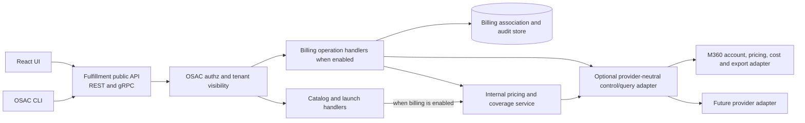

# OSAC Billing Integration and Catalog Pricing

| Field       | Value |
|-------------|-------|
| Author(s)   | Amit Oren |
| Jira        | [OSAC-3784](https://redhat.atlassian.net/browse/OSAC-3784), [OSAC-3793](https://redhat.atlassian.net/browse/OSAC-3793) |
| PRD         | [OSAC-3784 PRD](https://github.com/osac-project/enhancement-proposals/blob/main/enhancements/OSAC-3784-billing-integration-mvp/prd.md); [OSAC-3793 PRD](https://github.com/osac-project/enhancement-proposals/tree/main/enhancements/OSAC-3793-billing-catalog-pricing-integration/prd.md) |
| Date        | 2026-10-07 |

# 1. Overview

This combined design covers OSAC-3784 Billing Integration and OSAC-3793 Billing Catalog Pricing Integration. It proposes a provider-neutral billing API and adapter boundary to OSAC, with _Monetize 360_ (M360) as the first provider implementation. Billing is optional per deployment: OSAC may run with no billing provider, or with one configured provider. Without a provider, core catalog and resource fulfillment continue without pricing or billing gates. The public API exposes normalized account, association, pricing, estimate, cost, export, and health concepts; gives Cloud Provider Admins both an inventory of billable OSAC catalog values and normalized provider rate-card rows for rate-card completeness review; and enriches existing VMaaS/CaaS catalog list/get responses with provider-owned pricing when billing is configured. The first billing UI slice reads account status and manages tenant links; catalog-price display is included as the subsequent UX slice defined by OSAC-3793. The choices in this design do not set the release boundary: the current PRDs remain authoritative until their feature owners reconcile and revise them. See both linked PRDs for their original requirement boundaries.

When billing is configured, OSAC remains the source of truth for tenant/account association and authorization, while the provider remains the source of truth for rate-card values and actual rated charges. Because the reviewed M360 API has no estimate API, the M360 adapter evaluates a constrained, verified subset of provider rate-card and pricing-logic data for prospective estimates. Coverage is evaluated in the account context of the gated action; publication does not require coverage from every tenant who may see a catalog item, and each tenant's launch is checked against its own linked account. Unresolved coverage fails the applicable billing gate and does not stop or suspend existing resources. When billing is not configured, no pricing or billing gate is applied.

# 2. Goals and Non-Goals

## 2.1 Goals

- Keep tenant-facing OSAC APIs and response models independent of M360 and other provider-native schemas.
- Allow a deployment to run without a billing provider while preserving normal catalog and resource fulfillment.
- Define a time-versioned 1:1 tenant-to-account association for the proposed design and retain an extension path to 1:N.
- Resolve current account status and pricing/coverage in the backend, with tenant authorization enforced before provider calls.
- Provide Cloud Provider Admins a consolidated inventory of billable catalog dimensions and values, with references to the catalog items that use or offer each value, so provider rate-card completeness can be checked.
- Provide Cloud Provider Admins provider-neutral, currency-aware rate-card rows that the Rates UI can display by service, resource match, rate, and related catalog item.
- Enrich visible VMaaS and CaaS catalog list/get responses with read-time prices for default configurations, component details, account currency, freshness, and a price-may-vary indication.
- Keep catalog browsing available with or without billing. When a provider is configured, block a billing-gated action when a live coverage check for the account in scope cannot complete or finds unresolved coverage. A global catalog item does not require coverage checks for every tenant who may see it; each tenant's launch is checked against that tenant's linked account.
- Preserve the existing metering delivery path and event schema. M360 attributes events using the current `externalId` mapping for the event's `tenant_id`, so this design does not promise event-time account attribution after reassignment.
- Return an estimate in the account currency and provider rate unit, with hourly and monthly recurring amounts normalized using a fixed 730-hour month where the rate is time-based.

## 2.2 Non-Goals

- Create billing accounts, author rate cards, edit provider catalog data, process payments, or issue invoices.
- Show account balances or rated transactions in the first billing UI slice.
- Persist provider catalog prices as OSAC catalog records or create a second M360 pricing client in the catalog server.
- Deliver BMaaS catalog-price enrichment in this design. The BMaaS catalog list/get APIs are existing extension points, but neither the OSAC-3784 nor OSAC-3793 PRD requires pricing for them; §4.3 records this as a possible future extension.
- Run several billing providers concurrently in one deployment; a deployment may have billing disabled or configure one provider.
- Estimate one-time charges or claim that prospective estimates are provider-rated actual charges.
- Convert provider prices between currencies or reconcile a provider-returned pricing currency that differs from the linked account's agreed currency.
- Apply an additional billing-rounding rule to provider amounts. Preserve decimal values; UI formatting to 2–3 fractional digits is sufficient, and configurable display precision is a nice-to-have.

## 2.3 Assumptions

- The configured billing provider returns pricing in the agreed currency for the linked account. OSAC uses that currency as the account currency; currency conversion and provider-currency mismatch handling are out of scope.
- Provider price values are preserved as decimal amounts without an additional OSAC rounding step. The UI may display 2–3 digits after the decimal point; making that display precision configurable is a nice-to-have.
- Billing may be unconfigured. This is a supported deployment mode, distinct from a configured provider that is temporarily unavailable.

# 3. Motivation / Background

The React example currently reads M360-shaped data directly for its account/status table and calculates launch prices in local demo code. That couples the UI to M360 account identifiers and rate-card details, and it cannot enforce the same policy for API, CLI, catalog publication, and launch.

The backend already has an M360 usage adapter in `osac-metering`, but no account association model or billing query API. Fulfillment-service is the public API, persistence, and authorization boundary; the metering adapters own downstream provider usage submission. The design adds control/query operations to fulfillment-service while keeping usage delivery in osac-metering.

RevOs documents account status, catalog services, rate cards, pricing logic, and contract exceptions, but no public prospective quote endpoint. This design uses that metadata only for a constrained estimate evaluator; the provider still owns actual rating and charge amounts. The design specifies the 1:1 account rule, live-check gate, estimate units, and lifecycle behavior.

# 4. Design

## 4.1 Architecture



All React UI calls to OSAC backend APIs enter through fulfillment-service's public REST/gRPC API. Billing operations (account status, account linking, estimates, catalog-value inventory, and rate-card review) and catalog/resource operations (catalog browsing and publication, resource launch) are routes or handlers behind that same API boundary, not separate browser-facing services. Fulfillment-service applies authorization and tenant visibility, then the billing and catalog/launch handlers use the same internal pricing/coverage service where needed. The CLI also calls fulfillment-service through its public API. Provider adapters remain backend-only. When billing is disabled, fulfillment-service does not initialize a provider adapter or make provider calls; the core catalog and resource handlers continue to serve requests. When M360 is configured, its billing account `externalId` is set to the OSAC `tenant_id`, which the existing metering event already sends to M360. No per-event billing-account field or metering event-schema change is part of this design. M360 attributes usage using the current `externalId` mapping, so delayed events after reassignment are not guaranteed to use the account associated at event time. OSAC retains assignment history for audit; it is not used to route delayed usage.

Fulfillment-service implements a provider-neutral `BillingProvider` interface for account discovery/status, association synchronization, pricing resolution, cost reads, exports, and health. A deployment may leave billing unconfigured; in that mode no provider client or billing usage adapter is active, and no usage is submitted to a billing provider. When configured, one provider implements the interface. Draft-charge reads and charge exports are optional provider capabilities; adapters report whether each is supported. The existing `ProviderAdapter` continues to submit usage when a billing adapter is configured. Provider identity and native payloads do not appear in tenant-facing requests or responses.

For catalog reads when billing is configured, fulfillment-service first applies the existing catalog visibility and tenant authorization rules, then sends the selected tenant, catalog type/item, and default billable configuration through the same internal pricing resolver. It attaches the normalized result to the existing catalog response; it does not persist the result or instantiate a catalog-specific provider client. When billing is not configured, the same catalog list/get APIs return catalog data without a `pricing` field and do not invoke the resolver. Tenant users are bound to their authenticated tenant. A Cloud Provider Admin can preview a selected tenant only through the existing authorized tenant-selection mechanism. Under the current 1:1 association rule, a tenant's catalog price resolves against that tenant's linked account and effective pricing plan.

Pricing resolution first checks whether the account has a contract effective for the requested date. If it does, the adapter resolves the requested service/configuration through that contract's pricing path. Only a confirmed absence of an account contract selects the service's default rate card. For M360, documented contract-service semantics may inherit the service catalog/list price when no exception rate card is attached; the adapter follows that provider-defined inheritance as part of the contract path. It does not treat a failed lookup as absence or silently switch to the default card when a contract lookup fails. The user assumes contract lookup results are unambiguous; if an unexpected ambiguous result occurs, return an error. A contract path that cannot price a component under the provider's documented rules is unresolved coverage. Select the currency-specific rate data matching the linked account's base currency and the rate effective for the planned use date. For non-gating catalog reads when billing is configured, lookup/provider errors appear as `UNAVAILABLE` with a user-safe message; when billing is disabled, catalog list/get does not invoke this resolver and omits `pricing`. Billing-gated publication and launch fail closed only when a provider is configured. A restricted evaluator handles only explicitly implemented, verified operations used by OSAC catalog components. It uses decimal arithmetic, returns component-level results, and marks missing cards, `NO_PRICE`, unknown contracts, missing mappings, or unsupported formulas as unresolved coverage. Actual usage rating remains in M360.

## 4.2 Data Model / Schema Changes

The following are logical fields for the proposed persistence model. Names are illustrative until the private protobuf and database schema are drafted.

### `billing_account`

Stores the OSAC-side record for an account discovered from the configured billing provider.

This record is created only when a provider is configured and an account is discovered. No billing-account or tenant-assignment rows are required when billing is disabled.

| Field | Description |
|---|---|
| `id` | OSAC-generated opaque identifier used by APIs and assignments; it is not the provider's account ID. |
| `provider_key` | Identifies the configured billing adapter, such as M360. Provider configuration stays server-side. |
| `provider_account_reference` | Provider-native account ID used for backend calls; it is not returned to ordinary clients. |
| `display_name` | Provider-supplied account label shown in authorized OSAC account views. |
| `base_currency` | Immutable ISO-4217 currency code used to interpret prices and costs. |
| `status` | Last observed normalized state: `ACTIVE`, `INACTIVE`, or `UNKNOWN`. |
| `status_observed_at` | Time the provider status was last checked, so its freshness is visible. |

Provider credentials are not fields in this table; they remain in the configured Secret mechanism. Account metadata is refreshed from the provider. Rate-card values, estimates, actual costs, and rated transactions are not persisted as OSAC-owned prices.

### `tenant_billing_assignment`

Stores each time-bounded association between an OSAC tenant and a billing account. A new row is created when an association starts; reassignment closes the old row and creates a new one so the history remains auditable.

| Field (proposed name) | Description |
|---|---|
| `assignment_id` | Unique OSAC identifier for this particular assignment record. It distinguishes this link interval from later links for the same tenant and account, and lets audit/reconciliation records refer to the exact assignment. |
| `tenant_id` | OSAC tenant whose usage and billing profile use this assignment. |
| `billing_account_id` | Reference to `billing_account.id` for the account assigned to the tenant during this interval. |
| `effective_from` | Timestamp at which this tenant/account assignment became active. |
| `effective_to` | Timestamp at which this assignment stopped being active. `NULL` means it is the current assignment. |
| `connection_state` | OSAC's normalized state for synchronizing the association with the provider, such as `PENDING` or `CONNECTED`. `PENDING` means the provider mapping has not yet been verified. |
| `created_by` | Authenticated OSAC principal that created the assignment. |
| `audit_correlation_id` | Provisional placeholder. Whether this assignment needs a direct audit correlation field depends on the audit model and is unresolved. |

For the current design, enforce at most one active assignment per tenant and at most one active tenant per billing account. Close the old assignment and create its replacement in one database transaction. The time-versioned model allows a future 1:N policy to relax the account-side uniqueness constraint without replacing the history model.

Do not treat `audit_correlation_id` as an approved schema field. Decide whether assignment records need a correlation field when the audit model and lookup needs are defined in §9.4.

### Candidate: `billing_audit_event` (not designed)

The PRD requires OSAC-side audit records for billing actions, but this design has not defined the audit model. `billing_audit_event` is only a placeholder name; no table, fields, storage mechanism, event taxonomy, retention policy, authorization model, or read interface is selected here. The implementation may use an existing audit facility rather than a new billing-specific table. Resolve §9.4 before treating audit persistence as a schema change.

Use a transactional outbox or equivalent durable reconciliation record for provider-link updates so retries cannot lose a mapping update after OSAC accepts it. For M360, linking sets the selected billing account's `externalId` to the OSAC `tenant_id`; a link is `CONNECTED` only after that mapping has been verified. Until then, pricing and publish/launch checks fail with `BILLING_PROFILE_PENDING`. Account reassignment closes the old effective interval and creates the new one at the operation's effective time. Tenant deletion revokes normal tenant access immediately, proceeds without waiting for M360 cleanup, and retains the association as a read-only tombstone until provider retention permits cleanup. Suspension does not change the account association or provider account status. Historical OSAC assignments support audit only; M360 uses the current `externalId` mapping for usage events and the current event format cannot target the historical account.

Rate-card snapshots, actual costs, balances, invoices, and rated transactions are not stored in this schema. Cost and charge data are returned from the provider with an `asOf` time, subject to provider retention.

## 4.3 API Changes

Define new RPCs in fulfillment-service private protos and expose REST transcoding and CLI commands from those protos. The route shapes below are proposed normalized operations, not provider paths. Tenant context is taken from the authorized request or validated against the caller’s permitted tenants; it is never trusted solely because a client supplies a tenant ID.

| Operation | Proposed route | Contract |
|---|---|---|
| Provider capabilities/status | `GET /v1/billing/status` | Always available. Return `NOT_CONFIGURED` when no provider is configured; otherwise return normalized `HEALTHY`, `DEGRADED`, or `UNAVAILABLE`, supported/unsupported capability states including draft-charge reads and charge exports, and observation time. `NOT_CONFIGURED` is a normal disabled state, not a provider outage. Provider name may be shown to platform billing admins; tenant flows do not depend on it. |
| Existing account discovery | `GET /v1/billing/accounts?tenantId={id}` | Existing provider accounts only. Return opaque account ID, display name/number when provided, `ACTIVE`/`INACTIVE`/`UNKNOWN`, base currency, association summary, and status `asOf`. Do not expose M360 approval fields, rate-card IDs, `External ID`, or API credentials. Inactive accounts remain visible to admins but are not eligible for a new link. When billing is not configured, return `FAILED_PRECONDITION/BILLING_NOT_CONFIGURED`. |
| Billing profile read/write | `GET` and `PUT /v1/tenants/{tenantId}/billing-profile` | Read current normalized association; link or replace it by opaque account ID. A successful write requires platform billing-admin authorization, active account, valid ISO-4217 currency, and no conflicting active 1:1 assignment. The write is idempotent with an idempotency key and returns `PENDING` until provider mapping verification completes. Use the provider-returned agreed account currency as described in §2.3; currency conversion and provider-currency mismatch handling are out of scope. Provider-dependent reads/writes return `FAILED_PRECONDITION/BILLING_NOT_CONFIGURED` when no provider is configured. |
| Authorized tenant-link view | `GET /v1/billing/tenant-links` | Platform billing-admin table data: authorized tenant summary, linked account, normalized status, and a safe reason for `PENDING` or `INACTIVE`. It may be an expansion of an existing authorized tenant list if pagination and authorization remain equivalent. When no provider is configured, the billing UI should use `/v1/billing/status` and not request this provider-dependent view. |
| Catalog pricing inputs | `GET /v1/billing/catalog-pricing-inputs?catalogType=…` | Cloud Provider Admin inventory of distinct billable OSAC dimension/value pairs across in-scope VMaaS/CaaS catalog items, grouped by dimension and linked to each item that uses or offers the value. Include draft and published items; for editable fields, enumerate every value selectable in the OSAC catalog flow, not only the default. Return OSAC identifiers, display values, publication state, selection mode, and whether each value is the item's default. Do not call the billing provider or return provider-native IDs, rate-card entries, prices, or coverage status. This is the OSAC-side checklist for manual rate-card review. BMaaS remains a future extension. |
| Provider rate-card rows | `GET /v1/billing/rate-card-items?tenantId=…&currencyCode=…&effectiveAt=…` | Cloud Provider Admin read of provider rates normalized into one row per displayable pricing rule, grouped by OSAC service and suitable for the Rates UI. Requires a configured provider. `tenantId` is optional. When supplied, resolve that tenant's account pricing (contract first; default service rate card only when no account contract applies), use the account currency, and reject a supplied currency that differs. When `tenantId` is omitted, require `currencyCode` and return the default service rate cards for that currency. `effectiveAt` defaults to today. Rows expose OSAC-normalized resource predicates, currency, amount/unit, and matching catalog item references, not provider-native rate-card IDs or payloads. Wildcards remain explicit `ANY` predicates; do not expand them into combinations of catalog values. A row-to-catalog association is not a claim of complete price coverage; the resolver remains authoritative. |
| Price and coverage resolution | `POST /v1/billing/pricing:resolve` | Resolve one or more catalog resource configurations for an authorized tenant and `effectiveAt` date. Requires a configured provider; otherwise return `FAILED_PRECONDITION/BILLING_NOT_CONFIGURED`. Return per-component `AVAILABLE`, `COVERAGE_GAP`, or `UNAVAILABLE`, native provider rate unit, currency, and safe reasons. Do not map a missing rate to zero. Catalog list/get reuses this resolver for OSAC-3793 price enrichment only when billing is configured and waits for a final pricing result for every returned item. |
| Prospective estimate | `POST /v1/billing/estimates` | Accept tenant context, catalog item, selected configuration, and optional planned start date. Requires a configured provider; otherwise return `FAILED_PRECONDITION/BILLING_NOT_CONFIGURED`. Default the date to today. Return recurring component and total amounts as decimal strings, account currency, native rate units, normalized hourly/monthly amounts for time-based rates, effective date, and rate-data `asOf`. Preserve calculated decimal values without an additional OSAC rounding step; the UI may display 2–3 fractional digits, with configurable display precision as a nice-to-have. Use exactly 730 hours/month: `monthly = hourly × 730` or `hourly = monthly ÷ 730`. One-time charges are excluded and identified as excluded; this is an estimate, not a charge or invoice. |
| Current/history costs | `GET /v1/billing/costs?tenantId=…&from=…&to=…&groupBy=…` | Normalize provider-calculated costs by service/resource/project, preserve nested project IDs, currency, provider period, and `asOf`. Requires a configured provider; otherwise return `FAILED_PRECONDITION/BILLING_NOT_CONFIGURED`. Filter to the authorized tenant and projects. No account-balance operation is defined. |
| Draft-charge review | `GET /v1/billing/draft-charges?tenantId=…&period=…` | Optional provider capability. When supported, return a stable, read-only tenant-scoped charge view for the period; repeated reads do not create provider financial objects. When unsupported, expose that capability in provider status and return `UNIMPLEMENTED/PROVIDER_CAPABILITY_UNSUPPORTED`; never imply that unsupported means an empty charge list. |
| Tenant-scoped charge export | `POST /v1/billing/exports` | Optional provider capability. When supported, accept tenant and billing period, validate authorization, and return an export operation ID/status. Provider export is permitted only when its result is demonstrably tenant-scoped. Under the current 1:1 rule, no cross-tenant split is needed; preserve an adapter capability check for future 1:N. When unsupported, expose that capability in provider status and return `UNIMPLEMENTED/PROVIDER_CAPABILITY_UNSUPPORTED`. |
| Audit | Candidate: `GET /v1/billing/audit-events?tenantId=…&from=…&to=…` | The PRD requires OSAC-side audit records for billing actions. This route and a billing-specific audit read API are unapproved proposals; the audit design must decide the record source, storage, access, and read surface. See §9.4. |

Provider status must report `SUPPORTED` or `UNSUPPORTED` for the optional draft-charge-read and charge-export capabilities. The reviewed M360 RevOs documentation does not define a draft-charge selector or charge-export endpoint; configure either capability as unsupported unless the applicable M360 contract confirms it. An unsupported operation returns `UNIMPLEMENTED/PROVIDER_CAPABILITY_UNSUPPORTED` rather than an empty result or simulated success, and the CLI/UI surface the provider's capability status.

Billing is optional per deployment. `/v1/billing/status` remains callable and reports `NOT_CONFIGURED` when no provider is selected. Provider-dependent billing operations, including account discovery, billing-profile reads/writes, tenant-link views, pricing resolution, estimates, rate-card rows, costs, draft charges, and exports, return `FAILED_PRECONDITION/BILLING_NOT_CONFIGURED` until a provider is configured. The OSAC-only catalog pricing-input inventory may still be read because it does not call a provider. Core catalog list/get routes remain the same: with billing disabled, they return catalog data and omit `pricing`; with billing configured, they may add normalized pricing. `UNAVAILABLE` is reserved for a failed lookup against a configured provider. Do not add a parallel catalog API set solely for optional pricing.

The catalog pricing-input inventory is a read-only projection of OSAC catalog and resource definitions, not a second catalog source of truth. It groups values by normalized OSAC billing dimension and includes every catalog item where the value is locked or available for selection. For example, an image value such as `fedora-16` is listed with the VM catalog items that require or permit it. The provider-neutral inventory lets an administrator compare OSAC's billable values with a provider's rate card, including before connecting that provider; it does not assert that a rate exists. Coverage is not required from every tenant who may see a globally published item. When billing is configured, account- and effective-date-specific coverage remains the responsibility of `POST /v1/billing/pricing:resolve`; a launch checks the requesting tenant's linked account and is blocked if that account has unresolved coverage.

Example response:

```json
{
  "dimensions": [
    {
      "key": "disk_image",
      "values": [
        {
          "value": "fedora-16",
          "displayName": "Fedora 16",
          "usedBy": [
            {
              "catalogType": "compute_instance",
              "catalogItemId": "vm-fedora-small",
              "title": "Fedora VM - Small",
              "published": true,
              "selectionMode": "LOCKED",
              "isDefault": true
            }
          ]
        }
      ]
    }
  ]
}
```

The separate rate-card-rows operation adapts each provider's currency-specific card representation to a provider-neutral list for the Rates UI. One normalized row represents one provider pricing rule; it carries the service, resource predicates (for example, `ANY` for a provider wildcard and `EQUALS` for a concrete value), rate amount/unit, and zero or more OSAC catalog-item matches. The UI can render each row as a resource/rate/catalog-item line, including “Not in catalog” when no catalog item matches. Each row retains the provider's rate unit. For time-based rates, the response may also include the fixed 730-hour monthly projection; provider-supplied hourly or monthly rates remain distinguishable from OSAC-derived projections. Unsupported provider rule shapes are reported as unsupported rows with a safe reason, not returned as provider-native JSON or converted to a fabricated amount. This list is for administration and comparison; only the resolver determines whether a specific account, configuration, and effective date have complete price coverage.

The `asOf` fields in the normalized examples below are proposed OSAC response fields, not fields documented by M360. RevOs rate-card APIs expose version and effective-period metadata, but no generic provider observation timestamp; the behavior when that timestamp is unavailable remains open in §9.3.

Example response for an account whose contract pricing is selected. This example assumes the source rates are hourly and shows their monthly projections using 730 hours:

```json
{
  "effectiveAt": "2026-10-07",
  "asOf": "2026-10-07T12:00:00Z",
  "pricingSource": "CONTRACT",
  "items": [
    {
      "id": "rate-row-1",
      "service": "compute_instance",
      "resource": {
        "bootDiskSize": { "operator": "ANY" },
        "storageTier": { "operator": "ANY" },
        "vmImageRef": { "operator": "EQUALS", "value": "fedora-16" }
      },
      "rates": [
        { "amount": "4.50", "currencyCode": "USD", "unit": "hour", "origin": "PROVIDER" },
        { "amount": "3285.00", "currencyCode": "USD", "unit": "month", "origin": "OSAC_730_HOUR_PROJECTION" }
      ],
      "catalogItemMatches": [
        { "catalogItemId": "vm-fedora-small", "displayName": "Fedora VM - Small" }
      ]
    },
    {
      "id": "rate-row-2",
      "service": "compute_instance",
      "resource": {
        "bootDiskSize": { "operator": "EQUALS", "value": "20", "unit": "GiB" },
        "storageTier": { "operator": "ANY" },
        "vmImageRef": { "operator": "EQUALS", "value": "fedora-14" }
      },
      "rates": [
        { "amount": "3.00", "currencyCode": "USD", "unit": "hour", "origin": "PROVIDER" },
        { "amount": "2190.00", "currencyCode": "USD", "unit": "month", "origin": "OSAC_730_HOUR_PROJECTION" }
      ],
      "catalogItemMatches": []
    },
    {
      "id": "rate-row-3",
      "service": "compute_instance",
      "resource": {
        "bootDiskSize": { "operator": "ANY" },
        "storageTier": { "operator": "ANY" },
        "vmImageRef": { "operator": "EQUALS", "value": "rhel-9.6" }
      },
      "rates": [
        { "amount": "5.30", "currencyCode": "USD", "unit": "hour", "origin": "PROVIDER" },
        { "amount": "3869.00", "currencyCode": "USD", "unit": "month", "origin": "OSAC_730_HOUR_PROJECTION" }
      ],
      "catalogItemMatches": []
    }
  ]
}
```

When `tenantId` is omitted, this response uses `pricingSource: "DEFAULT_SERVICE_RATE_CARD"` and the requested currency. In an account-scoped response, the account currency is authoritative. `pricingSource: "CONTRACT"` identifies the selected account-contract pricing path, including any default/list-price inheritance explicitly defined by that provider.

OSAC-3793 adds pricing to the existing VMaaS/CaaS catalog read surfaces rather than requiring a second client request:

| Existing catalog API | Pricing behavior | Scope |
|---|---|---|
| `GET /api/fulfillment/v1/compute_instance_catalog_items` and `GET /api/fulfillment/v1/compute_instance_catalog_items/{id}` | Add an optional normalized pricing result for the visible VM catalog item's default configuration. | Required by OSAC-3793 (FR-23). |
| `GET /api/fulfillment/v1/cluster_catalog_items` and `GET /api/fulfillment/v1/cluster_catalog_items/{id}` | Add an optional normalized pricing result for the visible cluster catalog item's default node-set configuration. | Required by OSAC-3793 (FR-24). |
| `GET /api/fulfillment/v1/baremetal_instance_catalog_items` and `GET /api/fulfillment/v1/baremetal_instance_catalog_items/{id}` | A future extension could add the same optional normalized pricing result after BMaaS billable-component mapping is defined. | Neither PRD requires BMaaS catalog pricing; excluded from this design's implementation scope and test coverage. |

BMaaS already has analogous public catalog list/get endpoints. If BMaaS pricing is prioritized later, enrich those existing responses through the shared provider-neutral pricing resolver rather than adding separate catalog pricing routes. This is a future compatibility note only; it adds no requirement ID or interface change to the current design.

The catalog response adds a normalized `pricing` object. Example:

```json
{
  "pricing": {
    "status": "AVAILABLE",
    "isStale": false,
    "currencyCode": "USD",
    "components": [
      {
        "amount": "1.25",
        "unit": "hour",
        "description": "Compute instance"
      },
      {
        "amount": "0.00",
        "unit": "GiB-month",
        "description": "Included storage"
      }
    ],
    "asOf": "2026-10-07T12:00:00Z",
    "priceMayVary": false
  }
}
```

When billing is configured, `status` is `AVAILABLE` only when every required billable component is resolved, including valid zero-priced components. Use `COVERAGE_GAP` for missing, unmapped, or unsupported components and `UNAVAILABLE` when a lookup against the configured provider cannot establish a trustworthy current result; both non-available states include a user-safe `message` and do not claim a complete total. Components include metered and non-metered charges when supplied by the provider. If the provider is unavailable after the five-minute cache TTL and a prior complete `AVAILABLE` result is retained, return its known amounts and components with `status: AVAILABLE`, `isStale: true`, and a safe stale-price message. If no prior complete result is available, return `UNAVAILABLE` with no amount. If billing is not configured, catalog list/get omits `pricing` rather than returning `UNAVAILABLE`. `isStale` is separate from the `asOf` semantics left open in §9.3. Stale pricing supports catalog browsing only; a stale result cannot satisfy a publish/launch pricing gate. Preserve decimal values without an additional OSAC rounding step; UI formatting to 2–3 fractional digits is sufficient, and configurable display precision is a nice-to-have. Exact protobuf placement remains an implementation detail. When billing is configured, catalog-list pricing waits for a final result for every returned item rather than returning an incomplete list when a response deadline elapses.

The API/CLI/UI surface must render catalog metadata when pricing is unavailable and show the last known complete cached price with an explicit stale marker when a configured provider cannot refresh it. With billing disabled, the UI shows catalog data without a price and may use provider status to indicate billing is not configured. When billing is configured, a billing-gated publish or launch requires an uncached live check; stale pricing cannot satisfy the gate, and the action remains blocked while current coverage is unavailable or unresolved. A global catalog item does not require coverage checks against every potential tenant; each launch uses the requesting tenant's linked account. An editable billable field sets `price_may_vary=true`; the displayed amount remains the price for the default configuration.

The provider-neutral APIs return structured failure details. `INVALID_ARGUMENT` covers malformed dates, currency, or configuration; `PERMISSION_DENIED` covers unauthorized billing roles or tenant/project access; `NOT_FOUND` covers absent tenant/account IDs; `FAILED_PRECONDITION` covers billing not configured, inactive accounts, association conflicts, pending links, and coverage gaps for the account in scope of a publish or launch; `UNAVAILABLE` covers provider/API failure after a provider is configured; `UNIMPLEMENTED` with reason `PROVIDER_CAPABILITY_UNSUPPORTED` covers an optional provider operation the configured adapter does not support; and `ABORTED` covers stale association versions. Estimate and coverage reads return explicit status and component reasons when the request itself is valid but coverage is incomplete.

When billing is configured, new catalog publication and launch handlers call the same resolver synchronously before committing the operation, scoped to the account in question. A live provider lookup is required for each billing-gated action, but a catalog item visible to multiple tenants does not require successful checks against every tenant account. A tenant launch is checked against that tenant's linked account. Unknown account status, inactive account, unavailable provider, unresolved contract mapping, unsupported formula, missing rate card, or uncovered billable component blocks the applicable action with a reason the UI can display. When billing is not configured, skip only the billing-specific coverage gate; normal catalog validation, authorization, and resource checks still apply, and the operation proceeds if those checks pass. Existing-resource start/stop/delete and other lifecycle operations remain available; the billing gate does not suspend existing resources.

The CLI exposes equivalent `osac billing accounts list`, `osac billing tenants link`, `osac billing pricing resolve`, `osac billing estimate`, `osac billing costs`, `osac billing draft-charges`, `osac billing exports`, `osac billing audit list`, and `osac billing status` commands. `osac billing status` remains available when no provider is configured; provider-dependent commands report `BILLING_NOT_CONFIGURED`. Rated-transaction and balance views are not added to the first UI slice. The provider-native invoice API remains out of scope under the prior invoice deferral; this conflicts with the current PRD’s tenant invoice story and is recorded in §9.

## 4.4 Scalability and Performance

When no provider is configured, make no provider calls and do not apply provider retry, circuit-breaker, cache, or pricing-list wait behavior. These mechanisms apply only when billing is enabled.

Account, status, estimate, and coverage calls are interactive provider reads. Use a 10-second timeout per provider attempt and allow up to three retries (four attempts total); after all attempts fail, return an explicit `UNAVAILABLE` pricing result. For catalog pricing, use a standard OPEN-state circuit breaker scoped to the configured provider's pricing path. Count one failed pricing request after its retry budget is exhausted; count timeouts, connection failures, and provider 5xx responses, but not valid pricing outcomes such as `COVERAGE_GAP`, a zero price, or a confirmed absence of a contract. While open, return `UNAVAILABLE` promptly for a fresh pricing resolution; after the recovery period, allow one half-open probe, closing after success and reopening after failure. **Suggested initial thresholds only:** open after five failed pricing requests within a rolling 30-second window, remain open for 30 seconds, then allow one probe. Tune these suggestions using observed provider behavior and deployment metrics. Apply provider rate limits during implementation based on deployment sizing. A catalog-list response still waits until every item's lookup has a final result; an individual provider-call timeout or open circuit must not cause the list to return partial pricing. Do not return cached pricing as if it were a live publish/launch check. Non-gating account-table reads may return the last normalized status with an observation timestamp if the provider is unavailable, but must mark it stale and disable account linking.

Estimate and coverage evaluation is bounded by a catalog configuration and its billable components. Catalog-list pricing may use a provider batch operation when documented; otherwise, use bounded parallel provider requests. Wait for every returned item's pricing lookup to reach a final result, even if resolving the list takes a long time; do not return an incomplete list solely because a list-level deadline elapsed. Use a five-minute TTL for fresh catalog display entries. If the provider lookup fails after that TTL or the circuit is open, continue to show the last complete `AVAILABLE` result for browsing with `isStale=true` and a safe stale-price message. If no prior complete price is retained, return `UNAVAILABLE` with no amount. When billing is configured, a live publication/launch gate must perform the required uncached provider check and remains blocked if the provider cannot establish current coverage. Usage submission remains on the existing Kafka path when configured, and the existing event `tenant_id` matches the M360 billing account `externalId`; with billing disabled, no billing usage adapter submits events to a provider. Association history is indexed by tenant and effective interval for OSAC reads and audit; a metering projection is not needed for a stable association. Do not add tenant/account IDs as Prometheus labels.

Association and audit writes are low-volume database transactions. Retention for audit rows and association tombstones follows the final billing retention policy; provider retention duration is not specified by the reviewed contract and remains open. Cost/draft-charge response size is bounded by pagination and requested period. No scale baseline or request-rate objective is present in the PRD; set those limits during implementation using deployment sizing.

## 4.5 Security Considerations

All provider calls are server-side. Store provider credentials in the existing Secret mechanism referenced by installation configuration; never return them, provider access tokens, native `External ID` values, rate-card identifiers, contract identifiers, or raw provider error bodies to clients. Redact provider response bodies and account identifiers from logs unless operationally required and access-controlled.

Billing endpoints require explicit OPA policy entries and billing-admin, tenant-admin, or tenant-user permissions according to the operation. Platform billing admins may list/link accounts and administer deployment billing; tenant users see only their own tenant and authorized projects. OSAC checks tenant/project visibility before both data reads and provider calls. An opaque provider account ID is an association key, not authorization evidence. Cost, draft-charge, audit, and export responses are filtered against OSAC records even if the provider also supports filters.

Validate account status and currency codes server-side. Validate estimate dates, catalog identifiers, and configuration quantities. Use the provider-returned agreed account currency and preserve decimal amounts without an additional billing-rounding step; UI display precision may be 2–3 fractional digits and configurable as a nice-to-have. The pricing evaluator uses a fixed function allowlist and decimal arithmetic; it must not execute arbitrary provider formula text. API errors expose stable reason codes and omit secrets and provider stack traces.

Catalog pricing is returned only for items the caller is already allowed to see. OSAC applies tenant and project visibility before invoking the provider; a provider account is never used as an authorization boundary. Public responses contain normalized component amounts and units only, not native service/attribute identifiers, account identifiers, contract/rate-card data, or raw provider errors. A selected-tenant preview is authorized before provider resolution and returns no pricing data for an unauthorized tenant.

## 4.6 Failure Handling and Recovery

- **Billing provider not configured:** treat this as a supported disabled state. `/v1/billing/status` returns `NOT_CONFIGURED`; provider-dependent billing routes return `FAILED_PRECONDITION/BILLING_NOT_CONFIGURED`. Catalog list/get return items without a `pricing` field, and the billing-specific publish/launch gate is skipped. Normal OSAC authorization, catalog validation, and resource checks still apply.
- **Configured provider unavailable during account discovery:** return an unavailable/stale status with `asOf`; do not allow a new link or live-gated publish/launch. Existing resources remain manageable. This is distinct from the supported `NOT_CONFIGURED` state.
- **Inactive or unknown account:** reject a new link with `FAILED_PRECONDITION/ACCOUNT_INACTIVE` or `ACCOUNT_STATUS_UNKNOWN`. For an already-linked account, retain the association, show its state, and block new billing-enabled publishes/launches. Do not suspend or stop existing resources.
- **Provider link succeeds but OSAC persistence/verification fails:** retain a durable pending operation, retry idempotently, and reconcile provider and OSAC state before marking `CONNECTED`. The UI receives `PENDING` and a stable operation identifier.
- **Estimate has incomplete coverage:** return the uncovered component IDs and reason codes; do not return a partial total as a complete estimate. Publish/launch returns `FAILED_PRECONDITION/COVERAGE_GAP`.
- **Optional provider operation is unsupported:** the `/v1/billing/status` capabilities identify draft-charge reads or charge export as unsupported. Calls to the corresponding route return `UNIMPLEMENTED/PROVIDER_CAPABILITY_UNSUPPORTED`; they do not return empty data or simulated success.
- **Catalog pricing provider timeout/unavailability or open circuit:** if a prior complete price is retained, return the catalog item with that amount and components, `pricing.status=AVAILABLE`, `pricing.isStale=true`, and a safe stale-price message; otherwise return `pricing.status=UNAVAILABLE` with no amount. Ordinary browsing remains usable. A new billing-gated publish or launch still requires its synchronous uncached live check and is blocked with `UNAVAILABLE`/`FAILED_PRECONDITION` if current coverage cannot be established. A missing or unsupported component is `COVERAGE_GAP`, not `UNAVAILABLE` or zero.
- **Unauthorized selected-tenant preview or hidden catalog item:** reject before calling the provider and disclose neither the item nor its pricing.
- **Pricing formula is unsupported:** fail closed. Catalog list/get returns the item with `COVERAGE_GAP` when a required component is known to be uncovered, or `UNAVAILABLE` when the lookup cannot establish coverage; billing-gated publication/launch remains blocked. A failed contract lookup surfaces as a pricing error; an unexpected ambiguous contract result is also an error and never triggers catalog-price fallback.
- **Usage provider call fails:** preserve current Runner retry/backoff, deduplication, ordering, DLQ, flush, and offset semantics. Do not commit a Kafka offset before a provider-accepted or durably quarantined outcome.
- **M360 account-link synchronization fails:** retain the link as `PENDING`, retry the `externalId` update, and do not treat the provider mapping as connected until verified.
- **Delayed usage crosses an account reassignment:** M360 uses the current `externalId` mapping for the event's `tenant_id`. The existing event format has no historical account target, so OSAC does not guarantee event-time account attribution. Keep assignment history for audit; no metering event-schema change or historical-routing API is included.
- **Provider switch:** apply the new provider at the configured billing-period boundary, preserve the previous provider reference for historical queries, and route only post-boundary usage to the new adapter. Do not replay earlier events to the new provider.
- **Export retry:** use a stable idempotency key derived from tenant, period, and request ID. Return the existing operation for a duplicate request; never submit a duplicate external payment export.

## 4.7 RBAC / Tenancy

Billing account linking, provider configuration, the catalog pricing-input inventory, and provider rate-card rows are platform billing-admin operations. Tenant admins can view costs and draft-charge data for their tenant and projects; tenant users see only resources/projects they can access and may request prospective cost estimates only for catalog items and configurations they are authorized to provision. Export, provider switching, account linking, and audit access require billing-admin permissions. Provider-dependent billing access paths are used only when a provider is configured; the OSAC-only catalog pricing-input inventory may still be available when billing is disabled. The disabled state does not alter authorization or availability for core catalog and resource APIs. All gRPC methods are explicitly allow-listed in OPA and also enforce application-level tenant/project filters.

The proposed design enforces one active account per tenant and one active tenant per account. Historical assignments remain readable only to authorized platform billing admins and are not exposed as tenant-wide financial data. Deleting a tenant immediately revokes its regular access while preserving the billing tombstone needed for late usage and audit; suspending a tenant does not deactivate its linked account. Association persistence must include `osac.openshift.io/tenant` and, where applicable, `osac.openshift.io/owner-reference` metadata or equivalent indexed tenant fields.

## 4.8 Extensibility / Future-Proofing

The public API uses opaque IDs, normalized states, amount/currency/unit fields, normalized rate predicates, and explicit capability results. Provider-specific account fields, rate-card serialization, and formula syntax remain inside adapters. A deployment may select no provider or one provider; adding a provider means implementing the account/control-query, normalized rate-row, and usage adapter contracts plus their contract tests, then selecting it through installation configuration. No OSAC API changes are needed when a provider uses a different native account or rate-card model.

The time-versioned assignment relation is cardinality-ready: 1:1 is enforced by current unique constraints, and 1:N can be enabled by migration after product, authorization, and export filtering are defined. Estimate fields distinguish native provider unit from normalized display projections so a provider with monthly or other rate units does not need to masquerade as hourly.

# 5. Interface Changes

The PRDs have no FR/NFR labels, so this design assigns stable references to their requirements. FR-1 through FR-18 map to the OSAC-3784 PRD stories in order; FR-16 is the invoice-view story, which remains deferred by the prior user scope decision. FR-19 through FR-22 identify additional OSAC-3784 requirements included in this design. FR-23 through FR-31 map to OSAC-3793 catalog-pricing requirements. FR-32 captures the Cloud Provider Admin catalog-pricing inventory workflow; FR-33 captures normalized provider-rate rows for the Rates UI; FR-34 captures optional billing without loss of core fulfillment. Unless explicitly stated otherwise, provider-dependent billing requirements apply only when a provider is configured. FR-32 is OSAC-only and can be used in either mode; FR-34 describes the no-provider mode. NFR-1 through NFR-4 cover OSAC-3784; NFR-5 and NFR-6 cover OSAC-3793.

| ID | Requirement represented |
|---|---|
| FR-1 | When a provider is configured, submit VMaaS/CaaS usage to it. |
| FR-2 | When billing is enabled, associate a tenant with an existing account and enforce the current 1:1 rule and account currency. |
| FR-3 | Scope cost, draft-charge, and export results to authorized tenants and projects. |
| FR-4 | Revoke tenant access on deletion while retaining billing attribution until provider retention expires. |
| FR-5 | When billing is enabled, require rate coverage for every billable component before billing-gated publication/provisioning. |
| FR-6 | Read draft charges for a tenant and billing period without creating financial records. |
| FR-7 | Export tenant-scoped charges to an external payment system. |
| FR-8 | Restrict billing and financial operations to billing-specific roles. |
| FR-9 | Record OSAC-side billing actions for API/CLI audit. |
| FR-10 | Preserve resource lifecycle availability and usage recovery during provider outages, subject to the user’s new publish/launch gate. |
| FR-11 | Install provider credentials through Secret references, not plaintext values. |
| FR-12 | Switch the configured provider at a billing-period boundary without replaying old usage. |
| FR-13 | Show when usage delivery is unhealthy. |
| FR-14 | Return tenant costs by service/resource and period. |
| FR-15 | Return costs grouped by nested Project hierarchy. |
| FR-16 | View provider invoices and breakdowns; deferred by user decision and a PRD reconciliation item. |
| FR-17 | Return current/latest calculated charges with `asOf` and tenant/project visibility. |
| FR-18 | Return cost history for authorized resources and projects. |
| FR-19 | List existing billing accounts/status and link one to a tenant through OSAC. |
| FR-20 | Return prospective recurring estimate in account currency and provider units, including the fixed monthly projection for hourly rates. |
| FR-21 | Fail closed for inactive accounts or unresolved/unavailable coverage in the account context of a new billing-enabled publish/launch. A global catalog item does not require coverage from every tenant who may see it; each tenant's launch is evaluated against its own linked account. |
| FR-22 | Preserve time-versioned tenant/account assignment history through reassignment, suspension, and deletion. |
| FR-23 | When billing is enabled, enrich VMaaS catalog list/get responses with provider pricing for the default configuration. |
| FR-24 | When billing is enabled, enrich CaaS catalog list/get responses with provider pricing for the default node-set configuration. |
| FR-25 | Resolve catalog pricing against the viewing tenant's effective provider pricing plan. |
| FR-26 | Return metered and non-metered price components in the linked account's base currency. |
| FR-27 | When billing is enabled, represent provider unavailability separately from incomplete rate coverage and valid zero amounts; preserve browsing by showing the last complete cached price marked stale when available, while keeping billing gates fail-closed. When disabled, omit pricing. |
| FR-28 | Expose catalog pricing through API, CLI, and web UI when billing is enabled. |
| FR-29 | Apply existing catalog visibility and tenant/project isolation before price resolution. |
| FR-30 | Allow an authorized Cloud Provider Admin to preview a selected tenant's catalog price. |
| FR-31 | Price default catalog fields and signal when editable billable fields can change the amount. |
| FR-32 | List billable OSAC catalog dimension/value pairs and the catalog items that use or offer each value, so Cloud Provider Admins can check provider rate-card completeness, including before a provider is connected. |
| FR-33 | List effective provider rate-card rules as provider-neutral, currency-aware resource/rate/catalog rows for the Cloud Provider Admin Rates UI. |
| FR-34 | Allow OSAC to run without a billing provider: core catalog and resource APIs continue normally, catalog pricing is omitted, and billing-specific publish/launch gates are skipped. |
| NFR-1 | Enforce tenant/project isolation regardless of provider account scope. |
| NFR-2 | Preserve duplicate-safe usage delivery and recovery. |
| NFR-3 | Keep provider credentials and native financial schema server-side. |
| NFR-4 | Keep OSAC public APIs provider-neutral; deployments may configure no provider or one provider. |
| NFR-5 | Resolve catalog prices at read time without persisting prices in OSAC. |
| NFR-6 | Reuse the shared billing-provider pricing boundary rather than create a catalog-specific provider integration. |

## IC-1: Provider-neutral account/status API

**Requirements:** FR-2, FR-19, FR-34, NFR-3, NFR-4

Add account list/detail and provider-status REST/gRPC operations that return opaque account IDs, normalized status, currency, association, and `asOf`. `/v1/billing/status` remains available without a provider and returns `NOT_CONFIGURED`; provider-dependent account discovery returns `FAILED_PRECONDITION/BILLING_NOT_CONFIGURED`. Only existing accounts are selectable. No account-balance API is introduced.

## IC-2: Tenant billing profile and assignment history

**Requirements:** FR-2, FR-4, FR-19, FR-22, NFR-1

Add tenant billing-profile GET/PUT and an admin tenant-link listing. A PUT links or replaces an existing active account, returns `PENDING` until provider mapping is confirmed, persists an effective interval, and retains prior intervals for late usage and audit.

## IC-3: Coverage resolution and catalog/publish gate

**Requirements:** FR-5, FR-21, FR-25, FR-27, FR-34, NFR-4, NFR-6

Add the shared provider-neutral pricing resolver, reuse it for catalog price enrichment, and invoke it for each new billing-gated publication and launch in the account context of that action when billing is configured. Do not require checks against every tenant who may see a globally published item; a tenant launch uses that tenant's linked account. Return component-level status/reasons. Unavailable or incomplete coverage blocks the gated action; it never becomes a zero price. Without a configured provider, skip the billing-specific gate and return ordinary catalog data without a `pricing` field.

## IC-4: Prospective estimate API and launch estimate UI

**Requirements:** FR-20, FR-21, FR-34, NFR-4

Add `POST /v1/billing/estimates` and replace local React demo calculations with this response. Show account-currency recurring estimates, provider units, hourly and 730-hour monthly amounts where applicable, effective date, and unresolved reasons. Return `FAILED_PRECONDITION/BILLING_NOT_CONFIGURED` until a provider is configured. This UI targets an upcoming release, while the backend contract is designed now.

## IC-5: Cost and draft-charge APIs/CLI

**Requirements:** FR-3, FR-6, FR-14, FR-15, FR-17, FR-18, NFR-1

Add normalized read APIs and CLI commands for current/history costs and draft charges. Draft-charge reads are available only when the configured provider advertises that optional capability; `/v1/billing/status` reports the capability, and unsupported calls return `UNIMPLEMENTED/PROVIDER_CAPABILITY_UNSUPPORTED` rather than an empty result. Support service/resource/project grouping, nested Projects, billing period, currency, `asOf`, pagination, and tenant filtering. These are not account balances or first-slice rated-transaction UI.

## IC-6: Tenant-scoped charge export

**Requirements:** FR-3, FR-7, NFR-1

Add an idempotent export API/CLI flow for a tenant and billing period when the configured provider advertises the optional export capability. Return an operation ID/status and never expose or export another tenant’s provider data; unsupported calls return `UNIMPLEMENTED/PROVIDER_CAPABILITY_UNSUPPORTED` and cannot appear as successful exports.

## IC-7: OSAC billing audit API and records

**Requirements:** FR-9, FR-19

The PRD requires OSAC-side billing audit records. The record model, persistence mechanism, retention, authorization, and API/CLI read contract remain to be designed. `billing_audit_event` and the route in §4.3 are placeholders, not approved interfaces or schema. Whether the React UI presents audit data also remains open; see §9.4.

## IC-8: Existing usage event and current M360 account mapping

**Requirements:** FR-1, FR-4, FR-10, FR-22, NFR-1, NFR-2, NFR-3

The existing usage event carries `tenant_id`, and M360 matches it to the currently linked account's `externalId`. Keep the existing metering event and adapter contract unchanged; do not add a billing-account target or historical-routing API. M360 uses the current mapping, so delayed usage after reassignment is not guaranteed to retain its event-time account. Preserve assignment history for audit, not provider routing.

## IC-9: Provider configuration and boundary switchover

**Requirements:** FR-11, FR-12, FR-34, NFR-3, NFR-4

Add provider-neutral Helm configuration and Secret references. Permit billing to be disabled or configure one provider per deployment; do not require provider credentials or an adapter when disabled. Retain the period-boundary switch operation between configured providers. M360-specific URL and credential names remain under its adapter configuration.

## IC-10: Billing health and operational metrics

**Requirements:** FR-10, FR-13, NFR-2

Expose provider/usage health and metrics for requests, delivery lag, failures, and DLQ volume without high-cardinality tenant/account labels. Report billing-disabled as `NOT_CONFIGURED`, not as an unhealthy provider or an alert condition.

## IC-11: Provider-admin account/link UI

**Requirements:** FR-2, FR-19, FR-21, FR-34

Replace direct M360 reads in the React billing page with OSAC account/status and tenant-link APIs. Keep a generic provider-console link only when the adapter supplies one. Show a clear billing-disabled state when status is `NOT_CONFIGURED`; do not request account or pricing data in that state. Show inactive/pending status and prevent a new link to an inactive account.

## IC-12: Authorization and tenant/project policy

**Requirements:** FR-3, FR-8, FR-9, FR-14, FR-15, FR-17, FR-18, FR-29, FR-30, NFR-1

Add explicit OPA methods/roles and server-side tenant/project visibility checks for every billing read, mutation, export, and audit operation.

## IC-13: CLI and API documentation

**Requirements:** FR-1 through FR-15, FR-17, FR-18, FR-28, FR-34

Add `osac billing` commands for the in-scope provider configuration, account link, status, cost, draft-charge, export, and audit workflows, with generated API documentation. Do not add invoice commands until the PRD scope is reconciled.

## IC-14: Catalog list/get responses include normalized pricing

**Requirements:** FR-23, FR-24, FR-25, FR-26, FR-27, FR-29, FR-31, FR-34, NFR-5

Extend the existing VMaaS and CaaS catalog list/get response types with an optional normalized pricing result for the default configuration when billing is configured. Include all resolved metered and non-metered components, account base currency, an `isStale` marker for retained prices beyond the five-minute freshness TTL, and `price_may_vary`. Preserve catalog item visibility and return a safe explicit status when neither a current nor retained price is available. When billing is not configured, omit the `pricing` field and keep the same catalog endpoints fully usable. Do not persist provider prices or create a parallel catalog endpoint set.

## IC-15: Catalog pricing is presented in the CLI and web catalog

**Requirements:** FR-28, FR-30, FR-31, FR-34, NFR-1, NFR-3, NFR-6

Update catalog CLI list/get output and the web catalog to show currency, component amount/unit, unavailable and coverage-gap messages, stale-price indicators, and the price-may-vary indicator when pricing is present. When billing is disabled, render catalog data without price controls or a misleading `UNAVAILABLE` price state. A Cloud Provider Admin may select only an authorized tenant for preview; ordinary tenant callers remain bound to their tenant. Catalog items remain browsable when prices are unavailable; stale prices may be displayed for browsing but do not satisfy provisioning checks. Publish/launch controls and server APIs enforce the live coverage gate only when billing is configured.

## IC-16: Catalog pricing-input inventory for provider rate-card review

**Requirements:** FR-32, NFR-1, NFR-3, NFR-4

Add a read-only `GET /v1/billing/catalog-pricing-inputs` operation for Cloud Provider Admins. Aggregate distinct billable OSAC dimension/value pairs across draft and published VMaaS/CaaS catalog items, including every value available through an editable field, and identify each item that locks, defaults, or permits selection of the value. This OSAC-only inventory can be used before a provider is connected to prepare rate-card values; it does not expose provider-native rate-card identifiers or claim account-specific coverage. Keep actual coverage resolution in the shared provider adapter path. BMaaS remains a future extension.

## IC-17: Provider-neutral rate-card rows for the Rates UI

**Requirements:** FR-33, NFR-1, NFR-3, NFR-4

Add a read-only `GET /v1/billing/rate-card-items` operation for Cloud Provider Admins when a provider is configured. Without one, return `FAILED_PRECONDITION/BILLING_NOT_CONFIGURED`. Return provider rates as normalized rows grouped by OSAC service; each row contains an opaque OSAC-facing ID, normalized resource predicates, one or more currency/amount/unit values, and matching OSAC catalog-item references. Preserve wildcard predicates such as `ANY` and exact predicates such as `EQUALS`; do not expand one provider rule into catalog-value combinations. With an authorized `tenantId`, select the account's contract pricing first and use the default service rate card only when provider lookup confirms no account contract applies; `currencyCode` is optional and, if supplied, must match the account currency. Without a tenant, require `currencyCode` and list the default service cards for that currency. `effectiveAt` defaults to today. Preserve native rate units and label any fixed 730-hour monthly projection as OSAC-derived. Do not expose provider-native IDs or payloads. A failed or unexpected ambiguous contract lookup is an error, not a default-card fallback. This endpoint supports admin review and row rendering; `pricing:resolve` remains authoritative for configuration-specific coverage and estimate decisions.

# 6. Alternatives Considered

- **Expose M360 routes and fields directly to the React UI.** This matches the current prototype’s data model but binds every client to M360 account IDs, approval fields, and RevOs pricing structures. It was rejected because the user expects Red Hat Cost Management or another provider to be possible behind the same OSAC API.
- **Require a provider-native quote API and provide no OSAC estimate.** This would preserve provider-computed estimates, but the reviewed M360 API has no public quote operation and the user selected estimate UX. The chosen design evaluates only a verified formula subset and blocks when it cannot prove coverage; actual charges remain provider-owned.
- **Treat unknown or missing rates as zero or allow launch during provider outage.** This improves availability but can produce unbilled resources and misleading UI. The user chose to block new publish/launch while billing is configured until live coverage is resolved; with billing disabled, the billing gate is skipped. Existing resources remain manageable.
- **Create/deactivate provider accounts as part of tenant lifecycle.** This would automate onboarding but requires provider-side lifecycle and deletion semantics that are not documented. The chosen flow links an existing active account and retains OSAC association history; tenant suspension does not change provider status.
- **Use the provider’s mutable `External ID` as the sole association record.** This is simple for M360 but cannot preserve OSAC assignment history. The design stores versioned OSAC assignments for audit and synchronizes the current assignment to M360; the existing event format does not support historical event-time routing after reassignment.
- **Use a separate catalog-price endpoint for every item.** This avoids adding provider reads to catalog lists, but forces clients to coordinate another request and makes list pricing inconsistent. Keep existing list/get as the client surface; the provider evaluation beneath it must batch where possible or use explicitly bounded concurrency. Revisit the surface only if M360 cannot meet the bounded list-read contract.
- **Persist catalog prices.** A persistent price store could reduce provider calls but would add OSAC-owned billing state. Return normalized provider pricing at read time, keep a five-minute fresh in-memory cache for catalog display, and show a retained prior complete price marked stale when the provider cannot refresh it. Publish/launch still requires a live pricing check.

# 7. Observability and Monitoring

Expose the normalized integration status and last successful provider check to platform billing admins. Report `NOT_CONFIGURED` as an expected disabled state, not a provider health failure or alert condition. Add metrics:

| Metric | Type | Labels | Signal |
|---|---|---|---|
| `osac_billing_provider_requests_total` | Counter | provider, operation, result | Provider call failures or unexpected unsupported operations. |
| `osac_billing_provider_request_duration_seconds` | Histogram | provider, operation | Provider latency and timeout trends. |
| `osac_billing_rate_resolution_total` | Counter | provider, outcome | Coverage gaps, unsupported formulas, or provider unavailability. |
| `osac_billing_catalog_pricing_total` | Counter | provider, catalog_type, status | Available, unavailable, and coverage-gap outcomes for catalog-price enrichment. |
| `osac_billing_usage_delivery_pending` | Gauge | provider | Events awaiting provider acceptance. |
| `osac_billing_usage_delivery_dlq_total` | Counter | provider, resource_type | Events quarantined for operator investigation. |
| `osac_billing_account_link_sync_failures_total` | Counter | result | Failed or pending synchronization of the OSAC tenant ID to the M360 account `externalId`. |

Do not label metrics by tenant, account, resource ID, or project. Emit structured logs with request/correlation ID, operation, result code, and provider name; redact provider response bodies, credentials, and financial line-item payloads. Alert thresholds for delivery lag, provider error rate, and DLQ volume are deployment settings to establish from the service SLO.

# 8. Impact and Compatibility

This combined scope adds new private protobuf services/messages, generated public/Go outputs, REST routes, OPA rules, CLI commands, database migrations, and optional provider configuration. Update the protobuf source definitions and regenerate the public and Go outputs once using the repository workflow. Installer values and schemas must change together, but provider credentials and a billing adapter are not required when billing is disabled. Existing VMaaS/CaaS catalog list/get responses gain an optional normalized pricing field; clients that ignore it continue to receive catalog data, and deployments without a provider omit the field. Pricing is read-time only and adds no catalog-price database records. The UI renders unavailable and coverage-gap states while preserving catalog browsing; server-side publish/launch checks remain authoritative when billing is enabled, while ordinary OSAC checks remain authoritative in either mode.

Account linking synchronizes the selected M360 billing account's `externalId` to the OSAC `tenant_id`; the existing metering event and M360 adapter already send that ID, so no metering event-schema change or metering-projection rollout is included. M360 uses the current `externalId` mapping, so delayed events after reassignment are not guaranteed to use the account effective at event time. Historical assignments are retained for audit only. The association migration creates no records for unlinked tenants; pre-existing usage is not billed retroactively. On downgrade, disable billing gates and retain association/audit data until billing operations are stopped.

The design's optional-provider mode, 1:1 constraint, constrained estimate calculation, provider-outage gate, first-slice billing UI boundary, catalog-pricing delivery sequence, and invoice deferral do not all match the current PRD text. Both issue PRDs remain separate and unedited; the combined design records the current user decisions and calls out the differences for reconciliation before publication.

# 9. Open Questions

## 9.1 What does M360 account deactivation do to usage ingestion and rating?

- **Status:** Open for discussion during the design document PR review, per user direction (2026-10-08).
- **Owner:** OSAC billing/provider integration team and Monetize360 integration contact
- **Impact:** §4.6. OSAC leaves existing resources running, but the provider’s independent behavior for new/delayed events and rated records is undocumented.

## 9.2 What timestamp should OSAC expose when M360 has no `asOf` value?

- **Owner:** OSAC billing/provider integration team
- **Status:** Deferred by user; revisit later.
- **Impact:** §4.3, §4.4, and IC-14. The reviewed RevOs PDF documents rate-card version/effective-period fields (`versionNo`, `isCurrent`, `fromDate`, `toDate`) but no generic `asOf` observation timestamp. Decide whether OSAC should expose its own fetch time or use the effective-period metadata as the freshness indicator. Currency handling and amount precision are settled in §2.3.

## 9.3 How should OSAC audit billing actions?

- **Status:** Deferred by user until the audit approach is better defined.
- **Owner:** OSAC billing feature owners with the platform audit/security owners
- **Impact:** §4.2, §4.3, §5/IC-7, and TC-FR9-01. The PRD requires OSAC-side audit records, but this design has not selected the event taxonomy, source of truth, storage, immutability, retention, authorization, or API/CLI/UI read surface. Decide whether a billing-specific table is needed and whether assignment records need `audit_correlation_id`; update the candidate data model and test case after that decision.

---

## Provenance

Authored: draft @ design 0.11.3 - 2bd6607, workspace main @ 7673946e7
Final: manual-edit [manual] @ design 0.11.3 - 2bd6607, workspace main @ af6b5a4ea

> Context changed between draft and manual-edit.

<!-- ai-workflow-provenance:{"schema_version":1,"provenance_kind":"session","workflow":"design","workflow_version":"0.11.3","ai_workflows":"2bd6607","source_repo":"af6b5a4ea","source_repo_branch":"main","commits_behind_main":0,"commits_ahead_main":1,"main_ref":"main","phases":["draft","manual-edit","manual-edit","manual-edit","revise","revise","revise","revise","revise","revise","revise","revise","revise","revise","revise","revise","revise","revise","revise","revise","revise","revise","revise","revise","revise","revise","revise","revise","revise","revise","revise","revise","revise","revise","revise","revise","revise","revise","revise","revise","revise","revise","revise","revise","revise","revise","manual-edit"],"authoring_modes":["manual","skill"],"context_changed":true,"origin_untracked":false} -->
