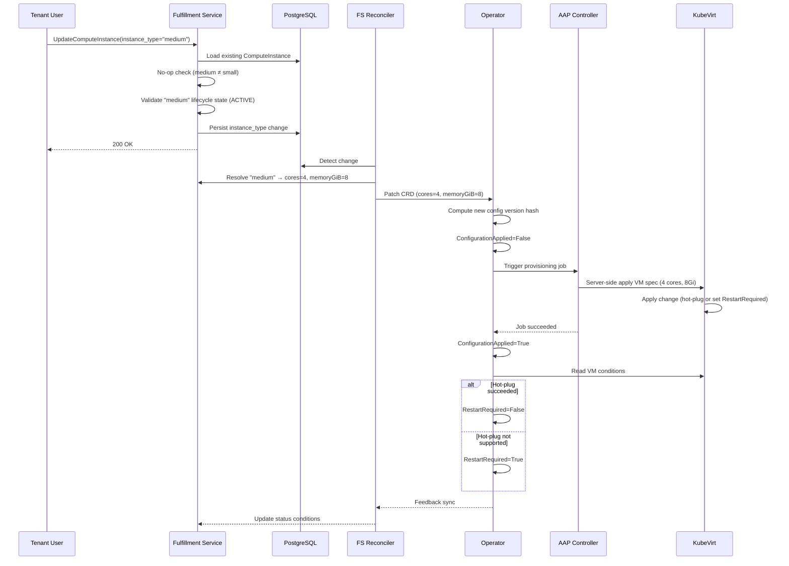

# VM Resize via InstanceType Selection

## Summary

This design enables Tenant Users and Tenant Admins to change a running
ComputeInstance's InstanceType through the existing Update RPC, allowing
CPU and memory scaling without VM recreation. The change propagates through
the existing fulfillment-service → osac-operator → AAP → KubeVirt pipeline
by lifting three layers of immutability (API validation, CRD CEL rules,
and CRD field constraints) and reusing the operator's config-version hash
mechanism for change detection and re-provisioning. Whether the resize
applies live or requires a VM restart depends on the KubeVirt deployment
configuration; when hot-plug is enabled, KubeVirt applies CPU/memory
changes via live migration to a new pod. See [PRD](prd.md) for detailed
requirements.

## Motivation

ComputeInstance CPU and memory are derived from a selected InstanceType —
tenants do not set cores or memory directly. This replaced the direct-value
model originally proposed in OSAC-39. Today, `instance_type` is immutable
after creation: the fulfillment-service rejects changes in Update, the
osac-operator CRD enforces `self == oldSelf` on `cores` and `memoryGiB`,
and the AAP playbook builds KubeVirt VM specs from these values.

When workload demands change, tenants must delete and recreate the
ComputeInstance with a different InstanceType. This loses IP addresses,
attached volumes, running state, and configuration — unnecessary disruption
for a change that KubeVirt can apply to a running VM.

The existing pipeline already supports spec-change-driven re-provisioning:
the operator hashes the CRD spec, detects hash changes, and triggers AAP
re-provisioning. The AAP playbook uses Ansible `apply: true` (server-side
apply), which patches existing KubeVirt VMs rather than only creating new
ones. KubeVirt surfaces a `RestartRequired` condition when hot-plug is not
supported for a given change, and the operator already mirrors this
condition back to the fulfillment-service. The infrastructure for resize
exists — it is blocked only by immutability constraints.

### Goals

- Reuse the existing ComputeInstance Update RPC — no new API endpoints or
  RPCs.
- Leverage the operator's config-version hash mechanism for change detection
  and re-provisioning trigger.
- Reuse the existing `RestartRequired` condition plumbing for hot-plug
  feedback.
- Apply the same InstanceType lifecycle-state validation (ACTIVE /
  DEPRECATED / OBSOLETE) to resize as to creation.
- Keep the InstanceType → cores/memoryGiB resolution boundary in the
  fulfillment-service reconciler — the operator receives concrete values.

### Non-Goals

- Disk resize — storage is unaffected by an InstanceType change.
- GPU resize — GPU immutability is retained.
- Quota enforcement on InstanceType changes.
- Automatic VM restart after resize — the user restarts manually when
  `RestartRequired` is set.
- Automatic scaling or auto-resize — InstanceType changes are explicit
  user actions only.
- Audit or tracking of InstanceType changes.

## Proposal

Three immutability constraints are lifted to enable InstanceType changes:

1. **fulfillment-service API validation** — remove `instance_type` from the
   `validateTemplateImmutability()` check and add resize-specific validation
   (no-op detection, lifecycle-state validation).

2. **osac-operator CRD** — remove the `self == oldSelf` CEL XValidation
   rules from `Cores` and `MemoryGiB` fields.

3. **CRD field constraints** — no additional changes needed. The AAP
   playbook already uses `apply: true` and the operator's config-version
   mechanism already triggers re-provisioning on spec changes.

No new CRDs, gRPC services, or Kubernetes controllers are introduced.

### Workflow Description

**Actor:** Tenant User (or Tenant Admin)

**Starting state:** A ComputeInstance exists with `instance_type` referencing
"small" (2 cores, 4 GiB memory).

**Resize flow:**



The diagram shows the end-to-end flow for a resize request. The Tenant User
interacts only with the fulfillment-service API; the reconciler, operator,
AAP, and KubeVirt handle propagation transparently. The critical path is:
API validation → persist → reconciler resolves InstanceType → operator
detects config change → AAP re-provisions → KubeVirt applies or signals
restart.

**Error paths:**

- **OBSOLETE target**: The API rejects the request with `FailedPrecondition`
  before persisting. No downstream effects.
- **DEPRECATED target**: The API persists the change and returns a
  deprecation warning (replacement InstanceType and obsolescence date). The
  resize proceeds normally.
- **Not found**: The API returns `InvalidArgument` if the target InstanceType
  does not exist.
- **GPU mismatch**: The API returns `FailedPrecondition` if the target
  InstanceType has a different GPU spec than the current one. GPU is
  immutable — this check prevents persisting a change the CRD would reject.
- **No-op (same InstanceType)**: The API returns success immediately. No
  change is persisted, no reconciliation triggered. The no-op check takes
  precedence over lifecycle validation — a request targeting the current
  InstanceType succeeds even when that InstanceType is DEPRECATED or
  OBSOLETE. [PRD: FR-4]

**State constraints:** Resize is allowed whenever Update is allowed. The
API does not restrict resize to RUNNING VMs — a stopped VM can also have
its InstanceType changed (the change applies on next start). The
declarative model applies: the user declares desired state, the system
converges. The operator's provisioning lifecycle handles spec changes
during any reconcilable state.

**Note on downsize:** The PRD explicitly states both increasing and
decreasing InstanceType selections are supported (clarification R1.Q1).
The Jira Feature description lists "downsizing running VMs" as out of
scope — the PRD (finalized through multiple review rounds) takes
precedence. The design supports both directions. OSAC does not manage
guest-level resource pressure — the user is responsible for ensuring the
target InstanceType is appropriate for their workload.

### API Extensions

**Modified gRPC services:**

- `ComputeInstances.Update` (fulfillment-service) — lifts the
  `instance_type` immutability constraint. The update mask
  `spec.instance_type` is accepted and processed.

**Modified proto messages:**

- `ComputeInstancesUpdateResponse` — add `repeated string warnings = 2`
  to match `ComputeInstancesCreateResponse`. Required to surface
  deprecation warnings when resizing to a DEPRECATED InstanceType.

**Modified CRDs:**

- `ComputeInstance` (osac-operator) — removes `self == oldSelf` CEL
  XValidation from `Cores` (int32) and `MemoryGiB` (int32) fields. These
  fields become mutable, allowing the reconciler to update them when the
  InstanceType changes. GPU immutability is retained.

**No new CRDs, webhooks, finalizers, or aggregated API servers.**

Operational impact: if the osac-operator controller is down during a resize,
the CRD update queues and reconciliation resumes when the controller
restarts. The config-version mechanism ensures the correct target state is
applied regardless of controller restarts.

## UX Alignment

No `osac-ux/libs/ui-components/src/api/v1/compute_instance*.ts` file exists.
UX alignment is not applicable for this EP.

### Implementation Details/Notes/Constraints

#### fulfillment-service: Lift Instance Type Immutability

In `private_compute_instances_server.go`, the `validateTemplateImmutability()`
function checks six fields for immutability. Remove `spec.instance_type`
from this check:

```go
// Before: instance_type blocked alongside template, catalog_item, etc.
// After: instance_type removed from the immutability check list.
// Fields that remain immutable: template, template_parameters, catalog_item,
// disk_image, auto_external_ip_attachment.
```

#### fulfillment-service: Add Resize Validation

Add a `validateInstanceTypeResize()` method to the Update path, called
after removing `instance_type` from immutability validation. This method
runs only when the update mask includes `spec.instance_type`:

1. **No-op check**: Compare `refKey(existingSpec.GetInstanceType())` with
   `refKey(newSpec.GetInstanceType())`. If equal, return nil (no-op — skip
   lifecycle validation). [PRD: FR-4]

2. **Lifecycle-state validation**: Call the existing shared
   `validateInstanceTypeState()` helper
   (`catalog_item_validation.go:340-384`). This returns:
   - `nil` for ACTIVE targets
   - A deprecation warning string for DEPRECATED targets
   - `FailedPrecondition` error for OBSOLETE targets
   - `NotFound` error for missing targets

   The Update handler translates `NotFound` to `InvalidArgument` before
   returning — the InstanceType is a reference field on the request, not
   the target resource of the RPC.

3. **GPU compatibility check**: Compare the current InstanceType's GPU spec
   with the target InstanceType's GPU spec. If they differ, return
   `FailedPrecondition` — GPU is immutable and the CRD's CEL rule would
   reject the change downstream. Validating at the API boundary prevents
   persisting a change that cannot be applied.

4. **Attach deprecation warning**: If `validateInstanceTypeState()` returns
   a warning, attach it to the Update response using the same mechanism as
   Create.

The Update handler flow becomes:

```go
func (s *PrivateComputeInstancesServer) Update(ctx, request) {
    // ... existing network validation ...
    s.validateTemplateImmutability(ctx, request)  // instance_type removed
    s.validateInstanceTypeResize(ctx, request)     // new: no-op + lifecycle
    s.validateNetworkAttachmentsImmutability(ctx, request)
    s.validateDiskImmutability(ctx, request)
    s.generic.Update(ctx, request, &response)
}
```

#### fulfillment-service: Reconciler — No Changes

The `addExplicitFields()` function in the ComputeInstance reconciler
(`computeinstance_reconciler_function.go:691`) already runs on every
reconcile cycle. It resolves the InstanceType reference by name, reads
`cores`, `memory_gib`, and `gpu` from the InstanceType spec, and sets
them on the CRD spec. When `instance_type` changes in the API, the
reconciler resolves the new values and patches the CRD — this propagation
is automatic with no code changes.

#### Rename `cores` → `vcpus` Across the Stack

The `cores` field is renamed to `vcpus` end-to-end. Each InstanceType vCPU
maps to one KubeVirt socket (see
[CPU Topology Change](#osac-aap-playbook--cpu-topology-change)), not a
physical core. The rename aligns the API and CRD with this semantic.

**InstanceType proto** (`instance_type_type.proto`): rename `cores` to
`vcpus` in `InstanceTypeSpec`. The proto field number is unchanged
(`int32 vcpus = 1`), preserving wire compatibility. Run
`uv run dev.py build protos && buf generate` in `fulfillment-service/`,
then `buf generate` in each consumer (`osac-operator/`,
`osac-metering/metering-service/`).

**CRD types** (`computeinstance_types.go`): rename `Cores int32
json:"cores"` to `VCPUs int32 json:"vcpus"` on `ComputeInstanceSpec`.
Regenerate via `make manifests generate && make helm-crds`.

**Reconciler** (`computeinstance_reconciler_function.go`): update
`spec.Cores = itSpec.GetCores()` to `spec.VCPUs = itSpec.GetVcpus()`.

**AAP playbook** (`create_validate.yaml`): read
`compute_instance.spec.vcpus` instead of `compute_instance.spec.cores`.
Rename the internal Ansible variable `vm_cpu_cores` to `vm_cpu_sockets`
— the value now maps to `cpu.sockets` in the KubeVirt VM spec, not
`cpu.cores`. Update references in `create_build_spec.yaml`,
`create_wait_annotate.yaml`, and `tests/test.yml`.

**CLI** (`describe_instancetype_cmd.go`, `create_instancetype_cmd.go`):
update flag names and display labels from `cores` to `vcpus`.

**Rendering tables** (`osac.private.v1.InstanceType.yaml`,
`osac.public.v1.InstanceType.yaml`): update column references from
`cores` to `vcpus`.

**Tests:**

- `computeinstance_types_test.go`: update `spec.Cores` references to
  `spec.VCPUs`.
- `computeinstance_validation_test.go`: replace the `"should reject
  changing cores"` and `"should reject changing memoryGiB"` tests with
  tests that verify VCPUs and memory updates are accepted. Retain the
  GPU immutability test. Update the `createValidInstance` fixture
  (`Cores:` → `VCPUs:`).
- `computeinstance_reconciler_function_test.go`: update `spec.Cores`
  assertions and `field.NewPath("spec", "cores")` error path references.
- `migrate_subnetrefs_test.go`: update `"cores"` key in the `ciSpec()`
  fixture map to `"vcpus"`.
- AAP role tests (`ocp_virt_vm/tests/test.yml`): update `spec.cores`
  references to `spec.vcpus` and `vm_cpu_cores` to `vm_cpu_sockets` in
  assertions and fail messages.
- CLI tests (`create_instancetype_cmd_test.go`,
  `describe_instancetype_cmd_test.go`): update flag and output
  references from `cores` to `vcpus`.
- Integration tests (`it_private_instance_types_test.go`,
  `it_public_instance_types_test.go`): update field references.

**Documentation:** update `fulfillment-service/docs/API.md` references
from `cores` to `vcpus` where they describe InstanceType fields or
ComputeInstance CRD spec. In `osac-docs/`, update the following guides:
- `guides/developer/instancetype-guide.md`: CLI flag names (`--cores` →
  `--vcpus`), JSON examples, field descriptions, and prose references.
- `guides/developer/computeinstance-guide.md`: InstanceType listing
  output description.
- `guides/developer/computeinstance-catalogitem-guide.md`: InstanceType
  description prose.
- `guides/developer/tenant-setup.md`: CRD spec example (`cores:` →
  `vcpus:`).

The `osac-docs/` changes are committed in a separate PR against that
repository.

This is a breaking change to both the InstanceType proto and the
ComputeInstance CRD schema. The proto field number is preserved so the
gRPC wire format is compatible, but the JSON field name changes. No
migration is needed — the project is pre-GA with no production data to
migrate.

#### osac-operator: CRD Field Mutability

Remove CEL XValidation immutability rules from two fields in
`computeinstance_types.go`:

```go
// Before:
// +kubebuilder:validation:XValidation:rule="self == oldSelf",message="cores is immutable"
Cores int32 `json:"cores"`

// +kubebuilder:validation:XValidation:rule="self == oldSelf",message="memoryGiB is immutable"
MemoryGiB int32 `json:"memoryGiB"`

// After: remove the XValidation annotations from both fields.
// Min/Max validation remains (Cores: 1-128, MemoryGiB: 1+).
```

GPU immutability is retained — enforced at the spec level:
```go
// +kubebuilder:validation:XValidation:rule="has(self.gpu) == has(oldSelf.gpu) && ..."
```

#### osac-operator: Controller — No Changes

The config-version mechanism already handles spec changes:

1. `handleDesiredConfigVersion()` computes `ComputeDesiredConfigVersion(instance.Spec)`
   using FNV-64a hash of the JSON-marshaled spec.
2. When `Cores` or `MemoryGiB` change, the hash changes.
3. `IsConfigApplied()` returns false, triggering
   `RunProvisioningLifecycle()`.
4. AAP re-provisions with the updated spec.
5. On success, `ConfigurationApplied` is set to True.

The `RestartRequired` condition sync
(`computeinstance_controller.go:804-809`) already mirrors KubeVirt's
`VirtualMachineRestartRequired` condition. When KubeVirt sets this
condition (because hot-plug is not supported for the change), the
operator syncs it to the ComputeInstance CRD, and the feedback controller
propagates it to the fulfillment-service.

#### osac-aap: Playbook — CPU Topology Change

The AAP create playbook (`playbook_osac_create_compute_instance.yml`) uses
`kubernetes.core.k8s` with `apply: true`, which performs a Kubernetes
server-side apply. This already handles updates — it patches the existing
KubeVirt VirtualMachine if one exists with the same name. No separate
update playbook is needed. The provisioning lifecycle re-runs the create
playbook for spec changes, which works because of server-side apply
semantics.

**CPU topology mapping:** KubeVirt CPU hot-plug operates on **sockets**,
not cores. The total vCPU count is `sockets × cores × threads`. Changing
the `cores` field is a topology change that always requires a restart,
regardless of hot-plug configuration.

The current playbook (`create_build_spec.yaml`) maps `vm_cpu_cores`
directly to `cpu.cores` (Linux) or to `cpu.cores` with `sockets: 1,
threads: 1` (Windows). To enable live CPU resize, the topology must
express the InstanceType's core count as sockets:

```yaml
# Before (Linux):
cpu:
  cores: "{{ vm_cpu_cores }}"

# After (both Linux and Windows):
cpu:
  sockets: "{{ vm_cpu_cores }}"
  cores: 1
  threads: 1
```

This maps each InstanceType vCPU to one socket, making CPU changes a
socket count change — the path KubeVirt can hot-plug. The total vCPU
count is unchanged (`N × 1 × 1 = N`).

Both increase (e.g., 2→4 sockets) and decrease (e.g., 4→2 sockets) use
the same mapping. When live update is unavailable (single-node cluster,
GPU passthrough, hot-plug not configured), KubeVirt sets
`VirtualMachineRestartRequired` and the osac-operator mirrors it to the
ComputeInstance status.

#### KubeVirt Hot-Plug Behavior

Whether CPU and memory changes apply live (hot-plug) or require a VM
restart depends on two factors: the KubeVirt CR configuration and the
cluster topology.

- **Without hot-plug configuration** (current OSAC default): KubeVirt
  accepts the spec change but sets the `VirtualMachineRestartRequired`
  condition. The VM continues running with old resources until the user
  restarts it.
- **With hot-plug enabled**: KubeVirt applies CPU/memory changes by
  live-migrating the VM to a new pod with updated resource limits. This
  requires a multi-node cluster — KubeVirt inserts a `podAntiAffinity`
  rule that prevents scheduling the migration target on the same node.
  Single-node clusters always fall back to `RestartRequired`.

**VM eligibility:** Even with hot-plug enabled on a multi-node cluster,
live migration is not available for every VM. VM-level factors that
prevent migration include: PCI passthrough devices (e.g., GPU), local
non-migratable storage, and host-model CPU pinning. VMs that are
ineligible for live migration fall back to `RestartRequired` — the same
path as a cluster without hot-plug. No special handling is needed; the
operator syncs KubeVirt's `VirtualMachineRestartRequired` condition
regardless of the reason.

[PRD: FR-5, FR-6]

#### osac-installer: Hot-Plug Enablement

The OSAC installer already owns the KubeVirt CR setup
(`osac-installer/charts/osac-devstack/files/install-virt.sh`). It applies
the stock `kubevirt-cr.yaml` and patches in the `l2bridge` network binding.
To enable hot-plug for resize, add a KubeVirt CR patch in `install-virt.sh`
after the existing l2bridge patch:

```yaml
spec:
  configuration:
    vmRolloutStrategy: "LiveUpdate"
  workloadUpdateStrategy:
    workloadUpdateMethods:
      - LiveMigrate
```

- `vmRolloutStrategy: LiveUpdate` — propagates VM spec changes to the
  running VMI without requiring a restart.
- `workloadUpdateMethods: [LiveMigrate]` — triggers automatic live
  migration when a spec change requires a new pod.

No per-VM template changes are needed — `maxSockets` and `maxGuest`
default to sensible values when not set (e.g., `maxSockets` defaults to
4× the initial socket count).

On single-node clusters (including the Kind dev environment), hot-plug
is unavailable regardless of this configuration — KubeVirt requires a
migration target on a different node. The resize still works but always
sets `RestartRequired`.

### Security Considerations

This feature inherits the existing security model without changes:

- **Authorization**: Tenant Users and Tenant Admins already have
  `ComputeInstances/Update` permission via OPA policies
  (`authz.rego`). No new permissions are needed — resize uses the
  existing Update RPC.
- **Tenant isolation**: The Update path validates that network references
  belong to the caller's tenant. InstanceType lookup uses the same
  globally-scoped resolution as Create (InstanceTypes are global, visible
  to all organizations). No cross-tenant data exposure is introduced.
- **Input validation**: The target InstanceType is validated via the
  existing `validateInstanceTypeState()` helper — the same validation
  applied during Create. Invalid or incompatible targets are rejected
  before persisting.

### Failure Handling and Recovery

| Failure Mode | Behavior | User Observation |
|---|---|---|
| **InstanceType not found** | API returns `InvalidArgument` before persist | Immediate error; no state change |
| **OBSOLETE InstanceType** | API returns `FailedPrecondition` before persist | Immediate error; no state change |
| **DB write failure** | API returns internal error; no downstream effects | Retry the request |
| **Reconciler fails to resolve InstanceType** | Reconciler retries on next cycle; CRD not updated | ComputeInstance shows stale spec; `ConfigurationApplied` remains True (no CRD change yet) |
| **CRD patch failure** | Reconciler retries on next cycle | Same as above |
| **AAP job failure** | Operator retries provisioning; `ConfigurationApplied` stays False | ComputeInstance status shows `ConfigurationApplied=False`; VM continues running with previous resources |
| **KubeVirt apply failure** | AAP job reports failure; operator retries | Same as AAP failure |
| **Controller restart mid-resize** | Controller re-reads CRD state on startup; config-version hash is recomputed; pending re-provisioning resumes | Transparent to user; resize may take longer |
| **Concurrent resize requests** | Each Update overwrites `instance_type` in the DB; reconciler resolves the latest value; operator's config-version hash reflects the final spec | The last-write-wins; intermediate InstanceType changes may not be provisioned if superseded before reconciliation |
| **Live migration failure during hot-plug** | KubeVirt cannot migrate the VM (e.g., single-node cluster, insufficient resources on target node) | `RestartRequired` is set; the user restarts the VM manually to apply the change |

All operations are idempotent. The config-version mechanism ensures
convergence to the desired state regardless of intermediate failures or
restarts.

### RBAC / Tenancy

No RBAC or tenancy changes required. The existing `ComputeInstances/Update`
permission covers resize. Tenant isolation is enforced by the existing
Update path validation. InstanceTypes are globally scoped (visible to all
organizations per the InstanceType contract), so no tenant filtering is
applied to the lookup.

### Observability and Monitoring

No new observability changes. Existing monitoring mechanisms apply:

- The `ConfigurationApplied` condition transitions (True → False → True)
  are already observable via the ComputeInstance status.
- AAP job creation and completion are already logged and tracked via
  `provisioningJobs` in the CRD status.
- The `RestartRequired` condition is already surfaced in the ComputeInstance
  status.

### Risks and Mitigations

| Risk | Impact | Mitigation |
|---|---|---|
| **Memory pressure on downsize** | Selecting a smaller InstanceType while the VM uses more memory than the target allows may cause OOM or instability inside the guest | OSAC does not manage guest-level resource pressure. This is the same risk as under-provisioning at creation time. Document that the user is responsible for ensuring the target InstanceType is appropriate for their workload. |
| **AAP job contention** | Rapid successive resize requests could queue multiple AAP jobs | The config-version mechanism coalesces changes — only the final spec state triggers provisioning. An in-flight job that completes with a stale config version triggers a new job with the current spec. |
| **CRD immutability removal is broad** | Removing `self == oldSelf` from `Cores`/`MemoryGiB` allows any controller or admin with CRD write access to change these fields, not just the fulfillment-service reconciler | The CRD is an internal API surface — tenant access is mediated through the fulfillment-service. RBAC on the CRD restricts write access to the osac-operator service account and cluster admins. |
| **Hot-plug depends on multi-node cluster** | Single-node deployments cannot live-migrate, so hot-plug is unavailable and all resizes require a restart | Document the multi-node requirement for live resize. Single-node deployments still support resize via the restart path. |

### Drawbacks

Lifting `Cores`/`MemoryGiB` immutability on the CRD removes a safety
net that previously prevented accidental spec drift. Any controller bug
that inadvertently modifies these fields would now be accepted by the
API server rather than rejected by CEL validation. This trade-off is
justified because resize is a core user need, the CRD is an internal
API surface (not tenant-facing), and the config-version mechanism
provides auditability of spec changes.

Hot-plug requires live migration, which requires a multi-node cluster.
Single-node deployments (including the Kind dev environment) always
require a restart for resize. This is a KubeVirt constraint — OSAC
enables the configuration but cannot change the migration requirement.

## Interface Changes

### IC-1: UpdateComputeInstance accepts instance_type changes

**Requirements:** FR-1, FR-2

The existing `ComputeInstances.Update` RPC accepts `spec.instance_type`
in the update mask. When the target InstanceType differs from the current
value, the change is persisted and propagated through the reconciliation
pipeline. Both increasing and decreasing InstanceType selections are
supported — the API does not restrict the direction of change. See
[API Extensions](#api-extensions) for the modified RPC and
[Implementation Details](#implementation-detailsnotesconstraints) for
the validation flow.

### IC-2: Lifecycle-state validation on resize targets

**Requirements:** FR-3

Resize targets follow the same lifecycle-state validation as VM creation:
ACTIVE targets succeed, DEPRECATED targets succeed with a deprecation
warning (including replacement InstanceType and obsolescence date), and
OBSOLETE targets are rejected with `FailedPrecondition`. The validation
uses the existing `validateInstanceTypeState()` shared helper. See
[Implementation Details](#implementation-detailsnotesconstraints) for
the validation sequence.

### IC-3: No-op detection for same InstanceType

**Requirements:** FR-4

A resize request targeting the ComputeInstance's current InstanceType is a
no-op. The API returns success immediately without persisting a change or
triggering reconciliation. The no-op check takes precedence over
lifecycle-state validation — a request targeting the current InstanceType
succeeds even when that InstanceType is DEPRECATED or OBSOLETE.

### IC-4: RestartRequired condition on resize

**Requirements:** FR-5, FR-6

When a resize requires a VM restart (the KubeVirt deployment does not
support hot-plug for the change), the `RestartRequired` condition is set
to True on the ComputeInstance status. This uses the existing condition
plumbing — the osac-operator mirrors KubeVirt's
`VirtualMachineRestartRequired` condition, and the feedback controller
syncs it to the fulfillment-service. The user restarts the VM manually
via the existing `restart_requested_at` mechanism. See
[Implementation Details](#implementation-detailsnotesconstraints) for
the KubeVirt hot-plug behavior.

## Alternatives (Not Implemented)

### Alternative 1: Dedicated Resize RPC

Add a new `ResizeComputeInstance` or `ChangeInstanceType` RPC to the
ComputeInstances service.

- **Pros:** Cleaner separation of concerns; can add resize-specific fields
  (e.g., force flag, scheduling hints) without affecting the general Update
  RPC.
- **Cons:** Duplicates the existing Update pattern; all other mutable field
  changes (`run_strategy`, `restart_requested_at`, `security_groups`) use
  the Update RPC. Adds API surface and OPA policy entries. Inconsistent
  with the declarative "desired state via Update" model.
- **Rejection:** An InstanceType change is a spec update, not a distinct
  operation. The existing Update RPC, validation framework, and
  reconciliation pipeline handle it without modification beyond lifting
  the immutability constraint.

### Alternative 2: InstanceType Field on CRD

Add an `instanceType` field to the osac-operator CRD instead of the
current model where the fulfillment-service reconciler resolves
InstanceType → concrete `cores`/`memoryGiB` values.

- **Pros:** CRD is self-descriptive — the operator knows which InstanceType
  is selected, not just the derived values.
- **Cons:** Requires the operator to access InstanceType data (either via
  the fulfillment-service API or a local copy), breaking the current
  boundary where InstanceType is an API-level concept. Adds coupling between
  the operator and the fulfillment-service's data model.
- **Rejection:** The current boundary is clean and well-established. The
  operator operates on concrete compute values; the fulfillment-service
  owns InstanceType resolution. Resize does not require changing this
  boundary.

### Alternative 3: Do Nothing

Leave `instance_type` immutable and require VM recreation for compute
changes.

- **Pros:** No changes, no risk.
- **Cons:** Tenants lose IP addresses, attached volumes, running state, and
  configuration on every compute change. Unnecessary downtime and disruption.
- **Rejection:** This is the problem the PRD describes.

## Open Questions

### ~~9.1 Should OSAC configure KubeVirt's hot-plug feature gates?~~

Resolved: yes. The OSAC installer already owns the KubeVirt CR setup
(`install-virt.sh`). Hot-plug enablement is a KubeVirt CR patch
(`vmRolloutStrategy: LiveUpdate` + `workloadUpdateMethods: [LiveMigrate]`)
added alongside the existing l2bridge patch. No per-VM template changes
needed. See [Hot-Plug Enablement](#osac-installer-hot-plug-enablement).

### ~~9.2 Should resize of stopped VMs be explicitly documented?~~

Resolved: yes, stopped-VM resize is in scope. The Update RPC does not
restrict by VM state — resize works in any updateable state. A stopped
VM's resize applies on next start with no hot-plug concern. The PRD user
stories reference "running VM" resize as the primary scenario, not as an
exclusion.

## Test Plan

### Unit Tests

- `validateInstanceTypeResize()` rejects OBSOLETE targets with
  `FailedPrecondition`
- `validateInstanceTypeResize()` returns a deprecation warning for
  DEPRECATED targets
- `validateInstanceTypeResize()` passes for ACTIVE targets
- `validateInstanceTypeResize()` returns nil (no-op) when target equals
  current InstanceType
- No-op check takes precedence over lifecycle validation: same InstanceType
  that is OBSOLETE returns nil
- `validateInstanceTypeResize()` rejects target InstanceType with different
  GPU spec with `FailedPrecondition`
- `validateInstanceTypeResize()` allows target InstanceType with same GPU
  spec (GPU unchanged, only cores/memory differ)
- `validateTemplateImmutability()` no longer blocks `spec.instance_type`
  changes
- `validateTemplateImmutability()` still blocks changes to `template`,
  `template_parameters`, `catalog_item`, `disk_image`,
  `auto_external_ip_attachment`

### Integration Tests

- Update a ComputeInstance's `instance_type` via the private gRPC server and
  verify the change is persisted
- Verify the reconciler resolves the new InstanceType and patches the CRD
  with updated `cores` and `memoryGiB`
- Verify the operator detects the config-version change and triggers
  re-provisioning
- Verify `ConfigurationApplied` transitions: True → False (spec change
  detected) → True (provisioning complete)
- Verify `RestartRequired` condition is mirrored when KubeVirt sets it
- CRD accepts updated `cores` and `memoryGiB` values (XValidation removed)
- CRD still rejects GPU changes (XValidation retained)

### E2E Tests

Resize is a feature-specific operation, not a core lifecycle path. These
tests belong in the regression suite, not sanity.

- Create a ComputeInstance with InstanceType "A", resize to InstanceType
  "B", verify the VM's CPU and memory reflect InstanceType "B"
- Resize to a DEPRECATED InstanceType — verify success with deprecation
  warning
- Resize to an OBSOLETE InstanceType — verify rejection
- Resize to the current InstanceType — verify no-op (no state change, no
  re-provisioning)
- Resize a STOPPED ComputeInstance — verify the change applies on next start
- Verify the KubeVirt VM uses the socket-based CPU topology
  (`sockets: N, cores: 1, threads: 1`)
- (Single-node automated) Increase a running ComputeInstance's InstanceType
  (e.g., 2→4 vCPUs) — verify `RestartRequired` is set (hot-plug unavailable
  on single node), restart the VM, verify new resources apply
- (Single-node automated) Decrease a running ComputeInstance's InstanceType
  (e.g., 4→2 vCPUs) — verify `RestartRequired` is set, restart the VM,
  verify new resources apply
- (Multi-node manual) Increase a running ComputeInstance's InstanceType on
  a cluster with hot-plug enabled (`vmRolloutStrategy: LiveUpdate`,
  `workloadUpdateMethods: [LiveMigrate]`) — verify the VM live-migrates
  to a new pod and the new CPU/memory apply without user-initiated restart.
  After migration completes, verify the VMI status
  (`status.currentCPUTopology`) reflects the target resources, not just
  the VM spec
- (Multi-node manual) Decrease a running ComputeInstance's InstanceType on
  a cluster with hot-plug enabled — verify the VM live-migrates and the
  reduced CPU/memory apply without user-initiated restart. Verify VMI
  status reflects the reduced resources after migration completes

## Graduation Criteria

Graduation criteria will be defined when targeting a release. Expected
stages: Dev Preview → Tech Preview → GA based on production deployment
feedback.

## Upgrade / Downgrade Strategy

**Upgrade:** The CRD schema change (removing `self == oldSelf` from `Cores`
and `MemoryGiB`) is applied via `make manifests` and CRD reapply. The
KubeVirt CR patch for hot-plug enablement is applied by the installer.
Existing ComputeInstances are unaffected — their specs do not change. The
fulfillment-service code change (lifting immutability) deploys with the
normal release cycle.

**Downgrade:** Reverting the CRD restores immutability on `Cores` and
`MemoryGiB`. Any ComputeInstance whose spec was modified during the
upgrade window retains its current values — the CRD validation only
prevents future changes, not existing state. Reverting the
fulfillment-service restores the `instance_type` immutability check.
ComputeInstances resized during the upgrade window keep their new
InstanceType.

## Version Skew Strategy

The fulfillment-service and osac-operator can be deployed independently.
During version skew:

- **New fulfillment-service, old operator:** The API accepts
  `instance_type` changes and the reconciler resolves new
  `cores`/`memoryGiB` values, but the old CRD rejects the update
  (`self == oldSelf`). The reconciler logs the rejection and retries.
  No data loss — the API-level change is persisted, and reconciliation
  succeeds once the operator is updated.

- **Old fulfillment-service, new operator:** The API rejects
  `instance_type` changes (`InvalidArgument`). The new CRD accepts
  `cores`/`memoryGiB` changes but none are attempted because the API
  blocks them. No impact.

**Recommended deployment order:** osac-operator CRD first (to accept the
new values), then fulfillment-service (to allow the changes).

## Support Procedures

**Detecting issues:**

- A resize that does not complete: check the `ConfigurationApplied`
  condition on the ComputeInstance CRD. If False, check the
  `provisioningJobs` status for AAP job failures.
- A VM running with old resources after resize: check the
  `RestartRequired` condition. If True, the user needs to restart the VM.
- Reconciler failing to resolve InstanceType: check fulfillment-service
  reconciler logs for InstanceType lookup errors.

**Disabling the feature:**

- Restore the `instance_type` immutability check in
  `validateTemplateImmutability()`. This immediately prevents new resize
  requests. Existing VMs that have been resized are unaffected — they
  continue running with their current InstanceType.

**Recovery:**

- If a resize leaves a VM in a broken state, the user can resize back to
  the previous InstanceType (if ACTIVE or DEPRECATED) or restart the VM.
  The declarative model ensures convergence to the desired state.

### Documentation

The following documentation deliverables are required: [PRD: NFR-2]

- **API reference**: Update the ComputeInstance Update RPC documentation in
  `fulfillment-service/docs/API.md` to reflect that `instance_type` is
  mutable. Document the lifecycle-state validation rules, no-op behavior,
  and deprecation warnings.
- **User guide**: Document the resize workflow for Tenant Users/Admins —
  how to change InstanceType, how to interpret `RestartRequired`, and how
  to restart the VM after resize.
- **Deployment guide**: Document the KubeVirt hot-plug configuration
  requirements for infrastructure admins — which feature gates enable
  live resize vs. restart-required behavior.

## Infrastructure Needed

None.
